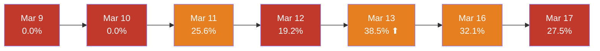
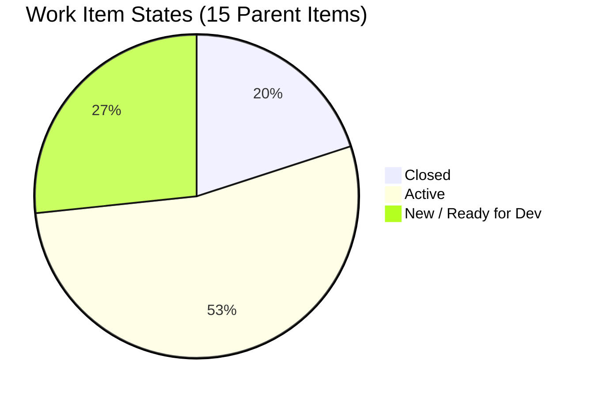
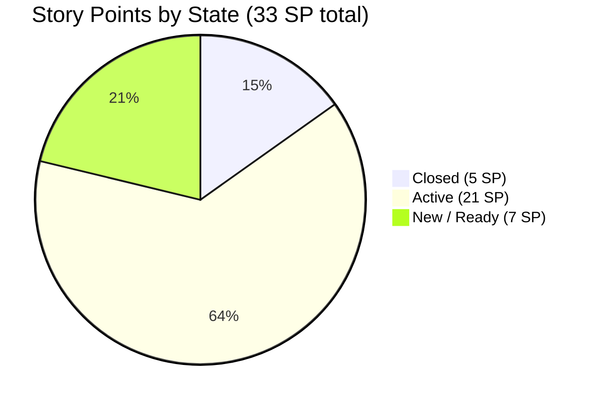
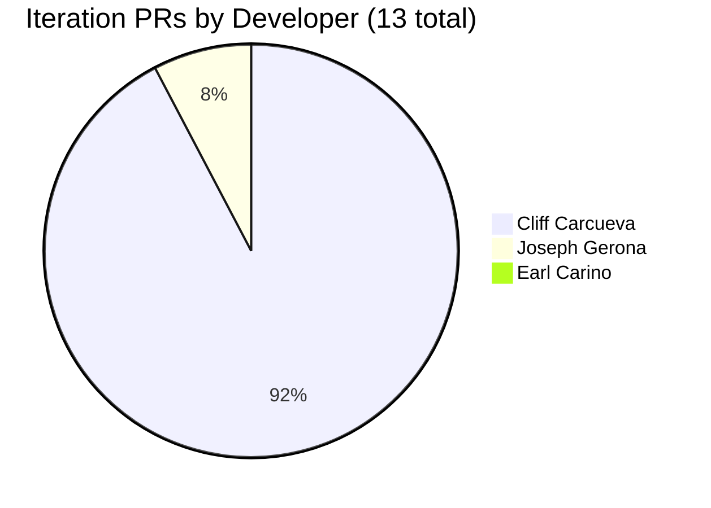
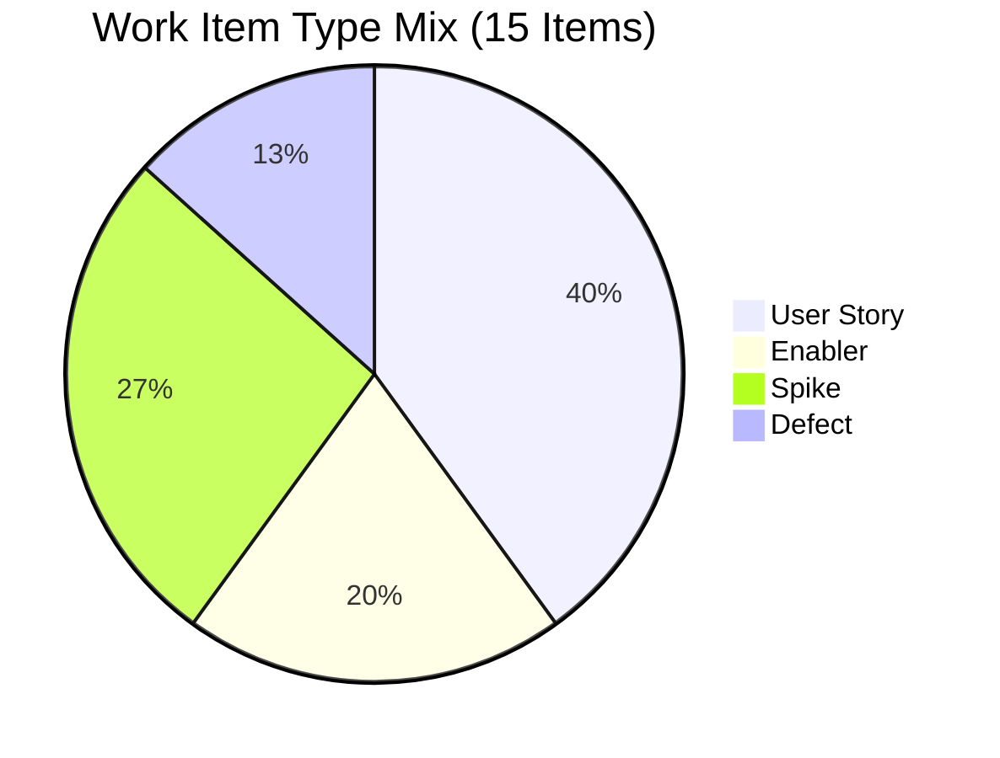
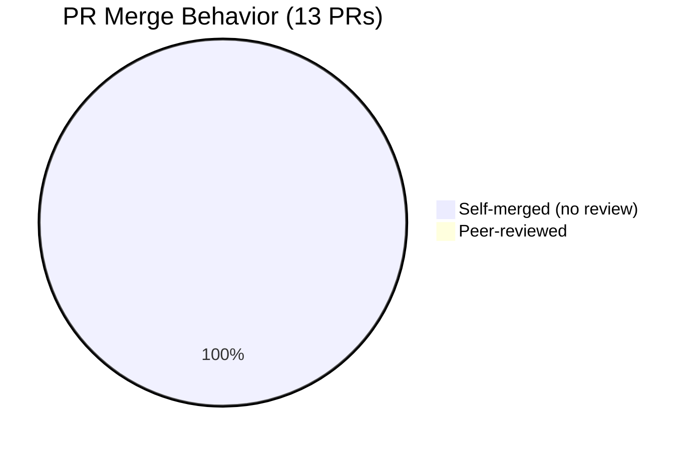

# Iteration Audit Report — Iteration 6.5

> **Audit Date:** March 17, 2026 — Day 9 of 14 (Working Day 7 of 10)
> **Auditor:** Engineering Productivity Audit System
> **Prepared for:** Ramon Aseniero Jr., Project Owner
> **Audit Angles:** (1) GitHub Developer Productivity, (2) SAFe Compliance

---

## 1. Audit Metadata

| Parameter | Value |
|-----------|-------|
| **ADO Organization** | `jairo` (`dev.azure.com/jairo`) |
| **ADO Project** | Auto Allies |
| **ADO Project ID** | `2d7af571-6ef6-4ad0-a509-c440e008b0fb` |
| **ADO Team** | AA Development Team |
| **ADO Team ID** | `330e6bf1-3515-443c-a2d8-b84f46c38f57` |
| **ADO Team Board URL** | [Stories and Deliverables](https://dev.azure.com/jairo/Auto%20Allies/_boards/board/t/AA%20Development%20Team/Stories%20and%20Deliverables) |
| **Backlog** | Stories and Deliverables (`Microsoft.RequirementCategory`) |
| **Iteration** | Iteration 6.5 |
| **Iteration Dates** | March 9, 2026 – March 22, 2026 (14 calendar days / 10 working days) |
| **GitHub Repo — Frontend** | `jairosoft-com/autoallies-version2` |
| **GitHub Repo — Backend** | `jairosoft-com/autoallies-api-core` |
| **Scope Note** | No other ADO boards, teams, projects, or GitHub repositories were analyzed |

---

## 2. Executive Summary

This audit examines **Iteration 6.5** from two angles: **GitHub developer productivity** and **SAFe compliance** for the AA Development Team's scoped backlog. At **Day 9 of 14** (Working Day 7 of 10), the iteration is significantly behind on both fronts.

**Developer Productivity:** The team committed 26 SP across 11 parent items at sprint start but has completed only 5 SP (3 items). Mid-sprint scope creep added 4 items / 7 SP, expanding total scope to 15 items / 33 SP. All 13 iteration PRs were self-merged with zero code reviews. ADO-GitHub traceability is 0%.

**SAFe Compliance:** The iteration shows systemic planning and execution failures. Capacity-based planning is present but scope exceeds demonstrable throughput. WIP is uncontrolled — 8 items sit in Active with no closures in 2 working days. Scope was not frozen at sprint start (4 injections). State hygiene is poor with items in `New` and `Ready for Dev` states that should not exist in an active iteration at Day 9. Definition of Ready gaps are visible: 2 items lack story point estimates and unassigned items exist. Built-in quality controls (reviews, branch protection, traceability) are entirely absent.

### Key Performance Indicators

| KPI | Value | Status | Classification |
|-----|-------|--------|----------------|
| Sprint Velocity (completed) | **5 SP** | 🔴 LOW | Developer Productivity |
| Commit-to-Done Ratio | **19.2%** | 🔴 CRITICAL | SAFe Compliance |
| Sprint Goal Probability (today) | **27.5%** | 🔴 AT RISK | Cross-cutting |
| Completion Rate (items) | **20%** (3 of 15) | 🟡 BEHIND | Developer Productivity |
| Completion Rate (SP) | **15.2%** (5 of 33) | 🟡 BEHIND | Developer Productivity |
| Iteration PRs (merged) | **13** (12 Cliff, 1 Joseph) | — | Developer Productivity |
| Code Reviews Performed | **0** | 🔴 CRITICAL | Cross-cutting |
| ADO-GitHub Traceability | **0%** | 🔴 CRITICAL | Cross-cutting |
| Branch Protection | **None** | 🔴 CRITICAL | Developer Productivity |
| SAFe Compliance Score | **22 / 100** | 🔴 CRITICAL | SAFe Compliance |

### Finding Trend (vs Day 8 audit, March 16)

| Signal | Mar 16 (Day 8) | Mar 17 (Day 9) | Change |
|--------|----------------|----------------|--------|
| Completed SP | 5 | 5 | → Unchanged |
| PRs merged (iteration) | 10 | 13 | ⬆ +3 PRs today |
| Sprint Goal Probability | 32.1% | 27.5% | ⬇ Decaying |
| Commit-to-Done Ratio | 19.2% | 19.2% | → Unchanged |

---

## 3. Iteration Scope and Methodology

### Scope

This audit examines **Iteration 6.5** of the **AA Development Team** within the **Auto Allies** project. The iteration runs from **March 9 to March 22, 2026**. Evidence is drawn exclusively from:

- ADO work items assigned to the `AA Development Team` on the `Stories and Deliverables` backlog for this iteration
- GitHub activity in `jairosoft-com/autoallies-version2` (Frontend, Next.js/TypeScript) and `jairosoft-com/autoallies-api-core` (Backend, Laravel/PHP)
- GitHub evidence is filtered to the iteration date window (March 9–22)

### Methodology

1. Resolved the active iteration via the ADO team settings API
2. Pulled all parent work items and child tasks for the iteration backlog
3. Retrieved story points, states, and revision history (closure dates) from ADO
4. Retrieved team capacity and days-off configuration from ADO
5. Collected all PRs, commits, and branch data from both GitHub repos
6. Correlated GitHub activity to ADO work items using branch names, PR titles, and commit messages
7. Computed Sprint Velocity, Commit-to-Done Ratio, and Sprint Goal Probability using ADO revision data
8. Assessed SAFe compliance using scoped ADO iteration data: planning discipline, Definition of Ready, capacity, WIP, scope stability, state hygiene, DoD, and traceability
9. Produced findings only from observable evidence; every SAFe finding is grounded in ADO and GitHub data

---

## 4. Sprint Goal Probability Analysis

**Classification:** Cross-cutting

Sprint Goal Probability uses a **linear projection model**. On each working day, cumulative completed SP divided by elapsed working days produces an average daily velocity, which is projected across remaining working days.

**Formula:**

- `Projected SP at End = Completed + (Avg Daily Velocity × Remaining Working Days)`
- `Sprint Goal Probability = min(100%, Projected / Committed × 100)`
- `Committed at Start = 26 SP` (excluding 7 SP added mid-sprint)

### Daily Sprint Goal Probability

| Date | WD | Cumulative SP Done | Remaining SP | Avg Velocity (SP/day) | Projected SP at End | Probability | Event |
|------|----|--------------------|--------------|----------------------|---------------------|-------------|-------|
| Mar 9 (Mon) | 1 | 0 | 26 | 0.00 | 0.0 | **0.0%** | Sprint start |
| Mar 10 (Tue) | 2 | 0 | 26 | 0.00 | 0.0 | **0.0%** | — |
| Mar 11 (Wed) | 3 | 2 | 24 | 0.67 | 6.7 | **25.6%** | #200181 closed (+2 SP) |
| Mar 12 (Thu) | 4 | 2 | 24 | 0.50 | 5.0 | **19.2%** | — |
| Mar 13 (Fri) | 5 | 5 | 21 | 1.00 | 10.0 | **38.5%** ⬆ Peak | #194650 (+1), #194731 (+2) closed |
| Mar 16 (Mon) | 6 | 5 | 21 | 0.83 | 8.3 | **32.1%** | No closures |
| **Mar 17 (Tue)** | **7** | **5** | **21** | **0.71** | **7.1** | **27.5%** | **Today — no closures** |

### Probability Trend Visualization

**Interpretation:** The team's best probability was **38.5%** on Friday March 13 after closing 3 SP in one day. Since then, no items have closed and the probability has decayed. To meet the original 26 SP commitment, the team needs **7.0 SP/day** across the final 3 working days — roughly **10x** their current average of 0.71 SP/day.

---

## 5. Commit-to-Done Ratio

**Classification:** SAFe Compliance

The **Commit-to-Done Ratio** (Commitment Reliability) measures the team's ability to deliver what they promised at sprint start.

**Formula:** `(Story Points Completed / Story Points Committed at Start) × 100`

| Component | Value |
|-----------|-------|
| SP Committed at Start | **26 SP** (across 11 original parent items) |
| SP Added Mid-Sprint | **7 SP** (4 items: #200187, #201012, #200839, #200873) |
| SP Completed | **5 SP** (#194650: 1, #194731: 2, #200181: 2) |
| **Commit-to-Done Ratio** | **19.2%** 🔴 CRITICAL |

**Benchmark:** High-performing teams consistently achieve 70–90%. A ratio below 70% indicates poor planning, scope creep, or unrealistic commitments. At 19.2%, this team exhibits all three signals.

---

## 6. Iteration Work Items

### 6.1 Parent Items (Stories and Deliverables Backlog)

15 parent items are assigned to this iteration. Items marked with `*` were added after sprint start.

| ID | Title | Type | State | SP | Owner |
|----|-------|------|-------|----|-------|
| 194650 | Employee Login and Logout | User Story | ✅ Closed | 1 | Earl Carino |
| 194731 | Attorney Payout Settings | User Story | ✅ Closed | 2 | Cliff Carcueva |
| 200181 | Stripe Migration V2 Product | Enabler | ✅ Closed | 2 | Earl Carino |
| 200617 | Member Messaging | User Story | 🔵 Active | 3 | Cliff Carcueva |
| 194730 | Attorney Messaging | User Story | 🔵 Active | 3 | Cliff Carcueva |
| 198359 | Owner Case List | User Story | 🔵 Active | 5 | Joseph Gerona |
| 198360 | Owner View Cases / Messaging | User Story | 🔵 Active | 3 | Joseph Gerona |
| 200182 | Users Migration | Enabler | 🔵 Active | 5 | Earl Carino |
| 200780 | Network Solutions Transfer | Spike | 🔵 Active | 1 | Earl Carino |
| 200378 | Support and Meetings — Joseph | Spike | 🔵 Active | — | Joseph Gerona |
| 200839* | V1 Ops Assistance — DB Update | Spike | 🔵 Active | 1 | Earl Carino |
| 200187* | Membership Migration Stripe | Enabler | ⚪ New | 5 | Earl Carino |
| 200773 | Reset Password Email Defect | Defect | ⚪ Ready for Dev | 1 | Earl Carino |
| 201012* | Members Renewal Duplicate Payment | Defect | ⚪ New | — | — |
| 200873* | Ops Support Effort | Spike | ⚪ New | 1 | — |

### 6.2 State Distribution

### 6.3 Story Points Distribution

---

## 7. Closure Timeline

| Closed Date | ID | Title | SP | Closed By |
|-------------|-----|-------|-----|-----------|
| Mar 11 (WD 3) | #200181 | Stripe Migration V2 Product | 2 | Earl Carino |
| Mar 13 (WD 5) | #194650 | Employee Login and Logout | 1 | Cliff Carcueva |
| Mar 13 (WD 5) | #194731 | Attorney Payout Settings | 2 | Cliff Carcueva |

**Gap since last closure:** 2 working days (Mar 16–17) with no parent items transitioning to Closed.

---

## 8. Developer Productivity Findings

**Classification:** Developer Productivity

### 8.1 GitHub User Mapping

| GitHub Handle | Name | Role |
|---------------|------|------|
| ccarcuevajairo | Cliff Carcueva | Developer |
| ecarinoJS | Earl Carino | Developer |
| JosephJairo | Joseph Gerona | Developer |
| RodenCole | Roden Cole | Deployment |

### 8.2 Iteration PR Activity (March 9–17)

#### Frontend — `autoallies-version2`

| PR # | Title | Author | Created | Merged | Reviewers |
|------|-------|--------|---------|--------|-----------|
| 65 | Feature/member attorney cases | JosephJairo | Mar 9 | Mar 9 | 0 |
| 66 | Feature/messaging | ccarcuevajairo | Mar 11 | Mar 11 | 0 |
| 67 | SocketManager enhancement | ccarcuevajairo | Mar 12 | Mar 12 | 0 |
| 68 | Feature/messaging cliff | ccarcuevajairo | Mar 13 | Mar 13 | 0 |
| 69 | Feature/messaging cliff | ccarcuevajairo | Mar 13 | Mar 13 | 0 |
| 70 | Payout settings API + UI | ccarcuevajairo | Mar 13 | Mar 13 | 0 |
| 71 | Feature/payout settings | ccarcuevajairo | Mar 13 | Mar 13 | 0 |
| 72 | SVG icon + ticket API types | ccarcuevajairo | Mar 17 | Mar 17 | 0 |
| 73 | Feature/messaging cliff 2 | ccarcuevajairo | Mar 17 | Mar 17 | 0 |

**Frontend total: 9 PRs** (8 Cliff, 1 Joseph)

#### Backend — `autoallies-api-core`

| PR # | Title | Author | Created | Merged | Reviewers |
|------|-------|--------|---------|--------|-----------|
| 26 | Feature/messaging | ccarcuevajairo | Mar 11 | Mar 11 | 0 |
| 27 | Realtime join endpoint | ccarcuevajairo | Mar 12 | Mar 12 | 0 |
| 28 | Payout settings for lawyers | ccarcuevajairo | Mar 13 | Mar 13 | 0 |
| 29 | Messaging + ticket enhancements | ccarcuevajairo | Mar 17 | Mar 17 | 0 |

**Backend total: 4 PRs** (all Cliff)

### 8.3 PR Distribution by Developer

### 8.4 Developer Summary

| Developer | ADO Items (Owner) | Closed Items | Iteration PRs | PR Cycle Time | Review Participation |
|-----------|-------------------|--------------|---------------|---------------|---------------------|
| **Cliff Carcueva** | 2 stories | 1 (#194731) | 12 (9 FE + 3 BE) | <1 min (self-merge) | 0 reviews given |
| **Earl Carino** | 6 items (incl. 2 enablers, 1 defect) | 2 (#194650, #200181) | 0 | — | 0 reviews given |
| **Joseph Gerona** | 3 items (incl. 1 spike) | 0 | 1 (FE) | <1 min (self-merge) | 0 reviews given |
| **Jerlyn Ates** | QA/Testing tasks | 0 | 0 | — | 0 reviews given |
| **Roden Cole** | Deployment | 0 | 0 | — | 0 reviews given |

**Key observations:**

- **Cliff Carcueva** accounts for **92% of all iteration PRs** (12/13) and is the sole contributor to both repos in the past week. He closed 1 parent item and has active work on messaging features.
- **Earl Carino** closed 2 parent items (Stripe Migration + Employee Login) but has **zero GitHub commits or PRs during the iteration** — his delivery evidence is ADO state changes only. He has 2 days off (Mar 16, Mar 20) and carries the largest ADO workload (6 items, including the 5 SP Users Migration enabler still Active).
- **Joseph Gerona** merged 1 PR on Day 1 and has had no further GitHub activity. His primary ADO work (Case List at 5 SP, View Cases at 3 SP) remains Active. His spike (#200378 Support and Meetings) has no SP.

---

## 9. SAFe Compliance Findings

**Classification:** SAFe Compliance

This section evaluates the iteration against SAFe (Scaled Agile Framework) principles using observable ADO and GitHub evidence. No compliance claims are made from ceremony assumptions alone.

### 9.1 Iteration Planning Discipline

| Criteria | Assessment | Evidence |
|----------|------------|----------|
| Iteration goal defined | ⚠️ Not observable | No explicit iteration goal found in ADO iteration metadata |
| Work committed at planning | 🟡 Partial | 11 parent items / 26 SP present at sprint start; however 4 items were added mid-sprint |
| Capacity configured | ✅ Yes | 5 members configured with capacity (24 hrs/day total) and individual days off |
| Story points estimated | 🟡 Partial | 13 of 15 parent items have SP; 2 items (#200378, #201012) lack estimates |
| All items assigned | 🟡 Partial | 13 of 15 items have owners; #201012 and #200873 are unassigned |

**Finding:** Planning was partially established — capacity was configured and most items were estimated — but the commitment was not protected. Four items were injected after the sprint started, and two items entered the iteration without story points or owners, suggesting incomplete sprint planning.

### 9.2 Work Item Type Mix

| Type | Count | SP | % of Items |
|------|-------|-----|------------|
| User Story | 6 | 17 | 40% |
| Enabler | 3 | 12 | 20% |
| Spike | 4 | 3 | 27% |
| Defect | 2 | 1 | 13% |

**Finding:** User Stories represent only 40% of parent items. Spikes (27%) and Enablers (20%) dominate a significant portion of the iteration. While Enablers carry meaningful SP (12 SP), the 4 Spikes carry only 3 SP combined and include non-development overhead (#200378 Support and Meetings). This is atypical for a delivery-focused iteration — SAFe recommends iterations be dominated by delivery work items (stories + enablers) with spikes and defects as exceptions.

### 9.3 Definition of Ready (DoR) Assessment

| DoR Criteria | Items Meeting Criteria | % |
|-------------|----------------------|---|
| Has description | 13 of 15 | 87% |
| Has acceptance criteria | Not systematically observable | — |
| Has story point estimate | 13 of 15 | 87% |
| Has assigned owner | 13 of 15 | 87% |
| In appropriate starting state | 11 of 15 | 73% |

**Finding:** Two items (#201012, #200873) entered the iteration without story points or assigned owners — a clear DoR violation. Item #200187 (5 SP) is still in `New` state at Day 9, suggesting it was never ready for development despite being added to the sprint.

### 9.4 WIP Control

| Metric | Value | Assessment |
|--------|-------|------------|
| Items in Active state | **8** | 🔴 Excessive for a 3-developer team |
| Items in New/Ready for Dev at Day 9 | **4** | 🔴 Should not exist in a live iteration this late |
| Active items with no closure progress | **8** (none closed since Mar 13) | 🔴 Frozen WIP |
| Ratio of Active items to developers | **2.7 per developer** | 🟡 Above recommended 1–2 |

**Finding:** WIP is uncontrolled. Eight items sit in Active state across only 3 developers (Earl, Cliff, Joseph), averaging 2.7 active items per developer. None of these 8 Active items have progressed toward closure since March 13. Additionally, 4 items remain in New/Ready for Dev at Day 9 of 14 — in a well-managed SAFe iteration, all planned work should be in Active or later states by the midpoint.

### 9.5 Scope Stability

| Metric | Value |
|--------|-------|
| Items at sprint start | **11** (26 SP) |
| Items added mid-sprint | **4** (7 SP) — #200187, #201012, #200839, #200873 |
| Current total | **15** (33 SP) |
| Scope increase | **36% by items, 27% by SP** |

**Finding:** The iteration scope grew by 36% (items) / 27% (SP) after sprint start. SAFe requires scope to be locked at iteration planning. Mid-sprint injections of this magnitude indicate either poor backlog refinement, reactive planning, or a culture of accepting unplanned work. This directly undermines the Commit-to-Done Ratio (19.2%) and Sprint Goal Probability (27.5%).

### 9.6 State Hygiene

| State | Count | Expected at Day 9 | Assessment |
|-------|-------|-------------------|------------|
| Closed | 3 | More closures expected | 🔴 Behind |
| Active | 8 | Most work should be here or in later states | 🟡 Acceptable count but no movement |
| Ready for Dev | 1 | Should be 0 by Day 9 | 🔴 Stale |
| New | 3 | Should be 0 by Day 9 | 🔴 Inappropriate state |

**Finding:** Three items remain in `New` state at Day 9 of 14. In a healthy SAFe iteration, all committed work should have transitioned to at least `Active` by the midpoint. Items in `New` this late indicate either abandoned scope (should be descoped) or neglected work. The `Ready for Dev` item (#200773 Reset Password Defect) has not been picked up despite being in the iteration since start.

### 9.7 QA and Definition of Done (DoD)

| Signal | Evidence |
|--------|----------|
| QA activity on closed items | ⚠️ No observable QA tasks transitioned to Closed or Done |
| Jerlyn (QA) capacity utilized | 🟡 Configured at 6 hrs/day (2 Req + 4 Test) but no testing evidence visible |
| Code reviews as quality gate | 🔴 Zero reviews across 13 PRs |
| Branch protection as quality gate | 🔴 No protection on any branch |
| CI/CD pipeline checks | 🔴 No automated quality gates observed |

**Finding:** There are no observable Definition of Done signals. The 3 closed items were moved to Closed without visible QA sign-off, code review, or automated testing gates. SAFe's built-in quality principle requires that every increment meets a defined quality bar — this iteration has no quality controls at any level (code review, branch protection, CI, QA workflow).

### 9.8 Traceability as Built-in Quality

**Finding:** SAFe treats traceability from work items to implementation as a transparency and quality enabler. With 0% formal traceability (zero `AB#` references across 13 PRs), the team cannot demonstrate which code changes implement which requirements. This undermines auditability, impact analysis, and the ability to validate that delivered code matches planned work. See Section 11 for detailed analysis.

### 9.9 Program-Level Alignment

| Signal | Evidence |
|--------|----------|
| Parent Features visible | ⚠️ Not checked — requires inspecting parent hierarchy above stories |
| PI Objectives linked | ⚠️ Not observable from scoped data |
| Iteration path under PI structure | ✅ Yes — `Auto Allies\2026-PI6\Iteration 6.5` |

**Finding:** The iteration path (`2026-PI6\Iteration 6.5`) places this iteration within Program Increment 6, which is positive for structural alignment. However, the scoped data does not expose whether individual stories are linked to PI Objectives or Features. This would require querying parent work items above the backlog level, which is outside the scoped audit boundary.

---

## 10. Iteration Planning and Capacity Analysis

**Classification:** SAFe Compliance

### 10.1 Team Capacity

| Team Member | Capacity/Day | Activity | Days Off |
|-------------|-------------|----------|----------|
| Earl Carino | 6 hrs | Development | Mar 16, Mar 20 |
| Cliff Carcueva | 6 hrs | Development | Mar 16, Mar 20 |
| Joseph Gerona | 4 hrs | Development | None |
| Jerlyn Ates | 6 hrs (2 Req + 4 Test) | Requirements + Testing | Mar 20 |
| Roden Cole | 2 hrs | Deployment | None |
| **Team Total** | **24 hrs/day** | | **5 individual days off** |

> **Correction from previous audit:** An earlier report incorrectly stated Earl Carino was on leave for the entire week of March 16–20. ADO capacity confirms Earl has only **2 individual days off** (March 16 and March 20). This was verified on March 17, 2026.

### 10.2 Capacity vs Scope

| Metric | Value |
|--------|-------|
| Total iteration capacity | 24 hrs/day × 10 WD = **240 person-hours** |
| Days-off reduction | 5 days × avg 4.8 hrs = **~24 hrs lost** |
| Net available capacity | **~216 person-hours** |
| Development capacity only (Earl + Cliff + Joseph) | 16 hrs/day × 10 WD − 4 dev days off = **~146 person-hours** |
| Total committed SP (at start) | **26 SP** |
| Total current SP | **33 SP** |
| Implied velocity needed | 26 SP ÷ 10 WD = **2.6 SP/day** |
| Actual velocity observed | **0.71 SP/day** |

**Finding:** The team configured capacity correctly in ADO (24 hrs/day with individual days off), which is a positive SAFe practice. However, the committed scope (26 SP) implied a required velocity of 2.6 SP/day, and the team is delivering at 0.71 SP/day — a **3.7x gap**. This suggests the original commitment was either not grounded in historical velocity data, or execution impediments have significantly degraded throughput. The mid-sprint scope expansion to 33 SP widens this gap further.

### 10.3 Developer Load Distribution

| Developer | Assigned SP | Closed SP | Active SP | Dev Capacity (iteration) |
|-----------|-------------|-----------|-----------|--------------------------|
| Earl Carino | 16 SP (6 items) | 3 SP | 12 SP | ~46 hrs (net of 2 days off) |
| Cliff Carcueva | 6 SP (2 items) | 2 SP | 6 SP | ~46 hrs (net of 2 days off) |
| Joseph Gerona | 8 SP (3 items) | 0 SP | 8 SP | ~40 hrs |

**Finding:** Earl carries **2.7x** the SP load of Cliff despite similar capacity. This creates a single-point-of-failure risk — Earl's 2 days off directly impact 16 SP of work. Load imbalance of this magnitude violates SAFe's principle of balanced iteration planning.

---

## 11. ADO-to-GitHub Traceability Analysis

**Classification:** Cross-cutting

### 11.1 Formal Traceability

| Metric | Value |
|--------|-------|
| ADO work item IDs in branch names | **0** |
| ADO work item IDs in commit messages | **0** |
| ADO work item IDs in PR titles | **0** |
| ADO work item IDs in PR bodies | **0** |
| `AB#` references anywhere | **0** |

**Traceability score: 0%** — No formal links exist between any ADO work item and any GitHub artifact across 13 iteration PRs.

### 11.2 Semantic (Best-Effort) Correlation

Since formal traceability is absent, the following correlations are inferred from branch names and PR titles matched to ADO work item titles. Confidence ratings are subjective.

| ADO Item | GitHub Activity | Confidence |
|----------|----------------|------------|
| #194731 Attorney Payout Settings | `feature/payout-settings` (FE PR #70, #71; BE PR #28) | 🟢 HIGH |
| #200617 Member Messaging | `feature/messaging-cliff-2` (FE PR #72, #73; BE PR #29) | 🟢 HIGH |
| #194730 Attorney Messaging | `feature/messaging-cliff` (FE PR #66–69; BE PR #26–27) | 🟡 MEDIUM |
| #198359 Owner Case List | `feature/member-attorney-cases` (FE PR #65) | 🟡 MEDIUM |
| #194650 Employee Login | No matching branches/PRs in iteration | 🔴 NONE |
| #200181 Stripe Migration | No matching branches/PRs in iteration | 🔴 NONE |
| #200182 Users Migration | No matching branches/PRs in iteration | 🔴 NONE |

### 11.3 Unlinked Work

All 13 iteration PRs are technically **unlinked** — zero contain ADO work item references. The semantic correlations above are inferences only and would not survive automated traceability auditing.

---

## 12. Collaboration and Review Analysis

**Classification:** Cross-cutting

### 12.1 Review Statistics

| Metric | Value |
|--------|-------|
| Total iteration PRs | 13 |
| PRs with at least 1 reviewer | **0** (0%) |
| PRs self-merged | **13** (100%) |
| Average PR open-to-merge time | **< 1 minute** |
| Review comments across all PRs | **0** |

**Every PR in this iteration was opened and merged by the same person within seconds.** There is no peer review, no cross-team feedback, and no quality gate at the PR level.

### 12.2 Merge Behavior

---

## 13. Repository Hygiene

**Classification:** Developer Productivity

| Control | autoallies-version2 | autoallies-api-core |
|---------|---------------------|---------------------|
| Branch protection on main/master | ❌ None | ❌ None |
| Branch protection on develop/dev | ❌ None | ❌ None |
| Required reviewers | ❌ None | ❌ None |
| PR templates | ❌ None | ❌ None |
| CODEOWNERS file | ❌ None | ❌ None |
| CI/CD quality gates on PRs | ❌ None | ❌ None |

**Both repositories have zero protective controls.** Any contributor can push directly to any branch, merge without review, and bypass all quality checks.

---

## 14. SAFe Compliance Scorecard

**Classification:** SAFe Compliance

| # | SAFe Area | Score (0–10) | Evidence |
|---|-----------|-------------|----------|
| 1 | **Iteration Planning Discipline** | 3 / 10 | Capacity configured ✅; but 4 mid-sprint injections, 2 unestimated items, 2 unassigned items |
| 2 | **Work Item Type Mix** | 5 / 10 | Stories + Enablers = 60% (acceptable); but 4 Spikes and non-delivery overhead dilute focus |
| 3 | **Definition of Ready** | 3 / 10 | 87% have estimates and owners; but 2 items lack both; no observable acceptance criteria standard |
| 4 | **Capacity-Based Planning** | 4 / 10 | Capacity correctly configured; but committed scope (26 SP) far exceeds demonstrated velocity (0.71 SP/day) |
| 5 | **WIP Control** | 1 / 10 | 8 Active items across 3 developers; 4 items still New at Day 9; frozen WIP since Mar 13 |
| 6 | **Scope Stability** | 1 / 10 | 36% scope increase mid-sprint; 4 unplanned injections; no scope freeze discipline |
| 7 | **State Hygiene** | 2 / 10 | 3 items in New, 1 in Ready for Dev at Day 9 — inappropriate for active iteration |
| 8 | **QA / Definition of Done** | 1 / 10 | Zero code reviews, zero branch protection, zero CI gates, no QA sign-off visible |
| 9 | **Traceability (Built-in Quality)** | 0 / 10 | 0% formal traceability; zero AB# references across 13 PRs |
| 10 | **Program-Level Alignment** | 2 / 10 | Iteration path under PI6 ✅; but PI Objective linkage not observable from scoped data |
| | **TOTAL** | **22 / 100** | 🔴 CRITICAL |

### Score Interpretation

| Range | Rating | Meaning |
|-------|--------|---------|
| 80–100 | 🟢 Strong | Team consistently follows SAFe practices |
| 60–79 | 🟡 Developing | Core practices in place, gaps in execution |
| 40–59 | 🟠 Weak | Significant practice gaps affecting delivery |
| 0–39 | 🔴 Critical | Systemic SAFe practice failures |

**At 22/100, this iteration shows systemic SAFe practice failures.** The most severe gaps are in scope stability (1/10), WIP control (1/10), QA/DoD (1/10), and traceability (0/10). The only area with partial evidence of SAFe adoption is capacity configuration and basic story point estimation.

---

## 15. Risks and Bottlenecks

| # | Finding | Severity | Source | Classification |
|---|---------|----------|--------|----------------|
| 1 | Sprint Goal Probability at **27.5%** with 3 WD remaining | 🔴 CRITICAL | ADO | Cross-cutting |
| 2 | Commit-to-Done Ratio at **19.2%** (benchmark: 70–90%) | 🔴 CRITICAL | ADO | SAFe Compliance |
| 3 | SAFe Compliance Score at **22/100** | 🔴 CRITICAL | ADO + GitHub | SAFe Compliance |
| 4 | **Zero code reviews** — all 13 iteration PRs self-merged | 🔴 CRITICAL | GitHub | Cross-cutting |
| 5 | **Zero ADO-GitHub traceability** — no `AB#` references | 🔴 CRITICAL | Cross-system | Cross-cutting |
| 6 | **Zero branch protection** across all branches in both repos | 🔴 CRITICAL | GitHub | Developer Productivity |
| 7 | **Mid-sprint scope creep** — 4 items / 7 SP (36% increase) | 🟡 HIGH | ADO | SAFe Compliance |
| 8 | **Frozen WIP** — 8 Active items, no closures in 2 WD | 🟡 HIGH | ADO | SAFe Compliance |
| 9 | **4 items in New/Ready for Dev at Day 9** — state hygiene failure | 🟡 HIGH | ADO | SAFe Compliance |
| 10 | **Earl has 0 iteration PRs** despite closing 2 items | 🟡 MEDIUM | Cross-system | Developer Productivity |
| 11 | **PR ownership concentration** — 92% from Cliff | 🟡 MEDIUM | GitHub | Developer Productivity |
| 12 | **Joseph has 8 SP Active** with only 1 PR since Day 1 | 🟡 MEDIUM | Cross-system | Developer Productivity |
| 13 | **Earl carries 16 SP** (2.7x Cliff's load) — imbalanced planning | 🟡 MEDIUM | ADO | SAFe Compliance |
| 14 | **Zero QA/DoD signals** — no testing evidence on closed items | 🟡 MEDIUM | ADO | SAFe Compliance |

---

## 16. Prioritized Remediation Actions

| # | Action | Owner | Priority | Classification | Rationale |
|---|--------|-------|----------|----------------|-----------|
| 1 | **Descope immediately:** Move New/unstarted items to Iteration 6.6 | Karl / Ramon | P0 | SAFe Compliance | Reduce sprint to achievable scope; restore scope stability |
| 2 | **Focus final 3 days** on Active items closest to completion | All Devs | P0 | Developer Productivity | Maximize SP closed by sprint end |
| 3 | **Freeze iteration scope** — no new items in Iteration 6.5 | Karl | P0 | SAFe Compliance | Stop mid-sprint scope creep |
| 4 | **Enable branch protection** on main and develop in both repos | Earl / Roden | P1 | Developer Productivity | Zero protection = uncontrolled merges |
| 5 | **Require at least 1 reviewer** on all PRs | Karl / Team | P1 | Cross-cutting | 13 PRs with 0 reviews; SAFe built-in quality |
| 6 | **Adopt `AB#<ID>` convention** in all Git artifacts | Karl / Team | P1 | Cross-cutting | 0% traceability blocks auditing |
| 7 | **Enforce WIP limits** — max 2 Active items per developer | Karl | P1 | SAFe Compliance | 8 Active across 3 devs = frozen WIP |
| 8 | **Balance load at sprint planning** — Earl at 16 SP vs Cliff at 6 SP is untenable | Karl | P2 | SAFe Compliance | Single-point-of-failure risk |
| 9 | **Establish DoR checklist:** SP, owner, description, acceptance criteria | Karl / Jerlyn | P2 | SAFe Compliance | 2 items entered sprint without SP or owner |
| 10 | **Plan QA handoffs** — Jerlyn should test closed stories this week | Jerlyn / Karl | P2 | SAFe Compliance | No DoD evidence on 3 closed items |
| 11 | **Sprint retrospective** on planning accuracy for Iteration 6.6 | Karl | P2 | SAFe Compliance | 19.2% commit ratio needs root cause |

---

## 17. Limitations

- **Sprint Goal Probability model** assumes constant velocity and does not account for end-of-sprint acceleration. Early-sprint days with zero completions produce 0%, which is a mathematical artifact.
- **Commit-to-Done Ratio** uses "SP committed at start" as the denominator. The 4 items identified as mid-sprint additions are based on comparison to the Day 2 audit (March 10). If any were actually committed at sprint planning, the ratio would differ.
- **GitHub commit data on main/master** shows no iteration-window commits because the team works on `develop`/`dev` branches. PRs targeting `develop` and `dev` were used as primary GitHub evidence.
- **ADO-GitHub correlation** is semantic (branch name / PR title matching) only. Zero formal `AB#` links exist.
- **Earl Carino's delivery** for #194650 and #200181 shows ADO state changes to Closed but no corresponding GitHub PRs. This may indicate direct commits, hotfixes, or work outside the scoped repos.
- **Definition of Ready** assessment is limited to observable fields (SP, owner, description). Acceptance criteria may exist in item descriptions but were not systematically audited for all 15 items.
- **SAFe compliance** is evaluated against observable ADO and GitHub evidence only. Ceremony attendance (standups, reviews, retrospectives) cannot be verified from scoped data.
- **Program-level alignment** (PI Objectives, Feature-to-Story links) requires querying parent hierarchy above the backlog level, which is outside the scoped audit boundary.

---

*Report generated March 17, 2026 at 17:00 UTC. Data sourced from Azure DevOps REST API and GitHub MCP connectors. Dual-angle audit: GitHub Developer Productivity + SAFe Compliance.*
