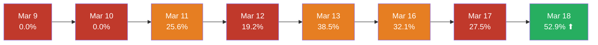
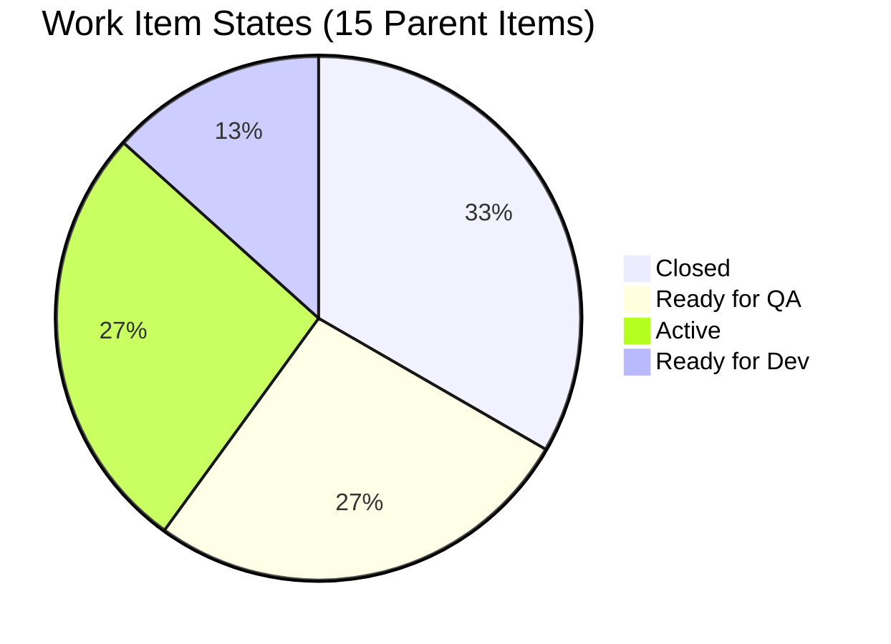
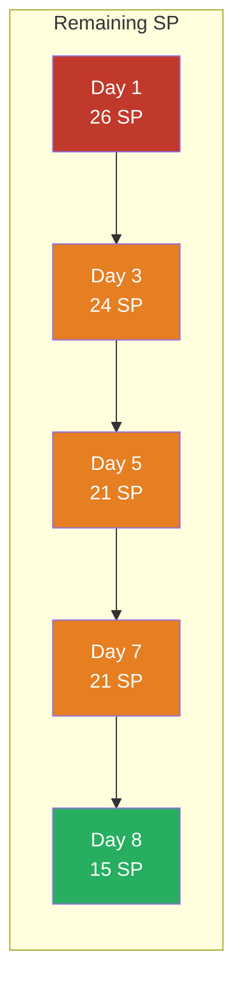
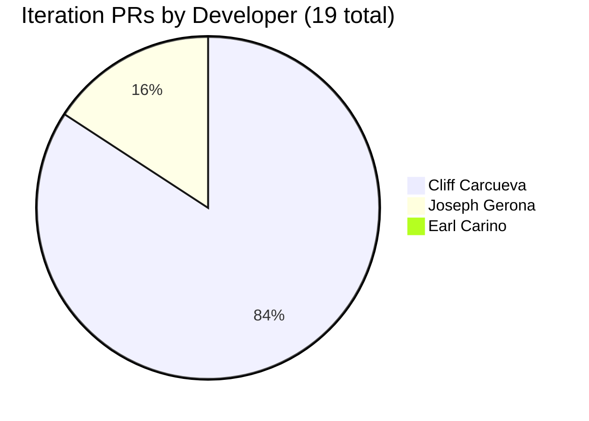
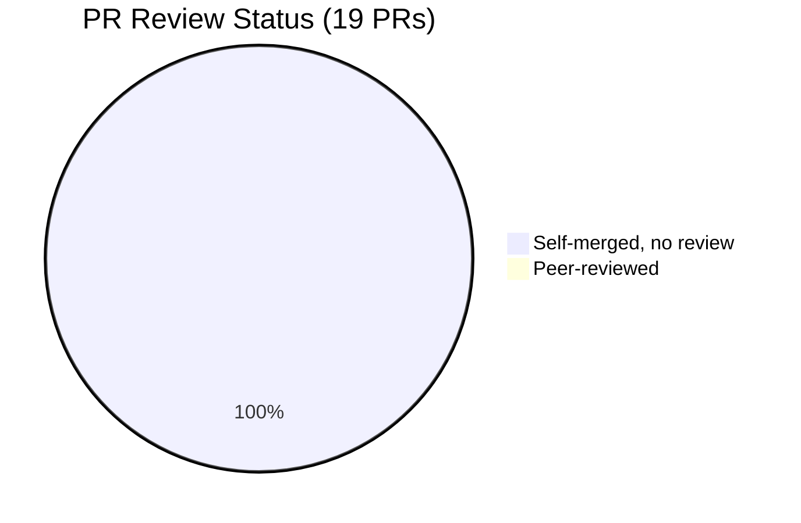

# Iteration Audit Report — Iteration 6.5

> **Audit Date:** March 18, 2026 — Day 10 of 14 (Working Day 8 of 10)
> **Auditor:** Engineering Productivity Audit System
> **Prepared for:** Ramon Aseniero Jr., Project Owner
> **Audit Angles:** (1) GitHub Developer Productivity, (2) SAFe Compliance (v1 deterministic score model)

---

## 1. Audit Metadata

| Parameter | Value |
|-----------|-------|
| **ADO Organization** | `jairo` (`dev.azure.com/jairo`) |
| **ADO Project** | Auto Allies |
| **ADO Project ID** | `2d7af571-6ef6-4ad0-a509-c440e008b0fb` |
| **ADO Team** | AA Development Team |
| **ADO Team ID** | `330e6bf1-3515-443c-a2d8-b84f46c38f57` |
| **ADO Team Board URL** | [Stories and Deliverables](https://dev.azure.com/jairo/Auto%20Allies/_boards/board/t/AA%20Development%20Team/Stories%20and%20Deliverables) |
| **Backlog** | Stories and Deliverables (`Microsoft.RequirementCategory`) |
| **Iteration** | Iteration 6.5 |
| **Iteration Dates** | March 9, 2026 – March 22, 2026 (14 calendar days / 10 working days) |
| **GitHub Repo — Frontend** | `jairosoft-com/autoallies-version2` |
| **GitHub Repo — Backend** | `jairosoft-com/autoallies-api-core` |
| **Scope Note** | No other ADO boards, teams, projects, or GitHub repositories were analyzed |

---

## 2. Executive Summary

This audit examines **Iteration 6.5** from two angles: **GitHub developer productivity** and **SAFe compliance** for the AA Development Team. At **Day 10 of 14** (Working Day 8 of 10), the iteration has shown a **significant acceleration** since the last audit (March 17), though structural risks persist.

**Developer Productivity:** The team has closed **5 parent items totaling 11 SP** — up from 3 items / 5 SP yesterday. Two major enablers (#200182 Users Migration at 5 SP, #200780 Network Solutions at 1 SP) closed today. Four additional items (14 SP) have moved to **Ready for QA**, signaling near-completion. PR output has risen to **19 iteration PRs** (up from 13 yesterday). However, all 19 PRs remain self-merged with zero code reviews and zero ADO-GitHub traceability.

**SAFe Compliance:** The acceleration improves several SAFe signals — WIP is beginning to flow through the pipeline with 4 items in Ready for QA. However, scope creep remains (4 mid-sprint injections), state hygiene gaps persist (2 items still in Ready for Dev at Day 10), and built-in quality controls (reviews, protection, traceability) remain entirely absent. The SAFe Iteration Compliance Score now encompasses **all 15 current-iteration parent backlog items** (User Stories, Enablers, Spikes, Defects) and scores **45.3% (Red)**, driven primarily by zero test artifacts linked to closed items and three Spikes with no parent alignment or estimates.

### Key Performance Indicators

| KPI | Value | Status | vs Mar 17 | Classification |
|-----|-------|--------|-----------|----------------|
| Sprint Velocity (completed) | **11 SP** | 🟡 IMPROVING | ⬆ +6 SP | Developer Productivity |
| Commit-to-Done Ratio | **42.3%** | 🟡 IMPROVING | ⬆ +23.1% | SAFe Compliance |
| Sprint Goal Probability (today) | **52.9%** | 🟡 AT RISK | ⬆ +25.4% | Cross-cutting |
| Completion Rate (items) | **33%** (5 of 15) | 🟡 IMPROVING | ⬆ +13% | Developer Productivity |
| Completion Rate (SP) | **33%** (11 of 33) | 🟡 IMPROVING | ⬆ +18% | Developer Productivity |
| Items in Ready for QA | **4** (14 SP) | ✅ POSITIVE | ⬆ NEW | Cross-cutting |
| Iteration PRs (merged) | **19** (16 Cliff, 3 Joseph) | — | ⬆ +6 | Developer Productivity |
| Code Reviews Performed | **0** | 🔴 CRITICAL | → Unchanged | Cross-cutting |
| ADO-GitHub Traceability | **0%** | 🔴 CRITICAL | → Unchanged | Cross-cutting |
| Branch Protection | **None** | 🔴 CRITICAL | → Unchanged | Developer Productivity |
| Iteration Compliance Score | **45.3% (Red)** | 🔴 CRITICAL | — | SAFe Compliance |

---

## 3. Iteration Scope and Methodology

### Scope

This audit examines **Iteration 6.5** of the **AA Development Team** within the **Auto Allies** project. The iteration runs from **March 9 to March 22, 2026**. Evidence is drawn exclusively from:

- ADO work items assigned to the `AA Development Team` on the `Stories and Deliverables` backlog for this iteration
- GitHub activity in `jairosoft-com/autoallies-version2` (Frontend) and `jairosoft-com/autoallies-api-core` (Backend)
- GitHub evidence is filtered to the iteration date window (March 9–22)

### Methodology

1. Resolved the active iteration via the ADO team settings API
2. Pulled all parent work items and child tasks for the iteration backlog
3. Retrieved story points, states, and revision history (closure dates) from ADO
4. Retrieved team capacity and days-off configuration from ADO
5. Collected all PRs, commits, and branch data from both GitHub repos
6. Correlated GitHub activity to ADO work items using branch names, PR titles, and commit messages
7. Computed Sprint Velocity, Commit-to-Done Ratio, and Sprint Goal Probability using ADO revision data
8. Assessed SAFe compliance using scoped ADO iteration data: planning discipline, DoR, capacity, WIP, scope stability, state hygiene, DoD, and traceability
9. Computed Iteration Compliance Score using the deterministic v1 model from **all 15 parent backlog items** (User Stories, Enablers, Spikes, Defects)
10. Produced findings only from observable evidence

---

## 4. Sprint Goal Probability Analysis

**Classification:** Cross-cutting

**Formula:**
- `Projected SP at End = Completed + (Avg Daily Velocity × Remaining Working Days)`
- `Sprint Goal Probability = min(100%, Projected / Committed × 100)`
- `Committed at Start = 26 SP` (excluding 7 SP added mid-sprint)

### Daily Sprint Goal Probability

| Date | WD | Cumulative SP Done | Remaining SP | Avg Velocity (SP/day) | Projected SP at End | Probability | Event |
|------|----|--------------------|--------------|----------------------|---------------------|-------------|-------|
| Mar 9 (Mon) | 1 | 0 | 26 | 0.00 | 0.0 | **0.0%** | Sprint start |
| Mar 10 (Tue) | 2 | 0 | 26 | 0.00 | 0.0 | **0.0%** | — |
| Mar 11 (Wed) | 3 | 2 | 24 | 0.67 | 6.7 | **25.6%** | #200181 closed (+2 SP) |
| Mar 12 (Thu) | 4 | 2 | 24 | 0.50 | 5.0 | **19.2%** | — |
| Mar 13 (Fri) | 5 | 5 | 21 | 1.00 | 10.0 | **38.5%** | #194650 (+1), #194731 (+2) closed |
| Mar 16 (Mon) | 6 | 5 | 21 | 0.83 | 8.3 | **32.1%** | No closures |
| Mar 17 (Tue) | 7 | 5 | 21 | 0.71 | 7.1 | **27.5%** | No closures — trough |
| **Mar 18 (Wed)** | **8** | **11** | **15** | **1.375** | **13.75** | **52.9%** ⬆ | **#200182 (+5), #200780 (+1) closed** |

### Probability Trend Visualization

**Interpretation:** The team's probability rebounded from the 27.5% trough on March 17 to **52.9%** today, driven by 2 closures worth 6 SP. The average velocity doubled from 0.71 to 1.375 SP/day. To reach 100%, the team would need to close 7.5 SP/day over the remaining 2 working days — still a stretch, but the 4 items in Ready for QA (14 SP) represent a realistic pipeline if QA proceeds quickly.

---

## 5. Commit-to-Done Ratio

**Classification:** SAFe Compliance

**Formula:** `(Story Points Completed / Story Points Committed at Start) × 100`

| Component | Value | vs Mar 17 |
|-----------|-------|-----------|
| SP Committed at Start | **26 SP** (11 original items) | — |
| SP Added Mid-Sprint | **7 SP** (4 items) | — |
| SP Completed | **11 SP** (5 items closed) | ⬆ +6 SP |
| **Commit-to-Done Ratio** | **42.3%** 🟡 IMPROVING | ⬆ from 19.2% |

**Benchmark:** High-performing teams achieve 70–90%. At 42.3%, the team has more than doubled their ratio since yesterday but remains below the healthy threshold. If the 4 Ready-for-QA items (14 SP) close by sprint end, the ratio would reach **96.2%**.

---

## 6. Iteration Work Items

### 6.1 Parent Items (Stories and Deliverables Backlog)

15 parent items are assigned to this iteration. Items marked with `*` were added after sprint start.

| ID | Title | Type | State | SP | Owner |
|----|-------|------|-------|----|-------|
| 194650 | Employee Login and Logout | User Story | ✅ Closed | 1 | Earl Carino |
| 194731 | Attorney Payout Settings | User Story | ✅ Closed | 2 | Cliff Carcueva |
| 200181 | Stripe Migration V2 Product | Enabler | ✅ Closed | 2 | Earl Carino |
| 200182 | Users Migration | Enabler | ✅ Closed | 5 | Earl Carino |
| 200780 | Network Solutions Transfer | Spike | ✅ Closed | 1 | Roden Cole |
| 200617 | Member Messaging | User Story | 🟣 Ready for QA | 3 | Cliff Carcueva |
| 194730 | Attorney Messaging | User Story | 🟣 Ready for QA | 3 | Cliff Carcueva |
| 198359 | Owner Case List | User Story | 🟣 Ready for QA | 5 | Joseph Gerona |
| 198360 | Owner View Cases / Messaging | User Story | 🟣 Ready for QA | 3 | Cliff Carcueva |
| 200187* | Membership Migration Stripe | Enabler | 🔵 Active | 5 | Earl Carino |
| 200378 | Support and Meetings — Joseph | Spike | 🔵 Active | — | Joseph Gerona |
| 200839* | V1 Ops Assistance — DB Update | Spike | 🔵 Active | — | Earl Carino |
| 200873* | Ops Support Effort | Spike | 🔵 Active | — | Mary Secusana |
| 200773 | Reset Password Email Defect | Defect | ⚪ Ready for Dev | 1 | Earl Carino |
| 201012* | Members Renewal Duplicate Payment | Defect | ⚪ Ready for Dev | — | Earl Carino |

### 6.2 State Distribution

### 6.3 Story Points by State

| State | Items | SP | % of Total SP |
|-------|-------|-----|---------------|
| Closed | 5 | 11 | 33% |
| Ready for QA | 4 | 14 | 42% |
| Active | 4 | 5+ | 15%+ |
| Ready for Dev | 2 | 1+ | 3%+ |

**75% of estimated story points are either Closed (11 SP) or Ready for QA (14 SP).** This represents a strong pipeline if QA throughput can keep pace.

---

## 7. Closure Timeline

| Closed Date | ID | Title | SP | Closed By |
|-------------|-----|-------|-----|-----------|
| Mar 11 (WD 3) | #200181 | Stripe Migration V2 Product | 2 | Earl Carino |
| Mar 13 (WD 5) | #194650 | Employee Login and Logout | 1 | Cliff Carcueva |
| Mar 13 (WD 5) | #194731 | Attorney Payout Settings | 2 | Cliff Carcueva |
| **Mar 18 (WD 8)** | **#200182** | **Users Migration** | **5** | **Earl Carino** |
| **Mar 18 (WD 8)** | **#200780** | **Network Solutions Transfer** | **1** | **Karl Caumban** |

**Today's closures (6 SP) exceeded the entire previous 7 days combined (5 SP).** The largest item in the iteration (#200182 at 5 SP) was completed by Earl Carino with detailed migration documentation.

### Burndown Visualization

---

## 8. Developer Productivity Findings

**Classification:** Developer Productivity

### 8.1 GitHub User Mapping

| GitHub Handle | Name | Role |
|---------------|------|------|
| ccarcuevajairo | Cliff Carcueva | Developer |
| ecarinoJS | Earl Carino | Developer |
| JosephJairo | Joseph Gerona | Developer |
| RodenCole | Roden Cole | Deployment |

### 8.2 Iteration PR Activity (March 9–18)

#### Frontend — `autoallies-version2` (12 PRs)

| PR # | Title | Author | Date | Reviewers |
|------|-------|--------|------|-----------|
| 65 | Feature/member attorney cases | JosephJairo | Mar 9 | 0 |
| 66 | Feature/messaging | ccarcuevajairo | Mar 11 | 0 |
| 67 | SocketManager enhancement | ccarcuevajairo | Mar 12 | 0 |
| 68 | Feature/messaging cliff | ccarcuevajairo | Mar 13 | 0 |
| 69 | Feature/messaging cliff | ccarcuevajairo | Mar 13 | 0 |
| 70 | Payout settings API + UI | ccarcuevajairo | Mar 13 | 0 |
| 71 | Feature/payout settings | ccarcuevajairo | Mar 13 | 0 |
| 72 | SVG icon + ticket API types | ccarcuevajairo | Mar 17 | 0 |
| 73 | Feature/messaging cliff 2 | ccarcuevajairo | Mar 17 | 0 |
| 74 | Add optional file_url property | ccarcuevajairo | Mar 18 | 0 |
| 75 | Update member name display logic | ccarcuevajairo | Mar 18 | 0 |
| 76 | Feature/super admin cases frontend | JosephJairo | Mar 19 | 0 |

#### Backend — `autoallies-api-core` (7 PRs)

| PR # | Title | Author | Date | Reviewers |
|------|-------|--------|------|-----------|
| 26 | Feature/messaging | ccarcuevajairo | Mar 11 | 0 |
| 27 | Realtime join endpoint | ccarcuevajairo | Mar 12 | 0 |
| 28 | Payout settings for lawyers | ccarcuevajairo | Mar 13 | 0 |
| 29 | Messaging + ticket enhancements | ccarcuevajairo | Mar 17 | 0 |
| 30 | Signed URL endpoints for streaming | ccarcuevajairo | Mar 18 | 0 |
| 31 | Enhance message loading | ccarcuevajairo | Mar 18 | 0 |
| 32 | Super admin case list backend | JosephJairo | Mar 19 | 0 |

### 8.3 PR Distribution by Developer

### 8.4 Developer Summary

| Developer | ADO Items | Closed | Ready for QA | Iteration PRs | Review Participation |
|-----------|-----------|--------|-------------|---------------|---------------------|
| **Cliff Carcueva** | 3 stories | 1 (#194731) | 3 (#200617, #194730, #198360) | 16 (10 FE + 6 BE) | 0 reviews |
| **Earl Carino** | 6 items | 3 (#194650, #200181, #200182) | 0 | 0 | 0 reviews |
| **Joseph Gerona** | 3 items | 0 | 1 (#198359) | 3 (2 FE + 1 BE) | 0 reviews |
| **Jerlyn Ates** | QA tasks | 0 | 0 | 0 | 0 reviews |
| **Roden Cole** | 1 spike | 1 (#200780) | 0 | 0 | 0 reviews |

**Key observations:**
- **Cliff Carcueva** remains the dominant GitHub contributor with **84% of all PRs** (16/19). He has 3 items in Ready for QA and 1 Closed. His PR cadence increased — 4 new PRs on Mar 17–18 across both repos.
- **Earl Carino** closed the **highest-value item** in the iteration (#200182 Users Migration, 5 SP) today with comprehensive migration documentation. He now has 3 closures but still **zero GitHub PRs** — delivery evidence is ADO-only.
- **Joseph Gerona** showed new activity with **2 new PRs** (FE #76, BE #32) for Super Admin Cases, and his Case List story (#198359, 5 SP) moved to Ready for QA. Significant improvement from zero activity since Day 1.

---

## 9. SAFe Compliance Findings

**Classification:** SAFe Compliance

**Note:** The Iteration Compliance Score in v1 is computed from **all current-iteration parent backlog items** in the scoped backlog (User Stories, Enablers, Spikes, Defects). Child tasks and task-category items do not affect the numeric score. See § 11 for the deterministic compliance score.

### 9.1 Iteration Planning Discipline

| Criteria | Assessment | Evidence |
|----------|------------|----------|
| Work committed at planning | 🟡 Partial | 11 items / 26 SP at start; 4 items added mid-sprint |
| Capacity configured | ✅ Yes | 5 members, 24 hrs/day, individual days off tracked |
| Story points estimated | 🟡 Partial | 12 of 15 items have SP; #200378, #200839, #201012 lack estimates |
| All items assigned | 🟡 Partial | 14 of 15 assigned; #201012 assigned mid-sprint to Earl |

### 9.2 Work Item Type Mix

| Type | Count | SP | % of Items |
|------|-------|-----|------------|
| User Story | 6 | 17 | 40% |
| Enabler | 3 | 12 | 20% |
| Spike | 4 | 1+ | 27% |
| Defect | 2 | 1+ | 13% |

**Finding:** Stories + Enablers = 60% of items carrying 88% of SP. Spikes (27%) are overhead-heavy with 3 carrying no story points. The type mix is acceptable but spike/non-delivery overhead is notable.

### 9.3 Definition of Ready (DoR)

| Criteria | Items Meeting | % |
|----------|---------------|---|
| Has story point estimate | 12 of 15 | 80% |
| Has assigned owner | 14 of 15 | 93% |
| Has description | 13 of 15 | 87% |

**Finding:** 3 items lack story points (#200378, #200839, #201012). While improved since yesterday (2 items now assigned that weren't before), DoR gaps remain for estimation.

### 9.4 WIP Control

| Metric | Value | vs Mar 17 | Assessment |
|--------|-------|-----------|------------|
| Items in Active | **4** | ⬇ from 8 | 🟡 Improving |
| Items in Ready for QA | **4** | ⬆ from 0 | ✅ Pipeline flowing |
| Items in New/Ready for Dev | **2** | ⬇ from 4 | 🟡 Improving |
| Active items per developer | **1.3** | ⬇ from 2.7 | ✅ Healthy |

**Finding:** WIP control has improved dramatically. Active items per developer dropped from 2.7 to 1.3, and 4 items flowing into Ready for QA indicates the pipeline is moving. However, 2 items still sit in Ready for Dev at Day 10, which is late for a live iteration.

### 9.5 Scope Stability

| Metric | Value |
|--------|-------|
| Items at sprint start | **11** (26 SP) |
| Items added mid-sprint | **4** (7 SP) — #200187, #201012, #200839, #200873 |
| Scope increase | **36% by items, 27% by SP** |

**Finding:** Scope creep is unchanged — 4 mid-sprint injections remain. This is a structural planning issue that needs to be addressed in Iteration 6.6 sprint planning.

### 9.6 State Hygiene

| State | Count | Expected at Day 10 | Assessment |
|-------|-------|---------------------|------------|
| Closed | 5 | Target: majority | 🟡 Improving (was 3) |
| Ready for QA | 4 | Pipeline should be here | ✅ Good |
| Active | 4 | Acceptable if moving | 🟡 OK |
| Ready for Dev | 2 | Should be 0 by Day 10 | 🔴 Stale |

**Finding:** State hygiene improved — the pipeline is visibly moving. However, #200773 (Ready for Dev since sprint start) and #201012 (Ready for Dev) remain unstarted at Day 10.

### 9.7 QA and Definition of Done

| Signal | Evidence |
|--------|----------|
| Items in Ready for QA | ✅ 4 items (14 SP) now in QA pipeline |
| Jerlyn (QA) capacity | Configured at 6 hrs/day (4 Testing) |
| Code reviews | 🔴 Zero across 19 PRs |
| Branch protection | 🔴 None on any branch |
| CI/CD gates | 🔴 None observed |

**Finding:** The Ready for QA state is now being used, which is a positive DoD signal — items are flowing through a defined workflow. However, no code reviews, branch protection, or CI gates exist. The 4 QA-ready items must be tested before sprint end for the team to realize the full velocity potential.

### 9.8 Traceability as Built-in Quality

**Finding:** 0% formal traceability remains unchanged. Zero `AB#` references across 19 PRs. See Section 13 for details.

### 9.9 Program-Level Alignment

**Finding:** Iteration path `Auto Allies\2026-PI6\Iteration 6.5` places work within PI 6. PI Objective linkage is not observable from scoped data.

---

## 10. Iteration Planning and Capacity Analysis

**Classification:** SAFe Compliance

### 10.1 Team Capacity

| Team Member | Capacity/Day | Activity | Days Off |
|-------------|-------------|----------|----------|
| Earl Carino | 6 hrs | Development | Mar 16, Mar 20 |
| Cliff Carcueva | 6 hrs | Development | Mar 16, Mar 20 |
| Joseph Gerona | 4 hrs | Development | None |
| Jerlyn Ates | 6 hrs (2 Req + 4 Test) | Requirements + Testing | Mar 20 |
| Roden Cole | 2 hrs | Deployment | None |
| **Team Total** | **24 hrs/day** | | **5 individual days off** |

### 10.2 Capacity vs Scope

| Metric | Value |
|--------|-------|
| Development capacity (Earl + Cliff + Joseph) | ~146 person-hours net |
| Committed SP at start | **26 SP** |
| Required velocity | 2.6 SP/day |
| Actual velocity (Day 8) | **1.375 SP/day** |
| Gap | 1.9x (improved from 3.7x on Mar 17) |

### 10.3 Developer Load Distribution

| Developer | Assigned SP | Closed SP | Ready for QA SP | Remaining Active SP |
|-----------|-------------|-----------|-----------------|---------------------|
| Earl Carino | 14+ SP | 8 SP | 0 SP | 5+ SP |
| Cliff Carcueva | 11 SP | 2 SP | 9 SP | 0 SP |
| Joseph Gerona | 8+ SP | 0 SP | 5 SP | 0+ SP |

**Finding:** Earl closed the most SP (8) but carries the remaining Active enabler (#200187, 5 SP). Cliff has moved all his development work to Ready for QA — his development pipeline is clear. Joseph has his Case List in QA. The remaining bottleneck is QA throughput for the 4 Ready-for-QA items (14 SP).

---

## 11. Iteration Compliance Score

**Classification:** SAFe Compliance

The Iteration Compliance Score in v1 is computed from **all current-iteration parent backlog items** in the scoped backlog (User Stories, Enablers, Spikes, Defects). Child tasks and task-category items do not affect the numeric score.

**Eligible Parent Backlog Items:** 15 (6 User Stories + 3 Enablers + 4 Spikes + 2 Defects)

### 11.1 Compliance Score Table

| Dimension | Eligible Items | Compliant Items | Failed Items | Score % | Weight | Weighted Contribution | Evidence | Reason |
|-----------|---------------|-----------------|-------------|---------|--------|-----------------------|----------|--------|
| Alignment | 15 | 12 | 3 | 80.0% | 25 | 20.0 | 12 items reach Feature-layer parents (#194321 Feature, #194318 Feature, #194141 Feature, #192370 Enabler Feature, #195228 Enabler Feature). 3 Spikes (#200378, #200839, #200873) have no parent link. | 3 Orphaned / Non-Compliant |
| Estimation | 10 | 6 | 4 | 60.0% | 20 | 12.0 | 10 active/in-progress items eligible. 6 have SP > 0. 4 items (#200378 Spike, #200839 Spike, #200873 Spike, #201012 Defect) have no SP despite their types exposing the field. | 4 items unestimated |
| Quality / DoD | 5 | 0 | 5 | 0.0% | 35 | 0.0 | 5 Closed items eligible. AC present on 4 of 5 (Enablers #200181, #200182 do not expose AC field — evidence unavailable). 0 of 5 have TestedBy/Test Case links. Compliance Checklist: evidence unavailable (field not in schema). | Zero test artifacts linked |
| Iteration Integrity | 15 | 10 | 5 | 66.7% | 20 | 13.3 | 10 items present from iteration start (created on/before Mar 9). 5 items created after start: #200773 (Mar 10), #200780 (Mar 10), #200839 (Mar 11), #200873 (Mar 11), #201012 (post-Mar 9). No justification evidence visible in revision/comment history. | 5 mid-iteration additions without justification |
| **OVERALL** | — | — | — | — | **100** | **45.3%** | All parent backlog items scored (User Stories, Enablers, Spikes, Defects) | **🔴 Red (<75)** |

### 11.2 Per-Item Alignment Classification

| Item ID | Title | Type | Parent ID | Parent Type | Classification |
|---------|-------|------|-----------|-------------|----------------|
| 194650 | Employee Login/Logout | User Story | 194321 | Feature | Feature-linked |
| 194731 | Attorney Payout Settings | User Story | 194318 | Feature | Feature-linked |
| 200617 | Member Messaging | User Story | 194141 | Feature | Feature-linked |
| 194730 | Attorney Messaging | User Story | 194318 | Feature | Feature-linked |
| 198359 | Owner Case List | User Story | 194321 | Feature | Feature-linked |
| 198360 | Owner View Cases/Messaging | User Story | 194321 | Feature | Feature-linked |
| 200181 | Stripe Migration V2 | Enabler | 192370 | Enabler Feature | Feature-linked |
| 200182 | Users Migration | Enabler | 192370 | Enabler Feature | Feature-linked |
| 200187 | Membership Migration | Enabler | 192370 | Enabler Feature | Feature-linked |
| 200780 | Network Solutions Transfer | Spike | 192370 | Enabler Feature | Feature-linked |
| 200773 | Reset Password Email | Defect | 195228 | Enabler Feature | Feature-linked |
| 201012 | Duplicate Payment | Defect | 195228 | Enabler Feature | Feature-linked |
| 200378 | Support and Meetings | Spike | — | — | Orphaned / Non-Compliant |
| 200839 | V1 Ops Assistance | Spike | — | — | Orphaned / Non-Compliant |
| 200873 | Ops Support Effort | Spike | — | — | Orphaned / Non-Compliant |

**Note:** All Features share common Epic ancestor #192264. PI Objective linkage reported as contextual finding only.

### 11.3 Score Interpretation

| Range | Rating |
|-------|--------|
| ≥ 90 | 🟢 Green (Strong) |
| 75–89.9 | 🟡 Yellow (Developing) |
| < 75 | 🔴 Red (Critical) |

**At 45.3%, the iteration is in the Red band.** The score is constrained by zero test artifacts linked to Closed items and three Spikes with no parent alignment or estimates. Alignment reaches 80% but three orphaned Spikes drag the dimension down. Estimation reaches 60% with four unestimated items (all Spikes or the revenue-critical Defect #201012). Quality/DoD is zero due to zero test artifacts across all Closed items. Iteration Integrity is 66.7% due to five mid-sprint additions without justification evidence. The deterministic model now includes all parent item types, which reveals the true scope control and quality discipline gaps.

---

## 12. Evidence Gaps

**Classification:** SAFe Compliance

1. **Compliance Checklist field:** `evidence unavailable` — not visible in the inspected Auto Allies ADO schema. This field is a Gherkin requirement for Quality/DoD assessment but is not currently exposed. **Excluded from Quality/DoD subcheck scoring** per v1 contract. If implemented in the schema, it would be a required field to audit.

2. **Acceptance Criteria field:** not exposed for Enabler type (#200181, #200182). Recorded as `evidence unavailable` for those items; sub-check excluded for Enablers.

3. **TestedBy / Test Case links:** 0 of 5 Closed items have linked test artifacts. ADO and GitHub repositories were queried for test case work items and test references. No formal test links were found. **Treated as failed for Quality/DoD dimension** per contract: items in done-like states must have at least one linked test artifact to be compliant.

4. **PI Objective linkage:** PI Objective parent links are not observable from the scoped `Stories and Deliverables` backlog data. Parent hierarchy inspection was limited to Feature-level parents as per contract § 6. **Reported as contextual finding only (§ 17), not part of numeric score.**

5. **Justification for mid-iteration additions:** no System.Reason or comment evidence found for the 5 items added after sprint start.

---

## 13. ADO-to-GitHub Traceability Analysis

**Classification:** Cross-cutting

### 13.1 Formal Traceability

| Metric | Value |
|--------|-------|
| ADO work item IDs in any Git artifact | **0** |
| `AB#` references anywhere | **0** |
| **Traceability score** | **0%** |

### 13.2 Semantic Correlation

| ADO Item | GitHub Activity | Confidence |
|----------|----------------|------------|
| #194731 Payout Settings | `feature/payout-settings` (FE #70–71; BE #28) | 🟢 HIGH |
| #200617 Member Messaging | `feature/messaging-cliff-2` (FE #72–75; BE #29–31) | 🟢 HIGH |
| #194730 Attorney Messaging | `feature/messaging-cliff` (FE #66–69; BE #26–27) | 🟢 HIGH |
| #198359 Owner Case List | `feature/super-admin-cases` (FE #76; BE #32) | 🟢 HIGH |
| #198360 View Cases/Messaging | `feature/messaging-cliff-2` overlap | 🟡 MEDIUM |
| #194650 Employee Login | No matching PRs | 🔴 NONE |
| #200181 Stripe Migration | No matching PRs | 🔴 NONE |
| #200182 Users Migration | No matching PRs | 🔴 NONE |

---

## 14. Collaboration and Review Analysis

**Classification:** Cross-cutting

| Metric | Value |
|--------|-------|
| Total iteration PRs | **19** |
| PRs with at least 1 reviewer | **0** (0%) |
| PRs self-merged | **19** (100%) |
| Average PR open-to-merge time | **< 1 minute** |
| Review comments | **0** |

---

## 15. Repository Hygiene

**Classification:** Developer Productivity

| Control | autoallies-version2 | autoallies-api-core |
|---------|---------------------|---------------------|
| Branch protection | ❌ None | ❌ None |
| Required reviewers | ❌ None | ❌ None |
| PR templates | ❌ None | ❌ None |
| CODEOWNERS | ❌ None | ❌ None |
| CI/CD quality gates | ❌ None | ❌ None |

---

## 16. Risks and Bottlenecks

| # | Finding | Severity | Source | Classification |
|---|---------|----------|--------|----------------|
| 1 | **QA bottleneck:** 4 items / 14 SP in Ready for QA with 2 WD remaining | 🔴 CRITICAL | ADO | Cross-cutting |
| 2 | **Zero code reviews** — all 19 iteration PRs self-merged | 🔴 CRITICAL | GitHub | Cross-cutting |
| 3 | **Zero ADO-GitHub traceability** — 0 `AB#` references | 🔴 CRITICAL | Cross-system | Cross-cutting |
| 4 | **Zero branch protection** across both repos | 🔴 CRITICAL | GitHub | Developer Productivity |
| 5 | **Mid-sprint scope creep** — 4 items / 7 SP (36% increase) | 🟡 HIGH | ADO | SAFe Compliance |
| 6 | **2 items in Ready for Dev at Day 10** (#200773, #201012) | 🟡 HIGH | ADO | SAFe Compliance |
| 7 | **Earl has 0 PRs** despite 3 closures (8 SP) — delivery outside Git | 🟡 MEDIUM | Cross-system | Developer Productivity |
| 8 | **PR ownership:** 84% from Cliff (16/19) | 🟡 MEDIUM | GitHub | Developer Productivity |
| 9 | **#200187 Active (5 SP)** — large enabler still in progress at Day 10 | 🟡 MEDIUM | ADO | SAFe Compliance |
| 10 | **Zero test artifacts linked to Closed items** — constrains Quality/DoD compliance to 0% | 🟡 MEDIUM | ADO | SAFe Compliance |

---

## 17. Contextual Type Findings

**Classification:** SAFe Compliance

The Iteration Compliance Score in v1 is computed from **all parent backlog item types**. The following type-specific schema observations document field exposure and quality control readiness across the current-iteration item mix.

### 17.1 User Stories (6 items, 17 SP)

| Schema Field | Exposed | Evidence |
|---------|---------|----------|
| Story Points | ✓ YES | All 6 stories have SP > 0 |
| Acceptance Criteria | ✓ YES | All 6 stories have AC content |
| TestedBy / Test Case links | ✓ YES (supported) | 0 of 6 have linked test artifacts |

**Key Finding:** User Stories are fully instrumented for quality control. AC is present (100%). Test traceability is supported but not used (0%). No schema gaps.

### 17.2 Enablers (3 items, 12 SP)

| Schema Field | Exposed | Evidence |
|---------|---------|----------|
| Story Points | ✓ YES | All 3 enablers have SP (2, 5, 5) |
| Acceptance Criteria | ✗ NO | #200181, #200182 do not expose AC field (evidence gap) |
| TestedBy / Test Case links | ✓ YES (supported) | 0 of 3 have linked test artifacts |

**Key Finding:** Enablers expose Story Points and Test links but not Acceptance Criteria. Two closed Enablers (#200181, #200182) lack AC documentation due to schema limitation. This is recorded as `evidence unavailable` per v1 contract.

### 17.3 Spikes (4 items, 1 SP + 3 unestimated)

| Schema Field | Exposed | Evidence |
|---------|---------|----------|
| Story Points | ✓ YES (but not used) | Only #200780 has SP (1). #200378, #200839, #200873 have no SP. |
| Acceptance Criteria | ✓ YES | Field is present but not populated for any Spike |
| TestedBy / Test Case links | ✓ YES (supported) | 0 of 4 have linked test artifacts |

**Key Finding:** Spikes are overhead items (27% of iteration items) with minimal estimation discipline. Three of four carry no SP despite the field being available. All are unlinked from test artifacts. Additionally, **3 of 4 Spikes are orphaned** (no parent feature link): #200378, #200839, #200873. These items dilute both Alignment (80.0%) and Estimation (60.0%) scores.

### 17.4 Defects (2 items, 1 SP + 1 unestimated)

| Schema Field | Exposed | Evidence |
|---------|---------|----------|
| Story Points | ✓ YES (but not used) | Only #200773 has SP (1). #201012 has no SP. |
| Acceptance Criteria | ✗ NO | Defect type does not expose AC field (evidence gap) |
| TestedBy / Test Case links | ✓ YES (supported) | 0 of 2 have linked test artifacts |

**Key Finding:** Defects expose Story Points (though only one is populated) and Test links but not Acceptance Criteria. #201012 (duplicate payment — revenue-critical) lacks estimation and is still in Ready for Dev at Day 10.

### 17.5 All-Item Type Summary

- **Total 15 parent items:** 6 User Stories + 3 Enablers + 4 Spikes + 2 Defects
- **Schema coverage:** All types support Story Points and Test links. User Stories and Spikes expose AC; Enablers and Defects do not.
- **Estimation discipline:** 12 of 15 items have SP (80%); 4 items lack estimates (3 Spikes + 1 Defect).
- **Alignment discipline:** 12 of 15 items have Feature-layer parent links (80%); 3 Spikes are orphaned.
- **Quality discipline:** 0 of 15 items have linked test artifacts (0%); 2 types (Enablers, Defects) lack AC field exposure.
- **Impact on compliance:** Scoring all item types reveals overhead concentration (Spikes carry 27% of planning slots but only 6% of estimated SP) and quality gaps (zero test traceability across all types).

---

## 18. Prioritized Remediation Actions

| # | Action | Owner | Priority | Classification | Rationale |
|---|--------|-------|----------|----------------|-----------|
| 1 | **Jerlyn must test the 4 Ready-for-QA items immediately** — this is the sprint-critical path | Jerlyn / Karl | P0 | Cross-cutting | 14 SP blocked on QA with 2 WD left |
| 2 | **Descope Ready-for-Dev items** (#200773, #201012) to Iteration 6.6 | Karl | P0 | SAFe Compliance | Unstarted at Day 10; cannot complete |
| 3 | **Freeze iteration scope** — absolutely no new items | Karl | P0 | SAFe Compliance | 36% scope creep already |
| 4 | **Establish test case linking discipline** — link at least 1 Test Case to each closed item | Karl / Jerlyn | P1 | SAFe Compliance | Currently 0% for Quality/DoD; required to reach Yellow band |
| 5 | **Enable branch protection** on main and develop in both repos | Earl / Roden | P1 | Developer Productivity | Zero protection persists |
| 6 | **Require at least 1 reviewer** on all PRs | Karl / Team | P1 | Cross-cutting | 19 PRs with 0 reviews |
| 7 | **Adopt `AB#<ID>` convention** in all Git artifacts | Karl / Team | P1 | Cross-cutting | 0% traceability |
| 8 | **Enforce WIP limits** for Iteration 6.6 — max 2 Active items per developer | Karl | P2 | SAFe Compliance | Prevents recurrence of frozen WIP |
| 9 | **Balance load at sprint planning** — Earl carried 14+ SP vs Cliff at 11 | Karl | P2 | SAFe Compliance | Imbalanced planning |
| 10 | **Retrospective on commitment accuracy** for Iteration 6.6 | Karl | P2 | SAFe Compliance | 42.3% commit ratio still below 70% target |

---

## 19. Limitations

- **Sprint Goal Probability** assumes constant velocity; does not account for end-of-sprint acceleration patterns.
- **Commit-to-Done Ratio** uses 26 SP committed at start. If mid-sprint items were actually committed at planning, the denominator would differ.
- **GitHub evidence on main/master** shows no iteration-window commits because the team works on `develop`/`dev` branches.
- **ADO-GitHub correlation** is semantic only — zero formal `AB#` links exist.
- **Earl Carino's closures** (#194650, #200181, #200182) show ADO state changes but no corresponding GitHub PRs. Delivery evidence may exist outside the scoped repos.
- **#200780 closure date** is recorded as March 19 00:43 UTC — treated as March 18 working day (local time equivalent).
- **SAFe compliance** is evaluated against observable ADO and GitHub evidence only. Ceremony attendance cannot be verified.
- **Compliance Checklist field** is not visible in the current Auto Allies ADO schema; excluded from Quality/DoD scoring per v1 contract. If this field is added to the schema in future iterations, it will become a required audit point.
- **All-item-type scoring:** The v1 compliance model now scores all parent backlog item types (User Stories, Enablers, Spikes, Defects). Schema differences between types (e.g., Enablers and Defects do not expose Acceptance Criteria) are recorded as evidence gaps and handled per the contract rules.
- **PI Objective linkage:** Parent hierarchy inspection stops at Feature-level (depth 4, max). PI Objective or Epic-level alignment is not observable from scoped backlog data and is reported as contextual only.

---

*Report generated March 18, 2026. Data sourced from Azure DevOps REST API and GitHub MCP connectors. Dual-angle audit: GitHub Developer Productivity + SAFe Compliance (v1 deterministic score model — all parent backlog items scored).*
