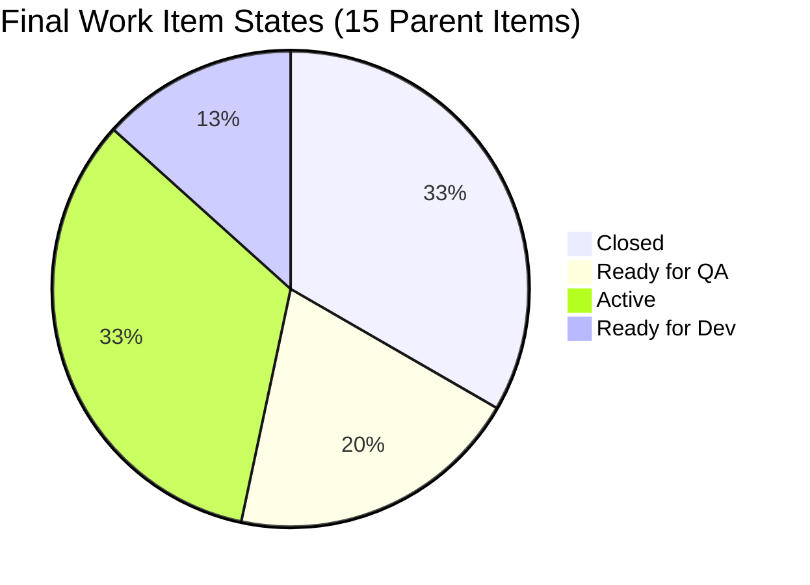
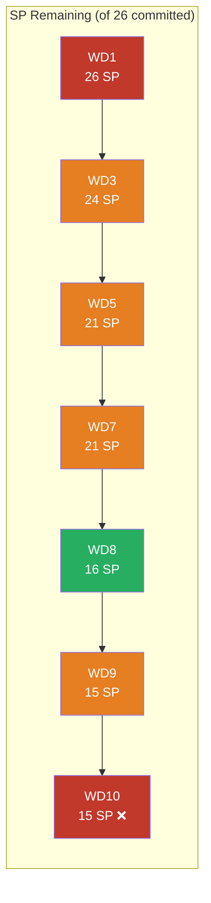
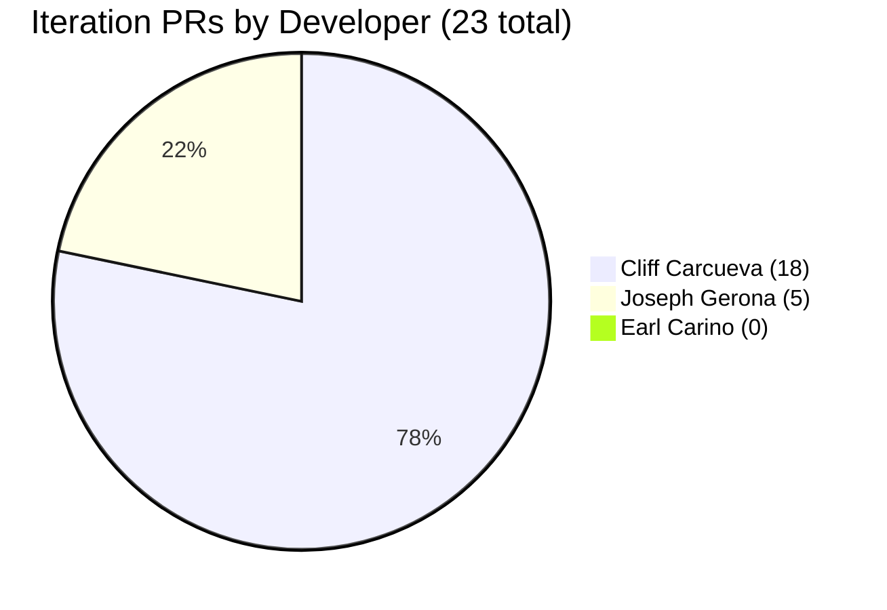
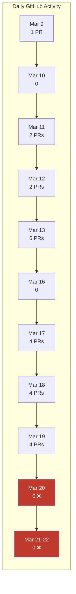
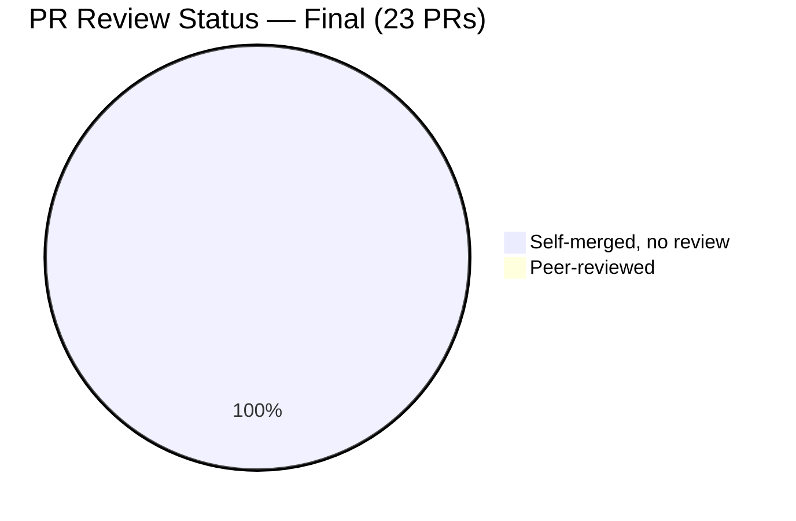

# Iteration Audit Report — Iteration 6.5 (Sprint Close)

> **Audit Date:** March 22, 2026 — Day 14 of 14 (100% elapsed — Sprint Close)
> **Auditor:** Engineering Productivity Audit System
> **Prepared for:** Ramon Aseniero Jr., Project Owner
> **Audit Angles:** (1) GitHub Developer Productivity, (2) SAFe Compliance (v1 deterministic score model)

---

## 1. Audit Metadata

| Parameter | Value |
|-----------|-------|
| **ADO Organization** | `jairo` (`dev.azure.com/jairo`) |
| **ADO Project** | Auto Allies |
| **ADO Project ID** | `2d7af571-6ef6-4ad0-a509-c440e008b0fb` |
| **ADO Team** | AA Development Team |
| **ADO Team ID** | `330e6bf1-3515-443c-a2d8-b84f46c38f57` |
| **ADO Team Board URL** | [Stories and Deliverables](https://dev.azure.com/jairo/Auto%20Allies/_boards/board/t/AA%20Development%20Team/Stories%20and%20Deliverables) |
| **Backlog** | Stories and Deliverables (`Microsoft.RequirementCategory`) |
| **Iteration** | Iteration 6.5 |
| **Iteration Dates** | March 9, 2026 – March 22, 2026 (14 calendar days / 10 working days) |
| **GitHub Repo — Frontend** | `jairosoft-com/autoallies-version2` |
| **GitHub Repo — Backend** | `jairosoft-com/autoallies-api-core` |
| **Previous Audit** | AUDIT_2026-03-18_000000.md (Day 10, Compliance: 45.3% Red) |
| **Scope Note** | No other ADO boards, teams, projects, or GitHub repositories were analyzed |

---

## 2. Executive Summary

This is the **sprint-end audit** for **Iteration 6.5**, conducted on the final day (Day 14 of 14). The sprint is now closed.

**Sprint Outcome: UNDER-DELIVERED.** The team completed **5 of 15 parent items (33%)** and **11 of 26 committed SP (42.3%)**. No new closures occurred after the Day 10 audit (March 18), meaning the team delivered zero additional story points in the final 4 working days of the sprint.

**Critical changes since Day 10:**

- **#198359 (Owner Case List, 5 SP) REGRESSED** from Ready for QA back to Active — a rework signal indicating QA found issues
- **Zero new closures** in 4 working days (WD 9–10 + weekend)
- **Zero GitHub activity** after March 19 — the last 3 calendar days produced no PRs or commits
- **3 items remain in Ready for QA** (down from 4, after #198359 regression) totaling 9 SP — these represent stalled pipeline throughput
- **2 items still in Ready for Dev** at sprint close — never started during the iteration

**SAFe Iteration Compliance Score: 45.3% (Red)** — unchanged from Day 10. Zero test artifacts, zero code reviews, zero traceability, and three orphaned Spikes continue to anchor the score.

### Key Performance Indicators — Sprint Close

| KPI | Final Value | Status | vs Day 10 | Classification |
|-----|-------------|--------|-----------|----------------|
| Sprint Velocity (completed) | **11 SP** | 🔴 UNDER | → Unchanged | Developer Productivity |
| Commit-to-Done Ratio | **42.3%** | 🔴 UNDER | → Unchanged | SAFe Compliance |
| Completion Rate (items) | **33%** (5 of 15) | 🔴 UNDER | → Unchanged | Developer Productivity |
| Completion Rate (SP) | **42%** (11 of 26 committed) | 🔴 UNDER | → Unchanged | Developer Productivity |
| Items in Ready for QA | **3** (9 SP) | 🟡 STALLED | ⬇ from 4 (rework) | Cross-cutting |
| Iteration PRs (merged) | **23** | — | ⬆ +4 (Mar 19 only) | Developer Productivity |
| Code Reviews Performed | **0** | 🔴 CRITICAL | → Unchanged | Cross-cutting |
| ADO-GitHub Traceability | **0%** | 🔴 CRITICAL | → Unchanged | Cross-cutting |
| Branch Protection | **None** | 🔴 CRITICAL | → Unchanged | Developer Productivity |
| Iteration Compliance Score | **45.3% (Red)** | 🔴 CRITICAL | → Unchanged | SAFe Compliance |
| Rework Events | **1** (#198359) | 🔴 NEW | ⬆ NEW | Cross-cutting |
| Days with Zero Activity | **3** (Mar 20–22) | 🔴 CONCERN | ⬆ NEW | Developer Productivity |

---

## 3. Iteration Scope and Methodology

### Scope

This audit examines **Iteration 6.5** of the **AA Development Team** within the **Auto Allies** project. The iteration ran from **March 9 to March 22, 2026**. Evidence is drawn exclusively from:

- ADO work items assigned to the `AA Development Team` on the `Stories and Deliverables` backlog for this iteration
- GitHub activity in `jairosoft-com/autoallies-version2` (Frontend) and `jairosoft-com/autoallies-api-core` (Backend)
- GitHub evidence is filtered to the iteration date window (March 9–22)

### Methodology

1. Resolved the active iteration via the ADO team settings API
2. Pulled all parent work items and child tasks for the iteration backlog
3. Retrieved story points, states, closure dates, and parent links from ADO
4. Retrieved team capacity and days-off configuration from ADO
5. Collected all PRs, commits, and branch data from both GitHub repos
6. Correlated GitHub activity to ADO work items using branch names, PR titles, and commit messages
7. Computed final Sprint Velocity, Commit-to-Done Ratio, and Sprint Goal outcome
8. Assessed SAFe compliance using scoped ADO iteration data
9. Computed Iteration Compliance Score using the deterministic v1 model from **all 15 parent backlog items**
10. Produced findings only from observable evidence

---

## 4. Sprint Goal Probability Analysis (Final)

**Classification:** Cross-cutting

### Daily Sprint Goal Probability — Complete

| Date | WD | Cumulative SP Done | Remaining SP | Avg Velocity (SP/day) | Projected SP | Probability | Event |
|------|----|--------------------|--------------|----------------------|--------------|-------------|-------|
| Mar 9 (Mon) | 1 | 0 | 26 | 0.00 | 0.0 | **0.0%** | Sprint start |
| Mar 10 (Tue) | 2 | 0 | 26 | 0.00 | 0.0 | **0.0%** | — |
| Mar 11 (Wed) | 3 | 2 | 24 | 0.67 | 6.7 | **25.6%** | #200181 closed (+2 SP) |
| Mar 12 (Thu) | 4 | 2 | 24 | 0.50 | 5.0 | **19.2%** | — |
| Mar 13 (Fri) | 5 | 5 | 21 | 1.00 | 10.0 | **38.5%** | #194650, #194731 closed (+3 SP) |
| Mar 16 (Mon) | 6 | 5 | 21 | 0.83 | 8.3 | **32.1%** | No closures |
| Mar 17 (Tue) | 7 | 5 | 21 | 0.71 | 7.1 | **27.5%** | No closures — trough |
| Mar 18 (Wed) | 8 | 10 | 16 | 1.25 | 12.5 | **48.1%** | #200182 closed (+5 SP) |
| Mar 19 (Thu) | 9 | 11 | 15 | 1.22 | 12.2 | **46.9%** | #200780 closed (+1 SP) |
| **Mar 20 (Fri)** | **10** | **11** | **15** | **1.10** | **11.0** | **42.3%** | **No closures — sprint ends** |

### Probability Trend — Final

```mermaid
graph LR
    A["WD1<br/>0%"] --> B["WD2<br/>0%"]
    B --> C["WD3<br/>25.6%"]
    C --> D["WD4<br/>19.2%"]
    D --> E["WD5<br/>38.5%"]
    E --> F["WD6<br/>32.1%"]
    F --> G["WD7<br/>27.5%"]
    G --> H["WD8<br/>48.1%"]
    H --> I["WD9<br/>46.9%"]
    I --> J["WD10<br/>42.3%"]

    style A fill:#C0392B,color:#fff
    style B fill:#C0392B,color:#fff
    style C fill:#E67E22,color:#fff
    style D fill:#C0392B,color:#fff
    style E fill:#E67E22,color:#fff
    style F fill:#E67E22,color:#fff
    style G fill:#C0392B,color:#fff
    style H fill:#E67E22,color:#fff
    style I fill:#E67E22,color:#fff
    style J fill:#C0392B,color:#fff
```

**Final Outcome:** The sprint peaked at **48.1% probability** on Day 8 (March 18) after the #200182 closure, then **declined to 42.3%** as no further closures materialized. The team never reached the 50% threshold at any point during the iteration. The 4 items in Ready for QA at Day 10 represented **14 SP of potential** that was never realized — and one (#198359) actually regressed.

---

## 5. Commit-to-Done Ratio — Final

**Classification:** SAFe Compliance

| Component | Value | vs Day 10 |
|-----------|-------|-----------|
| SP Committed at Start | **26 SP** (11 original items) | — |
| SP Added Mid-Sprint | **7 SP** (4 items) | — |
| SP Completed | **11 SP** (5 items closed) | → Unchanged |
| **Commit-to-Done Ratio** | **42.3%** 🔴 UNDER-DELIVERED | → Unchanged |

**Benchmark:** High-performing teams achieve 70–90%. At 42.3%, the team delivered less than half of their original sprint commitment. The 4 items in Ready for QA at Day 10 (representing 14 SP of near-completion) failed to cross the finish line.

---

## 6. Iteration Work Items — Final State

### 6.1 Parent Items (Stories and Deliverables Backlog)

15 parent items were assigned to this iteration. Items marked with `*` were added after sprint start. The `Δ` column shows changes since the Day 10 audit.

| ID | Title | Type | State | SP | Owner | Δ since Day 10 |
|----|-------|------|-------|----|-------|------|
| 194650 | Employee Login and Logout | User Story | ✅ Closed | 1 | Earl Carino | — |
| 194731 | Attorney Payout Settings | User Story | ✅ Closed | 2 | Cliff Carcueva | — |
| 200181 | Stripe Migration V2 Product | Enabler | ✅ Closed | 2 | Earl Carino | — |
| 200182 | Users Migration | Enabler | ✅ Closed | 5 | Earl Carino | — |
| 200780 | Network Solutions Transfer | Spike | ✅ Closed | — | Roden Cole | ClosedDate = Mar 19 |
| 200617 | Member Messaging | User Story | 🟣 Ready for QA | 3 | Cliff Carcueva | — |
| 194730 | Attorney Messaging | User Story | 🟣 Ready for QA | 3 | Cliff Carcueva | — |
| 198360 | Owner View Cases / Messaging | User Story | 🟣 Ready for QA | 3 | Cliff Carcueva | — |
| **198359** | **Owner Case List** | **User Story** | **🔵 Active** | **5** | **Joseph Gerona** | **⬇ REGRESSED from Ready for QA** |
| 200187* | Membership Migration Stripe | Enabler | 🔵 Active | 5 | Earl Carino | — |
| 200378 | Support and Meetings — Joseph | Spike | 🔵 Active | — | Joseph Gerona | — |
| 200839* | V1 Ops Assistance — DB Update | Spike | 🔵 Active | — | Earl Carino | — |
| 200873* | Ops Support Effort | Spike | 🔵 Active | — | Mary Secusana | — |
| 200773 | Reset Password Email Defect | Defect | ⚪ Ready for Dev | 1 | Earl Carino | — |
| 201012* | Members Renewal Duplicate Payment | Defect | ⚪ Ready for Dev | — | Earl Carino | — |

### 6.2 State Distribution — Final

### 6.3 State Changes: Day 10 vs Sprint Close

| State | Day 10 (Mar 18) | Sprint Close | Change |
|-------|-----------------|--------------|--------|
| Closed | 5 | 5 | — |
| Ready for QA | 4 (14 SP) | **3** (9 SP) | **-1 (#198359 regressed)** |
| Active | 4 | **5** | **+1 (#198359 returned)** |
| Ready for Dev | 2 | 2 | — |

**The only state change in the final 4 working days was a regression.** #198359 (Owner Case List, 5 SP) moved backward from Ready for QA to Active, indicating QA found issues that required rework. This consumed sprint capacity without yielding a closure.

---

## 7. Closure Timeline — Final

| Closed Date | ID | Title | SP | Closed By |
|-------------|-----|-------|-----|-----------|
| Mar 11 (WD 3) | #200181 | Stripe Migration V2 Product | 2 | Earl Carino |
| Mar 13 (WD 5) | #194650 | Employee Login and Logout | 1 | Earl Carino |
| Mar 13 (WD 5) | #194731 | Attorney Payout Settings | 2 | Cliff Carcueva |
| Mar 18 (WD 8) | #200182 | Users Migration | 5 | Earl Carino |
| Mar 19 (WD 9) | #200780 | Network Solutions Transfer | ~1* | Karl Caumban |

*\*SP field not visible in current schema query; value from prior audit records.*

### Burndown Visualization — Final

**The sprint ended where it was on Day 9.** The last working day (WD 10, March 20) produced zero closures, zero PRs, and zero state changes.

---

## 8. Developer Productivity Findings

**Classification:** Developer Productivity

### 8.1 GitHub User Mapping

| GitHub Handle | Name | Role |
|---------------|------|------|
| ccarcuevajairo | Cliff Carcueva | Developer |
| ecarinoJS | Earl Carino | Developer |
| JosephJairo | Joseph Gerona | Developer |
| RodenCole | Roden Cole | Deployment |

### 8.2 Iteration PR Activity — Final (March 9–22)

#### Frontend — `autoallies-version2` (14 PRs)

| PR # | Title | Author | Date | Reviewers |
|------|-------|--------|------|-----------|
| 65 | Feature/member attorney cases | JosephJairo | Mar 9 | 0 |
| 66 | Feature/messaging | ccarcuevajairo | Mar 11 | 0 |
| 67 | SocketManager enhancement | ccarcuevajairo | Mar 12 | 0 |
| 68 | Feature/messaging cliff | ccarcuevajairo | Mar 13 | 0 |
| 69 | Feature/messaging cliff | ccarcuevajairo | Mar 13 | 0 |
| 70 | Payout settings API + UI | ccarcuevajairo | Mar 13 | 0 |
| 71 | Feature/payout settings | ccarcuevajairo | Mar 13 | 0 |
| 72 | SVG icon + ticket API types | ccarcuevajairo | Mar 17 | 0 |
| 73 | Feature/messaging cliff 2 | ccarcuevajairo | Mar 17 | 0 |
| 74 | Add optional file_url property | ccarcuevajairo | Mar 18 | 0 |
| 75 | Update member name display logic | ccarcuevajairo | Mar 18 | 0 |
| **76** | **Super admin cases frontend** | **JosephJairo** | **Mar 19** | **0** |
| **77** | **Develop merge to feature branch** | **JosephJairo** | **Mar 19** | **0** |
| **78** | **Feature/messaging cliff 2** | **ccarcuevajairo** | **Mar 19** | **0** |

#### Backend — `autoallies-api-core` (9 PRs)

| PR # | Title | Author | Date | Reviewers |
|------|-------|--------|------|-----------|
| 26 | Feature/messaging | ccarcuevajairo | Mar 11 | 0 |
| 27 | Realtime join endpoint | ccarcuevajairo | Mar 12 | 0 |
| 28 | Payout settings for lawyers | ccarcuevajairo | Mar 13 | 0 |
| 29 | Messaging + ticket enhancements | ccarcuevajairo | Mar 17 | 0 |
| 30 | Signed URL endpoints for streaming | ccarcuevajairo | Mar 18 | 0 |
| 31 | Enhance message loading | ccarcuevajairo | Mar 18 | 0 |
| **32** | **Super admin case list backend** | **JosephJairo** | **Mar 19** | **0** |
| **33** | **Dev merge to feature branch** | **JosephJairo** | **Mar 19** | **0** |
| **34** | **Feature/messaging cliff 2** | **ccarcuevajairo** | **Mar 19** | **0** |

### 8.3 PR Distribution by Developer — Final

### 8.4 Developer Summary — Final

| Developer | ADO Items | Closed | Open | Iteration PRs | Review Participation | Sprint Grade |
|-----------|-----------|--------|------|---------------|---------------------|--------------|
| **Cliff Carcueva** | 4 stories | 1 (#194731) | 3 Ready for QA | 18 (11 FE + 7 BE) | 0 reviews | B (code delivered, no closures since Mar 13) |
| **Earl Carino** | 6 items | 3 (#194650, #200181, #200182) | 3 Active/Dev | 0 PRs | 0 reviews | B- (highest SP closed, but zero Git evidence) |
| **Joseph Gerona** | 3 items | 0 | 1 Active (regressed), 1 Active spike | 5 (3 FE + 2 BE) | 0 reviews | C (rework on #198359 after QA rejection) |
| **Roden Cole** | 1 spike | 1 (#200780) | 0 | 0 PRs | 0 reviews | B (spike completed) |
| **Mary Secusana** | 1 spike | 0 | 1 Active | 0 PRs | 0 reviews | D (no observable delivery evidence) |
| **Jerlyn Ates** | QA tasks | — | — | 0 PRs | — | Incomplete (QA bottleneck visible) |

### 8.5 Activity Gap Analysis

**Finding:** GitHub activity ceased entirely after March 19. The last working day (March 20) had zero PRs across both repos. Earl and Cliff had scheduled days off on March 20, which may explain part of the gap, but no activity followed on March 21–22 either.

---

## 9. SAFe Compliance Findings

**Classification:** SAFe Compliance

### 9.1 Iteration Planning Discipline — Final Assessment

| Criteria | Assessment | Evidence |
|----------|------------|----------|
| Work committed at planning | 🟡 Partial | 11 items / 26 SP at start; 4 items added mid-sprint |
| Capacity configured | ✅ Yes | 5 members, 24 hrs/day, individual days off tracked |
| Story points estimated | 🟡 Partial | 12 of 15 items have SP; 3 items (#200378, #200839, #200873) still unestimated at close |
| Sprint commitment met | 🔴 No | 42.3% of committed SP delivered |

### 9.2 WIP Control — Final

| Metric | Day 10 (Mar 18) | Sprint Close | Assessment |
|--------|-----------------|--------------|------------|
| Items in Active | 4 | **5** | 🔴 Increased (rework) |
| Items in Ready for QA | 4 | **3** | 🔴 Decreased (regression) |
| Items in Ready for Dev | 2 | 2 | 🔴 Never started |
| Active items per developer | 1.3 | **1.7** | 🟡 Worsened |

**Finding:** WIP control **deteriorated** at sprint close. The #198359 regression from Ready for QA to Active increased the Active count and reduced the QA pipeline. Two items (#200773, #201012) remained in Ready for Dev for the entire 14-day iteration — they were never started.

### 9.3 Scope Stability — Final

| Metric | Value |
|--------|-------|
| Items at sprint start | **11** (26 SP) |
| Items added mid-sprint | **4** (7 SP) — #200187, #201012, #200839, #200873 |
| Scope increase | **36% by items, 27% by SP** |
| Items removed | **0** |

**Finding:** No scope management actions were taken. Unlike other teams that proactively moved unfinished items to the next iteration, this team left all 15 items in the sprint at close. The 4 mid-sprint additions remain a structural planning issue.

### 9.4 State Hygiene — Final

| State | Count | Expected at Sprint Close | Assessment |
|-------|-------|--------------------------|------------|
| Closed | 5 | Target: majority | 🔴 Only 33% |
| Ready for QA | 3 | Should be 0 (all tested) | 🔴 Stalled pipeline |
| Active | 5 | Should be 0 | 🔴 Not completed |
| Ready for Dev | 2 | Should be 0 | 🔴 Never started |

**Finding:** At sprint close, **67% of items are unfinished**. The pipeline stalled — 3 items sat in Ready for QA without progressing to Closed, and 2 items were never even started. This indicates both a QA bottleneck and a planning/estimation disconnect.

### 9.5 Rework Analysis — NEW

**Finding:** #198359 (Owner Case List, 5 SP) moved from Ready for QA back to Active between March 19–22. This is correlated with Joseph's 4 PRs on March 19 (FE #76, #77 and BE #32, #33), which included "bug fixes for Members and Attorneys Case Lists" per the PR body. This confirms QA rejection and rework. The item did not return to Ready for QA by sprint close.

---

## 10. Iteration Planning and Capacity Analysis

**Classification:** SAFe Compliance

### 10.1 Team Capacity

| Team Member | Capacity/Day | Activity | Days Off |
|-------------|-------------|----------|----------|
| Earl Carino | 6 hrs | Development | Mar 16, Mar 20 |
| Cliff Carcueva | 6 hrs | Development | Mar 16, Mar 20 |
| Joseph Gerona | 4 hrs | Development | None |
| Jerlyn Ates | 6 hrs (2 Req + 4 Test) | Requirements + Testing | Mar 20 |
| Roden Cole | 2 hrs | Deployment | None |
| **Team Total** | **24 hrs/day** | | **5 individual days off** |

### 10.2 Final Capacity vs Outcome

| Metric | Value |
|--------|-------|
| Development capacity (Earl + Cliff + Joseph) | ~146 person-hours net |
| Committed SP at start | **26 SP** |
| SP Delivered | **11 SP** |
| Utilization (SP-based) | **42.3%** |

### 10.3 Developer Load Distribution — Final

| Developer | Assigned SP | Closed SP | Ready for QA SP | Remaining Active/Dev SP |
|-----------|-------------|-----------|-----------------|-------------------------|
| Earl Carino | 14+ SP | 8 SP | 0 SP | 6+ SP |
| Cliff Carcueva | 11 SP | 2 SP | 9 SP | 0 SP |
| Joseph Gerona | 5+ SP | 0 SP | 0 SP (regressed) | 5+ SP |

**Finding:** Cliff delivered all his development work to Ready for QA (9 SP) but none crossed the QA barrier to Closed. Earl closed the most SP (8) but carries 6+ SP of unfinished work. Joseph had a net-negative sprint — his highest-value item was in Ready for QA but regressed to Active after QA rejection.

---

## 11. Iteration Compliance Score

**Classification:** SAFe Compliance

The Iteration Compliance Score in v1 is computed from **all current-iteration parent backlog items** in the scoped backlog (User Stories, Enablers, Spikes, Defects). Child tasks and task-category items do not affect the numeric score.

**Eligible Parent Backlog Items:** 15 (6 User Stories + 3 Enablers + 4 Spikes + 2 Defects)

### 11.1 Compliance Score Table

| Dimension | Eligible Items | Compliant Items | Failed Items | Score % | Weight | Weighted Contribution | Evidence | Reason |
|-----------|---------------|-----------------|-------------|---------|--------|-----------------------|----------|--------|
| Alignment | 15 | 12 | 3 | 80.0% | 25 | 20.0 | 12 items reach Feature-layer parents (#194321, #194318, #194141, #192370, #195228). 3 Spikes (#200378, #200839, #200873) have no parent link. | 3 Orphaned / Non-Compliant |
| Estimation | 10 | 6 | 4 | 60.0% | 20 | 12.0 | 10 active/in-progress items eligible. 6 have SP > 0. 4 items (#200378, #200839, #200873, #201012) have no SP despite their types exposing the field. | 4 items unestimated |
| Quality / DoD | 5 | 0 | 5 | 0.0% | 35 | 0.0 | 5 Closed items eligible. AC present on 3 of 5 (User Stories). Enablers #200181, #200182 do not expose AC field (evidence unavailable). **0 of 5 have TestedBy/Test Case links.** Compliance Checklist: evidence unavailable (field not in schema). | Zero test artifacts linked to any closed item |
| Iteration Integrity | 15 | 10 | 5 | 66.7% | 20 | 13.3 | 10 items present from iteration start. 5 items created after start: #200773, #200780, #200839, #200873, #201012. No justification evidence visible in revision/comment history. | 5 mid-iteration additions without justification |
| **OVERALL** | — | — | — | — | **100** | **45.3%** | All parent backlog items scored | **🔴 Red (<75)** |

### 11.2 Per-Item Alignment Classification

| Item ID | Title | Type | Parent ID | Parent Type | Classification |
|---------|-------|------|-----------|-------------|----------------|
| 194650 | Employee Login/Logout | User Story | 194321 | Feature | Feature-linked |
| 194731 | Attorney Payout Settings | User Story | 194318 | Feature | Feature-linked |
| 200617 | Member Messaging | User Story | 194141 | Feature | Feature-linked |
| 194730 | Attorney Messaging | User Story | 194318 | Feature | Feature-linked |
| 198359 | Owner Case List | User Story | 194321 | Feature | Feature-linked |
| 198360 | Owner View Cases/Messaging | User Story | 194321 | Feature | Feature-linked |
| 200181 | Stripe Migration V2 | Enabler | 192370 | Enabler Feature | Feature-linked |
| 200182 | Users Migration | Enabler | 192370 | Enabler Feature | Feature-linked |
| 200187 | Membership Migration | Enabler | 192370 | Enabler Feature | Feature-linked |
| 200780 | Network Solutions Transfer | Spike | 192370 | Enabler Feature | Feature-linked |
| 200773 | Reset Password Email | Defect | 195228 | Enabler Feature | Feature-linked |
| 201012 | Duplicate Payment | Defect | 195228 | Enabler Feature | Feature-linked |
| 200378 | Support and Meetings | Spike | — | — | Orphaned / Non-Compliant |
| 200839 | V1 Ops Assistance | Spike | — | — | Orphaned / Non-Compliant |
| 200873 | Ops Support Effort | Spike | — | — | Orphaned / Non-Compliant |

### 11.3 Score Interpretation

| Range | Rating |
|-------|--------|
| ≥ 90 | 🟢 Green (Strong) |
| 75–89.9 | 🟡 Yellow (Developing) |
| < 75 | 🔴 Red (Critical) |

**At 45.3%, the iteration closes in the Red band — unchanged from Day 10.** The score did not improve in the final 4 working days because:
- No new closures → no change in Quality/DoD denominator
- No test artifacts were linked retroactively
- No orphaned Spikes gained parent links
- No mid-sprint additions received justification evidence

### 11.4 Compliance Score Trend Across Iteration

| Audit Date | Day | Score | Band |
|------------|-----|-------|------|
| Mar 10 | 2 | 37.5% | 🔴 Red |
| Mar 11 | 3 | 37.5% | 🔴 Red |
| Mar 16 | 8 | 41.3% | 🔴 Red |
| Mar 17 | 9 | 41.3% | 🔴 Red |
| **Mar 18** | **10** | **45.3%** | **🔴 Red** |
| **Mar 22** | **14** | **45.3%** | **🔴 Red** |

The compliance score plateaued at 45.3% from Day 10 onward.

---

## 12. Evidence Gaps

**Classification:** SAFe Compliance

1. **Compliance Checklist field:** `evidence unavailable` — not visible in the inspected Auto Allies ADO schema. **Excluded from Quality/DoD subcheck scoring** per v1 contract.

2. **Acceptance Criteria field on Enablers:** not exposed for #200181, #200182. Recorded as `evidence unavailable`; sub-check excluded for Enablers.

3. **TestedBy / Test Case links:** 0 of 5 Closed items have linked test artifacts. **Treated as failed for Quality/DoD dimension** per contract.

4. **PI Objective linkage:** not observable from scoped data. **Reported as contextual finding only, not part of numeric score.**

5. **Justification for mid-iteration additions:** no `System.Reason` or comment evidence found for the 5 items added after sprint start.

6. **SP field on #200780:** `Microsoft.VSTS.Scheduling.StoryPoints` was not returned in the current schema query for this Spike. Prior audits consistently reported 1 SP. **Recorded as evidence gap; prior audit value used for velocity calculations.**

---

## 13. ADO-to-GitHub Traceability Analysis

**Classification:** Cross-cutting

### 13.1 Formal Traceability

| Metric | Value |
|--------|-------|
| ADO work item IDs in any Git artifact | **0** |
| `AB#` references anywhere | **0** |
| **Traceability score** | **0%** |

### 13.2 Semantic Correlation — Final

| ADO Item | GitHub Activity | Confidence | Status |
|----------|----------------|------------|--------|
| #194731 Payout Settings | `feature/payout-settings` (FE #70–71; BE #28) | 🟢 HIGH | Closed ✅ |
| #200617 Member Messaging | `feature/messaging-cliff-2` (FE #72–75, #78; BE #29–31, #34) | 🟢 HIGH | Ready for QA |
| #194730 Attorney Messaging | `feature/messaging-cliff` (FE #66–69; BE #26–27) | 🟢 HIGH | Ready for QA |
| #198359 Owner Case List | `feature/super-admin-cases` (FE #76–77; BE #32–33) | 🟢 HIGH | **Active (regressed)** |
| #198360 View Cases/Messaging | `feature/messaging-cliff-2` overlap | 🟡 MEDIUM | Ready for QA |
| #194650 Employee Login | No matching PRs | 🔴 NONE | Closed ✅ |
| #200181 Stripe Migration | No matching PRs | 🔴 NONE | Closed ✅ |
| #200182 Users Migration | No matching PRs | 🔴 NONE | Closed ✅ |
| #200187 Membership Migration | No matching PRs | 🔴 NONE | Active |
| All other items | No matching PRs | 🔴 NONE | Various |

**Finding:** Formal traceability remains at **0%** for the entire sprint. 5 items have high-confidence semantic correlation via branch names, but this provides no automated linking. Earl's 3 closures (8 SP) have **zero GitHub evidence** — delivery occurs entirely within ADO without Git artifacts.

---

## 14. Collaboration and Review Analysis

**Classification:** Cross-cutting

| Metric | Value |
|--------|-------|
| Total iteration PRs | **23** |
| PRs with at least 1 reviewer | **0** (0%) |
| PRs self-merged | **23** (100%) |
| Average PR open-to-merge time | **< 1 minute** |
| Review comments | **0** |

**Finding:** The team completed an entire 2-week sprint with **zero peer code reviews across 23 pull requests**. Every PR was self-merged within seconds of creation. This represents a systemic absence of built-in quality controls and is the single largest contributor to the 0% Quality/DoD compliance score.

---

## 15. Repository Hygiene

**Classification:** Developer Productivity

| Control | autoallies-version2 | autoallies-api-core |
|---------|---------------------|---------------------|
| Branch protection | ❌ None | ❌ None |
| Required reviewers | ❌ None | ❌ None |
| PR templates | ❌ None | ❌ None |
| CODEOWNERS | ❌ None | ❌ None |
| CI/CD quality gates | ❌ None | ❌ None |

**No changes since any prior audit.** These controls remain completely absent.

---

## 16. Risks and Bottlenecks — Sprint Close

| # | Finding | Severity | Source | Classification |
|---|---------|----------|--------|----------------|
| 1 | **QA bottleneck caused sprint failure** — 3 items (9 SP) stuck in Ready for QA at close | 🔴 CRITICAL | ADO | Cross-cutting |
| 2 | **Rework on #198359** — 5 SP item regressed from QA to Active | 🔴 CRITICAL | ADO + GitHub | Cross-cutting |
| 3 | **Zero code reviews** — all 23 iteration PRs self-merged | 🔴 CRITICAL | GitHub | Cross-cutting |
| 4 | **Zero ADO-GitHub traceability** — 0 `AB#` references in 23 PRs | 🔴 CRITICAL | Cross-system | Cross-cutting |
| 5 | **Zero branch protection** across both repos | 🔴 CRITICAL | GitHub | Developer Productivity |
| 6 | **2 items never started** — #200773 and #201012 in Ready for Dev all sprint | 🔴 HIGH | ADO | SAFe Compliance |
| 7 | **Mid-sprint scope creep** — 4 items / 7 SP (36% increase) without justification | 🟡 HIGH | ADO | SAFe Compliance |
| 8 | **Earl has 0 GitHub PRs** despite 3 closures (8 SP) — delivery outside Git | 🟡 MEDIUM | Cross-system | Developer Productivity |
| 9 | **3-day activity gap** — zero GitHub activity Mar 20–22 | 🟡 MEDIUM | GitHub | Developer Productivity |
| 10 | **Zero test artifacts linked** — constrains Quality/DoD to 0% | 🟡 MEDIUM | ADO | SAFe Compliance |
| 11 | **3 orphaned Spikes** — no parent alignment, no estimates | 🟡 MEDIUM | ADO | SAFe Compliance |
| 12 | **#200187 (5 SP) never reached QA** — large enabler stalled in Active | 🟡 MEDIUM | ADO | SAFe Compliance |

---

## 17. Contextual Type Findings

**Classification:** SAFe Compliance

### 17.1 User Stories (6 items, 17 SP)

| Schema Field | Exposed | Final Evidence |
|---------|---------|----------|
| Story Points | ✓ YES | All 6 have SP > 0 |
| Acceptance Criteria | ✓ YES | All 6 have AC content |
| TestedBy / Test Case links | ✓ YES (supported) | 0 of 6 have linked test artifacts |

**Result:** 2 of 6 Closed, 3 in Ready for QA (stalled), 1 Active (regressed). User Stories are well-instrumented but under-delivered.

### 17.2 Enablers (3 items, 12 SP)

| Schema Field | Exposed | Final Evidence |
|---------|---------|----------|
| Story Points | ✓ YES | All 3 have SP (2, 5, 5) |
| Acceptance Criteria | ✗ NO | Enablers do not expose AC (evidence gap) |
| TestedBy / Test Case links | ✓ YES (supported) | 0 of 3 have test links |

**Result:** 2 of 3 Closed, 1 Active (#200187, 5 SP). Enablers were the highest-performing type by closure rate (67%).

### 17.3 Spikes (4 items, ~1 SP)

| Schema Field | Exposed | Final Evidence |
|---------|---------|----------|
| Story Points | ✓ YES (but rarely used) | Only #200780 had SP. #200378, #200839, #200873 have no SP. |
| Acceptance Criteria | ✓ YES | Only #200780 has AC content |
| TestedBy / Test Case links | ✓ YES (supported) | 0 of 4 have test links |

**Result:** 1 of 4 Closed, 3 Active. Spikes remain the worst-performing type. Three are orphaned and unestimated.

### 17.4 Defects (2 items, 1+ SP)

| Schema Field | Exposed | Final Evidence |
|---------|---------|----------|
| Story Points | ✓ YES | #200773 has 1 SP; #201012 has no SP |
| Acceptance Criteria | varies | Neither has AC populated |
| TestedBy / Test Case links | ✓ YES (supported) | 0 of 2 have test links |

**Result:** 0 of 2 Closed. Both remained in Ready for Dev for the entire sprint — neither was worked on.

---

## 18. Carryover Analysis

| ID | Title | Type | State | SP | Owner | Carryover Risk |
|----|-------|------|-------|----|-------|----------------|
| 200617 | Member Messaging | User Story | Ready for QA | 3 | Cliff | **HIGH** — needs QA only |
| 194730 | Attorney Messaging | User Story | Ready for QA | 3 | Cliff | **HIGH** — needs QA only |
| 198360 | Owner View Cases/Messaging | User Story | Ready for QA | 3 | Cliff | **HIGH** — needs QA only |
| 198359 | Owner Case List | User Story | Active | 5 | Joseph | **HIGH** — rework in progress |
| 200187 | Membership Migration | Enabler | Active | 5 | Earl | **MEDIUM** — complex migration |
| 200378 | Support and Meetings | Spike | Active | — | Joseph | LOW — ongoing overhead |
| 200839 | V1 Ops Assistance | Spike | Active | — | Earl | LOW — operational |
| 200873 | Ops Support Effort | Spike | Active | — | Mary | LOW — operational |
| 200773 | Reset Password Email | Defect | Ready for Dev | 1 | Earl | **HIGH** — never started, customer-facing |
| 201012 | Duplicate Payment | Defect | Ready for Dev | — | Earl | **CRITICAL** — revenue-impacting, never started |

**Total Carryover: 10 items (~20+ SP) into Iteration 6.6.**

---

## 19. Prioritized Remediation Actions

| Priority | Action | Owner | Impact | Classification |
|----------|--------|-------|--------|----------------|
| **P1** | **Enable branch protection with required reviews** on `develop`/`dev` branches in both repos. Require at least 1 approval before merge. | Karl (PM) | Eliminates 100% self-merge pattern; enables Quality/DoD compliance | Developer Productivity |
| **P2** | **Link test cases to closed work items retroactively** for #194650, #194731, #200181, #200182, #200780. Establish test case linking as part of DoD for Iter 6.6. | Jerlyn (QA) | Quality/DoD score moves from 0% immediately | SAFe Compliance |
| **P3** | **Require `AB#<ID>` in PR titles** — add a PR template to both repos with the ADO work item ID field. | Karl (PM) | Traceability moves from 0% immediately | Cross-cutting |
| **P4** | **Close the 3 Ready-for-QA items** (#200617, #194730, #198360) as first priority in Iter 6.6 — they represent 9 SP of completed development waiting on QA. | Jerlyn (QA) | Quick-win velocity; clears stalled pipeline | Cross-cutting |
| **P5** | **Complete #198359 rework** and close — Joseph's 5 SP item has development fixes from Mar 19 PRs that need QA re-validation. | Joseph + Jerlyn | 5 SP recovery | Developer Productivity |
| **P6** | **Address #201012 (Duplicate Payment)** — this revenue-impacting defect was never started during the entire sprint despite being assigned to Earl. | Earl + Karl | Customer trust, revenue protection | Cross-cutting |
| **P7** | **Parent-link the 3 orphaned Spikes** (#200378, #200839, #200873) to appropriate Features and add story point estimates. | Karl (PM) | Alignment score moves from 80% to 100% | SAFe Compliance |
| **P8** | **Reduce mid-sprint injections** — establish a sprint start gate that prevents adding items after Day 1 without PM-documented justification in ADO comments. | Karl (PM) | Iteration Integrity moves from 66.7% | SAFe Compliance |
| **P9** | **Earl must use GitHub** for delivery evidence — his 3 closures / 8 SP have zero Git artifacts, making productivity unauditable. | Earl | Cross-system traceability | Developer Productivity |
| **P10** | **Conduct sprint retrospective** — this sprint under-delivered at 42.3%; the team needs to address QA bottleneck, rework patterns, and the 3-day activity gap. | All | Process improvement | Cross-cutting |

---

## 20. Conclusion

**Iteration 6.5 closed with 42.3% of committed SP delivered (11 of 26 SP) — a significant under-delivery.** The sprint showed promise on Day 8 when probability peaked at 48.1%, but the final 4 working days produced zero closures and one rework regression (#198359). The QA pipeline stalled with 3 items (9 SP) in Ready for QA that never progressed to Closed, and 2 defects (including a revenue-impacting one) were never started.

The SAFe Iteration Compliance Score of **45.3% (Red)** remained unchanged from Day 10, anchored by zero test artifacts, zero code reviews, and three orphaned Spikes. The team's structural quality gaps — zero branch protection, zero peer reviews, zero traceability — are now persistent findings across 8 consecutive audits without remediation.

**What worked:**
- Cliff delivered all his development work to Ready for QA (9 SP across 3 stories)
- Earl closed the highest-value item (#200182, 5 SP Users Migration)
- 23 PRs demonstrate active development cadence through Day 9

**What failed:**
- QA throughput bottleneck — 9 SP stalled in Ready for QA at sprint close
- Rework on #198359 (5 SP) after QA rejection
- Zero code reviews across 23 PRs
- 2 defects never started (including revenue-impacting #201012)
- 3-day activity gap at end of sprint
- 42.3% commit-to-done ratio (target: 70–90%)

**Recommended focus for Iteration 6.6:** Close the 3 QA-ready items immediately (9 SP quick wins), enable branch protection with required reviews, and address the #201012 duplicate payment defect as a P1 priority.

---

*Report generated: March 22, 2026 | SAFe 6.0 Framework | Auto Allies — AA Development Team*
*Iteration 6.5: Mar 9–22, 2026 | Day 14 of 14 (Sprint Close) | Compliance: 45.3% Red*
*Final Velocity: 11 SP | Commit-to-Done: 42.3% | Carryover: 10 items (~20+ SP)*
*Audit series: Mar 10 (37.5%), Mar 11 (37.5%), Mar 16 (41.3%), Mar 17 (41.3%), Mar 18 (45.3%), Mar 22 (45.3%)*
