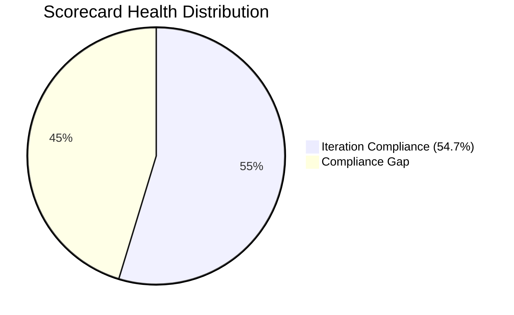
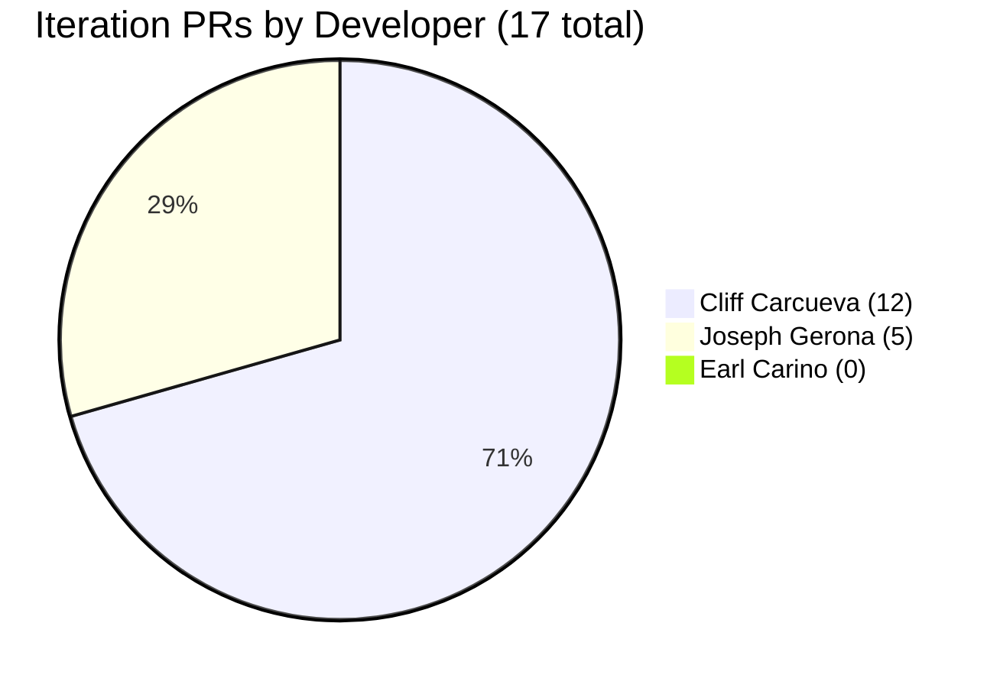
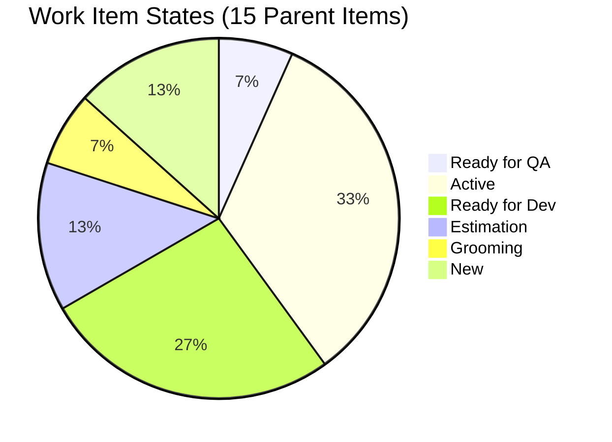
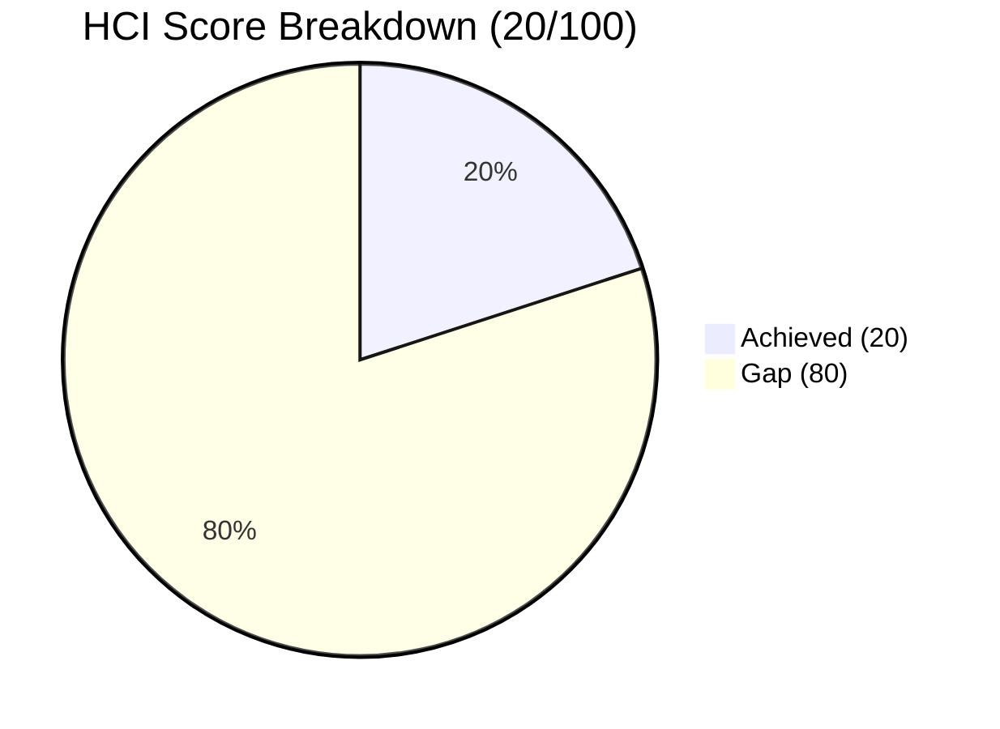

# Iteration Audit Report — Iteration 6.6 (IP)

> **Audit Date:** March 25, 2026 — Day 3 of 10 (30% elapsed)
> **Auditor:** Engineering Productivity Audit System
> **Prepared for:** Ramon Aseniero Jr., Project Owner
> **Audit Angles:** (1) GitHub Developer Productivity, (2) SAFe Compliance (v1 deterministic score model)

---

## 1. Audit Metadata

| Parameter | Value |
|-----------|-------|
| **ADO Organization** | `jairo` (`dev.azure.com/jairo`) |
| **ADO Project** | Auto Allies |
| **ADO Project ID** | `2d7af571-6ef6-4ad0-a509-c440e008b0fb` |
| **ADO Team** | AA Development Team |
| **ADO Team ID** | `330e6bf1-3515-443c-a2d8-b84f46c38f57` |
| **ADO Team Board URL** | [Stories and Deliverables](https://dev.azure.com/jairo/Auto%20Allies/_boards/board/t/AA%20Development%20Team/Stories%20and%20Deliverables) |
| **Backlog** | Stories and Deliverables (`Microsoft.RequirementCategory`) |
| **Iteration** | Iteration 6.6 (IP) |
| **Iteration Dates** | March 23, 2026 – April 5, 2026 (14 calendar days / 10 working days) |
| **GitHub Repo — Frontend** | `jairosoft-com/autoallies-version2` |
| **GitHub Repo — Backend** | `jairosoft-com/autoallies-api-core` |
| **Previous Audit** | AUDIT_2026-03-22_2329.md (Iter 6.5 Sprint Close, Compliance: 45.3% Red) |
| **Scope Note** | No other ADO boards, teams, projects, or GitHub repositories were analyzed |

---

## 2. Executive Summary

This is an **early-sprint audit** for **Iteration 6.6 (IP)**, conducted on Day 3 of 10 working days (30% elapsed). This is the first iteration of the new sprint after Iteration 6.5 closed with a 42.3% commit-to-done ratio and a 45.3% compliance score.

**Sprint Status: EARLY — ACTIVE DEVELOPMENT IN PROGRESS.** The team has produced **17 PRs across both repos in 3 working days**, signaling a strong start compared to Iteration 6.5's pace. However, **zero items have been closed** and only **1 of 15 items has reached Ready for QA** (a defect from a prior iteration).

**Key observations:**

- **Active development cadence:** 17 PRs in 3 days (Iteration 6.5 had 23 PRs over 10 working days total)
- **Cliff Carcueva leads Git output** with 12 PRs across both repos; Joseph Gerona contributed 5 PRs
- **Earl Carino has zero GitHub PRs** — carries 12 SP of Enabler work (migration tasks) with no Git evidence, continuing the pattern from Iteration 6.5
- **Structural quality gaps persist:** zero code reviews, zero branch protection, zero formal traceability — identical to every prior audit
- **3 new orphaned Spikes** replace the 3 from Iteration 6.5 (different IDs, same pattern)
- **Remediation actions from Iteration 6.5 have not been implemented** — branch protection, PR templates, and test case linking remain absent

### Key Performance Indicators — Day 3

| KPI | Current Value | Status | Classification |
|-----|---------------|--------|----------------|
| Sprint Velocity (completed) | **0 SP** | — Early sprint | Developer Productivity |
| Committed SP | **28 SP** (12 items with SP) | — | SAFe Compliance |
| Completion Rate (items) | **0%** (0 of 15) | — Early sprint | Developer Productivity |
| Items in Ready for QA | **1** (2 SP) | 🟡 Progressing | Cross-cutting |
| Iteration PRs (merged) | **17** | 🟢 STRONG cadence | Developer Productivity |
| Code Reviews Performed | **0** | 🔴 CRITICAL | Cross-cutting |
| ADO-GitHub Traceability | **0%** | 🔴 CRITICAL | Cross-cutting |
| Branch Protection | **None** | 🔴 CRITICAL | Developer Productivity |
| Iteration Compliance Score | **54.7% (Red)** | 🔴 CRITICAL | SAFe Compliance |
| SGPI (Committed Scope) | **0.0%** | — Early sprint | SAFe Compliance |
| HCI | **20/100** | 🔴 CRITICAL | Engineering Health |

---

## 3. Iteration Scope and Methodology

### Scope

This audit examines **Iteration 6.6 (IP)** of the **AA Development Team** within the **Auto Allies** project. The iteration runs from **March 23 to April 5, 2026**. Evidence is drawn exclusively from:

- ADO work items assigned to the `AA Development Team` on the `Stories and Deliverables` backlog for this iteration
- GitHub activity in `jairosoft-com/autoallies-version2` (Frontend) and `jairosoft-com/autoallies-api-core` (Backend)
- GitHub evidence is filtered to the iteration date window (March 23–25)

### Methodology

1. Resolved the active iteration via the ADO team settings API
2. Pulled all parent work items and child tasks for the iteration backlog
3. Retrieved story points, states, closure dates, and parent links from ADO
4. Retrieved team capacity and days-off configuration from ADO
5. Collected all PRs, commits, and branch data from both GitHub repos
6. Correlated GitHub activity to ADO work items using branch names, PR titles, and commit messages
7. Computed SGPI, Iteration Compliance Score, and HCI
8. Compared against Iteration 6.5 sprint close audit for delta context
9. Produced findings only from observable evidence

---

## 4. Scorecard Summary

| Score | Value | Band | vs Iter 6.5 Close |
|-------|-------|------|--------------------|
| **Iteration Compliance Score** | **54.7%** | 🔴 Red (<75) | ⬆ +9.4 from 45.3% |
| **SGPI (Committed Scope)** | **0.0%** | — Early sprint | ⬇ from 42.3% (new iteration) |
| **HCI** | **20/100** | 🔴 Critical | — (new metric for this iteration) |

---

## 5. Sprint Goal Predictability (SGPI)

**Classification:** Cross-cutting

### SGPI Scores

| Metric | Formula | Value |
|--------|---------|-------|
| **SGPI (Committed Scope)** | Closed SP / Total Committed SP | **0 / 28 = 0.0%** |
| Original Scope | Closed SP / Original Planned SP | 0 / 27 = 0.0% |
| Delivered Proxy | (Closed SP + QA SP) / Total Committed SP | (0 + 2) / 28 = **7.1%** |

### Sprint Composition

| Component | Value |
|-----------|-------|
| Items at sprint start | **14** (27 SP across 11 estimated items) |
| Items added mid-sprint | **1** (#201597, 1 SP — added Mar 24) |
| Total committed | **15 items, 28 SP** (12 items with SP, 3 without) |
| SP Closed | **0** |
| SP in QA Pipeline | **2** (#198313) |

### Daily Probability Tracking

| Date | WD | Cumulative SP Done | Remaining SP | Probability | Event |
|------|----|--------------------|--------------|-------------|-------|
| Mar 23 (Mon) | 1 | 0 | 28 | **0.0%** | Sprint start — 12 PRs |
| Mar 24 (Tue) | 2 | 0 | 28 | **0.0%** | 3 PRs — active development |
| Mar 25 (Wed) | 3 | 0 | 28 | **0.0%** | 2 PRs — #198313 moved to Ready for QA |

**Assessment:** Zero closures in 3 days is expected this early. The team is building toward closures with active PR output. In Iteration 6.5, the first closure didn't occur until Day 3 (Mar 11). The proxy SGPI of 7.1% (reflecting #198313 in QA) shows pipeline progression.

---

## 6. Developer Productivity Findings

**Classification:** Developer Productivity

### 6.1 GitHub User Mapping

| GitHub Handle | Name | Role |
|---------------|------|------|
| ccarcuevajairo | Cliff Carcueva | Developer |
| ecarinoJS | Earl Carino | Developer |
| JosephJairo | Joseph Gerona | Developer |
| RodenCole | Roden Cole | Deployment |

### 6.2 Iteration PR Activity — Day 3 (March 23–25)

#### Frontend — `autoallies-version2` (9 PRs)

| PR # | Title | Author | Date | Reviewers |
|------|-------|--------|------|-----------|
| 79 | Feature/messaging cliff 2 | ccarcuevajairo | Mar 23 | 0 |
| 80 | Feature/messaging cliff 2 | ccarcuevajairo | Mar 23 | 0 |
| 81 | Develop (reverse merge to feature branch) | JosephJairo | Mar 23 | 0 |
| 82 | Super admin cases frontend final fixes | JosephJairo | Mar 23 | 0 |
| 83 | Super admin case list frontend deployment fix | JosephJairo | Mar 23 | 0 |
| 84 | Add message status handling | ccarcuevajairo | Mar 23 | 0 |
| 85 | Feature/messaging cliff 3 | ccarcuevajairo | Mar 24 | 0 |
| 86 | Feature/messaging cliff 3 | ccarcuevajairo | Mar 24 | 0 |
| 87 | Refactor code structure for addons | ccarcuevajairo | Mar 25 | 0 |

#### Backend — `autoallies-api-core` (8 PRs)

| PR # | Title | Author | Date | Reviewers |
|------|-------|--------|------|-----------|
| 35 | Feature/messaging cliff 2 | ccarcuevajairo | Mar 23 | 0 |
| 36 | Feature/messaging cliff 2 | ccarcuevajairo | Mar 23 | 0 |
| 37 | Dev (reverse merge to feature branch) | JosephJairo | Mar 23 | 0 |
| 38 | Super admin cases backend final fixes | JosephJairo | Mar 23 | 0 |
| 39 | Refactor user retrieval in MessageController | ccarcuevajairo | Mar 23 | 0 |
| 40 | Feature/messaging cliff 3 | ccarcuevajairo | Mar 23 | 0 |
| 41 | Feature/messaging cliff 3 | ccarcuevajairo | Mar 24 | 0 |
| 42 | Refactor add-on descriptions | ccarcuevajairo | Mar 25 | 0 |

### 6.3 PR Distribution by Developer

### 6.4 Developer Summary — Day 3

| Developer | ADO Items | Closed | Open | Iteration PRs | Review Participation | Sprint Grade |
|-----------|-----------|--------|------|---------------|---------------------|--------------|
| **Cliff Carcueva** | 4 items (7 SP) | 0 | 1 QA, 2 Active, 1 Dev | 12 (6 FE + 6 BE) | 0 reviews | B+ (high PR output, defect fix in QA) |
| **Joseph Gerona** | 4 items (8+ SP) | 0 | 2 Active, 1 Dev, 1 Spike | 5 (3 FE + 2 BE) | 0 reviews | B (active development, carry-forward work) |
| **Earl Carino** | 4 items (12 SP) | 0 | 1 Active, 2 Estimation, 1 Dev | 0 PRs | 0 reviews | D (zero Git evidence — pattern continues) |
| **Roden Cole** | 1 item (0 SP) | 0 | 1 Grooming | 0 PRs | 0 reviews | N/A (DevOps enabler) |
| **Mary Secusana** | 1 item (0 SP) | 0 | 1 New | 0 PRs | 0 reviews | D (no observable evidence) |
| **Jerlyn Ates** | QA tasks | — | — | 0 PRs | — | Incomplete (QA not yet engaged) |

### 6.5 Daily Activity Summary

| Date | PRs | Key Activity |
|------|-----|-------------|
| Mar 23 (WD1) | **12** | Messaging cliff-2 closures, super-admin cases fixes, messaging cliff-3 start |
| Mar 24 (WD2) | **3** | Messaging cliff-3 continuation |
| Mar 25 (WD3) | **2** | Addons defect fix (#198313 → Ready for QA) |

**Finding:** The team averaged 5.7 PRs/day in the first 3 working days — significantly higher than Iteration 6.5's average of 2.3 PRs/day. This suggests improved development momentum, though no items have crossed the finish line yet.

---

## 7. SAFe Compliance Findings

**Classification:** SAFe Compliance

### 7.1 Iteration Planning Discipline

| Criteria | Assessment | Evidence |
|----------|------------|----------|
| Work committed at planning | 🟡 Partial | 14 items at start; 1 item added mid-sprint |
| Capacity configured | ✅ Yes | 6 members, 28 hrs/day total, 0 days off |
| Story points estimated | 🟡 Partial | 12 of 15 items have SP; 3 items (#200374, #201470, #201528) unestimated |
| Sprint commitment met | — | Early sprint — no closures yet |
| Items in pre-Active states | 🔴 Concern | 2 items in Estimation (#200183, #200184), 1 in Grooming (#200374) |

### 7.2 Iteration Work Items — Current State

15 parent items are assigned to this iteration.

| ID | Title | Type | State | SP | Owner |
|----|-------|------|-------|----|-------|
| 198313 | Sign Up - Coverage Options Wrong Add-on Content | Defect | 🟣 Ready for QA | 2 | Cliff Carcueva |
| 201111 | Super Admin - Manual Assign Attorney Feature | User Story | 🔵 Active | 3 | Joseph Gerona |
| 201112 | Super Admin - Confirm Payment Feature | User Story | 🔵 Active | 3 | Cliff Carcueva |
| 201110 | Attorney - Accept and Reject Case | User Story | 🔵 Active | 3 | Joseph Gerona |
| 201376 | Membership Migration Stripe | Enabler | 🔵 Active | 5 | Earl Carino |
| 201528 | Support and Meetings - Joseph | Spike | 🔵 Active | — | Joseph Gerona |
| 200185 | Affiliate Migration | Enabler | ⚪ Ready for Dev | 1 | Earl Carino |
| 201118 | Terms and Conditions Link on Sign-Up Page | User Story | ⚪ Ready for Dev | 1 | Cliff Carcueva |
| 201106 | Add CRM Notes Text Box in Messaging | User Story | ⚪ Ready for Dev | 1 | Cliff Carcueva |
| 199007 | Account Control and Account Handling | User Story | ⚪ Ready for Dev | 2 | Joseph Gerona |
| 200183 | Attorney Migration | Enabler | 📐 Estimation | 1 | Earl Carino |
| 200184 | Ticket and Case Migration | Enabler | 📐 Estimation | 5 | Earl Carino |
| 200374 | DevOps Ver2 Production Environment | Enabler | 📐 Grooming | — | Roden Cole |
| 201470 | Operations Support Effort | Spike | 🆕 New | — | Mary Secusana |
| 201597 | V1 Ops Assistance - DB Update | Spike | 🆕 New | 1 | Unassigned |

### 7.3 State Distribution

### 7.4 WIP Analysis

| Metric | Value | Assessment |
|--------|-------|------------|
| Items in Active | 5 | 🟡 Within limits |
| Items in Ready for QA | 1 | 🟡 Low — pipeline building |
| Items in Ready for Dev | 4 | ⚪ Backlog available |
| Items in pre-Active states | 3 | 🔴 Grooming/Estimation items in sprint |
| Active items per developer | 1.7 | 🟡 Moderate |

**Finding:** 3 items (#200183, #200184, #200374) are in pre-Active states (Estimation/Grooming) despite being assigned to the sprint. This indicates these items were committed before being sprint-ready — a planning discipline gap.

### 7.5 Scope Stability

| Metric | Value |
|--------|-------|
| Items at sprint start | **14** (27 SP across estimated items) |
| Items added mid-sprint | **1** (#201597, 1 SP — V1 Ops Assistance, added Mar 24) |
| Scope increase | **7% by items, 4% by SP** |
| Items removed | **0** |

**Finding:** Scope stability is significantly improved over Iteration 6.5 (which had 36% item increase). Only 1 item added mid-sprint so far, though it's early.

### 7.6 Carryover from Iteration 6.5

The following patterns carry forward from Iteration 6.5:

| 6.5 Pattern | 6.6 Equivalent | Status |
|-------------|----------------|--------|
| #200187 Membership Migration (5 SP, Active) | #201376 Membership Migration Stripe (5 SP, Active) | Recreated as new work item |
| #200378 Support and Meetings — Joseph (Spike) | #201528 Support and Meetings - Joseph (Spike) | Recreated — still orphaned |
| #200839 V1 Ops Assistance (Spike) | #201597 V1 Ops Assistance - DB Update (Spike) | Recreated — still orphaned |
| #200873 Ops Support Effort (Spike) | #201470 Operations Support Effort (Spike) | Recreated — still orphaned |

**Finding:** Rather than moving uncompleted items from Iteration 6.5, the team created new work items with nearly identical titles. This breaks ADO traceability between iterations and inflates the backlog. The 3 orphaned Spikes pattern persists unchanged.

### 7.7 Team Capacity

| Team Member | Capacity/Day | Activity | Days Off |
|-------------|-------------|----------|----------|
| Earl Carino | 6 hrs | Development | None |
| Cliff Carcueva | 6 hrs | Development | None |
| Joseph Gerona | 4 hrs | Development | None |
| Jerlyn Ates | 6 hrs (2 Req + 4 Test) | Requirements + Testing | None |
| Roden Cole | 2 hrs | Deployment | None |
| Mary Secusana | 4 hrs | Documentation | None |
| **Team Total** | **28 hrs/day** | | **0 days off** |

---

## 8. Iteration Compliance Score

**Classification:** SAFe Compliance

The Iteration Compliance Score is computed from **all current-iteration parent backlog items** in the scoped backlog. Child tasks and task-category items do not affect the numeric score.

**Eligible Parent Backlog Items:** 15 (6 User Stories + 4 Enablers + 3 Spikes + 2 Defects)

### 8.1 Compliance Score Table

| Dimension | Eligible Items | Compliant Items | Failed Items | Score % | Weight | Weighted Contribution | Evidence | Reason |
|-----------|---------------|-----------------|-------------|---------|--------|-----------------------|----------|--------|
| Alignment | 15 | 12 | 3 | 80.0% | 25 | 20.0 | 12 items have Feature-layer parents (#192370, #201685). 3 Spikes (#201470, #201528, #201597) have no parent link. | 3 Orphaned / Non-Compliant |
| Estimation | 15 | 12 | 3 | 80.0% | 20 | 16.0 | 12 items have SP > 0. 3 items (#200374, #201470, #201528) have no SP despite being committed to the sprint. | 3 items unestimated |
| Quality / DoD | 0 | 0 | 0 | 0.0% | 35 | 0.0 | 0 Closed items — no items eligible for Quality/DoD assessment. No test artifacts linked to any item. | No closures on Day 3 — 0 eligible items |
| Iteration Integrity | 15 | 14 | 1 | 93.3% | 20 | 18.7 | 14 items present from sprint start. 1 item (#201597) added Mar 24 without justification. | 1 mid-sprint addition |
| **OVERALL** | — | — | — | — | **100** | **54.7%** | All parent backlog items scored | **🔴 Red (<75)** |

### 8.2 Per-Item Alignment Classification

| Item ID | Title | Type | Parent ID | Parent Type | Classification |
|---------|-------|------|-----------|-------------|----------------|
| 198313 | Sign Up - Add-on Content | Defect | 201685 | Feature | Feature-linked |
| 201111 | Manual Assign Attorney | User Story | 201685 | Feature | Feature-linked |
| 201112 | Confirm Payment | User Story | 201685 | Feature | Feature-linked |
| 201110 | Accept and Reject Case | User Story | 201685 | Feature | Feature-linked |
| 201118 | Terms and Conditions Link | User Story | 201685 | Feature | Feature-linked |
| 201106 | CRM Notes Text Box | User Story | 201685 | Feature | Feature-linked |
| 199007 | Account Control | User Story | 201685 | Feature | Feature-linked |
| 200374 | DevOps Ver2 Production | Enabler | 192370 | Enabler Feature | Feature-linked |
| 201376 | Membership Migration | Enabler | 192370 | Enabler Feature | Feature-linked |
| 200183 | Attorney Migration | Enabler | 192370 | Enabler Feature | Feature-linked |
| 200185 | Affiliate Migration | Enabler | 192370 | Enabler Feature | Feature-linked |
| 200184 | Ticket/Case Migration | Enabler | 192370 | Enabler Feature | Feature-linked |
| 201470 | Operations Support | Spike | — | — | Orphaned / Non-Compliant |
| 201528 | Support and Meetings | Spike | — | — | Orphaned / Non-Compliant |
| 201597 | V1 Ops Assistance | Spike | — | — | Orphaned / Non-Compliant |

### 8.3 Score Interpretation

| Range | Rating |
|-------|--------|
| >= 90 | Green (Strong) |
| 75–89.9 | Yellow (Developing) |
| < 75 | Red (Critical) |

**At 54.7%, the iteration opens in the Red band.** The score is higher than Iteration 6.5's close (45.3%) due to improved Iteration Integrity (93.3% vs 66.7% — fewer mid-sprint additions so far) and improved Estimation (80.0% vs 60.0%). Quality/DoD remains at 0% with no closed items to evaluate. Alignment remains at 80.0% with 3 orphaned Spikes.

**Path to Yellow (75%):** The team needs Quality/DoD to improve, which requires closing items with linked test artifacts. Even closing 3-4 items with test cases would move this dimension from 0% and significantly lift the overall score.

---

## 9. Engineering Health Index (HCI)

**Classification:** Engineering Health

### 9.1 HCI Dimension Scores

| # | Dimension | Score | Evidence | Remediation |
|---|-----------|-------|----------|-------------|
| 1 | PR Review Compliance | **0/10** | 0 of 17 PRs had any reviewer. 100% self-merged. | Enable required reviews on develop/dev branches |
| 2 | Branch Protection & Enforcement | **0/10** | Neither repo has branch protection. All branches unprotected. | Enable branch protection rules on main, develop, dev |
| 3 | CI/CD Gate Quality | **0/10** | No CI/CD quality gates, automated tests, or status checks. | Add at minimum lint + build checks as required status checks |
| 4 | Code Ownership | **0/10** | No CODEOWNERS file in either repo. No PR templates. | Create CODEOWNERS files and PR templates |
| 5 | Merge Hygiene & Churn | **2/10** | PRs are used (good) but all self-merged instantly. 2 reverse merges (develop → feature). Multiple duplicate PRs to same branch. | Enforce minimum open time and review before merge |
| 6 | Work Item ↔ GitHub Traceability | **1/10** | 0% formal traceability (zero AB# refs). Some semantic correlation via branch names. | Require AB#ID in PR titles; add PR template with work item field |
| 7 | Sprint Discipline | **4/10** | Day 3: 0 closures but 17 PRs show active cadence. 3 items in pre-Active states (not sprint-ready). | Ensure all items are sprint-ready (estimated, groomed) before commitment |
| 8 | Defect Triage & Velocity | **4/10** | 1 defect (#198313) progressing through pipeline to QA. Defects from 6.5 (#200773, #201012) not carried forward. | Track defect cycle time; prioritize customer-facing defects |
| 9 | Backlog & Story Hygiene | **6/10** | 12/15 items estimated. 7/8 estimable items have AC. Parent links on 12/15 items. | Estimate and parent-link remaining 3 Spikes |
| 10 | Capacity Balance & Ownership | **3/10** | Earl carries 12 SP with 0 PRs. Cliff has 7 SP with 12 PRs. Joseph has 8+ SP with 5 PRs. Imbalanced. | Earl must use GitHub for delivery evidence |
| | **HCI Total** | **20/100** | | **Critical — structural engineering controls absent** |

### 9.2 HCI Summary

The HCI score of **20/100** reflects the complete absence of engineering guardrails (PR reviews, branch protection, CI/CD, CODEOWNERS). These are structural deficiencies that have persisted across all audited iterations. The 20 points earned come from basic PR usage patterns, backlog hygiene, and active sprint cadence.

---

## 10. ADO-to-GitHub Traceability Analysis

**Classification:** Cross-cutting

### 10.1 Formal Traceability

| Metric | Value |
|--------|-------|
| ADO work item IDs in any Git artifact | **0** |
| `AB#` references anywhere | **0** |
| **Traceability score** | **0%** |

### 10.2 Semantic Correlation

| ADO Item | GitHub Activity | Confidence | Status |
|----------|----------------|------------|--------|
| #198313 Sign Up Add-on Defect | `defect/addons-cliff` (FE #87; BE #42) | HIGH | Ready for QA |
| #201111 Super Admin Assign Attorney | `feature/super-admin-cases-frontend/backend` (FE #82, #83; BE #38) | HIGH | Active |
| #201112 Confirm Payment | `feature/case-confirm-payment` (branch exists, no iteration PRs) | LOW | Active |
| #201110 Accept/Reject Case | No matching PRs (may share super-admin branch) | LOW | Active |
| Messaging items (#201106, etc.) | `feature/messaging-cliff-2`, `feature/messaging-cliff-3` (FE #79-80, #84-86; BE #35-36, #39-41) | MEDIUM | Various |
| #201376 Membership Migration | No matching PRs | NONE | Active |
| #200183–200185 Migration Enablers | No matching PRs | NONE | Estimation/Dev |
| All other items | No matching PRs | NONE | Various |

**Finding:** Formal traceability remains at **0%** — unchanged across 9 consecutive audits. The `AB#` prefix has never been used. Semantic correlation identifies 2 high-confidence matches and several medium-confidence matches via branch naming conventions, but these provide no automated linking.

---

## 11. Collaboration and Review Analysis

**Classification:** Cross-cutting

| Metric | Value |
|--------|-------|
| Total iteration PRs | **17** |
| PRs with at least 1 reviewer | **0** (0%) |
| PRs self-merged | **17** (100%) |
| Average PR open-to-merge time | **< 1 minute** |
| Review comments | **0** |

**Finding:** The zero-review pattern continues unchanged from Iteration 6.5. All 17 PRs were self-merged within seconds of creation. This represents the 9th consecutive audit documenting this systemic absence of peer review.

---

## 12. Repository Hygiene

**Classification:** Developer Productivity

| Control | autoallies-version2 | autoallies-api-core |
|---------|---------------------|---------------------|
| Branch protection | None | None |
| Required reviewers | None | None |
| PR templates | None | None |
| CODEOWNERS | None | None |
| CI/CD quality gates | None | None |
| Active branches | **47** | **27** |
| Stale feature branches | **35+** (many from prior iterations) | **15+** |

**Finding:** Both repos carry a significant number of stale feature branches that were never cleaned up. The frontend repo has 47 branches — many from iterations ago. No hygiene controls have been implemented despite repeated audit recommendations.

---

## 13. Risks and Bottlenecks

| # | Finding | Severity | Source | Classification |
|---|---------|----------|--------|----------------|
| 1 | **Zero code reviews** — all 17 iteration PRs self-merged | CRITICAL | GitHub | Cross-cutting |
| 2 | **Zero branch protection** across both repos | CRITICAL | GitHub | Developer Productivity |
| 3 | **Zero ADO-GitHub traceability** — 0 AB# references | CRITICAL | Cross-system | Cross-cutting |
| 4 | **3 items in pre-Active states** — #200183, #200184 in Estimation; #200374 in Grooming (not sprint-ready) | HIGH | ADO | SAFe Compliance |
| 5 | **Earl has 12 SP / 0 PRs** — 4 Enablers with zero Git evidence, continuing 6.5 pattern | HIGH | Cross-system | Developer Productivity |
| 6 | **3 orphaned Spikes** — #201470, #201528, #201597 have no parent links, same pattern as 6.5 | MEDIUM | ADO | SAFe Compliance |
| 7 | **6.5 remediation actions not implemented** — branch protection, PR templates, test linking absent | MEDIUM | Cross-system | Cross-cutting |
| 8 | **Spike re-creation instead of carryover** — Iteration 6.5 Spikes were recreated as new IDs instead of moving, breaking cross-iteration traceability | MEDIUM | ADO | SAFe Compliance |
| 9 | **Zero test artifacts** linked to any work item | MEDIUM | ADO | SAFe Compliance |
| 10 | **47 stale branches** in frontend repo, 27 in backend — no cleanup discipline | LOW | GitHub | Developer Productivity |

---

## 14. Prioritized Remediation Actions

| Priority | Action | Owner | Impact | Classification |
|----------|--------|-------|--------|----------------|
| **P1** | **Enable branch protection with required reviews** on `develop` (FE) and `dev` (BE) branches. Require at least 1 approval before merge. | Karl (PM) | Eliminates 100% self-merge pattern; enables Quality/DoD and PR Review compliance | Cross-cutting |
| **P2** | **Add PR template with `AB#<ID>` field** to both repos. Enforce work item reference in PR titles. | Karl (PM) | Traceability moves from 0% immediately | Cross-cutting |
| **P3** | **Link test cases to work items** before closing them. Establish test case linking as part of DoD for this iteration. | Jerlyn (QA) | Quality/DoD score moves from 0% when items close | SAFe Compliance |
| **P4** | **Parent-link the 3 orphaned Spikes** (#201470, #201528, #201597) to appropriate Features and add SP estimates. | Karl (PM) | Alignment moves from 80% to 100%; Estimation improves | SAFe Compliance |
| **P5** | **Move pre-Active items to sprint-ready** — #200183 and #200184 should complete Estimation, #200374 should complete Grooming, before work begins. | Karl + Developers | Sprint discipline improvement | SAFe Compliance |
| **P6** | **Earl must use GitHub** for delivery evidence. His 4 Enablers (12 SP) need visible Git artifacts. | Earl | Cross-system traceability; productivity auditability | Developer Productivity |
| **P7** | **Clean up stale branches** — prune merged/abandoned branches from both repos. | Roden (DevOps) | Repository hygiene; reduces confusion | Developer Productivity |
| **P8** | **Move Spike items rather than recreating** — use ADO iteration path changes instead of creating new work items to preserve cross-iteration traceability. | Karl (PM) | Backlog traceability | SAFe Compliance |

---

## 15. Evidence Gaps and Limitations

1. **Early sprint timing:** This audit is conducted on Day 3 of 10 (30% elapsed). Zero closures are expected at this stage, making SGPI and Quality/DoD scores less meaningful as absolute measures. These scores will become significant as the sprint progresses.

2. **Quality/DoD denominator is zero:** With 0 Closed items, the Quality/DoD dimension has 0 eligible items. The 0% score reflects the absence of quality evidence rather than quality failure. This dimension will be re-evaluated as items close.

3. **Compliance Checklist field:** Not visible in the ADO schema. Excluded from Quality/DoD subcheck scoring per v1 contract.

4. **Acceptance Criteria field on Enablers:** Enablers do not expose AC in the ADO schema. Recorded as `evidence unavailable`; sub-check excluded for Enablers.

5. **TestedBy / Test Case links:** 0 of 15 items have linked test artifacts. No items are closed, so this gap has not yet impacted closure quality.

6. **Parent type verification:** Parent IDs #192370 and #201685 were identified from work item fields. Full parent work item details were not fetched to verify Feature-level type.

7. **GitHub commit-level analysis:** The default branches (`main`) show older commits only. PR-based analysis captures the iteration activity accurately since all development flows through PRs to `develop`/`dev` branches.

8. **Iteration 6.5 carryover items:** Several items from Iteration 6.5's carryover list (#200617, #194730, #198360, #198359, #200773, #201012) are not present in Iteration 6.6. Their current disposition (closed between sprints, moved to future iteration, or removed) was not verified.

---

*Report generated: March 25, 2026 | SAFe 6.0 Framework | Auto Allies — AA Development Team*
*Iteration 6.6 (IP): Mar 23 – Apr 5, 2026 | Day 3 of 10 (30% elapsed) | Compliance: 54.7% Red*
*SGPI: 0.0% (early sprint) | HCI: 20/100 | Committed: 28 SP | Closed: 0 SP*
*Previous: Iter 6.5 Close — Compliance 45.3%, SGPI 42.3%, Velocity 11 SP*
