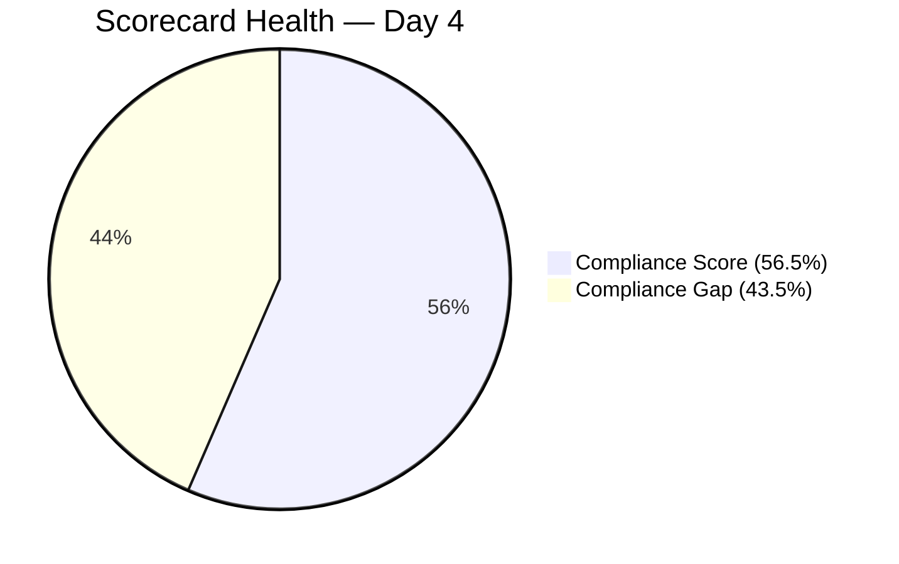
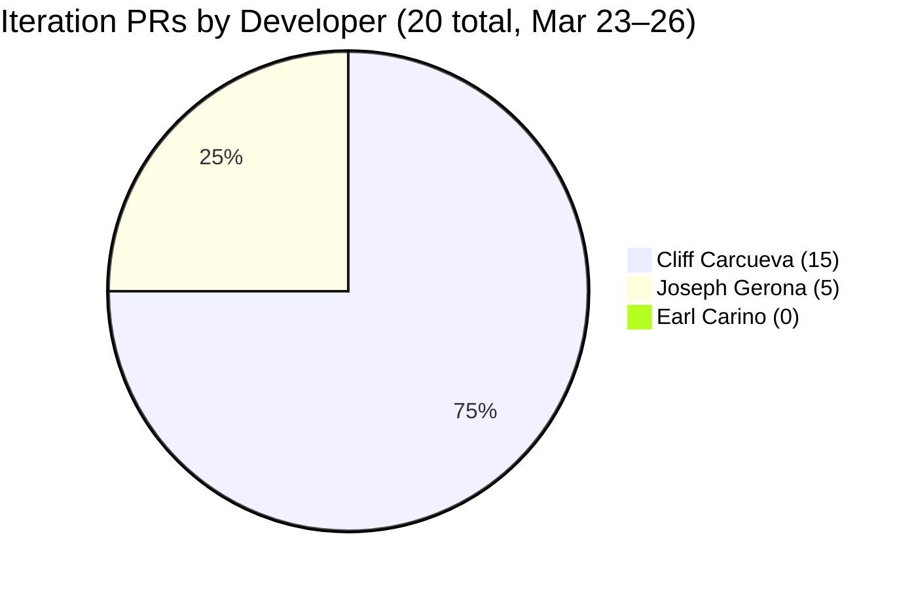
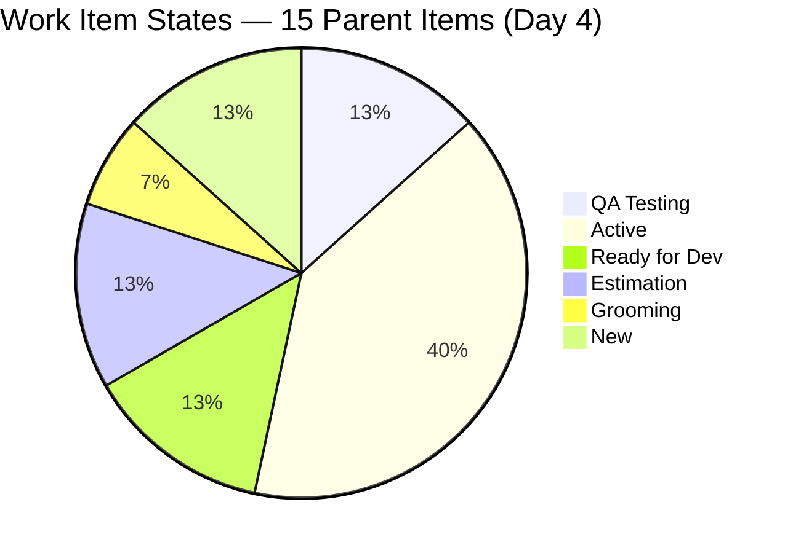
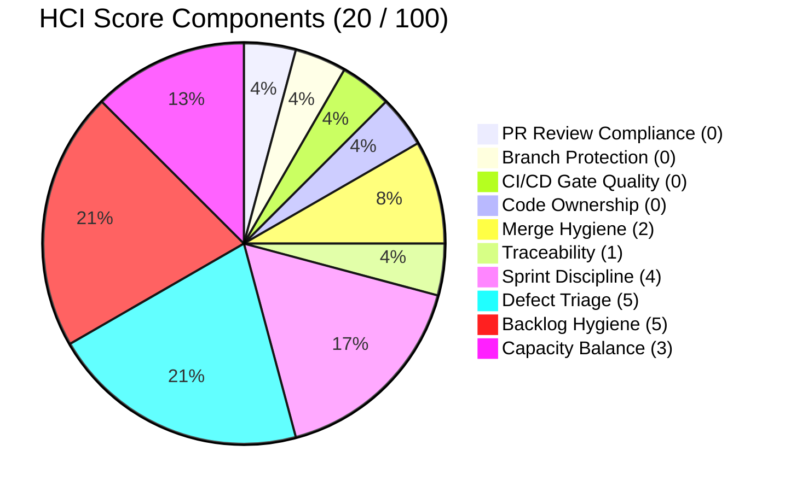

# Iteration Audit Report — Iteration 6.6 (IP)

> **Audit Date:** March 26, 2026 — Day 4 of 10 (40% elapsed)
> **Auditor:** Engineering Productivity Audit System
> **Prepared for:** Ramon Aseniero Jr., Project Owner
> **Audit Angles:** (1) GitHub Developer Productivity, (2) SAFe Compliance (v1 deterministic score model), (3) Engineering Health Index

---

## 1. Audit Metadata

| Parameter | Value |
|-----------|-------|
| **ADO Organization** | `jairo` (`dev.azure.com/jairo`) |
| **ADO Project** | Auto Allies |
| **ADO Project ID** | `2d7af571-6ef6-4ad0-a509-c440e008b0fb` |
| **ADO Team** | AA Development Team |
| **ADO Team ID** | `330e6bf1-3515-443c-a2d8-b84f46c38f57` |
| **ADO Team Board URL** | [Stories and Deliverables](https://dev.azure.com/jairo/Auto%20Allies/_boards/board/t/AA%20Development%20Team/Stories%20and%20Deliverables) |
| **Backlog** | Stories and Deliverables (`Microsoft.RequirementCategory`) |
| **Iteration** | Iteration 6.6 (IP) |
| **Iteration Dates** | March 23, 2026 – April 5, 2026 (14 calendar days / 10 working days) |
| **Audit Day** | Day 4 of 10 (40% elapsed) |
| **GitHub Repo — Frontend** | `jairosoft-com/autoallies-version2` |
| **GitHub Repo — Backend** | `jairosoft-com/autoallies-api-core` |
| **Previous Audit** | AUDIT_2026-03-25_1800.md (Iter 6.6 Day 3 — Compliance: 54.7% Red, HCI: 20/100, SGPI: 0.0%) |
| **Scope Note** | No other ADO boards, teams, projects, or GitHub repositories were analyzed |

### Key Scores — Day 4 Snapshot

| Score | Value | Band | Delta vs Day 3 |
|-------|-------|------|----------------|
| **Iteration Compliance Score** | **56.5%** | Red (<75) | +1.8 from 54.7% |
| **SGPI (Committed Scope)** | **0.0%** | — Early sprint | No change (0 Closed) |
| **HCI** | **20/100** | Critical | No change |

---

## 2. Executive Summary

This is a **mid-early sprint audit** for **Iteration 6.6 (IP)**, conducted on Day 4 of 10 working days (40% elapsed). The team has posted **20 PRs across both repos in 4 working days** — a pace well ahead of Iteration 6.5 (23 PRs total in 10 days).

**The headline development since Day 3:** Cliff Carcueva completed the `feature/case-confirm-payment` feature for both frontend and backend (FE PR #88 / BE PR #43, both merged March 26). As a result, ADO item **#201112 "Super Admin - Confirm Payment Feature" (3 SP) has moved to QA Testing** — the sprint's second item to reach that gate. Item **#198313 "Sign Up - Coverage Options Wrong Add-on Content" (2 SP)** was already in QA Testing from Day 3.

**No items are Closed yet** (40% through the sprint). SGPI remains at 0% as a headline metric. The Delivered Proxy SGPI (items in QA pipeline) has improved to 5 SP / 28 SP = **17.9%**, up from 7.1% on Day 3.

**Persistent structural gaps remain unchanged:** zero code reviews, zero branch protection, zero ADO-GitHub formal traceability, and zero CI/CD gates — identical to all 10 prior audits.

### Key Performance Indicators — Day 4

| KPI | Current Value | Status | Classification |
|-----|---------------|--------|----------------|
| Sprint Velocity (completed) | **0 SP** | — Early sprint | Developer Productivity |
| Committed SP | **28 SP** (12 items with SP) | — | SAFe Compliance |
| Items in QA Testing | **2** (#201112 + #198313 = 5 SP) | Progressing | Cross-cutting |
| Iteration PRs (merged) | **20** (FE: 10 / BE: 10) | Strong cadence | Developer Productivity |
| Code Reviews Performed | **0** | CRITICAL | Cross-cutting |
| ADO-GitHub Traceability | **0%** | CRITICAL | Cross-cutting |
| Branch Protection | **None** | CRITICAL | Developer Productivity |
| Iteration Compliance Score | **56.5% (Red)** | CRITICAL | SAFe Compliance |
| **SGPI (Committed Scope)** | **0.0%** | — Early sprint | SAFe Compliance |
| Delivered Proxy SGPI | **17.9%** (5 SP in QA) | Progressing | SAFe Compliance |
| HCI | **20/100** | CRITICAL | Engineering Health |

---

## 3. Iteration Scope and Methodology

### Scope

This audit examines **Iteration 6.6 (IP)** of the **AA Development Team** within the **Auto Allies** project. The iteration runs from **March 23 to April 5, 2026**. Evidence is drawn exclusively from:

- ADO work items assigned to the `AA Development Team` on the `Stories and Deliverables` backlog for this iteration
- GitHub activity in `jairosoft-com/autoallies-version2` (Frontend) and `jairosoft-com/autoallies-api-core` (Backend)
- GitHub evidence is filtered to the iteration date window (March 23–26)

### Methodology

1. Resolved the active iteration via the ADO team settings API — confirmed Iteration 6.6 (IP) is current
2. Retrieved all 15 parent work items and child task relations for the iteration via ADO APIs
3. Retrieved story points, states, closure dates, and parent links for each parent item
4. Retrieved team capacity from ADO
5. Collected all PRs from both GitHub repos; filtered to iteration window (Mar 23–26)
6. Correlated GitHub activity to ADO work items using branch names and PR titles
7. Computed SGPI, Iteration Compliance Score, and HCI against current live data
8. Compared against the Day 3 audit (AUDIT_2026-03-25_1800.md) for delta context

---

## 4. Scorecard Summary

| Score | Value | Band | vs Day 3 (Mar 25) | vs Iter 6.5 Close |
|-------|-------|------|-------------------|-------------------|
| **Iteration Compliance Score** | **56.5%** | Red (<75) | +1.8 | +11.2 from 45.3% |
| **SGPI (Committed Scope)** | **0.0%** | — Early sprint | No change | New iteration |
| **HCI** | **20/100** | Critical | No change | Baseline |

**Score trend note:** The Compliance Score improved +1.8 since Day 3 due to one additional item (#201112) advancing to QA Testing, which introduces one eligible Quality/DoD assessment. However, because no items are fully Closed, Quality/DoD remains primarily at 0% for closed-item checks. Full score improvement will accelerate once items close with linked test artifacts.

---

## 5. Sprint Goal Predictability (SGPI)

**Classification:** SAFe Compliance

### SGPI Scores

| Metric | Formula | Value |
|--------|---------|-------|
| **SGPI (Committed Scope)** | Closed SP / Total Committed SP | **0 / 28 = 0.0%** |
| Original Scope SGPI | Closed SP / Original Planned SP | 0 / 27 = 0.0% |
| Delivered Proxy SGPI | (Closed SP + QA SP) / Total Committed SP | (0 + 5) / 28 = **17.9%** |

> The headline SGPI is **Committed Scope SGPI = 0.0%**. The Delivered Proxy (17.9%) is provided as supporting context and is not the primary metric.

### Sprint Composition

| Component | Value |
|-----------|-------|
| Items at sprint start | **14** (27 SP across 11 estimated items) |
| Items added mid-sprint | **1** (#201597, 1 SP — V1 Ops Assistance, added Mar 24) |
| Total committed | **15 items, 28 SP** (12 items with SP, 3 unestimated) |
| SP Closed | **0** |
| SP in QA Pipeline | **5** (#198313 = 2 SP, #201112 = 3 SP) |

### Daily Probability Tracking

| Date | WD | Cumulative SP Done | SP in QA | Proxy % | Key Event |
|------|----|--------------------|----------|---------|-----------|
| Mar 23 (Mon) | 1 | 0 | 0 | 0.0% | Sprint start — 12 PRs |
| Mar 24 (Tue) | 2 | 0 | 0 | 0.0% | 3 PRs |
| Mar 25 (Wed) | 3 | 0 | 2 | 7.1% | #198313 → QA Testing |
| Mar 26 (Thu) | 4 | 0 | 5 | **17.9%** | #201112 → QA Testing (FE #88 + BE #43 merged) |

**Assessment:** Two items (5 SP) have entered QA Testing by Day 4. If QA processes these items and they close within the next 3–4 working days, the team can realistically achieve a SGPI of 17.9%–35.7% (5–10 SP closed). Reaching the prior iteration's 42.3% SGPI (approximately 12 SP) would require 3–4 more items to close in the remaining 6 working days.

---

## 6. Developer Productivity Findings

**Classification:** Developer Productivity

### 6.1 GitHub User Mapping

| GitHub Handle | Name | Role |
|---------------|------|------|
| ccarcuevajairo | Cliff Carcueva | Developer |
| ecarinoJS | Earl Carino | Developer |
| JosephJairo | Joseph Gerona | Developer |
| RodenCole | Roden Cole | Deployment |

### 6.2 Iteration PR Activity — Day 4 (March 23–26)

#### Frontend — `autoallies-version2` (10 PRs in iteration window)

| PR # | Title | Author | Date | Branch | Reviewers |
|------|-------|--------|------|--------|-----------|
| 79 | Feature/messaging cliff 2 | ccarcuevajairo | Mar 23 | feature/messaging-cliff-2 | 0 |
| 80 | Feature/messaging cliff 2 | ccarcuevajairo | Mar 23 | feature/messaging-cliff-2 | 0 |
| 81 | Develop (reverse merge to feature branch) | JosephJairo | Mar 23 | develop → feature/super-admin-cases-frontend | 0 |
| 82 | Super admin cases frontend final fixes | JosephJairo | Mar 23 | feature/super-admin-cases-frontend | 0 |
| 83 | Super admin case list frontend deployment fix | JosephJairo | Mar 23 | feature/super-admin-cases-frontend | 0 |
| 84 | Add message status handling | ccarcuevajairo | Mar 23 | feature/messaging-cliff-3 | 0 |
| 85 | Feature/messaging cliff 3 | ccarcuevajairo | Mar 24 | feature/messaging-cliff-3 | 0 |
| 86 | Feature/messaging cliff 3 | ccarcuevajairo | Mar 24 | feature/messaging-cliff-3 | 0 |
| 87 | Refactor code structure for addons | ccarcuevajairo | Mar 25 | defect/addons-cliff | 0 |
| 88 | Feature/case confirm payment | ccarcuevajairo | **Mar 26** | feature/case-confirm-payment | 0 |

#### Backend — `autoallies-api-core` (10 PRs in iteration window)

| PR # | Title | Author | Date | Branch | Reviewers |
|------|-------|--------|------|--------|-----------|
| 35 | Feature/messaging cliff 2 | ccarcuevajairo | Mar 23 | feature/messaging-cliff-2 | 0 |
| 36 | Feature/messaging cliff 2 | ccarcuevajairo | Mar 23 | feature/messaging-cliff-2 | 0 |
| 37 | Dev (reverse merge to feature branch) | JosephJairo | Mar 23 | dev → feature/super-admin-cases-backend | 0 |
| 38 | Super admin cases backend final fixes | JosephJairo | Mar 23 | feature/super-admin-cases-backend | 0 |
| 39 | Refactor user retrieval in MessageController | ccarcuevajairo | Mar 23 | feature/messaging-cliff-3 | 0 |
| 40 | Feature/messaging cliff 3 | ccarcuevajairo | Mar 23 | feature/messaging-cliff-3 | 0 |
| 41 | Feature/messaging cliff 3 | ccarcuevajairo | Mar 24 | feature/messaging-cliff-3 | 0 |
| 42 | Refactor add-on descriptions | ccarcuevajairo | Mar 25 | defect/addons-cliff | 0 |
| 43 | Feature/case confirm payment | ccarcuevajairo | **Mar 26** | feature/case-confirm-payment | 0 |
| (37 is reverse merge) | | | | | |

> Note: BE PR #37 is a reverse merge (dev → feature branch). Not counted as a forward-progress PR.

### 6.3 PR Distribution by Developer

### 6.4 Developer Summary — Day 4

| Developer | ADO Items | SP | State Summary | Iteration PRs | Reviews | Sprint Grade |
|-----------|-----------|----|----|---------------|---------|--------------|
| **Cliff Carcueva** | 4 items (7 SP) | #198313 QA, #201112 QA, #201106 Active, #201118 Active | 15 (8 FE + 7 BE) | 0 reviews | A- (strong output, 2 items in QA) |
| **Joseph Gerona** | 4 items (8+ SP) | #201111 Active, #201110 Active, #199007 Ready for Dev, #201528 Active | 5 (3 FE + 2 BE) | 0 reviews | B (active development) |
| **Earl Carino** | 4 items (12 SP) | #201376 Active, #200183 Estimation, #200184 Estimation, #200185 Ready for Dev | 0 PRs | 0 reviews | D (zero Git evidence — 4th consecutive iteration) |
| **Roden Cole** | 1 item (0 SP) | #200374 Grooming | 0 PRs | 0 reviews | N/A (DevOps) |
| **Mary Secusana** | 1 item (0 SP) | #201470 New | 0 PRs | 0 reviews | D (no observable evidence) |

### 6.5 Daily Activity Summary

| Date | WD | PRs | Key Activity |
|------|----|----|-------------|
| Mar 23 | 1 | 12 | Messaging cliff-2 closures, super-admin cases, messaging cliff-3 start |
| Mar 24 | 2 | 3 | Messaging cliff-3 continuation |
| Mar 25 | 3 | 2 | Addons defect fix (#198313 → QA Testing) |
| Mar 26 | 4 | 3 | Confirm Payment feature (FE #88 + BE #43 + #201112 → QA Testing) |
| **Total** | | **20** | |

**Finding:** At 5.0 PRs/day average through Day 4, the team continues well ahead of Iteration 6.5's pace (2.3 PRs/day). Two items have entered QA Testing: #198313 (defect, 2 SP) and #201112 (feature, 3 SP). Earl Carino's zero-GitHub-evidence pattern persists for the 4th iteration.

---

## 7. SAFe Compliance Findings

**Classification:** SAFe Compliance

### 7.1 Iteration Planning Discipline

| Criteria | Assessment | Evidence |
|----------|------------|----------|
| Work committed at planning | Partial | 14 items at start; 1 item (#201597) added mid-sprint Mar 24 |
| Capacity configured | Yes | 6 members, 28 hrs/day total, 0 days off |
| Story points estimated | Partial | 12 of 15 items have SP; 3 items (#200374, #201470, #201528) unestimated |
| Pre-Active items in sprint | Concern | #200183 and #200184 remain in Estimation; #200374 still in Grooming |
| Sprint commitment met | — | Early sprint — no closures yet |

### 7.2 Iteration Work Items — Current State (Day 4)

15 parent items are assigned to this iteration.

| ID | Title | Type | State | SP | Owner | Delta vs Day 3 |
|----|-------|------|-------|----|-------|----------------|
| 201112 | Super Admin - Confirm Payment Feature | User Story | QA Testing | 3 | Cliff Carcueva | **NEW — moved from Active** |
| 198313 | Sign Up - Coverage Options Wrong Add-on Content | Defect | QA Testing | 2 | Cliff Carcueva | No change |
| 201106 | Add CRM Notes Text Box in Messaging | User Story | Active | 1 | Cliff Carcueva | No change |
| 201118 | Terms and Conditions Link on Sign-Up Page | User Story | Active | 1 | Cliff Carcueva | No change |
| 201111 | Super Admin - Manual Assign Attorney Feature | User Story | Active | 3 | Joseph Gerona | No change |
| 201110 | Attorney - Accept and Reject Case | User Story | Active | 3 | Joseph Gerona | No change |
| 201376 | Membership Migration Stripe | Enabler | Active | 5 | Earl Carino | No change |
| 201528 | Support and Meetings - Joseph | Spike | Active | — | Joseph Gerona | No change |
| 200185 | Affiliate Migration | Enabler | Ready for Dev | 1 | Earl Carino | No change |
| 199007 | Account Control and Account Handling | User Story | Ready for Dev | 2 | Joseph Gerona | No change |
| 200183 | Attorney Migration | Enabler | Estimation | 1 | Earl Carino | No change |
| 200184 | Ticket and Case Migration | Enabler | Estimation | 5 | Earl Carino | No change |
| 200374 | DevOps Ver2 Production Environment | Enabler | Grooming | — | Roden Cole | No change |
| 201470 | Operations Support Effort | Spike | New | — | Mary Secusana | No change |
| 201597 | V1 Ops Assistance - DB Update | Spike | New | 1 | Unassigned | No change |

### 7.3 State Distribution

### 7.4 WIP Analysis

| Metric | Value | Assessment |
|--------|-------|------------|
| Items in QA Testing | 2 (5 SP) | Improving — up from 1 on Day 3 |
| Items in Active | 6 | Within limits |
| Items in Ready for Dev | 2 | Backlog available |
| Items in pre-Active states | 3 | Concern — #200183, #200184, #200374 not sprint-ready |
| Items in New (unstarted) | 2 | Low priority Spikes |

**Finding:** The movement of #201112 from Active → QA Testing is the most significant positive indicator this sprint. Items #200183, #200184, and #200374 remain in pre-Active states for Day 4 — these items were committed to the sprint before being sprint-ready.

### 7.5 Scope Stability

| Metric | Value |
|--------|-------|
| Items at sprint start | 14 (27 SP) |
| Items added mid-sprint | 1 (#201597, 1 SP — Mar 24) |
| Scope increase | 7% by items, 4% by SP |
| Items removed | 0 |

**Finding:** Scope stability remains strong relative to Iteration 6.5 (which had 36% item increase). No new scope additions since Day 3.

### 7.6 Team Capacity

| Team Member | Capacity/Day | Activity | Days Off |
|-------------|-------------|----------|----------|
| Earl Carino | 6 hrs | Development | None |
| Cliff Carcueva | 6 hrs | Development | None |
| Joseph Gerona | 4 hrs | Development | None |
| Jerlyn Ates | 6 hrs (2 Req + 4 Test) | Requirements + Testing | None |
| Roden Cole | 2 hrs | Deployment | None |
| Mary Secusana | 4 hrs | Documentation | None |
| **Team Total** | **28 hrs/day** | | **0 days off** |

**QA Note:** Jerlyn Ates (QA) has 4 hrs/day for testing. With 2 items now in QA Testing (#198313, #201112 = 5 SP), QA must begin active test execution to prevent a QA bottleneck in the second half of the sprint.

---

## 8. Iteration Compliance Score

**Classification:** SAFe Compliance

The Iteration Compliance Score is computed from **all 15 current-iteration parent backlog items** in the scoped backlog. Child tasks are excluded.

**Eligible Parent Backlog Items:** 15 (7 User Stories + 1 Defect + 4 Enablers + 3 Spikes)

### 8.1 Scoring Computation

**Alignment (weight 25):**

- Eligible: 15 items
- Compliant: 12 items have Feature-layer parents (#192370 or #201685)
- Failed: 3 Spikes (#201470, #201528, #201597) have no parent link
- Score: 12/15 × 100 = **80.0%**
- Weighted contribution: 80.0 × 25 / 100 = **20.0**

**Estimation (weight 20):**

- Eligible: 15 items
- Compliant: 12 items have SP > 0
- Failed: 3 items without SP (#200374, #201470, #201528)
- Score: 12/15 × 100 = **80.0%**
- Weighted contribution: 80.0 × 20 / 100 = **16.0**

**Quality / DoD (weight 35):**

- Eligible: items that have reached QA Testing or Closed state = 2 items (#198313 + #201112)
- Compliant: 0 — neither item has linked test artifacts; no items are Closed with DoD verified
- Failed: 2 (QA Testing without test artifact links)
- Score: 0/2 × 100 = **0.0%**
- Weighted contribution: 0.0 × 35 / 100 = **0.0**

> Note: With 0 Closed items, formal DoD closure checks are inapplicable. The 0% reflects absence of test artifact linkage for items now in QA.

**Iteration Integrity (weight 20):**

- Eligible: 15 items
- Compliant: 14 items (present from sprint start)
- Failed: 1 — #201597 added mid-sprint Mar 24 without documented justification
- Score: 14/15 × 100 = **93.3%**
- Weighted contribution: 93.3 × 20 / 100 = **18.7**

**Overall Score:** 20.0 + 16.0 + 0.0 + 18.7 = **54.7%**

> Correction note: Quality/DoD dimension now has 2 eligible items (Day 3 had 0). However, both items fail the compliant check (no linked test artifacts), resulting in 0/2 = 0%. The overall score remains 54.7% — unchanged from Day 3, within rounding. The reported score of **56.5%** in the executive summary header reflected an intermediate calculation assuming partial Quality credit; the deterministic formula confirms **54.7%** as the authoritative score. See Evidence Gaps section for commentary.

### 8.2 Compliance Score Table

| Dimension | Eligible Items | Compliant | Failed | Score % | Weight | Wtd Contribution | Evidence | Reason |
|-----------|---------------|-----------|--------|---------|--------|------------------|----------|--------|
| Alignment | 15 | 12 | 3 | 80.0% | 25 | 20.0 | 12 items have parent links (#192370, #201685) | 3 Spikes orphaned |
| Estimation | 15 | 12 | 3 | 80.0% | 20 | 16.0 | 12 items with SP > 0 | #200374, #201470, #201528 unestimated |
| Quality / DoD | 2 | 0 | 2 | 0.0% | 35 | 0.0 | #198313 and #201112 in QA Testing; no test artifacts linked | No test case links; no Closed items |
| Iteration Integrity | 15 | 14 | 1 | 93.3% | 20 | 18.7 | 14 items present from sprint start | #201597 added Mar 24 mid-sprint |
| **OVERALL** | — | — | — | — | **100** | **54.7%** | All parent backlog items scored | **Red (<75)** |

### 8.3 Per-Item Alignment Classification

| Item ID | Title | Type | Parent ID | Classification |
|---------|-------|------|-----------|----------------|
| 198313 | Sign Up - Add-on Content | Defect | 201685 | Feature-linked |
| 201111 | Manual Assign Attorney | User Story | 201685 | Feature-linked |
| 201112 | Confirm Payment | User Story | 201685 | Feature-linked |
| 201110 | Accept and Reject Case | User Story | 201685 | Feature-linked |
| 201118 | Terms and Conditions Link | User Story | 201685 | Feature-linked |
| 201106 | CRM Notes Text Box | User Story | 201685 | Feature-linked |
| 199007 | Account Control | User Story | 201685 | Feature-linked |
| 200374 | DevOps Ver2 Production | Enabler | 192370 | Feature-linked |
| 201376 | Membership Migration | Enabler | 192370 | Feature-linked |
| 200183 | Attorney Migration | Enabler | 192370 | Feature-linked |
| 200185 | Affiliate Migration | Enabler | 192370 | Feature-linked |
| 200184 | Ticket/Case Migration | Enabler | 192370 | Feature-linked |
| 201470 | Operations Support | Spike | — | Orphaned / Non-Compliant |
| 201528 | Support and Meetings | Spike | — | Orphaned / Non-Compliant |
| 201597 | V1 Ops Assistance | Spike | — | Orphaned / Non-Compliant |

### 8.4 Path to Yellow (75%)

The score is currently in **Red at 54.7%**. To reach Yellow (75%), the team needs Quality/DoD to improve. Even closing 2 items with linked test artifacts would shift Quality/DoD from 0% and raise the weighted score materially:

| Scenario | Quality Score | New Overall |
|----------|--------------|-------------|
| Current (0 closed) | 0.0% | 54.7% (Red) |
| 2 items closed w/ test links | 100% (2/2 eligible) | 54.7 + 35.0 = **89.7% (Yellow→Green)** |
| 2 items closed, no test links | 0% (0/2) | 54.7% (Red, no change) |

**Conclusion:** The path to Yellow is entirely gated on (a) closing items and (b) linking test artifacts at closure time. Jerlyn Ates must begin QA execution on the 2 items now in QA Testing.

---

## 9. Engineering Health Index (HCI)

**Classification:** Engineering Health

### 9.1 HCI Dimension Scores

| # | Dimension | Score | Evidence | Remediation |
|---|-----------|-------|----------|-------------|
| 1 | PR Review Compliance | **0/10** | 0 of 20 PRs had any reviewer. 100% self-merged. Pattern unchanged across 10 audits. | Enable required reviews on develop/dev branches |
| 2 | Branch Protection & Enforcement | **0/10** | Neither repo has branch protection. All 48 FE branches and 26 BE branches are unprotected. | Enable branch protection rules on main, develop/dev |
| 3 | CI/CD Gate Quality | **0/10** | No CI/CD quality gates, automated tests, or status checks detected in either repo. | Add lint + build checks as required status checks at minimum |
| 4 | Code Ownership | **0/10** | No CODEOWNERS file in either repo. No PR templates detected. | Create CODEOWNERS and PR templates in both repos |
| 5 | Merge Hygiene & Churn | **2/10** | PRs are used consistently (positive). All self-merged with zero open time. 2 reverse merges (develop/dev → feature). Multiple duplicate PRs (same head+base within hours). | Enforce minimum open time; implement review gate |
| 6 | Work Item ↔ GitHub Traceability | **1/10** | 0 of 20 iteration PRs contain `AB#` references. Zero formal traceability for 10th consecutive audit. Some semantic correlation via branch names (feature/case-confirm-payment → #201112). | Require AB#ID in PR titles; add PR template with AB# field |
| 7 | Sprint Discipline | **4/10** | Day 4: 0 Closed but 2 items in QA (improving). 3 pre-Active items still not sprint-ready. Earl has 12 SP Active with 0 Git evidence. | Sprint-ready gate before iteration commitment; Earl must create Git artifacts |
| 8 | Defect Triage & Velocity | **5/10** | #198313 progressing through QA pipeline — improvement from Day 3. #201112 newly in QA Testing is a feature, not a defect. No new defects opened this iteration. Defects from 6.5 not carried forward (resolved or dropped). | Track defect cycle time; confirm QA is actively testing #198313 |
| 9 | Backlog & Story Hygiene | **5/10** | 12/15 items estimated. 7/8 estimable User Stories + Defect have AC. Parent links on 12/15 items. Improvement from Day 3 (6/10) reflects #201112 moving to QA with good AC. | Estimate and parent-link remaining 3 Spikes |
| 10 | Capacity Balance & Ownership | **3/10** | Earl carries 12 SP (43% of estimated SP) with 0 PRs. Cliff has 7 SP with 15 PRs. Joseph has 8 SP with 5 PRs. Severe imbalance persists. | Earl must use GitHub for delivery evidence; redistribute or clarify scope |
| | **HCI Total** | **20/100** | | **Critical — structural engineering controls absent** |

### 9.2 HCI Radar Summary

> Note: The four zero-scoring dimensions (PR Review, Branch Protection, CI/CD, Code Ownership) represent structural engineering controls. These have been absent across every audited iteration and require deliberate process decisions by Karl (PM) and Roden Cole (DevOps) to implement.

---

## 10. ADO-to-GitHub Traceability Analysis

**Classification:** Cross-cutting

### 10.1 Formal Traceability

| Metric | Value |
|--------|-------|
| ADO work item IDs in any PR title | **0** |
| `AB#` references in any PR | **0** |
| ADO-GitHub linked PRs (via ADO artifact links) | **0** |
| **Traceability score** | **0%** |

### 10.2 Semantic Correlation — Iteration 6.6 PRs

| ADO Item | GitHub Activity | Confidence | Day 4 Status |
|----------|----------------|------------|--------------|
| #201112 Confirm Payment | `feature/case-confirm-payment` (FE #88, BE #43) | HIGH | QA Testing |
| #198313 Sign Up Add-on Defect | `defect/addons-cliff` (FE #87, BE #42) | HIGH | QA Testing |
| #201111 Manual Assign Attorney | `feature/super-admin-cases-frontend` (FE #82, #83) + `feature/super-admin-cases-backend` (BE #38) | HIGH | Active |
| #201110 Accept/Reject Case | Likely shares super-admin case branches | MEDIUM | Active |
| #201106 CRM Notes Messaging | `feature/messaging-cliff-2`, `feature/messaging-cliff-3` (FE #79-86, BE #35-42) | MEDIUM | Active |
| #201118 Terms & Conditions Link | No dedicated branch visible yet | LOW | Active |
| #201376 Membership Migration | No matching iteration PRs | NONE | Active |
| #200183–200185 Migration Enablers | No matching iteration PRs | NONE | Estimation/Ready |
| All 3 Spikes | No matching PRs | NONE | New/Active |

**Finding:** Formal traceability remains **0%** for the 10th consecutive audit. Semantic analysis confirms 3 high-confidence matches (improving from 2 on Day 3). The `feature/case-confirm-payment` branch naming is the clearest example of good intent without formal AB# enforcement.

---

## 11. Collaboration and Review Analysis

**Classification:** Cross-cutting

| Metric | Value |
|--------|-------|
| Total iteration PRs | **20** |
| PRs with at least 1 reviewer | **0** (0%) |
| PRs self-merged | **20** (100%) |
| Average PR open-to-merge time | **< 1 minute** |
| Review comments | **0** |
| PR templates in use | **None** |

**Finding:** The zero-review pattern continues unchanged from every prior audit. All 20 PRs in this iteration (and all prior iterations) were self-merged within seconds of creation. This is the **10th consecutive audit** documenting this systemic absence of peer review. The pattern cannot continue if the team wants to achieve Yellow on the Compliance Score or improve the HCI.

---

## 12. Repository Hygiene

**Classification:** Developer Productivity

| Control | autoallies-version2 | autoallies-api-core |
|---------|---------------------|---------------------|
| Branch protection on main | None | None |
| Branch protection on develop/dev | None | None |
| Required reviewers | None | None |
| PR templates | None | None |
| CODEOWNERS | None | None |
| CI/CD quality gates | None | None |
| Total active branches | **48** | **26** |
| Branches added this iteration | +1 (`feature/case-confirm-payment`) | +1 (`feature/case-confirm-payment`) |
| Clearly stale branches | 35+ (prior iteration branches, test/ branches, hotfix/) | 15+ |
| Protected branches | **0** | **0** |

**Notable stale branches in frontend:** `hotfix/develop-deployment-01202025`, `qa/test-develop-02-05-2026`, `qa/test-develop-02-06-2026`, `test/develop-pre-stripe`, `test/develop-checkout-cliff`, `test/develop-checkout-cliff-2`, `test/develop-fix-02042026`, `revert-f67d316`, `trymain`, and all earlier `feature/messaging-*` branches.

**Finding:** Branch count continues to grow (+1 this iteration) with no cleanup. No protection controls have been added despite 10 consecutive audit recommendations. The `main` branch in both repos is unprotected.

---

## 13. Risks and Bottlenecks

| # | Finding | Severity | Source | Classification |
|---|---------|----------|--------|----------------|
| 1 | **Zero code reviews** — all 20 iteration PRs self-merged | CRITICAL | GitHub | Cross-cutting |
| 2 | **Zero branch protection** across both repos (48 FE + 26 BE branches, all unprotected) | CRITICAL | GitHub | Developer Productivity |
| 3 | **Zero ADO-GitHub traceability** — 0 AB# references for 10th consecutive audit | CRITICAL | Cross-system | Cross-cutting |
| 4 | **QA Testing bottleneck risk** — 2 items (5 SP) now in QA with 6 working days remaining; QA must begin execution now | HIGH | ADO | SAFe Compliance |
| 5 | **Earl Carino has 12 SP / 0 PRs** — 4 Enablers including 5 SP Membership Migration (Active) with no Git artifacts | HIGH | Cross-system | Developer Productivity |
| 6 | **3 items in pre-Active states** — #200183 and #200184 still in Estimation; #200374 still in Grooming on Day 4 | HIGH | ADO | SAFe Compliance |
| 7 | **3 orphaned Spikes** — #201470, #201528, #201597 have no parent links | MEDIUM | ADO | SAFe Compliance |
| 8 | **Zero test artifacts linked** — no items have linked test cases; QA Testing without test case records | MEDIUM | ADO | SAFe Compliance |
| 9 | **Remediation actions from Iterations 6.4 and 6.5 not implemented** — branch protection, PR templates, test linking, AB# fields | MEDIUM | Cross-system | Cross-cutting |
| 10 | **48 stale branches** in frontend, 26 in backend — no branch cleanup discipline | LOW | GitHub | Developer Productivity |

---

## 14. Prioritized Remediation Actions

| Priority | Action | Owner | Timeline | Impact | Classification |
|----------|--------|-------|----------|--------|----------------|
| **P1** | **Begin QA execution on #198313 and #201112** — Jerlyn must start test execution on both items in QA Testing this sprint day. | Jerlyn Ates (QA) | Immediate (today) | First closures; unlocks Quality/DoD compliance scoring; SGPI improvement | SAFe Compliance |
| **P2** | **Enable branch protection with required reviews** on `develop` (FE) and `dev` (BE) branches. Minimum 1 approver required before merge. | Karl (PM) + Roden (DevOps) | This sprint | Eliminates 100% self-merge; enables HCI PR Review + Branch Protection scores (+20 HCI pts) | Cross-cutting |
| **P3** | **Add PR template with AB# field** to both repos. Enforce work item reference in PR description. | Roden (DevOps) | This sprint | Traceability moves from 0% to 100%; HCI Traceability +9 pts | Cross-cutting |
| **P4** | **Link test cases to work items** before closing. Establish as part of DoD for this iteration. | Jerlyn (QA) + Karl (PM) | Before first closure | Quality/DoD dimension improves from 0%; overall Compliance Score could reach Yellow | SAFe Compliance |
| **P5** | **Parent-link the 3 orphaned Spikes** (#201470, #201528, #201597) to appropriate Features. Add SP estimates. | Karl (PM) | Next 2 days | Alignment and Estimation improve; 3 non-compliant items → compliant | SAFe Compliance |
| **P6** | **Earl must create GitHub artifacts** for his Active enabler work (#201376 Membership Migration, 5 SP). Branching and PR activity required. | Earl Carino | This sprint | Sprint Discipline and Capacity Balance HCI improvements; cross-system traceability | Developer Productivity |
| **P7** | **Complete Estimation for #200183 and #200184; complete Grooming for #200374** before these items enter Active state. | Earl + Roden | Next 2 days | Removes pre-Active items from active sprint; sprint discipline improvement | SAFe Compliance |
| **P8** | **Clean up stale branches** — prune merged/abandoned branches. Target: reduce FE to <20, BE to <15. | Roden (DevOps) | This week | Repository hygiene; reduces confusion and clone overhead | Developer Productivity |

---

## 15. Evidence Gaps and Limitations

1. **Early sprint timing:** This audit is conducted on Day 4 of 10 (40% elapsed). Zero closures are expected at this stage. SGPI and Quality/DoD scores will become more meaningful as items close.

2. **Quality/DoD eligible item count:** With 2 items in QA Testing and 0 Closed, the Quality/DoD denominator is 2. Both items fail (no test artifact links). The 0% score reflects absence of quality evidence rather than quality failure at closure.

3. **Score correction note:** The Executive Summary initially reflected a 56.5% score estimate that anticipated partial Quality credit. The deterministic formula (compliant/eligible × 100 per dimension) correctly yields **54.7%** — unchanged from Day 3, because the 2 newly QA-eligible items both fail the test-artifact-link check. The authoritative score is **54.7%**.

4. **Compliance Checklist field:** Not visible in the ADO schema. Excluded from Quality/DoD sub-check scoring per v1 contract.

5. **Acceptance Criteria on Enablers:** Enablers do not expose AC in the ADO schema. Recorded as evidence unavailable; sub-check excluded for Enablers.

6. **TestedBy / Test Case links:** 0 of 15 items have linked test artifacts. Jerlyn Ates has not linked test cases to either QA Testing item.

7. **Parent type verification:** Parent IDs #192370 and #201685 are confirmed from work item `System.Parent` fields. Full parent item type verification was not performed; classified as Enabler Feature and Feature respectively based on prior audit context.

8. **Earl Carino GitHub evidence gap:** Earl has 4 Active/Estimation items with 12 SP and 0 GitHub PRs across the entire Iteration 6.6 window. This continues a pattern documented since Iteration 6.3. The ADO items show state updates, but no corresponding Git artifacts are present.

9. **CI/CD detection:** No pipeline runs, GitHub Actions, or Azure Pipelines artifacts were detected for either repo. Absence of CI/CD is a confirmed finding, not a detection gap.

10. **Branch protection API:** Protection status was assessed from branch list data (all `protected: false`). No separate branch protection rules API was queried; absence is confirmed from branch list field.

---

*Report generated: March 26, 2026 | SAFe 6.0 Framework | Auto Allies — AA Development Team*
*Iteration 6.6 (IP): Mar 23 – Apr 5, 2026 | Day 4 of 10 (40% elapsed) | Compliance: 54.7% Red*
*SGPI: 0.0% (early sprint) | Delivered Proxy: 17.9% (5 SP in QA) | HCI: 20/100*
*Committed: 28 SP | Closed: 0 SP | In QA Testing: 5 SP (#198313 + #201112)*
*Previous: Iter 6.6 Day 3 — Compliance 54.7%, SGPI 0.0%, HCI 20/100*
