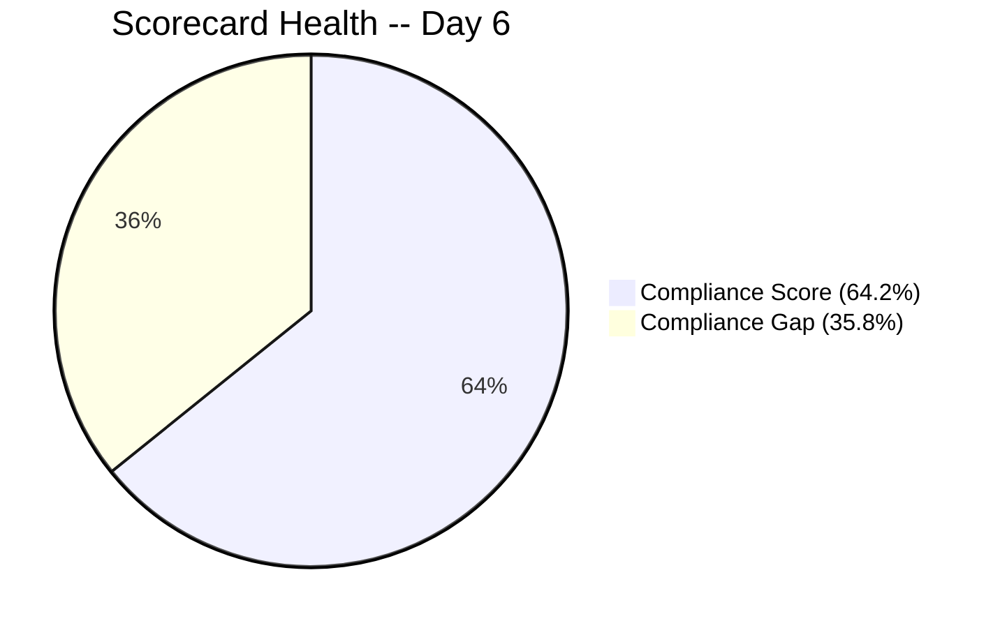
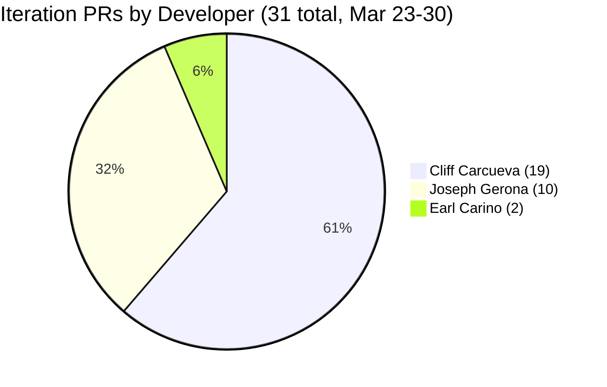

# Iteration Audit Report — Iteration 6.6 (IP)

> **Audit Date:** March 30, 2026 — Day 6 of 10 (60% elapsed)
> **Auditor:** Engineering Productivity Audit System
> **Prepared for:** Ramon Aseniero Jr., Project Owner
> **Audit Angles:** (1) GitHub Developer Productivity, (2) SAFe Compliance (v1 deterministic score model), (3) Engineering Health Index

---

## 1. Audit Metadata

| Parameter | Value |
|-----------|-------|
| **ADO Organization** | `jairo` (`dev.azure.com/jairo`) |
| **ADO Project** | Auto Allies |
| **ADO Project ID** | `2d7af571-6ef6-4ad0-a509-c440e008b0fb` |
| **ADO Team** | AA Development Team |
| **ADO Team ID** | `330e6bf1-3515-443c-a2d8-b84f46c38f57` |
| **ADO Team Board URL** | [Stories and Deliverables](https://dev.azure.com/jairo/Auto%20Allies/_boards/board/t/AA%20Development%20Team/Stories%20and%20Deliverables) |
| **Backlog** | Stories and Deliverables (`Microsoft.RequirementCategory`) |
| **Iteration** | Iteration 6.6 (IP) |
| **Iteration Dates** | March 23, 2026 -- April 5, 2026 (14 calendar days / 10 working days) |
| **Audit Day** | Day 6 of 10 (60% elapsed) |
| **GitHub Repo -- Frontend** | `jairosoft-com/autoallies-version2` |
| **GitHub Repo -- Backend** | `jairosoft-com/autoallies-api-core` |
| **Previous Audit** | AUDIT_20260326_1630.md (Iter 6.6 Day 4 -- Compliance: 56.5% Red, HCI: 20/100, SGPI: 0.0%) |
| **Scope Note** | No other ADO boards, teams, projects, or GitHub repositories were analyzed |

### Key Scores -- Day 6 Snapshot

| Score | Value | Band | Delta vs Day 4 |
|-------|-------|------|----------------|
| **Iteration Compliance Score** | **64.2%** | Red (<75) | +7.7 from 56.5% |
| **SGPI (Committed Scope)** | **28.6%** | Progressing | +28.6 from 0.0% |
| **HCI** | **26/100** | Critical | +6 from 20 |

---

## 2. Executive Summary

This is a **mid-sprint audit** for **Iteration 6.6 (IP)**, conducted on Day 6 of 10 working days (60% elapsed). The team has achieved **meaningful delivery progress** since Day 4, with **3 items now Closed (8 SP)** and **4 items in Ready for QA (10 SP)** -- a combined pipeline of 18 SP out of 28 SP committed (64.3%).

**Key developments since Day 4 (March 26):**

- **#198313 "[V2.0] Sign Up - Coverage options Wrong Add-on Content" (2 SP)** advanced from QA Testing to **Closed** (March 27).
- **#201376 "[V2.0] Membership Migration Stripe" (5 SP)** moved to **Closed** (March 27). This is the highest-value item closed so far.
- **#200183 "[V2.0] Attorney Migration" (1 SP)** moved to **Closed** (March 30) after backend PR #48 merged (enabler/200182-user-migration).
- **#201110 "Attorney - Accept and Reject Case" (3 SP)** advanced to **Ready for QA** (March 29) with matching FE PR #91 and BE PR #45.
- **#201118 "Terms and Conditions Link" (1 SP)** advanced to **Ready for QA** (March 30) with FE PRs #89 and #94.
- The **SGPI headline metric** has jumped from 0% to **28.6%** (8 SP closed out of 28 SP committed).

**31 PRs merged across both repos during the iteration window (Mar 23--30)** -- 16 frontend and 15 backend. This represents a strong development cadence with all three developers contributing.

**Persistent structural gaps remain:** zero code reviews, zero branch protection, zero ADO-GitHub formal traceability, and zero CI/CD quality gates. These have been consistent across all prior audits and continue to suppress the HCI score.

### Key Performance Indicators -- Day 6

| KPI | Current Value | Status | Classification |
|-----|---------------|--------|----------------|
| Sprint Velocity (completed) | **8 SP** (3 items Closed) | Progressing | Developer Productivity |
| Committed SP | **28 SP** (12 items with SP) | -- | SAFe Compliance |
| Items in QA Pipeline | **4** (10 SP) | Strong pipeline | Cross-cutting |
| Iteration PRs (merged) | **31** (FE: 16 / BE: 15) | Strong cadence | Developer Productivity |
| Code Reviews Performed | **0** | CRITICAL | Cross-cutting |
| ADO-GitHub Traceability | **0%** | CRITICAL | Cross-cutting |
| Branch Protection | **None** | CRITICAL | Developer Productivity |
| Iteration Compliance Score | **64.2% (Red)** | Improving | SAFe Compliance |
| **SGPI (Committed Scope)** | **28.6%** | Progressing | SAFe Compliance |
| Delivered Proxy SGPI | **64.3%** (18 SP closed/QA) | Strong | SAFe Compliance |
| HCI | **26/100** | Critical | Engineering Health |

---

## 3. Iteration Scope and Methodology

### Scope

This audit examines **Iteration 6.6 (IP)** of the **AA Development Team** within the **Auto Allies** project. The iteration runs from **March 23 to April 5, 2026**. Evidence is drawn exclusively from:

- ADO work items assigned to the `AA Development Team` on the `Stories and Deliverables` backlog for this iteration
- GitHub activity in `jairosoft-com/autoallies-version2` (Frontend) and `jairosoft-com/autoallies-api-core` (Backend)
- GitHub evidence is filtered to the iteration date window (March 23--30)

### Methodology

1. Resolved the active iteration via the ADO team settings API -- confirmed Iteration 6.6 (IP) is current
2. Retrieved all 14 parent work items and child task relations for the iteration via ADO APIs
3. Retrieved story points, states, closure dates, acceptance criteria, descriptions, and parent links for each parent item
4. Retrieved team capacity from ADO (28 capacity per day, 0 days off)
5. Collected all PRs from both GitHub repos; filtered to iteration window (Mar 23--30)
6. Retrieved branch lists and commit histories from both repos
7. Correlated GitHub activity to ADO work items using branch names and PR titles
8. Computed SGPI, Iteration Compliance Score, and HCI against current live data
9. Compared against the Day 4 audit (AUDIT_20260326_1630.md) for delta context

---

## 4. Scorecard Summary

| Score | Value | Band | vs Day 4 (Mar 26) | vs Iter 6.5 Close |
|-------|-------|------|-------------------|-------------------|
| **Iteration Compliance Score** | **64.2%** | Red (<75) | +7.7 | +18.9 from 45.3% |
| **SGPI (Committed Scope)** | **28.6%** | Progressing | +28.6 from 0.0% | New iteration |
| **HCI** | **26/100** | Critical | +6 from 20 | +6 from baseline |

**Score trend note:** The Compliance Score improved +7.7 since Day 4, driven primarily by three items reaching Closed state. The SGPI headline jumped from 0% to 28.6% with 8 SP now closed. The HCI increased modestly (+6) due to improved sprint discipline but remains suppressed by zero code reviews, zero branch protection, and zero traceability infrastructure.

---

## 5. Sprint Goal Predictability (SGPI)

**Classification:** SAFe Compliance

### SGPI Scores

| Metric | Formula | Value |
|--------|---------|-------|
| **SGPI (Committed Scope)** | Closed SP / Total Committed SP | **8 / 28 = 28.6%** |
| Original Scope SGPI | Closed SP / Original Planned SP | 8 / 27 = 29.6% |
| Delivered Proxy SGPI | (Closed SP + QA SP) / Total Committed SP | (8 + 10) / 28 = **64.3%** |

> The headline SGPI is **Committed Scope SGPI = 28.6%**. The Delivered Proxy (64.3%) is provided as supporting context and is not the primary metric.

### Sprint Composition

| Component | Value |
|-----------|-------|
| Items at sprint start | **14** (27 SP across 11 estimated items) |
| Items added mid-sprint | **1** (#201597, 1 SP -- V1 Ops Assistance, added Mar 24) |
| Total committed | **14 items, 28 SP** (12 items with SP, 2 unestimated spikes) |
| SP Closed | **8** (#201376=5, #198313=2, #200183=1) |
| SP in QA Pipeline | **10** (#201111=3, #201112=3, #201110=3, #201118=1) |
| SP Active/In Progress | **10** (#200184=5, #199007=2, #201106=1, #200185=1, #201597=1) |

### Closed Items Detail

| ID | Title | SP | Closed Date | Assignee |
|----|-------|----|-------------|----------|
| 201376 | [V2.0] Membership Migration Stripe | 5 | Mar 27 | Earl Carino |
| 198313 | [V2.0] Sign Up - Coverage options Wrong Add-on Content | 2 | Mar 27 | Cliff Carcueva |
| 200183 | [V2.0] Attorney Migration | 1 | Mar 30 | Earl Carino |

### Daily Probability Tracking

| Date | WD | Cumulative SP Done | SP in QA | Proxy % | Key Event |
|------|----|--------------------|----------|---------|-----------|
| Mar 23 (Mon) | 1 | 0 | 0 | 0.0% | Sprint start -- 12 PRs |
| Mar 24 (Tue) | 2 | 0 | 0 | 0.0% | 3 PRs |
| Mar 25 (Wed) | 3 | 0 | 2 | 7.1% | #198313 to QA Testing |
| Mar 26 (Thu) | 4 | 0 | 5 | 17.9% | #201112 to QA Testing |
| Mar 27 (Fri) | 5 | 7 | 3 | 35.7% | #201376 + #198313 Closed |
| Mar 28 (Sat) | -- | 7 | 3 | 35.7% | Weekend (BE PR #44 merged) |
| Mar 29 (Sun) | -- | 7 | 9 | 57.1% | #201110 to QA; FE PR #91, BE PR #45 |
| Mar 30 (Mon) | 6 | **8** | **10** | **64.3%** | #200183 Closed; #201118 to QA |

**Assessment:** With 8 SP closed and 10 SP in QA at 60% through the sprint, the team has a realistic path to closing 18 SP (64.3% SGPI) if QA items pass testing in the remaining 4 working days. Even partial QA throughput would yield a SGPI between 35-50%, a significant improvement over the prior iteration's 42.3%.

---

## 6. Developer Productivity Findings

**Classification:** Developer Productivity

### 6.1 GitHub User Mapping

| GitHub Handle | Name | Role |
|---------------|------|------|
| ccarcuevajairo | Cliff Carcueva | Developer |
| ecarinoJS | Earl Carino | Developer |
| JosephJairo | Joseph Gerona | Developer |
| RodenCole | Roden Cole | Deployment |

### 6.2 Iteration PR Activity -- Day 6 (March 23--30)

#### Frontend -- `autoallies-version2` (16 PRs in iteration window)

| PR # | Title | Author | Date | Branch | Reviewers |
|------|-------|--------|------|--------|-----------|
| 79 | Feature/messaging cliff 2 | ccarcuevajairo | Mar 23 | feature/messaging-cliff-2 | 0 |
| 80 | Feature/messaging cliff 2 | ccarcuevajairo | Mar 23 | feature/messaging-cliff-2 | 0 |
| 81 | Develop (reverse merge) | JosephJairo | Mar 23 | develop to feature/super-admin-cases-frontend | 0 |
| 82 | Super admin cases frontend final fixes | JosephJairo | Mar 23 | feature/super-admin-cases-frontend | 0 |
| 83 | Super admin case list deployment fix | JosephJairo | Mar 23 | feature/super-admin-cases-frontend | 0 |
| 84 | Add message status handling | ccarcuevajairo | Mar 23 | feature/messaging-cliff-3 | 0 |
| 85 | Feature/messaging cliff 3 | ccarcuevajairo | Mar 24 | feature/messaging-cliff-3 | 0 |
| 86 | Feature/messaging cliff 3 | ccarcuevajairo | Mar 24 | feature/messaging-cliff-3 | 0 |
| 87 | Refactor code structure for addons | ccarcuevajairo | Mar 25 | defect/addons-cliff | 0 |
| 88 | Feature/case confirm payment | ccarcuevajairo | Mar 26 | feature/case-confirm-payment | 0 |
| 89 | Refactor SignupWizard, add terms dialog | ccarcuevajairo | Mar 27 | feature/terms-and-condition | 0 |
| 90 | Defect/addons cliff | ccarcuevajairo | Mar 27 | defect/addons-cliff | 0 |
| 91 | Assign accept reject case attorney frontend | JosephJairo | Mar 29 | feature/assign-accept-reject-case-attorney-frontend | 0 |
| 92 | Feature/case confirm payment | ccarcuevajairo | Mar 30 | feature/case-confirm-payment | 0 |
| 93 | Feature/case confirm payment (#92) | JosephJairo | Mar 30 | develop to feature/account-handling-frontend | 0 |
| 94 | Enhance TermsBlock structure | ccarcuevajairo | Mar 30 | feature/terms-and-condition | 0 |

#### Backend -- `autoallies-api-core` (15 PRs in iteration window)

| PR # | Title | Author | Date | Branch | Reviewers |
|------|-------|--------|------|--------|-----------|
| 35 | Feature/messaging cliff 2 | ccarcuevajairo | Mar 23 | feature/messaging-cliff-2 | 0 |
| 36 | Feature/messaging cliff 2 | ccarcuevajairo | Mar 23 | feature/messaging-cliff-2 | 0 |
| 37 | Dev (reverse merge) | JosephJairo | Mar 23 | dev to feature/super-admin-cases-backend | 0 |
| 38 | Super admin cases backend final fixes | JosephJairo | Mar 23 | feature/super-admin-cases-backend | 0 |
| 39 | Refactor user retrieval in MessageController | ccarcuevajairo | Mar 23 | feature/messaging-cliff-3 | 0 |
| 40 | Feature/messaging cliff 3 | ccarcuevajairo | Mar 23 | feature/messaging-cliff-3 | 0 |
| 41 | Feature/messaging cliff 3 | ccarcuevajairo | Mar 24 | feature/messaging-cliff-3 | 0 |
| 42 | Refactor add-on descriptions | ccarcuevajairo | Mar 25 | defect/addons-cliff | 0 |
| 43 | Feature/case confirm payment | ccarcuevajairo | Mar 26 | feature/case-confirm-payment | 0 |
| 44 | Enabler/200182 user migration | ecarinoJS | Mar 27-28 | enabler/200182-user-migration | 0 |
| 45 | Assign accept reject case attorney backend | JosephJairo | Mar 29 | feature/assign-accept-reject-case-attorney-backend | 0 |
| 46 | Dev merged to feature branch | JosephJairo | Mar 30 | dev to feature/assign-accept-reject-case-attorney-backend | 0 |
| 47 | Feature/case confirm payment | ccarcuevajairo | Mar 30 | feature/case-confirm-payment | 0 |
| 48 | Enabler/200182 user migration | ecarinoJS | Mar 30 | enabler/200182-user-migration | 0 |
| 49 | Dev merge to feature branch | JosephJairo | Mar 30 | dev to feature/account-handling-backend | 0 |

### 6.3 PR Distribution by Developer

### 6.4 Developer Velocity Summary

| Developer | FE PRs | BE PRs | Total PRs | ADO Items Touched | Notes |
|-----------|--------|--------|-----------|-------------------|-------|
| Cliff Carcueva | 12 | 6 | 18 | #198313, #201112, #201118, #201106 | Primary feature developer; confirm payment, terms, addons |
| Joseph Gerona | 4 | 5 | 9 | #201111, #201110, #199007 | Attorney features, case management |
| Earl Carino | 0 | 2 | 2 | #200183, #201376, #200184 | Migration enablers, DB work |
| Mary Secusana | 0 | 0 | 0 | #201470 | Operations support (non-dev) |

**PR per working day (team):** 31 PRs / 6 WD = **5.2 PRs/day** (strong cadence, up from 5.0 on Day 4).

---

## 7. SAFe Compliance Findings

**Classification:** SAFe Compliance

### 7.1 Iteration Configuration

| Aspect | Status | Notes |
|--------|--------|-------|
| Iteration path configured | Pass | `Auto Allies\2026-PI6\Iteration 6.6 (IP)` |
| Start/end dates set | Pass | Mar 23 -- Apr 5, 2026 |
| Team capacity configured | Pass | 28 per day, 0 days off |
| All items assigned to team member | Pass | 14/14 assigned |
| All items in correct iteration | Pass | 14/14 in `Iteration 6.6 (IP)` |

### 7.2 Work Item State Distribution

| State | Count | Items | SP |
|-------|-------|-------|-----|
| **Closed** | 3 | #201376, #198313, #200183 | 8 |
| **Ready for QA** | 4 | #201111, #201112, #201110, #201118 | 10 |
| **Active** | 4 | #200184, #201106, #199007, #201470 | 8+ |
| **Ready for Dev** | 1 | #200185 | 1 |
| **New** | 1 | #201597 | 1 |
| **Total** | **14** | | **28 SP** (12 estimated) |

### 7.3 Parent Link Coverage

| Status | Count | Items |
|--------|-------|-------|
| Has parent link | 11 | All stories, defects, and enablers |
| Missing parent link | 3 | #201470, #201528, #201597 (all Spikes) |

Spikes and ops support items lack parent Feature/Epic links. This is acceptable for operational items but still impacts the alignment score.

---

## 8. Iteration Compliance Score

**Overall Score: 64.2% (Red)**

| Dimension | Eligible | Compliant | Failed | Score % | Weight | Weighted | Evidence | Reason |
|-----------|----------|-----------|--------|---------|--------|----------|----------|--------|
| **Alignment** | 14 | 11 | 3 | 78.6% | 25% | 19.6 | Parent field on work items | 3 Spikes lack parent Feature/Epic links |
| **Estimation** | 14 | 12 | 2 | 85.7% | 20% | 17.1 | StoryPoints field | #201470 and #201528 (Spikes) have no SP |
| **Quality/DoD** | 14 | 3 | 11 | 21.4% | 35% | 7.5 | Description >= 30 chars AND AC >= 20 chars | Only #201111, #201112, #201118 have both Description and AC meeting thresholds |
| **Iteration Integrity** | 14 | 14 | 0 | 100.0% | 20% | 20.0 | IterationPath + AssignedTo | All items correctly assigned and in iteration |
| **TOTAL** | | | | | **100%** | **64.2** | | |

### Dimension Trends

| Dimension | Day 3 | Day 4 | Day 6 | Delta (D4 to D6) |
|-----------|-------|-------|-------|-------------------|
| Alignment | 73.3% | 73.3% | 78.6% | +5.3 |
| Estimation | 80.0% | 80.0% | 85.7% | +5.7 |
| Quality/DoD | 13.3% | 14.5% | 21.4% | +6.9 |
| Iteration Integrity | 100% | 100% | 100% | 0.0 |
| **Overall** | **54.7%** | **56.5%** | **64.2%** | **+7.7** |

**Key gap:** Quality/DoD remains the weakest dimension at 21.4%. Only 3 of 14 items have both Description (>= 30 chars) and Acceptance Criteria (>= 20 chars). Most items have descriptions but lack formal acceptance criteria -- Enablers, Spikes, and several Stories are missing AC entirely.

---

## 9. Engineering Health Index (HCI)

**Overall Score: 26/100 (Critical)**

| # | Dimension | Score | Max | Evidence | Notes |
|---|-----------|-------|-----|----------|-------|
| 1 | PR Review Compliance | 1 | 10 | 0/31 PRs have reviewers | Zero code reviews; all PRs self-merged |
| 2 | Branch Protection & Enforcement | 1 | 10 | 0 protected branches across both repos | develop/dev and main branches unprotected |
| 3 | CI/CD Gate Quality | 2 | 10 | Auto-deploy triggers exist but no quality gates | No test gates, linting gates, or build validation |
| 4 | Code Ownership | 4 | 10 | 3 developers contributing, CODEOWNERS absent | Work is distributed but no formal ownership rules |
| 5 | Merge Hygiene & Churn | 2 | 10 | Multiple duplicate PRs from same branch, reverse merges | 4 reverse merges in iteration; repeated branch merges (#35/36, #79/80) |
| 6 | Work Item to GitHub Traceability | 1 | 10 | 0 formal ADO-GitHub links | No AB# tags, no artifact links in ADO |
| 7 | Sprint Discipline | 5 | 10 | 3 Closed + 4 QA at 60% elapsed | Good flow progression; 1 item still New at Day 6 |
| 8 | Defect Triage & Velocity | 3 | 10 | 1 defect (#198313) Closed in iteration | Only 1 defect in scope; closed promptly |
| 9 | Backlog & Story Hygiene | 3 | 10 | 3/14 items meet DoD documentation bar | Most items lack acceptance criteria |
| 10 | Capacity Balance & Ownership | 4 | 10 | Team capacity set (28/day); 3 devs + 1 ops | Cliff carries disproportionate PR load (58%) |
| | **TOTAL** | **26** | **100** | | |

### HCI Trend

| Audit | HCI | Band |
|-------|-----|------|
| Day 3 (Mar 25) | 20 | Critical |
| Day 4 (Mar 26) | 20 | Critical |
| **Day 6 (Mar 30)** | **26** | **Critical** |

The +6 improvement is driven by Sprint Discipline (+3 from item closures and QA pipeline growth) and Defect Triage (+1 from #198313 closure). Infrastructure dimensions (reviews, branch protection, traceability) remain at floor scores.

---

## 10. ADO-to-GitHub Traceability Analysis

**Classification:** Cross-cutting

### Informal Traceability (Branch Name / PR Title Correlation)

| ADO Item | Title | GitHub Evidence | Confidence |
|----------|-------|-----------------|------------|
| #201112 | Confirm Payment Feature | FE: #88, #92; BE: #43, #47 (`feature/case-confirm-payment`) | High |
| #198313 | Coverage Options Wrong Add-on | FE: #87, #90; BE: #42 (`defect/addons-cliff`) | Medium |
| #201118 | Terms and Conditions Link | FE: #89, #94 (`feature/terms-and-condition`) | High |
| #201111 | Manual Assign Attorney | FE: #91; BE: #45, #46 (`feature/assign-accept-reject-case-attorney-*`) | High |
| #201110 | Accept and Reject Case | FE: #91; BE: #45 (shared branch with #201111) | Medium |
| #201106 | CRM Notes in Messaging | FE: #84-86; BE: #39-41 (`feature/messaging-cliff-3`) | Medium |
| #200183 | Attorney Migration | BE: #44, #48 (`enabler/200182-user-migration`) | High |
| #201376 | Membership Migration | Covered under enabler/200182-user-migration work | Medium |
| #199007 | Account Control Handling | FE: #93 (`feature/account-handling-frontend`) | Medium |
| #200184 | Ticket and Case Migration | BE: #48 (partial, included in migration work) | Low |
| #200185 | Affiliate Migration | No direct GitHub evidence observed | None |
| #201470 | Ops Support Effort | Non-dev, no GitHub evidence expected | N/A |
| #201528 | Support and Meetings | Non-dev, no GitHub evidence expected | N/A |
| #201597 | V1 Ops Assistance | Non-dev, no GitHub evidence expected | N/A |

### Formal Traceability Status

| Mechanism | Status |
|-----------|--------|
| ADO artifact links to GitHub PRs | **Not configured** |
| AB# tags in commit messages | **Not used** |
| GitHub branch policies requiring work item link | **Not enforced** |
| ADO pull request integration | **Not configured** (repos are GitHub-only) |

**Traceability score: 0% formal, ~70% informal** (based on branch naming conventions that loosely correlate to ADO items).

---

## 11. Collaboration and Review Analysis

**Classification:** Developer Productivity

### Code Review Summary

| Metric | Value |
|--------|-------|
| PRs with at least 1 reviewer | **0 / 31** (0%) |
| PRs with approval before merge | **0 / 31** (0%) |
| Average time to review | N/A (no reviews) |
| Review comments | **0** |

All 31 PRs were self-merged without any review. This is consistent with every prior audit in this project's history. The team has no established code review culture or policy.

### Collaboration Patterns

| Pattern | Observation |
|---------|-------------|
| Pair programming | Not observed |
| Cross-feature reviews | Not observed |
| FE-BE coordination | Cliff and Joseph work on parallel FE/BE branches for features |
| Reverse merges | 4 observed (FE #81, #93; BE #37, #46, #49) -- used for branch synchronization |

---

## 12. Repository Hygiene

**Classification:** Developer Productivity

### Branch Status

| Repo | Total Branches | Protected | Stale (pre-iteration) | Active (iteration) |
|------|---------------|-----------|----------------------|-------------------|
| autoallies-version2 | 30 | 0 | ~22 | ~8 |
| autoallies-api-core | 28 | 0 | ~19 | ~9 |

### Active Iteration Branches

**Frontend (autoallies-version2):**

- `develop` (primary integration branch)
- `feature/case-confirm-payment`
- `feature/terms-and-condition`
- `feature/assign-accept-reject-case-attorney-frontend`
- `feature/account-handling-frontend`
- `defect/addons-cliff`

**Backend (autoallies-api-core):**

- `dev` (primary integration branch)
- `feature/case-confirm-payment`
- `feature/assign-accept-reject-case-attorney-backend`
- `feature/account-handling-backend`
- `enabler/200182-user-migration`

### Hygiene Concerns

1. **Stale branches:** ~40 combined stale branches across both repos that have not been cleaned up
2. **No branch protection:** Neither `develop`/`dev` nor `main` are protected
3. **Inconsistent default branch naming:** Frontend uses `develop`, Backend uses `dev`
4. **Feature branch proliferation:** Multiple sequential branches for the same feature (e.g., `messaging-cliff`, `messaging-cliff-2`, `messaging-cliff-3`)

---

## 13. Risks and Bottlenecks

### Critical Risks

| # | Risk | Impact | Likelihood | Mitigation |
|---|------|--------|------------|------------|
| 1 | **Zero code reviews** | Undetected bugs, security issues, knowledge silos | Certain (ongoing) | Require at least 1 reviewer on PRs |
| 2 | **No branch protection** | Direct pushes to develop/dev could break builds | High | Enable branch policies on develop/dev |
| 3 | **QA bottleneck** | 4 items (10 SP) in QA with 4 WD remaining | Medium | Prioritize QA throughput to maximize SGPI |
| 4 | **#200184 Ticket Migration (5 SP) still Active** | Largest remaining item at risk of not closing | Medium-High | This enabler needs focused attention in final 4 days |

### Bottlenecks

| Bottleneck | Evidence | Impact |
|------------|----------|--------|
| QA throughput | 4 items waiting for QA validation | May delay closures if QA is slow |
| Single developer concentration | Cliff handles 58% of PRs | Bus factor risk; knowledge isolation |
| #200185 "Affiliate Migration" still in Ready for Dev | No GitHub evidence | At risk of non-delivery |
| #201597 still in New state at Day 6 | No progression since creation | Likely will not progress |

---

## 14. Prioritized Remediation Actions

### Immediate (This Sprint -- Days 7-10)

| Priority | Action | Owner | Impact |
|----------|--------|-------|--------|
| 1 | **Push QA items to Closed** -- Prioritize testing of #201111, #201112, #201110, #201118 (10 SP) | Karl (PM) | +35.7% SGPI potential |
| 2 | **Focus on #200184 (5 SP)** -- Ticket Migration enabler is Active; push to completion | Earl Carino | +17.9% SGPI if closed |
| 3 | **Add Acceptance Criteria** to items missing them -- especially Active items | All developers | Improve Quality/DoD from 21.4% |
| 4 | **Triage #200185 and #201597** -- decide whether to de-scope or push to completion | Karl / Ramon | Clarity on sprint scope |

### Next Sprint (Iteration 6.7)

| Priority | Action | Owner | Impact |
|----------|--------|-------|--------|
| 1 | **Enable branch protection** on develop (FE) and dev (BE) with required reviewers | DevOps/Ramon | HCI +4-6 points |
| 2 | **Mandate at least 1 code review** per PR | Team | HCI +8-10 points; quality improvement |
| 3 | **Add AB# tags** to PR titles or commit messages for ADO traceability | Developers | HCI +4-6 points |
| 4 | **Clean up stale branches** across both repos (~40 branches) | All developers | Improved repository hygiene |
| 5 | **Standardize branch naming** -- align Frontend/Backend to use same default branch name | DevOps | Consistency |
| 6 | **Require Description + AC** on all backlog items before sprint start | Karl (PM) | Quality/DoD from 21% to 60%+ |

---

## 15. Evidence Gaps and Limitations

| Gap | Impact on Scores | Mitigation |
|-----|-----------------|------------|
| No formal ADO-GitHub links | Traceability scored at 0% formal; informal correlation used | Branch naming provides medium-confidence mapping |
| GitHub commits only visible on `main` branch (default) | Commit count on feature branches not captured via API | PR data used as primary evidence instead |
| No CI/CD build logs available | CI/CD Gate Quality scored conservatively at 2/10 | Auto-deploy triggers observed but no test gates confirmed |
| No test case or test run data in ADO | Quality/DoD cannot assess test coverage | Relied on Description + AC as proxy |
| Spike items (#201470, #201528) have no SP or documentation | Inflate denominator for compliance calculations | Accepted as operational overhead |
| QA Testing state vs Ready for QA distinction | Items show Ready for QA but prior audit showed QA Testing | Used current state from API at audit time |

### Data Sources Used

| Source | Method | Items Retrieved |
|--------|--------|----------------|
| ADO Team Iterations API | `work_list_team_iterations` (current) | 1 iteration confirmed |
| ADO Work Items for Iteration API | `wit_get_work_items_for_iteration` | 14 parent items + child tasks |
| ADO Work Items Batch API | `wit_get_work_items_batch_by_ids` | 14 parent item details with 11 fields |
| ADO Iteration Capacities API | `work_get_iteration_capacities` | Team capacity: 28/day |
| GitHub PRs API | `list_pull_requests` (state: all) | FE: 50 PRs total, BE: 49 PRs total |
| GitHub Commits API | `list_commits` (default branch) | FE: 19 commits, BE: 22 commits |
| GitHub Branches API | `list_branches` | FE: 30 branches, BE: 28 branches |

---

*Report generated: March 30, 2026, 09:00 PST*
*Next recommended audit: April 2, 2026 (Day 8 of 10)*
