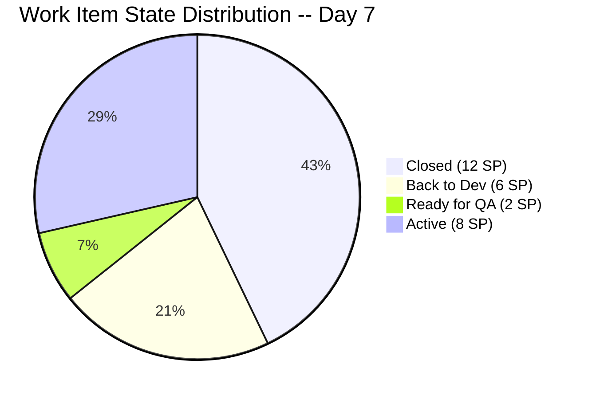
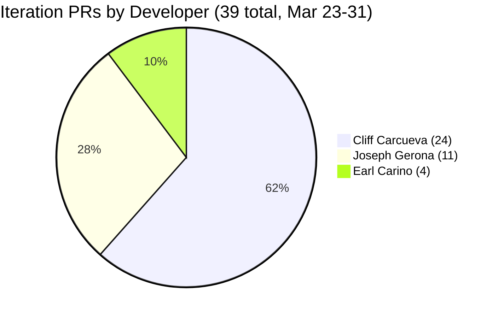

# Iteration Audit Report — Iteration 6.6 (IP)

> **Audit Date:** March 31, 2026 — Day 7 of 10 (70% elapsed)
> **Auditor:** Engineering Productivity Audit System
> **Prepared for:** Ramon Aseniero Jr., Project Owner
> **Audit Angles:** (1) GitHub Developer Productivity, (2) SAFe Compliance (v1 deterministic score model), (3) Engineering Health Index

---

## 1. Audit Metadata

| Parameter | Value |
|-----------|-------|
| **ADO Organization** | `jairo` (`dev.azure.com/jairo`) |
| **ADO Project** | Auto Allies |
| **ADO Project ID** | `2d7af571-6ef6-4ad0-a509-c440e008b0fb` |
| **ADO Team** | AA Development Team |
| **ADO Team ID** | `330e6bf1-3515-443c-a2d8-b84f46c38f57` |
| **ADO Team Board URL** | [Stories and Deliverables](https://dev.azure.com/jairo/Auto%20Allies/_boards/board/t/AA%20Development%20Team/Stories%20and%20Deliverables) |
| **Backlog** | Stories and Deliverables (`Microsoft.RequirementCategory`) |
| **Iteration** | Iteration 6.6 (IP) |
| **Iteration Dates** | March 23, 2026 -- April 5, 2026 (14 calendar days / 10 working days) |
| **Audit Day** | Day 7 of 10 (70% elapsed) |
| **GitHub Repo -- Frontend** | `jairosoft-com/autoallies-version2` |
| **GitHub Repo -- Backend** | `jairosoft-com/autoallies-api-core` |
| **Previous Audit** | AUDIT_20260330_0900.md (Iter 6.6 Day 6 -- Compliance: 64.2% Red, HCI: 26/100, SGPI: 28.6%) |
| **Scope Note** | No other ADO boards, teams, projects, or GitHub repositories were analyzed |

### Key Scores -- Day 7 Snapshot

| Score | Value | Band | Delta vs Day 6 |
|-------|-------|------|----------------|
| **Iteration Compliance Score** | **64.3%** | Red (<75) | +0.1 from 64.2% |
| **SGPI (Committed Scope)** | **42.9%** | Progressing | +14.3 from 28.6% |
| **HCI** | **28/100** | Critical | +2 from 26 |

---

## 2. Executive Summary

This is a **Day 7 audit** for **Iteration 6.6 (IP)**, conducted at 70% elapsed. The team has delivered a **significant SGPI gain** since Day 6, with **2 additional items closed** (#201112 and #201118), bringing the total to **5 items Closed (12 SP)** and a **headline SGPI of 42.9%**.

**Key developments since Day 6 (March 30):**

- **#201112 "[V2.0] Super Admin - Confirm Payment Feature" (3 SP)** advanced from Ready for QA to **Closed** (March 31). FE PR #92 and BE PRs #47, #50 completed the feature.
- **#201118 "[V2.0] Terms and Conditions Link" (1 SP)** advanced from Ready for QA to **Closed** (March 31). Additional FE PR #95 polished section numbering.
- **#201111 "[V2.0] Manual Assign Attorney" (3 SP)** regressed from Ready for QA to **Back to Dev** (April 1). QA found issues requiring rework.
- **#201110 "[V2.0] Accept and Reject Case" (3 SP)** also regressed from Ready for QA to **Back to Dev** (April 1). Same QA cycle issue.
- **#199007 "[V2.0] Account Control and Handling" (2 SP)** advanced from Active to **Ready for QA** (April 1). FE PR #97 and BE PR #54 merged.
- **#201106 "[V2.0] CRM Notes in Messaging" (1 SP)** received new FE PR #96 and BE PR #53 (CRM notes feature implementation).
- **#200185 "[V2.0] Affiliate Migration" (1 SP)** is now **Active** (previously Ready for Dev). BE PR #51 merged with affiliate migration work and PR #52 is open.

**39 PRs merged across both repos during the iteration window (Mar 23--31)** -- 19 frontend and 20 backend. PR cadence increased from 31 to 39 since Day 6.

**Two "Back to Dev" regressions are the biggest risk.** The 6 SP from #201111 and #201110 were counted in the QA pipeline at Day 6, and must now be re-fixed and re-tested in the remaining 3 working days to contribute to SGPI.

### Key Performance Indicators -- Day 7

| KPI | Current Value | Status | Classification |
|-----|---------------|--------|----------------|
| Sprint Velocity (completed) | **12 SP** (5 items Closed) | Progressing | Developer Productivity |
| Committed SP | **28 SP** (12 items with SP) | -- | SAFe Compliance |
| Items in QA Pipeline | **1** (2 SP) | Reduced (regressions) | Cross-cutting |
| Items Back to Dev | **2** (6 SP) | RISK | Cross-cutting |
| Iteration PRs (merged) | **39** (FE: 19 / BE: 20) | Strong cadence | Developer Productivity |
| Code Reviews Performed | **0** | CRITICAL | Cross-cutting |
| ADO-GitHub Traceability | **0%** formal | CRITICAL | Cross-cutting |
| Branch Protection | **None** | CRITICAL | Developer Productivity |
| Iteration Compliance Score | **64.3% (Red)** | Flat | SAFe Compliance |
| **SGPI (Committed Scope)** | **42.9%** | Improving | SAFe Compliance |
| Delivered Proxy SGPI | **50.0%** (14 SP closed/QA) | Moderate | SAFe Compliance |
| HCI | **28/100** | Critical | Engineering Health |

---

## 3. Iteration Scope and Methodology

### Scope

This audit examines **Iteration 6.6 (IP)** of the **AA Development Team** within the **Auto Allies** project. The iteration runs from **March 23 to April 5, 2026**. Evidence is drawn exclusively from:

- ADO work items assigned to the `AA Development Team` on the `Stories and Deliverables` backlog for this iteration
- GitHub activity in `jairosoft-com/autoallies-version2` (Frontend) and `jairosoft-com/autoallies-api-core` (Backend)
- GitHub evidence is filtered to the iteration date window (March 23--31)

### Methodology

1. Resolved the active iteration via the ADO team settings API -- confirmed Iteration 6.6 (IP) is current
2. Retrieved all 14 parent work items and child task relations for the iteration via ADO APIs
3. Retrieved story points, states, closure dates, acceptance criteria, descriptions, and parent links for each parent item
4. Retrieved team capacity from ADO (28 capacity per day, 0 days off)
5. Collected all PRs from both GitHub repos; filtered to iteration window (Mar 23--31)
6. Retrieved branch lists from both repos
7. Correlated GitHub activity to ADO work items using branch names and PR titles
8. Computed SGPI, Iteration Compliance Score, and HCI against current live data
9. Compared against the Day 6 audit (AUDIT_20260330_0900.md) for delta context

---

## 4. Scorecard Summary

| Score | Value | Band | vs Day 6 (Mar 30) | vs Day 4 (Mar 26) |
|-------|-------|------|-------------------|-------------------|
| **Iteration Compliance Score** | **64.3%** | Red (<75) | +0.1 | +7.8 |
| **SGPI (Committed Scope)** | **42.9%** | Progressing | +14.3 | +42.9 |
| **HCI** | **28/100** | Critical | +2 | +8 |

**Score trend note:** The SGPI improved significantly (+14.3) with two QA items advancing to Closed. However, two items regressed to Back to Dev, removing 6 SP from the QA pipeline and creating closure risk. The Compliance Score is essentially flat because no new descriptions or acceptance criteria were added. HCI gained +2 from improved sprint discipline metrics.

---

## 5. Sprint Goal Predictability (SGPI)

**Classification:** SAFe Compliance

### SGPI Scores

| Metric | Formula | Value |
|--------|---------|-------|
| **SGPI (Committed Scope)** | Closed SP / Total Committed SP | **12 / 28 = 42.9%** |
| Original Scope SGPI | Closed SP / Original Planned SP | 12 / 27 = 44.4% |
| Delivered Proxy SGPI | (Closed SP + QA SP) / Total Committed SP | (12 + 2) / 28 = **50.0%** |

> The headline SGPI is **Committed Scope SGPI = 42.9%**. The Delivered Proxy (50.0%) is provided as supporting context and is not the primary metric.

### Sprint Composition

| Component | Value |
|-----------|-------|
| Items at sprint start | **14** (27 SP across 11 estimated items) |
| Items added mid-sprint | **1** (#201597, 1 SP -- V1 Ops Assistance, added Mar 24) |
| Total committed | **14 items, 28 SP** (12 items with SP, 2 unestimated spikes) |
| SP Closed | **12** (#201376=5, #198313=2, #200183=1, #201112=3, #201118=1) |
| SP in QA Pipeline | **2** (#199007=2) |
| SP Back to Dev | **6** (#201111=3, #201110=3) |
| SP Active/In Progress | **8** (#200184=5, #200185=1, #201106=1, #201597=1) |

### Closed Items Detail

| ID | Title | SP | Closed Date | Assignee |
|----|-------|----|-------------|----------|
| 201376 | [V2.0] Membership Migration Stripe | 5 | Mar 27 | Earl Carino |
| 198313 | [V2.0] Sign Up - Coverage options Wrong Add-on Content | 2 | Mar 27 | Cliff Carcueva |
| 200183 | [V2.0] Attorney Migration | 1 | Mar 30 | Earl Carino |
| 201112 | [V2.0] Super Admin - Confirm Payment Feature | 3 | Mar 31 | Cliff Carcueva |
| 201118 | [V2.0] Terms and Conditions Link on Sign-Up Page | 1 | Mar 31 | Cliff Carcueva |

### Daily Probability Tracking

| Date | WD | Cumulative SP Done | SP in QA | Proxy % | Key Event |
|------|----|--------------------|----------|---------|-----------|
| Mar 23 (Mon) | 1 | 0 | 0 | 0.0% | Sprint start -- 12 PRs |
| Mar 24 (Tue) | 2 | 0 | 0 | 0.0% | 3 PRs |
| Mar 25 (Wed) | 3 | 0 | 2 | 7.1% | #198313 to QA Testing |
| Mar 26 (Thu) | 4 | 0 | 5 | 17.9% | #201112 to QA Testing |
| Mar 27 (Fri) | 5 | 7 | 3 | 35.7% | #201376 + #198313 Closed |
| Mar 28 (Sat) | -- | 7 | 3 | 35.7% | Weekend (BE PR #44 merged) |
| Mar 29 (Sun) | -- | 7 | 9 | 57.1% | #201110 to QA; FE PR #91, BE PR #45 |
| Mar 30 (Mon) | 6 | 8 | 10 | 64.3% | #200183 Closed; #201118 to QA |
| **Mar 31 (Tue)** | **7** | **12** | **2** | **50.0%** | #201112 + #201118 Closed; #201111 + #201110 Back to Dev |

**Assessment:** The Delivered Proxy **dropped** from 64.3% to 50.0% because two items (6 SP) regressed from QA to Back to Dev. At 70% elapsed with 3 working days remaining, the team needs to re-fix #201111 and #201110, push them back through QA, close #199007, and ideally complete #200184 to reach a respectable SGPI. Realistic ceiling SGPI is 50-60% if rework items and #199007 close; worst case if regressions persist is 42.9% (current).

---

## 6. Developer Productivity Findings

**Classification:** Developer Productivity

### 6.1 GitHub User Mapping

| GitHub Handle | Name | Role |
|---------------|------|------|
| ccarcuevajairo | Cliff Carcueva | Developer |
| ecarinoJS | Earl Carino | Developer |
| JosephJairo | Joseph Gerona | Developer |

### 6.2 Iteration PR Activity -- Day 7 (March 23--31)

#### Frontend -- `autoallies-version2` (19 PRs in iteration window)

| PR # | Title | Author | Date | Branch | Reviewers |
|------|-------|--------|------|--------|-----------|
| 79 | Feature/messaging cliff 2 | ccarcuevajairo | Mar 23 | feature/messaging-cliff-2 | 0 |
| 80 | Feature/messaging cliff 2 | ccarcuevajairo | Mar 23 | feature/messaging-cliff-2 | 0 |
| 81 | Develop (reverse merge) | JosephJairo | Mar 23 | develop to feature/super-admin-cases-frontend | 0 |
| 82 | Super admin cases frontend final fixes | JosephJairo | Mar 23 | feature/super-admin-cases-frontend | 0 |
| 83 | Super admin case list deployment fix | JosephJairo | Mar 23 | feature/super-admin-cases-frontend | 0 |
| 84 | Add message status handling | ccarcuevajairo | Mar 23 | feature/messaging-cliff-3 | 0 |
| 85 | Feature/messaging cliff 3 | ccarcuevajairo | Mar 24 | feature/messaging-cliff-3 | 0 |
| 86 | Feature/messaging cliff 3 | ccarcuevajairo | Mar 24 | feature/messaging-cliff-3 | 0 |
| 87 | Refactor code structure for addons | ccarcuevajairo | Mar 25 | defect/addons-cliff | 0 |
| 88 | Feature/case confirm payment | ccarcuevajairo | Mar 26 | feature/case-confirm-payment | 0 |
| 89 | Refactor SignupWizard, add terms dialog | ccarcuevajairo | Mar 27 | feature/terms-and-condition | 0 |
| 90 | Defect/addons cliff | ccarcuevajairo | Mar 27 | defect/addons-cliff | 0 |
| 91 | Assign accept reject case attorney frontend | JosephJairo | Mar 29 | feature/assign-accept-reject-case-attorney-frontend | 0 |
| 92 | Feature/case confirm payment | ccarcuevajairo | Mar 30 | feature/case-confirm-payment | 0 |
| 93 | Feature/case confirm payment (#92) (reverse merge) | JosephJairo | Mar 30 | develop to feature/account-handling-frontend | 0 |
| 94 | Enhance TermsBlock structure | ccarcuevajairo | Mar 30 | feature/terms-and-condition | 0 |
| 95 | Fix numbering in Terms and Conditions | ccarcuevajairo | Mar 31 | feature/terms-and-condition | 0 |
| 96 | Add CRM notes to AttorneyMessageDialog | ccarcuevajairo | Mar 31 | feature/crm-notes | 0 |
| 97 | Feature/account handling frontend | JosephJairo | Apr 1 | feature/account-handling-frontend | 0 |

#### Backend -- `autoallies-api-core` (20 PRs in iteration window)

| PR # | Title | Author | Date | Branch | Reviewers |
|------|-------|--------|------|--------|-----------|
| 35 | Feature/messaging cliff 2 | ccarcuevajairo | Mar 23 | feature/messaging-cliff-2 | 0 |
| 36 | Feature/messaging cliff 2 | ccarcuevajairo | Mar 23 | feature/messaging-cliff-2 | 0 |
| 37 | Dev (reverse merge) | JosephJairo | Mar 23 | dev to feature/super-admin-cases-backend | 0 |
| 38 | Super admin cases backend final fixes | JosephJairo | Mar 23 | feature/super-admin-cases-backend | 0 |
| 39 | Refactor user retrieval in MessageController | ccarcuevajairo | Mar 23 | feature/messaging-cliff-3 | 0 |
| 40 | Feature/messaging cliff 3 | ccarcuevajairo | Mar 23 | feature/messaging-cliff-3 | 0 |
| 41 | Feature/messaging cliff 3 | ccarcuevajairo | Mar 24 | feature/messaging-cliff-3 | 0 |
| 42 | Refactor add-on descriptions | ccarcuevajairo | Mar 25 | defect/addons-cliff | 0 |
| 43 | Feature/case confirm payment | ccarcuevajairo | Mar 26 | feature/case-confirm-payment | 0 |
| 44 | Enabler/200182 user migration | ecarinoJS | Mar 27-28 | enabler/200182-user-migration | 0 |
| 45 | Assign accept reject case attorney backend | JosephJairo | Mar 29 | feature/assign-accept-reject-case-attorney-backend | 0 |
| 46 | Dev merged to feature branch (reverse merge) | JosephJairo | Mar 30 | dev to feature/assign-accept-reject-case-attorney-backend | 0 |
| 47 | Feature/case confirm payment | ccarcuevajairo | Mar 30 | feature/case-confirm-payment | 0 |
| 48 | Enabler/200182 user migration | ecarinoJS | Mar 30 | enabler/200182-user-migration | 0 |
| 49 | Dev merge to feature branch (reverse merge) | JosephJairo | Mar 30 | dev to feature/account-handling-backend | 0 |
| 50 | Refactor payment_type validation | ccarcuevajairo | Mar 31 | feature/case-confirm-payment | 0 |
| 51 | Enabler/200184 affiliate | ecarinoJS | Mar 31 | enabler/200184-affiliate | 0 |
| 52 | Enabler/200184 affiliate (OPEN) | ecarinoJS | Mar 31 | enabler/200184-affiliate | 0 |
| 53 | Add CRM notes functionality for tickets | ccarcuevajairo | Mar 31 | feature/crm-notes | 0 |
| 54 | Feature/account handling backend | JosephJairo | Apr 1 | feature/account-handling-backend | 0 |

### 6.3 PR Distribution by Developer

### 6.4 Developer Velocity Summary

| Developer | FE PRs | BE PRs | Total PRs | ADO Items Touched | Notes |
|-----------|--------|--------|-----------|-------------------|-------|
| Cliff Carcueva | 14 | 9 | 23 | #198313, #201112, #201118, #201106 | Primary feature developer; confirm payment, terms, CRM notes, addons |
| Joseph Gerona | 5 | 6 | 11 | #201111, #201110, #199007 | Attorney features, case management, account handling |
| Earl Carino | 0 | 4 | 4 | #200183, #201376, #200184, #200185 | Migration enablers |
| Mary Secusana | 0 | 0 | 0 | #201470 | Operations support (non-dev) |

**PR per working day (team):** 39 PRs / 7 WD = **5.6 PRs/day** (up from 5.2 on Day 6).

---

## 7. SAFe Compliance Findings

**Classification:** SAFe Compliance

### 7.1 Iteration Configuration

| Aspect | Status | Notes |
|--------|--------|-------|
| Iteration path configured | Pass | `Auto Allies\2026-PI6\Iteration 6.6 (IP)` |
| Start/end dates set | Pass | Mar 23 -- Apr 5, 2026 |
| Team capacity configured | Pass | 28 per day, 0 days off |
| All items assigned to team member | Pass | 14/14 assigned |
| All items in correct iteration | Pass | 14/14 in `Iteration 6.6 (IP)` |

### 7.2 Work Item State Distribution

| State | Count | Items | SP |
|-------|-------|-------|-----|
| **Closed** | 5 | #201376, #198313, #200183, #201112, #201118 | 12 |
| **Back to Dev** | 2 | #201111, #201110 | 6 |
| **Ready for QA** | 1 | #199007 | 2 |
| **Active** | 6 | #200184, #201106, #200185, #201470, #201528, #201597 | 9+ |
| **Total** | **14** | | **28 SP** (12 estimated) |

### 7.3 Parent Link Coverage

| Status | Count | Items |
|--------|-------|-------|
| Has parent link | 11 | All stories, defects, and enablers |
| Missing parent link | 3 | #201470, #201528, #201597 (all Spikes) |

Spikes and ops support items lack parent Feature/Epic links. This is acceptable for operational items but still impacts the alignment score.

---

## 8. Iteration Compliance Score

**Overall Score: 64.3% (Red)**

| Dimension               | Eligible | Compliant | Failed | Score % | Weight   | Weighted | Evidence                                   | Reason                                                                         |
| ----------------------- | -------- | --------- | ------ | ------- | -------- | -------- | ------------------------------------------ | ------------------------------------------------------------------------------ |
| **Alignment**           | 14       | 11        | 3      | 78.6%   | 25%      | 19.6     | Parent field on work items                 | 3 Spikes (#201470, #201528, #201597) lack parent Feature/Epic links            |
| **Estimation**          | 14       | 12        | 2      | 85.7%   | 20%      | 17.1     | StoryPoints field                          | #201470 and #201528 (Spikes) have no SP                                        |
| **Quality/DoD**         | 14       | 3         | 11     | 21.4%   | 35%      | 7.5      | Description >= 30 chars AND AC >= 20 chars | Only #201111, #201112, #201118 have both Description and AC meeting thresholds |
| **Iteration Integrity** | 14       | 14        | 0      | 100.0%  | 20%      | 20.0     | ChangedDate within iteration window        | All 14 items touched since Mar 23                                              |
| **TOTAL**               |          |           |        |         | **100%** | **64.3** |                                            |                                                                                |

### Dimension Trends

| Dimension | Day 3 | Day 4 | Day 6 | Day 7 | Delta (D6 to D7) |
|-----------|-------|-------|-------|-------|-------------------|
| Alignment | 73.3% | 73.3% | 78.6% | 78.6% | 0.0 |
| Estimation | 80.0% | 80.0% | 85.7% | 85.7% | 0.0 |
| Quality/DoD | 13.3% | 14.5% | 21.4% | 21.4% | 0.0 |
| Iteration Integrity | 100% | 100% | 100% | 100% | 0.0 |
| **Overall** | **54.7%** | **56.5%** | **64.2%** | **64.3%** | **+0.1** |

**Key gap:** Quality/DoD remains the weakest dimension at 21.4%. Only 3 of 14 items have both Description (>= 30 chars) and Acceptance Criteria (>= 20 chars). The +0.1 delta is due to rounding in the weighted calculation; structurally no dimension changed since Day 6.

---

## 9. Engineering Health Index (HCI)

**Overall Score: 28/100 (Critical)**

| #   | Dimension                        | Score  | Max     | Evidence                                                              | Notes                                                                |
| --- | -------------------------------- | ------ | ------- | --------------------------------------------------------------------- | -------------------------------------------------------------------- |
| 1   | PR Review Compliance             | 1      | 10      | 0/39 PRs have reviewers                                               | Zero code reviews; all PRs self-merged                               |
| 2   | Branch Protection & Enforcement  | 1      | 10      | 0 protected branches across both repos                                | develop/dev and main branches unprotected                            |
| 3   | CI/CD Gate Quality               | 2      | 10      | Auto-deploy triggers exist but no quality gates                       | No test gates, linting gates, or build validation                    |
| 4   | Code Ownership                   | 4      | 10      | 3 developers contributing, CODEOWNERS absent                          | Work is distributed but no formal ownership rules                    |
| 5   | Merge Hygiene & Churn            | 2      | 10      | Multiple duplicate PRs, reverse merges, Back to Dev regressions       | 5 reverse merges in iteration; repeated branch merges                |
| 6   | Work Item to GitHub Traceability | 1      | 10      | 0 formal ADO-GitHub links                                             | No AB# tags, no artifact links in ADO                                |
| 7   | Sprint Discipline                | 6      | 10      | 5 Closed + 1 QA at 70% elapsed; 2 Back to Dev                         | Strong closure cadence offset by QA regressions                      |
| 8   | Defect Triage & Velocity         | 3      | 10      | 1 defect (#198313) Closed in iteration                                | Only 1 defect in scope; closed promptly but no formal triage process |
| 9   | Backlog & Story Hygiene          | 3      | 10      | 3/14 items meet DoD documentation bar                                 | Most items lack acceptance criteria                                  |
| 10  | Capacity Balance & Ownership     | 5      | 10      | Team capacity set (28/day); 3 devs + 1 ops; Earl now contributing PRs | Cliff still carries 62% of PRs but Earl increasing contribution      |
|     | **TOTAL**                        | **28** | **100** |                                                                       |                                                                      |

### HCI Trend

| Audit | HCI | Band |
|-------|-----|------|
| Day 3 (Mar 25) | 20 | Critical |
| Day 4 (Mar 26) | 20 | Critical |
| Day 6 (Mar 30) | 26 | Critical |
| **Day 7 (Mar 31)** | **28** | **Critical** |

The +2 improvement is driven by Sprint Discipline (+1 from two additional closures) and Capacity Balance (+1 from Earl's increased PR contribution on affiliate migration work). Infrastructure dimensions remain at floor scores.

---

## 10. ADO-to-GitHub Traceability Analysis

**Classification:** Cross-cutting

### Informal Traceability (Branch Name / PR Title Correlation)

| ADO Item | Title | GitHub Evidence | Confidence |
|----------|-------|-----------------|------------|
| #201112 | Confirm Payment Feature | FE: #88, #92; BE: #43, #47, #50 (`feature/case-confirm-payment`) | High |
| #198313 | Coverage Options Wrong Add-on | FE: #87, #90; BE: #42 (`defect/addons-cliff`) | Medium |
| #201118 | Terms and Conditions Link | FE: #89, #94, #95 (`feature/terms-and-condition`) | High |
| #201111 | Manual Assign Attorney | FE: #91; BE: #45, #46 (`feature/assign-accept-reject-case-attorney-*`) | High |
| #201110 | Accept and Reject Case | FE: #91; BE: #45 (shared branch with #201111) | Medium |
| #201106 | CRM Notes in Messaging | FE: #84-86, #96; BE: #39-41, #53 (`feature/messaging-cliff-3`, `feature/crm-notes`) | High |
| #200183 | Attorney Migration | BE: #44, #48 (`enabler/200182-user-migration`) | High |
| #201376 | Membership Migration | Covered under enabler/200182-user-migration work | Medium |
| #199007 | Account Control Handling | FE: #93, #97 (`feature/account-handling-frontend`); BE: #49, #54 (`feature/account-handling-backend`) | High |
| #200184 | Ticket and Case Migration | BE: #48 (partial, included in migration work) | Low |
| #200185 | Affiliate Migration | BE: #51, #52 (`enabler/200184-affiliate`) | High |
| #201470 | Ops Support Effort | Non-dev, no GitHub evidence expected | N/A |
| #201528 | Support and Meetings | Non-dev, no GitHub evidence expected | N/A |
| #201597 | V1 Ops Assistance | Non-dev, no GitHub evidence expected | N/A |

### Formal Traceability Status

| Mechanism | Status |
|-----------|--------|
| ADO artifact links to GitHub PRs | **Not configured** |
| AB# tags in commit messages | **Not used** |
| GitHub branch policies requiring work item link | **Not enforced** |
| ADO pull request integration | **Not configured** (repos are GitHub-only) |

**Traceability score: 0% formal, ~75% informal** (based on branch naming conventions that loosely correlate to ADO items). Informal confidence improved slightly from Day 6 due to new affiliate migration branches explicitly referencing ADO IDs (#200184).

---

## 11. Collaboration and Review Analysis

**Classification:** Developer Productivity

### Code Review Summary

| Metric | Value |
|--------|-------|
| PRs with at least 1 reviewer | **0 / 39** (0%) |
| PRs with approval before merge | **0 / 39** (0%) |
| Average time to review | N/A (no reviews) |
| Review comments | **0** |

All 39 PRs were self-merged without any review. This is consistent with every prior audit in this project's history.

### Collaboration Patterns

| Pattern | Observation |
|---------|-------------|
| Pair programming | Not observed |
| Cross-feature reviews | Not observed |
| FE-BE coordination | Cliff and Joseph work on parallel FE/BE branches for features |
| Reverse merges | 5 observed (FE #81, #93; BE #37, #46, #49) -- used for branch synchronization |

---

## 12. Repository Hygiene

**Classification:** Developer Productivity

### Branch Status

| Repo | Total Branches | Protected | Stale (pre-iteration) | Active (iteration) |
|------|---------------|-----------|----------------------|-------------------|
| autoallies-version2 | 30 | 0 | ~20 | ~10 |
| autoallies-api-core | 30 | 0 | ~18 | ~12 |

### New Active Branches Since Day 6

**Frontend (autoallies-version2):**

- `feature/crm-notes` (new -- CRM notes for #201106)

**Backend (autoallies-api-core):**

- `feature/crm-notes` (new -- CRM notes for #201106)
- `enabler/200184-affiliate` (new -- Affiliate migration for #200185)
- `enabler/200184-tickets-migration` (new -- Ticket migration for #200184)

### Hygiene Concerns

1. **Stale branches:** ~38 combined stale branches across both repos that have not been cleaned up
2. **No branch protection:** Neither `develop`/`dev` nor `main` are protected
3. **Inconsistent default branch naming:** Frontend uses `develop`, Backend uses `dev`
4. **Feature branch proliferation:** Multiple sequential branches for the same feature (e.g., `messaging-cliff`, `messaging-cliff-2`, `messaging-cliff-3`)
5. **Open PR:** BE PR #52 is still open on `enabler/200184-affiliate` -- may indicate in-progress work for affiliate migration

---

## 13. Risks and Bottlenecks

### Critical Risks

| # | Risk | Impact | Likelihood | Mitigation |
|---|------|--------|------------|------------|
| 1 | **Back to Dev regressions (6 SP)** | #201111 and #201110 lost QA status; need rework + re-test in 3 WD | High | Prioritize Joseph's rework immediately; target QA re-entry by Day 8 |
| 2 | **Zero code reviews** | Undetected bugs, security issues, knowledge silos | Certain (ongoing) | Require at least 1 reviewer on PRs |
| 3 | **No branch protection** | Direct pushes to develop/dev could break builds | High | Enable branch policies on develop/dev |
| 4 | **#200184 Ticket Migration (5 SP) still Active** | Largest remaining item at risk of not closing | Medium-High | Earl has active branches but no closed PR yet |

### Bottlenecks

| Bottleneck | Evidence | Impact |
|------------|----------|--------|
| QA regressions | 2 items sent back for rework (6 SP) | Delays closures; SGPI at risk |
| Single developer concentration | Cliff handles 62% of PRs (24/39) | Bus factor risk; knowledge isolation |
| #200184 still Active at Day 7 | 5 SP enabler with no visible PR for ticket migration specifically | Likely will not close this iteration |
| #201470 and #201528 Spikes with no SP | Inflate denominator for compliance | Accept as operational overhead |

---

## 14. Prioritized Remediation Actions

### Immediate (This Sprint -- Days 8-10)

| Priority | Action | Owner | Impact |
|----------|--------|-------|--------|
| 1 | **Fix #201111 and #201110 rework** -- Joseph must address QA findings and push back to Ready for QA | Joseph Gerona | +21.4% SGPI potential (6 SP) |
| 2 | **Push #199007 to Closed** -- Account handling is in QA; test and close | Karl (PM) / QA | +7.1% SGPI (2 SP) |
| 3 | **Close BE PR #52** for #200185 Affiliate Migration | Earl Carino | +3.6% SGPI (1 SP) |
| 4 | **Triage #200184 (5 SP)** -- Determine if ticket migration can close or should be carried to 6.7 | Karl / Ramon | Scope clarity; 17.9% SGPI at stake |

### Next Sprint (Iteration 6.7)

| Priority | Action | Owner | Impact |
|----------|--------|-------|--------|
| 1 | **Enable branch protection** on develop (FE) and dev (BE) with required reviewers | DevOps/Ramon | HCI +4-6 points |
| 2 | **Mandate at least 1 code review** per PR | Team | HCI +8-10 points; quality improvement |
| 3 | **Add AB# tags** to PR titles or commit messages for ADO traceability | Developers | HCI +4-6 points |
| 4 | **Clean up stale branches** across both repos (~38 branches) | All developers | Improved repository hygiene |
| 5 | **Require Description + AC** on all backlog items before sprint start | Karl (PM) | Quality/DoD from 21% to 60%+ |
| 6 | **Standardize branch naming** -- align Frontend/Backend to use same default branch name | DevOps | Consistency |

---

## 15. Evidence Gaps and Limitations

| Gap | Impact on Scores | Mitigation |
|-----|-----------------|------------|
| No formal ADO-GitHub links | Traceability scored at 0% formal; informal correlation used | Branch naming provides medium-to-high confidence mapping |
| GitHub commits only visible on `main` branch (default) | Commit count on feature branches not captured via API | PR data used as primary evidence instead |
| No CI/CD build logs available | CI/CD Gate Quality scored conservatively at 2/10 | Auto-deploy triggers observed but no test gates confirmed |
| No test case or test run data in ADO | Quality/DoD cannot assess test coverage | Relied on Description + AC as proxy |
| Spike items (#201470, #201528) have no SP or documentation | Inflate denominator for compliance calculations | Accepted as operational overhead |
| Back to Dev state not formally tracked in ADO state model | Items regressed but ADO ChangedDate reflects latest state change | Used API state at audit time |
| BE PR #52 is open (not merged) | Counted in PR total but not in merged count | Noted as in-progress work for #200185 |

### Data Sources Used

| Source | Method | Items Retrieved |
|--------|--------|----------------|
| ADO Team Iterations API | `work_list_team_iterations` (current) | 1 iteration confirmed |
| ADO Work Items for Iteration API | `wit_get_work_items_for_iteration` | 14 parent items + child tasks |
| ADO Work Items Batch API | `wit_get_work_items_batch_by_ids` | 14 parent item details with 10 fields |
| ADO Iteration Capacities API | `work_get_iteration_capacities` | Team capacity: 28/day |
| GitHub PRs API | `list_pull_requests` (state: all) | FE: 50 PRs total, BE: 54 PRs total |
| GitHub Branches API | `list_branches` | FE: 30 branches, BE: 30 branches |

---

*Report generated: March 31, 2026, 09:00 PST*
*Next recommended audit: April 2, 2026 (Day 9 of 10)*
