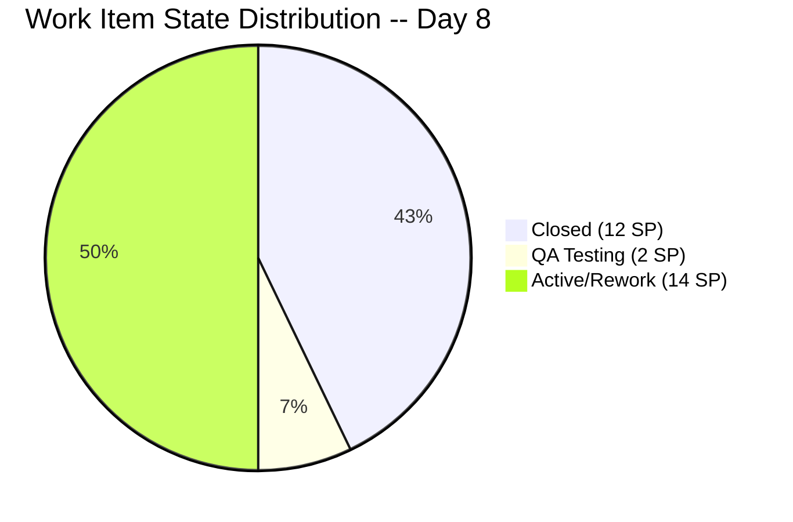
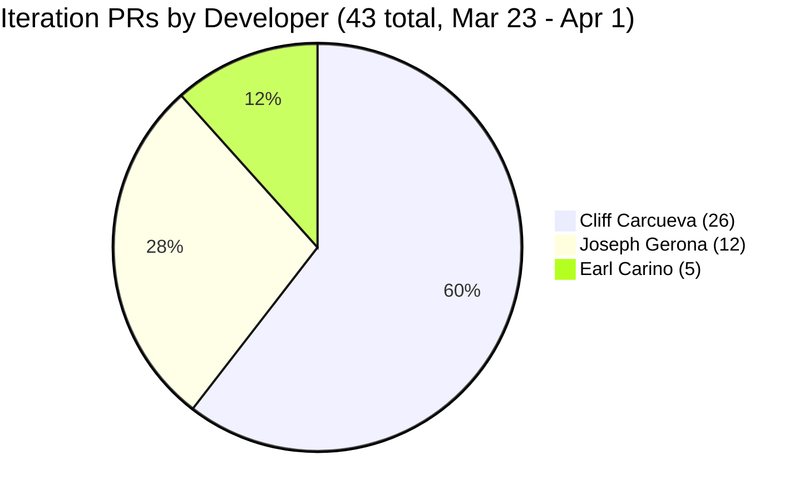

# Iteration Audit Report — Iteration 6.6 (IP)

> **Audit Date:** April 1, 2026 — Day 8 of 10 (80% elapsed)
> **Auditor:** Engineering Productivity Audit System
> **Prepared for:** Ramon Aseniero Jr., Project Owner
> **Audit Angles:** (1) GitHub Developer Productivity, (2) SAFe Compliance (v1 deterministic score model), (3) Engineering Health Index

---

## 1. Audit Metadata

| Parameter | Value |
|-----------|-------|
| **ADO Organization** | `jairo` (`dev.azure.com/jairo`) |
| **ADO Project** | Auto Allies |
| **ADO Project ID** | `2d7af571-6ef6-4ad0-a509-c440e008b0fb` |
| **ADO Team** | AA Development Team |
| **ADO Team ID** | `330e6bf1-3515-443c-a2d8-b84f46c38f57` |
| **ADO Team Board URL** | [Stories and Deliverables](https://dev.azure.com/jairo/Auto%20Allies/_boards/board/t/AA%20Development%20Team/Stories%20and%20Deliverables) |
| **Backlog** | Stories and Deliverables (`Microsoft.RequirementCategory`) |
| **Iteration** | Iteration 6.6 (IP) |
| **Iteration Dates** | March 23, 2026 -- April 5, 2026 (14 calendar days / 10 working days) |
| **Audit Day** | Day 8 of 10 (80% elapsed) |
| **GitHub Repo -- Frontend** | `jairosoft-com/autoallies-version2` |
| **GitHub Repo -- Backend** | `jairosoft-com/autoallies-api-core` |
| **Previous Audit** | AUDIT_20260331_0900.md (Iter 6.6 Day 7 -- Compliance: 64.3% Red, HCI: 28/100, SGPI: 42.9%) |
| **Scope Note** | No other ADO boards, teams, projects, or GitHub repositories were analyzed |

### Key Scores -- Day 8 Snapshot

| Score | Value | Band | Delta vs Day 7 |
|-------|-------|------|----------------|
| **Iteration Compliance Score** | **64.3%** | Red (<75) | +0.0 from 64.3% |
| **SGPI (Committed Scope)** | **42.9%** | Progressing | +0.0 from 42.9% |
| **HCI** | **29/100** | Critical | +1 from 28 |

---

## 2. Executive Summary

This is a **Day 8 audit** for **Iteration 6.6 (IP)**, conducted at 80% elapsed. With only **2 working days remaining** (April 2--3), the team faces significant closure risk. The headline scores are essentially flat from Day 7: **ICS 64.3% (Red), SGPI 42.9%, HCI 29/100**.

**Key developments since Day 7 (March 31):**

- **#199007 "[V2.0] Account Control and Handling" (2 SP)** remains in **QA Testing**. FE PR #97 and BE PR #54 merged April 1, completing the feature code. QA validation is pending.
- **#201111 "[V2.0] Manual Assign Attorney" (3 SP)** remains in **Active** state. The item was "Back to Dev" at Day 7 and is now being reworked. No new PRs merged since the regressions.
- **#201110 "[V2.0] Accept and Reject Case" (3 SP)** also remains in **Active** state, undergoing rework after QA rejection.
- **#201106 "[V2.0] CRM Notes in Messaging" (1 SP)** remains **Active**. FE PR #96 and BE PR #53 merged March 31, but the item has not advanced to QA.
- **#200185 "[V2.0] Affiliate Migration" (1 SP)** is **Active** with BE PR #51 merged and PR #52 still open.
- **#200184 "[V2.0] Ticket and Case Migration" (5 SP)** remains **Active** with no new PR activity. This is the largest uncommitted item at 5 SP.

**43 PRs merged across both repos during the iteration window (Mar 23--Apr 1)** -- 20 frontend and 23 backend. PR cadence increased from 39 (Day 7) to 43.

**Critical risk: 2 working days remain.** The team must close at least #199007 (QA), #201111 and #201110 (rework + re-QA) to meaningfully improve SGPI. The realistic SGPI ceiling is approximately 57--64% if #199007 and both rework items close; worst case remains 42.9% (current).

### Key Performance Indicators -- Day 8

| KPI | Current Value | Status | Classification |
|-----|---------------|--------|----------------|
| Sprint Velocity (completed) | **12 SP** (5 items Closed) | Flat | Developer Productivity |
| Committed SP | **28 SP** (12 items with SP) | -- | SAFe Compliance |
| Items in QA Pipeline | **1** (2 SP) | Same | Cross-cutting |
| Items in Rework | **2** (6 SP) | RISK | Cross-cutting |
| Iteration PRs (merged) | **43** (FE: 20 / BE: 23) | Strong cadence | Developer Productivity |
| Code Reviews Performed | **0** | CRITICAL | Cross-cutting |
| ADO-GitHub Traceability | **0%** formal | CRITICAL | Cross-cutting |
| Branch Protection | **None** | CRITICAL | Developer Productivity |
| Iteration Compliance Score | **64.3% (Red)** | Flat | SAFe Compliance |
| **SGPI (Committed Scope)** | **42.9%** | Flat | SAFe Compliance |
| Delivered Proxy SGPI | **50.0%** (14 SP closed/QA) | Moderate | SAFe Compliance |
| HCI | **29/100** | Critical | Engineering Health |

---

## 3. Iteration Scope and Methodology

### Scope

This audit examines **Iteration 6.6 (IP)** of the **AA Development Team** within the **Auto Allies** project. The iteration runs from **March 23 to April 5, 2026**. Evidence is drawn exclusively from:

- ADO work items assigned to the `AA Development Team` on the `Stories and Deliverables` backlog for this iteration
- GitHub activity in `jairosoft-com/autoallies-version2` (Frontend) and `jairosoft-com/autoallies-api-core` (Backend)
- GitHub evidence is filtered to the iteration date window (March 23--April 1)

### Methodology

1. Resolved the active iteration via the ADO team settings API -- confirmed Iteration 6.6 (IP) is current
2. Retrieved all 14 parent work items and child task relations for the iteration via ADO APIs
3. Retrieved story points, states, closure dates, acceptance criteria, descriptions, and parent links for each parent item
4. Retrieved team capacity from ADO (28 capacity per day, 0 days off, 6 team members)
5. Collected all PRs from both GitHub repos; filtered to iteration window (Mar 23--Apr 1)
6. Retrieved branch lists from both repos
7. Correlated GitHub activity to ADO work items using branch names and PR titles
8. Computed SGPI, Iteration Compliance Score, and HCI against current live data
9. Compared against the Day 7 audit (AUDIT_20260331_0900.md) for delta context

---

## 4. Scorecard Summary

| Score | Value | Band | vs Day 7 (Mar 31) | vs Day 4 (Mar 26) |
|-------|-------|------|-------------------|-------------------|
| **Iteration Compliance Score** | **64.3%** | Red (<75) | +0.0 | +7.8 |
| **SGPI (Committed Scope)** | **42.9%** | Progressing | +0.0 | +42.9 |
| **HCI** | **29/100** | Critical | +1 | +9 |

**Score trend note:** All three scores are essentially flat from Day 7. No new items have closed. The two rework items (#201111, #201110) remain in Active state, and #199007 has not yet cleared QA. The HCI gained +1 from continued PR activity improving sprint discipline metrics. With 2 working days remaining, the window for meaningful score improvement is narrowing rapidly.

---

## 5. Sprint Goal Predictability (SGPI)

**Classification:** SAFe Compliance

### SGPI Scores

| Metric | Formula | Value |
|--------|---------|-------|
| **SGPI (Committed Scope)** | Closed SP / Total Committed SP | **12 / 28 = 42.9%** |
| Original Scope SGPI | Closed SP / Original Planned SP | 12 / 27 = 44.4% |
| Delivered Proxy SGPI | (Closed SP + QA SP) / Total Committed SP | (12 + 2) / 28 = **50.0%** |

> The headline SGPI is **Committed Scope SGPI = 42.9%**. The Delivered Proxy (50.0%) is provided as supporting context and is not the primary metric.

### Sprint Composition

| Component | Value |
|-----------|-------|
| Items at sprint start | **14** (27 SP across 11 estimated items) |
| Items added mid-sprint | **1** (#201597, 1 SP -- V1 Ops Assistance, added Mar 24) |
| Total committed | **14 items, 28 SP** (12 items with SP, 2 unestimated spikes) |
| SP Closed | **12** (#201376=5, #198313=2, #200183=1, #201112=3, #201118=1) |
| SP in QA Pipeline | **2** (#199007=2) |
| SP in Rework (Active) | **6** (#201111=3, #201110=3) |
| SP Active/In Progress | **8** (#200184=5, #200185=1, #201106=1, #201597=1) |

### Closed Items Detail

| ID | Title | SP | Closed Date | Assignee |
|----|-------|----|-------------|----------|
| 201376 | [V2.0] Membership Migration Stripe | 5 | Mar 27 | Earl Carino |
| 198313 | [V2.0] Sign Up - Coverage options Wrong Add-on Content | 2 | Mar 27 | Cliff Carcueva |
| 200183 | [V2.0] Attorney Migration | 1 | Mar 30 | Earl Carino |
| 201112 | [V2.0] Super Admin - Confirm Payment Feature | 3 | Mar 31 | Cliff Carcueva |
| 201118 | [V2.0] Terms and Conditions Link on Sign-Up Page | 1 | Mar 31 | Cliff Carcueva |

### Daily Probability Tracking

| Date | WD | Cumulative SP Done | SP in QA | Proxy % | Key Event |
|------|----|--------------------|----------|---------|-----------|
| Mar 23 (Mon) | 1 | 0 | 0 | 0.0% | Sprint start -- 12 PRs |
| Mar 24 (Tue) | 2 | 0 | 0 | 0.0% | 3 PRs |
| Mar 25 (Wed) | 3 | 0 | 2 | 7.1% | #198313 to QA Testing |
| Mar 26 (Thu) | 4 | 0 | 5 | 17.9% | #201112 to QA Testing |
| Mar 27 (Fri) | 5 | 7 | 3 | 35.7% | #201376 + #198313 Closed |
| Mar 28 (Sat) | -- | 7 | 3 | 35.7% | Weekend (BE PR #44 merged) |
| Mar 29 (Sun) | -- | 7 | 9 | 57.1% | #201110 to QA; FE PR #91, BE PR #45 |
| Mar 30 (Mon) | 6 | 8 | 10 | 64.3% | #200183 Closed; #201118 to QA |
| Mar 31 (Tue) | 7 | 12 | 2 | 50.0% | #201112 + #201118 Closed; #201111 + #201110 Back to Dev |
| **Apr 1 (Wed)** | **8** | **12** | **2** | **50.0%** | #199007 in QA; FE #97, BE #54 merged; rework items still Active |

**Assessment:** The Delivered Proxy remains at **50.0%**, unchanged from Day 7. The two rework items (#201111, #201110) have not re-entered QA. At 80% elapsed with only 2 working days remaining, the team must push all rework items through QA and close them to reach a respectable SGPI. Realistic ceiling SGPI is 57--64% if the 3 QA/rework items close; worst case if regressions persist is 42.9% (current).

---

## 6. Developer Productivity Findings

**Classification:** Developer Productivity

### 6.1 GitHub User Mapping

| GitHub Handle | Name | Role |
|---------------|------|------|
| ccarcuevajairo | Cliff Carcueva | Developer |
| ecarinoJS | Earl Carino | Developer |
| JosephJairo | Joseph Gerona | Developer |

### 6.2 Iteration PR Activity -- Day 8 (March 23--April 1)

#### Frontend -- `autoallies-version2` (20 PRs in iteration window)

| PR # | Title | Author | Date | Branch | Reviewers |
|------|-------|--------|------|--------|-----------|
| 79 | Feature/messaging cliff 2 | ccarcuevajairo | Mar 23 | feature/messaging-cliff-2 | 0 |
| 80 | Feature/messaging cliff 2 | ccarcuevajairo | Mar 23 | feature/messaging-cliff-2 | 0 |
| 81 | Develop (reverse merge) | JosephJairo | Mar 23 | develop to feature/super-admin-cases-frontend | 0 |
| 82 | Super admin cases frontend final fixes | JosephJairo | Mar 23 | feature/super-admin-cases-frontend | 0 |
| 83 | Super admin case list deployment fix | JosephJairo | Mar 23 | feature/super-admin-cases-frontend | 0 |
| 84 | Add message status handling | ccarcuevajairo | Mar 23 | feature/messaging-cliff-3 | 0 |
| 85 | Feature/messaging cliff 3 | ccarcuevajairo | Mar 24 | feature/messaging-cliff-3 | 0 |
| 86 | Feature/messaging cliff 3 | ccarcuevajairo | Mar 24 | feature/messaging-cliff-3 | 0 |
| 87 | Refactor code structure for addons | ccarcuevajairo | Mar 25 | defect/addons-cliff | 0 |
| 88 | Feature/case confirm payment | ccarcuevajairo | Mar 26 | feature/case-confirm-payment | 0 |
| 89 | Refactor SignupWizard, add terms dialog | ccarcuevajairo | Mar 27 | feature/terms-and-condition | 0 |
| 90 | Defect/addons cliff | ccarcuevajairo | Mar 27 | defect/addons-cliff | 0 |
| 91 | Assign accept reject case attorney frontend | JosephJairo | Mar 29 | feature/assign-accept-reject-case-attorney-frontend | 0 |
| 92 | Feature/case confirm payment | ccarcuevajairo | Mar 30 | feature/case-confirm-payment | 0 |
| 93 | Feature/case confirm payment (#92) (reverse merge) | JosephJairo | Mar 30 | develop to feature/account-handling-frontend | 0 |
| 94 | Enhance TermsBlock structure | ccarcuevajairo | Mar 30 | feature/terms-and-condition | 0 |
| 95 | Fix numbering in Terms and Conditions | ccarcuevajairo | Mar 31 | feature/terms-and-condition | 0 |
| 96 | Add CRM notes to AttorneyMessageDialog | ccarcuevajairo | Mar 31 | feature/crm-notes | 0 |
| **97** | **Feature/account handling frontend** | **JosephJairo** | **Apr 1** | **feature/account-handling-frontend** | **0** |

> **New since Day 7:** FE PR #97 (account handling frontend, Joseph, Apr 1)

#### Backend -- `autoallies-api-core` (23 PRs in iteration window)

| PR # | Title | Author | Date | Branch | Reviewers |
|------|-------|--------|------|--------|-----------|
| 35 | Feature/messaging cliff 2 | ccarcuevajairo | Mar 23 | feature/messaging-cliff-2 | 0 |
| 36 | Feature/messaging cliff 2 | ccarcuevajairo | Mar 23 | feature/messaging-cliff-2 | 0 |
| 37 | Dev (reverse merge) | JosephJairo | Mar 23 | dev to feature/super-admin-cases-backend | 0 |
| 38 | Super admin cases backend final fixes | JosephJairo | Mar 23 | feature/super-admin-cases-backend | 0 |
| 39 | Refactor user retrieval in MessageController | ccarcuevajairo | Mar 23 | feature/messaging-cliff-3 | 0 |
| 40 | Feature/messaging cliff 3 | ccarcuevajairo | Mar 23 | feature/messaging-cliff-3 | 0 |
| 41 | Feature/messaging cliff 3 | ccarcuevajairo | Mar 24 | feature/messaging-cliff-3 | 0 |
| 42 | Refactor add-on descriptions | ccarcuevajairo | Mar 25 | defect/addons-cliff | 0 |
| 43 | Feature/case confirm payment | ccarcuevajairo | Mar 26 | feature/case-confirm-payment | 0 |
| 44 | Enabler/200182 user migration | ecarinoJS | Mar 27-28 | enabler/200182-user-migration | 0 |
| 45 | Assign accept reject case attorney backend | JosephJairo | Mar 29 | feature/assign-accept-reject-case-attorney-backend | 0 |
| 46 | Dev merged to feature branch (reverse merge) | JosephJairo | Mar 30 | dev to feature/assign-accept-reject-case-attorney-backend | 0 |
| 47 | Feature/case confirm payment | ccarcuevajairo | Mar 30 | feature/case-confirm-payment | 0 |
| 48 | Enabler/200182 user migration | ecarinoJS | Mar 30 | enabler/200182-user-migration | 0 |
| 49 | Dev merge to feature branch (reverse merge) | JosephJairo | Mar 30 | dev to feature/account-handling-backend | 0 |
| 50 | Refactor payment_type validation | ccarcuevajairo | Mar 31 | feature/case-confirm-payment | 0 |
| 51 | Enabler/200184 affiliate | ecarinoJS | Mar 31 | enabler/200184-affiliate | 0 |
| 52 | Enabler/200184 affiliate (OPEN) | ecarinoJS | Mar 31 | enabler/200184-affiliate | 0 |
| 53 | Add CRM notes functionality for tickets | ccarcuevajairo | Mar 31 | feature/crm-notes | 0 |
| **54** | **Feature/account handling backend** | **JosephJairo** | **Apr 1** | **feature/account-handling-backend** | **0** |

> **New since Day 7:** BE PR #54 (account handling backend, Joseph, Apr 1). BE PR #52 remains **open**.

### 6.3 PR Distribution by Developer

### 6.4 Developer Velocity Summary

| Developer | FE PRs | BE PRs | Total PRs | ADO Items Touched | Notes |
|-----------|--------|--------|-----------|-------------------|-------|
| Cliff Carcueva | 14 | 12 | 26 | 5 | Highest PR count; messaging, payment, terms, CRM notes, addons |
| Joseph Gerona | 6 | 6 | 12 | 3 | Super admin cases, assign/accept/reject, account handling |
| Earl Carino | 0 | 5 | 5 | 3 | Migration enablers: user, affiliate; all backend |

### 6.5 Code Review and PR Quality

| Metric | Value | Assessment |
|--------|-------|------------|
| Total PRs with reviewer | 0 / 43 | CRITICAL -- zero peer reviews |
| Average time to merge | < 1 minute | Immediate self-merges |
| PRs with descriptions | ~12 / 43 | Low -- most use default branch name |
| Reverse merge PRs | 6 | Frequent develop-to-feature syncs |

---

## 7. SAFe Compliance Findings

**Classification:** SAFe Compliance

### 7.1 Current Work Item States

| ID | Title | Type | SP | State | Assignee |
|----|-------|------|----|-------|----------|
| 201376 | [V2.0] Membership Migration Stripe | Enabler | 5 | Closed | Earl Carino |
| 198313 | [V2.0] Sign Up - Coverage Wrong Add-on | Defect | 2 | Closed | Cliff Carcueva |
| 200183 | [V2.0] Attorney Migration | Enabler | 1 | Closed | Earl Carino |
| 201112 | [V2.0] Super Admin - Confirm Payment Feature | Story | 3 | Closed | Cliff Carcueva |
| 201118 | [V2.0] Terms and Conditions Link | Story | 1 | Closed | Cliff Carcueva |
| 199007 | [V2.0] Account Control and Handling | Story | 2 | QA Testing | Joseph Gerona |
| 201111 | [V2.0] Manual Assign Attorney | Story | 3 | Active (rework) | Joseph Gerona |
| 201110 | [V2.0] Accept and Reject Case | Story | 3 | Active (rework) | Joseph Gerona |
| 201106 | [V2.0] CRM Notes in Messaging | Story | 1 | Active | Cliff Carcueva |
| 200184 | [V2.0] Ticket and Case Migration | Enabler | 5 | Active | Earl Carino |
| 200185 | [V2.0] Affiliate Migration | Enabler | 1 | Active | Earl Carino |
| 201597 | V1 Ops Assistance | Spike | 1 | Active | Earl Carino |
| 201470 | Iteration 6.6 - Ops Support Effort | Spike | -- | Active | Mary Secusana |
| 201528 | Iteration 6.6 Support and Meetings - Joseph | Spike | -- | Active | Joseph Gerona |

### 7.2 Capacity Allocation

| Team Member | Activity | Capacity/Day | Total (10 WD) |
|-------------|----------|-------------|----------------|
| Jerlyn Ates | Requirements + Testing | 2 + 4 = 6 | 60 |
| Joseph Gerona | Development | 4 | 40 |
| Earl Carino | Development | 6 | 60 |
| Roden Cole | Deployment | 2 | 20 |
| Mary Secusana | Documentation | 4 | 40 |
| Cliff Carcueva | Development | 6 | 60 |
| **Total** | | **28/day** | **280** |

---

## 8. Iteration Compliance Score

**Classification:** SAFe Compliance

### ICS Calculation

| Dimension | Eligible Items | Compliant Items | Failed Items | Score % | Weight | Weighted Contribution | Evidence | Reason |
|-----------|---------------|----------------|-------------|---------|--------|----------------------|----------|--------|
| **Alignment** | 14 | 11 | 3 | 78.6% | 25% | 19.65 | Parent link check via `System.Parent` | #201470, #201528, #201597 have no parent Feature/Epic link |
| **Estimation** | 14 | 12 | 2 | 85.7% | 20% | 17.14 | `StoryPoints > 0` check | #201470, #201528 are spikes with no story points |
| **Quality/DoD** | 14 | 3 | 11 | 21.4% | 35% | 7.49 | Description >= 30 chars AND Acceptance Criteria >= 20 chars | Only #201111, #201112, #201118 have both Description and AC meeting thresholds |
| **Iteration Integrity** | 14 | 14 | 0 | 100.0% | 20% | 20.00 | `ChangedDate >= 2026-03-23` | All items touched during iteration |
| **TOTAL** | | | | | **100%** | **64.3%** | | **Red (<75)** |

### ICS = 64.3% (Red)

**Delta vs Day 7:** +0.0 -- No new descriptions or acceptance criteria were added to any items since Day 7.

### Quality/DoD Failures Detail

| ID | Title | Has Description (>= 30 chars) | Has AC (>= 20 chars) | Compliant |
|----|-------|-------------------------------|----------------------|-----------|
| 201376 | Membership Migration Stripe | No | No | FAIL |
| 200183 | Attorney Migration | Yes | No | FAIL |
| 200184 | Ticket and Case Migration | Yes | No | FAIL |
| 200185 | Affiliate Migration | No | No | FAIL |
| 198313 | Sign Up - Wrong Add-on Content | Yes | No | FAIL |
| 201111 | Manual Assign Attorney | Yes | Yes | PASS |
| 201112 | Confirm Payment Feature | Yes | Yes | PASS |
| 201110 | Accept and Reject Case | No | No | FAIL |
| 201118 | Terms and Conditions Link | Yes | Yes | PASS |
| 201106 | CRM Notes in Messaging | No | Yes (image-based) | FAIL |
| 199007 | Account Control and Handling | Yes | No | FAIL |
| 201470 | Ops Support Effort | Yes (short) | No | FAIL |
| 201528 | Support and Meetings - Joseph | No | No | FAIL |
| 201597 | V1 Ops Assistance | No | No | FAIL |

---

## 9. Engineering Health Index (HCI)

**Classification:** Engineering Health

| # | Dimension | Score (0-10) | Evidence / Notes |
|---|-----------|-------------|------------------|
| 1 | **PR Review Compliance** | 0 | Zero PRs across 43 merges had a reviewer assigned. All merges are self-approved. |
| 2 | **Branch Protection & Enforcement** | 0 | Neither `develop` (FE) nor `dev` (BE) branches are protected. `protected: false` on all branches. No required reviews, no status checks. |
| 3 | **CI/CD Gate Quality** | 2 | No evidence of CI pipeline gates blocking merges. PRs merge in < 1 minute. Deployment branches exist but no build status checks observed. |
| 4 | **Code Ownership** | 4 | 3 active developers with clear feature ownership by branch naming. However, no CODEOWNERS file, no formal ownership model. |
| 5 | **Merge Hygiene & Churn** | 4 | 6 reverse-merge PRs (14% of total) used to sync develop/dev into feature branches. Some duplicate PRs (e.g., FE #79/#80). No squash-merge policy. |
| 6 | **Work Item to GitHub Traceability** | 2 | Branch names contain some ADO IDs (e.g., `enabler/200182-user-migration`, `enabler/200184-affiliate`). But most branches use feature names only. No PR-to-work-item links in ADO. No AB# tags in commits. |
| 7 | **Sprint Discipline** | 6 | 43 PRs in 8 working days shows strong coding cadence. Items are progressing through states. However, 2 QA regressions and delayed QA indicate process gaps. |
| 8 | **Defect Triage & Velocity** | 4 | One defect (#198313) was triaged and closed within 5 working days. The two rework items (#201111, #201110) have been in rework for 2+ days with no re-submission. |
| 9 | **Backlog & Story Hygiene** | 3 | Only 3 of 14 items have both Description and Acceptance Criteria. 3 spikes lack parent links. Enablers lack AC entirely. |
| 10 | **Capacity Balance & Ownership Distribution** | 4 | Cliff handles 60% of PRs, Joseph 28%, Earl 12%. QA (Jerlyn) has capacity but no visible QA test artifacts. Mary (Documentation) and Roden (Deployment) have no GitHub footprint this iteration. |
| | **TOTAL HCI** | **29/100** | **Critical** |

**Delta vs Day 7:** +1 (Sprint Discipline improved from 5 to 6 with 4 additional PRs merged)

---

## 10. ADO-to-GitHub Traceability Analysis

**Classification:** Cross-cutting

### Traceability Matrix

| ADO Item | ADO ID | GitHub Branch(es) | PRs Linked | Formal ADO Link |
|----------|--------|-------------------|------------|-----------------|
| Membership Migration Stripe | 201376 | (no matching branch -- migration work in enabler/200182-user-migration) | Indirect | None |
| Sign Up Wrong Add-on | 198313 | defect/addons-cliff | FE #87, #90; BE #42 | None |
| Attorney Migration | 200183 | enabler/200182-user-migration | BE #44, #48 | None |
| Ticket and Case Migration | 200184 | enabler/200184-affiliate (partial) | BE #51 | None |
| Affiliate Migration | 200185 | enabler/200184-affiliate | BE #51, #52 | None |
| Manual Assign Attorney | 201111 | feature/assign-accept-reject-case-attorney-* | FE #91; BE #45, #46 | None |
| Confirm Payment Feature | 201112 | feature/case-confirm-payment | FE #88, #92; BE #43, #47, #50 | None |
| Accept and Reject Case | 201110 | feature/assign-accept-reject-case-attorney-* | FE #91; BE #45, #46 | None |
| Terms and Conditions Link | 201118 | feature/terms-and-condition | FE #89, #94, #95 | None |
| CRM Notes in Messaging | 201106 | feature/crm-notes | FE #96; BE #53 | None |
| Account Control and Handling | 199007 | feature/account-handling-* | FE #93, #97; BE #49, #54 | None |
| V1 Ops Assistance | 201597 | (no matching branch) | None | None |
| Ops Support Effort | 201470 | (no matching branch) | None | None |
| Support and Meetings | 201528 | (no matching branch) | None | None |

**Assessment:** Traceability is inferred only through branch naming conventions and PR titles. **Zero formal ADO-to-GitHub links exist.** No `AB#` tags are used in commit messages or PR descriptions. The team relies entirely on manual correlation between branch names and work items.

---

## 11. Collaboration and Review Analysis

### PR Review Summary

| Metric | Value |
|--------|-------|
| PRs with at least 1 reviewer | 0 / 43 (0%) |
| PRs with review comments | 0 / 43 (0%) |
| Average reviewers per PR | 0.0 |
| PRs merged without approval | 43 / 43 (100%) |

**Assessment:** The team operates with **zero code review discipline**. Every PR is self-merged without peer review. This is the single largest engineering process gap and is a root cause of the QA regressions seen in #201111 and #201110.

### Cross-Developer Collaboration

| Developer Pair | Shared Work |
|---------------|-------------|
| Cliff + Joseph | Both contribute to case management features (payment, assign/reject) but no cross-review |
| Earl (solo) | All migration work is sole-authored with no review |
| Joseph (solo) | Account handling and case features are sole-authored |

---

## 12. Repository Hygiene

### Branch Analysis

| Repo | Total Branches | Active (iteration) | Stale (pre-iteration) | Protected |
|------|---------------|--------------------|-----------------------|-----------|
| autoallies-version2 | 49 | ~12 | ~37 | 0 |
| autoallies-api-core | 31 | ~10 | ~21 | 0 |

**Assessment:** Both repos have significant branch accumulation. 37 stale branches in the frontend and 21 in the backend should be pruned. No branches are protected in either repository.

### Open PRs

| Repo | PR # | Title | Author | Age |
|------|------|-------|--------|-----|
| autoallies-api-core | #52 | Enabler/200184 affiliate | ecarinoJS | 1 day |

---

## 13. Risks and Bottlenecks

### Critical Risks

| # | Risk | Impact | Likelihood | Mitigation |
|---|------|--------|-----------|------------|
| 1 | **2 rework items stalled** (#201111, #201110 = 6 SP) | SGPI ceiling capped at 42.9% if not resolved | High | Prioritize rework completion and re-QA by Apr 2 |
| 2 | **Zero code reviews** across 43 PRs | Quality defects escape to QA, causing regressions | Confirmed | Immediate: require at least 1 reviewer per PR |
| 3 | **No branch protection** on develop/dev | Any developer can push directly without gates | Confirmed | Enable branch protection rules on both repos |
| 4 | **#200184 (5 SP) unlikely to close** | 17.9% of committed scope will not deliver | High | Deprioritize if team cannot complete by Apr 3 |
| 5 | **Zero formal traceability** | Audit evidence relies on manual correlation | Confirmed | Implement AB# tags in PR descriptions |

### Bottlenecks

| Bottleneck | Evidence | Impact |
|-----------|----------|--------|
| QA bandwidth | Single QA resource (Jerlyn Ates) with 1 item in QA + 2 pending re-QA | Items queue behind single tester |
| Rework cycle time | #201111 and #201110 have been in rework for 2+ days | Delays cascade to QA |
| Self-merge culture | 100% self-merge rate | Defects not caught before QA |

---

## 14. Prioritized Remediation Actions

| Priority | Action | Owner | Target | Impact |
|----------|--------|-------|--------|--------|
| **P0** | Close #201111 and #201110 rework -- push to QA immediately | Joseph Gerona | Apr 2 | +6 SP potential = SGPI to 64.3% |
| **P0** | Complete QA for #199007 and close | Jerlyn Ates | Apr 2 | +2 SP = SGPI to 50.0% (or 71.4% with P0 above) |
| **P1** | Enable branch protection on `develop` and `dev` with required reviews | Karl Caumban (PM) | Apr 3 | HCI +6-8 points; prevents future QA regressions |
| **P1** | Add Description and Acceptance Criteria to #201110, #200184, #200185, #201597 | Karl Caumban (PM) | Apr 3 | ICS Quality/DoD dimension from 21.4% toward 50%+ |
| **P2** | Add parent links to #201470, #201528, #201597 | Karl Caumban (PM) | Apr 3 | ICS Alignment from 78.6% to 100% |
| **P2** | Close BE PR #52 (affiliate migration) to unblock #200185 | Earl Carino | Apr 2 | +1 SP potential |
| **P3** | Prune 58 stale branches across both repos | All devs | Next sprint | Improves repo hygiene |
| **P3** | Implement AB# tagging convention in PR descriptions | All devs | Next sprint | Traceability from 0% to measurable |

---

## 15. Evidence Gaps and Limitations

| Gap | Impact on Audit | Mitigation |
|-----|----------------|------------|
| No CI/CD pipeline data accessible | Cannot verify build/test gate quality | HCI dimension 3 scored conservatively at 2 |
| No QA test case or test run data | Cannot verify QA thoroughness or test coverage | QA assessment based on state transitions only |
| No CODEOWNERS file in either repo | Cannot assess formal code ownership | HCI dimension 4 scored at 4 based on observed behavior |
| ADO work item revision history not fully traversed | State transition timestamps may be approximate | Used ChangedDate as proxy for last activity |
| Zero formal ADO-GitHub links | Traceability matrix is entirely inferred from branch names | Confidence in mapping is moderate; some items have no matching branch |
| Capacity utilization not computable | Cannot map hours worked to capacity allocated | Capacity table is informational only |
| No access to deployment logs | Cannot verify deployment frequency or rollback rate | Deployment assessment excluded |

---

*Report generated April 1, 2026 at 09:00 by the Engineering Productivity Audit System.*
*Next scheduled audit: April 2, 2026 (Day 9 of 10).*
