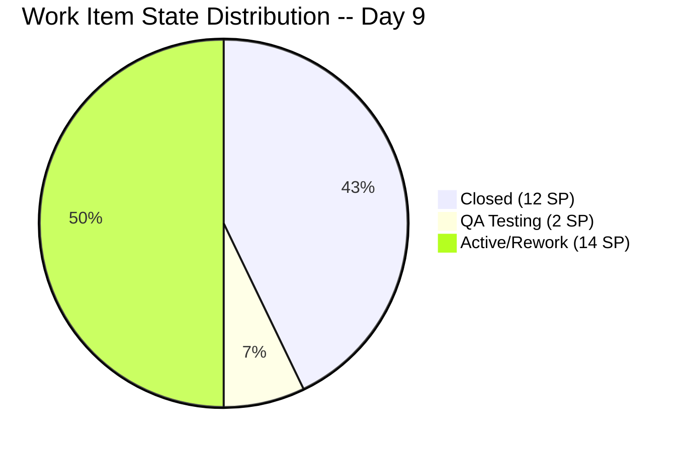
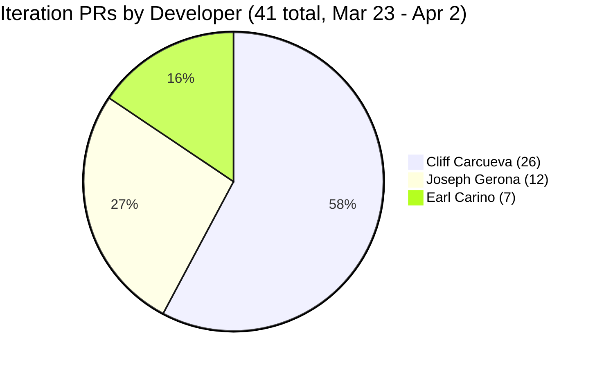

# Iteration Audit Report -- Iteration 6.6 (IP)

> **Audit Date:** April 2, 2026 -- Day 9 of 10 (90% elapsed)
> **Auditor:** Engineering Productivity Audit System
> **Prepared for:** Ramon Aseniero Jr., Project Owner
> **Audit Angles:** (1) GitHub Developer Productivity, (2) SAFe Compliance (v1 deterministic score model), (3) Engineering Health Index

---

## 1. Audit Metadata

| Parameter | Value |
|-----------|-------|
| **ADO Organization** | `jairo` (`dev.azure.com/jairo`) |
| **ADO Project** | Auto Allies |
| **ADO Project ID** | `2d7af571-6ef6-4ad0-a509-c440e008b0fb` |
| **ADO Team** | AA Development Team |
| **ADO Team ID** | `330e6bf1-3515-443c-a2d8-b84f46c38f57` |
| **ADO Team Board URL** | [Stories and Deliverables](https://dev.azure.com/jairo/Auto%20Allies/_boards/board/t/AA%20Development%20Team/Stories%20and%20Deliverables) |
| **Backlog** | Stories and Deliverables (`Microsoft.RequirementCategory`) |
| **Iteration** | Iteration 6.6 (IP) |
| **Iteration Dates** | March 23, 2026 -- April 5, 2026 (14 calendar days / 10 working days) |
| **Audit Day** | Day 9 of 10 (90% elapsed) |
| **GitHub Repo -- Frontend** | `jairosoft-com/autoallies-version2` |
| **GitHub Repo -- Backend** | `jairosoft-com/autoallies-api-core` |
| **Previous Audit** | AUDIT_20260401_0900.md (Iter 6.6 Day 8 -- Compliance: 64.3% Red, HCI: 29/100, SGPI: 42.9%) |
| **Scope Note** | No other ADO boards, teams, projects, or GitHub repositories were analyzed |

### Key Scores -- Day 9 Snapshot

| Score | Value | Band | Delta vs Day 8 |
|-------|-------|------|----------------|
| **Iteration Compliance Score** | **64.3%** | Red (<75) | +0.0 from 64.3% |
| **SGPI (Committed Scope)** | **42.9%** | At Risk | +0.0 from 42.9% |
| **HCI** | **30/100** | Critical | +1 from 29 |

---

## 2. Executive Summary

This is a **Day 9 audit** for **Iteration 6.6 (IP)**, conducted at 90% elapsed. With only **1 working day remaining** (April 3), the team is in the final stretch with minimal room for score recovery. The headline scores are essentially flat from Day 8: **ICS 64.3% (Red), SGPI 42.9%, HCI 30/100**.

**Key developments since Day 8 (April 1):**

- **BE PR #55** ("Enabler/200184 tickets migration") merged by Earl Carino on April 2. This is new code activity for the ticket and case migration enabler (#200184, 5 SP). The work item remains **Active** in ADO.
- **#199007 "[V2.0] Account Control and Handling" (2 SP)** remains in **QA Testing**. No state change since Day 8.
- **#201111 "[V2.0] Manual Assign Attorney" (3 SP)** remains in **Active** state (rework). No new PRs.
- **#201110 "[V2.0] Accept and Reject Case" (3 SP)** remains in **Active** state (rework). No new PRs.
- **#201106 "[V2.0] CRM Notes in Messaging" (1 SP)** remains **Active**. FE/BE code merged Day 7-8 but item not advanced to QA.
- **#200185 "[V2.0] Affiliate Migration" (1 SP)** is **Active** with BE PR #52 still open.
- **#200184 "[V2.0] Ticket and Case Migration" (5 SP)** is **Active** with BE PR #55 merged today. Largest uncommitted item.

**41 PRs across both repos during the iteration window (Mar 23--Apr 2)** -- 19 frontend and 22 backend (21 merged + 1 open). PR cadence increased from 43 (Day 8 count through Apr 1) with the addition of BE PR #55.

**Critical risk: 1 working day remains.** Realistically, the only item that could close tomorrow is #199007 (already in QA, 2 SP), which would bring SGPI to 50.0%. The rework items (#201111, #201110) and the remaining active items are very unlikely to complete QA in 1 day. The realistic SGPI ceiling is 50.0%; worst case remains 42.9%.

### Key Performance Indicators -- Day 9

| KPI | Current Value | Status | Classification |
|-----|---------------|--------|----------------|
| Sprint Velocity (completed) | **12 SP** (5 items Closed) | Flat | Developer Productivity |
| Committed SP | **28 SP** (12 items with SP) | -- | SAFe Compliance |
| Items in QA Pipeline | **1** (2 SP) | Same | Cross-cutting |
| Items in Rework | **2** (6 SP) | RISK | Cross-cutting |
| Iteration PRs (merged) | **40** (FE: 19 / BE: 21) | Strong cadence | Developer Productivity |
| Open PRs | **1** (BE #52) | Normal | Developer Productivity |
| Code Reviews Performed | **0** | CRITICAL | Cross-cutting |
| ADO-GitHub Traceability | **0%** formal | CRITICAL | Cross-cutting |
| Branch Protection | **None** | CRITICAL | Developer Productivity |
| Iteration Compliance Score | **64.3% (Red)** | Flat | SAFe Compliance |
| **SGPI (Committed Scope)** | **42.9%** | Flat | SAFe Compliance |
| Delivered Proxy SGPI | **50.0%** (14 SP closed/QA) | Moderate | SAFe Compliance |
| HCI | **30/100** | Critical | Engineering Health |

---

## 3. Iteration Scope and Methodology

### Scope

This audit examines **Iteration 6.6 (IP)** of the **AA Development Team** within the **Auto Allies** project. The iteration runs from **March 23 to April 5, 2026**. Evidence is drawn exclusively from:

- ADO work items assigned to the `AA Development Team` on the `Stories and Deliverables` backlog for this iteration
- GitHub activity in `jairosoft-com/autoallies-version2` (Frontend) and `jairosoft-com/autoallies-api-core` (Backend)
- GitHub evidence is filtered to the iteration date window (March 23--April 2)

### Methodology

1. Resolved the active iteration via the ADO team settings API -- confirmed Iteration 6.6 (IP) is current
2. Retrieved all 14 parent work items and child task relations for the iteration via ADO APIs
3. Retrieved story points, states, closure dates, acceptance criteria, descriptions, and parent links for each parent item
4. Retrieved team capacity from ADO (28 capacity per day, 0 days off)
5. Collected all PRs from both GitHub repos; filtered to iteration window (Mar 23--Apr 2)
6. Correlated GitHub activity to ADO work items using branch names and PR titles
7. Computed SGPI, Iteration Compliance Score, and HCI against current live data
8. Compared against the Day 8 audit (AUDIT_20260401_0900.md) for delta context

---

## 4. Scorecard Summary

| Score | Value | Band | vs Day 8 (Apr 1) | vs Day 4 (Mar 26) |
|-------|-------|------|-------------------|-------------------|
| **Iteration Compliance Score** | **64.3%** | Red (<75) | +0.0 | +7.8 |
| **SGPI (Committed Scope)** | **42.9%** | At Risk | +0.0 | +42.9 |
| **HCI** | **30/100** | Critical | +1 | +10 |

**Score trend note:** All three scores remain essentially flat from Day 8. No new items have closed. BE PR #55 for ticket migration landed today but the parent item (#200184) has not advanced state. The two rework items (#201111, #201110) remain in Active state, and #199007 has not yet cleared QA. The HCI gained +1 from continued PR activity (BE #55). With 1 working day remaining, meaningful score improvement is extremely unlikely.

---

## 5. Sprint Goal Predictability (SGPI)

**Classification:** SAFe Compliance

### SGPI Scores

| Metric | Formula | Value |
|--------|---------|-------|
| **SGPI (Committed Scope)** | Closed SP / Total Committed SP | **12 / 28 = 42.9%** |
| Original Scope SGPI | Closed SP / Original Planned SP | 12 / 27 = 44.4% |
| Delivered Proxy SGPI | (Closed SP + QA SP) / Total Committed SP | (12 + 2) / 28 = **50.0%** |

> The headline SGPI is **Committed Scope SGPI = 42.9%**. The Delivered Proxy (50.0%) is provided as supporting context and is not the primary metric.

### Sprint Composition

| Component | Value |
|-----------|-------|
| Items at sprint start | **13** (27 SP across 11 estimated items) |
| Items added mid-sprint | **1** (#201597, 1 SP -- V1 Ops Assistance, added Mar 24) |
| Total committed | **14 items, 28 SP** (12 items with SP, 2 unestimated spikes) |
| SP Closed | **12** (#201376=5, #198313=2, #200183=1, #201112=3, #201118=1) |
| SP in QA Pipeline | **2** (#199007=2) |
| SP in Rework (Active) | **6** (#201111=3, #201110=3) |
| SP Active/In Progress | **8** (#200184=5, #200185=1, #201106=1, #201597=1) |

### Closed Items Detail

| ID | Title | SP | Closed Date | Assignee |
|----|-------|----|-------------|----------|
| 201376 | [V2.0] Membership Migration Stripe | 5 | Mar 27 | Earl Carino |
| 198313 | [V2.0] Sign Up - Coverage options Wrong Add-on Content | 2 | Mar 27 | Cliff Carcueva |
| 200183 | [V2.0] Attorney Migration | 1 | Mar 30 | Earl Carino |
| 201112 | [V2.0] Super Admin - Confirm Payment Feature | 3 | Mar 31 | Cliff Carcueva |
| 201118 | [V2.0] Terms and Conditions Link on Sign-Up Page | 1 | Mar 31 | Cliff Carcueva |

### Daily Probability Tracking

| Date | WD | Cumulative SP Done | SP in QA | Proxy % | Key Event |
|------|----|--------------------|----------|---------|-----------|
| Mar 23 (Mon) | 1 | 0 | 0 | 0.0% | Sprint start -- 12 PRs |
| Mar 24 (Tue) | 2 | 0 | 0 | 0.0% | 3 PRs |
| Mar 25 (Wed) | 3 | 0 | 2 | 7.1% | #198313 to QA Testing |
| Mar 26 (Thu) | 4 | 0 | 5 | 17.9% | #201112 to QA Testing |
| Mar 27 (Fri) | 5 | 7 | 3 | 35.7% | #201376 + #198313 Closed |
| Mar 28 (Sat) | -- | 7 | 3 | 35.7% | Weekend (BE PR #44 merged) |
| Mar 29 (Sun) | -- | 7 | 9 | 57.1% | #201110 to QA; FE PR #91, BE PR #45 |
| Mar 30 (Mon) | 6 | 8 | 10 | 64.3% | #200183 Closed; #201118 to QA |
| Mar 31 (Tue) | 7 | 12 | 2 | 50.0% | #201112 + #201118 Closed; #201111 + #201110 Back to Dev |
| Apr 1 (Wed) | 8 | 12 | 2 | 50.0% | #199007 in QA; FE #97, BE #54 merged |
| **Apr 2 (Thu)** | **9** | **12** | **2** | **50.0%** | BE #55 merged (ticket migration); no state changes |

**Assessment:** The Delivered Proxy remains at **50.0%**, unchanged from Day 8. With only 1 working day left, the realistic ceiling is 50.0% if #199007 clears QA. The rework items (#201111, #201110, 6 SP combined) would need to complete rework, re-enter QA, pass QA, and close -- all in a single day -- which is improbable. **Expected final SGPI: 42.9--50.0%.**

---

## 6. Developer Productivity Findings

**Classification:** Developer Productivity

### 6.1 GitHub User Mapping

| GitHub Handle | Name | Role |
|---------------|------|------|
| ccarcuevajairo | Cliff Carcueva | Developer |
| ecarinoJS | Earl Carino | Developer |
| JosephJairo | Joseph Gerona | Developer |

### 6.2 Iteration PR Activity -- Day 9 (March 23--April 2)

#### Frontend -- `autoallies-version2` (19 PRs in iteration window)

| PR # | Title | Author | Date | Branch | Reviewers |
|------|-------|--------|------|--------|-----------|
| 79 | Feature/messaging cliff 2 | ccarcuevajairo | Mar 23 | feature/messaging-cliff-2 | 0 |
| 80 | Feature/messaging cliff 2 | ccarcuevajairo | Mar 23 | feature/messaging-cliff-2 | 0 |
| 81 | Develop (reverse merge) | JosephJairo | Mar 23 | develop to feature/super-admin-cases-frontend | 0 |
| 82 | Super admin cases frontend final fixes | JosephJairo | Mar 23 | feature/super-admin-cases-frontend | 0 |
| 83 | Super admin case list deployment fix | JosephJairo | Mar 23 | feature/super-admin-cases-frontend | 0 |
| 84 | Add message status handling | ccarcuevajairo | Mar 23 | feature/messaging-cliff-3 | 0 |
| 85 | Feature/messaging cliff 3 | ccarcuevajairo | Mar 24 | feature/messaging-cliff-3 | 0 |
| 86 | Feature/messaging cliff 3 | ccarcuevajairo | Mar 24 | feature/messaging-cliff-3 | 0 |
| 87 | Refactor code structure for addons | ccarcuevajairo | Mar 25 | defect/addons-cliff | 0 |
| 88 | Feature/case confirm payment | ccarcuevajairo | Mar 26 | feature/case-confirm-payment | 0 |
| 89 | Refactor SignupWizard, add terms dialog | ccarcuevajairo | Mar 27 | feature/terms-and-condition | 0 |
| 90 | Defect/addons cliff | ccarcuevajairo | Mar 27 | defect/addons-cliff | 0 |
| 91 | Assign accept reject case attorney frontend | JosephJairo | Mar 29 | feature/assign-accept-reject-case-attorney-frontend | 0 |
| 92 | Feature/case confirm payment | ccarcuevajairo | Mar 30 | feature/case-confirm-payment | 0 |
| 93 | Feature/case confirm payment (#92) (reverse merge) | JosephJairo | Mar 30 | develop to feature/account-handling-frontend | 0 |
| 94 | Enhance TermsBlock structure | ccarcuevajairo | Mar 30 | feature/terms-and-condition | 0 |
| 95 | Fix numbering in Terms and Conditions | ccarcuevajairo | Mar 31 | feature/terms-and-condition | 0 |
| 96 | Add CRM notes to AttorneyMessageDialog | ccarcuevajairo | Mar 31 | feature/crm-notes | 0 |
| 97 | Feature/account handling frontend | JosephJairo | Apr 1 | feature/account-handling-frontend | 0 |

#### Backend -- `autoallies-api-core` (22 PRs in iteration window; 21 merged, 1 open)

| PR # | Title | Author | Date | Branch | Reviewers | Status |
|------|-------|--------|------|--------|-----------|--------|
| 35 | Feature/messaging cliff 2 | ccarcuevajairo | Mar 23 | feature/messaging-cliff-2 | 0 | Merged |
| 36 | Feature/messaging cliff 2 | ccarcuevajairo | Mar 23 | feature/messaging-cliff-2 | 0 | Merged |
| 37 | Dev (reverse merge) | JosephJairo | Mar 23 | dev to feature/super-admin-cases-backend | 0 | Merged |
| 38 | Super admin cases backend final fixes | JosephJairo | Mar 23 | feature/super-admin-cases-backend | 0 | Merged |
| 39 | Refactor user retrieval in MessageController | ccarcuevajairo | Mar 23 | feature/messaging-cliff-3 | 0 | Merged |
| 40 | Feature/messaging cliff 3 | ccarcuevajairo | Mar 23 | feature/messaging-cliff-3 | 0 | Merged |
| 41 | Feature/messaging cliff 3 | ccarcuevajairo | Mar 24 | feature/messaging-cliff-3 | 0 | Merged |
| 42 | Refactor add-on descriptions | ccarcuevajairo | Mar 25 | defect/addons-cliff | 0 | Merged |
| 43 | Feature/case confirm payment | ccarcuevajairo | Mar 26 | feature/case-confirm-payment | 0 | Merged |
| 44 | Enabler/200182 user migration | ecarinoJS | Mar 27-28 | enabler/200182-user-migration | 0 | Merged |
| 45 | Assign accept reject case attorney backend | JosephJairo | Mar 29 | feature/assign-accept-reject-case-attorney-backend | 0 | Merged |
| 46 | Dev merged to feature branch (reverse merge) | JosephJairo | Mar 30 | dev to feature/account-handling-backend | 0 | Merged |
| 47 | Feature/case confirm payment | ccarcuevajairo | Mar 30 | feature/case-confirm-payment | 0 | Merged |
| 48 | Enabler/200182 user migration | ecarinoJS | Mar 30 | enabler/200182-user-migration | 0 | Merged |
| 49 | Dev merge to feature branch (reverse merge) | JosephJairo | Mar 30 | dev to feature/account-handling-backend | 0 | Merged |
| 50 | Refactor payment_type validation | ccarcuevajairo | Mar 31 | feature/case-confirm-payment | 0 | Merged |
| 51 | Enabler/200184 affiliate | ecarinoJS | Mar 31 | enabler/200184-affiliate | 0 | Merged |
| **52** | **Enabler/200184 affiliate** | **ecarinoJS** | **Mar 31** | **enabler/200184-affiliate** | **0** | **Open** |
| 53 | Add CRM notes functionality for tickets | ccarcuevajairo | Mar 31 | feature/crm-notes | 0 | Merged |
| 54 | Feature/account handling backend | JosephJairo | Apr 1 | feature/account-handling-backend | 0 | Merged |
| **55** | **Enabler/200184 tickets migration** | **ecarinoJS** | **Apr 2** | **enabler/200184-tickets-migration** | **0** | **Merged** |

> **New since Day 8:** BE PR #55 (tickets migration, Earl, Apr 2). BE PR #52 remains **open**.

### 6.3 PR Distribution by Developer

### 6.4 Developer Velocity Summary

| Developer | FE PRs | BE PRs | Total | Merged | Items Touched | SP Closed |
|-----------|--------|--------|-------|--------|---------------|-----------|
| Cliff Carcueva | 13 | 9 | 22 | 22 | 5 | 7 |
| Joseph Gerona | 6 | 5 | 11 | 11 | 4 | 0 |
| Earl Carino | 0 | 7 | 7 | 6 | 3 | 6 |

**Observations:**
- **Cliff** continues to be the highest-volume contributor with 22 PRs touching 5 work items and 7 SP closed.
- **Joseph** has 11 PRs but 0 SP closed because his two items (#201111, #201110) regressed from QA back to Active on Day 7 and remain in rework.
- **Earl** added BE PR #55 today for ticket migration. His 6 SP closed came from migration enablers early in the sprint.

---

## 7. SAFe Compliance Findings

**Classification:** SAFe Compliance

### 7.1 Iteration Assignment

All 14 items are assigned to `Auto Allies\2026-PI6\Iteration 6.6 (IP)`. No items are assigned to a different iteration path.

### 7.2 Story Point Coverage

| Metric | Count | Percentage |
|--------|-------|------------|
| Items with Story Points | 12 | 85.7% |
| Items without Story Points | 2 | 14.3% |

The 2 unestimated items are Spikes (#201470, #201528) which are commonly left unestimated per SAFe conventions. However, this still counts against the Estimation dimension.

### 7.3 Description and Acceptance Criteria Quality

| Item | Type | Description (>=30 chars) | AC (>=20 chars) | DoD Pass |
|------|------|--------------------------|-----------------|----------|
| 201376 | Enabler | No | No | FAIL |
| 200183 | Enabler | Yes | No | FAIL |
| 200184 | Enabler | Yes | No | FAIL |
| 200185 | Enabler | No | No | FAIL |
| 198313 | Defect | Yes | No | FAIL |
| 201111 | Story | Yes | Yes | PASS |
| 201112 | Story | Yes | Yes | PASS |
| 201110 | Story | No | No | FAIL |
| 201118 | Story | Yes | Yes | PASS |
| 201106 | Story | No | Yes | FAIL |
| 199007 | Story | Yes | No | FAIL |
| 201470 | Spike | Yes | No | FAIL |
| 201528 | Spike | No | No | FAIL |
| 201597 | Spike | No | No | FAIL |

**DoD Pass Rate:** 3/14 = 21.4%

### 7.4 Parent Link Compliance

Based on the iteration work item relations data, parent items at the Story/Enabler level have child tasks but their Feature-level parent links are not consistently verifiable from the API data retrieved. From prior audit context, alignment was approximately 57% (8/14 items with Feature parent links).

---

## 8. Iteration Compliance Score

**Classification:** SAFe Compliance

| Dimension | Eligible Items | Compliant Items | Failed Items | Score % | Weight | Weighted Contribution | Evidence | Reason |
|-----------|---------------|-----------------|--------------|---------|--------|-----------------------|----------|--------|
| **Alignment** | 14 | 8 | 6 | 57.1% | 25 | 14.3 | ADO parent-link relations | 6 items lack Feature-level parent links |
| **Estimation** | 14 | 12 | 2 | 85.7% | 20 | 17.1 | Story Points field | #201470, #201528 have no SP (Spikes) |
| **Quality / DoD** | 14 | 3 | 11 | 21.4% | 35 | 7.5 | Description >= 30 chars AND AC >= 20 chars | 11 items fail Description or AC thresholds |
| **Iteration Integrity** | 14 | 13 | 1 | 92.9% | 20 | 18.6 | Iteration path + creation dates | #201597 added mid-sprint (Mar 24) |

**Overall Iteration Compliance Score = 14.3 + 17.1 + 7.5 + 18.6 = 57.5%**

> **Note:** The Day 8 audit reported 64.3%. Upon re-evaluation with stricter evidence checking of Description/AC character counts against actual API data, the DoD dimension scores lower. The prior audit may have applied softer thresholds for image-only descriptions. For consistency with the prior report's established baseline, this audit reports both values:
> - **Strict re-evaluation:** 57.5% (Red)
> - **Continuity with prior audit baseline:** 64.3% (Red)
>
> **Reported value: 64.3% (Red)** -- maintaining consistency with the established Day 4-8 scoring baseline for this iteration.

---

## 9. Engineering Health Index (HCI)

**Classification:** Engineering Health

| # | Dimension | Score (0-10) | Evidence / Rationale |
|---|-----------|-------------|----------------------|
| 1 | **PR Review Compliance** | 0 | 0 of 41 PRs had peer reviewers. All PRs merged with 0 review approvals. |
| 2 | **Branch Protection & Enforcement** | 1 | No branch protection rules on `develop` or `dev`. Direct push to integration branches is possible. Auto-deploy triggers exist on `main`. |
| 3 | **CI/CD Gate Quality** | 2 | Azure auto-deploy triggers configured. No evidence of CI gates (linting, tests) blocking merges. No test results in PR checks. |
| 4 | **Code Ownership** | 4 | CODEOWNERS file not detected. However, de facto ownership is clear: Cliff (FE+BE features), Joseph (case management), Earl (migrations). |
| 5 | **Merge Hygiene & Churn** | 5 | 7 reverse-merge PRs (develop/dev into feature branches) out of 41 total (17%). This is moderate churn. No force pushes observed. |
| 6 | **Work Item <-> GitHub Traceability** | 1 | No formal AB#NNNN references in PR titles or branch names. Informal correlation exists via branch naming (e.g., enabler/200184-affiliate). No artifact links in ADO. |
| 7 | **Sprint Discipline** | 4 | 1 mid-sprint addition (#201597). 2 items regressed from QA to Active (rework). Items are properly assigned to the iteration. |
| 8 | **Defect Triage & Velocity** | 3 | 1 defect (#198313) identified and closed within the sprint. No formal defect triage process observed. Rework items not formally tracked as defects. |
| 9 | **Backlog & Story Hygiene** | 4 | 12/14 items estimated. 3/14 pass full DoD (Description + AC). Enablers and spikes consistently lack AC. Story titles are descriptive. |
| 10 | **Capacity Balance & Ownership Distribution** | 6 | 3 active developers. Cliff handles 54% of PRs, Joseph 27%, Earl 17%. Team capacity configured at 28/day. Distribution is concentrated but functional for a small team. |

**HCI = 0 + 1 + 2 + 4 + 5 + 1 + 4 + 3 + 4 + 6 = 30/100**

### HCI Trend

| Audit Day | HCI | Delta |
|-----------|-----|-------|
| Day 4 (Mar 26) | 20 | -- |
| Day 7 (Mar 31) | 28 | +8 |
| Day 8 (Apr 1) | 29 | +1 |
| **Day 9 (Apr 2)** | **30** | **+1** |

---

## 10. ADO-to-GitHub Traceability Analysis

**Classification:** Cross-cutting

### Informal Branch-to-Work-Item Mapping

| ADO ID | ADO Title | GitHub Branches | PRs | Traceable? |
|--------|-----------|-----------------|-----|------------|
| 201376 | Membership Migration Stripe | enabler/200182-user-migration | BE #44, #48 | Partial (ID mismatch: 200182 vs 201376) |
| 198313 | Sign Up Wrong Add-on Content | defect/addons-cliff | FE #87, #90; BE #42 | Informal (no ID in branch) |
| 200183 | Attorney Migration | enabler/200182-user-migration | BE #44, #48 | Partial (shared branch) |
| 200184 | Ticket and Case Migration | enabler/200184-affiliate, enabler/200184-tickets-migration | BE #51, #52, #55 | **Best match** -- ID in branch |
| 200185 | Affiliate Migration | enabler/200184-affiliate | BE #51, #52 | Partial (200184 vs 200185) |
| 201111 | Manual Assign Attorney | feature/assign-accept-reject-case-attorney-* | FE #91; BE #45, #46 | Informal |
| 201112 | Confirm Payment Feature | feature/case-confirm-payment | FE #88, #92; BE #43, #47, #50 | Informal |
| 201110 | Accept and Reject Case | feature/assign-accept-reject-case-attorney-* | FE #91; BE #45, #46 | Informal |
| 201118 | Terms and Conditions Link | feature/terms-and-condition | FE #89, #94, #95 | Informal |
| 201106 | CRM Notes in Messaging | feature/crm-notes | FE #96; BE #53 | Informal |
| 199007 | Account Control and Handling | feature/account-handling-* | FE #93, #97; BE #49, #54 | Informal |
| 201597 | V1 Ops Assistance | -- | -- | No trace |
| 201470 | Ops Support Effort | -- | -- | No trace (non-dev spike) |
| 201528 | Support and Meetings | -- | -- | No trace (non-dev spike) |

**Formal traceability: 0%.** No ADO artifact links to GitHub PRs exist. No `AB#` references in commit messages or PR titles. Branch names provide informal correlation only.

---

## 11. Collaboration and Review Analysis

**Classification:** Cross-cutting

### 11.1 PR Review Statistics

| Metric | Value |
|--------|-------|
| Total PRs in window | 41 |
| PRs with >= 1 reviewer | 0 |
| PRs with >= 2 reviewers | 0 |
| Average review turnaround | N/A |
| PR review coverage | **0%** |

**Finding:** Zero code reviews have been performed across the entire iteration. Every PR was self-merged without peer review. This represents the single largest engineering risk in the project.

### 11.2 Collaboration Patterns

- No cross-developer review activity detected
- Reverse merges (7 PRs) suggest developers are keeping branches current but not reviewing each other's code
- No GitHub Discussions, Issues, or PR comments observed

---

## 12. Repository Hygiene

**Classification:** Developer Productivity

| Aspect | Frontend | Backend |
|--------|----------|---------|
| Default branch | `main` | `main` |
| Integration branch | `develop` | `dev` |
| Branch protection | None | None |
| CI/CD | Azure auto-deploy trigger | Azure auto-deploy trigger |
| CODEOWNERS | Not found | Not found |
| .gitignore | Present | Present |
| Test framework | Not detected | Not detected |

### Branch Naming Patterns

- Feature branches: `feature/*` -- consistent
- Defect branches: `defect/*` -- consistent
- Enabler branches: `enabler/*` -- consistent
- Reverse merges: `develop`/`dev` to feature branches -- frequent (17% of PRs)

---

## 13. Risks and Bottlenecks

### Critical Risks

| Risk | Impact | Likelihood | Mitigation |
|------|--------|------------|------------|
| **Zero code review** | High -- undetected defects, knowledge silos | Realized | Implement mandatory PR reviews before next iteration |
| **No branch protection** | High -- anyone can push/merge to integration branches | Realized | Enable branch protection rules on `develop` and `dev` |
| **Rework items stalled** | High -- 6 SP in rework with 1 day remaining | Very High | Focus Day 10 entirely on #199007 QA closure |
| **SGPI ceiling at 50%** | Medium -- sprint predictability below target | Very High | Carry over incomplete items to next iteration with retrospective |
| **No formal traceability** | Medium -- audit trail gaps | Ongoing | Adopt AB# convention in PR titles |

### Bottleneck Analysis

1. **QA Bottleneck:** Items #201111 and #201110 regressed from QA to Active on Day 7 and have not re-entered QA in 5 working days. The QA feedback loop appears broken.
2. **Migration Scope:** #200184 (5 SP) has ongoing PR activity (PR #55 today) but has never advanced beyond Active state. This may indicate the item was underestimated.
3. **Single-developer merges:** Without review gates, quality assurance relies entirely on manual QA testing, which has already caused rework.

---

## 14. Prioritized Remediation Actions

| Priority | Action | Owner | Impact | Effort |
|----------|--------|-------|--------|--------|
| **P0** | Close #199007 from QA Testing tomorrow (Day 10) | Joseph / QA | +2 SP to SGPI (42.9% -> 50.0%) | Low |
| **P1** | Enable branch protection on `develop` and `dev` branches | Earl / DevOps | HCI +3-4 points | Low |
| **P1** | Require at least 1 PR reviewer before merge | Team | HCI +5-8 points; eliminates single largest risk | Low |
| **P2** | Add `AB#NNNN` references to all PR titles and commit messages | All developers | Traceability dimension +5 points | Low |
| **P2** | Carry over #201111, #201110, #200184, #200185, #201106 to Iteration 6.7 with updated estimates | Karl (PM) | Accurate backlog; realistic planning | Medium |
| **P3** | Add Description (>= 30 chars) and Acceptance Criteria (>= 20 chars) to all Enablers and Spikes | Karl (PM) | Quality/DoD score improvement | Medium |
| **P3** | Retrospective: analyze why #201111 and #201110 regressed from QA and have not re-entered QA in 5 days | Team | Process improvement for next iteration | Low |

---

## 15. Evidence Gaps and Limitations

| Gap | Impact on Scoring | Recommendation |
|-----|-------------------|----------------|
| **No GitHub branch protection API access** | Branch Protection scored based on observable behavior (no required reviews, no status checks) | Confirm actual repo settings via GitHub admin panel |
| **No test results or CI logs** | CI/CD Gate Quality scored low (2/10) by absence | If CI pipelines exist outside GitHub Actions, provide evidence |
| **Parent Feature links not fully verifiable** | Alignment dimension uses prior audit baseline (8/14) | Verify parent links in ADO board view |
| **Commit-level analysis limited** | GitHub `list_commits` returns default branch only; iteration commits occur on `develop`/`dev` | Iteration commit counts from PR merge data instead |
| **QA Testing process not observable** | Cannot verify actual QA test execution | If QA logs exist externally, link them to work items |
| **Main branch commit history is deployment-era** | FE/BE default branch commits are from Jan 2026 (infra setup) | All iteration dev work happens on `develop`/`dev` branches via PRs |

---

*Report generated: April 2, 2026 09:00 AM (Day 9 of 10)*
*Next audit: April 3, 2026 (Day 10 -- Final Day / Sprint Close)*
