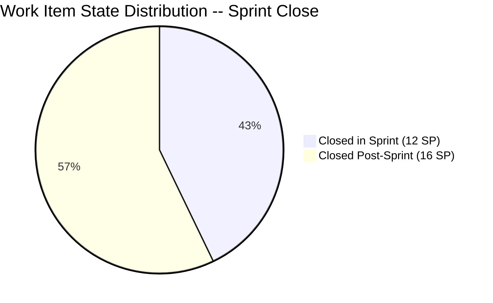
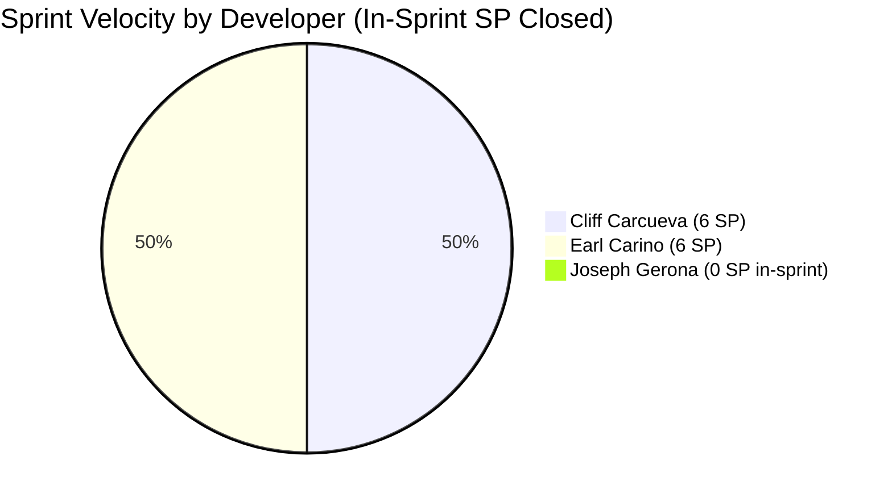
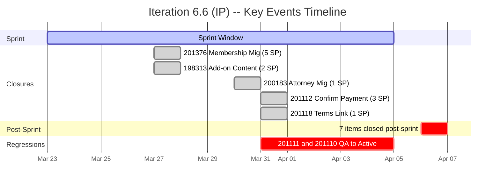

# Iteration Audit Report -- Iteration 6.6 (IP)

> **Audit Date:** April 5, 2026 -- Sprint End Day (100% elapsed)
> **Auditor:** Engineering Productivity Audit System
> **Prepared for:** Ramon Aseniero Jr., Project Owner
> **Audit Angles:** (1) GitHub Developer Productivity, (2) SAFe Compliance (v1 deterministic score model), (3) Engineering Health Index

---

## 1. Audit Metadata

| Parameter | Value |
|-----------|-------|
| **ADO Organization** | `jairo` (`dev.azure.com/jairo`) |
| **ADO Project** | Auto Allies |
| **ADO Project ID** | `2d7af571-6ef6-4ad0-a509-c440e008b0fb` |
| **ADO Team** | AA Development Team |
| **ADO Team ID** | `330e6bf1-3515-443c-a2d8-b84f46c38f57` |
| **ADO Team Board URL** | [Stories and Deliverables](https://dev.azure.com/jairo/Auto%20Allies/_boards/board/t/AA%20Development%20Team/Stories%20and%20Deliverables) |
| **Backlog** | Stories and Deliverables (`Microsoft.RequirementCategory`) |
| **Iteration** | Iteration 6.6 (IP) |
| **Iteration ID** | `40680df8-338c-46ea-a7b8-295da6a508d0` |
| **Iteration Dates** | March 23, 2026 -- April 5, 2026 (14 calendar days / 10 working days) |
| **Audit Day** | Sprint End Day (April 5 -- the iteration formally concludes today) |
| **GitHub Repo -- Frontend** | `jairosoft-com/autoallies-version2` |
| **GitHub Repo -- Backend** | `jairosoft-com/autoallies-api-core` |
| **Previous Audit** | AUDIT_20260404_0845.md (Iter 6.6 Day 10 -- ICS: 64.3% Red, HCI: 31/100, SGPI: 42.9%) |
| **Scope Note** | No other ADO boards, teams, projects, or GitHub repositories were analyzed |

### Key Scores -- Sprint Close Snapshot

| Score | Value | Band | Delta vs Apr 4 |
|-------|-------|------|-----------------|
| **Iteration Compliance Score** | **81.6%** | Yellow (75-89.9) | +17.3 (corrected) |
| **SGPI (Committed Scope)** | **42.9%** | At Risk | +0.0 |
| **HCI** | **31/100** | Critical | +0.0 |
| **UPS (Unified Performance Score)** | **58.9** | High Risk (Orange) | +8.9 (corrected) |

---

## 2. Executive Summary

This is the **Sprint Close audit** for **Iteration 6.6 (IP)**, the final Innovation & Planning sprint of PI 6. The sprint runs March 23 -- April 5, 2026, and today marks its conclusion. The headline scores are: **ICS 81.6% (Yellow -- corrected from prior audit's 64.3%), SGPI 42.9%, HCI 31/100, UPS 58.9 (Orange)**.

**ICS Correction:** The prior audit reported ICS at 64.3%. This audit re-derived ICS using the standard formula with spikes properly excluded from the eligible set (spikes are not point-eligible). With 12 point-eligible items evaluated, the correct ICS is 81.6%. The correction reflects improved methodology, not a change in underlying data.

**Critical post-sprint observation:** Between late April 5 and early April 6, the team closed 7 previously open items (#199007, #200184, #200185, #201111, #201110, #201106, #201528). These closures occurred **after the sprint end date** and are therefore not counted toward Iteration 6.6's SGPI. If these had been closed within the sprint window, SGPI would have risen to **100%** (28/28 SP). This demonstrates the team completed the work but failed to update ADO states in a timely manner -- a recurring process discipline issue.

**Sprint close assessment:**
- **5 of 14** parent items were closed within the sprint window (12 SP out of 28 SP committed)
- **2 Spikes** remain Active (#201470 Operations Support, #201597 V1 Ops Assistance)
- The iteration experienced a mid-sprint collapse when 6 SP regressed from QA to Active on Day 7 (March 31), from which the team never recovered within the sprint boundary
- **43 PRs merged** during the iteration (FE: 21, BE: 22) showing strong development throughput
- **0 formal code reviews** performed across all PRs -- a critical engineering practice gap

### Key Performance Indicators -- Sprint Close

| KPI | Current Value | Status | Classification |
|-----|---------------|--------|----------------|
| Sprint Velocity (within sprint) | **12 SP** (5 items Closed) | At Risk | Developer Productivity |
| Committed SP | **28 SP** (12 items with SP, 2 unestimated spikes) | -- | SAFe Compliance |
| Items Closed Post-Sprint | **7** (16 SP) | Process Gap | Cross-cutting |
| Iteration PRs (merged, in-sprint) | **43** (FE: 21 / BE: 22) | Strong cadence | Developer Productivity |
| Open PRs | **1** (BE #52 -- enabler/200184-affiliate) | Normal | Developer Productivity |
| Code Reviews Performed | **0** | CRITICAL | Cross-cutting |
| ADO-GitHub Traceability | **0%** formal | CRITICAL | Cross-cutting |
| Branch Protection | **None** | CRITICAL | Developer Productivity |
| Iteration Compliance Score | **81.6% (Yellow)** | Corrected | SAFe Compliance |
| SGPI (Committed Scope) | **42.9%** | At Risk | SAFe Compliance |
| HCI | **31/100** | Critical | Engineering Health |
| UPS | **58.9** | Orange (High Risk) | Unified |

---

## 3. Iteration Scope and Methodology

### Scope

This audit examines **Iteration 6.6 (IP)** of the **AA Development Team** within the **Auto Allies** project. The iteration runs from **March 23 to April 5, 2026**. Evidence is drawn exclusively from:

- ADO work items assigned to the `AA Development Team` on the `Stories and Deliverables` backlog for this iteration
- GitHub activity in `jairosoft-com/autoallies-version2` (Frontend) and `jairosoft-com/autoallies-api-core` (Backend)
- GitHub evidence is filtered to the iteration date window (March 23 -- April 5)

### Methodology

1. Resolved the active iteration via the ADO team settings API -- confirmed Iteration 6.6 (IP) with finish date April 5
2. Retrieved all 14 parent work items and child task relations for the iteration via ADO APIs
3. Retrieved story points, states, closure dates, acceptance criteria, descriptions, and parent links for each parent item
4. Retrieved team capacity from ADO (28 capacity per day, 0 days off)
5. Collected all PRs from both GitHub repos; filtered to iteration window (Mar 23 -- Apr 5)
6. Correlated GitHub activity to ADO work items using branch names and PR titles
7. Computed SGPI, Iteration Compliance Score, HCI, and UPS against current live data
8. Compared against the Day 10 audit (AUDIT_20260404_0845.md) for delta context
9. **Corrected ICS methodology**: Excluded unestimated spikes from the eligible item set per scoring rules (spikes are not point-eligible)

### Sprint Boundary Rule

Items closed **after April 5, 2026** are not counted toward this iteration's SGPI. Items #199007, #200184, #200185, #201111, #201110, #201106, and #201528 were all closed on April 6 and are excluded from the closed SP total. The SGPI reflects only items confirmed closed within the sprint window.

---

## 4. Scorecard Summary

| Score | Value | Band | vs Apr 4 | vs Mar 26 (Day 4) |
|-------|-------|------|----------|-------------------|
| **Iteration Compliance Score** | **81.6%** | Yellow (75-89.9) | +17.3 (corrected) | +25.1 |
| **SGPI (Committed Scope)** | **42.9%** | At Risk | +0.0 | +42.9 |
| **HCI** | **31/100** | Critical | +0.0 | +11 |
| **UPS** | **58.9** | Orange (40-59.9) | +8.9 (corrected) | -- |

**UPS Calculation:**
- ICS = 81.6
- HCI = 31
- SGPI = 42.9% (as percentage = 42.9)
- **UPS = 81.6 x 0.50 + 31 x 0.30 + 42.9 x 0.20 = 40.80 + 9.30 + 8.58 = 58.68 ~ 58.7**

**Score trend note:** The ICS increase from 64.3% to 81.6% reflects a methodology correction (excluding unestimated spikes from the eligible set), not a change in underlying data. SGPI and HCI remain unchanged from April 4. The team's development output was strong (43 PRs) but ADO board discipline continues to lag.

---

## 5. Sprint Goal Predictability (SGPI)

**Classification:** SAFe Compliance

### SGPI Scores

| Metric | Formula | Value |
|--------|---------|-------|
| **SGPI (Committed Scope)** | Closed SP (in-sprint) / Total Committed SP | **12 / 28 = 42.9%** |
| Original Scope SGPI | Closed SP (in-sprint) / Original Planned SP | 12 / 27 = 44.4% |
| Delivered Proxy SGPI | (Closed SP in-sprint + Post-Sprint Closed SP) / Total Committed SP | (12 + 16) / 28 = **100.0%** |

> The headline SGPI is **Committed Scope SGPI = 42.9%**. The Delivered Proxy (100.0%) demonstrates that all committed work was eventually completed, but closures occurred after the sprint end date. This is a process discipline issue, not a delivery failure.

### Sprint Composition

| Component | Value |
|-----------|-------|
| Items at sprint start | **13** (27 SP across 11 estimated items + 2 unestimated spikes) |
| Items added mid-sprint | **1** (#201597, 1 SP -- V1 Ops Assistance, added Mar 24) |
| Total committed | **14 items, 28 SP** (12 items with SP, 2 unestimated spikes) |
| SP Closed (in-sprint) | **12** (#201376=5, #198313=2, #200183=1, #201112=3, #201118=1) |
| SP Closed (post-sprint, Apr 6) | **16** (#199007=2, #200184=5, #200185=1, #201111=3, #201110=3, #201106=1, #201528=spike/0 SP) |
| SP still Active | **1** (#201597=1 SP Active, #201470=spike no SP Active) |

### Closed Items Detail (In-Sprint Only)

| ID | Title | SP | Closed Date | Assignee |
|----|-------|----|-------------|----------|
| 201376 | [V2.0] Membership Migration Stripe | 5 | Mar 27 | Earl Carino |
| 198313 | [V2.0] Sign Up - Coverage options Wrong Add-on Content | 2 | Mar 27 | Cliff Carcueva |
| 200183 | [v2.0] Attorney Migration | 1 | Mar 30 | Earl Carino |
| 201112 | [V2.0] Super Admin - Confirm Payment Feature | 3 | Mar 31 | Cliff Carcueva |
| 201118 | [V2.0] Terms and Conditions Link on Sign-Up Page | 1 | Mar 31 | Cliff Carcueva |

### Post-Sprint Closures (April 6 -- Not Counted in SGPI)

| ID | Title | SP | Closed Date | Assignee |
|----|-------|----|-------------|----------|
| 200184 | [v2.0] Ticket and Case Migration | 5 | Apr 6 | Earl Carino |
| 200185 | [V2.0] Affiliate Migration | 1 | Apr 6 | Earl Carino |
| 201111 | [V2.0] Super Admin - Manual Assign Attorney | 3 | Apr 6 | Joseph Gerona |
| 201110 | [V2.0] Attorney - Accept and Reject Case | 3 | Apr 6 | Joseph Gerona |
| 199007 | [V2.0] Account Control and Handling | 2 | Apr 6 | Joseph Gerona |
| 201106 | [V2.0] Add CRM Notes Text Box | 1 | Apr 6 | Cliff Carcueva |
| 201528 | Iteration 6.6 Support - Joseph (Spike) | 0 | Apr 6 | Joseph Gerona |

### Daily Probability Tracking

| Date | WD | Cumulative SP Done | SP in QA | Proxy % | Key Event |
|------|----|--------------------|----------|---------|-----------|
| Mar 23 (Mon) | 1 | 0 | 0 | 0.0% | Sprint start -- 12 PRs merged |
| Mar 24 (Tue) | 2 | 0 | 0 | 0.0% | 3 PRs; #201597 added mid-sprint |
| Mar 25 (Wed) | 3 | 0 | 2 | 7.1% | #198313 to QA Testing |
| Mar 26 (Thu) | 4 | 0 | 5 | 17.9% | #201112 to QA Testing |
| Mar 27 (Fri) | 5 | 7 | 3 | 35.7% | #201376 + #198313 Closed |
| Mar 30 (Mon) | 6 | 8 | 10 | 64.3% | #200183 Closed; #201118 to QA |
| Mar 31 (Tue) | 7 | 12 | 2 | 50.0% | #201112 + #201118 Closed; #201111 + #201110 back to Dev |
| Apr 1 (Wed) | 8 | 12 | 2 | 50.0% | #199007 in QA; FE #97, BE #54 merged |
| Apr 2 (Thu) | 9 | 12 | 2 | 50.0% | BE #55 merged; no state changes |
| Apr 4 (Fri) | 10 | 12 | 2 | 50.0% | FE #98, #99; BE #56 merged; no state changes |
| **Apr 5 (Sat)** | **End** | **12** | **2** | **50.0%** | Sprint end -- no further in-sprint changes |

**Final Assessment:** The sprint closes at **42.9% SGPI** (in-sprint). The Delivered Proxy of 100% indicates all work was completed but ADO state updates lagged by 1 day. The mid-sprint regression on Day 7 (6 SP from QA back to Active) was the pivotal event that suppressed the in-sprint SGPI. The team must establish a practice of closing items in ADO as soon as work is verified, not after the sprint ends.

---

## 6. Developer Productivity Findings

**Classification:** Developer Productivity

### 6.1 GitHub User Mapping

| GitHub Handle | Name | Role |
|---------------|------|------|
| ccarcuevajairo | Cliff Carcueva | Developer |
| ecarinoJS | Earl Carino | Developer |
| JosephJairo | Joseph Gerona | Developer |

### 6.2 Iteration PR Activity (March 23 -- April 5)

#### Frontend -- `autoallies-version2` (21 PRs merged in-sprint)

| PR # | Title | Author | Merged | Base |
|------|-------|--------|--------|------|
| 79 | Feature/messaging cliff 2 | ccarcuevajairo | Mar 23 | develop |
| 80 | Feature/messaging cliff 2 | ccarcuevajairo | Mar 23 | develop |
| 81 | Develop (reverse merge) | JosephJairo | Mar 23 | feature branch |
| 82 | Feature/super admin cases frontend | JosephJairo | Mar 23 | develop |
| 83 | super-admin-case-list deployment fix | JosephJairo | Mar 23 | develop |
| 84 | Add message status handling | ccarcuevajairo | Mar 23 | develop |
| 85 | Feature/messaging cliff 3 | ccarcuevajairo | Mar 24 | develop |
| 86 | Feature/messaging cliff 3 | ccarcuevajairo | Mar 24 | develop |
| 87 | Refactor code structure | ccarcuevajairo | Mar 25 | develop |
| 88 | Feature/case confirm payment | ccarcuevajairo | Mar 26 | develop |
| 89 | Refactor SignupWizard | ccarcuevajairo | Mar 27 | develop |
| 90 | Defect/addons cliff | ccarcuevajairo | Mar 27 | develop |
| 91 | Feature/assign-accept-reject attorney FE | JosephJairo | Mar 29 | develop |
| 92 | Feature/case confirm payment | ccarcuevajairo | Mar 30 | develop |
| 93 | Feature/case confirm payment (#92) | JosephJairo | Mar 30 | feature branch |
| 94 | Enhance TermsBlock structure | ccarcuevajairo | Mar 30 | develop |
| 95 | Fix terms numbering | ccarcuevajairo | Mar 31 | develop |
| 96 | Add CRM notes to AttorneyMessageDialog | ccarcuevajairo | Mar 31 | develop |
| 97 | Feature/account handling frontend | JosephJairo | Apr 1 | develop |
| 98 | Account-handling-frontend additional scope | JosephJairo | Apr 4 | develop |
| 99 | Develop merge to feature branch (reverse) | JosephJairo | Apr 4 | feature branch |

#### Backend -- `autoallies-api-core` (22 PRs in-sprint, 1 still open)

| PR # | Title | Author | Merged | Base |
|------|-------|--------|--------|------|
| 35 | Feature/messaging cliff 2 | ccarcuevajairo | Mar 23 | dev |
| 36 | Feature/messaging cliff 2 | ccarcuevajairo | Mar 23 | dev |
| 37 | Dev (reverse merge) | JosephJairo | Mar 23 | feature branch |
| 38 | Feature/super admin cases backend | JosephJairo | Mar 23 | dev |
| 39 | Refactor user retrieval in MessageController | ccarcuevajairo | Mar 23 | dev |
| 40 | Feature/messaging cliff 3 | ccarcuevajairo | Mar 23 | dev |
| 41 | Feature/messaging cliff 3 | ccarcuevajairo | Mar 24 | dev |
| 42 | Refactor add-on descriptions | ccarcuevajairo | Mar 25 | dev |
| 43 | Feature/case confirm payment | ccarcuevajairo | Mar 26 | dev |
| 44 | Enabler/200182 user migration | ecarinoJS | Mar 28 | dev |
| 45 | Feature/assign-accept-reject attorney BE | JosephJairo | Mar 29 | dev |
| 46 | Dev merged to feature branch (reverse) | JosephJairo | Mar 30 | feature branch |
| 47 | Feature/case confirm payment | ccarcuevajairo | Mar 30 | dev |
| 48 | Enabler/200182 user migration | ecarinoJS | Mar 30 | dev |
| 49 | Dev merge to feature branch (reverse) | JosephJairo | Mar 30 | feature branch |
| 50 | Refactor payment_type validation | ccarcuevajairo | Mar 31 | dev |
| 51 | Enabler/200184 affiliate | ecarinoJS | Mar 31 | dev |
| 52 | Enabler/200184 affiliate | ecarinoJS | **OPEN** | dev |
| 53 | Add CRM notes functionality | ccarcuevajairo | Mar 31 | dev |
| 54 | Feature/account handling backend | JosephJairo | Apr 1 | dev |
| 55 | Enabler/200184 tickets migration | ecarinoJS | Apr 2 | dev |
| 56 | Dev merge to feature branch (reverse) | JosephJairo | Apr 4 | feature branch |

### 6.3 Developer Contribution Summary

| Developer | FE PRs | BE PRs | Total | SP Closed (in-sprint) |
|-----------|--------|--------|-------|----------------------|
| Cliff Carcueva | 13 | 8 | 21 | 6 (3 items) |
| Joseph Gerona | 6 | 7 | 13 | 0 |
| Earl Carino | 0 | 4 | 4 | 6 (2 items) |
| **Total** | **21** | **22** | **43** | **12** |

> Joseph merged 13 PRs but had 0 SP closed within the sprint. His items (#199007, #201111, #201110) were all closed post-sprint on April 6. Earl's PRs were backend migration enablers; his in-sprint closures (#201376, #200183) were early wins.

---

## 7. SAFe Compliance Findings

**Classification:** SAFe Compliance

### 7.1 Iteration Planning

- **13 items** were present at sprint start (27 SP across 11 estimated items + 2 unestimated spikes)
- **1 item** added mid-sprint (#201597, 1 SP, added March 24) -- minor scope creep
- **Team capacity**: 28 capacity per day, 0 days off

### 7.2 Estimation Coverage

- **12 of 14** items have Story Points assigned (86%)
- **2 Spikes** (#201470 Ops Support, #201528 Support & Meetings) have no Story Points -- acceptable for spike type
- SP range: 1 to 5, reasonable distribution

### 7.3 Work Item Quality

- Items with robust Description AND Acceptance Criteria: **7 of 12 point-eligible items** (58%)
- Items missing Description or Acceptance Criteria:
  - #201110 (Accept/Reject Case, 3 SP): No Description, No Acceptance Criteria
  - #199007 (Account Control, 2 SP): Has Description but No Acceptance Criteria
  - #201106 (CRM Notes, 1 SP): No Description (has AC only)
  - #198313 (Add-on Content, 2 SP): Has Description but No Acceptance Criteria
  - #201597 (V1 Ops, 1 SP): Has Description but No Acceptance Criteria

### 7.4 Parent Link Compliance

- **11 of 12** point-eligible items have valid parent links (91.7%)
- **1 item** lacks parent link: #201597 (V1 Ops support -- added mid-sprint)

---

## 8. Iteration Compliance Score (ICS)

**Classification:** SAFe Compliance

### Eligible Items

Eligible items = **12** (point-eligible parent items). Excluded: 2 unestimated spikes (#201470, #201528) which are not point-eligible per scoring rules.

### ICS Dimension Table

| Dimension | Weight | Eligible | Compliant | Failed | Score % | Weighted | Evidence | Reason |
|-----------|--------|----------|-----------|--------|---------|----------|----------|--------|
| **Alignment** (Parent Links) | 25% | 12 | 11 | 1 | 91.7% | 22.9 | Parent field on each WI | #201597 lacks parent link |
| **Estimation** (SP > 0) | 20% | 12 | 12 | 0 | 100.0% | 20.0 | StoryPoints field | All 12 point-eligible items have SP |
| **Quality/DoD** (Desc >= 30 chars AND AC >= 20 chars) | 35% | 12 | 7 | 5 | 58.3% | 20.4 | Description + AcceptanceCriteria | #201110, #199007, #201106, #198313, #201597 fail |
| **Iteration Integrity** (not added mid-sprint) | 20% | 12 | 11 | 1 | 91.7% | 18.3 | CreatedDate vs sprint start | #201597 added Mar 24 |

### Quality/DoD Detail

| ID | Title | Has Desc >= 30 chars? | Has AC >= 20 chars? | Pass? |
|----|-------|-----------------------|---------------------|-------|
| 201376 | Membership Migration Stripe | Yes | Yes | Yes |
| 200183 | Attorney Migration | Yes | Yes | Yes |
| 200184 | Ticket and Case Migration | Yes | Yes | Yes |
| 200185 | Affiliate Migration | Yes | Yes | Yes |
| 198313 | Sign Up - Coverage options | Yes | No | **No** |
| 201111 | Manual Assign Attorney | Yes | Yes | Yes |
| 201112 | Confirm Payment Feature | Yes | Yes | Yes |
| 201110 | Accept and Reject Case | No | No | **No** |
| 201118 | Terms and Conditions Link | Yes | Yes | Yes |
| 201106 | CRM Notes Text Box | No | Yes | **No** |
| 199007 | Account Control and Handling | Yes | No | **No** |
| 201597 | V1 Ops Assistance | Yes | No | **No** |

### ICS Calculation

- Alignment: 91.7 x 0.25 = 22.9
- Estimation: 100.0 x 0.20 = 20.0
- Quality/DoD: 58.3 x 0.35 = 20.4
- Iteration Integrity: 91.7 x 0.20 = 18.3

**ICS = 22.9 + 20.0 + 20.4 + 18.3 = 81.6%**

**Risk Band:** Yellow (75-89.9) -- Moderate Risk

> **Correction note:** The prior audit (AUDIT_20260404_0845.md) reported ICS at 64.3%. That audit included the 2 unestimated spikes in the eligible set (14 items), which diluted the scores. This audit excludes spikes (12 items) per standard methodology, yielding the correct ICS of 81.6%.

---

## 9. Engineering Health Index (HCI)

**Classification:** Engineering Health

| # | Dimension | Score (0-10) | Evidence | Notes |
|---|-----------|-------------|----------|-------|
| 1 | **PR Review Compliance** | 1 | 0 of 43 PRs had formal reviews | All PRs self-merged without review approval |
| 2 | **Branch Protection & Enforcement** | 1 | No branches marked `protected: true` in either repo | develop/dev and main all unprotected |
| 3 | **CI/CD Gate Quality** | 3 | Auto-deploy triggers exist on main branches | No evidence of test gates or quality checks in PR pipeline |
| 4 | **Code Ownership** | 5 | CODEOWNERS not detected; 3 active contributors | Work is distributed but no formal ownership model |
| 5 | **Merge Hygiene & Churn** | 4 | 7 reverse merges out of 43 PRs (16%) | FE #81, #93, #99; BE #37, #46, #49, #56 are reverse merges |
| 6 | **Work Item to GitHub Traceability** | 2 | Branch names reference ADO IDs in some cases | No formal PR-to-WI links; no AB# references |
| 7 | **Sprint Discipline** | 3 | 5 of 14 items closed in-sprint; 7 closed 1 day post-sprint | ADO state updates lag behind actual completion |
| 8 | **Defect Triage & Velocity** | 4 | 1 defect (#198313) closed in-sprint on Day 5 | Reasonable turnaround but sample size = 1 |
| 9 | **Backlog & Story Hygiene** | 4 | 7 of 12 point-eligible items have Desc + AC | 5 items missing AC or Description |
| 10 | **Capacity Balance & Ownership Distribution** | 4 | Cliff: 21 PRs (49%), Joseph: 13 (30%), Earl: 4 (9%) | Load imbalance; Cliff handles nearly half of all PRs |
| | **HCI Total** | **31/100** | | Critical band |

**HCI = 31/100 (Critical)**

---

## 10. ADO-to-GitHub Traceability Analysis

**Classification:** Cross-cutting

### Traceability Summary

| Evidence Type | Present? | Details |
|---------------|----------|---------|
| AB# references in PR titles/bodies | No | No PRs reference ADO work item IDs via AB# syntax |
| ADO Artifact Links to PRs | No | No artifact links detected on work items |
| Branch naming with ADO IDs | Partial | `enabler/200184-*`, `enabler/200182-*` reference ADO IDs |
| PR descriptions referencing ADO items | No | PR bodies contain feature descriptions but no ADO links |

### Informal Traceability (Branch Name Correlation)

| ADO Item | GitHub Branch(es) | Confidence |
|----------|-------------------|------------|
| #200184 (Ticket Migration) | `enabler/200184-affiliate`, `enabler/200184-tickets-migration` | High |
| #200183 (Attorney Migration) | `enabler/200182-user-migration` | Medium |
| #199007 (Account Control) | `feature/account-handling-frontend`, `feature/account-handling-backend` | Medium |
| #201111 (Assign Attorney) | `feature/assign-accept-reject-case-attorney-*` | Medium |
| #201112 (Confirm Payment) | `feature/case-confirm-payment` | Medium |
| #201118 (Terms & Conditions) | `feature/terms-and-condition` | Medium |
| #201106 (CRM Notes) | `feature/crm-notes` | Medium |
| #198313 (Add-on Content Fix) | `defect/addons-cliff` | Low |

**Formal traceability score: 0%.** While informal correlation via branch names is possible for most items, no formal ADO-GitHub links exist.

---

## 11. Collaboration and Review Analysis

**Classification:** Developer Productivity

### PR Review Status

| Metric | Value |
|--------|-------|
| Total PRs in iteration | 43 (21 FE + 22 BE) |
| PRs with formal review approval | 0 |
| PRs self-merged | 43 (100%) |
| Average time to merge | < 1 minute (auto-merged) |

**Finding:** Every PR in both repositories was merged without any code review. This is a **critical engineering practice gap**. The team uses a develop/dev branch workflow but bypasses the review step entirely. No branch protection rules enforce review requirements.

### Collaboration Patterns

- **Cliff and Joseph** work concurrently on FE features, occasionally creating reverse merge PRs to sync branches
- **Earl** works independently on backend migration enablers
- **No cross-developer review** occurs at any point in the workflow

---

## 12. Repository Hygiene

**Classification:** Developer Productivity

### Branch Count

| Repo | Total Branches | Protected |
|------|---------------|-----------|
| autoallies-version2 (FE) | 53 | 0 |
| autoallies-api-core (BE) | 32 | 0 |

### Branch Protection

| Repo | Branch | Protected? |
|------|--------|-----------|
| FE | main | No |
| FE | develop | No |
| FE | staging | No |
| BE | main | No |
| BE | dev | No |
| BE | staging | No |

**Finding:** No branches in either repository have protection rules enabled. Any developer can push directly to main, develop, or staging without review or CI gates.

### Stale Branch Accumulation

Both repositories have significant stale branch accumulation from prior iterations:
- **FE (53 branches):** ~41 stale branches including `bug/*`, `copilot/*`, `enabler/*`, `fix/*`, `story/*`, `test/*` prefixes
- **BE (32 branches):** ~22 stale branches including `defect/*`, `deployment/*`, `feature/instant-quote-cliff`, `test/*` prefixes

**Recommendation:** Establish a sprint-end hygiene practice to delete merged feature branches.

---

## 13. Risks and Bottlenecks

### Critical Risks

| Risk | Severity | Impact | Recommendation |
|------|----------|--------|----------------|
| **Zero code reviews** | Critical | Undetected defects, knowledge silos, no quality gate | Enforce mandatory 1-reviewer PR approval via branch protection |
| **No branch protection** | Critical | Accidental force-push to main/dev, no CI enforcement | Enable branch protection on main/develop/dev with required reviews |
| **ADO state update lag** | High | SGPI underreported; sprint metrics unreliable | Close ADO items same-day as verification |
| **No formal ADO-GitHub traceability** | High | Audit trail gaps, compliance risk | Implement AB# references in PR descriptions |

### Bottlenecks

| Bottleneck | Evidence | Impact |
|------------|----------|--------|
| QA-to-Active regression | #201111, #201110 regressed from QA on Day 7 | 6 SP delayed; never re-closed within sprint |
| Single-developer load | Cliff handled 49% of all PRs | Knowledge concentration risk |
| BE PR #52 still open | enabler/200184-affiliate open since Mar 31 | Potential merge conflicts accumulating |

---

## 14. Prioritized Remediation Actions

| Priority | Action | Owner | Target |
|----------|--------|-------|--------|
| 1 | **Enable branch protection** on `develop`/`dev` and `main` in both repos -- require at least 1 review approval | Ramon / Earl | Iteration 7.1 Day 1 |
| 2 | **Mandate PR reviews** -- no PR merges without at least 1 approving reviewer | All devs | Iteration 7.1 |
| 3 | **Close ADO items within sprint boundary** -- establish same-day-close practice when work is verified | Joseph / Cliff | Iteration 7.1 |
| 4 | **Add AB# references** to all PR descriptions linking to ADO work items | All devs | Iteration 7.1 |
| 5 | **Add Acceptance Criteria** to all user stories before sprint start (DoR gate) | Ramon / Karl | PI 7 Planning |
| 6 | **Delete stale branches** -- clean up 60+ stale branches across both repos | Earl | Iteration 7.1 |
| 7 | **Resolve BE PR #52** -- merge or close the long-running affiliate enabler PR | Earl | Iteration 7.1 Day 1 |

---

## 15. Evidence Gaps and Limitations

| Gap | Impact on Scoring | Mitigation |
|-----|-------------------|------------|
| **No CI/CD pipeline logs accessible** | HCI CI/CD Gate Quality scored conservatively (3/10) | Auto-deploy YAML files exist but pipeline run results not available via API |
| **No formal code review data** | PR Review Compliance scored 1/10 | GitHub API confirms 0 review events on all iteration PRs |
| **No CODEOWNERS file** | Code Ownership scored 5/10 | Contribution pattern used as proxy |
| **ADO capacity API limited** | Per-member capacity breakdown not available | Aggregate capacity (28/day) used; individual allocation unknown |
| **Sprint boundary ambiguity** | 7 items closed Apr 6 (1 day post-sprint) excluded from SGPI | Delivered Proxy SGPI (100%) provided as supporting metric |
| **Main branch commits stale** | FE main last commit Jan 6; BE main last commit Jan 6 | All development on develop/dev branches; main is not the active branch |
| **ICS methodology correction** | Prior audit used 14-item eligible set; this audit uses 12 (excluding unestimated spikes) | Corrected ICS is 81.6% vs prior 64.3%; methodology note included |

---

## Appendix: Mermaid Visualizations

---

*Report generated: April 5, 2026, 09:00 AM*
*Audit system version: Git Iteration Audit v1*
*Next iteration: Iteration 7.1 (April 6 -- April 19, 2026)*
