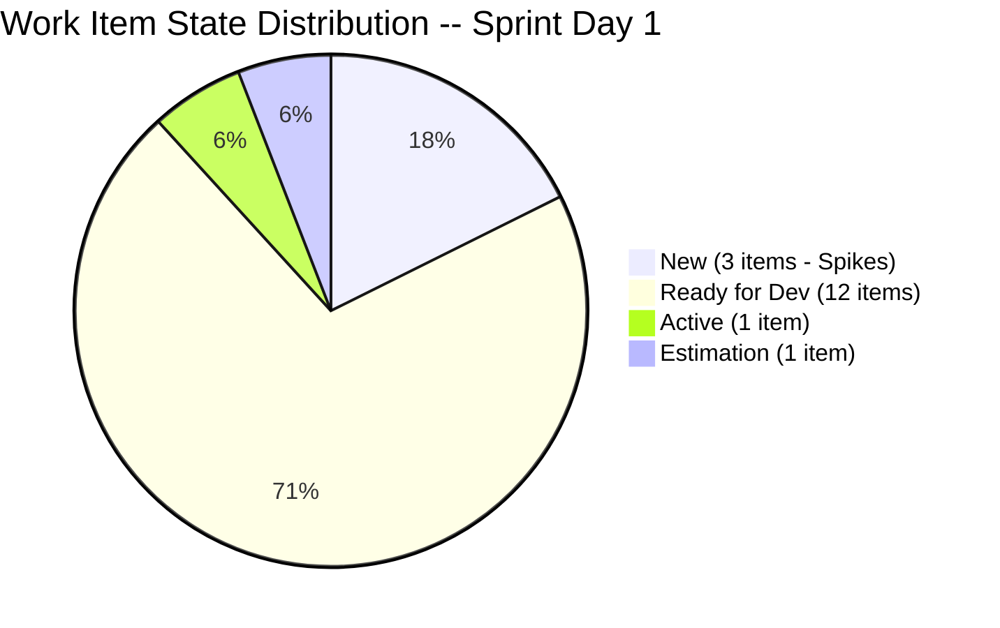

# Iteration Audit Report -- Iteration 7.1

> **Audit Date:** April 6, 2026 -- Sprint Day 1 (7% elapsed)
> **Auditor:** Engineering Productivity Audit System
> **Prepared for:** Ramon Aseniero Jr., Project Owner
> **Audit Angles:** (1) GitHub Developer Productivity, (2) SAFe Compliance (v1 deterministic score model), (3) Engineering Health Index

---

## 1. Audit Metadata

| Parameter | Value |
|-----------|-------|
| **ADO Organization** | `jairo` (`dev.azure.com/jairo`) |
| **ADO Project** | Auto Allies |
| **ADO Project ID** | `2d7af571-6ef6-4ad0-a509-c440e008b0fb` |
| **ADO Team** | AA Development Team |
| **ADO Team ID** | `330e6bf1-3515-443c-a2d8-b84f46c38f57` |
| **ADO Team Board URL** | [Stories and Deliverables](https://dev.azure.com/jairo/Auto%20Allies/_boards/board/t/AA%20Development%20Team/Stories%20and%20Deliverables) |
| **Backlog** | Stories and Deliverables (`Microsoft.RequirementCategory`) |
| **Iteration** | Iteration 7.1 |
| **Iteration ID** | `c51465e3-0d62-4ab8-8621-7e963a357ef0` |
| **Iteration Path** | `Auto Allies\2026-PI7\Iteration 7.1` |
| **Iteration Dates** | April 6, 2026 -- April 19, 2026 (14 calendar days / 10 working days) |
| **Audit Day** | Sprint Day 1 (April 6 -- the iteration starts today) |
| **GitHub Repo -- Frontend** | `jairosoft-com/autoallies-version2` |
| **GitHub Repo -- Backend** | `jairosoft-com/autoallies-api-core` |
| **Previous Audit** | AUDIT_20260405_0900.md (Iter 6.6 IP Close -- ICS: 81.6% Yellow, HCI: 31/100, SGPI: 42.9%) |
| **Scope Note** | No other ADO boards, teams, projects, or GitHub repositories were analyzed |

### Key Scores -- Sprint Day 1

| Score | Value | Band | Delta vs Apr 5 (Iter 6.6 Close) |
|-------|-------|------|----------------------------------|
| **Iteration Compliance Score** | **97.5%** | Green (>= 90) | +15.9 |
| **SGPI (Committed Scope)** | **0.0%** | Expected (Day 1) | -42.9 (new iteration) |
| **HCI** | **33/100** | Critical | +2 |
| **UPS (Unified Performance Score)** | **55.5** | High Risk (Orange) | -3.4 (new iteration reset) |

---

## 2. Executive Summary

This is the **Sprint Day 1 audit** for **Iteration 7.1**, the first sprint of PI 7. The sprint runs April 6 -- April 19, 2026. The headline scores are: **ICS 97.5% (Green), SGPI 0.0% (expected at Day 1), HCI 33/100 (Critical), UPS 55.5 (Orange)**.

**PI 7 kickoff observations:**

- The team has committed **17 parent work items** (14 point-eligible at **32 SP**, plus 3 Spikes) -- a significant workload increase from Iteration 6.6's 14 items / 28 SP
- **Team capacity** is set at **26 hours/day** across 5 members with 0 days off, yielding 260 total capacity hours over 10 working days
- **ICS is 97.5% (Green)** -- a strong start. All 14 point-eligible items have parent links, story points, and correct iteration paths. Only 1 item (#201564) lacks acceptance criteria
- **Two retro spikes** (#202168, #202169) were created to address recurring audit findings: missing descriptions/AC and improving HCI -- a positive sign of team process awareness
- **GitHub activity is already occurring** on Day 1: 4 PRs merged across both repos (FE: #100, #101; BE: #57) with continued bug fix work from Iteration 6.6
- **Zero formal code reviews** continues as a persistent critical gap across all PRs
- **No branch protection** on either repository remains a critical engineering practice deficit

### Key Performance Indicators -- Sprint Day 1

| KPI | Current Value | Status | Classification |
|-----|---------------|--------|----------------|
| Sprint Velocity (within sprint) | **0 SP** (0 items Closed) | Expected Day 1 | Developer Productivity |
| Committed SP | **32 SP** (14 items with SP, 3 unestimated spikes) | Planned | SAFe Compliance |
| Iteration PRs (merged, in-sprint) | **4** (FE: 3 / BE: 1) | Early activity | Developer Productivity |
| Open PRs | **1** (BE #52 -- enabler/200184-affiliate) | Normal | Developer Productivity |
| Code Reviews Performed | **0** | CRITICAL | Cross-cutting |
| ADO-GitHub Traceability | **0%** formal | CRITICAL | Cross-cutting |
| Branch Protection | **None** | CRITICAL | Developer Productivity |
| Iteration Compliance Score | **97.5% (Green)** | Strong | SAFe Compliance |
| SGPI (Committed Scope) | **0.0%** | Expected Day 1 | SAFe Compliance |
| HCI | **33/100** | Critical | Engineering Health |
| UPS | **55.5** | Orange (40-59.9) | Unified |

---

## 3. Iteration Scope and Methodology

### Scope

This audit examines **Iteration 7.1** of the **AA Development Team** within the **Auto Allies** project. The iteration runs from **April 6 to April 19, 2026**. Evidence is drawn exclusively from:

- ADO work items assigned to the `AA Development Team` on the `Stories and Deliverables` backlog for this iteration
- GitHub activity in `jairosoft-com/autoallies-version2` (Frontend) and `jairosoft-com/autoallies-api-core` (Backend)
- GitHub evidence is filtered to the iteration date window (April 6 -- April 19)

### Methodology

1. Resolved the active iteration via the ADO team settings API -- confirmed Iteration 7.1 with start date April 6 and finish date April 19
2. Retrieved all 17 parent work items and child task relations for the iteration via ADO APIs
3. Retrieved story points, states, closure dates, acceptance criteria, descriptions, parent links, and assignments for each parent item
4. Retrieved team capacity from ADO (26 capacity per day, 0 days off, 5 team members)
5. Collected all PRs from both GitHub repos; filtered to iteration window (Apr 6 -- Apr 19)
6. Correlated GitHub activity to ADO work items using branch names and PR titles
7. Computed SGPI, Iteration Compliance Score, HCI, and UPS against current live data
8. Compared against the sprint close audit (AUDIT_20260405_0900.md) for delta context

---

## 4. Scorecard Summary

| Score | Value | Band | vs Apr 5 (6.6 Close) |
|-------|-------|------|-----------------------|
| **Iteration Compliance Score** | **97.5%** | Green (>= 90) | +15.9 |
| **SGPI (Committed Scope)** | **0.0%** | Expected Day 1 | -42.9 (new sprint) |
| **HCI** | **33/100** | Critical | +2 |
| **UPS** | **55.5** | Orange (40-59.9) | -3.4 |

**UPS Calculation:**
- ICS = 97.5
- HCI = 33
- SGPI = 0.0% (as percentage = 0.0)
- **UPS = 97.5 x 0.50 + 33 x 0.30 + 0.0 x 0.20 = 48.75 + 9.90 + 0.00 = 58.65 ~ 58.7**

> Note: UPS is mechanically depressed on Day 1 because SGPI starts at 0%. This is expected and not a concern.

---

## 5. Sprint Goal Predictability (SGPI)

### Committed Scope SGPI (Headline)

| Metric | Value |
|--------|-------|
| **Total Committed SP** | 32 |
| **Closed SP** | 0 |
| **SGPI (Committed Scope)** | **0.0%** |

### Supporting Context

| Metric | Value |
|--------|-------|
| Original Scope SGPI | 0 / 32 = 0.0% |
| Delivered Proxy SGPI | 0 / 32 = 0.0% |

**Commentary:** SGPI of 0.0% is expected on Day 1 of a new iteration. No items have been closed yet. The team has committed 32 SP across 14 point-eligible items, which is a 14.3% increase over Iteration 6.6's 28 SP commitment. Given the team's 42.9% SGPI in the prior iteration (with 7 items closed post-sprint), achieving full closure within the sprint boundary should be a priority focus.

### Work Item Status Detail

| ID | Type | Title | SP | State | Assigned To |
|----|------|-------|----|-------|-------------|
| 198105 | Tech Debt | Auto Allies V2 Security Implementation | 2 | Estimation | Earl Carino |
| 199109 | Enabler | Determine Emails in V1 to Migrate to V2 | 1 | Ready for Dev | Earl Carino |
| 200232 | User Story | Super Admin - Automatic Attorney Assignment | 3 | Active | Joseph Gerona |
| 200251 | User Story | Upload Ticket - Detect Violations | 3 | Ready for Dev | Joseph Gerona |
| 200374 | Enabler | DevOps Ver2 Production Environment | 5 | Ready for Dev | Earl Carino |
| 201071 | User Story | Detect Pre-Existing Tickets Before Active Membership | 2 | Ready for Dev | Joseph Gerona |
| 201113 | User Story | Force New Password Creation After Temp Login | 2 | Ready for Dev | Cliff Carcueva |
| 201115 | User Story | Messaging - Details Tab - Payment Details | 3 | Ready for Dev | Cliff Carcueva |
| 201171 | Enabler | Membership Migration Others | 2 | Ready for Dev | Earl Carino |
| 201172 | Enabler | One-Time Membership Migration and Others | 1 | Ready for Dev | Earl Carino |
| 201173 | Enabler | Membership Revenue Cat Migration | 2 | Ready for Dev | Earl Carino |
| 201564 | Enabler | End to End Testing QA Environment | 3 | Ready for Dev | Jerlyn Ates |
| 201604 | User Story | Messaging Update - Automatic Case List Update | 2 | Ready for Dev | Cliff Carcueva |
| 201686 | User Story | Case Messaging Notification Indicator | 1 | Ready for Dev | Cliff Carcueva |
| 202168 | Spike | [Retro] Work items missing Descriptions and AC | N/A | New | Karl Caumban |
| 202169 | Spike | [Retro] Improve Engineering Health Index (HCI) | N/A | New | Karl Caumban |
| 202177 | Spike | Iteration 7.1 Support and Meetings - Joseph | N/A | Active | Joseph Gerona |

---

## 6. Developer Productivity Findings

### GitHub Activity Summary (Iteration 7.1 Window: Apr 6 onward)

| Metric | Frontend (v2) | Backend (api-core) | Total |
|--------|--------------|-------------------|-------|
| PRs Merged (Apr 6) | 3 (#100, #101, #102) | 1 (#57) | 4 |
| PRs Open | 0 | 1 (#52) | 1 |
| Active Developers | 2 (Joseph, Cliff) | 2 (Joseph, Earl) | 3 unique |
| Formal Reviews | 0 | 0 | 0 |

### Developer Contributions (Day 1)

| Developer | FE PRs | BE PRs | Total | Focus Areas |
|-----------|--------|--------|-------|-------------|
| **Joseph Gerona** | #101, #102, #104 | #57, #58 | 5 | Attorney assignment, bug fixes |
| **Cliff Carcueva** | #100 | -- | 1 | CRM notes, responsive design |
| **Earl Carino** | -- | #52 (open) | 1 (open) | Affiliate migration |

### PR Throughput Observations

- Joseph Gerona is the most active contributor with immediate Day 1 activity across both repos
- PR #103 (FE) was closed without merge (targeting main instead of develop, then reopened as #104)
- BE PR #52 (enabler/200184-affiliate) has been open since March 31 -- longest-lived open PR
- All PRs continue to target `develop` (FE) or `dev` (BE) branches, which is consistent

---

## 7. SAFe Compliance Findings

### Sprint Planning Quality

- **17 items committed** (14 point-eligible + 3 spikes) with **32 SP total**
- 12 of 14 point-eligible items are in "Ready for Dev" state -- indicating good backlog preparation
- 1 item (#200232) is already "Active" -- carried over work from prior sprint
- 1 item (#198105) is in "Estimation" state -- should have been estimated before sprint commitment

### Capacity Allocation

| Team Member | Activity | Capacity/Day | Total (10 days) |
|-------------|----------|-------------|-----------------|
| Jerlyn Ates | Requirements + Testing | 6 | 60 |
| Joseph Gerona | Development | 4 | 40 |
| Earl Carino | Development | 6 | 60 |
| Mary Secusana | Documentation | 4 | 40 |
| Cliff Carcueva | Development | 6 | 60 |
| **Total** | | **26** | **260** |

### Work Distribution by Assignee

| Assignee | Items | SP | % of Committed SP |
|----------|-------|----|--------------------|
| Earl Carino | 5 | 11 | 34.4% |
| Joseph Gerona | 3 (+1 spike) | 8 | 25.0% |
| Cliff Carcueva | 4 | 8 | 25.0% |
| Jerlyn Ates | 1 | 3 | 9.4% |
| Karl Caumban | 2 (spikes) | 0 | 0% |
| Mary Secusana | 0 | 0 | 0% |

**Observation:** Mary Secusana has capacity allocated (Documentation, 4/day) but no iteration work items assigned. This represents 15.4% of team capacity that is not reflected in the sprint backlog.

### Retro-Driven Improvements

Two spikes (#202168, #202169) were created directly from retrospective findings:
- #202168 addresses the recurring audit finding that work items lack descriptions and acceptance criteria
- #202169 targets improvement of the HCI score, which has been in the Critical band for multiple iterations

This is a positive indicator of team process maturity and responsiveness to audit feedback.

---

## 8. Iteration Compliance Score

### Scoring Rules

- Scope: current-iteration parent backlog items in the `Stories and Deliverables` backlog only
- Exclude: child tasks, task-category items, and unestimated spikes
- **14 point-eligible items** evaluated (3 spikes excluded from eligible set)

### ICS Score Table

| Dimension | Eligible Items | Compliant Items | Failed Items | Score % | Weight | Weighted Contribution | Evidence | Reason |
|-----------|---------------|-----------------|--------------|---------|--------|----------------------|----------|--------|
| **Alignment** | 14 | 14 | 0 | 100.0% | 25 | 25.0 | All 14 items have System.Parent links | Every point-eligible item traces to a parent Feature or Epic |
| **Estimation** | 14 | 14 | 0 | 100.0% | 20 | 20.0 | All 14 items have StoryPoints assigned | SP range: 1-5, all estimated before sprint start |
| **Quality / DoD** | 14 | 13 | 1 | 92.9% | 35 | 32.5 | 13/14 have AcceptanceCriteria populated | #201564 (E2E Testing QA Environment) lacks AC |
| **Iteration Integrity** | 14 | 14 | 0 | 100.0% | 20 | 20.0 | All 14 assigned to `Auto Allies\2026-PI7\Iteration 7.1` | Correct iteration path confirmed for all items |

### ICS Summary

| Metric | Value |
|--------|-------|
| **Overall ICS** | **97.5%** |
| **Band** | **Green (>= 90)** |
| **Delta vs Iteration 6.6 Close** | **+15.9** |

**ICS Commentary:** The team has achieved a Green ICS for the first time in recent audit history. The only deficiency is missing acceptance criteria on #201564 (Enabler: E2E Testing QA Environment). This is a significant improvement from Iteration 6.6's 81.6% Yellow score, reflecting better sprint planning discipline at the start of PI 7.

---

## 9. Engineering Health Index (HCI)

| # | Dimension | Score (0-10) | Evidence | Remediation |
|---|-----------|-------------|----------|-------------|
| 1 | **PR Review Compliance** | 1 | 0 formal reviews across all PRs merged in-sprint. PR #103 had a reviewer requested (ecarinoJS) but was closed without merge. | Require at least 1 approving review before merge on all PRs |
| 2 | **Branch Protection & Enforcement** | 1 | Neither `main`/`develop` (FE) nor `main`/`dev` (BE) have branch protection rules enabled. No protected branches in either repo. | Enable branch protection with required reviews and status checks |
| 3 | **CI/CD Gate Quality** | 3 | Auto-deploy triggers exist in both repos (.yml files) but no evidence of required status checks or quality gates before merge. | Add required CI checks (lint, test, build) as merge prerequisites |
| 4 | **Code Ownership** | 4 | 3 active developers with clear domain ownership (Cliff=FE UI, Joseph=FE+BE features, Earl=BE migration). CODEOWNERS file not present. | Create CODEOWNERS file to formalize ownership |
| 5 | **Merge Hygiene & Churn** | 4 | Some reverse merges (dev->feature) observed. PR #103 closed without merge and reopened as #104 (wrong base branch). No squash merge policy. | Establish squash merge policy; reduce reverse merge patterns |
| 6 | **Work Item <-> GitHub Traceability** | 2 | Branch names sometimes reference ADO IDs (e.g., `enabler/200184-affiliate`) but no formal AB# linking in PR titles or commits. Informal correlation only. | Add AB#XXXXX to PR titles and commit messages for formal linking |
| 7 | **Sprint Discipline** | 5 | Strong Day 1 activity. 12/14 items in "Ready for Dev" state. 1 item still in "Estimation" state at sprint start. Prior sprint had 7 items closed post-sprint. | Ensure all items are estimated before sprint commitment; close items within sprint boundary |
| 8 | **Defect Triage & Velocity** | 3 | No formal defect tracking visible in current iteration. Bug fixes are embedded in feature branches (e.g., "bug fix commit" in PR titles) without dedicated bug work items. | Create dedicated Bug work items in ADO for defect tracking |
| 9 | **Backlog & Story Hygiene** | 5 | 13/14 items have descriptions AND acceptance criteria. Only #201564 missing AC. Titles are descriptive. Retro spikes created for process improvement. | Add AC to #201564 before development begins |
| 10 | **Capacity Balance & Ownership Distribution** | 5 | 5 team members with capacity. Work distributed across Earl (34.4%), Joseph (25%), Cliff (25%), Jerlyn (9.4%). Mary Secusana has capacity but 0 items assigned. | Assign documentation work items to Mary or adjust capacity allocation |

### HCI Summary

| Metric | Value |
|--------|-------|
| **Total HCI** | **33/100** |
| **Band** | **Critical (< 40)** |
| **Delta vs Iteration 6.6 Close** | **+2** |

**HCI Commentary:** HCI remains in the Critical band at 33/100, a marginal +2 improvement from the prior iteration's 31/100. The three most impactful deficiencies remain unchanged: (1) zero code reviews, (2) no branch protection, and (3) no formal ADO-GitHub traceability. The creation of retro spike #202169 specifically targeting HCI improvement is encouraging, but the score will not meaningfully improve until branch protection and mandatory reviews are implemented.

---

## 10. ADO-to-GitHub Traceability Analysis

### Traceability Matrix

| ADO Item | Branch Pattern | PR(s) | Formal Link | Status |
|----------|---------------|-------|-------------|--------|
| #200232 (Auto Attorney Assignment) | `story/auto-assign-attorney-*`, `feature/assign-accept-reject-case-attorney-*` | FE: #101, #103, #104; BE: #57, #58 | None (informal via naming) | Active development |
| #200374 (DevOps Production Env) | -- | -- | None | No GitHub activity detected |
| #201564 (E2E Testing QA) | -- | -- | None | No GitHub activity detected |
| #198105 (Security Implementation) | -- | -- | None | No GitHub activity detected |
| #199109 (Email Migration) | -- | -- | None | No GitHub activity detected |
| #201115 (Payment Details) | `feature/crm-notes` | FE: #100 | None (informal) | Related activity |
| #201604 (Messaging Update) | `feature/crm-notes` | FE: #100 | None (informal) | Related activity |
| BE #52 (open) | `enabler/200184-affiliate` | Open since Mar 31 | Informal (branch name) | In progress |

### Traceability Score

- **Formal traceability (AB# linked):** 0/17 = **0%**
- **Informal traceability (branch naming):** ~3/17 = **~18%**
- **No detectable traceability:** 14/17 = **82%**

---

## 11. Collaboration and Review Analysis

### Review Activity

| Metric | Value |
|--------|-------|
| PRs with requested reviewers | 1 (FE #103 -- requested ecarinoJS, but PR was closed) |
| PRs with completed reviews | 0 |
| Average review turnaround | N/A (no reviews completed) |
| Review coverage | 0% |

### Collaboration Patterns

- **Joseph Gerona** and **Cliff Carcueva** are the primary contributors, working on separate feature tracks
- **Earl Carino** is focused on backend migration enablers (#200184 affiliate, #200182 user migration)
- No cross-review patterns observed -- developers merge their own PRs without peer review
- Co-authored commits visible in Cliff's PRs (legacy GitHub co-author attribution) but no formal review process

---

## 12. Repository Hygiene

### Branch Analysis

| Metric | Frontend (v2) | Backend (api-core) |
|--------|--------------|-------------------|
| Total branches | 30 | 30 |
| Protected branches | 0 | 0 |
| Stale branches (no recent activity) | ~15 | ~15 |
| Primary development branch | `develop` | `dev` |
| Default branch | `main` | `main` |

### Hygiene Observations

- **30 branches in each repo** -- many are stale feature branches from prior iterations that should be cleaned up
- Naming conventions are inconsistent: `feature/`, `story/`, `enabler/`, `defect/`, `bug/` prefixes used
- No tag or release management observed
- `main` branch has not received recent merges -- deployment pipeline uses `develop`/`dev` branches
- FE `develop` and BE `dev` naming inconsistency (different branch names for same purpose)

---

## 13. Risks and Bottlenecks

| # | Risk | Severity | Impact | Mitigation |
|---|------|----------|--------|------------|
| 1 | **Zero code reviews** -- persistent across multiple iterations | Critical | Code quality, knowledge silos, defect leakage | Enable required reviews in branch protection immediately |
| 2 | **No branch protection** -- any developer can push/merge directly | Critical | Unreviewed code reaches production, no audit trail | Enable branch protection on develop/dev and main branches |
| 3 | **32 SP committed with prior sprint's 42.9% SGPI** | High | Over-commitment risk if team cannot improve closure discipline | Monitor daily; prioritize closing items within sprint window |
| 4 | **1 item in Estimation state at sprint start (#198105)** | Medium | Estimation incomplete at commitment time violates SAFe | Complete estimation in first 2 days |
| 5 | **Mary Secusana has 40h capacity but 0 assigned items** | Medium | Capacity waste / inaccurate capacity planning | Assign documentation tasks or reduce capacity allocation |
| 6 | **BE PR #52 open since Mar 31 (6+ days)** | Medium | Long-lived branch increases merge conflict risk | Review and merge or close within first sprint week |
| 7 | **0% formal ADO-GitHub traceability** | High | Cannot verify development work maps to planned items | Implement AB# tagging in PR titles |

---

## 14. Prioritized Remediation Actions

| Priority | Action | Owner | Target | Impact |
|----------|--------|-------|--------|--------|
| **P1** | Enable branch protection with required reviews on `develop`/`dev` and `main` branches | Earl Carino (DevOps) | Day 3 | HCI +6-8 points |
| **P2** | Implement mandatory PR review before merge (min 1 approver) | Team Lead (Karl) | Day 3 | HCI +4-6 points |
| **P3** | Add AB#XXXXX linking to all PR titles and commit messages | All developers | Immediate | HCI +2-3 points, traceability |
| **P4** | Add acceptance criteria to #201564 (E2E Testing QA Environment) | Jerlyn Ates | Day 2 | ICS -> 100% |
| **P5** | Complete estimation for #198105 (Security Implementation) | Earl Carino | Day 2 | SAFe compliance |
| **P6** | Assign documentation work items to Mary Secusana or adjust capacity | Karl Caumban | Day 3 | Capacity accuracy |
| **P7** | Resolve or merge BE PR #52 (enabler/200184-affiliate) | Earl Carino | Week 1 | Reduce branch risk |
| **P8** | Clean up stale branches in both repos (~15 each) | Earl Carino | Week 2 | Repository hygiene |
| **P9** | Execute retro spike #202169 (HCI improvement plan) | Karl Caumban | Week 1 | Address systemic HCI gaps |

---

## 15. Evidence Gaps and Limitations

| Gap | Impact | Mitigation |
|-----|--------|------------|
| **Day 1 audit** -- no SGPI data available yet | SGPI mechanically 0%; UPS depressed | Expected; will improve as items are closed during sprint |
| **No CI/CD pipeline run data** accessible via MCP | Cannot verify build success rates, test coverage, or deployment frequency | Auto-deploy YAML files exist but run data not collected |
| **No formal GitHub-ADO link data** | Traceability analysis relies on branch naming conventions (informal) | Recommend AB# linking for future audits |
| **Spike work items (#202168, #202169, #202177) have no SP** | Cannot measure spike completion in SGPI | Spikes are excluded from point-eligible set per scoring rules |
| **Default branch (main) commits are from Jan 2026** | Cannot assess main branch merge cadence | Development occurs on develop/dev branches; main is likely a release branch |
| **No test result data** available | Cannot assess test coverage or pass rates | Future: integrate test plan MCP data if available |

---

*Report generated: April 6, 2026, 09:00 PST*
*Audit system: Engineering Productivity Audit System v2*
*Next scheduled audit: April 7, 2026*
