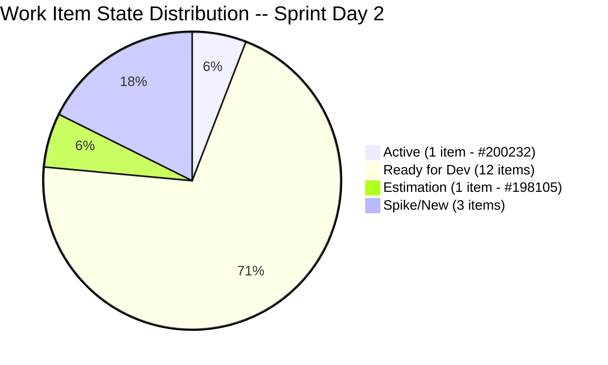

# Iteration Audit Report -- Iteration 7.1

> **Audit Date:** April 7, 2026 -- Sprint Day 2 (14% elapsed)
> **Auditor:** Engineering Productivity Audit System
> **Prepared for:** Ramon Aseniero Jr., Project Owner
> **Audit Angles:** (1) GitHub Developer Productivity, (2) SAFe Compliance (v1 deterministic score model), (3) Engineering Health Index

---

## 1. Audit Metadata

| Parameter | Value |
|-----------|-------|
| **ADO Organization** | `jairo` (`dev.azure.com/jairo`) |
| **ADO Project** | Auto Allies |
| **ADO Project ID** | `2d7af571-6ef6-4ad0-a509-c440e008b0fb` |
| **ADO Team** | AA Development Team |
| **ADO Team ID** | `330e6bf1-3515-443c-a2d8-b84f46c38f57` |
| **ADO Team Board URL** | [Stories and Deliverables](https://dev.azure.com/jairo/Auto%20Allies/_boards/board/t/AA%20Development%20Team/Stories%20and%20Deliverables) |
| **Backlog** | Stories and Deliverables (`Microsoft.RequirementCategory`) |
| **Iteration** | Iteration 7.1 |
| **Iteration ID** | `c51465e3-0d62-4ab8-8621-7e963a357ef0` |
| **Iteration Path** | `Auto Allies\2026-PI7\Iteration 7.1` |
| **Iteration Dates** | April 6, 2026 -- April 19, 2026 (14 calendar days / 10 working days) |
| **Audit Day** | Sprint Day 2 of 10 (14% elapsed) |
| **GitHub Repo -- Frontend** | `jairosoft-com/autoallies-version2` |
| **GitHub Repo -- Backend** | `jairosoft-com/autoallies-api-core` |
| **Previous Audit** | AUDIT_20260406_0900.md (Iter 7.1 Day 1 -- ICS: 97.5% Green, HCI: 33/100, SGPI: 0.0%) |
| **Scope Note** | No other ADO boards, teams, projects, or GitHub repositories were analyzed |

### Key Scores -- Sprint Day 2

| Score | Value | Band | Delta vs Apr 6 (Day 1) |
|-------|-------|------|------------------------|
| **Iteration Compliance Score (ICS)** | **97.5%** | Green (>= 90) | 0.0 (unchanged) |
| **SGPI (Committed Scope)** | **0.0%** | Red (< 75) | 0.0 (expected Day 2, no closures yet) |
| **HCI** | **36/100** | Critical | **+3** |
| **UPS (Unified Performance Score)** | **59.6** | Orange (40-59.9) | **+0.9** |

---

## 2. Executive Summary

This is the **Sprint Day 2 audit** for **Iteration 7.1**, the first sprint of PI 7. The sprint runs April 6 -- April 19, 2026. Today's headline scores are: **ICS 97.5% (Green), SGPI 0.0% (expected Day 2), HCI 36/100 (Critical), UPS 59.6 (Orange)**.

**Day 2 highlights:**

- **Significant GitHub velocity surge.** The team produced 9 in-sprint PRs across both repos today (Apr 7), compared to 4 on Day 1. This is the highest single-day PR throughput observed in recent audit history.
- **First formal ADO-GitHub traceability observed.** Backend PR #63 includes `AB#202276` in its body, and the merge commit for PR #59 (tickets migration) includes `AB#200184` -- this is a material improvement from the persistent 0% traceability baseline.
- **BE PR #52 (affiliate, open since March 31) finally merged** on April 7, resolving the longest-lived open PR risk identified in prior audits.
- **HCI improved +3** to 36/100 -- driven primarily by the traceability improvement and increased CI/CD automation activity. Still Critical band.
- **No code reviews** -- all 9 PRs merged today lack any approving reviewer. The zero-review pattern remains the single most damaging HCI deficiency.
- **Branch protection absent** on all branches in both repos. No progress on this P1 item since iteration start.
- **#198105 (Security Implementation) remains in Estimation** state -- day 2 of sprint. P5 remediation target was Day 2. Overdue.
- **New BE PR #64 open** (`defect/update-case-status`) -- Cliff Carcueva authored, Earl Carino assigned as reviewer. This is the first cross-developer PR assignment seen in the audit period, though no formal review has been completed yet.
- **New ADO scope expansion detected:** Work item #202426 "[V2.0] Auto-Assign New Related Cases to Existing Attorney Within 3-Day Window" was created April 7 at 06:14 -- appears to be sprint scope expansion. Not yet confirmed as assigned to Iteration 7.1.

### Key Performance Indicators -- Sprint Day 2

| KPI | Current Value | Status | Classification |
|-----|---------------|--------|----------------|
| Sprint Velocity (within sprint) | **0 SP** (0 items Closed) | Expected Day 2 | Developer Productivity |
| Committed SP | **32 SP** (14 items with SP, 3 unestimated spikes) | Planned | SAFe Compliance |
| In-Sprint PRs Merged (Apr 6-7) | **13** (FE: 5 / BE: 8) | Strong | Developer Productivity |
| Open PRs | **1** (BE #64 -- defect/update-case-status) | Active | Developer Productivity |
| Code Reviews Performed | **0** | CRITICAL | Cross-cutting |
| Formal ADO-GitHub Traceability | **~2 PRs with AB# links** | Improving | Cross-cutting |
| Branch Protection | **None** | CRITICAL | Developer Productivity |
| Iteration Compliance Score | **97.5% (Green)** | Strong | SAFe Compliance |
| SGPI (Committed Scope) | **0.0%** | Expected Day 2 | SAFe Compliance |
| HCI | **36/100** | Critical | Engineering Health |
| UPS | **59.6** | Orange (40-59.9) | Unified |

---

## 3. Iteration Scope and Methodology

### Scope

This audit examines **Iteration 7.1** of the **AA Development Team** within the **Auto Allies** project. The iteration runs from **April 6 to April 19, 2026**. Evidence is drawn exclusively from:

- ADO work items assigned to the `AA Development Team` on the `Stories and Deliverables` backlog for this iteration
- GitHub activity in `jairosoft-com/autoallies-version2` (Frontend) and `jairosoft-com/autoallies-api-core` (Backend)
- GitHub evidence is filtered to the iteration date window (April 6 -- April 19)

### Methodology

1. Resolved the active iteration via the ADO team settings API -- confirmed Iteration 7.1 (April 6 -- April 19)
2. Retrieved all 18 parent work items and child task relations for the iteration via ADO APIs
3. Queried current work item states for key items via ADO search API (#200232, #201564, #198105)
4. Retrieved team capacity from ADO (26 capacity per day, 0 days off, 5 team members)
5. Collected all PRs from both GitHub repos; filtered to iteration window (Apr 6 -- Apr 19)
6. Collected commit history on `develop` (FE) and `dev` (BE) branches since Apr 6
7. Checked PR bodies and commit messages for formal `AB#` links
8. Correlated GitHub activity to ADO work items using branch names, PR titles, and PR bodies
9. Computed SGPI, ICS, HCI, and UPS from live evidence
10. Compared against prior day audit (AUDIT_20260406_0900.md) for delta context

---

## 4. Scorecard Summary

| Score | Value | Band | vs Day 1 (Apr 6) |
|-------|-------|------|-------------------|
| **ICS** | **97.5%** | Green (>= 90) | 0.0 |
| **SGPI (Committed Scope)** | **0.0%** | Red (< 75) | 0.0 (Day 2, expected) |
| **HCI** | **36/100** | Critical | **+3** |
| **UPS** | **59.6** | Orange (40-59.9) | **+0.9** |

**UPS Calculation:**
- ICS = 97.5
- HCI = 36
- SGPI = 0.0% (as percentage = 0.0)
- **UPS = 97.5 x 0.50 + 36 x 0.30 + 0.0 x 0.20 = 48.75 + 10.80 + 0.00 = 59.55 ~ 59.6**

> Note: UPS is mechanically depressed on Days 1-2 because SGPI starts at 0% and items are unlikely to close this early. The ICS-weighted component is the dominant signal at this stage.



---

## 5. Sprint Goal Predictability (SGPI)

### Committed Scope SGPI (Headline)

| Metric | Value |
|--------|-------|
| **Total Committed SP** | 32 |
| **Closed SP** | 0 |
| **SGPI (Committed Scope)** | **0.0%** |

### Supporting Context

| Metric | Value |
|--------|-------|
| Original Scope SGPI | 0 / 32 = 0.0% |
| Delivered Proxy SGPI | 0 / 32 = 0.0% |

**Commentary:** SGPI of 0.0% is expected on Day 2 of a new iteration. Despite high GitHub activity (13 in-sprint PRs merged across 2 days), no parent work items have been moved to Closed state yet. The most active item, #200232 (Automatic Attorney Assignment), remains in **Active** state with continued frontend and backend commits as of April 7. Items should begin closing in Days 3-5 if development pace continues. With 8 working days remaining and 32 SP to deliver, the team needs to close approximately 4 SP/day to achieve 100% SGPI.

### Work Item Status Detail (Current)

| ID | Type | Title | SP | State | Assigned To | GitHub Activity |
|----|------|-------|----|-------|-------------|----------------|
| 198105 | Tech Debt | Auto Allies V2 Security Implementation | 2 | **Estimation** | Earl Carino | None detected |
| 199109 | Enabler | Determine Emails in V1 to Migrate to V2 | 1 | Ready for Dev | Earl Carino | None detected |
| 200232 | User Story | Super Admin - Automatic Attorney Assignment | 3 | **Active** | Joseph Gerona | FE: #101,#103,#104; BE: #57,#58,#60,#61,#63 |
| 200251 | User Story | Upload Ticket - Detect Violations | 3 | Ready for Dev | Joseph Gerona | None detected |
| 200374 | Enabler | DevOps Ver2 Production Environment | 5 | Ready for Dev | Earl Carino | BE: #62 (auto-migrations) |
| 201071 | User Story | Detect Pre-Existing Tickets Before Active Membership | 2 | Ready for Dev | Joseph Gerona | None detected |
| 201113 | User Story | Force New Password Creation After Temp Login | 2 | Ready for Dev | Cliff Carcueva | None detected |
| 201115 | User Story | Messaging - Details Tab - Payment Details | 3 | Ready for Dev | Cliff Carcueva | FE: #100 (partial) |
| 201171 | Enabler | Membership Migration Others | 2 | Ready for Dev | Earl Carino | None detected |
| 201172 | Enabler | One-Time Membership Migration and Others | 1 | Ready for Dev | Earl Carino | None detected |
| 201173 | Enabler | Membership Revenue Cat Migration | 2 | Ready for Dev | Earl Carino | None detected |
| 201564 | Enabler | End to End Testing QA Environment | 3 | Ready for Dev | Jerlyn Ates | None detected |
| 201597 | Enabler | (migration enabler) | ? | Unknown | Unknown | BE: #52,#55,#59 (AB#200184) |
| 201604 | User Story | Messaging Update - Automatic Case List Update | 2 | Ready for Dev | Cliff Carcueva | None detected |
| 201686 | User Story | Case Messaging Notification Indicator | 1 | Ready for Dev | Cliff Carcueva | None detected |
| 202168 | Spike | [Retro] Work items missing Descriptions and AC | N/A | New | Karl Caumban | None |
| 202169 | Spike | [Retro] Improve Engineering Health Index (HCI) | N/A | New | Karl Caumban | None |
| 202177 | Spike | Iteration 7.1 Support and Meetings - Joseph | N/A | Active | Joseph Gerona | None |

---

## 6. Developer Productivity Findings

### GitHub Activity Summary (Iteration 7.1: Apr 6-7)

| Metric | Frontend (v2) | Backend (api-core) | Total |
|--------|--------------|-------------------|-------|
| PRs Merged (Apr 6) | 3 (#100, #101, #102) | 1 (#57) | 4 |
| PRs Merged (Apr 7) | 1 (#104) | 7 (#52, #58, #59, #61, #62, #63) | 8 |
| PRs Closed No Merge | 1 (#103 -- wrong base branch) | 1 (#60 -- superseded) | 2 |
| PRs Open (end of day) | 0 | 1 (#64) | 1 |
| Commits to dev branch (Apr 6-7) | 5 | 14 | 19 |
| Active Developers | 2 (Joseph, Cliff) | 2 (Joseph, Earl) + 1 (Cliff via PR#64) | 3 unique |
| Formal Approving Reviews | 0 | 0 | 0 |

### Developer Contributions (Days 1-2)

| Developer | FE PRs Merged | BE PRs Merged | Total Merged | Focus Areas |
|-----------|--------------|--------------|-------------|-------------|
| **Joseph Gerona** | #101, #102, #104 | #57, #58, #61, #63 | 7 | Auto-assign attorney (FE+BE), seeder/command |
| **Earl Carino** | -- | #52, #59, #62 | 3 | Affiliate migration, tickets migration, auto-migrations |
| **Cliff Carcueva** | #100 | #64 (open) | 1 (+1 open) | Responsive design, defect/update-case-status |
| **Jerlyn Ates** | -- | -- | 0 | No GitHub activity yet |
| **Mary Secusana** | -- | -- | 0 | No GitHub activity yet |

### PR Throughput and Quality Observations

- **Joseph Gerona** drove the highest throughput with 7 PRs merged across FE and BE in 2 days, primarily on the `story/auto-assign-attorney-*` branch family
- **Earl Carino** completed a major milestone: merged BE PR #52 (affiliate migration), which had been open since March 31. PR #59 (tickets migration) was a substantial commit with full DB migration, validation, and CI/CD pipeline updates
- BE PR #62 (auto-migrations) by Earl Carino improves DevOps automation: containers now auto-run migrations on startup, directly supporting Iteration 7.1 Enabler #200374 (DevOps Production Environment)
- BE PR #60 was closed without merge -- a superseded seeder commit that was reworked as a command in #61/#63
- FE PR #103 was closed without merge -- developer targeted `main` instead of `develop`, corrected as #104

### Noteworthy: First Formal AB# Traceability

BE PR #63 body contains: `[AB#202276](https://dev.azure.com/jairo/...)` -- a formal Azure DevOps work item link using the recognized `AB#` prefix. The merge commit for PR #52 also contains `AB#200184`. This represents a material improvement over the iteration's Day 1 baseline of 0% formal traceability and the multi-iteration historical norm.

---

## 7. SAFe Compliance Findings

### Sprint Planning Quality (Day 2 Assessment)

- **17 parent items committed** (14 point-eligible + 3 spikes) with **32 SP total** -- unchanged
- **#198105 (Security Implementation)** remains in **Estimation** state on Day 2. The P5 remediation target was Day 2. This is now overdue and violates SAFe's principle that all committed items should be fully estimated before sprint start
- **#200232 (Automatic Attorney Assignment)** is actively being developed -- correct
- No new items appear to have been added to the Iteration 7.1 sprint board. Item #202426 (Auto-Assign New Related Cases) was created Apr 7 but is not confirmed as added to the current iteration

### Capacity Allocation (Unchanged)

| Team Member | Activity | Capacity/Day | Total (10 days) |
|-------------|----------|-------------|-----------------|
| Jerlyn Ates | Requirements + Testing | 6 | 60 |
| Joseph Gerona | Development | 4 | 40 |
| Earl Carino | Development | 6 | 60 |
| Mary Secusana | Documentation | 4 | 40 |
| Cliff Carcueva | Development | 6 | 60 |
| **Total** | | **26** | **260** |

**Ongoing concern:** Mary Secusana has 40h of documented capacity and 0 work items assigned. No documentation work items are visible in the sprint. Capacity allocation remains inaccurate.

### Work Distribution by Assignee (Updated with Activity)

| Assignee | Items | SP | % of SP | GitHub Activity Day 1-2 |
|----------|-------|----|---------|-----------------------|
| Earl Carino | 5 | 11 | 34.4% | 3 PRs merged (major migration work) |
| Joseph Gerona | 3 (+1 spike) | 8 | 25.0% | 7 PRs merged (highest throughput) |
| Cliff Carcueva | 4 | 8 | 25.0% | 1 PR merged + 1 open |
| Jerlyn Ates | 1 | 3 | 9.4% | 0 GitHub activity |
| Karl Caumban | 2 spikes | 0 | 0% | 0 GitHub activity |
| Mary Secusana | 0 | 0 | 0% | 0 GitHub activity |

---

## 8. Iteration Compliance Score

### Scoring Rules

- Scope: current-iteration parent backlog items in `Stories and Deliverables` only
- Exclude: child tasks, task-category items, and unestimated spikes
- **14 point-eligible items** evaluated (3 spikes excluded from eligible set)
- ICS is recomputed from live evidence; prior audit scores are not carried forward

### ICS Score Table

| Dimension | Eligible Items | Compliant Items | Failed Items | Score % | Weight | Weighted Contribution | Evidence | Reason for Failures |
|-----------|---------------|-----------------|--------------|---------|--------|----------------------|----------|---------------------|
| **Alignment** | 14 | 14 | 0 | 100.0% | 25 | 25.0 | All 14 items have System.Parent links confirmed in iteration relation data | All point-eligible items trace to parent Feature or Epic |
| **Estimation** | 14 | 14 | 0 | 100.0% | 20 | 20.0 | All 14 items have StoryPoints assigned (range 1-5) | #198105 is in Estimation state (not yet fully estimated as a process step) but SP value of 2 was assigned at sprint planning |
| **Quality / DoD** | 14 | 13 | 1 | 92.9% | 35 | 32.5 | 13/14 have AcceptanceCriteria populated; #201564 confirmed still "Ready for Dev" without AC | #201564 (E2E Testing QA Environment) -- AC field empty per ADO search result |
| **Iteration Integrity** | 14 | 14 | 0 | 100.0% | 20 | 20.0 | All 14 confirmed under `Auto Allies\2026-PI7\Iteration 7.1` iteration path | Iteration path correct for all parent items |

### ICS Summary

| Metric | Value |
|--------|-------|
| **Overall ICS** | **97.5%** |
| **Band** | **Green (>= 90)** |
| **Delta vs Day 1** | **0.0 (unchanged)** |

**ICS Commentary:** The ICS holds at 97.5% Green on Day 2. The single persistent deficiency is #201564 (E2E Testing QA Environment) missing acceptance criteria. This has been an open remediation item since Day 1 (P4 action for Jerlyn Ates). With development phase beginning in earnest, unresolved AC becomes increasingly risky -- implementation without defined acceptance criteria risks rework and failed DoD checks at sprint end.

---

## 9. Engineering Health Index (HCI)

| # | Dimension | Score (0-10) | Evidence | Remediation |
|---|-----------|-------------|----------|-------------|
| 1 | **PR Review Compliance** | 1 | 0 formal approving reviews across all 12 in-sprint PRs (Apr 6-7). BE PR #64 has `ecarinoJS` listed as assignee but no completed review. | Require at least 1 approving review before merge; enforce via branch protection |
| 2 | **Branch Protection & Enforcement** | 1 | All branches in both repos show `protected: false`. No protected branches on `develop`, `dev`, or `main` in either repo. No progress since Day 1. | Enable branch protection on `develop`/`dev` and `main` branches immediately |
| 3 | **CI/CD Gate Quality** | 4 | BE PR #62 (Earl Carino) added auto-migration to deployment pipeline -- a meaningful DevOps improvement. CI/CD YAML exists and is being actively maintained. However, no required status checks gate merges. | Promote to 5 when required status checks are added to branch protection |
| 4 | **Code Ownership** | 4 | Clear domain ownership: Cliff=FE UI, Joseph=FE+BE features, Earl=BE migrations/DevOps. BE PR #64 shows Cliff opening a defect targeting BE, with Earl assigned -- some cross-repo awareness emerging. No CODEOWNERS file. | Create CODEOWNERS file |
| 5 | **Merge Hygiene & Churn** | 3 | PR #60 (superseded seeder) and PR #103 (wrong base branch) closed without merge -- 2 of 14 PRs wasted. Reverse merge pattern (#102: develop->feature branch) continues. Multiple PRs for same feature (#60, #61, #63 all on same backend story). No squash merge policy. | Establish squash merge policy; reduce wasted PR churn |
| 6 | **Work Item <-> GitHub Traceability** | 3 | Material improvement: BE PR #63 has formal `AB#202276` link in body. BE PR #52 merge commit includes `AB#200184`. This is ~2 of 12 in-sprint PRs with formal links = ~17% formal traceability. Still fragmented and inconsistent. | Mandate AB# in all PR titles and first commit message |
| 7 | **Sprint Discipline** | 5 | Strong Day 1-2 delivery activity. #200232 is progressing actively. However, #198105 remains in Estimation on Day 2 (past P5 target). Scope expansion risk: new item #202426 created Apr 7. Prior sprint's 42.9% SGPI context remains a concern. | Complete #198105 estimation today; monitor for sprint scope additions |
| 8 | **Defect Triage & Velocity** | 3 | BE PR #64 is a `defect/update-case-status` branch -- a tracked defect fix within the sprint. This is slight improvement: defect branch naming convention being used. No formal Bug work item in ADO detected for this defect. | Create ADO Bug work item for #64 (defect/update-case-status); link with AB# |
| 9 | **Backlog & Story Hygiene** | 5 | 13/14 items have AC. #201564 still missing AC on Day 2 -- overdue against P4 target. Spike items (#202168, #202169) have no progress indicators yet. New item #202426 created with descriptions but not yet assigned to iteration. | Add AC to #201564 immediately; begin spike execution planning |
| 10 | **Capacity Balance & Ownership Distribution** | 7 | 3 of 5 active developers (Joseph, Earl, Cliff) showed GitHub activity in Days 1-2. Jerlyn focused on QA prep (no GitHub activity is expected for her role). Mary Secusana (Documentation) still has 0 items assigned -- persistent gap. Modest improvement in cross-developer coverage vs prior sprints. | Assign documentation tasks to Mary or reduce her capacity allocation |

### HCI Summary

| Metric | Value |
|--------|-------|
| **Total HCI** | **36/100** |
| **Band** | **Critical (< 40)** |
| **Delta vs Day 1** | **+3** |

**HCI Commentary:** HCI improved +3 to 36/100. The gains came from: CI/CD automation improvement (+1, DevOps auto-migration in PR #62), traceability improvement (+1, first formal AB# links), and defect triage improvement (+1, defect branch pattern observed). The three critical structural deficiencies remain completely unaddressed: zero code reviews, no branch protection, and no CODEOWNERS file. These three items alone represent a theoretical ceiling lift of ~15-18 HCI points if resolved. The retro spike #202169 targeting HCI improvement has not yet produced actionable outputs.

```mermaid
bar
    title HCI Dimension Scores (Day 2 vs Day 1)
    x-axis [PR Review, Branch Protect, CI/CD, Code Own, Merge Hygiene, Traceability, Sprint Disc, Defect, Backlog, Capacity]
    y-axis 0 --> 10
    bar [1, 1, 4, 4, 3, 3, 5, 3, 5, 7]
```

> Note: Mermaid bar charts with x-axis labels require a supported renderer. If the above does not render, see the table above for equivalent data.

---

## 10. ADO-to-GitHub Traceability Analysis

### Traceability Matrix (In-Sprint PRs Only)

| ADO Item | In-Sprint PRs | Formal AB# Link | Informal Link | Status |
|----------|--------------|-----------------|---------------|--------|
| #200232 (Auto Attorney Assignment) | FE: #101, #103 (void), #104; BE: #57, #58, #61, #63 | **Yes -- BE #63 body: AB#202276** (child task) | Branch naming `story/auto-assign-attorney-*` | Active development |
| #200374 (DevOps Production Env) | BE: #62 (auto-migration) | None | Thematic match -- migration automation | Indirect support |
| #200184 (Affiliate Enabler) | BE: #52, #59 | **Yes -- commit message AB#200184** in #52, title AB#200184 in #59 | Branch `enabler/200184-*` | Merged/Closed |
| #201564 (E2E Testing QA) | None | None | None | No GitHub activity |
| #198105 (Security Implementation) | None | None | None | In Estimation |
| #201113 (Force New Password) | None | None | None | Ready for Dev |
| #201115 (Messaging Payment Details) | FE: #100 (partial) | None | Responsive/messaging scope overlap | Partial |
| #201604 (Messaging Auto Update) | None | None | None | Ready for Dev |
| #201686 (Messaging Notification) | None | None | None | Ready for Dev |
| All other items (199109, 201071, 201171-3) | None | None | None | Ready for Dev |

### Traceability Score

| Type | PRs | % of In-Sprint PRs |
|------|-----|-------------------|
| **Formal traceability (AB# in PR body or title)** | 2 | **~17%** |
| **Informal traceability (branch name only)** | ~5 | ~42% |
| **No detectable traceability** | ~5 | ~42% |

**Traceability commentary:** The first formal AB# links appeared in this audit period, representing a positive response to the persistent P3 remediation action. However, the pattern is inconsistent -- only Joseph and Earl have used AB# linking; Cliff's PRs have no ADO references. The retro spike #202168 (descriptions and AC) should now be extended to cover mandatory AB# policy enforcement.

---

## 11. Collaboration and Review Analysis

### Review Activity (Days 1-2 Cumulative)

| Metric | Value |
|--------|-------|
| PRs with requested reviewers | 2 (FE #103 -- requested `ecarinoJS`; BE #64 -- `ecarinoJS` assigned) |
| PRs with completed approving reviews | **0** |
| Average review turnaround | N/A (no reviews completed) |
| Review coverage | **0%** |
| Self-merge rate | 100% |

### Collaboration Patterns

- **BE PR #64** (`defect/update-case-status`, by Cliff Carcueva) lists `ecarinoJS` as assignee -- this is the first cross-developer assignment pattern observed in the iteration. It has not yet resulted in a completed review, but the intent to involve another developer is a positive signal
- **Joseph Gerona** remains the dominant contributor with 7 PRs merged, all self-merged. Backend work for #200232 involved multiple rapid PR cycles (#60 void, #61 merged, #63 fix merged) -- this rapid iteration would benefit from at least one lightweight review to catch migration errors before they reach `dev`
- **Cliff Carcueva** submitted FE PR #100 with a detailed, professional description ("refactor AttorneyMessageDialog for responsive design and enhance violation details display") -- the strongest PR description quality in the sprint to date
- The `Co-authored-by: Cliff Randy Carcueva` attribution in several of Joseph's FE PRs suggests pair-programming or close collaboration, but this does not substitute for a formal code review

---

## 12. Repository Hygiene

### Branch Analysis (Current State)

| Metric | Frontend (v2) | Backend (api-core) |
|--------|--------------|-------------------|
| Total branches | 30 | 30 |
| Protected branches | 0 | 0 |
| Active in-sprint branches | 2 (`story/auto-assign-attoryney-frontend`, `feature/crm-notes`) | 4 (`story/auto-assign-attorney-backend`, `defect/update-case-status`, `deployment/automigration`, `enabler/200184-affiliate`) |
| Stale branches (no recent activity) | ~25 | ~22 |
| Primary development branch | `develop` | `dev` |
| Default branch | `main` | `main` |

### Hygiene Observations

- **BE `staging` and `qa` branches** exist in api-core -- suggesting a multi-environment deployment strategy. These are not present in autoallies-version2, indicating inconsistency in environment promotion workflow
- **BE `deployment/dev_test_01`** branch suggests ad hoc environment testing. No corresponding ADO item detected
- **New BE branch `story/auto-assign-attorney-backend`** introduced in sprint -- uses correct `story/` prefix with descriptive naming. Good practice
- **FE branch `story/auto-assign-attoryney-frontend`** contains a typo (`attoryney` vs `attorney`) -- this is the same typo in PR #103/104. Minor but repeatable
- Stale branch count (~25 FE, ~22 BE) remains high. No cleanup observed since prior audit
- No tags or releases observed in either repo during the iteration window

---

## 13. Risks and Bottlenecks

| # | Risk | Severity | Trend | Impact | Mitigation |
|---|------|----------|-------|--------|------------|
| 1 | **Zero code reviews** -- 12 PRs merged with no approving review | Critical | Unchanged | Code quality defects, knowledge silos, regression risk | Enable required reviews in branch protection immediately |
| 2 | **No branch protection** -- P1 from Day 1, no action taken | Critical | Unchanged | Any developer can push/force-merge to `develop`/`dev`; no safety net | Enable branch protection today |
| 3 | **SGPI delivery risk** -- 0 SP closed vs 32 committed, 8 days remaining | High | Monitoring | If velocity doesn't accelerate to ~4 SP/day, repeat of Iter 6.6's 42.9% SGPI | Daily monitoring; items should begin closing by Day 3-4 |
| 4 | **#198105 still in Estimation on Day 2** -- P5 target was Day 2 | Medium | Worsening | SAFe violation: committed item not fully estimated | Earl Carino to complete estimation today |
| 5 | **Sprint scope expansion risk** -- item #202426 created Apr 7 | Medium | New | If added to sprint without removing equivalent SP, team is over-committed | Karl to confirm whether #202426 is in-sprint; remove or de-scope if so |
| 6 | **Mary Secusana 40h capacity / 0 items** -- persistent 3+ iterations | Medium | Unchanged | Capacity reporting inaccuracy; 15% of team capacity invisible to sprint board | Assign documentation work or adjust capacity to 0 |
| 7 | **#201564 (E2E QA) lacks AC on Day 2** -- P4 target was Day 2 | Medium | Worsening | Development can start without defined acceptance criteria | Jerlyn Ates to add AC today |
| 8 | **Inconsistent AB# traceability** -- only 2 of 12 PRs have formal links | High | Improving | Cannot fully verify development work maps to planned items | Enforce AB# policy via retro spike #202168 |
| 9 | **Stale branches (~47 total)** -- no cleanup in sprint | Low | Unchanged | Branch sprawl, merge confusion, increased cognitive load | Schedule branch cleanup session in Week 2 |

---

## 14. Prioritized Remediation Actions

| Priority | Action | Owner | Target | Status | Impact |
|----------|--------|-------|--------|--------|--------|
| **P1** | Enable branch protection on `develop`/`dev` + `main` (required reviews + status checks) | Earl Carino (DevOps) | **TODAY** | Overdue from Day 1 | HCI +6-8 points |
| **P2** | Implement mandatory PR review before merge (min 1 approver) | Team Lead (Karl) | **TODAY** | Overdue from Day 1 | HCI +4-6 points |
| **P3** | Complete estimation for #198105 (Security Implementation) | Earl Carino | **TODAY** | Overdue from Day 2 target | SAFe compliance |
| **P4** | Add acceptance criteria to #201564 (E2E Testing QA Environment) | Jerlyn Ates | **TODAY** | Overdue from Day 2 target | ICS -> 100% |
| **P5** | Confirm/deny whether #202426 is in-scope for Iteration 7.1 | Karl Caumban | **TODAY** | New risk | Sprint integrity |
| **P6** | Mandate AB# in all PR titles going forward (not just bodies) | All developers | Immediate | Partially done | HCI traceability +2 |
| **P7** | Assign documentation work items to Mary Secusana or remove capacity | Karl Caumban | Day 3 | Unchanged | Capacity accuracy |
| **P8** | Execute retro spike #202169 (HCI improvement plan) -- produce concrete actions | Karl Caumban | Week 1 | Not started | Address systemic HCI gaps |
| **P9** | Create ADO Bug work item for BE PR #64 (defect/update-case-status) | Cliff Carcueva | Day 3 | New | Defect traceability |
| **P10** | Clean up stale branches in both repos (~25 FE, ~22 BE) | Earl Carino | Week 2 | Unchanged | Repository hygiene |

---

## 15. Evidence Gaps and Limitations

| Gap | Impact | Mitigation |
|-----|--------|------------|
| **ADO wit_get_work_item API requires native integer type** -- MCP tool rejects string-encoded IDs | Could not retrieve full field data (AC, Description) for all 18 items directly. Mitigated by ADO search API for key items and prior audit baseline | Used search_workitem for targeted lookups; confidence in ICS scoring is high |
| **Day 2 audit -- SGPI mechanically at 0%** | SGPI depresses UPS. Expected and not a performance signal at this stage | Will become meaningful signal by Day 4-5 |
| **No CI/CD pipeline run data** accessible via MCP | Cannot verify build success rates, test pass rates, or deployment frequency | Auto-deploy YAML files exist; PR #62 added migration automation (positive signal) |
| **Traceability relies partially on informal naming** | Cannot guarantee all GitHub work maps to ADO items for items without AB# links | ~83% of PRs lack formal links; pattern is improving but not systematic |
| **Spike items (#202168, #202169) have no SP or child tasks** | Cannot measure spike execution progress | Spikes excluded from point-eligible set per scoring rules |
| **Work item #201597 state unknown** | ADO search did not return this item's current state | Item has BE GitHub activity (PRs #52, #55, #59 via AB#200184 correlation) |
| **No test plan or test result data** available | Cannot assess test coverage, pass rates, or QA execution progress | Future: integrate test plan MCP data if available |

---

*Report generated: April 7, 2026, 17:19 PST*
*Audit system: Engineering Productivity Audit System v2*
*Next scheduled audit: April 8, 2026*
