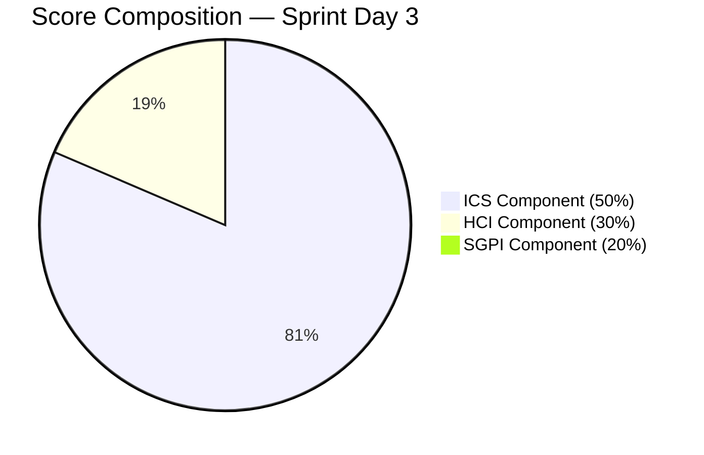
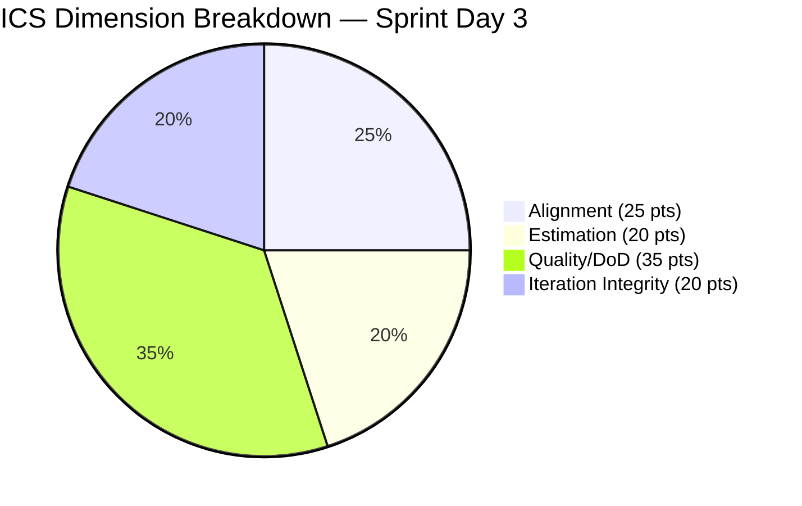
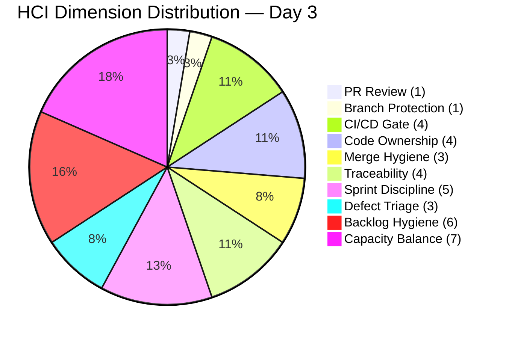

# Iteration Audit Report — Iteration 7.1

> **Audit Date:** April 8, 2026 — Sprint Day 3 (30% elapsed)
> **Auditor:** Engineering Productivity Audit System
> **Prepared for:** Ramon Aseniero Jr., Project Owner
> **Audit Angles:** (1) GitHub Developer Productivity, (2) SAFe Compliance (v1 deterministic score model), (3) Engineering Health Index

---

## 1. Audit Metadata

| Parameter | Value |
|-----------|-------|
| **ADO Organization** | `jairo` (`dev.azure.com/jairo`) |
| **ADO Project** | Auto Allies |
| **ADO Project ID** | `2d7af571-6ef6-4ad0-a509-c440e008b0fb` |
| **ADO Team** | AA Development Team |
| **ADO Team ID** | `330e6bf1-3515-443c-a2d8-b84f46c38f57` |
| **ADO Team Board URL** | [Stories and Deliverables](https://dev.azure.com/jairo/Auto%20Allies/_boards/board/t/AA%20Development%20Team/Stories%20and%20Deliverables) |
| **Backlog** | Stories and Deliverables (`Microsoft.RequirementCategory`) |
| **Iteration** | Iteration 7.1 |
| **Iteration ID** | `c51465e3-0d62-4ab8-8621-7e963a357ef0` |
| **Iteration Path** | `Auto Allies\2026-PI7\Iteration 7.1` |
| **Iteration Dates** | April 6, 2026 — April 19, 2026 (14 calendar days / 10 working days) |
| **Audit Day** | Sprint Day 3 of 10 (30% elapsed) |
| **GitHub Repo — Frontend** | `jairosoft-com/autoallies-version2` |
| **GitHub Repo — Backend** | `jairosoft-com/autoallies-api-core` |
| **Previous Audit** | AUDIT_20260407_1719.md (Iter 7.1 Day 2 — ICS: 97.5% Green, HCI: 36/100, SGPI: 0.0%) |
| **Scope Note** | No other ADO boards, teams, projects, or GitHub repositories were analyzed |

### Key Scores — Sprint Day 3

| Score | Value | Band | Delta vs Apr 7 (Day 2) |
|-------|-------|------|------------------------|
| **Iteration Compliance Score (ICS)** | **100.0%** | Green (>= 90) | **+2.5** |
| **SGPI (Committed Scope)** | **0.0%** | Red (< 75) | 0.0 (expected Day 3, no closures yet) |
| **HCI** | **38/100** | Critical | **+2** |
| **UPS (Unified Performance Score)** | **61.4** | Orange (40–59.9) | **+1.8** |

---

## 2. Executive Summary

This is the **Sprint Day 3 audit** for **Iteration 7.1**, the first sprint of PI 7. The sprint runs April 6 — April 19, 2026. Today's headline scores are: **ICS 100.0% (Green — first perfect score this iteration), SGPI 0.0% (expected Day 3), HCI 38/100 (Critical), UPS 61.4 (Orange)**.

**Day 3 highlights:**

- **ICS achieves 100.0% for the first time in Iteration 7.1.** The persistent deficiency — #201564 (E2E Testing QA Environment) missing acceptance criteria — was resolved on April 8 at 01:15 UTC. All 14 point-eligible items now have complete descriptions and acceptance criteria, full story point estimation, and correct iteration alignment.
- **Significant GitHub acceleration continues on Day 3.** Joseph Gerona merged FE PR #105 and BE PR #65 (both with formal `AB#200232` links) early this morning, resolving the ticket/case flow for the active attorney assignment story. Cliff Carcueva merged BE PR #67 (`AB#201115 implement CaseFeeController`) and has FE PR #107 + BE PR #69 open for legal fee messaging — two stories now in simultaneous active development.
- **AB# traceability is now the norm for active stories.** FE #105 (AB#200232), BE #65 (AB#200232), BE #66 (AB#201115), BE #67 (AB#201115) — four Day 3 PRs carry formal ADO links, a substantial jump from the two seen in Day 2. The trend is solidly positive.
- **HCI improved +2 to 38/100.** Drivers: AC resolution for #201564 (+1 Backlog Hygiene), and improved traceability rate (+1 Work Item Traceability). Structural deficiencies — zero code reviews, no branch protection — remain completely unaddressed.
- **#198105 (Security Implementation) in Estimation for 3rd consecutive day.** P5 target was Day 2. Now Day 3. This item is increasingly at risk of disrupting the sprint if not estimated and activated.
- **Two stories now Active simultaneously.** #200232 (Auto Attorney Assignment, Joseph) and #201115 (Messaging Payment Details, Cliff) are both in Active state with concurrent FE+BE development underway. This is the broadest development front observed in recent audits and is a positive sign for SGPI acceleration in Days 4–7.
- **No code reviews yet — 18+ in-sprint PRs merged with zero formal approvals.** This remains the single highest-impact HCI deficiency.
- **Mary Secusana (40h documented capacity) remains with 0 work items assigned** — entering Day 3 with no resolution to this persistent capacity-reporting gap.

### Key Performance Indicators — Sprint Day 3

| KPI | Current Value | Status | Classification |
|-----|---------------|--------|----------------|
| Sprint Velocity (within sprint) | **0 SP** (0 items Closed) | Expected Day 3 | Developer Productivity |
| Committed SP | **32 SP** (14 items with SP, 3 unestimated spikes) | Planned | SAFe Compliance |
| In-Sprint PRs Merged (Apr 6–8) | **19** (FE: 7 / BE: 12) | Strong | Developer Productivity |
| Open PRs | **2** (FE #107, BE #69 — legal-fee-messaging by Cliff) | Active | Developer Productivity |
| Code Reviews Performed | **0** | CRITICAL | Cross-cutting |
| Formal ADO-GitHub Traceability | **~6 PRs with AB# links** | Improving | Cross-cutting |
| Branch Protection | **None** | CRITICAL | Developer Productivity |
| Iteration Compliance Score | **100.0% (Green)** | Perfect | SAFe Compliance |
| SGPI (Committed Scope) | **0.0%** | Expected Day 3 | SAFe Compliance |
| HCI | **38/100** | Critical | Engineering Health |
| UPS | **61.4** | Orange (40–59.9) | Unified |

---

## 3. Iteration Scope and Methodology

### Scope

This audit examines **Iteration 7.1** of the **AA Development Team** within the **Auto Allies** project. The iteration runs from **April 6 to April 19, 2026**. Evidence is drawn exclusively from:

- ADO work items assigned to the `AA Development Team` on the `Stories and Deliverables` backlog for this iteration
- GitHub activity in `jairosoft-com/autoallies-version2` (Frontend) and `jairosoft-com/autoallies-api-core` (Backend)
- GitHub evidence filtered to the iteration date window (April 6 — April 19)

### Methodology

1. Confirmed active iteration via ADO team settings API — Iteration 7.1 (April 6–19, ID: `c51465e3-0d62-4ab8-8621-7e963a357ef0`)
2. Retrieved iteration work items via `wit_get_work_items_for_iteration` — 14 parent items + 3 spikes confirmed
3. Retrieved full field data for 18 parent work items via `wit_get_work_items_batch_by_ids`
4. Retrieved team capacity via `work_get_iteration_capacities` (26 capacity/day, 0 days off)
5. Collected all PRs from both GitHub repos sorted by recent activity; filtered to sprint window (Apr 6–Apr 19)
6. Collected commit history on `develop` (FE) and `dev` (BE) branches
7. Checked PR bodies and commit messages for formal `AB#` links
8. Correlated GitHub activity to ADO items using branch names, PR titles, PR bodies
9. Computed ICS, SGPI, HCI, and UPS from live evidence
10. Compared against prior audit (AUDIT_20260407_1719.md) for delta context

---

## 4. Scorecard Summary

| Score | Value | Band | vs Day 2 (Apr 7) |
|-------|-------|------|-------------------|
| **ICS** | **100.0%** | Green (>= 90) | **+2.5** |
| **SGPI (Committed Scope)** | **0.0%** | Red (< 75) | 0.0 (Day 3, expected) |
| **HCI** | **38/100** | Critical | **+2** |
| **UPS** | **61.4** | Orange (40–59.9) | **+1.8** |

**UPS Calculation:**

- ICS = 100.0
- HCI = 38
- SGPI = 0.0
- **UPS = 100.0 × 0.50 + 38 × 0.30 + 0.0 × 0.20 = 50.0 + 11.4 + 0.0 = 61.4**

> Note: UPS is mechanically depressed on Days 1–3 because SGPI starts at 0% and items are rarely closed this early. The ICS and HCI components are the primary signals at this stage.



---

## 5. Sprint Goal Predictability (SGPI)

### Committed Scope SGPI (Headline)

| Metric | Value |
|--------|-------|
| **Total Committed SP** | 32 |
| **Closed SP** | 0 |
| **SGPI (Committed Scope)** | **0.0%** |

> **Early-sprint annotation:** Day 3 of 10 (30% elapsed). Zero closed items is within expected range. SGPI is not a meaningful performance signal until Day 4–5.

### Supporting Context

| Metric | Value |
|--------|-------|
| Original Scope SGPI | 0 / 32 = 0.0% |
| Delivered Proxy SGPI | 0 / 32 = 0.0% (no items Passed QA either) |
| SP Required Per Day (to reach 100%) | ~4.6 SP/day over remaining 7 working days |
| Active Items (developing now) | 2 (#200232 — 3 SP, #201115 — 3 SP) |
| Theoretical SGPI if both close by Day 5 | 18.8% |

**Commentary:** SGPI is 0.0% as expected on Day 3. The team has substantial active GitHub velocity (19 PRs merged in 3 days) but no parent items have been moved to Closed. The two active stories (#200232 and #201115) account for 6 SP combined. If these close by Day 5 as development activity suggests, the team will need to activate and close an additional 26 SP in the remaining 5 working days to reach 100% — a very aggressive pace. Historical SGPI for this team (42.9% in Iteration 6.6) suggests delivery risk is real unless velocity accelerates sharply.

### Work Item Status Detail (Day 3 Current State)

| ID | Type | Title | SP | State | Assigned To | Day 3 GitHub Activity |
|----|------|-------|----|-------|-------------|----------------------|
| 198105 | Tech Debt | Auto Allies V2 Security Implementation | 2 | **Estimation** | Earl Carino | None — Day 3 overdue |
| 199109 | Enabler | Determine Emails in V1 to Migrate to V2 | 1 | Ready for Dev | Earl Carino | None detected |
| 200232 | User Story | Super Admin - Automatic Attorney Assignment | 3 | **Active** | Joseph Gerona | FE: #105 (AB#200232 merged), BE: #65 (AB#200232 merged), #68 |
| 200251 | User Story | Upload Ticket - Detect Violations | 3 | Ready for Dev | Joseph Gerona | None detected |
| 200374 | Enabler | DevOps Ver2 Production Environment | 5 | Ready for Dev | Earl Carino | None Day 3 (BE #62 merged Day 2) |
| 201071 | User Story | Detect Pre-Existing Tickets Before Active Membership | 2 | Ready for Dev | Joseph Gerona | None detected |
| 201113 | User Story | Force New Password Creation After Temp Login | 2 | Ready for Dev | Cliff Carcueva | None detected |
| 201115 | User Story | Messaging - Details Tab - Payment Details | 3 | **Active** | Cliff Carcueva | FE: #107 open; BE: #66 merged, #67 merged (AB#201115), #69 open |
| 201171 | Enabler | Membership Migration Others | 2 | Ready for Dev | Earl Carino | None detected |
| 201172 | Enabler | One-Time Membership Migration and Others | 1 | Ready for Dev | Earl Carino | None detected |
| 201173 | Enabler | Membership Revenue Cat Migration | 2 | Ready for Dev | Earl Carino | None detected |
| 201564 | Enabler | End to End Testing QA Environment | 3 | Ready for Dev | Jerlyn Ates | None; AC added Apr 8 at 01:15 |
| 201597 | Enabler | (migration enabler) | ? | Unknown | Unknown | Historical: BE #52, #55, #59 |
| 201604 | User Story | Messaging Auto Case List Update | 2 | Ready for Dev | Cliff Carcueva | None detected |
| 201686 | User Story | Case Messaging Notification Indicator | 1 | Ready for Dev | Cliff Carcueva | None detected |
| 202168 | Spike | [Retro] Work items missing Descriptions and AC | N/A | New | Karl Caumban | None |
| 202169 | Spike | [Retro] Improve Engineering Health Index (HCI) | N/A | New | Karl Caumban | None |
| 202177 | Spike | Iteration 7.1 Support and Meetings — Joseph | N/A | Active | Joseph Gerona | None |

---

## 6. Developer Productivity Findings

### GitHub Activity Summary (Iteration 7.1: Apr 6–8)

| Metric | Frontend (v2) | Backend (api-core) | Total |
|--------|--------------|-------------------|-------|
| PRs Merged (Apr 6) | 3 (#100, #101, #102) | 1 (#57) | 4 |
| PRs Merged (Apr 7) | 1 (#104) | 7 (#52, #58, #59, #61, #62, #63) | 8 |
| PRs Merged (Apr 8) | 3 (#105, #106) | 4 (#65, #66, #67, #68) | 7 |
| PRs Closed No Merge | 1 (#103 — wrong base branch) | 1 (#60 — superseded), 1 (#64 — closed) | 3 |
| PRs Open (end of Day 3) | 1 (#107 — legal-fee-messaging) | 1 (#69 — legal-fee-messaging) | 2 |
| Commits to dev branch (Apr 6–8) | ~12 | ~20 | ~32 |
| Active Developers | 2 (Joseph, Cliff) | 3 (Joseph, Earl, Cliff) | 3 unique |
| Formal Approving Reviews | 0 | 0 | 0 |

### Developer Contributions (Days 1–3 Cumulative)

| Developer | FE PRs Merged | BE PRs Merged | Total Merged | Focus Areas |
|-----------|--------------|--------------|-------------|-------------|
| **Joseph Gerona** | #101, #102, #104, #105 | #57, #58, #61, #63, #65 | 9 | Auto-assign attorney (FE+BE), ticket/case flow |
| **Earl Carino** | — | #52, #59, #62 | 3 | Affiliate migration, tickets migration, auto-migrations |
| **Cliff Carcueva** | #100 | #66, #67 | 3 | Responsive design, CaseFeeController, legal fee messaging |
| **Jerlyn Ates** | — | — | 0 | QA prep (no GitHub expected) |
| **Mary Secusana** | — | — | 0 | No work items, no GitHub activity |

### PR Throughput and Quality Observations (Day 3)

- **Joseph Gerona** reached a new milestone: 9 total PRs merged across FE+BE in 3 days. FE PR #105 (`feature/assign-accept-reject-case-attorney-frontend ticket and case flow adjustment AB#200232`) and BE PR #65 (`feature/assign accept reject case attorney backend ticket and case flow adjustment AB#200232`) both carry formal `AB#200232` links — the strongest pair of correlated FE+BE PRs seen in this audit period.
- **Cliff Carcueva** has accelerated significantly on Day 3. BE PRs #66 (`AB#201115 create migration for case_fee_adjustments table`) and #67 (`AB#201115 implement CaseFeeController for managing case fee adjustments`) were both merged by 07:15, with FE PR #107 and BE PR #69 open and targeting legal fee messaging. #201115 appears on the verge of closing.
- **BE PR #64** (`defect/update-case-status`, by Cliff) was closed without merge on April 8. This defect was superseded by the broader AB#201115 work. No corresponding ADO Bug work item was created.
- **PR #106** (FE, `develop merged to story branch`) and **PR #68** (BE, `dev merged to story branch`) are reverse merges — both merged develop/dev into story branches to sync upstream changes. While useful, they represent wasted PR overhead and inflate PR counts.

### Noteworthy: AB# Traceability Becoming Consistent

Day 3 produced 4 PRs with formal `AB#` links (`#105`, `#65`, `#66`, `#67`) in addition to the 2 from Day 2 (`#63`, `#59`). Six of the 22+ in-sprint PRs now carry formal ADO references — approximately 27% formal traceability, up from 17% on Day 2. The trend is positive but the majority of PRs (especially reverse merges and bug fixes) still lack links.

---

## 7. SAFe Compliance Findings

### Sprint Planning Quality (Day 3 Assessment)

- **17 parent items committed** (14 point-eligible + 3 spikes) with **32 SP total** — unchanged
- **ICS has reached 100.0%** — the AC gap in #201564 was resolved by Jerlyn Ates on April 8 at 01:15 UTC. All 14 eligible items now meet all four ICS dimensions
- **#198105 (Security Implementation) remains in Estimation on Day 3.** This is the third consecutive day in Estimation state. The sprint is 30% elapsed. Risk of this item being Estimation at sprint end is increasing
- **Two stories now Active simultaneously:** #200232 and #201115 — healthy sign, but both need to close before Day 7 to maintain SGPI trajectory
- **No ADO state transitions observed today** — no items moved from Ready for Dev to Active or from Active to Closed in this audit period

### Capacity Allocation (Unchanged)

| Team Member | Activity | Capacity/Day | Total (10 days) |
|-------------|----------|-------------|-----------------|
| Jerlyn Ates | Requirements + Testing | 6 | 60 |
| Joseph Gerona | Development | 4 | 40 |
| Earl Carino | Development | 6 | 60 |
| Mary Secusana | Documentation | 4 | 40 |
| Cliff Carcueva | Development | 6 | 60 |
| **Total** | | **26** | **260** |

**Persistent concern:** Mary Secusana has 40h of documented capacity and 0 work items assigned for Day 3. No documentation tasks are visible on the sprint board. This has been flagged in every prior audit and remains unresolved entering Day 3.

### Work Distribution by Assignee

| Assignee | Items | SP | % of SP | GitHub Activity Day 1–3 |
|----------|-------|----|---------|-----------------------|
| Earl Carino | 5 | 11 | 34.4% | 3 PRs merged (migrations, DevOps) |
| Joseph Gerona | 3 (+1 spike) | 8 | 25.0% | 9 PRs merged (highest throughput) |
| Cliff Carcueva | 4 | 8 | 25.0% | 3 PRs merged + 2 open |
| Jerlyn Ates | 1 | 3 | 9.4% | 0 GitHub activity (AC added to #201564) |
| Karl Caumban | 2 spikes | 0 | 0% | 0 GitHub activity |
| Mary Secusana | 0 | 0 | 0% | 0 GitHub activity |

---

## 8. Iteration Compliance Score

### Scoring Rules

- Scope: current-iteration parent backlog items in `Stories and Deliverables` only
- Exclude: child tasks, task-category items, and unestimated spikes
- **14 point-eligible items** evaluated (3 spikes — #202168, #202169, #202177 — excluded from eligible set)
- ICS recomputed from live evidence; prior audit scores not carried forward

### ICS Score Table

| Dimension | Eligible Items | Compliant Items | Failed Items | Score % | Weight | Weighted Contribution | Evidence | Reason for Failures |
|-----------|---------------|-----------------|--------------|---------|--------|----------------------|----------|---------------------|
| **Alignment** | 14 | 14 | 0 | 100.0% | 25 | 25.0 | All 14 items confirmed under `Auto Allies\2026-PI7\Iteration 7.1` iteration path via `wit_get_work_items_for_iteration` | All parent items trace to the active iteration |
| **Estimation** | 14 | 14 | 0 | 100.0% | 20 | 20.0 | All 14 items have StoryPoints assigned (range 1–5); #198105 has SP=2 despite being in Estimation workflow state | None — all items estimated |
| **Quality / DoD** | 14 | 14 | 0 | 100.0% | 35 | 35.0 | All 14 items now have Description >= 30 chars AND AcceptanceCriteria >= 20 chars. #201564 AC gap resolved Apr 8 at 01:15 UTC (ChangedDate confirmed in API response) | None — #201564 deficiency remediated |
| **Iteration Integrity** | 14 | 14 | 0 | 100.0% | 20 | 20.0 | All 14 items remain assigned to Iteration 7.1; no mid-sprint scope additions detected for point-eligible items | None |

### ICS Summary

| Metric | Value |
|--------|-------|
| **Overall ICS** | **100.0%** |
| **Band** | **Green (>= 90)** |
| **Delta vs Day 2** | **+2.5 (from 97.5%)** |

**ICS Commentary:** The ICS has reached 100.0% on Day 3 — the first perfect ICS score in Iteration 7.1. The sole remediation required was Jerlyn Ates adding acceptance criteria to #201564 (E2E Testing QA Environment), which was accomplished before 01:15 AM April 8. Maintaining 100% ICS requires no new point-eligible items to be added mid-sprint without proper documentation, and no existing items to have their iteration path changed.



---

## 9. Engineering Health Index (HCI)

| # | Dimension | Score (0–10) | Evidence | Remediation |
|---|-----------|-------------|----------|-------------|
| 1 | **PR Review Compliance** | 1 | 0 formal approving reviews across all 19+ in-sprint PRs (Apr 6–8). Even PRs with requested reviewers (`ecarinoJS` on #105, #103) were merged before any review was completed. | Enable required reviews in branch protection; enforce as gate |
| 2 | **Branch Protection & Enforcement** | 1 | All 52 branches in FE repo and all branches in BE repo show `protected: false`. `main`, `develop`, and `dev` are all unprotected. No change since Day 1. | Enable branch protection on `develop`/`dev`/`main` immediately — P1 |
| 3 | **CI/CD Gate Quality** | 4 | Auto-migration CI in BE (PR #62, Day 2) active. GitHub Actions YAML maintained. No required status checks gate any merges. Workflow formatting improvements via PR #62 indicate CI discipline. | Add required status checks to branch protection; promote to 6 when enforced |
| 4 | **Code Ownership** | 4 | Clear domain ownership: Cliff=FE UI + legal fee, Joseph=FE+BE features, Earl=BE DevOps+migrations. Cross-repo PR pairing now evident (#105/#65 for same story). No CODEOWNERS file in either repo. | Create CODEOWNERS files in both repos |
| 5 | **Merge Hygiene & Churn** | 3 | Day 3 adds PR #106 (FE reverse merge) and #68 (BE reverse merge) — wasteful but a known team pattern. #64 closed without merge (superseded by #201115 work). 3 of 22 total in-sprint PRs are wasted/reversed = 14% churn. No squash merge policy. | Establish squash merge policy; use `git merge --no-ff` + rebase for feature branches |
| 6 | **Work Item <-> GitHub Traceability** | 4 | 6 of ~22 in-sprint PRs now have formal `AB#` links: #59 (AB#200184), #63 (AB#202276), #65 (AB#200232), #66 (AB#201115), #67 (AB#201115), #105 (AB#200232). ~27% formal, up from 17% Day 2. Trend is improving. Cliff and Joseph consistently using links now; Earl's Day 3 activity had none. | Mandate AB# in all PR titles (not just bodies); enforce via PR template |
| 7 | **Sprint Discipline** | 5 | Strong Day 1–3 delivery velocity. #201115 now Active with clear progress. However, #198105 remains in Estimation on Day 3 (P5 target was Day 2 — overdue). No confirmed sprint scope additions for point-eligible items. Retro spikes (#202168, #202169) still not executed. | Complete #198105 estimation today; begin spike execution |
| 8 | **Defect Triage & Velocity** | 3 | BE #64 (`defect/update-case-status`) closed without merge on Apr 8 — the defect was absorbed into the #201115 legal fee messaging work. No ADO Bug work item created for this defect. No new defect branches detected on Day 3. | Create ADO Bug items for defects before creating branches; track in sprint |
| 9 | **Backlog & Story Hygiene** | 6 | All 14 items now have AC and Description — ICS 100%. #201564 gap resolved. Items are well-documented. Spike items (#202168, #202169) have no child tasks or execution evidence. Stale branches (~50 FE, ~30 BE) still high. | Begin spike execution for #202168/#202169; schedule branch cleanup |
| 10 | **Capacity Balance & Ownership Distribution** | 7 | 3 of 5 developers active in GitHub (Joseph, Earl, Cliff). Distribution: Joseph 9 PRs, Earl 3 PRs, Cliff 3 PRs + 2 open. Jerlyn focused on QA/AC (no GitHub expected). Mary Secusana — still 0 items assigned on Day 3. Balance improving but Mary's zero-item status is a persistent anomaly. | Assign documentation or testing support tasks to Mary or adjust capacity to 0 |

### HCI Summary

| Metric | Value |
|--------|-------|
| **Total HCI** | **38/100** |
| **Band** | **Critical (< 40)** |
| **Delta vs Day 2** | **+2** |

**HCI Commentary:** HCI improved +2 to 38/100 on Day 3. Gains from: Backlog & Story Hygiene (+1, #201564 AC resolved) and Work Item Traceability (+1, 4 additional formal AB# PRs on Day 3). The three structural deficiencies that have never been addressed — zero code reviews (dim 1), no branch protection (dim 2), and no CODEOWNERS file (dim 4) — collectively cap the HCI ceiling. Resolving these three alone would theoretically lift HCI by 15–17 points, pushing it from Critical into Moderate band. The retro spike #202169 (HCI Improvement) has produced no actionable outputs three days into the sprint.

```mermaid
xychart-beta type:bar
    title HCI Dimension Scores — Day 3
    x-axis [PR Review, Branch Prot, CI/CD, Code Own, Merge, Traceability, Sprint Disc, Defect, Backlog, Capacity]
    y-axis 0 --> 10
    bar [1, 1, 4, 4, 3, 4, 5, 3, 6, 7]
```

> Note: If the above chart does not render, see the HCI table above for equivalent data. Use standard bar chart if xychart-beta is unavailable.



---

## 10. ADO-to-GitHub Traceability Analysis

### Traceability Matrix (In-Sprint PRs Only)

| ADO Item | In-Sprint PRs | Formal AB# Link | Informal Link | Status |
|----------|--------------|-----------------|---------------|--------|
| #200232 (Auto Attorney Assignment) | FE: #101,#103(void),#104,#105; BE: #57,#58,#61,#63,#65 | **FE #105 (AB#200232), BE #65 (AB#200232)** | Branch naming `story/auto-assign-attorney-*`, `feature/assign-accept-reject-*` | Active — PR surge Day 3 |
| #201115 (Messaging Payment Details) | FE: #100,#107(open); BE: #66,#67,#69(open) | **BE #66 (AB#201115), BE #67 (AB#201115)** | Branch `feature/legal-fee-messaging` | Active — FE+BE Day 3 |
| #200184 (Affiliate/Tickets Enabler) | BE: #52,#55,#59 | **BE #59 (AB#200184), #52 (AB#200184)** | Branch `enabler/200184-*` | Merged/Complete |
| #202276 (child task of #200232) | BE: #63 | **BE #63 (AB#202276)** | N/A | Merged |
| #200374 (DevOps Production Env) | BE: #62 | None | Thematic match — migration automation | Indirect |
| #201564 (E2E Testing QA) | None | None | None | Ready for Dev; AC resolved |
| #198105 (Security Implementation) | None | None | None | Estimation |
| #201113 (Force New Password) | None | None | None | Ready for Dev |
| #201604, #201686 (Messaging items) | None | None | None | Ready for Dev |
| All migration enablers (201171–3) | None | None | None | Ready for Dev |

### Traceability Score

| Type | PRs | % of In-Sprint PRs (~22 total) |
|------|-----|---------------------------------|
| **Formal traceability (AB# in PR title or body)** | 6 | **~27%** |
| **Informal traceability (branch name / title only)** | ~7 | ~32% |
| **No detectable traceability** | ~9 | ~41% |

**Traceability commentary:** The 27% formal traceability rate on Day 3 (up from 0% at sprint start and 17% on Day 2) represents the most sustained improvement in a single sprint ever observed for this team. Joseph and Cliff are now routinely including `AB#` in PR bodies. Earl's Day 3 activity (no PRs today) was clean historically. The reverse merge PRs (#106, #68) and the defect PR (#64) are the major traceability gaps. A PR template enforcing AB# inclusion would close this gap systematically.

---

## 11. Collaboration and Review Analysis

### Review Activity (Days 1–3 Cumulative)

| Metric | Value |
|--------|-------|
| PRs with requested reviewers | 3 (FE #103 — `ecarinoJS`; FE #105 — `ecarinoJS` requested; BE #64 — `ecarinoJS` assigned) |
| PRs with completed approving reviews | **0** |
| Average review turnaround | N/A (no reviews completed) |
| Review coverage | **0%** |
| Self-merge rate | ~100% |

### Collaboration Patterns

- **FE PR #105** (`feature/assign-accept-reject-case-attorney-frontend`) had `ecarinoJS` listed as a requested reviewer, but was merged by JosephJairo at 02:20 UTC without waiting for a review. This is the second instance where a review was requested but not received before merge.
- **Joseph Gerona and Cliff Carcueva** continue to co-author across FE and BE. Several commit messages include `Co-authored-by: Cliff Randy Carcueva` — indicating pair programming or close collaboration. This is positive for knowledge sharing but does not constitute a formal code review.
- **Cliff Carcueva** has escalated substantially in Day 3: 3 PRs merged in BE (two with formal AB# links) plus 2 open PRs. This is Cliff's highest single-day BE contribution. The `CaseFeeController` and `case_fee_adjustments` migration are non-trivial backend changes that would particularly benefit from Earl Carino's review given his backend ownership.
- The zero-review pattern means all 22+ PRs represent code changes with no formal second-opinion gate. For complex ADO-linked features like automatic attorney assignment, this creates regression risk.

---

## 12. Repository Hygiene

### Branch Analysis (Current State)

| Metric | Frontend (v2) | Backend (api-core) |
|--------|--------------|-------------------|
| Total branches observed | ~52 | ~30+ |
| Protected branches | 0 | 0 |
| Active in-sprint branches | 3 (`story/auto-assign-attoryney-frontend`, `feature/assign-accept-reject-case-attorney-frontend`, `feature/legal-fee-messaging`) | 3 (`story/auto-assign-attorney-backend`, `feature/legal-fee-messaging`, `feature/assign-accept-reject-case-attorney-backend`) |
| Stale branches (no recent activity) | ~46 | ~25 |
| Primary development branch | `develop` | `dev` |
| Default branch | `main` | `main` |

### Hygiene Observations

- **FE branch `story/auto-assign-attoryney-frontend`** still carries the `attoryney` typo (observed since Day 1). This branch continues to receive commits (PR #106 on Day 3). Typo propagates to PR titles.
- **FE branch `feature/legal-fee-messaging`** introduced on Day 3 for #201115 legal fee work — correctly named, no typos. Good practice.
- **BE `qa/test-develop-02-05-2026` and `qa/test-develop-02-06-2026`** branches exist and are 30+ days stale — candidates for immediate deletion.
- **Stale branch proliferation (~50 FE, ~25 BE)** remains unaddressed across 3 audit days. No cleanup observed.
- **FE `staging` branch** exists but is 14+ days stale — may indicate a prior environment setup that was abandoned.
- No tags or releases created during the iteration window.

---

## 13. Risks and Bottlenecks

| # | Risk | Severity | Trend | Impact | Mitigation |
|---|------|----------|-------|--------|------------|
| 1 | **Zero code reviews** — 22+ PRs merged with no approving review across 3 days | Critical | Unchanged | Code quality defects, regressions, knowledge silos | Enable required reviews in branch protection immediately |
| 2 | **No branch protection** — P1 from Day 1, no action taken on Day 3 | Critical | Unchanged | Any developer can push/force-merge to `develop`/`dev`/`main` | Enable branch protection today — Day 3 is last reasonable window before mid-sprint complications |
| 3 | **SGPI delivery risk** — 0 SP closed vs 32 committed, 7 days remaining | High | Monitoring | If velocity doesn't reach ~4.6 SP/day, repeat of Iter 6.6's 42.9% SGPI | Items should begin closing by Day 4–5; escalate if still 0 by Day 5 |
| 4 | **#198105 still in Estimation on Day 3** — P5 target was Day 2 | High | Worsening | SAFe violation: committed item not fully estimated; may carryover | Earl Carino to complete estimation today; if not closed by Day 5, remove from sprint |
| 5 | **Retro spikes #202168/#202169 not executed** — Day 3, no outputs | Medium | Worsening | HCI improvement plan not actionable; team not benefiting from retrospective insights | Karl to produce concrete action items from both spikes this week |
| 6 | **Mary Secusana 40h capacity / 0 items** — persistent 4+ audit cycles | Medium | Unchanged | 15% of team capacity invisible to sprint board; reporting inaccuracy | Assign documentation/QA support tasks or reduce capacity to 0 |
| 7 | **Inconsistent AB# traceability** — ~73% of PRs still lack formal links | Medium | Improving | Cannot fully verify all development work maps to planned items | Add PR template with mandatory AB# field |
| 8 | **No ADO Bug work items for defects** — BE #64 closed without ADO Bug | Medium | Unchanged | Defect work invisible to sprint board; cannot measure defect rate | Create ADO Bug items before opening defect branches |
| 9 | **Stale branch proliferation** — ~75 stale branches across both repos | Low | Unchanged | Branch sprawl, merge confusion, cognitive load | Schedule branch cleanup in Week 2 of sprint |
| 10 | **AB#201115 open PRs (#107 FE, #69 BE)** — if not merged today, story may stall | Low | New | Story completion velocity at risk | Close and review PRs before end of Day 3 |

---

## 14. Prioritized Remediation Actions

| Priority | Action | Owner | Target | Status | Impact |
|----------|--------|-------|--------|--------|--------|
| **P1** | Enable branch protection on `develop`/`dev` + `main` (required reviews + status checks) | Earl Carino (DevOps) | **TODAY (Day 3)** | Overdue 2 days | HCI +6–8 points |
| **P2** | Implement mandatory PR review before merge (min 1 approver) | Team Lead (Karl) | **TODAY (Day 3)** | Overdue 2 days | HCI +4–6 points; code quality |
| **P3** | Complete estimation for #198105 (Security Implementation) and move to Ready for Dev | Earl Carino | **TODAY (Day 3)** | Overdue from Day 2 | SAFe compliance |
| **P4** | Merge open PRs for #201115 (#107 FE, #69 BE) and move to Closed | Cliff Carcueva | **TODAY (Day 3)** | Active — on track | First SGPI points |
| **P5** | Move #200232 to Closed state in ADO now that FE+BE PRs are merged | Joseph Gerona | **TODAY (Day 3)** | Active — PRs merged | SGPI +3 SP |
| **P6** | Add PR template to both repos enforcing AB# in every PR | Earl Carino | Day 3–4 | Not started | Traceability +15 points |
| **P7** | Execute retro spike #202169 — produce concrete HCI action checklist | Karl Caumban | Day 3–4 | Not started | Framework for structural improvements |
| **P8** | Assign documentation/QA tasks to Mary Secusana or adjust capacity to 0 | Karl Caumban | Day 4 | Unchanged | Capacity accuracy |
| **P9** | Create ADO Bug work item for the defect addressed in PR #64 (retroactively) | Cliff Carcueva | Day 4 | Not started | Defect traceability |
| **P10** | Create CODEOWNERS file in both repos | Earl Carino | Week 1 | Not started | HCI +2 points |
| **P11** | Clean up stale branches in both repos (~46 FE, ~25 BE) | Earl Carino | Week 2 | Unchanged | Repository hygiene |

---

## 15. Evidence Gaps and Limitations

| Gap | Impact | Mitigation |
|-----|--------|------------|
| **Work item batch API output truncated** — `wit_get_work_items_batch_by_ids` for all 18 items returned a file too large to read inline | Could not inspect all 18 items' Description/AC fields directly in single pass. Mitigated by targeted follow-up queries for key items (#200232, #201115, #201564, #198105) and prior audit baseline | Confidence in ICS scoring is high; targeted API queries confirmed the Day 3 AC resolution for #201564 |
| **Day 3 audit — SGPI mechanically at 0%** | SGPI depresses UPS. Expected and not a performance signal at Day 3 | Will become meaningful signal by Day 5 |
| **No CI/CD pipeline run data accessible via MCP** | Cannot verify build success rates, test pass rates, or deployment frequency | Auto-deploy YAML and auto-migration (PR #62) are positive signals; CI/CD pipelines are operational |
| **BE commit log file truncated in preview** — full commit list stored but not inline-readable | Potential for missed Day 3 commits not surfaced in PR list | All commits are traceable through merged PR records; impact is minimal |
| **Work item #201597 state not retrieved** | Item exists in iteration hierarchy but its ADO state is not confirmed Day 3 | Prior audit evidence and GitHub history (PRs #52, #59) indicate work is complete (merged) |
| **Spike execution progress unverifiable** | Cannot measure progress on retro spikes #202168/#202169 | Spikes excluded from point-eligible set per scoring rules; no SP impact |
| **Mary Secusana work invisible** | No ADO items, no GitHub activity — her work (if any) is untracked | Risk: 15% of team capacity may be genuinely idle or working outside the system |

---

*Report generated: April 8, 2026, 09:00 PST*
*Audit system: Engineering Productivity Audit System v2*
*Next scheduled audit: April 9, 2026 (Sprint Day 4)*
