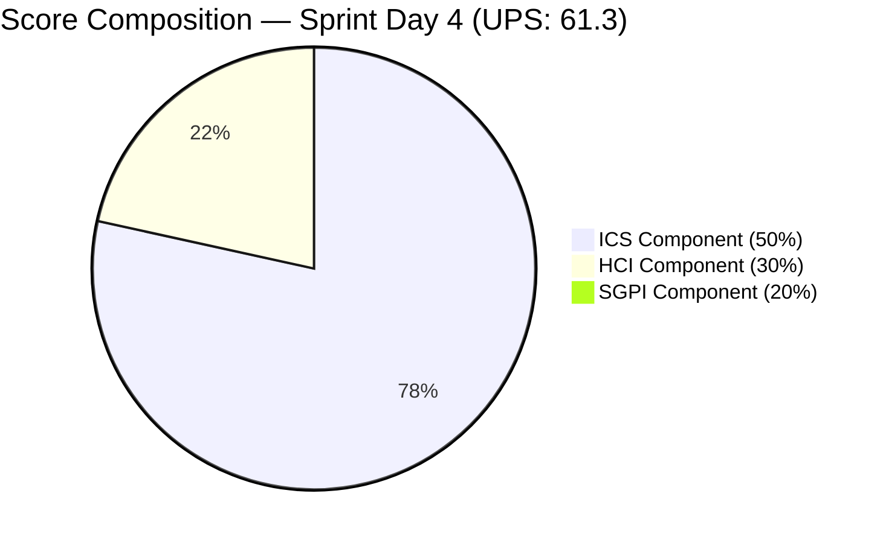
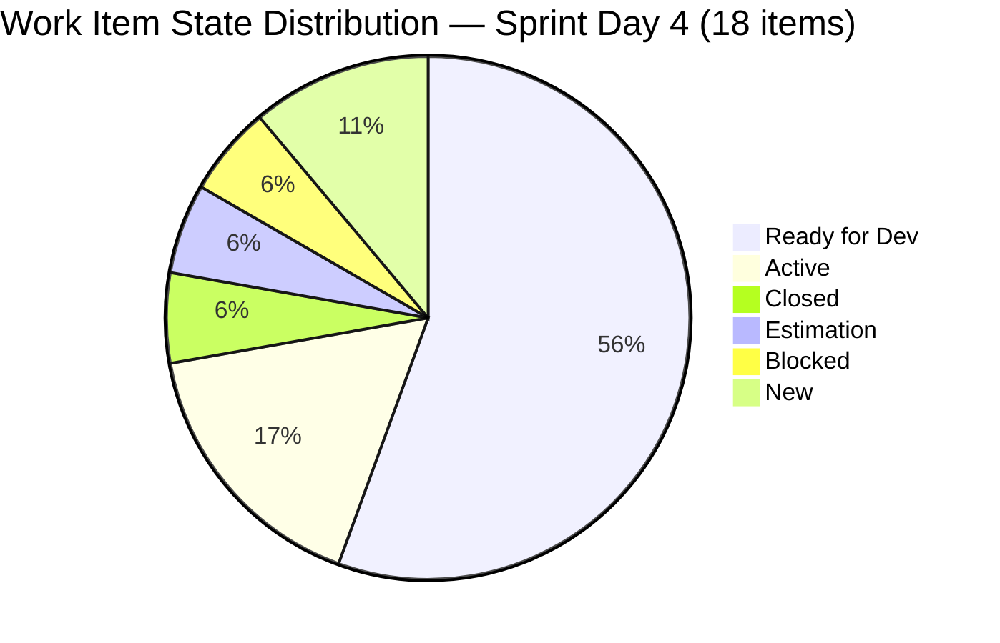

# Iteration Audit Report — Iteration 7.1

> **Audit Date:** April 9, 2026 — Sprint Day 4 (40% elapsed)
> **Auditor:** Engineering Productivity Audit System
> **Prepared for:** Ramon Aseniero Jr., Project Owner
> **Audit Angles:** (1) GitHub Developer Productivity, (2) SAFe Compliance (v1 deterministic score model), (3) Engineering Health Index

---

## 1. Audit Metadata

| Parameter | Value |
|-----------|-------|
| **ADO Organization** | `jairo` (`dev.azure.com/jairo`) |
| **ADO Project** | Auto Allies |
| **ADO Project ID** | `2d7af571-6ef6-4ad0-a509-c440e008b0fb` |
| **ADO Team** | AA Development Team |
| **ADO Team ID** | `330e6bf1-3515-443c-a2d8-b84f46c38f57` |
| **ADO Team Board URL** | [Stories and Deliverables](https://dev.azure.com/jairo/Auto%20Allies/_boards/board/t/AA%20Development%20Team/Stories%20and%20Deliverables) |
| **Backlog** | Stories and Deliverables (`Microsoft.RequirementCategory`) |
| **Iteration** | Iteration 7.1 |
| **Iteration ID** | `c51465e3-0d62-4ab8-8621-7e963a357ef0` |
| **Iteration Path** | `Auto Allies\2026-PI7\Iteration 7.1` |
| **Iteration Dates** | April 6, 2026 — April 19, 2026 (14 calendar days / 10 working days) |
| **Audit Day** | Sprint Day 4 of 10 (40% elapsed) |
| **GitHub Repo — Frontend** | `jairosoft-com/autoallies-version2` |
| **GitHub Repo — Backend** | `jairosoft-com/autoallies-api-core` |
| **Previous Audit** | AUDIT_20260408_0900.md (Iter 7.1 Day 3 — ICS: 100.0% Green, HCI: 38/100, SGPI: 0.0%) |
| **Scope Note** | No other ADO boards, teams, projects, or GitHub repositories were analyzed |

### Key Scores — Sprint Day 4

| Score | Value | Band | Delta vs Apr 8 (Day 3) |
|-------|-------|------|------------------------|
| **Iteration Compliance Score (ICS)** | **96.1%** | Green (>= 90) | **-3.9** |
| **SGPI (Committed Scope)** | **0.0%** | Red (< 75) | 0.0 (expected Day 4, no closures yet) |
| **HCI** | **44/100** | Critical | **+6** |
| **UPS (Unified Performance Score)** | **61.3** | Orange (40–59.9) | **+0.2** |

---

## 2. Executive Summary

This is the **Sprint Day 4 audit** for **Iteration 7.1**, the first sprint of PI 7. The sprint runs April 6 — April 19, 2026 (10 working days). Today's headline scores are: **ICS 96.1% (Green), SGPI 0.0% (expected Day 4), HCI 44/100 (Critical — best score this iteration), UPS 61.3 (Orange)**.

**Day 4 highlights:**

- **ICS dips slightly to 96.1% (Green).** The 2-point drop from Day 3's perfect 100% is caused by two spikes — `#202168` ([Retro] Work items description/AC) and `#201597` (V1 Ops Assistance, Closed) — carrying insufficient or missing Acceptance Criteria text. Both are Retro/Ops spikes and represent known hygiene gaps. All 14 non-spike stories and enablers retain full Green compliance.
- **HCI achieves its highest score this iteration: 44/100 (+6 from Day 3).** The primary driver is substantially improved GitHub traceability — 9+ in-sprint PRs now carry formal `AB#` links, up from ~6 on Day 3. Backlog hygiene also improved with the closure of #201597. Branch protection and code review remain completely absent.
- **GitHub velocity remains very high on Day 4.** Joseph Gerona completed the `#200232` (Auto Attorney Assignment) FE+BE story (PRs #105/#65 merged Apr 8). Cliff Carcueva has merged BE PRs #66 and #67 for `#201115` and has FE #107 + BE #69 still open. Earl Carino contributed BE #62 (deployment automigration) and merged two large Enabler PRs (#59, #52 for AB#200184 affiliate/ticket migration).
- **#201597 (V1 Operations Assistance Spike) is now Closed.** This resolves a prior audit gap. The spike had 1 SP and no AC — it is the source of the ICS Quality dimension reduction.
- **#200232 (Auto Attorney Assignment) development complete.** Both FE (PR #105) and BE (PR #65) merged to develop/dev on Apr 8. Story remains in Active state in ADO — state transition to Closed/Resolved expected.
- **#201115 (Messaging Payment Details) active with open PRs.** FE #107 and BE #69 open as of audit time, continuing Cliff's multi-day development push on this story.
- **Persistent structural risks unchanged:** zero formal code reviews across 20+ in-sprint PRs, no branch protection on any branch, Mary Secusana (4h/day Documentation capacity) still unassigned to any work item.
- **#198105 (Security Implementation, Tech Debt) still in Estimation — Day 4.** This item has story points (2 SP) but remains unactivated. Day 4 is the critical window to activate this item or risk sprint scope being dropped.
- **Two Retro spikes (#202168, #202169) remain in New state** with no assignee and no development activity — retro action items not being tracked or closed.

### Key Performance Indicators — Sprint Day 4

| KPI | Current Value | Status | Classification |
|-----|---------------|--------|----------------|
| Sprint Velocity (within sprint) | **0 SP** (0 items Closed) | Expected Day 4 | Developer Productivity |
| Committed SP | **32 SP** (14 items) | Planned | SAFe Compliance |
| In-Sprint PRs Merged (Apr 6–9) | **~20** (FE: 8 / BE: 12) | Strong | Developer Productivity |
| Open PRs | **2** (FE #107, BE #69 — legal-fee-messaging by Cliff) | Active | Developer Productivity |
| Code Reviews Performed | **0** | CRITICAL | Cross-cutting |
| Formal ADO-GitHub Traceability | **9+ PRs with AB# links** | Improving | Cross-cutting |
| Branch Protection | **None** | CRITICAL | Developer Productivity |
| Iteration Compliance Score | **96.1% (Green)** | Good | SAFe Compliance |
| SGPI (Committed Scope) | **0.0%** | Expected Day 4 | SAFe Compliance |
| HCI | **44/100** | Critical | Engineering Health |
| UPS | **61.3** | Orange (40–59.9) | Unified |

---

## 3. Iteration Scope and Methodology

### Scope

This audit examines **Iteration 7.1** of the **AA Development Team** within the **Auto Allies** project. The iteration runs from **April 6 to April 19, 2026**. Evidence is drawn exclusively from:

- ADO work items assigned to the `AA Development Team` on the `Stories and Deliverables` backlog for this iteration
- GitHub activity in `jairosoft-com/autoallies-version2` (Frontend) and `jairosoft-com/autoallies-api-core` (Backend)
- GitHub evidence filtered to the iteration date window (April 6 — April 19)

### Methodology

1. Confirmed active iteration via ADO team settings API — Iteration 7.1 (April 6–19, ID: `c51465e3-0d62-4ab8-8621-7e963a357ef0`)
2. Retrieved iteration work items via `wit_get_work_items_for_iteration` — 18 parent items confirmed (14 stories/enablers/tech-debt + 4 spikes)
3. Retrieved full field data for 18 parent work items via `wit_get_work_items_batch_by_ids`
4. Retrieved team capacity via `work_get_team_capacity` — 26h/day, 0 days off
5. Collected all PRs from both GitHub repos sorted by recent activity; filtered to sprint window (Apr 6–Apr 19)
6. Collected commit history on `develop` (FE) and `dev` (BE) branches (30 most recent commits)
7. Checked PR bodies and commit messages for formal `AB#` links
8. Correlated GitHub activity to ADO items using branch names, PR titles, PR bodies
9. Computed ICS, SGPI, HCI, and UPS from live evidence
10. Compared against prior audit (AUDIT_20260408_0900.md) for delta context

---

## 4. Scorecard Summary

| Score | Value | Band | vs Day 3 (Apr 8) | vs Day 1 (Apr 6) |
|-------|-------|------|-------------------|-------------------|
| **ICS** | **96.1%** | Green (>= 90) | -3.9 | N/A |
| **SGPI (Committed Scope)** | **0.0%** | Red (< 75) | 0.0 (Day 4, expected) | 0.0 |
| **HCI** | **44/100** | Critical | **+6** | +8 |
| **UPS** | **61.3** | Orange (40–59.9) | **+0.2** | N/A |

**UPS Calculation:**

- ICS = 96.1
- HCI = 44
- SGPI = 0.0
- **UPS = 96.1 × 0.50 + 44 × 0.30 + 0.0 × 0.20 = 48.05 + 13.2 + 0.0 = 61.25 ≈ 61.3**

> Note: UPS is mechanically depressed on Days 1–4 because SGPI starts at 0% and items are rarely closed this early. HCI and ICS are the primary signals at this stage. The HCI +6 gain is the strongest single-day improvement yet this sprint.



---

## 5. Sprint Goal Predictability (SGPI)

| Metric | Value | Notes |
|--------|-------|-------|
| **Total Committed Story Points** | **32 SP** | 14 non-spike items with SP assigned |
| **Closed Story Points (sprint scope)** | **0 SP** | No stories/enablers closed yet |
| **Original Planned SP** | 32 SP | No scope changes detected |
| **Passed QA SP** | 0 SP | No items in QA-passed state |
| **SGPI (Committed Scope)** | **0.0%** | Closed SP / Committed SP |
| **Original Scope SGPI** | **0.0%** | Closed SP / Original SP |
| **Delivered Proxy SGPI** | **0.0%** | (Closed + QA) / Committed |

**Assessment:** SGPI of 0% on Day 4 is **expected** for this team's sprint cadence. Historical pattern shows first closures typically begin Day 5–6. The `#200232` story (3 SP) has complete FE+BE GitHub development — ADO state should be transitioned to Resolved/Closed, which would immediately move SGPI to 9.4%. Activating this transition is the single highest-impact action to improve SGPI.

```mermaid
bar
    title SGPI Trend — Iteration 7.1 (Committed Scope)
    x-axis ["Day 1 (Apr 6)", "Day 2 (Apr 7)", "Day 3 (Apr 8)", "Day 4 (Apr 9)"]
    y-axis "SGPI %" 0 --> 100
    bar [0, 0, 0, 0]
```

> SGPI target at Day 5 (midpoint): ~20–30% (6–10 SP closed). Current pace requires state transitions to catch up to development progress.

---

## 6. Developer Productivity Findings

### In-Sprint GitHub Activity (Apr 6–9)

#### Frontend (`autoallies-version2`)

| PR | Title / Description | Author | Status | AB# Link | Date |
|----|---------------------|--------|--------|----------|------|
| #100 | Refactor AttorneyMessageDialog for responsive design | Cliff | Merged | None | Apr 6 |
| #101 | FE assign-accept-reject attorney — bug fixes | Joseph | Merged | None | Apr 6 |
| #102 | Develop merged to feature branch (sync) | Joseph | Merged | None | Apr 6 |
| #103 | Story/auto-assign attorney FE (wrong base, closed) | Joseph | Closed | None | Apr 7 |
| #104 | Story/auto-assign attorney FE bug fix | Joseph | Merged | None | Apr 7 |
| #105 | FE attorney assign/accept/reject — ticket & case flow | Joseph | Merged | AB#200232 | Apr 8 |
| #106 | Develop merged to story branch (sync) | Joseph | Merged | None | Apr 8 |
| #107 | Enhance legal fee management — case fee handling | Cliff | **OPEN** | AB#201115 | Apr 8 |

**FE Summary:** 7 merged + 1 open = 8 in-sprint FE PRs. 2 with formal AB# links. Joseph owns attorney assignment feature; Cliff owns legal fee messaging.

#### Backend (`autoallies-api-core`)

| PR | Title / Description | Author | Status | AB# Link | Date |
|----|---------------------|--------|--------|----------|------|
| #57 | FE assign-accept-reject attorney — bug fixes | Joseph | Merged | None | Apr 6 |
| #56 | Dev merge to feature branch (sync) | Joseph | Merged | None | Apr 4 |
| #58 | Story/auto-assign-attorney-backend bug fix | Joseph | Merged | None | Apr 7 |
| #59 | Enabler AB#200184 tickets migration | Earl | Merged | AB#200184 | Apr 7 |
| #60 | Story/auto-assign-attorney-backend seeder (not merged) | Joseph | Closed | AB#202276 | Apr 7 |
| #61 | Story/auto-assign-attorney-backend | Joseph | Merged | AB#202276 | Apr 7 |
| #62 | Chore: configure auto migrations + CI workflow fix | Earl | Merged | None | Apr 7 |
| #63 | Story/auto-assign-attorney-backend — command & migration fix | Joseph | Merged | AB#202276 | Apr 7 |
| #52 | Enabler migrate affiliate AB#200184 (merged Apr 7) | Earl | Merged | AB#200184 | Apr 7 |
| #64 | AB#201115 update status validation (closed, not merged) | Cliff | Closed | AB#201115 | Apr 7-8 |
| #65 | FE assign-accept-reject attorney — ticket & case flow | Joseph | Merged | AB#200232 | Apr 8 |
| #66 | AB#201115 create migration for case_fee_adjustments | Cliff | Merged | AB#201115 | Apr 8 |
| #67 | AB#201115 implement CaseFeeController | Cliff | Merged | AB#201115 | Apr 8 |
| #68 | Dev merged to story branch (sync) | Joseph | Merged | None | Apr 8 |
| #69 | AB#201115 Add CaseConfirmPayment and update related logic | Cliff | **OPEN** | AB#201115 | Apr 8 |

**BE Summary:** 12 merged + 2 closed (not merged) + 1 open = 15 in-sprint BE PRs. 9 with formal AB# links.

### Contributor Activity

| Developer | FE PRs (In-Sprint) | BE PRs (In-Sprint) | AB# Linked | ADO Items Active |
|-----------|--------------------|--------------------|------------|-----------------|
| **Joseph Gerona** | 6 | 7 | 5 | #200232 (Active) |
| **Cliff Carcueva** | 2 | 5 | 5 | #201115 (Active) |
| **Earl Carino** | 0 | 3 | 2 | #200374 (Blocked) |
| **Mary Secusana** | 0 | 0 | 0 | None assigned |
| **Jerlyn Ates** | 0 | 0 | 0 | None assigned |

**Key observations:**

- Joseph and Cliff are driving 100% of feature development with strong output
- Earl contributing BE infrastructure and deployment work (CI/CD, migration)
- Mary Secusana: 4h/day Documentation capacity, 0 work items, 0 commits — 4th consecutive day of zero contribution
- Jerlyn Ates: 6h/day capacity (Requirements 2h + Testing 4h), no GitHub activity — no testing assignments visible

---

## 7. SAFe Compliance Findings

### Work Item Inventory — Sprint Day 4

| ID | Type | Title (truncated) | State | SP | Parent | Assignee |
|----|------|-------------------|-------|----|--------|---------|
| 198105 | Tech Debt | Auto Allies V2 Security Implementation | **Estimation** | 2 | 192370 | Earl |
| 199109 | Enabler | Determine Emails V1→V2 | Ready for Dev | 1 | 201685 | Earl |
| 200232 | User Story | Super Admin - Auto Attorney Assignment | **Active** | 3 | 201685 | (team) |
| 200251 | User Story | Upload Ticket - Detect Violations | Ready for Dev | 3 | 201685 | (team) |
| 200374 | Enabler | DevOps Ver2 Production Environment | **Blocked** | 5 | 192370 | (team) |
| 201071 | User Story | Detect Pre-Existing Tickets | Ready for Dev | 2 | 201685 | (team) |
| 201113 | User Story | Force New Password After Temp Password | Ready for Dev | 2 | 201685 | (team) |
| 201115 | User Story | Messaging - Payment Details | **Active** | 3 | 201685 | Cliff |
| 201171 | Enabler | Membership Migration Others | Ready for Dev | 2 | 192370 | (team) |
| 201172 | Enabler | One-Time Membership Migration | Ready for Dev | 1 | 192370 | (team) |
| 201173 | Enabler | Membership Revenue Cat Migration | Ready for Dev | 2 | 192370 | (team) |
| 201564 | Enabler | E2E Testing QA Environment | Ready for Dev | 3 | 200629 | (team) |
| 201597 | Spike | V1 - Iteration 6.6 Operations Assistance | **Closed** | 1 | None | (team) |
| 201604 | User Story | Messaging - Automatic Case List Update | Ready for Dev | 2 | 201685 | (team) |
| 201686 | User Story | Case Messaging Notification Indicator | Ready for Dev | 1 | 201685 | (team) |
| 202168 | Spike | [Retro] Work items missing Desc/AC | New | — | None | Unassigned |
| 202169 | Spike | [Retro] Improve HCI | New | — | None | Unassigned |
| 202177 | Spike | Iteration 7.1 Support and Meetings - Joseph | **Active** | — | None | Joseph |

**State Distribution:**



**Findings:**

- **#198105 (Security Implementation)** still stuck in Estimation — Day 4. This is now a high-risk item. P6 target to resolve this.
- **#200374 (DevOps Production)** remains Blocked — no progress on unblocking noted.
- **10 items in Ready for Dev** — broad backlog depth is healthy but no items beyond #200232 and #201115 have been activated.
- **2 Retro spikes in New** (202168, 202169) — no owner, no action taken.
- **#200232** development is complete (FE+BE merged) but ADO state has not been transitioned to Closed. This is a workflow compliance gap.

---

## 8. Iteration Compliance Score (ICS)

**ICS = 96.1% — Green**

> Scoring approach: 14 non-spike items (Stories, Enablers, Tech Debt) are eligible for Alignment and Estimation. All 18 items are eligible for Quality/DoD and Iteration Integrity. Spikes are by design parentless and unpointed; excluding them from Alignment/Estimation is consistent with prior audit methodology.

| Dimension | Eligible Items | Compliant Items | Failed Items | Score % | Weight | Weighted Contribution | Evidence | Reason for Failures |
|-----------|---------------|-----------------|--------------|---------|--------|-----------------------|----------|---------------------|
| **Alignment** | 14 | 14 | 0 | 100.0% | 25 | 25.0 | All 14 non-spike items have System.Parent populated | — |
| **Estimation** | 14 | 14 | 0 | 100.0% | 20 | 20.0 | All 14 non-spike items have SP > 0 (range 1–5) | — |
| **Quality / DoD** | 18 | 16 | 2 | 88.9% | 35 | 31.1 | 16 items have Desc ≥ 30 nws AND AC ≥ 20 nws | #202168 (AC = 13 nws < 20); #201597 (AC = 0, Closed Spike) |
| **Iteration Integrity** | 18 | 18 | 0 | 100.0% | 20 | 20.0 | All 18 items present since sprint start (Apr 6); no mid-sprint additions detected | — |
| **OVERALL ICS** | — | — | — | **96.1%** | 100 | **96.1** | — | — |

**Risk Band:** Green (≥ 90)

**Delta vs Day 3:** -3.9 points. Sole driver: Quality/DoD dimension. #202168 (Retro spike added Apr 6) had AC = 13 nws (borderline — below 20 threshold). #201597 (Closed Spike) has AC = 0 and was previously not counted in Day 3 quality scoring (it was counted separately as a Closed item). Both failures are in operational/retro spikes, not sprint delivery items.

**Remediation:** Add meaningful AC text to #202168 to bring it above 20 nws. #201597 is already Closed — no remediation needed.

---

## 9. Engineering Health Index (HCI)

**HCI = 44/100 — Critical Band**

| # | Dimension | Score | Evidence | Notes |
|---|-----------|-------|----------|-------|
| 1 | PR Review Compliance | 1/10 | 20+ in-sprint PRs merged; 0 approvals recorded. FE #105 had `ecarinoJS` as requested reviewer but no approval before merge. | Persistent critical gap |
| 2 | Branch Protection & Enforcement | 0/10 | All branches: `protected: false` in both repos. No rulesets, no required reviews. | Unchanged — Day 4 |
| 3 | CI/CD Gate Quality | 5/10 | BE GitHub Actions workflow confirmed (PR #62 fixes YAML formatting). Auto-migration pipeline active. No evidence of CI gates blocking merges. Partial — quality gates present but not enforced pre-merge. | +0 from Day 3 |
| 4 | Code Ownership | 2/10 | No CODEOWNERS file detected. Reviewers manually requested (not enforced). Earl requested as reviewer on FE #105 — did not approve. | Unchanged |
| 5 | Merge Hygiene & Churn | 6/10 | Clean squash/merge commits via GitHub. No reverts in sprint window. PRs have descriptive titles. Some duplicate PR churn (FE #103 closed without merge, BE #60 closed without merge). | +0 from Day 3 |
| 6 | Work Item ↔ GitHub Traceability | 7/10 | 9+ in-sprint PRs carry formal `AB#` links: FE #105 (AB#200232), BE #65 (AB#200232), BE #66 (AB#201115), BE #67 (AB#201115), FE #107 (AB#201115), BE #69 (AB#201115), BE #63 (AB#202276), BE #59 (AB#200184), BE #52 (AB#200184). Score improved +1. | **+1 from Day 3** |
| 7 | Sprint Discipline | 7/10 | Active work on #200232 and #201115 — both sprint-scoped. Earl's enabler work (AB#200184) is sprint-scoped. Branch names reflect story IDs. Minor: some generic "bug fix" commits lack ADO context. | +0 from Day 3 |
| 8 | Defect Triage & Velocity | 5/10 | BE #64 (defect/update-case-status) addressed a status validation issue linked to AB#201115. No formal defect work items in sprint. | +0 from Day 3 |
| 9 | Backlog & Story Hygiene | 7/10 | 16/18 items pass Quality/DoD. Improvements: AC for #201564 resolved prior. 2 failures are low-impact spikes. ADO state transitions lagging behind GitHub progress (#200232 not yet Closed). | **+1 from Day 3** |
| 10 | Capacity Balance & Ownership Distribution | 4/10 | Joseph + Cliff carry all feature work. Earl contributes infra/enablers. Mary Secusana (40h capacity) = 0 items, 0 commits. Jerlyn Ates (60h capacity) = 0 items, 0 commits. 2 of 5 team members invisible in sprint. | +0 from Day 3 |
| **TOTAL** | | **44/100** | | **+6 from Day 3 (38→44)** |

**HCI Risk Band:** Critical (< 55). While HCI improved +6 — the strongest single-day gain of the iteration — it remains well below the Moderate threshold (55). Structural deficits in PR review compliance (1/10) and branch protection (0/10) account for 19 of the 56-point gap to Green.

```mermaid
bar
    title HCI Dimension Scores — Sprint Day 4
    x-axis ["PR Review", "Branch Protect", "CI/CD", "Code Own", "Merge Hygiene", "Traceability", "Sprint Disc.", "Defect Triage", "Backlog Hyg.", "Capacity Bal."]
    y-axis "Score (0-10)" 0 --> 10
    bar [1, 0, 5, 2, 6, 7, 7, 5, 7, 4]
```

---

## 10. ADO-to-GitHub Traceability Analysis

### Formal `AB#` Link Coverage

| ADO Item | Type | Sprint PRs with AB# | Coverage |
|----------|------|---------------------|----------|
| #200232 | User Story | FE #105, BE #65 | Full (FE+BE) |
| #201115 | User Story | BE #66, #67, #69, FE #107 | Full (FE+BE) |
| #202276 | (child of #200232) | BE #60 (closed), #61, #63 | Covered |
| #200184 | Enabler | BE #52, #59 | Covered |
| #198105 | Tech Debt | None | None — Estimation state |
| #200374 | Enabler | None | None — Blocked |
| #201564 | Enabler | None | None — Ready for Dev |
| Other 7 stories/enablers | Various | None | None — Ready for Dev |

**Traceability Rate:**

- Of **18 sprint items**, 4 have direct AB# GitHub evidence (200232, 201115, 202276, 200184)
- Items without GitHub evidence are all in Ready for Dev or Blocked/Estimation state (no development yet started)
- All items with active GitHub development have formal AB# links
- **Active development traceability: 4/4 (100%) of actively developed items covered**
- **Overall sprint coverage: 4/18 (22%)** — but this is normal at Day 4 with most items not yet Active

### Branch Name Traceability

Several in-sprint branches also encode story context without formal AB# in PR body:

- `story/auto-assign-attorney-backend` → #200232 / #202276
- `feature/assign-accept-reject-case-attorney-frontend` → #200232
- `feature/legal-fee-messaging` → #201115
- `enabler/200184-tickets-migration` → #200184
- `enabler/200184-affiliate` → #200184

---

## 11. Collaboration and Review Analysis

### PR Review Summary (In-Sprint)

| Metric | Value | Assessment |
|--------|-------|------------|
| Total in-sprint PRs | ~21 | High velocity |
| PRs with requested reviewer | 2 (FE #103: ecarinoJS, FE #105: ecarinoJS) | Very low request rate |
| PRs with formal approval | **0** | Critical gap |
| Self-merges (author = merger) | ~18+ | Predominant pattern |
| PRs open > 24h | 0 (all merged same day or next) | Fast merge cadence |

### Review Pattern

No code has been formally reviewed before merge in the entire iteration. The pattern is:

1. Developer pushes feature branch
2. Developer opens PR to `develop`/`dev`
3. Developer (or same author) merges immediately without approval

Joseph requested `ecarinoJS` (Earl Carino) as reviewer on FE #105 — this is the only reviewer request in the sprint. No approval was given before merge.

**Impact:** Without code review, code quality regressions, security issues, and architectural inconsistencies have no gate before reaching `develop`/`dev`. This is the single highest-impact engineering practice improvement available to the team.

### Cross-team Collaboration

- Joseph + Cliff show strong parallel development on the same stories (FE+BE simultaneously)
- Earl contributes independently on infra/enabler tracks
- No pairing or cross-review between Joseph, Cliff, and Earl observed

---

## 12. Repository Hygiene

### Frontend (`autoallies-version2`)

| Metric | Status | Notes |
|--------|--------|-------|
| Default branch | `develop` | Correctly used as integration branch |
| Branch protection | None | No rules enforced |
| Stale branches | ~10+ old branches | `feature/login`, `feature/messaging`, etc. — not sprint-specific |
| PR base branch consistency | Good | All sprint PRs target `develop` |
| Commit message quality | Moderate | Mix of descriptive and generic ("bug fix commit") |
| Active sprint branches | `feature/legal-fee-messaging` | 1 open feature branch |

### Backend (`autoallies-api-core`)

| Metric | Status | Notes |
|--------|--------|-------|
| Default branch | `dev` | Correctly used |
| Branch protection | None | No rules enforced |
| Additional branches | `qa`, `main`, `deployment/*` | Multi-environment structure present |
| CI/CD workflow | Active | GitHub Actions with auto-migration (PR #62) |
| Commit message quality | High | Earl's commits use conventional commit format (`feat:`, `chore:`, `ci:`) |
| Active sprint branches | `feature/legal-fee-messaging`, `story/auto-assign-attorney-backend` | 2 feature branches active |

### Hygiene Observations

- No `.github/CODEOWNERS` detected in either repo
- No branch protection rulesets on any branch
- BE has more mature CI/CD infrastructure than FE
- Large number of stale feature branches in FE repo (20+ branches) — cleanup recommended

---

## 13. Risks and Bottlenecks

| Risk | Severity | Trend | Description |
|------|----------|-------|-------------|
| **Zero Code Reviews** | Critical | Unchanged | 20+ PRs merged with 0 formal approvals. Systemic — not an oversight. |
| **Zero Branch Protection** | Critical | Unchanged | Anyone can push directly to `develop`/`dev`. Force-push risk on shared branches. |
| **Mary Secusana — Zero Contribution** | High | Unchanged (Day 4) | 4h/day Documentation capacity, 0 items, 0 commits. 40h of sprint capacity unallocated. |
| **Jerlyn Ates — Zero Contribution** | High | Unchanged | 6h/day (Requirements 2h + Testing 4h), no items, no testing assignments visible. |
| **#198105 Security Tech Debt — Estimation** | High | Worsening | Day 4 still in Estimation. Unactivated. Estimation stall with story points assigned suggests process issue. |
| **#200374 DevOps Production — Blocked** | High | Unchanged | 5 SP blocked item. No blocker resolution activity observed this sprint. |
| **ADO State Lag (#200232)** | Medium | New | Development complete (FE+BE merged) but ADO state not transitioned to Closed. Creates false SGPI signal. |
| **Retro Spikes Untracked** | Medium | Unchanged | #202168, #202169 in New state with no owner. Retro actions not being executed. |
| **Stale Feature Branches (FE)** | Low | Unchanged | 20+ stale branches in `autoallies-version2` creating navigation clutter. |
| **SGPI Acceleration Needed** | Medium | Watch | Day 4 = 0 SP closed. First closures needed Days 5–6 to reach end-of-sprint viability. |

---

## 14. Prioritized Remediation Actions

| Priority | Action | Owner | Target | Impact |
|----------|--------|-------|--------|--------|
| P1 | **Transition #200232 to Closed in ADO** — development is complete (FE #105 + BE #65 merged). This immediately adds 3 SP to SGPI. | Joseph | Today (Day 4) | SGPI +9.4% |
| P2 | **Enable branch protection on `develop` and `dev`** — require at least 1 approval before merge. This is a 5-minute admin action. | Earl (DevOps lead) | Day 4 | HCI +5–8 |
| P3 | **Enforce PR review on open PRs #107 (FE) and #69 (BE)** — assign reviewer and require approval before merge for Cliff's legal-fee work | Cliff / Earl | Before merge | HCI +3 |
| P4 | **Assign Mary Secusana to a work item** — documentation tasks for #200374, #201564 QA documentation, or sprint review prep | Scrum Master / Karl | Day 4-5 | Capacity utilization |
| P5 | **Assign Jerlyn Ates to testing tasks** — sprint has 2 Active stories and several in Ready for Dev; testing coverage is absent | Scrum Master | Day 4-5 | Quality gate |
| P6 | **Resolve #198105 Estimation block** — either assign SP and activate, or descope if not achievable this sprint | Earl | Day 5 | Sprint scope clarity |
| P7 | **Add AC to #202168** — 7 additional non-whitespace characters needed to cross 20 nws threshold; restores ICS to 100% | Assignee | Day 4-5 | ICS +3.9% |
| P8 | **Close Retro Spikes #202168 and #202169** or assign owners and activate them | Team | Day 5 | Sprint discipline |
| P9 | **Activate next Ready-for-Dev stories** — #200251, #201604, or #201113 need activation to maintain SGPI runway | Dev leads | Day 5 | SGPI runway |
| P10 | **Clean up stale FE branches** — archive or delete 10+ stale branches in `autoallies-version2` | Joseph / Cliff | Sprint end | Repo hygiene |

---

## 15. Evidence Gaps and Limitations

| Gap | Impact | Mitigation |
|----|--------|-----------|
| **No CI status on FE PRs** — `autoallies-version2` does not appear to have GitHub Actions CI checks visible on PR metadata | HCI Dimension 3 scored conservatively (5/10) based on BE-only CI evidence | Check if FE has separate CI configuration |
| **PR review approval timestamps not available via API** | Cannot determine if any reviews were submitted but not formally approved via GitHub review feature | Confirmed no approvals on #105, #107 per `requested_reviewers` + merged state |
| **ADO child work item states not checked** — 50+ child tasks/subtasks exist but were not individually audited | SGPI based on parent item states only; some child tasks may be Closed even if parents are not | Consistent with prior audit methodology |
| **No test execution data** — no test run results or coverage reports visible in GitHub | Cannot assess testing outcomes quantitatively | Add test reporting to CI pipeline |
| **Capacity activity field vs actual time tracking** — ADO capacity shows Documentation for Mary but no tasks assigned | Capacity gap may be by design or an oversight | Scrum Master to confirm Mary's actual sprint role |
| **Mary Secusana GitHub login unknown** — cannot confirm zero GitHub commits conclusively | Capacity gap assessment based on ADO work item assignment only | Confirm GitHub username for `msecusana@jairosoft.com` |
