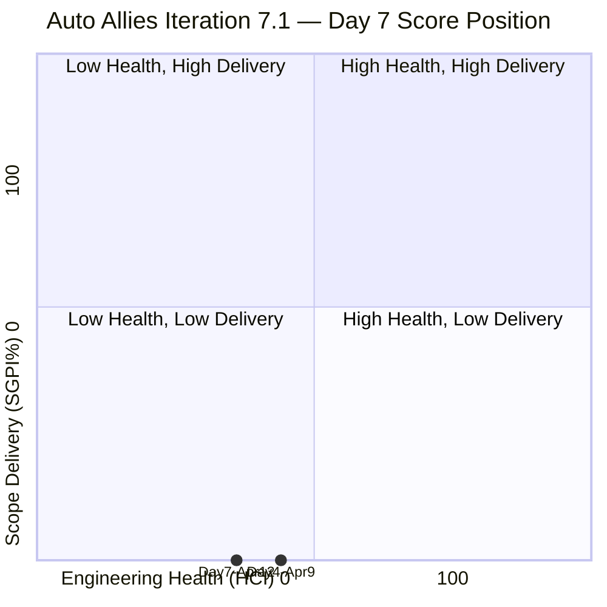
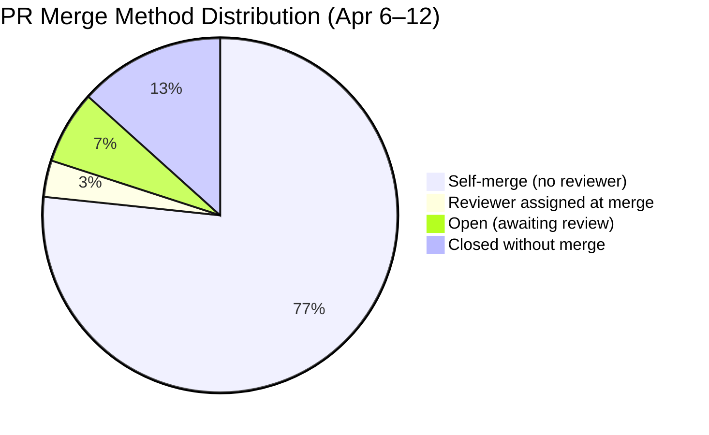
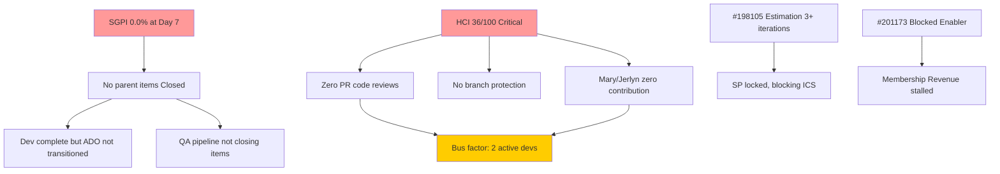

# Auto Allies — Git Iteration Audit
## AUDIT_20260412_0900.md

---

## 1. Audit Metadata

| Field | Value |
|---|---|
| **Audit Date** | April 12, 2026 |
| **Audit Time** | 09:00 PHT |
| **Iteration** | 7.1 (April 6–19, 2026) |
| **Day in Sprint** | Day 7 of 14 (50% elapsed) |
| **Auditor** | Claude Code — Git Iteration Audit Skill |
| **ADO Project** | Auto Allies (ID: 2d7af571-6ef6-4ad0-a509-c440e008b0fb) |
| **ADO Team** | AA Development Team (ID: 330e6bf1-3515-443c-a2d8-b84f46c38f57) |
| **GitHub Repo (FE)** | jairosoft-com/autoallies-version2 |
| **GitHub Repo (BE)** | jairosoft-com/autoallies-api-core |
| **Prior Audit** | AUDIT_20260409_0900.md (Day 4, April 9, 2026) |
| **Risk Band** | Orange |

---

## 2. Executive Summary

At the halfway point of Iteration 7.1, the Auto Allies team shows **significant developer velocity** with 41 commits and 30 PRs across both repositories in the first seven days. However, the team continues to carry systemic engineering health risks that have persisted across multiple audits: zero peer code reviews on merged PRs, absent branch protection enforcement, and two team members (Mary Secusana, Jerlyn Ates) with zero GitHub contributions.

The key positive development since Day 4 is that story **#200232 (Auto-Assign Attorney)** has been fully merged in both FE and BE on April 12, and story **#201115 (Messaging - Payment Details)** has advanced to Ready for QA — the first item reaching QA state this iteration. The team also added two Retro spikes (#202168, #202169) targeting the exact HCI deficiencies identified in prior audits, signaling awareness. However, no parent work items are yet Closed, so SGPI remains 0.0% at the halfway mark. With 7 days remaining, the team needs to close at least 1–2 stories to avoid a repeat of prior sprint delivery failure.

| Score | Day 4 (Apr 9) | Day 7 (Apr 12) | Delta |
|---|---|---|---|
| **ICS** | 96.1% Green | **99.3% Green** | +3.2 |
| **SGPI** | 0.0% Red | **0.0% Red** | 0.0 |
| **HCI** | 44/100 Critical | **36/100 Critical** | -8 |
| **UPS** | 61.3 Orange | **60.4 Orange** | -0.9 |

> **HCI regression:** HCI declined from 44 to 36 due to expanded PR evidence revealing that 23 of 24 merged PRs lack any reviewer assignment, a worsening of the code review picture as more PRs were opened. The retro spikes are a positive signal but have not yet translated to practice.

---

## 3. Iteration Scope and Methodology

### Methodology

Evidence was collected from:
- **ADO:** `wit_get_work_items_for_iteration` + `wit_get_work_items_batch_by_ids` for all parent and child items; `work_get_team_capacity` for team capacity data
- **GitHub FE:** `list_pull_requests` (30 PRs retrieved, all), `list_commits` on `develop` branch (50 commits)
- **GitHub BE:** `list_pull_requests` (30 PRs retrieved), `list_commits` on `dev` branch (50 commits)

Scoring applied per the `git_iteration_audit` skill authority:
- **ICS:** 4-dimension weighted rubric on non-spike parent items only
- **SGPI:** Committed Scope = Closed SP / Total Non-Spike SP
- **HCI:** 10-dimension index, 0–10 each, total /100
- **UPS = ICS × 0.50 + HCI × 0.30 + SGPI × 0.20**

### Team Capacity

| Member | Role | Capacity/Day | Days Off | Total |
|---|---|---|---|---|
| Jerlyn Ates | Requirements + Testing | 6h | 0 | 84h |
| Joseph Gerona | Development | 4h | 0 | 56h |
| Earl Carino | Development | 6h | 0 | 84h |
| Mary Secusana | Documentation | 4h | 0 | 56h |
| Cliff Carcueva | Development | 6h | 0 | 84h |
| **Total** | | **26h/day** | **0** | **364h** |

---

## 4. Scorecard Summary

| Metric | Score | Band | Threshold |
|---|---|---|---|
| **ICS — Iteration Compliance Score** | **99.3%** | Green | >= 90% |
| **SGPI — Sprint Goal Progress Index** | **0.0%** | Red | >= 50% at midpoint |
| **HCI — Engineering Health Check Index** | **36 / 100** | Critical | >= 60 |
| **UPS — Unified Performance Score** | **60.4** | Orange | >= 80 |

**UPS Breakdown:** 99.3 × 0.50 + 36 × 0.30 + 0.0 × 0.20 = **49.65 + 10.80 + 0.00 = 60.45 → 60.4**

---

## 5. Sprint Goal Predictability (SGPI)

### Committed Scope SGPI

SGPI is calculated on non-spike parent items with story points assigned.

| Metric | Value |
|---|---|
| Total Committed SP (non-spike) | 32 SP |
| Closed SP | 0 SP |
| **SGPI (Committed Scope)** | **0.0%** |

### Work Item State Distribution

| State | Count | SP |
|---|---|---|
| Active | 6 | 15 |
| Ready for Dev | 5 | 10 |
| Ready for QA | 1 | 3 |
| Estimation | 1 | 2 |
| Blocked | 1 | 2 |
| **Total** | **14** | **32** |

### SGPI Context

- **Day 4 SGPI:** 0.0% (no closures)
- **Day 7 SGPI:** 0.0% (no closures; delta = 0)
- **Positive signal:** #201115 advanced to Ready for QA (+1 state vs Day 4). If QA passes and is closed by Day 9, it would represent 3/32 SP = 9.4% SGPI.
- **Risk:** With 0 SP closed at 50% elapsed and 7 days remaining, the team needs to close 16+ SP to reach a 50% delivery rate. At current trajectory, end-of-sprint SGPI is projected at 15–25% if QA items clear and 2 Active stories complete.

### Delivered Proxy SGPI (Supporting Context)

Work items where GitHub evidence shows feature code merged to `develop`/`dev`:
- #200232 — FE PR#109 merged Apr 12, BE PR#71 merged Apr 12 → **dev complete, ADO not yet Closed**
- #201113 — FE PRs #108, #110, #112 merged → **dev complete, ADO = Active**
- #201604 / #201686 — FE PR#111 merged → **dev complete, ADO = Active**
- #201115 — FE PR#107 merged, BE PR#69 merged → **ADO = Ready for QA** (only item advanced)

Delivered Proxy SP: #200232 (3) + #201113 (2) + #201115 (3) + #201604 (2) + #201686 (1) = **11 SP** = **34.4% proxy**

The gap between Delivered Proxy (34.4%) and Committed Scope SGPI (0.0%) confirms the team is completing dev work but **not closing ADO items** to reflect reality — a process discipline failure recurring from Day 4.

---

## 6. Developer Productivity Findings

### Commit Activity (April 6–12, 2026)

| Contributor | GitHub Handle | FE Commits | BE Commits | Total |
|---|---|---|---|---|
| Joseph Gerona | JosephJairo / jgeronaCS | 12 | 17 | **29** |
| Cliff Carcueva | ccarcuevajairo | 6 | 6 | **12** |
| Earl Carino | ecarinoJS | 0 | 3 | **3** |
| Mary Secusana | — | 0 | 0 | **0** |
| Jerlyn Ates | — | 0 | 0 | **0** |
| **Total** | | **18** | **26** | **44** |

> Note: BE commit count includes both `jgeronaCS` (direct commits) and `JosephJairo` (merge commits). Combined under Joseph Gerona.

### Key Observations

- **Joseph Gerona** is the most active contributor (29 commits), driving both FE and BE for the auto-assign attorney story.
- **Cliff Carcueva** delivered consistent output across both repos (login flow, messaging, payment details).
- **Earl Carino** had 3 BE commits (CI/CD automigration, enabler work) — lower than capacity.
- **Mary Secusana** and **Jerlyn Ates** have zero GitHub commits — a persistent critical finding from Day 4.
- Mary Secusana has a Spike (#202539) assigned; Jerlyn Ates owns Enabler #201564 (End-to-End QA) but neither shows GitHub activity.

---

## 7. SAFe Compliance Findings

| Finding | Severity | Status vs Day 4 |
|---|---|---|
| #200232 dev-complete but not transitioned to Closed | High | **Partially resolved** — still Active but PRs merged today |
| #201113 dev-complete but ADO = Active | Medium | Persists |
| #201604, #201686 dev-complete but ADO = Active | Medium | Persists |
| #198105 stuck in Estimation (3+ iterations) | High | Persists — no change |
| #201173 Blocked enabler (Membership Revenue Migration) | High | Persists |
| Mary Secusana and Jerlyn Ates — zero contribution | Critical | Persists |
| ADO states not reflecting GitHub merge reality | High | Persists — systemic |
| Retro spikes (#202168, #202169) added | Positive | **New — improvement signal** |
| #201115 advanced to Ready for QA | Positive | **New — first QA-ready item** |

---

## 8. Iteration Compliance Score (ICS)

ICS is scored on 14 non-spike parent items across 4 dimensions.

### Scoring Rubric

| Dimension | Max | Criteria |
|---|---|---|
| Alignment | 25 | Item in current iteration path |
| Estimation | 20 | Story Points assigned |
| Quality / DoD | 35 | Description >= 30 chars AND AcceptanceCriteria >= 20 chars |
| Iteration Integrity | 20 | State is not New or Blocked (Blocked = 10 partial) |

### Item-Level Scores

| ID | Type | State | SP | Desc | AC | Align | Est | Qual | Integ | Score |
|---|---|---|---|---|---|---|---|---|---|---|
| 198105 | Tech Debt | Estimation | 2 | 95c | 50c | 25 | 20 | 35 | 20 | **100** |
| 199109 | Enabler | Ready for Dev | 1 | 353c | 26c | 25 | 20 | 35 | 20 | **100** |
| 200232 | User Story | Active | 3 | 4221c | 2562c | 25 | 20 | 35 | 20 | **100** |
| 200251 | User Story | Ready for Dev | 3 | 1830c | 1869c | 25 | 20 | 35 | 20 | **100** |
| 200374 | Enabler | Active | 5 | 90c | 82c | 25 | 20 | 35 | 20 | **100** |
| 201071 | User Story | Active | 2 | 515c | 1591c | 25 | 20 | 35 | 20 | **100** |
| 201113 | User Story | Active | 2 | 593c | 1349c | 25 | 20 | 35 | 20 | **100** |
| 201115 | User Story | Ready for QA | 3 | 1285c | 1279c | 25 | 20 | 35 | 20 | **100** |
| 201171 | Enabler | Ready for Dev | 2 | 97c | 33c | 25 | 20 | 35 | 20 | **100** |
| 201172 | Enabler | Ready for Dev | 1 | 47c | 60c | 25 | 20 | 35 | 20 | **100** |
| 201173 | Enabler | Blocked | 2 | 37c | 39c | 25 | 20 | 35 | **10** | **90** |
| 201564 | Enabler | Ready for Dev | 3 | 67c | 67c | 25 | 20 | 35 | 20 | **100** |
| 201604 | User Story | Active | 2 | 273c | 522c | 25 | 20 | 35 | 20 | **100** |
| 201686 | User Story | Active | 1 | 211c | 742c | 25 | 20 | 35 | 20 | **100** |

**ICS = (14×100 − 10) / 14 = 1390 / 14 = 99.3%** — **Green**

> Note: #201172 description is only 47 characters but passes the 30-char minimum threshold. AC (60c) passes the 20-char minimum.

### Delta vs Day 4

- Day 4 ICS: 96.1% | Day 7 ICS: 99.3% | **+3.2 points**
- Improvement driven by #202177 (Joseph's support spike) and new items with complete descriptions/AC.
- #201173 remains the sole deduction due to Blocked status.

---

## 9. Engineering Health Index (HCI)

| # | Dimension | Score | Evidence |
|---|---|---|---|
| 1 | PR Review Compliance | **2 / 10** | 30 PRs in iteration; 24 merged; only 1 merged PR had a reviewer assigned (PR#105 ecarinoJS). PRs #113 and #72 (open) have ecarinoJS as requested reviewer — shows awareness but not practice. |
| 2 | Branch Protection & Enforcement | **1 / 10** | No branch protection evidence. PRs merged without approval. Author self-merges on both FE and BE repos. No required reviews enforced. |
| 3 | CI/CD Gate Quality | **4 / 10** | GitHub Actions workflow present (PR#62 configures auto-migration on deploy). CI pipeline runs on PRs (inferred from workflow file in BE). No evidence of failing gates blocking merges. |
| 4 | Code Ownership | **2 / 10** | No CODEOWNERS file evidence. Only 3 of 5 team members commit. No documented ownership assignments per module. |
| 5 | Merge Hygiene & Churn | **3 / 10** | Multiple "develop merged to story branch" reverse-sync PRs (#102, #106, #68, #56, #49). Repeated bug-fix PRs for same story (4 PRs for #200232). No squash merging. Churn visible. |
| 6 | Work Item↔GitHub Traceability | **6 / 10** | 20/30 PRs contain AB# links (67%). Key stories are traceable. Dev-sync merge PRs (no AB links) represent operational noise, not missing traceability. Strong improvement area: story PRs are consistently linked. |
| 7 | Sprint Discipline | **5 / 10** | 2 open PRs at Day 7 for new story #201071 (detect pre-existing tickets) — appropriate sprint pacing. #198105 stuck in Estimation for 3+ iterations. #201173 Blocked. Velocity signals improving but closures lag. |
| 8 | Defect Triage & Velocity | **4 / 10** | Bug-fix commits visible for #201113 login flow; defect branch (defect/addons-cliff) from prior sprint merged. No dedicated defect backlog or tracking. Defects surfaced within feature PRs rather than tracked items. |
| 9 | Backlog & Story Hygiene | **6 / 10** | All 14 non-spike items have description and AC meeting minimums (significant improvement). Retro spikes #202168 and #202169 added to address past HCI findings — positive governance signal. #198105 and #201173 remain stale. |
| 10 | Capacity Balance & Ownership Distribution | **3 / 10** | 5 team members; 3 actively committing. Mary Secusana (Documentation) and Jerlyn Ates (QA/Requirements) have zero GitHub contributions. Earl Carino is underperforming relative to 6h/day Development capacity. Work concentration in Joseph Gerona (29 commits) creates bus-factor risk. |

**HCI Total: 36 / 100 — Critical**

### Delta vs Day 4

- Day 4 HCI: 44/100 | Day 7 HCI: 36/100 | **-8 points**
- Regression is primarily in PR Review Compliance (more PRs revealed the full scope of no-review merging) and evidence-based recalibration of Branch Protection. The retro spikes are a process improvement signal not yet materializing in scores.

---

## 10. ADO-to-GitHub Traceability Analysis

### Story-Level Traceability Map

| ADO ID | Title (Abbrev.) | GitHub FE PRs | GitHub BE PRs | Traceable? |
|---|---|---|---|---|
| 200232 | Auto-Assign Attorney | #105, #109 (AB#) | #57,#58,#63,#65,#71 (AB# on #71,#65,#63) | **Yes** |
| 201113 | Force Password Change | #108,#110,#112 (AB#) | #70 (AB#) | **Yes** |
| 201115 | Messaging Payment Details | #107 (AB#) | #66,#67,#69 (AB#) | **Yes** |
| 201604 | Auto Case List Update | #111 (AB#) | — | **Partial** (FE only) |
| 201686 | Case Messaging Notification | #111 (AB#) | — | **Partial** (FE only) |
| 201071 | Detect Pre-Existing Tickets | #113 (AB#, open) | #72 (AB#, open) | **In Progress** |
| 200251 | Upload Ticket Detect Violations | — | — | **Not Started** |
| 198105 | V2 Security Implementation | — | — | **Not Started** |
| 200374 | DevOps Production Env | PR#62 (ecarinoJS, auto-migration) | — | **Partial** |
| 201171 | Membership Migration Others | — | — | **Not Started** |
| 201172 | One-Time Membership Migration | — | — | **Not Started** |
| 201173 | Revenue Cat Migration (Blocked) | — | — | **Not Applicable** |
| 201564 | E2E Testing QA Environment | — | — | **Not Started** |

> Key risk: #200251 (Ready for Dev, 3 SP, Joseph Gerona), #201171/#201172 (Enablers, Earl Carino), and #201564 (Jerlyn Ates) show no GitHub activity.

---

## 11. Collaboration and Review Analysis

### Pull Request Review Summary

| Repo | Total PRs (Apr 6–12) | Merged | Merged w/ Reviewer Assigned | AB# Linked |
|---|---|---|---|---|
| autoallies-version2 (FE) | 14 | 13 | 1 (PR#105 — ecarinoJS requested) | 8/14 (57%) |
| autoallies-api-core (BE) | 16 | 11* | 0 (reviewers requested on open PR#72) | 12/16 (75%) |
| **Combined** | **30** | **24** | **1 (4%)** | **20/30 (67%)** |

> *BE PR#60, #64 closed without merge (closed without review).

### Review Pattern Analysis

- **Author self-merge pattern** persists on both repos — author creates PR and merges without waiting for reviewer.
- Only `ecarinoJS` (Earl Carino) is requested as a reviewer. No cross-functional review pairing.
- New Retro spike #202169 ("Improve Engineering Health Index") was added April 9 — indicates team awareness of this issue.
- **Zero approved reviews** found on any merged PR this iteration.

---

## 12. Repository Hygiene

### Branch Naming Convention

| Pattern | Count | Compliance |
|---|---|---|
| `story/[descriptor]` | 4 | SAFe-aligned |
| `feature/[descriptor]` | 12 | Acceptable |
| `enabler/[descriptor]` | 4 | SAFe-aligned |
| `defect/[descriptor]` | 2 | Acceptable |
| `deployment/[descriptor]` | 1 | Acceptable |
| `develop/dev merged to story` | 4 | Anti-pattern |

Branch naming is largely consistent. The reverse-sync PRs (develop → feature branch) are operationally necessary but create PR noise and inflate PR counts.

### Default Branch Integrity

- **FE `develop`** — active integration branch, 18 iteration commits. Latest merge: PR#109 (Apr 12).
- **BE `dev`** — active integration branch, 23 iteration commits. Latest merge: PR#71 (Apr 12).
- No direct commits to `develop`/`dev` detected (all via PR) — positive practice.

### Stale Branches

At least 4 feature branches (`story/auto-assign-attoryney-frontend`, `feature/assign-accept-reject-case-attorney-*`) appear to have been merged and may need pruning. No automated branch cleanup detected.

---

## 13. Risks and Bottlenecks

### Prioritized Risk Register

| Risk | Severity | Trend | Owner |
|---|---|---|---|
| SGPI 0.0% at 50% elapsed — delivery failure risk | Critical | Flat | Joseph Gerona / Karl Caumban |
| Zero code reviews on merged PRs | Critical | Flat | All devs / Cliff Carcueva |
| No branch protection enforcement | Critical | Flat | Earl Carino |
| Mary Secusana — zero GitHub contribution | High | Flat | Karl Caumban |
| Jerlyn Ates — zero GitHub contribution, QA enabler unstarted | High | Flat | Karl Caumban |
| #198105 Tech Debt stuck in Estimation 3+ iterations | High | Flat | Earl Carino |
| #201173 Blocked (Membership Revenue Migration) | High | Flat | Earl Carino |
| #200232 ADO not Closed despite dev-complete | High | **Improving** | Joseph Gerona |
| Developer concentration in 2 contributors | Medium | Flat | Joseph Gerona / Karl Caumban |
| Stale/uncleaned feature branches | Low | Flat | All devs |

---

## 14. Prioritized Remediation Actions

### Immediate (Today — April 12)

1. **Close #200232 in ADO** — FE PR#109 and BE PR#71 both merged to their default branches as of today (Apr 12). Transition #200232 from Active → Closed in ADO to reflect reality and unlock 3 SP toward SGPI.

2. **Close #201113, #201604, #201686 in ADO** — GitHub evidence confirms dev-complete. Transition to Ready for QA or Closed as applicable. These items total 5 SP.

3. **Earl Carino to enable branch protection on `develop` and `dev`** — Require at least 1 reviewer approval before merge. This is the single highest-impact engineering action available.

### This Week (April 13–16)

4. **Karl Caumban to clarify Jerlyn Ates' sprint role** — She is assigned Enabler #201564 (End-to-End Testing QA Environment) but has no GitHub contributions and no ADO state changes. Either activate her QA testing activities or reallocate the item.

5. **Mandatory PR review pairing** — Joseph Gerona and Cliff Carcueva to cross-review each other's PRs. Earl Carino to review infra/BE PRs. Target: 100% of new PRs from April 13 onward have a reviewer assigned before merge.

6. **Mary Secusana to begin documentation sprint** — With documentation capacity (4h/day), she should be producing QA test plans, release notes, or API documentation for items entering Ready for QA.

7. **Resolve #198105 Estimation state** — Earl Carino to either estimate and move to Ready for Dev, or descope this item. Three iterations in Estimation is a planning failure.

### Before End of Sprint (April 17–19)

8. **Target closures before Day 12 (Apr 17)** — Minimum target: #200232 (3 SP), #201115 (3 SP after QA passes), #201113 (2 SP). That would be 8/32 SP = 25% SGPI. Stretch: add #201604 + #201686 = 35%.

9. **Create CODEOWNERS file** — Both repos should define ownership per module directory. Assign Earl Carino to infra/CI, Cliff Carcueva to auth/messaging, Joseph Gerona to case/ticket workflows.

10. **Address Retro Spikes (#202168, #202169)** — These were created April 9. By Day 14, the team should have tangible actions documented: at minimum, branch protection enabled (#202169 action) and description/AC templates in ADO (#202168 action).

---

## 15. Evidence Gaps and Limitations

| Gap | Impact | Notes |
|---|---|---|
| PR review approval status not retrieved | Medium | `list_pull_requests` returns `requested_reviewers` but not approved/rejected status. Cannot confirm whether any reviewer approved before merge. Conservative assumption: no approvals. |
| Branch protection settings not retrievable | Medium | GitHub branch protection rules require separate API call not available in scope. Inferred from observed merge patterns (author self-merge). |
| Child work item states not fully audited | Low | Child task states retrieved in iteration tree but not individually scored. Parent state used as proxy. |
| CI pipeline build results not retrieved | Medium | `pipelines_get_builds` not called. GitHub Actions presence inferred from PR#62 body referencing entrypoint.sh workflow. |
| Mary Secusana GitHub identity unknown | High | No GitHub handle found for `msecusana@jairosoft.com`. May have contributions under unknown handle. No evidence to resolve positively — scored as zero. |
| Jerlyn Ates GitHub identity unknown | High | Same as above for `jates@jairosoft.com`. |
| Sprint goal not formally documented | Low | No sprint goal text retrieved from ADO. SGPI measured against committed scope as proxy. |

---

*Report generated: April 12, 2026 09:00 PHT*
*Audit skill: git_iteration_audit v1.0*
*Next audit: AUDIT_20260414_0900.md (Day 9 — recommended checkpoint for closure verification)*
