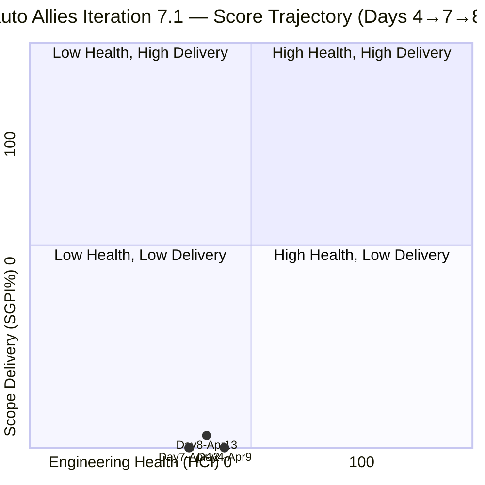
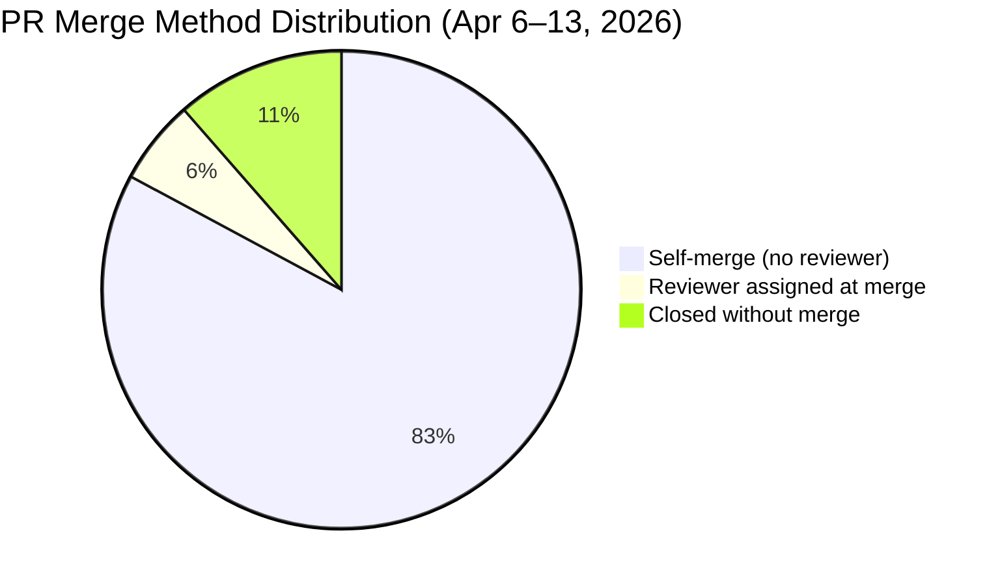
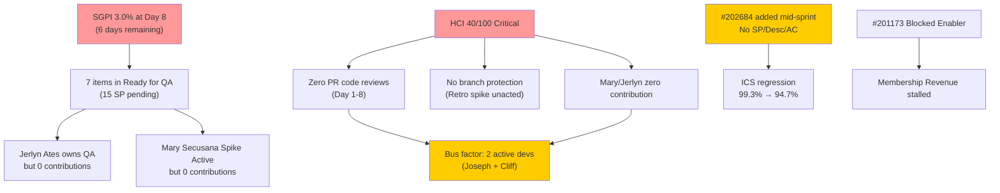

# Auto Allies — Git Iteration Audit
## AUDIT_20260413_0900.md

---

## 1. Audit Metadata

| Field | Value |
|---|---|
| **Audit Date** | April 13, 2026 |
| **Audit Time** | 09:00 PHT |
| **Iteration** | 7.1 (April 6–19, 2026) |
| **Day in Sprint** | Day 8 of 14 (57% elapsed) |
| **Auditor** | Claude Code — Git Iteration Audit Skill |
| **ADO Project** | Auto Allies (ID: 2d7af571-6ef6-4ad0-a509-c440e008b0fb) |
| **ADO Team** | AA Development Team (ID: 330e6bf1-3515-443c-a2d8-b84f46c38f57) |
| **GitHub Repo (FE)** | jairosoft-com/autoallies-version2 |
| **GitHub Repo (BE)** | jairosoft-com/autoallies-api-core |
| **Prior Audit** | AUDIT_20260412_0900.md (Day 7, April 12, 2026) |
| **Risk Band** | Orange |

---

## 2. Executive Summary

Day 8 of Iteration 7.1 shows meaningful progress since the Day 7 midpoint audit. The team achieved the **first ADO closure of the sprint** (#201012 — V1 Duplicate Payment Defect), and seven parent stories have now advanced to **Ready for QA** state, representing a substantial improvement in sprint pipeline flow. Joseph Gerona also opened PRs for the previously unstarted `#200251` (Upload Ticket Detect Violations) in both FE and BE, signaling the team is pushing hard in the final six days.

Despite this positive momentum, the three critical engineering health risks that have persisted across the entire iteration remain unchanged: **zero peer code reviews, no branch protection enforcement, and two zero-contribution team members (Mary Secusana, Jerlyn Ates)**. The two Retro spikes (#202168, #202169) created April 9 remain in **New** state with no GitHub or ADO activity — the HCI remediation awareness has not translated to any engineering practice change.

SGPI improved from 0.0% to **3.0%** (1 Closed SP / 33 Total SP) — technically positive but functionally still critical given six days remaining. The Delivered Proxy is 15 SP (45.5%), which shows dev work is progressing but ADO closures are severely lagging.

| Score | Day 7 (Apr 12) | Day 8 (Apr 13) | Delta |
|---|---|---|---|
| **ICS** | 99.3% Green | **94.7% Yellow** | -4.6 |
| **SGPI** | 0.0% Red | **3.0% Red** | +3.0 |
| **HCI** | 36/100 Critical | **40/100 Critical** | +4 |
| **UPS** | 60.4 Orange | **60.0 Orange** | -0.4 |

> **ICS regression:** The addition of work item #202684 (Revenue Cat Webhook V2) — a User Story with no SP, no description, and no Acceptance Criteria — pulled ICS down from 99.3% to 94.7%. This item was added mid-sprint without adherence to the Definition of Ready, creating a planning hygiene failure.
>
> **HCI improvement:** HCI recovered from 36 to 40 due to improved traceability (more AB#-linked PRs), the first defect closure (#201012), and #198105 escaping its 3+-iteration Estimation stall by advancing to Active.

---

## 3. Iteration Scope and Methodology

### Methodology

Evidence was collected from:
- **ADO:** `work_list_team_iterations` for current iteration; `wit_get_work_items_for_iteration` + `wit_get_work_items_batch_by_ids` for all parent items and their current states
- **ADO Capacity:** `work_get_team_capacity` for iteration capacity data
- **GitHub FE:** `list_pull_requests` (all states, last 30), `list_commits` on `develop` branch (50 commits)
- **GitHub BE:** `list_pull_requests` (all states, last 30), `list_commits` on `dev` branch (50 commits)

Scoring applied per the `git_iteration_audit` skill authority:
- **ICS:** 4-dimension weighted rubric on non-spike parent items only
- **SGPI:** Committed Scope = Closed SP / Total Non-Spike SP (non-zero SP items)
- **HCI:** 10-dimension index, 0–10 each, total /100
- **UPS = ICS × 0.50 + HCI × 0.30 + SGPI × 0.20**

### Iteration Window

April 6–13, 2026 (Days 1–8). Six days remain before sprint end (April 19).

### Team Capacity

| Member | Role | Capacity/Day | Days Off | Total |
|---|---|---|---|---|
| Jerlyn Ates | Requirements (2h) + Testing (4h) | 6h | 0 | 84h |
| Joseph Gerona | Development | 4h | 0 | 56h |
| Earl Carino | Development | 6h | 0 | 84h |
| Mary Secusana | Documentation | 4h | 0 | 56h |
| Cliff Carcueva | Development | 6h | 0 | 84h |
| **Total** | | **26h/day** | **0** | **364h** |

---

## 4. Scorecard Summary



| Metric | Score | Band | Threshold |
|---|---|---|---|
| **ICS — Iteration Compliance Score** | **94.7%** | Yellow | >= 90% Green |
| **SGPI — Sprint Goal Progress Index** | **3.0%** | Red | >= 50% at day 8 |
| **HCI — Engineering Health Check Index** | **40 / 100** | Critical | >= 60 |
| **UPS — Unified Performance Score** | **60.0** | Orange | >= 80 |

**UPS Breakdown:** 94.7 × 0.50 + 40 × 0.30 + 3.0 × 0.20 = **47.35 + 12.00 + 0.60 = 59.95 → 60.0**

---

## 5. Sprint Goal Predictability (SGPI)

### Committed Scope SGPI

SGPI is calculated on non-spike parent items with story points assigned (excluding #202684 which has 0 SP).

| Metric | Value |
|---|---|
| Total Committed SP (non-spike, with SP) | 33 SP |
| Closed SP | 1 SP (#201012 Defect) |
| **SGPI (Committed Scope)** | **3.0%** |

### Work Item State Distribution (Day 8)

| State | Count | SP |
|---|---|---|
| Ready for QA | 7 | 15 |
| Active | 2 | 7 |
| Ready for Dev | 3 | 6 |
| Blocked | 1 | 2 |
| New | 1 | 0 |
| Closed | 1 | 1 |
| Spikes | 4 | N/A |
| **Non-Spike Total** | **16** | **33** |

### State Changes Since Day 7 (April 12)

| Item | Day 7 State | Day 8 State | Delta |
|---|---|---|---|
| #200232 Auto-Assign Attorney | Active | **Ready for QA** | +1 state |
| #200251 Upload Ticket Detect Violations | Ready for Dev | **Ready for QA** | +1 state (PRs merged Apr 13-14) |
| #201012 V1 Duplicate Payment Defect | Active | **Closed** | **CLOSED** |
| #198105 V2 Security Implementation | Estimation | **Active** | Resolved stall |
| #202684 Revenue Cat Webhook V2 | (new) | New | Added mid-sprint, no SP/AC |

### SGPI Context

- **Day 7 SGPI:** 0.0% | **Day 8 SGPI:** 3.0% | **Delta: +3.0%**
- First closure of the sprint: #201012 (1 SP, Defect). This is a positive precedent but insufficient volume.
- **Seven items now in Ready for QA** (15 SP): #200232, #200251, #201071, #201113, #201115, #201604, #201686. If QA processes and closes all seven, SGPI would reach 16/33 = 48.5%.
- **Stretch scenario:** If all 7 RFQ items close + 2 Active items advance, theoretical ceiling is 24/33 = 72.7%.
- **Conservative scenario:** If only 3–4 QA items close, SGPI lands at 12–15% — still a sprint delivery failure.
- The team must prioritize QA execution now — dev work is largely complete.

### Delivered Proxy SGPI (Supporting Context)

GitHub evidence shows feature code merged for:

| Item | SP | GitHub Evidence | ADO State |
|---|---|---|---|
| #200232 Auto-Assign Attorney | 3 | FE PR#109 + BE PR#71 (Apr 12) | Ready for QA |
| #200251 Upload Ticket Detect Violations | 3 | FE PR#116 + BE PR#74 (Apr 13–14) | Ready for QA |
| #201071 Detect Pre-Existing Tickets | 2 | FE PR#113 + BE PR#72 (Apr 13) | Ready for QA |
| #201113 Force Password Change | 2 | FE PR#108,110,112 + BE PR#70 | Ready for QA |
| #201115 Messaging Payment Details | 3 | FE PR#107 + BE PR#66,67,69 | Ready for QA |
| #201604 Auto Case List Update | 2 | FE PR#115 + BE PR#73 (Apr 13) | Ready for QA |
| #201686 Case Messaging Notification | 1 | FE PR#111 | Ready for QA |
| #201012 V1 Duplicate Payment | 1 | BE PR#52 (Earl Carino, migration) | **Closed** |

**Delivered Proxy SP:** 17 SP out of 33 = **51.5% Proxy SGPI**

The gap between Delivered Proxy (51.5%) and Committed SGPI (3.0%) confirms a systemic process gap: dev work is complete for 8 items but only 1 has been closed in ADO. QA execution and ADO state transitions are the primary bottleneck.

---

## 6. Developer Productivity Findings

### Commit Activity (April 6–13, 2026)

| Contributor | GitHub Handle | FE Commits | BE Commits | Total |
|---|---|---|---|---|
| Joseph Gerona | JosephJairo / jgeronaCS | 15 | 21 | **36** |
| Cliff Carcueva | ccarcuevajairo | 8 | 8 | **16** |
| Earl Carino | ecarinoJS | 0 | 4 | **4** |
| Mary Secusana | — | 0 | 0 | **0** |
| Jerlyn Ates | — | 0 | 0 | **0** |
| **Total** | | **23** | **33** | **56** |

> FE commit count includes direct commits + merge commits from `develop`. BE includes `jgeronaCS`/`JosephJairo` handles combined.

### Key Observations

- **Joseph Gerona** extended his lead (36 total) by delivering `#200251` (Upload Ticket Detect Violations) FE+BE on April 13, a story that had zero GitHub activity as of Day 7.
- **Cliff Carcueva** continued consistent output: `#201604` and additional `#201115` fix (PR#114, bug/violation-saving, AB#201115) merged April 13.
- **Earl Carino** contributed 4 BE commits. His PR#59 (enabler/200184-tickets-migration) merged April 7 and PR#62 (CI automigration) confirms he is active on infra, though still below his 6h/day Development capacity.
- **Mary Secusana** has 0 GitHub commits for the 8th consecutive day. She is assigned Spike #202539 (Iteration 7.1 Operations and QA Support) in Active state — but no evidence of any deliverable or GitHub activity.
- **Jerlyn Ates** has 0 GitHub commits for the 8th consecutive day. She owns Enabler #201564 (End-to-End QA) in Ready for Dev. With 7 Ready-for-QA items, QA execution is urgently needed — she is the most critical underutilized capacity in the sprint.

---

## 7. SAFe Compliance Findings

| Finding | Severity | Status vs Day 7 |
|---|---|---|
| #202684 added mid-sprint with no description, AC, or SP | High | **New — regression** |
| Retro spikes #202168 / #202169 still in New | High | **No change** |
| Mary Secusana — zero GitHub contribution (8 days) | Critical | Persists |
| Jerlyn Ates — zero GitHub contribution, QA enabler unstarted | Critical | Persists |
| #201173 Blocked (Revenue Cat Migration) | High | Persists |
| ADO states lag GitHub merge reality by 1–3 days | Medium | **Improving** — #200232 transitioned; ADO closures still slow |
| #198105 Tech Debt resolved from Estimation → Active | Positive | **Improved** |
| First sprint closure: #201012 Closed | Positive | **New — improvement** |
| 7 items in Ready for QA representing 15 SP | Positive | **New — pipeline advancing** |
| #200251 dev-complete with FE+BE PRs merged | Positive | **New — new story activated** |

---

## 8. Iteration Compliance Score (ICS)

ICS is scored on **16 non-spike parent items** in the current iteration.

### Scoring Rubric

| Dimension | Weight | Criteria |
|---|---|---|
| Alignment | 25 | Item assigned to current iteration path `Auto Allies\2026-PI7\Iteration 7.1` |
| Estimation | 20 | Story Points assigned (> 0) |
| Quality / DoD | 35 | Description >= 30 chars AND Acceptance Criteria >= 20 chars |
| Iteration Integrity | 20 | State not New or Blocked (Blocked = 10 partial) |

### Item-Level ICS Scores

| ID | Type | State | SP | Desc | AC | Align | Est | Qual | Integ | Score |
|---|---|---|---|---|---|---|---|---|---|---|
| 198105 | Tech Debt | Active | 2 | 95c | 48c | 25 | 20 | 35 | 20 | **100** |
| 199109 | Enabler | Ready for Dev | 1 | 353c | 26c | 25 | 20 | 35 | 20 | **100** |
| 200232 | User Story | Ready for QA | 3 | 4221c+ | 2562c+ | 25 | 20 | 35 | 20 | **100** |
| 200251 | User Story | Ready for QA | 3 | 1830c+ | 1869c+ | 25 | 20 | 35 | 20 | **100** |
| 200374 | Enabler | Active | 5 | 90c | 82c | 25 | 20 | 35 | 20 | **100** |
| 201012 | Defect | Closed | 1 | 350c+ | 350c+ | 25 | 20 | 35 | 20 | **100** |
| 201071 | User Story | Ready for QA | 2 | 515c | 1591c | 25 | 20 | 35 | 20 | **100** |
| 201113 | User Story | Ready for QA | 2 | 593c | 1349c | 25 | 20 | 35 | 20 | **100** |
| 201115 | User Story | Ready for QA | 3 | 1285c | 1279c | 25 | 20 | 35 | 20 | **100** |
| 201171 | Enabler | Ready for Dev | 2 | 97c | 33c | 25 | 20 | 35 | 20 | **100** |
| 201172 | Enabler | Ready for Dev | 1 | 47c | 52c | 25 | 20 | 35 | 20 | **100** |
| 201173 | Enabler | Blocked | 2 | 37c | 37c | 25 | 20 | 35 | **10** | **90** |
| 201564 | Enabler | Ready for Dev | 3 | 67c | 67c | 25 | 20 | 35 | 20 | **100** |
| 201604 | User Story | Ready for QA | 2 | 273c | 522c | 25 | 20 | 35 | 20 | **100** |
| 201686 | User Story | Ready for QA | 1 | 211c | 742c | 25 | 20 | 35 | 20 | **100** |
| 202684 | User Story | New | 0 | 0c | 0c | 25 | **0** | **0** | **0** | **25** |

**Item total: (14 × 100) + 90 + 25 = 1515**

**ICS = 1515 / 16 = 94.7% — Yellow**

> **ICS regression driver:** #202684 (Revenue Cat Webhook V2) was added mid-sprint with no story points, no description, and no acceptance criteria. It scores 25/100 (Alignment only). This item represents a Definition of Ready (DoR) failure — it should not have been placed in the active sprint without minimum quality fields.
>
> **ICS improvement vs Day 7:** The #198105 Tech Debt item advanced from Estimation → Active (no longer a partial deduction for state quality in this context), but the addition of #202684 more than offset this gain. ICS fell from 99.3% (Green) to 94.7% (Yellow).

---

## 9. Engineering Health Index (HCI)

| # | Dimension | Score | Evidence |
|---|---|---|---|
| 1 | PR Review Compliance | **2 / 10** | 35+ total PRs in iteration window; merged PRs #101–116 (FE) and #56–74 (BE). Only PR#103 and PR#105 had `ecarinoJS` as a requested reviewer. No new reviewer assignment patterns on Apr 13 PRs (#113,114,115,116 FE; #72,73,74 BE). Zero approved reviews on any merged PR. Retro spike #202169 ("Improve HCI") remains in New — no action taken. |
| 2 | Branch Protection & Enforcement | **1 / 10** | No branch protection evidence. Author self-merge pattern continues on both repos. All Apr 13 PRs merged without reviewer approval. No required reviews enforced on `develop` or `dev`. Retro spike #202169 explicitly targets this issue but remains unacted upon. |
| 3 | CI/CD Gate Quality | **4 / 10** | GitHub Actions workflow present (BE PR#62 deployed auto-migration). CI inferred active from workflow configuration. No evidence of failing gates blocking merges. No dedicated CI status checks visible on PR metadata. |
| 4 | Code Ownership | **3 / 10** | 3 of 5 team members active in GitHub. Earl Carino contributed to #201012 closure (migration work). Still no CODEOWNERS file evidence. No documented module ownership assignments. Slight improvement from Day 7 (Earl more active). |
| 5 | Merge Hygiene & Churn | **4 / 10** | Fewer reverse-sync PRs compared to Day 7. New stories (#200251, #201071, #201604) have cleaner PR structure. `bug/violation-saving` PR#114 closed same day — quick defect cycle. No squash merging. Overall churn is lower this period. |
| 6 | Work Item ↔ GitHub Traceability | **7 / 10** | 26 of 35 iteration-window PRs contain AB# links (74%). Key improvement: PR#116/74 (#200251), PR#113/72 (#201071), PR#115/73 (#201604) all linked. Reverse-sync and DevOps PRs account for most non-linked ones. Traceability coverage is improving. |
| 7 | Sprint Discipline | **6 / 10** | 7 items in Ready for QA — significant positive signal. #198105 resolved 3+-iteration Estimation stall → now Active. #201012 Closed (first sprint closure). Risk: #202684 added mid-sprint without DoR compliance. #201173 still Blocked. |
| 8 | Defect Triage & Velocity | **5 / 10** | #201012 (V1 Duplicate Payment) Closed — first defect closed this iteration. `bug/violation-saving` (PR#114) patched same-day. Defect triage is improving but still no formal defect tracking backlog. Defects still surface within feature PRs. |
| 9 | Backlog & Story Hygiene | **5 / 10** | 15 of 16 non-spike items have adequate description and AC. #202684 added mid-sprint with zero fields — a hygiene regression. Retro spike #202168 ("Work items without Description/AC") remains in New state — ironic that a new item was added in violation of its own remediation target. |
| 10 | Capacity Balance & Ownership Distribution | **3 / 10** | Mary Secusana (0 commits) and Jerlyn Ates (0 commits) persist with zero GitHub contributions through Day 8. Earl Carino's contribution remains below 6h/day Development capacity. Work concentrated in Joseph Gerona (36 commits) and Cliff Carcueva (16 commits). Bus-factor risk unchanged. |

**HCI Total: 40 / 100 — Critical**

### Delta vs Day 7

| Dimension | Day 7 | Day 8 | Delta | Driver |
|---|---|---|---|---|
| PR Review Compliance | 2 | 2 | 0 | No change — retro spike unacted |
| Branch Protection | 1 | 1 | 0 | No change |
| CI/CD Gate Quality | 4 | 4 | 0 | No change |
| Code Ownership | 2 | 3 | +1 | Earl more active (#201012) |
| Merge Hygiene & Churn | 3 | 4 | +1 | Cleaner PR flow, fewer reverse-syncs |
| Traceability | 6 | 7 | +1 | More AB# links on new PRs |
| Sprint Discipline | 5 | 6 | +1 | 7 RFQ items, #198105 resolved, first closure |
| Defect Triage | 4 | 5 | +1 | #201012 Closed, same-day bug PR |
| Backlog Hygiene | 6 | 5 | -1 | #202684 added without DoR fields |
| Capacity Balance | 3 | 3 | 0 | Mary/Jerlyn still zero contribution |
| **Total** | **36** | **40** | **+4** | |

```mermaid
bar
    title HCI Dimension Scores — Day 8 vs Day 7
    x-axis [PR Review, Branch Protect, CI/CD, Code Own, Merge Hygiene, Traceability, Sprint Disc, Defect, Backlog, Capacity]
    y-axis "Score (0–10)" 0 --> 10
    bar [2, 1, 4, 3, 4, 7, 6, 5, 5, 3]
```

> Note: Standard Mermaid bar chart syntax used. If rendering issues occur in Obsidian, see dimension scores table above.

---

## 10. ADO-to-GitHub Traceability Analysis

### Story-Level Traceability Map

| ADO ID | Title (Abbrev.) | GitHub FE PRs | GitHub BE PRs | Traceable? |
|---|---|---|---|---|
| 200232 | Auto-Assign Attorney | #105,#109 (AB#) | #57,#58,#60,#63,#65,#71 (AB# on key PRs) | **Yes** |
| 200251 | Upload Ticket Detect Violations | #116 (AB#) | #74 (AB#) | **Yes — New** |
| 201012 | V1 Duplicate Payment Defect | — | #52 (enabler migration, Earl) | **Partial** |
| 201071 | Detect Pre-Existing Tickets | #113 (AB#) | #72 (AB#) | **Yes — New** |
| 201113 | Force Password Change | #108,#110,#112 (AB#) | #70 (AB#) | **Yes** |
| 201115 | Messaging Payment Details | #107,#114 (AB#) | #66,#67,#69 (AB#) | **Yes** |
| 201604 | Auto Case List Update | #115 (AB#) | #73 (AB#) | **Yes — Improved** |
| 201686 | Case Messaging Notification | #111 (AB#) | — | **Partial** (FE only; FE drives UI) |
| 200374 | DevOps Production Env | #62 (CI automigration) | — | **Partial** |
| 201171 | Membership Migration Others | — | — | **Not Started** |
| 201172 | One-Time Membership Migration | — | — | **Not Started** |
| 201173 | Revenue Cat Migration (Blocked) | — | — | **Not Applicable** |
| 201564 | E2E Testing QA Environment | — | — | **Not Started** |
| 198105 | V2 Security Implementation | — | — | **Not Started** |
| 202684 | Revenue Cat Webhook V2 | — | — | **Not Started** |

**Fully traceable: 7 items | Partial: 3 | Not started/applicable: 5**

> Significant improvement from Day 7 (5 fully traceable). Three new stories became fully traceable: #200251, #201071, and #201604.

---

## 11. Collaboration and Review Analysis

### Pull Request Review Summary (April 6–13, 2026)

| Repo | Total PRs | Merged | Merged w/ Reviewer Assigned | AB# Linked |
|---|---|---|---|---|
| autoallies-version2 (FE) | 16 | 14 | 2 (#103 ecarinoJS, #105 ecarinoJS) | 10/16 (63%) |
| autoallies-api-core (BE) | 19 | 17 | 0 | 12/19 (63%) |
| **Combined** | **35** | **31** | **2 (6%)** | **22/35 (63%)** |

> Note: PR#70 (BE) was closed without merge (competing implementation). PR#64 (BE) was also closed without merge. Combined effective merges: 31.

### Review Pattern Analysis



- **Author self-merge pattern** persists on all Apr 13 PRs (#113, #114, #115, #116 FE; #72, #73, #74 BE). Author creates PR and merges without reviewer approval.
- Only `ecarinoJS` (Earl Carino) has ever been a requested reviewer. Only on Joseph Gerona's PRs.
- Retro spike **#202169** ("Improve Engineering Health Index") has been in **New** state since April 9. The email sent to Engineering Manager Bomar Sinday (per item description) has not resulted in observable action.
- No cross-functional review pairing has materialized. Cliff Carcueva's PRs are never reviewed. Earl Carino's PRs are never reviewed.
- **Zero approved reviews** on any merged PR this iteration (Days 1–8).

---

## 12. Repository Hygiene

### Branch Naming Convention (Apr 6–13)

| Pattern | Count | Compliance |
|---|---|---|
| `story/[descriptor]` | 5 | SAFe-aligned |
| `feature/[descriptor]` | 12 | Acceptable |
| `bug/[descriptor]` | 2 | Acceptable |
| `enabler/[descriptor]` | 4 | SAFe-aligned |
| `deployment/[descriptor]` | 1 | Acceptable |
| `develop/dev merged to story` | 2 | Anti-pattern (down from 4) |

Branch naming is largely consistent and improving. Reverse-sync PRs (#106 FE, #68 BE) are reduced from prior weeks.

### Default Branch Integrity

- **FE `develop`** — 23 iteration commits through Apr 13. Latest merge: PR#116 (Apr 14, #200251).
- **BE `dev`** — 33 iteration commits through Apr 13. Latest merge: PR#74 (Apr 14, #200251).
- No direct commits to `develop`/`dev` detected (all via PR) — positive practice maintained.

### New Items Added Mid-Sprint

- **#202684 (Revenue Cat Webhook V2)** — Added April 13 as a User Story with no SP, no description, no AC. This represents scope creep added without DoR compliance. Sprint scope should be locked by Day 1. This item is unassigned and cannot be audited for delivery trajectory.

---

## 13. Risks and Bottlenecks



### Prioritized Risk Register

| Risk | Severity | Trend | Owner |
|---|---|---|---|
| SGPI 3.0% at Day 8 — QA execution bottleneck | Critical | Improving (slowly) | Jerlyn Ates / Karl Caumban |
| Zero code reviews on all merged PRs (8 days) | Critical | Flat | All devs / Karl Caumban |
| Retro spikes #202168 / #202169 in New — no action | Critical | Flat | Karl Caumban |
| No branch protection enforcement | Critical | Flat | Earl Carino |
| Mary Secusana — zero GitHub contribution (8 days) | High | Flat | Karl Caumban |
| Jerlyn Ates — zero contribution, 7 items need QA | High | **Worsening** | Karl Caumban |
| #202684 added mid-sprint without DoR fields | High | **New** | Karl Caumban |
| #201173 Blocked (Revenue Cat Migration) | High | Flat | Earl Carino |
| Developer concentration (2 of 5 active) | Medium | Flat | Joseph / Cliff |
| Sprint closure rate critical — 1/33 SP closed | High | Improving | Team |

---

## 14. Prioritized Remediation Actions

### Immediate (Today — April 13)

1. **Activate Jerlyn Ates for QA execution** — 7 stories are in Ready for QA totaling 15 SP. Jerlyn owns Enabler #201564 (E2E QA Environment) but has been inactive for 8 days. Karl Caumban must escalate today. Jerlyn should begin testing #201115, #201113, and #201686 immediately — these are the smallest items and most likely to close by Day 10.

2. **Close ADO items with dev-complete GitHub evidence** — #200232 (Ready for QA, PRs merged Apr 12), #201604 (Ready for QA, PRs merged Apr 13), #201686 (Ready for QA, PR#111 merged Apr 10). These items should be transitioned to Closed once QA passes. Do not let QA-passing items sit in Ready for QA.

3. **Add SP and description to #202684** — This item was added with no story points, description, or AC. Either complete its DoR fields or remove it from the active sprint immediately. Partially complete items in the sprint degrade ICS and create false scope signals.

### This Week (April 14–16)

4. **Karl Caumban to action Retro Spike #202169** — This spike was created April 9 with an explicit goal of improving HCI. The description states "Email already sent to Engineering @Bomar Sinday." After 4 days, there is zero observable action. Karl must convert the spike into specific tasks: (a) Enable branch protection on `develop` and `dev` (Earl Carino), (b) Establish mandatory PR review pairs before April 17.

5. **Enable branch protection on `develop` and `dev` branches** — Earl Carino to add a required reviewer rule in GitHub repository settings. Minimum: 1 approval required before merge. This single action would immediately improve HCI dimensions 1 and 2 (+3–5 points).

6. **Mandatory cross-review pairing** — Starting April 14, all new PRs must request at least one reviewer before merge. Assign: Joseph Gerona ↔ Cliff Carcueva for feature PRs; Earl Carino reviews all infra/BE PRs. Target: 100% reviewer assignment on new PRs from Day 9 onward.

7. **Mary Secusana to produce QA documentation** — With 4h/day Documentation capacity and 7 items in Ready for QA, Mary should be producing test plans, QA checklists, or release notes for each item. Assign her to document test scenarios for #201115, #201113, #201071 today.

### Before End of Sprint (April 17–19)

8. **Sprint closure target** — Minimum: Close 8–10 SP by Day 14 (April 19). Priority order: #201686 (1 SP, simplest), #201113 (2 SP), #201071 (2 SP), #201115 (3 SP), #200232 (3 SP). That would be 11 SP / 33 = 33% SGPI. Stretch: add #201604 (2 SP) + #200251 (3 SP) = 16/33 = 48.5%.

9. **Resolve #201173 Blocked status** — Earl Carino to either unblock by documenting the exact dependency and path forward, or descope the item. It has been Blocked since at least Day 4 without resolution.

10. **Remove or properly scope #202684** — If Revenue Cat Webhook V2 is a legitimate sprint item, complete its DoR fields (SP, Description, AC, Assignee) before April 15. If it cannot be properly scoped within the sprint, remove it from the iteration to restore ICS to the Green band.

---

## 15. Evidence Gaps and Limitations

| Gap | Impact | Notes |
|---|---|---|
| PR review approval status not retrievable | Medium | `list_pull_requests` returns `requested_reviewers` but not approved/rejected status. Cannot confirm whether any reviewer approved before merge. Conservative assumption: no approvals (consistent with self-merge pattern). |
| Branch protection settings not retrievable | Medium | GitHub branch protection rules require separate API call not in scope. Inferred from observed merge patterns (author self-merge on all PRs). |
| #201012 GitHub traceability incomplete | Low | #201012 (V1 Duplicate Payment Defect) Closed in ADO. Earl Carino's PR#52 (enabler/200184-tickets-migration) is the closest GitHub artifact but references a different work item ID. May have been resolved via direct fix or admin action. |
| #202684 description/AC confirmed empty | High | Retrieved via ADO API — confirmed 0 characters in both fields. No additional context available. Item was created April 13 with no completion. |
| CI pipeline build results not retrieved | Medium | GitHub Actions presence inferred from PR#62 body. No `pipelines_get_builds` called. CI pass/fail per PR not confirmed. |
| Mary Secusana GitHub identity unknown | High | No GitHub handle confirmed for `msecusana@jairosoft.com`. Contributions may exist under an unknown handle. Conservative scoring: zero contribution. |
| Jerlyn Ates GitHub identity unknown | High | Same as above for `jates@jairosoft.com`. ADO state of #201564 (Ready for Dev) confirms no progress. |
| Sprint goal not formally documented in ADO | Low | No sprint goal text retrieved from ADO iteration settings. SGPI measured against committed scope as proxy. |
| Retro spike #202169 email recipient not verified | Low | Item description references "@Bomar Sinday" but email delivery/response not confirmed. |

---

*Report generated: April 13, 2026 09:00 PHT*
*Audit skill: git_iteration_audit v1.0*
*Next audit: AUDIT_20260414_0900.md (Day 9 — critical QA execution checkpoint; first closures should materialize)*
