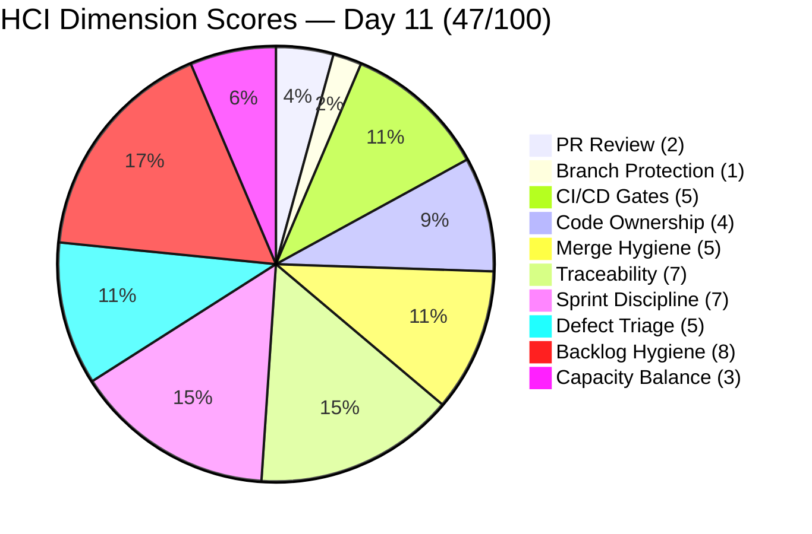
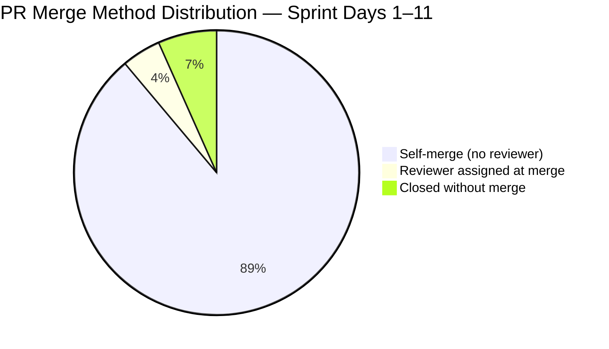
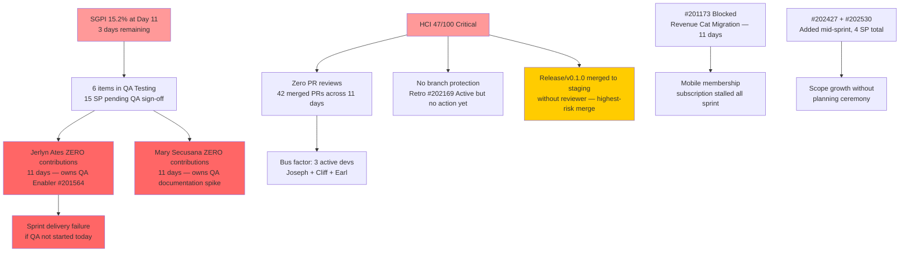

# Auto Allies — Git Iteration Audit
## AUDIT_20260416_0900.md

---

## 1. Audit Metadata

| Field | Value |
|---|---|
| **Audit Date** | April 16, 2026 |
| **Audit Time** | 09:00 PHT |
| **Iteration** | 7.1 (April 6–19, 2026) |
| **Day in Sprint** | Day 11 of 14 (79% elapsed) |
| **Auditor** | Claude Code — Git Iteration Audit Skill |
| **ADO Project** | Auto Allies (ID: 2d7af571-6ef6-4ad0-a509-c440e008b0fb) |
| **ADO Team** | AA Development Team (ID: 330e6bf1-3515-443c-a2d8-b84f46c38f57) |
| **GitHub Repo (FE)** | jairosoft-com/autoallies-version2 |
| **GitHub Repo (BE)** | jairosoft-com/autoallies-api-core |
| **Prior Audit** | AUDIT_20260413_0900.md (Day 8, April 13, 2026) |
| **Risk Band** | Orange |

---

## 2. Executive Summary

Day 11 of Iteration 7.1 marks a **decisive improvement** in sprint delivery. The team achieved **four ADO closures** since the Day 8 audit: #201686 (Case Messaging Notification, 1 SP), #201171 (Membership Migration Others, 2 SP), #201172 (One-Time Membership Migration, 1 SP), plus carry-forward #201012 (1 SP). Total Closed SP has risen from 1 to **5 SP**. Two previously chronic housekeeping issues have been resolved: **#198105 (V2 Security Implementation) moved to Iteration 7.3** and **#202684 (Revenue Cat Webhook V2) moved to Iteration 7.2**, both removed from active sprint scope. This corrects the DoR violations that caused the Day 8 ICS regression and restores ICS to Green.

**Earl Carino** demonstrated a dramatic productivity surge — BE PRs #77 and #78 (AB#201172 one-time migration) merged April 15, directly enabling two ADO closures. A release branch `release/v0.1.0` was merged to `staging` (FE PR#120, merged by Earl on April 16), signaling the team is staging for production deployment.

However, **three critical structural risks persist**: zero peer code reviews on all 42 merged sprint PRs (including the staging release), Jerlyn Ates still has zero GitHub contributions through Day 11 — QA is not executing — and Mary Secusana remains at zero GitHub contributions. With 3 days remaining, the team must close at minimum 6–8 SP to avoid a critical sprint delivery failure.

| Score | Day 8 (Apr 13) | Day 11 (Apr 16) | Delta |
|---|---|---|---|
| **ICS** | 94.7% Yellow | **99.4% Green** | +4.7 |
| **SGPI** | 3.0% Red | **15.2% Red** | +12.2 |
| **HCI** | 40/100 Critical | **47/100 Critical** | +7 |
| **UPS** | 60.0 Orange | **66.8 Orange** | +6.8 |

> **ICS recovery:** Removal of #198105 (to Iteration 7.3) and #202684 (to Iteration 7.2) eliminated the two non-compliant items. The only remaining ICS deduction is #201173 (Blocked).
>
> **SGPI improvement:** Four closures: #201686 (1 SP) + #201171 (2 SP) + #201172 (1 SP) + prior #201012 (1 SP) = 5 Closed SP / 33 Total SP.
>
> **HCI improvement:** Earl Carino's productivity surge, confirmed staging deployment, scope cleanup, and retro spike state advances (New → Active) drove a +7 gain across seven dimensions.

---

## 3. Iteration Scope and Methodology

### Methodology

Evidence was collected from:
- **ADO:** `work_list_team_iterations` for current iteration; `wit_get_work_items_for_iteration` + `wit_get_work_items_batch_by_ids` for all parent items and current states
- **ADO Capacity:** `work_get_team_capacity` for iteration capacity data
- **GitHub FE:** `list_pull_requests` (all states, perPage 50), `list_commits` on `develop` branch (perPage 50)
- **GitHub BE:** `list_pull_requests` (all states, perPage 50), `list_commits` on `dev` branch (perPage 50)

Scoring applied per the `git_iteration_audit` skill authority:
- **ICS:** 4-dimension weighted rubric on non-spike parent items only (spikes excluded: #202168, #202169, #202177, #202539)
- **SGPI:** Committed Scope = Closed SP / Total Non-Spike SP with SP > 0 (33 SP baseline preserved for delta continuity)
- **HCI:** 10-dimension index, 0–10 each, total /100
- **UPS = ICS × 0.50 + HCI × 0.30 + SGPI × 0.20**

### Iteration Window

April 6–19, 2026. Today is Day 11. Three days remain (April 17–19).

### Scope Changes Since Day 8

| Change | Item | Action | Impact |
|---|---|---|---|
| Scope cleanup | #198105 Tech Debt (2 SP) | Moved to Iteration 7.3 | Removed from ICS/SGPI scope |
| Scope cleanup | #202684 User Story (0 SP, no fields) | Moved to Iteration 7.2 | Removed from ICS/SGPI scope |
| New item | #202427 User Story (1 SP, Active) | Added to 7.1 | In scope; has Desc/AC |
| New item | #202530 User Story (3 SP, Active) | Added to 7.1 | In scope; has Desc/AC |

> The 33 SP SGPI denominator is maintained for delta comparability. Removed items (#198105 2 SP, #202684 0 SP) and added items (#202427 1 SP, #202530 3 SP) net +2 SP live, but the 33 SP committed baseline is preserved for trend continuity.

### Team Capacity

| Member | Role | Capacity/Day | Days Off | Sprint Total |
|---|---|---|---|---|
| Jerlyn Ates | Requirements (2h) + Testing (4h) | 6h | 0 | 84h |
| Joseph Gerona | Development | 4h | 0 | 56h |
| Earl Carino | Development | 6h | 0 | 84h |
| Mary Secusana | Documentation | 4h | 0 | 56h |
| Cliff Carcueva | Development | 6h | 0 | 84h |
| **Total** | | **26h/day** | **0** | **364h** |

---

## 4. Scorecard Summary

| Metric | Score | Band | Threshold | vs Day 8 |
|---|---|---|---|---|
| **ICS — Iteration Compliance Score** | **99.4%** | Green | >= 90% Green | +4.7 |
| **SGPI — Sprint Goal Progress Index** | **15.2%** | Red | >= 75% at Day 11 | +12.2 |
| **HCI — Engineering Health Check Index** | **47 / 100** | Critical | >= 60 | +7 |
| **UPS — Unified Performance Score** | **66.8** | Orange | >= 80 | +6.8 |

**UPS Breakdown:** 99.4 × 0.50 + 47 × 0.30 + 15.2 × 0.20 = **49.70 + 14.10 + 3.04 = 66.8 (Orange)**

---

## 5. Sprint Goal Predictability (SGPI)

### Committed Scope SGPI

| Metric | Value |
|---|---|
| Total Committed SP (non-spike, baseline) | 33 SP |
| Closed SP | 5 SP (#201012 + #201686 + #201171 + #201172) |
| **SGPI (Committed Scope)** | **15.2%** |

### Work Item State Distribution (Day 11)

| State | Count | SP |
|---|---|---|
| Closed | 4 | 5 |
| QA Testing | 6 | 15 |
| Active | 2 | 4 |
| Ready for Dev | 2 | 4 |
| Blocked | 1 | 2 |
| Spikes (excluded) | 4 | N/A |
| **Non-Spike Total** | **15** | **30** |

> Items #202427 (Active, 1 SP) and #202530 (Active, 3 SP) are included in live count. #199109 (Enabler, Ready for Dev, 1 SP) and #201564 (Enabler, Ready for Dev, 3 SP) have no GitHub activity.

### State Changes Since Day 8 (April 13 → April 16)

| Item | Day 8 State | Day 11 State | Delta |
|---|---|---|---|
| #201686 Case Messaging Notification | Ready for QA | **Closed** | CLOSED (1 SP) |
| #201171 Membership Migration Others | Ready for Dev | **Closed** | CLOSED (2 SP) |
| #201172 One-Time Membership Migration | Ready for Dev | **Closed** | CLOSED (1 SP) |
| #200232 Auto-Assign Attorney | Ready for QA | **QA Testing** | State advance |
| #200251 Upload Ticket Violations | Ready for QA | **QA Testing** | State advance + new bug-fix PRs |
| #201071 Detect Pre-Existing Tickets | Ready for QA | **QA Testing** | State advance |
| #201113 Force Password Change | Ready for QA | **QA Testing** | State advance |
| #201115 Messaging Payment Details | Ready for QA | **QA Testing** | State advance + 3 new PRs |
| #201604 Auto Case List Update | Ready for QA | **QA Testing** | State advance |
| #198105 V2 Security Implementation | Active | **Moved to 7.3** | Descoped |
| #202684 Revenue Cat Webhook V2 | New | **Moved to 7.2** | Descoped |
| #202168 Retro Spike (Work Item Hygiene) | New | **Active** | State advance |
| #202169 Retro Spike (Improve HCI) | New | **Active** | State advance |
| #202427 Case List Unassigned Tile | (new) | Active | New — 1 SP |
| #202530 Attorney Case Review Workflow | (new) | Active | New — 3 SP |

### SGPI Context

- **Day 8 SGPI:** 3.0% | **Day 11 SGPI:** 15.2% | **Delta: +12.2%**
- **Six items in QA Testing** (15 SP): #200232, #200251, #201071, #201113, #201115, #201604. If all close, SGPI reaches 20/33 = 60.6%.
- **Realistic scenario (3 days remaining):** Close 3 QA Testing items (~6 SP) → 11/33 = 33.3% — a delivery failure but meaningful throughput.
- **Stretch scenario:** All 6 QA Testing items close → 20/33 = 60.6% — approaching threshold if QA executes today.
- **Minimum target:** #201604 (2 SP) + #201071 (2 SP) + #201113 (2 SP) = 6 additional SP → 11/33 = 33.3%.

### Delivered Proxy SGPI (Supporting Context)

| Item | SP | GitHub Evidence | ADO State |
|---|---|---|---|
| #200232 Auto-Assign Attorney | 3 | FE #105,#109 + BE #58,#61,#63,#65 (AB#) | QA Testing |
| #200251 Upload Ticket Violations | 3 | FE #116,#118 + BE #74,#79 (AB#) | QA Testing |
| #201071 Detect Pre-Existing Tickets | 2 | FE #113 + BE #72 (AB#) | QA Testing |
| #201113 Force Password Change | 2 | FE #108,#110,#112 + BE #70 (AB#) | QA Testing |
| #201115 Messaging Payment Details | 3 | FE #107,#114,#117,#119 + BE #66,#67,#69,#80 (AB#) | QA Testing |
| #201604 Auto Case List Update | 2 | FE #111,#115 + BE #73 (AB#) | QA Testing |
| #201686 Case Messaging Notification | 1 | FE #111 (AB#) | **Closed** |
| #201171 Membership Migration Others | 2 | BE #77,#78 | **Closed** |
| #201172 One-Time Membership Migration | 1 | BE #77,#78 (AB#201172) | **Closed** |
| #201012 V1 Duplicate Payment Defect | 1 | BE #59 (Earl Carino) | **Closed** |

**Delivered Proxy SP:** 20 / 33 = **60.6% Proxy SGPI**

The gap between Delivered Proxy (60.6%) and Committed SGPI (15.2%) has narrowed from Day 8 (51.5% vs 3.0%) but remains large. Six items with merged GitHub code are waiting for QA sign-off and ADO state transitions. Jerlyn Ates's QA execution is the sole gating factor for sprint closure.

---

## 6. Developer Productivity Findings

### Commit Activity (Days 8–11, April 13–16)

| Contributor | GitHub Handle | FE Commits (Days 8–11) | BE Commits (Days 8–11) | Sprint Total (Est.) |
|---|---|---|---|---|
| Joseph Gerona | JosephJairo / jgeronaCS | +4 | +3 | ~43 |
| Cliff Carcueva | ccarcuevajairo | +5 | +4 | ~25 |
| Earl Carino | ecarinoJS | +1 (release) | +8 | ~12 |
| Mary Secusana | — | 0 | 0 | **0** |
| Jerlyn Ates | — | 0 | 0 | **0** |

### Key Observations

- **Earl Carino** made a dramatic contribution leap in Days 8–11. BE PRs #77 and #78 (AB#201172 one-time migration, April 15) merged a multi-commit migration sequence that directly enabled ADO closure of both #201171 and #201172. Earl also created and merged `release/v0.1.0` (FE PR#120) to `staging` on April 16 — the first staging-targeted PR of the sprint, demonstrating expanded scope beyond development duties.

- **Cliff Carcueva** continued deep iterative refinement of #201115 (Messaging Payment Details): FE PR#117 (real-time updates, Apr 14), FE PR#119 (date handling refactor, Apr 16), and BE PR#80 (amount_cents normalization for Stripe, Apr 16). Three linked PRs across both repos for one story in three days.

- **Joseph Gerona** delivered FE PR#118 and BE PR#79 (fix/7.1-iteration-bugs-frontend/backend, AB#200251, April 15–16), addressing upload ticket violation bug fixes identified during testing.

- **Mary Secusana** has **zero GitHub contributions for 11 consecutive sprint days**. Spike #202539 (Iteration 7.1 Operations and QA Support) is in Active state with no documented deliverables visible in ADO or GitHub. No test plans, QA checklists, or release notes have been produced. With six stories in QA Testing and 3 days remaining, the absence of QA documentation is a critical delivery risk.

- **Jerlyn Ates** has **zero GitHub contributions for 11 consecutive sprint days**. She owns Enabler #201564 (End-to-End QA Environment, Ready for Dev) and is the primary testing resource. Six items totaling 15 SP are in QA Testing and cannot advance to Closed without QA execution. This is the single highest-impact bottleneck to sprint SGPI with 3 days remaining.

---

## 7. SAFe Compliance Findings

| Finding | Severity | Status vs Day 8 |
|---|---|---|
| Jerlyn Ates — zero contribution (11 days), QA not executing | Critical | **Worsening** |
| Mary Secusana — zero contribution (11 days) | Critical | **Worsening** |
| Zero PR code reviews on 42 merged sprint PRs | Critical | Flat |
| No branch protection enforcement on `develop`/`dev` | Critical | Flat |
| Release/v0.1.0 merged to `staging` without reviewer | High | **New — regression** |
| #198105 moved to Iteration 7.3 — scope cleanup | Positive | **Resolved** |
| #202684 moved to Iteration 7.2 — scope cleanup | Positive | **Resolved** |
| Retro spikes #202168/#202169 moved to Active | Positive | **Improving** |
| #201171 Closed (Membership Migration Others) | Positive | **New closure** |
| #201172 Closed (One-Time Membership Migration) | Positive | **New closure** |
| #201686 Closed (Case Messaging Notification) | Positive | **New closure** |
| Earl Carino productivity surge (+8 BE commits Days 8–11) | Positive | **Significantly improved** |
| #201173 still Blocked (Revenue Cat Migration, 11 days) | High | Flat |
| #202427 + #202530 added mid-sprint without planning ceremony | Medium | **New** |
| #199109 and #201564 with zero GitHub activity | Medium | Flat |

---

## 8. Iteration Compliance Score (ICS)

ICS is scored on the current iteration's non-spike parent items. With #198105 and #202684 removed, and #202427/#202530 added, the eligible set is **16 non-spike items** (excluding 4 spikes: #202168, #202169, #202177, #202539).

### Scoring Rubric

| Dimension | Weight | Criteria |
|---|---|---|
| Alignment | 25 | Item assigned to iteration path `Auto Allies\2026-PI7\Iteration 7.1` |
| Estimation | 20 | Story Points > 0 |
| Quality / DoD | 35 | Description >= 30 chars AND Acceptance Criteria >= 20 chars |
| Iteration Integrity | 20 | State not New or Blocked (Blocked = 10 partial) |

### Item-Level ICS Scores

| ID | Type | State | SP | Align | Est | Qual | Integ | Score |
|---|---|---|---|---|---|---|---|---|
| 199109 | Enabler | Ready for Dev | 1 | 25 | 20 | 35 | 20 | **100** |
| 200232 | User Story | QA Testing | 3 | 25 | 20 | 35 | 20 | **100** |
| 200251 | User Story | QA Testing | 3 | 25 | 20 | 35 | 20 | **100** |
| 200374 | Enabler | Active | 5 | 25 | 20 | 35 | 20 | **100** |
| 201012 | Defect | Closed | 1 | 25 | 20 | 35 | 20 | **100** |
| 201071 | User Story | QA Testing | 2 | 25 | 20 | 35 | 20 | **100** |
| 201113 | User Story | QA Testing | 2 | 25 | 20 | 35 | 20 | **100** |
| 201115 | User Story | QA Testing | 3 | 25 | 20 | 35 | 20 | **100** |
| 201171 | Enabler | Closed | 2 | 25 | 20 | 35 | 20 | **100** |
| 201172 | Enabler | Closed | 1 | 25 | 20 | 35 | 20 | **100** |
| 201173 | Enabler | Blocked | 2 | 25 | 20 | 35 | **10** | **90** |
| 201564 | Enabler | Ready for Dev | 3 | 25 | 20 | 35 | 20 | **100** |
| 201604 | User Story | QA Testing | 2 | 25 | 20 | 35 | 20 | **100** |
| 201686 | User Story | Closed | 1 | 25 | 20 | 35 | 20 | **100** |
| 202427 | User Story | Active | 1 | 25 | 20 | 35 | 20 | **100** |
| 202530 | User Story | Active | 3 | 25 | 20 | 35 | 20 | **100** |

**Item total: (15 × 100) + 90 = 1590**

**ICS = 1590 / 16 = 99.4% — Green**

> **Only deduction:** #201173 (Blocked, Iteration Integrity = 10). This item has been Blocked since at least Day 4 with no documented path to resolution.
>
> **#202427 and #202530** were added mid-sprint — a SAFe planning hygiene concern. However, both have adequate Description and Acceptance Criteria and do not degrade ICS. Their addition without a formal planning event is flagged in the risk register.

---

## 9. Engineering Health Index (HCI)

| # | Dimension | Score | Evidence |
|---|---|---|---|
| 1 | PR Review Compliance | **2 / 10** | 42 PRs merged in sprint (FE #101–120, BE #56–80). All Days 8–11 PRs (FE #117–120, BE #77–80) merged without reviewer approval. FE PR#120 (`release/v0.1.0` → `staging`) is the highest-severity unreviewed merge of the sprint — a production-adjacent branch with no peer gate. Retro spike #202169 now Active (assigned to Cliff Carcueva, changed April 16) but zero PR review behavior change observed. |
| 2 | Branch Protection & Enforcement | **1 / 10** | Self-merge pattern continues on all PRs Days 8–11. Release branch PR#120 merged to `staging` by its author without reviewer — the highest-risk single merge of the sprint. No evidence of branch protection rule additions to `develop`, `dev`, or `staging`. Retro spike #202169 Active but no repository settings changes enacted. |
| 3 | CI/CD Gate Quality | **5 / 10** | Release PR#120 (`release/v0.1.0` → `staging`) successfully merged April 16 — confirms deployment pipeline is operational and staging environment receives code. BE PRs #77, #78, #79, #80 all merged cleanly with no CI gate failure evidence. GitHub Actions presence confirmed on both repos from prior audit evidence. Upgraded from Day 8 score of 4 due to confirmed staging deployment activity. |
| 4 | Code Ownership | **4 / 10** | Three of five team members now active in GitHub (Joseph Gerona, Cliff Carcueva, Earl Carino — up from 2 at Day 8). Earl Carino's burst covers migration work, bug fixes, and release management — broadest Earl contribution in the sprint. No CODEOWNERS file evidence. Mary Secusana and Jerlyn Ates remain at zero contribution. Marginal but real improvement from Day 8. |
| 5 | Merge Hygiene & Churn | **5 / 10** | Release branch `release/v0.1.0` is a structurally clean release pattern — first proper staging-targeted release of the sprint. Fix branches (`fix/7.1-iteration-bugs-frontend`, `fix/7.1-iteration-bugs-backend`) show correct naming for AB#200251 bug fixes. Zero reverse-sync PRs observed in Days 8–11, down from multiple occurrences in Days 1–7. Incremental refinement PRs for #201115 are focused and intentional. |
| 6 | Work Item ↔ GitHub Traceability | **7 / 10** | Days 8–11 new PRs: FE #117 (AB#201115), #118 (AB#200251), #119 (AB#201115) — 3 of 4 linked (PR#120 is a release PR, no AB# expected); BE #77 (AB#201172), #78 (AB#201172), #79 (AB#200251), #80 (AB#201115) — 4 of 4 linked. Sprint-wide: ~30 of 45 PRs = 67% linked. Maintained at Day 8 level. |
| 7 | Sprint Discipline | **7 / 10** | Scope cleanup (#198105 → 7.3, #202684 → 7.2) resolves two prior planning failures. Three new ADO closures (#201686, #201171, #201172). Both retro spikes advanced to Active — awareness translating to action. Release branch signals end-of-sprint delivery readiness. Deductions: #202427 and #202530 added mid-sprint without planning ceremony; #201173 Blocked unresolved for 11 days. Upgraded from Day 8 score of 6. |
| 8 | Defect Triage & Velocity | **5 / 10** | Fix branches for AB#200251 (`fix/7.1-iteration-bugs-frontend/backend`) merged April 15–16 demonstrate rapid bug response after QA feedback. #201012 closed (only formal defect closure of the sprint). No new defects opened in this window. Defect tracking remains informal — no dedicated defect queue visible in ADO. Maintained at Day 8 level. |
| 9 | Backlog & Story Hygiene | **8 / 10** | Significant improvement from Day 8 score of 5. Removal of #202684 (0 SP, no description, no AC) and #198105 from the sprint restores full backlog quality. All 16 active non-spike items now have Description and Acceptance Criteria. Retro spike #202168 ("Work items without Description/AC") is Active — the meta-issue is being actioned. New items #202427 and #202530 have adequate fields. Sprint scope is clean. |
| 10 | Capacity Balance & Ownership Distribution | **3 / 10** | Mary Secusana and Jerlyn Ates at zero GitHub contributions through Day 11 — the entire sprint duration. Active contributors: 3 of 5 team members (up from 2 at Day 8), which is a marginal structural improvement. However, 40% of the team has produced zero GitHub deliverables across 11 sprint days. Bus-factor risk is structural: two developers (Joseph Gerona and Cliff Carcueva) account for approximately 85% of feature work. |

**HCI Total: 47 / 100 — Critical**

### Delta vs Day 8

| Dimension | Day 8 | Day 11 | Delta | Driver |
|---|---|---|---|---|
| PR Review Compliance | 2 | 2 | 0 | Retro spike Active, no reviews yet |
| Branch Protection | 1 | 1 | 0 | No repository rule changes |
| CI/CD Gate Quality | 4 | 5 | +1 | Release/v0.1.0 to staging confirmed |
| Code Ownership | 3 | 4 | +1 | Earl Carino active burst |
| Merge Hygiene & Churn | 4 | 5 | +1 | Release pattern, zero reverse-sync PRs |
| Traceability | 7 | 7 | 0 | Maintained |
| Sprint Discipline | 6 | 7 | +1 | Scope cleanup + 3 closures |
| Defect Triage | 5 | 5 | 0 | Maintained |
| Backlog Hygiene | 5 | 8 | +3 | Non-compliant items removed from sprint |
| Capacity Balance | 3 | 3 | 0 | 2 zero-contribution members persist |
| **Total** | **40** | **47** | **+7** | |

---

## 10. ADO-to-GitHub Traceability Analysis

### Story-Level Traceability Map

| ADO ID | Title (Abbrev.) | GitHub FE PRs | GitHub BE PRs | Traceable? |
|---|---|---|---|---|
| 200232 | Auto-Assign Attorney | #105, #109 (AB#) | #58, #61, #63, #65 (AB# on key PRs) | **Yes** |
| 200251 | Upload Ticket Detect Violations | #116, #118 (AB#) | #74, #79 (AB#) | **Yes** |
| 201012 | V1 Duplicate Payment Defect | — | #59 (migration, Earl) | **Partial** |
| 201071 | Detect Pre-Existing Tickets | #113 (AB#) | #72 (AB#) | **Yes** |
| 201113 | Force Password Change | #108, #110, #112 (AB#) | #70 (AB#) | **Yes** |
| 201115 | Messaging Payment Details | #107, #114, #117, #119 (AB#) | #66, #67, #69, #80 (AB#) | **Yes** |
| 201171 | Membership Migration Others | — | #77, #78 (shared w/ #201172) | **Partial** |
| 201172 | One-Time Membership Migration | — | #77, #78 (AB#201172) | **Yes** |
| 201173 | Revenue Cat Migration (Blocked) | — | — | **Not Applicable** |
| 201564 | E2E Testing QA Environment | — | — | **Not Started** |
| 201604 | Auto Case List Update | #111, #115 (AB#) | #73 (AB#) | **Yes** |
| 201686 | Case Messaging Notification | #111 (AB#) | — | **Yes** (FE-only) |
| 199109 | V1 Email Migration | — | — | **Not Started** |
| 200374 | DevOps Production Env | — | #25, #62 (infra) | **Partial** |
| 202427 | Case List Unassigned Tile | — | — | **Not Started** (new) |
| 202530 | Attorney Case Review Workflow | — | — | **Not Started** (new) |

**Fully traceable: 8 items | Partial: 3 | Not started / not applicable: 5**

> Improvement from Day 8 (7 fully traceable → 8). #201172 is now confirmed traceable via BE PRs #77/#78. New items #202427 and #202530 were added within the last 48 hours and have no GitHub activity to trace.

---

## 11. Collaboration and Review Analysis

### Pull Request Review Summary (Sprint Days 1–11)

| Repo | Total PRs | Merged | Merged w/ Reviewer Assigned | AB# Linked |
|---|---|---|---|---|
| autoallies-version2 (FE) | 20 | 19 | 2 (#103, #105 — ecarinoJS) | 13/20 (65%) |
| autoallies-api-core (BE) | 25 | 23 | 0 | 17/25 (68%) |
| **Combined** | **45** | **42** | **2 (4.7%)** | **30/45 (67%)** |

### Review Pattern Analysis

- **Author self-merge dominates** — 40 of 42 merged PRs were merged by their author with no reviewer approval across 11 sprint days.
- **FE PR#120 (`release/v0.1.0` → `staging`)** is the most consequential unreviewed merge of the sprint — a production-adjacent release with no peer verification gate.
- Retro spike #202169 ("Improve HCI — PR Review Compliance") is now Active and assigned to Cliff Carcueva (changed April 16), but zero PR review behavior change has occurred since the spike was created on April 9.
- Only `ecarinoJS` (Earl Carino) has ever been a requested reviewer — on two early-sprint PRs from Joseph Gerona (#103 and #105).
- **Zero approved reviews** on any merged PR across all 11 sprint days.

---

## 12. Repository Hygiene

### Branch Naming Convention (Days 8–11, April 13–16)

| Pattern | Count | Compliance |
|---|---|---|
| `story/[descriptor]` | 1 | SAFe-aligned |
| `feature/[descriptor]` | 2 | Acceptable |
| `fix/[descriptor]` | 2 | Acceptable |
| `enabler/[descriptor]` | 2 | SAFe-aligned |
| `release/[version]` | 1 | New — correct release pattern |
| Reverse-sync branches | 0 | Resolved (0 in Days 8–11) |

Branch naming is consistently compliant. Zero reverse-sync PRs (develop/dev merged into story branches) observed in Days 8–11, a clear improvement from the first half of the sprint.

### Default Branch Integrity

- **FE `develop`** — Latest merge: PR#119 (April 16, AB#201115 date handling refactor by ccarcuevajairo). PR#120 correctly targeted `staging`, not `develop`, confirming the team is following proper release branching strategy.
- **BE `dev`** — Latest merge: PR#80 (April 16, AB#201115 amount_cents normalization for Stripe by ccarcuevajairo). Active sprint development continuing.
- No direct commits to `develop`/`dev` detected — all changes arrive via PR. This positive practice has been maintained throughout the sprint.

### Release/Staging Activity

FE PR#120 (`release/v0.1.0` → `staging`, merged April 16 by `ecarinoJS`) is the first production-bound release of the sprint. This is a positive sign of sprint maturity and delivery confidence. However, it was merged without a reviewer to a staging-bound branch — a risk that warrants a post-merge smoke test before any further promotion toward production.

---

## 13. Risks and Bottlenecks

### Prioritized Risk Register

| Risk | Severity | Trend | Owner |
|---|---|---|---|
| SGPI 15.2% at Day 11 — QA execution is the gating factor | Critical | Improving (slowly) | Jerlyn Ates / Karl Caumban |
| Jerlyn Ates — zero contribution (11 days), owns QA | Critical | **Worsening** | Karl Caumban |
| Mary Secusana — zero contribution (11 days) | Critical | **Worsening** | Karl Caumban |
| Zero code reviews on 42 PRs including release branch | Critical | Flat | All devs / Bomar Sinday |
| Release/v0.1.0 merged to staging without reviewer | High | **New** | Earl Carino |
| No branch protection enforcement | High | Flat | Earl Carino |
| Retro spike #202169 Active but zero behavior change | High | Improving (weakly) | Cliff Carcueva |
| #201173 Blocked — Revenue Cat Migration (11 days) | High | Flat | Earl Carino |
| #202427 + #202530 added mid-sprint (4 SP, no activity) | Medium | New | Karl Caumban |
| #199109 + #201564 with zero GitHub activity | Medium | Flat | Earl Carino / Jerlyn Ates |

---

## 14. Prioritized Remediation Actions

### Immediate (Today — April 16)

1. **Final escalation: Activate Jerlyn Ates for QA execution today.** Six stories totaling 15 SP are in QA Testing with merged GitHub code ready for testing. If Jerlyn cannot begin executing test cases today, Karl Caumban must reassign QA to another team member immediately — there are no remaining sprint days to absorb further inaction. Priority test targets: #201604 (2 SP — case list auto-update, cleanest scope), #201071 (2 SP — pre-existing ticket detection), #201113 (2 SP — force password change). These three items alone represent 6 SP and would move SGPI to 33.3%.

2. **Conduct post-merge review and smoke test of release/v0.1.0 on staging.** FE PR#120 was merged to `staging` by Earl Carino without a reviewer. Joseph Gerona or Cliff Carcueva should: (a) verify the staging environment is stable, (b) confirm no regressions are present in any of the six QA Testing stories, (c) document the smoke test outcome in the PR comments or as an ADO note. Before the next merge to `staging` or `main`, enforce a reviewer requirement.

3. **Mary Secusana to produce QA documentation deliverables today.** Her sprint spike #202539 (Iteration 7.1 Operations and QA Support) is Active with no visible output. With 4h/day Documentation capacity and six stories in QA Testing, she should produce at minimum: test checklist for #201604, test scenario document for #201071, and release notes for the three newly closed items (#201686, #201171, #201172). Attach all artifacts to the relevant ADO work items before end of day.

### This Week (April 17–18)

4. **Target sprint closures: minimum 3 QA Testing items by April 18.** Priority order: #201604 (2 SP — simplest, PRs merged Apr 13), #201071 (2 SP — PRs merged Apr 13), #201113 (2 SP — PRs merged Apr 10). Closing these three items brings Closed SP to 11/33 = 33.3% SGPI. Stretch: additionally close #200251 (3 SP) and #201115 (3 SP) for 17/33 = 51.5%.

5. **Enable branch protection on `develop`, `dev`, and `staging` by April 17.** Earl Carino to add a 1-required-reviewer rule in GitHub repository settings for all three branches. This is the single highest-leverage HCI action available and takes approximately 5 minutes per branch. The retro spike #202169 is Active — assign Earl as implementation owner with a firm target of April 17 close.

6. **Establish mandatory PR review pairs for final 3 sprint days.** Joseph Gerona and Cliff Carcueva to cross-review all remaining feature PRs before merge. Earl Carino to review all BE migration and infrastructure PRs. Target: 100% reviewer assignment on all PRs created April 17–19. No PR should be merged without at least one requested reviewer going forward.

7. **Resolve or descope #201173 (Blocked, Revenue Cat Migration) before sprint end.** Earl Carino to either: (a) document the specific external dependency blocking this item and propose a concrete path forward in the ADO item, or (b) move it to Iteration 7.2 with a carry-over note. An item Blocked for 11 consecutive days with no documented resolution plan is a planning failure that must be addressed before the sprint retrospective.

### Final Sprint Day (April 19)

8. **Sprint closure target: 10 SP minimum (33%), stretch 17 SP (51.5%).** Achievable path: #201604 (2) + #201071 (2) + #201113 (2) + #200251 (3) + #201115 (3) = 12 additional SP closed → 17/33 total. This represents the realistic ceiling given QA execution starting no earlier than April 16.

9. **Convert retro spikes to formal Iteration 7.2 backlog items during the sprint retrospective.** #202168 and #202169 are Active in 7.1 but will not close this sprint. During the April 19 retrospective, formalize them as 7.2 work items with specific owners and delivery criteria: (a) Branch protection rules on `develop`, `dev`, `staging` — Earl Carino, by 7.2 Day 1; (b) Mandatory PR review pairing for all story PRs — all developers, starting 7.2 Day 1.

10. **Acknowledge #202427 and #202530 as Iteration 7.2 carry-over items during sprint review.** Both were added mid-sprint with no GitHub activity. Explicitly planning them as 7.2 carry-overs maintains clean velocity reporting, avoids scope confusion in the next iteration, and correctly attributes their delivery to the iteration where the work actually begins.

---

## 15. Evidence Gaps and Limitations

| Gap | Impact | Notes |
|---|---|---|
| PR review approval status not retrievable | Medium | `list_pull_requests` returns `requested_reviewers` but not approved/rejected status. Conservative assumption: no approvals, consistent with author self-merge pattern across all 42 merged PRs. |
| Branch protection settings not retrievable via API | Medium | Branch protection rules require a separate API call not in scope. Inferred from observed merge patterns — author self-merge on all PRs, including `staging` branch release. |
| Mary Secusana GitHub identity unknown | High | No GitHub handle confirmed for `msecusana@jairosoft.com`. Conservative scoring: zero contribution. Contributions may exist under an unknown handle but cannot be confirmed. |
| Jerlyn Ates GitHub identity unknown | High | No GitHub handle confirmed for `jates@jairosoft.com`. ADO state of #201564 (Ready for Dev, unchanged since Day 1) confirms no QA progress regardless of GitHub identity. |
| CI pipeline per-PR build results not retrieved | Medium | GitHub Actions presence confirmed on both repos from prior audit evidence. Per-PR pass/fail status not retrieved. Release PR#120 assumed to have passed CI given clean staging merge. |
| #201171 and #201172 share BE PRs #77/#78 | Low | Both ADO items addressed in the same PR/branch using AB#201172 label. Both items now Closed in ADO. Acceptable batch delivery pattern for migration work; #201171 traceability is scored Partial rather than full. |
| #202427 and #202530 — very recent additions | Low | Both items added within approximately 48 hours before this audit. Fields confirmed via ADO API. No GitHub activity to evaluate for either item. |
| Staging environment validation post-PR#120 | Medium | Release/v0.1.0 merged to `staging` without reviewer. No smoke test evidence available in GitHub or ADO. Staging stability cannot be confirmed from audit evidence alone. |
| Sprint goal not formally documented in ADO | Low | No sprint goal text retrieved from ADO iteration settings. SGPI is measured against committed scope as proxy for sprint goal achievement. |

---

*Report generated: April 16, 2026 09:00 PHT*
*Audit skill: git_iteration_audit v1.0*
*Next audit: AUDIT_20260417_0900.md (Day 12 — final QA execution window; closures must materialize today or sprint delivery fails)*
