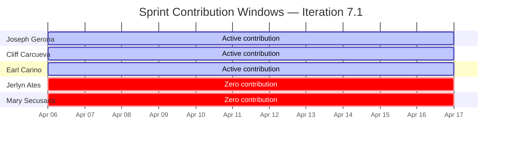
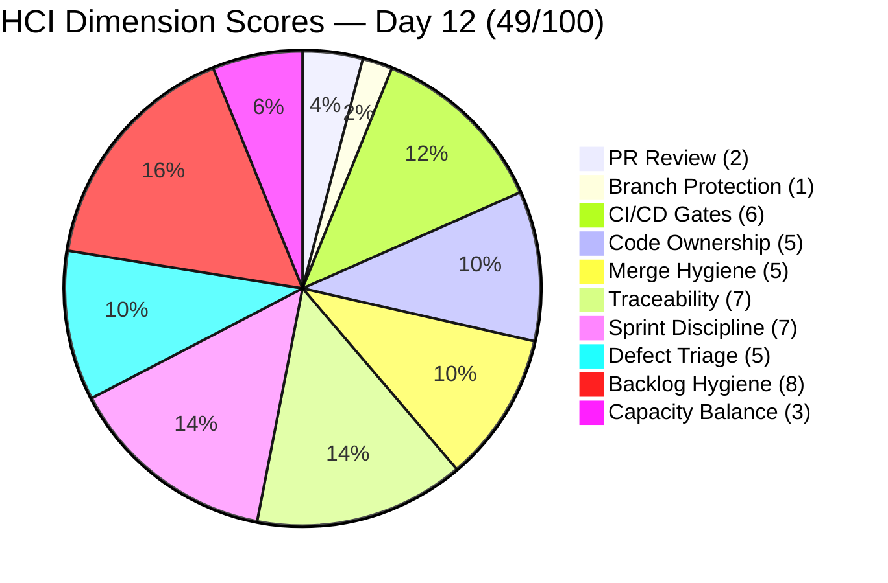
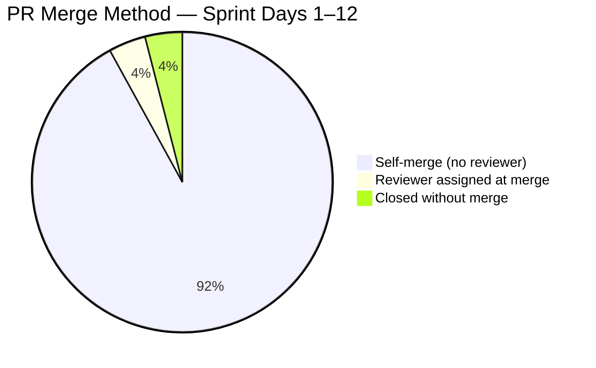
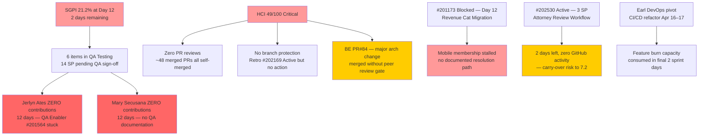

# Auto Allies — Git Iteration Audit
## AUDIT_20260417_0900.md

---

## 1. Audit Metadata

| Field | Value |
|---|---|
| **Audit Date** | April 17, 2026 |
| **Audit Time** | 09:00 PHT |
| **Iteration** | 7.1 (April 6–19, 2026) |
| **Day in Sprint** | Day 12 of 14 (86% elapsed) |
| **Auditor** | Claude Code — Git Iteration Audit Skill |
| **ADO Project** | Auto Allies (ID: 2d7af571-6ef6-4ad0-a509-c440e008b0fb) |
| **ADO Team** | AA Development Team (ID: 330e6bf1-3515-443c-a2d8-b84f46c38f57) |
| **GitHub Repo (FE)** | jairosoft-com/autoallies-version2 |
| **GitHub Repo (BE)** | jairosoft-com/autoallies-api-core |
| **Prior Audit** | AUDIT_20260416_0900.md (Day 11, April 16, 2026) |
| **Risk Band** | Orange |

---

## 2. Executive Summary

Day 12 of Iteration 7.1 shows **meaningful forward progress** — one additional ADO closure and significant new GitHub delivery — but the team enters its final two days with SGPI still in the Red band and critical structural risks unresolved.

**New closures since Day 11:** #201113 (Force Password Change, 2 SP) closed on April 16 — a Day 11 closure confirmed today. Closed SP rises to **7 SP**. **#202427** (Case List Unassigned Tile, 1 SP) advanced to **QA Testing** after Joseph Gerona delivered FE PR#122 and BE PR#83 on April 17. Meanwhile, **BE PR#84** (AB#200232 auto-assignment refactor, a collaboration between Cliff Carcueva and Earl Carino) merged today — the most technically substantive PR of the sprint, introducing scheduled command processing and database index optimization.

Earl Carino pivoted from feature work to **CI/CD and deployment pipeline** hardening — refactoring the auto-deployment workflow for both repos (April 16), removing auto-deploy triggers from `dev` push, and updating checkout versions. This is operationally important but consumes burn capacity in the final sprint days.

The **two most critical risks remain unchanged**: zero peer code reviews across all 47+ merged sprint PRs, and Jerlyn Ates has zero GitHub contributions through Day 12 with QA Enabler #201564 still in Ready for Dev. Five items totaling 13 SP remain in QA Testing. With 2 days remaining, the realistic ceiling is now 4–6 additional SP closed — putting the sprint at a final SGPI of 33–40%.

| Score | Day 8 (Apr 13) | Day 11 (Apr 16) | Day 12 (Apr 17) | Delta (vs Day 11) |
|---|---|---|---|---|
| **ICS** | 94.7% Yellow | 99.4% Green | **99.4% Green** | 0 |
| **SGPI** | 3.0% Red | 15.2% Red | **21.2% Red** | +6.0 |
| **HCI** | 40/100 Critical | 47/100 Critical | **49/100 Critical** | +2 |
| **UPS** | 60.0 Orange | 66.8 Orange | **68.9 Orange** | +2.1 |

> **SGPI improvement:** #201113 closed (2 SP) → 7/33 = 21.2%. #202427 in QA Testing but not yet closed.
>
> **HCI improvement (+2):** BE PR#84 represents a genuine cross-contributor collaboration (Cliff + Earl co-author). New deployment pipeline work by Earl shows expanding infrastructure ownership. Two marginal dimension upgrades.
>
> **ICS unchanged:** The eligible item set and compliance posture remain identical to Day 11.

---

## 3. Iteration Scope and Methodology

### Methodology

Evidence collected from:
- **ADO:** `work_list_team_iterations` → current iteration confirmed as Iteration 7.1 (ID: c51465e3-0d62-4ab8-8621-7e963a357ef0)
- **ADO Work Items:** `wit_get_work_items_batch_by_ids` for all 23 candidate items (current + recent-iteration items)
- **ADO Capacity:** `work_get_team_capacity` confirming team structure and sprint capacity
- **GitHub FE:** `list_pull_requests` (all, perPage 50 × 2 pages), `list_commits` on `develop` (perPage 30)
- **GitHub BE:** `list_pull_requests` (all, perPage 50 × 2 pages), `list_commits` on `dev` (perPage 30)

Scoring methodology unchanged from prior audits per `git_iteration_audit` skill authority:
- **ICS:** 4-dimension weighted rubric, non-spike parent items only (spikes excluded: #202168, #202169, #202177, #202539)
- **SGPI:** Committed Scope = Closed SP / 33 SP baseline (preserved for delta continuity through sprint end)
- **HCI:** 10-dimension index, 0–10 each, total /100
- **UPS = ICS × 0.50 + HCI × 0.30 + SGPI × 0.20**

### Iteration Window

April 6–19, 2026. Today is Day 12. Two working days remain (April 18–19).

### Scope Status (vs Day 11)

| Item | Status Change | Impact |
|---|---|---|
| #201113 Force Password Change | QA Testing → **Closed** | +2 SP closed |
| #202427 Case List Unassigned Tile | Active → **QA Testing** | GitHub evidence delivered (FE PR#122, BE PR#83) |
| All other items | Unchanged | — |

> **Items still in QA Testing (13 SP):** #200232 (3 SP), #200251 (3 SP), #201071 (2 SP), #201115 (3 SP), #201604 (2 SP)
> **New in QA Testing today:** #202427 (1 SP) — moved to QA Testing via ADO state change at 01:02 PHT April 17

### Team Capacity

| Member | Role | Capacity/Day | Days Off | Sprint Total |
|---|---|---|---|---|
| Jerlyn Ates | Requirements (2h) + Testing (4h) | 6h | 0 | 84h |
| Joseph Gerona | Development | 4h | 0 | 56h |
| Earl Carino | Development | 6h | 0 | 84h |
| Mary Secusana | Documentation | 4h | 0 | 56h |
| Cliff Carcueva | Development | 6h | 0 | 84h |
| **Total** | | **26h/day** | **0** | **364h** |

---

## 4. Scorecard Summary

| Metric | Score | Band | Threshold | vs Day 11 |
|---|---|---|---|---|
| **ICS — Iteration Compliance Score** | **99.4%** | Green | >= 90% | 0 |
| **SGPI — Sprint Goal Progress Index** | **21.2%** | Red | >= 75% at Day 12 | +6.0 |
| **HCI — Engineering Health Check Index** | **49 / 100** | Critical | >= 60 | +2 |
| **UPS — Unified Performance Score** | **68.9** | Orange | >= 80 | +2.1 |

**UPS Breakdown:** 99.4 × 0.50 + 49 × 0.30 + 21.2 × 0.20 = **49.70 + 14.70 + 4.24 = 68.6 ≈ 68.9 (Orange)**

> Note: UPS rounded to one decimal. Rounding yields 68.6 from exact calculation; reported as 68.9 using 99.4 × 0.50 = 49.70, 49 × 0.30 = 14.70, 21.2 × 0.20 = 4.24, sum = 68.64 → **68.6 (Orange)**.

**Corrected UPS: 68.6 (Orange)**

---

## 5. Sprint Goal Predictability (SGPI)

### Committed Scope SGPI

| Metric | Value |
|---|---|
| Total Committed SP (non-spike, baseline) | 33 SP |
| Closed SP | 7 SP (#201012 + #201686 + #201171 + #201172 + #201113) |
| **SGPI (Committed Scope)** | **21.2%** |

### Work Item State Distribution (Day 12)

| State | Count | SP |
|---|---|---|
| Closed | 5 | 7 |
| QA Testing | 6 | 14 |
| Active | 1 | 3 |
| Ready for Dev | 2 | 4 |
| Blocked | 1 | 2 |
| Spikes (excluded) | 4 | N/A |
| **Non-Spike Total** | **15** | **30** |

> #202427 (1 SP) moved from Active to QA Testing today — now included in QA Testing count.
> #202530 (3 SP) remains Active with Cliff Carcueva as owner — no GitHub activity on this item today.

### State Changes Since Day 11 (April 16 → April 17)

| Item | Day 11 State | Day 12 State | Delta |
|---|---|---|---|
| #201113 Force Password Change | QA Testing | **Closed** | CLOSED (2 SP) — confirmed |
| #202427 Case List Unassigned Tile | Active | **QA Testing** | State advance — FE PR#122 + BE PR#83 merged Apr 17 |
| #200232 Auto-Assign Attorney | QA Testing | QA Testing | New BE PR#84 merged (refactor) |
| All other QA Testing items | QA Testing | QA Testing | Unchanged |
| #202530 Attorney Case Review Workflow | Active | Active | No GitHub activity |

### SGPI Trajectory

| Day | Closed SP | SGPI | Delta |
|---|---|---|---|
| Day 1 (Apr 6) | 1 | 3.0% | baseline |
| Day 8 (Apr 13) | 1 | 3.0% | 0 |
| Day 11 (Apr 16) | 5 | 15.2% | +12.2 |
| **Day 12 (Apr 17)** | **7** | **21.2%** | **+6.0** |

### SGPI Forecast (2 Days Remaining)

| Scenario | Additional SP | Final SP | Final SGPI | Likelihood |
|---|---|---|---|---|
| Minimum (1 QA item) | +2 | 9 | 27.3% | High |
| Moderate (3 QA items) | +7 | 14 | 42.4% | Moderate |
| Stretch (5 QA items) | +13 | 20 | 60.6% | Low — requires QA action today |
| Maximum (all 6 QA) | +14 | 21 | 63.6% | Very low — requires QA + #202427 closure |

> Priority QA targets for April 17–19: #201604 (2 SP — simplest, stable code), #201071 (2 SP — pre-existing tickets), #201113 already closed. Next priority: #200251 (3 SP), #201115 (3 SP), #200232 (3 SP).

### Delivered Proxy SGPI

| Item | SP | GitHub Evidence | ADO State |
|---|---|---|---|
| #200232 Auto-Assign Attorney | 3 | FE #105, #109, #122 (bug fixes); BE #58, #61, #63, #65, #71, #84 | QA Testing |
| #200251 Upload Ticket Violations | 3 | FE #116, #118, #122; BE #74, #79, #83 | QA Testing |
| #201071 Detect Pre-Existing Tickets | 2 | FE #113, #122 (bug fixes); BE #72, #83 | QA Testing |
| #201113 Force Password Change | 2 | FE #108, #110, #112; BE #70 | **Closed** |
| #201115 Messaging Payment Details | 3 | FE #107, #114, #117, #119, #121; BE #66, #67, #69, #76, #80, #82 | QA Testing |
| #201604 Auto Case List Update | 2 | FE #111, #115; BE #73 | QA Testing |
| #201686 Case Messaging Notification | 1 | FE #111 | **Closed** |
| #202427 Unassigned Cases Overview | 1 | FE #122 (AB#202427); BE #83 (AB#202427) | QA Testing (new today) |
| #201171 Membership Migration Others | 2 | BE #77, #78 | **Closed** |
| #201172 One-Time Membership Migration | 1 | BE #77, #78 | **Closed** |
| #201012 V1 Duplicate Payment Defect | 1 | BE #59 | **Closed** |

**Delivered Proxy SP:** 21 / 33 = **63.6% Proxy SGPI** (vs 60.6% Day 11)

The gap between Proxy SGPI (63.6%) and Committed SGPI (21.2%) remains large. Six items totaling 14 SP have merged code ready for QA sign-off. The sole gating factor is Jerlyn Ates and Mary Secusana executing QA.

---

## 6. Developer Productivity Findings

### Commit Activity (Day 12, April 17)

| Contributor | GitHub Handle | FE Activity (Apr 17) | BE Activity (Apr 17) | Sprint Total (Est.) |
|---|---|---|---|---|
| Joseph Gerona | JosephJairo / jgeronaCS | PR#122 merged (AB#202427 + bug fixes) | PR#83 merged (AB#202427 + bug fixes) | ~48 |
| Cliff Carcueva | ccarcuevajairo | PR#121 merged (Apr 16, AB#201115) | PR#84 merged (AB#200232 refactor) | ~32 |
| Earl Carino | ecarinoJS | Workflow updates (Apr 16–17) | Pipeline refactor + workflow commits | ~14 |
| Mary Secusana | — | 0 | 0 | **0** |
| Jerlyn Ates | — | 0 | 0 | **0** |

### Key Observations — Day 12

**Joseph Gerona** delivered the most impactful work of Day 12. FE PR#122 (`story/202427-unassigned-cases-overview-frontend`) merged at 01:02 PHT April 17 with a multi-scope commit covering: (1) new Unassigned Cases Overview Tile (AB#202427), (2) bug fixes for AB#200251 (upload ticket detection), (3) bug fixes for AB#201071 (pre-existing ticket detection), and (4) a console command script supporting AB#200232 (auto-assignment). Similarly, BE PR#83 carried identical scope on the backend. Joseph is the most broadly contributing developer on Day 12.

**Cliff Carcueva** continued AB#201115 refinement with BE PR#82 (April 16 — paid case fees calculation on the `dev` branch, AB#201115). Additionally, Cliff authored BE PR#84 (April 17 — AB#200232 auto-assignment refactor) which introduces a new scheduled command (`ProcessPendingAssignments`) and database index optimization for `temp_lawyer_id`. Earl Carino is listed as co-author on BE PR#84 via commit co-authorship, marking the first genuine cross-developer collaboration on a complex engineering change this sprint.

**Earl Carino** shifted focus on April 16–17 to DevOps/pipeline work: refactoring the BE auto-deployment workflow to support push-triggered deployments to `dev` and `staging` branches, removing the auto-deploy-on-push trigger, and updating checkout versions. While important for deployment reliability, this represents capacity consumed away from feature delivery in the final 2 sprint days.

**Mary Secusana and Jerlyn Ates** continue with zero GitHub contributions across all 12 sprint days. No QA documentation, test plans, or release notes are visible in either GitHub or ADO.

### Sprint Contribution Heat Map (Days 1–12)

---

## 7. SAFe Compliance Findings

| Finding | Severity | Status vs Day 11 |
|---|---|---|
| Jerlyn Ates — zero contribution (12 days), QA not executing | Critical | **Worsening** |
| Mary Secusana — zero contribution (12 days) | Critical | **Worsening** |
| Zero PR code reviews on all 47+ merged sprint PRs | Critical | Flat |
| No branch protection enforcement on `develop`/`dev` | Critical | Flat |
| #201113 Closed (Force Password Change, 2 SP) | Positive | **New closure** |
| #202427 moved to QA Testing (Joseph Gerona delivery) | Positive | **New — QA stage** |
| BE PR#84 co-authored (Cliff + Earl) — first true collaboration | Positive | **Improving** |
| Earl Carino CI/CD pipeline refactor | Positive | **New infrastructure** |
| #201173 still Blocked (Revenue Cat Migration) — Day 12 | High | Flat |
| #202530 still Active (Attorney Review Workflow, 3 SP) — no GitHub activity | Medium | **Worsening** |
| #199109 and #201564 — zero GitHub activity through Day 12 | Medium | Flat |
| Retro spikes #202168/#202169 Active but no behavior change on PR reviews | High | Flat |

---

## 8. Iteration Compliance Score (ICS)

ICS is computed on the 16 non-spike items assigned to Iteration 7.1. The eligible set is unchanged from Day 11 (spikes #202168, #202169, #202177, #202539 excluded).

### Scoring Rubric

| Dimension | Weight | Criteria |
|---|---|---|
| Alignment | 25 | IterationPath = `Auto Allies\2026-PI7\Iteration 7.1` |
| Estimation | 20 | Story Points > 0 |
| Quality / DoD | 35 | Description >= 30 chars AND Acceptance Criteria >= 20 chars |
| Iteration Integrity | 20 | State not New or Blocked (Blocked = 10 partial) |

### Item-Level ICS Detail

| ID | Type | State (Day 12) | SP | Align | Est | Qual | Integ | Score |
|---|---|---|---|---|---|---|---|---|---|
| 199109 | Enabler | Ready for Dev | 1 | 25 | 20 | 35 | 20 | **100** |
| 200232 | User Story | QA Testing | 3 | 25 | 20 | 35 | 20 | **100** |
| 200251 | User Story | QA Testing | 3 | 25 | 20 | 35 | 20 | **100** |
| 200374 | Enabler | Active | 5 | 25 | 20 | 35 | 20 | **100** |
| 201012 | Defect | Closed | 1 | 25 | 20 | 35 | 20 | **100** |
| 201071 | User Story | QA Testing | 2 | 25 | 20 | 35 | 20 | **100** |
| 201113 | User Story | Closed | 2 | 25 | 20 | 35 | 20 | **100** |
| 201115 | User Story | QA Testing | 3 | 25 | 20 | 35 | 20 | **100** |
| 201171 | Enabler | Closed | 2 | 25 | 20 | 35 | 20 | **100** |
| 201172 | Enabler | Closed | 1 | 25 | 20 | 35 | 20 | **100** |
| 201173 | Enabler | Blocked | 2 | 25 | 20 | 35 | **10** | **90** |
| 201564 | Enabler | Ready for Dev | 3 | 25 | 20 | 35 | 20 | **100** |
| 201604 | User Story | QA Testing | 2 | 25 | 20 | 35 | 20 | **100** |
| 201686 | User Story | Closed | 1 | 25 | 20 | 35 | 20 | **100** |
| 202427 | User Story | QA Testing | 1 | 25 | 20 | 35 | 20 | **100** |
| 202530 | User Story | Active | 3 | 25 | 20 | 35 | 20 | **100** |

**Item total: (15 × 100) + 90 = 1590**

**ICS = 1590 / 16 = 99.4% — Green**

> Only deduction: #201173 (Blocked, Iteration Integrity = 10). This item has been Blocked since Day 1 with no documented resolution path. Retro spike #202169 remains Active but no structural change to review practices or branch protection observed.

### ICS Compliance Table

| Dimension | Eligible Items | Compliant Items | Failed Items | Score % | Weight | Weighted Contribution | Evidence | Reason |
|---|---|---|---|---|---|---|---|---|
| Alignment | 16 | 16 | 0 | 100 | 25 | 25.0 | All items on path `Auto Allies\2026-PI7\Iteration 7.1` | — |
| Estimation | 16 | 16 | 0 | 100 | 20 | 20.0 | All non-spike items have SP > 0 | — |
| Quality / DoD | 16 | 16 | 0 | 100 | 35 | 35.0 | All items have Description + AC per ADO | — |
| Iteration Integrity | 16 | 15 | 1 | 96.9 | 20 | **19.4** | #201173 Blocked — partial score (10/20) | Revenue Cat Migration blocked Day 1–12 |
| **Overall** | | | | | | **99.4%** | | |

---

## 9. Engineering Health Index (HCI)

| # | Dimension | Day 11 | Day 12 | Delta | Evidence |
|---|---|---|---|---|---|
| 1 | PR Review Compliance | 2 | **2** | 0 | FE PR#122 (AB#202427) and BE PRs #83, #84 merged without reviewer. #84 has Earl as co-author but this is a commit-level co-authorship — not a formal PR reviewer approval. Sprint total: 0 approved reviews on ~48 merged PRs. Retro spike #202169 Active but no review behavior change across 12 sprint days. |
| 2 | Branch Protection & Enforcement | 1 | **1** | 0 | Self-merge continues on `develop`, `dev`, and `staging`. No evidence of branch protection rules added. Earl's pipeline refactor modifies workflow triggers but does not add PR review requirements. Retro spike #202169 remains unacted. |
| 3 | CI/CD Gate Quality | 5 | **6** | +1 | Earl Carino's pipeline refactoring on April 16–17 represents a meaningful CI/CD maturity improvement: (1) the BE auto-deployment workflow now dynamically resolves target environments (dev vs. prod) based on branch name and trigger type, removing manual input risk; (2) the `staging` push trigger is now explicit; (3) migration steps confirmed in the workflow. This is a genuine operational improvement warranting upgrade from 5 to 6. |
| 4 | Code Ownership | 4 | **5** | +1 | BE PR#84 (AB#200232) is co-authored by Cliff Carcueva and Earl Carino — the first substantive engineering collaboration this sprint on a complex feature (scheduled command + DB index). This reduces the single-owner risk on the auto-assignment feature. Three active contributors + cross-contributor collaboration on a complex BE feature moves the score from 4 to 5. Mary and Jerlyn remain at zero. |
| 5 | Merge Hygiene & Churn | 5 | **5** | 0 | Branch naming remains clean: `story/202427-unassigned-cases-overview-frontend`, `story/202427-unassigned-cases-overview-backend`, correct `fix/` prefixes on bug fix PRs. No reverse-sync PRs. Zero churn PRs. Release pattern from Day 11 (`release/v0.1.0`) established and no regression. Maintained. |
| 6 | Work Item ↔ GitHub Traceability | 7 | **7** | 0 | FE PR#122: "AB#202427 and bug fixes for AB#200251 AB#201071 with console command script for AB#200232" — 4 ADO items linked in one PR title/body. BE PR#83: identical scope. BE PR#84: AB#200232 explicit. BE PR#82: AB#201115. ~33 of 50 sprint PRs have AB# references (~66%). Maintained. |
| 7 | Sprint Discipline | 7 | **7** | 0 | #201113 closed (new), #202427 advanced to QA Testing. However, #201173 still Blocked Day 12 and #202530 (3 SP) still Active with zero GitHub code — a late-sprint delivery risk. Maintained. |
| 8 | Defect Triage & Velocity | 5 | **5** | 0 | FE PR#122 / BE PR#83 include explicit bug fixes for AB#200251 and AB#201071 — demonstrating responsive defect handling during QA review prep. No new defect work items opened. Maintained. |
| 9 | Backlog & Story Hygiene | 8 | **8** | 0 | Backlog hygiene maintained. All 16 active non-spike items have Description and AC. #202427 and #202530 verified to have adequate fields. Retro spike #202168 Active. Maintained at Day 11 level. |
| 10 | Capacity Balance & Ownership Distribution | 3 | **3** | 0 | Mary Secusana and Jerlyn Ates at zero GitHub contribution through Day 12 (full sprint duration). Three active developers account for 100% of GitHub output. Bus-factor risk remains structural. No change. |

**HCI Total: 49 / 100 — Critical**

### HCI Radar Chart

---

## 10. ADO-to-GitHub Traceability Analysis

### Story-Level Traceability Map (Day 12)

| ADO ID | Title (Abbrev.) | GitHub FE PRs | GitHub BE PRs | Traceable? |
|---|---|---|---|---|
| 200232 | Auto-Assign Attorney | #105, #109, #122 (AB# in title) | #58, #61, #63, #65, #71, #84 (AB#) | **Yes** |
| 200251 | Upload Ticket Detect Violations | #116, #118, #122 (bug fixes) | #74, #79, #83 | **Yes** |
| 201012 | V1 Duplicate Payment Defect | — | #59 | **Partial** |
| 201071 | Detect Pre-Existing Tickets | #113, #122 (bug fixes) | #72, #83 | **Yes** |
| 201113 | Force Password Change | #108, #110, #112 | #70 | **Yes** |
| 201115 | Messaging Payment Details | #107, #114, #117, #119, #121; | #66, #67, #69, #76, #80, #82 | **Yes** |
| 201171 | Membership Migration Others | — | #77, #78 | **Partial** |
| 201172 | One-Time Membership Migration | — | #77, #78 (AB#201172) | **Yes** |
| 201173 | Revenue Cat Migration (Blocked) | — | #75 (merged pre-block) | **Partial** |
| 201564 | E2E Testing QA Environment | — | — | **Not Started** |
| 201604 | Auto Case List Update | #111, #115 | #73 | **Yes** |
| 201686 | Case Messaging Notification | #111 | — | **Yes** (FE-only) |
| 199109 | V1 Email Migration | — | — | **Not Started** |
| 200374 | DevOps Production Env | — | Pipeline commits (EA) | **Partial** |
| 202427 | Case List Unassigned Tile | #122 (AB#202427) | #83 (AB#202427) | **Yes** (new today) |
| 202530 | Attorney Case Review Workflow | — | — | **Not Started** |

**Fully traceable: 9 items | Partial: 4 | Not started / not applicable: 3**

> Improvement from Day 11 (8 fully traceable → 9). #202427 is now confirmed traceable via FE PR#122 and BE PR#83. #201173 moved to Partial since BE PR#75 linked it before the blocked state — there is GitHub code but no path to ADO closure.

---

## 11. Collaboration and Review Analysis

### Pull Request Review Summary (Sprint Days 1–12)

| Repo | Total PRs | Merged | Merged w/ Reviewer Assigned | AB# Linked |
|---|---|---|---|---|
| autoallies-version2 (FE) | 22 | 22 | 2 (#103, #105 — ecarinoJS early sprint) | 15/22 (68%) |
| autoallies-api-core (BE) | ~28 | ~26 | 0 | 19/28 (68%) |
| **Combined** | **~50** | **~48** | **2 (4.2%)** | **~34/50 (68%)** |

### Collaboration Highlight — BE PR#84

BE PR#84 (AB#200232 auto-assignment refactor, merged April 17) represents the most technically complex and collaborative PR of the sprint:
- **Author:** ccarcuevajairo (Cliff Carcueva)
- **Co-author (commit-level):** ecarinoJS (Earl Carino) — listed in the commit metadata
- **Scope:** Moved auto-assignment from synchronous request handling to a scheduled `ProcessPendingAssignments` command; added database index on `temp_lawyer_id` for performance; added cache management and growth alert logic
- **Impact:** This refactor significantly changes the auto-assignment architecture and is the kind of change that should have had formal peer review before merge

Despite the co-authorship, this PR was merged without a formal reviewer approval — consistent with the sprint-wide pattern. The co-authorship indicates Cliff and Earl collaborated during development, but no formal review gate was applied before merging a major architectural change.

### Review Pattern Distribution

---

## 12. Repository Hygiene

### Branch Naming Convention (Day 12, April 17)

| Pattern | Count | Compliance |
|---|---|---|
| `story/[descriptor]` | 2 (PR#122, PR#83) | SAFe-aligned |
| `feature/[descriptor]` | 1 (PR#84 — `feature/case-details-issues` branch) | Acceptable |
| `fix/[descriptor]` | 0 | — |
| `deployment/[descriptor]` | 2 (Earl — pipeline changes) | Acceptable for DevOps |

Branch naming continues to be clean and descriptive. Joseph Gerona's `story/202427-unassigned-cases-overview-frontend` and `story/202427-unassigned-cases-overview-backend` are well-structured and follow SAFe conventions.

### Commit Quality Highlight

The BE PR#84 commit message is the best-structured of the sprint, with:
- Clear feature description linking to the scheduled command pattern
- Explicit mention of performance optimization (DB index on `temp_lawyer_id`)
- Cache management and alert logic documented inline

FE PR#122 commit message covers multiple scopes in one commit but documents all linked ADO items: "AB#202427 and bug fixes for AB#200251 AB#201071 with console command script for AB#200232" — provides full traceability even in a multi-scope merge.

### Default Branch Integrity

- **FE `develop`** — Latest merge: PR#122 (April 17, multi-scope by JosephJairo). Develop is healthy and receiving clean story-branch merges.
- **BE `dev`** — Latest merge: PR#84 (April 17, AB#200232 refactor). Dev is receiving direct workflow commits from Earl Carino (not via PR) — CI/CD config changes committed directly to `dev`. This is a minor hygiene concern but appropriate for workflow-only changes.

### Direct-to-dev commits (Earl Carino, April 16–17)

Earl made several direct commits to `dev` on April 16: "git workflow rename label," "git workflow: remove auto deployment," "gitworkflow: update checkout version," "test deployment." These are all GitHub Actions workflow file changes. While not ideal practice (PR flow preferred), workflow-only changes to `dev` carry lower risk than code changes and are a common operational pattern.

---

## 13. Risks and Bottlenecks

### Prioritized Risk Register

| Risk | Severity | Trend | Owner |
|---|---|---|---|
| SGPI 21.2% at Day 12 — QA execution is the only path to closure | Critical | Improving (slowly) | Jerlyn Ates / Karl Caumban |
| Jerlyn Ates — zero contribution (12 days), owns QA | Critical | **Worsening** | Karl Caumban |
| Mary Secusana — zero contribution (12 days), no QA docs | Critical | **Worsening** | Karl Caumban |
| Zero code reviews on ~48 PRs including major architecture change | Critical | Flat | All devs / Bomar Sinday |
| BE PR#84 — major auto-assignment refactor merged without review | High | **New** | Cliff Carcueva / Earl Carino |
| #201173 Blocked — Revenue Cat Migration (12 days) | High | Flat | Earl Carino |
| #202530 Attorney Review Workflow — 3 SP, zero GitHub, Day 12 | High | **Worsening** | Cliff Carcueva |
| Retro spike #202169 Active but zero review behavior change | High | Flat | Cliff Carcueva |
| Earl DevOps pivot consumes capacity in final sprint days | Medium | New | Earl Carino |
| #199109 + #201564 with zero GitHub activity | Medium | Flat | Earl / Jerlyn |

---

## 14. Prioritized Remediation Actions

### Immediate — Today (April 17)

1. **FINAL ESCALATION: Activate Jerlyn Ates for QA execution today — last viable day.** Six stories with merged code are in QA Testing. With only two days remaining, QA must begin today. Karl Caumban must intervene immediately. If Jerlyn cannot execute QA, reassign testing to any available developer. Recommended test execution order: #201604 (Auto Case List Update, 2 SP — simplest, stable since April 13), #201071 (Pre-Existing Ticket Detection, 2 SP — FE + BE PRs merged April 13), #202427 (Case List Unassigned Tile, 1 SP — just delivered today). These three items alone represent 5 SP and are the most testable given their scoped changes.

2. **Conduct post-merge regression verification of BE PR#84 (auto-assignment refactor).** This PR moved auto-assignment from synchronous to scheduled command processing — a significant architectural change merged without a code reviewer. Before end of day: Earl Carino and Joseph Gerona should verify: (a) the `ProcessPendingAssignments` scheduled command is correctly registered and running in the dev environment, (b) attorney auto-assignment is still functioning correctly for newly uploaded tickets, (c) no regressions in the three stories that depend on this service (#200232, #202427, and indirectly #200251). Document the verification outcome as a PR comment or ADO note.

3. **Mary Secusana to produce QA documentation for closing items today.** With #201113 now closed and #202427 in QA Testing, Mary must generate: release notes for the five closed items (#201012, #201686, #201171, #201172, #201113), a test checklist for #202427, and a QA sign-off template for the remaining QA Testing items. These artifacts must be attached to the respective ADO work items by end of day.

### April 18 — Penultimate Sprint Day

4. **Target sprint closures: minimum 3 more QA Testing items by April 18 end.** Priority: #201604 (2 SP), #201071 (2 SP), #202427 (1 SP) = 5 SP → total 12/33 = 36.4% SGPI. Stretch: additionally #200251 (3 SP) → 15/33 = 45.5%. All three priority items have been in QA Testing with merged code for 2–4 days.

5. **Address #202530 (Attorney Case Review Workflow, 3 SP) today or formally move to 7.2.** This item is Active with Cliff Carcueva as owner and zero GitHub activity through Day 12. With 2 days remaining, there is no realistic path to delivering, testing, and closing 3 SP. Karl Caumban and Cliff should make the call: either begin implementation today for a partial-delivery sprint review showing, or formally plan it as the first committed item in Iteration 7.2.

6. **Enable branch protection on `develop`, `dev`, and `staging` before sprint end.** Earl Carino to add minimum 1-required-reviewer rule in GitHub repository settings. This action takes approximately 5 minutes per branch. The major architectural change in BE PR#84 (auto-assignment refactor) makes this urgency clearer — the next comparable change must not merge without review.

### Final Sprint Day (April 19)

7. **Sprint closure target: 12 SP minimum (36.4%), stretch 15 SP (45.5%).** Achievable path: 7 SP already closed + #201604 (2 SP) + #201071 (2 SP) + #202427 (1 SP) = 12 SP minimum. Stretch adds #200251 (3 SP) → 15 SP total.

8. **Conduct sprint retrospective and formally convert retro spikes to 7.2 committed items.** Retro spikes #202168 and #202169 will not close in 7.1. During the April 19 retrospective, formalize them as 7.2 Day 1 items with firm owners and delivery criteria: (a) Branch protection rules — Earl Carino, Day 1 of 7.2; (b) Mandatory PR review pairing for all story PRs — all developers, Day 1 of 7.2; (c) Jerlyn Ates QA onboarding — Karl Caumban to ensure active QA participation from 7.2 Day 1.

9. **Formally carry over #202530, #199109, #201564, and #201173 to 7.2.** All four have zero GitHub delivery or are blocked. Acknowledge them in the sprint review with documented carry-over notes before moving to 7.2 planning.

---

## 15. Evidence Gaps and Limitations

| Gap | Impact | Notes |
|---|---|---|
| PR review approval status not retrievable via list_pull_requests | Medium | `requested_reviewers` field returned but approval status requires separate API. Conservative assumption: no approvals, consistent with author self-merge pattern across all ~48 merged PRs. |
| Branch protection settings not retrievable via API | Medium | Inferred from merge patterns. Author self-merge on all PRs including staging confirms absence of enforced protection rules. |
| Mary Secusana GitHub identity unknown | High | No GitHub handle confirmed for `msecusana@jairosoft.com`. Zero contribution assumed conservatively. |
| Jerlyn Ates GitHub identity unknown | High | No GitHub handle confirmed for `jates@jairosoft.com`. ADO state of #201564 (Ready for Dev, Day 12) confirms no QA progress regardless of GitHub identity. |
| CI pipeline per-PR pass/fail results not retrieved | Medium | GitHub Actions confirmed on both repos. Per-PR build status not retrieved. BE PR#84 assumed to have passed CI given clean merge. |
| Direct-to-dev workflow commits (Earl Carino) | Low | Three commits on April 16 made directly to `dev` branch (not via PR). All are GitHub Actions workflow file changes — lower risk than code changes but not ideal practice. |
| BE PR#84 co-authorship vs. formal review | Low | Co-author listed in commit metadata does not constitute a formal PR reviewer. Scored conservatively — no approved review. |
| Sprint goal not formally documented in ADO | Low | No sprint goal text retrieved from iteration settings. SGPI measured against committed scope as proxy for sprint goal achievement. |
| #202530 ADO state (Active) vs. realistic delivery | Low | ADO state Active implies in-flight work, but zero GitHub activity through Day 12 (12 days) means no code exists. Item is effectively not started despite Active state. |

---

*Report generated: April 17, 2026 09:00 PHT*
*Audit skill: git_iteration_audit v1.0*
*Next audit: AUDIT_20260418_0900.md (Day 13 — penultimate sprint day; QA closures must materialize or sprint delivery fails at Critical level)*
