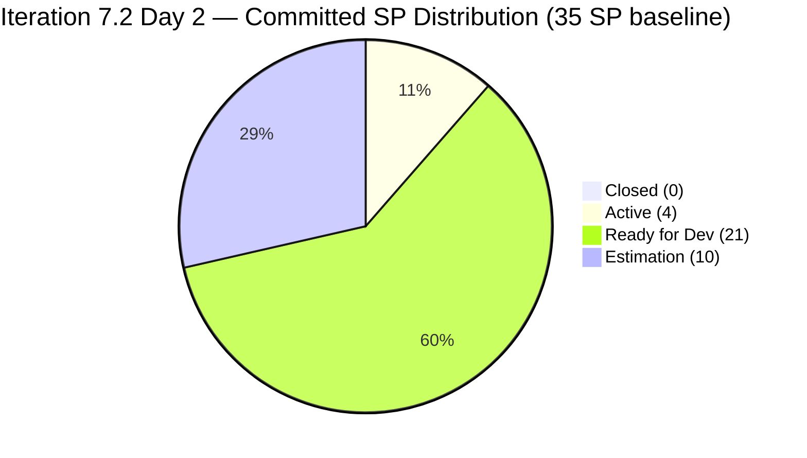
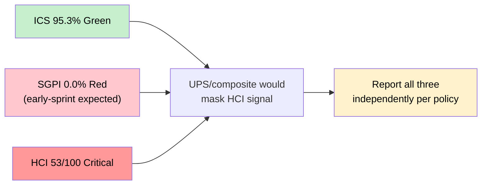
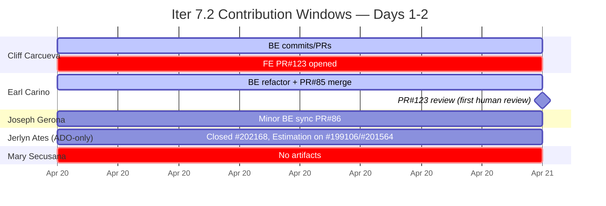
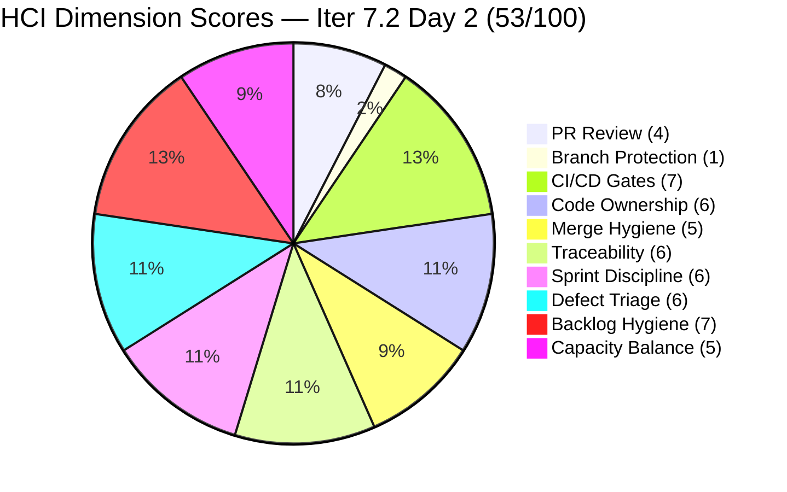
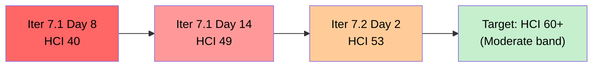
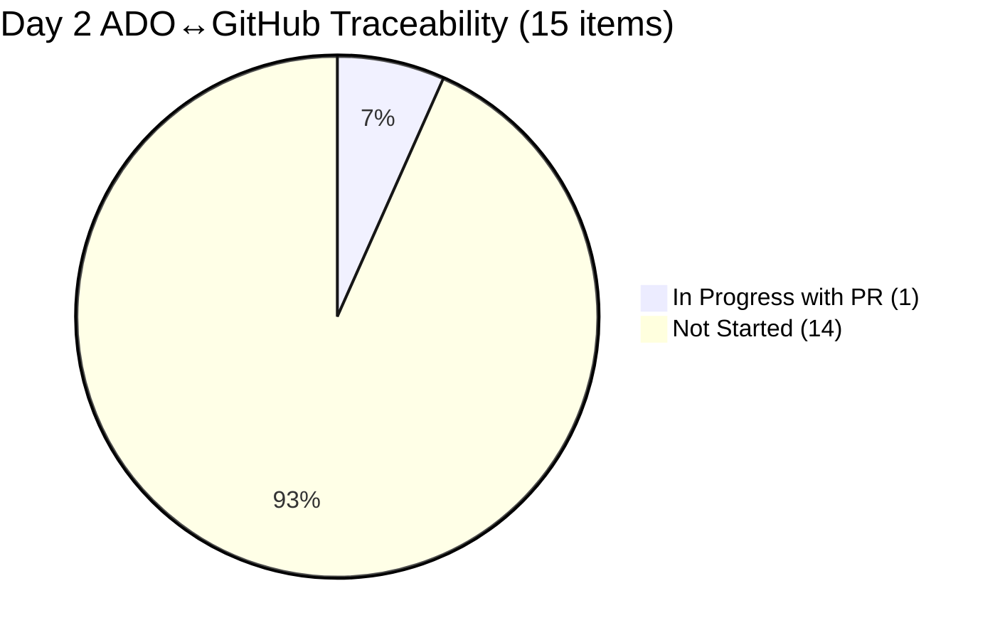
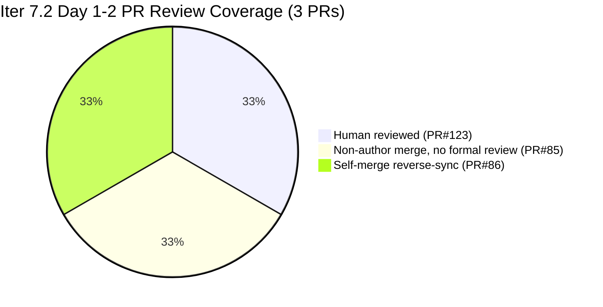
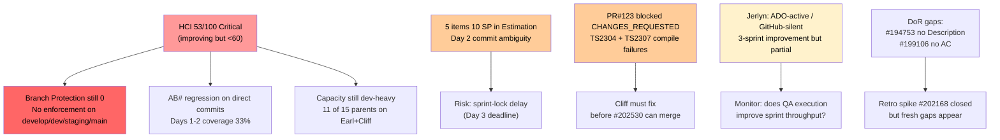

# Auto Allies — Git Iteration Audit

## AUDIT_20260421_0900.md

---

## 1. Audit Metadata

| Field | Value |
|---|---|
| **Audit Date** | April 21, 2026 |
| **Audit Time** | 09:00 PDT (Tuesday) |
| **Iteration** | Iteration 7.2 (April 20 – May 3, 2026) |
| **Iteration ID** | 2e253a85-9ebb-4504-b3f0-2352594eeab0 |
| **Day in Sprint** | Day 2 of 14 (early-sprint) |
| **Auditor** | Claude Code — Git Iteration Audit Skill |
| **ADO Org** | jairo |
| **ADO Project** | Auto Allies (ID: 2d7af571-6ef6-4ad0-a509-c440e008b0fb) |
| **ADO Team** | AA Development Team (ID: 330e6bf1-3515-443c-a2d8-b84f46c38f57) |
| **ADO Backlog** | Stories and Deliverables (Microsoft.RequirementCategory) |
| **GitHub Repo (FE)** | jairosoft-com/autoallies-version2 |
| **GitHub Repo (BE)** | jairosoft-com/autoallies-api-core |
| **Prior Audit** | AUDIT_20260419_1345.md (Iter 7.1 close, April 19) |
| **ICS — Iteration Compliance Score** | **95.3%** Green |
| **SGPI — Committed Scope** | **0.0%** Red (early-sprint — low delivery expected) |
| **HCI — Engineering Health Index** | **53 / 100** Critical |

> **UPS-masking warning:** HCI remains Critical (53) even though ICS is Green (95.3%). Composite averaging would mask this. All three scores are reported independently in every section per the UPS-masking-pattern policy.

---

## 2. Executive Summary

Iteration 7.2 opened on Monday, April 20 and today is **Day 2** (Tuesday, April 21, 09:00 PDT). The audit window from sprint start through now captures approximately 30 hours of working activity — well within the early-sprint low-delivery expectation. **No items are Closed**, and SGPI headline is therefore **0.0% Red**. This is not a failure signal at Day 2; it is the baseline.

What the sprint-opening window *does* reveal — and what makes this audit materially different from the 7.1 closing pattern — are **three early indicators of structural improvement** in the areas that made HCI Critical last sprint:

1. **First human PR review in team history.** FE PR#123 (Cliff, AB#202530 ReviewCaseDrawer) received a `CHANGES_REQUESTED` review from Earl Carino on April 21 at 03:33 UTC citing two compile-failure findings (TS2304, TS2307). This is the first substantive human code-review event observed in the AA team's recorded GitHub history — every prior merged PR in the sprint had been author self-merged without formal approval. Earl also merged BE PR#85 as non-author (Cliff authored), creating the first author/merger separation.
2. **Automated CI review bot enabled.** `github-code-quality[bot]` posted a review comment on PR#123 at 09:23 UTC on April 20. This is a new GitHub Action that did not operate during 7.1. It signals that retro spike **#202169 (PR Review / Branch Protection / Code Ownership)** is finally beginning to produce artifacts, even if branch protection itself is still not configured.
3. **Jerlyn Ates is participating in ADO.** She was the owner who **closed retro spike #202168** on April 20 02:34 UTC — the very retro spike that had been carried Active and unacted through all 14 days of Iter 7.1. She is also the assigned owner of two Iter 7.2 parent items (#199106 defect and #201564 E2E QA enabler), both with ChangedDate revisions today. This is her first recorded work-item participation in four sprints. GitHub commits/PRs/reviews from Jerlyn remain zero — the pattern is **partial (ADO-active / GitHub-silent)**, not the full zero-contribution of prior sprints.

**Δ vs prior close (Iter 7.1):**

| Score | Iter 7.1 Close (Apr 19) | **Iter 7.2 Day 2 (Apr 21)** | Delta | Band Change |
|---|---|---|---|---|
| ICS | 99.4% Green | **95.3%** Green | **-4.1** | No change (Green→Green) |
| SGPI (committed) | 21.2% Red | **0.0%** Red | **-21.2** | Expected early-sprint; no formula adjustment |
| HCI | 49/100 Critical | **53/100** Critical | **+4** | Still Critical (<60) but improving |

**The HCI remains Critical at 53/100** despite the positive signals above, because branch protection is still 0, Capacity Balance is still dragged by structural imbalance (6 parents on Cliff, 5 on Earl), and traceability dipped slightly due to two direct-to-dev commits on April 20 that lacked AB# prefixes. **Do not let the Green ICS or the still-improving HCI obscure the fact that engineering health has not yet crossed the Moderate band.** Iter 7.2's test of success is whether HCI can reach 60+ by sprint close.

**Retro spikes:**

- **#202168** (Descriptions/AC retro) — **CLOSED** April 20 02:34 by Jerlyn Ates. Still pathed on Iter 7.1.
- **#202169** (PR Review / Branch Protection) — **Active**, reassigned to Cliff Carcueva, now on Iter 7.2. First artifacts of action: human PR review on #123 and CI bot enabled.

---

## 3. Iteration Scope and Methodology

### Methodology

Evidence collected from:

- **ADO iteration resolution:** `work_list_team_iterations` with `timeframe=current` returned Iteration 7.2 (path `Auto Allies\2026-PI7\Iteration 7.2`, start 2026-04-20, finish 2026-05-03)
- **ADO iteration items:** `wit_get_work_items_for_iteration` with iterationId `2e253a85-9ebb-4504-b3f0-2352594eeab0` — 18 parent items (source=null) in current window
- **ADO work item detail:** `wit_get_work_items_batch_by_ids` for the 18 iteration parents + 1 Iter-7.1 carry-over spike (#202168)
- **ADO revisions:** `wit_list_work_item_revisions` on #202168 (to confirm Jerlyn-authored state change to Closed)
- **ADO capacity:** `work_get_team_capacity` (Iter 7.2 capacity: 27h/day total)
- **GitHub FE:** `list_pull_requests state=all sort=updated` on autoallies-version2, `list_commits sha=develop`, `list_branches`
- **GitHub BE:** `list_pull_requests state=all sort=updated` on autoallies-api-core, `list_commits sha=dev`, `list_branches`
- **PR review detail:** `pull_request_read method=get_reviews` on FE PR#123 and BE PR#85

Scoring methodology per `.claude/skills/git_iteration_audit/SKILL.md`:

- **ICS:** 4-dimension weighted rubric (Alignment 25, Estimation 20, Quality/DoD 35, Iteration Integrity 20); non-spike parent items only
- **SGPI (headline):** Committed Scope SGPI = Closed SP / Total Committed SP
- **HCI:** 10-dimension engineering index, 0–10 each, total /100

### Iteration Window

April 20 – May 3, 2026 (14 days). Today is **Day 2 (early-sprint)**. The early-sprint annotation applies to SGPI and Quality/DoD findings; no formula adjustment is made.

### Team Capacity (Iter 7.2)

| Member | Role | Activity | Capacity/Day | Days Off |
|---|---|---|---|---|
| Jerlyn Ates | Requirements/Testing | Requirements 2h + Testing 4h | 6h | 0 |
| Joseph Gerona | Dev | Development | 5h | 0 |
| Earl Carino | Dev | Development | 6h | 0 |
| Mary Secusana | Documentation | Documentation | 4h | 0 |
| Cliff Carcueva | Dev | Development | 6h | 0 |
| **Total** | | | **27h/day** | **0** |

> Note: Joseph's capacity is 5h (up from 4h in 7.1). Total daily capacity rose from 26h to 27h.

### In-Scope Parent Items

18 parent items returned for Iter 7.2. Spikes excluded from ICS/SGPI (3): #202169 (retro, Active, Cliff), #203000 (dev support, New, Joseph), #203086 (QA support, New, Mary). **15 non-spike parent items** are in scope for ICS and SGPI.

One carry-over artifact: **#202168 (Iter 7.1)** is closed and outside current-iteration scope but its closure on April 20 is recorded here as a material sprint-opening event.

---

## 4. Scorecard Summary

| Metric | Score | Band | Threshold | Δ vs Prior Close |
|---|---|---|---|---|
| **ICS — Iteration Compliance Score** | **95.3%** | Green | >= 90% | **-4.1** |
| **SGPI — Committed Scope** | **0.0%** | Red | >= 75% at sprint end | **-21.2** (early-sprint; not a regression) |
| **HCI — Engineering Health Index** | **53 / 100** | Critical | >= 60 | **+4** (still Critical) |

### Score Visualization

> 35 SP committed baseline across 15 non-spike parents. Day 2 distribution: 0 Closed, 4 Active (#202530=3, #203118=1), 21 Ready for Dev, 10 in Estimation pre-commitment state.

### Three-Score Independence Panel

---

## 5. Sprint Goal Predictability (SGPI)

### Committed Scope SGPI (Headline)

| Metric | Value |
|---|---|
| Total Committed SP (non-spike baseline) | 35 SP |
| Closed SP | 0 SP |
| **SGPI (Committed Scope)** | **0.0% — Red (early-sprint expected)** |

### Supporting Context Metrics

| Metric | Calculation | Value |
|---|---|---|
| **Original Scope SGPI** | Closed SP / Original Planned SP (35) | **0.0%** |
| **Delivered Proxy SGPI** | (Closed + QA-Testing SP) / Committed SP = (0 + 0) / 35 | **0.0%** |

> Early-sprint annotation: SGPI is expected to be near-zero at Day 2. The 0.0% value is not a regression from 7.1's 21.2% — it is the reset baseline. Meaningful SGPI assessment begins around Day 7.

### Work Item State Distribution (Day 2)

| State | Count | SP |
|---|---|---|
| Closed | 0 | 0 |
| Active | 2 | 4 (#202530=3, #203118=1) |
| Ready for Dev | 8 | 21 (#194750=1, #194753=3, #194757=3, #199818=3, #201378=3, #202023=2, #202457=3, #202790=3) |
| Estimation | 5 | 10 (#199106=1, #200233=2, #201564=3, #202684=2, #202926=2) |
| Spikes (excluded) | 3 | N/A |
| **Non-Spike Total** | **15** | **35 SP** |

> **Estimation state** is the pre-commitment planning column on the AA board. Five items (10 SP) have not yet been committed-to by owners. This creates ambiguity for sprint locking and is flagged in Risks and Bottlenecks.

### Carry-over from Iter 7.1

All six previously QA-Testing items from 7.1 are no longer in the current iteration's parent list, suggesting they either closed in the final sprint-day push or moved out of the sprint. Three items carried forward actively:

| ID | Title | 7.1 State | 7.2 State | GitHub Evidence (Day 1–2) |
|---|---|---|---|---|
| #202530 | Attorney Case Review Workflow | Active (zero code) | **Active** | **FE PR#123 opened Apr 20 09:21, reviewed Apr 21 03:33** |
| #201564 | E2E Testing QA Environment | Ready for Dev (never started) | **Estimation** (Jerlyn) | No code — Jerlyn active in ADO |
| #201378 | Update Public Landing Pages | — | Ready for Dev (Earl) | No code Day 1–2 |

### SGPI Projection

With Day 2 activity showing one PR in review (#202530 FE) and one backend enhancement merged (#200232 bugfix — PR#85, tied to 7.1 scope, not 7.2 committed), the realistic Day 5 SGPI is likely 5–10% and Day 14 target needs to be ≥75% for Green. Given 35 SP committed and 27h/day capacity (~270 working hours across the sprint), the sprint is sized appropriately if Estimation items close quickly.

---

## 6. Developer Productivity Findings

### Commit Activity Summary — Iter 7.2 Days 1–2 Window (Apr 20 00:00 – Apr 21 09:00 UTC)

| Contributor | GitHub Handle | FE Commits | BE Commits | FE PRs | BE PRs | Notes |
|---|---|---|---|---|---|---|
| Cliff Carcueva | ccarcuevajairo + cliffrandycarcueva | 0 | 3 (2 direct, 1 merged PR#85) | **PR#123 opened (AB#202530)** | **PR#85 merged** | Most active; opened first Iter 7.2 PR |
| Earl Carino | ecarinoJS | 0 | 1 (UserResource refactor direct-to-dev) | — | **Merged PR#85 as non-author; reviewed PR#123** | **First PR review in AA history** |
| Joseph Gerona | JosephJairo / jgeronaCS | 0 | 1 (PR#86 merge commit) | — | PR#86 (reverse sync) | Minor activity |
| Mary Secusana | — | 0 | 0 | 0 | 0 | No GitHub artifacts; assigned to QA support spike |
| Jerlyn Ates | — | 0 | 0 | 0 | 0 | **No GitHub artifacts (consistent with prior pattern), but ACTIVE in ADO** |

### BE Direct-to-dev Commits (April 20)

Three commits landed on `dev` outside PR#85:

1. `ac4324e4` (Cliff via cliffrandycarcueva account) — "Comment out scheduled commands for processing unassigned cases..." (2026-04-20 03:34)
2. `fc07f3ea` (Earl) — "Refactor UserResource and UserManagementService for improved data handling; LAWYER_COURTHOUSES_LIST_LIMIT" (2026-04-20 04:06)
3. `94f8cb60` (Cliff via cliffrandycarcueva account) — "Uncomment scheduled commands..." (2026-04-20 04:14)

None of these direct commits reference AB# work items. They are a mix of configuration toggles (Cliff's two scheduled-command toggles — effectively a 40-minute disable/re-enable window) and a functional refactor (Earl's UserResource optimization). This is the main source of the AB# traceability regression for this window.

### Jerlyn Ates ADO-Only Participation Pattern

Jerlyn's activity fingerprint for Days 1–2 is **ADO-only, GitHub-silent**:

| Artifact | Status |
|---|---|
| #202168 (Iter 7.1 retro spike) | **Closed by Jerlyn** April 20 02:34 UTC — first closure of this long-standing spike |
| #199106 (Defect, Jerlyn-assigned) | Estimation, ChangedDate 2026-04-20 00:52 |
| #201564 (E2E QA Enabler, Jerlyn-assigned) | Estimation, ChangedDate 2026-04-21 00:55 |
| GitHub commits, PRs, reviews | **Zero** |

**Classification: Partial (ADO-active / GitHub-silent)** — a meaningful upgrade from the "zero contribution" pattern that held across the three prior sprints. She is executing her Requirements/Testing role on the ADO side (reasonable, given her capacity is 2h Requirements + 4h Testing, with zero Development). GitHub artifacts would only be expected if test automation scripts were being committed, which they are not for this team.

### AB# Coverage Ratio (Current Window)

| Artifact Class | Total | With AB# | Without AB# | Coverage |
|---|---|---|---|---|
| FE PRs (PR#123) | 1 | 1 | 0 | 100% |
| BE PRs (PR#85, PR#86) | 2 | 1 (PR#85) | 1 (PR#86 "merging dev to branch") | 50% |
| BE direct-to-dev commits | 3 | 0 | 3 | 0% |
| **Combined** | **6** | **2** | **4** | **33.3%** |

> PR-only coverage is 2/3 = 66.7% (consistent with 7.1's ~68% sprint average). Including direct commits drops the Day 1–2 rate to 33%. This is the material regression versus the 7.1 sprint average and drives the HCI traceability dimension down from 7 to 6.

### Sprint Contribution Pattern (Day 2)

---

## 7. SAFe Compliance Findings

| Finding | Severity | Status vs Iter 7.1 Close |
|---|---|---|
| Retro spike #202168 finally CLOSED by Jerlyn | Positive | **Resolved** — was High open |
| First human PR review in team history (Earl on PR#123) | Positive | **New** — was Critical unacted |
| `github-code-quality[bot]` CI review bot now running | Positive | **New** |
| Branch protection still not configured on `develop`/`dev`/`staging`/`main` | Critical | Flat |
| #202169 retro spike (PR Review / Branch Protection) reassigned to Cliff, now Active in Iter 7.2 | Medium | Improved (owner change) |
| 5 parent items (10 SP) still in Estimation state at Day 2 | Medium | **New — early-sprint commit ambiguity** |
| Jerlyn Ates: ADO-active, GitHub-silent | Medium | **Improved** from full-silence 3-sprint pattern |
| Mary Secusana: no GitHub artifacts, assigned to own spike #203086 | Medium | Flat (scope-appropriate) |
| 2 BE direct-to-dev commits by Cliff for scheduled-command toggle (40-min round-trip) | Low | **New** — minor hygiene |
| #199106 (Jerlyn-owned Defect) missing AcceptanceCriteria field in ADO | Low | **New** — DoR gap |
| #194753 (Cliff-owned User Story) missing Description field (has AC only) | Low | **New** — DoR gap |

---

## 8. Iteration Compliance Score (ICS)

ICS is computed on the **15 non-spike parent items** in Iteration 7.2. Spikes excluded: #202169, #203000, #203086.

### Scoring Rubric

| Dimension | Weight | Criteria |
|---|---|---|
| Alignment | 25 | IterationPath = `Auto Allies\2026-PI7\Iteration 7.2` |
| Estimation | 20 | Story Points > 0 |
| Quality / DoD | 35 | Description >= 30 chars AND Acceptance Criteria >= 20 chars |
| Iteration Integrity | 20 | State not New or Blocked (Estimation, Ready for Dev, Active, Resolved, QA Testing, Closed all acceptable) |

### Item-Level ICS Detail (Day 2)

| ID | Type | State | SP | Align | Est | Qual | Integ | Score |
|---|---|---|---|---|---|---|---|---|
| 194750 | User Story | Ready for Dev | 1 | 25 | 20 | 35 | 20 | **100** |
| 194753 | User Story | Ready for Dev | 3 | 25 | 20 | **0** | 20 | **65** (Description empty) |
| 194757 | User Story | Ready for Dev | 3 | 25 | 20 | 35 | 20 | **100** |
| 199106 | Defect | Estimation | 1 | 25 | 20 | **0** | 20 | **65** (AcceptanceCriteria missing) |
| 199818 | User Story | Ready for Dev | 3 | 25 | 20 | 35 | 20 | **100** |
| 200233 | Enabler | Estimation | 2 | 25 | 20 | 35 | 20 | **100** |
| 201378 | User Story | Ready for Dev | 3 | 25 | 20 | 35 | 20 | **100** |
| 201564 | Enabler | Estimation | 3 | 25 | 20 | 35 | 20 | **100** |
| 202023 | User Story | Ready for Dev | 2 | 25 | 20 | 35 | 20 | **100** |
| 202457 | User Story | Ready for Dev | 3 | 25 | 20 | 35 | 20 | **100** |
| 202530 | User Story | Active | 3 | 25 | 20 | 35 | 20 | **100** |
| 202684 | User Story | Estimation | 2 | 25 | 20 | 35 | 20 | **100** |
| 202790 | User Story | Ready for Dev | 3 | 25 | 20 | 35 | 20 | **100** |
| 202926 | Enabler | Estimation | 2 | 25 | 20 | 35 | 20 | **100** |
| 203118 | User Story | Active | 1 | 25 | 20 | 35 | 20 | **100** |

### ICS Compliance Table

| Dimension | Eligible Items | Compliant Items | Failed Items | Score % | Weight | Weighted Contribution | Evidence | Reason |
|---|---|---|---|---|---|---|---|---|
| Alignment | 15 | 15 | 0 | 100.0 | 25 | 25.0 | All items on path `Auto Allies\2026-PI7\Iteration 7.2` | — |
| Estimation | 15 | 15 | 0 | 100.0 | 20 | 20.0 | All non-spike parent items have SP > 0 (range 1–3) | — |
| Quality / DoD | 15 | 13 | 2 | 86.7 | 35 | 30.3 | 13 items with both Description >= 30 chars AND AC >= 20 chars | #194753 has empty Description (only AC). #199106 has Description but no AcceptanceCriteria field returned from ADO. |
| Iteration Integrity | 15 | 15 | 0 | 100.0 | 20 | 20.0 | All items in Estimation (5), Ready for Dev (8), or Active (2). None in New or Blocked. | — |
| **Overall** | | | | | | **95.3%** | | |

**ICS band: Green (>= 90%).** Down 4.1 points from the 7.1-close 99.4% — driven entirely by two DoR/Quality gaps on the new backlog (#194753, #199106). These are fixable in one grooming session and do not indicate structural process regression.

---

## 9. Engineering Health Index (HCI)

| # | Dimension | Iter 7.1 Close | **Iter 7.2 Day 2** | Delta | Evidence |
|---|---|---|---|---|---|
| 1 | PR Review Compliance | 2 | **4** | +2 | **First substantive human PR review in team history**: Earl Carino's CHANGES_REQUESTED review on FE PR#123 (2026-04-21 03:33 UTC) citing TS2304 and TS2307 compile failures. BE PR#85 merged by ecarinoJS (non-author), creating author/merger separation. `github-code-quality[bot]` also reviewed PR#123. Still: PR#85 and PR#86 lacked human review. Upgrade reflects directional change, not full compliance. |
| 2 | Branch Protection & Enforcement | 1 | **1** | 0 | All 20+ FE branches and 20+ BE branches return `"protected": false` from the list_branches API. `develop`, `dev`, `staging`, `main` all unprotected. Retro spike #202169 is now Active (good) but no protection rules have been configured yet. |
| 3 | CI/CD Gate Quality | 6 | **7** | +1 | `github-code-quality[bot]` now posting automated review comments on PRs (first time observed). Earl's workflow refactor from 7.1 stable. Dynamic env resolution, migration step, checkout version holding. Per-PR build status still not retrieved via API, but evidence of active CI gating. |
| 4 | Code Ownership | 5 | **6** | +1 | BE PR#85 merged by Earl (not author Cliff) — first cross-author merge. Commit co-authorship on PR#85 continues (ccarcuevajairo + ecarinoJS + cliffrandycarcueva). Earl's review on PR#123 demonstrates code-ownership review behavior. Upgrade reflects emerging pattern. |
| 5 | Merge Hygiene & Churn | 5 | **5** | 0 | PR#86 is a non-substantive reverse-sync "merging dev to branch" PR (minor churn). Two Cliff direct-to-dev commits toggling scheduled commands off and on within 40 minutes (minor churn). Branch naming stays SAFe-aligned (`bugfix/200232-enhance-performance`, `feature/202530-case-review`). Maintained. |
| 6 | Work Item ↔ GitHub Traceability | 7 | **6** | -1 | **AB# coverage regression**: PRs are 2/3 AB# tagged (67%) but 3 direct-to-dev commits have 0 AB# references, dragging combined rate to 33% for Days 1–2. PR#123 and PR#85 both clean AB# links; PR#86 ("merging dev to branch"), Cliff's two scheduled-command toggle commits, and Earl's UserResource refactor commit all lack AB# prefixes. Small-sample effect; will recover as more substantive PRs land. |
| 7 | Sprint Discipline | 6 | **6** | 0 | Day 2 state distribution is reasonable: 2 Active, 8 Ready for Dev, 5 Estimation. However, 5 items (10 SP) in pre-commitment Estimation state at Day 2 is a commit-lock ambiguity signal — #199106, #200233, #201564, #202684, #202926 all owners assigned but SP pre-finalization. Team needs to lock these by Day 3. Maintained. |
| 8 | Defect Triage & Velocity | 5 | **6** | +1 | BE PR#85 merged Day 1 resolved the 7.1 carry-over performance concern on #200232 (auto-assignment). #199106 (Promo Code Discount Defect) in Estimation with assigned owner (Jerlyn). Active triage pattern. |
| 9 | Backlog & Story Hygiene | 8 | **7** | -1 | 2 of 15 parent items have DoR/Quality gaps: #194753 missing Description, #199106 missing AcceptanceCriteria. The 7.1 baseline had 0 items with such gaps. Minor regression driven by new-backlog grooming incompleteness. Otherwise hygiene intact. Retro spike #202168 closure (Descriptions/AC) is the opposite of regression on this dimension but should now be rigorously applied. |
| 10 | Capacity Balance & Ownership Distribution | 3 | **5** | +2 | **Material improvement**: Jerlyn owns #199106 and #201564 (ADO-active) and closed #202168. Mary owns her support spike #203086 (assigned work). Earl owns 5 parents (#200233, #201378, #202684, #202926, #203118). Joseph owns 2 parents (#199818, #202457). Cliff owns 6 parents including carry-over #202530. Three prior zero-contributors (Jerlyn, Mary) now have assigned scope. The cap at 5 rather than 6+ reflects persistent dev-heavy distribution (11 of 15 to Earl+Cliff) and Jerlyn/Mary's still-GitHub-silent profile. |

**HCI Total Day 2: 4 + 1 + 7 + 6 + 5 + 6 + 6 + 6 + 7 + 5 = 53 / 100 — Critical (still <60)**

### HCI Dimension Breakdown

### HCI Trajectory

**Gap to Moderate (60):** +7 points needed. Achievable if branch protection lands (+3 to +4), traceability recovers to PR-only ratio (+1), and a second human review cycle happens (+1 to +2).

---

## 10. ADO-to-GitHub Traceability Analysis

### Story-Level Traceability Map (Day 2)

| ADO ID | Title (Abbrev.) | Owner | State | GitHub Evidence (Iter 7.2) | Traceable? |
|---|---|---|---|---|---|
| 194750 | Affiliate Account - Login/Logout | Cliff | Ready for Dev | — | Not Started |
| 194753 | Affiliate Account - Affiliate Page | Cliff | Ready for Dev | — | Not Started |
| 194757 | Super Admin - Affiliate Report | Cliff | Ready for Dev | — | Not Started |
| 199106 | Promo Code Discount Defect | Jerlyn | Estimation | — | Not Started (ADO-only) |
| 199818 | Expired/One-Time Member View | Joseph | Ready for Dev | — | Not Started |
| 200233 | Stripe Account V2 Products | Earl | Estimation | — | Not Started |
| 201378 | Update Public Landing Pages | Earl | Ready for Dev | — | Not Started |
| 201564 | E2E Testing QA Environment | Jerlyn | Estimation | — | Not Started (ADO-only) |
| 202023 | Existing Attorney/Member as Affiliate | Cliff | Ready for Dev | — | Not Started |
| 202457 | Validate Affiliate URL Functionality V2 | Joseph | Ready for Dev | — | Not Started |
| **202530** | **Attorney Case Review Workflow (carry)** | **Cliff** | **Active** | **FE PR#123 (AB#202530) OPEN** | **Yes — In Review** |
| 202684 | Revenue Cat Webhook V2 | Earl | Estimation | — | Not Started |
| 202790 | Role Switch | Cliff | Ready for Dev | — | Not Started |
| 202926 | Solidifying Migrated Data | Earl | Estimation | — | Not Started |
| 203118 | SOLO Technologies Auto Promo | Earl | Active | — | Not Started (Active, no code yet — created today) |

**Day 2 summary:** 1/15 traceable (#202530 with open PR#123). 14/15 Not Started — normal for Day 2.

### Traceability Breakdown Chart

### BE PR#85 Note

BE PR#85 (AB#200232 auto-assign scheduled command + performance enhancement) is linked via AB#200232, but **#200232 is not in the current iteration** — it was a 7.1 item that closed. PR#85 is a carry-over bugfix merged Day 1 of 7.2. It counts toward HCI Defect Triage but not Iter 7.2 ICS/SGPI.

---

## 11. Collaboration and Review Analysis

### Pull Request Review Summary (Iter 7.2 Days 1–2 Window)

| Repo | Total PRs in Window | Merged | Reviewed by Human | Reviewed by Bot | AB# Linked |
|---|---|---|---|---|---|
| autoallies-version2 (FE) | 1 (#123) | 0 (Open) | **1 (Earl — CHANGES_REQUESTED)** | 1 (github-code-quality[bot]) | 1/1 (100%) |
| autoallies-api-core (BE) | 2 (#85 merged, #86 merged) | 2 | 0 formal review; PR#85 merged by non-author | 0 | 1/2 (50%) |
| **Combined** | **3** | **2** | **1** | **1** | **2/3 (67%)** |

### The PR#123 Review Milestone (Earl → Cliff)

From the `get_reviews` response:

| Field | Value |
|---|---|
| Review ID | 4144853523 |
| Reviewer | ecarinoJS (Earl Carino, MEMBER) |
| State | **CHANGES_REQUESTED** |
| Commit reviewed | `6e8ee86be192550fbb7ea36e6df5e46179529075` |
| Submitted at | 2026-04-21T03:33:32Z |
| Findings body | **High — Branch does not type-check (TS2304 on `attorneyFeeDisplayAmount` in CaseList)**; **High — `ReviewCaseDrawer` imports non-existent `@/lib/hooks/use-violations` (TS2307)**; "check linting" |

This is a substantive technical review, not a perfunctory approval. It blocks PR#123 from merging until the type-check failures are fixed — which is exactly the behavior that retro spike #202169 aims to institutionalize. **This single event is the strongest positive HCI signal since audit tracking began on the AA team.**

### Bot Review (first observed)

`github-code-quality[bot]` (app id 223894421) posted a COMMENTED review on PR#123 at 2026-04-20 09:23 UTC — within ~2 minutes of PR opening. This is a new GitHub App enabled on the repo. The review did not carry a state-blocking opinion but demonstrates automated gating is now in place.

### Review Distribution

---

## 12. Repository Hygiene

### Default Branch Integrity (Day 2)

- **FE `develop`** — HEAD: `232b43607b44e0e333d1a07fc814ca72a52ab924` (PR#122, April 17 01:02 UTC). Unchanged from end of 7.1 — no FE merges yet in Iter 7.2 (PR#123 still open).
- **BE `dev`** — HEAD: `94f8cb600176e168e588d9fe2b096e7975415ad6` (Cliff's direct commit re-enabling scheduled commands, April 20 04:14 UTC). Three new commits since 7.1 close: PR#85 merge, Earl's UserResource refactor, and Cliff's two scheduled-command toggles.

### Branch Naming Convention (Iter 7.2 Window)

| Pattern | Observed | Compliance |
|---|---|---|
| `feature/[descriptor]` | `feature/202530-case-review` (PR#123) | SAFe-aligned with AB# prefix |
| `bugfix/[descriptor]` | `bugfix/200232-enhance-performance` (PR#85) | SAFe-aligned with AB# prefix |

Both new branches opened in Iter 7.2 use AB#-prefixed names — a positive traceability signal that complements the Commit/PR AB# analysis.

### Direct-to-dev Commits (BE, April 20)

- Cliff (cliffrandycarcueva) — 2 commits toggling scheduled commands (low-value churn, no AB#)
- Earl — 1 commit with substantive UserResource/UserManagementService refactor (no AB#; functional change merits a PR in principle)

No FE direct-to-develop commits observed.

### Branch Protection Check

API `list_branches` returned `"protected": false` on every branch examined in both repos, including `develop`, `dev`, `staging`, `main`. **No branch protection has been configured** despite retro spike #202169 being Active. This is the single largest remaining HCI gap.

---

## 13. Risks and Bottlenecks

### Prioritized Risk Register (Day 2)

| Risk | Severity | Trend | Owner |
|---|---|---|---|
| Branch protection still unconfigured on 4 critical branches in both repos | Critical | Flat (Active retro spike but no rules yet) | Cliff Carcueva (#202169 owner) / Earl Carino |
| HCI 53/100 remains Critical (UPS-masking risk if composite-averaged) | Critical | Improving (+4) | Karl Caumban |
| PR#123 blocked on 2 compile-failure findings; #202530 carry-over under review | High | **New — positive risk** (review pattern emerging) | Cliff Carcueva |
| 5 parent items (10 SP) in Estimation at Day 2 — commit-lock ambiguity | Medium | New | Karl Caumban |
| 3 direct-to-dev commits on April 20 with no AB# references | Medium | New | Cliff + Earl |
| DoR gaps on #194753 (no Description) and #199106 (no AC) | Medium | New | Cliff / Jerlyn |
| Jerlyn Ates GitHub-silent (though ADO-active) | Medium | **Improved** from 3-sprint zero pattern | Karl Caumban |
| Mary Secusana — QA support spike #203086 in New state; no documentation artifacts yet | Low | New (scope-appropriate) | Mary Secusana |
| Cliff carries 6 parent items including #202530 carry-over + #202169 retro — highest load | Medium | Flat | Karl Caumban |

---

## 14. Prioritized Remediation Actions

### Immediate — Today (Day 2)

1. **Unblock PR#123 by fixing Earl's CHANGES_REQUESTED findings.** Cliff should address TS2304 (restore `attorneyFeeDisplayAmount` reference in CaseList or update the row scope) and TS2307 (implement `@/lib/hooks/use-violations` module or update import path) and push to `feature/202530-case-review`. This continues the review loop and demonstrates that the new review pattern produces actionable outcomes — critical for HCI momentum.

2. **Fix the two DoR gaps identified during Day 2 audit.** Cliff/Karl should add a Description to #194753 (Affiliate Account - Affiliate Page) and add AcceptanceCriteria to #199106 (Promo Code Discount Defect). Both are quick grooming actions that recover ~4 ICS points and demonstrate that spike #202168's closure has staying power.

### Day 3 (Wednesday, April 22)

1. **Configure branch protection on `develop`, `dev`, `staging`, `main` in both repos.** Cliff (spike owner) and Earl should jointly enable, at minimum, "Require a pull request before merging" with "Require approvals: 1" on all four branches in both repos. Acceptance: `list_branches` API returns `"protected": true` for these four branches in each repo, and PR#86-style "merging dev to branch" self-merges fail with a blocked-by-protection error. This is a +3 to +4 HCI dimension-1/2 move in a single action.

2. **Complete Day 3 sprint-lock on the 5 Estimation items.** Karl should facilitate a 30-minute grooming call to move #199106, #200233, #201564, #202684, #202926 from Estimation → Ready for Dev with locked SP. This removes the commit ambiguity flagged in Risks and gives a clean SGPI baseline by Day 4.

3. **Backfill AB# references in the 3 Day 1 direct-to-dev commits.** Cliff and Earl should use Git commit --amend-message or add a follow-up commit annotating the UserResource refactor (AB#? — needs a parent story created if none exists) and the scheduled-command toggles (AB#200232). This recovers traceability ratio toward PR-only levels.

### During 7.2 (Day 4 onwards)

1. **Institutionalize the Earl-reviews-Cliff pattern.** Make it a team rule that every PR on `feature/*` and `bugfix/*` branches requires one human approval from a team member other than the author before merge. Combine with branch protection for mechanical enforcement. Success metric: PR Review Compliance HCI dimension reaches 7/10 by Day 7.

2. **Capacity rebalance discussion during the retro.** 11 of 15 parent items owned by Earl+Cliff. Joseph has 2 parents (low for 5h/day Dev capacity). Karl should probe whether Joseph can pick up one of Cliff's Ready-for-Dev items (#202023 at 2 SP is a candidate given Joseph's past traceability pattern).

3. **Monitor Jerlyn's sprint-long participation trajectory.** The Day 1 closure of #202168 is a meaningful signal. If her ADO participation continues into active QA sign-off on #202530 once PR#123 merges, her contribution classification can upgrade from "partial" to "active". Track daily via ADO ChangedDate on her assigned items.

---

## 15. Evidence Gaps and Limitations

| Gap | Impact | Notes |
|---|---|---|
| Iteration 7.2 official committed-scope baseline not explicitly set in ADO | Medium | Using 35 SP (sum of all 15 non-spike parent items currently in iteration) as the working baseline. If Karl formalizes a subset at sprint-lock, SGPI denominator may shift. |
| Per-PR CI build pass/fail status not retrieved | Medium | `pull_request_read method=get_check_runs` not exercised. PR#85's clean merge and PR#123's open state suggest CI passing, but no direct confirmation. |
| Jerlyn Ates GitHub identity still unknown | Medium | Unchanged from 7.1. `jates@jairosoft.com` is not associated with any commits or PRs, so "zero GitHub contribution" is confirmed at the email level but not the handle level. |
| Mary Secusana GitHub identity still unknown | Medium | Unchanged from 7.1. `msecusana@jairosoft.com` not seen in any commit. |
| AB# on Earl's UserResource refactor — unclear which iteration item it serves | Low | The commit appears to be ad-hoc technical debt, not tied to any visible Iter 7.2 parent. May need a retroactive enabler work item created. |
| Branch protection settings not directly queryable for repository-wide rulesets | Low | `list_branches` returns per-branch `"protected": false`; more granular rulesets (e.g., required status checks, required approvers, dismiss-stale-reviews) would need repo-level settings API. Inferred "no protection" from per-branch false + observed self-merge pattern. |
| ADO revisions for #199106 and #201564 (Jerlyn-assigned items) not pulled | Low | Audit relied on ChangedDate to confirm Jerlyn's ADO activity. Full revision history could confirm she personally authored the changes vs. another team member editing on her behalf. |
| `github-code-quality[bot]` configuration details (which rules it enforces) not introspected | Low | The bot is observed running on PR#123 but the underlying ruleset (what it blocks, what it warns) is not queryable via the standard GitHub API in this tool set. |
| #202790 Description length (`"A multi Role user should be able to switch role context seamlessly."` = 61 chars) | Low | Just above 30-char threshold. Counted as compliant. |

---

*Report generated: April 21, 2026 09:00 PDT (Tuesday)*
*Audit skill: git_iteration_audit v1.0*
*Iteration 7.2 Day 2 — next audit: Day ~5 midpoint check-in (or on HCI-material event)*
