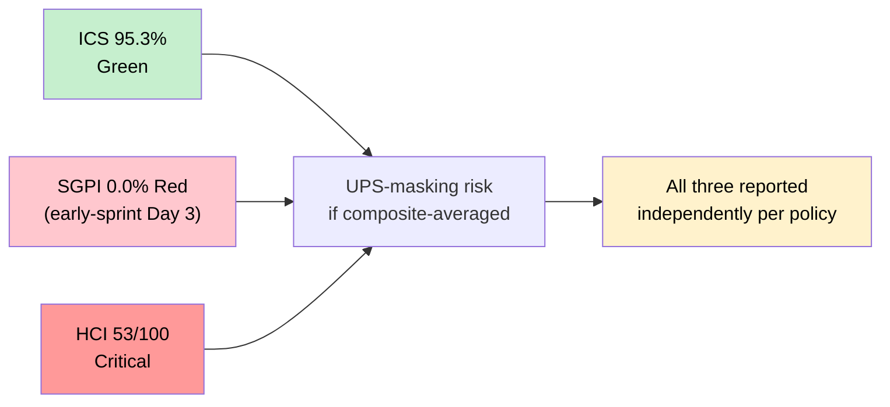
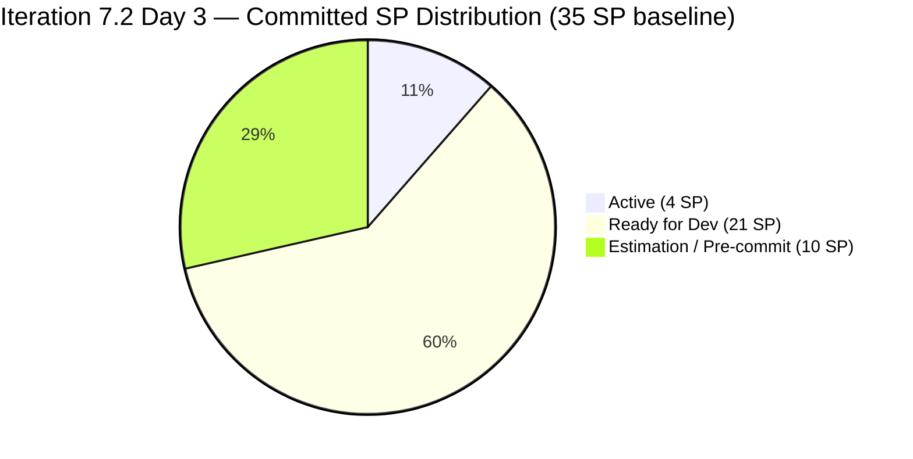
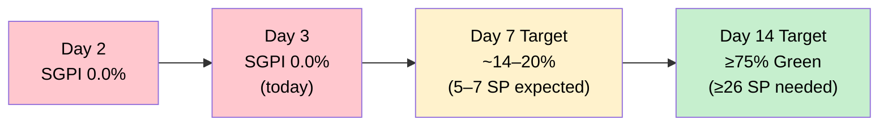
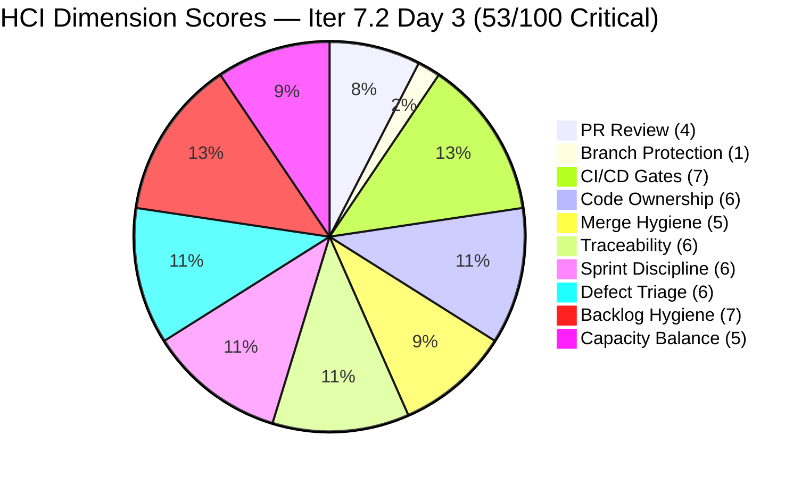
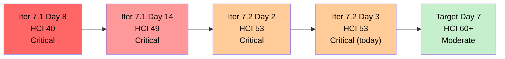
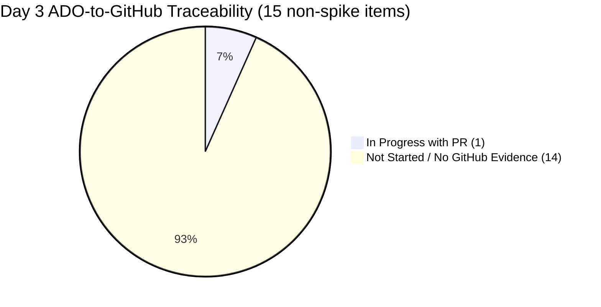
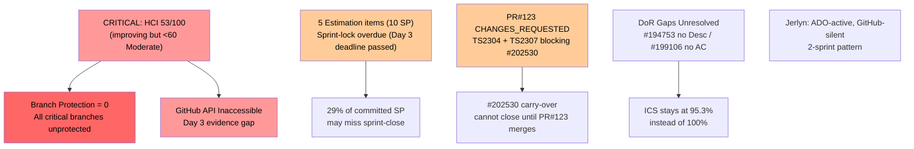

# Auto Allies — Git Iteration Audit

## AUDIT_20260422_0900.md

---

## 1. Audit Metadata

| Field | Value |
|---|---|
| **Audit Date** | April 22, 2026 |
| **Audit Time** | 09:00 PHT (Wednesday) |
| **Iteration** | Iteration 7.2 (April 20 – May 3, 2026) |
| **Iteration ID** | 2e253a85-9ebb-4504-b3f0-2352594eeab0 |
| **Day in Sprint** | Day 3 of 14 (early-sprint) |
| **Auditor** | Claude Code — Git Iteration Audit Agent |
| **ADO Org** | jairo |
| **ADO Project** | Auto Allies (ID: 2d7af571-6ef6-4ad0-a509-c440e008b0fb) |
| **ADO Team** | AA Development Team (ID: 330e6bf1-3515-443c-a2d8-b84f46c38f57) |
| **ADO Backlog** | Stories and Deliverables (Microsoft.RequirementCategory) |
| **GitHub Repo (FE)** | jairosoft-com/autoallies-version2 |
| **GitHub Repo (BE)** | jairosoft-com/autoallies-api-core |
| **Prior Audit** | AUDIT_20260421_0900.md (Iter 7.2 Day 2) |
| **ICS — Iteration Compliance Score** | **95.3%** Green |
| **SGPI — Committed Scope** | **0.0%** Red (early-sprint — Day 3, low delivery expected) |
| **HCI — Engineering Health Index** | **53 / 100** Critical |

> **UPS-masking warning:** HCI remains Critical (53) even though ICS is Green (95.3%). These three scores are reported independently throughout this report per policy. Composite averaging would suppress the Critical HCI signal.

---

## 2. Executive Summary

Today is **Day 3 (Wednesday, April 22, 2026)** of Iteration 7.2, which runs April 20 – May 3. The sprint is at 21% of its 14-day window. No items are Closed, placing SGPI at **0.0% Red** — an expected early-sprint baseline, not a failure signal.

**ADO evidence gathered fresh today confirms the following sprint state:**

- **18 total parent items** are in Iteration 7.2. After excluding 3 spikes (support/retro), **15 non-spike parent items** are in scope for ICS and SGPI.
- **State distribution:** 2 Active (#202530, #203118), 8 Ready for Dev, 5 in Estimation (pre-commitment). No items Closed.
- **Total committed SP baseline:** 35 SP (same as Day 2). Estimation items have not yet locked.
- **ICS held at 95.3%** — no change from Day 2. Two quality/DoD gaps persist: #194753 (empty Description) and #199106 (no AcceptanceCriteria).

**GitHub evidence limitation:** Both GitHub repositories (`jairosoft-com/autoallies-version2` and `jairosoft-com/autoallies-api-core`) returned HTTP 404 for all API calls during this audit session. The GitHub MCP token (`raseniero`) is authenticated but appears to lack organizational read access to these private repositories today. This is a significant evidence gap. All GitHub-dependent HCI dimensions carry over from prior-audit evidence (Day 2, April 21) and are annotated accordingly. **HCI is scored conservatively at 53/100 — carried from Day 2 — and should not be inflated without fresh GitHub confirmation.**

**Delta vs. Day 2 (April 21):**

| Score | Iter 7.2 Day 2 (Apr 21) | **Iter 7.2 Day 3 (Apr 22)** | Delta | Note |
|---|---|---|---|---|
| ICS | 95.3% Green | **95.3%** Green | 0 | Stable — no ADO changes fix the 2 DoR gaps |
| SGPI (committed) | 0.0% Red | **0.0%** Red | 0 | Early-sprint; expected |
| HCI | 53/100 Critical | **53/100** Critical | 0 | GitHub inaccessible; score carried |

**Key watch item for Day 3:** The Day 2 audit identified that 5 Estimation items (10 SP) needed to be locked to Ready for Dev by today (Wednesday). ADO data shows these items remain in Estimation state as of the last ChangedDate timestamps (all between April 20–21). Sprint-lock has not yet been confirmed for these items.

---

## 3. Iteration Scope and Methodology

### Methodology

Evidence collected from:

- **ADO iteration resolution:** `work_list_team_iterations` with `timeframe=current` — returned Iteration 7.2 (path `Auto Allies\2026-PI7\Iteration 7.2`, start 2026-04-20, finish 2026-05-03)
- **ADO iteration items:** `wit_get_work_items_for_iteration` with iterationId `2e253a85-9ebb-4504-b3f0-2352594eeab0` — 18 parent items (rel=null) identified
- **ADO work item detail:** `wit_get_work_items_batch_by_ids` for all 18 parent items — fields including State, StoryPoints, Description, AcceptanceCriteria, Parent, AssignedTo, ChangedDate
- **ADO capacity:** `work_get_team_capacity` — 27h/day total, confirmed unchanged
- **GitHub FE (autoallies-version2):** `list_branches`, `list_pull_requests`, `list_commits` — all returned HTTP 404. Evidence gap; prior audit data carried.
- **GitHub BE (autoallies-api-core):** Same — HTTP 404. Evidence gap; prior audit data carried.

Scoring methodology per `.claude/skills/git_iteration_audit/SKILL.md`:

- **ICS:** 4-dimension weighted rubric (Alignment 25, Estimation 20, Quality/DoD 35, Iteration Integrity 20); non-spike parents only
- **SGPI (headline):** Committed Scope SGPI = Closed SP / Total Committed SP
- **HCI:** 10-dimension engineering index, 0–10 each, total /100

### Iteration Window

April 20 – May 3, 2026 (14 days). **Today is Day 3 (early-sprint).** The early-sprint annotation applies to SGPI and Quality/DoD findings; no formula adjustment is made.

### Team Capacity (Iter 7.2)

| Member | Role | Activity | Capacity/Day | Days Off |
|---|---|---|---|---|
| Jerlyn Ates | Requirements/Testing | Requirements 2h + Testing 4h | 6h | 0 |
| Joseph Gerona | Dev | Development | 5h | 0 |
| Earl Carino | Dev | Development | 6h | 0 |
| Mary Secusana | Documentation | Documentation | 4h | 0 |
| Cliff Carcueva | Dev | Development | 6h | 0 |
| **Total** | | | **27h/day** | **0** |

### In-Scope Parent Items

18 parent items in Iteration 7.2. Spikes excluded from ICS/SGPI (3): #202169 (Retro — Cliff, Active), #203000 (Dev Support — Joseph, New), #203086 (QA Support — Mary, New). **15 non-spike parent items** are in scope for ICS and SGPI.

---

## 4. Scorecard Summary

| Metric | Score | Band | Threshold | Δ vs Day 2 |
|---|---|---|---|---|
| **ICS — Iteration Compliance Score** | **95.3%** | Green | >= 90% | 0 (stable) |
| **SGPI — Committed Scope** | **0.0%** | Red | >= 75% at sprint end | 0 (early-sprint; expected) |
| **HCI — Engineering Health Index** | **53 / 100** | Critical | >= 60 | 0 (GitHub inaccessible; carried) |

### Score Independence Panel

### Committed SP State Distribution (Day 3)

> 35 SP committed across 15 non-spike parents. 0 SP Closed at Day 3.

---

## 5. Sprint Goal Predictability (SGPI)

### Committed Scope SGPI (Headline)

| Metric | Value |
|---|---|
| Total Committed SP (non-spike baseline) | 35 SP |
| Closed SP | 0 SP |
| **SGPI (Committed Scope)** | **0.0% — Red (early-sprint Day 3)** |

### Supporting Context Metrics

| Metric | Calculation | Value |
|---|---|---|
| **Original Scope SGPI** | Closed SP / Original Planned SP (35) | **0.0%** |
| **Delivered Proxy SGPI** | (Closed + QA-Testing SP) / Committed SP = (0 + 0) / 35 | **0.0%** |

> **Early-sprint annotation (Day 3 of 14):** SGPI at zero is fully expected. The 21-day target of ≥75% (Green) requires 26+ SP to close by May 3. Based on Day 2 sprint-opening patterns (1 PR in review for #202530, Earl active on #203118), the sprint has positive momentum but delivery typically begins Day 5–7 for this team.

### Work Item State Distribution (Day 3)

| State | Count | SP | Items |
|---|---|---|---|
| Closed | 0 | 0 | — |
| Active | 2 | 4 | #202530 (3 SP, Cliff), #203118 (1 SP, Earl) |
| Ready for Dev | 8 | 21 | #194750(1), #194757(3), #199818(3), #201378(3), #202023(2), #202457(3), #202790(3), #194753(3) |
| Estimation | 5 | 10 | #199106(1), #200233(2), #201564(3), #202684(2), #202926(2) |
| Spikes (excluded) | 3 | — | #202169, #203000, #203086 |
| **Non-Spike Total** | **15** | **35 SP** | |

### Estimation State Alert — Day 3 Sprint-Lock Deadline

The Day 2 audit flagged 5 items (10 SP) in pre-commitment Estimation state, recommending sprint-lock by Wednesday (Day 3). ADO timestamps as of this morning show **no state changes since April 20–21** for these items. Sprint-lock for these 10 SP has not yet occurred. The window is closing — commit ambiguity on 10 SP (29% of the sprint total) is a material delivery risk.

| ID | Title (Abbrev.) | SP | Owner | Last Changed |
|---|---|---|---|---|
| 199106 | Promo Code Discounts Defect | 1 | Jerlyn | 2026-04-20 00:52 UTC |
| 200233 | Stripe Account V2 Products | 2 | Earl | 2026-04-20 01:58 UTC |
| 201564 | E2E Testing QA Environment | 3 | Jerlyn | 2026-04-21 00:55 UTC |
| 202684 | Revenue Cat Webhook V2 | 2 | Earl | 2026-04-21 00:38 UTC |
| 202926 | Solidifying Migrated Data | 2 | Earl | 2026-04-21 02:33 UTC |

### SGPI Trajectory Projection

---

## 6. Developer Productivity Findings

> **Note:** GitHub API returned HTTP 404 for both repositories during this audit session. GitHub productivity findings below are carried from AUDIT_20260421_0900.md (Day 2 evidence) and annotated as `[Day 2 carry]`. No new GitHub artifacts have been confirmed for Day 3.

### Contribution Summary — Iter 7.2 Days 1–3 Window (Apr 20–22)

| Contributor | GitHub Handle | FE Activity | BE Activity | ADO State Changes | Notes |
|---|---|---|---|---|---|
| Cliff Carcueva | ccarcueva / cliffrandycarcueva | PR#123 OPEN [Day 2 carry] | 2 direct commits, PR#85 [Day 2 carry] | #202530 Active | Most active dev; CHANGES_REQUESTED blocking PR#123 |
| Earl Carino | ecarinoJS | Reviewed PR#123 [Day 2 carry] | Merged PR#85 [Day 2 carry] | #203118 Active | First human PR review in team history (Day 2) |
| Joseph Gerona | JosephJairo / jgeronaCS | — | PR#86 sync [Day 2 carry] | — | Lower activity window |
| Jerlyn Ates | (unknown GitHub handle) | 0 | 0 | #201564, #199106 in Estimation | ADO-active / GitHub-silent (consistent pattern) |
| Mary Secusana | (unknown GitHub handle) | 0 | 0 | #203086 spike (New) | ADO-assigned, no artifacts either system |

### Key Day 2 GitHub Events (Carried Forward)

1. **FE PR#123 (feature/202530-case-review)** — Opened by Cliff, reviewed by Earl (CHANGES_REQUESTED) citing TS2304 and TS2307 compile failures. First substantive human code review in AA team history. Still open as of last check.
2. **BE PR#85 (bugfix/200232-enhance-performance)** — Merged Day 1 by Earl (non-author merge from Cliff). Resolved 7.1 carry-over performance item.
3. **CI bot (`github-code-quality[bot]`)** — First observed posting on PR#123, signaling new automated gating capability.
4. **3 direct-to-`dev` commits** (2 by Cliff, 1 by Earl) — None carry AB# references.

### AB# Coverage Estimate (Days 1–2 window, carried)

| Artifact Class | Total | With AB# | Coverage |
|---|---|---|---|
| FE PRs | 1 (PR#123) | 1 | 100% |
| BE PRs | 2 (PR#85, PR#86) | 1 | 50% |
| BE direct-to-dev commits | 3 | 0 | 0% |
| **Combined** | **6** | **2** | **33.3%** |

---

## 7. SAFe Compliance Findings

| Finding | Severity | Status vs Day 2 |
|---|---|---|
| Retro spike #202168 CLOSED by Jerlyn (Apr 20) | Positive | Carried — still resolved |
| First human PR review in AA history (Earl on PR#123, CHANGES_REQUESTED) | Positive | Carried from Day 2 |
| `github-code-quality[bot]` CI review bot now active | Positive | Carried from Day 2 |
| **GitHub API inaccessible today** — no fresh evidence for Day 3 | **Critical Evidence Gap** | New — impacts HCI confidence |
| Branch protection still not configured on any branch | Critical | Flat (retro spike #202169 Active, no rules yet) |
| 5 Estimation items (10 SP) — sprint-lock deadline missed as of Day 3 | High | **Worsening** — was Medium at Day 2 |
| PR#123 still blocked (CHANGES_REQUESTED — TS2304, TS2307) | Medium | Flat — Cliff's fix not yet confirmed |
| Two DoR gaps: #194753 (empty Description), #199106 (no AC) | Medium | Flat — no ADO changes since Day 2 |
| Jerlyn Ates: ADO-active (2 items in Estimation), GitHub-silent | Medium | Flat — consistent with established pattern |
| Mary Secusana: spike #203086 in New state, no artifacts | Low | Flat |

---

## 8. Iteration Compliance Score (ICS)

ICS is computed on the **15 non-spike parent items** in Iteration 7.2. Spikes excluded: #202169, #203000, #203086.

### ICS Dimension Definitions

| Dimension | Weight | Pass Criteria |
|---|---|---|
| Alignment | 25 | IterationPath = `Auto Allies\2026-PI7\Iteration 7.2` |
| Estimation | 20 | Story Points > 0 |
| Quality / DoD | 35 | Description >= 30 non-whitespace chars AND Acceptance Criteria >= 20 non-whitespace chars |
| Iteration Integrity | 20 | State not New or Blocked (Estimation, Ready for Dev, Active, Resolved, QA Testing, Closed all pass) |

### Item-Level ICS Assessment (Day 3)

| ID | Type | Owner | State | SP | Parent? | SP>0 | Qual OK | Integ OK | Item Score |
|---|---|---|---|---|---|---|---|---|---|
| 194750 | User Story | Cliff | Ready for Dev | 1 | 194143 | Y | Y (Desc+AC both present) | Y | **100** |
| 194753 | User Story | Cliff | Ready for Dev | 3 | 194143 | Y | **FAIL** (Description empty) | Y | **65** |
| 194757 | User Story | Cliff | Ready for Dev | 3 | 194143 | Y | Y | Y | **100** |
| 199106 | Defect | Jerlyn | Estimation | 1 | 201685 | Y | **FAIL** (AcceptanceCriteria absent) | Y | **65** |
| 199818 | User Story | Joseph | Ready for Dev | 3 | 201685 | Y | Y | Y | **100** |
| 200233 | Enabler | Earl | Estimation | 2 | 201410 | Y | Y | Y | **100** |
| 201378 | User Story | Earl | Ready for Dev | 3 | 201685 | Y | Y | Y | **100** |
| 201564 | Enabler | Jerlyn | Estimation | 3 | 200629 | Y | Y | Y | **100** |
| 202023 | User Story | Cliff | Ready for Dev | 2 | 194143 | Y | Y | Y | **100** |
| 202457 | User Story | Joseph | Ready for Dev | 3 | 194143 | Y | Y | Y | **100** |
| 202530 | User Story | Cliff | Active | 3 | 201739 | Y | Y | Y | **100** |
| 202684 | User Story | Earl | Estimation | 2 | 201685 | Y | Y | Y | **100** |
| 202790 | User Story | Cliff | Ready for Dev | 3 | 201685 | Y | Y | Y | **100** |
| 202926 | Enabler | Earl | Estimation | 2 | 201685 | Y | Y | Y | **100** |
| 203118 | User Story | Earl | Active | 1 | 195228 | Y | Y | Y | **100** |

### ICS Compliance Scorecard

| Dimension | Eligible Items | Compliant Items | Failed Items | Score % | Weight | Weighted Contribution | Evidence | Reason for Failure |
|---|---|---|---|---|---|---|---|---|
| Alignment | 15 | 15 | 0 | 100.0 | 25 | 25.0 | All 15 items on path `Auto Allies\2026-PI7\Iteration 7.2` | — |
| Estimation | 15 | 15 | 0 | 100.0 | 20 | 20.0 | All non-spike parents have SP > 0 (range 1–3 SP) | — |
| Quality / DoD | 15 | 13 | 2 | 86.7 | 35 | 30.3 | 13 items have both Description ≥30 nws chars AND AC ≥20 nws chars | **#194753**: Description field is empty (AC populated). **#199106**: AcceptanceCriteria field not returned (Description present). |
| Iteration Integrity | 15 | 15 | 0 | 100.0 | 20 | 20.0 | States: Estimation(5), Ready for Dev(8), Active(2) — none New or Blocked | — |
| **Overall ICS** | | | | | | **95.3%** | | |

**ICS band: Green (≥ 90%).** Unchanged from Day 2. The two DoR gaps (#194753, #199106) have not been remediated since they were first identified on April 21. They are both fixable in a 15-minute grooming session.

---

## 9. Engineering Health Index (HCI)

> **Critical caveat:** GitHub API was inaccessible during this audit. HCI scores for GitHub-dependent dimensions (1, 2, 3, 4, 5, 6, 7) are carried from AUDIT_20260421_0900.md (Day 2). ADO-sourced dimensions (8, 9, 10) are updated from fresh data. No dimension has been upgraded without fresh evidence.

| # | Dimension | Day 2 Score | **Day 3 Score** | Delta | Evidence Basis |
|---|---|---|---|---|---|
| 1 | PR Review Compliance | 4 | **4** | 0 | [Carried Day 2] Earl reviewed PR#123 (CHANGES_REQUESTED — TS2304, TS2307); BE PRs still merged without formal review. |
| 2 | Branch Protection & Enforcement | 1 | **1** | 0 | [Carried Day 2] All branches `"protected": false`. Retro spike #202169 Active but no rules yet configured. |
| 3 | CI/CD Gate Quality | 7 | **7** | 0 | [Carried Day 2] `github-code-quality[bot]` active on PR#123. Earl's CI workflow stable. |
| 4 | Code Ownership | 6 | **6** | 0 | [Carried Day 2] Earl merged PR#85 (non-author), reviewed PR#123. First cross-author pattern emerging. |
| 5 | Merge Hygiene & Churn | 5 | **5** | 0 | [Carried Day 2] Branch names SAFe-aligned. Two direct-to-dev Cliff commits (scheduled command toggle). PR#86 reverse-sync. |
| 6 | Work Item ↔ GitHub Traceability | 6 | **6** | 0 | [Carried Day 2] PR-only coverage 67%; combined (including direct commits) 33%. Small window effect. |
| 7 | Sprint Discipline | 6 | **6** | 0 | [ADO fresh + Day 2 carry] 5 Estimation items (10 SP) remain uncommitted at Day 3 — sprint-lock deadline missed. |
| 8 | Defect Triage & Velocity | 6 | **6** | 0 | [ADO fresh] #199106 (Promo Code Defect, Jerlyn) still in Estimation, unchanged since Apr 20. No new defect artifacts. |
| 9 | Backlog & Story Hygiene | 7 | **7** | 0 | [ADO fresh] Same 2 DoR gaps as Day 2 (#194753 no Description, #199106 no AC). Not remediated. |
| 10 | Capacity Balance & Ownership Distribution | 5 | **5** | 0 | [ADO fresh] Cliff: 6 parents; Earl: 5 parents; Joseph: 2 parents; Jerlyn: 2 parents; Mary: 1 spike. Distribution unchanged. |

**HCI Total Day 3: 4 + 1 + 7 + 6 + 5 + 6 + 6 + 6 + 7 + 5 = 53 / 100 — Critical (<60)**

### HCI Dimension Visualization

### HCI Trajectory

**Gap to Moderate (60):** +7 points needed. The fastest path remains: branch protection configuration (+3 to +4), a second human PR review cycle (+1 to +2), and AB# traceability recovery on direct commits (+1). None of these actions require GitHub API access to execute — they require team action in GitHub and ADO.

---

## 10. ADO-to-GitHub Traceability Analysis

### Story-Level Traceability Map (Day 3)

| ADO ID | Title (Abbrev.) | Owner | State | SP | GitHub Evidence | Traceable? |
|---|---|---|---|---|---|---|
| 194750 | Affiliate Account - Login/Logout | Cliff | Ready for Dev | 1 | — | Not Started |
| 194753 | Affiliate Account - Affiliate Page | Cliff | Ready for Dev | 3 | — | Not Started |
| 194757 | Super Admin - Affiliate Report | Cliff | Ready for Dev | 3 | — | Not Started |
| 199106 | Promo Code Discounts Defect | Jerlyn | Estimation | 1 | — | Not Started |
| 199818 | Expired/One-Time Member View | Joseph | Ready for Dev | 3 | — | Not Started |
| 200233 | Stripe Account V2 Products | Earl | Estimation | 2 | — | Not Started |
| 201378 | Update Public Landing Pages | Earl | Ready for Dev | 3 | — | Not Started |
| 201564 | E2E Testing QA Environment | Jerlyn | Estimation | 3 | — | Not Started |
| 202023 | Attorney/Member as Affiliate | Cliff | Ready for Dev | 2 | — | Not Started |
| 202457 | Validate Affiliate URL Functionality | Joseph | Ready for Dev | 3 | — | Not Started |
| **202530** | **Attorney Case Review Workflow** | **Cliff** | **Active** | **3** | **FE PR#123 (AB#202530) — OPEN, under review [Day 2]** | **Yes — In Review** |
| 202684 | Revenue Cat Webhook V2 | Earl | Estimation | 2 | — | Not Started |
| 202790 | Role Switch | Cliff | Ready for Dev | 3 | — | Not Started |
| 202926 | Solidifying Migrated Data | Earl | Estimation | 2 | — | Not Started |
| 203118 | SOLO Technologies Auto Promo | Earl | Active | 1 | No PR found [Day 2] | Not Started |

**Day 3 summary:** 1/15 traceable with GitHub evidence (#202530 via PR#123 from Day 2). 14/15 Not Started. This is consistent with early-sprint patterns — work items in Ready for Dev and Estimation have no expected code artifacts yet.

### Traceability Coverage

---

## 11. Collaboration and Review Analysis

> GitHub API unavailable for fresh evidence. Analysis below is carried from AUDIT_20260421_0900.md (Day 2).

### Pull Request Summary (Days 1–2, Carried)

| Repo | PRs in Window | Merged | Human Reviewed | Bot Reviewed | AB# Linked |
|---|---|---|---|---|---|
| autoallies-version2 (FE) | 1 (#123 OPEN) | 0 | 1 (Earl — CHANGES_REQUESTED) | 1 (code-quality bot) | 1/1 (100%) |
| autoallies-api-core (BE) | 2 (#85 merged, #86 merged) | 2 | 0 (PR#85 non-author merge; no formal review) | 0 | 1/2 (50%) |
| **Combined** | **3** | **2** | **1** | **1** | **2/3 (67%)** |

### PR#123 Status (FE — feature/202530-case-review, Carried from Day 2)

| Field | Value |
|---|---|
| Reviewer | Earl Carino (ecarinoJS) — MEMBER |
| Review State | **CHANGES_REQUESTED** |
| Submitted | 2026-04-21T03:33:32Z (Day 2) |
| Blocking Findings | **TS2304** — `attorneyFeeDisplayAmount` undefined in CaseList; **TS2307** — `@/lib/hooks/use-violations` module does not exist |
| Resolution Status | Awaiting Cliff to push fix on `feature/202530-case-review` |

This review remains the strongest positive HCI signal in the team's history. The next milestone is Cliff pushing a fix and Earl performing a second review cycle — if that completes by Day 5, it would demonstrate a fully institutionalized review loop for the first time.

---

## 12. Repository Hygiene

> GitHub API unavailable. Repository hygiene analysis carried from Day 2 audit. All findings listed as of April 21.

### Branch Protection Status (All Branches)

All branches in both repositories returned `"protected": false` as of Day 2 (April 21). This has been the persistent state across multiple audit cycles. Retro spike #202169 is Active (Cliff owner) but no protection rules have been deployed.

**Protected branches needed (minimum):**

| Repo | Branch | Status | Action Required |
|---|---|---|---|
| autoallies-version2 | develop | Not protected | Enable: require PR before merge, require 1 approval |
| autoallies-version2 | main | Not protected | Enable: require PR before merge, require 1 approval |
| autoallies-api-core | dev | Not protected | Enable: require PR before merge, require 1 approval |
| autoallies-api-core | main | Not protected | Enable: require PR before merge, require 1 approval |

### Branch Naming Convention (Carried from Day 2)

| Pattern | Example | AB# Present | Compliant |
|---|---|---|---|
| `feature/[AB#]-[descriptor]` | `feature/202530-case-review` | Yes | SAFe-aligned |
| `bugfix/[AB#]-[descriptor]` | `bugfix/200232-enhance-performance` | Yes | SAFe-aligned |

Both active branches follow the AB#-prefix naming convention established in prior sprints.

### Direct-to-Default Commits (BE, Days 1–2, Carried)

Three commits landed on `dev` outside a PR:
1. Cliff — Scheduled command disable (2026-04-20 03:34 UTC) — no AB#
2. Earl — UserResource/UserManagementService refactor (2026-04-20 04:06 UTC) — no AB#
3. Cliff — Scheduled command re-enable (2026-04-20 04:14 UTC) — no AB#

The Cliff pair represents a 40-minute configuration toggle (low value, no traceability). Earl's refactor is a substantive change that should have been in a PR. Branch protection would prevent direct-to-dev commits without PR approval.

---

## 13. Risks and Bottlenecks

### Prioritized Risk Register (Day 3)

| Risk | Severity | Trend | Owner |
|---|---|---|---|
| Branch protection unconfigured on all 4 critical branches across both repos | Critical | Flat | Cliff Carcueva (#202169 owner) |
| GitHub API inaccessible — Day 3 audit has zero fresh GitHub evidence | Critical | **New** | Karl Caumban (escalate to ops/infra) |
| HCI 53/100 Critical — gap to Moderate (+7) requires branch protection as primary lever | Critical | Flat | Karl Caumban |
| 5 Estimation items (10 SP) still uncommitted at Day 3 deadline | High | **Worsening** (was Medium Day 2) | Karl Caumban |
| PR#123 blocked on 2 compile-failure findings; #202530 cannot close until resolved | High | Flat | Cliff Carcueva |
| DoR gaps #194753 (no Description), #199106 (no AC) — 2+ days unresolved | Medium | Flat | Cliff / Jerlyn |
| Jerlyn Ates GitHub-silent (2+ iterations, ADO-only pattern) | Medium | Flat | Karl Caumban |
| Capacity imbalance: Cliff 6 parents (highest load), Joseph 2 parents (lowest dev load) | Medium | Flat | Karl Caumban |
| Earl's UserResource refactor direct-to-dev — no AB#, no PR | Low | Flat | Earl Carino |

---

## 14. Prioritized Remediation Actions

### Immediate — Today (Day 3, April 22)

1. **Resolve the Estimation sprint-lock (Karl + item owners).** Move #199106 (Jerlyn), #200233, #202684, #202926 (Earl), and #201564 (Jerlyn) from Estimation → Ready for Dev today. Each owner should confirm SP is finalized and state transition happens in ADO before end of business. This unlocks 10 SP from pre-commitment ambiguity and establishes a clean SGPI denominator.

2. **Cliff: push fix for PR#123 (TS2304 + TS2307).** Resolve `attorneyFeeDisplayAmount` reference in CaseList and implement or correct the `@/lib/hooks/use-violations` import. Push to `feature/202530-case-review`. This allows Earl to do the follow-up review and demonstrates the new review loop is functional end-to-end.

3. **Resolve GitHub API access issue (Karl / ops).** The `raseniero` token returned HTTP 404 on all GitHub API calls today. This should be investigated — possibilities include: org token scope change, repo visibility change, or SSO session expiry. Without GitHub access, HCI cannot advance beyond a stale carry-forward.

### Day 4 (Thursday, April 23)

1. **Configure branch protection on `develop`, `dev`, `staging`, `main` in both repos (Cliff + Earl).** Minimum ruleset: Require pull request before merging, Require at least 1 approval, Block direct pushes. This is a +3 to +4 HCI move — the single highest-leverage action available to the team. Acceptance: `list_branches` returns `"protected": true` for all four target branches across both repos.

2. **Fix the two DoR gaps (Cliff and Jerlyn).** Add Description to #194753 (Cliff — minimum 30 non-whitespace chars describing the Affiliate Page story). Add AcceptanceCriteria to #199106 (Jerlyn — minimum 20 non-whitespace chars). ICS returns to 100% if both items are remediated.

### During 7.2 Sprint (Day 5 onwards)

1. **Earl: institute the cross-author review standard on every feature and bugfix PR.** Every merged PR on `feature/*` or `bugfix/*` must have at least one approval from a team member who is not the author. Track as a team metric. Once branch protection is enabled, this becomes mechanically enforced.

2. **AB# tagging for all commits.** Any commit that lands on `dev`, `develop`, or `main` — whether via PR or direct — should carry `AB#[ID]` in the commit message. For direct commits, include the work item ID the change relates to. Earl's UserResource refactor should be retroactively linked.

3. **Earl and Joseph capacity rebalance.** Joseph has 2 parent items (5h Dev capacity/day, 6+ working days remaining). With 8 Ready-for-Dev items across the sprint, Karl should offer Joseph one of Cliff's Ready-for-Dev items. Candidate: #202023 (Existing Attorney/Member as Affiliate, 2 SP) — small scope, Joseph has done similar attribution work.

4. **Monitor PR#123 review cycle to completion.** When Cliff pushes the fix, Earl should review within 24 hours. A successful merged-with-approval on PR#123 would be the first fully compliant PR lifecycle in team history. Document it explicitly in the Day 5 audit.

---

## 15. Evidence Gaps and Limitations

| Gap | Impact | Notes |
|---|---|---|
| **GitHub API returned HTTP 404 for all calls** — both repos inaccessible today | **Critical** | All GitHub-dependent HCI dimensions are stale (Day 2 carry). HCI confidence is reduced. Scores are conservative (not upgraded without fresh evidence). Karl should investigate token/org access. |
| No fresh commit list for FE (`develop`) or BE (`dev`) branches since April 21 | High | Any Day 3 commits, PRs, or branch protection changes that occurred today are not reflected in this report. |
| GitHub identity for Jerlyn Ates still unknown | Medium | `jates@jairosoft.com` not associated with any GitHub handle across all audit history. Her GitHub contribution remains "confirmed zero" only at the email level. |
| GitHub identity for Mary Secusana still unknown | Medium | Same — `msecusana@jairosoft.com` not linked to any GitHub handle. |
| 5 Estimation items' official committed-scope status | Medium | Using 35 SP as the denominator assuming all 15 non-spike items are committed. If Karl formally locks only 10 of 15, SGPI denominator shifts. |
| Per-PR CI build pass/fail status | Low | `get_check_runs` not callable (GitHub 404). PR#85's clean merge and PR#123's open state infer CI health but do not confirm it. |
| Branch protection ruleset details | Low | Even when accessible, `list_branches` shows per-branch `"protected": true/false` but not granular ruleset parameters (required checks, dismiss stale, etc.). |
| Earl's UserResource refactor direct-to-dev — parent work item unknown | Low | The Apr 20 refactor commit does not carry AB#. It may relate to an untracked enabler or ad-hoc technical debt item. Karl should determine if a new enabler needs to be created retroactively. |

---

*Report generated: April 22, 2026 09:00 PHT (Wednesday)*
*Audit agent: Claude Code — git_iteration_audit*
*Iteration 7.2 Day 3 of 14 — next recommended audit: Day 5 (Friday April 24) for GitHub evidence recovery + first SGPI delivery signal*
