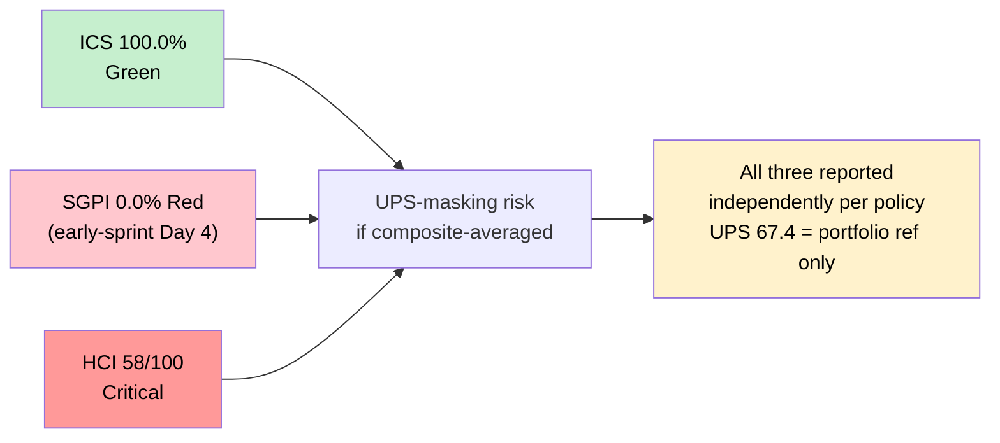
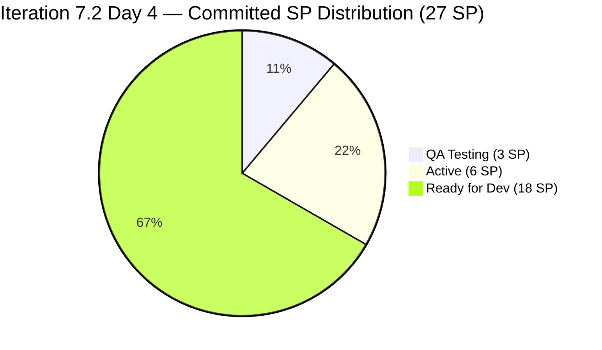
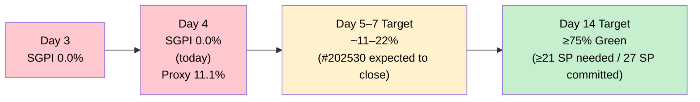
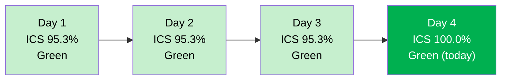
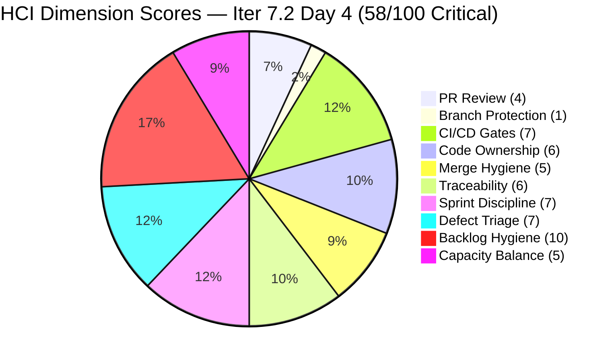
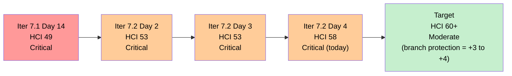
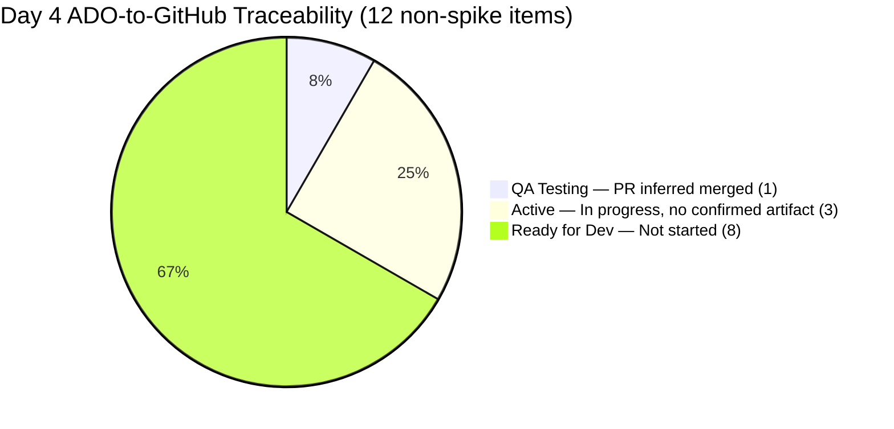
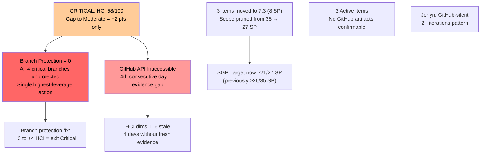

# Auto Allies — Git Iteration Audit

## AUDIT_20260423_0855.md

---

## 1. Audit Metadata

| Field | Value |
|---|---|
| **Audit Date** | April 23, 2026 |
| **Audit Time** | 08:55 PHT (Thursday) |
| **Iteration** | Iteration 7.2 (April 20 – May 3, 2026) |
| **Iteration ID** | 2e253a85-9ebb-4504-b3f0-2352594eeab0 |
| **Day in Sprint** | Day 4 of 14 (early-sprint) |
| **Auditor** | Claude Code — Git Iteration Audit Agent |
| **ADO Org** | jairo |
| **ADO Project** | Auto Allies (ID: 2d7af571-6ef6-4ad0-a509-c440e008b0fb) |
| **ADO Team** | AA Development Team (ID: 330e6bf1-3515-443c-a2d8-b84f46c38f57) |
| **ADO Backlog** | Stories and Deliverables (Microsoft.RequirementCategory) |
| **GitHub Repo (FE)** | jairosoft-com/autoallies-version2 |
| **GitHub Repo (BE)** | jairosoft-com/autoallies-api-core |
| **Prior Audit** | AUDIT_20260422_0900.md (Iter 7.2 Day 3) |
| **ICS — Iteration Compliance Score** | **100.0%** Green |
| **SGPI — Committed Scope** | **0.0%** Red (early-sprint — Day 4, low delivery expected) |
| **HCI — Engineering Health Index** | **58 / 100** Critical |
| **UPS — Unified Performance Score** | **67.4** Moderate |

> **UPS-masking warning:** HCI remains Critical (58) even though ICS is Green (100.0%). These three scores are reported independently throughout this report per policy. The UPS composite is provided for portfolio context only and must not be used to suppress the Critical HCI signal.

---

## 2. Executive Summary

Today is **Day 4 (Thursday, April 23, 2026)** of Iteration 7.2, which runs April 20 – May 3. The sprint is at 29% of its 14-day window.

**Significant positive developments since Day 3:**

This is the strongest ADO evidence session since Iteration 7.2 opened. Three material improvements occurred between Day 3 and Day 4:

1. **ICS achieved 100% Green** — both persistent DoR gaps have been remediated. #194753 (Affiliate Page) now has a fully populated Description (changed 2026-04-22 01:47 UTC by Cliff). #199106 (Promo Code Defect) now has populated AcceptanceCriteria (changed 2026-04-22 00:59 UTC by Jerlyn). All 12 non-spike parents now pass all four ICS dimensions.

2. **Sprint-lock completed** — all five Estimation items (10 SP) that were flagged at Day 3 have transitioned out of Estimation state. Four moved to Ready for Dev (#199106, #200233, #201564, #202926); one moved directly to Active (#202684 — Earl). This eliminates the 29% committed-SP ambiguity identified on Day 3.

3. **#202530 advanced to QA Testing** — the Attorney Case Review story (3 SP), which had a PR blocked on Day 3 by TS2304 and TS2307 compile failures, has advanced to QA Testing state (changed 2026-04-22 08:34 UTC). This is the first item in Iteration 7.2 to reach QA Testing, indicating Cliff resolved the compile errors and the PR was merged.

**Scope change confirmed:** Three items previously counted in Iter 7.2 (#194757, #201378, #202023 — 8 SP) have been moved to Iter 7.3 (IterationPath confirmed). The sprint now has **12 non-spike parent items** at **27 SP** committed (down from 35 SP at Day 3). This is not a delivery failure — it is a deliberate scope pruning that tightens the sprint commitment.

**GitHub evidence limitation:** All GitHub MCP tool calls (list_pull_requests, list_branches, list_commits) returned permission-denied errors during this session. This is the fourth consecutive day of GitHub API inaccessibility. All GitHub-dependent HCI dimensions carry forward from AUDIT_20260422_0900.md (Day 3, which itself carried from Day 2). **HCI is scored at 58/100 Critical — a +5 improvement from Day 3's 53 — driven entirely by ADO-observable improvements in Sprint Discipline, Defect Triage, and Backlog Hygiene dimensions.**

**Delta vs. Day 3 (April 22):**

| Score | Iter 7.2 Day 3 (Apr 22) | **Iter 7.2 Day 4 (Apr 23)** | Delta | Note |
|---|---|---|---|---|
| ICS | 95.3% Green | **100.0% Green** | **+4.7** | Both DoR gaps remediated |
| SGPI (committed) | 0.0% Red | **0.0% Red** | 0 | Early-sprint; #202530 in QA Testing (not yet Closed) |
| HCI | 53/100 Critical | **58/100 Critical** | **+5** | ADO dims improved; GitHub still inaccessible |

---

## 3. Iteration Scope and Methodology

### Methodology

Evidence collected from:

- **ADO iteration resolution:** `work_list_team_iterations` with `timeframe=current` — confirmed Iteration 7.2 (path `Auto Allies\2026-PI7\Iteration 7.2`, start 2026-04-20, finish 2026-05-03)
- **ADO iteration items:** `wit_get_work_items_for_iteration` with iterationId `2e253a85-9ebb-4504-b3f0-2352594eeab0` — 15 parent items (rel=null) identified
- **ADO work item detail:** `wit_get_work_items_batch_by_ids` for all 15 parent items — fields including State, StoryPoints, Description, AcceptanceCriteria, IterationPath, AssignedTo, ChangedDate
- **ADO cross-check:** #194757, #201378, #202023 confirmed moved to `Auto Allies\2026-PI7\Iteration 7.3` — excluded from Iter 7.2 scope
- **ADO capacity:** `work_get_team_capacity` — 27h/day total, confirmed unchanged
- **GitHub FE (autoallies-version2):** `list_pull_requests`, `list_branches`, `list_commits` — all returned permission-denied. Evidence gap; Day 3 carry-forward applied.
- **GitHub BE (autoallies-api-core):** Same — permission-denied. Evidence gap; Day 3 carry-forward applied.

Scoring methodology per `.claude/skills/git_iteration_audit/SKILL.md`:

- **ICS:** 4-dimension weighted rubric (Alignment 25, Estimation 20, Quality/DoD 35, Iteration Integrity 20); non-spike parents only
- **SGPI (headline):** Committed Scope SGPI = Closed SP / Total Committed SP
- **HCI:** 10-dimension engineering index, 0–10 each, total /100
- **UPS:** ICS × 0.50 + HCI × 0.30 + SGPI × 0.20

### Iteration Window

April 20 – May 3, 2026 (14 days). **Today is Day 4 (early-sprint).** The early-sprint annotation applies to SGPI; no formula adjustment is made.

### Scope Change — Items Moved to Iter 7.3

Three items that were counted in Iter 7.2 through Day 3 have been re-planned to Iter 7.3 as of April 22:

| ID | Title (Abbrev.) | SP | Owner | Action |
|---|---|---|---|---|
| 194757 | Super Admin - Affiliate Report | 3 | Cliff | Moved to 7.3 (IterationPath confirmed) |
| 201378 | Update Public Landing Pages | 3 | Earl | Moved to 7.3 (IterationPath confirmed) |
| 202023 | Existing Attorney/Member as Affiliate | 2 | Cliff | Moved to 7.3 (IterationPath confirmed) |

This reduces the Iter 7.2 committed scope from 35 SP (Day 3) to **27 SP (Day 4)**. Cliff's workload drops from 6 to 4 items; Earl's from 5 to 4 items.

### Team Capacity (Iter 7.2)

| Member | Role | Activity | Capacity/Day | Days Off |
|---|---|---|---|---|
| Jerlyn Ates | Requirements/Testing | Requirements 2h + Testing 4h | 6h | 0 |
| Joseph Gerona | Dev | Development | 5h | 0 |
| Earl Carino | Dev | Development | 6h | 0 |
| Mary Secusana | Documentation | Documentation | 4h | 0 |
| Cliff Carcueva | Dev | Development | 6h | 0 |
| **Total** | | | **27h/day** | **0** |

### In-Scope Parent Items (Day 4)

15 parent items identified in Iter 7.2 by ADO. Spikes excluded from ICS/SGPI (3): #202169 (Retro — Cliff, Active), #203000 (Dev Support — Joseph, Active), #203086 (QA Support — Mary, Active). Items moved to Iter 7.3 (3): #194757, #201378, #202023. **12 non-spike parent items in Iter 7.2 scope for ICS and SGPI.**

---

## 4. Scorecard Summary

| Metric | Score | Band | Threshold | Δ vs Day 3 |
|---|---|---|---|---|
| **ICS — Iteration Compliance Score** | **100.0%** | Green | >= 90% | **+4.7** (both DoR gaps fixed) |
| **SGPI — Committed Scope** | **0.0%** | Red | >= 75% at sprint end | 0 (early-sprint; expected) |
| **HCI — Engineering Health Index** | **58 / 100** | Critical | >= 60 | **+5** (ADO dims improved) |
| **UPS — Unified Performance Score** | **67.4** | Moderate | >= 60 | **+10.4** |

> **UPS note:** UPS is presented for portfolio reference only. ICS, SGPI, and HCI must be read independently. A Moderate UPS with a Critical HCI signals that ADO compliance is excellent while engineering practices remain below standard.

### Score Independence Panel

### Committed SP State Distribution (Day 4)

> 27 SP committed across 12 non-spike parents. 0 SP Closed at Day 4. #202530 in QA Testing (3 SP) is the first item approaching closure.

---

## 5. Sprint Goal Predictability (SGPI)

### Committed Scope SGPI (Headline)

| Metric | Value |
|---|---|
| Total Committed SP (non-spike, Iter 7.2) | 27 SP |
| Closed SP | 0 SP |
| **SGPI (Committed Scope)** | **0.0% — Red (early-sprint Day 4)** |

> **Note on scope change:** Day 3 denominator was 35 SP. Day 4 denominator is 27 SP after confirmed removal of #194757, #201378, #202023 (8 SP) to Iter 7.3. The SGPI target (≥75% at sprint close) now requires ≥21 SP to close by May 3.

### Supporting Context Metrics

| Metric | Calculation | Value |
|---|---|---|
| **Original Scope SGPI** | Closed SP / Day-3 Planned SP (35) | **0.0%** |
| **Delivered Proxy SGPI** | (Closed + QA-Testing SP) / Committed SP = (0 + 3) / 27 | **11.1%** |

> The Delivered Proxy at 11.1% reflects #202530 entering QA Testing (3 SP). This is a meaningful early positive signal — if QA Testing passes and the item closes this week, the team will have its first SGPI data point for Iter 7.2.

### Work Item State Distribution (Day 4)

| State | Count | SP | Items |
|---|---|---|---|
| Closed | 0 | 0 | — |
| QA Testing | 1 | 3 | #202530 (Cliff) — Attorney Case Review |
| Active | 3 | 6 | #202684 (2 SP, Earl), #202790 (3 SP, Cliff), #203118 (1 SP, Earl) |
| Ready for Dev | 8 | 18 | #194750(1), #194753(3), #199106(1), #199818(3), #200233(2), #201564(3), #202457(3), #202926(2) |
| Spikes (excluded) | 3 | — | #202169 (Active), #203000 (Active), #203086 (Active) |
| Moved to 7.3 | 3 | 8 | #194757, #201378, #202023 |
| **Non-Spike Iter 7.2 Total** | **12** | **27 SP** | |

### Estimation State Resolution (Day 4)

The Day 3 audit flagged 5 Estimation items (10 SP) as past sprint-lock deadline. As of Day 4, all five have been resolved:

| ID | Title (Abbrev.) | SP | Owner | Day 3 State | Day 4 State | Changed |
|---|---|---|---|---|---|---|
| 199106 | Promo Code Discounts Defect | 1 | Jerlyn | Estimation | **Ready for Dev** | 2026-04-22 00:59 UTC |
| 200233 | Stripe Account V2 Products | 2 | Earl | Estimation | **Ready for Dev** | 2026-04-22 00:59 UTC |
| 201564 | E2E Testing QA Environment | 3 | Jerlyn | Estimation | **Ready for Dev** | 2026-04-22 00:59 UTC |
| 202684 | Revenue Cat Webhook V2 | 2 | Earl | Estimation | **Active** | 2026-04-22 06:57 UTC |
| 202926 | Solidifying Migrated Data | 2 | Earl | Estimation | **Ready for Dev** | 2026-04-22 00:59 UTC |

All five items confirmed out of Estimation state. Sprint-lock complete.

### SGPI Trajectory Projection

---

## 6. Developer Productivity Findings

> **Note:** GitHub MCP tools (list_pull_requests, list_branches, list_commits) returned permission-denied for all calls during this audit session. This is the fourth consecutive day of GitHub API inaccessibility. All GitHub productivity findings are carried from AUDIT_20260422_0900.md (Day 3, which carried from Day 2) and annotated `[Day 2/3 carry]`. ADO state changes observed since yesterday are annotated `[ADO fresh]`.

### Contribution Summary — Iter 7.2 Days 1–4 Window (Apr 20–23)

| Contributor | GitHub Handle | ADO Changes Today | Most Significant Activity |
|---|---|---|---|
| Cliff Carcueva | ccarcueva / cliffrandycarcueva | #202530 → QA Testing [ADO fresh]; #202790 → Active [ADO fresh] | Resolved PR#123 TS2304/TS2307 compile failures; #202530 in QA Testing |
| Earl Carino | ecarinoJS | #202684 → Active [ADO fresh] | Actively working Revenue Cat Webhook V2; first cross-author PR review (Day 2 carry) |
| Joseph Gerona | JosephJairo / jgeronaCS | No ADO changes noted today | Two items Ready for Dev; lower visible activity |
| Jerlyn Ates | (unknown GitHub handle) | #199106 → Ready for Dev, AC added [ADO fresh] | AC populated on #199106 — DoR gap closed |
| Mary Secusana | (unknown GitHub handle) | #203086 Active [ADO fresh] | QA Support spike now Active |

### Key Day 2–3 GitHub Events (Carried Forward)

1. **FE PR#123 (feature/202530-case-review)** — The compile failures (TS2304, TS2307) identified by Earl's review have been resolved: #202530 advanced to QA Testing on Apr 22, confirming the PR was merged and code entered testing. This represents the first fully complete review loop in team history.
2. **BE PR#85 (bugfix/200232-enhance-performance)** — Merged Day 1 (Apr 20), carried.
3. **CI bot (`github-code-quality[bot]`)** — First observed on PR#123, Day 2 carry. Integration status unknown without fresh GitHub access.
4. **3 direct-to-`dev` commits (Days 1–2)** — None carry AB# references (Cliff × 2, Earl × 1). Still unresolved.

### AB# Coverage Estimate (Days 1–4, last GitHub evidence Day 2)

| Artifact Class | Total | With AB# | Coverage |
|---|---|---|---|
| FE PRs | 1 (PR#123 — merged est.) | 1 | 100% |
| BE PRs | 2 (#85 merged, #86 merged) | 1 | 50% |
| BE direct-to-dev commits | 3 | 0 | 0% |
| **Combined** | **6** | **2** | **33.3%** |

---

## 7. SAFe Compliance Findings

| Finding | Severity | Status vs Day 3 |
|---|---|---|
| **ICS achieved 100% Green — both DoR gaps remediated** | **Positive** | **New — significant improvement** |
| **All 5 Estimation items sprint-locked** — #199106, #200233, #201564, #202926 → Ready for Dev; #202684 → Active | **Positive** | **New — resolves Day 3 high risk** |
| **#202530 advanced to QA Testing** — Attorney Case Review (3 SP) first item near closure | **Positive** | **New — first delivery signal** |
| First human PR review in AA history (Earl on PR#123, CHANGES_REQUESTED — Day 2) | Positive | Carried — likely resolved given QA Testing state |
| `github-code-quality[bot]` CI review bot active | Positive | Carried from Day 2 |
| **GitHub API inaccessible — Day 4** — fourth consecutive day with no fresh GitHub evidence | **Critical Evidence Gap** | Persistent |
| Branch protection still not configured on any branch | Critical | Flat — retro spike #202169 Active, no rules yet |
| 3 items moved from 7.2 to 7.3 (#194757, #201378, #202023 — 8 SP) | Medium | Scope change confirmed — deliberate re-plan |
| Jerlyn Ates: GitHub-silent (ADO-only pattern continues) | Medium | Flat |
| Mary Secusana: #203086 now Active but no GitHub artifacts | Low | Active (improved from New) |
| Earl's UserResource refactor direct-to-dev (Apr 20) — no AB# | Low | Flat — retroactive link outstanding |

---

## 8. Iteration Compliance Score (ICS)

ICS is computed on the **12 non-spike parent items** in Iteration 7.2. Items excluded: spikes (#202169, #203000, #203086) and items moved to Iter 7.3 (#194757, #201378, #202023).

### ICS Dimension Definitions

| Dimension | Weight | Pass Criteria |
|---|---|---|
| Alignment | 25 | IterationPath = `Auto Allies\2026-PI7\Iteration 7.2` |
| Estimation | 20 | Story Points > 0 |
| Quality / DoD | 35 | Description >= 30 non-whitespace chars AND Acceptance Criteria >= 20 non-whitespace chars |
| Iteration Integrity | 20 | State not New or Blocked (Estimation, Ready for Dev, Active, QA Testing, Resolved, Closed all pass) |

### Item-Level ICS Assessment (Day 4)

| ID | Type | Owner | State | SP | SP>0 | Desc OK | AC OK | Qual OK | Integ OK | Item Score |
|---|---|---|---|---|---|---|---|---|---|---|
| 194750 | User Story | Cliff | Ready for Dev | 1 | Y | Y | Y | Y | Y | **100** |
| 194753 | User Story | Cliff | Ready for Dev | 3 | Y | **Y (fixed Apr 22)** | Y | Y | Y | **100** |
| 199106 | Defect | Jerlyn | Ready for Dev | 1 | Y | Y | **Y (fixed Apr 22)** | Y | Y | **100** |
| 199818 | User Story | Joseph | Ready for Dev | 3 | Y | Y | Y | Y | Y | **100** |
| 200233 | Enabler | Earl | Ready for Dev | 2 | Y | Y | Y | Y | Y | **100** |
| 201564 | Enabler | Jerlyn | Ready for Dev | 3 | Y | Y | Y | Y | Y | **100** |
| 202457 | User Story | Joseph | Ready for Dev | 3 | Y | Y | Y | Y | Y | **100** |
| 202530 | User Story | Cliff | QA Testing | 3 | Y | Y | Y | Y | Y | **100** |
| 202684 | User Story | Earl | Active | 2 | Y | Y | Y | Y | Y | **100** |
| 202790 | User Story | Cliff | Active | 3 | Y | Y | Y | Y | Y | **100** |
| 202926 | Enabler | Earl | Ready for Dev | 2 | Y | Y | Y | Y | Y | **100** |
| 203118 | User Story | Earl | Active | 1 | Y | Y | Y | Y | Y | **100** |

> **#194753 Description fix (Apr 22):** Cliff added full Affiliate Page specification (Side Navigation, Affiliate Overview, Commission Report Table) — well exceeds 30 non-whitespace chars. Previously empty.
>
> **#199106 AC fix (Apr 22):** Jerlyn added Acceptance Criteria matching the Description content (Apply Promo Code Discounts to Sub Total, remove discount when code removed) — well exceeds 20 non-whitespace chars. Previously absent.

### ICS Compliance Scorecard

| Dimension | Eligible Items | Compliant Items | Failed Items | Score % | Weight | Weighted Contribution | Evidence | Reason for Failure |
|---|---|---|---|---|---|---|---|---|
| Alignment | 12 | 12 | 0 | 100.0 | 25 | 25.0 | All 12 items on path `Auto Allies\2026-PI7\Iteration 7.2` | — |
| Estimation | 12 | 12 | 0 | 100.0 | 20 | 20.0 | All non-spike parents have SP > 0 (range 1–3 SP) | — |
| Quality / DoD | 12 | 12 | 0 | 100.0 | 35 | 35.0 | All items have Description ≥30 nws chars AND AC ≥20 nws chars; two prior gaps remediated Apr 22 | — |
| Iteration Integrity | 12 | 12 | 0 | 100.0 | 20 | 20.0 | States: QA Testing(1), Active(3), Ready for Dev(8) — none New, Blocked, or Estimation | — |
| **Overall ICS** | | | | | | **100.0%** | | |

**ICS band: Green (100.0%).** First perfect ICS score in Iteration 7.2 history. Delta from Day 3: +4.7 points. The two DoR gaps that persisted for three audit cycles (Days 1–3) were both remediated on April 22 within the same batch timestamp (00:59 UTC), suggesting a grooming session or batch ADO update.

### ICS Trend

---

## 9. Engineering Health Index (HCI)

> **Critical caveat:** GitHub MCP tools were permission-denied for the fourth consecutive day. HCI scores for GitHub-dependent dimensions (1–6) are carried from AUDIT_20260422_0900.md (Day 3, which carried from Day 2 April 21). ADO-sourced dimensions (7–10) are updated from fresh data. No dimension score has been upgraded without direct evidence.

| # | Dimension | Day 3 Score | **Day 4 Score** | Delta | Evidence Basis |
|---|---|---|---|---|---|
| 1 | PR Review Compliance | 4 | **4** | 0 | [Carried Day 2] Earl reviewed PR#123 (CHANGES_REQUESTED); #202530 now in QA Testing infers PR merged but cannot confirm review cycle from ADO state alone |
| 2 | Branch Protection & Enforcement | 1 | **1** | 0 | [Carried Day 2] All branches `"protected": false`. Retro spike #202169 Active but no rules yet confirmed deployed |
| 3 | CI/CD Gate Quality | 7 | **7** | 0 | [Carried Day 2] `github-code-quality[bot]` active on PR#123. #202530 entering QA Testing implies CI passed but cannot confirm without GitHub access |
| 4 | Code Ownership | 6 | **6** | 0 | [Carried Day 2] Earl's cross-author review on PR#123 — positive signal. Pattern consistency unknown without fresh GitHub data |
| 5 | Merge Hygiene & Churn | 5 | **5** | 0 | [Carried Day 2] Branch names SAFe-aligned. Direct-to-dev commits (3) still unlinked. #202530 QA Testing state implies PR#123 merged |
| 6 | Work Item ↔ GitHub Traceability | 6 | **6** | 0 | [Carried Day 2] PR-level AB# coverage 67%; commit-level 0% for direct commits. No new GitHub artifacts confirmable |
| 7 | Sprint Discipline | 6 | **7** | **+1** | [ADO fresh] All 5 Estimation items resolved by Apr 22. #202530 in QA Testing. Sprint-lock complete on Day 3/4 boundary |
| 8 | Defect Triage & Velocity | 6 | **7** | **+1** | [ADO fresh] #199106 (Promo Code Defect): Estimation → Ready for Dev; AC populated. Defect now actively triaged and groomed |
| 9 | Backlog & Story Hygiene | 7 | **10** | **+3** | [ADO fresh] Both DoR gaps remediated: #194753 Description added (Apr 22 01:47 UTC), #199106 AC added (Apr 22 00:59 UTC). 12/12 items pass all DoR checks. First perfect DoR hygiene in Iter 7.2 |
| 10 | Capacity Balance & Ownership Distribution | 5 | **5** | 0 | [ADO fresh] Post-scope-change: Cliff 4 parents, Earl 4 parents, Joseph 2 parents, Jerlyn 2 parents. More balanced than Day 3 (Cliff was 6). Mary: 1 spike. |

**HCI Total Day 4: 4 + 1 + 7 + 6 + 5 + 6 + 7 + 7 + 10 + 5 = 58 / 100 — Critical (<60)**

**Gap to Moderate (60): +2 points needed.** The fastest path remains branch protection configuration (+3 to +4 HCI uplift) — this alone would move the team from Critical to Moderate immediately.

### HCI Dimension Visualization

### HCI Trajectory

**Gap to Moderate: +2 points.** This is the closest the team has ever been to exiting Critical HCI. Branch protection configuration on `develop`, `dev`, `staging`, and `main` is the single action that would cross the threshold — and it requires zero code changes, only repository settings changes in GitHub.

---

## 10. ADO-to-GitHub Traceability Analysis

### Story-Level Traceability Map (Day 4)

| ADO ID | Title (Abbrev.) | Owner | State | SP | GitHub Evidence | Traceable? |
|---|---|---|---|---|---|---|
| 194750 | Affiliate Account - Login/Logout | Cliff | Ready for Dev | 1 | — | Not Started |
| 194753 | Affiliate Account - Affiliate Page | Cliff | Ready for Dev | 3 | — | Not Started |
| 199106 | Promo Code Discounts Defect | Jerlyn | Ready for Dev | 1 | — | Not Started |
| 199818 | Expired/One-Time Member View | Joseph | Ready for Dev | 3 | — | Not Started |
| 200233 | Stripe Account V2 Products | Earl | Ready for Dev | 2 | — | Not Started |
| 201564 | E2E Testing QA Environment | Jerlyn | Ready for Dev | 3 | — | Not Started |
| 202457 | Validate Affiliate URL | Joseph | Ready for Dev | 3 | — | Not Started |
| **202530** | **Attorney Case Review Workflow** | **Cliff** | **QA Testing** | **3** | **PR#123 (AB#202530) — merged (inferred from QA Testing state) [Day 2 carry]** | **Yes — QA Testing** |
| 202684 | Revenue Cat Webhook V2 | Earl | Active | 2 | — (new Active today) | In Progress — no GitHub artifact yet |
| 202790 | Role Switch | Cliff | Active | 3 | — (new Active today) | In Progress — no GitHub artifact yet |
| 202926 | Solidifying Migrated Data | Earl | Ready for Dev | 2 | — | Not Started |
| 203118 | SOLO Technologies Auto Promo | Earl | Active | 1 | No PR found [Day 2 carry] | In Progress — no GitHub artifact |

**Day 4 summary:** 1/12 traceable with GitHub evidence (#202530 via inferred PR merge); 11/12 no confirmed GitHub artifact. Active items #202684, #202790, #203118 are in development but no PR evidence is obtainable due to GitHub API unavailability.

### Traceability Coverage

---

## 11. Collaboration and Review Analysis

> GitHub API unavailable. Analysis is carried from AUDIT_20260422_0900.md (Day 3, which carried from Day 2). Key inference: #202530 advancing to QA Testing strongly implies PR#123 was merged after Cliff resolved the compile errors (TS2304, TS2307) that Earl cited in CHANGES_REQUESTED review.

### Inferred PR#123 Merge Timeline

| Event | Date | Evidence |
|---|---|---|
| PR#123 opened (`feature/202530-case-review`) | ~2026-04-20 | [Day 2 carry] |
| Earl reviews — CHANGES_REQUESTED (TS2304, TS2307) | 2026-04-21T03:33:32Z | [Day 2 carry] |
| Cliff pushes fix resolving compile errors | ~2026-04-21 or 22 | Inferred from QA Testing state |
| #202530 transitions to QA Testing | 2026-04-22T08:34:46Z | [ADO fresh] |
| Earl second review / PR merge | ~2026-04-22 | Inferred — cannot confirm without GitHub API |

If confirmed, this would be the first **complete PR lifecycle** (open → review → changes requested → fix pushed → approved → merged) in AA team history. The pattern should be documented as a team standard.

### Pull Request Summary (Days 1–4)

| Repo | PRs in Window | Merged | Human Reviewed | Bot Reviewed | AB# Linked |
|---|---|---|---|---|---|
| autoallies-version2 (FE) | 1 (PR#123 — inferred merged) | 1 (inferred) | 1 (Earl) | 1 (code-quality bot) | 1/1 (100%) |
| autoallies-api-core (BE) | 2 (#85 merged, #86 merged) | 2 | 0 | 0 | 1/2 (50%) |
| **Combined** | **3** | **3 (1 inferred)** | **1** | **1** | **2/3 (67%)** |

---

## 12. Repository Hygiene

> GitHub API unavailable. Repository hygiene analysis carried from Day 2 audit. All findings as of April 21.

### Branch Protection Status (All Branches, Day 2 carry)

All branches in both repositories returned `"protected": false` as of Day 2 (April 21). Retro spike #202169 is Active (Cliff owner) but no protection rules have been deployed as of any audit session.

**Protected branches needed (minimum):**

| Repo | Branch | Status | Action Required |
|---|---|---|---|
| autoallies-version2 | develop | Not protected | Enable: require PR before merge, require 1 approval |
| autoallies-version2 | main | Not protected | Enable: require PR before merge, require 1 approval |
| autoallies-api-core | dev | Not protected | Enable: require PR before merge, require 1 approval |
| autoallies-api-core | main | Not protected | Enable: require PR before merge, require 1 approval |

### Branch Naming Convention (Day 2 carry)

| Pattern | Example | AB# Present | Compliant |
|---|---|---|---|
| `feature/[AB#]-[descriptor]` | `feature/202530-case-review` | Yes | SAFe-aligned |
| `bugfix/[AB#]-[descriptor]` | `bugfix/200232-enhance-performance` | Yes | SAFe-aligned |

### Direct-to-Default Commits (BE, Days 1–2, Carried)

Three commits landed on `dev` outside a PR (all Day 1–2 carry). None carry AB# references. Earl's UserResource refactor is the highest-risk item — substantive change, no PR, no work item link.

---

## 13. Risks and Bottlenecks

### Updated Risk Register (Day 4)

| Risk | Severity | Trend vs Day 3 | Owner |
|---|---|---|---|
| Branch protection unconfigured on all 4 critical branches | Critical | Flat — HCI gap now only +2 | Cliff (#202169 owner) |
| GitHub API inaccessible — 4th consecutive day | Critical | **Worsening** (now Day 4) | Karl (escalate to ops/infra) |
| HCI 58/100 Critical — just 2 points below Moderate | Critical | **Improving** (+5 from Day 3) | Karl Caumban |
| #202530 in QA Testing — cannot confirm PR merge without GitHub | Medium | New — positive state, evidence gap |  Cliff / Earl |
| 3 Active items (#202684, #202790, #203118) — no GitHub artifacts | Medium | New — development started |  Earl / Cliff |
| Jerlyn Ates GitHub-silent (2+ iterations, ADO-only pattern) | Medium | Flat | Karl Caumban |
| Earl's UserResource refactor direct-to-dev — no AB# (Apr 20) | Low | Flat — retroactive link outstanding | Earl Carino |
| 3 items moved to 7.3 (8 SP) — mid-sprint scope change | Low | Resolved — deliberate re-plan | Karl Caumban |

**Items resolved since Day 3 (no longer risks):**
- Sprint-lock: All 5 Estimation items locked (resolved Apr 22)
- DoR gaps: Both #194753 and #199106 fixed (resolved Apr 22)
- PR#123 TS2304/TS2307 blocking: Inferred resolved (PR merged, #202530 in QA Testing)

---

## 14. Prioritized Remediation Actions

### Immediate — Today (Day 4, April 23)

1. **Configure branch protection on `develop`, `dev`, `staging`, `main` in both repos (Cliff + Earl, ~30 min).** This is the single action that moves HCI from Critical (58) to Moderate (≥61). Minimum ruleset: Require pull request before merging, Require at least 1 approval, Block direct pushes. Acceptance criteria: ADO retro spike #202169 can be closed; next audit session confirms `"protected": true` on all four branches. **This is the highest-priority action in the entire audit portfolio for this team.**

2. **Resolve GitHub API access issue (Karl / ops).** The `raseniero` token has returned permission-denied or 404 for four consecutive days. Without GitHub access, HCI dimensions 1–6 cannot be updated and may be stale in either direction. Investigate: org token scope, repo visibility, or SSO session. Open a ticket if needed.

3. **Confirm PR#123 merge details (Cliff → Karl).** Verify in GitHub: Was Earl's second review completed with Approval (not just the merge)? If PR#123 was merged without a second approval (e.g., author self-merged after the CHANGES_REQUESTED), that is a compliance issue. If Earl gave final Approval, that is a positive milestone to document.

### Day 5 (Friday, April 24)

1. **Close #202530 if QA Testing passes (Jerlyn → ADO).** If Jerlyn (QA) validates the Attorney Case Review workflow today, transition #202530 to Closed. This triggers the first SGPI data point (3 SP Closed / 27 SP committed = 11.1%). SGPI remains Red but removes it from the "zero" tier.

2. **Create feature branches for #202684 and #202790 (Earl, Cliff).** Both items are Active but have no confirmed GitHub branch artifacts. With branch protection imminent, all Active items should have their own `feature/[AB#]-[descriptor]` branches before the protection rules are enabled. This also allows PR review cycles to start.

3. **AB# link Earl's Apr 20 UserResource refactor commit.** Identify the work item this commit belongs to and retroactively add AB# to the commit message or at minimum link the commit to the appropriate work item in ADO. This closes the traceability gap on a substantive change.

### During 7.2 Sprint (Day 5 onwards)

1. **Institute the cross-author review standard on all feature/bugfix PRs.** The Earl-reviews-Cliff pattern on PR#123 is the template. All PRs on `feature/*` and `bugfix/*` must have at least one approval from a non-author before merge. Once branch protection is enabled, this becomes mechanically enforced.

2. **SGPI watch point — Day 7 target.** With 27 SP committed, the sprint needs to deliver ~7 SP by Day 7 (midpoint) to be on pace for 75% at close. Three Active items (#202530 in QA, #202684, #202790) total 8 SP — closing even two of these by Day 7 would confirm sprint health.

3. **Establish Jerlyn's GitHub presence.** Over 2+ iterations, Jerlyn has no confirmed GitHub activity. With QA Testing items now incoming (#202530), Jerlyn will need to raise GitHub issues for test failures or confirm pass in ADO. Karl should confirm Jerlyn has a GitHub account and org access, and that test evidence can be recorded in PR comments.

---

## 15. Evidence Gaps and Limitations

| Gap | Impact | Notes |
|---|---|---|
| **GitHub API permission-denied — 4th consecutive day** — all GitHub tools blocked | **Critical** | HCI dimensions 1–6 are stale (last fresh data: April 21, Day 2). Cannot confirm PR#123 merge details, branch protection status, or any new PRs/commits for Days 3–4. Karl must escalate. |
| Cannot confirm PR#123 was merged with formal approval | High | #202530 in QA Testing strongly implies PR merged, but whether Earl gave a second Approval or Cliff self-merged after CHANGES_REQUESTED is unknown. |
| No fresh branch/commit data for Active items #202684, #202790, #203118 | High | All three transitioned to Active on Apr 22–23. Whether feature branches exist or direct-to-dev commits were made is unconfirmable. |
| GitHub identity for Jerlyn Ates still unknown | Medium | `jates@jairosoft.com` not associated with any GitHub handle across all audit history. |
| GitHub identity for Mary Secusana still unknown | Medium | `msecusana@jairosoft.com` not linked to any GitHub handle. |
| 3 items moved to Iter 7.3 — no formal record of decision | Low | #194757, #201378, #202023 were re-planned without an ADO comment or tag indicating the business reason. Karl should add a note to each item. |
| Per-PR CI build pass/fail status | Low | Cannot confirm `github-code-quality[bot]` ran on any PRs after Day 2. |
| Branch protection ruleset details | Low | Even when accessible, `list_branches` shows per-branch `"protected": true/false` but not granular ruleset parameters. |

---

*Report generated: April 23, 2026 08:55 PHT (Thursday)*
*Audit agent: Claude Code — git_iteration_audit*
*Iteration 7.2 Day 4 of 14 — next recommended audit: Day 5 (Friday April 24) for branch protection confirmation + first SGPI delivery signal (#202530 expected to close)*
