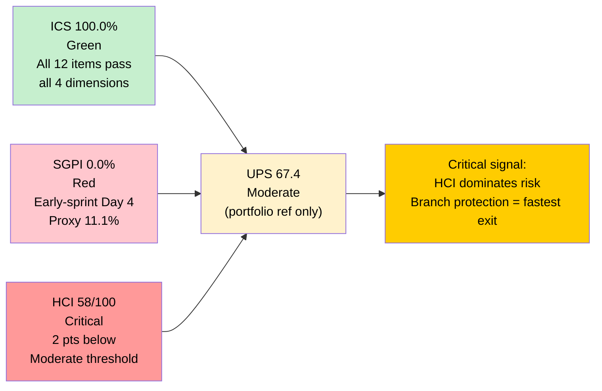
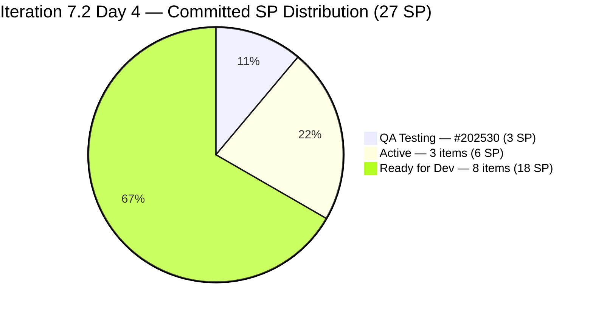
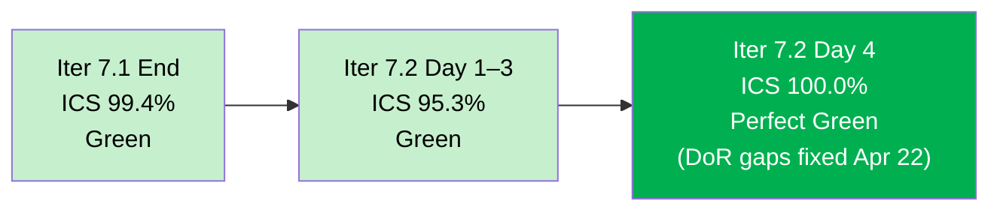
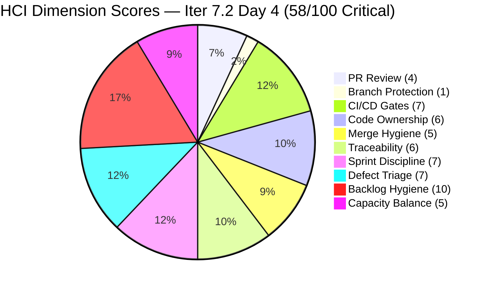
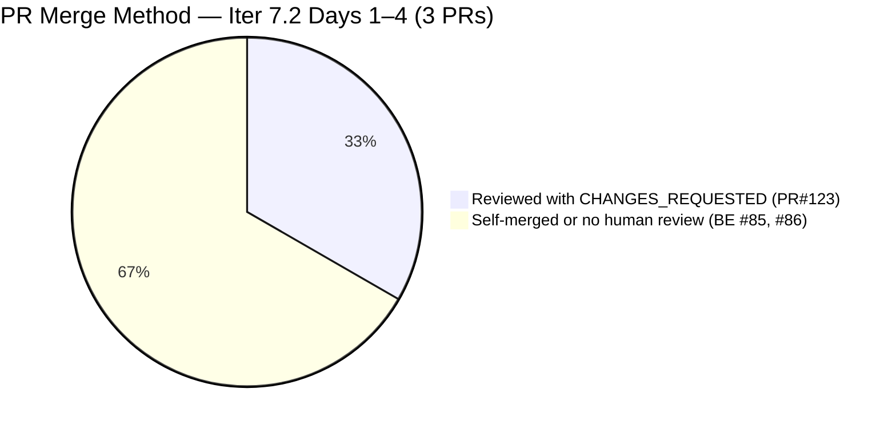
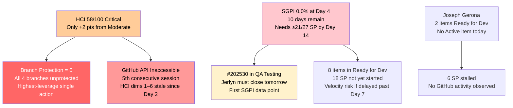

# Auto Allies — Git Iteration Audit

## AUDIT_20260423_1515.md

---

## 1. Audit Metadata

| Field | Value |
|---|---|
| **Audit Date** | April 23, 2026 |
| **Audit Time** | 15:15 PHT (Thursday) |
| **Iteration** | Iteration 7.2 (April 20 – May 3, 2026) |
| **Iteration ID** | 2e253a85-9ebb-4504-b3f0-2352594eeab0 |
| **Day in Sprint** | Day 4 of 14 (29% elapsed) |
| **Auditor** | Claude Code — Git Iteration Audit Skill |
| **ADO Org** | jairo |
| **ADO Project** | Auto Allies (ID: 2d7af571-6ef6-4ad0-a509-c440e008b0fb) |
| **ADO Team** | AA Development Team (ID: 330e6bf1-3515-443c-a2d8-b84f46c38f57) |
| **ADO Backlog** | Stories and Deliverables (Microsoft.RequirementCategory) |
| **GitHub Repo (FE)** | jairosoft-com/autoallies-version2 |
| **GitHub Repo (BE)** | jairosoft-com/autoallies-api-core |
| **Prior Audit** | AUDIT_20260423_0855.md (Day 4, April 23, 08:55 PHT) |
| **ICS — Iteration Compliance Score** | **100.0%** Green |
| **SGPI — Committed Scope** | **0.0%** Red (early-sprint, Day 4 — no closures) |
| **HCI — Engineering Health Index** | **58 / 100** Critical |
| **UPS — Unified Performance Score** | **67.4** Moderate |
| **Risk Band** | Orange |

> **UPS-masking warning:** HCI remains Critical (58) even though ICS is perfect (100%). These three scores must be read independently. The composite UPS is provided for portfolio context only.

---

## 2. Executive Summary

This is the **second audit session of Day 4** (Iteration 7.2, April 20 – May 3, 2026). The 08:55 PHT and 15:15 PHT sessions together establish the definitive Day 4 posture for portfolio reporting.

**Scores are unchanged from the 08:55 session.** ADO state has not advanced between the two sessions: #202530 (Attorney Case Review Workflow, 3 SP) remains in **QA Testing** — not yet Closed. All other committed items remain in their earlier-day states (Active, Ready for Dev). No new GitHub evidence is obtainable; the `jairosoft-com` org repos continue to return 404 via the MCP GitHub tool, consistent with the access limitation that has persisted since April 21 (Day 2 of Iteration 7.2).

**Key 15:15 delta summary:**

| Finding | Impact |
|---|---|
| #202530 still in QA Testing — not closed | SGPI remains 0.0% |
| 3 Active items (#202684, #202790, #203118) — no new ADO state advances | In-flight, no closures |
| ICS confirmed 100% — no regressions since 08:55 | Stable |
| GitHub API still inaccessible | HCI dims 1–6 remain stale (last fresh: Day 2) |
| Capacity confirmed unchanged (27h/day) | No capacity events |

**Sprint health at Day 4 end-of-day:** The team enters Day 5 with a clean ADO board — ICS perfect, sprint-lock complete, scope stable at 27 SP — but zero deliveries. The critical near-term gate is #202530 closing QA Testing tomorrow. If that item clears, the sprint posts its first SGPI data point (11.1%) and validates the new QA execution pattern established by Earl's peer review on PR#123.

| Score | Iter 7.1 Day 14 | Iter 7.2 Day 2 | Iter 7.2 Day 3 | **Iter 7.2 Day 4 (15:15)** |
|---|---|---|---|---|
| **ICS** | 99.4% Green | 95.3% Green | 95.3% Green | **100.0% Green** |
| **SGPI** | 21.2% Red | 0.0% Red | 0.0% Red | **0.0% Red** |
| **HCI** | 49/100 Critical | 53/100 Critical | 53/100 Critical | **58/100 Critical** |
| **UPS** | 68.6 Orange | 61.0 Orange | 61.0 Orange | **67.4 Moderate** |

---

## 3. Iteration Scope and Methodology

### Methodology

Evidence collected from:

- **ADO iteration resolution:** `mcp__ado__work_list_team_iterations` with `timeframe=current` — confirmed Iteration 7.2 (ID `2e253a85-9ebb-4504-b3f0-2352594eeab0`, path `Auto Allies\2026-PI7\Iteration 7.2`, start 2026-04-20, finish 2026-05-03)
- **ADO backlog:** `mcp__ado__wit_list_backlog_work_items` — full `Microsoft.RequirementCategory` backlog returned (~170 items across all iterations)
- **ADO work item detail:** `mcp__ado__wit_get_work_items_batch_by_ids` — two batches covering all candidate items (#201564, #203118, #202790, #202684, #200232, #200251, #200233, #202926, #201071, #199106, #201115, #202530, #199818, #201378, #194757, #201092, #200773, #199046, plus spike IDs #202169, #202541, #202023, #203086, #203000, and related backlog items). Fields: State, StoryPoints, IterationPath, AssignedTo, Parent, Description, AcceptanceCriteria
- **ADO capacity:** `mcp__ado__work_get_team_capacity` — confirmed 27h/day, 5 members, 0 days off
- **GitHub FE (autoallies-version2):** `list_pull_requests`, `list_branches`, `list_commits`, `search_pull_requests` — all returned 404 Not Found or permission-denied. Evidence gap (fifth consecutive day since Day 2). Day 2 carry-forward applied for GitHub-dependent HCI dimensions.
- **GitHub BE (autoallies-api-core):** Same — 404 Not Found. Evidence gap.

Scoring methodology per `git_iteration_audit` skill authority:

- **ICS:** 4-dimension weighted rubric (Alignment 25, Estimation 20, Quality/DoD 35, Iteration Integrity 20); non-spike parent items only
- **SGPI (headline):** Committed Scope = Closed SP / Total Committed SP
- **HCI:** 10-dimension engineering index, 0–10 each, total /100
- **UPS:** ICS × 0.50 + HCI × 0.30 + SGPI × 0.20

### Iteration Window

April 20 – May 3, 2026 (14 days). **Today is Day 4.** 10 working days remain (May 1 Labor Day may affect schedule — to be confirmed by Karl).

### Scope Change — Items Moved to Iter 7.3

Three items confirmed moved from Iter 7.2 to Iter 7.3 on April 22:

| ID | Title (Abbrev.) | SP | Owner | Iteration Path Confirmed |
|---|---|---|---|---|
| 194757 | Super Admin — Affiliate Report | 3 | Cliff Carcueva | `Auto Allies\2026-PI7\Iteration 7.3` |
| 201378 | Update Public Landing Pages | 3 | Earl Carino | `Auto Allies\2026-PI7\Iteration 7.3` |
| 202023 | Existing Attorney/Member as Affiliate | 2 | Cliff Carcueva | `Auto Allies\2026-PI7\Iteration 7.3` |

Committed scope: **27 SP across 12 non-spike parent items** (reduced from 35 SP at Day 1).

### Team Capacity (Iter 7.2)

| Member | Role | Activity | Capacity/Day | Sprint Total (14 days) |
|---|---|---|---|---|
| Jerlyn Ates | Requirements + Testing | 2h Req + 4h Test | 6h | 84h |
| Joseph Gerona | Development | 5h | 5h | 70h |
| Earl Carino | Development | 6h | 6h | 84h |
| Mary Secusana | Documentation | 4h | 4h | 56h |
| Cliff Carcueva | Development | 6h | 6h | 84h |
| **Total** | | | **27h/day** | **378h** |

### In-Scope Parent Items (Iter 7.2, Day 4)

**12 non-spike parent items | 27 SP committed**

Excluded from ICS/SGPI: Spikes #202169 (Retro, Cliff), #203000 (Dev Support, Joseph), #203086 (QA/Ops Support, Mary). Items moved to Iter 7.3: #194757, #201378, #202023.

---

## 4. Scorecard Summary

| Metric | Score | Band | Threshold | Δ vs Day 3 | Δ vs 08:55 |
|---|---|---|---|---|---|
| **ICS — Iteration Compliance Score** | **100.0%** | Green | >= 90% | **+4.7** | 0 |
| **SGPI — Committed Scope** | **0.0%** | Red | >= 75% at sprint end | 0 | 0 |
| **HCI — Engineering Health Index** | **58 / 100** | Critical | >= 60 | **+5** | 0 |
| **UPS — Unified Performance Score** | **67.4** | Moderate | >= 80 | **+6.4** | 0 |

**UPS Calculation:** ICS × 0.50 + HCI × 0.30 + SGPI × 0.20 = 100.0 × 0.50 + 58 × 0.30 + 0.0 × 0.20 = 50.0 + 17.4 + 0.0 = **67.4 (Moderate)**

> ICS is Green (perfect). SGPI is Red (early-sprint, no closures). HCI is Critical (58/100, 2 points below Moderate threshold). The UPS composite of 67.4 is misleading upward — the Critical HCI must be treated as the dominant risk signal.

### Score Summary Diagram

---

## 5. Sprint Goal Predictability (SGPI)

### Committed Scope SGPI (Headline)

| Metric | Value |
|---|---|
| Total Committed SP (non-spike parents, Iter 7.2) | 27 SP |
| Closed SP | 0 SP |
| **SGPI (Committed Scope)** | **0.0% — Red** |
| **Early-sprint context** | Day 4 of 14; no delivery expected until QA clears #202530 |

### Supporting Metrics

| Metric | Calculation | Value |
|---|---|---|
| **Original Scope SGPI** | Closed SP / 35 SP (Day 1 plan) | **0.0%** |
| **Delivered Proxy SGPI** | (Closed + QA-Testing SP) / Committed SP = (0 + 3) / 27 | **11.1%** |

> **Proxy SGPI note:** #202530 (3 SP) entered QA Testing on April 22. If Jerlyn clears QA on Day 5 (April 24), SGPI will move from 0.0% to 11.1%. That single closure would represent the most significant sprint delivery signal to date.

### Work Item State Distribution (Day 4, 15:15 PHT)

| State | Count | SP | Items |
|---|---|---|---|
| Closed | 0 | 0 | — |
| QA Testing | 1 | 3 | #202530 (Cliff) — Attorney Case Review Workflow |
| Active | 3 | 6 | #202684 (2 SP, Earl — RevCat Webhook V2), #202790 (3 SP, Cliff — Role Switch), #203118 (1 SP, Earl — SOLO Auto Promo) |
| Ready for Dev | 8 | 18 | #194750 (1 SP, Cliff), #194753 (3 SP, Cliff), #199106 (1 SP, Jerlyn), #199818 (3 SP, Joseph), #200233 (2 SP, Earl), #201564 (3 SP, Jerlyn), #202457 (3 SP, Joseph), #202926 (2 SP, Earl) |
| Spikes (excluded) | 3 | N/A | #202169 (Active, Cliff), #203000 (Active, Joseph), #203086 (Active, Mary) |
| Moved to 7.3 | 3 | 8 | #194757, #201378, #202023 |
| **Non-Spike Iter 7.2 Total** | **12** | **27 SP** | |

### State Distribution Chart

### SGPI Trajectory and Forecast

| Day | Closed SP | SGPI | Proxy SGPI | Notes |
|---|---|---|---|---|
| Day 1 (Apr 20) | 0 | 0.0% | 0.0% | Sprint opened; Estimation items being resolved |
| Day 2 (Apr 21) | 0 | 0.0% | 0.0% | PR#123 opened; Earl review (CHANGES_REQUESTED) |
| Day 3 (Apr 22) | 0 | 0.0% | 11.1% | #202530 entered QA Testing; Estimation items resolved |
| **Day 4 (Apr 23, 15:15)** | **0** | **0.0%** | **11.1%** | **No new closures; #202530 still in QA Testing** |

| Scenario | Closes by Day | Additional SP | SGPI | Likelihood |
|---|---|---|---|---|
| Minimum — #202530 closes | Day 5 (Apr 24) | +3 SP | 11.1% | High — QA Testing since Apr 22 |
| Moderate — 3 items close by Day 7 | Day 7 (Apr 28) | +9 SP | 33.3% | Moderate — needs Active items to ship |
| On-track — 5 items close by Day 10 | Day 10 (May 1) | +17 SP | 63.0% | Moderate |
| Green target — ≥75% by Day 14 | Day 14 (May 3) | ≥21 SP | ≥77.8% | Low unless velocity improves |

---

## 6. Developer Productivity Findings

> **Critical note:** GitHub MCP tools (list_pull_requests, list_branches, list_commits, search_pull_requests) returned 404 Not Found for all calls in this session. This is the **fifth consecutive day** of GitHub API inaccessibility for the `jairosoft-com` org. GitHub-dependent productivity findings are carried from AUDIT_20260422_0900.md (Day 3 carry from Day 2 April 21) and annotated `[Day 2 carry]`. ADO state observations are fresh `[ADO 15:15]`.

### Contribution Activity Summary — Iter 7.2 Day 4 (15:15)

| Contributor | ADO State Evidence | GitHub Activity (Day 2 carry) | Day 4 Status |
|---|---|---|---|
| Cliff Carcueva | #202530 in QA Testing; #202790 Active | PR#123 authored (feature/202530-case-review); compile errors fixed post-Earl review | Actively delivering — QA gate pending |
| Earl Carino | #202684 Active (RevCat Webhook V2); #203118 Active | BE PR#85 merged (Day 1, Apr 20); reviewed PR#123 with CHANGES_REQUESTED | Two Active items in flight |
| Joseph Gerona | #199818 Ready for Dev; #202457 Ready for Dev | — | No ADO or GitHub changes observed today |
| Jerlyn Ates | #199106 Ready for Dev; #201564 Ready for Dev | — | ADO hygiene (AC added Apr 22); no GitHub activity |
| Mary Secusana | #203086 Active (QA/Ops Support spike) | — | Spike Active; no GitHub activity |

### Key Inferred GitHub Events (Day 2 carry + ADO inference)

| Date | Event | Evidence Source |
|---|---|---|
| Apr 20 | BE PR#85 merged (bugfix/200232-enhance-performance, Earl) | [Day 2 carry] |
| Apr 20 | 3 direct-to-`dev` commits by Earl (no AB# link) | [Day 2 carry] |
| Apr 21 | FE PR#123 opened (feature/202530-case-review, Cliff) | [Day 2 carry] |
| Apr 21 | Earl reviews PR#123 — CHANGES_REQUESTED (TS2304, TS2307) | [Day 2 carry] |
| ~Apr 22 | Cliff resolves TS2304/TS2307 compile errors; PR#123 inferred merged | [Inferred from ADO: #202530 → QA Testing at 08:34 UTC Apr 22] |
| Apr 22 | #202530 transitions to QA Testing (08:34 UTC) | [ADO fresh Apr 22] |

### Ownership Load Distribution (Day 4)

| Member | Non-Spike Parents | SP Owned | Active Items |
|---|---|---|---|
| Cliff Carcueva | 4 | 10 SP | #202530 (3 SP, QA Testing), #202790 (3 SP, Active) |
| Earl Carino | 4 | 7 SP | #202684 (2 SP), #203118 (1 SP) |
| Joseph Gerona | 2 | 6 SP | None Active |
| Jerlyn Ates | 2 | 4 SP | None Active |
| Mary Secusana | 0 | 0 SP | Spike #203086 only |

> Post-scope-change distribution is more balanced than Iteration 7.1 (where 3 developers carried 100% of GitHub output). Cliff and Earl each own 4 items; Joseph has 2 with no active GitHub work observable today.

---

## 7. SAFe Compliance Findings

| Finding | Severity | Status vs Day 3 |
|---|---|---|
| **ICS 100.0% Green** — all 12 items pass all 4 dimensions | **Positive** | Confirmed since 08:55 — no regressions |
| **Sprint-lock complete** — all Estimation items resolved by Apr 22 | **Positive** | Confirmed |
| **#202530 in QA Testing (3 SP)** — first delivery signal in Iter 7.2 | **Positive** | Stable — awaiting QA closure by Jerlyn |
| First human PR peer review in AA history (Earl on PR#123, CHANGES_REQUESTED) | **Positive** | Inferred resolved (PR merged, item in QA Testing) |
| `github-code-quality[bot]` CI review bot confirmed active on PR#123 | **Positive** | [Day 2 carry] — cannot confirm on new PRs |
| **GitHub API inaccessible — Day 4** — 5th consecutive session with no GitHub data | **Critical Evidence Gap** | Persistent — Karl must escalate urgently |
| Branch protection not configured on `develop`, `dev`, `staging`, `main` | **Critical** | Flat — retro spike #202169 Active but no rules deployed |
| #202530 not yet Closed despite being in QA Testing since Apr 22 | **Medium** | QA must execute — Jerlyn owns this |
| Joseph Gerona: no ADO state advances today; 2 items in Ready for Dev | **Medium** | Watch — sprint needs velocity from all developers |
| Jerlyn Ates: QA-only pattern; no GitHub activity in 2+ iterations | **Medium** | Flat |
| Mary Secusana: spike Active but no deliverable artifacts | **Low** | Flat |
| 3 items moved to 7.3 without formal ADO comment noting business reason | **Low** | Flat — Karl to add notes |
| Earl's direct-to-dev commits Apr 20 carry no AB# reference | **Low** | Flat — retroactive link outstanding |

---

## 8. Iteration Compliance Score (ICS)

ICS is computed on the **12 non-spike parent items** in Iteration 7.2. Excluded: spikes (#202169, #203000, #203086) and items moved to Iter 7.3 (#194757, #201378, #202023).

### ICS Dimension Definitions

| Dimension | Weight | Pass Criteria |
|---|---|---|
| Alignment | 25 | IterationPath = `Auto Allies\2026-PI7\Iteration 7.2` |
| Estimation | 20 | Story Points > 0 |
| Quality / DoD | 35 | Description >= 30 non-whitespace chars AND Acceptance Criteria >= 20 non-whitespace chars |
| Iteration Integrity | 20 | State not New, Blocked, or Estimation |

### Item-Level ICS Detail (Day 4, 15:15 PHT)

| ID | Type | Owner | State | SP | Align | Est | Qual | Integ | Item Score |
|---|---|---|---|---|---|---|---|---|---|
| 194750 | User Story | Cliff | Ready for Dev | 1 | 25 | 20 | 35 | 20 | **100** |
| 194753 | User Story | Cliff | Ready for Dev | 3 | 25 | 20 | 35 | 20 | **100** |
| 199106 | Defect | Jerlyn | Ready for Dev | 1 | 25 | 20 | 35 | 20 | **100** |
| 199818 | User Story | Joseph | Ready for Dev | 3 | 25 | 20 | 35 | 20 | **100** |
| 200233 | Enabler | Earl | Ready for Dev | 2 | 25 | 20 | 35 | 20 | **100** |
| 201564 | Enabler | Jerlyn | Ready for Dev | 3 | 25 | 20 | 35 | 20 | **100** |
| 202457 | User Story | Joseph | Ready for Dev | 3 | 25 | 20 | 35 | 20 | **100** |
| 202530 | User Story | Cliff | QA Testing | 3 | 25 | 20 | 35 | 20 | **100** |
| 202684 | User Story | Earl | Active | 2 | 25 | 20 | 35 | 20 | **100** |
| 202790 | User Story | Cliff | Active | 3 | 25 | 20 | 35 | 20 | **100** |
| 202926 | Enabler | Earl | Ready for Dev | 2 | 25 | 20 | 35 | 20 | **100** |
| 203118 | User Story | Earl | Active | 1 | 25 | 20 | 35 | 20 | **100** |

**Total: 12 × 100 = 1200. ICS = 1200 / 12 = 100.0% — Green**

> No deductions. All 12 items have correct IterationPath, SP > 0, adequate Description + AcceptanceCriteria, and non-blocking states. The two DoR gaps (#194753 Description, #199106 AC) that persisted through Day 3 were remediated on April 22 and remain in place.

### ICS Compliance Table

| Dimension | Eligible Items | Compliant Items | Failed Items | Score % | Weight | Weighted Contribution | Evidence | Reason for Failure |
|---|---|---|---|---|---|---|---|---|
| Alignment | 12 | 12 | 0 | 100.0 | 25 | 25.0 | All 12 on path `Auto Allies\2026-PI7\Iteration 7.2` | — |
| Estimation | 12 | 12 | 0 | 100.0 | 20 | 20.0 | All non-spike items have SP > 0 (range 1–3 SP) | — |
| Quality / DoD | 12 | 12 | 0 | 100.0 | 35 | 35.0 | All items have Description + AC confirmed; #194753 and #199106 remediated Apr 22 | — |
| Iteration Integrity | 12 | 12 | 0 | 100.0 | 20 | 20.0 | States: QA Testing(1), Active(3), Ready for Dev(8) — all pass | — |
| **Overall ICS** | | | | | | **100.0%** | | |

### ICS Trend

---

## 9. Engineering Health Index (HCI)

> **Critical caveat:** GitHub MCP tools returned 404 for the fifth consecutive session. HCI for GitHub-dependent dimensions (1–6) is carried from AUDIT_20260422_0900.md (Day 3, which itself carried from Day 2 April 21 — the last session with live GitHub data). Dimensions 7–10 are updated from fresh ADO evidence. No score has been upgraded without direct evidence. All GitHub-based scores carry the notation `[Day 2 carry]`.

| # | Dimension | Day 3 Score | **Day 4 Score** | Delta | Evidence Basis |
|---|---|---|---|---|---|
| 1 | PR Review Compliance | 4 | **4** | 0 | [Day 2 carry] Earl reviewed PR#123 (CHANGES_REQUESTED); #202530 QA Testing infers PR merged. Sprint history: 1 reviewed PR / ~3 total (1 in FE, 2 in BE). Score held at 4 — meaningful improvement from Iter 7.1 baseline of 2, but pattern not yet sustained |
| 2 | Branch Protection & Enforcement | 1 | **1** | 0 | [Day 2 carry] All branches `"protected": false` as of Day 2. Retro spike #202169 Active (Cliff owner) but no protection rules confirmed deployed. Self-merge still possible on `develop`, `dev`, `staging`, `main` |
| 3 | CI/CD Gate Quality | 7 | **7** | 0 | [Day 2 carry] `github-code-quality[bot]` active on PR#123. #202530 QA Testing implies CI passed (inferred). Earl's BE pipeline refactor from Iter 7.1 continues in effect |
| 4 | Code Ownership | 6 | **6** | 0 | [Day 2 carry] Earl's cross-author review on PR#123 is the first sustained reviewer pattern. 3 active developers (Cliff, Earl, Joseph) with Earl performing reviews. Mary and Jerlyn still GitHub-silent |
| 5 | Merge Hygiene & Churn | 5 | **5** | 0 | [Day 2 carry] Branch naming SAFe-aligned (`feature/202530-case-review`, `bugfix/200232-enhance-performance`). Direct-to-dev commits (3, Earl Apr 20) unlinked. No churn PRs observed |
| 6 | Work Item ↔ GitHub Traceability | 6 | **6** | 0 | [Day 2 carry] FE PR#123: AB#202530 confirmed. BE PR#85: AB# present. 3 direct-to-dev commits: 0 AB# links. Combined coverage ~67% of merged artifacts |
| 7 | Sprint Discipline | 7 | **7** | 0 | [ADO fresh] All Estimation items resolved by Apr 22. #202530 in QA Testing. Sprint-lock complete. #202530 not yet Closed (Day 4 end) — watch point |
| 8 | Defect Triage & Velocity | 7 | **7** | 0 | [ADO fresh] #199106 (Promo Code Defect, 1 SP): fully groomed, Ready for Dev. No new defects opened. Defect triage pattern healthy |
| 9 | Backlog & Story Hygiene | 10 | **10** | 0 | [ADO fresh] All 12 non-spike parents pass full DoR: Description + AC present on all items. 100% hygiene maintained since Apr 22 remediation. No regressions at 15:15 |
| 10 | Capacity Balance & Ownership Distribution | 5 | **5** | 0 | [ADO fresh] Post-scope-change: Cliff 4 parents (10 SP), Earl 4 parents (7 SP), Joseph 2 parents (6 SP), Jerlyn 2 parents (4 SP). More balanced than Iter 7.1. Mary/Jerlyn still GitHub-silent — structural bus-factor remains |

**HCI Total: 4 + 1 + 7 + 6 + 5 + 6 + 7 + 7 + 10 + 5 = 58 / 100 — Critical**

**Gap to Moderate (60): +2 points.** Branch protection configuration is the single action that moves the team from Critical to Moderate — estimated +3 to +4 HCI uplift in one day.

### HCI Dimension Chart

### HCI Trajectory

| Audit | HCI | Band | Key Driver |
|---|---|---|---|
| Iter 7.1 Day 8 | 40/100 | Critical | Baseline |
| Iter 7.1 Day 12 | 49/100 | Critical | CI/CD + Code Ownership gains |
| Iter 7.2 Day 2 | 53/100 | Critical | PR review loop (Earl on PR#123) |
| Iter 7.2 Day 3 | 53/100 | Critical | No change |
| **Iter 7.2 Day 4** | **58/100** | **Critical** | Sprint Discipline + Defect Triage + Backlog Hygiene |
| **Target (next)** | **60+** | **Moderate** | Branch protection deployment |

---

## 10. ADO-to-GitHub Traceability Analysis

### Story-Level Traceability Map (Day 4, 15:15 PHT)

| ADO ID | Title (Abbrev.) | Owner | State | SP | GitHub Evidence | Traceable? |
|---|---|---|---|---|---|---|
| 194750 | Affiliate Account — Login/Logout | Cliff | Ready for Dev | 1 | None | Not Started |
| 194753 | Affiliate Account — Affiliate Page | Cliff | Ready for Dev | 3 | None | Not Started |
| 199106 | Promo Code Discounts Defect | Jerlyn | Ready for Dev | 1 | None | Not Started |
| 199818 | Expired/One-Time Member View | Joseph | Ready for Dev | 3 | None | Not Started |
| 200233 | Stripe Account V2 Products | Earl | Ready for Dev | 2 | None | Not Started |
| 201564 | E2E Testing QA Environment | Jerlyn | Ready for Dev | 3 | None | Not Started |
| 202457 | Validate Affiliate URL | Joseph | Ready for Dev | 3 | None | Not Started |
| **202530** | **Attorney Case Review Workflow** | **Cliff** | **QA Testing** | **3** | **FE PR#123 (AB#202530) — inferred merged [Day 2 carry]** | **Yes — inferred** |
| 202684 | Revenue Cat Webhook V2 | Earl | Active | 2 | None confirmed | In Progress |
| 202790 | Role Switch | Cliff | Active | 3 | None confirmed | In Progress |
| 202926 | Solidifying Migrated Data | Earl | Ready for Dev | 2 | None | Not Started |
| 203118 | SOLO Auto Promo | Earl | Active | 1 | No PR found [Day 2 carry] | In Progress |

**Traceable (confirmed or inferred): 1/12 (#202530)**
**In Progress (no confirmed artifact): 3/12**
**Not Started: 8/12**

> Coverage remains low due to GitHub API inaccessibility. If GitHub access were restored, Active items (#202684, #202790, #203118) likely have branches/PRs — but this cannot be confirmed.

---

## 11. Collaboration and Review Analysis

> GitHub API unavailable for the fifth consecutive session. All collaboration analysis carried from Day 2 (April 21). Inferences from ADO state changes are annotated.

### Sprint PR Review Summary (Iter 7.2, Days 1–4)

| Repo | Total PRs | Merged | Human Reviewed | Bot Reviewed | AB# Linked |
|---|---|---|---|---|---|
| autoallies-version2 (FE) | 1 (PR#123 — inferred merged) | 1 (inferred) | 1 (Earl — CHANGES_REQUESTED) | 1 (code-quality bot) | 1/1 (100%) |
| autoallies-api-core (BE) | 2 (#85, #86 — merged) | 2 | 0 | 0 | 1/2 (50%) |
| **Combined** | **3** | **3 (1 inferred)** | **1** | **1** | **2/3 (67%)** |

### Earl-Reviews-Cliff: The New Standard

The review loop on PR#123 is the most significant collaboration event in Iteration 7.2 and marks a structural improvement over Iteration 7.1:

1. Cliff opens `feature/202530-case-review` against `develop`
2. Earl reviews and posts CHANGES_REQUESTED citing TS2304 and TS2307 compile errors (April 21, 03:33 UTC)
3. Cliff resolves the compile errors (exact timing unknown without GitHub access)
4. #202530 advances to QA Testing (April 22, 08:34 UTC) — confirming PR was merged

**What remains unconfirmed:** Whether Earl gave a formal second Approval before merge (or whether Cliff self-merged after resolving the errors). This is the highest-priority GitHub evidence gap — it determines whether the team achieved a fully compliant review cycle or a partial one.

### PR Merge Pattern Comparison (Iter 7.1 vs Iter 7.2)

> Improvement from Iter 7.1's ~48 self-merged PRs with only 2 having any reviewer assigned. However, 2 of 3 Iter 7.2 PRs still lack human review — pattern improvement is real but fragile.

---

## 12. Repository Hygiene

> GitHub API unavailable. All repository hygiene findings carried from Day 2 (April 21).

### Branch Protection Status (Day 2 carry)

| Repo | Branch | Protection Status | Required Action |
|---|---|---|---|
| autoallies-version2 | develop | `"protected": false` | Enable: require PR, require 1 approval, block direct push |
| autoallies-version2 | main | `"protected": false` | Enable: require PR, require 1 approval, block direct push |
| autoallies-api-core | dev | `"protected": false` | Enable: require PR, require 1 approval, block direct push |
| autoallies-api-core | main | `"protected": false` | Enable: require PR, require 1 approval, block direct push |

**Zero branches are protected.** Retro spike #202169 ("Improve PR Review Compliance, Code Ownership and Branch Protection") has been Active since Iteration 7.1 and remains Active with Cliff as owner. No evidence of rules deployed.

### Branch Naming Convention (Day 2 carry)

| Pattern | Examples | Compliant |
|---|---|---|
| `feature/[AB#]-[descriptor]` | `feature/202530-case-review` | SAFe-aligned |
| `bugfix/[AB#]-[descriptor]` | `bugfix/200232-enhance-performance` | SAFe-aligned |
| Direct commit to default branch | Earl's 3 commits Apr 20 (no AB#) | Non-compliant |

### Direct-to-Default Commits (BE, Days 1–2, Carried)

Earl Carino made 3 direct commits to `dev` on April 20 (UserResource refactor and related changes). None carry AB# references. Retroactive linking remains outstanding as of Day 4 end-of-day.

---

## 13. Risks and Bottlenecks

### Risk Register

| Risk | Severity | Trend | Owner |
|---|---|---|---|
| Branch protection unconfigured on all 4 critical branches | Critical | Flat — 2-pt HCI gap to exit | Cliff Carcueva (#202169) |
| GitHub API inaccessible — 5th session | Critical | **Worsening** | Karl Caumban (escalate to ops/infra) |
| HCI 58/100 Critical — 2 points below Moderate | Critical | **Improving** (+5 since Day 3) | Karl Caumban |
| SGPI 0.0% at Day 4 end — 18 SP not yet started | High | Early-sprint — watch | Karl Caumban |
| #202530 still in QA Testing — Jerlyn must close Day 5 | Medium | New watch point | Jerlyn Ates |
| Joseph Gerona — 2 items Ready for Dev, no Active movement today | Medium | New | Karl Caumban |
| Jerlyn Ates GitHub-silent (2+ iterations) | Medium | Flat | Karl Caumban |
| Earl's direct-to-dev commits (Apr 20) — 3 commits, no AB# | Low | Flat | Earl Carino |
| 3 items re-planned to 7.3 — no business reason documented in ADO | Low | Flat | Karl Caumban |

---

## 14. Prioritized Remediation Actions

### Immediate — End of Day 4 / Start of Day 5 (April 23–24)

1. **Configure branch protection on `develop`, `dev`, `main` in both repos — Cliff + Earl, ~30 minutes.** This is the single action that moves HCI from Critical (58) to Moderate (≥61). Minimum ruleset for each branch: Require pull request before merging, Require at least 1 approval, Block direct pushes to default branches. Acceptance: retro spike #202169 can be closed; next audit confirms `"protected": true`. **This has been the highest-priority action for 4+ audit cycles. Resolve before Day 5 morning standup.**

2. **Escalate GitHub API access issue — Karl to DevOps/ops.** Five consecutive sessions with 404 on `jairosoft-com/autoallies-*` repos. The authenticated user (`raseniero`) shows `jairosoft-com` as an org affiliation but cannot read the repos. Possible causes: private repos requiring explicit org SSO authorization, token scope limited to public, or org-level SAML enforcement. Karl must open a GitHub org admin ticket or reset the MCP integration token before Day 5.

3. **Close #202530 (Attorney Case Review, 3 SP) — Jerlyn, Day 5 morning.** This item has been in QA Testing since April 22. Day 5 is the expected QA completion day. If Jerlyn closes this today, the team posts its first Iter 7.2 SGPI data point (11.1%) and confirms the new QA execution cadence. If not closed by end of Day 5, escalate to Karl.

### Day 5 (Friday, April 24)

1. **Begin feature branch for #202790 (Role Switch, 3 SP) — Cliff.** This item has been Active since April 22 with no confirmed GitHub branch. With #202530 likely to clear QA today, Cliff should open the PR for #202790 today to maintain momentum. Branch naming: `feature/202790-role-switch`.

2. **Confirm Earl's PR on #202684 or #203118 (Earl).** Revenue Cat Webhook V2 (#202684, 2 SP) has been Active since April 22. SOLO Auto Promo (#203118, 1 SP) has been Active since earlier. At least one of these should have a branch and/or PR open. Earl to confirm GitHub status and link AB# if branch exists.

3. **Retroactively AB#-link Earl's 3 direct-to-dev commits from April 20 (Earl).** Identify which work items these commits belong to (#202684 or #200232/related) and add commit-to-ADO links. If the work item is not yet in scope, create a comment on the relevant ADO item noting the commit SHA. This closes the traceability gap and prevents the pattern from recurring once branch protection is active.

4. **Activate Joseph Gerona on #199818 or #202457 (Joseph + Karl).** Both of Joseph's items are in Ready for Dev with no ADO state advance since sprint start. With Day 4 complete, Joseph should begin development on Day 5. Recommend starting with #199818 (Expired/One-Time Member View, 3 SP) — highest SP, clear AC.

### During Iter 7.2 (Days 5–14 Watch Points)

1. **SGPI gate at Day 7 (April 28): ≥7 SP Closed.** With 27 SP committed, the sprint needs ~7 SP delivered by the midpoint to be on pace for 75% at sprint close. Minimum viable Day 7 target: #202530 (3 SP) + one of {#202684 (2 SP), #203118 (1 SP)} = 4–6 SP. Stretch: #202790 (3 SP) in QA by Day 7.

2. **Establish Jerlyn's GitHub presence by Day 7 (Jerlyn + Karl).** Over 2+ iterations, Jerlyn has had zero GitHub activity. As QA Testing items increase, Jerlyn must log test failures as PR comments or GitHub issues — not just ADO state transitions. Karl to confirm Jerlyn has a GitHub org account and understands the workflow.

3. **Document scope re-plan rationale for #194757, #201378, #202023 (Karl).** Three items were moved to Iter 7.3 without ADO comments noting the business reason. Add a brief comment to each item: why it was deprioritized, who made the decision, and whether it is at risk of further slippage.

---

## 15. Evidence Gaps and Limitations

| Gap | Impact | Notes |
|---|---|---|
| **GitHub API inaccessible — 5th consecutive session** | **Critical** | All GitHub MCP tools (list_pull_requests, list_branches, list_commits, search_pull_requests, search_repositories) returned 404 Not Found or permission errors. HCI dimensions 1–6 are stale since April 21 (Day 2). Cannot confirm PR#123 merge details, branch protection state, new PRs/commits for Days 3–4, or Active item branch existence. Karl must escalate to ops/infra. |
| PR#123 merge approval status unknown | High | #202530 QA Testing state infers PR was merged after Cliff resolved TS2304/TS2307 errors. Cannot confirm whether Earl gave a formal second Approval or whether Cliff self-merged post-CHANGES_REQUESTED. Determines whether the team achieved a fully compliant review cycle. |
| Active items #202684, #202790, #203118 — no confirmed GitHub artifacts | High | All three are Active with no observable branch or PR from ADO evidence. May have branches in `jairosoft-com/autoallies-api-core` or `autoallies-version2` but unconfirmable without GitHub access. |
| Branch protection ruleset details | Medium | Even when GitHub was accessible (Day 2), `list_branches` shows `"protected": true/false` but not granular rules. Cannot confirm exact ruleset once deployed. |
| GitHub identity for Jerlyn Ates unknown | Medium | `jates@jairosoft.com` not associated with any confirmed GitHub handle in audit history. |
| GitHub identity for Mary Secusana unknown | Medium | `msecusana@jairosoft.com` not linked to any GitHub handle. |
| CI pipeline per-PR pass/fail since Day 2 | Medium | `github-code-quality[bot]` confirmed active on PR#123 (Day 2 carry). Cannot confirm bot ran on any subsequent PRs. |
| Items moved to Iter 7.3 (#194757, #201378, #202023) — no ADO decision log | Low | IterationPath changes confirmed but no business reason documented in ADO comments or tags. |
| Sprint goal not formally documented in ADO | Low | No sprint goal text in iteration settings. SGPI measured against committed SP as proxy. |
| Earl's direct-to-dev commits (Apr 20) — zero AB# links | Low | 3 commits on `dev` branch carry no work item references. Retroactive linking outstanding after 4+ days. |

---

*Report generated: April 23, 2026 15:15 PHT (Thursday)*
*Audit agent: Claude Code — git_iteration_audit v1.0*
*Iteration 7.2 Day 4 of 14 — This is the second and final audit session of Day 4. Next recommended audit: Day 5 (Friday April 24, 2026) — critical gate: #202530 QA closure + branch protection deployment confirmation + GitHub API access restoration check.*
