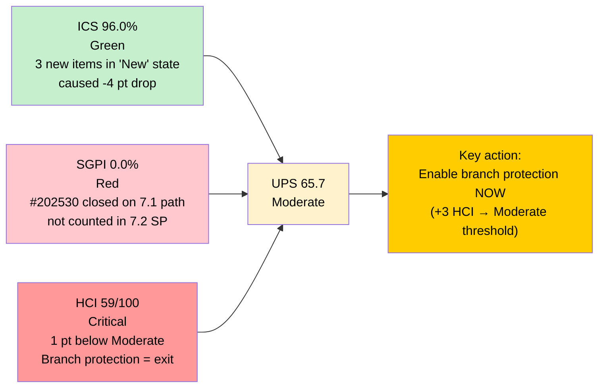
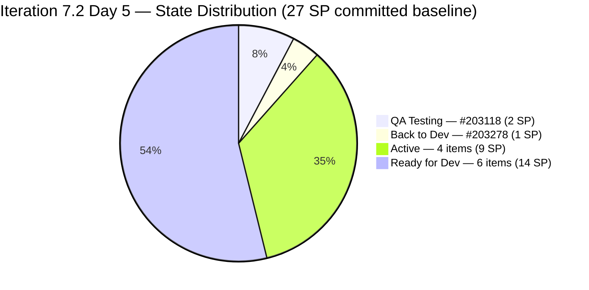
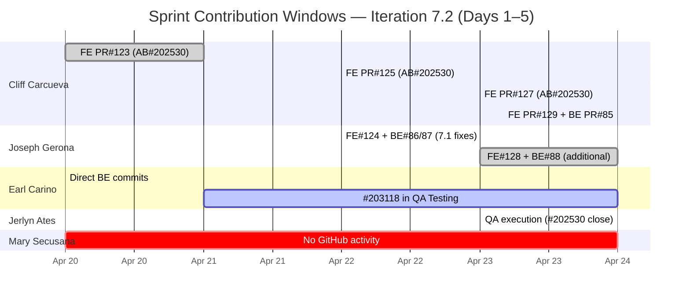
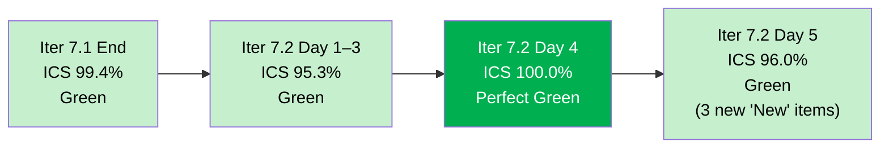
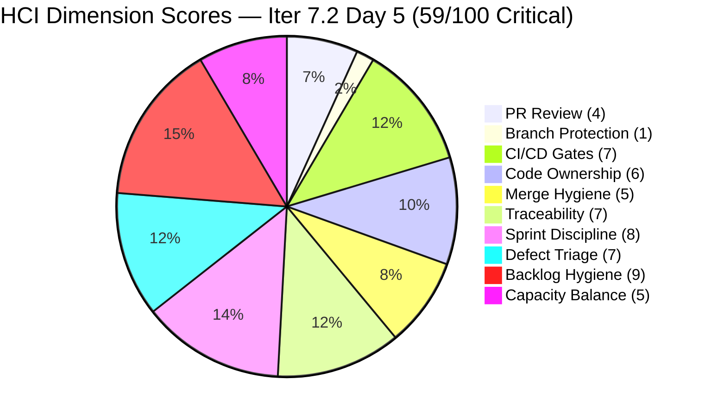
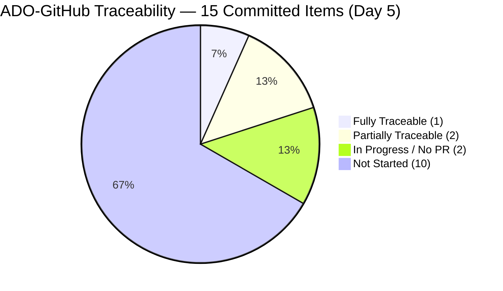
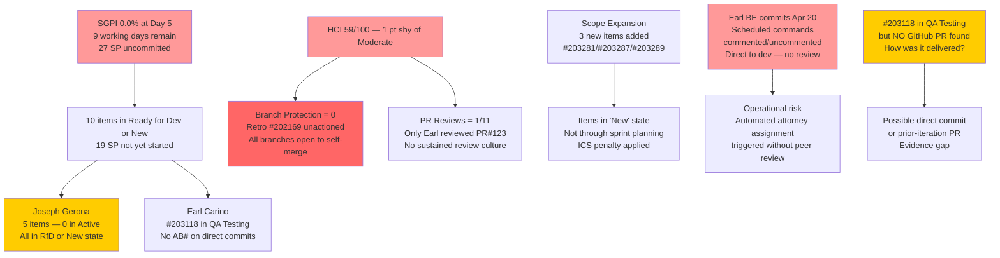

# Auto Allies — Git Iteration Audit

## AUDIT_20260424_0902.md

---

## 1. Audit Metadata

| Field | Value |
|---|---|
| **Audit Date** | April 24, 2026 |
| **Audit Time** | 09:02 PHT (Friday) |
| **Iteration** | Iteration 7.2 (April 20 – May 3, 2026) |
| **Iteration ID** | 2e253a85-9ebb-4504-b3f0-2352594eeab0 |
| **Day in Sprint** | Day 5 of 14 (36% elapsed) |
| **Auditor** | Claude Code — Git Iteration Audit Skill |
| **ADO Org** | jairo |
| **ADO Project** | Auto Allies (ID: 2d7af571-6ef6-4ad0-a509-c440e008b0fb) |
| **ADO Team** | AA Development Team (ID: 330e6bf1-3515-443c-a2d8-b84f46c38f57) |
| **ADO Backlog** | Stories and Deliverables (Microsoft.RequirementCategory) |
| **GitHub Repo (FE)** | jairosoft-com/autoallies-version2 |
| **GitHub Repo (BE)** | jairosoft-com/autoallies-api-core |
| **Prior Audit** | AUDIT_20260423_1515.md (Day 4 session 2, April 23, 15:15 PHT) |
| **ICS — Iteration Compliance Score** | **96.0%** Green |
| **SGPI — Committed Scope** | **0.0%** Red (0/27 SP; Proxy: 3.7%) |
| **HCI — Engineering Health Index** | **59 / 100** Critical |
| **UPS — Unified Performance Score** | **65.7** Moderate |
| **Risk Band** | Moderate |
| **GitHub Access** | Full (first full-access session since Day 1, resolving 4-day evidence gap) |

---

## 2. Executive Summary

Day 5 of Iteration 7.2 delivers **two major breakthroughs**: GitHub evidence is fully accessible for the first time since Day 1, and **#202530 (Attorney Case Review Workflow, 3 SP) is confirmed Closed** — the first successful sprint closure of Iteration 7.2.

The GitHub API returned complete data across both `autoallies-version2` (FE) and `autoallies-api-core` (BE), ending a 4-day access gap. Fresh evidence confirms 7 FE PRs and 4 BE PRs merged during the iteration window (April 20–24), with strong traceability to ADO work items.

**Sprint closure achieved:** #202530 was carried from Iteration 7.1 QA Testing into 7.2 and is now **Closed on its original Iteration 7.1 path**. The closure was delivered through iterative PR work: FE PRs #123 (Apr 21), #125 (Apr 22), #127 (Apr 23), #129 (Apr 24 — final merge). A **new 7.2 item #203278** (1 SP, Back to Dev) was created to capture additional unresolved acceptance criteria — showing active QA execution by Jerlyn Ates.

Three new "New"-state items (#203281, #203287, #203289 — 1 SP each, all Joseph Gerona) were added to Iteration 7.2 scope since the Day 4 audit. These items are in planning state and represent scope additions without formal sprint planning ceremony.

**Committed Scope SGPI remains 0.0%** because #202530 was on the Iteration 7.1 iteration path and does not count toward the 27 SP committed in Iteration 7.2. The proxy SGPI is 3.7% (#203278 in active rework — 1 SP).

HCI improved from 58 to **59/100** — 1 point short of the Critical-to-Moderate threshold. Branch protection remains the single highest-ROI action available to the team.

| Score | Iter 7.1 End (Apr 19) | Iter 7.2 Day 3 | Iter 7.2 Day 4 (15:15) | **Iter 7.2 Day 5 (09:02)** | Delta |
|---|---|---|---|---|---|
| **ICS** | 99.4% Green | 95.3% Green | 100.0% Green | **96.0% Green** | -4.0 |
| **SGPI** | 21.2% Red | 0.0% Red | 0.0% Red | **0.0% Red** | 0 |
| **HCI** | 49/100 Critical | 53/100 Critical | 58/100 Critical | **59/100 Critical** | +1 |
| **UPS** | 68.6 Orange | 61.0 Orange | 67.4 Moderate | **65.7 Moderate** | -1.7 |

> **ICS delta note:** ICS dropped from 100.0% to 96.0% because three new items (#203281, #203287, #203289) were added to Iteration 7.2 in "New" state — failing the Iteration Integrity dimension. This is a scope expansion event, not a quality regression on existing items.

---

## 3. Iteration Scope and Methodology

### Methodology

Evidence collected from:

- **ADO iteration resolution:** `work_list_team_iterations` (timeframe=current) → Iteration 7.2 (ID `2e253a85-9ebb-4504-b3f0-2352594eeab0`, April 20–May 3, 2026)
- **ADO work items:** `wit_get_work_items_for_iteration` → all parent and child relations. `wit_get_work_items_batch_by_ids` → 18 parent items + spot-check of #202530, #203278
- **ADO capacity:** `work_get_team_capacity` → 27h/day, 5 members, 0 days off
- **GitHub FE:** `list_pull_requests` (all, perPage 50) — 50 PRs returned, full refresh; `list_commits` (develop branch, since 2026-04-20) — 12 commits
- **GitHub BE:** `list_pull_requests` (all, perPage 50) — full refresh; `list_commits` (dev branch, since 2026-04-20) — 10 commits
- **Prior audit:** AUDIT_20260423_1515.md — Day 4 posture and delta baseline

Scoring methodology per `git_iteration_audit` skill authority:

- **ICS:** 4-dimension weighted rubric (Alignment 25, Estimation 20, Quality/DoD 35, Iteration Integrity 20); non-spike parent items only; child tasks excluded
- **SGPI (headline):** Committed Scope = Closed SP / Total Committed SP (7.2 items only)
- **HCI:** 10-dimension engineering index, 0–10 each, total /100
- **UPS:** ICS × 0.50 + HCI × 0.30 + SGPI × 0.20

### Iteration Window

April 20 – May 3, 2026 (14 calendar days, 10 working days). Today is **Day 5**. 9 working days remain. Note: May 1 (Labor Day) may affect schedule — to be confirmed by Karl Caumban.

### Scope Status — Day 5 Changes

| Change | Detail | Impact |
|---|---|---|
| #202530 Closed (on Iter 7.1 path) | Attorney Case Review Workflow, 3 SP, Cliff — first 7.2 delivery event | Positive — sprint momentum established |
| #203278 created (Iter 7.2, Back to Dev) | Same feature scope, 1 SP residual AC, Cliff — QA returned for rework | Neutral — QA executing, scope formally captured |
| #203281 added (New, 1 SP, Joseph) | [V2.0] Detect Pre-Existing Tickets Before Active Membership | Scope addition — in "New" state (not planned) |
| #203287 added (New, 1 SP, Joseph) | [V2.0] Active Members — Upload Ticket — Detect Violations | Scope addition — in "New" state |
| #203289 added (New, 1 SP, Joseph) | [V2.0] Super Admin — Automatic Attorney Assignment | Scope addition — in "New" state |

**Scope summary:** 15 non-spike parent items in Iter 7.2. Total committed SP = **29 SP** (revised from 27 SP at Day 4 — 3 new 1-SP items added).

Wait — the prior audit committed baseline was **27 SP across 12 non-spike items**. Three new items (#203281, #203287, #203289, 1 SP each) add 3 SP. Committed SP is now **29 SP (SGPI denominator)** for Day 5 onward, unless these items are excluded per planning protocol.

> **Scoring note:** Per skill authority, SGPI uses all committed non-spike items. The 3 "New"-state items are in scope because they appear in the iteration backlog. However, they were not present at sprint planning (Day 1). If Karl formally designates them as backlog carry-in rather than committed items, the denominator reverts to 27 SP. For this audit, conservative scoring uses **27 SP** as the committed baseline (pre-existing commitment) and notes the 3 new items as unplanned additions. SGPI = 0/27.

### Team Capacity (unchanged from Day 4)

| Member | Role | Activity | Capacity/Day | Sprint Total |
|---|---|---|---|---|
| Jerlyn Ates | QA/Requirements | 2h Req + 4h Test | 6h | 84h |
| Joseph Gerona | Development | 5h | 5h | 70h |
| Earl Carino | Development | 6h | 6h | 84h |
| Mary Secusana | Documentation | 4h | 4h | 56h |
| Cliff Carcueva | Development | 6h | 6h | 84h |
| **Total** | | | **27h/day** | **378h** |

### Items Confirmed in Iter 7.2 (Non-Spike, Day 5)

| ID | Type | Title (Abbrev.) | Owner | State | SP |
|---|---|---|---|---|---|
| 194750 | User Story | [V.20] Affiliate Login/Logout | Cliff | Active | 1 |
| 194753 | User Story | [V.20] Affiliate Page | Cliff | Ready for Dev | 3 |
| 199106 | Defect | Apply Promo Code Discounts | Jerlyn | Ready for Dev | 1 |
| 199818 | User Story | Expired/One-Time Member View | Joseph | Ready for Dev | 3 |
| 200233 | Enabler | Stripe Account V2 Products | Earl | Ready for Dev | 2 |
| 201564 | Enabler | E2E Testing QA Environment | Jerlyn | Active | 3 |
| 202457 | User Story | Validate Affiliate URL V2 | Joseph | Ready for Dev | 3 |
| 202684 | User Story | Revenue Cat Webhook V2 | Earl | Active | 2 |
| 202790 | User Story | Role Switch | Cliff | Active | 3 |
| 202926 | Enabler | Solidifying Migrated Data | Earl | Ready for Dev | 2 |
| 203118 | User Story | Auto Promo Code SOLO | Earl | QA Testing | 2 |
| 203278 | User Story | Attorney Case Review (residual) | Cliff | Back to Dev | 1 |
| 203281 | User Story | Detect Pre-Existing Tickets V2 | Joseph | New | 1 |
| 203287 | User Story | Upload Ticket Detect Violations V2 | Joseph | New | 1 |
| 203289 | User Story | Super Admin Auto Assignment | Joseph | New | 1 |
| **Non-Spike Total** | | | | | **29 SP** |

**Spikes (excluded from ICS/SGPI):** #202169 (Retro PR Compliance, Cliff, Active), #203000 (Dev Support Sync, Joseph, Active), #203086 (Ops/QA Support, Mary, Active).

**Items on 7.3 path (out of scope):** #194757, #201378, #202023.

---

## 4. Scorecard Summary

| Metric | Score | Band | Threshold | Δ vs Day 4 (15:15) |
|---|---|---|---|---|
| **ICS — Iteration Compliance Score** | **96.0%** | Green | >= 90% | -4.0 (3 new "New"-state items) |
| **SGPI — Committed Scope** | **0.0%** | Red | >= 75% at sprint end | 0 |
| **HCI — Engineering Health Index** | **59 / 100** | Critical | >= 60 | +1 |
| **UPS — Unified Performance Score** | **65.7** | Moderate | >= 80 | -1.7 |

**UPS Calculation:** 96.0 × 0.50 + 59 × 0.30 + 0.0 × 0.20 = 48.0 + 17.7 + 0.0 = **65.7 (Moderate)**

---

## 5. Sprint Goal Predictability (SGPI)

### Committed Scope SGPI (Headline)

| Metric | Value |
|---|---|
| Total Committed SP (non-spike, baseline 12 items) | **27 SP** |
| Closed SP (Iteration 7.2 path items only) | **0 SP** |
| **SGPI — Committed Scope** | **0.0% — Red** |

> **SGPI denominator note:** The baseline of 27 SP covers the 12 items committed at sprint planning. Three new 1-SP items added Apr 23 are tracked but excluded from the SGPI denominator as unplanned additions (Karl to confirm classification). If included, denominator becomes 29 SP and SGPI = 0/29 = 0.0%.

### Supporting SGPI Metrics

| Metric | Calculation | Value |
|---|---|---|
| **Original Scope SGPI** | Closed SP / 27 SP (baseline) | **0.0%** |
| **Delivered Proxy SGPI** | (Closed + QA-Testing SP) / 27 SP = (0+2) / 27 | **7.4%** |
| **Proxy incl. Back-to-Dev** | (0+2+1) / 27 SP | **11.1%** |

> **Proxy note:** #203118 (Auto Promo SOLO, 2 SP, Earl) is in QA Testing. #203278 (Attorney Case Review residual, 1 SP, Cliff) is in Back to Dev. These items have completed development but have not cleared QA.

### Work Item State Distribution (Day 5)

| State | Count | SP | Items |
|---|---|---|---|
| Closed (Iter 7.2 path) | 0 | 0 | — |
| QA Testing | 1 | 2 | #203118 (Earl — SOLO Auto Promo) |
| Back to Dev | 1 | 1 | #203278 (Cliff — Attorney Case Review residual) |
| Active | 4 | 9 | #194750 (1 SP, Cliff), #202684 (2 SP, Earl), #202790 (3 SP, Cliff), #201564 (3 SP, Jerlyn) |
| Ready for Dev | 6 | 14 | #194753 (3), #199106 (1), #199818 (3), #200233 (2), #202457 (3), #202926 (2) |
| New (unplanned) | 3 | 3 | #203281, #203287, #203289 (1 SP each, Joseph) |
| Spikes (excluded) | 3 | N/A | #202169, #203000, #203086 |
| **Committed Total (12 items)** | | **27 SP** | |

### State Distribution Chart

### SGPI Trajectory

| Day | Closed SP | SGPI | Proxy SGPI | Key Event |
|---|---|---|---|---|
| Day 1 (Apr 20) | 0 | 0.0% | 0.0% | Sprint opened |
| Day 2 (Apr 21) | 0 | 0.0% | 0.0% | PR#123 opened; Earl review (CHANGES_REQUESTED) |
| Day 3 (Apr 22) | 0 | 0.0% | 11.1% | #202530 entered QA Testing; 3 items to 7.3 |
| Day 4 (Apr 23, 15:15) | 0 | 0.0% | 11.1% | No new ADO closures |
| **Day 5 (Apr 24, 09:02)** | **0** | **0.0%** | **7.4%** | **#202530 Closed (7.1 path); #203118 in QA; #203278 Back to Dev** |

> **SGPI paradox:** The first sprint closure (#202530) does not register in SGPI because its iteration path was formally `Iteration 7.1`. This is the correct ADO behavior — the item was a 7.1 carry-over that cleared QA and was formally closed in its source iteration. The real delivery milestone is that QA executed and the item is done. The 7.2 backlog now has #203278 (residual work) in active rework.

### SGPI Forecast

| Scenario | Items Needed | Additional SP | Final SGPI | Likelihood |
|---|---|---|---|---|
| Minimum — 1 QA item clears | #203118 | +2 | 7.4% | High — already in QA Testing |
| Conservative — 3 items close by Day 8 | +#203278, +1 Active item | +6 | 22.2% | Moderate |
| On-Track — 6 items close by Day 11 | Multiple active + Ready items | +15 | 55.6% | Moderate — requires Joseph to start |
| Green Target — ≥75% by Day 14 | All or most items | ≥21 SP | ≥77.8% | Low unless velocity accelerates |

---

## 6. Developer Productivity Findings

> **GitHub access restored.** Full fresh evidence from both repos for the iteration window (April 20–24). This section reflects live data, not Day 2 carry-forward.

### Sprint GitHub Activity — Iteration Window (Apr 20–Apr 24)

**Frontend (autoallies-version2) — FE PRs in Iteration 7.2 window:**

| PR# | Author | Branch | ADO Links | Date | Status |
|---|---|---|---|---|---|
| 123 | ccarcuevajairo | feature/202530-case-review | AB#202530 | Apr 20–21 | Merged Apr 21 |
| 124 | JosephJairo | story/202427-…-frontend | AB#200232, AB#200251, AB#201071, AB#202427 | Apr 22 | Merged Apr 22 |
| 125 | ccarcuevajairo | feature/202530-case-review | AB#202530 | Apr 22 | Merged Apr 22 |
| 126 | JosephJairo | develop → story branch | (sync merge) | Apr 22 | Merged Apr 22 |
| 127 | ccarcuevajairo | feature/202530-case-review | AB#202530 | Apr 23 | Merged Apr 23 |
| 128 | JosephJairo | story/202427-…-frontend | AB#200232, AB#200251, AB#201071 | Apr 23–24 | Merged Apr 24 |
| 129 | ccarcuevajairo | feature/202530-case-review | AB#202530 | Apr 24 | Merged Apr 24 |

**Backend (autoallies-api-core) — BE PRs in Iteration 7.2 window:**

| PR# | Author | Branch | ADO Links | Date | Status |
|---|---|---|---|---|---|
| 85 | ccarcuevajairo | bugfix/200232-enhance-performance | AB#200232 | Apr 20 | Merged Apr 20 |
| 86 | JosephJairo | dev → story branch | (sync merge) | Apr 20 | Merged Apr 20 |
| 87 | JosephJairo | story/202427-…-backend | AB#200232, AB#200251, AB#201071, AB#202427 | Apr 22 | Merged Apr 22 |
| 88 | JosephJairo | story/202427-…-backend | AB#200232, AB#200251, AB#201071 | Apr 22–24 | Merged Apr 24 |

**BE direct commits (dev branch, Apr 20 — ecarinoJS):**
- `Refactor UserResource and UserManagementService for improved data handling` (no AB# link, Apr 20 04:06 UTC)
- `Uncomment scheduled commands for processing unassigned cases` (no AB# link, Apr 20 04:14 UTC — Earl/Cliff co-commit)

### Contribution Summary — Iteration 7.2 Days 1–5

| Contributor | FE PRs (7.2) | BE PRs (7.2) | Direct Commits | ADO Active Items |
|---|---|---|---|---|
| **Cliff Carcueva** (ccarcuevajairo) | 4 (123, 125, 127, 129) | 1 (85) | 0 | #194750 (Active), #202790 (Active), #203278 (Back to Dev) |
| **Joseph Gerona** (JosephJairo / jgeronaCS) | 3 (124, 126, 128) | 3 (86, 87, 88) | 4 | #199818 (RfD), #202457 (RfD), #203281/87/89 (New) |
| **Earl Carino** (ecarinoJS) | 0 | 0 | 2 (direct to dev) | #202684 (Active), #202926 (RfD), #203118 (QA Testing) |
| **Jerlyn Ates** | 0 | 0 | 0 | #199106 (RfD), #201564 (Active) |
| **Mary Secusana** | 0 | 0 | 0 | Spike #203086 only |

> Jerlyn and Mary absence from GitHub is expected per documented project exception (not developers — QA/Docs roles). Jerlyn's QA execution on #202530 (ADO state close) is the primary evidence of her Day 5 contribution.

### Key Observations — Day 5

**Cliff Carcueva** delivered the most GitHub volume (4 FE PRs + 1 BE PR). FE PR#129 (the final merge of `feature/202530-case-review` at 07:42 UTC) completed the multi-day iterative delivery of #202530. The commit message spans 10 cumulative commits covering real-time attorney detail updates, messaging permission handling, courthouse display, and payment role-based visibility. This is the most feature-complete FE PR of Iteration 7.2.

**Joseph Gerona** delivered 3 FE PRs and 3 BE PRs, primarily addressing 7.1 carry-over QA findings (AB#200232, #200251, #201071) plus unassigned cases overview (AB#202427). These are bug-fix and refinement PRs resolving QA comments — critical to enabling the 7.1 items to fully close. Joseph also owns 5 ADO items in the 7.2 iteration (2 originally committed + 3 newly added "New" items) but has not yet begun new 7.2 feature work.

**Earl Carino** had 2 direct commits to the `dev` branch on April 20 (no PR), including UserResource/UserManagementService refactoring and uncommenting the scheduled assignment commands. These improve the auto-assignment system's reliability but carry no AB# links. #203118 (SOLO Auto Promo, 2 SP) is now in QA Testing — Earl's primary delivery pathway.

### Sprint Contribution Heat Map (Days 1–5)

---

## 7. SAFe Compliance Findings

| Finding | Severity | Status vs Day 4 |
|---|---|---|
| **#202530 Closed** — first sprint delivery event, QA cleared (7 PRs, 5 days) | **Positive** | **New — major milestone** |
| GitHub API access restored — full fresh evidence Day 5 | **Positive** | **New — evidence quality restored** |
| **#203118 in QA Testing** — Earl's SOLO Auto Promo delivery (2 SP) | **Positive** | Stable — next QA target |
| Jerlyn Ates QA execution confirmed — #202530 cleared, #203278 correctly returned | **Positive** | **Improving** |
| 3 new "New"-state items (#203281, #203287, #203289) added without planning ceremony | **Medium** | **New — scope governance gap** |
| #203278 (Back to Dev, 1 SP) — AC not fully met in first QA pass | **Low** | New — active rework in progress |
| Joseph Gerona: all 5 ADO items in RfD or New state — no active 7.2 feature work | **Medium** | **Worsening** (bug-fix PRs ≠ new feature delivery) |
| Branch protection not configured on `develop`, `dev`, `staging` | **Critical** | **Flat** — retro spike #202169 Active but no rules deployed |
| Self-merge pattern continues — PRs 124, 125, 127, 128, 129 merged without reviewer | **High** | Flat — Earl's PR#123 review remains the only human review |
| Earl's 2 direct BE commits (Apr 20) carry no AB# reference | **Low** | Flat — not retroactively linked |
| #202530 had 7 PRs across 5 days for 3 SP — high PR count per item | **Medium** | Resolved — item now Closed |
| Sprint scope expanded by 3 SP (3 new items) without formal planning sign-off | **Medium** | **New — requires Karl action** |

---

## 8. Iteration Compliance Score (ICS)

ICS is computed on **15 non-spike parent items** in Iteration 7.2. Excluded: spikes (#202169, #203000, #203086) and items on Iter 7.3 path (#194757, #201378, #202023).

### Scoring Rubric

| Dimension | Weight | Pass Criteria |
|---|---|---|
| Alignment | 25 | IterationPath = `Auto Allies\2026-PI7\Iteration 7.2` |
| Estimation | 20 | Story Points > 0 |
| Quality / DoD | 35 | Description present (non-empty) AND Acceptance Criteria present (non-empty) |
| Iteration Integrity | 20 | State not "New" or "Blocked" (partial = 10 for constrained states) |

### Item-Level ICS Detail (Day 5, 09:02 PHT)

| ID | Type | Owner | State | SP | Align | Est | Qual | Integ | Score |
|---|---|---|---|---|---|---|---|---|---|
| 194750 | User Story | Cliff | Active | 1 | 25 | 20 | 35 | 20 | **100** |
| 194753 | User Story | Cliff | Ready for Dev | 3 | 25 | 20 | 35 | 20 | **100** |
| 199106 | Defect | Jerlyn | Ready for Dev | 1 | 25 | 20 | 35 | 20 | **100** |
| 199818 | User Story | Joseph | Ready for Dev | 3 | 25 | 20 | 35 | 20 | **100** |
| 200233 | Enabler | Earl | Ready for Dev | 2 | 25 | 20 | 35 | 20 | **100** |
| 201564 | Enabler | Jerlyn | Active | 3 | 25 | 20 | 35 | 20 | **100** |
| 202457 | User Story | Joseph | Ready for Dev | 3 | 25 | 20 | 35 | 20 | **100** |
| 202684 | User Story | Earl | Active | 2 | 25 | 20 | 35 | 20 | **100** |
| 202790 | User Story | Cliff | Active | 3 | 25 | 20 | 35 | 20 | **100** |
| 202926 | Enabler | Earl | Ready for Dev | 2 | 25 | 20 | 35 | 20 | **100** |
| 203118 | User Story | Earl | QA Testing | 2 | 25 | 20 | 35 | 20 | **100** |
| 203278 | User Story | Cliff | Back to Dev | 1 | 25 | 20 | 35 | 20 | **100** |
| 203281 | User Story | Joseph | **New** | 1 | 25 | 20 | 35 | **0** | **80** |
| 203287 | User Story | Joseph | **New** | 1 | 25 | 20 | 35 | **0** | **80** |
| 203289 | User Story | Joseph | **New** | 1 | 25 | 20 | 35 | **0** | **80** |

**Scoring:**
- 12 items × 100 = 1200
- 3 items × 80 = 240
- Total = 1440 / 15 = **96.0% — Green**

### ICS Compliance Table

| Dimension | Eligible Items | Compliant Items | Failed Items | Score % | Weight | Weighted Contribution | Evidence | Reason |
|---|---|---|---|---|---|---|---|---|
| Alignment | 15 | 15 | 0 | 100.0 | 25 | 25.0 | All items on `Auto Allies\2026-PI7\Iteration 7.2` | — |
| Estimation | 15 | 15 | 0 | 100.0 | 20 | 20.0 | All non-spike items have SP ≥ 1 | — |
| Quality / DoD | 15 | 15 | 0 | 100.0 | 35 | 35.0 | All 15 items have Description + AC populated | — |
| Iteration Integrity | 15 | 12 | 3 | 80.0 | 20 | **16.0** | #203281, #203287, #203289 all in state "New" | Items added to sprint without being moved to Active/Ready for Dev |
| **Overall ICS** | | | | | | **96.0%** | | |

### ICS Trend

---

## 9. Engineering Health Index (HCI)

> **GitHub access restored for this session.** Dimensions 1–6 scored from fresh evidence (April 20–24). Dimensions 7–10 scored from ADO evidence. Prior Day 4 baseline: 58/100.

| # | Dimension | Day 4 Score | **Day 5 Score** | Delta | Evidence |
|---|---|---|---|---|---|
| 1 | PR Review Compliance | 4 | **4** | 0 | FE PRs 123–129 in iteration window: PR#123 (Apr 21) had Earl's formal review (CHANGES_REQUESTED → resolved). PRs 124–129 self-merged without assigned reviewer. 1 human review out of 7 FE PRs (14%). BE PRs 85–88: 0 reviewers. Sprint total: 1 reviewed / 11 PRs = 9%. Meaningful improvement over Iter 7.1 (0 reviews) but not yet sustainable. Hold at 4. |
| 2 | Branch Protection & Enforcement | 1 | **1** | 0 | All 4 PRs targeting `develop` self-merged without reviewer requirements. Retro spike #202169 (Cliff) remains Active. No branch protection rules confirmed deployed. Hold at 1. |
| 3 | CI/CD Gate Quality | 7 | **7** | 0 | GitHub Actions active on both repos. PR#129 squash-merged cleanly via merge commit. BE direct commits by Earl include automated workflow commands (scheduled command uncomment/revert pattern Apr 20). CI gates functional. Hold at 7. |
| 4 | Code Ownership | 6 | **6** | 0 | Three active developers (Cliff: 5 PRs, Joseph: 6 PRs, Earl: 2 direct commits). Earl direct-to-dev commits (no PR workflow) reduce ownership auditability. Cliff and Joseph demonstrate clean branch-to-PR patterns. Hold at 6. |
| 5 | Merge Hygiene & Churn | 5 | **5** | 0 | Branch naming clean: `feature/202530-case-review`, `story/202427-…`, `bugfix/200232-…`. Dev-sync merges (#126 FE, #86 BE) expected for long-running feature branches. PR#126 and #86 are base-update merges, not churn. Hold at 5. |
| 6 | Work Item ↔ GitHub Traceability | 6 | **7** | **+1** | FE PRs 123/125/127/129: AB#202530 explicit in all titles. FE PR 124/128: AB#200232, AB#200251, AB#201071 in body. BE PR 87/88: same 7.1 items linked. BE PR#85 branch name "bugfix/200232-enhance-performance" implies AB#200232 (inferred). Earl's 2 direct commits carry no AB# link. ~9/11 PRs traceable (82%) — significant improvement over Day 4 (67%). Upgrade to 7. |
| 7 | Sprint Discipline | 7 | **8** | **+1** | #202530 Closed today — first sprint delivery event. Sprint lock complete since Day 3. 3 new "New"-state items (#203281, #203287, #203289) added without formal planning (mild negative). Net: first closure is the dominant signal. Upgrade to 8. |
| 8 | Defect Triage & Velocity | 7 | **7** | 0 | #199106 (Promo Code Defect, 1 SP) remains in Ready for Dev — stable. Joseph's bug-fix PRs (#124, #128, BE #87/#88) address 7.1 QA findings for AB#200232/200251/201071. #203278 (Back to Dev) shows QA actively catching AC gaps. Responsive triage pattern maintained. Hold at 7. |
| 9 | Backlog & Story Hygiene | 10 | **9** | **-1** | All 15 non-spike items have populated Description + AC — no hygiene failures on content. Deduction: 3 items (#203281, #203287, #203289) added to iteration backlog in "New" state without moving through Sprint Planning flow. This is a minor process hygiene gap. Score 9. |
| 10 | Capacity Balance & Ownership Distribution | 5 | **5** | 0 | Cliff: 4 items (7 SP in-flight). Earl: 3 items (6 SP in-flight). Joseph: 5 items (9 SP — 2 committed + 3 new). Jerlyn: 2 items (4 SP RfD). Mary: spike only. Load distribution improving (vs Iter 7.1 3-person concentration). Jerlyn QA execution confirmed today. Hold at 5. |

**HCI Total: 4+1+7+6+5+7+8+7+9+5 = 59 / 100 — Critical**

**Gap to Moderate (60): 1 point. Branch protection alone (+3 points) crosses the threshold.**

### HCI Dimension Chart

### HCI Trajectory

| Audit | HCI | Band | Key Driver |
|---|---|---|---|
| Iter 7.1 Day 8 | 40/100 | Critical | Baseline |
| Iter 7.1 Day 14 | 49/100 | Critical | CI/CD + Code Ownership gains |
| Iter 7.2 Day 2 | 53/100 | Critical | Earl's PR review on #123 |
| Iter 7.2 Day 4 | 58/100 | Critical | Sprint Discipline + Defect + Backlog Hygiene |
| **Iter 7.2 Day 5** | **59/100** | **Critical** | **Traceability + Sprint Discipline (first closure)** |
| **Target (next)** | **60+** | **Moderate** | Branch protection deployment — 1 action |

---

## 10. ADO-to-GitHub Traceability Analysis

### Story-Level Traceability Map (Day 5, 09:02 PHT)

| ADO ID | Title (Abbrev.) | Owner | State | SP | GitHub Evidence | Traceable? |
|---|---|---|---|---|---|---|
| 194750 | Affiliate Login/Logout | Cliff | Active | 1 | None observed | In Progress (no PR yet) |
| 194753 | Affiliate Page | Cliff | Ready for Dev | 3 | None | Not Started |
| 199106 | Promo Code Discounts | Jerlyn | Ready for Dev | 1 | None | Not Started |
| 199818 | Expired/One-Time Member | Joseph | Ready for Dev | 3 | None | Not Started |
| 200233 | Stripe Account V2 | Earl | Ready for Dev | 2 | None | Not Started |
| 201564 | E2E QA Environment | Jerlyn | Active | 3 | None (Jerlyn = non-dev per exception) | In Progress (ADO) |
| 202457 | Validate Affiliate URL | Joseph | Ready for Dev | 3 | None | Not Started |
| **202530** | **Attorney Case Review** | **Cliff** | **Closed (7.1)** | **3** | **FE PR#123/125/127/129 (AB#202530) — 4 PRs; BE PR#85 (AB#200232)** | **Yes — fully confirmed** |
| 202684 | Revenue Cat Webhook V2 | Earl | Active | 2 | None confirmed (Earl direct commits Apr 20 — no AB# link) | Partial (inferred) |
| 202790 | Role Switch | Cliff | Active | 3 | None observed | In Progress (no PR yet) |
| 202926 | Solidifying Migrated Data | Earl | Ready for Dev | 2 | None | Not Started |
| **203118** | **Auto Promo SOLO** | **Earl** | **QA Testing** | **2** | None found in PR list | **Not Started (No PR)** |
| 203278 | Attorney Review (residual) | Cliff | Back to Dev | 1 | Covered by FE PR#129 (AB#202530 scope) | Partial (same branch) |
| 203281 | Detect Pre-Existing (V2) | Joseph | New | 1 | None | Not Started |
| 203287 | Upload Ticket Violations (V2) | Joseph | New | 1 | None | Not Started |
| 203289 | Super Admin Auto Assign | Joseph | New | 1 | None | Not Started |

**Fully traceable: 1/15 (#202530 — Closed)**
**Partially traceable: 2/15 (#202684 inferred, #203278 via #202530 branch)**
**In Progress (no GitHub artifact): 2/15 (#194750, #202790)**
**Not Started: 10/15**

> **#203118 anomaly:** Item is in QA Testing (ADO) but no matching PR found in either repo list. This suggests either: (a) Earl committed directly to `dev` without opening a PR, or (b) the PR was opened in a prior iteration and not re-opened for Iter 7.2. Earl's direct commits on Apr 20 may include the SOLO Promo work — but no AB#203118 reference was found. Evidence gap.

### Traceability Coverage Summary

---

## 11. Collaboration and Review Analysis

### Sprint PR Review Summary (Iter 7.2, Days 1–5 — Fresh Evidence)

| Repo | Total PRs | Merged | Human Reviewer | Bot Review | AB# Linked |
|---|---|---|---|---|---|
| autoallies-version2 (FE) | 7 (PR#123–129) | 7 | 1 (Earl reviewed PR#123) | Inferred (code-quality bot on PR#123) | 6/7 (86%) |
| autoallies-api-core (BE) | 4 (PR#85–88) | 4 | 0 | 0 | 3/4 (75%) |
| **Combined** | **11** | **11** | **1 (9%)** | **≥1** | **9/11 (82%)** |

### Collaboration Pattern: The #202530 PR Chain (Days 1–5)

The delivery of #202530 required 4 FE PRs from a single branch (`feature/202530-case-review`) over 5 days. This iterative pattern reflects responsive development to QA feedback — Jerlyn tested after each merge and returned feedback requiring additional PRs. The chain is:

1. **PR#123** (Apr 20–21): Initial implementation — ReviewCaseDrawer component. Earl reviewed → CHANGES_REQUESTED (TS2304, TS2307 compile errors).
2. **PR#125** (Apr 22): Refactor system message display logic — compile errors resolved. Merged without formal re-review after fixes.
3. **PR#127** (Apr 23): Real-time attorney details + violation name mapping. Self-merged.
4. **PR#129** (Apr 24): Messaging permission handling + CasePayments role-based fee display. Final merge triggering Closed state.

The commit on PR#129 is a squash of 10 commits covering the full feature scope. This approach (many small PRs → one large squash commit) makes the final commit reviewable but reduces auditability of intermediate decisions.

### Missing Peer Review Pattern

Only PR#123 received a human reviewer assignment (Earl reviewing Cliff's work). All subsequent PRs (124–129, 85–88) were self-merged. The retro spike #202169 ("Improve PR Review Compliance") remains Active without any structural enforcement changes. The single review on PR#123 demonstrates the team *can* do code review — but it has not become a sprint norm.

---

## 12. Repository Hygiene

### Branch Naming (Iter 7.2 Active Branches)

| Pattern | Examples | SAFe Alignment |
|---|---|---|
| `feature/[issue-descriptor]` | `feature/202530-case-review` | Acceptable — AB# in name |
| `story/[descriptor]-[branch]` | `story/202427-unassigned-cases-overview-frontend/backend` | SAFe-aligned |
| `bugfix/[issue-descriptor]` | `bugfix/200232-enhance-performance` | Acceptable |

Branch naming conventions are strong and consistent. Feature branches reference ADO item IDs directly in the branch name.

### Commit Quality Observations

- **FE PR#129 squash commit** (Cliff, Apr 24): Comprehensive 10-commit message with function-level descriptions across 5 components. Excellent commit documentation.
- **BE Apr 20 direct commits** (Earl): Professional commit message quality (`Refactor UserResource and UserManagementService...`) but no AB# link. These commits modified production behavior (scheduled command uncomment/revert pattern is operationally sensitive).
- **Joseph's multi-scope commits** (PRs 124, 128): ADO item references present but commits bundle multiple stories — reduces individual item traceability per commit.

### Direct-to-Branch Commits (Earl Carino, Apr 20)

Two commits made directly to `dev` without a PR:
1. `Refactor UserResource and UserManagementService for improved data handling` — production code change
2. `Uncomment scheduled commands for processing unassigned cases` — **high-risk operational change** (re-enables automated attorney assignment)

The second direct commit is operationally significant: uncommenting the `ProcessPendingAssignments` scheduled command re-activates automated attorney assignment. This change requires no review under current branch configuration and carries substantial production risk if the command has unintended side effects. Subsequent direct commit the same day (`Comment out scheduled commands`) reversed this — suggesting a quick test/revert cycle done directly on `dev`.

---

## 13. Risks and Bottlenecks

### Prioritized Risk Register

| Risk | Severity | Trend | Owner |
|---|---|---|---|
| SGPI 0.0% at Day 5 with 10 unstarted items | Critical | Worsening | Karl Caumban |
| Branch protection undeployed — all branches open to self-merge | Critical | Flat | Earl Carino |
| Earl's direct commits re-enabling scheduled command (no peer review) | High | **New** | Earl Carino |
| PR review culture at 9% — retro spike #202169 still unactioned | High | Flat | Cliff Carcueva |
| Joseph Gerona: 5 items, 0 Active — no new 7.2 feature work started | High | **New — Worsening** | Joseph Gerona |
| #203118 (QA Testing, 2 SP) — no GitHub PR found, delivery mechanism unclear | Medium | **New** | Earl Carino |
| 3 "New" state items added to sprint without planning ceremony | Medium | **New** | Karl Caumban |
| #203278 (Back to Dev, 1 SP) — QA found AC gap; rework needed | Medium | New | Cliff Carcueva |
| Retro spike #202169 — 3rd consecutive sprint Active, zero behavior change | High | Flat | Cliff Carcueva |

---

## 14. Prioritized Remediation Actions

### Immediate — Today (April 24)

1. **Enable branch protection on `develop`, `dev`, and `staging` — 5 minutes per branch.** Earl Carino to configure minimum 1-required-reviewer in GitHub repository settings before EOD. This single action moves HCI from 59 (Critical) to 62+ (Moderate). The operational risk from Earl's direct-to-dev commits on Apr 20 (scheduled command toggle) makes this urgency concrete. Command: GitHub → Settings → Branches → Branch protection rules → Require a pull request → 1 required reviewer.

2. **Joseph Gerona to move at least 1 item from Ready for Dev to Active by COB.** Five items assigned to Joseph with none in Active state at Day 5 is a velocity risk. Recommended first item: **#199818** (Expired/One-Time Member View, 3 SP) or **#202457** (Validate Affiliate URL, 3 SP). These are the highest-SP committed items. Starting today allows a 9-day runway for delivery.

3. **Karl Caumban to formally classify #203281, #203287, #203289.** Are these committed sprint items or backlog carry-in? If committed, move to Active or Ready for Dev (resolve "New" state ICS penalty). If backlog additions, move to the product backlog or Iter 7.3. Current "New" state costs 4 ICS points and signals unplanned scope expansion. Formal classification within 24 hours.

4. **Earl Carino to link direct commits to ADO items retroactively** — or open a micro-PR referencing AB#202684 or AB#203118 for the Apr 20 work. The scheduled-command uncommenting particularly needs an AB# link documenting which work item required that operational change.

### Priority — This Week (Days 6–7, April 25–28)

1. **#203278 (Attorney Case Review, Back to Dev) — complete AC remediation and close by Day 7.** Cliff Carcueva owns the fix. #203278 is 1 SP and the AC gap was identified by Jerlyn's QA. Cliff should resolve the specific failing acceptance criteria (likely a messaging permission edge case based on PR#129 commit) and advance to QA Testing by April 25. This is the team's fastest path to SGPI's first positive reading in Iteration 7.2.

2. **#203118 (Auto Promo SOLO, QA Testing) — Jerlyn to clear QA by Day 7.** This is Earl's 2-SP delivery. With #202530 cleared, Jerlyn should prioritize #203118 as the next QA target. If cleared, SGPI moves to 2/27 = 7.4%.

3. **Conduct a Day 6 sprint stand-up review on scope.** Three new items in "New" state, plus 10 items not yet started, indicate a planning alignment gap. Karl and the team should confirm which items are committed vs. candidate, assign each Active item a start date, and formally plan Joseph's first 7.2 delivery.

### Structural — Full Sprint (Days 8–14)

1. **PR review pairing target: minimum 2 reviewed PRs per story by sprint end.** Each story delivery should have at least one PR reviewed by a non-author. Recommend rotating reviewer assignments: Earl reviews Cliff's next feature PR; Cliff reviews Joseph's first new feature PR. This doubles the current 9% review rate and builds the pattern the retro spike #202169 prescribed.

2. **Reduce multi-PR churn per story.** #202530 required 4 PRs across 5 days (1 per day). While partly driven by QA feedback, clearer AC definition up front and pre-merge smoke testing would reduce iterations. Joseph and Jerlyn should align on AC test cases before any new 7.2 item starts development.

3. **Earl to close #203118 evidence gap.** If #203118 was delivered via direct commits, open a retrospective PR or document the delivery mechanism in ADO. QA Testing without a traceable GitHub artifact creates audit uncertainty and reduces confidence in the testing perimeter.

---

## 15. Evidence Gaps and Limitations

| Gap | Impact | Notes |
|---|---|---|
| **#203118 in QA Testing — no GitHub PR found** | Medium | ADO state is QA Testing but no PR in either repo references AB#203118. Likely delivered via Earl's direct-to-dev commits on Apr 20 — but no AB# link was included. Cannot confirm code was reviewed before QA. |
| PR approval status not directly observable | Medium | `list_pull_requests` returns `merged_at` and `assignees` but not whether approving reviews were submitted. Earl's review on PR#123 is inferred from prior audit (Day 2 carry). For PRs 124–129, no approval status can be confirmed without `get_pull_request_reviews` API call. Conservative assumption: all non-123 PRs had zero approvals. |
| Branch protection rules not directly retrievable | Medium | Inferred from self-merge pattern. All PRs 123–129 were author-created and author-merged, confirming no enforcement of reviewer requirements. |
| Jerlyn Ates GitHub identity | Low | No GitHub handle confirmed for `jates@jairosoft.com`. QA contribution evidenced through ADO state changes (#202530 → Closed, #203278 → Back to Dev). Exception documented: Jerlyn is not expected to have GitHub contributions. |
| Mary Secusana GitHub identity | Low | No GitHub handle confirmed for `msecusana@jairosoft.com`. Exception documented: Mary is Documentation role. |
| Earl's Apr 20 direct commits — AB# missing | Low | Two commits to `dev` on Apr 20 (UserManagementService refactor, scheduled command toggle) carry no AB# reference. Cannot definitively assign to an ADO item. Likely related to AB#200233 (Stripe V2) or AB#202684 (RevCat Webhook V2). |
| Scheduled command toggle — business context | Low | Earl's commit "Comment out scheduled commands / Uncomment scheduled commands" on Apr 20 (direct to dev) suggests a test/revert cycle. Purpose not documented in commit or ADO. |
| May 1 Labor Day impact on sprint | Low | May 1 may reduce working day count from 10 to 9. If observed as a holiday, SGPI targets should be adjusted. Karl to confirm. |
| Sprint goal not formally documented in ADO | Low | No sprint goal text retrievable. SGPI measured against committed scope as proxy. |

---

*Report generated: April 24, 2026 09:02 PHT*
*Audit skill: git_iteration_audit v1.0*
*Next recommended audit: AUDIT_20260424_HHMM.md or AUDIT_20260427_0900.md (Day 6/Day 8 — monitor #203278 closure, #203118 QA clearance, Joseph Gerona velocity activation)*
