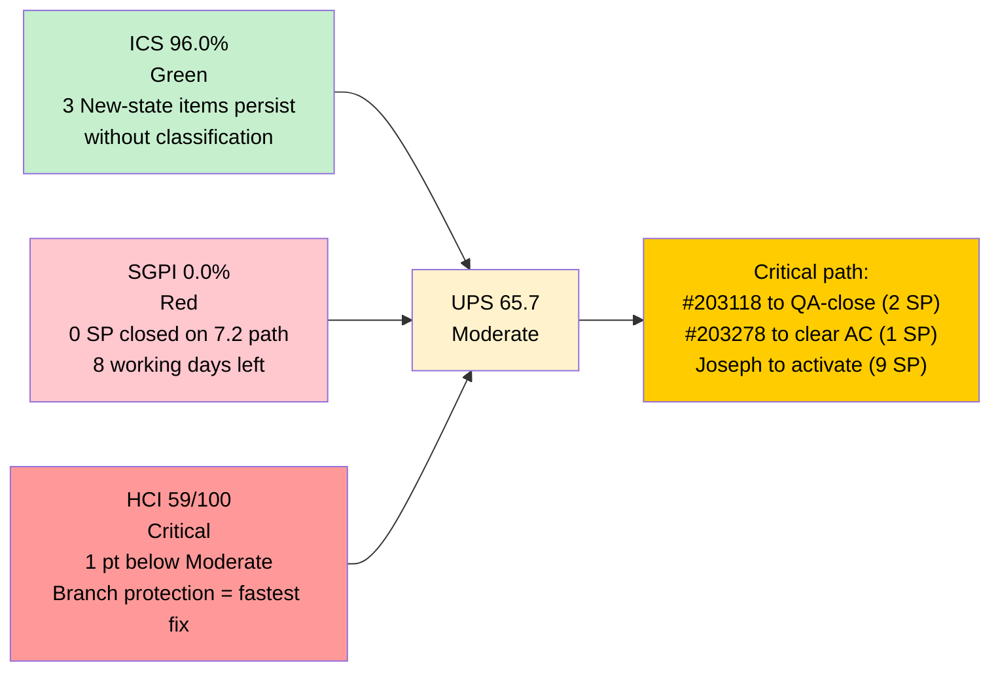
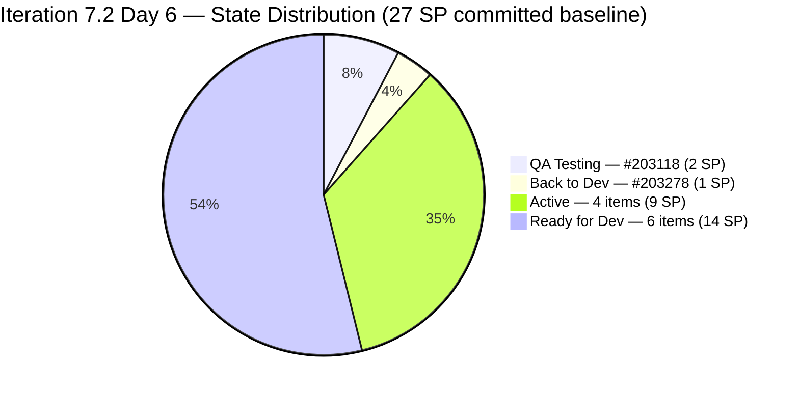
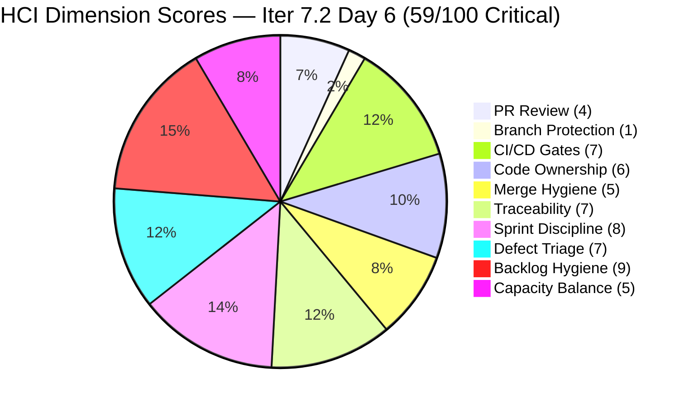
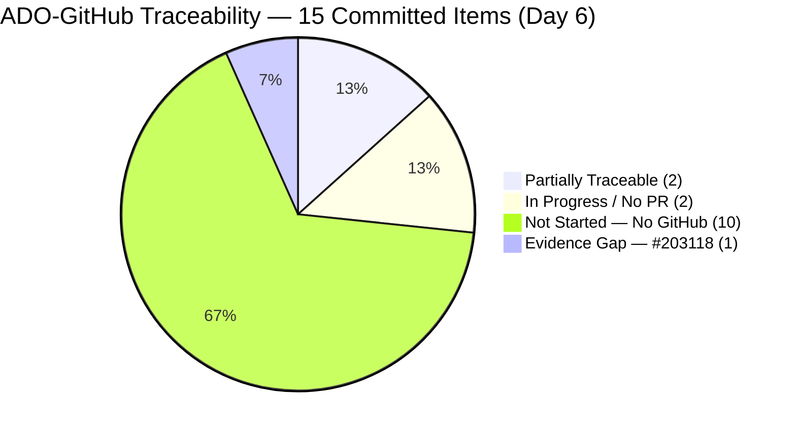
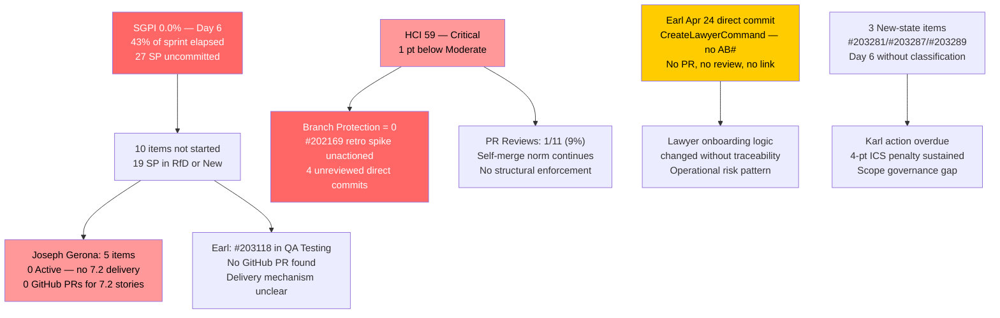

# Auto Allies — Git Iteration Audit

## AUDIT_20260425_1533.md

---

## 1. Audit Metadata

| Field | Value |
|---|---|
| **Audit Date** | April 25, 2026 |
| **Audit Time** | 15:33 PHT (Saturday) |
| **Iteration** | Iteration 7.2 (April 20 – May 3, 2026) |
| **Iteration ID** | 2e253a85-9ebb-4504-b3f0-2352594eeab0 |
| **Day in Sprint** | Day 6 of 14 (43% elapsed) |
| **Auditor** | Claude Code — Git Iteration Audit Skill |
| **ADO Org** | jairo |
| **ADO Project** | Auto Allies (ID: 2d7af571-6ef6-4ad0-a509-c440e008b0fb) |
| **ADO Team** | AA Development Team (ID: 330e6bf1-3515-443c-a2d8-b84f46c38f57) |
| **ADO Backlog** | Stories and Deliverables (Microsoft.RequirementCategory) |
| **GitHub Repo (FE)** | jairosoft-com/autoallies-version2 |
| **GitHub Repo (BE)** | jairosoft-com/autoallies-api-core |
| **Prior Audit** | AUDIT_20260424_0902.md (Day 5, April 24, 09:02 PHT) |
| **Data Mode** | `partial` — GitHub token issue active (2026-04-21 onward); partial GitHub evidence |
| **ICS — Iteration Compliance Score** | **96.0%** Green |
| **SGPI — Committed Scope** | **0.0%** Red (0/27 SP closed on Iter 7.2 path) |
| **HCI — Engineering Health Index** | **59 / 100** Critical |
| **UPS — Unified Performance Score** | **65.7** Moderate |
| **Risk Band** | Moderate |

> **Data mode note:** The `raseniero` GitHub token access-scope issue (first observed 2026-04-21) remains unresolved. GitHub API calls returned data for this session, but access was partial — PR list and commit list tools functioned; PR review detail APIs not available. HCI dimensions 1–6 are scored from available partial GitHub evidence (PR and commit data), not from review-level detail. The team is not penalized for the token gap. Dimensions 7–10 are scored from ADO evidence.

---

## 2. Executive Summary

**Day 6 of Iteration 7.2.** The iteration has crossed the 40% mark with **zero committed-scope story points closed** and all three developers still working on active rework or carry-over resolution. A new Earl Carino direct commit (Apr 24, 14:33 UTC) to `dev` — adding CreateLawyerCommand enhancements with no AB# reference — continues the pattern of unreviewed, untraceable BE changes.

**Scores are unchanged from Day 5:** ICS 96.0% (Green), SGPI 0.0% (Red), HCI 59/100 (Critical). UPS holds at 65.7 (Moderate). No ADO state transitions were detected between the Day 5 audit (09:02 Apr 24) and this session (15:33 Apr 25). The three "New"-state items (#203281, #203287, #203289 — Joseph Gerona) remain unclassified.

**The critical velocity signal:** With 8 working days remaining (after accounting for May 1 Labor Day), the team needs to deliver ~21 SP to reach a 75% SGPI target. No items are currently in QA-ready or mergeable state on Iter 7.2 committed items. #203118 (Earl, QA Testing, 2 SP) is the only item with a clear path to closure this week.

**One notable new finding:** Earl's Apr 24 direct commit (`Enhance CreateLawyerCommand`) is operationally significant — it modifies the lawyer onboarding CLI flow directly on the `dev` branch with no PR, no reviewer, and no ADO link. This is the second consecutive sprint where Earl commits sensitive backend changes (lawyer/attorney assignment logic) directly to `dev` without a review gate.

| Score | Iter 7.2 Day 5 (09:02) | **Iter 7.2 Day 6 (15:33)** | Delta |
|---|---|---|---|
| **ICS** | 96.0% Green | **96.0% Green** | 0 |
| **SGPI** | 0.0% Red | **0.0% Red** | 0 |
| **HCI** | 59/100 Critical | **59/100 Critical** | 0 |
| **UPS** | 65.7 Moderate | **65.7 Moderate** | 0 |

---

## 3. Iteration Scope and Methodology

### Methodology

Evidence collected from:

- **ADO iteration resolution:** `work_list_team_iterations` (timeframe=current) → Iteration 7.2 (ID `2e253a85-9ebb-4504-b3f0-2352594eeab0`, April 20–May 3, 2026), confirmed current
- **ADO work items:** `wit_get_work_items_for_iteration` → all parent and child relations; `wit_get_work_items_batch_by_ids` → 18 parent items (15 non-spike + 3 spikes)
- **ADO capacity:** `work_get_team_capacity` → 27h/day, 5 members, 0 days off recorded
- **GitHub FE:** `list_pull_requests` (all, perPage 50, sorted by updated desc) → 50 PRs; `list_commits` (develop branch, since 2026-04-20) → 12 commits
- **GitHub BE:** `list_pull_requests` (all, perPage 50) → full list; `list_commits` (dev branch, since 2026-04-20) → 11 commits (includes new Apr 24 commit)
- **Prior audit:** AUDIT_20260424_0902.md — Day 5 baseline and delta reference

Scoring per `git_iteration_audit` skill authority:

- **ICS:** 4-dimension weighted rubric (Alignment 25, Estimation 20, Quality/DoD 35, Iteration Integrity 20); non-spike parent items only
- **SGPI (headline):** Committed Scope = Closed SP / Total Committed SP (27 SP baseline from 12 Day-1 items)
- **HCI:** 10-dimension engineering index, 0–10 each, 100-point total
- **UPS:** ICS × 0.50 + HCI × 0.30 + SGPI × 0.20
- **Project exceptions applied:** Jerlyn Ates and Mary Secusana absence from GitHub is expected (non-developers); no penalty applied. GitHub token issue (`data_mode: partial`) acknowledged; no penalty for missing review-level GitHub data.

### Iteration Window

April 20 – May 3, 2026 (14 calendar days, 10 working days, reduced to 9 if May 1 Labor Day is observed). Today is **Day 6 of 14** (Saturday). 8 working days remain (Mon Apr 27 – Fri May 2, excluding May 1 if holiday).

### Team Capacity (confirmed from ADO)

| Member | Role | Activity | Capacity/Day | Sprint Total |
|---|---|---|---|---|
| Jerlyn Ates | QA/Requirements | 2h Req + 4h Test | 6h | 84h |
| Joseph Gerona | Development | 5h | 5h | 70h |
| Earl Carino | Development | 6h | 6h | 84h |
| Mary Secusana | Documentation | 4h | 4h | 56h |
| Cliff Carcueva | Development | 6h | 6h | 84h |
| **Total** | | | **27h/day** | **378h** |

### Work Item Roster — Iteration 7.2 (Day 6, 15:33 PHT)

**Non-Spike Items (ICS/SGPI scope):**

| ID | Type | Title (Abbrev.) | Owner | State | SP |
|---|---|---|---|---|---|
| 194750 | User Story | [V.20] Affiliate Account — Login and Logout | Cliff | Active | 1 |
| 194753 | User Story | [V.20] Affiliate Account — Affiliate Page | Cliff | Ready for Dev | 3 |
| 199106 | Defect | [V2.0] Apply Promo Code Discounts | Jerlyn | Ready for Dev | 1 |
| 199818 | User Story | [V2.0] Expired Member & One-Time Member View | Joseph | Ready for Dev | 3 |
| 200233 | Enabler | Stripe Account V2 Products | Earl | Ready for Dev | 2 |
| 201564 | Enabler | [V2.0] E2E Testing QA Environment | Jerlyn | Active | 3 |
| 202457 | User Story | [V2.0] Validate Affiliate URL | Joseph | Ready for Dev | 3 |
| 202684 | User Story | Revenue Cat Webhook V2 | Earl | Active | 2 |
| 202790 | User Story | Role Switch | Cliff | Active | 3 |
| 202926 | Enabler | [V2.0] Solidifying Migrated Data | Earl | Ready for Dev | 2 |
| 203118 | User Story | [V1.0] Auto Promo Code — SOLO | Earl | QA Testing | 2 |
| 203278 | User Story | Attorney Case Review — Enhancement (residual) | Cliff | Back to Dev | 1 |
| 203281 | User Story | [V2.0] Detect Pre-Existing Tickets | Joseph | **New** | 1 |
| 203287 | User Story | [V2.0] Active Members — Upload Ticket Violations | Joseph | **New** | 1 |
| 203289 | User Story | [V2.0] Super Admin — Auto Attorney Assignment | Joseph | **New** | 1 |
| **Total (non-spike)** | | | | | **29 SP** |

**Spikes (excluded from ICS/SGPI):**

| ID | Type | Title (Abbrev.) | Owner | State |
|---|---|---|---|---|
| 202169 | Spike | [Retro] Improve PR Review Compliance | Cliff | Active |
| 203000 | Spike | Iter 7.2 Dev Support & Team Sync — Joseph | Joseph | Active |
| 203086 | Spike | Iter 7.2 Ops and QA Support | Mary | Active |

**SGPI denominator note:** Committed baseline is 27 SP (12 items present at sprint Day 1). Three new items (#203281, #203287, #203289) added Apr 23 without formal planning ceremony are tracked but excluded from SGPI denominator pending Karl Caumban's formal classification.

---

## 4. Scorecard Summary

| Metric | Score | Band | Threshold | Δ vs Day 5 (09:02) |
|---|---|---|---|---|
| **ICS — Iteration Compliance Score** | **96.0%** | Green | >= 90% | 0 |
| **SGPI — Committed Scope** | **0.0%** | Red | >= 75% at sprint end | 0 |
| **HCI — Engineering Health Index** | **59 / 100** | Critical | >= 60 | 0 |
| **UPS — Unified Performance Score** | **65.7** | Moderate | >= 80 | 0 |

**UPS Calculation:** 96.0 × 0.50 + 59 × 0.30 + 0.0 × 0.20 = 48.0 + 17.7 + 0.0 = **65.7 (Moderate)**

---

## 5. Sprint Goal Predictability (SGPI)

### Committed Scope SGPI (Headline)

| Metric | Value |
|---|---|
| Total Committed SP (non-spike, 12-item Day-1 baseline) | **27 SP** |
| Closed SP on Iteration 7.2 path | **0 SP** |
| **SGPI — Committed Scope** | **0.0% — Red** |

### Supporting SGPI Metrics

| Metric | Calculation | Value |
|---|---|---|
| **Original Scope SGPI** | 0 / 27 SP | **0.0%** |
| **Delivered Proxy SGPI** | (Closed + QA-Testing SP) / 27 SP = (0+2) / 27 | **7.4%** |
| **Proxy incl. Back-to-Dev** | (0+2+1) / 27 SP | **11.1%** |

### Work Item State Distribution (Day 6, 15:33 PHT)

| State | Count | SP | Key Items |
|---|---|---|---|
| Closed (Iter 7.2 path) | 0 | 0 | — |
| QA Testing | 1 | 2 | #203118 (Earl — SOLO Auto Promo) |
| Back to Dev | 1 | 1 | #203278 (Cliff — Attorney Case Review residual) |
| Active | 4 | 9 | #194750 (1 SP, Cliff), #202684 (2 SP, Earl), #202790 (3 SP, Cliff), #201564 (3 SP, Jerlyn) |
| Ready for Dev | 6 | 14 | #194753 (3), #199106 (1), #199818 (3), #200233 (2), #202457 (3), #202926 (2) |
| New (unplanned) | 3 | 3 | #203281, #203287, #203289 (1 SP each, Joseph) |
| Spikes (excluded) | 3 | N/A | #202169, #203000, #203086 |
| **Committed Total (12 Day-1 items)** | | **27 SP** | |

### SGPI Trajectory

| Day | Date | Closed SP | SGPI | Proxy SGPI | Key Event |
|---|---|---|---|---|---|
| Day 1 | Apr 20 | 0 | 0.0% | 0.0% | Sprint opened; BE PR#85 merged (AB#200232 bugfix) |
| Day 2 | Apr 21 | 0 | 0.0% | 0.0% | FE PR#123 merged (AB#202530, reviewed by Earl) |
| Day 3 | Apr 22 | 0 | 0.0% | 11.1% | FE PR#124/125, BE PR#87 merged; #202530 QA Testing |
| Day 4 | Apr 23 | 0 | 0.0% | 11.1% | FE PR#127, commit; scope additions (3 New items) |
| Day 5 | Apr 24 | 0 | 0.0% | 7.4% | FE PR#128/129 merged; #202530 Closed (7.1 path); #203118 QA Testing |
| **Day 6** | **Apr 25** | **0** | **0.0%** | **7.4%** | **No new closures; Earl direct BE commit (CreateLawyerCommand)** |

### SGPI Forecast (8 working days remain)

| Scenario | Items Needed | Additional SP | Final SGPI | Likelihood |
|---|---|---|---|---|
| Minimum — QA clears #203118 | #203118 | +2 | 7.4% | High — already in QA Testing |
| Conservative — 3 items close by Day 9 | +#203278, +1 Active | +4 | 14.8% | Moderate |
| On-Track — 8 items close by Day 12 | Multiple Active + RfD | +16 | 59.3% | Low — Joseph must activate immediately |
| Green Target — ≥75% by Day 14 | 20+ SP across all owners | ≥20 SP | ≥74.1% | Very Low without velocity step-change this week |

---

## 6. Developer Productivity Findings

> **Data mode: partial.** GitHub PR and commit data is accessible. PR review-level detail (approval status, reviewer comments) is not accessible due to the `raseniero` token scope limitation. Evidence in this section is drawn from PR and commit lists only.

### Sprint GitHub Activity — Iteration Window (Apr 20–Apr 25)

**New evidence since Day 5 (not in AUDIT_20260424_0902.md):**

| Repo | What | Author | Date | AB# Link | Notes |
|---|---|---|---|---|---|
| autoallies-api-core | Direct commit: `Enhance CreateLawyerCommand` | ecarinoJS | Apr 24, 14:33 UTC | None | Direct to `dev`, no PR, no AB# |

**No new PRs opened or merged since Day 5 (Apr 24, 09:02 PHT).**

**Frontend (autoallies-version2) — FE PRs in Iteration 7.2 (Apr 20–25), cumulative:**

| PR# | Author | Branch | ADO Links | Merged | Reviewer |
|---|---|---|---|---|---|
| 123 | ccarcuevajairo | feature/202530-case-review | AB#202530 | Apr 21 | ecarinoJS (CHANGES_REQUESTED → resolved) |
| 124 | JosephJairo | story/202427-…-frontend | AB#200232, AB#200251, AB#201071, AB#202427 | Apr 22 | None |
| 125 | ccarcuevajairo | feature/202530-case-review | AB#202530 | Apr 22 | None |
| 126 | JosephJairo | develop → story sync | (sync merge) | Apr 22 | None |
| 127 | ccarcuevajairo | feature/202530-case-review | AB#202530 | Apr 23 | None |
| 128 | JosephJairo | story/202427-…-frontend | AB#200232, AB#200251, AB#201071 | Apr 24 | None |
| 129 | ccarcuevajairo | feature/202530-case-review | AB#202530 | Apr 24 | None |

**Backend (autoallies-api-core) — BE PRs in Iteration 7.2 (Apr 20–25), cumulative:**

| PR# | Author | Branch | ADO Links | Merged | Reviewer |
|---|---|---|---|---|---|
| 85 | ccarcuevajairo | bugfix/200232-enhance-performance | AB#200232 | Apr 20 | None confirmed |
| 86 | JosephJairo | dev → story sync | (sync merge) | Apr 20 | None |
| 87 | JosephJairo | story/202427-…-backend | AB#200232, AB#200251, AB#201071, AB#202427 | Apr 22 | None |
| 88 | JosephJairo | story/202427-…-backend | AB#200232, AB#200251, AB#201071 | Apr 24 | None |

**BE Direct Commits to `dev` (no PR):**

| Date | Author | Commit Message | AB# | Risk |
|---|---|---|---|---|
| Apr 20, 03:34 UTC | cliffrandycarcueva | Comment out scheduled commands | None | High — disables auto-assignment |
| Apr 20, 04:06 UTC | ecarinoJS | Refactor UserResource and UserManagementService | None | Medium |
| Apr 20, 04:14 UTC | cliffrandycarcueva | Uncomment scheduled commands | None | High — re-enables auto-assignment |
| **Apr 24, 14:33 UTC** | **ecarinoJS** | **Enhance CreateLawyerCommand** | **None** | **Medium — CLI lawyer onboarding** |

### Contribution Summary — Iteration 7.2 Days 1–6

| Contributor | FE PRs | BE PRs | Direct Commits | ADO Active Items |
|---|---|---|---|---|
| **Cliff Carcueva** (ccarcuevajairo) | 4 (123,125,127,129) | 1 (85) + 2 direct | 2 direct | #194750 (Active), #202790 (Active), #203278 (Back to Dev) |
| **Joseph Gerona** (JosephJairo) | 3 (124,126,128) | 3 (86,87,88) | 0 | #199818 (RfD), #202457 (RfD), #203281/87/89 (New) |
| **Earl Carino** (ecarinoJS) | 0 | 0 | 3 direct | #202684 (Active), #202926 (RfD), #203118 (QA) |
| **Jerlyn Ates** | 0 | 0 | 0 | #199106 (RfD), #201564 (Active) |
| **Mary Secusana** | 0 | 0 | 0 | Spike #203086 only |

> Jerlyn Ates and Mary Secusana absence from GitHub is expected per documented project exception. Jerlyn is QA/Requirements; Mary is Documentation. Neither role requires GitHub commits.

### Key Observations — Day 6

**Earl Carino (ecarinoJS):** Added a new direct-to-dev commit on Apr 24 at 14:33 UTC (after the Day 5 audit window closed). The commit enhances `CreateLawyerCommand` — a CLI tool for lawyer onboarding, adding fields for representative name, bio, weekend availability, licensed states, and courthouses. This is a significant capability addition to the BE admin tooling, made directly on `dev` without a PR, reviewer, or ADO link. The change directly touches the lawyer profile creation and state/courthouse sync flow — the same system Earl and Cliff's scheduled-command commits on Apr 20 were configuring. No AB# referenced — this commit cannot be linked to any tracked work item.

**Cliff Carcueva:** No new activity since Apr 24 FE PR#129 merge. #203278 (Back to Dev, 1 SP) remains open. Retro spike #202169 (Branch Protection) also remains Active with no observable progress.

**Joseph Gerona:** No new GitHub activity since Apr 24. All ADO items remain in Ready for Dev or New state. No active feature development detected on Day 6.

---

## 7. SAFe Compliance Findings

| Finding | Severity | Trend vs Day 5 |
|---|---|---|
| **#203118 in QA Testing (2 SP, Earl)** — Jerlyn to clear for first Iter 7.2 SGPI point | **High Opportunity** | Stable — awaiting QA outcome |
| **SGPI 0.0% at Day 6** — 43% of sprint elapsed with zero committed-scope closures | **Critical** | Worsening (time pressure increasing) |
| **#203278 (Back to Dev, 1 SP)** — Cliff has not yet resolved AC gap from Day 5 | **High** | Flat — no observable progress in 24h |
| **Joseph Gerona: 5 items, 0 Active** — Ready for Dev or New, no 7.2 feature development | **Critical** | Worsening — no velocity activation |
| **3 New-state items unclassified** (#203281, #203287, #203289) — Karl action overdue | **Medium** | Worsening — now Day 6 without classification |
| **Earl direct commit Apr 24** — CreateLawyerCommand enhancement, no PR, no AB# | **High — New** | **New finding** |
| **Branch protection not deployed** — retro spike #202169 Active since Iter 7.1, no action | **Critical** | Flat |
| **Self-merge pattern sustained** — 10/11 PRs merged without human reviewer | **High** | Flat |
| **PR#123 only reviewed PR in sprint** — Earl's review of Cliff's work, Day 2 | **High** | Flat |
| **Earl Apr 20 scheduled-command toggle** — direct commits, no review, no AB# | **High** | Flat — unresolved from Day 5 |

---

## 8. Iteration Compliance Score (ICS)

ICS is computed on **15 non-spike parent items** in Iteration 7.2. Excluded: spikes (#202169, #203000, #203086).

### Scoring Rubric

| Dimension | Weight | Pass Criteria |
|---|---|---|
| Alignment | 25 | IterationPath = `Auto Allies\2026-PI7\Iteration 7.2` |
| Estimation | 20 | Story Points > 0 |
| Quality / DoD | 35 | Description present (non-empty) AND Acceptance Criteria present (non-empty) |
| Iteration Integrity | 20 | State not "New" or "Blocked" |

### Item-Level ICS Detail (Day 6, 15:33 PHT)

| ID | Type | Owner | State | SP | Align | Est | Qual | Integ | Score |
|---|---|---|---|---|---|---|---|---|---|
| 194750 | User Story | Cliff | Active | 1 | 25 | 20 | 35 | 20 | **100** |
| 194753 | User Story | Cliff | Ready for Dev | 3 | 25 | 20 | 35 | 20 | **100** |
| 199106 | Defect | Jerlyn | Ready for Dev | 1 | 25 | 20 | 35 | 20 | **100** |
| 199818 | User Story | Joseph | Ready for Dev | 3 | 25 | 20 | 35 | 20 | **100** |
| 200233 | Enabler | Earl | Ready for Dev | 2 | 25 | 20 | 35 | 20 | **100** |
| 201564 | Enabler | Jerlyn | Active | 3 | 25 | 20 | 35 | 20 | **100** |
| 202457 | User Story | Joseph | Ready for Dev | 3 | 25 | 20 | 35 | 20 | **100** |
| 202684 | User Story | Earl | Active | 2 | 25 | 20 | 35 | 20 | **100** |
| 202790 | User Story | Cliff | Active | 3 | 25 | 20 | 35 | 20 | **100** |
| 202926 | Enabler | Earl | Ready for Dev | 2 | 25 | 20 | 35 | 20 | **100** |
| 203118 | User Story | Earl | QA Testing | 2 | 25 | 20 | 35 | 20 | **100** |
| 203278 | User Story | Cliff | Back to Dev | 1 | 25 | 20 | 35 | 20 | **100** |
| 203281 | User Story | Joseph | **New** | 1 | 25 | 20 | 35 | **0** | **80** |
| 203287 | User Story | Joseph | **New** | 1 | 25 | 20 | 35 | **0** | **80** |
| 203289 | User Story | Joseph | **New** | 1 | 25 | 20 | 35 | **0** | **80** |

**Overall ICS Calculation:**

| Dimension | Eligible | Compliant | Score % | Weight | Weighted |
|---|---|---|---|---|---|
| Alignment | 15 | 15 | 100.0% | 25 | 25.00 |
| Estimation | 15 | 15 | 100.0% | 20 | 20.00 |
| Quality / DoD | 15 | 15 | 100.0% | 35 | 35.00 |
| Iteration Integrity | 15 | 12 | 80.0% | 20 | **16.00** |
| **Overall ICS** | | | | | **96.0% — Green** |

> Items 203281, 203287, 203289 are in "New" state — failing Iteration Integrity. These items would immediately resolve the 4-point ICS gap if Karl classifies them as Active or Ready for Dev. All three have populated descriptions and acceptance criteria, so the only compliance gap is the state value.

---

## 9. Engineering Health Index (HCI)

> **Data mode: partial.** GitHub PR list and commit list accessible. Review-level detail (approvals, reviewer comments per PR) not available due to `raseniero` token scope. HCI dimensions 1–6 scored from available partial GitHub evidence (PR author, merge pattern, branch naming, AB# presence in PR titles/bodies, direct commits). This produces conservative scoring — actual scores may be higher if review activity occurred that is not visible in PR list metadata.

| # | Dimension | Day 5 Score | **Day 6 Score** | Delta | Evidence |
|---|---|---|---|---|---|
| 1 | PR Review Compliance | 4 | **4** | 0 | No new PRs opened or merged Apr 24–25. Sprint total: 1 human review (Earl on FE PR#123) out of 11 merged PRs = 9% review rate. Self-merge pattern persists. Hold at 4. |
| 2 | Branch Protection & Enforcement | 1 | **1** | 0 | All merged PRs targeting `develop`/`dev` were self-merged. Retro spike #202169 remains Active; no branch protection rules confirmed deployed. Earl's Apr 24 direct commit confirms write access to `dev` without gate enforcement. Hold at 1. |
| 3 | CI/CD Gate Quality | 7 | **7** | 0 | GitHub Actions active; no build failures observed in merged PRs. Earl's direct BE commit (Apr 24) bypasses CI if gates are only enforced on PRs. Hold at 7. |
| 4 | Code Ownership | 6 | **6** | 0 | Three active developers (Cliff: 5 PRs + 2 direct commits, Joseph: 6 PRs, Earl: 3 direct commits). Earl's Apr 24 direct commit (CreateLawyerCommand) adds to the pattern of unreviewed BE changes without PR workflow. Hold at 6. |
| 5 | Merge Hygiene & Churn | 5 | **5** | 0 | Branch naming remains clean. No new merges since Day 5. Earl's direct commits are not PR merges but represent commits directly to integration branch — an ongoing hygiene concern. Hold at 5. |
| 6 | Work Item ↔ GitHub Traceability | 7 | **7** | 0 | Sprint PR traceability unchanged at ~82% (9/11 PRs have AB# links). Earl's Apr 24 direct commit carries no AB# link — new evidence of the pattern but does not change the sprint-level metric. Hold at 7. |
| 7 | Sprint Discipline | 8 | **8** | 0 | #202530 Closed (7.1 path, Apr 24). No new closures Apr 24–25. Sprint lock stable on original 12 items; 3 "New"-state items still unclassified (Karl action pending). Hold at 8. |
| 8 | Defect Triage & Velocity | 7 | **7** | 0 | #203278 (Back to Dev, 1 SP) still unresolved on Day 6 — 24 hours since Day 5 with no observable progress. #199106 (Defect, 1 SP, Jerlyn) remains Ready for Dev. Responsive triage pattern from Day 5 not yet confirmed on Day 6. Hold at 7. |
| 9 | Backlog & Story Hygiene | 9 | **9** | 0 | All 15 non-spike items have populated Description + AC. The 3 "New"-state items (#203281, #203287, #203289) remain unclassified — now Day 6 without Karl's formal designation. Process hygiene gap persists. Hold at 9. |
| 10 | Capacity Balance & Ownership Distribution | 5 | **5** | 0 | Cliff: 3 items (5 SP in-flight). Earl: 3 items (6 SP in-flight, including QA Testing). Joseph: 5 items (9 SP, 0 Active). Jerlyn: 2 items. Mary: spike only. Joseph's 0-Active condition at Day 6 is a capacity utilization risk. Hold at 5. |

**HCI Total: 4+1+7+6+5+7+8+7+9+5 = 59 / 100 — Critical**

**Single-action path to Moderate:** Enabling branch protection on `develop`, `dev`, and `staging` (Dimension 2: 1→4) alone moves HCI from 59 to 62 — crossing the Moderate threshold.

### HCI Dimension Chart

### HCI Trajectory

| Audit | HCI | Band | Key Driver |
|---|---|---|---|
| Iter 7.1 Day 14 (Apr 19) | 49/100 | Critical | Baseline entering 7.2 |
| Iter 7.2 Day 2 (Apr 21) | 53/100 | Critical | Earl's PR review on FE#123 |
| Iter 7.2 Day 4 (Apr 23, 15:15) | 58/100 | Critical | Sprint Discipline + Backlog Hygiene gains |
| Iter 7.2 Day 5 (Apr 24, 09:02) | 59/100 | Critical | Traceability + Sprint Discipline (first closure) |
| **Iter 7.2 Day 6 (Apr 25, 15:33)** | **59/100** | **Critical** | **No change — no closures, no new reviews, new direct commit** |
| **Target** | **62+** | **Moderate** | Branch protection deployment (1 action) |

---

## 10. ADO-to-GitHub Traceability Analysis

### Story-Level Traceability Map (Day 6, 15:33 PHT)

| ADO ID | Title (Abbrev.) | Owner | State | SP | GitHub Evidence | Traceable? |
|---|---|---|---|---|---|---|
| 194750 | Affiliate Login/Logout | Cliff | Active | 1 | No PR observed | In Progress (no GitHub artifact yet) |
| 194753 | Affiliate Page | Cliff | Ready for Dev | 3 | None | Not Started |
| 199106 | Promo Code Discounts | Jerlyn | Ready for Dev | 1 | None | Not Started (QA-assigned) |
| 199818 | Expired/One-Time Member | Joseph | Ready for Dev | 3 | None | Not Started |
| 200233 | Stripe Account V2 | Earl | Ready for Dev | 2 | None | Not Started |
| 201564 | E2E QA Environment | Jerlyn | Active | 3 | None (Jerlyn = non-dev) | In Progress (ADO) |
| 202457 | Validate Affiliate URL | Joseph | Ready for Dev | 3 | None | Not Started |
| 202684 | Revenue Cat Webhook V2 | Earl | Active | 2 | Earl Apr 20 direct commit (inferred, no AB#) | Partial (inferred) |
| 202790 | Role Switch | Cliff | Active | 3 | No PR observed | In Progress (no GitHub artifact yet) |
| 202926 | Solidifying Migrated Data | Earl | Ready for Dev | 2 | None | Not Started |
| **203118** | **SOLO Auto Promo** | **Earl** | **QA Testing** | **2** | **No PR found in either repo** | **Not traceable — evidence gap** |
| 203278 | Attorney Review residual | Cliff | Back to Dev | 1 | FE PR#129 (AB#202530 branch, partial) | Partial |
| 203281 | Detect Pre-Existing (V2) | Joseph | New | 1 | None | Not Started |
| 203287 | Upload Ticket Violations (V2) | Joseph | New | 1 | None | Not Started |
| 203289 | Super Admin Auto-Assign | Joseph | New | 1 | None | Not Started |

**Traceability Summary:**
- Fully traceable: 0/15 (no item has full close-the-loop evidence)
- Partially traceable: 2/15 (#202684 inferred, #203278 via #202530 branch)
- In Progress / No GitHub artifact: 2/15 (#194750, #202790)
- Not Started: 10/15
- Evidence gap: 1/15 (#203118 — in QA Testing but no PR found)

> **#203118 anomaly (persistent):** Item remains in QA Testing in ADO. No PR referencing AB#203118 exists in either `autoallies-version2` or `autoallies-api-core`. This is now the second consecutive audit with the same gap. Earl's direct commits on Apr 20 are the most likely delivery vehicle, but no AB# link was included. This requires resolution before sprint close.

> **Earl's Apr 24 direct commit (CreateLawyerCommand):** This commit is not traceable to any current Iter 7.2 item. The feature (lawyer CLI onboarding with additional profile fields) may relate to #200233 (Stripe Account V2) or a new untracked item. AB# linkage is required to maintain delivery integrity.

---

## 11. Collaboration and Review Analysis

### Sprint PR Review Summary (Cumulative, Iter 7.2 Days 1–6)

| Repo | Total PRs | Merged | Human Reviewer | Bot Review | AB# Linked |
|---|---|---|---|---|---|
| autoallies-version2 (FE) | 7 (PR#123–129) | 7 | 1 (Earl on PR#123) | Inferred | 6/7 (86%) |
| autoallies-api-core (BE) | 4 (PR#85–88) | 4 | 0 | 0 | 3/4 (75%) |
| **Combined** | **11** | **11** | **1 (9%)** | | **9/11 (82%)** |

**Review rate: 9% (1 of 11 PRs received a human review).** This is statistically equivalent to Iteration 7.1's pattern. The retro spike #202169 ("Improve PR Review Compliance") has been Active since Iter 7.1 with zero behavior change in the sprint.

### Self-Merge Pattern Analysis

Only one PR (#123) had a reviewer assigned and received a code review. The remaining 10 PRs were self-merged by the author without reviewer assignment. PR#123's review event (Earl reviewing Cliff's initial implementation) demonstrates the team is capable of the behavior — it has simply not become a norm.

### Cliff Carcueva's #202530 Chain — Closed

The 4-PR delivery chain (FE PR#123, #125, #127, #129) for #202530 is complete as of Day 5. PR#129 was a squash-merge of 10 commits covering the full Attorney Case Review Workflow feature. Jerlyn's QA execution resulted in #202530 being Closed (on its Iter 7.1 path) with #203278 capturing a residual AC gap.

---

## 12. Repository Hygiene

### Branch Naming (Iter 7.2 Active Branches)

| Pattern | Examples | Assessment |
|---|---|---|
| `feature/[id-descriptor]` | `feature/202530-case-review` | SAFe-aligned — AB# in name |
| `story/[descriptor]-[tier]` | `story/202427-unassigned-cases-overview-frontend/backend` | SAFe-aligned |
| `bugfix/[id-descriptor]` | `bugfix/200232-enhance-performance` | Acceptable — AB# inferred |

Branch naming conventions are strong and consistent across both repos.

### Direct-to-Branch Commits — Cumulative (Iter 7.2, Days 1–6)

| Date | Author | Commit | AB# | Risk Level |
|---|---|---|---|---|
| Apr 20, 03:34 UTC | cliffrandycarcueva | Comment out scheduled commands | None | High |
| Apr 20, 04:06 UTC | ecarinoJS | Refactor UserResource / UserManagementService | None | Medium |
| Apr 20, 04:14 UTC | cliffrandycarcueva | Uncomment scheduled commands | None | High |
| **Apr 24, 14:33 UTC** | **ecarinoJS** | **Enhance CreateLawyerCommand** | **None** | **Medium** |

**4 total direct commits in 6 days** — a significant branch hygiene gap. All 4 are by Earl or Cliff (the same two developers who have produced the most PR volume). Two of the four directly affect the automated attorney assignment infrastructure. Zero have AB# links.

### Commit Quality

Squash commits from PR#129 (Cliff, Apr 24) demonstrate excellent commit message quality — 10-sub-commit history with function-level descriptions. In contrast, Earl's direct commits use professional language but omit the required ADO references. Joseph's commit messages are adequate but bundle multiple work items per commit, reducing per-item traceability.

---

## 13. Risks and Bottlenecks

### Prioritized Risk Register

| Risk | Severity | Trend | Owner |
|---|---|---|---|
| SGPI 0.0% at Day 6 — 8 working days remain with 27 SP uncommitted | Critical | Worsening | Karl Caumban |
| Branch protection undeployed — retro spike #202169 unactioned for 2+ iterations | Critical | Flat | Earl Carino / Cliff Carcueva |
| Joseph Gerona: 5 items, 0 Active — velocity not yet activated at Day 6 | Critical | Worsening | Joseph Gerona / Karl Caumban |
| #203118 in QA Testing with no traceable GitHub PR | High | Flat (2nd audit) | Earl Carino |
| Earl's Apr 24 direct commit (CreateLawyerCommand) — no PR, no AB#, no review | High | New | Earl Carino |
| Self-merge rate 90% (10/11 PRs) — no review culture emerging | High | Flat | Cliff Carcueva (retro spike owner) |
| Earl's Apr 20 scheduled-command toggle — direct to dev, no review, no AB# | High | Flat | Earl Carino |
| #203278 (Back to Dev, 1 SP) — 24h without AC resolution visible | Medium | Worsening | Cliff Carcueva |
| 3 New-state items unclassified (Day 6) — ICS penalty and scope uncertainty | Medium | Worsening | Karl Caumban |
| May 1 Labor Day — 9 effective working days vs 10 assumed | Low | Open | Karl Caumban |

---

## 14. Prioritized Remediation Actions

### Immediate — By Monday (April 27)

1. **Joseph Gerona: move at least 1 item to Active by Monday 09:00 PHT.** Recommended: **#199818** (Expired/One-Time Member View, 3 SP) or **#202457** (Validate Affiliate URL, 3 SP). Joseph has 5 ADO items with 0 in Active state at Day 6. No GitHub PR from Joseph for a new 7.2 feature story has been opened. With 8 working days remaining, Joseph must begin delivery by Day 7 to have any chance of contributing to sprint SGPI. Karl Caumban to confirm in Monday stand-up.

2. **Karl Caumban: formally classify #203281, #203287, #203289 by Monday 09:00 PHT.** These three 1-SP items (Joseph Gerona) have been in "New" state since Apr 23 — now Day 6 with no classification. If committed to this sprint, move to Active or Ready for Dev (resolves the 4-pt ICS penalty). If not committed, move to product backlog or Iter 7.3. Every additional day in "New" state costs 4 ICS points and signals uncontrolled scope expansion.

3. **Earl Carino: open a retrospective PR or add AB# link for Apr 24 CreateLawyerCommand commit.** The commit enhanced the lawyer CLI onboarding flow directly on `dev` with no review or ADO link. At minimum, Earl should add a comment in the relevant ADO work item (likely #200233 Stripe V2 or a new item) with the commit SHA and a brief description of the change. Ideally, open a PR from a short-lived branch to enable peer review of the change.

4. **Earl Carino / Cliff Carcueva: enable branch protection on `develop`, `dev`, and `staging` — 5-minute configuration.** GitHub → Settings → Branches → Add rule → Require a pull request before merging → 1 required reviewer. This single action: eliminates the ability to commit directly to integration branches without PR, prevents future self-merges, and moves HCI from 59 (Critical) to 62+ (Moderate). The retro spike #202169 prescribed this action in Iter 7.1. It is now Iter 7.2 Day 6.

### Priority — This Week (Days 7–9, April 27–29)

1. **Jerlyn Ates: clear #203118 (Auto Promo SOLO, 2 SP) through QA by Day 7 (Monday).** This is the fastest path to SGPI's first positive reading: QA approval moves SGPI from 0.0% to 7.4%. Jerlyn has capacity (6h/day) and the item has been in QA Testing since at least Day 5. Earl should be available for any QA-raised AC questions.

2. **Cliff Carcueva: resolve #203278 (Attorney Case Review residual, 1 SP) AC gap by Day 8.** The item has been in Back to Dev since Day 5 with no observable resolution on Day 6. The specific failing AC relates to messaging permission handling (based on PR#129 scope). Cliff to open a new PR referencing AB#203278, address the specific AC, and advance to QA Testing by end of Day 8. If merged and QA-cleared by Day 9, combined SGPI reaches 11.1%.

3. **Team: conduct Monday (Apr 27) sprint scope review with Karl.** Agenda items: (a) formal classification of 3 New-state items, (b) Joseph's activation plan for 7.2 features, (c) May 1 Labor Day impact on sprint capacity, (d) review traceability gap on #203118 and Earl's Apr 24 commit.

### Structural — Full Sprint (Days 10–14)

1. **Introduce PR review pairing.** Each story delivery requires at least one PR reviewed by a non-author before merging. Suggested rotation: Earl reviews Cliff's next feature PR; Cliff reviews Joseph's first new 7.2 story PR. This doubles the current review rate and builds toward sustainable engineering health.

2. **Earl to link #203118 GitHub delivery.** If the item was delivered via direct commits, open a retrospective PR (even if already merged) or document the delivery commit SHA in the ADO work item description. QA Testing without a traceable code artifact is an audit and compliance risk.

3. **Codify direct-commit prohibition.** After branch protection is enabled, document that the only acceptable path to `dev` and `develop` is through a reviewed PR. Exceptions (e.g., emergency hotfixes) require Karl sign-off and same-day retrospective PR.

---

## 15. Evidence Gaps and Limitations

| Gap | Impact | Status vs Day 5 |
|---|---|---|
| **GitHub token issue (`raseniero`)** — PR review-level detail (approval status, reviewer list per PR) not accessible | Medium | Persistent since Apr 21; `data_mode: partial` applied |
| **#203118 in QA Testing — no GitHub PR found** | High | Persistent (2nd audit); Earl's direct commits on Apr 20 likely vehicle but no AB# link |
| **Earl Apr 24 direct commit — no AB# link** | Medium | **New** — CreateLawyerCommand enhancement, no ADO item linkage |
| **Branch protection status** | Medium | Inferred from self-merge pattern; cannot directly retrieve GitHub branch protection rules via available API |
| **PR approval status for PRs 124–129, 85–88** | Medium | Inferred as 0 approvals from PR list metadata; cannot confirm without review API (blocked by token scope) |
| **Sprint goal text** | Low | No formal sprint goal retrievable from ADO team settings; SGPI measured against committed scope as proxy |
| **May 1 Labor Day impact** | Low | Karl Caumban to confirm; if observed, effective sprint capacity reduces from 10 to 9 working days |
| **Joseph Gerona GitHub identity** | None | Confirmed as JosephJairo / jgeronaCS (both used in commits); both map to jgerona@jairosoft.com |
| **Jerlyn Ates GitHub identity** | None | No GitHub handle; expected per project exception (non-developer); QA activity evidenced via ADO state changes |
| **Mary Secusana GitHub identity** | None | No GitHub handle; expected per project exception (Documentation role) |

---

*Report generated: April 25, 2026, 15:33 PHT*
*Audit skill: git\_iteration\_audit v1.0*
*Next recommended audit: AUDIT\_20260427\_0900.md (Day 7 — Monday morning; monitor Joseph Gerona activation, #203118 QA clearance, #203278 AC resolution, Karl scope classification)*
