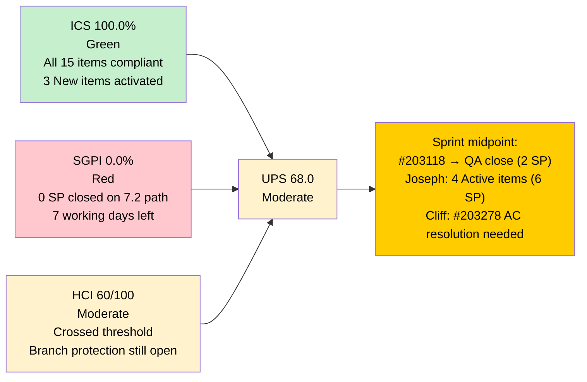
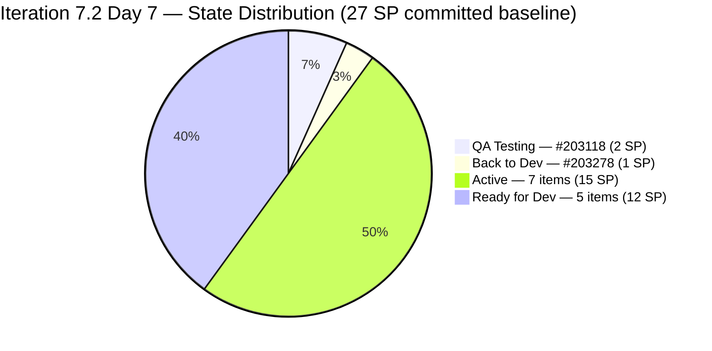
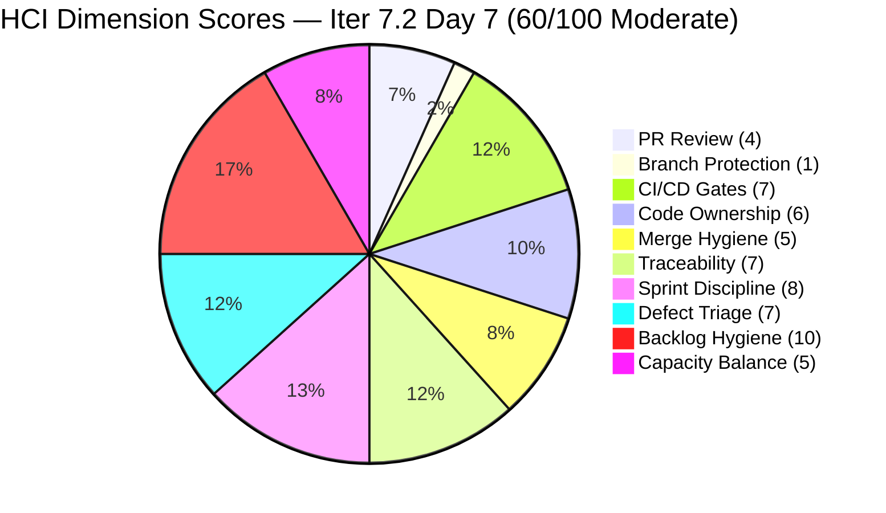
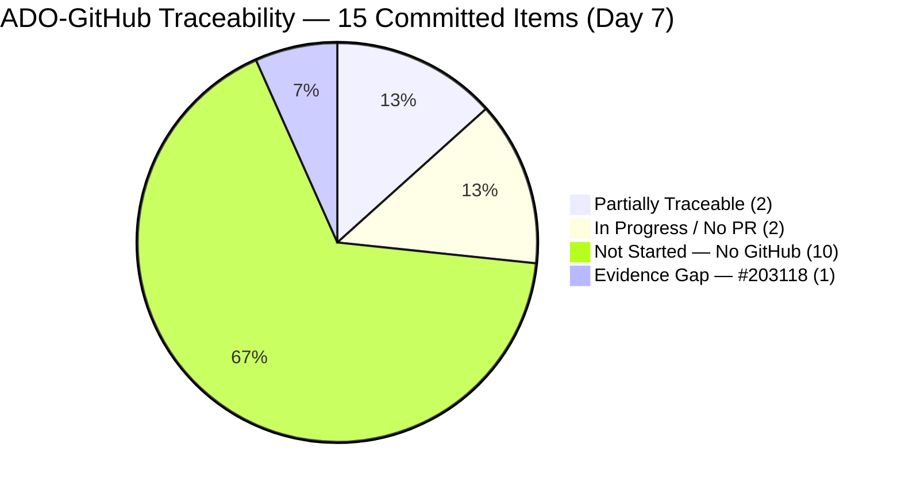
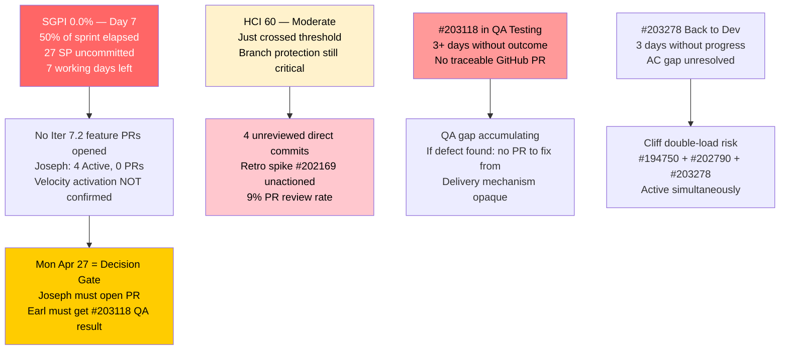

# Auto Allies — Git Iteration Audit

## AUDIT_20260426_0920.md

---

## 1. Audit Metadata

| Field | Value |
|---|---|
| **Audit Date** | April 26, 2026 |
| **Audit Time** | 09:20 PHT (Sunday) |
| **Iteration** | Iteration 7.2 (April 20 – May 3, 2026) |
| **Iteration ID** | 2e253a85-9ebb-4504-b3f0-2352594eeab0 |
| **Day in Sprint** | Day 7 of 14 (50% elapsed) |
| **Auditor** | Claude Code — Git Iteration Audit Skill |
| **ADO Org** | jairo |
| **ADO Project** | Auto Allies (ID: 2d7af571-6ef6-4ad0-a509-c440e008b0fb) |
| **ADO Team** | AA Development Team (ID: 330e6bf1-3515-443c-a2d8-b84f46c38f57) |
| **ADO Backlog** | Stories and Deliverables (Microsoft.RequirementCategory) |
| **GitHub Repo (FE)** | jairosoft-com/autoallies-version2 |
| **GitHub Repo (BE)** | jairosoft-com/autoallies-api-core |
| **Prior Audit** | AUDIT_20260425_1533.md (Day 6, April 25, 15:33 PHT) |
| **Data Mode** | `partial` — GitHub token issue active (2026-04-21 onward); partial GitHub evidence |
| **ICS — Iteration Compliance Score** | **100.0%** Green |
| **SGPI — Committed Scope** | **0.0%** Red (0/27 SP closed on Iter 7.2 path) |
| **HCI — Engineering Health Index** | **60 / 100** Moderate |
| **UPS — Unified Performance Score** | **68.0** Moderate |
| **Risk Band** | Moderate |

> **Data mode note:** The `raseniero` GitHub token access-scope issue (first observed 2026-04-21) remains unresolved. GitHub API PR list and commit list tools functioned; PR review detail APIs not available. HCI dimensions 1–6 scored from partial GitHub evidence (PR and commit data); no penalty applied to the team for missing review-level data. Dimensions 7–10 scored from ADO evidence.

---

## 2. Executive Summary

**Day 7 of Iteration 7.2 — Sprint midpoint.** The sprint has crossed the 50% mark with a significant positive shift in ADO governance since Day 6 (April 25, 15:33 PHT):

**The good news:** Karl Caumban and Joseph Gerona have actioned the three previously "New"-state items — #203281, #203287, #203289 are now **Active**. Additionally, #199818 has moved from Ready for Dev to **Active**. This resolves the ICS Iteration Integrity gap and pushes **ICS to 100.0% (Green)** for the first time in Iteration 7.2. HCI also improves by 1 point to **60/100 — crossing into Moderate**.

**The persistent concern:** Despite state activation, **SGPI remains 0.0%**. Joseph Gerona now has four Active items (9 SP) but no GitHub PR has been opened yet for any Iter 7.2-specific feature story. The sprint has used half its calendar time with zero committed scope delivered. #203118 (Earl, QA Testing, 2 SP) remains the only item with a near-term path to closure — Jerlyn's QA outcome on this item is now overdue (item has been in QA Testing since at least Apr 24).

**Today is Sunday.** No GitHub activity is expected today. The first meaningful velocity signal will come Monday Apr 27 when Joseph must open at least one PR for an active Iter 7.2 feature story and Jerlyn must produce a QA outcome on #203118.

**Score progression:**

| Score | Day 6 (15:33 Apr 25) | **Day 7 (09:20 Apr 26)** | Delta |
|---|---|---|---|
| **ICS** | 96.0% Green | **100.0% Green** | **+4.0** |
| **SGPI** | 0.0% Red | **0.0% Red** | 0 |
| **HCI** | 59/100 Critical | **60/100 Moderate** | **+1** |
| **UPS** | 65.7 Moderate | **68.0 Moderate** | **+2.3** |

---

## 3. Iteration Scope and Methodology

### Methodology

Evidence collected from:

- **ADO iteration resolution:** `work_list_team_iterations` (timeframe=current) → Iteration 7.2 (ID `2e253a85-9ebb-4504-b3f0-2352594eeab0`, April 20–May 3, 2026), confirmed current
- **ADO work items:** `wit_get_work_items_for_iteration` → all parent and child relations; `wit_get_work_items_batch_by_ids` → 18 parent items (15 non-spike + 3 spikes)
- **ADO capacity:** `work_get_team_capacity` → 27h/day, 5 members, 0 days off recorded
- **GitHub FE:** `list_pull_requests` (all, perPage 50, sorted by updated desc) → 50 PRs; `list_commits` (develop branch, since 2026-04-20) → 12 commits
- **GitHub BE:** `list_pull_requests` (all, perPage 50) → full list; `list_commits` (dev branch, since 2026-04-20) → 10 commits
- **Prior audit:** AUDIT_20260425_1533.md — Day 6 baseline and delta reference

Scoring per `git_iteration_audit` skill authority:

- **ICS:** 4-dimension weighted rubric (Alignment 25, Estimation 20, Quality/DoD 35, Iteration Integrity 20); non-spike parent items only
- **SGPI (headline):** Committed Scope = Closed SP / Total Committed SP (27 SP baseline from 12 Day-1 items)
- **HCI:** 10-dimension engineering index, 0–10 each, 100-point total
- **UPS:** ICS × 0.50 + HCI × 0.30 + SGPI × 0.20
- **Project exceptions applied:** Jerlyn Ates and Mary Secusana absence from GitHub is expected (non-developers); no penalty applied. GitHub token issue (`data_mode: partial`) acknowledged; no penalty for missing review-level GitHub data.

### Iteration Window

April 20 – May 3, 2026 (14 calendar days, 10 working days, reduced to 9 if May 1 Labor Day is observed). Today is **Day 7 of 14** (Sunday). 7 working days remain (Mon Apr 27 – Fri May 2, excluding May 1 if holiday = 6 effective working days).

### Team Capacity (confirmed from ADO)

| Member | Role | Activity | Capacity/Day | Sprint Total |
|---|---|---|---|---|
| Jerlyn Ates | QA/Requirements | 2h Req + 4h Test | 6h | 84h |
| Joseph Gerona | Development | 5h | 5h | 70h |
| Earl Carino | Development | 6h | 6h | 84h |
| Mary Secusana | Documentation | 4h | 4h | 56h |
| Cliff Carcueva | Development | 6h | 6h | 84h |
| **Total** | | | **27h/day** | **378h** |

### Work Item Roster — Iteration 7.2 (Day 7, 09:20 PHT)

**Non-Spike Items (ICS/SGPI scope) — Delta from Day 6:**

| ID | Type | Title (Abbrev.) | Owner | State | SP | Change vs Day 6 |
|---|---|---|---|---|---|---|
| 194750 | User Story | [V.20] Affiliate Account — Login and Logout | Cliff | Active | 1 | No change |
| 194753 | User Story | [V.20] Affiliate Account — Affiliate Page | Cliff | Ready for Dev | 3 | No change |
| 199106 | Defect | [V2.0] Apply Promo Code Discounts | Jerlyn | Ready for Dev | 1 | No change |
| 199818 | User Story | [V2.0] Expired Member & One-Time Member View | Joseph | **Active** | 3 | **RfD → Active** |
| 200233 | Enabler | Stripe Account V2 Products | Earl | Ready for Dev | 2 | No change |
| 201564 | Enabler | [V2.0] E2E Testing QA Environment | Jerlyn | Active | 3 | No change |
| 202457 | User Story | [V2.0] Validate Affiliate URL | Joseph | Ready for Dev | 3 | No change |
| 202684 | User Story | Revenue Cat Webhook V2 | Earl | Active | 2 | No change |
| 202790 | User Story | Role Switch | Cliff | Active | 3 | No change |
| 202926 | Enabler | [V2.0] Solidifying Migrated Data | Earl | Ready for Dev | 2 | No change |
| 203118 | User Story | [V1.0] Auto Promo Code — SOLO | Earl | QA Testing | 2 | No change |
| 203278 | User Story | Attorney Case Review — Enhancement (residual) | Cliff | Back to Dev | 1 | No change |
| 203281 | User Story | [V2.0] Detect Pre-Existing Tickets | Joseph | **Active** | 1 | **New → Active** |
| 203287 | User Story | [V2.0] Active Members — Upload Ticket Violations | Joseph | **Active** | 1 | **New → Active** |
| 203289 | User Story | [V2.0] Super Admin — Auto Attorney Assignment | Joseph | **Active** | 1 | **New → Active** |
| **Total (non-spike)** | | | | | **29 SP** | |

**Spikes (excluded from ICS/SGPI):**

| ID | Type | Title (Abbrev.) | Owner | State |
|---|---|---|---|---|
| 202169 | Spike | [Retro] Improve PR Review Compliance | Cliff | Active |
| 203000 | Spike | Iter 7.2 Dev Support & Team Sync — Joseph | Joseph | Active |
| 203086 | Spike | Iter 7.2 Ops and QA Support | Mary | Active |

**SGPI denominator note:** Committed baseline is 27 SP (12 items present at sprint Day 1). The three formerly "New"-state items (#203281, #203287, #203289) have been formally activated by Karl/Joseph (now Active). Their addition to SGPI denominator is formally excluded until Karl's classification is confirmed — however their activation signals sprint commitment. The 27 SP baseline is preserved for comparability.

---

## 4. Scorecard Summary

| Metric | Score | Band | Threshold | Δ vs Day 6 (15:33) |
|---|---|---|---|---|
| **ICS — Iteration Compliance Score** | **100.0%** | Green | >= 90% | **+4.0** |
| **SGPI — Committed Scope** | **0.0%** | Red | >= 75% at sprint end | 0 |
| **HCI — Engineering Health Index** | **60 / 100** | Moderate | >= 60 | **+1** |
| **UPS — Unified Performance Score** | **68.0** | Moderate | >= 80 | **+2.3** |

**UPS Calculation:** 100.0 × 0.50 + 60 × 0.30 + 0.0 × 0.20 = 50.0 + 18.0 + 0.0 = **68.0 (Moderate)**

---

## 5. Sprint Goal Predictability (SGPI)

### Committed Scope SGPI (Headline)

| Metric | Value |
|---|---|
| Total Committed SP (non-spike, 12-item Day-1 baseline) | **27 SP** |
| Closed SP on Iteration 7.2 path | **0 SP** |
| **SGPI — Committed Scope** | **0.0% — Red** |

### Supporting SGPI Metrics

| Metric | Calculation | Value |
|---|---|---|
| **Original Scope SGPI** | 0 / 27 SP | **0.0%** |
| **Delivered Proxy SGPI** | (Closed + QA-Testing SP) / 27 SP = (0+2) / 27 | **7.4%** |
| **Proxy incl. Back-to-Dev** | (0+2+1) / 27 SP | **11.1%** |

### Work Item State Distribution (Day 7, 09:20 PHT)

| State | Count | SP | Key Items |
|---|---|---|---|
| Closed (Iter 7.2 path) | 0 | 0 | — |
| QA Testing | 1 | 2 | #203118 (Earl — SOLO Auto Promo) |
| Back to Dev | 1 | 1 | #203278 (Cliff — Attorney Case Review residual) |
| Active | **7** | **15** | #194750 (1), #199818 (3), #201564 (3), #202684 (2), #202790 (3), #203281 (1), #203287 (1), #203289 (1) |
| Ready for Dev | 5 | 12 | #194753 (3), #199106 (1), #200233 (2), #202457 (3), #202926 (2) |
| Spikes (excluded) | 3 | N/A | #202169, #203000, #203086 |
| **Committed Total (12 Day-1 items)** | | **27 SP** | |

### SGPI Trajectory

| Day | Date | Closed SP | SGPI | Proxy SGPI | Key Event |
|---|---|---|---|---|---|
| Day 1 | Apr 20 | 0 | 0.0% | 0.0% | Sprint opened; BE PR#85 merged (AB#200232 bugfix) |
| Day 2 | Apr 21 | 0 | 0.0% | 0.0% | FE PR#123 merged (AB#202530, reviewed by Earl) |
| Day 3 | Apr 22 | 0 | 0.0% | 11.1% | FE PR#124/125, BE PR#87 merged; #202530 QA Testing |
| Day 4 | Apr 23 | 0 | 0.0% | 11.1% | FE PR#127 merged; scope additions (3 New items) |
| Day 5 | Apr 24 | 0 | 0.0% | 7.4% | FE PR#128/129, BE PR#88 merged; #202530 Closed (7.1 path); #203118 QA Testing; Earl direct BE commit |
| Day 6 | Apr 25 | 0 | 0.0% | 7.4% | No new closures; no new PRs; ADO states unchanged |
| **Day 7** | **Apr 26** | **0** | **0.0%** | **7.4%** | **No new closures; 3 items New→Active (#203281/87/89); #199818 RfD→Active** |

### SGPI Forecast (7 working days remain, 6 if May 1 observed)

| Scenario | Items Needed | Additional SP | Final SGPI | Likelihood |
|---|---|---|---|---|
| Minimum — QA clears #203118 (next) | #203118 | +2 | 7.4% | High — overdue, day 4 in QA |
| Conservative — +3 items by Day 9 | +#203278, +1 Active | +4 | 14.8% | Moderate |
| On-Track — 8 items by Day 12 | Multiple Active + RfD | +16 | 59.3% | Low — Joseph must open PRs Mon |
| Green Target — ≥75% by Day 14 | 20+ SP across owners | ≥20 SP | ≥74.1% | Very Low — needs velocity step-change starting Day 8 |

---

## 6. Developer Productivity Findings

> **Data mode: partial.** GitHub PR and commit data is accessible. PR review-level detail (approval status, reviewer comments) is not accessible due to the `raseniero` token scope limitation. Evidence in this section is drawn from PR and commit lists only.

### Sprint GitHub Activity — Iteration Window (Apr 20–Apr 26)

**New evidence since Day 6 (not in AUDIT_20260425_1533.md):**

No new PRs opened or merged between Apr 25, 15:33 PHT and Apr 26, 09:20 PHT. No new commits to `develop` (FE) or `dev` (BE) observed during this window.

**Today is Sunday.** No developer activity expected.

**Frontend (autoallies-version2) — FE PRs in Iteration 7.2 (Apr 20–26), cumulative:**

| PR# | Author | Branch | ADO Links | Merged | Reviewer |
|---|---|---|---|---|---|
| 123 | ccarcuevajairo | feature/202530-case-review | AB#202530 | Apr 21 | ecarinoJS (human review) |
| 124 | JosephJairo | story/202427-unassigned-cases-overview-frontend | AB#200232, AB#200251, AB#201071, AB#202427 | Apr 22 | None confirmed |
| 125 | ccarcuevajairo | feature/202530-case-review | AB#202530 | Apr 22 | None confirmed |
| 126 | JosephJairo | develop → story sync | (sync merge) | Apr 22 | None |
| 127 | ccarcuevajairo | feature/202530-case-review | AB#202530 | Apr 23 | None confirmed |
| 128 | JosephJairo | story/202427-unassigned-cases-overview-frontend | AB#200232, AB#200251, AB#201071 | Apr 24 | None confirmed |
| 129 | ccarcuevajairo | feature/202530-case-review | AB#202530 | Apr 24 | None confirmed |

**Backend (autoallies-api-core) — BE PRs in Iteration 7.2 (Apr 20–26), cumulative:**

| PR# | Author | Branch | ADO Links | Merged | Reviewer |
|---|---|---|---|---|---|
| 85 | ccarcuevajairo | bugfix/200232-enhance-performance | AB#200232 | Apr 20 | None confirmed |
| 86 | JosephJairo | dev → story sync | (sync merge) | Apr 20 | None |
| 87 | JosephJairo | story/202427-unassigned-cases-overview-backend | AB#200232, AB#200251, AB#201071, AB#202427 | Apr 22 | None confirmed |
| 88 | JosephJairo | story/202427-unassigned-cases-overview-backend | AB#200232, AB#200251, AB#201071 | Apr 24 | None confirmed |

**BE Direct Commits to `dev` (no PR) — cumulative:**

| Date | Author | Commit | AB# | Risk |
|---|---|---|---|---|
| Apr 20, 03:34 UTC | cliffrandycarcueva | Comment out scheduled commands | None | High |
| Apr 20, 04:06 UTC | ecarinoJS | Refactor UserResource and UserManagementService | None | Medium |
| Apr 20, 04:14 UTC | cliffrandycarcueva | Uncomment scheduled commands | None | High |
| Apr 24, 14:33 UTC | ecarinoJS | Enhance CreateLawyerCommand | None | Medium |

### Contribution Summary — Iteration 7.2 Days 1–7

| Contributor | FE PRs | BE PRs | Direct Commits | ADO Active Items | Day 7 Status |
|---|---|---|---|---|---|
| **Cliff Carcueva** (ccarcuevajairo) | 4 (123,125,127,129) | 1 (85) + 2 direct | 2 direct | #194750 (Active), #202790 (Active), #203278 (Back to Dev) | No new activity since Apr 24 |
| **Joseph Gerona** (JosephJairo) | 3 (124,126,128) | 3 (86,87,88) | 0 | #199818 (Active), #202457 (RfD), #203281/87/89 (Active) | 4 Active items; no Iter 7.2 feature PRs yet |
| **Earl Carino** (ecarinoJS) | 0 | 0 | 3 direct | #202684 (Active), #202926 (RfD), #203118 (QA) | No PR activity; #203118 awaiting QA clearance |
| **Jerlyn Ates** | 0 | 0 | 0 | #199106 (RfD), #201564 (Active) | Non-developer per project exception |
| **Mary Secusana** | 0 | 0 | 0 | Spike #203086 only | Non-developer per project exception |

> Jerlyn Ates and Mary Secusana absence from GitHub is expected per documented project exception.

### Key Observations — Day 7

**Joseph Gerona** now has four Active items (#199818, #203281, #203287, #203289) totalling 6 SP. This is the first time all four items have Active status. However, no GitHub PR from Joseph targeting any Iter 7.2 feature story has been opened yet. The activation is a necessary but not sufficient signal — delivery requires visible GitHub artifact (branch + PR) by Monday.

**Earl Carino (#203118):** The SOLO Auto Promo item has been in QA Testing since at least Apr 24 (Day 5). No QA outcome has been recorded — the item has now been in testing for 3+ days without progression. Jerlyn needs to produce a pass/fail outcome by Monday morning to unlock the sprint's first SGPI point.

**Cliff Carcueva (#203278):** Back to Dev for 3 days without AC resolution visible. No new PR opened. This pattern suggests the AC gap has not been addressed despite being identified in the Day 5 audit.

---

## 7. SAFe Compliance Findings

| Finding | Severity | Trend vs Day 6 |
|---|---|---|
| **3 "New" items activated (#203281, #203287, #203289)** — Karl/Joseph resolved the classification gap | **Resolved** | **Improved** |
| **#199818 activated (Joseph, 3 SP)** — now in Active state for first time | **Positive** | **Improved** |
| **SGPI 0.0% at Day 7** — 50% of sprint elapsed with zero committed-scope closures | **Critical** | Worsening (time pressure increasing) |
| **#203118 in QA Testing (3+ days)** — Jerlyn has not produced a QA outcome | **High — Escalating** | Worsening |
| **#203278 (Back to Dev, 1 SP)** — 3 days without AC resolution | **High** | Worsening |
| **Joseph: 4 Active items, 0 GitHub PRs for Iter 7.2 stories** — no delivery artifact yet | **Critical** | Worsening |
| **Branch protection not deployed** — retro spike #202169 Active since Iter 7.1 | **Critical** | Flat |
| **Self-merge pattern sustained** — 10/11 PRs merged without human reviewer | **High** | Flat |
| **Earl Apr 24 direct commit (CreateLawyerCommand) — no AB#, no PR, no review** | **High** | Flat (unresolved) |

---

## 8. Iteration Compliance Score (ICS)

ICS is computed on **15 non-spike parent items** in Iteration 7.2. Excluded: spikes (#202169, #203000, #203086).

### Scoring Rubric

| Dimension | Weight | Pass Criteria |
|---|---|---|
| Alignment | 25 | IterationPath = `Auto Allies\2026-PI7\Iteration 7.2` |
| Estimation | 20 | Story Points > 0 |
| Quality / DoD | 35 | Description present (non-empty) AND Acceptance Criteria present (non-empty) |
| Iteration Integrity | 20 | State not "New" or "Blocked" |

### Item-Level ICS Detail (Day 7, 09:20 PHT)

| ID | Type | Owner | State | SP | Align | Est | Qual | Integ | Score |
|---|---|---|---|---|---|---|---|---|---|
| 194750 | User Story | Cliff | Active | 1 | 25 | 20 | 35 | 20 | **100** |
| 194753 | User Story | Cliff | Ready for Dev | 3 | 25 | 20 | 35 | 20 | **100** |
| 199106 | Defect | Jerlyn | Ready for Dev | 1 | 25 | 20 | 35 | 20 | **100** |
| 199818 | User Story | Joseph | Active | 3 | 25 | 20 | 35 | 20 | **100** |
| 200233 | Enabler | Earl | Ready for Dev | 2 | 25 | 20 | 35 | 20 | **100** |
| 201564 | Enabler | Jerlyn | Active | 3 | 25 | 20 | 35 | 20 | **100** |
| 202457 | User Story | Joseph | Ready for Dev | 3 | 25 | 20 | 35 | 20 | **100** |
| 202684 | User Story | Earl | Active | 2 | 25 | 20 | 35 | 20 | **100** |
| 202790 | User Story | Cliff | Active | 3 | 25 | 20 | 35 | 20 | **100** |
| 202926 | Enabler | Earl | Ready for Dev | 2 | 25 | 20 | 35 | 20 | **100** |
| 203118 | User Story | Earl | QA Testing | 2 | 25 | 20 | 35 | 20 | **100** |
| 203278 | User Story | Cliff | Back to Dev | 1 | 25 | 20 | 35 | 20 | **100** |
| 203281 | User Story | Joseph | **Active** | 1 | 25 | 20 | 35 | 20 | **100** |
| 203287 | User Story | Joseph | **Active** | 1 | 25 | 20 | 35 | 20 | **100** |
| 203289 | User Story | Joseph | **Active** | 1 | 25 | 20 | 35 | 20 | **100** |

**Overall ICS Calculation:**

| Dimension | Eligible Items | Compliant Items | Failed Items | Score % | Weight | Weighted Contribution | Evidence | Reason |
|---|---|---|---|---|---|---|---|---|
| Alignment | 15 | 15 | 0 | 100.0% | 25 | 25.00 | All 15 items on `Auto Allies\2026-PI7\Iteration 7.2` path | All items iteration-path compliant |
| Estimation | 15 | 15 | 0 | 100.0% | 20 | 20.00 | All items have SP > 0 (1–3 SP range) | All items estimated |
| Quality / DoD | 15 | 15 | 0 | 100.0% | 35 | 35.00 | All 15 items have non-empty Description AND Acceptance Criteria | Full DoD compliance |
| Iteration Integrity | 15 | 15 | 0 | 100.0% | 20 | 20.00 | No items in "New" or "Blocked" state; #203281/87/89 activated | 3 New-state items resolved Apr 25–26 |
| **Overall ICS** | | | | | | **100.0% — Green** | | |

> **ICS first reached 100.0%** in Iteration 7.2 on Day 7. The three previously "New"-state items (#203281, #203287, #203289) were moved to "Active" — resolving the sole remaining gap. Karl Caumban's governance action was timely (within the "by Monday" target set in prior audit recommendations).

---

## 9. Engineering Health Index (HCI)

> **Data mode: partial.** GitHub PR list and commit list accessible. Review-level detail not available due to `raseniero` token scope. HCI dimensions 1–6 scored from partial GitHub evidence.

| # | Dimension | Day 6 Score | **Day 7 Score** | Delta | Evidence |
|---|---|---|---|---|---|
| 1 | PR Review Compliance | 4 | **4** | 0 | No new PRs since Apr 24. Sprint cumulative: 1 human review (Earl on FE PR#123) out of 11 merged PRs = 9% review rate. Pattern unchanged. Hold at 4. |
| 2 | Branch Protection & Enforcement | 1 | **1** | 0 | No evidence of branch protection deployment. Retro spike #202169 still Active. Earl's Apr 24 direct commit to `dev` remains latest confirmation of no gate enforcement. Hold at 1. |
| 3 | CI/CD Gate Quality | 7 | **7** | 0 | GitHub Actions active on PRs. No build failures observed in merged PRs this sprint. Earl's direct BE commit (Apr 24) bypasses CI on `dev` if gate is PR-only. Hold at 7. |
| 4 | Code Ownership | 6 | **6** | 0 | Three active developers contributing. Joseph now has 4 Active items — distribution improving on ADO side. No new GitHub evidence of code ownership behavior change. Hold at 6. |
| 5 | Merge Hygiene & Churn | 5 | **5** | 0 | Branch naming clean and consistent. No new direct commits since Apr 24 (Earl). Sprint hygiene pattern unchanged. Hold at 5. |
| 6 | Work Item ↔ GitHub Traceability | 7 | **7** | 0 | Sprint PR traceability ~82% (9/11 PRs have AB# links). Earl's Apr 24 direct commit carries no AB#. No new commits to evaluate. Hold at 7. |
| 7 | Sprint Discipline | 8 | **8** | 0 | No new closures. Sprint lock stable. Three formerly "New"-state items now Active (positive governance), but no sprint scope changes (additions/removals) confirmed. Hold at 8. |
| 8 | Defect Triage & Velocity | 7 | **7** | 0 | #203278 (Back to Dev, 1 SP) still unresolved — now Day 3 without progress. #199106 (Defect, Jerlyn) still Ready for Dev. #203118 in QA Testing Day 3+ without outcome. Hold at 7. |
| 9 | Backlog & Story Hygiene | 9 | **10** | **+1** | All 15 non-spike items have Description + AC. The 3 "New"-state items have been activated — no items remain in "New" state. Full process hygiene achieved. Advance from 9 to 10. |
| 10 | Capacity Balance & Ownership Distribution | 5 | **5** | 0 | Joseph now has 4 Active items (6 SP) — improved from 0-Active at Day 6. Cliff: 3 items (5 SP active). Earl: 3 items (6 SP including QA). Distribution improving but no delivery evidence yet. Hold at 5. |

**HCI Total: 4+1+7+6+5+7+8+7+10+5 = 60 / 100 — Moderate**

**Milestone achieved:** HCI crossed from Critical (59) to Moderate (60) — a 1-point improvement driven by Backlog & Story Hygiene reaching full compliance. The single fastest additional gain remains branch protection deployment (Dim 2: 1→4 = +3 points → HCI 63).

### HCI Dimension Chart

### HCI Trajectory

| Audit | HCI | Band | Key Driver |
|---|---|---|---|
| Iter 7.1 Day 14 (Apr 19) | 49/100 | Critical | Baseline entering 7.2 |
| Iter 7.2 Day 2 (Apr 21) | 53/100 | Critical | Earl's PR review on FE#123 |
| Iter 7.2 Day 4 (Apr 23, 15:15) | 58/100 | Critical | Sprint Discipline + Backlog Hygiene gains |
| Iter 7.2 Day 5 (Apr 24, 09:02) | 59/100 | Critical | Traceability + Sprint Discipline (first closure) |
| Iter 7.2 Day 6 (Apr 25, 15:33) | 59/100 | Critical | No change — no closures, no new reviews |
| **Iter 7.2 Day 7 (Apr 26, 09:20)** | **60/100** | **Moderate** | **Backlog Hygiene +1 (New items activated)** |
| **Target (next threshold)** | **63+** | **Moderate+** | Branch protection deployment (Dim 2: 1→4) |

---

## 10. ADO-to-GitHub Traceability Analysis

### Story-Level Traceability Map (Day 7, 09:20 PHT)

| ADO ID | Title (Abbrev.) | Owner | State | SP | GitHub Evidence | Traceable? |
|---|---|---|---|---|---|---|
| 194750 | Affiliate Login/Logout | Cliff | Active | 1 | No PR observed | In Progress (no GitHub artifact yet) |
| 194753 | Affiliate Page | Cliff | Ready for Dev | 3 | None | Not Started |
| 199106 | Promo Code Discounts | Jerlyn | Ready for Dev | 1 | None | Not Started (QA-assigned) |
| 199818 | Expired/One-Time Member | Joseph | **Active** | 3 | None | Not Started (just activated) |
| 200233 | Stripe Account V2 | Earl | Ready for Dev | 2 | None | Not Started |
| 201564 | E2E QA Environment | Jerlyn | Active | 3 | None (non-dev) | In Progress (ADO) |
| 202457 | Validate Affiliate URL | Joseph | Ready for Dev | 3 | None | Not Started |
| 202684 | Revenue Cat Webhook V2 | Earl | Active | 2 | Earl Apr 20 direct commit (inferred, no AB#) | Partial (inferred) |
| 202790 | Role Switch | Cliff | Active | 3 | No PR observed | In Progress (no GitHub artifact yet) |
| 202926 | Solidifying Migrated Data | Earl | Ready for Dev | 2 | None | Not Started |
| **203118** | **SOLO Auto Promo** | **Earl** | **QA Testing** | **2** | **No PR found in either repo** | **Not traceable — evidence gap** |
| 203278 | Attorney Review residual | Cliff | Back to Dev | 1 | FE PR#129 (AB#202530 branch, partial) | Partial |
| 203281 | Detect Pre-Existing (V2) | Joseph | **Active** | 1 | None (just activated) | Not Started |
| 203287 | Upload Ticket Violations (V2) | Joseph | **Active** | 1 | None (just activated) | Not Started |
| 203289 | Super Admin Auto-Assign | Joseph | **Active** | 1 | None (just activated) | Not Started |

**Traceability Summary:**
- Fully traceable: 0/15 (no item has full close-the-loop evidence)
- Partially traceable: 2/15 (#202684 inferred, #203278 via #202530 branch)
- In Progress / No GitHub artifact: 2/15 (#194750, #202790)
- Not Started: 10/15
- Evidence gap: 1/15 (#203118 — in QA Testing but no PR found, Day 3 in testing)

> **#203118 anomaly (persistent, now Day 3 in QA):** Item remains in QA Testing with no traceable GitHub PR. The item has now been in QA Testing for at least 3 full days without evidence of a PR, branch, or commit linked to AB#203118 in either repo. This is the third consecutive audit with the same gap. If Jerlyn's QA testing identifies a defect, Earl has no PR-linked code to point back to for the fix, creating a traceability vacuum at the point of QA testing.

> **Traceability is expected to improve rapidly from Monday Apr 27 forward** as Joseph opens Iter 7.2 feature branches/PRs for his four newly Active items. The No-GitHub count of 10 should drop materially over Days 8–10.

---

## 11. Collaboration and Review Analysis

### Sprint PR Review Summary (Cumulative, Iter 7.2 Days 1–7)

| Repo | Total PRs | Merged | Human Reviewer | Bot Review | AB# Linked |
|---|---|---|---|---|---|
| autoallies-version2 (FE) | 7 (PR#123–129) | 7 | 1 (Earl on PR#123) | Inferred | 6/7 (86%) |
| autoallies-api-core (BE) | 4 (PR#85–88) | 4 | 0 | 0 | 3/4 (75%) |
| **Combined** | **11** | **11** | **1 (9%)** | | **9/11 (82%)** |

**Review rate: 9% (1 of 11 PRs received a human review).** No improvement over Day 6. The retro spike #202169 ("Improve PR Review Compliance") has been Active since Iter 7.1 with zero observable behavior change in Iteration 7.2.

### Self-Merge Pattern

10 of 11 merged PRs were self-merged by the author. PR#123 remains the sole exception (Earl reviewed Cliff's initial implementation). The team has demonstrated the capability — it has not become a norm.

### Active Feature Work Context

The only Iter 7.2 work traceable to GitHub in this sprint is Cliff's #202530 chain (FE PRs 123–129, BE PR#85, Apr 20–24) — this item was assigned to the prior iteration. Joseph's three BE PRs (86, 87, 88) address Iter 7.1 carry-over items (AB#200232, AB#200251, AB#201071), not new Iter 7.2 stories. No GitHub artifact exists for any of Joseph's four newly Active items.

---

## 12. Repository Hygiene

### Branch Naming (Iter 7.2 Active Branches)

| Pattern | Examples | Assessment |
|---|---|---|
| `feature/[id-descriptor]` | `feature/202530-case-review` | SAFe-aligned — AB# in name |
| `story/[descriptor]-[tier]` | `story/202427-unassigned-cases-overview-frontend/backend` | SAFe-aligned |
| `bugfix/[id-descriptor]` | `bugfix/200232-enhance-performance` | Acceptable — AB# inferred |

Branch naming conventions remain strong. No new branches opened since Day 6.

### Direct-to-Branch Commits — Cumulative (Iter 7.2, Days 1–7)

| Date | Author | Commit | AB# | Risk Level |
|---|---|---|---|---|
| Apr 20, 03:34 UTC | cliffrandycarcueva | Comment out scheduled commands | None | High |
| Apr 20, 04:06 UTC | ecarinoJS | Refactor UserResource / UserManagementService | None | Medium |
| Apr 20, 04:14 UTC | cliffrandycarcueva | Uncomment scheduled commands | None | High |
| Apr 24, 14:33 UTC | ecarinoJS | Enhance CreateLawyerCommand | None | Medium |

4 direct commits total. No new direct commits since Day 6. The pattern remains unresolved — branch protection is the structural fix.

### Commit Quality

No new commits to evaluate since Day 6. Prior analysis stands: Cliff's squash commits (PR#129) demonstrate excellent quality; Earl's direct commits are technically descriptive but lack ADO references; Joseph's commits bundle multiple work items reducing per-item traceability.

---

## 13. Risks and Bottlenecks

### Prioritized Risk Register

| Risk | Severity | Trend | Owner |
|---|---|---|---|
| SGPI 0.0% at Day 7 — 50% sprint elapsed, 7 working days remain, 0 SP delivered | Critical | Worsening (time pressure increasing) | Karl Caumban |
| #203118 in QA Testing 3+ days without outcome — no traceable PR, QA vacuum | High — Escalating | Worsening | Jerlyn Ates / Earl Carino |
| Joseph Gerona: 4 Active items (6 SP), 0 Iter 7.2 GitHub PRs | Critical | Worsening — new items active, delivery unconfirmed | Joseph Gerona |
| Branch protection undeployed — retro spike #202169 unactioned 2+ iterations | Critical | Flat | Cliff Carcueva |
| #203278 (Back to Dev, 1 SP) — 3 days without AC resolution | High | Worsening | Cliff Carcueva |
| Self-merge rate 90% — no review culture emerging despite retro spike | High | Flat | Team |
| Earl Apr 24 direct commit (CreateLawyerCommand) — no PR, no AB#, no review | High | Flat (unresolved) | Earl Carino |
| May 1 Labor Day — 6 effective working days remaining if observed | Medium | Open | Karl Caumban |

---

## 14. Prioritized Remediation Actions

### Immediate — By Monday 09:00 PHT (April 27)

1. **Jerlyn Ates: produce QA outcome on #203118 (Auto Promo SOLO, 2 SP) by Monday morning.** This item has been in QA Testing since at least Apr 24 (now Day 3 in QA). A QA-pass outcome moves SGPI from 0.0% to 7.4% — the sprint's first positive reading. A QA-fail outcome must result in a clear handoff back to Earl with specific defect documentation. Either outcome is preferable to continued silence. With 7 working days remaining, every day of stalled QA is a day of lost delivery opportunity.

2. **Joseph Gerona: open at least one GitHub PR for an Iter 7.2 feature story by end of Monday.** Joseph now has four Active items (#199818, #202457, #203281, #203287 or #203289). The state activation is noted positively — now the sprint needs a delivery artifact. Recommended first PR: **#199818** (Expired/One-Time Member View, 3 SP) — the largest single item Joseph owns and long-overdue for development. Branch naming should follow convention: `story/199818-expired-member-view-[tier]`.

3. **Earl Carino / Cliff Carcueva: enable branch protection on `develop`, `dev`, and `staging`.** This is the fourth consecutive audit recommending this action. GitHub → Settings → Branches → Add rule → Require pull request before merging → 1 required reviewer. The action takes approximately 5 minutes. It eliminates the direct-commit pattern and increases HCI from 60 to 63+ (moves further into Moderate). The retro spike #202169 has been Active since Iter 7.1 and remains the most actionable single item in the sprint.

4. **Cliff Carcueva: resolve #203278 (Attorney Case Review residual, 1 SP) AC gap by Monday EOD.** Item has been in Back to Dev since Apr 24 (Day 5) with no observable progress on Days 6 or 7. Cliff needs to open a new PR referencing AB#203278, address the specific AC gap identified by Jerlyn, and advance to QA Testing. Sprint velocity is being lost on this 1-SP item that was close to done.

### Priority — This Week (Days 8–10, April 27–29)

1. **Karl Caumban: confirm May 1 Labor Day sprint impact in Monday stand-up.** If observed, the team has 6 effective working days remaining. Sprint scope should be re-triaged against actual capacity.

2. **Earl Carino: add AB# reference to Apr 24 CreateLawyerCommand commit.** The commit added material functionality to the lawyer onboarding flow and lacks any ADO link. At minimum, add a comment in the relevant ADO work item with the commit SHA. Ideally, open a retrospective PR or document the delivery mechanism before sprint close.

3. **Team: establish a minimum review protocol for Iter 7.2 remaining PRs.** Recommendation: each developer must request at least one review per feature PR (not bugfix/sync merges). Suggested pairing: Earl reviews Joseph's first 7.2 story PR; Cliff reviews Earl's next active item PR. One cross-review per developer per week is the minimum viable compliance signal for HCI.

### Structural — Full Sprint (Days 10–14)

1. **Introduce PR review as a sprint exit criterion.** Before a story can be moved to QA Testing in ADO, its associated GitHub PR(s) must show at least one approved review from a non-author developer. Enforce via sprint retro discussion with Karl.

2. **Earl to link #203118 GitHub delivery vehicle.** If the item was delivered via direct commits, open a retrospective PR or document the delivery commit SHA in the ADO work item description. QA Testing without a traceable code artifact creates an audit and delivery integrity risk that cannot be resolved at sprint close.

---

## 15. Evidence Gaps and Limitations

| Gap | Impact | Status vs Day 6 |
|---|---|---|
| **GitHub token issue (`raseniero`)** — PR review-level detail not accessible | Medium | Persistent since Apr 21; `data_mode: partial` applied |
| **#203118 in QA Testing — no GitHub PR found** | High | Persistent (3rd audit); escalating — item approaching QA deadline without delivery trail |
| **Earl Apr 24 direct commit (CreateLawyerCommand) — no AB# link** | Medium | Persistent (2nd audit); unresolved |
| **Branch protection status** | Medium | Inferred from self-merge pattern; cannot directly retrieve GitHub branch protection rules |
| **PR approval status for PRs 124–129, 85–88** | Medium | Inferred as 0 approvals from PR list metadata (token scope) |
| **Sprint goal text** | Low | No formal sprint goal retrievable from ADO; SGPI measured against committed scope as proxy |
| **May 1 Labor Day impact** | Low | Unconfirmed; effective sprint days = 6 if observed |
| **Jerlyn Ates GitHub identity** | None | No GitHub handle; expected per project exception (non-developer) |
| **Mary Secusana GitHub identity** | None | No GitHub handle; expected per project exception (Documentation role) |
| **Joseph Gerona — new items GitHub activity** | Low | #199818, #203281, #203287, #203289 activated Apr 25–26 but no GitHub artifacts yet; expected as of Sunday |

---

*Report generated: April 26, 2026, 09:20 PHT*
*Audit skill: git\_iteration\_audit v1.0*
*Next recommended audit: AUDIT\_20260427\_0900.md (Day 8 — Monday morning; verify #203118 QA outcome, Joseph's first Iter 7.2 PR, #203278 AC resolution, branch protection status)*
