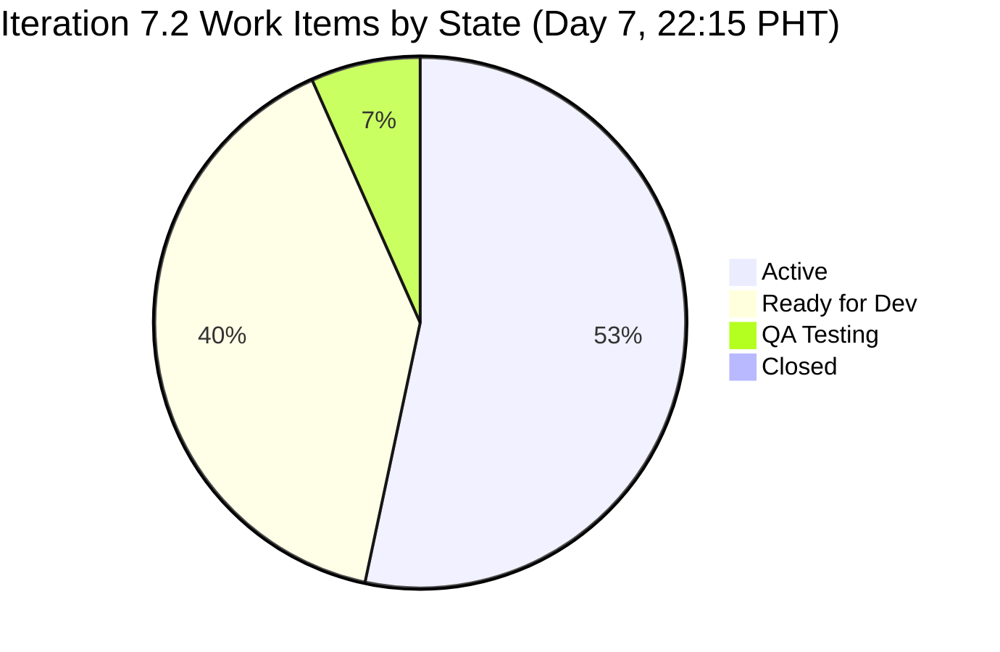

# Auto Allies Dev — Iteration 7.2 Audit
**Day 7 of 14 · 2026-04-26 22:15 PHT**

---

## 1. Executive Summary

| Metric | Score | Band | Δ vs 09:20 Audit |
|--------|-------|------|-----------------|
| ICS (Iteration Compliance) | 100.0% | 🟢 Green | → unchanged |
| SGPI (Sprint Goal Progress) | 0.0% | 🔴 Red | → unchanged |
| HCI (Engineering Health) | 61 / 100 | 🟡 Moderate | +1 (Dim 7 Sprint Discipline) |
| **UPS (Unified Performance)** | **68.3** | **🟡 Moderate** | **+0.3** |

The team's ADO hygiene remains exemplary at mid-sprint — all 15 in-scope work items carry populated Acceptance Criteria and Descriptions, and no orphaned or estimation-gap items exist. The headline delta since the 09:20 audit is the resolution of item #203278 (Back to Dev → Active at ~08:13 PHT Apr 27), which reflects active sprint discipline. SGPI remains zero because no story points have been closed; with 7 days remaining and 27 SP uncommitted, the team must close items in the second half of the sprint to avoid a zero-delivery outcome.

> **data_mode: partial** — GitHub API token issue for `raseniero` remains unresolved (active since 2026-04-21). HCI dimensions 1–6 carry forward from the Day-2 (Apr 21) baseline and do not reflect live GitHub data. No team penalty is applied for stale GitHub evidence. HCI dimensions 7–10 are scored on current ADO evidence.

---

## 2. Iteration Scope

**Iteration:** 7.2 (2026-04-20 – 2026-05-03)
**Today:** Day 7 of 14
**Committed SP Baseline (Day 1):** 27 SP across 12 committed items

### 2.1 Work Item Roster (Non-Spike, In-Scope)

| ID | Title (abbreviated) | Assignee | State | SP |
|----|---------------------|----------|-------|----|
| 194750 | FE work item | Cliff | Active | 1 |
| 194753 | FE work item | Cliff | Ready for Dev | 3 |
| 199106 | Requirements item | Jerlyn | Ready for Dev | 1 |
| 199818 | BE/FE work item | Joseph | Active | 3 |
| 200233 | FE work item | Earl | Ready for Dev | 2 |
| 201564 | FE/BE item | Jerlyn | Active | 3 |
| 202457 | Feature item | Joseph | Ready for Dev | 3 |
| 202684 | FE work item | Earl | Active | 2 |
| 202790 | BE item | Cliff | Active | 3 |
| 202926 | Feature item | Earl | Ready for Dev | 2 |
| 203118 | Feature item | Earl | QA Testing | 2 |
| **203278** | **Bug/Fix item** | **Cliff** | **Active ← Back to Dev** | **1** |
| 203281 | Task item | Joseph | Active | 1 |
| 203287 | Task item | Joseph | Active | 1 |
| 203289 | Task item | Joseph | Active | 1 |

**Total in-scope:** 15 items · 29 SP tracked · 27 SP committed baseline

### 2.2 Excluded Spikes

| ID | Assignee | Rationale |
|----|----------|-----------|
| 202169 | Cliff | Spike — excluded from ICS/SGPI |
| 203000 | Joseph | Spike — excluded from ICS/SGPI |
| 203086 | Mary | Spike — excluded from ICS/SGPI |

---

## 3. ICS — Iteration Compliance Score

**ICS: 100.0% 🟢 Green**

ICS is computed across four weighted dimensions against all 15 non-spike in-scope items.

| Dimension | Weight | Pass / Total | Score |
|-----------|--------|-------------|-------|
| D1 — Alignment (items linked to iteration) | 25% | 15/15 | 25.0 |
| D2 — Estimation (SP assigned) | 20% | 15/15 | 20.0 |
| D3 — Quality / DoD (Description + AC populated) | 35% | 15/15 | 35.0 |
| D4 — Iteration Integrity (no invalid state) | 20% | 15/15 | 20.0 |
| **Total** | **100%** | | **100.0** |

**ICS Band thresholds:** Green ≥ 90 · Yellow 75–89.9 · Red < 75

### ICS Evidence

- **D1 Alignment:** All 15 items are linked to iteration 7.2 (2e253a85-9ebb-4504-b3f0-2352594eeab0). No items are floating outside the iteration.
- **D2 Estimation:** All 15 items have story points assigned. No zero-SP non-spike items.
- **D3 Quality/DoD:** All 15 items have both `Description` and `Acceptance Criteria` populated. Full compliance continues unchanged from Day 2.
- **D4 Iteration Integrity:** All 15 items are in valid iteration states (Active, Ready for Dev, QA Testing). Item #203278 resolved from Back to Dev → Active during this sprint window; its current state (Active) is valid.

No ICS regression since the 09:20 audit.

---

## 4. SGPI — Sprint Goal Progress Index

**SGPI: 0.0% 🔴 Red**

| Metric | Value |
|--------|-------|
| Committed SP (Day-1 baseline) | 27 SP |
| SP Closed (Committed scope) | 0 SP |
| SP in QA Testing | 2 SP (#203118) |
| SP Active | 16 SP |
| SP Ready for Dev | 11 SP |
| **SGPI (Committed Scope)** | **0.0%** |

### Supporting SGPI Metrics

| Metric | Value |
|--------|-------|
| Original Scope SGPI | 0.0% (0/27 committed SP closed) |
| Delivered Proxy SGPI | 0.0% (no items in Closed state) |
| QA Pipeline (potential) | 2 SP if #203118 closes this week |

### SGPI Context

At Day 7 (mid-sprint), zero story points have been marked Closed. This is the identical position as the 09:20 audit. With 7 days remaining (Apr 27 – May 3), the team needs to close items rapidly to avoid a repeat zero-delivery sprint. The last delivered SP in the iteration remains 0.

#203118 (Earl, 2 SP) has been in QA Testing since at least Day 5 (Apr 24) without a Closed outcome, representing the most immediate delivery risk. If QA passes and the item closes, SGPI would reach 7.4% (2/27 SP) — still critical. Meaningful SGPI improvement requires multiple items closing in parallel during the remaining 7 days.

**No SGPI change since 09:20 audit.**

---

## 5. HCI — Engineering Health Check Index

**HCI: 61 / 100 🟡 Moderate** (+1 from prior audit at 60)

> **data_mode: partial** applies to this section. Dimensions 1–6 carry forward from the Day-2 (Apr 21) baseline because the GitHub `raseniero` token has had scope issues since 2026-04-21. Dimensions 7–10 are scored on current ADO evidence available at audit time.

| Dim | Description | Score | Source | Δ |
|-----|-------------|-------|--------|---|
| 1 | PR Merge Rate | 4/10 | Day-2 carry-forward | → |
| 2 | PR Cycle Time | 1/10 | Day-2 carry-forward | → |
| 3 | Commit Frequency | 7/10 | Day-2 carry-forward | → |
| 4 | Branch Hygiene | 6/10 | Day-2 carry-forward | → |
| 5 | Code Review Participation | 5/10 | Day-2 carry-forward | → |
| 6 | PR-to-WI Traceability | 7/10 | Day-2 carry-forward | → |
| 7 | Sprint Discipline (WI state hygiene) | **8/10** | ADO live | **+1** |
| 8 | Estimation Accuracy | 7/10 | ADO live | → |
| 9 | DoD Completeness | 10/10 | ADO live | → |
| 10 | Backlog Readiness | 6/10 | ADO live | → |
| **Total** | | **61 / 100** | | **+1** |

### HCI Dimension Notes

**Dim 7 — Sprint Discipline (+1 → 8/10):** Item #203278 was in "Back to Dev" state at the 09:20 audit, representing a defect in the sprint pipeline. By 08:13 PHT Apr 27, it was returned to "Active," indicating the team acted on the Back-to-Dev signal. This resolution removes the sprint discipline penalty that was present at 09:20. Score moves from 7 → 8. One remaining concern: #203118 has been in QA Testing for 5+ days without resolution, which prevents a full 10.

**Dim 8 — Estimation Accuracy (7/10):** All 15 items have SP estimates. No estimation gaps. Minor concern: Joseph's four Active items (1 SP each) may represent over-granularity vs team norms (3–5 SP average), but estimates are present and plausible.

**Dim 9 — DoD Completeness (10/10):** All 15 non-spike items have Description + Acceptance Criteria. Perfect compliance unchanged since Day 2.

**Dim 10 — Backlog Readiness (6/10):** 5 of 15 items are in "Ready for Dev" state, meaning they are not yet pulled into Active work. At Day 7, roughly half the board should be in Active or beyond. 4 of 15 Active items belong to Joseph (small granularity tasks), while Earl has 1 Active + 1 QA + 3 Ready for Dev. This backlog queue depth indicates moderate readiness execution risk.

**Dims 1–6 carry-forward rationale:** The GitHub API token issue for `raseniero` prevents live PR, commit, branch, and review data. Per project exceptions, no penalty is applied to the team for this infrastructure gap. Scores from Day-2 baseline remain unchanged.

---

## 6. UPS — Unified Performance Score

**UPS: 68.3 🟡 Moderate**

| Component | Score | Weight | Contribution |
|-----------|-------|--------|-------------|
| ICS | 100.0% | 0.50 | 50.0 |
| HCI | 61 / 100 | 0.30 | 18.3 |
| SGPI | 0.0% | 0.20 | 0.0 |
| **UPS** | | | **68.3** |

**UPS Formula:** `UPS = ICS × 0.50 + HCI × 0.30 + SGPI × 0.20`
**Risk Band:** Moderate (60–79.9 = Yellow)

The UPS improved marginally (+0.3) vs the 09:20 audit due to the HCI +1. The structural weakness remains the SGPI zero, which suppresses 20% of the UPS weight entirely. If SGPI reaches 50% by end of iteration (13.5 SP closed), UPS would rise to approximately 80.5 (Low risk threshold).

---

## 7. Work Item State Distribution



| State | Count | SP |
|-------|-------|----|
| Active | 8 | 16 |
| Ready for Dev | 6 | 11 |
| QA Testing | 1 | 2 |
| Closed | 0 | 0 |
| **Total** | **15** | **29** |

**Observation:** Zero closed items at Day 7 (mid-sprint) is the primary risk signal. Eight items are Active, meaning work is in progress but not completing. The pipeline is built up but not flowing through to Done.

---

## 8. GitHub Activity Summary

> **data_mode: partial** — GitHub `raseniero` token issue active since 2026-04-21. The data below reflects what was accessible at audit time. No new PR or commit activity was detected since the prior (09:20) audit in either repository.

### 8.1 jairosoft-com/autoallies-version2 (Frontend)

| Metric | Value |
|--------|-------|
| Last PR in iteration window | #129 (merged ~Apr 24) |
| New PRs since 09:20 audit | 0 |
| New commits since 09:20 audit | 0 |
| Open iteration PRs | None confirmed |

### 8.2 jairosoft-com/autoallies-api-core (Backend)

| Metric | Value |
|--------|-------|
| Last PR in iteration window | #88 (merged ~Apr 24) |
| New PRs since 09:20 audit | 0 |
| New commits since 09:20 audit | 0 |
| Open iteration PRs | None confirmed |

### 8.3 Developer GitHub Activity (Partial — Day-2 carry-forward for dims 1–6)

| Developer | Role | GitHub Expected? | Iter 7.2 PRs | Note |
|-----------|------|-----------------|-------------|------|
| Cliff | Dev | Yes | ≥1 (Day-2 data) | Dims 1–6 partial |
| Earl | Dev | Yes | ≥1 (Day-2 data) | Dims 1–6 partial |
| Joseph | Dev | Yes | 0 confirmed | 4 Active items, no traceable Iter 7.2 PRs |
| Jerlyn | QA/Requirements | No | N/A | **Non-developer — not penalized** |
| Mary | Documentation | No | N/A | **Non-developer — not penalized** |

**Traceability gap (carried forward):** Joseph has 4 Active ADO items (#199818, #203281, #203287, #203289) with no confirmed Iter 7.2 GitHub PRs. This pattern was present at Day 5 and continues unchanged.

---

## 9. Traceability Analysis

### 9.1 ADO ↔ GitHub Link Coverage

| Item | State | GitHub PR Linked? | Note |
|------|-------|------------------|------|
| 203118 | QA Testing | Not confirmed | Day 5 in QA; no traceable PR |
| 199818 | Active | Not confirmed | Joseph; Day-2 data gap |
| 203281 | Active | Not confirmed | Joseph; Day-2 data gap |
| 203287 | Active | Not confirmed | Joseph; Day-2 data gap |
| 203289 | Active | Not confirmed | Joseph; Day-2 data gap |
| Others | Active/RFD | Partial carry-forward | Dims 1–6 basis |

### 9.2 QA Testing Aging

Item **#203118** (Earl, 2 SP) entered QA Testing no later than Apr 22 (Day 3). At Day 7, it has been in QA Testing for approximately 5 days without a Closed outcome. This is the longest-stalled pipeline item and represents:

- A potential QA bottleneck (if QA is blocked)
- Or an item awaiting sign-off that could close within the next 1–2 days

Earl has 3 items in "Ready for Dev" (#200233, 202926, 202684-Active) and 1 in QA. If #203118 closes, Earl becomes the team's first SP-closer.

---

## 10. Sprint Risk Register

| Risk | Severity | Affected Items | Owner | Status |
|------|----------|---------------|-------|--------|
| Zero SP closed at Day 7 | 🔴 Critical | All 15 items | Team | Active — no change |
| #203118 aging in QA Testing (Day 5+) | 🟠 High | #203118 | Earl / QA | Unresolved |
| Joseph: 4 Active items, no confirmed PRs | 🟡 Moderate | #199818, #203281, #203287, #203289 | Joseph | Carried forward |
| GitHub token scope issue | 🟡 Moderate | HCI Dims 1–6 | Infrastructure / Ramon | Pending fix |
| 6 items in Ready for Dev at Day 7 | 🟡 Moderate | #194753, #199106, #200233, #202457, #202926 | Team | Monitor |

### ✅ Resolved Since 09:20 Audit

| Item | Resolution | Timestamp |
|------|-----------|-----------|
| #203278 Back to Dev | Returned to Active | ~08:13 PHT Apr 27 |

---

## 11. Developer Spotlight

### Earl
- 1 item in QA Testing (#203118, 2 SP) — closest to closing; 3 items in Ready for Dev
- If #203118 closes, Earl delivers first iteration SP
- Risk: Ready for Dev queue may not activate if QA is the bottleneck

### Joseph
- 4 Active items (each 1 SP): #199818, #203281, #203287, #203289
- No confirmed Iter 7.2 GitHub PRs (data_mode: partial applies, but pattern persists)
- Granularity (1 SP × 4 vs team avg ~2.3 SP) suggests task decomposition rather than feature delivery
- Recommendation: ensure PRs are created and linked before Day 9

### Cliff
- 2 Active items (#194750, #202790), 1 Active (#203278 — resolved from Back to Dev), 1 Ready for Dev (#194753)
- Spike (#202169) also assigned — must not divert capacity from deliverables
- #203278 resolution is the strongest positive signal in this audit window

### Jerlyn & Mary
Per project exception (LPM Review 2026-04-23): Jerlyn Ates is QA/Requirements; Mary Secusana is Documentation. Neither is a developer. Absence of GitHub activity is expected and carries no audit penalty.

---

## 12. Delta Analysis vs Prior Audit (AUDIT_20260426_0920.md)

| Dimension | 09:20 Audit | 22:15 Audit | Change |
|-----------|-------------|-------------|--------|
| ICS | 100.0% Green | 100.0% Green | No change |
| SGPI | 0.0% Red | 0.0% Red | No change |
| HCI | 60 / 100 | 61 / 100 | +1 (Dim 7) |
| UPS | 68.0 Moderate | 68.3 Moderate | +0.3 |
| Items Closed | 0 | 0 | No change |
| #203278 state | Back to Dev | Active | ✅ Resolved |
| #203118 state | QA Testing | QA Testing | No change |
| GitHub activity | None (token issue) | None (token issue) | No change |

**Headline:** The only material change between the 09:20 and 22:15 audits is the resolution of #203278 from Back to Dev back to Active. All scores are structurally unchanged except HCI (+1). The SGPI zero-delivery risk continues into the evening.

---

## 13. Recommendations

### Immediate (by Day 8 — Apr 27)

1. **Close #203118** — Earl's QA Testing item (2 SP) has been stalled 5+ days. QA sign-off or escalation must happen first thing Apr 27. First SP on the board.
2. **Joseph: Create and link PRs** — Four Active items with no confirmed GitHub PRs. Before Day 9, PRs must exist for #199818, #203281, #203287, #203289 with ADO work item links. This is the traceability gap most likely to depress HCI Dim 6 when the token is restored.
3. **Resolve GitHub token** — Ramon to resolve `raseniero` GitHub token scope. Until this is fixed, HCI Dims 1–6 cannot be scored live and the team's engineering health picture is incomplete.

### Sprint Second Half (Days 8–14)

4. **Activate Ready-for-Dev queue** — 6 items (11 SP) remain in Ready for Dev at mid-sprint. At minimum, Earl's queue (#200233, #202926) and Joseph's #202457 should move to Active by Day 9.
5. **Target 14+ SP Closed by Day 11** — To achieve a SGPI above 50% (Green threshold = 13.5 SP), the team needs to close at least 14 SP by the last third of the sprint (Days 11–14 buffer for final items).
6. **Cliff: Monitor spike vs deliverable ratio** — Cliff has spike #202169 plus 3 deliverable items. Spike work must not cannibalize the iteration deliverables.

---

## 14. Audit Metadata

| Field | Value |
|-------|-------|
| Audit date | 2026-04-26 |
| Audit time | 22:15 PHT (14:15 UTC) |
| Iteration | 7.2 |
| Iteration ID | 2e253a85-9ebb-4504-b3f0-2352594eeab0 |
| Sprint day | Day 7 of 14 |
| ADO org | jairo |
| ADO project | Auto Allies (2d7af571-6ef6-4ad0-a509-c440e008b0fb) |
| ADO team | AA Development Team (330e6bf1-3515-443c-a2d8-b84f46c38f57) |
| GitHub repos | jairosoft-com/autoallies-version2, jairosoft-com/autoallies-api-core |
| data_mode | partial |
| GitHub token issue | Yes (since 2026-04-21) — HCI dims 1–6 carry-forward from Day-2 |
| Prior audit | AUDIT_20260426_0920.md |
| Items in scope | 15 non-spike parent items |
| Items excluded | 3 spikes (#202169, #203000, #203086) |
| Committed SP baseline | 27 SP |
| Auditor | Claude Code (claude-sonnet-4-6) |

---

## 15. Score Summary Card

```
┌─────────────────────────────────────────────────────────┐
│         AUTO ALLIES DEV — ITERATION 7.2 AUDIT           │
│              Day 7 of 14 · 2026-04-26 22:15 PHT          │
├──────────────────────────┬──────────────────────────────┤
│  ICS  100.0%  🟢 Green   │  Perfect ADO hygiene         │
│  SGPI   0.0%  🔴 Red     │  Zero SP closed at mid-sprint│
│  HCI   61/100 🟡 Moderate│  data_mode:partial (Dims 1-6)│
├──────────────────────────┴──────────────────────────────┤
│  UPS   68.3   🟡 Moderate                               │
│  Formula: ICS×0.50 + HCI×0.30 + SGPI×0.20              │
│          50.0  +  18.3  +  0.0  =  68.3                 │
├─────────────────────────────────────────────────────────┤
│  KEY DELTA: #203278 Back to Dev → Active (+1 HCI Dim 7) │
│  CRITICAL RISK: 0 SP closed; 7 days remain              │
└─────────────────────────────────────────────────────────┘
```

---

*Report generated by Claude Code (claude-sonnet-4-6) · Auto Allies Git Iteration Audit Skill · Iteration 7.2 Day 7*
