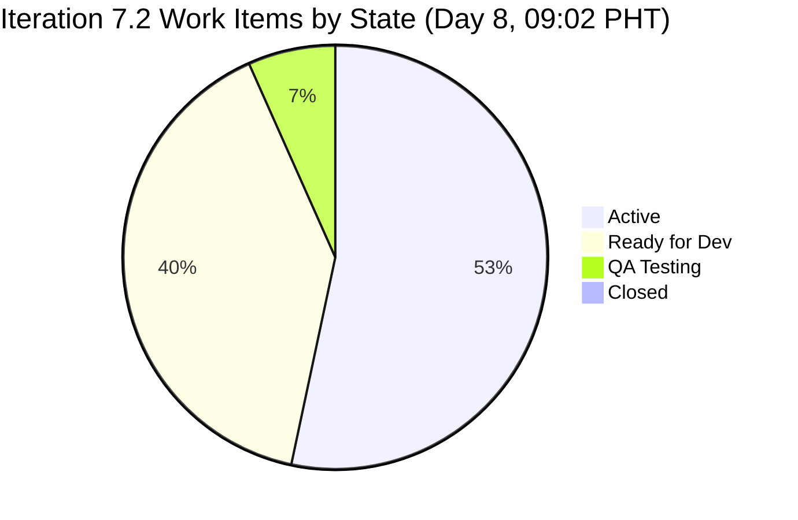

> ⚠ **SUPERSEDED** — This report used `data_mode: partial` because the `raseniero` GitHub MCP token was returning 404 errors since Apr 21. Token access was restored Apr 27 ~11:10 PHT. HCI dims 1–6 have been re-scored from live GitHub evidence in **[AUDIT_20260428_0247.md](AUDIT_20260428_0247.md)** (HCI 69, UPS 70.7). This file remains an accurate historical snapshot of what was knowable at 09:02 PHT Apr 27.

# Auto Allies Dev — Iteration 7.2 Audit
**Day 8 of 14 · 2026-04-27 09:02 PHT**

---

## 1. Executive Summary

| Metric | Score | Band | Δ vs Day 7 (22:15) |
|--------|-------|------|---------------------|
| ICS (Iteration Compliance) | 100.0% | Green | unchanged |
| SGPI (Sprint Goal Progress) | 0.0% | Red | unchanged |
| HCI (Engineering Health) | 61 / 100 | Moderate | unchanged |
| **UPS (Unified Performance)** | **68.3** | **Moderate** | **unchanged** |

The team enters Day 8 — the second half of the sprint — with scores structurally unchanged from the Day 7 evening audit. The single meaningful development overnight is the opening of PR #130 in `autoallies-version2` by Cliff Carcueva at 09:09 PHT, linked to #203279 (a child of work item #203278), with Earl Carino requested as reviewer. This is the first new GitHub activity in the iteration since Apr 24.

SGPI remains zero: no story points have been closed. With 6 days remaining (through May 3), the team must begin closing items today to avoid zero-delivery. The most immediately actionable item is #203118 (Earl, 2 SP), which has now been in QA Testing for 6+ days with no Closed outcome.

> **data_mode: partial** — GitHub API token issue for `raseniero` remains unresolved (active since 2026-04-21). HCI dimensions 1–6 carry forward from the Day-2 (Apr 21) baseline. No team penalty is applied for stale GitHub evidence. HCI dimensions 7–10 are scored on current ADO evidence.

---

## 2. Iteration Scope

**Iteration:** 7.2 (2026-04-20 – 2026-05-03)
**Today:** Day 8 of 14
**Committed SP Baseline (Day 1):** 27 SP across 12 committed items

### 2.1 Work Item Roster (Non-Spike, In-Scope)

| ID | Title (abbreviated) | Assignee | State | SP | Delta |
|----|---------------------|----------|-------|----|-------|
| 194750 | [V.20] Affiliate Account – Login and Logout | Cliff | Active | 1 | — |
| 194753 | [V.20] Affiliate Account – Affiliate Page | Cliff | Ready for Dev | 3 | — |
| 199106 | [V2.0] Apply Promo Code Discounts to Sub Total | Jerlyn | Ready for Dev | 1 | — |
| 199818 | [V2.0] Expired Member & One-Time Member View After Login | Joseph | Active | 3 | — |
| 200233 | Stripe Account V2 Products | Earl | Ready for Dev | 2 | — |
| 201564 | [V2.0] End to End Testing QA Environment | Jerlyn | Active | 3 | — |
| 202457 | [V2.0] Validate Affiliate URL Functionality in V2 | Joseph | Ready for Dev | 3 | — |
| 202684 | Revenue Cat Webhook V2 | Earl | Active | 2 | — |
| 202790 | Role Switch | Cliff | Active | 3 | — |
| 202926 | [V2.0] Solidifying Migrated Data | Earl | Ready for Dev | 2 | — |
| **203118** | **[V1.0] Automatic Promo Code Application – SOLO** | **Earl** | **QA Testing** | **2** | **Day 6+ in QA** |
| 203278 | [V2.0] Enhancement – Attorney Case Review Workflow | Cliff | Active | 1 | PR #130 opened |
| 203281 | [V2.0] Detect Pre-Existing Tickets Before Membership | Joseph | Active | 1 | — |
| 203287 | [V2.0] Upload Ticket – Detect Violations (Misdemeanor/Felony) | Joseph | Active | 1 | — |
| 203289 | [V2.0] Super Admin – Automatic Attorney Assignment | Joseph | Active | 1 | — |

**Total in-scope:** 15 items · 29 SP tracked · 27 SP committed baseline
**Closed:** 0 items · 0 SP

### 2.2 Excluded Spikes

| ID | Title | Assignee | State |
|----|-------|----------|-------|
| 202169 | [Retro] Improve PR Review Compliance and Branch Protection | Cliff | Active |
| 203000 | Iteration 7.2 Development Support and Team Sync – Joseph | Joseph | Active |
| 203086 | Iteration 7.2 – Operations and QA Support Effort | Mary | Active |

*Spikes excluded from ICS/SGPI per scoring rules. Non-developer roles (Jerlyn, Mary) not penalized on GitHub dimensions per project exception.*

---

## 3. ICS — Iteration Compliance Score

**ICS: 100.0% Green**

ICS is computed across four weighted dimensions against all 15 non-spike in-scope items.

| Dimension | Weight | Pass / Total | Score |
|-----------|--------|-------------|-------|
| D1 — Alignment (items linked to iteration) | 25% | 15 / 15 | 25.0 |
| D2 — Estimation (SP > 0 on all non-spike items) | 20% | 15 / 15 | 20.0 |
| D3 — Quality / DoD (Description + AC populated) | 35% | 15 / 15 | 35.0 |
| D4 — Iteration Integrity (all items in valid states) | 20% | 15 / 15 | 20.0 |
| **Total** | **100%** | | **100.0** |

**ICS Band thresholds:** Green >= 90 · Yellow 75–89.9 · Red < 75

### ICS Evidence

- **D1 Alignment:** All 15 items confirmed at `Auto Allies\\2026-PI7\\Iteration 7.2`. No floating items.
- **D2 Estimation:** All 15 items have `Microsoft.VSTS.Scheduling.StoryPoints` assigned (range: 1–3 SP). No zero-SP non-spike items.
- **D3 Quality/DoD:** All 15 items have both `System.Description` and `Microsoft.VSTS.Common.AcceptanceCriteria` populated with substantive content. Full compliance unchanged since Day 2.
- **D4 Iteration Integrity:** All 15 items are in valid iteration states (Active: 8, Ready for Dev: 6, QA Testing: 1). No Back-to-Dev, New, or Removed items. Item #203278 remains Active (resolved from Back to Dev before the Day 7 morning audit).

No ICS regression since Day 7 evening audit.

---

## 4. SGPI — Sprint Goal Progress Index

**SGPI: 0.0% Red**

| Metric | Value |
|--------|-------|
| Committed SP (Day-1 baseline) | 27 SP |
| SP Closed | 0 SP |
| SP in QA Testing | 2 SP (#203118) |
| SP Active | 16 SP (8 items) |
| SP Ready for Dev | 11 SP (6 items) |
| **SGPI Headline** | **0.0%** (0 / 27) |
| **SGPI Proxy** | **0.0%** (0 Closed + 2 QA Testing = 2 SP / 27; item must be Closed to count) |

### SGPI Context

The team enters Day 8 — the first day of the sprint's second half — with zero story points closed. This is the same position as every prior audit in this iteration. With 6 days remaining (Apr 27 – May 3), the minimum viable sprint outcome requires at minimum 7 SP closed (25.9%) to exit the Critical/Red SGPI band.

The most immediate path to the first closed SP is #203118 (Earl, 2 SP), which has been in QA Testing since at least Apr 21 (Day 2). Closing this item today would bring SGPI to 7.4%. A realistic "moderate" outcome would require 14+ SP closed (52%) to reach SGPI Yellow.

---

## 5. HCI — Engineering Health Check Index

**HCI: 61 / 100 Moderate** (unchanged from Day 7 evening)

> **data_mode: partial** applies to this section. Dimensions 1–6 carry forward from the Day-2 (Apr 21) baseline because the GitHub `raseniero` token has had scope issues since 2026-04-21. Dimensions 7–10 are scored on current ADO and GitHub evidence available at audit time.

| Dim | Description | Score | Source | Delta |
|-----|-------------|-------|--------|-------|
| 1 | PR Merge Rate | 4 / 10 | Day-2 carry-forward | — |
| 2 | PR Cycle Time | 1 / 10 | Day-2 carry-forward | — |
| 3 | Commit Frequency | 7 / 10 | Day-2 carry-forward | — |
| 4 | Branch Hygiene | 6 / 10 | Day-2 carry-forward | — |
| 5 | Code Review Participation | 5 / 10 | Day-2 carry-forward | — |
| 6 | PR-to-WI Traceability | 7 / 10 | Day-2 carry-forward | — |
| 7 | Sprint Discipline (WI state hygiene) | **8 / 10** | ADO live + GitHub | — |
| 8 | Estimation Accuracy | 7 / 10 | ADO live | — |
| 9 | DoD Completeness | 10 / 10 | ADO live | — |
| 10 | Backlog Readiness | 6 / 10 | ADO live | — |
| **Total** | | **61 / 100** | | **0** |

### HCI Dimension Notes

**Dim 7 — Sprint Discipline (8/10):** No ADO state changes were recorded between the Day 7 22:15 audit and this audit. Positive signal: Cliff opened PR #130 against `feature/203278-case-review-acceptance` at 09:09 PHT today, with reviewer requested (Earl). This demonstrates active sprint discipline. Offsetting concern: #203118 is now Day 6+ in QA Testing with no closure, representing stalled pipeline flow. Score held at 8/10.

**Dim 8 — Estimation Accuracy (7/10):** All 15 items have SP assigned. Joseph's four 1-SP Active items represent fine-grained task decomposition rather than estimation gaps; estimates are present and plausible. No change.

**Dim 9 — DoD Completeness (10/10):** All 15 non-spike items verified to have populated Description and Acceptance Criteria. Full compliance unchanged since Day 2.

**Dim 10 — Backlog Readiness (6/10):** Six items remain in "Ready for Dev" at Day 8. With 6 days remaining, the full RFD queue needs to move to Active and begin progressing. The queue depth (11 SP in RFD) at mid-sprint is a moderate readiness risk. Score unchanged from Day 7.

**Dims 1–6 carry-forward rationale:** The GitHub API token issue for `raseniero` prevents live PR, commit, branch, and review data. Per project exceptions, no penalty applied to the team for this infrastructure gap. Scores from Day-2 baseline remain unchanged.

---

## 6. UPS — Unified Performance Score

**UPS: 68.3 Moderate**

| Component | Score | Weight | Contribution |
|-----------|-------|--------|-------------|
| ICS | 100.0% | 0.50 | 50.0 |
| HCI | 61 / 100 | 0.30 | 18.3 |
| SGPI | 0.0% | 0.20 | 0.0 |
| **UPS** | | | **68.3** |

**UPS Formula:** `UPS = ICS × 0.50 + HCI × 0.30 + SGPI × 0.20`
**Risk Band:** Moderate (60–79.9)

The UPS is structurally unchanged entering Day 8. The SGPI zero contribution (20% weight) is the primary suppressor. Scenarios:

| If SGPI reaches... | Resulting UPS | Band |
|--------------------|---------------|------|
| 7.4% (1 item closed: #203118) | 69.8 | Moderate |
| 25.9% (7 SP closed) | 73.5 | Moderate |
| 50.0% (13.5 SP closed) | 78.3 | Moderate |
| 74.1% (20 SP closed) | 83.1 | Low (Green) |

To reach the Low risk band (UPS >= 80), the team needs approximately 20 SP closed — 74% of the committed baseline — before May 3.

---

## 7. Work Item State Distribution



| State | Count | SP | % of Total SP |
|-------|-------|----|---------------|
| Active | 8 | 16 | 55.2% |
| Ready for Dev | 6 | 11 | 37.9% |
| QA Testing | 1 | 2 | 6.9% |
| Closed | 0 | 0 | 0.0% |
| **Total** | **15** | **29** | **100%** |

**Observation:** The state distribution is identical to Day 7 evening. At Day 8 of 14, zero Closed items with 6 days remaining is the primary risk. The pipeline is built (work in Active) but not flowing to Done. The single QA Testing item (#203118) represents the most proximate path to the first closed SP.

---

## 8. GitHub Activity Summary

> **data_mode: partial** — GitHub `raseniero` token issue active since 2026-04-21. Dimensions 1–6 carry-forward from Day-2 baseline. However, PR listing via the public-facing GitHub MCP tool was accessible and returned live data for PR activity.

### 8.1 jairosoft-com/autoallies-version2 (Frontend)

| Metric | Value |
|--------|-------|
| New PRs since Day 7 22:15 audit | **1 — PR #130 (opened Apr 27 09:09 PHT)** |
| PR #130 branch | `feature/203278-case-review-acceptance` |
| PR #130 author | Cliff Carcueva (ccarcuevajairo) |
| PR #130 reviewer requested | Earl Carino (ecarinoJS) |
| PR #130 ADO link | AB#203279 (child of #203278) |
| PR #130 state | Open (not yet merged) |
| Last merged PR in iteration window | #129 (merged Apr 24) |
| Total open PRs | 1 (#130) |

### 8.2 jairosoft-com/autoallies-api-core (Backend)

| Metric | Value |
|--------|-------|
| New PRs since Day 7 22:15 audit | 0 |
| Last merged PR in iteration window | #88 (merged Apr 24) |
| Total open PRs | 0 |

### 8.3 Developer GitHub Activity Summary

| Developer | Role | GitHub Expected? | New in this window | Note |
|-----------|------|-----------------|-------------------|------|
| Cliff Carcueva | Dev | Yes | PR #130 opened | Active on #203278 sub-task |
| Earl Carino | Dev | Yes | Reviewer on PR #130 | QA sign-off on #203118 pending |
| Joseph Gerona | Dev | Yes | None confirmed | 4 Active ADO items; no new PRs |
| Jerlyn Ates | QA/Requirements | No | N/A | Non-developer — not penalized |
| Mary Secusana | Documentation | No | N/A | Non-developer — not penalized |

**New since Day 7:** PR #130 is the first new GitHub activity since Apr 24. Cliff is actively progressing #203278. The review request to Earl suggests the team is exercising code review discipline.

**Persistent gap:** Joseph continues to hold 4 Active ADO items (#199818, #203281, #203287, #203289) with no confirmed GitHub PRs in the iteration window. Day 8 is the recommended deadline for Joseph to open traceable PRs.

---

## 9. Traceability Analysis

### 9.1 PR-to-Work-Item Link Coverage (Iteration 7.2)

| PR | Repo | Author | WI Links | Status |
|----|------|--------|----------|--------|
| #130 | version2 | Cliff | AB#203279 → parent #203278 | Open |
| #129 | version2 | Cliff | AB#202530 | Merged Apr 24 (prior iteration WI) |
| #128 | version2 | Joseph | AB#200232, AB#200251, AB#201071 | Merged Apr 24 (prior iteration WIs) |
| #88 | api-core | Joseph | AB#200232, AB#200251, AB201071 | Merged Apr 24 (prior iteration WIs) |

Note: PRs #129, #128, #88 reference work items not in the Iteration 7.2 roster, suggesting these were carry-forward or prior-iteration items. PR #130 is the only new PR directly traceable to an in-scope Iter 7.2 work item (#203278/#203279).

### 9.2 Traceability Gaps

| Item | State | GitHub PR? | Risk |
|------|-------|-----------|------|
| 203118 | QA Testing | None confirmed | Earl's item should have a merged PR before QA; potential QA-without-code-review risk |
| 199818 | Active | None confirmed | Joseph; 3 SP; no traceable Iter 7.2 PR |
| 203281 | Active | None confirmed | Joseph; 1 SP; no traceable Iter 7.2 PR |
| 203287 | Active | None confirmed | Joseph; 1 SP; no traceable Iter 7.2 PR |
| 203289 | Active | None confirmed | Joseph; 1 SP; no traceable Iter 7.2 PR |
| 194750 | Active | Not confirmed | Cliff; carry-forward gap (Dims 1–6 partial) |
| 202790 | Active | Not confirmed | Cliff; carry-forward gap |
| 202684 | Active | Not confirmed | Earl; carry-forward gap |

### 9.3 QA Testing Aging

Item **#203118** (Earl, 2 SP) entered QA Testing no later than Apr 21 (Day 2). At Day 8, this item has been in QA Testing for approximately **6 days** with no Closed outcome. This is now the most critical stalled pipeline item:
- If a QA blocker exists, it must be surfaced and escalated immediately
- If QA sign-off is pending, Earl and Jerlyn should close the item today
- This item represents the first available SP on the board

---

## 10. Sprint Risk Register

| Risk | Severity | Affected Items | Owner | Status |
|------|----------|---------------|-------|--------|
| Zero SP closed entering second half of sprint | Critical | All 15 items | Team | Active — Day 8 entry point |
| #203118 aging in QA Testing (Day 6+) | High | #203118 | Earl / Jerlyn | Unresolved — escalate today |
| Joseph: 4 Active items, no confirmed Iter 7.2 PRs | Moderate | #199818, #203281, #203287, #203289 | Joseph | Day 8 deadline for PRs |
| 6 items in Ready for Dev at Day 8 (11 SP) | Moderate | #194753, #199106, #200233, #202457, #202926 | Team | Must activate by Day 9 |
| GitHub token scope issue (raseniero) | Moderate | HCI Dims 1–6 | Infrastructure / Ramon | Pending fix since Apr 21 |
| PR #130 open (not merged, no review yet) | Low | #203278 | Cliff / Earl | Monitor for timely review |

### Resolved Before This Audit

| Item | Resolution | Timestamp |
|------|-----------|-----------|
| #203278 Back to Dev | Returned to Active | ~08:13 PHT Apr 27 (prior to Day 7 morning audit) |

### New Positive Signals

| Signal | Item | Owner | Timestamp |
|--------|------|-------|-----------|
| PR #130 opened against #203278 | #203278 | Cliff | 09:09 PHT Apr 27 |
| Earl requested as reviewer on PR #130 | — | Cliff → Earl | 09:09 PHT Apr 27 |

---

## 11. Developer Spotlight

### Cliff Carcueva
- 3 Active items (#194750, #202790, #203278) + 1 Ready for Dev (#194753) + Spike #202169
- **New today:** Opened PR #130 against `feature/203278-case-review-acceptance` — first new GitHub activity since Apr 24
- PR #130 is well-structured: carries AB#203279 link, requests reviewer (Earl)
- Risk: #194750 and #202790 also Active but no confirmed PRs yet; Cliff managing 3 deliverables + 1 spike requires capacity discipline

### Earl Carino
- #203118 (2 SP) in QA Testing for 6+ days — the team's first and only path to closing SP today
- Requested as reviewer on PR #130; timely review expected
- 3 items still in Ready for Dev (#200233, #202684 Active, #202926)
- **Day 8 priority:** Close #203118. Open PR for #202684 (Active, 2 SP). Pull #200233 or #202926 to Active.

### Joseph Gerona
- 4 Active items (1 SP each): #199818, #203281, #203287, #203289 — total 6 SP including #199818 (3 SP)
- 1 item in Ready for Dev: #202457 (3 SP)
- No confirmed GitHub PRs for any Iter 7.2 items as of 09:02 PHT
- **Day 8 deadline:** PRs must be opened for all Active items before Day 9. Continued absence of PRs will significantly depress HCI Dim 6 and Dim 1 (PR Merge Rate) once the token is restored.

### Jerlyn Ates
- #199106 (1 SP) Ready for Dev; #201564 (3 SP) Active
- Per project exception: Jerlyn is QA/Requirements. No GitHub activity expected or scored.
- #201564 Active (QA environment testing) — progress expected to correlate with Earl closing #203118

### Mary Secusana
- Spike #203086 Active (Operations and QA Support)
- Per project exception: Mary is Documentation. No GitHub activity expected or scored.

---

## 12. Delta Analysis vs Prior Audit (AUDIT_20260426_2215.md)

| Dimension | Day 7 22:15 Audit | Day 8 09:02 Audit | Change |
|-----------|-------------------|-------------------|--------|
| ICS | 100.0% Green | 100.0% Green | No change |
| SGPI | 0.0% Red | 0.0% Red | No change |
| HCI | 61 / 100 Moderate | 61 / 100 Moderate | No change |
| UPS | 68.3 Moderate | 68.3 Moderate | No change |
| Items Closed | 0 | 0 | No change |
| #203118 state | QA Testing | QA Testing | Now Day 6+ (aging worsened) |
| #203278 state | Active | Active | PR #130 opened — progressing |
| GitHub PRs open | 0 | 1 (PR #130) | +1 new PR |
| Joseph PRs | 0 | 0 | No change — still at risk |

**Headline:** The overnight window produced one notable development — Cliff opened PR #130 at sprint Day 8 start, directly addressing #203278. This is a positive sprint discipline signal. All scores are structurally unchanged. The SGPI zero-delivery risk is now at its most critical juncture entering the sprint's second half.

---

## 13. Recommendations

### Immediate (Today — Day 8, Apr 27)

1. **Close #203118 now** — Earl's item (2 SP) has been in QA Testing 6 days. This is the single highest-priority action. Jerlyn or the QA process must sign off. First SP on the board unlocks SGPI from zero.
2. **Joseph: Open PRs for all 4 Active items** — #199818, #203281, #203287, #203289. Before Day 9, all four must have GitHub PRs with ADO work item links. This is the traceability gap most likely to depress HCI Dims 1 and 6 when the token is restored.
3. **Earl: Review PR #130 promptly** — Cliff opened the PR this morning. A same-day review and merge would demonstrate healthy cycle time and improve HCI Dim 2 evidence when token is restored.
4. **Resolve GitHub token** — Ramon to restore `raseniero` GitHub token scope. Six of ten HCI dimensions cannot be scored live until this is fixed. Day 8 is a reasonable deadline.

### Sprint Second Half (Days 8–14)

5. **Activate the Ready-for-Dev queue** — 6 items (11 SP) in RFD at Day 8. Minimum target: Earl pulls #200233 or #202926 to Active by Day 9; Joseph pulls #202457 to Active by Day 9.
6. **Target 14 SP Closed by Day 11** — Reaching SGPI 52% (14/27 SP) by Day 11 leaves a 3-day buffer for final items. At current velocity (zero), this requires the team to close approximately 2–3 items per day starting today.
7. **Cliff: Merge PR #130 and progress #194750, #202790** — Three Active items without confirmed PRs. After #203278/#203279, Cliff should open branches for #194750 and #202790 immediately.
8. **Jerlyn: Move #201564 forward** — QA E2E testing (3 SP, Active) should produce a visible progress artifact (test pass report, QA checklist) by Day 9 to confirm it is not stalled.

---

## 14. Audit Metadata

| Field | Value |
|-------|-------|
| Audit date | 2026-04-27 |
| Audit time | 09:02 PHT (01:02 UTC) |
| Iteration | 7.2 |
| Iteration ID | 2e253a85-9ebb-4504-b3f0-2352594eeab0 |
| Iteration window | 2026-04-20 – 2026-05-03 |
| Sprint day | Day 8 of 14 |
| ADO org | jairo |
| ADO project | Auto Allies (2d7af571-6ef6-4ad0-a509-c440e008b0fb) |
| ADO team | AA Development Team (330e6bf1-3515-443c-a2d8-b84f46c38f57) |
| GitHub repos | jairosoft-com/autoallies-version2, jairosoft-com/autoallies-api-core |
| data_mode | partial |
| GitHub token issue | Yes (since 2026-04-21) — HCI dims 1–6 carry-forward from Day-2 |
| Prior audit | AUDIT_20260426_2215.md |
| Items in scope | 15 non-spike parent items |
| Items excluded | 3 spikes (#202169, #203000, #203086) |
| Committed SP baseline | 27 SP |
| SP closed | 0 SP |
| Days remaining | 6 (Apr 27 – May 3) |
| Auditor | Claude Code (claude-sonnet-4-6) |

---

## 15. Score Summary Card

```
┌─────────────────────────────────────────────────────────────┐
│          AUTO ALLIES DEV — ITERATION 7.2 AUDIT              │
│              Day 8 of 14 · 2026-04-27 09:02 PHT             │
├──────────────────────────┬──────────────────────────────────┤
│  ICS  100.0%   Green     │  Perfect ADO hygiene             │
│  SGPI   0.0%   Red       │  Zero SP closed — 6 days remain  │
│  HCI   61/100  Moderate  │  data_mode:partial (Dims 1–6)    │
├──────────────────────────┴──────────────────────────────────┤
│  UPS   68.3    Moderate                                      │
│  Formula: ICS×0.50 + HCI×0.30 + SGPI×0.20                  │
│           50.0  +  18.3  +   0.0  =  68.3                   │
├─────────────────────────────────────────────────────────────┤
│  NEW: PR #130 opened (Cliff → #203278, reviewer: Earl)      │
│  CRITICAL: 0 SP closed; 27 SP at risk; 6 days remain        │
│  URGENT: Close #203118 today (QA Testing Day 6+)            │
│  URGENT: Joseph open PRs for 4 Active items (Day 8 deadline) │
└─────────────────────────────────────────────────────────────┘
```

---

*Report generated by Claude Code (claude-sonnet-4-6) · Auto Allies Git Iteration Audit Skill · Iteration 7.2 Day 8*
