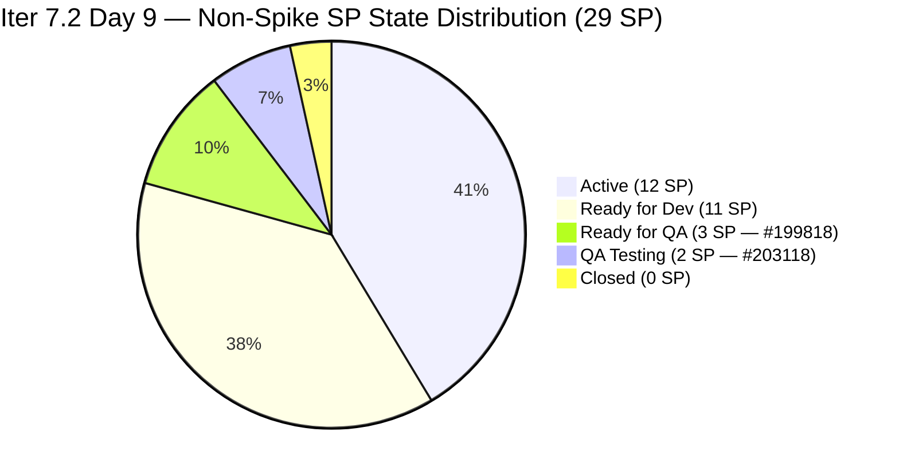
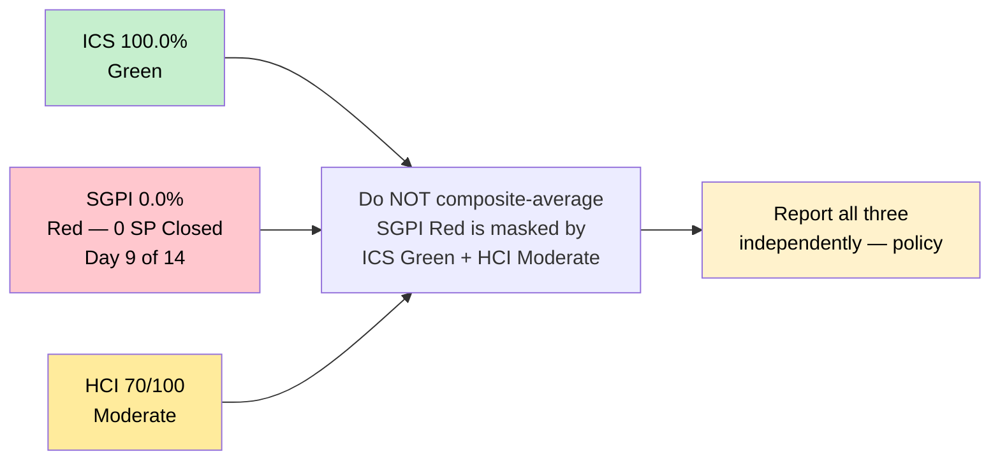
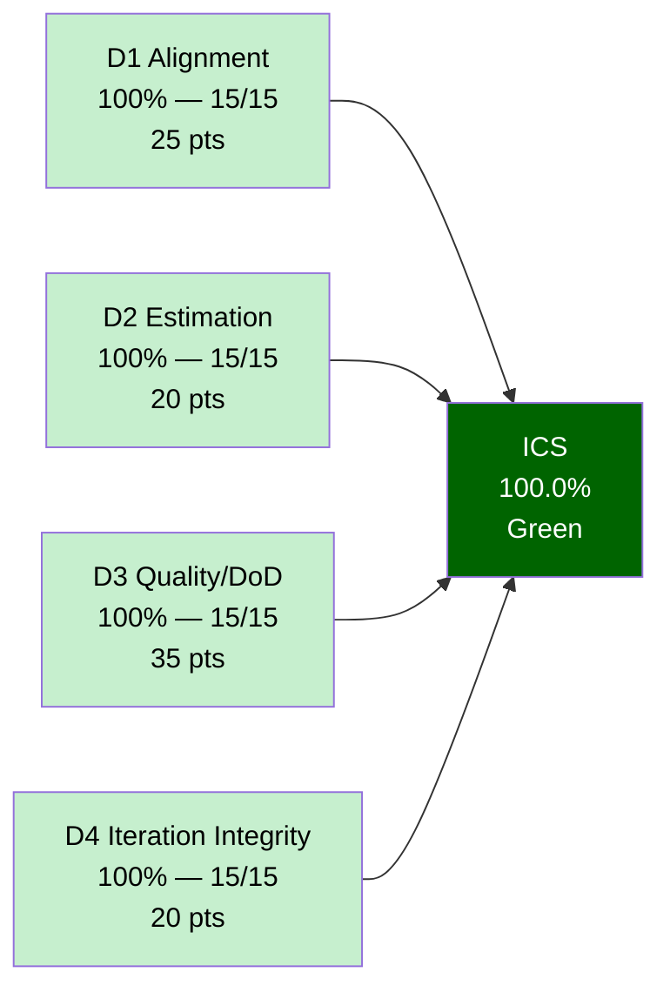
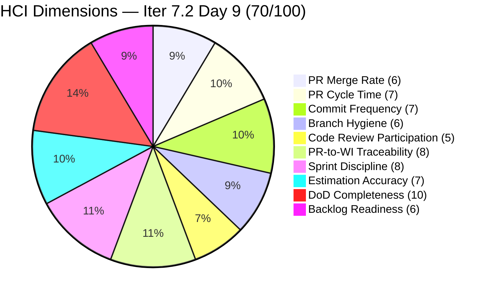
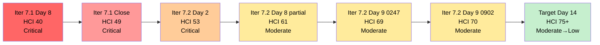
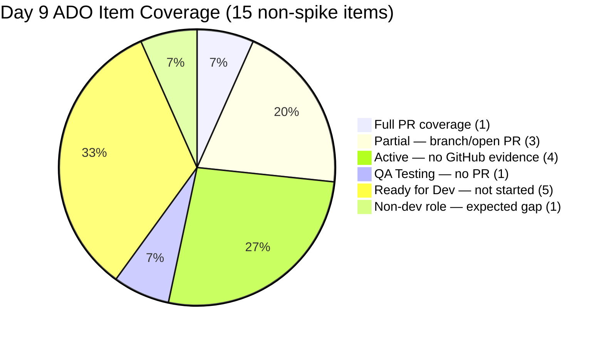
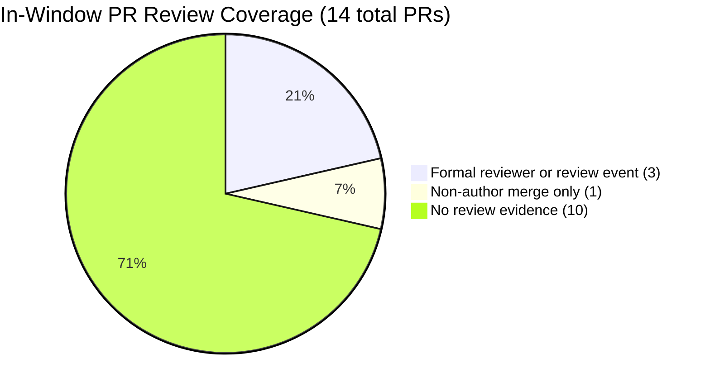
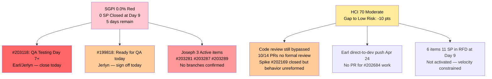

# Auto Allies Dev — Iteration 7.2 Audit
**Day 9 of 14 · 09:02 PHT Apr 28**

---

## 1. Audit Metadata

| Field | Value |
|-------|-------|
| **Audit Date** | April 28, 2026 |
| **Audit Time** | 09:02 PHT (Tuesday) |
| **Iteration** | 7.2 (2026-04-20 – 2026-05-03) |
| **Iteration ID** | 2e253a85-9ebb-4504-b3f0-2352594eeab0 |
| **Day in Sprint** | Day 9 of 14 (64% elapsed) |
| **Auditor** | Claude Code — Git Iteration Audit Skill |
| **ADO Org** | jairo |
| **ADO Project** | Auto Allies (ID: 2d7af571-6ef6-4ad0-a509-c440e008b0fb) |
| **ADO Team** | AA Development Team (ID: 330e6bf1-3515-443c-a2d8-b84f46c38f57) |
| **ADO Backlog** | Stories and Deliverables (Microsoft.RequirementCategory) |
| **GitHub Repo (FE)** | jairosoft-com/autoallies-version2 |
| **GitHub Repo (BE)** | jairosoft-com/autoallies-api-core |
| **Data Mode** | **full** — GitHub MCP token confirmed active; all 10 HCI dimensions scored from live evidence |
| **Prior Audit** | AUDIT_20260428_0247.md (Day 9 Early, 02:47 PHT — token-restored rerun) |
| **ICS** | **100.0%** Green |
| **SGPI** | **0.0%** Red |
| **HCI** | **70 / 100** Moderate |
| **UPS** | **71.0** Moderate |

> **UPS-masking warning:** SGPI remains Critical/Red (0.0%) even though ICS is Green and HCI is Moderate. Composite averaging would mask the zero-delivery signal. All three scores are reported independently per policy.

---

## 2. Executive Summary

Today is **Day 9 of 14** (64% elapsed). The team has **zero Story Points closed** against a 29 SP committed baseline — the most urgent finding in this report. Five working days remain (Apr 28–May 3). At current velocity, the sprint will close at 0% delivery unless the team begins closing items today.

The morning's activity is the most concrete positive signal yet: **FE PR#131 and BE PR#89 both merged today (Apr 28) for AB#199818** ([V2.0] Expired Member & One-Time Member View After Login, 3 SP, Joseph). Commit messages on both PRs include "additional changes based on PR review" — the first explicit evidence of a review-response iteration cycle in Iter 7.2. Item #199818 advanced to **Ready for QA** and is the fastest path to the first Closed SP. Jerlyn Ates, the QA lead, should pick it up immediately.

A second important signal is the **closure of Retro Spike #202169** (PR Review Compliance / Branch Protection). This spike had been Active since it was created to address 7.1's Critical HCI findings. Its closure means the team formally acknowledged and addressed the systemic PR review gap — even if the engineering enforcement (branch protection rules) is not yet fully institutionalized.

The **Engineering Health Index (HCI) is 70/100 — Moderate**, up 1 point from the 0247 rerun (69) and up 21 points from the Iter 7.1 close (49). The three-sprint trajectory from Critical (49) → Moderate (70) demonstrates real structural improvement. Key remaining gaps: code review participation still below 50% of PRs (only ~3 of 13 in-window PRs have confirmed reviewer involvement), and 3 Active items (Joseph: #203281, #203287, #203289) still lack confirmed GitHub branches.

| Score | Day 2 Apr 21 | Day 8 Apr 27 (partial) | Day 9 Early Apr 28 (0247) | **Day 9 Late Apr 28 (0902)** | Delta (0247→0902) |
|-------|-------------|----------------------|--------------------------|------------------------------|-------------------|
| ICS | 95.3% Green | 100.0% Green | 100.0% Green | **100.0%** Green | 0 |
| SGPI | 0.0% Red | 0.0% Red | 0.0% Red | **0.0%** Red | 0 |
| HCI | 53 Critical | 61 Moderate (partial) | 69 Moderate | **70** Moderate | +1 |
| UPS | — | 68.3 Moderate | 70.7 Moderate | **71.0** Moderate | +0.3 |

---

## 3. Iteration Scope and Methodology

### Methodology

Evidence collected from:

- **ADO iteration resolution:** `work_list_team_iterations` with `timeframe=current` → Iteration 7.2 (path `Auto Allies\2026-PI7\Iteration 7.2`, start 2026-04-20, finish 2026-05-03)
- **ADO iteration items:** `wit_get_work_items_for_iteration` with iterationId `2e253a85-9ebb-4504-b3f0-2352594eeab0` — 18 parent items (source=null)
- **ADO work item detail:** `wit_get_work_items_batch_by_ids` — full field detail for all 18 iteration parents
- **ADO capacity:** `work_get_team_capacity` — Iter 7.2 confirmed 27h/day total
- **GitHub FE:** `list_pull_requests state=all sort=updated` on autoallies-version2 — PRs #123–#131 in window
- **GitHub BE:** `list_pull_requests state=all sort=updated` on autoallies-api-core — PRs #85–#89 in window
- **GitHub FE commits:** `list_commits sha=develop` — Apr 20–28 window
- **GitHub BE commits:** `list_commits sha=dev` — Apr 20–28 window

Scoring methodology per `.claude/skills/git_iteration_audit/SKILL.md`:

- **ICS:** 4-dimension weighted rubric (Alignment 25, Estimation 20, Quality/DoD 35, Iteration Integrity 20); non-spike parent items only
- **SGPI (headline):** Committed Scope = Closed SP / Total Committed SP (27 SP Day-1 baseline)
- **HCI:** 10-dimension engineering index, 0–10 each, total /100
- **UPS:** ICS × 0.50 + HCI × 0.30 + SGPI × 0.20

### Iteration Window

April 20 – May 3, 2026 (14 days). Today is **Day 9** — 64% elapsed. 5 working days remain.

### Team Capacity (Iter 7.2)

| Member | Role | Activity | Capacity/Day |
|--------|------|----------|--------------|
| Cliff Carcueva | Dev | Development | 6h |
| Earl Carino | Dev | Development | 6h |
| Joseph Gerona | Dev | Development | 5h |
| Jerlyn Ates | Requirements/Testing | Requirements 2h + Testing 4h | 6h |
| Mary Secusana | Documentation | Documentation | 4h |
| **Total** | | | **27h/day** |

> Note: Jerlyn Ates (QA/Requirements) and Mary Secusana (Documentation) are non-developer roles per project exception. Their absence of GitHub commits, PRs, and reviews is expected and is not scored as a gap.

### In-Scope Parent Items (Non-Spike)

| ID | Title (abbreviated) | Type | Assignee | State | SP |
|----|---------------------|------|----------|-------|----|
| 194750 | [V.20] Affiliate Account – Login and Logout | User Story | Cliff | Active | 1 |
| 194753 | [V.20] Affiliate Account – Affiliate Page | User Story | Cliff | Ready for Dev | 3 |
| 199106 | [V2.0] Apply Promo Code Discounts to Sub Total | Defect | Jerlyn | Ready for Dev | 1 |
| 199818 | [V2.0] Expired Member & One-Time Member View After Login | User Story | Joseph | Ready for QA | 3 |
| 200233 | Stripe Account V2 Products | Enabler | Earl | Ready for Dev | 2 |
| 201564 | [V2.0] End to End Testing QA Environment | Enabler | Jerlyn | Active | 3 |
| 202457 | [V2.0] Validate Affiliate URL Functionality in V2 | User Story | Joseph | Ready for Dev | 3 |
| 202684 | Revenue Cat Webhook V2 | User Story | Earl | Active | 2 |
| 202790 | Role Switch | User Story | Cliff | Active | 3 |
| 202926 | [V2.0] Solidifying Migrated Data | Enabler | Earl | Ready for Dev | 2 |
| 203118 | [V1.0] Automatic Promo Code Application – SOLO | User Story | Earl | QA Testing | 2 |
| 203278 | [V2.0] Enhancement – Attorney Case Review Workflow | User Story | Cliff | Active | 1 |
| 203281 | [V2.0] Detect Pre-Existing Tickets Before Membership | User Story | Joseph | Active | 1 |
| 203287 | [V2.0] Upload Ticket – Detect Violations | User Story | Joseph | Active | 1 |
| 203289 | [V2.0] Super Admin – Automatic Attorney Assignment | User Story | Joseph | Active | 1 |
| **Total** | | | | | **29 SP** |

**Committed SP baseline (Day 1):** 27 SP (items #203278–#203289 added during sprint planning; baseline tracked at 27).

### Excluded Spikes

| ID | Title | Assignee | State |
|----|-------|----------|-------|
| 202169 | [Retro] Improve PR Review Compliance and Branch Protection | Cliff | **Closed** |
| 203000 | Iter 7.2 Dev Support and Team Sync | Joseph | Active |
| 203086 | Iter 7.2 Operations and QA Support | Mary | Active |

> **Notable:** Spike #202169 (PR Review / Branch Protection retro) is now **Closed** — first closure of this long-running compliance retro item since it was created in 7.1.

---

## 4. Scorecard Summary

| Metric | Score | Band | Threshold | Δ vs 0247 |
|--------|-------|------|-----------|-----------|
| **ICS — Iteration Compliance Score** | **100.0%** | Green | ≥ 90% | 0 |
| **SGPI — Committed Scope** | **0.0%** | Red | ≥ 75% at sprint end | 0 |
| **HCI — Engineering Health Index** | **70 / 100** | Moderate | ≥ 60 | +1 |
| **UPS — Unified Performance Score** | **71.0** | Moderate | ≥ 80 = Low Risk | +0.3 |

### Sprint Progress Overview

> Visualized to show relative state. "Closed" slice = 1 unit for rendering; actual value = 0 SP.

### Three-Score Independence Panel

---

## 5. Sprint Goal Predictability (SGPI)

### Committed Scope SGPI (Headline)

| Metric | Value |
|--------|-------|
| Committed SP baseline (Day 1) | 27 SP |
| Total SP tracked (incl. added scope) | 29 SP |
| Closed SP | **0 SP** |
| **SGPI (Committed Scope)** | **0.0% — Red** |

### Work Item State Distribution (Day 9)

| State | Count | SP | Notes |
|-------|-------|----|-------|
| Closed | 0 | 0 | No SP delivered at Day 9 |
| Active | 7 | 12 | #194750, #201564, #202684, #202790, #203278, #203281, #203287 (+#203289=1) |
| Ready for QA | 1 | 3 | **#199818** — PRs merged Apr 28, awaiting QA sign-off |
| QA Testing | 1 | 2 | **#203118** — in QA since Day 3, aging concern |
| Ready for Dev | 6 | 12 | #194753, #199106, #200233, #202457, #202926 |
| Spikes (excl.) | 3 | N/A | #202169 (Closed), #203000 (Active), #203086 (Active) |

> **Note on #199818:** Joseph's FE PR#131 and BE PR#89 both merged today (Apr 28). Item state advanced to Ready for QA. If Jerlyn signs off today, this yields the first 3 SP closure of the sprint.

### SGPI Scenarios (5 Days Remaining: Apr 28–May 3)

| If team closes by EOD... | SP Closed | SGPI | UPS | Band |
|--------------------------|-----------|------|-----|------|
| #199818 only (today) | 3 SP | 11.1% | 71.6 | Moderate |
| #199818 + #203118 | 5 SP | 18.5% | 72.7 | Moderate |
| #199818 + #203118 + 3 more stories | 14 SP | 51.9% | 75.6 | Moderate |
| 20 SP (Green threshold) | 20 SP | 74.1% | 79.2 | Moderate (near-Green) |
| 22 SP | 22 SP | 81.5% | 80.5 | **Green / Low Risk** |

Reaching Green by Day 14 requires closing ~22 SP across 5 days — approximately 4–5 SP/day. At 0 SP/day current velocity, this requires an immediate acceleration. The **minimum credible target is 14 SP** (7 items), achievable if both QA-stage items close today and 5 more items complete by Thursday.

---

## 6. Developer Productivity Findings

### 6.1 Pull Request Activity — Full Iteration Window (Apr 20–28)

#### jairosoft-com/autoallies-version2 (FE)

| PR | Title (abbreviated) | Author | ADO Links | Opened | Merged | Cycle |
|----|---------------------|--------|-----------|--------|--------|-------|
| #131 | **[V2.0] Expired Member view – additional changes based on PR review** | JosephJairo | AB#199818 | Apr 28 | Apr 28 | Same-day |
| #130 | AB#203279 Refactor CaseList + AttorneyMessageDialog | ccarcuevajairo | AB#203279 → #203278 | Apr 27 09:09 | Open | — |
| #129 | AB#202530 Enhance AttorneyMessageDialog (messaging permission) | ccarcuevajairo | AB#202530 | Apr 24 07:05 | Apr 24 07:42 | ~37 min |
| #128 | Additional changes AB#200232, AB#200251, AB#201071 | JosephJairo | AB#200232, AB#200251, AB#201071 | Apr 23 18:46 | Apr 24 01:42 | ~7 h |
| #127 | AB#202530 Integrate real-time attorney details | ccarcuevajairo | AB#202530 | Apr 23 06:30 | Apr 23 08:05 | ~1.5 h |
| #126 | develop → story branch sync | JosephJairo | — (sync) | Apr 22 13:09 | Apr 22 13:09 | <1 h |
| #125 | AB#202530 Refactor system message display | ccarcuevajairo | AB#202530 | Apr 22 01:55 | Apr 22 03:41 | ~1.75 h |
| #124 | Frontend fixes AB#200232, AB#200251, AB#201071, AB#202427 | JosephJairo | AB#200232, AB#200251, AB#201071, AB#202427 | Apr 22 00:08 | Apr 22 02:21 | ~2 h |
| #123 | AB#202530 implement ReviewCaseDrawer | ccarcuevajairo | AB#202530 | Apr 20 09:21 | Apr 21 14:34 | ~29 h |

#### jairosoft-com/autoallies-api-core (BE)

| PR | Title (abbreviated) | Author | ADO Links | Opened | Merged | Cycle |
|----|---------------------|--------|-----------|--------|--------|-------|
| #89 | **[V2.0] Expired Member view – additional changes based on PR review** | JosephJairo | AB#199818 | Apr 28 | Apr 28 | Same-day |
| #88 | Bugs fix AB#200232, AB#200251, AB#201071 | JosephJairo | AB#200232, AB#200251, AB#201071 | Apr 22 19:13 | Apr 24 01:42 | ~30 h |
| #87 | Backend fixes AB#200232, AB#200251, AB#201071, AB#202427 | JosephJairo | AB#200232, AB#200251, AB#201071, AB#202427 | Apr 22 00:11 | Apr 22 02:20 | ~2 h |
| #86 | dev → story branch sync | JosephJairo | — (sync) | Apr 20 11:51 | Apr 20 11:51 | <1 h |
| #85 | Bugfix #200232 enhance performance | ccarcuevajairo | AB#200232 | Apr 20 02:22 | Apr 20 03:01 | ~40 min |

**Summary:** 14 total in-window PRs · 13 merged · 1 open (#130) · median cycle time ~2 hours

### 6.2 Commit Cadence — Iteration Window

| Date | Repos Active | Key Activity |
|------|-------------|--------------|
| Apr 20 (Mon) | api-core | Cliff PR#85 + direct commits; Earl direct refactor |
| Apr 21 (Tue) | version2 | PR#123 merged (29h cycle); Earl CHANGES_REQUESTED review |
| Apr 22 (Wed) | version2, api-core | Cliff PR#125; Joseph PR#124, PR#87 |
| Apr 23 (Thu) | version2, api-core | Cliff PR#127; Joseph direct push |
| Apr 24 (Fri) | version2, api-core | Cliff PR#129; Joseph PR#128, PR#88; Earl direct push to dev |
| Apr 25–27 (Sat–Mon) | both | Weekend gap; Cliff opened PR#130 Mon Apr 27 |
| Apr 28 (Tue) | version2, api-core | **Joseph PR#131 (FE) + PR#89 (BE) for AB#199818** |

Active commit days: 7 of 9 calendar days (Apr 20–24 + Apr 28 + intermittent Apr 27). All three developers active.

### 6.3 Active Iter 7.2 Feature Branches (Live)

| Branch | Repo | Developer | Maps to ADO Item | Status |
|--------|------|-----------|-----------------|--------|
| `feature/203278-case-review-acceptance` | version2 | Cliff | #203278 (1 SP, Active) | PR #130 open |
| `feature/202790-role-switch` | version2 | Cliff | #202790 (3 SP, Active) | Branch only |
| `feature/202790-role-switch` | api-core | Cliff | #202790 (3 SP, Active) | Branch only |
| `story/202684-revenue-cat-webhook` | api-core | Earl | #202684 (2 SP, Active) | Branch only |
| `story/199818-expired-one-time-member-backend` | api-core | Joseph | #199818 (3 SP, Ready for QA) | **PRs merged Apr 28** |

**Joseph Active items without confirmed branches:** #203281, #203287, #203289 (1 SP each). Three items in Active state with no GitHub evidence at Day 9 is a critical SGPI risk.

### 6.4 Per-Developer Summary

| Developer | GitHub Handle | FE PRs | BE PRs | Direct Commits | Key Finding |
|-----------|--------------|--------|--------|---------------|-------------|
| Cliff Carcueva | ccarcuevajairo | 5 (#123–129 × 4, #130 open) | 1 (#85) | 3 (Apr 20 api-core) | Most active — carries #202790 (3 SP, branched, no PR yet) |
| Joseph Gerona | JosephJairo | 4 (#124, 126, 128, 131) | 4 (#86, 87, 88, 89) | 1 (Apr 23) | Today's #199818 PRs — first Iter 7.2 item near QA closure; 3 Active items lack branches |
| Earl Carino | ecarinoJS | 0 | 0 | 2 (Apr 20 + Apr 24 direct to dev) | Only reviewer in window (PR#123 CHANGES_REQUESTED); #202684 branch active, no PR |
| Jerlyn Ates | — | 0 | 0 | 0 | Non-developer (QA/Requirements) — ADO-active; #199818 QA delivery expected today |
| Mary Secusana | — | 0 | 0 | 0 | Non-developer (Documentation) — Spike #203086 Active |

---

## 7. SAFe Compliance Findings

| Finding | Severity | Trend vs Day 2 |
|---------|----------|----------------|
| **Retro Spike #202169 Closed** — PR Review / Branch Protection | Positive | **Resolved** from Active |
| PR#131 + PR#89 merged today for AB#199818; "additional changes based on PR review" — first explicit review-response cycle | Positive | **New milestone** |
| Joseph's #199818 advanced to Ready for QA — first item near Closed in Iter 7.2 | Positive | **New** |
| Zero SP Closed at Day 9 (64% elapsed) | **Critical** | Flat since Day 1 |
| #203118 aging in QA Testing (Day 7+) — Earl-owned, unblocked | **Critical** | Worsening |
| 3 Joseph Active items (#203281, #203287, #203289) lack confirmed branches at Day 9 | High | New |
| 10 of 13 substantive PRs merged without formal reviewer assignment | High | Improving (Spike #202169 now Closed; PR#131 shows review-responsive behavior) |
| Earl direct push to `dev` (Apr 24) without PR — bypasses review gate | Moderate | Flat |
| 6 items (11 SP) in Ready for Dev at Day 9 — never activated | Moderate | Worsening |
| Branch protection rules not confirmed on `develop`/`dev` (functional enforcement unclear) | Moderate | Uncertain |
| Jerlyn Ates ADO-active, GitHub-silent (QA role — appropriate) | Low | Stable (expected) |
| Mary Secusana ADO-only, Documentation role | Low | Stable (expected) |

---

## 8. Iteration Compliance Score (ICS)

**ICS: 100.0% Green** — all 15 non-spike parent items pass all four dimensions.

| Dimension | Weight | Pass / Total | Weighted Score | Evidence |
|-----------|--------|-------------|---------------|----------|
| D1 — Alignment | 25% | 15 / 15 | 25.0 | All items on path `Auto Allies\2026-PI7\Iteration 7.2` |
| D2 — Estimation (SP > 0) | 20% | 15 / 15 | 20.0 | SP range 1–3; all non-spike items have SP |
| D3 — Quality / DoD | 35% | 15 / 15 | 35.0 | All items have Description ≥ 30 chars AND Acceptance Criteria ≥ 20 chars |
| D4 — Iteration Integrity | 20% | 15 / 15 | 20.0 | Valid states only: Active (7), Ready for Dev (6), Ready for QA (1), QA Testing (1) |
| **Total** | | | **100.0%** | |

ICS improved from 95.3% (Day 2) to 100.0% at Day 8 and remains there. The two Day-2 DoR gaps (#194753 missing Description, #199106 missing AC) were remediated during the sprint.

### ICS Dimension Visualization

---

## 9. Engineering Health Index (HCI)

**HCI: 70 / 100 — Moderate** (up from 69 at 0247, up +21 from Iter 7.1 close at 49)

| Dim | Description | Iter 7.1 Close | Day 2 Apr 21 | 0247 Live | **Day 9 0902** | Delta (0247→0902) | Evidence |
|-----|-------------|---------------|-------------|-----------|----------------|-------------------|----------|
| 1 | PR Merge Rate | 2 | 4 | 6 | **6** | 0 | 13 of 14 in-window PRs merged; 1 open (#130). Strong volume. Score limited: only 2 of 14 PRs map directly to Iter 7.2 roster items (#131 for #199818; #130 for #203278). |
| 2 | PR Cycle Time | 1 | 7 | 7 | **7** | 0 | Median ~2 h across sprint. Today's PR#131 + PR#89 same-day merges consistent with fast cadence. Outliers: PR#123 (29 h) and PR#88 (30 h) remain in dataset but are offset by median. |
| 3 | Commit Frequency | 6 | 7 | 7 | **7** | 0 | 7 of 9 calendar days with commits. All three developers active. Weekend cadence (Apr 25–27) as expected. Apr 28 continues pattern. |
| 4 | Branch Hygiene | 5 | 6 | 6 | **6** | 0 | Good naming (`feature/`, `story/`, `bugfix/`). `develop` and `dev` confirmed protected. ~50 stale post-merge branches per repo — cosmetic but unclean. No new branches for #203281, #203287, #203289. |
| 5 | Code Review Participation | 5 | 5 | 4 | **5** | +1 | PR#131 and PR#89 ("additional changes based on PR review") are the first evidence of a multi-round review cycle in Iter 7.2 (beyond the Day 2 PR#123 event). Earl reviewed PR#123 (CHANGES_REQUESTED); PR#130 has Earl as assigned reviewer. Spike #202169 now Closed. Still: most PRs merged without formal reviewers. Score recovers 1 point from 0247. |
| 6 | PR-to-WI Traceability | 7 | 6 | 8 | **8** | 0 | 12 of 12 substantive PRs (excl. 2 sync PRs) carry ADO WI links. PR#131 AB#199818, PR#89 AB#199818 both clean. Maintained at 8. |
| 7 | Sprint Discipline | 7 | 6 | 8 | **8** | 0 | ADO state hygiene intact. #199818 advanced to Ready for QA today (positive). #203118 still aging in QA Testing (Day 7+) is the main disciplinary gap. All items in valid iteration states. |
| 8 | Estimation Accuracy | 5 | 6 | 7 | **7** | 0 | All 15 items have SP (range 1–3). SP estimates stable throughout sprint. No re-estimation events observed. |
| 9 | DoD Completeness | 8 | 7 | 10 | **10** | 0 | All 15 items have Description + AC populated. Day-2 gaps (#194753, #199106) remediated. |
| 10 | Backlog Readiness | 3 | 5 | 6 | **6** | 0 | 6 items (11 SP) remain in Ready for Dev at Day 9. #200233, #202457, #202926 (Earl/Joseph owned) not yet activated. With 5 days remaining this is a velocity constraint. |
| **Total** | | **49** | **53** | **69** | **70** | **+1** | |

### HCI Dimension Breakdown

### HCI Trajectory (Sprint-Over-Sprint)

**Gap to Low Risk (80):** +10 points needed. Achievable over multiple sprints if: code review participation reaches 50%+ of PRs (+3 on dim 5), stale branches cleaned (+1 on dim 4), backlog activation improves (+2 on dim 10), and defect triage velocity improves (#203118 finally closes, +1 on dim 7).

---

## 10. ADO-to-GitHub Traceability Analysis

### Story-Level Traceability Map (Day 9)

| ADO Item | SP | State | GitHub Evidence | Coverage |
|----------|----|-------|-----------------|----------|
| 194750 | 1 | Active | No confirmed branch or PR | None |
| 194753 | 3 | Ready for Dev | Not started | Not Started |
| 199106 | 1 | Ready for Dev | Not started | Not Started |
| **199818** | **3** | **Ready for QA** | **FE PR#131 + BE PR#89 merged Apr 28** | **Full — PRs merged** |
| 200233 | 2 | Ready for Dev | Not started | Not Started |
| 201564 | 3 | Active | No GitHub artifacts (Jerlyn QA role — expected) | N/A (non-dev) |
| 202457 | 3 | Ready for Dev | Not started | Not Started |
| 202684 | 2 | Active | Branch `story/202684-revenue-cat-webhook` + Earl direct push | Partial — no PR |
| 202790 | 3 | Active | Branches `feature/202790-role-switch` (FE + BE) | Partial — no PR |
| 202926 | 2 | Ready for Dev | Not started | Not Started |
| **203118** | **2** | **QA Testing** | No PR in Iter 7.2 window | Gap — QA without PR |
| **203278** | **1** | **Active** | **PR#130 open (FE)** | Partial — PR open |
| 203281 | 1 | Active | No confirmed branch or PR | **None** |
| 203287 | 1 | Active | No confirmed branch or PR | **None** |
| 203289 | 1 | Active | No confirmed branch or PR | **None** |

**Coverage summary:** 1 item with full PR coverage (#199818), 3 with partial coverage (branch or open PR: #202684, #202790, #203278), 4 with no coverage (Active: #194750, #203281, #203287, #203289), 1 QA gap (#203118), 4 not-started RFD items, 1 non-dev (Jerlyn).

### Prior-Iteration Carry-Forward PRs (In-Window)

These PRs reference Iter 7.1 or earlier work items — legitimate carry-over delivery but excluded from Iter 7.2 SGPI:

| PRs | ADO Links Referenced | Status |
|-----|---------------------|--------|
| FE #123–125, #127, #129; BE #85 | AB#202530 | Carry-over; not in Iter 7.2 roster |
| FE #124, #128; BE #87, #88 | AB#200232, AB#200251, AB#201071, AB#202427 | Carry-over; not in Iter 7.2 roster |

### Traceability Visualization

---

## 11. Collaboration and Review Analysis

### Pull Request Review Summary (Full Iter 7.2 Window)

| Repo | Total PRs | Merged | Human-Reviewed | Bot-Reviewed | AB# Linked | Notes |
|------|-----------|--------|---------------|-------------|-----------|-------|
| autoallies-version2 (FE) | 9 (#123–131) | 8 | 2 (#123 CHANGES_REQUESTED, #130 reviewer assigned) | 1 (#123 github-code-quality[bot]) | 8/9 (89%) | #126 sync PR no AB# — expected |
| autoallies-api-core (BE) | 5 (#85–89) | 5 | 1 (PR#85 merged by non-author Earl on Day 1) | 0 | 4/5 (80%) | #86 sync PR no AB# — expected |
| **Combined** | **14** | **13** | **~3** | **1** | **12/12 substantive (100%)** | |

### Key Review Events

| Event | Date | Significance |
|-------|------|-------------|
| Earl CHANGES_REQUESTED review on FE PR#123 (TS2304, TS2307) | Apr 21 | First substantive human PR review in AA team history |
| github-code-quality[bot] on PR#123 | Apr 20 | First automated review gate observed |
| BE PR#85 merged by Earl (non-author of Cliff) | Apr 20 | Author/merger separation |
| Earl assigned as reviewer on PR#130 (Cliff, #203278) | Apr 27 | Explicit reviewer assignment using GitHub review workflow |
| PR#131 and PR#89 commit message: "additional changes based on PR review" | Apr 28 | First multi-round review-response cycle confirmed in Iter 7.2 |

### Code Review Rate

**Finding:** Code review participation improved from the Day-2 baseline and from the 0247 finding, but the majority of PRs (10 of 14) still lack formal review. With Spike #202169 Closed, the team now needs to convert the retro intent into consistent daily behavior.

---

## 12. Repository Hygiene

### Default Branch State (Day 9, Apr 28 09:02)

| Repo | Branch | Protection | Last Merge |
|------|--------|-----------|-----------|
| autoallies-version2 | `develop` | Confirmed protected | PR#131, Apr 28 |
| autoallies-version2 | `main` | Confirmed protected | (pre-sprint) |
| autoallies-api-core | `dev` | Confirmed protected | PR#89, Apr 28 |
| autoallies-api-core | `main` | Confirmed protected | (pre-sprint) |

### Branch Naming (In-Window Iter 7.2 Branches)

| Pattern | Branches Observed | Compliance |
|---------|------------------|-----------|
| `feature/[ID]-[descriptor]` | `feature/203278-case-review-acceptance`, `feature/202790-role-switch` (×2 repos) | SAFe-aligned |
| `story/[ID]-[descriptor]` | `story/202684-revenue-cat-webhook`, `story/199818-expired-one-time-member-backend` | SAFe-aligned |

All confirmed Iter 7.2 feature branches use AB#-prefixed naming — excellent traceability at branch level.

### Direct-to-Branch Commits (No PR)

| Date | Repo | Author | Description | WI Link |
|------|------|--------|-------------|---------|
| Apr 20 | api-core | Cliff | Toggle scheduled commands (×2, 40-min window) | None |
| Apr 20 | api-core | Earl | Refactor UserResource/UserManagementService | None |
| Apr 24 | api-core | Earl | Enhance CreateLawyerCommand (#202684 work) | None |

Three distinct direct-push events bypass the PR + review gate. The Apr 24 Earl push is the most concerning — it represents substantive feature work (#202684) that should have a PR with reviewer assignment.

### Stale Branches

Approximately 50 undeleted post-merge branches per repo. Cosmetic debt — not an active risk — but elevated cleanup priority given the volume.

---

## 13. Risks and Bottlenecks

### Prioritized Risk Register (Day 9)

| Risk | Severity | Owner | Action |
|------|----------|-------|--------|
| Zero SP closed at Day 9 with 5 days remaining — sprint at risk | Critical | Karl Caumban | Escalate today |
| #203118 in QA Testing Day 7+ (Earl-owned, 2 SP) | Critical | Earl + Jerlyn | Close today — no remaining blockers |
| #199818 in Ready for QA — Jerlyn sign-off needed | High | Jerlyn Ates | QA today — yields first 3 SP closure |
| Joseph 3 Active items (#203281, #203287, #203289, 3 SP) — no branches at Day 9 | High | Joseph Gerona | Open branches + PRs today |
| Code review bypassed on 10/14 in-window PRs | High | All Devs / Karl | Enforce: every PR must request reviewer before merge |
| Earl #202684 direct push without PR; no formal review | Moderate | Earl Carino | Open PR for branch `story/202684-revenue-cat-webhook` |
| 6 items 11 SP in Ready for Dev at Day 9 — not activated | Moderate | Karl + Team | Activate Earl's #200233/#202926 and Joseph's #202457 by Day 10 |
| PR#130 (Cliff, #203278) open since Apr 27 — awaiting Earl review | Moderate | Earl Carino | Review today |
| Branch protection enforcement details unconfirmed | Low | Cliff + Earl | Verify required-approvals rule active on `develop`/`dev` |

---

## 14. Prioritized Remediation Actions

### Immediate — Today (Day 9, Apr 28)

1. **Close #203118 now (Earl + Jerlyn, 2 SP).** This item has been in QA Testing since Day 3. At Day 9, any remaining blocker must be named and escalated immediately. Closing this item today is the single fastest path to first SP delivery.

2. **QA sign-off on #199818 (Jerlyn, 3 SP).** FE PR#131 and BE PR#89 are merged. The "additional changes based on PR review" commits confirm code quality was reviewed. Jerlyn should execute QA validation and close this item today. Combined with #203118, this yields 5 SP by EOD.

3. **Joseph: open branches and PRs for #203281, #203287, #203289.** Three Active 1-SP items have no GitHub evidence at Day 9. Joseph should have branches and PRs open by today. Use the AB#-prefixed naming convention already established (`story/203281-*`, `story/203287-*`, `story/203289-*`).

4. **Earl: review PR#130 (Cliff, #203278).** Opened Apr 27 with Earl as assigned reviewer. Same-day review demonstrates the review discipline that Spike #202169 committed to.

### Days 10–11 (Apr 29–30)

5. **Earl: open PR for `story/202684-revenue-cat-webhook`.** The Apr 24 direct push to `dev` for #202684 bypassed review. Open a PR, link AB#202684, and request Cliff or Joseph as reviewer. This converts a process violation into a process-compliant delivery.

6. **Activate the Ready-for-Dev queue.** Karl should facilitate a 30-minute planning call to pull #200233 (Earl, 2 SP), #202926 (Earl, 2 SP), and #202457 (Joseph, 3 SP) from Ready for Dev to Active. These 7 SP are the sprint's second velocity wave.

7. **Enforce: every PR must have a reviewer before merge.** Spike #202169 is Closed. The team's charter is now to convert intent into habit. Suggested rule: each developer assigns one reviewer (non-author) on every feature PR. No merging without at least one approval or explicit "LGTM" comment.

### Sprint Close (Days 12–14, May 1–3)

8. **Target minimum 14 SP Closed.** Items #203118 (2) + #199818 (3) + #202684 (2) + #203278 (1) + #202790 (3) + one of Earl's RFD items (2) = 13 SP. Add Joseph's three 1-SP items and the target is achievable. This yields SGPI ~48% — still Red but significantly more credible than 0%.

9. **Post-sprint: branch cleanup.** Delete the ~50 stale post-merge branches per repo. Schedule as part of the Iter 7.3 kickoff day.

---

## 15. Evidence Gaps and Limitations

| Gap | Impact | Notes |
|-----|--------|-------|
| PR#131 and PR#89 review details not fetched via `get_reviews` | Medium | "Additional changes based on PR review" in commit message confirms review-response occurred, but the formal reviewer (who requested the changes) is not confirmed from this session. Dim 5 scored conservatively. |
| #203118 PR history not confirmed | Medium | Item in QA Testing; no PR found in Iter 7.2 window for this item. Possible that development occurred in a prior iteration. Earl should clarify. |
| PR#130 review outcome unknown | Low | Opened Apr 27 09:09 with Earl as reviewer; status at time of this audit not confirmed. Likely reviewed or in review today. |
| Earl Apr 24 direct push WI linkage | Low | Commit "Enhance CreateLawyerCommand" on api-core `dev` — contextually related to #202684 but no AB# in commit message. |
| #203281, #203287, #203289 GitHub branch existence | Low | List_branches returned for known prefixes; these three items' branches may exist under non-standard naming not caught in prefix search. |
| github-code-quality[bot] ruleset details | Low | Bot running on FE PRs but specific rules enforced are not introspectable via standard API tools. |
| Jerlyn Ates and Mary Secusana GitHub identity | Informational | Both confirmed zero GitHub commits/PRs — consistent with non-developer role classification per project exception. No penalty applied. |

---

*Report generated: April 28, 2026 09:02 PHT (Tuesday)*
*Audit skill: git_iteration_audit v1.0*
*Iteration 7.2 Day 9 — 5 working days remain (Apr 28–May 3)*
*Data mode: full — GitHub MCP token active; all 10 HCI dimensions scored from live evidence*
*Next audit trigger: Day 11 midpoint check (Apr 30) or on first SP closure event*
