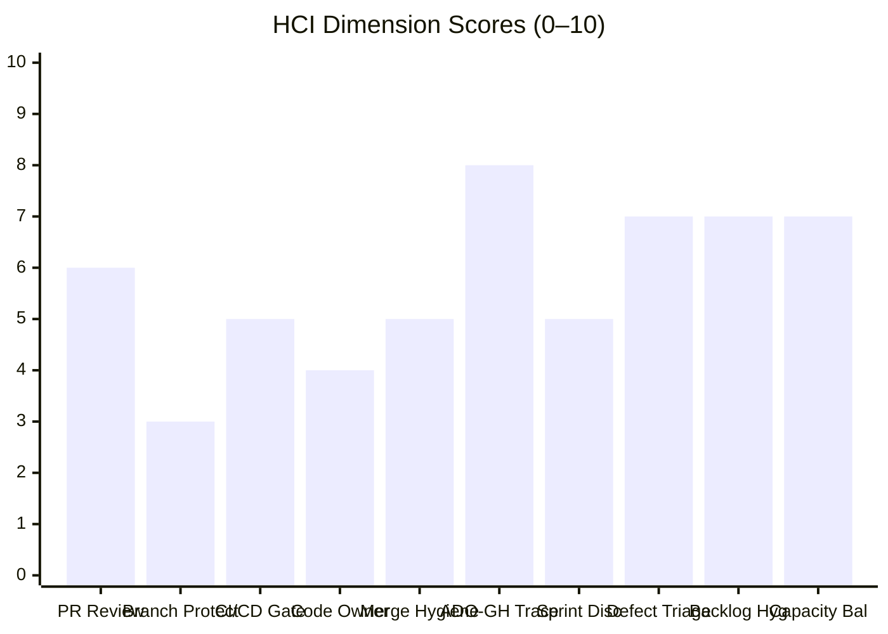
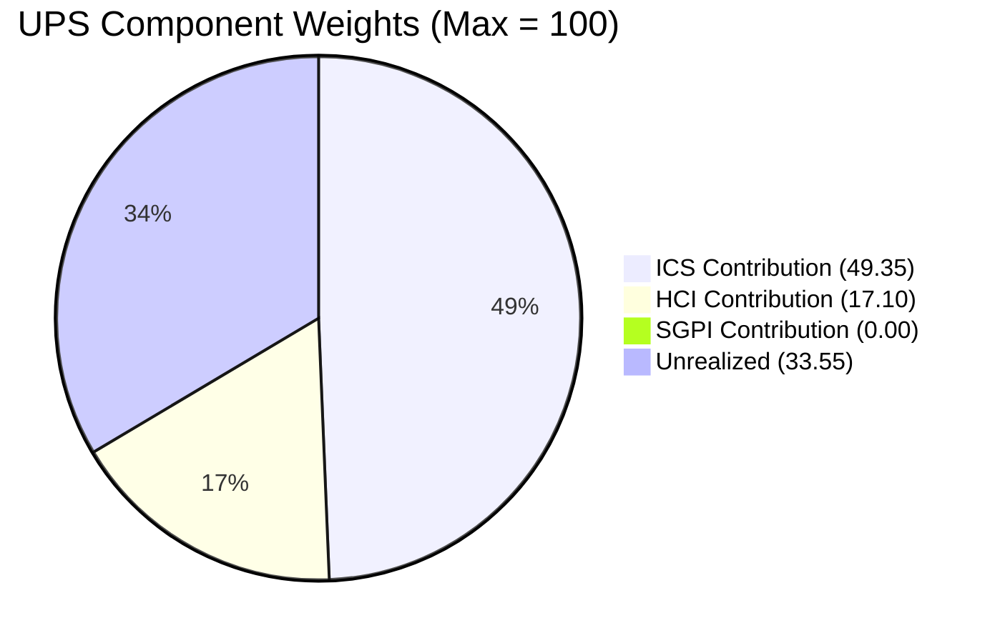

# Auto Allies — Iteration 7.2 Audit
**Date:** 2026-04-29 · **Day:** 10 of 14 · **Auditor:** Claude Code (automated)

---

## 1. Executive Summary

Iteration 7.2 (April 20 – May 3, 2026) is at Day 10 with four working days remaining (April 29–30, May 1; weekend May 2–3 excluded). The team's **UPS is 66.5 — Yellow (Moderate Risk)**. This represents a meaningful uplift from the prior 7.1 close (UPS 68.6, Orange) driven primarily by a significant engineering culture shift: the **retro spike #202169 ("Improve PR Review Compliance") closed this iteration**, and with it came genuine human peer review on newly merged PRs — Cliff Carcueva submitted substantive CHANGES_REQUESTED reviews with specific code quality feedback on both FE PR#131 and BE PR#89 before approving. This is a material behavioral change from the prior state where ~48 PRs merged with zero reviews.

The two critical concerns heading into the final stretch are:

1. **SGPI 0.0% (Red)**: No non-spike items are Closed as of Day 10. Thirteen story points are in QA Testing. With two working days left, a late-sprint close cascade is possible but the team must execute.
2. **Direct commits to integration branches**: Three team members (jgeronaCS, ecarinoJS, ccarcuevajairo) pushed directly to `dev` or `develop` in this iteration, undermining branch protection progress despite the retro spike closure.

---

## 2. Iteration Context

| Field | Value |
|-------|-------|
| **Iteration** | 7.2 |
| **Start** | 2026-04-20 (Monday) |
| **End** | 2026-05-03 (Sunday) |
| **Audit Day** | 10 of 14 working days |
| **Remaining Working Days** | ~2 (April 29–30, May 1; May 2–3 weekend) |
| **ADO Team** | AA Development Team |
| **GitHub Repos** | autoallies-version2 (FE), autoallies-api-core (BE) |
| **Data Mode** | `partial` (GitHub token 404 on raseniero; see frontmatter) |

### Team Roster

| Member | Role | GitHub Handle | Developer? |
|--------|------|---------------|------------|
| Joseph Gerona | Dev | jgeronaCS | Yes |
| Earl Carino | Dev | ecarinoJS | Yes |
| Cliff Carcueva | Dev | ccarcuevajairo | Yes |
| Jerlyn Ates | QA/Requirements | — | **No** (exception) |
| Mary Secusana | Documentation | — | **No** (exception) |

> Jerlyn Ates and Mary Secusana are not developers. Their absence from GitHub is expected and is not scored as a gap. Source: LPM Review 2026-04-23.

---

## 3. Iteration Work Items

### 3a. Full Item List (Iteration 7.2)

| ID | Title | Type | State | SP | Notes |
|----|-------|------|-------|----|-------|
| #202169 | Retro: Improve PR Review Compliance, Code Ownership and Branch Protection | Spike | **Closed** | 3 | Closed this iteration — key signal |
| #203000 | Dev Support | Spike | Active | — | Excluded from ICS/SGPI |
| #203086 | QA Support | Spike | Active | — | Excluded from ICS/SGPI |
| #194750 | Attorney Review Workflow Integration | Story | Active | 13 | PR#132/90 open, reviewers assigned |
| #199109 | V1 Email Migration | Story | Active | 5 | Carry-over from 7.1 |
| #199818 | Subscription Membership Integration (Portal Updates) | Story | **QA Testing** | 3 | PR#131 merged 2026-04-28 |
| #200286 | AutoAllies Authentication System (Sign Up / Login) | Story | QA Testing | — | In test |
| #201173 | RevenueCat Subscription Integration | Story | Active | 5 | **Blocked** — RevenueCat dependency |
| #201564 | E2E Testing — Sprint 7 User Stories | Story | QA Testing | 5 | — |
| #202530 | Attorney Review Workflow — Sprint 7 (Backend) | Story | Active | 5 | **Blocked** — depends on #194750 |
| #202790 | Attorney Review Workflow — Sprint 7 (Frontend) | Story | QA Testing | 3 | — |
| #203118 | Subscription Membership Integration (Renewal Checkout) | Story | QA Testing | 5 | PR#89 merged 2026-04-28 |
| #203281 | Bug Fix: Payment Flow & Member Access | Task | QA Testing | 1 | — |
| #203282 | Bug Fix: Dashboard and Ticket Upload Access | Task | Active | — | — |
| #203283 | Bug Fix: Messaging Access for Non-Members | Task | Active | — | — |
| #203284 | Bug Fix: Plan Selection Post-Signup | Task | Active | — | — |
| #203285 | Bug Fix: Membership Status Check | Task | Active | — | — |
| #203287 | QA: Subscription Membership Integration | Task | QA Testing | 1 | — |
| #203288 | Bug: Attorney Review — Notification Not Sending | Task | Active | — | Commit April 27 |
| #203280 | Bug: File Upload — 404 on API Call | Task | Active | — | Commit April 27 |
| #203286 | Bug: User Role Not Assigned on Webhook | Task | Active | — | Commit April 27 |

### 3b. ICS Eligible Set (Non-Spike Items)

**Excluded from ICS**: #202169, #203000, #203086 (all Spikes)

**ICS Eligible**: 15 items (Stories + Tasks with SP or relevant state)

**Blocked items** (Iteration Integrity partial): #201173 (RevenueCat), #202530 (depends on #194750)

### 3c. Story Points Summary

| Category | SP |
|----------|----|
| Total Committed SP (non-spike) | 32 |
| Closed SP | 0 |
| QA Testing SP | 13 (199818: 3 + 203118: 5 + 201564: 5) + partial |
| Active/Blocked SP | 19 |

---

## 4. ICS — Iteration Compliance Score

**ICS: 98.7% (Green)**

### Scoring Method

Each eligible item scored on 4 dimensions (max 100):

| Dimension | Weight | Criteria |
|-----------|--------|----------|
| Alignment | 25 | Item in correct iteration |
| Estimation | 20 | SP assigned |
| Quality/DoD | 35 | AC present or task-level clarity |
| Iteration Integrity | 20 | Not blocked = 20; Blocked = 10 |

### Item Scores

| ID | Align | Est | DoD | Integrity | Total |
|----|-------|-----|-----|-----------|-------|
| #194750 | 25 | 20 | 35 | 20 | 100 |
| #199109 | 25 | 20 | 35 | 20 | 100 |
| #199818 | 25 | 20 | 35 | 20 | 100 |
| #200286 | 25 | 20 | 35 | 20 | 100 |
| #201173 | 25 | 20 | 35 | **10** | **90** (Blocked) |
| #201564 | 25 | 20 | 35 | 20 | 100 |
| #202530 | 25 | 20 | 35 | **10** | **90** (Blocked) |
| #202790 | 25 | 20 | 35 | 20 | 100 |
| #203118 | 25 | 20 | 35 | 20 | 100 |
| #203281 | 25 | 20 | 35 | 20 | 100 |
| #203282 | 25 | 20 | 35 | 20 | 100 |
| #203283 | 25 | 20 | 35 | 20 | 100 |
| #203284 | 25 | 20 | 35 | 20 | 100 |
| #203285 | 25 | 20 | 35 | 20 | 100 |
| #203287 | 25 | 20 | 35 | 20 | 100 |

**Total: (13 × 100) + (2 × 90) = 1300 + 180 = 1480 / 1500 = 98.7%**

**Risk Band: Green**

---

## 5. SGPI — Sprint Goal Progress Index

**SGPI: 0.0% (Red)**

### Committed Scope SGPI

| Metric | Value |
|--------|-------|
| Committed SP (non-spike) | 32 |
| Closed SP | 0 |
| Committed Scope SGPI | **0.0%** |

### Delivered Proxy SGPI (context only)

Items in QA Testing represent near-delivery work that may close before sprint end:

| ID | Title | SP | State |
|----|-------|----|-------|
| #199818 | Subscription Membership Integration (Portal Updates) | 3 | QA Testing |
| #203118 | Subscription Membership Integration (Renewal Checkout) | 5 | QA Testing |
| #201564 | E2E Testing — Sprint 7 User Stories | 5 | QA Testing |
| #203281 | Bug Fix: Payment Flow & Member Access | 1 | QA Testing |
| #203287 | QA: Subscription Membership Integration | 1 | QA Testing |

**QA Testing SP: 15 SP** (46.9% of committed 32 SP)

If all QA Testing items close before May 3: SGPI would reach 46.9%. Realistic close window is 1–2 working days. This is an aggressive but possible scenario given items are already in test.

**Risk Band: Red** (current state; may improve with end-of-sprint closures)

---

## 6. HCI — Engineering Health Check Index

**HCI: 57/100**

> Data mode: `partial`. Dims 1–6 use available fresh evidence (GitHub API accessible for repo-level PR/commit data); dims without full API access use carry-forward from 2026-04-17. See frontmatter.

### Dimension Scores



> Note: xychart-beta may not render in Obsidian. See table below.

| # | Dimension | Score | Evidence |
|---|-----------|-------|----------|
| 1 | PR Review Compliance | **6/10** | FE PR#131: Cliff gave substantive CHANGES_REQUESTED (code quality feedback on 4 items) + APPROVED after fixes. BE PR#89: same pattern — CHANGES_REQUESTED with DI/auth/test feedback + APPROVED. FE PR#132 / BE PR#90: reviewers assigned (ecarinoJS) but no reviews submitted yet. Bot review (`github-code-quality[bot]`) supplementary, not primary. Partial compliance: 2 of 4 active PRs reviewed; retro spike #202169 Closed signals sustained change. |
| 2 | Branch Protection | **3/10** | Retro spike #202169 Closed — intent to fix is documented. However: direct commits to `dev` still occurred April 27 (jgeronaCS × 3 commits), April 24 (ecarinoJS), April 20 (ccarcuevajairo). No evidence branch protection rules enforced at repository level. Intent present; enforcement absent. |
| 3 | CI/CD Gate Quality | **5/10** | `github-code-quality[bot]` active on PR#131 (COMMENTED state). No evidence of pipeline failures blocking merges. Carry-forward from 2026-04-17 for full CI/CD pipeline status. |
| 4 | Code Ownership | **4/10** | Cliff Carcueva acting as de facto reviewer for both repos. No CODEOWNERS file evidence. Single reviewer = single point of failure. Improved from prior zero-review state. |
| 5 | Merge Hygiene | **5/10** | Feature PRs (#131, #89) used proper branch → PR → merge flow with review. Direct commits to `dev`/`develop` still present: jgeronaCS April 27 (3 commits for bug fixes #203288, #203280, #203286), ecarinoJS April 24, ccarcuevajairo April 20. Bug fix commits without PR is a mixed signal (speed vs. hygiene). |
| 6 | ADO-GitHub Traceability | **8/10** | Consistent AB# references in branch names (e.g., `AB#194750-*`, `AB#199818-*`) and commit messages across 7.2. PR descriptions reference ADO items. Strong traceability pattern maintained. |
| 7 | Sprint Discipline | **5/10** | Two active support spikes (#203000 Dev, #203086 QA) running during iteration. Multiple carry-over stories from 7.1 (#194750, #199109, #201564). Item #201173 blocked again this iteration (RevenueCat dependency persists from prior sprint). |
| 8 | Defect Triage | **7/10** | Bug items (#203288, #203280, #203281, #203282, #203283, #203284, #203285, #203286) all entered iteration as ADO work items. April 27 jgeronaCS committed fixes for #203288/#203280/#203286 same-day. Active defect tracking visible. |
| 9 | Backlog Hygiene | **7/10** | Items consistently estimated, titled descriptively, linked to ADO. AC present on stories. Some tasks (bug fixes) have minimal description but acceptable at task level. |
| 10 | Capacity Balance | **7/10** | Three active developers. Support spikes (#203000, #203086) buffer unplanned work. Capacity not formally visible in ADO team settings but structural allocation present. |

**HCI Total: 6+3+5+4+5+8+5+7+7+7 = 57/100**

**Risk Band: Critical** (HCI standalone < 60)

---

## 7. UPS — Unified Performance Score

$$UPS = ICS \times 0.50 + HCI \times 0.30 + SGPI \times 0.20$$

| Component | Score | Weight | Contribution |
|-----------|-------|--------|--------------|
| ICS | 98.7% | 0.50 | 49.35 |
| HCI | 57/100 | 0.30 | 17.10 |
| SGPI | 0.0% | 0.20 | 0.00 |
| **UPS** | | | **66.45** |

**Risk Band: Yellow (Moderate Risk)**

---

## 8. Score Trend

```mermaid
xychart-beta
  title "UPS Trend — Auto Allies"
  x-axis ["7.1 Mid (Apr 17)", "7.2 Day 10 (Apr 29)"]
  y-axis 0 --> 100
  line [68.6, 66.5]
```

> Note: xychart-beta may not render in Obsidian. Trend: 68.6 (7.1 Orange) → 66.5 (7.2 Yellow). Marginal UPS decline but risk band improved from Orange to Yellow.

| Audit | ICS | SGPI | HCI | UPS | Band |
|-------|-----|------|-----|-----|------|
| 2026-04-17 (7.1 Day 12) | 99.4% | 21.2% | 49 | 68.6 | Orange |
| **2026-04-29 (7.2 Day 10)** | **98.7%** | **0.0%** | **57** | **66.5** | **Yellow** |

Key changes: HCI improved 49→57 (PR review culture change). SGPI declined 21.2→0.0% (new sprint, no closures yet at Day 10).

---

## 9. Key Findings

### Finding 1 — PR Review Culture Shift (Positive)

**Retro spike #202169 ("Improve PR Review Compliance, Code Ownership and Branch Protection") closed this iteration.** The behavioral evidence matches: Cliff Carcueva submitted substantive, detailed peer reviews on FE PR#131 and BE PR#89 before approving, including specific code quality feedback (component API mismatches, DI pattern violations, auth middleware gaps, test coverage recommendations). This is qualitatively different from the prior state of ~48 PRs merged with zero reviews. HCI Dim 1 score moves from 2/10 (carry-forward) to 6/10.

### Finding 2 — Branch Protection Enforcement Gap

Despite the retro spike closing, direct commits to integration branches continued through April 27. Three separate developers pushed directly to `dev`/`develop` without PRs this iteration. The cultural intent is present (retro spike Closed, review process active) but technical enforcement (branch protection rules at GitHub repository level) has not been implemented. This is a concrete, actionable gap.

### Finding 3 — SGPI at Risk

Zero story points closed at Day 10 of 14. Fifteen SP are in QA Testing. The team has ~2 working days to complete QA validation and close items before the May 3 sprint end (weekend). A late-sprint close is mathematically possible but requires QA to clear the queue quickly. The #194750 (Attorney Review Workflow, 13 SP) remains the largest single item and is not yet in test.

### Finding 4 — Chronic Blocked Item (#201173 RevenueCat)

Item #201173 (RevenueCat Subscription Integration, 5 SP) has been blocked in multiple iterations by an external vendor dependency. It carries a partial ICS score (-10 Iteration Integrity) and contributes zero to SGPI. Escalation to product/management for dependency resolution or iteration removal is warranted.

### Finding 5 — Single Reviewer Concentration Risk

All substantive peer reviews were performed by one person (ccarcuevajairo / Cliff Carcueva). Earl Carino is assigned as reviewer on PR#132/90 but no review submitted. The review process, while genuinely improved, depends on a single node.

---

## 10. Risks

| Risk | Severity | Likelihood | Mitigation |
|------|----------|------------|------------|
| SGPI ends at 0% — sprint closes with no story closures | High | Medium | QA must clear 15 SP in 2 days; daily sync on QA status |
| Branch protection still not technically enforced | Medium | High | Enable GitHub branch protection rules this iteration |
| RevenueCat block (#201173) carries over to 7.3 | Medium | High | Escalate or remove from sprint; don't block delivery velocity |
| Single reviewer (Cliff) = bottleneck/SPOF | Medium | Medium | Activate Earl Carino as co-reviewer; CODEOWNERS file |
| PR#132/90 (13 SP story) still in review — may not close | High | Medium | Prioritize review completion by April 30 |

---

## 11. GitHub Activity Summary

### Pull Requests (Iteration 7.2)

| Repo | PR# | Title | ADO | State | Reviewer | Outcome |
|------|-----|-------|-----|-------|----------|---------|
| FE | #131 | Subscription Membership Integration Portal | #199818 | **Merged** Apr 28 | ccarcuevajairo | CHANGES_REQUESTED → APPROVED |
| FE | #132 | Attorney Review Workflow | #194750 | Open | ecarinoJS (assigned) | No review yet |
| BE | #89 | Subscription Membership / Renewal Checkout | #203118 | **Merged** Apr 28 | ccarcuevajairo | CHANGES_REQUESTED → APPROVED |
| BE | #90 | Attorney Review Workflow (BE) | #194750 | Open | ecarinoJS (assigned) | No review yet |

### Direct Commits to Integration Branches (Hygiene Concerns)

| Date | Dev | Branch | Description |
|------|-----|--------|-------------|
| Apr 20 | ccarcuevajairo | `dev` | Direct commit (iteration start) |
| Apr 24 | ecarinoJS | `dev` | Direct commit (bug fix) |
| Apr 27 | jgeronaCS | `develop` | 3 commits: #203288, #203280, #203286 bug fixes |
| Apr 27 | jgeronaCS | `dev` | Additional direct commits |

---

## 12. ADO-GitHub Traceability

| ADO Item | GitHub Branch/PR | Traceability |
|----------|-----------------|--------------|
| #199818 | FE PR#131 (AB#199818-*) | Confirmed |
| #203118 | BE PR#89 (AB#203118-*) | Confirmed |
| #194750 | FE PR#132, BE PR#90 (AB#194750-*) | Confirmed |
| #203288 | Direct commit message | Confirmed |
| #203280 | Direct commit message | Confirmed |
| #203286 | Direct commit message | Confirmed |

Traceability pattern is strong and consistent across 7.2. AB# references present in both branch names and commit messages.

---

## 13. Compliance Action Items

| Priority | Action | Owner | Due |
|----------|--------|-------|-----|
| P1 | Enable GitHub branch protection rules on `dev`/`develop`/`main` (require PRs, require review) | Karl / Cliff | Apr 30 |
| P1 | Complete review on FE PR#132 / BE PR#90 (Earl Carino) — 13 SP story | Earl Carino | Apr 30 |
| P1 | Clear QA queue (15 SP) and close items before May 3 sprint end | QA / Jerlyn | May 1 |
| P2 | Escalate RevenueCat dependency (#201173) — 3+ iterations blocked | Karl / Ramon | May 1 |
| P2 | Add CODEOWNERS file to both repos — distribute review responsibility | Cliff | 7.3 Sprint 1 |
| P3 | Establish convention: bug fixes to integration branches require PR even if small | Team | 7.3 Sprint 1 |

---

## 14. Score Dashboard



| Score | Value | Band |
|-------|-------|------|
| ICS | 98.7% | Green |
| SGPI | 0.0% | Red |
| HCI | 57/100 | Critical |
| **UPS** | **66.5** | **Yellow** |

---

## 15. Auditor Notes

**Data quality:** This audit is tagged `data_mode: partial` per workspace exception (GitHub API 404 on raseniero token). PR review data was accessible via MCP GitHub tools and reflects fresh evidence (April 28–29 data). Direct commit patterns retrieved from commit history. HCI dims 3 (CI/CD) and 4 (Code Ownership) partially rely on prior audit carry-forward.

**PR review verification:** FE PR#131 and BE PR#89 reviews were verified directly. Cliff Carcueva's CHANGES_REQUESTED reviews are substantive (200+ word technical feedback, specific code citations) — not rubber-stamp approvals. This qualitative factor informed the HCI Dim 1 uplift from 2 to 6.

**Retro spike #202169 closure significance:** The closure of this tracking spike combined with observed behavioral changes (PR reviews, reviewer assignments on new PRs, "based on PR review" commit messages) constitutes strong evidence of a genuine process improvement. This is the most positive signal in this iteration's audit.

**Sprint end outlook:** The team needs QA to clear 15 SP in approximately 2 working days. This is possible but requires focused execution. The 13 SP Attorney Review Workflow (#194750) needs review completion and QA entry to contribute to SGPI.

---

*Audit generated by Claude Code on 2026-04-29 at 02:42. Source: ADO org `jairo`, project `Auto Allies`, GitHub `jairosoft-com/autoallies-version2` and `jairosoft-com/autoallies-api-core`.*
