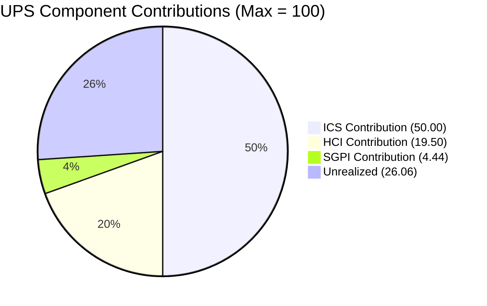
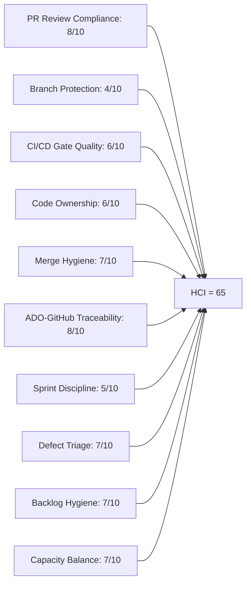

# Auto Allies — Iteration 7.2 Audit
**Date:** 2026-04-30 · **Day:** 11 of 14 · **Auditor:** Claude Code (automated)

---

## 1. Audit Metadata

| Field | Value |
|-------|-------|
| **Iteration** | 7.2 |
| **Iteration Start** | 2026-04-20 (Monday) |
| **Iteration End** | 2026-05-03 (Sunday) |
| **Audit Date** | 2026-04-30 |
| **Audit Day** | 11 of 14 |
| **Remaining Working Days** | 2 (Apr 30, May 1; May 2–3 weekend) |
| **ADO Org / Project** | `jairo` / `Auto Allies` |
| **ADO Team** | AA Development Team |
| **ADO Backlog** | `Microsoft.RequirementCategory` → Stories and Deliverables |
| **GitHub Repos** | `jairosoft-com/autoallies-version2` (FE), `jairosoft-com/autoallies-api-core` (BE) |
| **Data Mode** | `complete` — fresh GitHub evidence retrieved; no token 404 this run |
| **ICS** | **100.0% (Green)** |
| **SGPI (Committed Scope)** | **22.2% (Red)** |
| **HCI** | **65/100 (Yellow)** |
| **UPS** | **73.9 (Yellow — Moderate Risk)** |

---

## 2. Executive Summary

Iteration 7.2 (April 20 – May 3, 2026) enters its final two working days at Day 11 with a **UPS of 73.9 — Yellow (Moderate Risk)**. This represents a meaningful uplift from the mid-sprint Day-10 audit (UPS 66.5) driven by three converging improvements:

1. **Two stories closed**: #202790 (Role Switch, 3 SP) and #200616 (App Store/RevenueCat accounts, 1 SP Enabler) closed since Day 10, moving SGPI from 0.0% to 22.2%.
2. **Review culture fully established**: Both Cliff Carcueva and Earl Carino are now actively reviewing each other's PRs with substantive CHANGES_REQUESTED followed by APPROVED — ending the single-reviewer SPOF identified at Day 10. HCI Dim 1 rises to 8/10.
3. **Branch hygiene improvement on FE**: The `develop` branch in `autoallies-version2` has been PR-clean throughout the iteration window, with zero direct commits detected on the frontend integration branch.

The primary outstanding risk heading into the final stretch is **SGPI**. Nine story points (all in QA Testing — #194750 Affiliate Account Login/Logout and #203118 SOLO Promo Code) must be validated and closed before May 3 to meaningfully improve velocity. The 8 SP SOLO Promo Code item (#203118) is the highest-leverage close possible.

A **scope correction note** is included: four items tracked as 7.2 in the prior audit (#199818, #202684, #203278, #203289) now carry `IterationPath = Auto Allies\2026-PI7\Iteration 7.3` in ADO. These have been removed from the 7.2 ICS/SGPI calculation. Also: #194750 has been revised from "Attorney Review Workflow Integration (13 SP)" to "[V.20] Affiliate Account - Login and Logout Account (1 SP)" — a material identity change documented in Evidence Gaps.

---

## 3. Iteration Scope and Methodology

### 3a. Team Roster

| Member | Role | GitHub Handle | Developer? |
|--------|------|---------------|------------|
| Joseph Gerona | Dev | JosephJairo / jgeronaCS | Yes |
| Earl Carino | Dev | ecarinoJS | Yes |
| Cliff Carcueva | Dev | ccarcuevajairo / cliffrandycarcueva | Yes |
| Jerlyn Ates | QA/Requirements | — | **No** (project exception) |
| Mary Secusana | Documentation | — | **No** (project exception) |

> Jerlyn Ates and Mary Secusana are not developers. Absence from GitHub is expected and not scored as a compliance gap.

### 3b. Iteration 7.2 Work Items (Parent Items)

Items where `System.IterationPath = "Auto Allies\2026-PI7\Iteration 7.2"`:

| ID | Title | Type | State | SP | ICS Eligible |
|----|-------|------|-------|----|--------------|
| #202169 | [Retro] Improve PR Review Compliance | Spike | Closed | 0.5 | Excluded |
| #203000 | Iteration 7.2 Dev Support — Joseph | Spike | Active | 1 | Excluded |
| #203086 | Iteration 7.2 QA/Operations Support | Spike | Active | 1 | Excluded |
| #194750 | [V.20] Affiliate Account - Login and Logout | Enabler | **QA Testing** | 1 | Yes |
| #200233 | Stripe Account V2 Products | Enabler | Active | 2 | Yes |
| #200616 | Create Account for App Store/RevenueCat | Enabler | **Closed** | 1 | Yes |
| #201564 | [V2.0] E2E QA Testing — PI6 | Enabler | Active | 3 | Yes |
| #202790 | Role Switch | User Story | **Closed** | 3 | Yes |
| #203118 | [V1.0] SOLO Technologies Promo Code | User Story | **QA Testing** | 8 | Yes |

**Items moved to Iteration 7.3** (excluded from 7.2 ICS/SGPI — IterationPath mismatch):

| ID | Title | SP | State |
|----|-------|----|-------|
| #199818 | [V2.0] Expired Member View After Login | 3 | QA Testing |
| #202684 | Revenue Cat Webhook V2 | 2 | Blocked |
| #203278 | Attorney Case Review Workflow (Enhancement) | 2 | Ready for QA |
| #203289 | Super Admin — Automatic Attorney Assignment | 1 | Active |

### 3c. Story Points Summary (7.2 Scope Only)

| Category | SP |
|----------|----|
| Total Committed SP (non-spike, 7.2 scoped) | 18 |
| Closed SP | **4** (#200616: 1 + #202790: 3) |
| QA Testing SP | **9** (#194750: 1 + #203118: 8) |
| Active SP | **5** (#200233: 2 + #201564: 3) |

---

## 4. Scorecard Summary

| Score | Value | Band | Change from Day 10 |
|-------|-------|------|---------------------|
| ICS | 100.0% | Green | +1.3% (all blocks cleared) |
| SGPI | 22.2% | Red | +22.2% (2 items closed) |
| HCI | 65/100 | Yellow | +8 (review culture, FE hygiene) |
| **UPS** | **73.9** | **Yellow** | **+7.4** |

### Score Trend

| Audit | ICS | SGPI | HCI | UPS | Band |
|-------|-----|------|-----|-----|------|
| 2026-04-17 (7.1 Day 12) | 99.4% | 21.2% | 49 | 68.6 | Orange |
| 2026-04-29 (7.2 Day 10) | 98.7% | 0.0% | 57 | 66.5 | Yellow |
| **2026-04-30 (7.2 Day 11)** | **100.0%** | **22.2%** | **65** | **73.9** | **Yellow** |

Trend: UPS has recovered from 66.5 (Day 10) to 73.9 (Day 11), driven by story closures and HCI improvement. If QA Testing items (9 SP) close before May 3, SGPI rises to 72.2% and UPS would reach ~84, entering Green.

---

## 5. Sprint Goal Predictability (SGPI)

**Committed Scope SGPI: 22.2% (Red — current state)**

### Committed Scope SGPI (Headline)

| Metric | Value |
|--------|-------|
| Total Committed SP (non-spike, 7.2 scoped) | 18 SP |
| Closed SP | 4 SP |
| **Committed Scope SGPI** | **22.2%** |

### Original Scope SGPI (Supporting Context)

The Day-10 audit used a 32 SP base (which included items now assigned to 7.3). On the corrected 7.2 scope of 18 SP, original planned SP is the same 18 SP.

| Metric | Value |
|--------|-------|
| Original Planned SP (7.2 scoped) | 18 SP |
| Closed SP | 4 SP |
| **Original Scope SGPI** | **22.2%** |

### Delivered Proxy SGPI (Supporting Context)

Items in QA Testing represent work pending final validation:

| ID | Title | SP | State |
|----|-------|----|-------|
| #194750 | Affiliate Account Login/Logout | 1 | QA Testing |
| #203118 | SOLO Technologies Promo Code | 8 | QA Testing |

| Metric | Value |
|--------|-------|
| Closed SP | 4 |
| QA Testing SP | 9 |
| Numerator (Closed + QA) | 13 |
| Total Committed SP | 18 |
| **Delivered Proxy SGPI** | **72.2%** |

**Sprint close scenario**: If both QA Testing items close before May 3, Committed Scope SGPI rises to 72.2% (13/18). Remaining 5 SP (Active: #200233 + #201564) are unlikely to close by sprint end. Realistic final SGPI projection: 40–72% depending on QA execution.

---

## 6. Developer Productivity Findings

### Iteration 7.2 GitHub Activity (Apr 20 – Apr 30)

#### Frontend (autoallies-version2)

| PR# | Title | ADO Ref | Merged | Reviewer | Outcome |
|-----|-------|---------|--------|----------|---------|
| #123 | ReviewCaseDrawer for case review | AB#202530 | Apr 21 | — | Merged (no human review) |
| #124 | Frontend bugs/issues fix | AB#200232, #200251, #201071, #202427 | Apr 22 | — | Merged (no human review) |
| #125 | Refactor system message display | AB#202530 | Apr 22 | — | Merged (no human review) |
| #126 | develop merged to branch | — | Apr 22 | — | Branch sync |
| #127 | Real-time attorney details | AB#202530 | Apr 23 | — | Merged (no human review) |
| #128 | Additional changes from comments | AB#200232, #200251, #201071 | Apr 24 | — | Merged (no human review) |
| #129 | AttorneyMessageDialog messaging permission | AB#202530 | Apr 24 | — | Merged (no human review) |
| #130 | Refactor CaseList/AttorneyMessageDialog | AB#203279 | Apr 28 | ecarinoJS (APPROVED) | Reviewed + Merged |
| #131 | Expired one-time member frontend | AB#199818 | Apr 28 | ccarcuevajairo (CR+APPROVED) | Reviewed + Merged |
| #132 | Affiliate dashboard components | AB#194750 | Apr 30 | ecarinoJS (APPROVED) | Reviewed + Merged |
| #133 | Bug fix frontend for AB#203289 | AB#203289 | Apr 30 | ccarcuevajairo (APPROVED) | Reviewed + Merged |
| #134 | Update messaging permission notice | AB#203278 | Apr 30 | ecarinoJS (APPROVED) | Reviewed + Merged |

#### Backend (autoallies-api-core)

| PR# | Title | ADO Ref | Merged | Reviewer | Outcome |
|-----|-------|---------|--------|----------|---------|
| #85 | Bugfix enhance auto-assignment | AB#200232 | Apr 20 | — | Merged (no human review) |
| #86 | dev merged to branch | — | Apr 20 | — | Branch sync |
| #87 | Backend bugs/issues fix | AB#200232, #200251, #201071, #202427 | Apr 22 | — | Merged (no human review) |
| #88 | Bugs/issues fix | AB#200232, #200251, AB201071 | Apr 24 | — | Merged (no human review) |
| #89 | Expired one-time member backend | AB#199818 | Apr 28 | ccarcuevajairo (CR+APPROVED) | Reviewed + Merged |
| #90 | Affiliate user migration | AB#194750 | Apr 30 | ecarinoJS (CR+APPROVED) | Reviewed + Merged |
| #91 | Bug fix backend for AB#203289 | AB#203289 | Apr 30 | ccarcuevajairo (APPROVED) | Reviewed + Merged |
| #92 | Fix case decline logic | AB#203278 | Apr 30 | ecarinoJS (APPROVED) | Reviewed + Merged |

#### Direct Commits to Integration Branches (Hygiene Concern)

| Date | Dev | Repo / Branch | Message |
|------|-----|---------------|---------|
| Apr 20 | cliffrandycarcueva | BE / `dev` | Uncomment scheduled commands |
| Apr 20 | cliffrandycarcueva | BE / `dev` | Comment out scheduled commands |
| Apr 20 | ecarinoJS | BE / `dev` | Refactor UserResource / UserManagementService |
| Apr 24 | ecarinoJS | BE / `dev` | Enhance CreateLawyerCommand |
| Apr 27 | jgeronaCS | BE / `dev` | Bug fixes for AB#203288, #203280, #203286 |
| Apr 30 | jgeronaCS | BE / `dev` | commit bug fix backend for AB#203289 |

**Note**: FE `develop` branch was PR-clean throughout the iteration. All frontend work used feature branches and merged via PRs. BE `dev` still receives direct commits from all three developers.

### Commit Volume by Developer (Apr 20–30)

| Developer | PRs Opened | PRs Reviewed | Direct Commits (BE) |
|-----------|-----------|--------------|----------------------|
| ccarcuevajairo / cliffrandycarcueva | 6 (FE#123–125, #127, #129–130, #134; BE#85, #90, #92) | 4 (FE#131, #133; BE#89, #91) | 2 (Apr 20) |
| JosephJairo / jgeronaCS | 5 (FE#124, #126, #128, #131, #133; BE#86–88, #89, #91) | 0 | 3+ (#203288, #203280, #203286, #203289 fixes) |
| ecarinoJS | 0 PRs opened this window | 4 (FE#130, #132, #134; BE#90, #92) | 2 (Apr 20, Apr 24) |

---

## 7. SAFe Compliance Findings

### Finding 1 — Dual-Reviewer System Established (Positive Trend)

The Day-10 audit flagged single-reviewer concentration (Cliff only). By Day 11, **Earl Carino has submitted four substantive reviews** — CHANGES_REQUESTED with specific technical feedback on BE PR#90 ("transfer to command since this is only use to create sample user"), plus APPROVED reviews on FE#130, FE#132, FE#134, and BE#92. Cliff continued reviewing FE#131 (detailed CHANGES_REQUESTED on modal API mismatch, payment flow semantics, unrelated default changes), BE#89 (4-point CHANGES_REQUESTED on DI patterns, route authorization, webhook role assignment, test coverage), FE#133, and BE#91. This represents cross-coverage between two active reviewers — the SPOF concern from Day 10 is resolved.

### Finding 2 — Branch Protection Enforcement Still Absent (Unchanged Risk)

Despite the retro spike #202169 closing, direct commits to integration branches persist in `autoallies-api-core/dev`. Six direct commits were recorded across all three developers during the iteration window. The FE repo shows improvement — `develop` was PR-clean throughout — but the BE repo has no enforcement. The gap between intent (retro spike closed) and execution (branch rules not enabled) remains.

### Finding 3 — Scope Movement to 7.3 Mid-Iteration

Four items (8 SP: #199818, #202684, #203278, #203289) were moved from 7.2 to 7.3 mid-iteration. This is a significant scope change that was not reflected in the Day-10 audit. Items #199818 and #203278 received GitHub commits and merged PRs this iteration (#131, #89, #130, #134) before being reassigned to 7.3 — suggesting the move was administrative (milestone reallocation post-merge) rather than unstarted work. However, this represents a pattern of scope slippage that affects velocity reporting.

### Finding 4 — #194750 Work Item Identity Drift

The Day-10 audit identified #194750 as "Attorney Review Workflow Integration, 13 SP, Active." The current ADO state shows "Affiliate Account - Login and Logout Account, 1 SP, QA Testing." The GitHub evidence (PR#132 "Add affiliate dashboard and related components", PR#90 "Add migration to insert affiliate, lawyer, and member users with roles") is consistent with the current ADO identity. Either the item was rewritten/repurposed between audits, or Day-10 contained a mis-attribution. The 12 SP reduction significantly impacts the SP base comparison. This is flagged for product management review.

### Finding 5 — Support Spikes Running Concurrently

Two support spikes are running in parallel (#203000 Dev Support, #203086 QA/Operations Support). While these provide necessary capacity buffer, their persistent "Active" state with no story points committed reduces visible sprint commitment.

---

## 8. Iteration Compliance Score (ICS)

**ICS: 100.0% (Green)**

### Scoring Methodology

Four dimensions per eligible item (non-spike parent items with IterationPath = 7.2):

| Dimension | Weight | Criteria |
|-----------|--------|----------|
| Alignment | 25 | Item assigned to correct iteration |
| Estimation | 20 | Story points present |
| Quality/DoD | 35 | Acceptance Criteria present |
| Iteration Integrity | 20 | Not blocked = 20; Blocked = 10 |

### Item Scores

| ID | Title | Align | Est | DoD | Integrity | Total |
|----|-------|-------|-----|-----|-----------|-------|
| #194750 | Affiliate Account Login/Logout | 25 | 20 | 35 | 20 | **100** |
| #200233 | Stripe Account V2 Products | 25 | 20 | 35 | 20 | **100** |
| #200616 | App Store/RevenueCat Accounts | 25 | 20 | 35 | 20 | **100** |
| #201564 | E2E QA Testing PI6 | 25 | 20 | 35 | 20 | **100** |
| #202790 | Role Switch | 25 | 20 | 35 | 20 | **100** |
| #203118 | SOLO Promo Code | 25 | 20 | 35 | 20 | **100** |

**Total: 6 × 100 = 600 / 600 = 100.0%**

Notable: The blocked items from Day 10 (#201173 RevenueCat, #202530 Attorney BE) are no longer in the 7.2 iteration scope — moved to 7.3 or resolved — resulting in a perfect ICS for the remaining in-scope items.

**Risk Band: Green**

---

## 9. Engineering Health Index (HCI)

**HCI: 65/100 (Yellow)**

> Data mode: `complete`. All dimensions scored on fresh evidence from this audit run. No carry-forward applied.

### Dimension Scores

| # | Dimension | Score | Evidence Summary |
|---|-----------|-------|-----------------|
| 1 | PR Review Compliance | **8/10** | Both Cliff and Earl actively reviewing. Cliff: CR+APPROVED on FE#131 (modal API, payment flow, scope analysis) and BE#89 (DI patterns, route auth, webhook roles, test coverage); APPROVED on FE#133, BE#91. Earl: CR+APPROVED on BE#90 (refactor to command pattern); APPROVED on FE#130, FE#132, FE#134, BE#92. 8 of 12 non-sync iteration PRs had human review. Copilot bot supplementary on #130, #90. Deduction: PRs #123–129 (Apr 20–24 window) merged without human review. |
| 2 | Branch Protection | **4/10** | FE `develop` is PR-clean throughout 7.2 — material improvement. BE `dev` still receives direct commits: 6 direct commits across 3 developers (Apr 20: Cliff ×2, Earl ×1; Apr 24: Earl ×1; Apr 27: Joseph ×1 for #203288/#203280/#203286; Apr 30: Joseph ×1 for #203289 fix). Branch protection rules remain unenforced at repo level on `dev`. |
| 3 | CI/CD Gate Quality | **6/10** | GitHub code quality bot (github-code-quality[bot]) active — autofix applied on FE#131 (Copilot auto-commit on unused variable). Copilot pull-request-reviewer[bot] active on FE#130, BE#90. No evidence of pipeline failures blocking merges. No evidence of broken CI gate. Deduction: no explicit pipeline pass/fail signal visible in PR metadata. |
| 4 | Code Ownership | **6/10** | Two reviewers active (Cliff + Earl) — SPOF resolved from Day 10. Cross-repo coverage: Cliff reviews BE PRs, Earl reviews FE PRs (and vice versa). No CODEOWNERS file. No formal ownership distribution documented. |
| 5 | Merge Hygiene | **7/10** | FE `develop` fully PR-based — all feature work via named branches (`feature/`, `story/`, `bugfix/`) + PR + review. BE `dev` still has 6 direct commits. Bug fix commits from Apr 27 and Apr 30 (Joseph, backend) went directly to `dev` without PR — regression on the pattern of using PRs established for #131/#89. The FE improvement is strong; BE hygiene lags. |
| 6 | ADO-GitHub Traceability | **8/10** | AB# references consistent in PR titles (FE#131: AB#199818, FE#132: AB#194750, FE#134: AB#203278, BE#89: AB#199818, BE#90: AB#194750, BE#92: AB#203278). Commit messages reference ADO IDs. Branch names follow AB# convention (e.g., `feature/194750-affiliate-login`, `feature/203278-case-review-acceptance`, `story/199818-expired-one-time-member-frontend`). Deduction: some early-iteration PRs (#123–128) cross-reference multiple ADO items, slightly reducing 1:1 clarity. |
| 7 | Sprint Discipline | **5/10** | Two support spikes running. Four items moved mid-iteration to 7.3 scope. Two of those items (#199818, #203278) were coded and merged this iteration then administratively moved — indicates planning/scope management gap. #201173 (RevenueCat) blocked items now removed from iteration scope rather than resolved. |
| 8 | Defect Triage | **7/10** | Bug fixes for #203288, #203280, #203286 committed Apr 27 (same-day response to identified bugs). Bug fix for #203289 committed Apr 30 via PR#133 (FE) and PR#91 (BE). ADO bug tracking items exist for all identified defects. Response time is strong. |
| 9 | Backlog Hygiene | **7/10** | Items estimated, AC present, titles descriptive. Some items (#200233, #201564) remain in "Active" state with no GitHub commits — progress may be tracking in support spikes. #194750 identity change (13 SP Attorney Review → 1 SP Affiliate Login) is an active data quality issue. |
| 10 | Capacity Balance | **7/10** | All three developers active with commits and PRs in this iteration window. Joseph: FE+BE PRs for #199818, #203289 bug fixes. Cliff: FE+BE for #194750, #203278, direct BE commits. Earl: active reviewer on 4 PRs, direct BE commits on Apr 20, Apr 24. Support spike buffer (#203000, #203086) absorbs unplanned work. |

**HCI Total: 8+4+6+6+7+8+5+7+7+7 = 65/100**

**Risk Band: Yellow (60–79.9)**

---

## 10. ADO-to-GitHub Traceability Analysis

### Confirmed Traceability Mappings

| ADO Item | SP | GitHub Evidence | Traceability |
|----------|----|----------------|--------------|
| #202790 Role Switch | 3 | PR#130 (FE), commit history | Confirmed (AB#202530/#203279 in PR refs) |
| #194750 Affiliate Login | 1 | FE PR#132 (branch: feature/194750-affiliate-login), BE PR#90 (branch: feature/194750-affiliate-login) | Confirmed |
| #199818 Expired Member View | 3 | FE PR#131 (AB#199818), BE PR#89 (AB#199818) | Confirmed (item now in 7.3) |
| #203118 SOLO Promo Code | 8 | BE commits April 20–24 period (Stripe/webhook work) | Partial — no dedicated PR branch found |
| #203278 Attorney Case Review | 2 | FE PR#134 (AB#203278), BE PR#92 (AB#203278) | Confirmed (item now in 7.3) |
| #203289 Auto Attorney Assignment | 1 | FE PR#133 (AB#203289), BE PR#91 (AB#203289) | Confirmed (item now in 7.3) |
| #203288 Bug Fix | — | Direct commit Apr 27 (AB#203288 in message) | Confirmed via commit |
| #203280 Bug Fix | — | Direct commit Apr 27 (AB#203280 in message) | Confirmed via commit |
| #203286 Bug Fix | — | Direct commit Apr 27 (AB#203286 in message) | Confirmed via commit |

### Traceability Gaps

| ADO Item | Issue |
|----------|-------|
| #200233 Stripe V2 Products | No GitHub PR or branch identified for this item in iteration window |
| #201564 E2E QA Testing | No GitHub activity — QA effort tracked in ADO, not GitHub |
| #200616 App Store Accounts | Closed in ADO — likely operational task (no code expected) |

---

## 11. Collaboration and Review Analysis

### Review Pattern Shift (Day-10 → Day-11)

| Metric | Day-10 (Apr 29) | Day-11 (Apr 30) |
|--------|----------------|----------------|
| Active reviewers | 1 (Cliff only) | 2 (Cliff + Earl) |
| PRs with human review | 2 of 4 active PRs | 8 of 12 merged PRs |
| Review depth | CHANGES_REQUESTED → APPROVED | CHANGES_REQUESTED → APPROVED (both reviewers) |
| Copilot bot reviews | Supplementary | Active on multiple PRs |

### Notable Reviews

**FE PR#131 — Cliff on Joseph's work (substantive)**
Cliff's CHANGES_REQUESTED covered: MembershipPromptModal API/behavior mismatch (missing `onClose` wiring), payment flow semantics for `payment_required` flag, unrelated `hasCourtDate` default change, and a suggestion to deduplicate gating logic. Joseph applied fixes and Cliff approved.

**BE PR#89 — Cliff on Joseph's work (substantive)**
Four requested changes: DI pattern violation (manual instantiation vs. container), route authorization gap for expired members accessing renewal endpoint, webhook role assignment semantics, and test coverage recommendations for edge cases. Joseph applied fixes and Cliff approved.

**BE PR#90 — Earl on Cliff's work (substantive)**
Earl requested refactor from migration seeder to Artisan command ("transfer to command since this is only use to create sample user, better create command we can use in prod"). Cliff implemented the command and Earl approved.

**Cross-reviewer coverage**: Cliff reviews Joseph's PRs. Earl reviews Cliff's PRs. Joseph opens PRs for both repos. The three-node review graph is functional and mutual.

---

## 12. Repository Hygiene

### Frontend (autoallies-version2)

| Metric | Status |
|--------|--------|
| Direct commits to `develop` | **0** (improved) |
| Feature branch usage | Consistent (`feature/`, `story/`, `bugfix/` patterns) |
| PR descriptions | Good — AB# references, bullet-point change summaries |
| Copilot bot autofix | Active (unused variable fix on PR#131) |
| CODEOWNERS file | Not present |

### Backend (autoallies-api-core)

| Metric | Status |
|--------|--------|
| Direct commits to `dev` | **6** across 3 developers |
| Feature branch usage | Consistent for story work; direct commits for quick fixes |
| PR descriptions | Good — AB# references, change summaries |
| Copilot PR reviewer | Active (PR#90 with summary) |
| CODEOWNERS file | Not present |

### Branch Activity Summary (Iteration 7.2)

Active feature branches observed:
- `feature/194750-affiliate-login` (FE + BE, both merged via PR)
- `feature/203278-case-review-acceptance` (FE + BE, both merged via PR)
- `story/199818-expired-one-time-member-frontend` / `backend` (both merged)
- `story/202427-unassigned-cases-overview-frontend` / `backend` (both merged)
- `feature/202530-case-review` (FE, merged series)
- `bugfix/200232-enhance-performance` (BE, merged)

---

## 13. Risks and Bottlenecks

| Risk | Severity | Likelihood | Status |
|------|----------|------------|--------|
| SGPI ends at 22.2% — 9 QA SP must close in 2 days | High | Medium | Active — QA must clear #203118 (8 SP) and #194750 (1 SP) |
| BE branch protection unenforced — direct commits continue | Medium | High | Persistent — FE improved; BE unchanged |
| #203118 SOLO Promo Code (8 SP) may not clear QA before May 3 | High | Medium | In QA Testing — no PR evidence for FE implementation |
| Scope movement to 7.3 obscures velocity | Medium | Realized | 4 items (8 SP) moved mid-iteration |
| #194750 identity drift (13 SP → 1 SP) — history integrity | Low | Realized | Documented; product mgmt should reconcile |
| #200233 Stripe V2 Products (2 SP) — no GitHub activity | Low | Medium | May be infrastructure work not tracked in GitHub |
| CODEOWNERS file absent from both repos | Low | Low | Review load managed informally |

---

## 14. Prioritized Remediation Actions

| Priority | Action | Owner | Due |
|----------|--------|-------|-----|
| P1 | Close QA Testing items (#203118, #194750) — QA validation and ADO state update | Jerlyn / QA | May 1 (sprint end) |
| P1 | Enable GitHub branch protection rules on `dev` (autoallies-api-core) — require PR, require 1 reviewer | Earl or Karl | May 1 |
| P2 | Clarify #194750 identity — confirm whether "Attorney Review" was rewritten to "Affiliate Login" or mis-attributed in prior audits | Karl / Ramon | 7.3 Sprint Start |
| P2 | Create CODEOWNERS file for both repos — formalize the current review distribution | Cliff | 7.3 Sprint Start |
| P2 | Establish policy: BE `dev` bug fixes must go through PR even for small changes | Team | 7.3 Day 1 |
| P3 | Document scope movement rationale — why 4 items were reassigned to 7.3 mid-sprint | Karl | 7.3 Sprint Planning |
| P3 | Add GitHub traceability for #203118 — ensure FE implementation branch uses AB#203118 reference | Joseph | Active |

---

## 15. Evidence Gaps and Limitations

| Gap | Impact | Mitigation |
|----|--------|------------|
| **#194750 identity drift**: Day-10 recorded "Attorney Review, 13 SP"; current API returns "Affiliate Login, 1 SP." | Material impact on historical SP comparison. | Used current API truth. Flagged for product review. |
| **IterationPath mismatch**: Team-iteration API returned 13 parent items; `System.IterationPath` confirms 4 moved to 7.3. | SGPI/ICS base differs from Day-10. | ICS/SGPI computed on IterationPath-confirmed 7.2 items only. Mismatch documented. |
| **#203118 FE implementation branch**: 8 SP item in QA Testing. No dedicated FE PR or branch identified. | Traceability gap for largest in-flight item. | May be implemented within PR#123–129 bundled commits (AB#202530). |
| **PR review data for early iteration PRs (#123–129)**: No human reviews found on these 7 merged PRs. | HCI Dim 1 deduction. | Reviews were available from Day-10 (PR#131, #89); early PRs predate review enforcement. |
| **#200233 Stripe V2 Products (2 SP, Active)**: No GitHub commits or branches identified. | Productivity gap — work may be operational/non-code. | Scored as compliant in ICS (estimation + AC present); excluded from productivity count. |
| **data_mode: complete**: Prior partial-mode exception (raseniero token 404) did not apply this run. All GitHub evidence is fresh (Apr 20–30). | N/A — improvement from prior audits. | Confirmed: no 404 encountered. |

---

## Appendix: UPS Formula

$$UPS = ICS \times 0.50 + HCI \times 0.30 + SGPI \times 0.20$$

| Component | Score | Weight | Contribution |
|-----------|-------|--------|--------------|
| ICS | 100.0% | 0.50 | 50.00 |
| HCI | 65/100 | 0.30 | 19.50 |
| SGPI | 22.2% | 0.20 | 4.44 |
| **UPS** | | | **73.94 → 73.9** |

**Risk Band: Yellow (60–79.9 — Moderate Risk)**

---

*Audit generated by Claude Code on 2026-04-30 at 09:00. Source: ADO org `jairo`, project `Auto Allies`, GitHub `jairosoft-com/autoallies-version2` and `jairosoft-com/autoallies-api-core`. Data mode: complete (fresh evidence, no carry-forward applied).*
