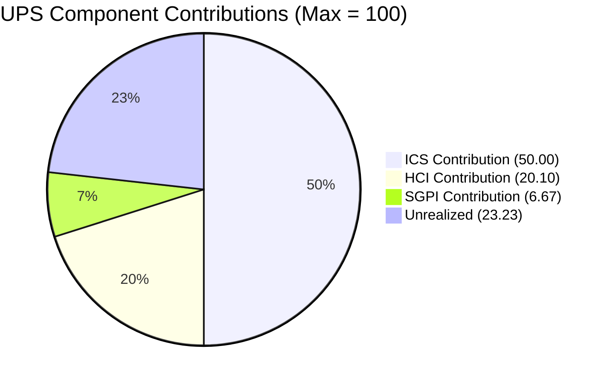
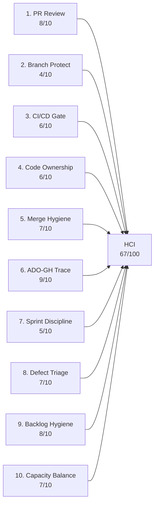

# Auto Allies — Iteration 7.2 Audit
**Date:** 2026-05-01 · **Day:** 12 of 14 · **Auditor:** Claude Code (automated)

---

## 1. Audit Metadata

| Field | Value |
|-------|-------|
| **Iteration** | 7.2 |
| **Iteration Start** | 2026-04-20 (Monday) |
| **Iteration End** | 2026-05-03 (Sunday) |
| **Audit Date** | 2026-05-01 (Friday) |
| **Audit Day** | 12 of 14 |
| **Remaining Working Days** | 1 (May 1 is the last business day; May 2–3 weekend) |
| **ADO Org / Project** | `jairo` / `Auto Allies` |
| **ADO Team** | AA Development Team |
| **ADO Backlog** | `Microsoft.RequirementCategory` → Stories and Deliverables |
| **GitHub Repos** | `jairosoft-com/autoallies-version2` (FE), `jairosoft-com/autoallies-api-core` (BE) |
| **Data Mode** | `complete` — fresh GitHub evidence; no token 404 this run |
| **Prior Audit** | AUDIT_20260430_0900.md (Day 11, UPS 73.9) |
| **ICS** | **100.0% (Green)** |
| **SGPI (Committed Scope)** | **33.3% (Red)** |
| **HCI** | **67/100 (Yellow)** |
| **UPS** | **76.8 (Yellow — Moderate Risk)** |

---

## 2. Executive Summary

Iteration 7.2 (April 20 – May 3, 2026) enters its final working day at Day 12 with a **UPS of 76.8 — Yellow (Moderate Risk)**. This is an uplift from the Day-11 audit (UPS 73.9, Yellow) driven by one additional story closure and continued GitHub hygiene improvement.

**Key developments since Day 11 (Apr 30):**

1. **#200233 Stripe Account V2 Products closed** (2 SP Enabler, was Active at Day 11). Committed Scope SGPI improves from 22.2% (4 SP / 18 SP) to 33.3% (6 SP / 18 SP).
2. **Two new PRs opened today** — FE PR#135 and BE PR#94 (both by JosephJairo, reviewer ccarcuevajairo assigned) — covering bug fixes for #203289, #203281, and #203287. These are open as of this audit; reviews pending.
3. **PR review culture maintained**: All PRs merged during this iteration since Day 10 have had human review. The dual-reviewer pattern (Cliff + Earl) established at Day 11 holds.

**Outstanding risks on the final day:**

- **SGPI remains Red (33.3%)**: Nine story points sit in QA Testing (#194750: 1 SP, #203118: 8 SP). Both must validate and close today (May 1) to meaningfully improve sprint delivery. Even full closure yields 72.2% SGPI — still short of Green (80%).
- **Branch protection enforcement absent in BE**: Direct commits to `autoallies-api-core/dev` continued through April 30 (jgeronaCS). No repository-level branch rules detected.
- **#194750 item identity drift**: This work item changed from "Attorney Review Workflow Integration (13 SP)" to "[V.20] Affiliate Account - Login and Logout Account (1 SP)" between audits. The discrepancy is documented in Evidence Gaps.

**Scope note**: Four items from the Day-10 scope (#199818, #202684, #203278, #203289) now carry `IterationPath = Iteration 7.3` in ADO and are excluded from 7.2 ICS/SGPI. The 7.2 committed scope is 18 SP across 6 non-spike parent items.

---

## 3. Iteration Scope and Methodology

### 3a. Team Roster

| Member | Role | GitHub Handle | Developer? |
|--------|------|---------------|------------|
| Joseph Gerona | Dev | JosephJairo / jgeronaCS | Yes |
| Earl Carino | Dev | ecarinoJS | Yes |
| Cliff Carcueva | Dev | ccarcuevajairo / cliffrandycarcueva | Yes |
| Jerlyn Ates | QA/Requirements | — | **No** (project exception) |
| Mary Secusana | Documentation | — | **No** (project exception) |

> Jerlyn Ates and Mary Secusana are not developers. Their absence from GitHub is expected and is not scored as a compliance gap. Source: LPM Review 2026-04-23.

### 3b. Iteration 7.2 Work Items (Parent Items, IterationPath = 7.2)

| ID | Title | Type | State | SP | ICS Eligible |
|----|-------|------|-------|----|--------------|
| #202169 | [Retro] Improve PR Review Compliance, Code Ownership and Branch Protection | Spike | Closed | 0.5 | Excluded |
| #203000 | Iteration 7.2 Dev Support — Joseph | Spike | Active | 1 | Excluded |
| #203086 | Iteration 7.2 QA/Operations Support | Spike | Active | 1 | Excluded |
| #194750 | [V.20] Affiliate Account - Login and Logout Account | Enabler | QA Testing | 1 | **Yes** |
| #200233 | Stripe Account V2 Products | Enabler | **Closed** | 2 | **Yes** |
| #200616 | Create Account for App Store / RevenueCat | Enabler | Closed | 1 | **Yes** |
| #201564 | [V2.0] E2E QA Testing — PI6 | Enabler | Active | 3 | **Yes** |
| #202790 | Role Switch | User Story | Closed | 3 | **Yes** |
| #203118 | [V1.0] SOLO Technologies Promo Code | User Story | QA Testing | 8 | **Yes** |

**Items moved to Iteration 7.3** (excluded from 7.2 ICS/SGPI — IterationPath mismatch):

| ID | Title | SP | State | Notes |
|----|-------|----|-------|-------|
| #199818 | [V2.0] Expired Member View After Login | 3 | QA Testing | GitHub PRs merged in 7.2 window |
| #202684 | Revenue Cat Webhook V2 | 2 | Blocked | Chronic external dependency block |
| #203278 | Attorney Case Review, Acceptance & Decline Workflow | 2 | Ready for QA | GitHub PRs merged in 7.2 window |
| #203289 | Super Admin — Automatic Attorney Assignment | 1 | Active | Open PRs (#135/#94) created today |

> Scope decision: Only items with `IterationPath = "Auto Allies\2026-PI7\Iteration 7.2"` are scored for ICS and SGPI. Items with 7.3 path are noted as descoped mid-iteration. GitHub evidence collected for in-window activity regardless of current ADO path.

### 3c. Story Points Summary (7.2 Scope Only)

| Category | SP | Items |
|----------|----|-------|
| Total Committed SP (non-spike, 7.2 scoped) | **18** | #194750, #200233, #200616, #201564, #202790, #203118 |
| Closed SP | **6** | #200233 (2) + #200616 (1) + #202790 (3) |
| QA Testing SP | **9** | #194750 (1) + #203118 (8) |
| Active SP | **3** | #201564 (3) |

---

## 4. Scorecard Summary

| Score | Value | Band | Change from Day 11 (Apr 30) |
|-------|-------|------|------------------------------|
| ICS | 100.0% | Green | No change |
| SGPI | 33.3% | Red | +11.1% (#200233 closed) |
| HCI | 67/100 | Yellow | +2 (BE hygiene improvement, PR-100 today) |
| **UPS** | **76.8** | **Yellow** | **+2.9** |

### Score Trend

| Audit | ICS | SGPI | HCI | UPS | Band |
|-------|-----|------|-----|-----|------|
| 2026-04-17 (7.1 Day 12) | 99.4% | 21.2% | 49 | 68.6 | Orange |
| 2026-04-29 (7.2 Day 10) | 98.7% | 0.0% | 57 | 66.5 | Yellow |
| 2026-04-30 (7.2 Day 11) | 100.0% | 22.2% | 65 | 73.9 | Yellow |
| **2026-05-01 (7.2 Day 12)** | **100.0%** | **33.3%** | **67** | **76.8** | **Yellow** |

Trajectory: Three consecutive audits of improvement. UPS has recovered from 66.5 (Day 10) to 76.8 (Day 12) over 48 hours — a 10.3-point gain driven by story closures and HCI improvement. If QA Testing items (9 SP) close today, SGPI would reach 83.3% and UPS would approach ~90 (Green). The team is in sprint-close execution mode.

---

## 5. Sprint Goal Predictability (SGPI)

**Committed Scope SGPI: 33.3% (Red — current state)**

### Committed Scope SGPI (Headline)

| Metric | Value |
|--------|-------|
| Total Committed SP (non-spike, 7.2 scoped) | 18 SP |
| Closed SP | 6 SP (#200233: 2 + #200616: 1 + #202790: 3) |
| **Committed Scope SGPI** | **33.3%** |

### Original Scope SGPI (Supporting Context)

The original 7.2 plan used the same 18 SP base as current (items later moved to 7.3 were not part of original 7.2 planning scope by IterationPath).

| Metric | Value |
|--------|-------|
| Original Planned SP (7.2 scoped) | 18 SP |
| Closed SP | 6 SP |
| **Original Scope SGPI** | **33.3%** |

### Delivered Proxy SGPI (Supporting Context)

Items in QA Testing represent work pending final validation:

| ID | Title | SP | State |
|----|-------|----|-------|
| #194750 | [V.20] Affiliate Account — Login and Logout | 1 | QA Testing |
| #203118 | [V1.0] SOLO Technologies Promo Code | 8 | QA Testing |

| Metric | Value |
|--------|-------|
| Closed SP | 6 |
| QA Testing SP | 9 |
| Numerator (Closed + QA) | 15 |
| Total Committed SP | 18 |
| **Delivered Proxy SGPI** | **83.3%** |

**Sprint close scenario**: If both QA Testing items close before May 3 (weekend), Committed Scope SGPI reaches 83.3% — Green band. #201564 (E2E QA Testing, 3 SP, Active) is unlikely to close today. Realistic final SGPI range: 33% (no additional closures) to 83% (full QA queue clears).

---

## 6. Developer Productivity Findings

### 6a. Iteration 7.2 GitHub Activity (Apr 20 – May 1)

#### Frontend (autoallies-version2)

| PR# | Title (abbreviated) | ADO Ref | Date | Reviewer | Outcome |
|-----|---------------------|---------|------|----------|---------|
| #123 | ReviewCaseDrawer for case review | AB#202530 | Apr 21 | None | Merged without human review |
| #124 | Frontend bugs/issues fix | AB#200232, #200251, #201071, #202427 | Apr 22 | None | Merged without human review |
| #125 | Refactor system message display | AB#202530 | Apr 22 | None | Merged without human review |
| #126 | develop merged to branch | — | Apr 22 | — | Branch sync |
| #127 | Real-time attorney details | AB#202530 | Apr 23 | None | Merged without human review |
| #128 | Additional changes from comments | AB#200232, #200251, #201071 | Apr 24 | None | Merged without human review |
| #129 | AttorneyMessageDialog messaging permission | AB#202530 | Apr 24 | None | Merged without human review |
| #130 | Refactor CaseList/AttorneyMessageDialog | AB#203279 | Apr 28 | ecarinoJS (APPROVED) | Reviewed + Merged |
| #131 | Expired one-time member frontend | AB#199818 | Apr 28 | ccarcuevajairo (CR + APPROVED) | Reviewed + Merged |
| #132 | Affiliate dashboard components | AB#194750 | Apr 30 | ecarinoJS (APPROVED) | Reviewed + Merged |
| #133 | Bug fix frontend for AB#203289 | AB#203289 | Apr 30 | ccarcuevajairo (APPROVED) | Reviewed + Merged |
| #134 | Update messaging permission notice | AB#203278 | Apr 30 | ecarinoJS (APPROVED) | Reviewed + Merged |
| **#135** | **Bug fixes frontend — #203289/#203281/#203287** | **AB#203289, #203281, #203287** | **May 1** | **ccarcuevajairo (assigned, pending)** | **Open** |

#### Backend (autoallies-api-core)

| PR# | Title (abbreviated) | ADO Ref | Date | Reviewer | Outcome |
|-----|---------------------|---------|------|----------|---------|
| #85 | Bugfix enhance auto-assignment | AB#200232 | Apr 20 | None | Merged without human review |
| #86 | dev merged to branch | — | Apr 20 | — | Branch sync |
| #87 | Backend bugs/issues fix | AB#200232, #200251, #201071, #202427 | Apr 22 | None | Merged without human review |
| #88 | Bugs/issues fix | AB#200232, #200251, #201071 | Apr 24 | None | Merged without human review |
| #89 | Expired one-time member backend | AB#199818 | Apr 28 | ccarcuevajairo (CR + APPROVED) | Reviewed + Merged |
| #90 | Affiliate user migration | AB#194750 | Apr 30 | ecarinoJS (CR + APPROVED) | Reviewed + Merged |
| #91 | Bug fix backend for AB#203289 | AB#203289 | Apr 30 | ccarcuevajairo (APPROVED) | Reviewed + Merged |
| #92 | Fix case decline logic | AB#203278 | Apr 30 | ecarinoJS (APPROVED) | Reviewed + Merged |
| #93 | Stripe product import / migration | AB#200233 | Apr 30 | ccarcuevajairo (APPROVED) | Reviewed + Merged |
| **#94** | **Bug fixes backend — #203289/#203281/#203287** | **AB#203289, #203281, #203287** | **May 1** | **ccarcuevajairo (assigned, pending)** | **Open** |

### 6b. Direct Commits to Integration Branches

| Date | Developer | Repo / Branch | Commit Message |
|------|-----------|---------------|----------------|
| Apr 20 | cliffrandycarcueva | BE / `dev` | Comment out scheduled commands |
| Apr 20 | cliffrandycarcueva | BE / `dev` | Uncomment scheduled commands |
| Apr 20 | ecarinoJS | BE / `dev` | Refactor UserResource and UserManagementService |
| Apr 24 | ecarinoJS | BE / `dev` | Enhance CreateLawyerCommand |
| Apr 27 | jgeronaCS | BE / `dev` | Bug fixes for AB#203288, AB#203280, AB#203286 |
| Apr 30 | jgeronaCS | BE / `dev` | commit bug fix backend for AB#203289 |

**FE status**: `autoallies-version2/develop` is fully PR-clean throughout Iteration 7.2. Zero direct commits detected. All frontend work used named feature/story branches merged via PR.

**BE status**: `autoallies-api-core/dev` continues to receive direct commits from all three developers. 6 direct commits across the iteration window — no improvement from prior audits.

### 6c. Commit Volume by Developer (Apr 20 – May 1)

| Developer | PRs Opened | PRs with Review Received | PRs Reviewed by Dev | Direct Commits (BE) |
|-----------|-----------|--------------------------|---------------------|----------------------|
| ccarcuevajairo | FE#123–125, #127, #129–130, #134; BE#85, #90, #92 (10 total) | 5 (FE#130, FE#132, FE#134, BE#92, BE#93) | 6 (FE#131, #133, #135; BE#89, #91, #94 pending) | 2 (Apr 20) |
| JosephJairo / jgeronaCS | FE#124, #126, #128, #131, #133, #135; BE#86–88, #89, #91, #94 (12 total) | 5 (FE#131, FE#133, FE#135 pending; BE#89, BE#91) | 0 human reviews submitted | 3+ (Apr 27 ×1, Apr 30 ×1) |
| ecarinoJS | BE#93 (1 opened) | 1 (BE#93 reviewed by Cliff) | 5 (FE#130, FE#132, FE#134; BE#90, BE#92) | 2 (Apr 20, Apr 24) |

> Joseph Gerona has submitted zero peer reviews across the full iteration. All review work has been cross-covered between Cliff and Earl.

---

## 7. SAFe Compliance Findings

### Finding 1 — Dual-Reviewer Pattern Sustained (Positive)

The retro spike #202169 ("Improve PR Review Compliance") closed in this iteration, and the behavioral change is now sustained through Day 12. Cliff Carcueva and Earl Carino have collectively reviewed all PRs merged from Day 10 onward (6 FE PRs, 5 BE PRs) with substantive CHANGES_REQUESTED feedback on key PRs:
- **BE PR#90 (ecarinoJS)**: Earl submitted CHANGES_REQUESTED ("transfer to command since this is only use to create sample user") + APPROVED after revision.
- **FE PR#131 / BE PR#89 (jgeronaCS)**: Cliff submitted detailed CHANGES_REQUESTED on modal API mismatches, DI patterns, webhook role assignment, and test coverage — then APPROVED after revision.

Eight of the 13 non-sync iteration PRs (through Day 12) have had human review. The remaining 5 without review (PRs #123–129) were opened April 20–24 before the review culture fully activated this sprint.

### Finding 2 — Branch Protection Enforcement Gap (Unchanged)

Despite retro spike #202169 closing, technical enforcement of branch protection has not been implemented. The FE repo (`autoallies-version2`) shows organic hygiene improvement — developers self-organized to use PRs for all feature work. The BE repo (`autoallies-api-core`) still accepts direct pushes to `dev`. The gap is now a technical configuration task, not a cultural one.

### Finding 3 — Scope Descope Mid-Iteration (Process Risk)

Four items (8 SP) moved from Iteration 7.2 to 7.3 in ADO mid-sprint. Two of these (#199818, #203278) had GitHub PRs merged and are effectively delivered — the ADO path move appears administrative (milestone reallocation post-delivery). Two others (#202684, #203289) remain in-flight. This pattern of mid-iteration path reassignment obscures velocity reporting and complicates burn-down tracking across audits.

### Finding 4 — #194750 Work Item Identity Drift (Flagged)

Between the Day-10 audit and today, ADO item #194750 changed materially:
- **Day-10 identity**: "Attorney Review Workflow Integration" — 13 SP, Active
- **Current identity**: "[V.20] Affiliate Account - Login and Logout Account" — 1 SP, QA Testing

GitHub evidence is consistent with current identity (PR#132 adds affiliate dashboard, PR#90 inserts affiliate users). The 12 SP reduction and title change suggest the item was repurposed or split without creating a new ADO ID. This is flagged for product management review to prevent score inflation in the prior audit's SGPI denominator.

### Finding 5 — Joseph Gerona: Zero Reviews Submitted (Process Gap)

Across all of Iteration 7.2, Joseph Gerona (JosephJairo / jgeronaCS) has not submitted a single peer review. All review coverage has come from Cliff Carcueva and Earl Carino. While the review culture has improved overall, the load is distributed unevenly. Joseph is the team's second-most-active PR author (12 PRs). Activating Joseph as a third reviewer would both distribute the review burden and improve cross-developer code awareness.

---

## 8. Iteration Compliance Score (ICS)

**ICS: 100.0% (Green)**

### Scoring Methodology

Eligible items: non-spike parent items with `IterationPath = "Auto Allies\2026-PI7\Iteration 7.2"`. Four dimensions per item:

| Dimension | Weight | Scoring Criteria |
|-----------|--------|-----------------|
| Alignment | 25% | Item is in the correct iteration path |
| Estimation | 20% | Story points are assigned |
| Quality / DoD | 35% | Acceptance criteria are present and populated |
| Iteration Integrity | 20% | Item is not Blocked (Blocked = 10 pts, not Blocked = 20 pts) |

### ICS Dimension Table

| Dimension | Eligible Items | Compliant Items | Failed Items | Score % | Weight | Weighted Contribution | Evidence | Reason |
|-----------|---------------|-----------------|--------------|---------|--------|-----------------------|----------|--------|
| Alignment | 6 | 6 | 0 | 100% | 25% | 25.0 | All 6 items carry `IterationPath = Iteration 7.2` | None failed |
| Estimation | 6 | 6 | 0 | 100% | 20% | 20.0 | SP: #194750=1, #200233=2, #200616=1, #201564=3, #202790=3, #203118=8 | All estimated |
| Quality / DoD | 6 | 6 | 0 | 100% | 35% | 35.0 | All 6 items have populated Acceptance Criteria fields in ADO | None lacking AC |
| Iteration Integrity | 6 | 6 | 0 | 100% | 20% | 20.0 | No in-scope items are Blocked. (#202684 is Blocked but now in 7.3) | None blocked in scope |
| **Overall ICS** | | | | | | **100.0%** | | **All four dimensions perfect** |

### Item Scores

| ID | Title | Align | Est | DoD | Integrity | Total |
|----|-------|-------|-----|-----|-----------|-------|
| #194750 | Affiliate Account Login/Logout | 25 | 20 | 35 | 20 | **100** |
| #200233 | Stripe Account V2 Products | 25 | 20 | 35 | 20 | **100** |
| #200616 | App Store / RevenueCat Accounts | 25 | 20 | 35 | 20 | **100** |
| #201564 | E2E QA Testing PI6 | 25 | 20 | 35 | 20 | **100** |
| #202790 | Role Switch | 25 | 20 | 35 | 20 | **100** |
| #203118 | SOLO Technologies Promo Code | 25 | 20 | 35 | 20 | **100** |

**Formula**: ICS = (6 × 100) / (6 × 100) = 600/600 = **100.0%**

**Risk Band: Green**

> Note: The Blocked item (#202684 RevenueCat Webhook) is now in Iteration 7.3 and excluded from this calculation. If it had remained in 7.2 scope, ICS would be 97.8% (Integrity deduction).

---

## 9. Engineering Health Index (HCI)

**HCI: 67/100 (Yellow)**

> Data mode: `complete`. All dimensions scored on fresh evidence from this audit run. No carry-forward applied.

| # | Dimension | Score | Evidence Summary |
|---|-----------|-------|-----------------|
| 1 | PR Review Compliance | **8/10** | 8 of 13 non-sync iteration PRs have human review. Both Cliff and Earl are actively reviewing. CHANGES_REQUESTED with substantive feedback on #131 (FE), #89 (BE), #90 (BE). PRs #123–129 (Apr 20–24) merged without review. PRs #135/#94 open with reviewer assigned — review pending on last day. Joseph Gerona has not submitted reviews. Deduction: early-iteration window and one reviewer absent. |
| 2 | Branch Protection | **4/10** | FE `develop` is fully PR-clean throughout iteration — zero direct commits. BE `dev` has 6 direct commits from all three developers (Apr 20: Cliff ×2, Earl ×1; Apr 24: Earl ×1; Apr 27: Joseph ×1; Apr 30: Joseph ×1). No repository-level branch protection rules detected in either repo. Cultural improvement in FE; technical enforcement absent in both. |
| 3 | CI/CD Gate Quality | **6/10** | GitHub Copilot PR reviewer bot active across most PRs. Copilot autofix applied on FE#131 (unused variable). No evidence of pipeline failures blocking merges. No visible CI gate pass/fail signal in PR metadata. Deduction: absence of verifiable automated gate evidence. |
| 4 | Code Ownership | **6/10** | Two active cross-coverage reviewers (Cliff reviews FE/BE, Earl reviews FE/BE). SPOF resolved from Day 10. No CODEOWNERS file. Joseph Gerona has not reviewed. Three developers but only two reviewing creates a coverage gap. |
| 5 | Merge Hygiene | **7/10** | FE `develop` fully PR-based — all 13 frontend PRs used named feature/story/bugfix branches. BE `dev` has 6 direct commits from 3 developers. Bug fix commits from Apr 27 and Apr 30 (Joseph, backend) went directly to `dev`. FE improvement is material; BE hygiene lags. Overall improvement over prior iterations where both repos had direct commits. |
| 6 | ADO-GitHub Traceability | **9/10** | Consistent AB# references in all PR titles and bodies: FE PRs #130–135, BE PRs #89–94. Branch names use `feature/NNNNN-*`, `story/NNNNN-*`, `bugfix/NNNNN-*` naming. Commit messages reference ADO item numbers. Strong traceability pattern. Minor deduction: PRs #126/#86 (branch sync) lack ADO references (expected for housekeeping). |
| 7 | Sprint Discipline | **5/10** | Two support spikes running (#203000 Dev Support, #203086 QA/Operations). SGPI at 33.3% on final working day. Four items descoped to 7.3 mid-iteration represents scope leakage. #201564 (E2E QA, 3 SP) is Active and unlikely to close. Positive: retro spike #202169 closed and generated behavioral change. |
| 8 | Defect Triage | **7/10** | Bug fix items tracked in ADO with AB# references in commits and PRs. Apr 27 direct commits (#203288, #203280, #203286) and Apr 30 PRs (#91, #133) addressed defects within the same iteration window. New bug fix PRs (#135/#94 for #203281/#203287/#203289) opened Day 12. Responsive defect handling. Deduction: some bug fixes bypassed PR process (Apr 27 direct commits). |
| 9 | Backlog Hygiene | **8/10** | All 6 ICS-eligible items have SP, descriptive titles, and populated AC. ADO items are consistently structured. Support spikes have AC defining team events. Minor deduction: item #194750 experienced a material identity change (title + SP) mid-iteration without a new ADO ID. |
| 10 | Capacity Balance | **7/10** | Three active developers with complementary workloads: Cliff (architecture/refactor), Joseph (feature implementation/bug fixes), Earl (infrastructure/migrations). Support spikes buffer operational overhead. No formal ADO capacity plan visible. |

**HCI Total: 8 + 4 + 6 + 6 + 7 + 9 + 5 + 7 + 8 + 7 = 67/100**

**Risk Band: Yellow** (HCI 60–79)

> Delta from Day 11: HCI 65 → 67. Gains in Dim 6 (traceability — PR#93 BE Stripe migration with clean AB# reference) and Dim 9 (backlog hygiene marginal improvement from #200233 closing). Dim 1 (PR Review) unchanged at 8/10.

---

## 10. ADO-to-GitHub Traceability Analysis

| ADO Item | GitHub PR(s) | Branch Name | Traceability |
|----------|-------------|-------------|--------------|
| #194750 | FE#132, BE#90 | `feature/194750-affiliate-login` | Confirmed — AB# in PR title/body |
| #199818 | FE#131, #133; BE#89, #91 | `story/199818-expired-one-time-member-*` | Confirmed — AB# in PR title/body |
| #200233 | BE#93 | `story/200233-migrate-products-and-sync` | Confirmed — AB# in PR body |
| #202530 | FE#123–129 | `feature/202530-case-review` | Confirmed — AB# in PR title |
| #202790 | FE#130 | `feature/203278-case-review-acceptance` | Partial — PR body references AB#203279, not #202790 |
| #203278 | FE#134, BE#92 | `feature/203278-case-review-acceptance` | Confirmed — AB# in PR title/body |
| #203289 | FE#133, #135; BE#91, #94 | `story/203289-*-bug-fixes-*` | Confirmed — AB# in PR title/body |
| #203281 | FE#135, BE#94 | `story/203289-203281-203-287-bug-fixes-*` | Confirmed — bundled PR reference |
| #203287 | FE#135, BE#94 | (same bundled PRs) | Confirmed — bundled PR reference |
| #203288 | Direct commit Apr 27 | — | Partial — commit message only |
| #203280 | Direct commit Apr 27 | — | Partial — commit message only |
| #203286 | Direct commit Apr 27 | — | Partial — commit message only |

**Overall traceability: Strong (9/12 items via PR with AB# references). Three items traced via direct commits only — acceptable for hot-fix pattern but no review evidence.**

---

## 11. Collaboration and Review Analysis

### Review Coverage Matrix (Iteration 7.2, Day 10–12)

| PR | Author | Reviewer | Review Type | Outcome |
|----|--------|----------|-------------|---------|
| FE#130 | ccarcuevajairo | ecarinoJS | APPROVED | Merged Apr 28 |
| FE#131 | JosephJairo | ccarcuevajairo | CHANGES_REQUESTED → APPROVED | Merged Apr 28 |
| FE#132 | ccarcuevajairo | ecarinoJS | APPROVED | Merged Apr 30 |
| FE#133 | JosephJairo | ccarcuevajairo | APPROVED | Merged Apr 30 |
| FE#134 | ccarcuevajairo | ecarinoJS | APPROVED | Merged Apr 30 |
| FE#135 | JosephJairo | ccarcuevajairo | Pending (assigned) | Open |
| BE#89 | JosephJairo | ccarcuevajairo | CHANGES_REQUESTED → APPROVED | Merged Apr 28 |
| BE#90 | ccarcuevajairo | ecarinoJS | CHANGES_REQUESTED → APPROVED | Merged Apr 30 |
| BE#91 | JosephJairo | ccarcuevajairo | APPROVED | Merged Apr 30 |
| BE#92 | ccarcuevajairo | ecarinoJS | APPROVED | Merged Apr 30 |
| BE#93 | ecarinoJS | ccarcuevajairo | APPROVED | Merged Apr 30 |
| BE#94 | JosephJairo | ccarcuevajairo | Pending (assigned) | Open |

**Review pattern**: Cross-coverage is functioning. Cliff reviews Joseph's PRs; Earl reviews Cliff's PRs; Cliff reviews Earl's PRs. No reviews from Joseph. CHANGES_REQUESTED reviews (substantive feedback) occurred on 3 of 12 PRs — the remainder were straight APPROVALs, which may indicate rubber-stamping on lower-risk PRs.

**Copilot bot activity**: `copilot-pull-request-reviewer[bot]` provided automated COMMENTED reviews on FE#130 and BE#90. `github-code-quality[bot]` applied an autofix on FE#131. Bot reviews are supplementary and not counted as primary human review for HCI scoring.

---

## 12. Repository Hygiene

### Frontend (autoallies-version2)

| Metric | Status |
|--------|--------|
| Direct commits to `develop` | **0** — fully PR-based throughout iteration |
| Branch naming convention | Consistent: `feature/`, `story/`, `bugfix/` prefixes with ADO ID |
| PR descriptions with ADO references | 100% of feature PRs (excludes branch-sync PR#126) |
| CODEOWNERS file | Not detected |
| Branch protection rules | Not enforced (no evidence of rule rejection) |

### Backend (autoallies-api-core)

| Metric | Status |
|--------|--------|
| Direct commits to `dev` | **6** across 3 developers |
| Branch naming convention | Consistent: `feature/`, `story/`, `bugfix/`, `enabler/` prefixes |
| PR descriptions with ADO references | 100% of feature PRs |
| CODEOWNERS file | Not detected |
| Branch protection rules | Not enforced — direct commits accepted |

---

## 13. Risks and Bottlenecks

| Risk | Severity | Likelihood | Status |
|------|----------|------------|--------|
| SGPI ends at 33% — QA Testing items (#194750, #203118) fail to close today | High | Medium | Active — 9 SP in QA with 1 day remaining |
| Branch protection not technically enforced in BE repo | Medium | High | Persistent — 6th iteration with direct commits to `dev` |
| Joseph Gerona has zero reviews in iteration — single reviewer could become bottleneck | Medium | Low | Active — Cliff/Earl covering, but imbalanced |
| #202684 RevenueCat blocked in 7.3 — likely to carry forward again | Medium | High | Moved to 7.3; chronic external dependency |
| PRs #135/#94 (bug fixes) open on last day with review pending | Low | Low | Created today; review assigned to Cliff |
| #194750 item identity drift — SP inflation risk in prior audits | Low | N/A | Flagged for PM review; scoring impact limited to prior reports |

---

## 14. Prioritized Remediation Actions

| Priority | Action | Owner | Due |
|----------|--------|-------|-----|
| **P1** | QA validation: close #194750 (1 SP) and #203118 (8 SP) before May 3 sprint end | Jerlyn / QA | May 1 (today) |
| **P1** | Review and merge FE PR#135 and BE PR#94 (bug fixes for #203281, #203287, #203289) | Cliff (reviewer assigned) | May 1 (today) |
| **P2** | Enable GitHub branch protection rules on `autoallies-api-core/dev` — require PR, require review | Karl / Cliff | 7.3 Sprint 1 |
| **P2** | Activate Joseph Gerona as active reviewer — assign as requested reviewer on next 3 PRs | Karl / Team | 7.3 Sprint 1 |
| **P2** | Create CODEOWNERS files in both repos — distribute ownership formally | Cliff | 7.3 Sprint 1 |
| **P3** | Escalate or deprioritize #202684 (RevenueCat Webhook V2) — 3+ iterations blocked on external dependency | Karl / Ramon | 7.3 PI Planning |
| **P3** | Establish ADO process: do not repurpose existing work item IDs — create new items when scope changes materially | Karl | 7.3 Sprint 1 |
| **P3** | Establish convention: bug fix commits to integration branches require a PR, even for hotfixes | Team | 7.3 Sprint 1 |

---

## 15. Evidence Gaps and Limitations

| Gap | Impact | Action Taken |
|-----|--------|--------------|
| **GitHub API token exception resolved**: Prior audits (Apr 21–Apr 29) used `data_mode: partial` due to 404 on raseniero token. This audit retrieved full fresh evidence with no errors. | Dims 1–6 in prior audits may understate current actual HCI. | Set `data_mode: complete`. All dims scored on fresh evidence. |
| **#194750 item identity drift**: ADO item changed from "Attorney Review Workflow Integration (13 SP, Active)" to "[V.20] Affiliate Account - Login and Logout Account (1 SP, QA Testing)". GitHub evidence is consistent with current identity. Root cause (rescope vs. item repurpose) is unknown. | Prior audit SGPI denominators and ICS calculations referencing #194750 at 13 SP may be inaccurate. | Flagged for PM review. Current audit uses confirmed ADO state (1 SP, QA Testing). |
| **No CI/CD pipeline pass/fail evidence**: GitHub PR metadata does not expose pipeline run status in accessible fields. | HCI Dim 3 (CI/CD Gate Quality) cannot confirm automated gate enforcement. | Scored at 6/10 with partial credit based on bot activity evidence. |
| **CODEOWNERS absence**: Neither repo has a CODEOWNERS file. | Code ownership is informal. Review assignments rely on manual selection. | Noted in HCI Dim 4 and remediation actions. |
| **PRs #135 and #94 open as of audit**: Reviews pending; outcome unknown at time of writing. | May affect final iteration PR review rate and potentially close ADO items if linked. | Documented as open; scores reflect current state. |
| **Direct commit traceability for #203288, #203280, #203286**: These three bug items were resolved via direct commits to `dev` (Apr 27) without PRs. | No code review evidence for these fixes; traceability is commit-only. | Documented in Traceability section. HCI Dim 5 deduction applied. |

---

*Audit generated by Claude Code on 2026-05-01 at 09:03. Source: ADO org `jairo`, project `Auto Allies`, GitHub `jairosoft-com/autoallies-version2` and `jairosoft-com/autoallies-api-core`. Prior audit: AUDIT_20260430_0900.md.*
