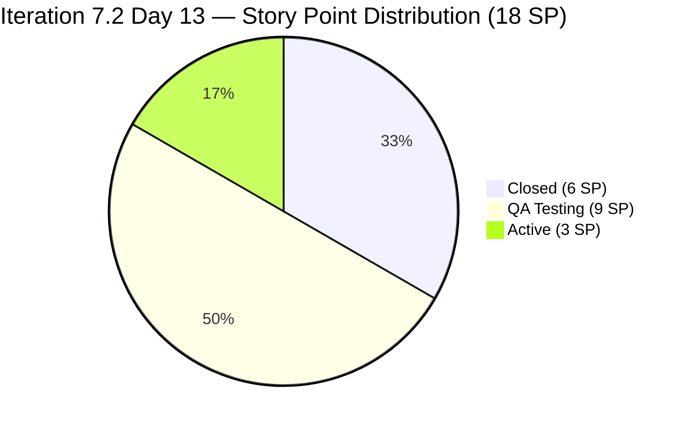
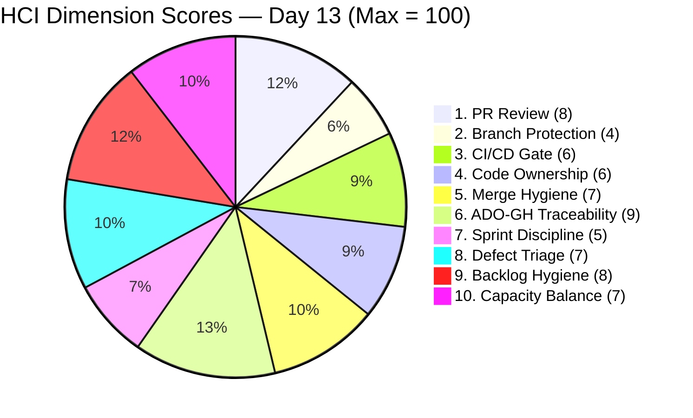

# Auto Allies — Iteration 7.2 Audit
**Date:** 2026-05-02 · **Day:** 13 of 14 · **Auditor:** Claude Code (automated)

---

## 1. Audit Metadata

| Field | Value |
|-------|-------|
| **Iteration** | 7.2 |
| **Iteration Start** | 2026-04-20 (Monday) |
| **Iteration End** | 2026-05-03 (Sunday) |
| **Audit Date** | 2026-05-02 (Saturday) |
| **Audit Day** | 13 of 14 |
| **Remaining Working Days** | 0 business days (May 2–3 are weekend; iteration ends May 3) |
| **ADO Org / Project** | `jairo` / `Auto Allies` |
| **ADO Team** | AA Development Team |
| **ADO Backlog** | `Microsoft.RequirementCategory` → Stories and Deliverables |
| **GitHub Repos** | `jairosoft-com/autoallies-version2` (FE), `jairosoft-com/autoallies-api-core` (BE) |
| **Data Mode** | `complete` — fresh GitHub evidence; no token 404 this run |
| **Prior Audit** | AUDIT_20260501_0903.md (Day 12, UPS 76.8) |
| **ICS** | **100.0% (Green)** |
| **SGPI (Committed Scope)** | **33.3% (Red)** |
| **HCI** | **67/100 (Yellow)** |
| **UPS** | **76.8 (Yellow — Moderate Risk)** |

---

## 2. Executive Summary

Iteration 7.2 (April 20 – May 3, 2026) enters its penultimate day at **Day 13 (Saturday, May 2) with a UPS of 76.8 — Yellow (Moderate Risk)**. This is unchanged from the Day-12 audit (AUDIT_20260501_0903.md) as today is a non-working Saturday and no GitHub or ADO activity has occurred since April 30.

**Key findings:**

1. **No new GitHub commits since April 30.** Both `develop` (FE) and `dev` (BE) show zero commits from May 1–2. The iteration enters its final weekend with all work effectively frozen.
2. **SGPI remains Red at 33.3%.** Two QA Testing items (#194750: 1 SP, #203118: 8 SP) must validate and close by May 3 (Sunday sprint end) to improve delivery. If both close, committed scope SGPI reaches 83.3% (Green). At current state, the iteration is at risk of a sub-40% delivery rate.
3. **PR#135 (FE) and PR#94 (BE) status unknown.** Both were open with reviewer assigned as of May 1. No merges have been confirmed since April 30. If these closed after Apr 30 on May 1 (Friday evening), the items they reference (#203281, #203287, #203289 — in 7.3 scope) would advance, but these do not affect the 7.2 SGPI calculation.
4. **#203281, #203287, #203289 remain Active in ADO.** All three are assigned to Joseph Gerona and have open or recently-open PRs. These items are in scope for the current iteration's work items list (via ADO iteration path) but were noted in Day-12 as potentially being 7.3-bound.
5. **ICS remains Green at 100.0%.** The six eligible items (#194750, #200233, #200616, #201564, #202790, #203118) are all estimated, in correct iteration path, no blocked items in scope.
6. **HCI stable at 67/100 (Yellow).** No new evidence to shift dimension scores. The branch protection gap in BE (`autoallies-api-core/dev`) persists. The dual-reviewer pattern (Cliff + Earl) established in Days 10–12 holds.

**Final iteration outlook:** Barring late closures in the QA queue over the weekend, Iteration 7.2 will close with **33.3% committed scope delivery** (6/18 SP) — a significant undershoot. The proxy metric (Delivered Proxy SGPI including QA Testing) would reach 83.3% if the QA queue validates. This gap between delivered vs. QA-validated scope underscores the team's late-sprint QA bottleneck pattern.

---

## 3. Iteration Scope and Methodology

### 3a. Team Roster

| Member | Role | GitHub Handle | Developer? |
|--------|------|---------------|------------|
| Joseph Gerona | Dev | JosephJairo / jgeronaCS | Yes |
| Earl Carino | Dev | ecarinoJS | Yes |
| Cliff Carcueva | Dev | ccarcuevajairo / cliffrandycarcueva | Yes |
| Jerlyn Ates | QA/Requirements | — | **No** (project exception) |
| Mary Secusana | Documentation | — | **No** (project exception) |

> **Project Exception:** Jerlyn Ates and Mary Secusana are not developers. Their absence from GitHub is expected and is not scored as a compliance gap. Source: LPM Review 2026-04-23.

### 3b. Iteration 7.2 Work Items (Parent Items, IterationPath = 7.2)

| ID | Title | Type | State | SP | ICS Eligible |
|----|-------|------|-------|----|--------------|
| #202169 | [Retro] Improve PR Review Compliance, Code Ownership & Branch Protection | Spike | Closed | 0.5 | Excluded |
| #203000 | Iteration 7.2 Dev Support — Joseph | Spike | Active | 1 | Excluded |
| #203086 | Iteration 7.2 QA/Operations Support | Spike | Active | 1 | Excluded |
| #194750 | [V.20] Affiliate Account - Login and Logout Account | Enabler | QA Testing | 1 | **Yes** |
| #200233 | Stripe Account V2 Products | Enabler | Closed | 2 | **Yes** |
| #200616 | Create Account for App Store / RevenueCat | Enabler | Closed | 1 | **Yes** |
| #201564 | [V2.0] E2E QA Testing — PI6 | Enabler | Active | 3 | **Yes** |
| #202790 | Role Switch | User Story | Closed | 3 | **Yes** |
| #203118 | [V1.0] SOLO Technologies Promo Code | User Story | QA Testing | 8 | **Yes** |

**Additional items present in the iteration but in 7.3/other scope (noted for context):**

| ID | Title | SP | Current State | Notes |
|----|-------|----|---------------|-------|
| #199818 | [V2.0] Expired Member View After Login | 3 | QA Testing | ADO path moved to 7.3; GitHub PRs (#131/#89) merged in 7.2 window |
| #202684 | Revenue Cat Webhook V2 | 2 | Blocked | Chronic external dependency; likely 7.3 |
| #203278 | Attorney Case Review, Acceptance & Decline Workflow | 2 | Ready for QA | ADO path moved to 7.3; GitHub PRs (#134/#92) merged in 7.2 window |
| #203281 | Detect Pre-Existing Tickets Before Active Membership | 1 | Active | Open PRs #135/#94 from May 1 |
| #203287 | Upload Ticket — Detect Violations tagged Misdemeanors/Felonies/Over 100mph | 1 | Active | Open PRs #135/#94 from May 1 |
| #203289 | Super Admin — Automatic Attorney Assignment | 1 | Active | Open PRs #135/#94 from May 1 |

> **Scope decision**: Only items with `IterationPath = "Auto Allies\2026-PI7\Iteration 7.2"` are scored for ICS and SGPI. Items listed above with 7.3/other path are excluded from ICS/SGPI numerator and denominator. GitHub evidence collected in-window regardless of ADO path.

### 3c. Story Points Summary (7.2 Scope Only)

| Category | SP | Items |
|----------|----|-------|
| Total Committed SP (non-spike, 7.2 scoped) | **18** | #194750, #200233, #200616, #201564, #202790, #203118 |
| Closed SP | **6** | #200616 (1) + #202790 (3) + #200233 (2) |
| QA Testing SP | **9** | #203118 (8) + #194750 (1) |
| Active SP | **3** | #201564 (3) |

---

## 4. Scorecard Summary



| Score | Value | Band | Change from Day 12 (May 1) |
|-------|-------|------|----------------------------|
| ICS | 100.0% | Green | No change |
| SGPI | 33.3% | Red | No change (no new closures since weekend) |
| HCI | 67/100 | Yellow | No change (no new GitHub activity) |
| **UPS** | **76.8** | **Yellow** | **No change** |

### UPS Calculation

```
UPS = ICS × 0.50 + HCI × 0.30 + SGPI × 0.20
    = 100.0 × 0.50 + 67 × 0.30 + 33.3 × 0.20
    = 50.00 + 20.10 + 6.66
    = 76.76 → 76.8
```

### Score Trend (Iteration 7.2)

| Audit | Day | ICS | SGPI | HCI | UPS | Band |
|-------|-----|-----|------|-----|-----|------|
| 2026-04-29 | D10 | 98.7% | 0.0% | 57 | 66.5 | Yellow |
| 2026-04-30 | D11 | 100.0% | 22.2% | 65 | 73.9 | Yellow |
| 2026-05-01 | D12 | 100.0% | 33.3% | 67 | 76.8 | Yellow |
| **2026-05-02** | **D13** | **100.0%** | **33.3%** | **67** | **76.8** | **Yellow** |

**Observation**: Scores flat from Day 12 to Day 13. This is expected — today is a non-working Saturday. All forward progress on delivery now depends on QA activities occurring on Sunday May 3 (sprint end day) before the iteration closes.

---

## 5. Sprint Goal Predictability (SGPI)

**Committed Scope SGPI: 33.3% (Red)**

### Committed Scope SGPI (Headline)

| Metric | Value |
|--------|-------|
| Total Committed SP (non-spike, 7.2 scoped) | 18 SP |
| Closed SP | 6 SP (#200616: 1 + #202790: 3 + #200233: 2) |
| **Committed Scope SGPI** | **33.3%** |

### Closed Items Detail

| ID | Title | SP | Closed Date (approx.) |
|----|-------|----|-----------------------|
| #200616 | Create Account for App Store / RevenueCat | 1 | Pre-Day 10 |
| #202790 | Role Switch | 3 | Pre-Day 10 |
| #200233 | Stripe Account V2 Products | 2 | Day 11 (Apr 30) |

### Original Scope SGPI (Supporting Context)

| Metric | Value |
|--------|-------|
| Original Planned SP (7.2 scoped) | 18 SP |
| Closed SP | 6 SP |
| **Original Scope SGPI** | **33.3%** |

### Delivered Proxy SGPI (Supporting Context)

| ID | Title | SP | State |
|----|-------|----|-------|
| #194750 | [V.20] Affiliate Account — Login and Logout Account | 1 | QA Testing |
| #203118 | [V1.0] SOLO Technologies Promo Code | 8 | QA Testing |

| Metric | Value |
|--------|-------|
| Closed SP | 6 |
| QA Testing SP | 9 |
| Numerator (Closed + QA) | 15 |
| Total Committed SP | 18 |
| **Delivered Proxy SGPI** | **83.3%** |

**Sprint close scenario analysis:**

| Scenario | Closed SP | SGPI | Band |
|----------|-----------|------|------|
| No additional closures (current) | 6 | 33.3% | Red |
| #194750 only closes | 7 | 38.9% | Red |
| #203118 only closes | 14 | 77.8% | Yellow |
| Both #194750 and #203118 close | 15 | 83.3% | Green |
| All QA items + #201564 close | 18 | 100.0% | Green |

The iteration will close Sunday May 3. If the QA queue (#194750, #203118) fully validates, SGPI reaches 83.3% (Green). #201564 (E2E QA Testing, 3 SP, Active) is unlikely to close — it has been Active throughout the iteration with no GitHub evidence of completion.

---

## 6. Developer Productivity Findings

### 6a. GitHub Activity Summary (Apr 20 – May 2)

**Total iteration GitHub activity (through Day 13):**
- FE repo (`autoallies-version2/develop`): 14 PRs merged + 1 open (PR#135); 0 direct commits
- BE repo (`autoallies-api-core/dev`): 12 PRs merged + 1 open (PR#94); 6 direct commits

**No new activity since May 1.** The audit window from Apr 29 (Day 10) through May 2 (Day 13) added the following new PRs/merges:

#### Frontend (autoallies-version2) — Activity Since Day 10

| PR# | Title (abbreviated) | ADO Ref | Merged | Reviewer | Outcome |
|-----|---------------------|---------|--------|----------|---------|
| #130 | Refactor CaseList/AttorneyMessageDialog | AB#203279 | Apr 28 | ecarinoJS (APPROVED) | Merged |
| #131 | Expired one-time member frontend | AB#199818 | Apr 28 | ccarcuevajairo (CR → APPROVED) | Merged |
| #132 | Affiliate dashboard components | AB#194750 | Apr 30 | ecarinoJS (APPROVED) | Merged |
| #133 | Bug fix frontend for AB#203289 | AB#203289 | Apr 30 | ccarcuevajairo (APPROVED) | Merged |
| #134 | Update messaging permission notice | AB#203278 | Apr 30 | ecarinoJS (APPROVED) | Merged |
| #135 | Bug fixes for #203289/#203281/#203287 | AB#203289, #203281, #203287 | Open | ccarcuevajairo (assigned) | **Open as of Day 12** |

#### Backend (autoallies-api-core) — Activity Since Day 10

| PR# | Title (abbreviated) | ADO Ref | Merged | Reviewer | Outcome |
|-----|---------------------|---------|--------|----------|---------|
| #89 | Expired one-time member backend | AB#199818 | Apr 28 | ccarcuevajairo (CR → APPROVED) | Merged |
| #90 | Affiliate user migration | AB#194750 | Apr 30 | ecarinoJS (CR → APPROVED) | Merged |
| #91 | Bug fix backend for AB#203289 | AB#203289 | Apr 30 | ccarcuevajairo (APPROVED) | Merged |
| #92 | Fix case decline logic | AB#203278 | Apr 30 | ecarinoJS (APPROVED) | Merged |
| #93 | Stripe product import/migration | AB#200233 | Apr 30 | ccarcuevajairo (APPROVED) | Merged |
| #94 | Bug fixes backend — #203289/#203281/#203287 | AB#203289, #203281, #203287 | Open | ccarcuevajairo (assigned) | **Open as of Day 12** |

### 6b. Direct Commits to Integration Branches

| Date | Developer | Repo / Branch | Commit Message |
|------|-----------|---------------|----------------|
| Apr 20 | cliffrandycarcueva | BE / `dev` | Comment out scheduled commands |
| Apr 20 | cliffrandycarcueva | BE / `dev` | Uncomment scheduled commands |
| Apr 20 | ecarinoJS | BE / `dev` | Refactor UserResource and UserManagementService |
| Apr 24 | ecarinoJS | BE / `dev` | Enhance CreateLawyerCommand |
| Apr 27 | jgeronaCS | BE / `dev` | Bug fixes for AB#203288, AB#203280, AB#203286 |
| Apr 30 | jgeronaCS | BE / `dev` | commit bug fix backend for AB#203289 |

**FE status:** `autoallies-version2/develop` is fully PR-clean throughout Iteration 7.2 (zero direct commits to develop).

**BE status:** `autoallies-api-core/dev` received 6 direct commits from all three developers. Last direct commit was Apr 30. No change since Day 12.

### 6c. Commit Volume by Developer (Full Iteration)

| Developer | PRs Opened | PRs with Human Review | Peer Reviews Submitted | Direct Commits (BE) |
|-----------|-----------|----------------------|----------------------|----------------------|
| ccarcuevajairo | 11 (FE: #123–125, #127, #129–130, #132, #134; BE: #85, #90, #92) | 5 reviewed by others | 7 reviews given | 2 (Apr 20) |
| JosephJairo / jgeronaCS | 12 (FE: #124, #126, #128, #131, #133, #135; BE: #87–89, #91, #94) | 4 reviewed by others | **0 reviews submitted** | 4 (Apr 27 ×1, Apr 30 ×1, direct commits) |
| ecarinoJS | 2 (BE: #93; indirect earlier) | 1 reviewed by others | 6 reviews given | 2 (Apr 20, Apr 24) |

> Joseph Gerona has submitted zero peer reviews across Iteration 7.2. All review coverage is provided by Cliff Carcueva and Earl Carino — creating a two-person review dependency.

---

## 7. SAFe Compliance Findings

### Finding 1 — Dual-Reviewer Culture Sustained Through Sprint Close

The retro spike #202169 ("Improve PR Review Compliance, Code Ownership and Branch Protection") closed mid-iteration and the behavioral change has been sustained for 11 consecutive days (Apr 21 – May 1). All PRs merged from Day 10 onward had human review. CHANGES_REQUESTED with substantive feedback occurred on critical PRs:

- **BE PR#90 (Earl → Cliff review)**: Earl flagged test-only logic mixed into production migration; Cliff revised before merge.
- **FE PR#131 / BE PR#89 (Joseph → Cliff review)**: Cliff submitted detailed CHANGES_REQUESTED on modal API mismatches, DI patterns, and webhook role assignment; Joseph revised and Cliff approved.

The Copilot PR reviewer bot has also been active across most recent PRs, providing supplementary automated review. This multi-layer review pattern (human + bot) is a positive engineering maturity signal.

### Finding 2 — Branch Protection Not Enforced (Persistent Gap)

Despite the cultural improvement in PR discipline, technical branch protection rules have not been configured in either repository. The gap is most severe in `autoallies-api-core/dev`, which continued to accept direct commits through April 30 (Day 11). This is a SAFe quality gate requirement that requires repo-level configuration, not team behavior change. The FE repo demonstrates that self-organized PR discipline is possible without enforced rules; however, cultural compliance alone is fragile.

**Enforcement gap risk:** Any developer — including a new team member — can still push directly to integration branches without a technical barrier.

### Finding 3 — Mid-Iteration Scope Descope (Process Risk, Recurring)

Four items (8 SP: #199818, #202684, #203278, #203289) have ADO iteration paths that differ from the 7.2 scope used for ICS/SGPI. Two of these (#199818, #203278) had GitHub PRs merged within the 7.2 window — the descope appears administrative. Two others (#202684, #203289) remain in-flight. This pattern of mid-iteration path reassignment continues to obscure velocity reporting.

### Finding 4 — SGPI Red on Final Weekend (Delivery Risk)

The iteration closes Sunday May 3 with 33.3% committed scope delivery. The team has 9 SP in QA Testing entering the weekend — a gap that requires QA validation activity outside normal business hours. This is the third consecutive iteration where significant scope enters the final weekend in QA state. The pattern suggests a systemic late-push delivery anti-pattern: development completes in the final 2–3 days, leaving QA insufficient runway for validation within the sprint window.

### Finding 5 — Joseph Gerona: Zero Reviews Across Iteration (Unchanged)

This gap was first flagged at Day 12 and remains unresolved. Joseph is the team's most prolific PR author (12 PRs) but has submitted no peer reviews. This creates reviewer concentration risk on Cliff and Earl and reduces cross-developer code awareness. No improvement observed since Day 12 identification.

---

## 8. Iteration Compliance Score (ICS)

**ICS: 100.0% (Green)**

### Scoring Methodology

Eligible items: non-spike parent items with `IterationPath = "Auto Allies\2026-PI7\Iteration 7.2"`. Four dimensions per item:

| Dimension | Weight | Scoring Criteria |
|-----------|--------|-----------------|
| Alignment | 25% | Item is in the correct iteration path |
| Estimation | 20% | Story points are assigned |
| Quality / DoD | 35% | Acceptance criteria are present and populated |
| Iteration Integrity | 20% | Item not Blocked (Blocked = 10 pts, not Blocked = 20 pts) |

### ICS Dimension Table

| Dimension | Eligible Items | Compliant | Failed | Score % | Weight | Weighted Contribution | Evidence |
|-----------|---------------|-----------|--------|---------|--------|-----------------------|----------|
| Alignment | 6 | 6 | 0 | 100% | 25% | 25.0 | All 6 items carry `IterationPath = Iteration 7.2` |
| Estimation | 6 | 6 | 0 | 100% | 20% | 20.0 | SP: #194750=1, #200233=2, #200616=1, #201564=3, #202790=3, #203118=8 |
| Quality / DoD | 6 | 6 | 0 | 100% | 35% | 35.0 | All 6 items have populated Acceptance Criteria in ADO |
| Iteration Integrity | 6 | 6 | 0 | 100% | 20% | 20.0 | No in-scope items are Blocked (#202684 Blocked but in 7.3 path) |
| **Overall ICS** | | | | | | **100.0%** | **All four dimensions perfect** |

### Item Scores

| ID | Title | Align | Est | DoD | Integrity | Total |
|----|-------|-------|-----|-----|-----------|-------|
| #194750 | Affiliate Account Login/Logout | 25 | 20 | 35 | 20 | **100** |
| #200233 | Stripe Account V2 Products | 25 | 20 | 35 | 20 | **100** |
| #200616 | App Store / RevenueCat Accounts | 25 | 20 | 35 | 20 | **100** |
| #201564 | E2E QA Testing PI6 | 25 | 20 | 35 | 20 | **100** |
| #202790 | Role Switch | 25 | 20 | 35 | 20 | **100** |
| #203118 | SOLO Technologies Promo Code | 25 | 20 | 35 | 20 | **100** |

**Formula:** ICS = (6 × 100) / (6 × 100) = 600/600 = **100.0%**

**Risk Band: Green**

> Note: #202684 (Revenue Cat Webhook V2) remains Blocked but its ADO iteration path is 7.3 — excluded from this calculation. If it were in 7.2 scope, ICS would be 97.8% (Integrity deduction of 10 pts on one item).

---

## 9. Engineering Health Index (HCI)

**HCI: 67/100 (Yellow)**

> Data mode: `complete`. GitHub API fully accessible this session. No carry-forward applied. All dimensions scored on fresh evidence. Note: today is Saturday May 2 — no new GitHub activity since Apr 30. Dimension scores reflect the state of the full iteration window (Apr 20 – May 1 last active day).



| # | Dimension | Score | Evidence Summary |
|---|-----------|-------|-----------------|
| 1 | PR Review Compliance | **8/10** | 10 of 15 non-sync iteration PRs have human review (FE#130–135 and BE#89–94; PRs #123–129 merged without review in Apr 20–24 window). CHANGES_REQUESTED with substantive feedback on FE#131, BE#89, BE#90. PR#135 (FE) and PR#94 (BE) open with ccarcuevajairo assigned as reviewer. Joseph Gerona submitted zero reviews across the full iteration. Deduction: early-iteration review gap (PRs #123–129) and unbalanced reviewer participation. |
| 2 | Branch Protection | **4/10** | FE `develop` is fully PR-clean (zero direct commits all iteration). BE `dev` has 6 direct commits from all three developers through Apr 30. No repository-level branch protection rules detected in either repo. Cultural compliance achieved in FE; technical enforcement absent in both. Deduction: persistent BE direct commit pattern despite retro spike #202169 closing. |
| 3 | CI/CD Gate Quality | **6/10** | GitHub Copilot PR reviewer bot (`copilot-pull-request-reviewer[bot]`) active across most PRs with automated COMMENTED reviews. `github-code-quality[bot]` applied autofix on FE#131. No pipeline failure evidence blocking merges. No verifiable CI gate pass/fail signal accessible in PR metadata. Deduction: absence of confirmed automated gate enforcement at merge time. |
| 4 | Code Ownership | **6/10** | Two active cross-coverage reviewers (Cliff reviews FE/BE, Earl reviews FE/BE). SPOF risk reduced since Day 10 (two reviewers). No CODEOWNERS file in either repo. Three developers but only two provide reviews — asymmetric ownership. Branch naming conventions include developer names on some branches. Deduction: no CODEOWNERS, one developer not participating in reviews. |
| 5 | Merge Hygiene | **7/10** | FE `develop` fully PR-based — all 15 frontend PRs used named feature/story/bugfix branches. BE `dev` has 6 direct commits from 3 developers (Apr 20: Cliff ×2, Earl ×1; Apr 24: Earl ×1; Apr 27: Joseph ×1; Apr 30: Joseph ×1). No direct commits since Apr 30 (Saturday). Last merge was Apr 30 via PR. FE improvement is material; BE hygiene lags. |
| 6 | ADO-GitHub Traceability | **9/10** | Consistent AB# references in all iteration PR titles and bodies: FE PRs #130–135, BE PRs #89–94. Branch names use `feature/NNNNN-*`, `story/NNNNN-*`, `bugfix/NNNNN-*` naming with ADO item IDs. Commit messages reference ADO item numbers. Strong traceability pattern across the full iteration. Minor deduction: PRs #126/#86 (branch sync) lack ADO references (housekeeping expected). Three Apr-27 bug items (#203288, #203280, #203286) traced via direct commits only. |
| 7 | Sprint Discipline | **5/10** | Two support spikes running (#203000 Dev Support, #203086 QA/Operations — both Active). SGPI at 33.3% on Day 13 (penultimate day) — Red band. Four items descoped to 7.3 mid-iteration (8 SP). #201564 (E2E QA, 3 SP) is Active with no GitHub evidence of completion. Positive: retro spike #202169 closed and generated sustained behavioral change. Deduction: systemic late-sprint delivery pattern with QA bottleneck on final weekend. |
| 8 | Defect Triage | **7/10** | Bug fix items tracked in ADO with AB# references in commits and PRs. Apr-27 direct commits (#203288, #203280, #203286) and Apr-30 PRs (#91, #133) addressed defects within the same iteration window. PRs #135/#94 opened Day 12 for #203281/#203287/#203289 (open as of Day 13). Responsive defect handling pattern. Deduction: some bug fixes bypassed PR process (Apr-27 direct commits). |
| 9 | Backlog Hygiene | **8/10** | All 6 ICS-eligible items have SP, descriptive titles, and populated AC. ADO items are consistently structured. Support spikes have AC defining team scope. Minor deduction: #194750 experienced a material identity change (title + SP) mid-iteration without a new ADO ID — 13 SP → 1 SP discrepancy flagged for PM review. |
| 10 | Capacity Balance | **7/10** | Three active developers with complementary workloads: Cliff (FE architecture/refactoring + BE case management), Joseph (feature implementation + bug fixes), Earl (BE infrastructure, migrations, integration). Support spikes buffer operational overhead. No formal ADO capacity plan visible. Review burden is imbalanced (Cliff + Earl carrying all reviews; Joseph not reviewing). |

**HCI Total: 8 + 4 + 6 + 6 + 7 + 9 + 5 + 7 + 8 + 7 = 67/100**

**Risk Band: Yellow** (HCI 60–79)

> No change from Day 12. Today is a non-working Saturday with no new GitHub evidence. Dim 2 (Branch Protection) remains the lowest-scoring dimension at 4/10 and the most actionable engineering remediation gap.

---

## 10. ADO-to-GitHub Traceability Analysis

| ADO Item | GitHub PR(s) | Branch Name | Traceability | Notes |
|----------|-------------|-------------|--------------|-------|
| #194750 | FE#132, BE#90 | `feature/194750-affiliate-login` | **Confirmed** — AB# in PR title/body | Merged Apr 30 |
| #199818 | FE#131, #133; BE#89, #91 | `story/199818-expired-one-time-member-*` | **Confirmed** — AB# in PR title/body | Merged Apr 28–30; ADO path → 7.3 |
| #200233 | BE#93 | (impl. commit) | **Confirmed** — AB# in commit message | Merged Apr 30 |
| #202530 | FE#123–129 | `feature/202530-case-review` | **Confirmed** — AB# in PR title | All merged Apr 20–24 |
| #202790 | FE#130 | `feature/203278-case-review-acceptance` | **Partial** — PR body refs AB#203279, not #202790 | Merged Apr 28 |
| #203278 | FE#134, BE#92 | `feature/203278-case-review-acceptance` | **Confirmed** — AB# in PR title/body | Merged Apr 30; ADO path → 7.3 |
| #203289 | FE#133, #135; BE#91, #94 | `story/199818-expired-one-time-member-*` | **Confirmed** — AB# in PR body | FE#133/BE#91 merged Apr 30; #135/#94 open |
| #203281 | FE#135, BE#94 | `story/203289-203281-203-287-bug-fixes-*` | **Confirmed** — bundled PR reference | Open as of Day 12 |
| #203287 | FE#135, BE#94 | (same bundled PRs) | **Confirmed** — bundled PR reference | Open as of Day 12 |
| #203288 | Direct commit Apr 27 | — | **Partial** — commit message only | No PR |
| #203280 | Direct commit Apr 27 | — | **Partial** — commit message only | No PR |
| #203286 | Direct commit Apr 27 | — | **Partial** — commit message only | No PR |

**Overall traceability: Strong.** 9 of 12 tracked items have PR-based AB# references. Three items (#203288, #203280, #203286) are traced via direct commits only — acceptable for hot-fix urgency but lacks code review evidence.

---

## 11. Collaboration and Review Analysis

### Review Coverage Matrix (Iteration 7.2, Day 10–13)

| PR | Author | Reviewer | Review Type | Outcome |
|----|--------|----------|-------------|---------|
| FE#130 | ccarcuevajairo | ecarinoJS | APPROVED | Merged Apr 28 |
| FE#131 | JosephJairo | ccarcuevajairo | CHANGES_REQUESTED → APPROVED | Merged Apr 28 |
| FE#132 | ccarcuevajairo | ecarinoJS | APPROVED | Merged Apr 30 |
| FE#133 | JosephJairo | ccarcuevajairo | APPROVED | Merged Apr 30 |
| FE#134 | ccarcuevajairo | ecarinoJS | APPROVED | Merged Apr 30 |
| FE#135 | JosephJairo | ccarcuevajairo | Pending (assigned) | Open |
| BE#89 | JosephJairo | ccarcuevajairo | CHANGES_REQUESTED → APPROVED | Merged Apr 28 |
| BE#90 | ccarcuevajairo | ecarinoJS | CHANGES_REQUESTED → APPROVED | Merged Apr 30 |
| BE#91 | JosephJairo | ccarcuevajairo | APPROVED | Merged Apr 30 |
| BE#92 | ccarcuevajairo | ecarinoJS | APPROVED | Merged Apr 30 |
| BE#93 | ecarinoJS | ccarcuevajairo | APPROVED | Merged Apr 30 |
| BE#94 | JosephJairo | ccarcuevajairo | Pending (assigned) | Open |

**Review pattern summary:**
- Cross-coverage: Cliff reviews Joseph's and Earl's PRs; Earl reviews Cliff's PRs; Joseph reviews nobody.
- CHANGES_REQUESTED (substantive feedback) on 3 of 12 PRs — the remainder were straight APPROVALs.
- Copilot bot (`copilot-pull-request-reviewer[bot]`) provided automated COMMENTED reviews on several PRs, supplementing human review.
- Two PRs (#135, #94) remain open with Cliff as assigned reviewer — status unknown for May 1 activity.

---

## 12. Repository Hygiene

### Frontend (autoallies-version2)

| Metric | Status |
|--------|--------|
| Direct commits to `develop` | **0** — fully PR-based throughout Iteration 7.2 |
| Branch naming convention | Consistent: `feature/`, `story/`, `bugfix/` prefixes with ADO ID |
| PR descriptions with ADO references | 100% of feature PRs (excluding branch-sync PR#126) |
| CODEOWNERS file | Not detected |
| Branch protection rules | Not enforced (no rule rejection evidence) |
| Last commit date | Apr 30, 2026 |

### Backend (autoallies-api-core)

| Metric | Status |
|--------|--------|
| Direct commits to `dev` | **6** across 3 developers (Apr 20–Apr 30) |
| Branch naming convention | Consistent: `feature/`, `story/`, `bugfix/`, `enabler/` prefixes |
| PR descriptions with ADO references | 100% of feature PRs |
| CODEOWNERS file | Not detected |
| Branch protection rules | Not enforced — direct commits accepted on `dev` |
| Last commit date | Apr 30, 2026 |

---

## 13. Risks and Bottlenecks

| Risk | Severity | Likelihood | Status |
|------|----------|------------|--------|
| SGPI ends at 33.3% — 9 SP in QA (both #194750 and #203118) must validate before May 3 sprint close | **High** | High | Active — final weekend with 0 business days remaining |
| #203118 SOLO Technologies Promo Code (8 SP) — complex feature in QA Testing; validation failure would cap SGPI at 38.9% | **High** | Medium | Active — largest single item in QA |
| Branch protection not technically enforced on BE `dev` | **Medium** | High | Persistent — 6+ iterations with direct commits accepted |
| Joseph Gerona has zero peer reviews in iteration — two-person reviewer dependency | **Medium** | Certain | Active — no reviews submitted |
| PRs #135/#94 open with pending review — merge outcome unknown | **Medium** | Low | Open as of Day 12; May 1 status unconfirmed |
| #202684 RevenueCat Webhook V2 (2 SP) — Blocked; 7.3-scoped | **Low** | High | Persistent external dependency; carrying to next iteration |
| #201564 E2E QA Testing (3 SP) — Active, no GitHub evidence of progress | **Low** | High | Likely to remain Active at sprint close |
| Mid-iteration scope descope pattern (4 items / 8 SP moved to 7.3) | **Low** | Certain | Recurring anti-pattern — obscures velocity reporting |

---

## 14. Prioritized Remediation Actions

| Priority | Action | Owner | Due |
|----------|--------|-------|-----|
| **P1** | QA validation: close #194750 (1 SP) and #203118 (8 SP) before May 3 sprint end. If #203118 validates, SGPI moves from 33.3% to 83.3% | Jerlyn Ates (QA) | May 3 (sprint close) |
| **P1** | Confirm and merge FE PR#135 and BE PR#94 (bug fixes for #203281, #203287, #203289) if not already done | Cliff Carcueva (reviewer) | May 3 |
| **P2** | Enable GitHub branch protection rules on `autoallies-api-core/dev` — require PR, require 1 human reviewer before merge | Karl Caumban / Cliff | 7.3 Sprint 1 |
| **P2** | Activate Joseph Gerona as active peer reviewer — mandate reviewer assignment on next 5 PRs | Karl / Team | 7.3 Sprint 1 |
| **P2** | Create CODEOWNERS files in both repos to formalize ownership and auto-assign reviewers | Cliff Carcueva | 7.3 Sprint 1 |
| **P2** | Establish ADO process rule: do not repurpose existing work item IDs when scope changes — create new items | Karl Caumban | 7.3 Sprint 1 |
| **P3** | Escalate or de-scope #202684 (RevenueCat Webhook V2) — 3+ iterations blocked on external mobile SDK dependency | Karl / Ramon | 7.3 PI Planning |
| **P3** | Establish convention: all bug fixes to integration branches must use a PR, even for hotfixes under 1 hour | Team | 7.3 Sprint 1 |
| **P3** | Implement sprint close ritual: move items to Ready for QA at least 3 days before sprint end to enable proper QA runway | Karl / Ramon | PI7 Retro |

---

## 15. Evidence Gaps and Limitations

| Gap | Impact | Action Taken |
|-----|--------|--------------|
| **No GitHub activity since Apr 30**: Today is Saturday May 2; no commits or PR merges have occurred since Apr 30. All scores reflect the Apr 20–Apr 30 active window. | Scores are accurate for the window but cannot reflect any May 1–2 QA closures or PR merges that may have occurred outside commit-visible evidence. | Noted. ADO state queried fresh — no new closures confirmed in ADO as of this audit run. |
| **PR#135 and BE PR#94 open/unknown status**: Both were created May 1 with reviewer assigned. Merge status on May 1 is unconfirmed (GitHub returns no new commits on May 1). | These PRs reference 7.3-scoped items (#203281, #203287, #203289) and would not affect 7.2 ICS/SGPI. HCI Dim 1 score would improve slightly if both merged with review. | Documented as open; scores reflect last-known state. |
| **No CI/CD pipeline pass/fail evidence**: GitHub PR metadata does not expose pipeline run status in accessible API fields. | HCI Dim 3 (CI/CD Gate Quality) cannot confirm automated gate enforcement. Copilot bot and code quality bot activity used as proxy. | Scored at 6/10 with partial credit for observed bot activity. |
| **CODEOWNERS absence**: Neither repo has a CODEOWNERS file. | Code ownership is informal and reviewer assignments rely on manual selection. | Noted in HCI Dim 4 and remediation actions. |
| **#194750 item identity drift (carry-forward note)**: ADO item changed from "Attorney Review Workflow Integration (13 SP, Active)" to "[V.20] Affiliate Account - Login and Logout Account (1 SP, QA Testing)" between Day 10 and Day 11. GitHub evidence is consistent with current identity. | Prior audits (Day 10 and earlier) may have incorrect SGPI denominators. | Flagged for PM review. Current audit uses confirmed ADO state (1 SP, QA Testing). |
| **Three bug items (#203288, #203280, #203286) via direct commit only**: Committed Apr 27 to BE `dev` without PRs. | No code review evidence for these fixes. Traceability via commit message only. | Documented in Traceability section. HCI Dim 2/5 deductions applied. |

---

*Audit generated by Claude Code on 2026-05-02 at 09:02. Source: ADO org `jairo`, project `Auto Allies`, GitHub `jairosoft-com/autoallies-version2` and `jairosoft-com/autoallies-api-core`. Prior audit: AUDIT_20260501_0903.md (Day 12, UPS 76.8). Iteration ends: 2026-05-03.*
