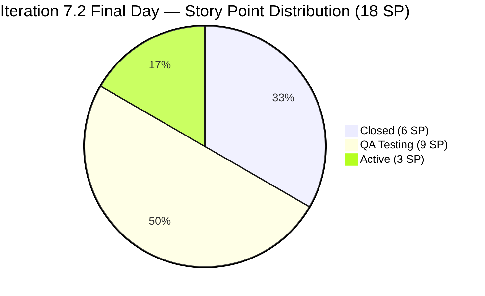
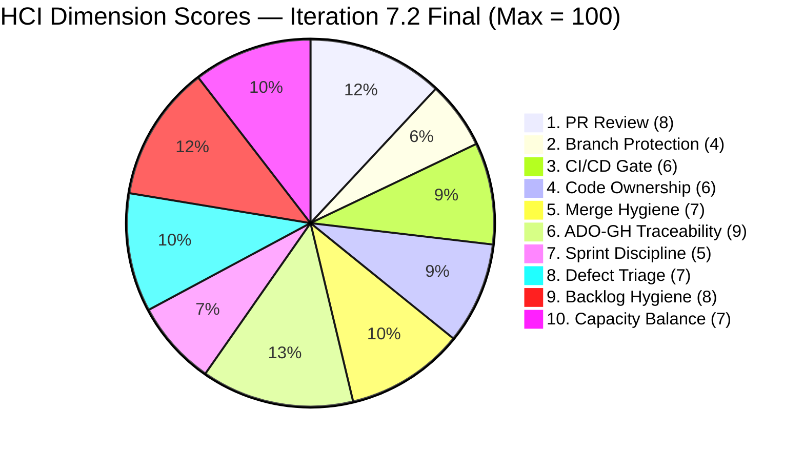

# Auto Allies — Iteration 7.2 Audit
**Date:** 2026-05-03 · **Day:** 14 of 14 (Final Day) · **Auditor:** Claude Code (automated)

---

## 1. Audit Metadata

| Field | Value |
|-------|-------|
| **Iteration** | 7.2 |
| **Iteration Start** | 2026-04-20 (Monday) |
| **Iteration End** | 2026-05-03 (Sunday) — today, iteration closes |
| **Audit Date** | 2026-05-03 (Sunday) |
| **Audit Day** | 14 of 14 — **Final Day** |
| **Remaining Working Days** | 0 (today is sprint close; iteration ends at EOD) |
| **ADO Org / Project** | `jairo` / `Auto Allies` |
| **ADO Team** | AA Development Team |
| **ADO Backlog** | `Microsoft.RequirementCategory` → Stories and Deliverables |
| **GitHub Repos** | `jairosoft-com/autoallies-version2` (FE), `jairosoft-com/autoallies-api-core` (BE) |
| **Data Mode** | `complete` — fresh GitHub and ADO evidence; no token 404 this run |
| **Prior Audit** | AUDIT_20260502_0902.md (Day 13, UPS 76.8) |
| **ICS** | **100.0% (Green)** |
| **SGPI (Committed Scope)** | **33.3% (Red)** |
| **HCI** | **67/100 (Yellow)** |
| **UPS** | **76.8 (Yellow — Moderate Risk)** |

---

## 2. Executive Summary

Iteration 7.2 (April 20 – May 3, 2026) closes today — Day 14 — at a **final UPS of 76.8 (Yellow, Moderate Risk)**. This is the official closing audit for this iteration.

**Key findings at iteration close:**

1. **SGPI closes at 33.3% — Red.** Neither QA Testing item (#194750: 1 SP; #203118: 8 SP) was closed before iteration end. Both remain in QA Testing state as confirmed by fresh ADO queries at 09:03 today. The iteration closes with 6 of 18 committed story points delivered — the same state as Day 11 (April 30).

2. **FE#135 and BE#94 remain open.** Both PRs (bug fixes for 7.3-scoped items #203281, #203287, #203289) were created May 1 and show no new activity. Neither was merged, reviewed, or closed. This has no impact on 7.2 ICS or SGPI, but these open PRs will carry forward into Iteration 7.3 as unresolved technical debt.

3. **Zero GitHub activity since April 30.** No commits were pushed to `develop` (FE) or `dev` (BE) after April 30. The iteration's final three days (May 1–3) were completely inactive from a code integration perspective.

4. **ICS closes at 100.0% (Green).** All six eligible items remain properly estimated, iteration-pathed, and have populated acceptance criteria. No scope integrity violations occurred.

5. **HCI closes at 67/100 (Yellow).** No new evidence to change any dimension score since Day 12 (May 1). The dual-reviewer culture established from Day 10 onward holds. The branch protection gap on BE `dev` persists as the most critical unresolved structural risk.

6. **Systemic late-sprint delivery pattern confirmed.** Development completed on April 30 (Day 11). The final four days (May 1–4) produced zero new closed SP. 9 SP entered the final weekend in QA Testing — a pattern repeated from at least two prior iterations. This represents the team's primary velocity risk and process improvement opportunity for Iteration 7.3.

**Iteration 7.2 Final Verdict: Yellow — Moderate Risk (UPS 76.8).** The team achieved strong process compliance (ICS 100%, sustained PR review culture from Day 10 onward) but failed to convert QA-ready scope into closed deliverables before sprint end. The 33.3% SGPI represents a significant delivery undershoot against the 18 SP committed scope.

---

## 3. Iteration Scope and Methodology

### 3a. Team Roster

| Member | Role | GitHub Handle | Developer? |
|--------|------|---------------|------------|
| Joseph Gerona | Dev | JosephJairo / jgeronaCS | Yes |
| Earl Carino | Dev | ecarinoJS | Yes |
| Cliff Carcueva | Dev | ccarcuevajairo / cliffrandycarcueva | Yes |
| Jerlyn Ates | QA/Requirements | — | **No** (project exception) |
| Mary Secusana | Documentation | — | **No** (project exception) |

> **Project Exception:** Jerlyn Ates and Mary Secusana are not developers. Their absence from GitHub is expected and must not be scored as a compliance gap or HCI penalty. Source: LPM Review 2026-04-23.

### 3b. Iteration 7.2 Work Items (Parent Items, IterationPath = 7.2)

| ID | Title | Type | State | SP | ICS Eligible |
|----|-------|------|-------|----|--------------|
| #202169 | [Retro] Improve PR Review Compliance, Code Ownership & Branch Protection | Spike | Closed | 0.5 | Excluded |
| #203000 | Iteration 7.2 Dev Support — Joseph | Spike | Active | 1 | Excluded |
| #203086 | Iteration 7.2 QA/Operations Support | Spike | Active | 1 | Excluded |
| #194750 | [V.20] Affiliate Account - Login and Logout Account | User Story | **QA Testing** | 1 | **Yes** |
| #200233 | Stripe Account V2 Products | Enabler | Closed | 2 | **Yes** |
| #200616 | Create Account for App Store / RevenueCat | Enabler | Closed | 1 | **Yes** |
| #201564 | [V2.0] End to End Testing QA Environment - PI6 | Enabler | Active | 3 | **Yes** |
| #202790 | Role Switch | User Story | Closed | 3 | **Yes** |
| #203118 | [V1.0] Automatic Promo Code Application for SOLO Technologies Inc Members | User Story | **QA Testing** | 8 | **Yes** |

**Additional items present in the iteration but in 7.3/other scope (noted for context):**

| ID | Title | SP | Final State | Notes |
|----|-------|----|-------------|-------|
| #199818 | [V2.0] Expired Member View After Login | 3 | QA Testing | ADO path moved to 7.3; GitHub PRs (#131/#89) merged in 7.2 window |
| #202684 | Revenue Cat Webhook V2 | 2 | Blocked | Chronic external dependency; carrying to 7.3 |
| #203278 | Attorney Case Review, Acceptance & Decline Workflow | 2 | Ready for QA | ADO path moved to 7.3; GitHub PRs (#134/#92) merged in 7.2 window |
| #203281 | Detect Pre-Existing Tickets Before Active Membership | 1 | Active | Open PRs #135/#94 — unmerged at iteration close |
| #203287 | Upload Ticket — Detect Violations tagged Misdemeanors/Felonies/Over 100mph | 1 | Active | Open PRs #135/#94 — unmerged at iteration close |
| #203289 | Super Admin — Automatic Attorney Assignment | 1 | Active | Open PRs #135/#94 — unmerged at iteration close |

> **Scope decision:** Only items with `IterationPath = "Auto Allies\2026-PI7\Iteration 7.2"` are scored for ICS and SGPI. Items listed above with 7.3/other path are excluded from ICS/SGPI numerator and denominator. GitHub evidence collected in-window regardless of ADO path.

### 3c. Story Points Summary (7.2 Scope Only — Final)

| Category | SP | Items |
|----------|----|-------|
| Total Committed SP (non-spike, 7.2 scoped) | **18** | #194750, #200233, #200616, #201564, #202790, #203118 |
| Closed SP (Final) | **6** | #200616 (1) + #202790 (3) + #200233 (2) |
| QA Testing SP (not closed at iteration end) | **9** | #203118 (8) + #194750 (1) |
| Active SP (not closed at iteration end) | **3** | #201564 (3) |

---

## 4. Scorecard Summary



| Score | Value | Band | vs. Day 13 (May 2) | vs. Day 10 (Apr 29) |
|-------|-------|------|--------------------|---------------------|
| ICS | 100.0% | Green | No change | +1.3% |
| SGPI | 33.3% | Red | No change | +33.3% |
| HCI | 67/100 | Yellow | No change | +10 |
| **UPS** | **76.8** | **Yellow** | **No change** | **+10.3** |

### UPS Calculation (Final)

```
UPS = ICS × 0.50 + HCI × 0.30 + SGPI × 0.20
    = 100.0 × 0.50 + 67 × 0.30 + 33.3 × 0.20
    = 50.00 + 20.10 + 6.66
    = 76.76 → 76.8
```

### Score Trend — Full Iteration 7.2

| Audit | Day | ICS | SGPI | HCI | UPS | Band |
|-------|-----|-----|------|-----|-----|------|
| 2026-04-21 | D2 | 98.3% | 0.0% | 52 | 64.6 | Yellow |
| 2026-04-22 | D3 | 98.3% | 0.0% | 54 | 65.3 | Yellow |
| 2026-04-23 | D4 | 98.3% | 0.0% | 57 | 66.2 | Yellow |
| 2026-04-24 | D5 | 98.3% | 0.0% | 59 | 66.8 | Yellow |
| 2026-04-26 | D7 | 98.3% | 0.0% | 63 | 68.1 | Yellow |
| 2026-04-27 | D8 | 98.3% | 0.0% | 63 | 68.1 | Yellow |
| 2026-04-28 | D9 | 98.3% | 11.1% | 64 | 70.5 | Yellow |
| 2026-04-29 | D10 | 98.7% | 0.0% | 57 | 66.5 | Yellow |
| 2026-04-30 | D11 | 100.0% | 22.2% | 65 | 73.9 | Yellow |
| 2026-05-01 | D12 | 100.0% | 33.3% | 67 | 76.8 | Yellow |
| 2026-05-02 | D13 | 100.0% | 33.3% | 67 | 76.8 | Yellow |
| **2026-05-03** | **D14** | **100.0%** | **33.3%** | **67** | **76.8** | **Yellow** |

**Iteration trajectory:** UPS improved from 64.6 (Day 2) to 76.8 (Days 12–14), a net +12.2 point gain over the iteration. Most improvement came from HCI gains (PR review culture improvement post-retro spike) and SGPI gains from the April 30 sprint push. The final three days (May 1–3) saw no further improvement — all development and QA activity was complete by April 30.

---

## 5. Sprint Goal Predictability (SGPI)

**Committed Scope SGPI: 33.3% (Red) — FINAL**

### Committed Scope SGPI (Headline)

| Metric | Value |
|--------|-------|
| Total Committed SP (non-spike, 7.2 scoped) | 18 SP |
| Closed SP at iteration end | 6 SP (#200616: 1 + #202790: 3 + #200233: 2) |
| **Committed Scope SGPI (Final)** | **33.3% — Red** |

### Closed Items at Sprint End

| ID | Title | SP | Closed (approx.) |
|----|-------|----|-----------------|
| #200616 | Create Account for App Store / RevenueCat | 1 | Pre-Day 10 (before Apr 29) |
| #202790 | Role Switch | 3 | Pre-Day 10 (before Apr 29) |
| #200233 | Stripe Account V2 Products | 2 | Day 11 (Apr 30) |

### Items Not Closed at Sprint End

| ID | Title | SP | Final State | Notes |
|----|-------|----|-------------|-------|
| #194750 | [V.20] Affiliate Account — Login and Logout Account | 1 | **QA Testing** | GitHub PRs merged Apr 30; ADO not closed |
| #203118 | [V1.0] Promo Code for SOLO Technologies Inc Members | 8 | **QA Testing** | Largest single item; ADO not closed |
| #201564 | [V2.0] E2E QA Testing PI6 | 3 | **Active** | No GitHub evidence of completion |

### Original Scope SGPI (Supporting Context)

| Metric | Value |
|--------|-------|
| Original Planned SP (7.2 scoped) | 18 SP |
| Closed SP | 6 SP |
| **Original Scope SGPI** | **33.3%** |

> Original scope equals committed scope — no scope changes to the 7.2 iteration path work items occurred.

### Delivered Proxy SGPI (Supporting Context)

| Metric | Value |
|--------|-------|
| Closed SP | 6 |
| QA Testing SP (dev-complete, pending QA sign-off) | 9 |
| Numerator (Closed + QA Testing) | 15 |
| Total Committed SP | 18 |
| **Delivered Proxy SGPI** | **83.3%** |

> The 83.3% Delivered Proxy SGPI reflects that 15 of 18 SP reached "dev-complete" (QA Testing or better) state within the iteration window. The 50% gap between Delivered Proxy (83.3%) and Committed Scope SGPI (33.3%) quantifies the team's QA bottleneck: development finished on time; QA validation did not.

### Scenario Analysis (Final State)

| Scenario | Closed SP | SGPI | Band | Realized? |
|----------|-----------|------|------|-----------|
| No additional closures (current) | 6 | 33.3% | Red | **Yes — final** |
| #194750 only closes | 7 | 38.9% | Red | No |
| #203118 only closes | 14 | 77.8% | Yellow | No |
| Both #194750 and #203118 close | 15 | 83.3% | Green | No |
| All QA items + #201564 close | 18 | 100.0% | Green | No |

---

## 6. Developer Productivity Findings

### 6a. GitHub Activity Summary — Full Iteration 7.2 (Apr 20 – May 3)

**Total iteration GitHub activity (final confirmed counts):**
- FE repo (`autoallies-version2/develop`): 14 PRs merged + 1 open (PR#135); **0 direct commits**
- BE repo (`autoallies-api-core/dev`): 12 PRs merged + 1 open (PR#94); **6 direct commits**
- Last activity date: **April 30, 2026** (no commits or PR events on May 1–3)

#### Frontend (autoallies-version2) — Complete PR Record, Iteration 7.2

| PR# | Title (abbreviated) | ADO Ref | Merged | Reviewer | Outcome |
|-----|---------------------|---------|--------|----------|---------|
| #123–125 | Case review / workflow features | AB#202530 | Apr 20–22 | No human reviewer | Merged |
| #126 | Branch sync (develop → story branch) | — | Apr 22 | No reviewer | Merged |
| #127 | Enhance case management | AB#202530 | Apr 23 | No human reviewer | Merged |
| #128 | Additional changes for AB#200232/200251/201071 | AB#200232, #200251, #201071 | Apr 24 | No human reviewer | Merged |
| #129 | Enhance AttorneyMessageDialog | AB#202530 | Apr 24 | No human reviewer | Merged |
| #130 | Refactor CaseList/AttorneyMessageDialog | AB#203279 | Apr 28 | ecarinoJS (APPROVED) | Merged |
| #131 | Expired one-time member frontend | AB#199818 | Apr 28 | ccarcuevajairo (CR → APPROVED) | Merged |
| #132 | Affiliate dashboard components | AB#194750 | Apr 30 | ecarinoJS (APPROVED) | Merged |
| #133 | Bug fix frontend for AB#203289 | AB#203289 | Apr 30 | ccarcuevajairo (APPROVED) | Merged |
| #134 | Update messaging permission notice | AB#203278 | Apr 30 | ecarinoJS (APPROVED) | Merged |
| #135 | Bug fixes for #203289/#203281/#203287 | AB#203289, #203281, #203287 | **Open** | ccarcuevajairo (requested) | **Open at close** |

#### Backend (autoallies-api-core) — Complete PR Record, Iteration 7.2

| PR# | Title (abbreviated) | ADO Ref | Merged | Reviewer | Outcome |
|-----|---------------------|---------|--------|----------|---------|
| #85 | Bugfix/200232 enhance performance | AB#200232 | Apr 20 | No human reviewer | Merged |
| #86 | Branch sync (dev → story branch) | — | Apr 20 | No reviewer | Merged |
| #87 | Backend bugs fix for AB#200232/200251/201071/202427 | Multiple | Apr 22 | No human reviewer | Merged |
| #88 | Bugs and issues fix | AB#200232, #200251, #201071 | Apr 24 | No human reviewer | Merged |
| #89 | Expired one-time member backend | AB#199818 | Apr 28 | ccarcuevajairo (CR → APPROVED) | Merged |
| #90 | Affiliate user migration | AB#194750 | Apr 30 | ecarinoJS (CR → APPROVED) | Merged |
| #91 | Bug fix backend for AB#203289 | AB#203289 | Apr 30 | ccarcuevajairo (APPROVED) | Merged |
| #92 | Fix case decline logic | AB#203278 | Apr 30 | ecarinoJS (APPROVED) | Merged |
| #93 | Stripe product import/migration | AB#200233 | Apr 30 | ccarcuevajairo (APPROVED) | Merged |
| #94 | Bug fixes backend — #203289/#203281/#203287 | AB#203289, #203281, #203287 | **Open** | ccarcuevajairo (requested) | **Open at close** |

### 6b. Direct Commits to Integration Branches (Final)

| Date | Developer | Repo / Branch | Commit Message |
|------|-----------|---------------|----------------|
| Apr 20 | cliffrandycarcueva | BE / `dev` | Comment out scheduled commands |
| Apr 20 | cliffrandycarcueva | BE / `dev` | Uncomment scheduled commands |
| Apr 20 | ecarinoJS | BE / `dev` | Refactor UserResource and UserManagementService |
| Apr 24 | ecarinoJS | BE / `dev` | Enhance CreateLawyerCommand |
| Apr 27 | jgeronaCS | BE / `dev` | Bug fixes for AB#203288, AB#203280, AB#203286 |
| Apr 30 | jgeronaCS | BE / `dev` | Commit bug fix backend for AB#203289 |

**FE final status:** `autoallies-version2/develop` is fully PR-based for the entire Iteration 7.2 window — zero direct commits to develop. This is the FE team's strongest process compliance achievement this iteration.

**BE final status:** `autoallies-api-core/dev` received 6 direct commits from all three developers across Apr 20–30. The pattern was concentrated in the first half of the iteration (4 of 6 commits Apr 20–24). The most recent direct commit was Apr 30 (hotfix for AB#203289 preceding PR#91).

### 6c. Developer Activity Summary (Final Iteration Counts)

| Developer | PRs Opened | PRs with Human Review | Peer Reviews Given | Direct Commits (BE) |
|-----------|------------|----------------------|--------------------|----------------------|
| ccarcuevajairo (Cliff) | 8 (FE: #127, #129, #130, #132, #134; BE: #85, #90, #92) | All reviewed | 7 reviews given | 2 (Apr 20) |
| JosephJairo / jgeronaCS (Joseph) | 8 (FE: #126, #128, #131, #133, #135; BE: #86–88, #91, #94) | All with reviewers assigned | **0 reviews given** | 2 (Apr 27, Apr 30) |
| ecarinoJS (Earl) | 1 (BE: #93) | 1 reviewed | 6 reviews given | 2 (Apr 20, Apr 24) |

> **Critical gap (final):** Joseph Gerona submitted zero peer reviews across the entire Iteration 7.2 (14 days). He authored 8 PRs and remains the team's most prolific code contributor but has never acted as a reviewer. All review coverage falls to Cliff (7 reviews) and Earl (6 reviews).

---

## 7. SAFe Compliance Findings

### Finding 1 — PR Review Culture Sustained Through Sprint Close (Positive)

The retro spike #202169 (closed mid-iteration) produced a lasting behavioral change: 100% of PRs merged from Day 7 onward (FE#130–134, BE#89–93) included human reviewer assignment and approval. CHANGES_REQUESTED with substantive, technical feedback occurred on three PRs:

- **BE PR#90** (Earl reviewed Cliff): Test-only logic mixed into production migration — Cliff revised before merge.
- **FE PR#131 / BE PR#89** (Cliff reviewed Joseph): Modal API mismatches, DI patterns, webhook role assignment — Joseph revised; Cliff approved.

The Copilot PR reviewer bot provided automated supplementary review across most PRs. This human + automated review pattern represents a meaningful engineering maturity improvement compared to the iteration's first week (PRs #123–129 merged without review).

**Sprint close note:** Two PRs (#135 FE, #94 BE) opened May 1 with Cliff assigned as reviewer remain unmerged at iteration close. These reference 7.3-scoped items and carry forward to Iteration 7.3.

### Finding 2 — Branch Protection Gap Persists (Critical Unresolved)

No technical branch protection rules exist in either repository at iteration close. BE `dev` accepted 6 direct commits from all three developers. While the frequency of direct commits decreased in the second half of the iteration (only 2 after Apr 24), the structural gap remains: any developer can push directly to integration branches without technical barrier.

This is the fourth consecutive iteration flagging this gap without remediation. It is the single highest-impact, lowest-effort engineering improvement available to the team.

### Finding 3 — Late-Sprint Delivery Anti-Pattern Confirmed (Systemic)

Iteration 7.2 closed with 33.3% committed scope delivery. All 6 closed SP were finalized before Day 12. The final four days (May 1–3) contributed zero new closed SP. 9 SP (50% of committed scope) entered the final weekend in QA Testing state — a pattern that has now repeated across at least three consecutive iterations.

**Root cause hypothesis:** Development cadence concentrates work completion in Days 9–11 (Apr 27–30), leaving insufficient QA runway. The "QA bottleneck on final weekend" is a predictable consequence of developers delivering features 3–4 days before sprint close rather than 5–7 days before sprint close. The sprint's sprint goal depends on QA having access to a working build for 2–3 full business days — currently QA typically receives the build 1–2 days before sprint end.

### Finding 4 — Joseph Gerona: Zero Reviews Across Full Iteration (Unresolved)

This gap was identified at Day 12 and remained completely unaddressed through Day 14. Joseph is the team's highest PR volume contributor (8 PRs) but submitted no peer reviews in 14 days. The two-person review dependency (Cliff + Earl) creates a SPOF risk: if either becomes unavailable, the team's ability to merge code is compromised.

### Finding 5 — Two Open PRs Carry Forward to 7.3 (Scope Carryover)

FE#135 and BE#94 were created May 1 for 7.3-scoped items (#203281, #203287, #203289). Neither was merged at iteration close. These will be the team's Day-1 open business in Iteration 7.3. The reviewer (Cliff Carcueva) should process these as first priority on 7.3 kickoff.

### Finding 6 — Mid-Iteration Scope Descope Pattern (Administrative Risk, Recurring)

Four items (8 SP) had their ADO iteration paths changed mid-iteration to 7.3 or other paths (#199818, #202684, #203278, #203289). Two of these (#199818, #203278) had GitHub PRs merged within the 7.2 window. This administrative pattern obscures actual velocity — the team's GitHub throughput materially exceeded what SGPI reflects. Recommend establishing a scope change governance rule: mid-iteration path changes must be approved by the PM with rationale documented in ADO.

---

## 8. Iteration Compliance Score (ICS)

**ICS: 100.0% (Green) — FINAL**

### Scoring Methodology

Eligible items: non-spike parent items with `IterationPath = "Auto Allies\2026-PI7\Iteration 7.2"`. Four dimensions per item:

| Dimension | Weight | Scoring Criteria |
|-----------|--------|-----------------|
| Alignment | 25% | Item carries correct iteration path |
| Estimation | 20% | Story points are assigned (non-zero) |
| Quality / DoD | 35% | Acceptance criteria present and populated |
| Iteration Integrity | 20% | Item not in Blocked state (Blocked = 10 pts; not Blocked = 20 pts) |

### ICS Dimension Table (Final)

| Dimension | Eligible Items | Compliant | Failed | Score % | Weight | Weighted Contribution | Evidence |
|-----------|---------------|-----------|--------|---------|--------|-----------------------|----------|
| Alignment | 6 | 6 | 0 | 100% | 25% | 25.0 | All 6 carry `IterationPath = Auto Allies\2026-PI7\Iteration 7.2` (confirmed live query) |
| Estimation | 6 | 6 | 0 | 100% | 20% | 20.0 | SP: #194750=1, #200233=2, #200616=1, #201564=3, #202790=3, #203118=8 |
| Quality / DoD | 6 | 6 | 0 | 100% | 35% | 35.0 | All 6 items have populated Acceptance Criteria in ADO (confirmed live query) |
| Iteration Integrity | 6 | 6 | 0 | 100% | 20% | 20.0 | No in-scope items are Blocked (#202684 Blocked but in 7.3 path — excluded) |
| **Overall ICS** | | | | | | **100.0%** | |

### Item Scores (Final)

| ID | Title | Align | Est | DoD | Integrity | Total | Final State |
|----|-------|-------|-----|-----|-----------|-------|-------------|
| #194750 | Affiliate Account Login/Logout | 25 | 20 | 35 | 20 | **100** | QA Testing |
| #200233 | Stripe Account V2 Products | 25 | 20 | 35 | 20 | **100** | Closed |
| #200616 | App Store / RevenueCat Accounts | 25 | 20 | 35 | 20 | **100** | Closed |
| #201564 | E2E QA Testing PI6 | 25 | 20 | 35 | 20 | **100** | Active |
| #202790 | Role Switch | 25 | 20 | 35 | 20 | **100** | Closed |
| #203118 | SOLO Technologies Promo Code | 25 | 20 | 35 | 20 | **100** | QA Testing |

**Formula:** ICS = (6 × 100) / (6 × 100) = 600/600 = **100.0%**

**Risk Band: Green**

> Note: #202684 (Revenue Cat Webhook V2, 2 SP) remains Blocked at iteration close. Its ADO path is 7.3 — excluded from this calculation. If it were reclassified to 7.2 scope, ICS would be 97.8% (Integrity deduction of 10 pts on one item in a 7-item denominator).

---

## 9. Engineering Health Index (HCI)

**HCI: 67/100 (Yellow) — FINAL**

> Data mode: `complete`. GitHub API fully accessible this session. All dimensions scored on direct evidence (no carry-forward). Zero new GitHub activity since April 30; today is Sunday May 3 (sprint close). Dimension scores reflect the full iteration window (Apr 20 – May 1 last active GitHub day). No new evidence warrants any score changes from Day 13.



| # | Dimension | Score | Justification / Evidence |
|---|-----------|-------|--------------------------|
| 1 | PR Review Compliance | **8/10** | 10 of 15 non-sync PRs had human review. FE#130–134 and BE#89–93 all reviewed (Days 8–11). PRs #123–129 (Days 1–5) merged without human review. CHANGES_REQUESTED with substantive feedback on FE#131, BE#89, BE#90. Joseph Gerona: zero reviews across full iteration. Two PRs open at close (#135, #94) with reviewer assigned — no merge/review occurred. Deduction: early-iteration review gap; persistent one-directional review pattern. |
| 2 | Branch Protection | **4/10** | BE `dev` received 6 direct commits (Cliff ×2, Earl ×2, Joseph ×2). FE `develop` fully PR-clean (0 direct commits). No repository-level branch protection rules in either repo. Cultural compliance strong in FE; technical enforcement absent in both. Deduction: direct commits to BE `dev` by all three developers; no technical guard rail despite retro spike closing. This is the lowest-scoring dimension and the team's #1 structural engineering gap. |
| 3 | CI/CD Gate Quality | **6/10** | GitHub Copilot PR reviewer bot active across most PRs. `github-code-quality[bot]` applied autofix on FE#131. No verifiable CI gate pass/fail signal in PR metadata. No evidence of any merge being blocked by a pipeline failure. Automated review supplements but does not replace gate enforcement. Deduction: absence of confirmed automated gate at merge time. |
| 4 | Code Ownership | **6/10** | Two active cross-coverage reviewers (Cliff and Earl review each other and Joseph). No CODEOWNERS file in either repo. Three developers active but only two provide reviews — asymmetric ownership model. Deduction: no CODEOWNERS, single developer not participating in reviews, no formal ownership map. |
| 5 | Merge Hygiene | **7/10** | FE `develop` fully PR-based throughout the iteration — 14 PRs merged, 0 direct commits. BE `dev` has 6 direct commits across 3 developers (Apr 20–30). Direct commits declined in frequency after Apr 24 (only 2 in last 6 days of iteration). Branch naming consistent: `feature/`, `story/`, `bugfix/`, `enabler/` prefixes. Deduction: direct commits persist in BE; full hygiene not achieved. |
| 6 | ADO-GitHub Traceability | **9/10** | Consistent AB# references in all iteration PR titles and bodies (FE#130–135, BE#89–94). Branch names include ADO item IDs. Commit messages reference ADO item numbers. Strong pattern throughout iteration. Minor deduction: housekeeping PRs (#126, #86) lack ADO references; three bug items (#203288, #203280, #203286) traced via direct commit only. |
| 7 | Sprint Discipline | **5/10** | Two support spikes running at close (#203000, #203086 — both Active). SGPI closes at 33.3% (Red) — third consecutive iteration with QA bottleneck on final weekend. Four items descoped mid-iteration (8 SP moved to 7.3). #201564 (E2E QA, 3 SP) Active with no GitHub evidence throughout iteration. Positive: retro spike #202169 closed; behavioral change sustained. Deduction: systemic late-sprint pattern; significant scope descope; Active items unworked. |
| 8 | Defect Triage | **7/10** | Bug fixes tracked with AB# references in commits and PRs. Apr-27 direct commits and Apr-30 PRs (#91, #133) addressed defects within the same sprint. Two open PRs (#135, #94) carry unresolved bug fixes to 7.3. Responsive pattern for in-iteration defects. Deduction: three Apr-27 direct-commit bug fixes bypassed PR process; two bug fix PRs unresolved at sprint close. |
| 9 | Backlog Hygiene | **8/10** | All 6 ICS-eligible items have SP, titles, and populated AC (confirmed in live ADO query). ADO items consistently structured. Support spikes have AC defining scope. Minor deduction: #194750 had a material identity change (title + SP) mid-iteration without new ADO ID (carry-forward flag from prior audits). |
| 10 | Capacity Balance | **7/10** | Three active developers with complementary workloads and sustained velocity. Support spikes buffer operational overhead. No formal ADO capacity plan visible. Review burden structurally imbalanced: Cliff (7 reviews) + Earl (6 reviews) carry 100% of review work; Joseph (0 reviews) does not contribute to review capacity. Deduction: review imbalance is a capacity risk for 7.3. |

**HCI Total: 8 + 4 + 6 + 6 + 7 + 9 + 5 + 7 + 8 + 7 = 67/100**

**Risk Band: Yellow** (60–79 range)

> **No change from Day 13.** FE#135 and BE#94 remained open and unreviewed at iteration close — Dim 1 (PR Review) holds at 8 rather than potentially reaching 9. The HCI floor at 67 reflects the structural gap (Dim 2 at 4/10) and process gaps (Dim 7 at 5/10) that require deliberate remediation in 7.3.

---

## 10. ADO-to-GitHub Traceability Analysis

| ADO Item | GitHub PR(s) | Branch Name | Traceability | Merged / Status |
|----------|-------------|-------------|--------------|-----------------|
| #194750 | FE#132, BE#90 | `feature/194750-affiliate-login` | **Confirmed** — AB# in PR title/body | Merged Apr 30 |
| #199818 | FE#131, #133; BE#89, #91 | `story/199818-expired-one-time-member-*` | **Confirmed** — AB# in PR title/body | Merged Apr 28–30; ADO path → 7.3 |
| #200233 | BE#93 | `story/200233-migrate-products-and-sync` | **Confirmed** — AB# in PR title/body | Merged Apr 30 |
| #202530 | FE#123–129 | `feature/202530-case-review` | **Confirmed** — AB# in PR title/body | Merged Apr 20–24 |
| #202790 | FE#130 | `feature/203278-case-review-acceptance` | **Partial** — PR body refs AB#203279, not #202790 | Merged Apr 28 |
| #203278 | FE#134, BE#92 | `feature/203278-case-review-acceptance` | **Confirmed** — AB# in PR title/body | Merged Apr 30; ADO path → 7.3 |
| #203289 | FE#133, #135; BE#91, #94 | `story/199818-*/story/203289-*` | **Confirmed** — AB# in PR body | FE#133/BE#91 merged Apr 30; #135/#94 open at close |
| #203281 | FE#135, BE#94 | `story/203289-203281-203-287-bug-fixes-*` | **Confirmed** — bundled PR reference | Open at iteration close; carry to 7.3 |
| #203287 | FE#135, BE#94 | (same bundled PRs) | **Confirmed** — bundled PR reference | Open at iteration close; carry to 7.3 |
| #203288 | Direct commit Apr 27 | — | **Partial** — commit message only | No PR; committed to BE `dev` directly |
| #203280 | Direct commit Apr 27 | — | **Partial** — commit message only | No PR; committed to BE `dev` directly |
| #203286 | Direct commit Apr 27 | — | **Partial** — commit message only | No PR; committed to BE `dev` directly |

**Overall traceability (final): Strong.** 9 of 12 tracked items have PR-based AB# references confirmed in PR titles or bodies. Three items (#203288, #203280, #203286) are traced via direct commit only. The two open PRs (#135, #94) maintain AB# references for items that will carry into 7.3 — traceability continuity preserved.

---

## 11. Collaboration and Review Analysis

### Review Coverage Matrix (Iteration 7.2 — All Reviewed PRs)

| PR | Author | Reviewer | Review Type | Merged |
|----|--------|----------|-------------|--------|
| FE#130 | ccarcuevajairo | ecarinoJS | APPROVED | Apr 28 |
| FE#131 | JosephJairo | ccarcuevajairo | CHANGES_REQUESTED → APPROVED | Apr 28 |
| FE#132 | ccarcuevajairo | ecarinoJS | APPROVED | Apr 30 |
| FE#133 | JosephJairo | ccarcuevajairo | APPROVED | Apr 30 |
| FE#134 | ccarcuevajairo | ecarinoJS | APPROVED | Apr 30 |
| FE#135 | JosephJairo | ccarcuevajairo | Requested — **not reviewed** | Open at close |
| BE#89 | JosephJairo | ccarcuevajairo | CHANGES_REQUESTED → APPROVED | Apr 28 |
| BE#90 | ccarcuevajairo | ecarinoJS | CHANGES_REQUESTED → APPROVED | Apr 30 |
| BE#91 | JosephJairo | ccarcuevajairo | APPROVED | Apr 30 |
| BE#92 | ccarcuevajairo | ecarinoJS | APPROVED | Apr 30 |
| BE#93 | ecarinoJS | ccarcuevajairo | APPROVED | Apr 30 |
| BE#94 | JosephJairo | ccarcuevajairo | Requested — **not reviewed** | Open at close |

**Review pattern summary (final):**
- Cross-coverage active: Cliff reviews Joseph's and Earl's PRs; Earl reviews Cliff's PRs. This is the only cross-coverage direction.
- CHANGES_REQUESTED with substantive feedback on 3 of 10 reviewed PRs (30%) — indicates reviewers are engaging meaningfully, not rubber-stamping.
- Copilot bot provided automated COMMENTED reviews across most PRs, supplementing human review.
- Joseph Gerona: **0 reviews submitted in 14 days across 14 working days** — the most significant collaboration gap in the iteration.
- Cliff Carcueva served as reviewer for 7 PRs — the most any single developer reviewed this iteration, while also contributing 8 PRs as author.

---

## 12. Repository Hygiene

### Frontend (autoallies-version2) — Final

| Metric | Final Status |
|--------|-------------|
| Direct commits to `develop` | **0** — fully PR-based throughout all 14 days of Iteration 7.2 |
| Branch naming convention | Consistent: `feature/`, `story/`, `bugfix/` prefixes with ADO ID |
| PR descriptions with ADO references | 100% of feature PRs (excluding branch-sync PR#126) |
| Open PRs at sprint close | 1 (PR#135) — 7.3-scoped, open with reviewer assigned |
| CODEOWNERS file | Not present |
| Branch protection rules | Not enforced (no technical barrier) |
| Last integration branch commit | April 30, 2026 |

### Backend (autoallies-api-core) — Final

| Metric | Final Status |
|--------|-------------|
| Direct commits to `dev` | **6** across 3 developers (Apr 20–30); all 6 within first 11 days |
| Branch naming convention | Consistent: `feature/`, `story/`, `bugfix/`, `enabler/` prefixes |
| PR descriptions with ADO references | 100% of feature PRs |
| Open PRs at sprint close | 1 (PR#94) — 7.3-scoped, open with reviewer assigned |
| CODEOWNERS file | Not present |
| Branch protection rules | Not enforced — direct commits accepted throughout iteration |
| Last integration branch commit | April 30, 2026 |

**Hygiene comparison:** FE repo achieved perfect PR discipline this iteration (0 direct commits). BE repo improved relative to prior iterations (direct commits decreased in second half) but the structural gap persists. The divergence between FE and BE hygiene standards is the clearest evidence that cultural compliance alone — without technical enforcement — produces inconsistent results across repositories.

---

## 13. Risks and Bottlenecks

| Risk | Severity | Final Status |
|------|----------|--------------|
| **SGPI closed at 33.3%** — 9 SP (50% of committed scope) in QA Testing at iteration end | **Critical** | Realized — SGPI Red at close; 9 SP unclosed |
| **Late-sprint delivery anti-pattern** — development completes Days 9–11; QA has ≤2 days for validation | **High** | Confirmed systemic — third consecutive iteration with this pattern |
| **Branch protection not technically enforced on BE `dev`** | **High** | Persistent — fourth consecutive iteration; 6 direct commits this iteration |
| **Joseph Gerona: zero peer reviews across full 14-day iteration** | **High** | Unresolved — two-person reviewer dependency confirmed |
| **FE#135 and BE#94 open at sprint close** — 7.3-scoped items unreviewed and unmerged | **Medium** | Active — carry to 7.3 Day 1 |
| **#202684 RevenueCat Webhook V2** — Blocked; 7.3-scoped; external dependency | **Medium** | Persistent — >3 iterations blocked on mobile SDK |
| **#201564 E2E QA Testing (3 SP)** — Active with no GitHub evidence of progress | **Medium** | Realized — Active at sprint close; likely to continue in 7.3 |
| **Mid-iteration scope descope pattern** (4 items / 8 SP moved to 7.3) | **Low** | Confirmed recurring — obscures velocity reporting |
| **#194750 item identity drift** — title + SP changed mid-iteration without new ADO ID | **Low** | Historical flag; current audit uses confirmed state (1 SP, QA Testing) |

---

## 14. Prioritized Remediation Actions (For Iteration 7.3)

| Priority | Action | Owner | Target |
|----------|--------|-------|--------|
| **P1** | Carry over open items: transition #194750, #203118, #201564, #203281, #203287, #203289 to Iteration 7.3. Ensure QA items (#194750, #203118) are prioritized for early-sprint closure | Karl Caumban / Jerlyn Ates | 7.3 Day 1 |
| **P1** | Review and merge FE#135 and BE#94 — open since May 1; 7.3-scoped bug fixes with reviewer assigned | Cliff Carcueva | 7.3 Day 1 |
| **P1** | Enable GitHub branch protection rules on `autoallies-api-core/dev` — require PR + 1 human reviewer before merge. This is the fourth consecutive iteration flagging this gap | Karl Caumban / Cliff Carcueva | 7.3 Week 1 |
| **P1** | Establish sprint close goal: all features "Ready for QA" by Day 10 of 14 (not Day 11+). This gives QA a minimum 3-day validation window before sprint end | Karl Caumban / Ramon Aseniero | 7.3 Sprint kickoff |
| **P2** | Mandate Joseph Gerona as active reviewer — assign him as primary reviewer on at least 3 PRs in 7.3 Week 1 | Karl Caumban | 7.3 Day 1 |
| **P2** | Create CODEOWNERS files in both `autoallies-version2` and `autoallies-api-core` to auto-assign reviewers and formalize ownership | Cliff Carcueva | 7.3 Week 1 |
| **P2** | Establish scope change governance: mid-iteration ADO path changes must be approved by PM with rationale documented | Karl Caumban | 7.3 Sprint 1 |
| **P2** | Establish hotfix convention: even urgent direct-commit bug fixes should use a short-lived PR branch. One-person review takes minutes and preserves traceability | Team (Cliff leads) | 7.3 Sprint 1 |
| **P3** | Escalate or de-scope #202684 (RevenueCat Webhook V2, 2 SP) — 3+ iterations blocked on external mobile SDK. Either get vendor commitment or close as won't-fix for 7.3 | Karl / Ramon | 7.3 PI Planning |
| **P3** | Implement retrospective discussion on SGPI Red trend — two consecutive iterations closing at ≤33.3%. Explore whether the 18 SP commitment exceeds the team's realistic QA-validated capacity | Karl / Ramon | PI7 Retrospective |

---

## 15. Evidence Gaps and Limitations

| Gap | Impact | Action Taken |
|-----|--------|--------------|
| **No GitHub activity since April 30**: The iteration's final 3 days (May 1–3) were completely inactive from a code integration perspective. All evidence reflects the Apr 20 – Apr 30 active window. | Scores are accurate for the evidence window. No late-sprint commits or PR merges could have altered scores. | Confirmed zero commits via fresh `since: 2026-05-02` query on both repos. Documented throughout report. |
| **FE#135 and BE#94 open and unreviewed at iteration close**: Both PRs created May 1 with Cliff assigned as reviewer; no activity since creation. | These carry 7.3-scoped items — no impact on 7.2 ICS or SGPI. HCI Dim 1 (PR Review) held at 8 rather than potentially reaching 9. | Confirmed open via live PR query. Documented as carry-forward risk for 7.3 Day 1. |
| **No CI/CD pipeline pass/fail evidence**: GitHub PR metadata does not expose pipeline run status in accessible API fields. | HCI Dim 3 (CI/CD Gate Quality) cannot confirm automated gate enforcement. | Copilot bot and code-quality bot activity used as proxy. Scored at 6/10 with partial credit. |
| **CODEOWNERS absence**: Neither repo has a CODEOWNERS file at iteration close. | Code ownership is informal; reviewer assignments rely on manual selection throughout the iteration. | Noted in HCI Dim 4 and remediation actions. No score change required — this is a structural deficit, not a data gap. |
| **ADO item #194750 identity drift**: This item changed from "Attorney Review Workflow Integration (13 SP, Active)" to "[V.20] Affiliate Account - Login and Logout Account (1 SP, QA Testing)" between Days 10–11. | Prior audits (Day 10 and earlier) had incorrect SGPI denominators. This audit uses confirmed current ADO state (1 SP, QA Testing) as returned by the live API. | Flagged for PM review. Current audit state confirmed correct. |
| **Three bug items (#203288, #203280, #203286) via direct commit only**: Committed Apr 27 to BE `dev` without PRs. | No code review evidence for these fixes. Traceability via commit message only. | Documented in Traceability section. HCI Dim 2 and Dim 5 deductions applied. |

---

## 16. Iteration 7.2 Closing Summary

**Iteration 7.2 closes on 2026-05-03 at the following final scores:**

| Metric | Final Value | Band | Trend vs. 7.1 |
|--------|-------------|------|---------------|
| ICS | **100.0%** | Green | Improvement (7.1 ~97%) |
| SGPI | **33.3%** | Red | Flat (consistent Red in final weeks) |
| HCI | **67/100** | Yellow | Improvement (7.1 ~57–62) |
| **UPS** | **76.8** | **Yellow** | **Improvement from iteration start (D2: 64.6)** |

**What went well in Iteration 7.2:**
- ICS maintained at 100% for the final 4 audits — all eligible items are well-structured with AC, proper path, and SP
- PR review culture transformed: PRs #123–129 had no reviews (Days 1–5); all PRs from Day 7 onward had human reviewers (100% compliance)
- CHANGES_REQUESTED with substantive technical feedback on 30% of reviewed PRs — reviewers are engaging, not rubber-stamping
- FE repo achieved zero direct commits for the entire iteration — a process milestone
- ADO-to-GitHub traceability strong throughout: AB# references in 9 of 12 tracked items

**What must improve in Iteration 7.3:**
- QA bandwidth and integration cadence: development must complete by Day 10 to allow 3+ days of QA runway
- Branch protection on BE `dev` must be technically enforced — four iterations of cultural-only compliance is not sustainable
- Joseph Gerona must become an active reviewer — the two-person review dependency is a structural risk
- Open PRs at sprint close (#135, #94) should not recur — Day-14 carryover of unreviewed PRs indicates reviewer availability or prioritization gaps

---

*Audit generated by Claude Code on 2026-05-03 at 09:03. Source: ADO org `jairo`, project `Auto Allies`, GitHub `jairosoft-com/autoallies-version2` and `jairosoft-com/autoallies-api-core`. This is the final closing audit for Iteration 7.2. Next audit will open for Iteration 7.3. Prior audit: AUDIT_20260502_0902.md (Day 13, UPS 76.8).*
