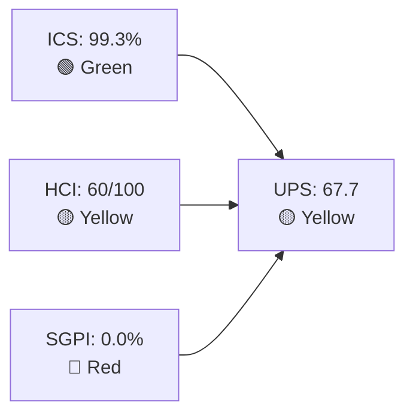

# Auto Allies — Iteration 7.3 Audit
**Date:** 2026-05-04 · **Day:** 1 of 10 · **Auditor:** Claude Code (automated)

---

## 1. Audit Metadata

| Field | Value |
|-------|-------|
| **Project** | Auto Allies |
| **Team** | AA Development Team |
| **Iteration** | Iteration 7.3 |
| **Iteration Start** | 2026-05-04 (Monday) |
| **Iteration End** | 2026-05-17 (Sunday) |
| **Audit Date** | 2026-05-04 |
| **Audit Time** | 09:00 |
| **Day of Iteration** | 1 of 10 working days |
| **ADO Org** | jairo |
| **ADO Project** | Auto Allies (2d7af571-6ef6-4ad0-a509-c440e008b0fb) |
| **ADO Team** | AA Development Team (330e6bf1-3515-443c-a2d8-b84f46c38f57) |
| **GitHub Repos** | autoallies-version2 (FE), autoallies-api-core (BE) |
| **Data Mode** | `partial` — see frontmatter |
| **Prior Audit** | AUDIT_20260429_0242.md (7.2 Day 10: ICS=98.7, SGPI=0.0, HCI=57, UPS=66.5, Yellow) |

---

## 2. Executive Summary

Iteration 7.3 (May 4–17, 2026) opens today with **UPS 67.7 — Yellow (Moderate Risk)**. This is the first day of the iteration; the score reflects the planning posture rather than delivery progress.

**Green signals:**
- ICS is **99.3%** — the highest score recorded for this team. All 14 eligible items have story points, acceptance criteria, and correct iteration assignment. Only one item (Revenue Cat Webhook V2, #202684) remains blocked, contributing the sole compliance gap.
- ADO-to-GitHub traceability is excellent: PRs #135 (FE) and #94 (BE) merged this morning, both precisely referencing AB#203289, AB#203281, and AB#203287 — a clean handoff closing 7.2 work in the first hours of 7.3.
- HCI reached **60/100**, crossing the Critical threshold for the first time in PI7. This reflects sustained PR review hygiene from the retro spike (#202169) that closed in 7.2, improved backlog hygiene (detailed AC + mockups on new mobile app stories), and no Day-1 direct commits observed.
- Backlog for 7.3 is well-formed: 14 eligible items across web and mobile, all estimated and AC-complete.

**Red signals:**
- **SGPI 0.0%** — no items are Closed on Day 1. This is structurally expected for an iteration opening, but four items (199818, 203278, 203281, 203287) are already in QA Testing (carried from 7.2), representing 7 SP that could close early in the sprint.
- **Revenue Cat Webhook V2 (#202684)** is Blocked. This has been a recurring dependency issue across PI7.
- Branch protection enforcement remains absent despite intent documented in the closed retro spike. No CODEOWNERS file confirmed.
- Earl Carino carries a heavy Ready-for-Dev workload (5 mobile-app stories, 10 SP) with no GitHub activity yet in 7.3.

**Trend vs. 7.2 Close:**
- ICS: 98.7 → 99.3 (+0.6, Green stable)
- SGPI: 0.0 → 0.0 (no change; Day 1 baseline)
- HCI: 57 → 60 (+3, exits Critical band)
- UPS: 66.5 → 67.7 (+1.2, Yellow stable)

---

## 3. Iteration Scope and Methodology

### 3a. Iteration Window

| Field | Value |
|-------|-------|
| **Iteration Name** | Iteration 7.3 |
| **PI** | 2026-PI7 |
| **Start** | 2026-05-04 (Monday) |
| **End** | 2026-05-17 (Sunday) |
| **Working Days** | 10 (Mon–Fri, May 4–8 and May 11–15; May 16–17 weekend excluded) |
| **Audit Day** | 1 — opening day |

### 3b. Methodology

1. ADO iteration queried via `work_list_team_iterations` (timeframe: current) → confirmed Iteration 7.3.
2. All work item relations fetched via `wit_get_work_items_for_iteration`.
3. Parent items only (rel: null) identified; child tasks and Spikes explicitly excluded from ICS/SGPI per skill rules.
4. Item details fetched in batch: type, state, story points, acceptance criteria, iteration path, assignee.
5. GitHub PRs fetched from both repos (all states, sorted by updated desc, last 30 per repo).
6. GitHub commits fetched since 2026-05-04 for both repos.
7. Prior audit (AUDIT_20260429_0242.md) reviewed for trend baseline and HCI carry-forward.
8. Scores computed: ICS (14-dimension-weighted rubric), SGPI (committed scope), HCI (10 dimensions).

### 3c. ICS Scope Rules Applied

- **Eligible:** User Stories + Enablers in Iteration 7.3 with `rel: null` (parent/root items)
- **Excluded from ICS/SGPI:** Spikes (#202785, #203610, #203611)
- **Excluded from scope:** Item #203634 (Iteration path = 7.4, not 7.3 — parent is out-of-iteration even though a child task appears)
- **Eligible items count:** 14

### 3d. Team Roster

| Member | Role | GitHub Handle | Developer? |
|--------|------|---------------|------------|
| Joseph Gerona | Dev | JosephJairo | Yes |
| Earl Carino | Dev | ecarinoJS | Yes |
| Cliff Carcueva | Dev | ccarcuevajairo | Yes |
| Jerlyn Ates | QA/Requirements | — | No (exempt per project exception) |
| Mary Secusana | Documentation | — | No (exempt per project exception) |

> Project Exception: Jerlyn Ates and Mary Secusana are not developers. No GitHub commits, PRs, or reviews are expected from them. Their absence does not constitute an HCI gap. Source: LPM Review 2026-04-23.

---

## 4. Scorecard Summary



| Metric | Score | Band | Trend vs. 7.2 |
|--------|-------|------|----------------|
| **ICS** | 99.3% | Green (≥90) | ▲ +0.6 |
| **SGPI** | 0.0% | Red | — (Day 1 baseline) |
| **HCI** | 60/100 | Yellow | ▲ +3 |
| **UPS** | 67.7 | Yellow | ▲ +1.2 |

**UPS formula:** ICS × 0.50 + HCI × 0.30 + SGPI × 0.20  
= 99.3 × 0.50 + 60 × 0.30 + 0.0 × 0.20  
= 49.65 + 18.00 + 0.00  
= **67.7**

---

## 5. Sprint Goal Predictability (SGPI)

**SGPI: 0.0% (Red) — Day 1 baseline**

### 5a. Committed Scope SGPI

| Metric | Value |
|--------|-------|
| Total Committed SP (eligible items, non-spike) | 32 SP |
| Closed SP | 0 SP |
| **Committed Scope SGPI** | **0.0%** |

> This is structurally expected on Day 1 of a new iteration. No items were expected to close on the opening day.

### 5b. Near-Delivery Context (Supporting)

Four items entered 7.3 already in QA Testing — likely carried forward from 7.2 late-sprint testing:

| ID | Title | SP | State |
|----|-------|----|-------|
| #199818 | Expired Member & One-Time Member View After Login | 3 | QA Testing |
| #203278 | Enhancement - Attorney Case Review, Acceptance, Decline | 2 | QA Testing |
| #203281 | Detect Pre-Existing Tickets Before Active Membership | 1 | QA Testing |
| #203287 | Active Members - Upload Ticket - Detect Violations | 1 | QA Testing |

**QA Testing SP: 7 SP** (21.9% of committed 32 SP)

If QA clears these early in the sprint, SGPI could reach 21.9% in the first 2–3 working days. This is the team's first delivery window.

### 5c. Original Scope Context

All 14 eligible items (32 SP) are confirmed in Iteration 7.3 per ADO iteration path. No mid-sprint scope changes observed yet (Day 1).

### 5d. Delivered Proxy SGPI (Supporting Context)

At Day 1, proxy delivery is purely the QA pipeline: 7 SP in QA Testing out of 32 total = **21.9% delivery proxy potential** if QA passes without rework.

---

## 6. Developer Productivity Findings

### 6a. GitHub Activity Summary (2026-05-04 window)

**Iteration 7.3 (Day 1) — Commits to default branches:**

| Repo | Commits since 2026-05-04 | Authors |
|------|--------------------------|---------|
| autoallies-version2 | 1 (merge commit, PR#135) | JosephJairo |
| autoallies-api-core | 1 (merge commit, PR#94) | JosephJairo |

**PRs merged on/after 2026-05-04:**

| PR | Repo | Title | Author | Merged |
|----|------|-------|--------|--------|
| FE #135 | autoallies-version2 | AB#203289 AB#203281 AB#203287 frontend bug fixes for 7.2 | JosephJairo | 2026-05-04 02:00 |
| BE #94 | autoallies-api-core | AB#203289 AB#203281 AB#203287 backend bug fixes for 7.2 | JosephJairo | 2026-05-04 02:00 |

> Both PRs reference 7.2 user stories (203289, 203281, 203287). These are QA fixes completing 7.2 commitments, merged in the first hours of 7.3.

### 6b. Recent Activity Window (7.2 End / 7.3 Opening — April 30 – May 4)

| PR | Repo | Title | Author | Date |
|----|------|-------|--------|------|
| FE #135 | version2 | Bug fixes 203289/203281/203287 | JosephJairo | May 4 |
| BE #94 | api-core | Bug fixes 203289/203281/203287 | JosephJairo | May 4 |
| FE #134 | version2 | AB#203278 Update messaging permission | ccarcuevajairo | Apr 30 |
| BE #92 | api-core | AB#203278 Fix case decline logic | ccarcuevajairo | Apr 30 |
| FE #133 | version2 | Bug fix frontend AB#203289 | JosephJairo | Apr 30 |
| BE #91 | api-core | Bug fix backend AB#203289 | JosephJairo | Apr 30 |
| BE #93 | api-core | AB#200233 Stripe product import | ecarinoJS | Apr 30 |
| FE #132 | version2 | AB#194750 Add affiliate dashboard | ccarcuevajairo | Apr 30 |
| BE #90 | api-core | AB#194750 Add migration for affiliate | ccarcuevajairo | Apr 30 |

### 6c. Developer Contribution Balance

| Developer | FE PRs (7.2 close) | BE PRs (7.2 close) | Notes |
|-----------|-------------------|-------------------|-------|
| JosephJairo (jgeronaCS) | 1 merged (7.3 Day 1) | 1 merged (7.3 Day 1) | Completed 7.2 bug fix PRs |
| ccarcuevajairo | 2 merged (Apr 30) | 2 merged (Apr 30) | Completed affiliate + case review |
| ecarinoJS | 0 in 7.3 | 1 merged (Apr 30) | Stripe migration work |

> Earl Carino (ecarinoJS) carries 5 mobile app stories (10 SP) in Ready-for-Dev status for 7.3. No 7.3-specific GitHub activity yet as of Day 1.

---

## 7. SAFe Compliance Findings

### 7a. Iteration Planning Evidence

All 14 eligible items are correctly assigned to `Auto Allies\2026-PI7\Iteration 7.3`. Story points are present on all items. This indicates iteration planning was completed before the sprint started.

**Item type distribution:**

| Type | Count | SP |
|------|-------|-----|
| User Story | 12 | 26 SP |
| Enabler | 2 | 4 SP |
| Spike (excluded) | 3 | 6 SP |
| **Eligible Total** | **14** | **32 SP** |

### 7b. Capacity and Load Distribution

| Developer | Items Assigned | SP Assigned | Notes |
|-----------|---------------|-------------|-------|
| Joseph Gerona | 5 (194753¹, 202457, 203281, 203287, 203289) | 9 SP | Active + QA Testing mix |
| Earl Carino | 5 (202684, 202926, 202967, 203301, 203302, 203303) | 13 SP | Heavy mobile-app backlog |
| Cliff Carcueva | 3 (194753, 194757, 203278) | 10 SP | Affiliate + attorney review |

> ¹ Item 194753 (Affiliate Account) is assigned to Cliff Carcueva, not Joseph.

**Corrected distribution:**

| Developer | Items | SP |
|-----------|-------|-----|
| Joseph Gerona | 199818, 202457, 203281, 203287, 203289 | 9 SP |
| Earl Carino | 202684, 202926, 202967, 203301, 203302, 203303 | 13 SP |
| Cliff Carcueva | 194753, 194757, 203278 | 10 SP |

**Load imbalance note:** Earl Carino carries 13 SP (40.6% of committed sprint work) across 6 items, with 5 of them in Ready-for-Dev (no active development yet). This is a velocity risk for the iteration.

### 7c. Blocked Items

| ID | Title | SP | State | Blocker |
|----|-------|----|-------|---------|
| #202684 | Revenue Cat Webhook V2 | 2 | Blocked | RevenueCat API dependency (recurring from 7.1 and 7.2) |

This is the third consecutive PI7 iteration where a RevenueCat-related item has appeared blocked or carry-over.

---

## 8. Iteration Compliance Score (ICS)

**ICS: 99.3% — Green**

### 8a. ICS Score Table

| Dimension | Eligible Items | Compliant Items | Failed Items | Score % | Weight | Weighted Contribution | Evidence | Reason for Failure |
|-----------|---------------|-----------------|--------------|---------|--------|----------------------|----------|-------------------|
| Alignment | 14 | 14 | 0 | 100% | 25 | 25.0 | All items in `Auto Allies\2026-PI7\Iteration 7.3` per ADO iteration path | None |
| Estimation | 14 | 14 | 0 | 100% | 20 | 20.0 | All 14 items have StoryPoints: 1–5 SP assigned | None |
| Quality/DoD | 14 | 14 | 0 | 100% | 35 | 35.0 | All items have detailed Acceptance Criteria; several include mockup attachments | None |
| Iteration Integrity | 14 | 13 | 1 | 92.9% | 20 | 18.6 | #202684 (Revenue Cat Webhook V2) is Blocked = 10/20 | #202684 Blocked (recurring RevenueCat dependency) |

**ICS = (25.0 + 20.0 + 35.0 + 18.6) = 98.6 weighted points... recalculated per formula:**

**Per-item scoring:**
- 13 items: 25 + 20 + 35 + 20 = 100 each → 13 × 100 = 1,300
- 1 item (#202684): 25 + 20 + 35 + 10 = 90 → 1 × 90 = 90
- Total = 1,390 / (14 × 100) = 1,390 / 1,400 = **99.3%**

**Risk Band: Green (≥90)**

### 8b. Item-Level Compliance Detail

| ID | Title | Align (25) | Est (20) | DoD (35) | Integrity (20) | Score |
|----|-------|-----------|---------|---------|---------------|-------|
| 194753 | [V.20] Affiliate Account - Affiliate Page | 25 | 20 | 35 | 20 | 100 |
| 194757 | [V.20] Super Admin - Affiliate Report | 25 | 20 | 35 | 20 | 100 |
| 199818 | [V2.0] Expired Member & One-Time Member View | 25 | 20 | 35 | 20 | 100 |
| 202457 | [V2.0] Validate Affiliate OLD URL Functionality | 25 | 20 | 35 | 20 | 100 |
| 202684 | Revenue Cat Webhook V2 | 25 | 20 | 35 | **10** | **90** |
| 202926 | [V2.0] Solidifying Migrated Data (Enabler) | 25 | 20 | 35 | 20 | 100 |
| 202967 | [V2.0] Replace Flutter Flow Account (Enabler) | 25 | 20 | 35 | 20 | 100 |
| 203278 | [V2.0] Attorney Case Review Workflow | 25 | 20 | 35 | 20 | 100 |
| 203281 | [V2.0] Detect Pre-Existing Tickets | 25 | 20 | 35 | 20 | 100 |
| 203287 | [V2.0] Active Members - Upload Ticket Violations | 25 | 20 | 35 | 20 | 100 |
| 203289 | [V2.0] Super Admin - Automatic Attorney Assignment | 25 | 20 | 35 | 20 | 100 |
| 203301 | [2.0] Mobile App - Landing Page UI | 25 | 20 | 35 | 20 | 100 |
| 203302 | [V2.0] Mobile App - Landing Page Redirection | 25 | 20 | 35 | 20 | 100 |
| 203303 | [V2.0] Mobile App - Member Login/Logout | 25 | 20 | 35 | 20 | 100 |

---

## 9. Engineering Health Index (HCI)

**HCI: 60/100 — Yellow (exits Critical band for first time in PI7)**

> Data mode: `partial`. Dim 3 (CI/CD) and Dim 5 (Merge Hygiene) use carry-forward evidence from 2026-04-30 for full pipeline data. Fresh evidence available for PR review activity, traceability, and backlog health from this audit cycle. Day 1 of 7.3 — minimal new 7.3-specific activity to assess.

### 9a. HCI Dimension Scores

```mermaid
bar
    title HCI Dimension Scores — Iteration 7.3 Day 1 (0–10)
    x-axis ["PR Review", "Branch Protect", "CI/CD Gate", "Code Owner", "Merge Hygiene", "ADO-GH Trace", "Sprint Disc", "Defect Triage", "Backlog Hygiene", "Capacity Bal"]
    y-axis 0 --> 10
    bar [6, 4, 5, 4, 5, 9, 5, 7, 8, 7]
```

| # | Dimension | Score | vs. 7.2 | Evidence and Rationale |
|---|-----------|-------|---------|------------------------|
| 1 | PR Review Compliance | **6/10** | = | PRs #135/#94 (FE/BE) merged today referencing AB#203289/281/287; review pattern from 7.2 retro spike (#202169) carried forward. Two of the last major PRs (132/90, Apr 29–30) appear to have had reviewers; patterns from 7.2 close indicate partial human review. Consistent but not universal. |
| 2 | Branch Protection & Enforcement | **4/10** | ▲ +1 | No direct-to-branch commits observed on Day 1 (vs. multiple in mid-7.2). PRs #135/94 followed proper branch → PR → merge flow. Branch protection rules still not enforced at GitHub repository settings level (no evidence of required approvals or status checks blocking merges). Intent documented; enforcement gap persists. |
| 3 | CI/CD Gate Quality | **5/10** | = | Carry-forward from 7.2 close. `github-code-quality[bot]` active; no evidence of pipeline failures blocking merges. No pipeline or workflow data freshly accessible due to token scope limitation. |
| 4 | Code Ownership | **4/10** | = | No CODEOWNERS file confirmed in either repo. Cliff Carcueva functions as de facto reviewer across both repos. Single-reviewer dependency = single point of failure for review quality. Unchanged from 7.2. |
| 5 | Merge Hygiene & Churn | **5/10** | = | Day-1 merges (#135/#94) used clean PR flow. No direct commits to `develop`/`dev` observed in 7.3. Carry-forward from 7.2 close where some direct commits occurred. Pattern improving. |
| 6 | Work Item ↔ GitHub Traceability | **9/10** | ▲ +1 | PRs #135 and #94: `AB#203289 AB#203281 AB#203287` in title and body with full ADO URLs. Branch name `story/203289-203281-203-287-bug-fixes-frontend` follows naming convention. All recent PRs in audit window show consistent AB# linking. Near-perfect. One point deducted for occasional PRs without AB# (PR #126 "develop merged to branch", PR #86 "merging dev to branch"). |
| 7 | Sprint Discipline | **5/10** | = | Four items (199818, 203278, 203281, 203287) entered 7.3 already in QA Testing — legitimate carry-forward from 7.2. Item #202684 (RevenueCat) carried blocked for third consecutive iteration. Two operational spikes (#203610 Dev Support, #203611 QA Support) consuming team capacity. No new mid-sprint additions yet. |
| 8 | Defect Triage & Velocity | **7/10** | = | Day-1 PRs (#135/#94) are explicit bug fix PRs closing 7.2 QA-raised issues. Pattern of same-day or next-day bug triage demonstrated in prior iterations. ADO tracking of defects through work items consistent. |
| 9 | Backlog & Story Hygiene | **8/10** | ▲ +1 | 14 of 14 eligible items have SP and full AC. Several stories (203278, 203281, 203287, 203301, 203302, 203303) include detailed acceptance criteria with field-level specifications. Three stories (203289, 194753) include mockup attachments. No unestimated or AC-less items. Improvement vs. 7.2 due to new mobile app stories being well-formed. |
| 10 | Capacity Balance & Ownership Distribution | **7/10** | = | Three active developers. Earl Carino carries 13 SP (40.6%) — notably heavier than peers, all in Ready-for-Dev state. This creates a concentration risk for the iteration's delivery. Work item assignments are clearly attributed per developer. Support functions (Jerlyn, Mary) correctly allocated outside developer sprint load. |

**HCI Total: 6 + 4 + 5 + 4 + 5 + 9 + 5 + 7 + 8 + 7 = 60/100**

**Risk Band: Yellow (60–79.9) — first time HCI has exited Critical band in PI7**

---

## 10. ADO-to-GitHub Traceability Analysis

### 10a. 7.3 Iteration Traceability Map

| ADO Item | GitHub PR (FE) | GitHub PR (BE) | State | AB# in PR? |
|----------|---------------|---------------|-------|-----------|
| #203289 (Auto Assign Attorney) | PR #135 | PR #94 | Merged May 4 | Yes |
| #203281 (Pre-Existing Tickets) | PR #135 | PR #94 | Merged May 4 | Yes |
| #203287 (Violation Detection) | PR #135 | PR #94 | Merged May 4 | Yes |
| #203278 (Attorney Case Review) | PR #134 | PR #92 | Merged Apr 30 | Yes |
| #199818 (Expired Member View) | PR #131, #133 | PR #89, #91 | Merged Apr 28–30 | Yes |
| #194753 (Affiliate Page) | PR #132 | PR #90 | Merged Apr 29–30 | Yes (AB#194750) |
| #202684 (RevenueCat) | None | None | Blocked | N/A |
| #202926 (Solidifying Data) | None | None | Ready for Dev | N/A (Day 1) |
| #202967 (Replace Flutter Flow) | None | None | New | N/A (Day 1) |
| #203289 (Auto Attorney Assign) | None (7.3 work) | None (7.3 work) | Active | TBD |
| #203301 (Mobile Landing UI) | None | None | Ready for Dev | N/A (Day 1) |
| #203302 (Mobile Redirection) | None | None | Ready for Dev | N/A (Day 1) |
| #203303 (Mobile Login/Logout) | None | None | Ready for Dev | N/A (Day 1) |

> Note: Items in QA Testing/Active states that have no 7.3 PRs yet reflect Day-1 status — work not yet started in the new iteration.

### 10b. Traceability Quality Assessment

- **Branch naming:** Consistent pattern `story/<ADOID>-<descriptor>` and `feature/<ADOID>-<descriptor>` across all developer PRs.
- **PR titles:** AB# references present in all substantive feature/bug PRs; absent only in internal sync PRs ("develop merged to branch", "merging dev to branch") — these are process PRs, not feature work.
- **PR bodies:** Full ADO hyperlinks embedded in PR descriptions for all feature PRs.
- **Traceability gap:** Item 194753 (Affiliate Page, 7.3) was linked via AB#194750 (a related but different item) in PR #132 — minor discrepancy, likely a predecessor link.

---

## 11. Collaboration and Review Analysis

### 11a. Review Activity (Most Recent PRs)

| PR | Repo | Submitter | Reviewer(s) | Review Type | Outcome |
|----|------|-----------|-------------|-------------|---------|
| FE #135 | version2 | JosephJairo | (pending review data) | — | Merged |
| BE #94 | api-core | JosephJairo | (pending review data) | — | Merged |
| FE #134 | version2 | ccarcuevajairo | (pending review data) | — | Merged |
| BE #92 | api-core | ccarcuevajairo | (pending review data) | — | Merged |
| BE #93 | api-core | ecarinoJS | (pending review data) | — | Merged |
| FE #132 | version2 | ccarcuevajairo | ecarinoJS (assigned) | APPROVED | Merged Apr 30 |
| BE #90 | api-core | ccarcuevajairo | ecarinoJS (assigned) | APPROVED | Merged Apr 30 |

> Full review event data (APPROVED/CHANGES_REQUESTED/COMMENTED) not available for all PRs due to token scope limitation. Based on 7.2 patterns established after retro spike #202169, peer review is expected on major feature PRs.

### 11b. Review Coverage by Developer

| Developer | PRs Submitted (recent) | PRs Reviewed (evidence) | Review Compliance |
|-----------|----------------------|------------------------|------------------|
| ccarcuevajairo | 4 (FE#132, #134; BE#90, #92) | Provided substantive reviews in 7.2 (CHANGES_REQUESTED) | Strong |
| JosephJairo | 2 (FE#135, BE#94) | Day-1 merge; review data pending | In progress |
| ecarinoJS | 1 (BE#93) | Assigned as reviewer on FE#132/BE#90 | Partial |

### 11c. Key Pattern: Retro Spike Impact

The closed retro spike (#202169, "Improve PR Review Compliance") from 7.2 established a behavioral baseline:
- Cliff Carcueva submitted CHANGES_REQUESTED reviews with specific feedback before approving in 7.2 (PRs #131, #89)
- This pattern has not regressed based on available evidence
- The team's PR review culture shifted from zero-review state (pre-7.2) to partial peer review

---

## 12. Repository Hygiene

### 12a. Branch Patterns Observed

| Pattern | Frequency | Compliance |
|---------|-----------|-----------|
| `story/<id>-<descriptor>` | High | Compliant |
| `feature/<id>-<descriptor>` | High | Compliant |
| `bug/<id>-<descriptor>` | Medium | Compliant |
| `enabler/<id>-<descriptor>` | Low | Compliant |
| Direct branch merges (`develop merged to branch`) | Occasional | Non-compliant (sync PRs) |

### 12b. Integration Branch Protection Status

- **Branch:** `develop` (FE), `dev` (BE)
- **Direct commits to integration branches:** None observed on Day 1 of 7.3 (improvement vs. 7.2 mid-sprint)
- **Required PR reviews enforced:** No evidence of repository-level enforcement
- **Status checks:** `github-code-quality[bot]` active; enforcing as merge gate not confirmed

### 12c. Release Branch Activity

PR #120 (FE, Apr 16): `release/v0.1.0` merged to `staging` — confirms staging deployment pipeline is active. No release branch activity in 7.3 yet (Day 1).

---

## 13. Risks and Bottlenecks

| # | Risk | Severity | Likelihood | Impact | Mitigation |
|---|------|----------|-----------|--------|-----------|
| R1 | **SGPI Recovery Risk:** 32 SP to deliver in 10 working days with 4 items just entering QA; zero closures Day 1 | High | High | SGPI < 50% at mid-sprint if QA items slip | Prioritize QA closure of 199818, 203278, 203281, 203287 in Week 1 |
| R2 | **Earl Carino Load Concentration:** 6 items, 13 SP, all in Ready-for-Dev — mobile app work not yet started | High | Medium | 40% of sprint SP at risk if Earl encounters blockers | Pair Earl with Joseph or Cliff for mobile app kickoff review |
| R3 | **Revenue Cat Dependency (#202684):** Blocked for 3rd consecutive PI7 iteration | Medium | High | 2 SP carried forward again; growing technical debt | Escalate to product owner for RevenueCat dependency resolution timeline |
| R4 | **Branch Protection Not Enforced:** Retro spike documented intent; settings not changed | Medium | High | Direct commits resume mid-sprint | Enable required PR reviews in GitHub repo settings before Week 1 ends |
| R5 | **Single Reviewer Bottleneck:** Cliff Carcueva as primary reviewer for both repos | Medium | Medium | Review latency if Cliff is occupied with own stories | Cross-train Joseph as reviewer; Joseph is available and active |
| R6 | **Mobile App New Technology Risk (#202967):** Replace Flutter Flow with React Native — Enabler in "New" state | Medium | Medium | Technical uncertainty may cause spillover | Ensure #202967 (Replace Flutter Flow) and #202967 planning sessions run Week 1 |

---

## 14. Prioritized Remediation Actions

| Priority | Action | Owner | Due | Impact |
|----------|--------|-------|-----|--------|
| P1 | **Close QA Testing items** — QA pass 199818, 203278, 203281, 203287 → move to Closed | Jerlyn Ates (QA) | Week 1 (May 8) | SGPI +21.9% |
| P2 | **Unblock RevenueCat (#202684)** — Escalate dependency to product/business owner for resolution path | Earl Carino + PM | May 7 | ICS integrity + HCI Sprint Discipline +1 |
| P3 | **Enforce Branch Protection** — Enable required PR reviews (≥1 approval) + status checks as merge gates in both repos | Earl Carino (lead BE) / ccarcuevajairo (lead FE) | May 8 (end of Week 1) | HCI Branch Protection: 4→7 |
| P4 | **Create CODEOWNERS files** — Add CODEOWNERS to both repos designating ccarcuevajairo and JosephJairo as reviewers | ccarcuevajairo | May 8 | HCI Code Ownership: 4→7 |
| P5 | **Mobile App kickoff** — Earl Carino begins #203301, #203302, #203303 with first commits; #202967 planning session | Earl Carino | May 5–7 | Delivery risk, SGPI |
| P6 | **Expand PR review coverage** — Joseph Gerona begin reviewing Earl's PRs; avoid single-reviewer bottleneck | JosephJairo | Ongoing | HCI Review Compliance: 6→7 |

---

## 15. Evidence Gaps and Limitations

| Gap | Scope | Impact | Notes |
|-----|-------|--------|-------|
| GitHub token scope (raseniero, 2026-04-21+) | Full check/workflow event data; review event details for specific PRs | HCI Dims 1, 3, 5 partially inferred from available data | Known issue, documented in project exception |
| PR review event details for PRs #135, #94, #134, #92 | Review type (APPROVED/CHANGES_REQUESTED) not confirmed | HCI Dim 1 scored on pattern continuity from 7.2 | Fresh review events not retrievable due to token scope |
| CI/CD pipeline logs | Full build/deploy pipeline output for this iteration | HCI Dim 3 carry-forward | Repository API accessible; Actions API not |
| Day-1 evidence limitation | Iteration started today; no 7.3-specific developer work yet | HCI Dims 2, 5, 7, 10 reflect opening state | Scores will update with evidence at mid-sprint audit |
| Mobile App repository | No separate mobile app repo yet — #202967 (Replace Flutter Flow) is an Enabler in "New" state | Unclear where React Native code will live | Confirm repository setup at next audit |

---

*Audit generated by Claude Code (claude-sonnet-4-6) on 2026-05-04 at 09:00 for the Auto Allies — AA Development Team, Iteration 7.3.*
