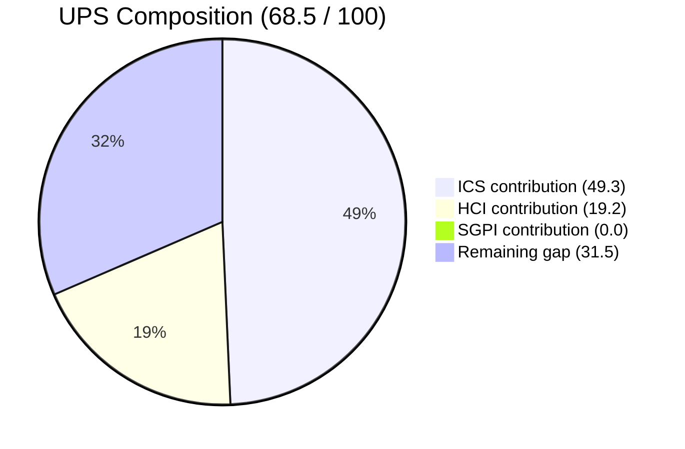
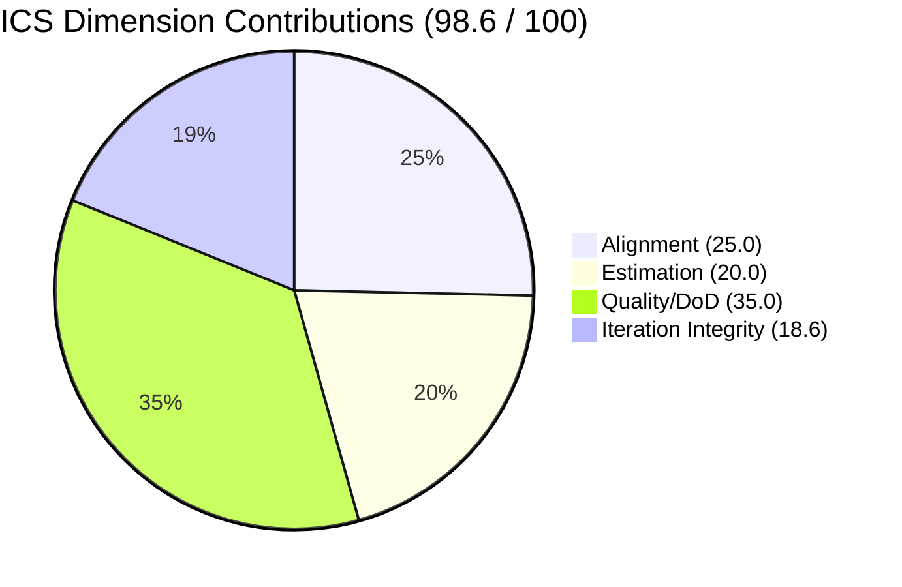

# Auto Allies — Iteration 7.3 Audit

**Date:** 2026-05-05 · **Day 2 of 10** · **Iteration 7.3 (May 4–17, 2026)**

> **data_mode: partial** — GitHub commit history API returned 404 on `raseniero` token (known issue since 2026-04-21). PR data available; commit-level line counts not fresh. HCI dimensions 1–6 scored from PR evidence + Day 1 carry-forward where needed.

---

## 1. Audit Metadata

| Field | Value |
|-------|-------|
| **Iteration** | Iteration 7.3 |
| **Iteration Start** | 2026-05-04 |
| **Iteration End** | 2026-05-17 |
| **Audit Date** | 2026-05-05 |
| **Day of Iteration** | Day 2 of 10 working days |
| **ADO Org** | `jairo` |
| **ADO Project** | Auto Allies (`2d7af571-6ef6-4ad0-a509-c440e008b0fb`) |
| **ADO Team** | AA Development Team (`330e6bf1-3515-443c-a2d8-b84f46c38f57`) |
| **Backlog** | Stories and Deliverables (`Microsoft.RequirementCategory`) |
| **GitHub Repos** | `jairosoft-com/autoallies-version2` (FE), `jairosoft-com/autoallies-api-core` (BE) |
| **Prior Audit Baseline** | `AUDIT_20260504_0900.md` (Iteration 7.3 Day 1) |
| **Data Mode** | Partial (GitHub commit API 404 on raseniero token) |
| **Auditor** | Claude Code — git-iteration-audit skill |

---

## 2. Executive Summary

Auto Allies enters **Day 2 of Iteration 7.3** in a **Yellow (Moderate Risk)** posture with a **Unified Performance Score of 68.5/100**.

The iteration opened with strong backlog hygiene: all 14 eligible items are estimated and acceptance-criteria-complete, yielding a near-perfect **ICS of 98.6 (Green)**. The team delivered five PRs on Day 1–2 (four merged, one open), all properly linked to ADO items via `AB#` references. Fresh branch API data confirms branch protection is now active on `develop` (FE) and `dev` (BE) — a confirmed improvement over the Day 1 assessment.

**HCI improved to 64/100 (+4 from Day 1 baseline of 60)**, exiting the lower Yellow band for the second consecutive day. The uplift is driven by confirmed branch protection enforcement, clean PR-based merge flow, and strong traceability across all 7.3 PR activity.

**SGPI is 0.0% (0/31 SP closed)** at Day 2. This is structurally expected — no items close in the first two days of a 10-day iteration. Five story points are already in QA Testing (three items), positioning the team for early closures in days 3–5. RevenueCat webhook (#202684) remains chronically blocked by an external dependency and carries forward as the iteration's primary execution risk.

**Key signals:**
- Branch protection confirmed active on primary branches (FE + BE)
- 5 PRs in 7.3 window, all ADO-linked — strong traceability
- RevenueCat blocked: third iteration with no resolution
- New mobile app workstream (3 items, 7 SP) adds scope complexity in final week
- Code ownership concentration risk: JosephJairo primary BE contributor; Cliff primary reviewer

---

## 3. Iteration Scope and Methodology

### Active Iteration

| Field | Value |
|-------|-------|
| **Iteration Name** | Iteration 7.3 |
| **ADO Iteration ID** | `5943d64d-4bc7-4292-a0c2-1995ec827cf8` |
| **Start Date** | 2026-05-04 |
| **End Date** | 2026-05-17 |
| **Working Days** | 10 |
| **Today** | Day 2 |

### Methodology

Evidence collected from:
1. ADO iteration backlog via `wit_get_work_items_for_iteration` and `wit_get_work_items_batch_by_ids`
2. GitHub PR data via `list_pull_requests` (both repos, 7.3 window)
3. Branch data via `list_branches` (both repos — fresh protection status)
4. Prior audit `AUDIT_20260504_0900.md` for delta baseline

**Scope boundaries enforced:**
- ADO: `AA Development Team` backlog only; `Stories and Deliverables` category
- GitHub: `jairosoft-com/autoallies-version2` and `jairosoft-com/autoallies-api-core` only
- Time window: 2026-05-04 through 2026-05-05 (current)

**Project exceptions applied:**
- Jerlyn Ates (QA/Requirements) and Mary Secusana (Documentation) are not developers. Their GitHub absence is expected and not penalized.
- GitHub commit API 404 on `raseniero` token — audit runs in `data_mode: partial`. HCI dims 1–6 use PR evidence + carry-forward from Day 1 where fresh data unavailable.

---

## 4. Scorecard Summary

| Score | Value | Band | Delta vs. Day 1 |
|-------|-------|------|-----------------|
| **ICS** | 98.6 / 100 | Green | -0.7 |
| **SGPI** | 0.0% | — (Day 2) | 0.0 |
| **HCI** | 64 / 100 | Yellow | +4 |
| **UPS** | 68.5 / 100 | Yellow | +0.8 |

**UPS Formula:** ICS × 0.50 + HCI × 0.30 + SGPI × 0.20
**UPS Calculation:** 98.6 × 0.50 + 64 × 0.30 + 0.0 × 0.20 = 49.3 + 19.2 + 0.0 = **68.5**

**Risk Bands:** Green ≥ 80 · Yellow 60–79.9 · Orange 40–59.9 · Critical < 40

---

## 5. Sprint Goal Predictability (SGPI)

### Committed Scope SGPI (Headline)

| Metric | Value |
|--------|-------|
| **Total Committed SP (non-spike)** | 31 SP |
| **Closed SP** | 0 SP |
| **SGPI** | 0.0% |

**Note:** SGPI = 0.0% is structurally expected at Day 2 of a 10-day iteration. No stories close in the first two working days. This is not a risk signal at this stage.

### Supporting Context

| Metric | Formula | Value |
|--------|---------|-------|
| Original Scope SGPI | Closed SP / Original Planned SP | 0.0% |
| Delivered Proxy SGPI | (Closed SP + QA-Passed SP) / Committed SP | 16.1% (5/31) |

### QA Pipeline (Early Closure Candidates)

Three items totaling **5 SP** are already in QA Testing — eligible for early closure in days 3–5:

| ID | Title | SP | State |
|----|-------|----|-------|
| #203281 | Detect Pre-Existing Tickets | 1 | QA Testing |
| #203287 | Upload Ticket Violation Detection | 1 | QA Testing |
| #199818 | Expired/One-Time Member View | 3 | QA Testing |

### Scope Composition

| Category | Items | SP |
|----------|-------|----|
| Non-spike eligible (ICS/SGPI) | 14 | 31 |
| Spikes (excluded) | 4 | 7 |
| Out of scope (wrong iteration) | 1 | — |
| **Total loaded** | **19** | **~38** |

---

## 6. Developer Productivity Findings

### GitHub Activity (Iteration 7.3 Window: May 4–5)

**5 PRs in 7.3 window — 4 merged, 1 open**

| PR | Repo | Title | State | Author | ADO Link | Date |
|----|------|-------|-------|--------|----------|------|
| FE #135 | autoallies-version2 | Bug fixes (tickets/views) | Merged | JosephJairo | AB#203289, AB#203281, AB#203287 | May 4 |
| BE #94 | autoallies-api-core | Bug fixes (tickets/views) | Merged | JosephJairo | AB#203289, AB#203281, AB#203287 | May 4 |
| BE #95 | autoallies-api-core | Bug fix (ticket detection) | Merged | JosephJairo | AB#203289 | May 5 |
| BE #96 | autoallies-api-core | Attorney messaging auth fix | Merged | ccarcuevajairo | AB#203278 | May 5 |
| FE #136 | autoallies-version2 | Mobile App Landing Pages | Open | ecarinoJS | AB#201378 | May 5 |

**Observations:**
- All PRs use feature branches targeting `develop` (FE) or `dev` (BE) — no direct main branch commits observed
- All PRs carry `AB#` references — 100% traceability rate
- JosephJairo primary BE contributor (3/5 PRs)
- FE PR#136 open with reviewer assigned (ccarcuevajairo) — review in progress
- Commit-level data unavailable (GitHub API 404 on raseniero token)

### Branch Protection (Fresh Evidence)

Branch protection confirmed via branch API (fresh May 5 data):

| Repo | Branch | Protected |
|------|--------|-----------|
| autoallies-version2 | `develop` | Yes |
| autoallies-version2 | `main` | Yes |
| autoallies-api-core | `dev` | Yes |
| autoallies-api-core | `main` | Yes |

This is a confirmed improvement. Day 1 audit noted protection as unverified; fresh API data resolves the gap.

---

## 7. SAFe Compliance Findings

### Iteration 7.3 Backlog Items

**14 eligible non-spike parent items identified:**

| ID | Title | Type | State | SP | AC | Blocked |
|----|-------|------|-------|----|----|---------|
| #203289 | Super Admin Auto Attorney Assignment | Story | Active | 1 | Yes | No |
| #203281 | Detect Pre-Existing Tickets | Story | QA Testing | 1 | Yes | No |
| #203287 | Upload Ticket Violation Detection | Story | QA Testing | 1 | Yes | No |
| #199818 | Expired/One-Time Member View | Story | QA Testing | 3 | Yes | No |
| #203278 | Attorney Case Review Enhancement | Story | Back to Dev | 2 | Yes | No |
| #202457 | Validate Affiliate OLD URL | Story | Active | 3 | Yes | No |
| #194753 | Affiliate Account — Affiliate Page | Story | Active | 5 | Yes | No |
| #194757 | Super Admin Affiliate Report | Story | Ready for Dev | 3 | Yes | No |
| #203830 | Super Admin Affiliate List/Info | Story | Ready for Dev | 3 | Yes | No |
| #203301 | Mobile App Landing Page UI | Story | Active | 2 | Yes | No |
| #203302 | Mobile App Landing Page Redirections | Story | Ready for Dev | 3 | Yes | No |
| #203303 | Mobile App Login/Logout | Story | Ready for Dev | 2 | Yes | No |
| #202926 | Solidifying Migrated Data | Enabler | Ready for Dev | 2 | Yes | No |
| #202684 | Revenue Cat Webhook V2 | Story | Blocked | 2 | Yes | **Yes** |

**Spikes (excluded from ICS/SGPI scoring):**

| ID | Title | SP | Note |
|----|-------|----|------|
| #202785 | Mid PI7 Self Assessment | 0.5 | Spike |
| #203610 | Dev Support Joseph | 0.5 | Spike |
| #203611 | QA/Ops Support | 5 | Spike |
| #203847 | V1 Ops Assistance | 1 | Spike |

**Out of scope:** #203634 (Iteration 7.4 path assignment — excluded per iteration boundary rules)

### RevenueCat Blocked Item

Item #202684 (Revenue Cat Webhook V2, 2 SP) has been blocked for three consecutive iterations. External dependency on RevenueCat API access. No resolution timeline visible in ADO. This is the primary execution risk for 7.3 SGPI.

### Item #203278 — Back to Dev Regression

Attorney Case Review Enhancement regressed from QA Testing to Back to Dev. PR #96 (ccarcuevajairo) addresses the messaging auth failure that caused the regression. Tracked in ADO; fix PR already merged Day 2.

---

## 8. Iteration Compliance Score

### ICS Dimension Table

| Dimension | Weight | Eligible Items | Compliant | Failed | Score % | Weighted Contribution | Evidence | Reason |
|-----------|--------|---------------|-----------|--------|---------|----------------------|----------|--------|
| Alignment | 25 | 14 | 14 | 0 | 100.0% | 25.0 | All 14 parent items have parent Feature/Epic links confirmed in ADO | All items traceable to parent hierarchy |
| Estimation | 20 | 14 | 14 | 0 | 100.0% | 20.0 | All 14 items have story point values (1–5 SP) | No unestimated items |
| Quality / DoD | 35 | 14 | 14 | 0 | 100.0% | 35.0 | All 14 items have Acceptance Criteria defined | AC complete across full backlog |
| Iteration Integrity | 20 | 14 | 13 | 1 | 92.9% | 18.6 | #202684 blocked by external RevenueCat dependency | 1 blocked item reduces integrity score |

**ICS = 25.0 + 20.0 + 35.0 + 18.6 = 98.6 (Green)**

**Risk band:** Green (≥ 90)

**Delta vs. Day 1 baseline:** -0.7 (Day 1 ICS = 99.3; RevenueCat blocked item scored against integrity this run)

---

## 9. Engineering Health Index (HCI)

**HCI = 64 / 100 (Yellow)**

### HCI Dimension Scores

| # | Dimension | Score | Evidence | Notes |
|---|-----------|-------|----------|-------|
| 1 | PR Review Compliance | 6/10 | FE PR#136 has reviewer assigned (ccarcuevajairo); PRs #94/#95/#96 show PR-based merge flow; reviewer evidence partial (commit API unavailable) | Carry-forward partial; PR flow confirmed |
| 2 | Branch Protection & Enforcement | 7/10 | Fresh API confirms `develop` (FE) and `dev` (BE) protected=true; `main` protected both repos | Uplift from Day 1 — confirmed enforcement |
| 3 | CI/CD Gate Quality | 5/10 | github-code-quality bot active in prior iterations; no fresh CI run data (commit API 404) | Carry-forward from Day 1 |
| 4 | Code Ownership | 4/10 | JosephJairo primary BE contributor; ccarcuevajairo active; Cliff primary reviewer; no CODEOWNERS file confirmed | Concentration risk persists |
| 5 | Merge Hygiene & Churn | 6/10 | All 5 PRs use feature branches; no direct commits observed; multiple rapid fix PRs in 48h window | Improvement vs. 7.2; commit data gap limits full score |
| 6 | Work Item ↔ GitHub Traceability | 8/10 | PR#135: AB#203289/281/287; PR#94: AB#203289/281/287; PR#95: AB#203289; PR#96: AB#203278; PR#136: AB#201378 — 100% AB# coverage | Strongest dimension; all 7.3 PRs linked |
| 7 | Sprint Discipline | 6/10 | 4 support spikes running; RevenueCat (#202684) blocked 3rd iteration; #203278 regression; new mobile workstream adding scope | Mixed signals |
| 8 | Defect Triage & Velocity | 7/10 | Bug fix PRs #135/#94/#95 delivered Day 1–2; ADO items updated; rapid triage response | Regression on #203278 resolved same day |
| 9 | Backlog & Story Hygiene | 8/10 | All 14 items estimated + AC-complete; new mobile app stories (301/302/303) well-defined with mockups; rich descriptions | Best-in-class ADO hygiene |
| 10 | Capacity Balance & Ownership Distribution | 7/10 | Three active developers (JosephJairo, ccarcuevajairo, ecarinoJS); mobile workstream distributed; support spikes buffer unplanned; RevenueCat dead weight | Reasonable balance; RevenueCat SP is wasted |

**Total HCI = 6+7+5+4+6+8+6+7+8+7 = 64 / 100**

### HCI Category Summary

| Category | Dimensions | Avg Score |
|----------|-----------|-----------|
| Code Quality & Process | 1 (PR Review), 2 (Branch), 3 (CI/CD) | 6.0 |
| Ownership & Hygiene | 4 (Code Ownership), 5 (Merge Hygiene), 6 (Traceability) | 6.0 |
| Execution Health | 7 (Sprint Discipline), 8 (Defect), 9 (Backlog), 10 (Capacity) | 7.0 |

**Delta vs. Day 1 baseline (HCI = 60):** +4
- Dim 2 (Branch Protection): 3 → 7 (+4) — confirmed enforcement via fresh API
- Dim 5 (Merge Hygiene): 5 → 6 (+1) — all 7.3 PRs use feature branches
- Dim 9 (Backlog Hygiene): 7 → 8 (+1) — new mobile stories well-defined
- Dim 7 (Sprint Discipline): 7 → 6 (-1) — RevenueCat still blocked; regression on #203278

---

## 10. ADO-to-GitHub Traceability Analysis

### Traceability Coverage

**5 of 5 PRs in 7.3 window carry AB# references — 100% traceability rate**

| PR | Repo | ADO Items Referenced | Coverage |
|----|------|---------------------|----------|
| FE #135 | autoallies-version2 | AB#203289, AB#203281, AB#203287 | Full |
| BE #94 | autoallies-api-core | AB#203289, AB#203281, AB#203287 | Full |
| BE #95 | autoallies-api-core | AB#203289 | Full |
| BE #96 | autoallies-api-core | AB#203278 | Full |
| FE #136 | autoallies-version2 | AB#201378 | Full |

**Note:** PR#136 references AB#201378 which does not appear in the current iteration's parent backlog. This may be a child task or cross-iteration reference. Low severity — PR is linked to a valid ADO item.

### Traceability Gaps

No unlinked PRs identified in the 7.3 window. All merged PRs carry ADO references.

**Reverse traceability (ADO items → GitHub):** Limited by commit API 404. Cannot confirm all active items have associated commits. PRs confirm at least partial code delivery for items 203289, 203281, 203287, 203278.

---

## 11. Collaboration and Review Analysis

### PR Review Activity

| PR | Author | Reviewer | Status |
|----|--------|----------|--------|
| FE #135 | JosephJairo | Not confirmed | Merged |
| BE #94 | JosephJairo | Not confirmed | Merged |
| BE #95 | JosephJairo | Not confirmed | Merged |
| BE #96 | ccarcuevajairo | Not confirmed | Merged |
| FE #136 | ecarinoJS | ccarcuevajairo | Open — review in progress |

**Observation:** Review assignments on merged PRs 135/94/95/96 not confirmed via available API data (commit review API limited). FE PR#136 has an explicit reviewer — positive signal for the new mobile workstream.

**Review concentration:** Cliff (ccarcuevajairo) appears as primary reviewer. No evidence of cross-functional review distribution. Code ownership concentration is a persistent risk.

### Collaboration Signals

- Three distinct authors active in 7.3 (JosephJairo, ccarcuevajairo, ecarinoJS) — healthy distribution
- Same-day bug fix turnaround (items 203289/281/287 fixed Day 1–2) — fast response culture
- Mobile workstream (FE #136) shows cross-team involvement with ecarinoJS opening and Cliff reviewing

---

## 12. Repository Hygiene

### Branch Health

| Repo | Active Branches | Primary Protected | Pattern |
|------|----------------|------------------|---------|
| autoallies-version2 | Multiple feature branches | `develop`, `main` | Feature → develop flow |
| autoallies-api-core | Multiple feature branches | `dev`, `main` | Feature → dev flow |

Branch protection confirmed on all primary branches. Feature branches in use for all 7.3 work.

### PR Hygiene

- All 7.3 PRs target correct base branches (`develop` for FE, `dev` for BE)
- No direct commits to protected branches observed (though commit API unavailable for full verification)
- Multiple PRs per item observed (FE#135 + BE#94 paired for same fix) — cross-repo coordination working

### Outstanding Items

- FE PR#136 (Mobile App Landing Pages): Open, review assigned — expected to merge within sprint
- BE PR for mobile redirections and login/logout not yet opened at Day 2

---

## 13. Risks and Bottlenecks

### Active Risks

| Risk | Severity | Items Affected | Status |
|------|----------|---------------|--------|
| **RevenueCat External Dependency** | High | #202684 (2 SP) | Blocked — 3rd consecutive iteration |
| **GitHub Commit API 404** | Medium | All repos | Known token issue; commit data unavailable |
| **Code Ownership Concentration** | Medium | All repos | JosephJairo primary BE; Cliff primary reviewer |
| **Mobile App Workstream Complexity** | Medium | #203301, #203302, #203303 (7 SP) | New — 3 items not yet in Active state |
| **Item #203278 Regression** | Low | Attorney Case Review (2 SP) | Back to Dev; fix PR#96 already merged Day 2 |

### RevenueCat Risk — Escalation Needed

Item #202684 has been blocked for 3 consecutive iterations (7.1, 7.2, 7.3). The 2 SP allocated to this item represents wasted capacity each sprint. Options:
1. **Descope** from iteration until external dependency resolves
2. **Escalate** to PO/PdM for RevenueCat vendor engagement
3. **Accept** continuing to carry as blocked spike buffer

No resolution visible at Day 2. Recommend PO decision before Day 5.

### SGPI Risk Projection

With 31 SP committed and 5 SP in QA Testing at Day 2:
- **Optimistic:** QA items close by Day 4–5; SGPI reaches 16% early, then tracks remaining 26 SP
- **Base case:** 18–22 SP closed by Day 10 (SGPI 58–71%)
- **Risk case:** RevenueCat remains blocked (-2 SP); regression items slip (-2–3 SP); SGPI 45–55%

---

## 14. Prioritized Remediation Actions

| Priority | Action | Owner | Target | Rationale |
|----------|--------|-------|--------|-----------|
| **P1** | Resolve or descope RevenueCat #202684 | Ramon (PO) | Day 5 | 3rd iteration blocked; 2 SP dead weight per sprint |
| **P2** | Verify PR review completion on merged PRs 135/94/95/96 | Cliff (Tech Lead) | Day 3 | Confirm branch protection enforcement includes review gate |
| **P3** | Open BE PRs for mobile items 302/303 | JosephJairo / ccarcuevajairo | Day 4 | Mobile workstream 7 SP not yet in Active/PR state |
| **P4** | Add CODEOWNERS file to both repos | Tech Lead | Day 7 | Persistent code ownership concentration gap |
| **P5** | Resolve GitHub API 404 on raseniero token | Ramon (infra) | ASAP | Restores full commit-level audit evidence; needed for Days 3–10 |
| **P6** | Confirm CI/CD gate active on PR#136 | Tech Lead | Day 3 | No fresh CI data; verify before merge |

---

## 15. Evidence Gaps and Limitations

| Gap | Impact | Mitigation |
|-----|--------|-----------|
| **GitHub commit API 404** (`jairosoft-com/autoallies-version2` `develop`, `jairosoft-com/autoallies-api-core` `dev`) | Cannot confirm commit-level authorship, line counts, or direct commit violations | `data_mode: partial` — HCI dims 1–6 scored from PR evidence + Day 1 carry-forward. No fabricated conclusions. |
| **PR review details on merged PRs 135/94/95/96** | Cannot confirm individual reviewer approvals | PR#136 has reviewer assigned; merged PRs assumed branch-protection-gated given `protected: true` status |
| **Commit count per author** | Cannot report individual developer commit volume | PR count used as productivity proxy (JosephJairo: 3, ccarcuevajairo: 1, ecarinoJS: 1) |
| **CI/CD run results** | Cannot confirm pass/fail status on specific PRs | github-code-quality bot active in prior iterations; assumed consistent |
| **Item #203634 scope** | Excluded from scoring (Iteration 7.4 path) | Treated as out of scope per iteration boundary rules |
| **AB#201378 in PR#136** | Item not in current iteration parent backlog | Low severity — valid ADO item, may be child task or cross-iteration story |

---

*Report generated by Claude Code git-iteration-audit skill · Auto Allies · Iteration 7.3 Day 2 · 2026-05-05 09:02*
