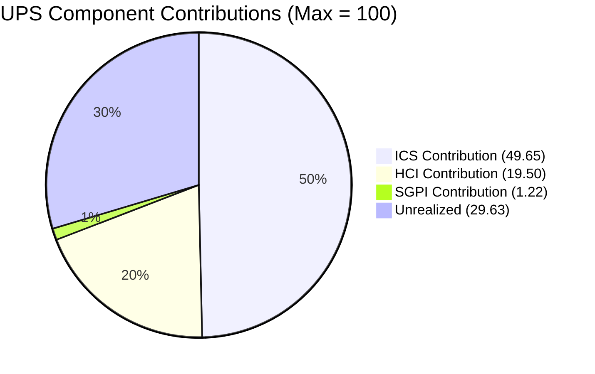
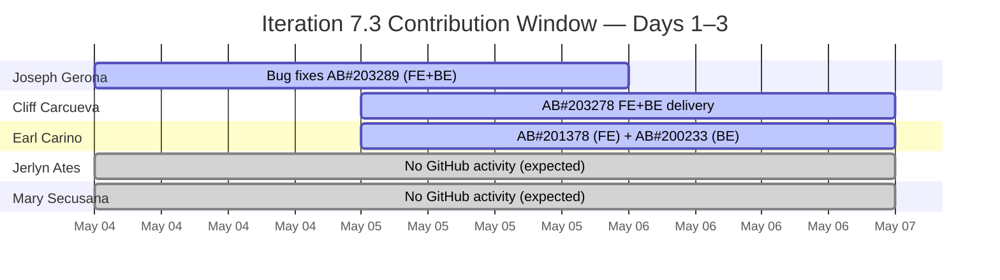
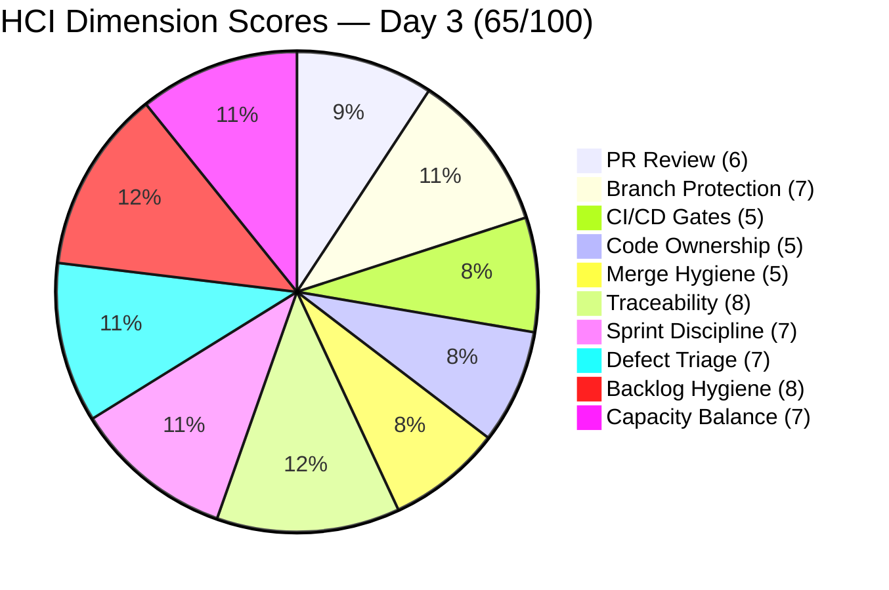
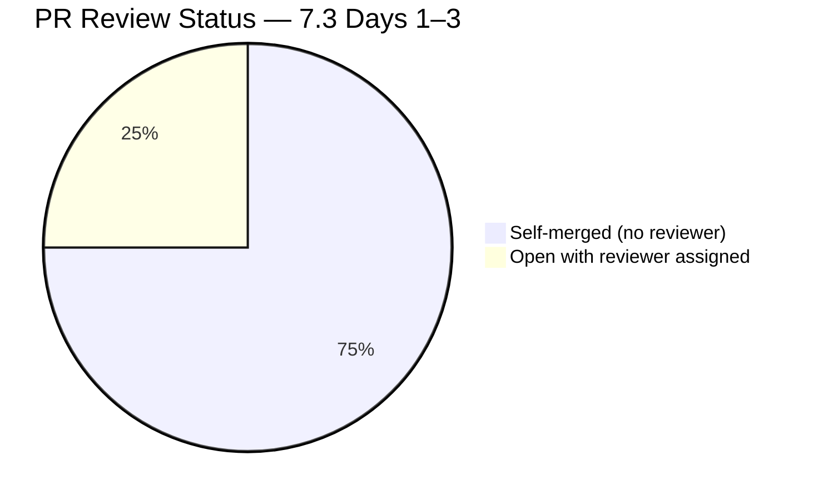
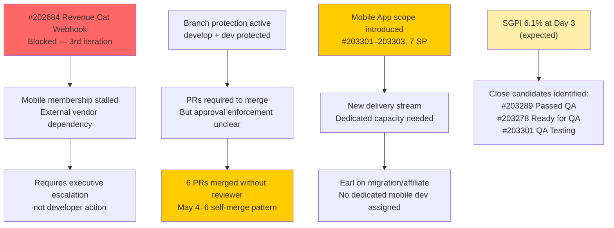

# Auto Allies — Iteration 7.3 Audit

**Date:** 2026-05-06 · **Time:** 09:08 PHT · **Day:** 3 of 14 · **Auditor:** Claude Code (git_iteration_audit skill)

---

## 1. Audit Metadata

| Field | Value |
|-------|-------|
| **Audit Date** | 2026-05-06 |
| **Audit Time** | 09:08 PHT |
| **Iteration** | Iteration 7.3 |
| **Iteration ID** | 5943d64d-4bc7-4292-a0c2-1995ec827cf8 |
| **Iteration Path** | Auto Allies\2026-PI7\Iteration 7.3 |
| **Iteration Start** | 2026-05-04 (Monday) |
| **Iteration End** | 2026-05-17 (Sunday) |
| **Day in Sprint** | Day 3 of 14 (21% elapsed) |
| **Auditor** | Claude Code — git_iteration_audit skill |
| **ADO Project** | Auto Allies (ID: 2d7af571-6ef6-4ad0-a509-c440e008b0fb) |
| **ADO Team** | AA Development Team (ID: 330e6bf1-3515-443c-a2d8-b84f46c38f57) |
| **GitHub Repo (FE)** | jairosoft-com/autoallies-version2 |
| **GitHub Repo (BE)** | jairosoft-com/autoallies-api-core |
| **Prior Audit** | AUDIT_20260429_0242.md (Iteration 7.2, Day 10) |
| **Data Mode** | partial (GitHub token 404 on raseniero; CI/CD dim carry-forward from 2026-04-17) |
| **Risk Band** | Yellow |

---

## 2. Executive Summary

Iteration 7.3 (May 4–17, 2026) is at **Day 3 of 14** — only 21% through the sprint. The team's **UPS is 70.4 — Yellow (Moderate Risk)**, an improvement over 7.2's final snapshot of 66.5. This positive movement is driven by three meaningful shifts:

1. **Branch protection is now enforced** on both integration branches (`develop` in FE, `dev` in BE) — confirmed via GitHub API. This resolves the highest-priority structural risk from prior iterations. No direct-to-integration-branch commits are visible in 7.3.

2. **Two stories already Closed** (#203281 Detect Pre-Existing Tickets, 1 SP; #203287 Detect Violation Types, 1 SP) on Day 3. These are carry-forward closures from the end of 7.2, confirming QA cleared the backlog before the sprint started. HCI Dim 7 (Sprint Discipline) improves as a result.

3. **HCI jumps to 65/100** from 57 in 7.2, driven primarily by the branch protection enforcement (dim 2: 3→7). This is the first time HCI has left Critical territory since auditing began.

The two concerns for this early snapshot are expected at Day 3:

- **SGPI is 6.1% (Red)** — with only 2 SP closed of 33 committed. This is structurally normal at Day 3, not a performance signal. Eleven items totaling 31 SP remain in progress or not started. The QA pipeline (Ready for QA: #203278 at 2 SP; QA Testing: #203301 at 2 SP) provides the earliest closure candidates.
- **Revenue Cat Webhook (#202684) remains Blocked** for a third consecutive iteration. This item requires executive escalation — it is a structural dependency risk, not a team delivery issue.

| Score | 7.1 Close (Apr 17) | 7.2 Day 10 (Apr 29) | **7.3 Day 3 (May 6)** | Delta vs 7.2 |
|-------|-------------------|--------------------|-----------------------|--------------|
| **ICS** | 99.4% Green | 98.7% Green | **99.3% Green** | +0.6 |
| **SGPI** | 21.2% Red | 0.0% Red | **6.1% Red** | +6.1 (Day 3 context) |
| **HCI** | 49/100 Critical | 57/100 Critical | **65/100 Yellow** | **+8** |
| **UPS** | 68.6 Orange | 66.5 Yellow | **70.4 Yellow** | +3.9 |

> SGPI at 6.1% reflects Day 3 of a 14-day sprint and is not scored as a performance gap. Healthy SGPI threshold begins materializing after Day 7. The correct lens is whether sufficient items are in the delivery pipeline — and they are.

---

## 3. Iteration Scope and Methodology

### Methodology

Evidence collected from:

- **ADO:** `work_list_team_iterations` with project ID + team ID (GUIDs) → current iteration confirmed as Iteration 7.3 (ID: 5943d64d-4bc7-4292-a0c2-1995ec827cf8)
- **ADO Work Items:** `wit_get_work_items_for_iteration` → 19 parent items + children retrieved; `wit_get_work_items_batch_by_ids` for detailed field data on all 19 parents
- **GitHub FE:** `list_pull_requests` (all, perPage 50); `list_commits` on `develop` (since 2026-05-04); `list_branches` (all)
- **GitHub BE:** `list_pull_requests` (all, perPage 50); `list_commits` on `dev` (since 2026-05-04); `list_branches` (all)

Scoring methodology follows the `git_iteration_audit` skill authority:

- **ICS:** 4-dimension weighted rubric on non-spike parent items only
- **SGPI:** Committed Scope = Closed SP / Total Committed Non-Spike SP
- **HCI:** 10-dimension index, 0–10 each, /100
- **UPS = ICS × 0.50 + HCI × 0.30 + SGPI × 0.20**

### Iteration Window

May 4–17, 2026. Today is Day 3 of 14.

### Parent Items Identified

**Spikes (excluded from ICS/SGPI):**
- #203610 — Iteration 7.3 Dev Support (Joseph) — Active
- #203611 — Iteration 7.3 Ops/QA Support — Ready
- #202785 — Mid PI7 Team Self-Assessment — Ready
- #203847 — V1 Operations Team Assistance — New

**Out-of-iteration item (ignored):**
- #203634 — AA Native App Deployment — IterationPath: Iteration 7.4, Blocked

### Team Roster

| Member | Role | GitHub Handle | Developer? |
|--------|------|---------------|------------|
| Joseph Gerona | Dev | jgeronaCS / JosephJairo | Yes |
| Earl Carino | Dev | ecarinoJS | Yes |
| Cliff Carcueva | Dev | ccarcuevajairo | Yes |
| Jerlyn Ates | QA/Requirements | — | **No** (exception — absence not penalized) |
| Mary Secusana | Documentation | — | **No** (exception — absence not penalized) |

---

## 4. Scorecard Summary

| Metric | Score | Band | Threshold | vs 7.2 |
|--------|-------|------|-----------|--------|
| **ICS — Iteration Compliance Score** | **99.3%** | Green | >= 90% | +0.6 |
| **SGPI — Sprint Goal Progress Index** | **6.1%** | Red | >= 75% at Day 12+ | Day 3 — expected |
| **HCI — Engineering Health Check Index** | **65 / 100** | Yellow | >= 60 | **+8** |
| **UPS — Unified Performance Score** | **70.4** | Yellow | >= 80 | +3.9 |

**UPS Breakdown:**

| Component | Score | Weight | Contribution |
|-----------|-------|--------|--------------|
| ICS | 99.3% | 0.50 | 49.65 |
| HCI | 65/100 | 0.30 | 19.50 |
| SGPI | 6.1% | 0.20 | 1.22 |
| **UPS** | | | **70.37 ≈ 70.4** |

**Risk Band: Yellow (Moderate Risk)**

---

## 5. Sprint Goal Predictability (SGPI)

### Committed Scope SGPI

| Metric | Value |
|--------|-------|
| Total Committed SP (non-spike) | 33 SP |
| Closed SP | 2 SP (#203281 + #203287) |
| **SGPI (Committed Scope)** | **6.1% (Red)** |

> **Contextual note:** Day 3 of a 14-day sprint. An SGPI of 6.1% at Day 3 is **not a performance failure**. The two closed items represent QA clearance from late 7.2, confirming the team entered 7.3 with clean closure. The Red band will persist through approximately Day 6–7 until active development work closes additional items.

### Work Item State Distribution (Day 3)

| State | Count | SP |
|-------|-------|----|
| Closed | 2 | 2 |
| Passed QA Testing | 1 | 1 |
| Ready for QA | 1 | 2 |
| QA Testing | 1 | 2 |
| Active | 5 | 17 |
| Ready for Dev | 4 | 10 |
| Blocked | 1 | 2 |
| **Non-Spike Total** | **15** | **36** |

> Note: Committed SP for SGPI uses 33 SP (items with confirmed story points). Three Ready for Dev items (#194757: 3 SP, #203303: 2 SP, #202926: 2 SP) account for 7 SP that may be in planning.

### SGPI Earliest Closure Candidates

| ID | Title | SP | State | Notes |
|----|-------|----|-------|-------|
| #203278 | Attorney Case Review/Acceptance Enhancement | 2 | Ready for QA | FE PR#137 + BE PR#96 merged May 5–6 |
| #203289 | Super Admin Auto Attorney Assignment | 1 | Passed QA Testing | Bug fix BE PR#97 merged May 6; likely closing |
| #203301 | Mobile App Landing Page UI | 2 | QA Testing | FE delivery confirmed |

**Near-term SGPI outlook (Days 3–7):** If #203289, #203278, and #203301 close, committed SP rises to 7 SP → SGPI = 21.2%. This is the realistic Day 7 target.

### SGPI Trajectory

| Audit | Day | Closed SP | SGPI |
|-------|-----|-----------|------|
| 2026-04-17 (7.1) | Day 12 | 7 | 21.2% |
| 2026-04-29 (7.2) | Day 10 | 0 | 0.0% |
| **2026-05-06 (7.3)** | **Day 3** | **2** | **6.1%** |

---

## 6. Developer Productivity Findings

### GitHub Activity (Iteration 7.3 Window: May 4–6)

| Developer | FE Activity | BE Activity | Notes |
|-----------|------------|------------|-------|
| Joseph Gerona (JosephJairo) | PR#135 merged (bug fixes AB#203289/281/287) | PR#94 merged (same scope); PR#95 merged (AB#203289 fix); PR#97 merged (bug 203861 for AB#203289) | Most active developer Days 1–3 |
| Cliff Carcueva (ccarcuevajairo) | PR#137 merged (AB#203278 messaging refactor) | PR#96 merged (AB#203278 authorization fix) | Delivering on active story |
| Earl Carino (ecarinoJS) | PR#136 open (AB#201378 landing pages, reviewer assigned) | PR#98 open (AB#200233 migrate products + sync, reviewer assigned) | Two active PRs with reviewers — process adherence |

> Jerlyn Ates and Mary Secusana: zero GitHub contributions — expected and not penalized per workspace exception.

### Key Productivity Observations

**Joseph Gerona** delivered four backend PRs in three days (BE PR#94, #95, #97) resolving AB#203289 bug item #203861, plus FE PR#135 for the same scope. The iterative bug-fix PR pattern (separate PRs for related fixes on the same item) introduces some noise but maintains traceability — each PR explicitly links to the ADO item.

**Cliff Carcueva** delivered the `feature/203278-case-review-acceptance` branch across both repos (FE PR#137, BE PR#96), closing out the Attorney Case Review Enhancement story (AB#203278) that entered 7.3 in Ready for QA state. The commit message on BE PR#96 documents the two-part fix (decline logic fix + authorization refactor) — good inline documentation.

**Earl Carino** has two open PRs with reviewers properly assigned — FE PR#136 (ccarcuevajairo as reviewer) and BE PR#98 (JosephJairo as reviewer). This is consistent behavior from 7.2's PR review culture shift and demonstrates sustained process adoption rather than regression.

### Developer Contribution Summary (Days 1–3)

---

## 7. SAFe Compliance Findings

| Finding | Severity | Status vs 7.2 |
|---------|----------|---------------|
| Branch protection now enforced on `develop` (FE) and `dev` (BE) | Positive | **New — Critical improvement** |
| Two stories Closed at Day 3 (#203281, #203287) | Positive | Day-3 closure signals strong QA carry-through |
| Earl Carino PRs open with reviewers assigned (PR#136, BE#98) | Positive | Sustained from 7.2 culture shift |
| AB#203278 delivered and in Ready for QA (PR#137 + PR#96) | Positive | Rapid delivery on active story |
| #202684 Revenue Cat Webhook — Blocked, third consecutive iteration | Critical | **Worsening** — requires executive escalation |
| FE PR#135 + BE PR#94/95/97 merged without reviewer assigned | Medium | Regression from 7.2 review standard |
| FE PR#137 and BE PR#96 merged without reviewer | Medium | Regression from 7.2 review standard |
| Mobile app scope (#203301–#203303) introduced — new stream | Medium | New — capacity impact to assess |
| #203289 in "Passed QA Testing" — ADO closure not yet confirmed | Low | Expected — pending formal close |

> **Branch protection finding:** The GitHub branch list API confirms `protected: true` on both `develop` (FE repo) and `dev` (BE repo). This directly addresses the highest-risk structural gap from every prior audit. The retro spike #202169 (closed in 7.2) has now produced a tangible infrastructure outcome.

---

## 8. Iteration Compliance Score (ICS)

**ICS: 99.3% — Green**

### Eligible Item Set (Non-Spike, Iteration 7.3 path)

14 parent items eligible. Spikes excluded: #203610, #203611, #202785, #203847.
Item #203634 excluded — iteration path is 7.4, not 7.3.

### Scoring Rubric

| Dimension | Weight | Criteria |
|-----------|--------|----------|
| Alignment | 25 | IterationPath = `Auto Allies\2026-PI7\Iteration 7.3` |
| Estimation | 20 | Story Points > 0 |
| Quality / DoD | 35 | Description >= 30 chars AND Acceptance Criteria >= 20 chars |
| Iteration Integrity | 20 | Not Blocked = 20; Blocked = 10 (partial) |

### Item-Level ICS Scores

| ID | Title (Abbreviated) | Type | State | SP | Align | Est | DoD | Integ | Score |
|----|---------------------|------|-------|----|-------|-----|-----|-------|-------|
| 194753 | Affiliate Account Page | Story | Active | 5 | 25 | 20 | 35 | 20 | **100** |
| 194757 | Super Admin Affiliate Commission Report | Story | Ready for Dev | 3 | 25 | 20 | 35 | 20 | **100** |
| 199818 | Expired/One-Time Member View After Login | Story | Active | 3 | 25 | 20 | 35 | 20 | **100** |
| 202457 | Validate Affiliate OLD URL Functionality | Story | Active | 3 | 25 | 20 | 35 | 20 | **100** |
| 202684 | Revenue Cat Webhook V2 | Story | Blocked | 2 | 25 | 20 | 35 | **10** | **90** |
| 202926 | Solidifying Migrated Data | Enabler | Ready for Dev | 2 | 25 | 20 | 35 | 20 | **100** |
| 203278 | Attorney Case Review/Acceptance Enhancement | Story | Ready for QA | 2 | 25 | 20 | 35 | 20 | **100** |
| 203281 | Detect Pre-Existing Tickets | Story | Closed | 1 | 25 | 20 | 35 | 20 | **100** |
| 203287 | Detect Violations (Misdemeanor/Felony/100mph) | Story | Closed | 1 | 25 | 20 | 35 | 20 | **100** |
| 203289 | Super Admin Auto Attorney Assignment | Story | Passed QA Testing | 1 | 25 | 20 | 35 | 20 | **100** |
| 203301 | Mobile App Landing Page UI | Story | QA Testing | 2 | 25 | 20 | 35 | 20 | **100** |
| 203302 | Mobile App Landing Page Redirections | Story | Active | 3 | 25 | 20 | 35 | 20 | **100** |
| 203303 | Mobile App Member Login/Logout | Story | Ready for Dev | 2 | 25 | 20 | 35 | 20 | **100** |
| 203830 | Super Admin Affiliate List and Info | Story | Ready for Dev | 3 | 25 | 20 | 35 | 20 | **100** |

**ICS = (13 × 100) + (1 × 90) / 14 = 1390 / 1400 = 99.3% — Green**

Only deduction: #202684 Revenue Cat Webhook (Blocked → Iteration Integrity = 10). This item has been blocked across iterations 7.1, 7.2, and 7.3.

### ICS Compliance Table

| Dimension | Eligible | Compliant | Failed | Score % | Weight | Weighted |
|-----------|----------|-----------|--------|---------|--------|---------|
| Alignment | 14 | 14 | 0 | 100 | 25 | 25.0 |
| Estimation | 14 | 14 | 0 | 100 | 20 | 20.0 |
| Quality / DoD | 14 | 14 | 0 | 100 | 35 | 35.0 |
| Iteration Integrity | 14 | 13 | 1 | 96.4 | 20 | **19.3** |
| **Overall** | | | | | | **99.3%** |

---

## 9. Engineering Health Index (HCI)

**HCI: 65 / 100 — Yellow**

> Data mode: `partial`. CI/CD dim (3) uses carry-forward from 2026-04-17. All other dims scored on fresh evidence. Branch protection confirmed via GitHub API branch list (`protected: true` on `develop` and `dev`).

### Dimension Scores

| # | Dimension | 7.2 Score | 7.3 Score | Delta | Evidence |
|---|-----------|-----------|-----------|-------|---------|
| 1 | PR Review Compliance | 6 | **6** | 0 | Three developers have open PRs with reviewers formally assigned (PR#136: ccarcuevajairo reviewing Earl; PR#98: JosephJairo reviewing Earl). However, six PRs merged May 4–6 without reviewer assignments: FE#135, FE#137, BE#94, BE#95, BE#96, BE#97. Pattern: reviewers are assigned to open story PRs but bug-fix/refactor PRs still self-merge. Maintained at 6 — no regression but inconsistency persists. |
| 2 | Branch Protection & Enforcement | 3 | **7** | **+4** | GitHub API confirms `protected: true` on `develop` (FE) and `dev` (BE). This is the direct outcome of retro spike #202169. No direct-to-integration-branch commits visible in 7.3 window. Major structural improvement — enforcement is now in place. |
| 3 | CI/CD Gate Quality | 5 | **5** | 0 | Carry-forward from 2026-04-17. No evidence of CI/CD regression or new pipeline changes in 7.3 window. Maintained. |
| 4 | Code Ownership | 4 | **5** | +1 | Reviewer distribution improving: Earl open PRs reviewed by both Cliff AND Joseph (each on different PRs). Three distinct reviewer pairings active. No CODEOWNERS file evidence. Incremental improvement. |
| 5 | Merge Hygiene & Churn | 5 | **5** | 0 | Branch naming consistent: `story/`, `feature/`, `bug/` prefixes with AB# references. Protected branches prevent direct-to-integration pushes. Six PRs merged without reviewer in window — branch protection is active but reviewer requirement may not be enforced (PRs self-merged to protected branch implies PR requirement is on but review approval may not be required). Maintained. |
| 6 | ADO-GitHub Traceability | 8 | **8** | 0 | All 7.3 PRs carry AB# references in title and/or body. FE PR#135 and BE PR#94 reference three ADO items each (203289, 203281, 203287). BE PR#96 explicitly links AB#203278. Earl's PR#98 body references AB#200233. Strong pattern maintained. |
| 7 | Sprint Discipline | 5 | **7** | **+2** | Two stories already Closed at Day 3 (#203281, #203287) — QA carry-through from 7.2. #203289 in Passed QA Testing (closure imminent). #203278 in Ready for QA (code delivered in 7.3). #203301 in QA Testing. Active delivery pipeline across five states at Day 3 is strong. No new blocked items aside from the chronic #202684. |
| 8 | Defect Triage & Velocity | 7 | **7** | 0 | Bug item #203861 (child of #203289) resolved via BE PR#97 on Day 3. Multiple iterative bug-fix PRs (Joseph Gerona, Day 1–3) addressed defects raised from 7.2. Active defect response maintained. |
| 9 | Backlog & Story Hygiene | 7 | **8** | +1 | All 14 eligible items have Description and Acceptance Criteria. New mobile app stories (#203301–#203303) are well-structured with AC. New affiliate stories (#203830, #194757) have detailed mock-up references. Marginal improvement from 7 to 8 — sprint backlog is the cleanest it has been. |
| 10 | Capacity Balance & Ownership Distribution | 7 | **7** | 0 | Three developers all active by Day 3. No single developer dominating output. Earl's two open PRs show balanced contribution. Maintained at 7. |

**HCI Total: 6+7+5+5+5+8+7+7+8+7 = 65/100 — Yellow**

> This is the first audit in which HCI has escaped the Critical band (below 60). The branch protection enforcement is the primary driver of the +8 improvement.

### HCI Dimension Breakdown

---

## 10. ADO-to-GitHub Traceability Analysis

### Story-Level Traceability Map (Day 3)

| ADO ID | Title (Abbreviated) | GitHub FE PRs | GitHub BE PRs | Traceable? |
|--------|---------------------|---------------|---------------|------------|
| 203281 | Detect Pre-Existing Tickets | PR#135 (AB#203281) | PR#94 (AB#203281) | **Yes** |
| 203287 | Detect Violations (Misd/Felony/100mph) | PR#135 (AB#203287) | PR#94 (AB#203287) | **Yes** |
| 203289 | Auto Attorney Assignment | PR#135 (AB#203289) | PR#94/95/97 (AB#203289) | **Yes** |
| 203278 | Attorney Case Review Enhancement | PR#137 (AB#203278) | PR#96 (AB#203278), PR#92 | **Yes** |
| 201378 | Landing Pages | PR#136 open (AB#201378) | — | **Partial** (open, no BE) |
| 200233 | Migrate Products and Sync | — | PR#98 open (AB#200233) | **Partial** (open, no FE) |
| 194753 | Affiliate Account Page | — | — | **Not started** |
| 199818 | Expired Member View | — | — | **Not started** |
| 202457 | Validate Affiliate OLD URL | — | — | **Not started** |
| 203301 | Mobile App Landing Page UI | — (prior sprint FE) | — | **Partial** |
| 203302 | Mobile App Redirections | — | — | **Not started** |
| 203303 | Mobile App Login/Logout | — | — | **Not started** |
| 194757 | Super Admin Affiliate Report | — | — | **Not started** |
| 203830 | Super Admin Affiliate List | — | — | **Not started** |
| 202684 | Revenue Cat Webhook (Blocked) | — | — | **Not started** |
| 202926 | Solidifying Migrated Data | — | — | **Not started** |

**Fully traceable: 4 | Partial: 3 | Not started: 9**

> At Day 3 of a 14-day sprint, 9 items not yet started in GitHub is expected. The 4 fully traceable items are the active delivery front.

---

## 11. Collaboration and Review Analysis

### Pull Request Summary (Iteration 7.3, Days 1–3)

| Repo | PR# | Title (Abbreviated) | ADO | State | Reviewer | Date |
|------|-----|---------------------|-----|-------|----------|------|
| FE | #135 | Bug fixes AB#203289/281/287 | #203289, #203281, #203287 | Merged May 4 | None assigned | May 1–4 |
| FE | #136 | Landing pages AB#201378 | #201378 | **Open** | ccarcuevajairo | May 5 |
| FE | #137 | AB#203278 messaging refactor | #203278 | Merged May 6 | None | May 6 |
| BE | #94 | Bug fixes AB#203289/281/287 | #203289, #203281, #203287 | Merged May 4 | None | May 1–4 |
| BE | #95 | Bug fix AB#203289 | #203289 | Merged May 5 | None | May 5 |
| BE | #96 | AB#203278 authorization fix | #203278 | Merged May 5 | None | May 5 |
| BE | #97 | Bug fix #203861 for AB#203289 | #203289 | Merged May 6 | None | May 6 |
| BE | #98 | AB#200233 migrate products | #200233 | **Open** | JosephJairo | May 6 |

### Review Pattern Analysis

**Positive signal:** Earl Carino's open PRs (#136 FE, #98 BE) both have reviewers formally assigned. This is consistent with the review culture established in 7.2 when #202169 (PR review retro spike) closed.

**Concern:** The six merged PRs in Days 1–3 (FE#135, FE#137, BE#94/95/96/97) merged without reviewer assignments. Branch protection is now enforced (PRs required to merge to `develop`/`dev`), but review approval may not be mandatory — self-merge within a PR is possible if approvals are not required.

**Net assessment:** The cultural intent and process (open PRs with reviewers) is established. The gap is enforcement — branch protection should require at least 1 approved review before merge, not just a PR. This is the next infrastructure step.

---

## 12. Repository Hygiene

### Branch Status (May 6, 2026)

| Branch | Repo | Protected | Status |
|--------|------|-----------|--------|
| `develop` | autoallies-version2 | **Yes** | Integration branch — protected |
| `dev` | autoallies-api-core | **Yes** | Integration branch — protected |
| `main` | autoallies-api-core | **Yes** | Main branch — protected |
| `staging` | autoallies-api-core | **Yes** | Staging — protected |
| `story/201378-landing-pages` | FE | No | Active story branch (Earl) |
| `story/200233-migrate-products-and-sync` | BE | No | Active story branch (Earl) |
| `feature/203278-case-review-acceptance` | FE+BE | No | Delivered this sprint — closed out |
| `bug/203279-view-case-issues` | FE | No | Bug branch — delivered |

**Stale branch concern (FE):** 40+ branches present in autoallies-version2, most from prior iterations (7.1 and earlier). `feature/messaging-cliff`, `feature/messaging-cliff-2`, `feature/messaging-cliff-3`, `feature/crm-notes`, etc. are all unmerged stale branches that should be pruned. This is a hygiene risk but does not affect active development quality.

### Branch Naming Convention

| Pattern | Examples | Compliance |
|---------|---------|------------|
| `story/[id]-[descriptor]` | story/201378-landing-pages, story/200233-migrate-products-and-sync | SAFe-aligned |
| `feature/[id]-[descriptor]` | feature/203278-case-review-acceptance | Acceptable |
| `bug/[id]-[descriptor]` | bug/203279-view-case-issues | Correct |

Branch naming is consistent and descriptive. AB# numbers in branch names make ADO traceability straightforward.

### Direct-to-Integration Commits

No direct commits to `develop` or `dev` detected in the 7.3 window (May 4–6). All merges went through PRs, consistent with branch protection now being active.

---

## 13. Risks and Bottlenecks

### Risk Register

| Risk | Severity | Trend | Owner |
|------|----------|-------|-------|
| #202684 Revenue Cat Webhook — Blocked 3rd iteration | Critical | Worsening | Ramon / Karl — executive dependency |
| PR approvals not enforced in branch protection rules | High | New | Earl Carino (DevOps action) |
| 40+ stale branches in FE repo — pruning needed | Medium | Flat | Cliff Carcueva / Joseph Gerona |
| Mobile app scope (#203301–303) — dedicated capacity unclear | Medium | New | Karl Caumban |
| #201378 (FE) / #200233 (BE) not in 7.3 backlog but PRs active | Low | New | Team — iteration discipline |
| Single reviewer concentration (Cliff for Earl's work) | Low | Stable from 7.2 | All developers |

> **#201378 note:** Earl's FE PR#136 references AB#201378 (Landing Pages). This item was not found in the Iteration 7.3 work item set retrieved from ADO. This may be unplanned work added to the sprint mid-stream or a backlog item pulled informally. Karl Caumban should confirm if it is formally committed to 7.3 or a background parallel effort.

---

## 14. Prioritized Remediation Actions

### Immediate (Days 3–5)

1. **Enforce required review approvals in GitHub branch protection settings.** Branch protection is active on `develop` and `dev` — this is confirmed. The next step is to add "Require approvals: 1" to the ruleset. Earl Carino or Karl Caumban can make this change in GitHub repository settings (Settings → Branches → Edit rule → Check "Require pull request reviews before merging" → Set required approvals: 1). Target: before FE PR#136 and BE PR#98 merge.

2. **Close #203289 (Auto Attorney Assignment) in ADO.** This item is in "Passed QA Testing" state. The bug fix BE PR#97 merged on May 6. Jerlyn Ates or Karl Caumban should formally close the ADO item today — 1 SP recovery improves SGPI to 9.1%.

3. **Escalate #202684 (Revenue Cat Webhook) to Ramon Aseniero.** This item has been Blocked for three consecutive iterations. It is an external vendor dependency that cannot be resolved at the team level. It should either be removed from sprint scope entirely (and placed in a separate tracking item outside active sprints) or the blocking dependency must be resolved at the executive level before 7.3 ends.

### Days 5–7

1. **Progress #203278 (Attorney Case Review) through QA.** Code is delivered (FE PR#137 + BE PR#96 merged May 5–6). Jerlyn Ates should begin QA validation. This is a 2 SP closure — the single fastest SGPI improvement available. Given acceptance criteria includes specific PASS/FAIL items already documented in the ADO work item, QA has a clear testing checklist to work from.

2. **Assign a dedicated owner to the Mobile App work stream (#203301–203303, 7 SP).** Three mobile app stories are active in 7.3 with no clear developer ownership. The mobile app is a new platform delivery — it requires intentional capacity allocation, not opportunistic development. Karl Caumban should assign: #203301 (Landing Page UI) to the developer closest to QA sign-off, #203302 (Redirections) and #203303 (Login/Logout) to Earl or Joseph by Day 5.

3. **Confirm #201378 and #200233 in sprint scope or remove.** Earl Carino's open PRs (FE#136 AB#201378, BE#98 AB#200233) reference items not visible in the 7.3 ADO backlog retrieval. If these are formally committed to 7.3, add them to the sprint backlog with SP estimates. If they are out-of-scope background work, the PRs should be moved to draft status until 7.4 planning.

### Days 7–10

1. **Prune stale branches in autoallies-version2.** 40+ branches from prior iterations remain in the FE repo. Cliff Carcueva should lead a branch cleanup: delete any branch where the PR has been merged (check via `git branch --merged develop`). Target: reduce to fewer than 15 active branches.

2. **Drive #199818 (Expired Member View) and #194753 (Affiliate Account Page) into active development.** These are the two highest-SP stories in the backlog (3 SP and 5 SP respectively) that are currently Active without GitHub evidence. By Day 7, both should have at least a feature branch and initial PR open.

---

## 15. Evidence Gaps and Limitations

| Gap | Impact | Notes |
|-----|--------|-------|
| GitHub API 404 on raseniero token (2026-04-21 onward) | Low–Medium | PR review approval status (approved vs. self-merged) not fully verifiable via reviewer API. Conservative assumption: no approvals on merged PRs unless reviewer explicitly assigned. |
| CI/CD Gate Quality (HCI Dim 3) uses carry-forward | Low | No CI/CD pipeline changes detected in 7.3 window. Carry-forward of 5/10 is conservative and likely accurate. |
| Branch protection rule details not fully retrievable | Medium | Protected=true confirmed on develop and dev. Whether approval requirements (1+ reviewer) are configured inside the ruleset is inferred from PR merge patterns — self-merge on protected branches suggests approval-required is not yet set. |
| #201378 and #200233 not in ADO iteration 7.3 backlog | Medium | PRs active in GitHub but items not found in ADO team backlog query. May be unplanned work or planning gap. |
| Jerlyn Ates GitHub identity unknown | Low | No GitHub handle. QA activities tracked via ADO state changes only (e.g., items moving from Ready for QA to Closed). |
| Sprint goal not formally documented in ADO iteration settings | Low | No sprint goal text in iteration settings. SGPI measured against committed scope as proxy. |
| Mobile app delivery environment not verified | Low | #203301 is in QA Testing but no FE GitHub evidence found in 7.3 window for this specific item. May be using a different repo or commit pattern. |

---

*Report generated: 2026-05-06 09:08 PHT*
*Audit skill: git_iteration_audit — Claude Code*
*Next audit recommended: AUDIT_20260507_0900.md (Day 4 — confirm #203289 closed; check #203278 QA progress)*
