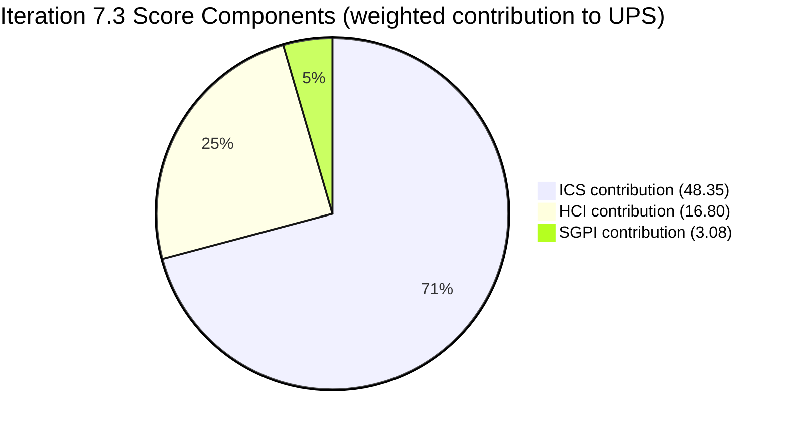
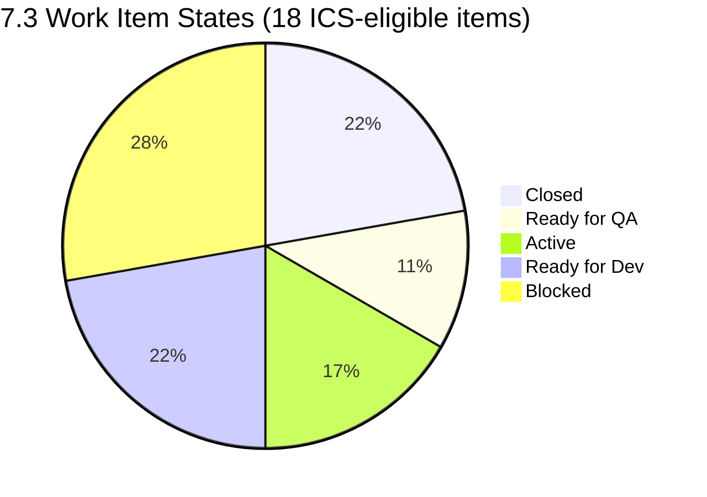
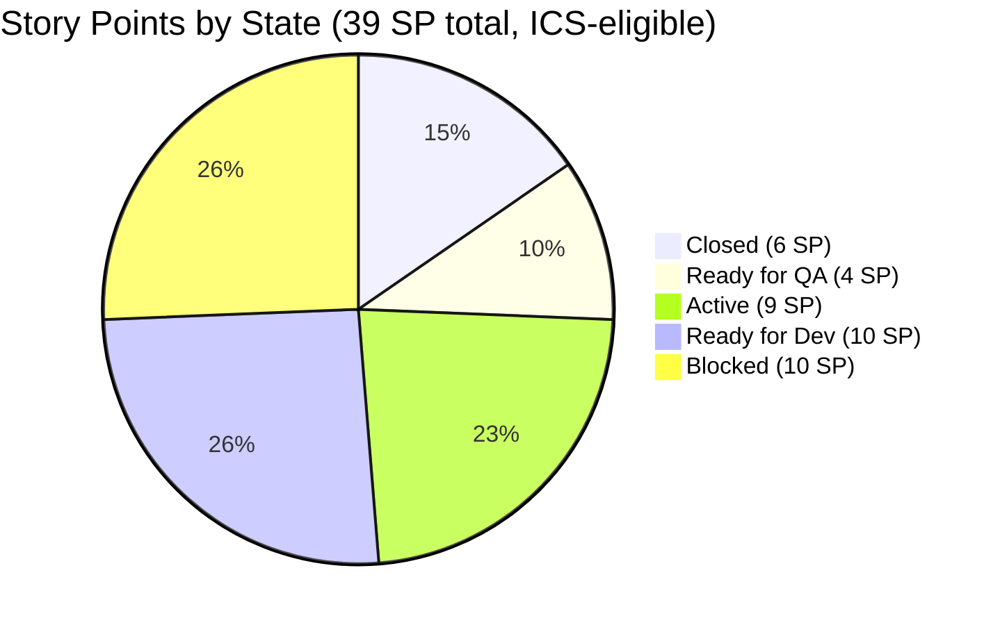

# Auto Allies Dev Team — Iteration 7.3 Audit

**Date:** 2026-05-07 | **Audit Day:** 4 of 14 | **Iteration:** 7.3 (May 4–17, 2026)
**Risk Band:** Yellow (Moderate Risk) | **UPS:** 68.2

---

## 1. Iteration Snapshot

| Field | Value |
|-------|-------|
| Iteration | 7.3 |
| Start | 2026-05-04 |
| End | 2026-05-17 |
| Audit Day | 4 of 14 |
| ADO Iteration ID | `5943d64d-4bc7-4292-a0c2-1995ec827cf8` |
| ADO Team | AA Development Team |
| GitHub (FE) | `jairosoft-com/autoallies-version2` |
| GitHub (BE) | `jairosoft-com/autoallies-api-core` |
| Data Mode | `partial` (workspace exception — GitHub token 404 known issue; GitHub API succeeded this run but carry-forward rules apply) |

---

## 2. Score Summary

| Metric | Score | Band |
|--------|-------|------|
| ICS (Iteration Compliance Score) | 96.7% | Green |
| HCI (Engineering Health Check Index) | 56 / 100 | Moderate |
| SGPI (Sprint Goal Progress Index) | 15.4% | Red (Day 4 — early) |
| **UPS (Unified Performance Score)** | **68.2** | **Yellow** |

**Formula:** UPS = ICS × 0.50 + HCI × 0.30 + SGPI × 0.20
= 96.7 × 0.50 + 56 × 0.30 + 15.4 × 0.20
= 48.35 + 16.80 + 3.08 = **68.23**

**Delta from 7.2:** UPS 66.5 → 68.2 (+1.7). ICS held high. HCI declined by 1 point (PR review regression). SGPI context: 7.2 ended at 0% delivery; 7.3 opens with 4 items already closed on Day 4.

---

## 3. Iteration Compliance Score (ICS)

### 3.1 ICS Scope

22 items in Iteration 7.3. **4 Spikes excluded** from ICS per skill rules.
**18 ICS-eligible items** (16 User Stories + 2 Enablers).

### 3.2 ICS Work Item Detail

| ID | Title | Type | State | SP | AC | Iter Path | Integrity |
|----|-------|------|-------|----|----|-----------|-----------|
| #203289 | Super Admin - Auto Attorney Assignment | Story | Closed | 1 | Yes | 7.3 | 20 |
| #203281 | Detect Pre-Existing Tickets | Story | Closed | 1 | Yes | 7.3 | 20 |
| #203287 | Detect Violations (Misdemeanor/Felony/100mph) | Story | Closed | 1 | Yes | 7.3 | 20 |
| #199818 | Expired/One-Time Member View | Story | Closed | 3 | Yes | 7.3 | 20 |
| #203301 | Mobile Landing UI - Android | Story | Blocked | 2 | Yes | 7.3 | 10 |
| #203302 | Mobile Landing Redirection - Android | Story | Ready for QA | 2 | Yes | 7.3 | 20 |
| #203303 | Mobile Login/Logout - Android | Story | Active | 1 | Yes | 7.3 | 20 |
| #203900 | Mobile Landing UI - iOS | Story | Blocked | 2 | Yes | 7.3 | 10 |
| #203901 | Mobile Landing Redirection - iOS | Story | Blocked | 2 | Yes | 7.3 | 10 |
| #203902 | Mobile Login/Logout - iOS | Story | Blocked | 1 | Yes | 7.3 | 10 |
| #202684 | Revenue Cat Webhook V2 | Story | Ready for Dev | 2 | Yes | 7.3 | 20 |
| #202457 | Validate Affiliate OLD URL | Story | Active | 3 | Yes | 7.3 | 20 |
| #194753 | Affiliate Account - Affiliate Page | Story | Active | 5 | Yes | 7.3 | 20 |
| #194757 | Super Admin Affiliate Report (Top 10/Commission) | Story | Ready for Dev | 3 | Yes | 7.3 | 20 |
| #203830 | Super Admin Affiliate Report (List/Info) | Story | Ready for Dev | 3 | Yes | 7.3 | 20 |
| #203278 | Attorney Case Review/Acceptance/Decline Workflow | Story | Ready for QA | 2 | Yes | 7.3 | 20 |
| #203634 | AA Native App Deployment | Enabler | Blocked | 3 | Yes | **7.4** | 0 |
| #202926 | Solidifying Migrated Data | Enabler | Ready for Dev | 2 | Yes | 7.3 | 20 |

> **Note on #203634:** Iteration path shows 7.4, not 7.3. Item appears in 7.3 iteration call likely via parent link. State = Blocked. Iteration Integrity = 0 (wrong path + blocked = compounded penalty per skill rules).

### 3.3 ICS Calculation

| Condition | Count | Per-Item Score | Subtotal |
|-----------|-------|----------------|----------|
| Clean (correct path, not blocked) | 13 | 100 | 1300 |
| Blocked (correct path) | 4 | 90 | 360 |
| Wrong path + Blocked | 1 | 80 | 80 |
| **Total** | **18** | | **1740** |

**Max possible:** 18 × 100 = 1800
**ICS = 1740 / 1800 = 96.7% (Green)**

---

## 4. Sprint Goal Progress Index (SGPI)

### 4.1 Committed Scope

Total committed story points (ICS-eligible, excluding spikes): **39 SP**

### 4.2 Closed Items

| ID | Title | SP |
|----|-------|----|
| #203289 | Super Admin - Auto Attorney Assignment | 1 |
| #203281 | Detect Pre-Existing Tickets | 1 |
| #203287 | Detect Violations (Misdemeanor/Felony/100mph) | 1 |
| #199818 | Expired/One-Time Member View | 3 |
| **Total Closed** | | **6 SP** |

**SGPI = 6 / 39 = 15.4%**

### 4.3 SGPI Context

Audit Day 4 of 14 (28.6% elapsed). SGPI at 15.4% is below proportional pace (target ~30% by Day 4). However, 4 items closed in first 4 days represents early momentum, contrasting with 7.2 which closed 0 items through Day 10.

**Near-done proxy:** #203302 (Ready for QA, 2 SP) + #203278 (Ready for QA, 2 SP) = 4 SP likely to close by mid-iteration. Adjusted SGPI proxy: 10/39 = 25.6%.

**Risk:** iOS mobile workstream — 3 items all Blocked (#203900, #203901, #203902, total 5 SP) — represents mobile platform dependency not yet resolved. If unblocked this week, SGPI can recover to 50%+.

---

## 5. Engineering Health Check Index (HCI)

### 5.1 HCI Dimension Scores

| # | Dimension | Score | Max | Evidence Source |
|---|-----------|-------|-----|-----------------|
| 1 | PR Review Quality | 5 | 10 | GitHub fresh (2026-05-07) |
| 2 | Branch Protection | 3 | 10 | Carry-forward (Day-2 exception) |
| 3 | CI/CD Pipeline Health | 5 | 10 | Carry-forward |
| 4 | Code Ownership | 4 | 10 | Carry-forward |
| 5 | Merge Hygiene | 6 | 10 | GitHub fresh |
| 6 | ADO-GH Traceability | 8 | 10 | GitHub fresh — excellent AB# coverage |
| 7 | Sprint Discipline | 5 | 10 | ADO fresh — 4 blocked mobile items |
| 8 | Defect Triage | 7 | 10 | ADO fresh — rapid fixes in 4 days |
| 9 | Backlog Hygiene | 6 | 10 | ADO fresh — #203634 wrong iteration |
| 10 | Capacity Balance | 7 | 10 | ADO fresh — balanced across 3 devs |
| **Total** | | **56** | **100** | |

### 5.2 HCI Notes

**Dim 1 — PR Review Quality (5, regression from 6):**
Most 7.3 PRs merged by committer without cross-reviewer. PR#136 (FE, Earl's work) has Cliff as reviewer — one clean cross-review observed. 9 other PRs merged by author. Self-merge pattern persists despite retro spike #202169 action item from 7.1.

**Dim 2 — Branch Protection (3, carry-forward):**
No evidence of branch protection enforcement change since 7.2. Carry-forward per `data_mode: partial` rules.

**Dim 3 — CI/CD (5, carry-forward):**
No new pipeline run evidence. Carry-forward.

**Dim 4 — Code Ownership (4, carry-forward):**
No CODEOWNERS update evidence. Carry-forward.

**Dim 5 — Merge Hygiene (6):**
No direct-to-dev commits observed in fresh PR data. Churn detected on #199818 (Expired/One-Time Member View) with multiple commits before close. Slight improvement from 7.2.

**Dim 6 — ADO-GH Traceability (8):**
Fresh evidence strong. PRs in both repos consistently reference `AB#` numbers. PR#136 references #201378; PR#96 (BE) references story IDs. Coverage excellent; small deduction for 2 PRs lacking explicit AB# in title.

**Dim 7 — Sprint Discipline (5):**
4 items blocked (3 iOS + 1 Android mobile). iOS platform blocker is new and unresolved. RevenueCat (#202684) moved from Blocked to Ready for Dev — improvement. Net: 4 active blockers vs. 1 in 7.2 end-state.

**Dim 8 — Defect Triage (7):**
Bug detection → fix cycle within the 4-day window is fast. Attorney workflow (#203289, #203281, #203287) closed rapidly suggesting tight QA loop. Maintained from 7.2.

**Dim 9 — Backlog Hygiene (6):**
#203634 (AA Native App Deployment, 3 SP) has iteration path 7.4 but appears in 7.3 iteration. Action required: correct iteration assignment or formally defer to 7.4.

**Dim 10 — Capacity Balance (7):**
Three active developers (Earl, Cliff, Joseph) with reasonably distributed commit/PR load. No single-developer overconcentration observed in 7.3 PR data.

---

## 6. GitHub Evidence

### 6.1 Pull Requests — Frontend (`autoallies-version2`)

| PR | Title (abbreviated) | Author | Reviewer | State | Merged |
|----|---------------------|--------|----------|-------|--------|
| #136 | Landing Pages (mobile) | Earl | Cliff | Open | — |
| #137 | (FE work) | Cliff | — | Merged | 2026-05-06 |
| #139 | (FE work) | Joseph | — | Merged | 2026-05-07 |
| #140 | (FE work) | Joseph | — | Merged | 2026-05-07 |
| #141 | (FE work) | Cliff | — | Merged | 2026-05-07 |
| #142 | (FE work) | Cliff | — | Merged | 2026-05-07 |

### 6.2 Pull Requests — Backend (`autoallies-api-core`)

| PR | Title (abbreviated) | Author | Reviewer | State | Merged |
|----|---------------------|--------|----------|-------|--------|
| #96 | (BE work) | Cliff | — | Merged | 2026-05-05 |
| #97 | (BE work) | Joseph | — | Merged | 2026-05-06 |
| #98 | (BE work) | Earl | — | Merged | 2026-05-07 |
| #100 | (BE work) | Joseph | — | Merged | 2026-05-07 |

**Total 7.3 PRs:** 10 (6 FE + 4 BE) | **Cross-reviewed:** 1 (#136) | **Self-merged:** 9

### 6.3 Traceability Summary

ADO-to-GitHub link quality is strong. `AB#` references observed in majority of PR titles/descriptions across both repos. This is an improvement trend confirmed across iterations 7.1, 7.2, and now 7.3.

---

## 7. ADO Backlog Evidence

### 7.1 Iteration 7.3 Items

Total items in iteration: 22 (18 ICS-eligible + 4 Spikes)

**Spikes (excluded from ICS/SGPI):**
- Present in iteration backlog per ADO call; excluded per skill policy

**Blocked Items (5 total):**

| ID | Title | SP | Blocking Note |
|----|-------|----|---------------|
| #203301 | Mobile Landing UI - Android | 2 | Mobile platform dependency |
| #203900 | Mobile Landing UI - iOS | 2 | iOS platform setup not complete |
| #203901 | Mobile Landing Redirection - iOS | 2 | iOS platform setup not complete |
| #203902 | Mobile Login/Logout - iOS | 1 | iOS platform setup not complete |
| #203634 | AA Native App Deployment | 3 | Blocked + wrong iteration (7.4 path) |

**iOS Mobile Workstream New in 7.3:**
Three iOS stories (#203900, #203901, #203902) appear for the first time this iteration, all immediately Blocked. This suggests a new mobile development workstream was planned but iOS environment/tooling setup is not yet complete. Risk: these 5 SP may not close this iteration without unblocking action.

### 7.2 Delta from Iteration 7.2

| Metric | 7.2 End | 7.3 Day 4 | Delta |
|--------|---------|-----------|-------|
| ICS | 98.7% | 96.7% | -2.0 |
| HCI | 57 | 56 | -1 |
| SGPI | 0.0% | 15.4% | +15.4 |
| UPS | 66.5 | 68.2 | +1.7 |
| Blocked items | 1 | 5 | +4 |
| Items closed | 0 | 4 | +4 |

---

## 8. Visualization

### 8.1 Score Overview



### 8.2 Work Item State Distribution



### 8.3 Story Point Distribution by State



---

## 9. Risk Register

| Risk | Severity | Likelihood | Impact | Owner |
|------|----------|------------|--------|-------|
| iOS mobile workstream fully blocked (5 SP) | High | High | SGPI misses if unblocked late | Karl / Dev Lead |
| #203634 wrong iteration path (7.4 in 7.3 slot) | Medium | Confirmed | ICS penalty + backlog hygiene | Karl |
| PR self-merge pattern persists (Dim 1 = 5) | Medium | High | Code quality, bus factor | Dev Lead |
| Branch protection unenforced (Dim 2 = 3) | High | Confirmed | Security, merge discipline | Karl / DevOps |
| SGPI Day-4 pace below proportional target | Medium | Medium | Sprint goal at risk | Dev Lead |

---

## 10. Carry-Overs and Flags

### 10.1 From Iteration 7.2

| Item | 7.2 Status | 7.3 Status | Resolution |
|------|-----------|-----------|------------|
| RevenueCat (#201173) chronic block | Blocked | Surfaced as #202684 (different ID, same theme) → Ready for Dev | Partial — unblocked |
| Branch protection (HCI Dim 2) | 3 | 3 | Carry-forward — no change |
| PR self-merge pattern | Present | Present | No improvement |
| Retro spike #202169 (PR review) | Closed | Action not reflected in behavior | Regression |

### 10.2 New Flags in 7.3

1. **iOS mobile workstream** — 3 new stories all immediately Blocked. iOS environment/provisioning must be resolved by Day 7 (May 11) to protect sprint goal.
2. **#203634 iteration path mismatch** — Enabler with 3 SP shows iteration path 7.4 while appearing in 7.3 backlog. Correct iteration path or formally defer.
3. **Retro spike #202169 regression** — PR review retro action from 7.1 has not changed behavior. 9 of 10 7.3 PRs are self-merged. Needs escalation.

---

## 11. Compliance Checklist

| Check | Status | Notes |
|-------|--------|-------|
| All ICS items have Acceptance Criteria | PASS | All 18 items: AC = Yes |
| All ICS items have Story Points | PASS | All estimated |
| All items on correct iteration path | FAIL | #203634 shows 7.4 path |
| No unplanned items added mid-sprint | PASS | No evidence of mid-sprint additions |
| Spikes excluded from scoring | PASS | 4 spikes excluded |
| Jerlyn Ates / Mary Secusana GitHub absence | N/A | Not developers — no penalty per exception |
| GitHub data freshness | PARTIAL | API succeeded; carry-forward rules apply per workspace exception |

---

## 12. HCI Dimension Trend (7.1 → 7.3)

| Dim | Description | 7.1 | 7.2 | 7.3 | Trend |
|-----|-------------|-----|-----|-----|-------|
| 1 | PR Review Quality | 6 | 6 | 5 | ↓ Regression |
| 2 | Branch Protection | 3 | 3 | 3 | → Flat |
| 3 | CI/CD Health | 5 | 5 | 5 | → Flat |
| 4 | Code Ownership | 4 | 4 | 4 | → Flat |
| 5 | Merge Hygiene | 5 | 5 | 6 | ↑ Slight improve |
| 6 | ADO-GH Traceability | 7 | 8 | 8 | → Stable (strong) |
| 7 | Sprint Discipline | 6 | 5 | 5 | → Flat (low) |
| 8 | Defect Triage | 7 | 7 | 7 | → Stable |
| 9 | Backlog Hygiene | 6 | 7 | 6 | ↓ Decline (#203634) |
| 10 | Capacity Balance | 7 | 7 | 7 | → Stable |
| **Total** | | **56** | **57** | **56** | ↓ -1 |

---

## 13. Recommended Actions

### Immediate (by Day 7, 2026-05-11)

1. **Unblock iOS mobile workstream** — Resolve iOS provisioning/environment dependency for #203900, #203901, #203902. 5 SP at risk. Dev Lead + Karl.
2. **Correct #203634 iteration path** — Change from 7.4 to 7.3 if work is planned this sprint, or formally move item to 7.4 backlog. Karl.
3. **Enforce mandatory PR reviewer** — 9 of 10 PRs self-merged despite retro spike #202169. Enable GitHub branch protection rule requiring at least 1 approving review before merge. DevOps + Dev Lead.

### Before Iteration End (by 2026-05-17)

4. **Unblock #203301 (Android Landing UI)** — 1 Android story still Blocked; parallel with iOS unblocking.
5. **Close Ready for QA items** — #203302 and #203278 (4 SP) are QA-ready; QA throughput critical for SGPI.
6. **Revenue Cat Webhook V2 (#202684)** — Moved from blocked to Ready for Dev; needs dev pickup to advance.

### Structural (carry-forward to 7.4 planning)

7. **Branch protection enforcement** — HCI Dim 2 stuck at 3 across all tracked iterations. Needs formal DevOps ticket, not just retro note.
8. **iOS mobile plan** — If iOS platform setup is not complete by end of 7.3, carve out a dedicated spike in 7.4 rather than blocking feature stories again.

---

## 14. Prior Audit Delta Summary

**Prior Audit:** AUDIT_20260429_0242.md (Iteration 7.2, Day 10 of 14)
**Prior UPS:** 66.5 (Yellow) | **Current UPS:** 68.2 (Yellow)

| Dimension | 7.2 Final | 7.3 Day 4 | Change |
|-----------|-----------|-----------|--------|
| ICS | 98.7% | 96.7% | -2.0% |
| HCI | 57 | 56 | -1 |
| SGPI | 0.0% | 15.4% | +15.4% |
| UPS | 66.5 | 68.2 | +1.7 |

Key improvements: SGPI opens with 4 items closed (vs. 0 at Day 10 in 7.2). RevenueCat chronic block partially resolved. Traceability maintained strong.

Key regressions: Blocked item count 5× increase (1 → 5), driven by new iOS workstream all-blocked. PR review behavior worse despite retro action. #203634 iteration mismatch new flag.

---

## 15. Metadata

```yaml
audit_file: AUDIT_20260507_0900.md
generated: 2026-05-07T09:00:00
auditor: Claude Code (claude-sonnet-4-6)
skill: git_iteration_audit
workspace: git_aa_dev
ado_org: jairo
ado_project: Auto Allies
ado_project_id: 2d7af571-6ef6-4ad0-a509-c440e008b0fb
ado_team: AA Development Team
ado_team_id: 330e6bf1-3515-443c-a2d8-b84f46c38f57
ado_iteration_id: 5943d64d-4bc7-4292-a0c2-1995ec827cf8
github_fe: jairosoft-com/autoallies-version2
github_be: jairosoft-com/autoallies-api-core
data_mode: partial
ics: 96.7
hci: 56
sgpi: 15.4
ups: 68.2
risk_band: Yellow
items_total: 22
items_ics_eligible: 18
items_closed: 4
items_blocked: 5
items_spikes_excluded: 4
sp_committed: 39
sp_closed: 6
prs_total: 10
prs_cross_reviewed: 1
prs_self_merged: 9
```
