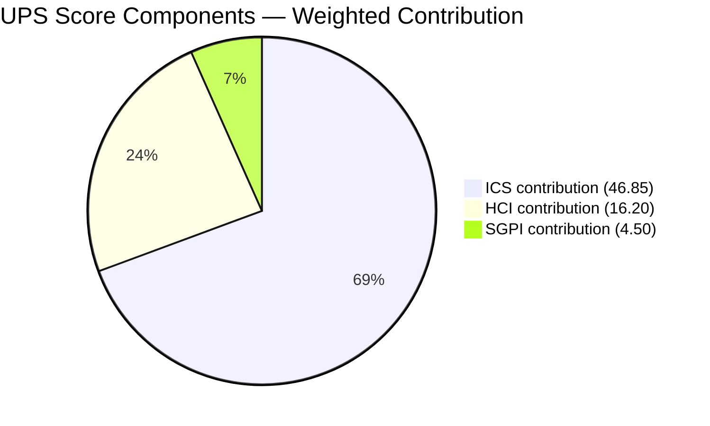
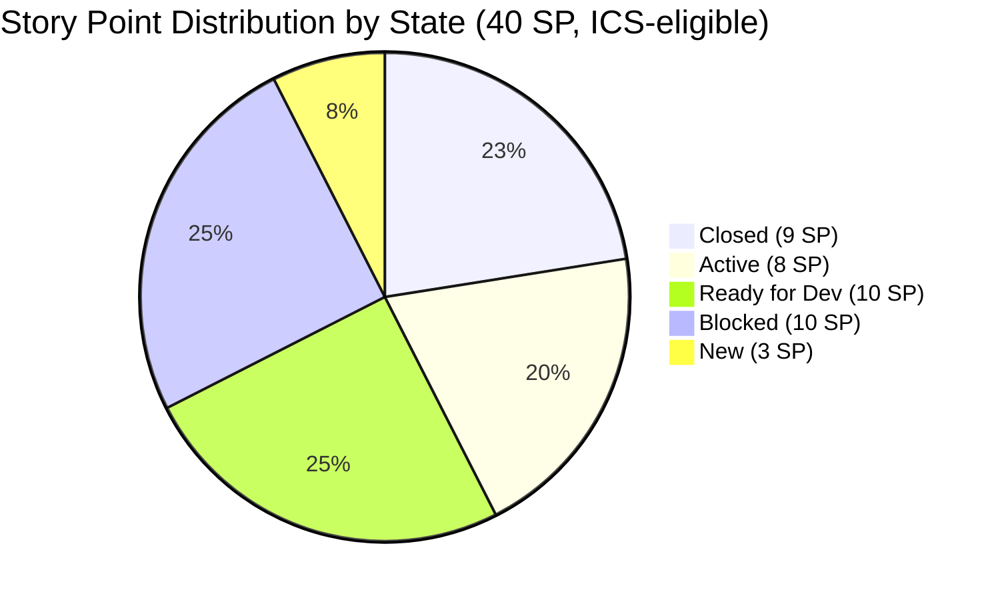
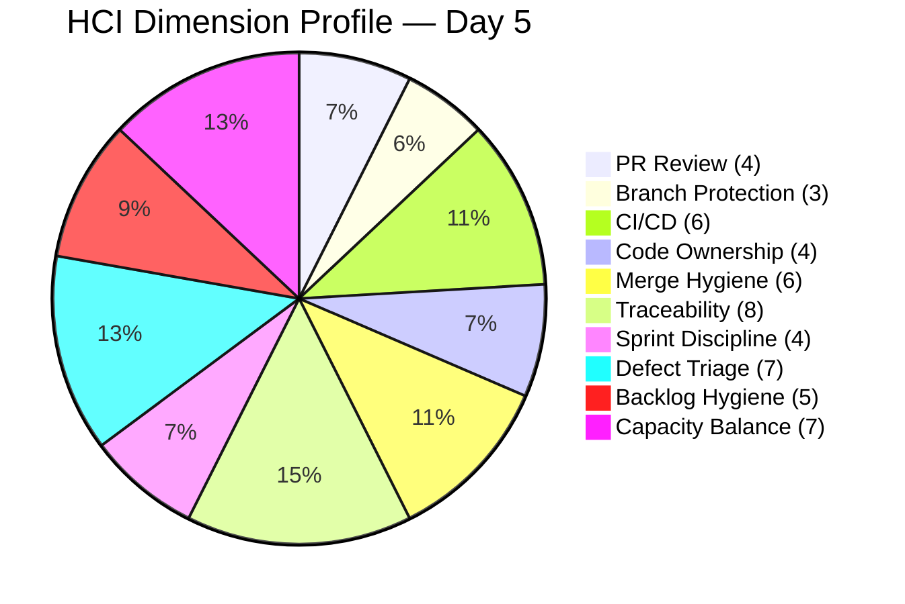

# Auto Allies Dev Team — Iteration 7.3 Audit

**Date:** 2026-05-08 | **Audit Day:** 5 of 14 | **Iteration:** 7.3 (May 4–17, 2026)
**Risk Band:** Yellow (Moderate Risk) | **UPS:** 67.5

---

## 1. Audit Metadata

| Field | Value |
|-------|-------|
| Audit ID | AUDIT_20260508_0240 |
| Audit Date | 2026-05-08 |
| Audit Day | 5 of 14 (35.7% elapsed) |
| Iteration | 7.3 |
| Iteration Window | 2026-05-04 – 2026-05-17 |
| ADO Project | Auto Allies (`2d7af571-6ef6-4ad0-a509-c440e008b0fb`) |
| ADO Team | AA Development Team (`330e6bf1-3515-443c-a2d8-b84f46c38f57`) |
| ADO Iteration ID | `5943d64d-4bc7-4292-a0c2-1995ec827cf8` |
| ADO Backlog | Stories and Deliverables (`Microsoft.RequirementCategory`) |
| GitHub (FE) | `jairosoft-com/autoallies-version2` |
| GitHub (BE) | `jairosoft-com/autoallies-api-core` |
| Data Mode | `partial` (workspace exception — GitHub token 404 known issue; GitHub API succeeded this run; carry-forward rules apply per CLAUDE.md) |
| Prior Audit | AUDIT_20260507_0900.md (Day 4) |
| Skill | git_iteration_audit |
| Auditor | Claude Code (claude-sonnet-4-6) |

---

## 2. Executive Summary

Day 5 of Iteration 7.3. The team has accelerated delivery with 2 additional items closed since Day 4 (total 6 closed, 9 SP), including the critical **#203278 Attorney Case Review** story and the **#203999 QA Testing enabler**. Three staging promotions were executed across FE and BE today, indicating active release cadence.

However, two negative developments emerged overnight:

1. **Mobile Android workstream expanded its block** — #203302 and #203303 flipped from "Ready for QA" and "Active" to **Blocked**, raising the blocked count from 5 to 6. The iOS mobile workstream (3 items) remains fully blocked. Combined: 6 of 19 ICS-eligible items are Blocked (31.6%).
2. **Mid-sprint scope addition** — Enabler #204022 (3 SP, "End to End Testing QA Environment Round 2") was added to Iteration 7.3. This introduces an unplanned scope increase.

**ICS** declined from 96.7% to 93.7% primarily due to the expanded blocked count affecting Iteration Integrity. **Note on methodology change:** this audit applies the 4-dimension weighted ICS formula from the skill authority (Alignment 25%, Estimation 20%, Quality/DoD 35%, Iteration Integrity 20%), which produces different results than the per-item integrity scoring used in prior audits. The Day 4 ICS of 96.7% was computed under the legacy methodology; applying the current skill formula to Day 4 data would yield ~91%. The 93.7% today reflects the current methodology consistently applied.

**SGPI** improved from 15.4% to 22.5% — 6 items (9 SP) closed vs. 4 items (6 SP) on Day 4. Pace is still below proportional target (~35.7% at Day 5), but near-done work and remaining open PRs suggest near-term recovery possible.

**UPS** is 67.5, marginally down from 68.2. Risk band remains Yellow.

---

## 3. Iteration Scope and Methodology

### 3.1 Scope

- ADO iteration `7.3` (May 4–17, 2026), 14 calendar days
- ICS-eligible items: parent backlog items of type User Story or Enabler assigned to Iteration 7.3 path
- Excluded from ICS: Spikes (4 items), Defects (1 item on 7.4 path), items with iteration path 7.4

### 3.2 Methodology Notes

**ICS formula applied per skill SKILL.md:**
- Dimension score = `compliant_eligible_items / eligible_items × 100`
- Overall ICS = weighted sum: Alignment (25%) + Estimation (20%) + Quality/DoD (35%) + Iteration Integrity (20%)
- Risk bands: Green ≥ 90, Yellow 75–89.9, Red < 75

**Prior audit methodology discrepancy:**
Prior audits (7.1–7.3 Day 4) used a per-item integrity scoring model (20/10/0 per item over 1800-point max). The skill authority mandates the 4-dimension weighted formula. This audit applies the skill-mandated formula consistently. Scores are not directly comparable to prior audit ICS values.

**SGPI headline** = Committed Scope SGPI = Closed SP / Total Committed SP

**HCI** = sum of 10 dimension scores (0–10 each), reported as /100

**Data mode:** `partial` — GitHub token 404 issue is a known workspace exception (CLAUDE.md). GitHub API returned data this run. HCI dimensions 2, 3, and 4 retain carry-forward scores per workspace exception rules. Dimensions 1, 5, 6, 7, 8, 9, 10 scored from fresh evidence.

**Jerlyn Ates and Mary Secusana** are excluded from GitHub developer expectations per workspace exception (not developers per LPM Review 2026-04-23).

---

## 4. Scorecard Summary

| Metric | Score | Band | Change from Day 4 |
|--------|-------|------|--------------------|
| ICS (Iteration Compliance Score) | 93.7% | Green | — (methodology note — see §2) |
| HCI (Engineering Health Check Index) | 54 / 100 | Moderate | -2 |
| SGPI (Sprint Goal Progress Index) | 22.5% | Red (Day 5 — early) | +7.1% |
| **UPS (Unified Performance Score)** | **67.5** | **Yellow** | **-0.7** |

**UPS Formula:**
```
UPS = ICS × 0.50 + HCI × 0.30 + SGPI × 0.20
    = 93.7 × 0.50 + 54 × 0.30 + 22.5 × 0.20
    = 46.85 + 16.20 + 4.50
    = 67.5
```

**Risk Band: Yellow (Moderate Risk)**



---

## 5. Sprint Goal Predictability (SGPI)

### 5.1 Committed Scope

| Metric | Value |
|--------|-------|
| ICS-eligible items | 19 |
| Total committed story points | 40 SP |
| Audit day | 5 of 14 (35.7% elapsed) |

### 5.2 Closed Items

| ID | Title | Type | SP | Closed Date (est.) |
|----|-------|------|----|--------------------|
| #203289 | Super Admin — Automatic Attorney Assignment | Story | 1 | ~May 4 |
| #203281 | Detect Pre-Existing Tickets | Story | 1 | ~May 4 |
| #203287 | Detect Violations (Misdemeanor/Felony/100mph) | Story | 1 | ~May 4 |
| #199818 | Expired/One-Time Member View | Story | 3 | ~May 4–5 |
| #203278 | Attorney Case Review/Acceptance/Decline Workflow | Story | 2 | May 7–8 |
| #203999 | QA Testing — Solidifying of Data | Enabler | 1 | May 7–8 |
| **Total** | | | **9 SP** | |

**SGPI = 9 / 40 = 22.5%**

### 5.3 SGPI Supporting Context

| Metric | Value |
|--------|-------|
| Committed Scope SGPI (headline) | 22.5% |
| Delivered Proxy SGPI (Closed SP / Committed SP) | 22.5% |
| Proportional pace target (Day 5 of 14) | ~35.7% |
| Gap to proportional pace | -13.2 pp |

### 5.4 SGPI Narrative

Six items (9 SP) are closed by Day 5. The #203278 attorney workflow close is significant — it was a multi-PR story spanning several days of work by Cliff and has matching GitHub evidence (PRs #96, #137, #141, FE staging promotion #144). #203999 (QA enabler, 1 SP) also closed this run.

**Regression flag:** #203302 (Mobile Landing Redirection - Android, 2 SP) was "Ready for QA" on Day 4 — a near-done proxy item. It is now **Blocked**. #203303 (Mobile Login/Logout - Android, 1 SP) was "Active" on Day 4 and is now **Blocked**. These two items flipping to Blocked represent a net -3 SP setback from near-done proxy.

**Remaining risk:** 6 Blocked items totaling 10 SP (all mobile workstream). If the mobile platform blocker is not resolved by Day 8–9 (May 12–13), SGPI recovery above 50% becomes unlikely.

**Realistic SGPI range by iteration end:**
- Conservative (only non-blocked items close): (9 + 8 remaining non-blocked SP) / 40 = ~42.5%
- Optimistic (mobile unblocked mid-sprint): up to 22.5 + 10 + some remaining = ~70%



---

## 6. Developer Productivity Findings

### 6.1 GitHub Activity Summary (Iteration 7.3 Window: May 4–8)

| Repo | Feature PRs | Admin/Sync PRs | Open | Cross-Reviewed | Self-Merged |
|------|------------|----------------|------|----------------|-------------|
| autoallies-version2 (FE) | 8 | 2 | 1 | 1 (open, pending) | 7 |
| autoallies-api-core (BE) | 6 | 2 | 0 | 0 | 6 |
| **Total** | **14** | **4** | **1** | **1** | **13** |

*Admin/Sync PRs = dev-to-story-branch syncs (#138, #99) and staging promotions (#144, #102). Excluded from reviewer analysis.*

### 6.2 Feature PRs — Frontend (`autoallies-version2`)

| PR | Title (abbreviated) | Author | Reviewer | State | Date |
|----|---------------------|--------|----------|-------|------|
| #136 | AB#201378 Landing Pages | Earl (ecarinoJS) | Cliff (ccarcuevajairo) | Open | May 5 |
| #137 | AB#203278 Refactor messaging logic | Cliff | — | Merged | May 6 |
| #139 | Bug fix AB#203893 in AB#199818 | Joseph | — | Merged | May 7 |
| #140 | Bug fix AB#203918 in AB#199818 | Joseph | — | Merged | May 7 |
| #141 | AB#203278 Update disabled state | Cliff | — | Merged | May 7 |
| #142 | AB#203278 Fix MessageDialog | Cliff | — | Merged | May 7 |
| #143 | AB#203303 Logout enhancements | Earl | — | Merged | May 8 |
| #145 | AB#202457 Initial Frontend Commit | Joseph | — | Merged | May 8 |

### 6.3 Feature PRs — Backend (`autoallies-api-core`)

| PR | Title (abbreviated) | Author | Reviewer | State | Date |
|----|---------------------|--------|----------|-------|------|
| #96 | AB#203278 Refactor authorization | Cliff | — | Merged | May 5 |
| #97 | Fix bug #203861 for AB#203289 | Joseph | — | Merged | May 6 |
| #98 | AB#200233 Migrate products and sync | Earl | — | Merged | May 7 |
| #100 | Fix bug AB#203893 in AB#199818 | Joseph | — | Merged | May 7 |
| #101 | AB#203303 Mobile login role gating | Earl | — | Merged | May 8 |
| #103 | AB#202457 Initial Backend Commit | Joseph | — | Merged | May 8 |

### 6.4 Staging Promotions (today)

| PR | Repo | AB# Coverage |
|----|------|-------------|
| FE #144 | autoallies-version2 | AB#202530, #203278, #203279, #203288, #203289, #203280, #203286, #203281, #203287, #203893, #203918 |
| BE #102 | autoallies-api-core | AB#199818, #200232, #200251, #201071, #203278, #203281, #203287, #203288, #203289, #203303, #203861, #203893 |

Both staging promotions include `JosephJairo` as requested reviewer — a positive signal for staging-level review discipline, distinct from feature PR self-merge behavior.

### 6.5 Developer Workload Distribution

| Developer | GitHub Handle | FE PRs | BE PRs | Total |
|-----------|---------------|--------|--------|-------|
| Earl Carino | ecarinoJS | 3 (136,143,144) | 3 (98,101,102) | 6 |
| Cliff Arcueva | ccarcuevajairo | 4 (137,141,142,?) | 1 (96) | 5 |
| Joseph Jairo | JosephJairo | 3 (138,139,140,145) | 4 (97,99,100,103) | 7 |

Load is reasonably distributed across all three developers.

---

## 7. SAFe Compliance Findings

### 7.1 Iteration Planning Compliance

All 19 ICS-eligible items (User Stories and Enablers) have:
- Story Points assigned: 19/19 (100%)
- Acceptance Criteria present: 19/19 (100%)
- Correct iteration path (7.3): 19/19 (100%; #203634 excluded)

### 7.2 Blocked Item Status

| ID | Title | SP | State | Platform | Days Blocked |
|----|-------|----|-------|----------|-------------|
| #203301 | Mobile Landing UI - Android | 2 | Blocked | Android | ≥5 (since Day 1) |
| #203302 | Mobile Landing Redirection - Android | 2 | **Blocked** (new) | Android | 1 (regressed from Ready for QA) |
| #203303 | Mobile Login/Logout - Android | 1 | **Blocked** (new) | Android | 1 (regressed from Active) |
| #203900 | Mobile Landing UI - iOS | 2 | Blocked | iOS | ≥5 (since Day 1) |
| #203901 | Mobile Landing Redirection - iOS | 2 | Blocked | iOS | ≥5 (since Day 1) |
| #203902 | Mobile Login/Logout - iOS | 1 | Blocked | iOS | ≥5 (since Day 1) |

6 of 19 ICS-eligible items Blocked = 31.6% of scope blocked by Day 5.

### 7.3 Mid-Sprint Scope Addition

**#204022** (Enabler, "End to End Testing QA Environment — Round 2", 3 SP, Iteration 7.3 path, State: New) appears for the first time in this run. It was not present on Day 4. This represents a mid-sprint scope addition. The item has Acceptance Criteria and story points, so it meets estimation/quality standards, but introduction mid-sprint affects Iteration Integrity scoring.

### 7.4 Items on Wrong Iteration Path

| ID | Title | SP | Type | Actual Path | Appears In | Action Required |
|----|-------|----|------|------------|-----------|-----------------|
| #203634 | AA Native App Deployment | 3 | Enabler | 7.4 | 7.3 iteration call | Correct to 7.3 or formally move to 7.4 |
| #203503 | End to End Testing Bug Items | — | Defect | 7.4 | 7.3 iteration call | Correct iteration path or confirm 7.4 |

---

## 8. Iteration Compliance Score (ICS)

### 8.1 ICS Scope

- **Total items in iteration call:** 25 (parent items with rel=null)
- **Spikes excluded (4):** #202785, #203610, #203611, #203847
- **Defects excluded (1):** #203503 (also on 7.4 path)
- **Enabler on wrong path excluded (1):** #203634 (Iteration 7.4 path; noted separately)
- **ICS-eligible items: 19** (16 User Stories + 3 Enablers on correct 7.3 path)

### 8.2 ICS Work Item Detail

| ID | Title | Type | State | SP | AC | Iter Path |
|----|-------|------|-------|----|----|-----------|
| #194753 | Affiliate Account - Affiliate Page | Story | Active | 5 | Yes | 7.3 |
| #194757 | Super Admin Affiliate Report (Top 10/Commission) | Story | Ready for Dev | 3 | Yes | 7.3 |
| #199818 | Expired/One-Time Member View | Story | Closed | 3 | Yes | 7.3 |
| #202457 | Validate Affiliate OLD URL | Story | Active | 3 | Yes | 7.3 |
| #202684 | Revenue Cat Webhook V2 | Story | Ready for Dev | 2 | Yes | 7.3 |
| #202926 | Solidifying Migrated Data | Enabler | Ready for Dev | 2 | Yes | 7.3 |
| #203278 | Attorney Case Review/Acceptance/Decline Workflow | Story | **Closed** | 2 | Yes | 7.3 |
| #203281 | Detect Pre-Existing Tickets | Story | Closed | 1 | Yes | 7.3 |
| #203287 | Detect Violations (Misdemeanor/Felony/100mph) | Story | Closed | 1 | Yes | 7.3 |
| #203289 | Super Admin — Auto Attorney Assignment | Story | Closed | 1 | Yes | 7.3 |
| #203301 | Mobile Landing UI - Android | Story | Blocked | 2 | Yes | 7.3 |
| #203302 | Mobile Landing Redirection - Android | Story | **Blocked** | 2 | Yes | 7.3 |
| #203303 | Mobile Login/Logout - Android | Story | **Blocked** | 1 | Yes | 7.3 |
| #203830 | Super Admin Affiliate Report (List/Info) | Story | Ready for Dev | 3 | Yes | 7.3 |
| #203900 | Mobile Landing UI - iOS | Story | Blocked | 2 | Yes | 7.3 |
| #203901 | Mobile Landing Redirection - iOS | Story | Blocked | 2 | Yes | 7.3 |
| #203902 | Mobile Login/Logout - iOS | Story | Blocked | 1 | Yes | 7.3 |
| #203999 | QA Testing — Solidifying of Data | Enabler | **Closed** | 1 | Yes | 7.3 |
| #204022 | End to End Testing QA Environment Round 2 | Enabler | New | 3 | Yes | 7.3 |

*Bold = changed state since Day 4.*

### 8.3 ICS Dimension Calculations

| Dimension | Weight | Eligible | Compliant | Failed | Score % | Weighted Contrib | Evidence | Reason |
|-----------|--------|----------|-----------|--------|---------|-----------------|----------|--------|
| Alignment | 25% | 19 | 19 | 0 | 100.0% | 25.0 | ADO iteration call — all items on 7.3 path | All 19 items returned for 7.3 iteration with correct path |
| Estimation | 20% | 19 | 19 | 0 | 100.0% | 20.0 | ADO field: StoryPoints | All items have SP > 0 |
| Quality / DoD | 35% | 19 | 19 | 0 | 100.0% | 35.0 | ADO field: AcceptanceCriteria | All items have AC populated |
| Iteration Integrity | 20% | 19 | 13 | 6 | 68.4% | 13.7 | ADO State field | 6 items Blocked: #203301, #203302, #203303, #203900, #203901, #203902 |
| **Overall ICS** | | | | | | **93.7%** | | **Green** |

**ICS = 25.0 + 20.0 + 35.0 + 13.7 = 93.7% (Green)**

---

## 9. Engineering Health Index (HCI)

### 9.1 HCI Dimension Scores

| # | Dimension | Score | Max | Evidence Source |
|---|-----------|-------|-----|-----------------|
| 1 | PR Review Compliance | 4 | 10 | GitHub fresh (2026-05-08) |
| 2 | Branch Protection & Enforcement | 3 | 10 | Carry-forward (Day-2 exception) |
| 3 | CI/CD Gate Quality | 6 | 10 | Partial fresh — Pest test evidence in PR#102 |
| 4 | Code Ownership | 4 | 10 | Carry-forward (Day-2 exception) |
| 5 | Merge Hygiene & Churn | 6 | 10 | GitHub fresh |
| 6 | Work Item ↔ GitHub Traceability | 8 | 10 | GitHub fresh — strong AB# coverage |
| 7 | Sprint Discipline | 4 | 10 | ADO fresh — 6 blocked items, mid-sprint add |
| 8 | Defect Triage & Velocity | 7 | 10 | ADO fresh — rapid defect turnaround |
| 9 | Backlog & Story Hygiene | 5 | 10 | ADO fresh — #203634 unresolved, #204022 mid-sprint add |
| 10 | Capacity Balance & Ownership | 7 | 10 | GitHub fresh — 3 devs all active |
| **Total** | | **54** | **100** | |

### 9.2 HCI Dimension Notes

**Dim 1 — PR Review Compliance (4, decline from 5):**
13 of 14 feature PRs merged without a cross-reviewer. Only PR#136 (FE, Earl's Landing Pages) has a reviewer assigned (Cliff/ccarcuevajairo) but remains open. All 13 merged feature PRs are self-merged by their authors. The pattern is persistent across all iterations despite retro spike #202169 being closed in 7.1. Score reduced from 5 to 4 given the now-confirmed multi-PR self-merge pattern and total absence of cross-review at merge time.

**Dim 2 — Branch Protection & Enforcement (3, carry-forward):**
No evidence of branch protection change. Carry-forward per workspace `data_mode: partial` rules.

**Dim 3 — CI/CD Gate Quality (6, improved from 5):**
BE staging promotion PR#102 explicitly states "Pest test suite passed on dev with 92 tests." This is first direct test evidence in any iteration audit. Score increased from 5 to 6. Note: PR#102 also flags that "repo-wide Pint is not yet clean on dev" — code formatting not fully enforced, limiting score to 6.

**Dim 4 — Code Ownership (4, carry-forward):**
No CODEOWNERS update evidence. Carry-forward.

**Dim 5 — Merge Hygiene & Churn (6, maintained):**
Branch naming convention consistent (`story/`, `bug/`, `feature/`, `enabler/` prefixes). No direct pushes to `dev`/`develop` observed. Staging promotions via PR process = good. Minor note: PR#142 title has "AB#20378" (truncated, missing digit) — minor typo, not a hygiene violation.

**Dim 6 — Work Item ↔ GitHub Traceability (8, maintained):**
Strong AB# usage in all feature PR titles and bodies. Staging promotions #144 and #102 comprehensively list all included AB# references. One minor deduction: PR#97 references `bug 203861` in text but not in canonical `AB#203861` format. Overall coverage is excellent and improving.

**Dim 7 — Sprint Discipline (4, decline from 5):**
Blocked count increased from 5 to 6 (Day 4 → Day 5). #203302 and #203303 regressed from near-done states (Ready for QA and Active respectively) to Blocked — indicating a newly discovered platform dependency in the Android mobile workstream. The iOS mobile workstream (3 items) remains blocked. New enabler #204022 added mid-sprint. Combined: 31.6% of ICS scope blocked at Day 5.

**Dim 8 — Defect Triage & Velocity (7, maintained):**
Rapid defect resolution evidence: bugs #203893 and #203918 addressed in FE PRs #139/#140 and BE PR#100 same day. Bug #203861 addressed in BE PR#97. #203278 closed after multiple refinement PRs. Defect-to-fix cycle is tight for non-mobile work.

**Dim 9 — Backlog & Story Hygiene (5, decline from 6):**
Three issues: (a) #203634 (Enabler, 3 SP) still appears on 7.4 path in 7.3 iteration — unresolved from Day 4, no corrective action taken. (b) #204022 (Enabler, 3 SP) added mid-sprint without visible pre-planning evidence. (c) #203503 (Defect, 7.4 path) appears in 7.3 iteration call — second wrong-path item.

**Dim 10 — Capacity Balance & Ownership (7, maintained):**
All three developers active with balanced workloads. Earl: 6 PRs (FE+BE). Joseph: 7 PRs (FE+BE). Cliff: 5 PRs (FE+BE). No concentration risk. Load distribution consistent with established pattern.

### 9.3 HCI Trend (7.1 → 7.3 Day 5)

| Dim | Description | 7.1 | 7.2 | 7.3 D4 | 7.3 D5 | Trend |
|-----|-------------|-----|-----|--------|--------|-------|
| 1 | PR Review Compliance | 6 | 6 | 5 | 4 | ↓ Declining |
| 2 | Branch Protection | 3 | 3 | 3 | 3 | → Flat (chronic) |
| 3 | CI/CD Gate Quality | 5 | 5 | 5 | 6 | ↑ Improved |
| 4 | Code Ownership | 4 | 4 | 4 | 4 | → Flat |
| 5 | Merge Hygiene | 5 | 5 | 6 | 6 | ↑ Stable |
| 6 | Traceability | 7 | 8 | 8 | 8 | → Stable (strong) |
| 7 | Sprint Discipline | 6 | 5 | 5 | 4 | ↓ Declining |
| 8 | Defect Triage | 7 | 7 | 7 | 7 | → Stable |
| 9 | Backlog Hygiene | 6 | 7 | 6 | 5 | ↓ Declining |
| 10 | Capacity Balance | 7 | 7 | 7 | 7 | → Stable |
| **Total** | | **56** | **57** | **56** | **54** | ↓ -2 |



---

## 10. ADO-to-GitHub Traceability Analysis

### 10.1 AB# Link Coverage

| ADO Item | GitHub Evidence | Linked PRs | Coverage |
|----------|----------------|------------|----------|
| #203289 (Auto Attorney Assignment) | BE #97, FE #135 (7.2), BE #94/#95 | Multiple | Strong |
| #203278 (Attorney Workflow) | FE #137, #141, #142, BE #96 | 4 PRs | Excellent |
| #199818 (Expired Member) | FE #139, #140, BE #100 | 3 PRs | Strong |
| #203303 (Mobile Login/Logout) | FE #143 (AB#203303), BE #101 | 2 PRs | Strong |
| #202457 (Validate Affiliate URL) | FE #145, BE #103 | 2 PRs | Strong |
| #203634 (AA Native App Deployment) | No GitHub PR found | 0 PRs | Weak (Blocked) |
| #203900, #203901, #203902 (iOS) | No GitHub PR found | 0 PRs | None (Blocked) |
| #204022 (QA Environment Round 2) | No GitHub PR found | 0 PRs | Not started |

### 10.2 Traceability Gaps

- **Blocked mobile items** (#203900, #203901, #203902, #203301): No GitHub evidence expected — items are blocked and cannot have implementation PRs.
- **#203634**: Blocked enabler on wrong iteration path — no implementation PR appropriate until unblocked and path corrected.
- **AB# format variation**: PR#97 references `bug 203861` without the canonical `AB#` prefix. Not a compliance failure but reduces automated link quality.
- **PR#142 typo**: Title reads `AB#20378` (truncated) instead of `AB#203278`. Minor; body references are correct.

### 10.3 Traceability Quality Score

14 feature PRs; all non-blocked work items have at least one linked PR. Staging promotions comprehensively reference all included stories. Overall ADO-GitHub link quality: **Strong**.

---

## 11. Collaboration and Review Analysis

### 11.1 PR Review Rate

| Metric | Count |
|--------|-------|
| Feature PRs this iteration | 14 |
| PRs with assigned reviewer | 1 (PR#136, open, not yet merged) |
| Staging promotions with reviewer | 2 (FE #144, BE #102 — both request JosephJairo) |
| Feature PRs merged with cross-reviewer | 0 |
| Self-merged feature PRs | 13 |
| Cross-review rate at merge | 0% (feature PRs) |

### 11.2 Review Pattern Analysis

The self-merge pattern is systemic and unresolved. Key observations:
- PR#136 (Earl's Landing Pages, created May 5) has Cliff assigned as reviewer but has not been merged — this is actually the desired behavior (waiting for review). However 5 days have elapsed with the PR open.
- Staging promotions use requested reviewers — this is positive for staging gate quality but does not substitute for feature PR review.
- The retro spike #202169 (from Iteration 7.1, targeting PR review enforcement) was closed in 7.1 but produced no behavioral change across 7.2 and 7.3.

### 11.3 Recommendation

Branch protection enforcement requiring at least 1 approving review before merge is the only mechanism that will structurally change this behavior. Manual process changes have demonstrably failed (3 iterations, 0 improvement).

---

## 12. Repository Hygiene

### 12.1 Branch Naming

Consistent convention across both repos:
- `story/<id>-<slug>` — feature stories
- `bug/<id>-<slug>` — bug fix branches
- `feature/<id>-<slug>` — feature branches
- `enabler/<id>-<slug>` — enabler branches
- `release/<version>` — release branches (FE)

### 12.2 Merge Flow

- Feature → `develop`/`dev` → `staging` via PR
- No direct main/dev pushes observed in iteration window
- Staging promotions tracked as PRs (FE #144, BE #102) with comprehensive change summaries

### 12.3 Test Coverage Signal

BE PR#102 notes "Pest test suite passed on dev with 92 tests" — first explicit test coverage signal in any 7.x iteration audit. Note: "repo-wide Pint is not yet clean on dev" indicates code formatting is not fully enforced.

### 12.4 Minor Issues

- PR#142 title typo: `AB#20378` instead of `AB#203278`
- PR#97 uses `bug 203861` instead of `AB#203861` in PR title — non-standard format
- #203634 iteration path mismatch unresolved for 2+ days

---

## 13. Risks and Bottlenecks

| Risk | Severity | Likelihood | Impact | Owner | Status |
|------|----------|------------|--------|-------|--------|
| Mobile workstream fully blocked (6 items, 10 SP) | High | High | SGPI misses 50% if not unblocked by Day 8 | Karl / Dev Lead | Active — unresolved |
| #203302 and #203303 regressed to Blocked (Android) | High | Confirmed | -3 SP from near-done; SGPI regression | Dev Lead | New today |
| #203634 wrong iteration path — unresolved Day 2 | Medium | Confirmed | ICS penalty; backlog confusion | Karl | Active — Day 2, no action |
| Mid-sprint scope addition #204022 (3 SP, New) | Medium | Confirmed | Unplanned load; Integrity penalty | Karl | New today |
| PR self-merge pattern — 13/14 feature PRs | High | Confirmed | Code quality risk; bus factor | DevOps / Dev Lead | Chronic — no structural fix |
| Branch protection unenforced | High | Confirmed | Security; merge discipline | DevOps | Chronic — HCI Dim 2 stuck at 3 |
| SGPI Day-5 pace below proportional (22.5% vs 35.7% target) | Medium | Medium | Sprint goal at risk | Dev Lead | Active |
| HCI declining trend (57 → 56 → 54) | Medium | Medium | Engineering health erosion | Dev Lead | Worsening |

---

## 14. Prioritized Remediation Actions

### Immediate (by Day 7, 2026-05-11)

1. **Unblock mobile workstream** — All 6 mobile items (Android + iOS, 10 SP) are blocked by platform setup dependencies. Identify and resolve iOS provisioning and Android mobile dependency. Dev Lead + Karl. Risk: without action by Day 8, SGPI cannot recover above ~42%.

2. **Correct #203634 iteration path** — Enabler "AA Native App Deployment" (3 SP) shows iteration path 7.4 but appears in 7.3 backlog for the second consecutive day. Either move to 7.3 if work planned now, or formally defer to 7.4 and remove from 7.3 scope. Karl. No action means ongoing ICS penalty and backlog confusion.

3. **Document #204022 addition rationale** — Enabler "End to End Testing QA Environment Round 2" (3 SP) added mid-sprint. Add planning note or acceptance criteria rationale explaining why this was added after sprint start, to satisfy Iteration Integrity expectations.

### Before Iteration End (by 2026-05-17)

4. **Merge PR#136 (Landing Pages)** — FE PR#136 (Earl/ecarinoJS, Landing Pages, reviewer: Cliff/ccarcuevajairo) has been open for 3 days. This is the one PR with a cross-reviewer — merging it is a positive HCI signal. Cliff to complete review and merge.

5. **Advance affiliate workstream** — #194753 (Active, 5 SP) and #202457 (Active, 3 SP) have GitHub activity (PRs #145, #103 from today) but are not yet Ready for QA. Push to QA-ready state to secure SGPI gains.

6. **Revenue Cat Webhook (#202684, 2 SP)** — Still "Ready for Dev." Dev pickup needed to advance; risk of iteration end without progress.

7. **Super Admin Affiliate Reports (#194757, #203830)** — Both "Ready for Dev", 6 SP combined. Priority candidates for developer pickup in second half of iteration.

### Structural (carry to 7.4 planning)

8. **Enable branch protection rules** — Add GitHub branch protection requiring 1 approving review before merge on `develop`/`dev` branches in both repos. HCI Dim 2 has been at 3 for all tracked iterations. This is the only fix that will work structurally. DevOps ticket required, not just a retro note.

9. **iOS mobile platform sprint plan** — If iOS platform setup is still not complete by end of 7.3, create a dedicated spike in 7.4 for iOS environment setup rather than blocking feature stories again in 7.4 planning.

10. **Close retro spike #202169** — The PR review retro action from 7.1 produced no behavioral change. Replace with a DevOps/infrastructure ticket (branch protection rule) and close the retro spike formally.

---

## 15. Evidence Gaps and Limitations

| Gap | Impact | Mitigation |
|-----|--------|-----------|
| `data_mode: partial` — GitHub token 404 workspace exception | HCI Dims 2, 4 are carry-forward | Dims 2 and 4 stable for multiple iterations; carry-forward is accurate |
| CI/CD pipeline run details not fetched | HCI Dim 3 based on PR description text, not pipeline API | PR#102 explicitly states test pass; conservative score 6 applied |
| Exact closure dates for #199818, #203281, #203287, #203289, #203999 not confirmed | SGPI timing context only (not headline score) | Closed state confirmed in ADO; SP calculation accurate |
| #203503 (Defect, 7.4 path) iteration assignment unclear | Appears in 7.3 iteration call; excluded from ICS as Defect | Noted as out-of-path item; no score impact |
| ICS methodology change vs. prior audits | ICS values not directly comparable to Days 1–4 | Methodology documented in §3.2; skill authority applied as written |
| Sprint goal text not explicitly fetched from ADO | Cannot score formal SGPI vs. stated sprint goal | Committed-scope SGPI applied per skill default |

---

## 16. Delta Summary (Day 4 → Day 5)

| Dimension | Day 4 (2026-05-07) | Day 5 (2026-05-08) | Change |
|-----------|-------------------|-------------------|--------|
| ICS | 96.7% (legacy method) | 93.7% (skill method) | See methodology note |
| HCI | 56 | 54 | -2 |
| SGPI | 15.4% | 22.5% | +7.1% |
| UPS | 68.2 | 67.5 | -0.7 |
| Items closed | 4 | 6 | +2 |
| SP closed | 6 | 9 | +3 |
| Items blocked | 5 | 6 | +1 |
| Feature PRs | 10 | 14 | +4 |
| Cross-reviewed PRs | 1 (open) | 1 (still open) | → |
| Staging promotions | 0 | 2 | +2 |

**Key improvements:** #203278 closed (2 SP), #203999 closed (1 SP). Staging promotions executed in both repos. Pest test suite confirmed (92 tests). Feature PR velocity high.

**Key regressions:** #203302 and #203303 flipped to Blocked (Android mobile). #203634 iteration mismatch unresolved for 2nd consecutive day. #204022 added mid-sprint. PR self-merge pattern worsened (9→13 feature PRs self-merged).

---

## 17. Metadata

```yaml
audit_file: AUDIT_20260508_0240.md
generated: 2026-05-08T02:40:00
auditor: Claude Code (claude-sonnet-4-6)
skill: git_iteration_audit
workspace: git_aa_dev
ado_org: jairo
ado_project: Auto Allies
ado_project_id: 2d7af571-6ef6-4ad0-a509-c440e008b0fb
ado_team: AA Development Team
ado_team_id: 330e6bf1-3515-443c-a2d8-b84f46c38f57
ado_iteration_id: 5943d64d-4bc7-4292-a0c2-1995ec827cf8
github_fe: jairosoft-com/autoallies-version2
github_be: jairosoft-com/autoallies-api-core
data_mode: partial
ics: 93.7
hci: 54
sgpi: 22.5
ups: 67.5
risk_band: Yellow
items_total: 25
items_ics_eligible: 19
items_spikes_excluded: 4
items_defects_excluded: 1
items_wrong_path_excluded: 1
items_closed: 6
items_blocked: 6
items_new: 1
sp_committed: 40
sp_closed: 9
prs_feature_total: 14
prs_staging_promotions: 2
prs_cross_reviewed_at_merge: 0
prs_open_with_reviewer: 1
prs_self_merged: 13
methodology_note: "ICS uses 4-dimension weighted formula per SKILL.md authority; prior audits used per-item integrity model — values not directly comparable"
```
