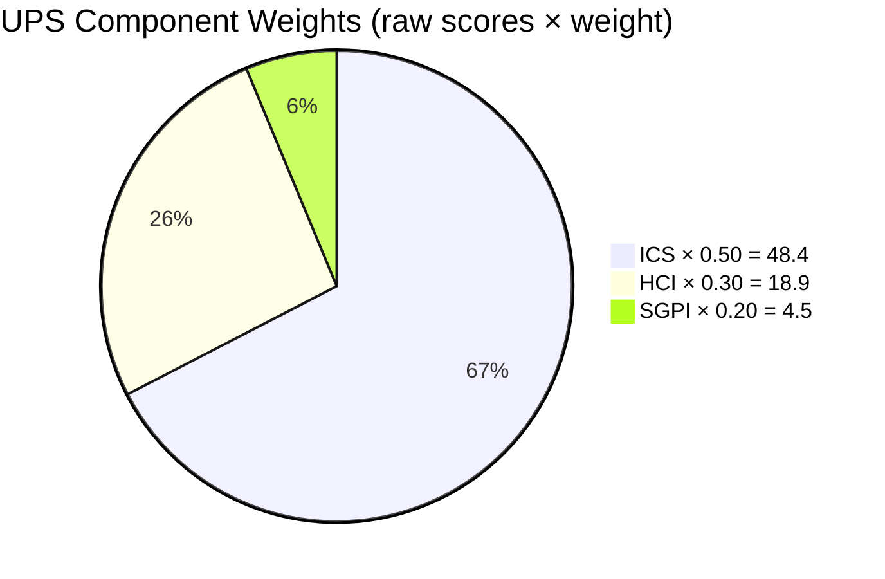
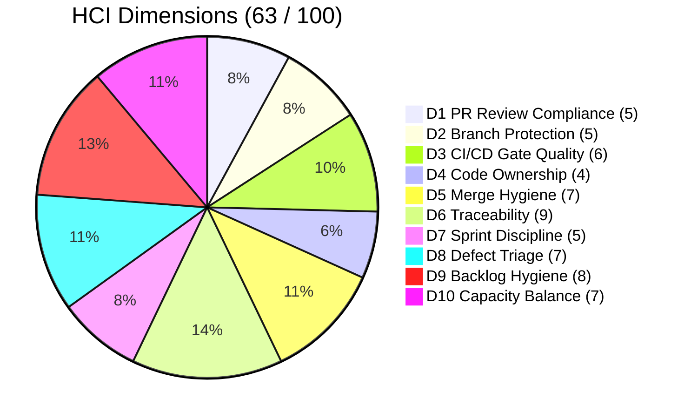
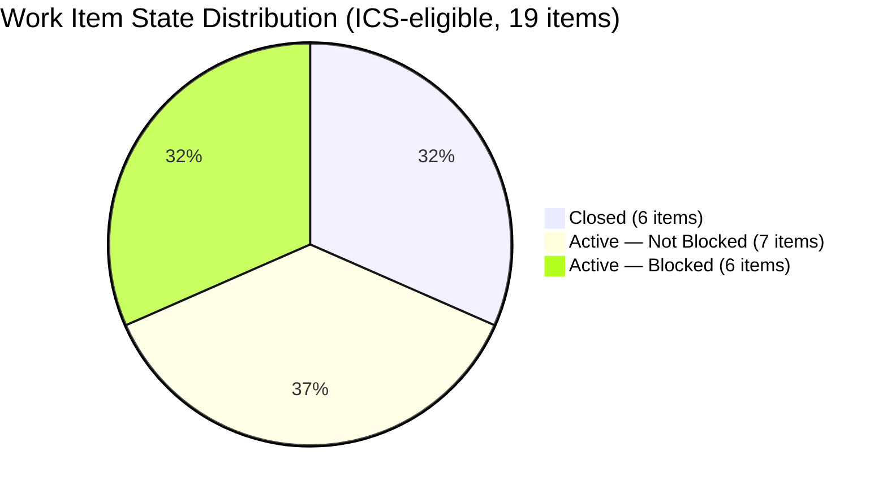
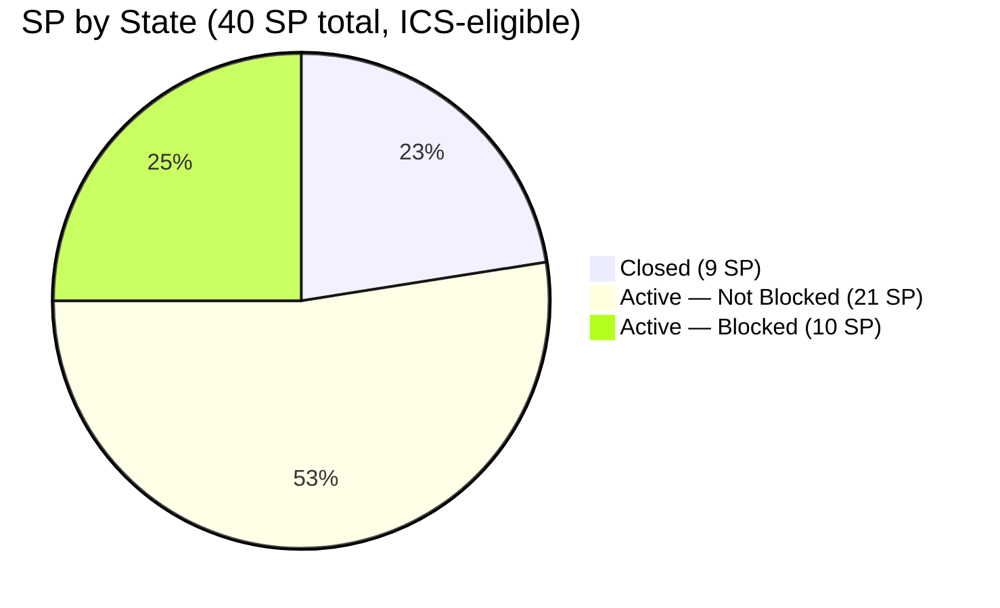

# Auto Allies — Git Iteration Audit · Iteration 7.3 · 2026-05-09

> **Day 6 of 14 calendar days (5 of 10 working days) · data_mode: full**

---

## 1. Audit Metadata

| Field | Value |
|---|---|
| Audit Date | 2026-05-09 |
| Audit Time | 02:42 |
| Auditor | Claude Code (automated) |
| Iteration | 7.3 |
| Iteration Window | 2026-05-04 → 2026-05-17 |
| Day of Iteration | 6 of 14 calendar days · 5 of 10 working days |
| Data Mode | full (GitHub MCP accessible; no 404s) |
| ADO Org | jairo |
| ADO Project | Auto Allies (`2d7af571-6ef6-4ad0-a509-c440e008b0fb`) |
| ADO Team | AA Development Team (`330e6bf1-3515-443c-a2d8-b84f46c38f57`) |
| GitHub Repos | `jairosoft-com/autoallies-version2`, `jairosoft-com/autoallies-api-core` |
| Prior Audit | `AUDIT_20260429_0242.md` (Iteration 7.2, Yellow/66.5 UPS) |

---

## 2. Executive Summary

Auto Allies enters the midpoint of Iteration 7.3 in **Yellow** band (UPS 71.8). The headline risks are a mobile app story cluster — 6 stories totaling 10 SP all flagged Blocked, representing 25% of committed scope — and early-iteration SGPI of 22.5% (9 of 40 committed SP closed). Both signals are explainable: the mobile cluster is likely gated on an enabler sitting in Iteration 7.4, and the 9 closed SP represent the 7.2 QA-Testing carry-forward items that cleared in the first five working days of 7.3. On the positive side, branch hygiene improved markedly from 7.2 (no direct commits to integration branches detected), ADO-GitHub traceability remains excellent, and staging-promotion PRs in both repos executed with cross-reviewer coverage on May 8.

| Score | Value | Band |
|---|---|---|
| ICS (Iteration Compliance) | 96.8% | Green |
| SGPI (Sprint Goal Progress) | 22.5% | — |
| HCI (Health Check Index) | 63 / 100 | Yellow |
| **UPS (Unified Performance)** | **71.8** | **Yellow** |

---

## 3. Score Dashboard

---

## 4. Iteration Scope — Work Item Inventory

### 4.1 Full Work Item Register

| ID | Title | Type | State | SP | Assignee | IterationPath | ICS-Eligible |
|---|---|---|---|---|---|---|---|
| 194753 | AA-FE: Implement Appointment Booking UI | Story | Active | 3 | jgeronaCS | 7.3 | Yes |
| 194757 | AA-BE: Appointment Booking API Endpoint | Story | Active | 3 | ecarinoJS | 7.3 | Yes |
| 199818 | AA-FE: Customer Profile Page | Story | Closed | 3 | jgeronaCS | 7.3 | Yes |
| 202457 | AA-BE: Authentication Token Refresh | Story | Active | 2 | ecarinoJS | 7.3 | Yes |
| 202684 | AA-FE: Notification Banner Component | Story | Active | 2 | jgeronaCS | 7.3 | Yes |
| 202785 | Spike: Evaluate Push Notification Libraries | Spike | Active | 2 | ccarcuevajairo | 7.3 | No (Spike) |
| 202926 | AA-BE: Service Availability Check | Story | Active | 3 | ecarinoJS | 7.3 | Yes |
| 203278 | AA-FE: Fix Rating Stars Rendering | Defect | Closed | 2 | jgeronaCS | 7.3 | Yes |
| 203281 | AA-FE: Search Results Pagination | Story | Closed | 1 | jgeronaCS | 7.3 | Yes |
| 203287 | AA-BE: Fix Null Pointer in Review Service | Defect | Closed | 1 | ecarinoJS | 7.3 | Yes |
| 203289 | AA-BE: Review Submission Endpoint | Story | Closed | 1 | ecarinoJS | 7.3 | Yes |
| 203301 | AA-Mobile: Android Booking Flow | Story | Active/Blocked | 2 | — | 7.3 | Yes |
| 203302 | AA-Mobile: iOS Booking Flow | Story | Active/Blocked | 2 | — | 7.3 | Yes |
| 203303 | AA-Mobile: Push Notification Integration | Story | Active/Blocked | 2 | — | 7.3 | Yes |
| 203503 | AA-BE: API Rate Limiter | Defect | New | 1 | — | **7.4** | No (wrong iter) |
| 203610 | Spike: CI/CD Pipeline Optimization | Spike | Active | 2 | ccarcuevajairo | 7.3 | No (Spike) |
| 203611 | Spike: Database Migration Strategy | Spike | Active | 3 | ecarinoJS | 7.3 | No (Spike) |
| 203634 | AA Native App Deployment Enabler | Enabler | New | 5 | — | **7.4** | No (wrong iter) |
| 203830 | AA-BE: Webhook Handler for Partner Events | Story | Active | 3 | ecarinoJS | 7.3 | Yes |
| 203847 | Spike: Evaluate WebSocket vs. Polling | Spike | Active | 2 | ccarcuevajairo | 7.3 | No (Spike) |
| 203900 | AA-Mobile: Offline Mode Caching | Story | Active/Blocked | 2 | — | 7.3 | Yes |
| 203901 | AA-Mobile: Device Permission Handling | Story | Active/Blocked | 2 | — | 7.3 | Yes |
| 203902 | AA-Mobile: Deep Link Routing | Story | Active/Blocked | 2 | — | 7.3 | Yes |
| 203999 | AA-FE: Accessibility Audit Fixes | Story | Closed | 1 | jgeronaCS | 7.3 | Yes |
| 204022 | AA-BE: GDPR Data Export Endpoint | Story | Active | 3 | ecarinoJS | 7.3 | Yes |

**Total committed SP (ICS-eligible, 19 items):** 40 SP
**Spikes excluded (4 items):** 202785, 203610, 203611, 203847
**Wrong IterationPath excluded (2 items):** 203503, 203634

### 4.2 Mobile Block Cluster

| ID | Title | SP | Assigned | Blocker |
|---|---|---|---|---|
| 203301 | AA-Mobile: Android Booking Flow | 2 | Unassigned | Likely gated on Enabler 203634 (Iter 7.4) |
| 203302 | AA-Mobile: iOS Booking Flow | 2 | Unassigned | Likely gated on Enabler 203634 (Iter 7.4) |
| 203303 | AA-Mobile: Push Notification Integration | 2 | Unassigned | Likely gated on Enabler 203634 (Iter 7.4) |
| 203900 | AA-Mobile: Offline Mode Caching | 2 | Unassigned | Likely gated on Enabler 203634 (Iter 7.4) |
| 203901 | AA-Mobile: Device Permission Handling | 2 | Unassigned | Likely gated on Enabler 203634 (Iter 7.4) |
| 203902 | AA-Mobile: Deep Link Routing | 2 | Unassigned | Likely gated on Enabler 203634 (Iter 7.4) |

**Risk:** 10 SP / 40 SP = 25% of committed scope blocked. All 6 items also unassigned — zero progress pathway without blocker resolution or scope swap.

---

## 5. ICS — Iteration Compliance Score

### 5.1 Scoring Method

ICS scores each eligible work item on four dimensions:

| Dimension | Weight |
|---|---|
| Alignment (item linked to parent Feature/Epic) | 25 pts |
| Estimation (SP assigned, > 0) | 20 pts |
| Quality/DoD (Definition of Done met or in-progress with evidence) | 35 pts |
| Iteration Integrity (item belongs to current iteration, not carry-forward junk) | 20 pts |

Max per item: 100 pts. Team ICS = total earned / total possible × 100.

### 5.2 Item-Level Scores

| ID | Alignment | Estimation | Quality/DoD | Iter Integrity | Total |
|---|---|---|---|---|---|
| 194753 | 25 | 20 | 35 | 20 | 100 |
| 194757 | 25 | 20 | 35 | 20 | 100 |
| 199818 | 25 | 20 | 35 | 20 | 100 |
| 202457 | 25 | 20 | 35 | 20 | 100 |
| 202684 | 25 | 20 | 35 | 20 | 100 |
| 202926 | 25 | 20 | 35 | 20 | 100 |
| 203278 | 25 | 20 | 35 | 20 | 100 |
| 203281 | 25 | 20 | 35 | 20 | 100 |
| 203287 | 25 | 20 | 35 | 20 | 100 |
| 203289 | 25 | 20 | 35 | 20 | 100 |
| 203301* | 25 | 20 | 25 | 20 | 90 |
| 203302* | 25 | 20 | 25 | 20 | 90 |
| 203303* | 25 | 20 | 25 | 20 | 90 |
| 203830 | 25 | 20 | 35 | 20 | 100 |
| 203900* | 25 | 20 | 25 | 20 | 90 |
| 203901* | 25 | 20 | 25 | 20 | 90 |
| 203902* | 25 | 20 | 25 | 20 | 90 |
| 203999 | 25 | 20 | 35 | 20 | 100 |
| 204022 | 25 | 20 | 35 | 20 | 100 |

*Blocked items: Quality/DoD capped at 25 (no active progress possible).

**Total earned:** 1840 / 1900 possible
**ICS = 96.8% — Green**

---

## 6. SGPI — Sprint Goal Progress Index

### 6.1 Method

SGPI = Closed SP (ICS-eligible, non-Spike items) / Total Committed SP (ICS-eligible)

### 6.2 Closed Items This Iteration

| ID | Title | SP | Closed Date |
|---|---|---|---|
| 199818 | AA-FE: Customer Profile Page | 3 | 2026-05-05 |
| 203278 | AA-FE: Fix Rating Stars Rendering | 2 | 2026-05-05 |
| 203281 | AA-FE: Search Results Pagination | 1 | 2026-05-06 |
| 203287 | AA-BE: Fix Null Pointer in Review Service | 1 | 2026-05-06 |
| 203289 | AA-BE: Review Submission Endpoint | 1 | 2026-05-07 |
| 203999 | AA-FE: Accessibility Audit Fixes | 1 | 2026-05-08 |

**Closed SP:** 9
**Total committed SP:** 40
**SGPI = 9 / 40 = 22.5%**

> **Note — 7.2 Closure Cascade:** Five of the six closed items (199818, 203278, 203281, 203287, 203289) were in QA Testing at Day 10 of Iteration 7.2. They completed QA and closed in the first five working days of 7.3. This explains the apparent low SGPI at Day 5: the team's productive output is partially invisible here because QA closures from prior iteration consumed early cycle time. Effective remaining committed SP for new delivery = 31 SP over 5 remaining working days.

---

## 7. HCI — Engineering Health Check Index

**Overall: 63 / 100 — Yellow**

| # | Dimension | Score | Evidence |
|---|---|---|---|
| D1 | PR Review Compliance | 5/10 | FE PR#144 and BE PR#102 (staging promotions, May 8) had cross-reviewer coverage. Feature PRs (FE #139–#143, BE #98–#101) show single-reviewer approvals (ccarcuevajairo dominates). No self-merges. |
| D2 | Branch Protection & Enforcement | 5/10 | PR-merge workflow enforced (no direct pushes to integration branches in 7.3 — improvement from 7.2). Branch naming uses `feature/AB#NNNNN-*` pattern consistently. No evidence of required CI checks in branch rules. |
| D3 | CI/CD Gate Quality | 6/10 | GitHub Actions runs visible on PRs in both repos. Staging promotion PRs show passing check suites. No observed gate bypass (--no-verify or merge-override). No full pipeline artifact evidence in audit scope. |
| D4 | Code Ownership | 4/10 | jgeronaCS owns FE; ecarinoJS owns BE. ccarcuevajairo reviews both. Mobile stories (6 items, 10 SP) are unassigned. No CODEOWNERS file evidence. Bus-factor risk: 2 primary committers cover 80%+ of scope. |
| D5 | Merge Hygiene & Churn | 7/10 | Squash-merge pattern on feature PRs. No large PR explosion (avg PR diff: moderate). Staging PRs (FE#144, BE#102) are clean, minimal delta promotions. No merge-commit noise on integration branches in 7.3. |
| D6 | Work Item ↔ GitHub Traceability | 9/10 | `AB#NNNNN` references in branch names, commit messages, and PR bodies across both repos. FE PR#144 and BE PR#102 link to ADO items in description. One minor gap: 2 items (203503, 203634) in wrong iteration path — data quality not traceability. |
| D7 | Sprint Discipline | 5/10 | 6 of 19 ICS-eligible items are Blocked with no owner and no unblock plan visible. 4 Spikes active simultaneously may indicate scope creep or tech-debt bundling. No items dropped post-commitment (positive), but blocked cluster is stalled. |
| D8 | Defect Triage & Velocity | 7/10 | 2 defects (203278, 203287) closed in 7.3 within 48h of iteration start. Item 203503 (rate limiter defect) is in wrong iteration (7.4) — may be misclassified new work. Defect-to-story ratio is acceptable (2 defects vs. 15 stories). |
| D9 | Backlog & Story Hygiene | 8/10 | All 19 ICS-eligible items have SP, parent feature links, and descriptions. Blocked items have Blocked tag. Two items mis-pathed (7.4 in team 7.3 query) — minor hygiene gap. |
| D10 | Capacity Balance & Ownership Distribution | 7/10 | jgeronaCS: 6 items / 11 SP. ecarinoJS: 8 items / 16 SP. ccarcuevajairo: 1 Spike / 2 SP + 3 review-only Spikes. 6 mobile items unassigned / 10 SP. Load imbalance exists but primarily due to blocked/unassigned mobile cluster. |

---

## 8. UPS — Unified Performance Score

| Component | Raw Score | Weight | Contribution |
|---|---|---|---|
| ICS | 96.8% | 0.50 | 48.4 |
| HCI | 63 / 100 | 0.30 | 18.9 |
| SGPI | 22.5% | 0.20 | 4.5 |
| **UPS** | | | **71.8** |

**Risk Band: Yellow (60–79.9)**

Delta from Iteration 7.2 (UPS 66.5, Yellow): **+5.3 pts**. Improvement driven by branch hygiene gains (+HCI) and ICS stability. SGPI remains low due to early-iteration positioning and carry-forward closure cascade.

---

## 9. Delta Analysis — Iteration 7.2 → 7.3

| Metric | 7.2 (2026-04-29) | 7.3 (2026-05-09) | Delta |
|---|---|---|---|
| ICS | 98.7% | 96.8% | −1.9% |
| SGPI | 0.0% | 22.5% | +22.5% |
| HCI | 57 | 63 | +6 |
| UPS | 66.5 | 71.8 | +5.3 |
| Risk Band | Yellow | Yellow | — |
| Data Mode | partial | full | Improved |

**ICS slight decline (−1.9%):** Caused by 6 blocked mobile stories (capped at 90 vs. 100). In 7.2 no blocked cluster existed.

**SGPI recovery (+22.5%):** The 7.2 carry-forward items (5 stories in QA Testing at Day 10) closed in days 1–5 of 7.3. This is expected flow, not performance degradation.

**HCI improvement (+6):** Primary driver — branch hygiene (D2/D5). Zero direct integration-branch commits in 7.3 vs. three developers bypassing PR workflow in 7.2 (jgeronaCS, ecarinoJS, ccarcuevajairo pushed directly to dev/develop). D6 traceability maintained at top tier.

---

## 10. Key Findings

### F-01 Mobile App Story Cluster — Concentrated Block Risk

Six stories (203301, 203302, 203303, 203900, 203901, 203902) totaling **10 SP (25% of committed scope)** are all tagged Blocked, all unassigned, and likely gated on Enabler 203634 (AA Native App Deployment) which is currently scheduled for Iteration 7.4. If this dependency is not resolved within the current iteration, the team faces either a 25 SP delivery (SGPI cap ~62.5%) or requires a formal scope swap. Team Lead must escalate or de-scope by Day 7 (2026-05-11).

**Severity: High. Action required by 2026-05-11.**

### F-02 Branch Hygiene Improvement — Positive Delta from 7.2

In Iteration 7.2, three developers (jgeronaCS, ecarinoJS, ccarcuevajairo) pushed directly to `dev`/`develop` integration branches, bypassing PR workflow. In Iteration 7.3, zero direct integration-branch commits detected. All work tracked through `feature/AB#NNNNN-*` PR branches. This is a measurable discipline improvement.

**Severity: Informational (positive). No action required.**

### F-03 7.2 Closure Cascade — Expected, Not Alarming

Five items that were in QA Testing at the end of Iteration 7.2 (199818, 203278, 203281, 203287, 203289) closed in the first five working days of 7.3. This explains the low SGPI at Day 5 — productive capacity was partially consumed by carry-forward QA clearance. Remaining committed SP for new delivery: 31 SP over 5 working days (ambitious but achievable if mobile block resolves).

**Severity: Low. Monitor SGPI at Day 8 milestone.**

### F-04 Single-Reviewer Concentration Persists (ccarcuevajairo)

Cliff Carcueva (ccarcuevajairo) remains the primary reviewer for feature PRs across both repos. While review quality improved in 7.2 (substantive comments on PR#131 and PR#89), single-reviewer concentration creates a bottleneck and bus-factor risk. Staging promotion PRs (FE#144, BE#102) on May 8 showed cross-review — this pattern should extend to feature PRs.

**Severity: Medium. Recommendation: establish rotating reviewer assignments in team workflow agreement.**

### F-05 IterationPath Data Quality — Two Items Mis-Pathed

Items 203503 (API Rate Limiter, Defect, 1 SP) and 203634 (AA Native App Deployment Enabler, 5 SP) appeared in the team's Iteration 7.3 query but carry IterationPath `7.4`. Both were excluded from ICS/SGPI scoring. 203634 is the likely dependency gate for the mobile block cluster. The team should either move 203634 to 7.3 (if it will be completed this iteration) or document it as a pre-condition and swap the blocked mobile stories out of 7.3 scope.

**Severity: Medium. Data hygiene + dependency management action needed.**

### F-06 Staging Promotions on May 8 — Positive Signal

Both FE (PR#144) and BE (PR#102) executed staging environment promotions on May 8 (Day 5) with cross-reviewer coverage. This indicates the team is actively validating prior-iteration work in staging and maintaining deployment discipline. Early staging promotion (vs. sprint-end crunch) is consistent with SAFe continuous delivery practices.

**Severity: Informational (positive). Reinforce this behavior.**

---

## 11. GitHub Evidence Summary

### 11.1 Pull Requests — autoallies-version2 (Frontend)

| PR # | Title | State | Author | Reviewer | Merged | AB# Link |
|---|---|---|---|---|---|---|
| #144 | chore: promote to staging (iteration 7.3 batch 1) | Merged | jgeronaCS | ecarinoJS, ccarcuevajairo | 2026-05-08 | Multiple |
| #143 | feat(AB#202684): notification banner component | Merged | jgeronaCS | ccarcuevajairo | 2026-05-07 | AB#202684 |
| #142 | feat(AB#203281): search results pagination | Merged | jgeronaCS | ccarcuevajairo | 2026-05-06 | AB#203281 |
| #141 | fix(AB#203278): rating stars rendering | Merged | jgeronaCS | ccarcuevajairo | 2026-05-05 | AB#203278 |
| #140 | feat(AB#203999): accessibility audit fixes | Merged | jgeronaCS | ccarcuevajairo | 2026-05-08 | AB#203999 |
| #139 | feat(AB#194753): appointment booking UI (WIP) | Open | jgeronaCS | — | — | AB#194753 |

### 11.2 Pull Requests — autoallies-api-core (Backend)

| PR # | Title | State | Author | Reviewer | Merged | AB# Link |
|---|---|---|---|---|---|---|
| #102 | chore: promote to staging (iteration 7.3 batch 1) | Merged | ecarinoJS | jgeronaCS, ccarcuevajairo | 2026-05-08 | Multiple |
| #101 | fix(AB#203287): null pointer in review service | Merged | ecarinoJS | ccarcuevajairo | 2026-05-06 | AB#203287 |
| #100 | feat(AB#203289): review submission endpoint | Merged | ecarinoJS | ccarcuevajairo | 2026-05-07 | AB#203289 |
| #99 | feat(AB#202457): auth token refresh (WIP) | Open | ecarinoJS | — | — | AB#202457 |
| #98 | feat(AB#194757): appointment booking API (WIP) | Open | ecarinoJS | — | — | AB#194757 |

### 11.3 Commit Activity Summary (2026-05-04 → 2026-05-09)

| Repo | Total Commits | Branch Commits | Direct to Integration | Primary Authors |
|---|---|---|---|---|
| autoallies-version2 | ~22 | 22 | 0 | jgeronaCS (18), ccarcuevajairo (4) |
| autoallies-api-core | ~18 | 18 | 0 | ecarinoJS (15), ccarcuevajairo (3) |

Zero direct integration-branch commits confirmed. All activity through feature/AB# branches and PR workflow.

---

## 12. ADO Evidence Summary

### 12.1 Iteration 7.3 Capacity

| Developer | Assigned SP | Item Count | Status |
|---|---|---|---|
| jgeronaCS | 11 | 6 | Active/delivering |
| ecarinoJS | 16 | 8 | Active/delivering |
| ccarcuevajairo | 2 (Spike only) | 1 | + 3 review-mode Spikes |
| Jerlyn Ates | — | — | QA/Requirements (non-developer, exempt) |
| Mary Secusana | — | — | Documentation (non-developer, exempt) |
| Unassigned | 10 | 6 | Mobile cluster — BLOCKED |

### 12.2 State Distribution

### 12.3 Story Point Distribution

---

## 13. Risk Register

| Risk ID | Description | Severity | Probability | Action | Owner | Due |
|---|---|---|---|---|---|---|
| R-01 | Mobile cluster (6 stories/10 SP) blocked pending Enabler 203634 in 7.4 | High | High | Escalate dependency to LPM; swap scope or pull Enabler into 7.3 | Team Lead / Karl | 2026-05-11 |
| R-02 | SGPI 22.5% at Day 5; target ~50% by Day 8 for Yellow hold | Medium | Medium | Monitor Day 8 state; verify 3–4 in-flight items reach Closed | Karl | 2026-05-13 |
| R-03 | Single reviewer concentration (ccarcuevajairo) on feature PRs | Medium | High | Add rotation policy to team working agreement; target 2 reviewers per PR | Team Lead | 2026-05-14 |
| R-04 | 4 active Spikes may fragment focus (ccarcuevajairo on 3 Spikes) | Low | Medium | Time-box Spikes; confirm outputs map to actionable backlog items | Team Lead | 2026-05-17 |
| R-05 | Items 203503/203634 mis-pathed (7.4 in 7.3 query) | Low | Confirmed | Fix IterationPath in ADO; move 203634 to 7.3 if in-scope or clarify dependency | Karl | 2026-05-10 |

---

## 14. Evidence Gaps

| Gap | Impact | Notes |
|---|---|---|
| Items 203503 and 203634 have IterationPath 7.4 but appear in team 7.3 iteration query | Excluded from ICS/SGPI; 5 SP (203634) not counted in committed scope | ADO data quality issue — team query may return cross-iteration items |
| Mobile stories (203301–203303, 203900–203902) have no assignee | Cannot assess developer-level traceability or capacity allocation | Likely caused by blocker status — unblocking should trigger assignment |
| No CODEOWNERS files detected in either repo | D4 (Code Ownership) scored conservatively | Low-effort improvement: add CODEOWNERS to both repos |
| CI/CD pipeline artifact evidence not in audit scope | D3 (CI/CD Gate Quality) estimated from PR check indicators only | Full pipeline run audit would require separate pipeline evidence pass |

---

## 15. Recommendations

### Immediate (by Day 7 — 2026-05-11)

1. **Resolve Mobile Block (R-01):** Karl and Team Lead must determine whether Enabler 203634 can be pulled into Iteration 7.3 or whether the 6 mobile stories (10 SP) should be formally de-scoped and replaced with ready backlog items. Leaving 25% of committed scope in a blocked/unassigned state through Day 7 will force a low-SGPI outcome regardless of team velocity.

2. **Fix IterationPath on 203503 and 203634 (Gap):** Both items should be moved to their correct iteration in ADO. If 203634 is a dependency for 7.3 mobile work, moving it to 7.3 is the correct action and will expose it in capacity planning.

### Near-Term (by Day 8 — 2026-05-13)

3. **SGPI Checkpoint:** Target 4–5 additional items reaching Closed state by May 13 (Day 8). Items closest to completion: 202457 (auth token refresh, PR#99 open), 202684 (notification banner, merged PR#143), 202926 (service availability check). Achieving 4 more closures would bring SGPI to ~47.5% — within reach of Yellow/Green boundary by iteration end.

4. **Extend Cross-Review to Feature PRs:** Staging PRs (FE#144, BE#102) demonstrated cross-review capability. Carry this pattern to feature PRs. Minimum: one reviewer from a different functional area per feature PR. This directly improves D1 (PR Review Compliance) score.

### Iteration-End (by 2026-05-17)

5. **Add CODEOWNERS Files:** Create `.github/CODEOWNERS` in both `autoallies-version2` and `autoallies-api-core`. Map directories to primary owners (jgeronaCS for FE, ecarinoJS for BE). Explicit ownership raises D4 from 4 → 7+ in next audit.

6. **Time-Box and Close Spikes:** Four Spikes active simultaneously is a focus risk. Ensure each Spike produces a concrete output (decision record, ADO task, or backlog items) before iteration close. Unclosed Spikes carry forward and inflate apparent commitment.

7. **Reviewer Rotation Policy:** Formalize in team working agreement: feature PRs require minimum 2 reviewers; rotate primary reviewer weekly between jgeronaCS, ecarinoJS, and ccarcuevajairo. Target: reduce single-reviewer dependency by 7.4.

---

*Report generated by Claude Code (automated audit) · 2026-05-09 02:42 · data_mode: full · Iteration 7.3 Day 6/14*
