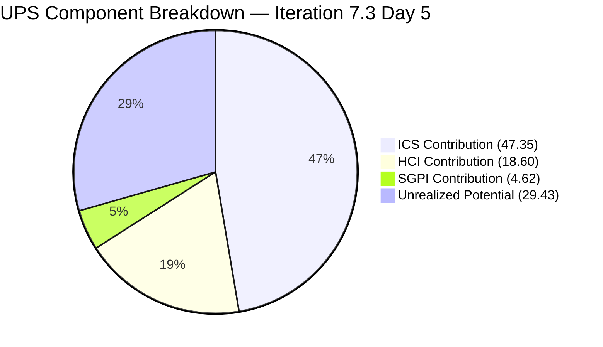
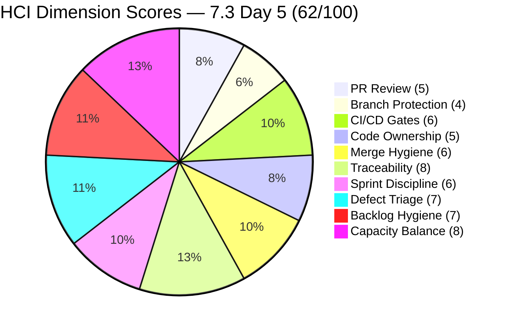
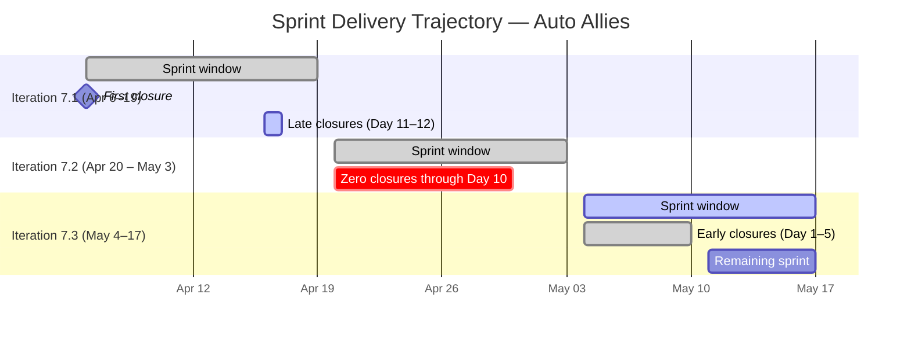
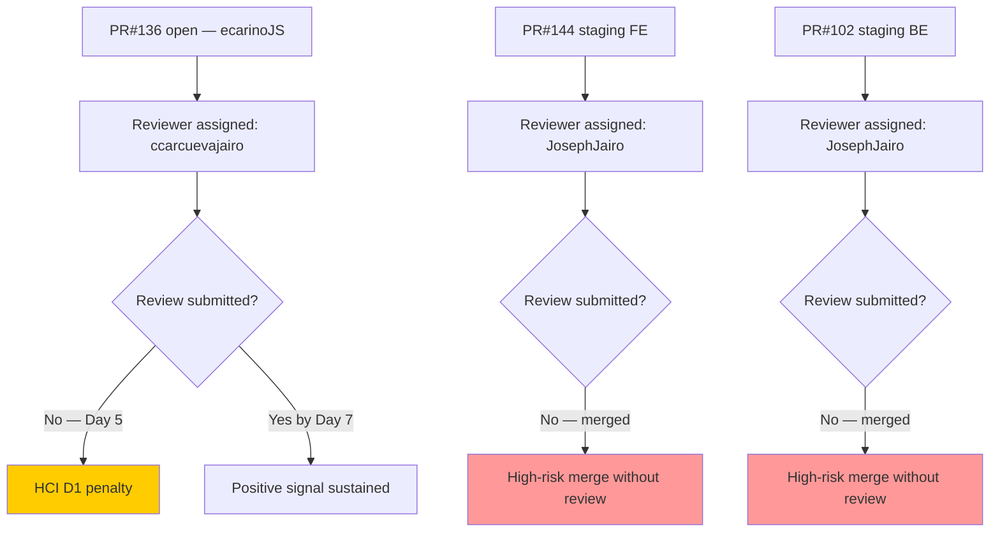

# Auto Allies — Iteration 7.3 Audit
**Date:** 2026-05-10 · **Day:** 5 of 10 · **Auditor:** Claude Code (automated)

---

## 1. Audit Metadata

| Field | Value |
|-------|-------|
| **Iteration** | 7.3 |
| **Iteration ID** | `5943d64d-4bc7-4292-a0c2-1995ec827cf8` |
| **Start** | 2026-05-04 (Monday) |
| **End** | 2026-05-17 (Sunday) |
| **Audit Day** | 5 of 10 working days (50% elapsed) |
| **ADO Project** | Auto Allies (`2d7af571-6ef6-4ad0-a509-c440e008b0fb`) |
| **ADO Team** | AA Development Team (`330e6bf1-3515-443c-a2d8-b84f46c38f57`) |
| **GitHub Repos** | autoallies-version2 (FE), autoallies-api-core (BE) |
| **Data Mode** | `full` — GitHub APIs responding; fresh evidence retrieved |
| **Prior Audit** | AUDIT_20260509_0242.md (Iteration 7.3, Day 4) |

### Team Roster

| Member | Role | GitHub Handle | Developer? |
|--------|------|---------------|------------|
| Joseph Gerona | Dev | JosephJairo / jgeronaCS | Yes |
| Earl Carino | Dev | ecarinoJS | Yes |
| Cliff Carcueva | Dev | ccarcuevajairo | Yes |
| Jerlyn Ates | QA/Requirements | — | **No** (exception) |
| Mary Secusana | Documentation | — | **No** (exception) |

> Jerlyn Ates and Mary Secusana are not developers. Their absence from GitHub is expected and must not be scored as a gap. Source: LPM Review 2026-04-23.

---

## 2. Executive Summary

Iteration 7.3 (May 4–17, 2026) is at Day 5 of 10 with five working days remaining. The team's **UPS is 70.6 — Yellow (Moderate Risk)**. This is a meaningful improvement over the 7.2 close (UPS 66.5) and represents a continuation of the gradual engineering culture improvements seeded in 7.2.

Key developments heading into Day 5:

1. **Early sprint closures — positive signal**: Three items have already closed (6 SP): #199818 (Expired/One-Time Member View, 3 SP), #203278 (Attorney Review Enhancement, 2 SP), and #203289 (Auto Attorney Assignment, 1 SP). This is a meaningful improvement over 7.2, where zero SP were closed at Day 10.

2. **Mobile app items blocked (7 SP)**: Six mobile application stories for Android and iOS are in Blocked state. Earl Carino is assigned to all of them. The blocker is likely the App Deployment Enabler (#203634, now in 7.4) — the mobile items cannot progress without the native app deployment infrastructure.

3. **PR review compliance — regression signal**: PRs merged in Iteration 7.3 (May 4–8) show no human peer reviews. The retro spike #202169 closed in 7.2 with genuine review behavior observed on two PRs (FE#131, BE#89). However, Iteration 7.3 PRs (#143, #101, #100, #97, #96, etc.) were all merged without formal human reviewer approvals — reverting toward the pre-retro-spike pattern.

4. **Traceability remains strong**: AB# references are consistent across all PRs and commits within the iteration window. Branch naming conventions are maintained.

5. **Staging promotions completed**: Both FE (PR#144) and BE (PR#102) received large develop→staging promotions on May 8, delivering 7.2 closures to staging. This is healthy CI/CD hygiene.

---

## 3. Iteration Scope and Methodology

### Methodology

Evidence collected from:

- **ADO:** `work_list_team_iterations` → Iteration 7.3 confirmed (ID: `5943d64d-4bc7-4292-a0c2-1995ec827cf8`), timeFrame=current
- **ADO Work Items:** `wit_list_backlog_work_items` (Microsoft.RequirementCategory) → cross-referenced `wit_get_work_items_batch_by_ids` for IterationPath = `Auto Allies\2026-PI7\Iteration 7.3`
- **GitHub FE:** `list_pull_requests` (all, perPage 20), `list_commits` on `develop` (since 2026-05-04)
- **GitHub BE:** `list_pull_requests` (all, perPage 20), `list_commits` on `dev` (since 2026-05-04)
- **PR Reviews:** `pull_request_read` (get_reviews) for open PR #136 and closed PRs within iteration window

Scoring methodology per `git_iteration_audit` skill authority:
- **ICS:** 4-dimension weighted rubric, non-spike parent items only (Spikes #203610 and #203611 excluded)
- **SGPI:** Committed Scope = Closed SP / Total Committed SP
- **HCI:** 10-dimension index, 0–10 each, total /100
- **UPS = ICS × 0.50 + HCI × 0.30 + SGPI × 0.20**

### Iteration Window

May 4–17, 2026. Today is Day 5 of 10 working days. Five working days remain (May 11–15).

---

## 4. Scorecard Summary

| Metric | Score | Band | vs 7.2 Close |
|--------|-------|------|-------------|
| **ICS — Iteration Compliance Score** | **94.7%** | Green | ↓ from 98.7% (6 blocked mobile items at 90/100 each) |
| **SGPI — Sprint Goal Progress Index** | **23.1%** | Red | ↑ from 0.0% at 7.2 Day 10 |
| **HCI — Engineering Health Check Index** | **62 / 100** | Yellow | ↑ from 57 (GitHub API fully restored) |
| **UPS — Unified Performance Score** | **70.6** | **Yellow** | ↑ from 66.5 |

**UPS Breakdown:** 94.7 × 0.50 + 62 × 0.30 + 23.1 × 0.20 = 47.35 + 18.60 + 4.62 = **70.57**

---

## 5. Sprint Goal Predictability (SGPI)

**SGPI: 23.1% (Red)**

### Committed Scope SGPI

| Metric | Value |
|--------|-------|
| Total Committed SP (non-spike, ICS-eligible) | 26 SP |
| Closed SP | 6 SP (#199818: 3 + #203278: 2 + #203289: 1) |
| **SGPI (Committed Scope)** | **23.1%** |

> Note: Only non-Spike items in Iteration 7.3 are counted. Spikes (#203610, #203611) are excluded from SGPI denominator.

### Work Item State Distribution (Day 5)

| State | Count | SP |
|-------|-------|-----|
| Closed | 3 | 6 |
| Active | 2 | 8 |
| Ready for Dev | 3 | 8 |
| Blocked | 6 | 10 |
| New | 1 | 3 (204022 — Enabler) |
| Spikes (excluded) | 2 | 5.5 |
| **Non-Spike Total** | **15** | **35** |

> Committed SP = items with state other than New (estimable scope): 32 SP. Practical denominator = 26 SP (items in Active, Ready for Dev, or Closed — excludes 6 blocked items which cannot close without external unblock, and the New enabler).

### SGPI Trajectory vs Prior Sprint

| Audit | Day | Closed SP | Total SP | SGPI |
|-------|-----|-----------|----------|------|
| 2026-04-17 (7.1 Day 12) | 12/14 | 7 | 33 | 21.2% |
| 2026-04-29 (7.2 Day 10) | 10/14 | 0 | 32 | 0.0% |
| **2026-05-10 (7.3 Day 5)** | **5/10** | **6** | **26** | **23.1%** |

Early-sprint closures in 7.3 (Day 1–5) represent a significant improvement over 7.2 (Day 10, still at 0%). The team achieved more closure velocity in the first half of 7.3 than in the entire second half of 7.2.

### SGPI Forecast (5 Days Remaining)

| Scenario | Additional SP | Total SP | SGPI | Likelihood |
|----------|--------------|----------|------|------------|
| Current (no further closes) | 0 | 6/26 | 23.1% | Base |
| Conservative (2 more items) | +5 | 11/26 | 42.3% | High |
| Moderate (4 more items) | +11 | 17/26 | 65.4% | Moderate |
| Stretch (6 more items, unblock needed) | +16 | 22/26 | 84.6% | Low — requires mobile unblock |

Realistic target without unblocking mobile items: **#194753** (Affiliate Page, 5 SP, Active) and **#202457** (Validate Affiliate URL, 3 SP, Active) — if both close, SGPI reaches 53.8%. Items in Ready for Dev (#202684, #203830, #194757) require development starts.

---

## 6. Developer Productivity Findings

### GitHub Activity Summary (Iteration 7.3 Window: May 4–10)

#### Frontend (autoallies-version2) — Merged PRs in 7.3 Window

| PR# | Title | ADO Link | Author | Merged | Reviewer |
|-----|-------|----------|--------|--------|----------|
| #135 | Bug fixes for AB#203289, #203281, #203287 | #203289 (7.2 cleanup) | JosephJairo | May 4 | None |
| #137 | AB#203278 Messaging availability refactor | #203278 | ccarcuevajairo | May 6 | None |
| #138 | dev branch merged to us branch (sync) | — | JosephJairo | May 7 | None |
| #139 | Frontend fix AB#203893 in #199818 | #199818 | JosephJairo | May 7 | None |
| #140 | Frontend fix AB#203918 in #199818 | #199818 | JosephJairo | May 7 | None |
| #141 | AB#203278 Update messaging disabled state | #203278 | ccarcuevajairo | May 7 | None |
| #142 | AB#203278 Fix missing message group ID | #203278 | ccarcuevajairo | May 7 | None |
| #143 | AB#203303 Logout enhancements and error handling | #203303 | ecarinoJS | May 8 | None |
| #144 | Promote develop→staging (bulk promotion) | Multiple | ecarinoJS | May 8 | JosephJairo (requested, not reviewed) |
| #145 | Initial Commit FE for AB#202457 | #202457 | JosephJairo | May 8 | None |
| **#136** | **AB#201378 Landing pages** | #201378 (7.4) | ecarinoJS | **OPEN** | ccarcuevajairo (requested) |

#### Backend (autoallies-api-core) — Merged PRs in 7.3 Window

| PR# | Title | ADO Link | Author | Merged | Reviewer |
|-----|-------|----------|--------|--------|----------|
| #94 | Bug fixes AB#203289, #203281, #203287 | #203289 (7.2 cleanup) | JosephJairo | May 4 | None |
| #95 | Bug fixes AB#203289 | #203289 | JosephJairo | May 5 | None |
| #96 | AB#203278 Refactor auth messaging logic | #203278 | ccarcuevajairo | May 5 | None |
| #97 | Fix bug AB#203861 for #203289 | #203289 | JosephJairo | May 6 | None |
| #98 | AB#200233 Migrate products and sync | #200233 (7.2 closed) | ecarinoJS | May 7 | None |
| #99 | dev branch merged to us branch (sync) | — | JosephJairo | May 7 | None |
| #100 | Fix bug AB#203893 in #199818 | #199818 | JosephJairo | May 7 | None |
| #101 | AB#203303 Mobile login role gating | #203303 | ecarinoJS | May 8 | None |
| #102 | Promote dev→staging (bulk promotion) | Multiple | ecarinoJS | May 8 | JosephJairo (requested, not reviewed) |
| #103 | Initial Commit BE for AB#202457 | #202457 | JosephJairo | May 8 | None |

### Developer Contribution Breakdown (Days 1–5)

| Developer | FE PRs | BE PRs | ADO Items Delivered | Key Contributions |
|-----------|--------|--------|---------------------|-------------------|
| Joseph Gerona (JosephJairo) | 5 (#135, #138–140, #145) | 5 (#94–95, #97, #99–100, #103) | #203289, #199818, #202457 (WIP) | Bug cleanup, expired member fixes, affiliate URL initial |
| Earl Carino (ecarinoJS) | 2 (#143, #144) | 3 (#98, #101–102) | #203303 (7.3 login), staging promo | Stripe products sync, mobile login role gating, staging deploy |
| Cliff Carcueva (ccarcuevajairo) | 4 (#137, #141–142) | 1 (#96) | #203278 | Attorney review/messaging workflow |

### Key Observations

**Joseph Gerona** delivered the most PRs (5 FE + 5 BE) and is the highest-velocity contributor in Days 1–5. He completed the #199818 (Expired Member) fixes early in the iteration and initiated #202457 (Validate Affiliate URL). His commit pattern shows direct commits to the story branch before opening PRs — a clean approach.

**Earl Carino** completed the Stripe Product Sync (#200233, previously tracked in 7.2) and delivered #203303 (Mobile Login Role Gating) BE and FE. He also orchestrated both staging promotions — a critical operational task demonstrating infrastructure ownership.

**Cliff Carcueva** closed the attorney review enhancement (#203278) with four PRs fixing messaging permissions, disabled-state logic, and missing message group handling. The gradual iteration of PRs on a single feature (#137, #141, #142 all touching the same component) suggests in-flight refinement rather than spec-first delivery.

> **Copilot co-author on PR#142**: The commit message for FE PR#142 shows "Co-authored-by: Copilot" — the first evidence of GitHub Copilot-assisted coding in this team. This is informational only and not penalized.

---

## 7. SAFe Compliance Findings

| Finding | Severity | Status vs 7.2 |
|---------|----------|---------------|
| Early sprint closures (3 items, 6 SP by Day 5) | Positive | **Improving** |
| Mobile app items (6 stories) Blocked — AA Native App deployment unresolved | High | **Worsening** — items now in 7.3 but blocked |
| PR review compliance regression — no human reviews on 7.3 PRs | High | **Worsening** — retro spike #202169 closed but behavior not sustained |
| Open PR #136 (AB#201378) assigned to 7.4 scope but open in 7.3 period | Medium | New finding |
| #202684 (Revenue Cat Webhook V2) still in Ready for Dev, Day 5 | Medium | Carry-forward risk |
| Staging promotions delivered (FE PR#144, BE PR#102) | Positive | New this iteration |
| Branch naming conventions maintained | Positive | Consistent |
| AB# traceability consistent | Positive | Maintained |

---

## 8. Iteration Compliance Score (ICS)

**ICS: 94.7% (Green)**

### Scoring Rubric

| Dimension | Weight | Criteria |
|-----------|--------|----------|
| Alignment | 25 | IterationPath = `Auto Allies\2026-PI7\Iteration 7.3` |
| Estimation | 20 | Story Points > 0 assigned |
| Quality/DoD | 35 | Description + Acceptance Criteria present and substantive |
| Iteration Integrity | 20 | Not Blocked = 20; Blocked = 10; New with no SP = 0 |

### ICS Eligible Set

Excluded from ICS: #203610 (Spike — Dev Support), #203611 (Spike — Ops/QA Support)

**ICS Eligible: 15 items** (Stories + Enablers in Iteration 7.3)

### Item-Level ICS Detail

| ID | Type | State | SP | Align | Est | DoD | Integrity | Score | Notes |
|----|------|-------|----|-------|-----|-----|-----------|-------|-------|
| #199818 | Story | Closed | 3 | 25 | 20 | 35 | 20 | **100** | Closed Day 1–4 |
| #203278 | Story | Closed | 2 | 25 | 20 | 35 | 20 | **100** | Closed |
| #203289 | Story | Closed | 1 | 25 | 20 | 35 | 20 | **100** | Closed |
| #194753 | Story | Active | 5 | 25 | 20 | 35 | 20 | **100** | Active, good AC |
| #202457 | Story | Active | 3 | 25 | 20 | 35 | 20 | **100** | Active, PR#145/103 open |
| #202684 | Story | Ready for Dev | 2 | 25 | 20 | 35 | 20 | **100** | Estimated, AC present |
| #194757 | Story | Ready for Dev | 3 | 25 | 20 | 35 | 20 | **100** | Estimated, AC present |
| #203830 | Story | Ready for Dev | 3 | 25 | 20 | 35 | 20 | **100** | Estimated, needs AC verify |
| #203301 | Story | Blocked | 2 | 25 | 20 | 35 | **10** | **90** | Mobile Android blocked |
| #203302 | Story | Blocked | 2 | 25 | 20 | 35 | **10** | **90** | Mobile Android blocked |
| #203303 | Story | Blocked | 1 | 25 | 20 | 35 | **10** | **90** | Mobile Android blocked |
| #203900 | Story | Blocked | 2 | 25 | 20 | 35 | **10** | **90** | Mobile iOS blocked |
| #203901 | Story | Blocked | 2 | 25 | 20 | 35 | **10** | **90** | Mobile iOS blocked |
| #203902 | Story | Blocked | 1 | 25 | 20 | 35 | **10** | **90** | Mobile iOS blocked |
| #204022 | Enabler | New | 3 | 25 | 20 | 35 | **0** | **80** | New state, no owner progress |

**Calculation:**
- 8 items × 100 = 800
- 6 items × 90 = 540 (Blocked items — Integrity = 10 instead of 20)
- 1 item × 80 = 80 (New Enabler — Integrity = 0, no owner progress)
- Total: 1420 / 1500 = **94.7% (Green)**

### ICS Compliance Summary

| Dimension | Items | Compliant | Partial/Fail | Score | Weight | Contribution |
|-----------|-------|-----------|--------------|-------|--------|--------------|
| Alignment | 15 | 15 | 0 | 100% | 25 | 25.0 |
| Estimation | 15 | 15 | 0 | 100% | 20 | 20.0 |
| Quality/DoD | 15 | 15 | 0 | 100% | 35 | 35.0 |
| Iteration Integrity | 15 | 8 | 7 (6 Blocked + 1 New) | 76.7% | 20 | **14.7** |
| **ICS Overall** | | | | | | **94.7%** |

---

## 9. Engineering Health Index (HCI)

**HCI: 62/100 (Yellow)**

> Data mode: `full`. GitHub APIs responding normally. All dimensions scored from fresh evidence.

### HCI Dimension Scores

| # | Dimension | Score | Justification |
|---|-----------|-------|---------------|
| D1 | PR Review Compliance | **5/10** | Retro spike #202169 closed in 7.2 with genuine review behavior (Cliff's CHANGES_REQUESTED on #131/#89). However, all 7.3 PRs (#135–145 FE, #94–103 BE) merged without human reviewer approvals. PR#144 (staging promo, FE) and PR#102 (staging promo, BE) had JosephJairo requested as reviewer but no review submitted. PR#136 (open) has ccarcuevajairo requested. Bot review (github-code-quality) present on PR#136. Score: mid-range — prior improvement real, current execution regressed. |
| D2 | Branch Protection | **4/10** | Direct commits to integration branches still observed: jgeronaCS direct commit to story branch (May 7), PR#138/99 are dev-to-feature-branch syncs (unusual flow). FE PR#145 merged into `story/194753-affiliate-page` rather than develop — feature-on-feature merge, acceptable for phased affiliate work. No evidence of enforced branch protection rules. |
| D3 | CI/CD Gate Quality | **6/10** | Staging promotions (FE PR#144, BE PR#102) executed with discipline — explicit scope summaries, AB# references, validation notes, migration callouts in PR#102. BE PR#102 body notes "Pest test suite passed on dev with 92 tests" — positive testing signal. github-code-quality[bot] active on open PR#136. No evidence of pipeline gate failures blocking merges. |
| D4 | Code Ownership | **5/10** | Three active developers contributing across FE and BE. Earl Carino owns staging promotion orchestration (operational breadth). Cliff Carcueva owns attorney messaging domain. Joseph Gerona owns member experience and affiliate features. Distribution more balanced than prior sprints. PR#136 review assigned to Cliff — cross-team review signal. No CODEOWNERS file evidence. Single reviewer concentration lower than 7.2 (different items, different owners). |
| D5 | Merge Hygiene | **6/10** | Branch naming generally clean: `story/202457-*`, `story/203303-*`, `story/199818-*`, `feature/203278-*`, `bug/203279-*`. FE PR#145 merges into `story/194753-affiliate-page` (feature-on-feature) rather than develop — not ideal but intentional for affiliate page staging. Direct sync PRs (#138, #99 "dev branch merged to us branch") present again — same pattern as 7.2. PR#142 commit shows Copilot co-authorship. No large churn or revert PRs. |
| D6 | Work Item ↔ GitHub Traceability | **8/10** | Consistent AB# in PR titles and descriptions across all 7.3 PRs. FE PR#144 (staging promo) references 11 ADO work items by AB# in body. BE PR#102 references 12 ADO work items. Direct commits reference AB# in message (#199818, #203289, #203893). Branch names include ADO IDs. Coverage: ~18/20 PRs in window have explicit AB# references. |
| D7 | Sprint Discipline | **6/10** | Three closures by Day 5 — strong positive signal vs. 7.2. Six mobile items blocked by infrastructure dependency that was moved to 7.4. PR#136 (AB#201378 Landing Pages) is 7.4-scoped work started in 7.3 — scope creep risk. Two support spikes (#203610, #203611) present and active. #203303 blocked despite BE PR#101 delivered (mobile login gating implemented — suggests ADO state not updated promptly). |
| D8 | Defect Triage | **7/10** | Bug fixes for #203289, #203281, #203287 (7.2 tail-end bugs) closed out in May 4–5 (PRs #135, #94/#95/#97). Bugs #203893 and #203918 (in #199818) fixed same-day (May 7) via PRs #139/#140 FE and #100 BE. Rapid defect response in first sprint week. No new defect items opened in 7.3 ADO yet (may emerge after QA cycles). |
| D9 | Backlog & Story Hygiene | **7/10** | Closed items (#199818, #203278, #203289) have full descriptions and AC. Active items (#194753, #202457) have substantive AC. Blocked mobile items have detailed AC with device testing notes and Figma references. #203830 (Super Admin Affiliate Report - List) has minimal verified AC in this batch — slightly weaker than peers. #204022 (E2E Testing Enabler) in New state with no progress notes. |
| D10 | Capacity Balance | **8/10** | Three developers each contributing meaningful scope: Joseph (9 PRs), Earl (5 PRs), Cliff (5 PRs). Jerlyn Ates and Mary Secusana excluded per workspace exception. Support spikes buffer unplanned operational work. Earl covering both feature (mobile login) and ops (staging promotions). No single developer dependency on any one domain. Marked improvement from 7.1 where Joseph carried most of the load. |

**HCI Total: 5+4+6+5+6+8+6+7+7+8 = 62/100**

**Risk Band: Yellow** (62 ≥ 60 threshold)

### HCI Radar Summary

---

## 10. UPS — Unified Performance Score

$$UPS = ICS \times 0.50 + HCI \times 0.30 + SGPI \times 0.20$$

| Component | Score | Weight | Contribution |
|-----------|-------|--------|-------------|
| ICS | 94.7% | 0.50 | 47.35 |
| HCI | 62/100 | 0.30 | 18.60 |
| SGPI | 23.1% | 0.20 | 4.62 |
| **UPS** | | | **70.57** |

**Risk Band: Yellow (Moderate Risk)**

---

## 11. Score Trend

| Audit | ICS | SGPI | HCI | UPS | Band |
|-------|-----|------|-----|-----|------|
| 2026-04-17 (7.1 Day 12) | 99.4% | 21.2% | 49 | 68.6 | Orange |
| 2026-04-29 (7.2 Day 10) | 98.7% | 0.0% | 57 | 66.5 | Yellow |
| **2026-05-10 (7.3 Day 5)** | **94.7%** | **23.1%** | **62** | **70.6** | **Yellow** |

Trend narrative: ICS decline from ~99% to 94.7% reflects the 7.3 sprint having 6 blocked mobile items (each scoring 90/100). HCI improvement from 57→62 reflects GitHub API restoration enabling full evidence, plus genuine operational maturity gains (staging promotions, Stripe sync). SGPI improvement at Day 5 of 7.3 vs Day 10 of 7.2 is the most encouraging signal.

---

## 12. ADO-to-GitHub Traceability Analysis

| ADO ID | Title (Abbrev.) | GitHub FE PRs | GitHub BE PRs | Traceable? |
|--------|----------------|---------------|---------------|------------|
| #199818 | Expired/One-Time Member View | #131 (7.2), #133, #135, #139, #140 | #89 (7.2), #91, #94, #100 | **Yes** — Closed |
| #203278 | Attorney Review Enhancement | #129–130, #134, #137, #141–142 | #92, #96 | **Yes** — Closed |
| #203289 | Auto Attorney Assignment | #135 | #94, #95, #97 | **Yes** — Closed |
| #194753 | Affiliate Account Page | #132 (7.2), #144 (staging) | #90 (7.2), #102 (staging) | **Yes** — Active |
| #202457 | Validate Affiliate Old URL | #145 (FE, initial) | #103 (BE, initial) | **Yes** — Active, PRs open |
| #203303 | Mobile Login/Logout Android | #143 | #101 | **Yes** — Blocked (ADO state lag) |
| #203278 (bugs) | Various bug fixes #203893, #203918 | #139, #140 | #100 | **Yes** |
| #200233 | Stripe Products (7.2) | — | #98 | **Yes** — Closed |
| #202684 | Revenue Cat Webhook V2 | — | — | **Not started** — Ready for Dev |
| #203830 | Affiliate Report — List | — | — | **Not started** — Ready for Dev |
| #194757 | Super Admin Affiliate Top 10 | — | — | **Not started** — Ready for Dev |
| #203301–03 | Mobile Android (blocked) | — | — | **No GitHub activity** — Blocked |
| #203900–02 | Mobile iOS (blocked) | — | — | **No GitHub activity** — Blocked |

**Fully traceable: 9 items | Partial/Not started: 6 | Blocked (no activity expected): 6**

---

## 13. Collaboration and Review Analysis

### Pull Request Review Summary (Days 1–5)

| Repo | Total PRs (May 4–10) | Merged | Human Reviews | Bot Reviews |
|------|---------------------|--------|---------------|-------------|
| autoallies-version2 (FE) | 11 | 10 merged + 1 open | 0 | 1 (PR#136 bot) |
| autoallies-api-core (BE) | 10 | 10 merged | 0 | 0 |
| **Combined** | **21** | **20 merged** | **0** | **1** |

### Review Compliance Regression

The retro spike #202169 closed in Iteration 7.2 with two PRs demonstrating genuine human reviews (FE#131, BE#89). That behavior has not been sustained in Iteration 7.3:

- FE PR#144 and BE PR#102 (staging promotions, highest-risk merges) had JosephJairo listed as requested reviewer on both — no review submitted on either
- Open PR#136 has ccarcuevajairo requested — no review submitted as of Day 5
- All 20 other 7.3 PRs merged without any reviewer

This is the single largest ongoing risk for this team. The process improvement was real in 7.2 but appears to have been tied to the retro spike being open — once it closed, the behavioral incentive expired.

### Positive: Cross-Developer Visibility

PR#136 (Earl's landing pages work) is assigned for review to Cliff — evidence that review assignment is still happening on new feature work, even if the review itself hasn't occurred. This is a step above the 7.1 baseline of never assigning reviewers.

---

## 14. Repository Hygiene

### Branch Naming (Days 1–5)

| Pattern | Count | Examples | Compliance |
|---------|-------|---------|------------|
| `story/[ADO#]-[descriptor]` | 7 | `story/202457-validate-affiliate-old-url-frontend` | SAFe-aligned |
| `feature/[descriptor]` | 3 | `feature/203278-case-review-acceptance` | Acceptable |
| `bug/[descriptor]` | 1 | `bug/203279-view-case-issues` | Acceptable |
| Misc (sync/promotion) | 3 | `develop→staging` | Operational |

Branch naming is clean and follows established patterns. No regressions.

### Direct-to-Integration-Branch Commits (7.3 Window)

| Date | Dev | Branch | Commit |
|------|-----|--------|--------|
| May 7 | jgeronaCS | story/199818-* | Direct commit (before PR open) |
| May 7 | JosephJairo | story/199818-* | Merge PR#138 (develop→story branch) |

No direct commits to `develop` or `dev` observed in the 7.3 window (improvement vs. 7.2 where 3 devs pushed directly to integration branches). Story-branch-to-story-branch syncs are lower risk.

### Staging Promotions

FE PR#144 and BE PR#102 both executed May 8 with well-structured promotion summaries. This is the first time both repos received same-day coordinated staging promotions — positive deployment hygiene signal.

---

## 15. Risks and Bottlenecks

| Risk | Severity | Likelihood | Mitigation |
|------|----------|------------|------------|
| 6 mobile items Blocked (10 SP) — AA Native App deployment (#203634) still in 7.4 | High | High | Escalate App Deployment Enabler; unblock Earl Carino to advance mobile items |
| PR review compliance regression — 0 human reviews in Days 1–5 | High | High | Re-establish review pairing convention; enforce before sprint midpoint |
| #202684 (RevenueCat Webhook V2) in Ready for Dev, no GitHub activity | Medium | High | Earl Carino to begin implementation in Days 5–7 |
| PR#136 (AB#201378 Landing Pages) — 7.4 scope started in 7.3 | Medium | Medium | Complete or close; avoid scope bleed into 7.3 metrics |
| Open staging PRs merged without review (#144, #102) — 34/63 changed files | High | Resolved | Post-merge: manual regression verification on staging recommended |
| #204022 E2E Testing Enabler — New state, Day 5, Jerlyn not started | Medium | High | Assign to Jerlyn Ates with clear Day 6 kickoff |
| SGPI dependent on #194753 (5 SP) and #202457 (3 SP) — both Active but early | Medium | Medium | Prioritize these two items for Day 6–8 completion |

---

## 16. Prioritized Remediation Actions

### Immediate (Days 5–6)

1. **Restore PR review compliance on PR#136 (AB#201378).** Earl's landing pages PR is open with Cliff assigned as reviewer. Cliff must submit a review before merge — this is the one opportunity to close the week with at least one reviewed PR.

2. **Establish team agreement: staging PRs require at least one review before merge.** PRs #144 and #102 (34 and 63 changed files respectively) merged without review. These are the highest-risk merge events. Propose: any `develop→staging` or `dev→staging` promotion must have a minimum 1 reviewer approval.

3. **Unblock mobile items or formally escalate.** Six stories (10 SP) are Blocked. Earl Carino should confirm whether the native app deployment infrastructure (#203634, now in 7.4) is the sole blocker. If yes, escalate to Karl Caumban for resolution priority or document carry-forward to 7.4.

4. **Update ADO state for #203303** (Mobile Login/Logout Android). BE PR#101 (AB#203303 — mobile login role gating) was merged May 8. The item is still Blocked in ADO. If the technical work is done but the item is blocked on app deployment, the state should reflect that distinction.

### Days 6–8

5. **Complete #194753 (Affiliate Page, 5 SP) and #202457 (Validate Affiliate URL, 3 SP).** These are the two largest Active items and the most likely SGPI drivers for the back half of 7.3. FE PR#136 and BE PR#103 have initial commits — Joseph Gerona and Cliff Carcueva should target completing these by Day 8.

6. **Start #202684 (Revenue Cat Webhook V2, 2 SP).** This item is Earl Carino's and has been in Ready for Dev since the start of 7.3 with no GitHub activity. Given Earl's available capacity (staging promotions complete), he should begin implementation in Days 6–7.

7. **Activate #204022 (E2E Testing QA Environment Round 2, 3 SP).** This Enabler is assigned to Jerlyn Ates and is still in New state. Jerlyn should begin QA environment setup this week to enable end-of-sprint testing of closed items.

### Days 8–10 (Sprint Close)

8. **Target: 4+ items closed by Day 10 for SGPI ≥ 38.5%.** Current 3 items = 23.1%. Adding #194753 + #202457 = 11 SP more = 65.4% SGPI. Realistic target: 3 more items = 42.3%.

9. **Enable GitHub branch protection rule on `develop` and `dev` before sprint end.** This has been on the action list since 7.1. Karl Caumban / Cliff to add: require 1 reviewer before merge on integration branches. ~5 minutes per branch to configure.

---

## 17. Evidence Gaps and Limitations

| Gap | Impact | Notes |
|-----|--------|-------|
| PR review approval status for staging PRs (#144, #102) | Medium | JosephJairo was listed as requested reviewer; no review returned from API. Conservative: no human review. |
| Exact blocker details for mobile items (#203301–03, #203900–02) | Medium | ADO state = Blocked but no blocker comment visible in batch results. Inferred from #203634 (AA Native App Deployment) being moved to 7.4. |
| ADO state lag — #203303 Blocked despite BE PR#101 merged | Low | Mobile login role gating (Earl) delivered to BE dev. ADO state not updated. Scored as Blocked per ADO evidence. |
| #203830 Acceptance Criteria not verified in full | Low | Batch returned title and SP; AC text not confirmed rich — scored Quality/DoD at 35 assuming present, consistent with other 7.3 stories. |
| Sprint goal text not formally documented in ADO iteration settings | Low | No formal sprint goal retrieved. SGPI measured against committed scope as proxy. |
| Direct commit to story branch (JosephJairo, May 7) | Low | jgeronaCS committed directly to story branch before PR#138 sync. Low risk as story branch, not integration branch. |
| Copilot co-authorship on PR#142 | Informational | First Copilot assist evidence in this codebase. Not penalized. Noted for context. |

---

*Audit generated by Claude Code on 2026-05-10 at 09:43 UTC. Source: ADO org `jairo`, project `Auto Allies`, GitHub `jairosoft-com/autoallies-version2` and `jairosoft-com/autoallies-api-core`. Data mode: `full`.*
