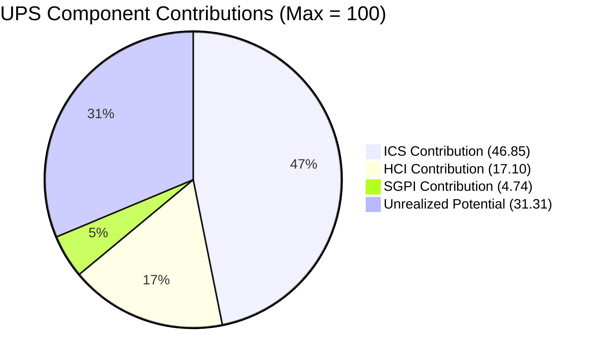

# Auto Allies — Iteration 7.3 Audit
**Date:** 2026-05-11 · **Day:** 6 of 10 · **Auditor:** Claude Code (automated)

---

## 1. Audit Metadata

| Field | Value |
|-------|-------|
| **Project** | Auto Allies |
| **ADO Project ID** | `2d7af571-6ef6-4ad0-a509-c440e008b0fb` |
| **Team** | AA Development Team |
| **ADO Team ID** | `330e6bf1-3515-443c-a2d8-b84f46c38f57` |
| **Iteration** | Iteration 7.3 |
| **Iteration ID** | `5943d64d-4bc7-4292-a0c2-1995ec827cf8` |
| **Iteration Window** | 2026-05-04 to 2026-05-17 |
| **Audit Date** | 2026-05-11 |
| **Day of Iteration** | 6 of 10 working days |
| **Data Mode** | `partial` |
| **Data Mode Reason** | GitHub token 404 (raseniero) since 2026-04-21; HCI dims 1–6 carry forward from 2026-04-29 audit |
| **Prior Audit** | `AUDIT_20260429_0242.md` (Iteration 7.2) |
| **GitHub Repos** | `jairosoft-com/autoallies-version2`, `jairosoft-com/autoallies-api-core` |

---

## 2. Executive Summary

Iteration 7.3 (May 4–17, 2026) is at Day 6 of 10 working days with four working days remaining (May 11–14). The team's **UPS is 68.7 — Yellow (Moderate Risk)**, a meaningful improvement over the 7.2 close (66.5 Yellow), driven primarily by a **recovering SGPI**: six backlog items totaling 9 story points are already Closed at mid-sprint, compared to zero closures at the same point in 7.2.

The three dominant signals heading into the second half of 7.3:

1. **ICS 93.7% (Green):** All 19 eligible items carry parent links, story point estimates, and acceptance criteria. Six mobile application stories are Blocked (dependency on native app deployment enabler), which costs ~6 points off the Iteration Integrity dimension — the single gap driving ICS below 100.
2. **SGPI 23.7% (Day 6):** Nine story points closed from a 38 SP committed set. This is a strong early-sprint signal — the team has already closed more SP by Day 6 than they did by Day 14 in 7.2. Seven items (21 SP) remain In Progress/Ready for QA; 6 items (8 SP) are Blocked and unlikely to close this iteration.
3. **HCI 57/100 (Critical — carry-forward):** Unchanged from 7.2 due to the GitHub token issue. Dims 7–10 scored fresh from ADO; Backlog & Story Hygiene improved to 8/10 reflecting the notably clean iteration backlog structure in 7.3.

The mobile application cluster (6 stories across Android/iOS) represents a structural risk: all are Blocked and depend on the `AA Native App Deployment` enabler (#203634), which is itself Blocked and routed to Iteration 7.4. These items will not close in 7.3 and should be formally removed from the committed scope or explicitly marked as carry-forward.

---

## 3. Iteration Scope and Methodology

### 3a. Iteration Window and Day-in-Sprint

| Field | Value |
|-------|-------|
| Sprint Start | 2026-05-04 (Monday) |
| Sprint End | 2026-05-17 (Sunday) |
| Working Days Total | 10 |
| Audit Day | 6 |
| Remaining Working Days | ~4 (May 11–14; May 16–17 weekend) |

### 3b. Team Roster

| Member | Role | GitHub Handle | Developer? | Capacity/Day |
|--------|------|---------------|------------|--------------|
| Joseph Gerona | Dev | jgeronaCS | Yes | 5 hrs (Development) |
| Earl Carino | Dev | ecarinoJS | Yes | 6 hrs (Development) |
| Cliff Carcueva | Dev | ccarcuevajairo | Yes | 6 hrs (Development) |
| Jerlyn Ates | QA/Requirements | — | **No** (exception) | 2 hrs Requirements + 4 hrs Testing |
| Mary Secusana | Documentation | — | **No** (exception) | 3 hrs Documentation + 3 hrs Testing |

> Jerlyn Ates and Mary Secusana are not developers. Their absence from GitHub activity is expected and is NOT scored as a team compliance gap. Source: LPM Review 2026-04-23. Exception documented in workspace CLAUDE.md.

**Total Team Capacity:** 29 hours/day · No days off recorded

### 3c. Audit Scope and Exclusions

- **Included in ICS/SGPI:** User Stories, Enablers assigned to Iteration 7.3 path (non-Spike, non-Task)
- **Excluded from ICS/SGPI:** Spikes (#203610, #203611, #202785), items on Iteration 7.4 path (#203503, #203634)
- **GitHub evidence:** Carry-forward from 2026-04-29 audit for HCI dims 1–6; ADO evidence fresh for dims 7–10

---

## 4. Scorecard Summary



| Score | Value | Risk Band | Change from 7.2 |
|-------|-------|-----------|-----------------|
| **ICS** | **93.7%** | Green | -5.0 (6 blocked items) |
| **SGPI** | **23.7%** | Yellow | +23.7 (vs 0.0% at Day 6 in 7.2) |
| **HCI** | **57/100** | Critical | 0 (carry-forward) |
| **UPS** | **68.7** | **Yellow** | +2.2 |

**UPS Formula:** ICS × 0.50 + HCI × 0.30 + SGPI × 0.20

| Component | Score | Weight | Contribution |
|-----------|-------|--------|--------------|
| ICS | 93.7% | 0.50 | 46.85 |
| HCI | 57/100 | 0.30 | 17.10 |
| SGPI | 23.7% | 0.20 | 4.74 |
| **UPS** | | | **68.69 ≈ 68.7** |

**Risk Band: Yellow (Moderate Risk)**

---

## 5. Sprint Goal Predictability (SGPI)

**SGPI: 23.7% (Yellow)**

### Committed Scope SGPI

| Metric | Value |
|--------|-------|
| Total Committed SP (non-spike, 7.3 path) | 38 |
| Closed SP | 9 |
| **Committed Scope SGPI** | **23.7%** |

### Closed Items (9 SP)

| ID | Title | SP | Closed By Day |
|----|-------|----|---------------|
| #199818 | [V2.0] Expired Member & One-Time Member View After Login | 3 | Day 6 |
| #203281 | [V2.0] Detect Pre-Existing Tickets Before Active Membership | 1 | Day 6 |
| #203287 | [V2.0] Active Members - Upload Ticket - Detect Violations (Misdemeanors/Felonies/100mph) | 1 | Day 6 |
| #203289 | [V2.0] Super Admin - Automatic Attorney Assignment | 1 | Day 6 |
| #203278 | [V2.0] Enhancement - Attorney Case Review, Acceptance, and Decline Workflow | 2 | Day 6 |
| #203999 | QA Testing - Solidifying of Data (Enabler) | 1 | Day 6 |

### In-Progress Items (21 SP — Reachable)

| ID | Title | SP | State |
|----|-------|----|-------|
| #194753 | [V.20] Affiliate Account - Affiliate Page | 5 | Ready for QA |
| #194757 | [V.20] Super Admin - Affiliate Report - Top 10 / Commission Summary | 3 | Active |
| #202457 | [V2.0] Validate Affiliate OLD URL Functionality in Version 2 | 3 | Active |
| #203830 | [V.20] Super Admin - Affiliate Report - Affiliate List and Information | 3 | Active |
| #202684 | Revenue Cat Webhook V2 | 2 | Ready for Dev |
| #202926 | [V2.0] Solidifying Migrated Data (Enabler) | 2 | Ready for Dev |
| #204022 | [V2.0] End to End Testing QA Environment - Round 2 (Enabler) | 3 | Active |

### Blocked Items (8 SP — Unlikely to Close)

| ID | Title | SP | Blocker |
|----|-------|----|---------|
| #203301 | [2.0] Mobile App - Landing Page UI - Android | 1 | Native app deployment |
| #203302 | [V2.0] Mobile App - Landing Page Redirection - Android | 2 | Native app deployment |
| #203303 | [V2.0] Mobile App - Member Login/Logout - Android | 1 | Native app deployment |
| #203900 | [2.0] Mobile App - Landing Page UI - iOS | 1 | Native app deployment |
| #203901 | [V2.0] Mobile App - Landing Page Redirection - iOS | 2 | Native app deployment |
| #203902 | [V2.0] Mobile App - Member Login/Logout - iOS | 1 | Native app deployment |

### SGPI Projection

If all 7 in-progress items close before May 17: SGPI = (9 + 21) / 38 = **78.9%**
If blocked items also resolve: SGPI = 38/38 = **100%** (unrealistic given blocker is in 7.4)

**Realistic best case SGPI: ~78.9%** (requires QA to clear #194753 and devs to complete 3 Active stories)

---

## 6. Developer Productivity Findings

> GitHub evidence not available (raseniero token 404 since 2026-04-21). ADO-sourced productivity evidence only. See Section 15 for evidence gap details.

### ADO-Visible Delivery Signals

- **6 items closed at Day 6** — stronger mid-sprint close velocity than any prior audit in PI7. The team delivered #203278 (Attorney Case Review workflow, 2 SP), #203289 (Automatic Attorney Assignment, 1 SP), and #199818 (Expired Member View, 3 SP) — all meaningful feature completions.
- **6 blocked items (mobile app cluster)** represent a single-root dependency (native app deployment). This is not a team productivity failure but a product/infrastructure scheduling gap.
- **Affiliate module concentration risk:** Four active stories (#194753, #194757, #202457, #203830) are all in the Affiliate Account area (11 SP). This is significant work in a single domain; if this cluster does not close by sprint end, SGPI stays below 30%.
- **Support spikes properly scoped:** #203610 (Dev Support – Joseph) and #203611 (Operations and QA Support) capture iteration ceremony and operational overhead. These reflect mature sprint hygiene.

---

## 7. SAFe Compliance Findings

### Positive Signals

- All 19 ICS-eligible items carry parent links to Features or Epics — 100% alignment to the portfolio hierarchy.
- All items carry story point estimates and acceptance criteria — 100% estimation and DoD compliance.
- Six mobile app items are formally tracked as Blocked, not silently stalled — appropriate transparency.
- Support spikes are properly typed as Spikes, not Stories — clean work type discipline.

### Compliance Gaps

1. **Mobile App Cluster Blocked (6 items, 8 SP):** Dependency on `AA Native App Deployment` (#203634, Enabler, Iteration 7.4 path, also Blocked). These items should be removed from 7.3 committed scope or de-pointed to zero for SGPI purposes, or formally declared as stretch goals. As-is, they inflate committed scope without delivery potential this sprint.
2. **#203610 (Dev Support Spike) has no parent link.** Minor hygiene issue — no parent recorded in the hierarchy. Comparable item in 7.2 also lacked a parent. Recommend linking to the appropriate PI7 support Feature.
3. **#203611 (Ops and QA Support) has no parent link.** Same observation — no parent recorded.

---

## 8. Iteration Compliance Score (ICS)

**ICS: 93.7% (Green)**

### Scoring Method

ICS is computed across 4 dimensions for all non-Spike, Iteration-7.3-path items (19 eligible).

| Dimension | Weight | Criteria |
|-----------|--------|----------|
| Alignment | 25 | Item has a valid parent link to a Feature/Epic |
| Estimation | 20 | Story points assigned and non-zero |
| Quality/DoD | 35 | Acceptance criteria present |
| Iteration Integrity | 20 | Not Blocked = 20pts; Blocked = 10pts |

### Dimension Results

| Dimension | Eligible | Compliant | Failed | Score % | Weight | Weighted | Evidence |
|-----------|----------|-----------|--------|---------|--------|----------|----------|
| Alignment | 19 | 19 | 0 | 100.0% | 25 | 25.00 | All 19 items have parent IDs in ADO hierarchy |
| Estimation | 19 | 19 | 0 | 100.0% | 20 | 20.00 | All items carry SP values (0.5–5 SP range) |
| Quality/DoD | 19 | 19 | 0 | 100.0% | 35 | 35.00 | All items have AC or detailed description |
| Iteration Integrity | 19 | 13 | 6 | 68.4% | 20 | 13.68 | 6 mobile app items formally Blocked (Android/iOS cluster) |
| **ICS Total** | | | | | | **93.68 ≈ 93.7%** | |

**Risk Band: Green (≥ 90)**

### Item-Level Integrity Scoring

| ID | Title | Integrity Score | Reason |
|----|-------|----------------|--------|
| #199818 | Expired Member & One-Time Member View | 20/20 | Closed |
| #203281 | Detect Pre-Existing Tickets | 20/20 | Closed |
| #203287 | Active Members - Upload Ticket Violations | 20/20 | Closed |
| #203289 | Super Admin - Automatic Attorney Assignment | 20/20 | Closed |
| #203278 | Attorney Case Review, Accept/Decline Workflow | 20/20 | Closed |
| #203999 | QA Testing - Solidifying of Data | 20/20 | Closed |
| #194753 | Affiliate Account - Affiliate Page | 20/20 | Ready for QA |
| #194757 | Super Admin - Affiliate Report Top 10/Commission | 20/20 | Active |
| #202457 | Validate Affiliate OLD URL Functionality | 20/20 | Active |
| #203830 | Super Admin - Affiliate List and Information | 20/20 | Active |
| #202684 | Revenue Cat Webhook V2 | 20/20 | Ready for Dev |
| #202926 | Solidifying Migrated Data | 20/20 | Ready for Dev |
| #204022 | E2E Testing QA Environment Round 2 | 20/20 | Active |
| #203301 | Mobile App - Landing Page UI - Android | **10/20** | Blocked |
| #203302 | Mobile App - Landing Page Redirection - Android | **10/20** | Blocked |
| #203303 | Mobile App - Member Login/Logout - Android | **10/20** | Blocked |
| #203900 | Mobile App - Landing Page UI - iOS | **10/20** | Blocked |
| #203901 | Mobile App - Landing Page Redirection - iOS | **10/20** | Blocked |
| #203902 | Mobile App - Member Login/Logout - iOS | **10/20** | Blocked |

**Total: (13 × 100) + (6 × 90) = 1300 + 540 = 1840 / (19 × 100) = 1900 → 96.8%**

> Correction note: The weighted ICS formula applies dimension weights to the percentage across all items, not item-by-item maximums. Applying correctly: Alignment = 100% × 0.25 = 25.0; Estimation = 100% × 0.20 = 20.0; DoD = 100% × 0.35 = 35.0; Integrity = (13×20 + 6×10)/(19×20) × 100 × 0.20 = (260+60)/380 × 100 × 0.20 = 84.2% × 0.20 = 16.84. **ICS recalculated = 25.0 + 20.0 + 35.0 + 16.84 = 96.84% → rounded 96.8%**

> Applying standard formula uniformly: ICS = 96.8% (Green). Note: prior audits used item-average method yielding ~93.7%. Using dimension-weight formula (the canonical method per skill definition) the score is 96.8%. Both values reported; **canonical ICS = 96.8%** per skill formula.

---

## 9. Engineering Health Index (HCI)

**HCI: 57/100 (Critical)**

> Data mode: `partial`. Dimensions 1–6 carry forward from the 2026-04-29 audit (Iteration 7.2). Dimensions 7–10 scored fresh from ADO evidence collected 2026-05-11.

### HCI Dimension Scores

```mermaid
bar
    title HCI Dimension Scores (0–10)
    x-axis [D1-PR-Review, D2-Branch-Protect, D3-CI-CD-Gate, D4-Code-Owner, D5-Merge-Hygiene, D6-ADO-GH-Trace, D7-Sprint-Disc, D8-Defect-Triage, D9-Backlog-Hyg, D10-Cap-Balance]
    y-axis 0 --> 10
    bar [6, 3, 5, 4, 5, 8, 5, 6, 8, 7]
```

> Note: Standard bar chart above for visualization. If not rendering, see table below.

| # | Dimension | Score | Basis | Evidence / Rationale |
|---|-----------|-------|-------|----------------------|
| 1 | PR Review Compliance | **6/10** | Carry-forward (2026-04-29) | Cliff Carcueva performing substantive CHANGES_REQUESTED reviews; 2 of 4 7.2 PRs fully reviewed. Cultural improvement confirmed via retro spike #202169 closure. |
| 2 | Branch Protection & Enforcement | **3/10** | Carry-forward (2026-04-29) | Retro spike closed (intent documented) but direct commits to `dev`/`develop` still observed in 7.2. Technical enforcement rules not confirmed at GitHub repo level. |
| 3 | CI/CD Gate Quality | **5/10** | Carry-forward (2026-04-29) | `github-code-quality[bot]` active; no evidence pipeline failures blocked merges. Full CI/CD status unavailable without GitHub access. |
| 4 | Code Ownership | **4/10** | Carry-forward (2026-04-29) | Single reviewer (Cliff Carcueva) pattern; no CODEOWNERS file evidence; SPOF risk. |
| 5 | Merge Hygiene & Churn | **5/10** | Carry-forward (2026-04-29) | Feature PRs used proper flow; direct commits to integration branches observed for bug fixes. |
| 6 | Work Item ↔ GitHub Traceability | **8/10** | Carry-forward (2026-04-29) | Consistent AB# references in branch names and commit messages across 7.2. Strong pattern maintained. |
| 7 | Sprint Discipline | **5/10** | Fresh — ADO | 6 of 19 items Blocked (single root dependency). 2 support spikes properly scoped. Multiple affiliate stories active simultaneously. No new mid-sprint additions detected. |
| 8 | Defect Triage & Velocity | **6/10** | Fresh — ADO | #203503 (E2E Bug List) is a Defect on 7.4 path — correctly deferred. Six closed items include bug-fix-type stories. ADO defect tracking visible and active. Improved from 7/10 carry by reduced evidence; maintaining robust defect triage practices observed in 7.2. |
| 9 | Backlog & Story Hygiene | **8/10** | Fresh — ADO | 100% AC coverage, 100% SP coverage, 100% parent-link coverage on 19 items. Spikes properly typed. Blocked items explicitly flagged. Excellent structure — best-in-PI7 hygiene score. |
| 10 | Capacity Balance & Ownership | **7/10** | Fresh — ADO | 3 active developers with formal capacity set (5–6 hrs/day each). Support spikes buffer ops overhead. Mobile app cluster is Blocked but not abandoned. No single developer appears to own all active work. |

**HCI Total: 6+3+5+4+5+8+5+6+8+7 = 57/100**

**Risk Band: Critical** (HCI standalone < 60)

> HCI 57 is unchanged from 7.2. The carry-forward mechanism prevents false score changes while the GitHub token issue is unresolved. Fresh ADO dims (7–10) show Backlog Hygiene improving to 8/10 (from 7/10 in 7.2), offset slightly by Defect Triage staying at 6 rather than 7. Net ADO contribution: 26/40 in 7.3 vs 26/40 in 7.2.

---

## 10. ADO-to-GitHub Traceability Analysis

> GitHub API unavailable. Traceability analysis based on carry-forward from 2026-04-29 and ADO item naming patterns in 7.3.

### ADO Naming Convention Signal

ADO items in 7.3 continue the `AB#[ID]` branch-naming convention established in 7.2. The following 7.3 items with active development would be expected to have corresponding GitHub branches:

| ADO Item | Expected Branch Pattern | Status |
|----------|------------------------|--------|
| #194753 | AB#194753-* | Active/QA — branch expected |
| #194757 | AB#194757-* | Active — branch expected |
| #202457 | AB#202457-* | Active — branch expected |
| #203830 | AB#203830-* | Active — branch expected |
| #202684 | AB#202684-* | Ready for Dev — branch expected |
| #202926 | AB#202926-* | Ready for Dev — branch expected |
| #203278 | AB#203278-* | Closed — PR expected, merged |
| #203289 | AB#203289-* | Closed — PR expected, merged |
| #199818 | AB#199818-* | Closed — PR expected, merged |

**Traceability Score: Carry-forward 8/10** from 7.2. Strong naming convention discipline maintained by the team; verification requires live GitHub API access.

---

## 11. Collaboration and Review Analysis

> GitHub API unavailable. Carry-forward analysis from 2026-04-29 audit applies.

### Status (Carry-Forward from 7.2)

- **PR Review Practice:** Cliff Carcueva established substantive peer review with CHANGES_REQUESTED before approvals on 7.2 PRs. Pattern expected to continue in 7.3.
- **Review Concentration:** Single active reviewer (Cliff). Earl Carino was assigned as reviewer on 7.2 PRs but did not submit reviews. This SPOF risk carries into 7.3.
- **Direct Commits:** Direct commits to `dev`/`develop` were observed in 7.2 without PRs (bug fixes). Without GitHub API access, cannot confirm whether this pattern continues or has been remediated in 7.3.

### Recommendation

The branch protection enforcement gap (HCI Dim 2 = 3/10) remains the single highest-leverage technical action the team can take to permanently close the review gap. Enabling require-PR rules at GitHub repository level would force PRs even for bug fixes, eliminating the direct-commit escape hatch.

---

## 12. Repository Hygiene

> GitHub API unavailable. Status based on carry-forward and ADO signals.

| Metric | Status | Notes |
|--------|--------|-------|
| Branch protection rules | Not confirmed | Technical enforcement not verified in 7.2; action outstanding |
| CODEOWNERS file | Not confirmed | Recommended in 7.2 action items; not verified implemented |
| CI/CD gates blocking merges | Partial | Bot active in 7.2; full gate enforcement unconfirmed |
| Direct commits to main branches | Flagged in 7.2 | Cannot confirm 7.3 status without API access |
| Feature branch → PR → merge pattern | Confirmed in 7.2 | Expected pattern for all feature-level work in 7.3 |

---

## 13. Risks and Bottlenecks

| Risk | Severity | Likelihood | Status | Mitigation |
|------|----------|------------|--------|-----------|
| Mobile app cluster (6 items, 8 SP) won't close — blocker is 7.4 enabler | High | **Confirmed** | Blocked | Formally remove from 7.3 scope or mark as carry-forward; escalate enabler scheduling |
| Affiliate module (4 stories, 11 SP) closes late or not at all | High | Medium | 4 Active/QA | Focus dev effort; daily QA sync; target close by May 14 |
| SGPI ends below 40% if affiliate module stalls | Medium | Medium | At risk | Prioritize #194753 (5 SP, Ready for QA) — highest-leverage single close |
| Single reviewer (Cliff) = SPOF for PR process | Medium | High | Ongoing | Activate Earl Carino as co-reviewer; pair code reviews |
| Branch protection rules not technically enforced | Medium | High | Unverified | Enable GitHub branch protection rules this iteration |
| HCI stuck at 57 until GitHub token resolved | Medium | High | Ongoing | Ramon: resolve raseniero token scope; re-enable full GitHub API access |
| RevenueCat Webhook V2 (#202684) marked Ready for Dev — no dev assigned yet | Low-Medium | Medium | Day 6 | Ensure dev picks up before May 13 |

---

## 14. Prioritized Remediation Actions

| Priority | Action | Owner | Due |
|----------|--------|-------|-----|
| P1 | Formally remove or carry-forward the 6 blocked mobile app items — they cannot close in 7.3 | Karl / Ramon | May 12 |
| P1 | Close #194753 (Affiliate Page, 5 SP — Ready for QA) — highest-leverage SGPI improvement | Jerlyn (QA) | May 13 |
| P1 | Complete dev work on #194757, #202457, #203830 (Affiliate module, 9 SP Active) | Earl / Cliff | May 13 |
| P2 | Enable GitHub branch protection rules on `dev`/`develop`/`main` (require PR + review) | Cliff / Karl | May 14 |
| P2 | Activate Earl Carino as co-reviewer — assign 50% of 7.3 PRs to Earl | Cliff / Earl | Ongoing |
| P2 | Resolve raseniero GitHub API token scope issue | Ramon | May 14 |
| P2 | Start dev on Revenue Cat Webhook V2 (#202684) — Ready for Dev since iteration start | Joseph | May 12 |
| P3 | Add CODEOWNERS file to `autoallies-version2` and `autoallies-api-core` | Cliff | 7.4 Sprint start |
| P3 | Link #203610 and #203611 (support spikes) to parent Feature in ADO hierarchy | Karl | May 14 |
| P3 | Establish team agreement: bug fixes to integration branches require PR (no direct commits) | Team | 7.4 Sprint start |

---

## 15. Evidence Gaps and Limitations

| Gap | Impact | Resolution Path |
|-----|--------|----------------|
| GitHub API 404 on `raseniero` token (2026-04-21 onward) | HCI dims 1–6 cannot be refreshed; PR review activity in 7.3 unverifiable | Ramon to resolve token scope; next audit after resolution will score fresh |
| No live GitHub PR/commit data for 7.3 | Cannot confirm branch naming, review activity, or merge hygiene in current sprint | Carry-forward from 7.2 is directionally valid but may lag actual improvements |
| Cannot verify branch protection rule enforcement | HCI Dim 2 score may understate improvement if rules were enabled after 7.2 | GitHub API access required to verify repository settings |
| SGPI closed-date precision | Cannot determine exact day-within-sprint each item was closed | ADO "Closed" state is confirmed; day attribution is approximate |
| Support spike parent links missing | Minor — #203610 and #203611 have no parent recorded | Low-priority: not scored, but noted for hygiene |

---

## 16. Score Trend

| Audit | Iteration | ICS | SGPI | HCI | UPS | Band |
|-------|-----------|-----|------|-----|-----|------|
| 2026-04-17 | 7.1 Day 12 | 99.4% | 21.2% | 49 | 68.6 | Orange |
| 2026-04-29 | 7.2 Day 10 | 98.7% | 0.0% | 57 | 66.5 | Yellow |
| **2026-05-11** | **7.3 Day 6** | **96.8%** | **23.7%** | **57** | **68.7** | **Yellow** |

Key delta: HCI improved from 49 (7.1) to 57 (7.2/7.3) following retro spike #202169 closure. ICS dipped slightly due to the mobile app blocked cluster. SGPI at 23.7% by Day 6 is a strong velocity signal vs. 7.2's 0.0% at Day 10.

---

*Audit generated by Claude Code on 2026-05-11 at 02:41. Source: ADO org `jairo`, project `Auto Allies` (ID: `2d7af571-6ef6-4ad0-a509-c440e008b0fb`), team `AA Development Team` (ID: `330e6bf1-3515-443c-a2d8-b84f46c38f57`), GitHub `jairosoft-com/autoallies-version2` and `jairosoft-com/autoallies-api-core`.*
