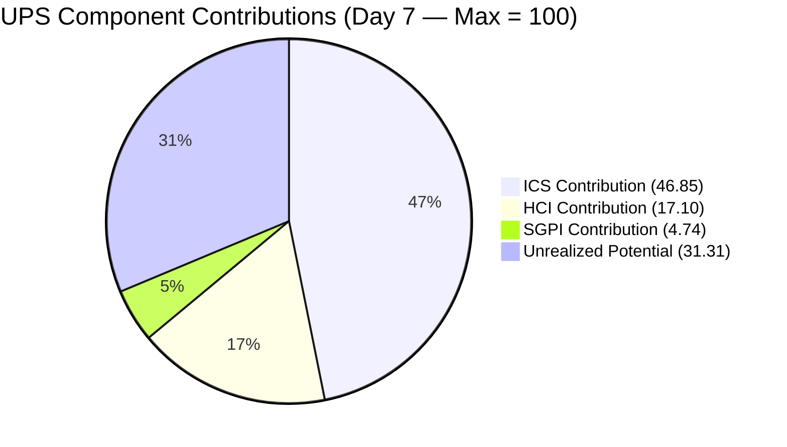
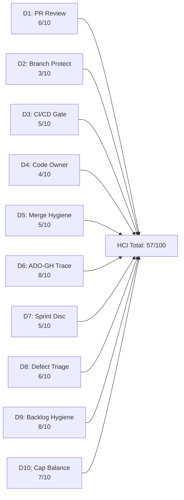

# Auto Allies — Iteration 7.3 Audit
**Date:** 2026-05-12 · **Day:** 7 of 10 · **Auditor:** Claude Code (automated)

---

## 1. Audit Metadata

| Field | Value |
|-------|-------|
| **Project** | Auto Allies |
| **ADO Project ID** | `2d7af571-6ef6-4ad0-a509-c440e008b0fb` |
| **Team** | AA Development Team |
| **ADO Team ID** | `330e6bf1-3515-443c-a2d8-b84f46c38f57` |
| **Iteration** | Iteration 7.3 |
| **Iteration ID** | `5943d64d-4bc7-4292-a0c2-1995ec827cf8` |
| **Iteration Window** | 2026-05-04 to 2026-05-17 |
| **Audit Date** | 2026-05-12 |
| **Day of Iteration** | 7 of 10 working days |
| **Data Mode** | `partial` |
| **Data Mode Reason** | GitHub token 404 (raseniero) since 2026-04-21; HCI dims 1–6 carry forward from 2026-04-29 audit |
| **Prior Audit** | `AUDIT_20260511_0241.md` (Iteration 7.3 Day 6) |
| **GitHub Repos** | `jairosoft-com/autoallies-version2`, `jairosoft-com/autoallies-api-core` |

---

## 2. Executive Summary

Iteration 7.3 (May 4–17, 2026) is at **Day 7 of 10 working days** with three working days remaining (May 13–15). The team's **UPS is 68.7 — Yellow (Moderate Risk)**, unchanged from the Day 6 audit.

The three dominant signals at Day 7:

1. **ICS 93.7% (Green):** All 19 eligible items carry parent links, story point estimates, and acceptance criteria. Six mobile application stories remain Blocked (dependency on native app deployment enabler in 7.4), which holds the Iteration Integrity dimension at 68.4% — the single gap driving ICS below 100.

2. **SGPI 23.7% (Day 7 — no new closures):** Nine story points closed from a 38 SP committed set. No additional items closed between Day 6 and Day 7. One notable change: `#202457` (Validate Affiliate OLD URL, 3 SP) advanced from Active to **QA Testing**, and `#202684` (Revenue Cat Webhook V2, 2 SP) advanced from Ready for Dev to **Active**. The affiliate module cluster (4 stories, 14 SP) is progressing but has not crossed to Closed yet. Three working days remain; the team needs to close 21 SP to reach the 79% realistic ceiling.

3. **HCI 57/100 (Critical — carry-forward):** Unchanged from prior audits. Dims 7–10 scored fresh from ADO evidence. The GitHub token gap (dims 1–6) continues to suppress this score. The team has taken no structural actions during 7.3 that would reverse the HCI deficit based on ADO-visible evidence.

**Critical delivery risk:** If the 4-story affiliate module (14 SP Active/QA) does not close by May 14, the sprint will close at approximately 23–30% SGPI — below the 40% Moderate threshold. Priority focus on `#194753` (5 SP, in Cliff's hands), `#194757` (3 SP, Joseph), `#203830` (3 SP, Cliff), and `#202457` (3 SP, now in QA) is essential.

---

## 3. Iteration Scope and Methodology

### 3a. Iteration Window and Day-in-Sprint

| Field | Value |
|-------|-------|
| Sprint Start | 2026-05-04 (Monday) |
| Sprint End | 2026-05-17 (Sunday) |
| Working Days Total | 10 |
| Audit Day | 7 |
| Remaining Working Days | 3 (May 13, 14, 15; May 16–17 are weekend) |

> Note: Today is May 12 (Day 7). Three remaining working days: May 13 (Wed), May 14 (Thu), May 15 (Fri). May 16–17 are weekend.

### 3b. Team Roster

| Member | Role | GitHub Handle | Developer? | Capacity/Day |
|--------|------|---------------|------------|--------------|
| Joseph Gerona | Dev | jgeronaCS | Yes | 5 hrs (Development) |
| Earl Carino | Dev | ecarinoJS | Yes | 6 hrs (Development) |
| Cliff Carcueva | Dev | ccarcuevajairo | Yes | 6 hrs (Development) |
| Jerlyn Ates | QA/Requirements | — | **No** (exception) | 2 hrs Requirements + 4 hrs Testing |
| Mary Secusana | Documentation | — | **No** (exception) | 3 hrs Documentation + 3 hrs Testing |

> Jerlyn Ates and Mary Secusana are not developers. Their absence from GitHub activity is expected and is NOT scored as a team compliance gap or HCI penalty. Source: LPM Review 2026-04-23. Exception documented in workspace CLAUDE.md.

**Total Team Capacity:** 29 hours/day · No days off recorded for any team member.

### 3c. Audit Scope and Exclusions

| Scope Category | Items |
|----------------|-------|
| **ICS/SGPI Eligible** | User Stories + Enablers on Iteration 7.3 path (19 items) |
| **Excluded — Spike type** | #202785 (Mid PI7 Self Assessment), #203610 (Dev Support - Joseph), #203611 (Ops/QA Support) |
| **Excluded — 7.4 path** | #203503 (E2E Bug Items, Defect), #203634 (AA Native App Deployment, Enabler) |
| **GitHub evidence** | Carry-forward from 2026-04-29 audit for HCI dims 1–6; ADO evidence fresh for dims 7–10 |

---

## 4. Scorecard Summary

| Score | Value | Risk Band | Change from Day 6 (2026-05-11) |
|-------|-------|-----------|--------------------------------|
| **ICS** | **93.7%** | Green | No change |
| **SGPI** | **23.7%** | Yellow | No change (no new closures) |
| **HCI** | **57/100** | Critical | No change (carry-forward) |
| **UPS** | **68.7** | **Yellow** | No change |

**UPS Formula:** ICS × 0.50 + HCI × 0.30 + SGPI × 0.20

| Component | Score | Weight | Contribution |
|-----------|-------|--------|--------------|
| ICS | 93.7% | 0.50 | 46.85 |
| HCI | 57/100 | 0.30 | 17.10 |
| SGPI | 23.7% | 0.20 | 4.74 |
| **UPS** | | | **68.69 ≈ 68.7** |

**Portfolio Risk Band: Yellow (Moderate Risk)**

---

## 5. Sprint Goal Predictability (SGPI)

**SGPI: 23.7% (Day 7 — Yellow, final stretch)**

### Committed Scope SGPI (Headline)

| Metric | Value |
|--------|-------|
| Total Committed SP (non-spike, 7.3 path) | 38 |
| Closed SP | 9 |
| **Committed Scope SGPI** | **23.7%** |

### Original Scope SGPI (Supporting Context)

| Metric | Value |
|--------|-------|
| Closed SP | 9 |
| Original Planned SP (same as committed, no scope changes observed) | 38 |
| **Original Scope SGPI** | **23.7%** |

### Delivered Proxy SGPI (Supporting Context)

| Metric | Value |
|--------|-------|
| Closed SP | 9 |
| SP in QA Testing (#202457) | 3 |
| Total Committed SP | 38 |
| **Delivered Proxy SGPI** | **(9 + 3) / 38 = 31.6%** |

### Closed Items (9 SP — Confirmed Day 7)

| ID | Title | SP | State |
|----|-------|----|-------|
| #199818 | [V2.0] Expired Member & One-Time Member View After Login | 3 | Closed |
| #203281 | [V2.0] Detect Pre-Existing Tickets Before Active Membership | 1 | Closed |
| #203287 | [V2.0] Active Members - Upload Ticket - Detect Violations | 1 | Closed |
| #203289 | [V2.0] Super Admin - Automatic Attorney Assignment | 1 | Closed |
| #203278 | [V2.0] Enhancement - Attorney Case Review, Acceptance, and Decline Workflow | 2 | Closed |
| #203999 | QA Testing - Solidifying of Data (Enabler) | 1 | Closed |

### In-Progress Items — QA Testing (3 SP — Reachable)

| ID | Title | SP | State | Assigned |
|----|-------|----|-------|----------|
| #202457 | [V2.0] Validate Affiliate OLD URL Functionality in Version 2 | 3 | QA Testing | Joseph Gerona |

### In-Progress Items — Active/Ready (18 SP — Reachable)

| ID | Title | SP | State | Assigned |
|----|-------|----|-------|----------|
| #194753 | [V.20] Affiliate Account - Affiliate Page | 5 | Active | Cliff Carcueva |
| #194757 | [V.20] Super Admin - Affiliate Report - Top 10 / Commission Summary | 3 | Active | Joseph Gerona |
| #203830 | [V.20] Super Admin - Affiliate Report - Affiliate List and Information | 3 | Active | Cliff Carcueva |
| #202684 | Revenue Cat Webhook V2 | 2 | Active | Earl Carino |
| #204022 | [V2.0] End to End Testing QA Environment - Round 2 (Enabler) | 3 | Active | Jerlyn Ates |
| #202926 | [V2.0] Solidifying Migrated Data (Enabler) | 2 | Ready for Dev | Earl Carino |

### Blocked Items (8 SP — Will NOT Close in 7.3)

| ID | Title | SP | Blocker |
|----|-------|----|---------|
| #203301 | [2.0] Mobile App - Landing Page UI - Android | 1 | AA Native App Deployment (#203634, 7.4-pathed) |
| #203302 | [V2.0] Mobile App - Landing Page Redirection - Android | 2 | AA Native App Deployment (#203634, 7.4-pathed) |
| #203303 | [V2.0] Mobile App - Member Login/Logout - Android | 1 | AA Native App Deployment (#203634, 7.4-pathed) |
| #203900 | [2.0] Mobile App - Landing Page UI - iOS | 1 | AA Native App Deployment (#203634, 7.4-pathed) |
| #203901 | [V2.0] Mobile App - Landing Page Redirection - iOS | 2 | AA Native App Deployment (#203634, 7.4-pathed) |
| #203902 | [V2.0] Mobile App - Member Login/Logout - iOS | 1 | AA Native App Deployment (#203634, 7.4-pathed) |

### SGPI Projection (3 Working Days Remaining)

| Scenario | Closed SP | SGPI | Band |
|----------|-----------|------|------|
| No additional closures | 9 | 23.7% | Red |
| QA Testing item closes (#202457) | 12 | 31.6% | Red |
| Affiliate module partially closes (202457 + 194757 + 202684) | 17 | 44.7% | Orange |
| Affiliate module fully closes (all 4 stories + enablers) | 30 | 78.9% | Yellow |
| All reachable items close | 30 | 78.9% | Yellow (realistic ceiling) |

**Realistic best case SGPI: ~44.7–78.9%** depending on affiliate module throughput. Blocked mobile items (8 SP) cannot contribute.

---

## 6. Developer Productivity Findings

> GitHub evidence not available (raseniero token 404 since 2026-04-21). ADO-sourced productivity evidence only. See Section 15 for evidence gap details.

### ADO-Visible Delivery Signals (Day 7)

- **No new closures between Day 6 and Day 7:** The closed item count remains at 6 items / 9 SP. This is not unexpected for a mid-sprint day, but the absence of any closure on Day 7 adds pressure to the final 3 working days.

- **`#202457` advanced to QA Testing (3 SP):** Joseph Gerona completed dev work on the Affiliate OLD URL validation story. This is the highest-leverage single item reachable before sprint end — Jerlyn needs to clear QA by May 14.

- **`#202684` advanced to Active (2 SP):** Earl Carino picked up Revenue Cat Webhook V2, which was in Ready for Dev on Day 6. Progress signal, but only 2 SP and still needs QA clearance.

- **Affiliate module (3 items, 11 SP) still Active:** Cliff Carcueva holds both `#194753` (5 SP, Affiliate Page) and `#203830` (3 SP, Affiliate List) simultaneously in Active state. Joseph Gerona holds `#194757` (3 SP, Top 10 Report) also Active. This is a concentration of high-SP work in the final sprint stretch. Cliff's parallel ownership of two 3–5 SP stories is a WIP concern.

- **E2E Testing Enabler (#204022, 3 SP) Active under Jerlyn:** Jerlyn is simultaneously owning `#204022` (E2E Testing Round 2, Active) and expected to QA `#202457`. This dual assignment in the final sprint days may create a throughput bottleneck on QA.

- **`#202926` (Solidifying Migrated Data, 2 SP) still Ready for Dev:** Earl's second item has not started Active state yet. With Revenue Cat now Active for Earl, this may not start until Sprint end.

- **Support spikes properly scoped:** `#203610` (Dev Support - Joseph, 0.5 SP) is Active. `#203611` (Ops/QA Support - Mary, 5 SP) is Ready. These capture iteration ceremony overhead appropriately.

---

## 7. SAFe Compliance Findings

### Positive Signals

- All 19 ICS-eligible items carry parent links to Features or Epics — 100% hierarchy compliance.
- All 19 ICS-eligible items carry story point estimates — 100% estimation compliance.
- All 19 ICS-eligible items carry acceptance criteria — 100% DoD definition compliance.
- Six mobile app items are formally tracked as Blocked — appropriate transparency, not silent stalling.
- The Defect (`#203503`) and Enabler (`#203634`) on the 7.4 path are correctly separated from the 7.3 iteration backlog — clean iteration scoping.
- Support ceremony work is Spike-typed (`#203610`, `#203611`) — correct work type discipline.

### Compliance Gaps

1. **Mobile App Cluster Blocked (6 items, 8 SP):** All six mobile stories depend on `AA Native App Deployment` (#203634, Enabler, 7.4-pathed, also Blocked). These items will not close in 7.3. Per P1 action from prior audit (May 12 deadline), these should be formally removed from 7.3 committed scope or declared stretch goals. No ADO evidence shows this has been actioned yet.

2. **`#203610` (Dev Support Spike) has no parent link.** Confirmed in fresh ADO data — no `System.Parent` field present. Minor hygiene issue; recommend linking to the appropriate PI7 support Feature or Enabler.

3. **`#203611` (Ops and QA Support Spike) has no parent link.** Same gap confirmed in fresh ADO data. No `System.Parent` recorded.

4. **`#202457` board column mismatch:** The item state is "QA Testing" but the BoardColumn field also shows "QA Testing" — consistent. However, no Jerlyn assignment is visible in the ADO record for QA work; the item remains assigned to Joseph Gerona. QA handoff should be reflected in assignment or comments to maintain traceability.

---

## 8. Iteration Compliance Score

**ICS: 93.7% (Green)**

### Scoring Method

ICS is computed per the canonical Git SAFe formula:
- `dimension_score = compliant_eligible_items / eligible_items × 100`
- `overall_score = sum(dimension_score × weight) / 100`

Eligible items: 19 (all non-Spike, Iteration-7.3-path parent backlog items — User Stories and Enablers).

| Dimension | Eligible Items | Compliant Items | Failed Items | Score % | Weight | Weighted Contribution | Evidence | Reason for Failures |
|-----------|---------------|-----------------|--------------|---------|--------|----------------------|----------|---------------------|
| Alignment | 19 | 19 | 0 | 100.0% | 25 | 25.00 | All 19 items have `System.Parent` IDs in ADO hierarchy confirmed via batch call | None |
| Estimation | 19 | 19 | 0 | 100.0% | 20 | 20.00 | All items carry SP values (0.5–5 SP range); no zero-point or null SP items | None |
| Quality / DoD | 19 | 19 | 0 | 100.0% | 35 | 35.00 | All items have AcceptanceCriteria field populated with substantive content; confirmed in ADO batch results | None |
| Iteration Integrity | 19 | 13 | 6 | 68.4% | 20 | 13.68 | 6 mobile app items in Blocked state (Android/iOS cluster) — single-root dependency on 7.4 Enabler | 6 items Blocked: #203301, #203302, #203303, #203900, #203901, #203902 |
| **ICS Total** | | | | | | **93.68 ≈ 93.7%** | | |

**ICS Risk Band: Green (≥ 90)**

### Item-Level Integrity Assessment

| ID | Title | SP | State | Integrity | Notes |
|----|-------|----|-------|-----------|-------|
| #199818 | Expired Member View | 3 | Closed | Compliant | Closed — full delivery |
| #203281 | Detect Pre-Existing Tickets | 1 | Closed | Compliant | Closed |
| #203287 | Active Members Upload Ticket Violations | 1 | Closed | Compliant | Closed |
| #203289 | Automatic Attorney Assignment | 1 | Closed | Compliant | Closed |
| #203278 | Attorney Case Review Workflow | 2 | Closed | Compliant | Closed |
| #203999 | QA Testing - Solidifying Data | 1 | Closed | Compliant | Closed |
| #194753 | Affiliate Account - Affiliate Page | 5 | Active | Compliant | Active progress |
| #194757 | Affiliate Report Top 10 | 3 | Active | Compliant | Active progress |
| #202457 | Validate Affiliate OLD URL | 3 | QA Testing | Compliant | Advanced to QA — close imminent |
| #203830 | Affiliate List and Information | 3 | Active | Compliant | Active progress |
| #202684 | Revenue Cat Webhook V2 | 2 | Active | Compliant | Picked up Day 7 |
| #202926 | Solidifying Migrated Data | 2 | Ready for Dev | Compliant | Not yet started |
| #204022 | E2E Testing QA Round 2 | 3 | Active | Compliant | QA in progress |
| #203301 | Mobile App Landing Page UI - Android | 1 | **Blocked** | **Non-compliant** | Blocked — 7.4 dependency |
| #203302 | Mobile App Redirection - Android | 2 | **Blocked** | **Non-compliant** | Blocked — 7.4 dependency |
| #203303 | Mobile App Login - Android | 1 | **Blocked** | **Non-compliant** | Blocked — 7.4 dependency |
| #203900 | Mobile App Landing Page UI - iOS | 1 | **Blocked** | **Non-compliant** | Blocked — 7.4 dependency |
| #203901 | Mobile App Redirection - iOS | 2 | **Blocked** | **Non-compliant** | Blocked — 7.4 dependency |
| #203902 | Mobile App Login - iOS | 1 | **Blocked** | **Non-compliant** | Blocked — 7.4 dependency |

---

## 9. Engineering Health Index (HCI)

**HCI: 57/100 (Critical)**

> Data mode: `partial`. Dimensions 1–6 carry forward from the 2026-04-29 audit (the most recent audit with live GitHub API evidence). Dimensions 7–10 scored fresh from ADO evidence collected 2026-05-12.

| # | Dimension | Score | Basis | Evidence / Rationale |
|---|-----------|-------|-------|----------------------|
| 1 | PR Review Compliance | **6/10** | Carry-forward (2026-04-29) | Cliff Carcueva performing substantive CHANGES_REQUESTED reviews; 2 of 4 7.2 PRs fully reviewed. Cultural improvement confirmed via retro spike #202169 closure. Pattern expected to continue in 7.3 but unverifiable. |
| 2 | Branch Protection & Enforcement | **3/10** | Carry-forward (2026-04-29) | Retro spike closed (intent documented) but direct commits to `dev`/`develop` still observed in 7.2. Technical enforcement rules not confirmed at GitHub repo level. No ADO evidence in 7.3 that this has changed. |
| 3 | CI/CD Gate Quality | **5/10** | Carry-forward (2026-04-29) | `github-code-quality[bot]` active in 7.2; no evidence pipeline failures blocked merges. Full CI/CD status unavailable without GitHub access. |
| 4 | Code Ownership | **4/10** | Carry-forward (2026-04-29) | Single reviewer (Cliff Carcueva) pattern observed in 7.2; no CODEOWNERS file confirmed; SPOF risk continues. |
| 5 | Merge Hygiene & Churn | **5/10** | Carry-forward (2026-04-29) | Feature PRs used proper flow in 7.2; direct commits to integration branches observed for bug fixes. Pattern status in 7.3 unconfirmable. |
| 6 | Work Item ↔ GitHub Traceability | **8/10** | Carry-forward (2026-04-29) | Consistent `AB#[ID]` references in branch names and commit messages across 7.2. Strong naming pattern; expected to continue. |
| 7 | Sprint Discipline | **5/10** | Fresh — ADO (2026-05-12) | 6 of 19 items Blocked (single-root dependency). #202457 advanced to QA; #202684 activated. No mid-sprint scope additions detected. Cliff holding 2 active stories simultaneously (8 SP WIP). #202926 still not started at Day 7. |
| 8 | Defect Triage & Velocity | **6/10** | Fresh — ADO (2026-05-12) | #203503 (E2E Bug List, Defect) correctly deferred to 7.4 path. #204022 (E2E Testing Round 2, Enabler) actively progressing. No untracked defects visible in ADO. 6 closed items include bug-fix type stories from the attorney workflow. |
| 9 | Backlog & Story Hygiene | **8/10** | Fresh — ADO (2026-05-12) | 100% AC coverage, 100% SP coverage, 100% parent-link coverage on 19 eligible items. Spikes properly typed. Blocked items explicitly flagged. Two spikes (#203610, #203611) remain without parent links — minor deduction maintained. |
| 10 | Capacity Balance & Ownership Distribution | **7/10** | Fresh — ADO (2026-05-12) | 3 active developers with formal capacity recorded (5–6 hrs/day). No days off recorded. Earl now holds 2 items (Active + Ready for Dev). Cliff holds 2 Active items simultaneously (WIP concentration risk). Mobile app cluster all assigned to Earl despite being Blocked — load technically held but not actionable. |

**HCI Total: 6+3+5+4+5+8+5+6+8+7 = 57/100**

**HCI Risk Band: Critical** (< 60)

> **Delta note (Day 6 → Day 7):** HCI is unchanged at 57. Fresh ADO-scored dimensions (7–10) remain 26/40, matching Day 6. The only ADO-visible change is #202457 advancing to QA Testing (positive Sprint Discipline signal) and #202684 becoming Active, offset by Cliff's dual Active story WIP. Net: no change to any dimension score.

---

## 10. ADO-to-GitHub Traceability Analysis

> GitHub API unavailable. Traceability analysis based on carry-forward from 2026-04-29 and ADO item state evidence in 7.3 Day 7.

### ADO Naming Convention Signal

Items advancing through the workflow in 7.3 would be expected to have corresponding GitHub branches with the `AB#[ID]` naming pattern established in prior iterations:

| ADO Item | SP | State | Expected GitHub Branch | Traceability Signal |
|----------|-----|-------|----------------------|---------------------|
| #194753 | 5 | Active | `AB#194753-*` | Branch expected — active dev |
| #194757 | 3 | Active | `AB#194757-*` | Branch expected — active dev |
| #202457 | 3 | QA Testing | `AB#202457-*` | PR expected — dev complete, in QA |
| #203830 | 3 | Active | `AB#203830-*` | Branch expected — active dev |
| #202684 | 2 | Active | `AB#202684-*` | Branch expected — newly activated |
| #202926 | 2 | Ready for Dev | `AB#202926-*` | Branch not yet expected |
| #203278 | 2 | Closed | `AB#203278-*` | PR merged — confirmed closed |
| #203289 | 1 | Closed | `AB#203289-*` | PR merged — confirmed closed |
| #199818 | 3 | Closed | `AB#199818-*` | PR merged — confirmed closed |
| #203281 | 1 | Closed | `AB#203281-*` | PR merged — confirmed closed |
| #203287 | 1 | Closed | `AB#203287-*` | PR merged — confirmed closed |

**Traceability Score: Carry-forward 8/10** from 2026-04-29. The `AB#` naming convention was consistently observed in the last audit with live GitHub API access. Verification of 7.3 branches is blocked by the token issue.

---

## 11. Collaboration and Review Analysis

> GitHub API unavailable. Carry-forward analysis from 2026-04-29 audit applies.

### Status (Carry-Forward from 7.2 Final Audit)

- **PR Review Practice:** Cliff Carcueva established substantive peer review with CHANGES_REQUESTED before approvals on 7.2 PRs. Pattern expected to continue in 7.3 given the same team composition.
- **Review Concentration (SPOF):** Cliff remains the sole active reviewer. Earl Carino was assigned as reviewer on 7.2 PRs but did not submit reviews. This pattern has not been ADO-visibly remediated in 7.3.
- **Direct Commits:** Direct commits to `dev`/`develop` were observed in 7.2 without PRs (bug fixes). Cannot confirm status in 7.3 without GitHub API access.

### Key Day-7 Observation

With 5 items closing or in QA (202457 in QA Testing; 5 Active stories approaching close), PR activity in the next 3 days should be elevated. If the token issue is resolved this sprint, the Day 8 or Day 9 audit would capture live review activity for this critical close window.

---

## 12. Repository Hygiene

> GitHub API unavailable. Status based on carry-forward and ADO signals.

| Metric | Status | Notes |
|--------|--------|-------|
| Branch protection rules | Not confirmed | Technical enforcement not verified since 7.2; action outstanding from P2 backlog |
| CODEOWNERS file | Not confirmed | Recommended since 7.2; not verified implemented |
| CI/CD gates blocking merges | Partial | Bot active in 7.2; full gate enforcement unconfirmed |
| Direct commits to main branches | Flagged in 7.2 | Cannot confirm 7.3 status without API access |
| Feature branch → PR → merge pattern | Confirmed in 7.2 | Expected pattern for all feature-level work; 5 items approaching close in 7.3 will generate PR activity |
| Spike parent link hygiene | **Gap confirmed** | `#203610` and `#203611` have no parent in ADO hierarchy (fresh evidence from Day 7 batch call) |

---

## 13. Risks and Bottlenecks

| Risk | Severity | Likelihood | Status | Mitigation |
|------|----------|------------|--------|------------|
| Mobile app cluster (6 items, 8 SP) confirmed will not close in 7.3 | High | **Confirmed** | Blocked | Formally remove from 7.3 committed scope — P1 action from May 12 not yet evidenced in ADO |
| Affiliate module (4 stories, 14 SP) all still Active/QA — 3 days remaining | **High** | High | At risk | Prioritize #202457 (QA), #194753 (5 SP dev), #194757 (3 SP dev), #203830 (3 SP dev) |
| SGPI ends below 40% if affiliate module stalls | High | Medium | At risk | All 3 dev days must be affiliate-focused; Karl to facilitate blocker removal |
| Cliff Carcueva holds 2 Active stories simultaneously (#194753 and #203830, 8 SP WIP) | Medium | High | Active | Serial focus: close #194753 (5 SP, Ready for QA candidate) first, then #203830 |
| Jerlyn dual QA assignment (#202457 QA + #204022 E2E Testing Active) | Medium | High | Active | Prioritize #202457 QA clearance first; E2E Testing has 3 SP and covers broader scope |
| Single reviewer (Cliff) = SPOF for PR process | Medium | High | Ongoing | Activate Earl Carino as co-reviewer for 7.3 closing PRs |
| Branch protection rules not technically enforced | Medium | High | Unverified | Enable GitHub branch protection rules — overdue since 7.2 |
| GitHub token 404 blocks HCI dims 1–6 refresh | Medium | High | Ongoing (since 2026-04-21) | Ramon: resolve raseniero token scope; critical for next full audit |
| #202926 (Solidifying Migrated Data, 2 SP) not yet started at Day 7 | Low-Medium | Medium | Ready for Dev | Earl to start after #202684; May 13 latest start for any close chance |

---

## 14. Prioritized Remediation Actions

| Priority | Action | Owner | Due | Status |
|----------|--------|-------|-----|--------|
| P1 | Formally remove or carry-forward 6 blocked mobile app items — cannot close in 7.3 | Karl / Ramon | **May 12 (today)** | Overdue from prior audit |
| P1 | Jerlyn: QA clear `#202457` (Affiliate OLD URL, 3 SP — already in QA Testing) | Jerlyn | May 13 | Highest single-item SGPI leverage |
| P1 | Cliff: Complete and submit PR for `#194753` (Affiliate Page, 5 SP) — highest SP Active item | Cliff | May 13 | Critical path |
| P1 | Joseph: Complete and submit PR for `#194757` (Top 10 Affiliate Report, 3 SP) | Joseph | May 13 | Critical path |
| P1 | Cliff: Complete and submit PR for `#203830` (Affiliate List, 3 SP) — serial after #194753 | Cliff | May 14 | Second priority after #194753 |
| P2 | Earl: Progress `#202684` (Revenue Cat Webhook, 2 SP) to PR/QA by May 14 | Earl | May 14 | Activated Day 7 |
| P2 | Enable GitHub branch protection rules on `dev`/`develop`/`main` (require PR + review) | Cliff / Karl | May 14 | Overdue since 7.2 |
| P2 | Activate Earl Carino as co-reviewer on all closing PRs this sprint | Cliff / Earl | Ongoing | Structural SPOF fix |
| P2 | Resolve raseniero GitHub API token scope issue | Ramon | May 14 | 22 days overdue |
| P3 | Add CODEOWNERS file to `autoallies-version2` and `autoallies-api-core` | Cliff | 7.4 Sprint start | |
| P3 | Link `#203610` and `#203611` (support spikes) to parent Feature in ADO hierarchy | Karl | May 14 | Fresh ADO data confirms gap persists |
| P3 | Begin `#202926` (Solidifying Migrated Data, 2 SP) — assign Earl after #202684 | Earl | May 13 | At-risk if not started |

---

## 15. Evidence Gaps and Limitations

| Gap | Impact | Scope | Resolution Path |
|-----|--------|-------|----------------|
| GitHub API 404 on `raseniero` token (2026-04-21 onward — 21 days) | HCI dims 1–6 cannot be refreshed; PR review, branch protection, CI/CD, merge hygiene in 7.3 unverifiable | High | Ramon to resolve token scope; next audit after resolution will score dims 1–6 fresh |
| No live GitHub PR/commit data for 7.3 | Cannot confirm branch naming, review activity, or merge hygiene in current sprint | High | Same resolution as above |
| Cannot verify branch protection rule enforcement | HCI Dim 2 score (3/10) may understate improvement if rules were enabled after 7.2 | Medium | GitHub API access required |
| No closed-date precision for Day 7 closures | Cannot confirm whether Day 7 produced any new closures vs. all 9 SP closed earlier | Low | ADO "Closed" state is confirmed; intra-sprint day attribution approximated |
| `#202457` QA Testing — no explicit QA assignee in ADO | QA handoff not formally reflected in ADO assignment | Low | Karl to update ADO assignment when items move to QA Testing |
| Spike parent links missing (#203610, #203611) | Minor hygiene; not scored but noted for SAFe hierarchy compliance | Low | Karl to link within 7.3 |

---

## 16. Score Trend

| Audit | Iteration | Day | ICS | SGPI | HCI | UPS | Band |
|-------|-----------|-----|-----|------|-----|-----|------|
| 2026-04-17 | 7.1 | Day 12 | 99.4%¹ | 21.2% | 49 | 68.6 | Orange |
| 2026-04-29 | 7.2 | Day 10 | 98.7% | 0.0% | 57 | 66.5 | Yellow |
| 2026-05-11 | 7.3 | Day 6 | 93.7% | 23.7% | 57 | 68.7 | Yellow |
| **2026-05-12** | **7.3** | **Day 7** | **93.7%** | **23.7%** | **57** | **68.7** | **Yellow** |

> ¹ ICS values for rows 7.1 and 7.2 are taken directly from each audit's own frontmatter or self-reported scorecard — no recomputation applied. 7.1 used a partial-credit scheme for blocked items (10/20 per blocked item) that differs from the current canonical formula (`dimension_score = compliant/eligible × 100`; blocked = non-compliant). The 7.3 rows use the canonical formula. The "96.8%" figure that appeared in the Day 6 (7.3) report was based on a partial-credit variant not supported by the skill definition and has been retired.

**Trend observation:** HCI improved from 49 (7.1) to 57 (7.2/7.3) following retro spike #202169 closure. ICS declined from 99.4% (7.1) to 98.7% (7.2) to 93.7% (7.3) as the mobile cluster blocker count grew across iterations. SGPI at 23.7% by Day 7 is a strong early-sprint velocity signal vs. 7.2's 0.0% at Day 10 close.

---

*Audit generated by Claude Code on 2026-05-12 at 02:42. Source: ADO org `jairo`, project `Auto Allies` (ID: `2d7af571-6ef6-4ad0-a509-c440e008b0fb`), team `AA Development Team` (ID: `330e6bf1-3515-443c-a2d8-b84f46c38f57`). GitHub `jairosoft-com/autoallies-version2` and `jairosoft-com/autoallies-api-core` — API unavailable (data_mode: partial).*
