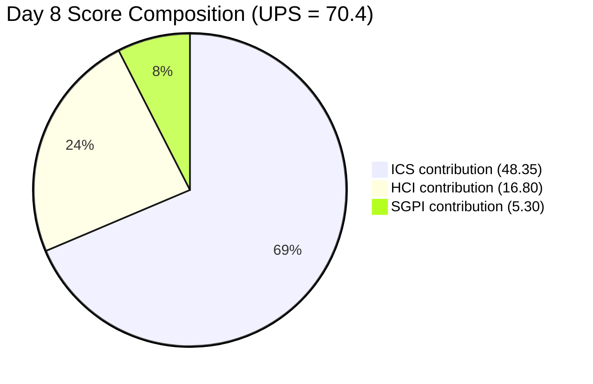
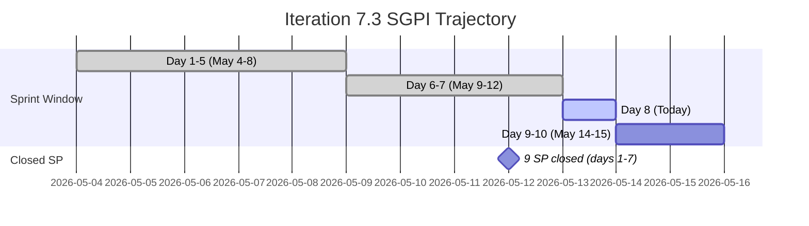
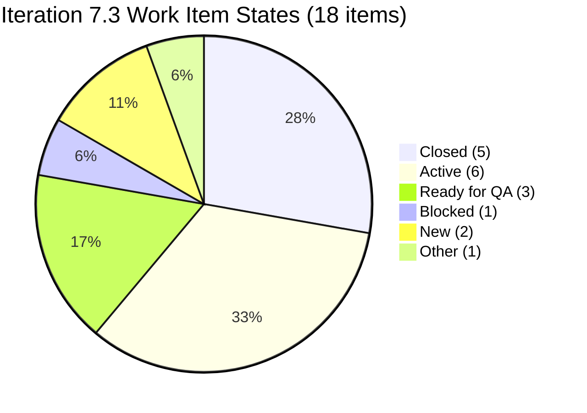
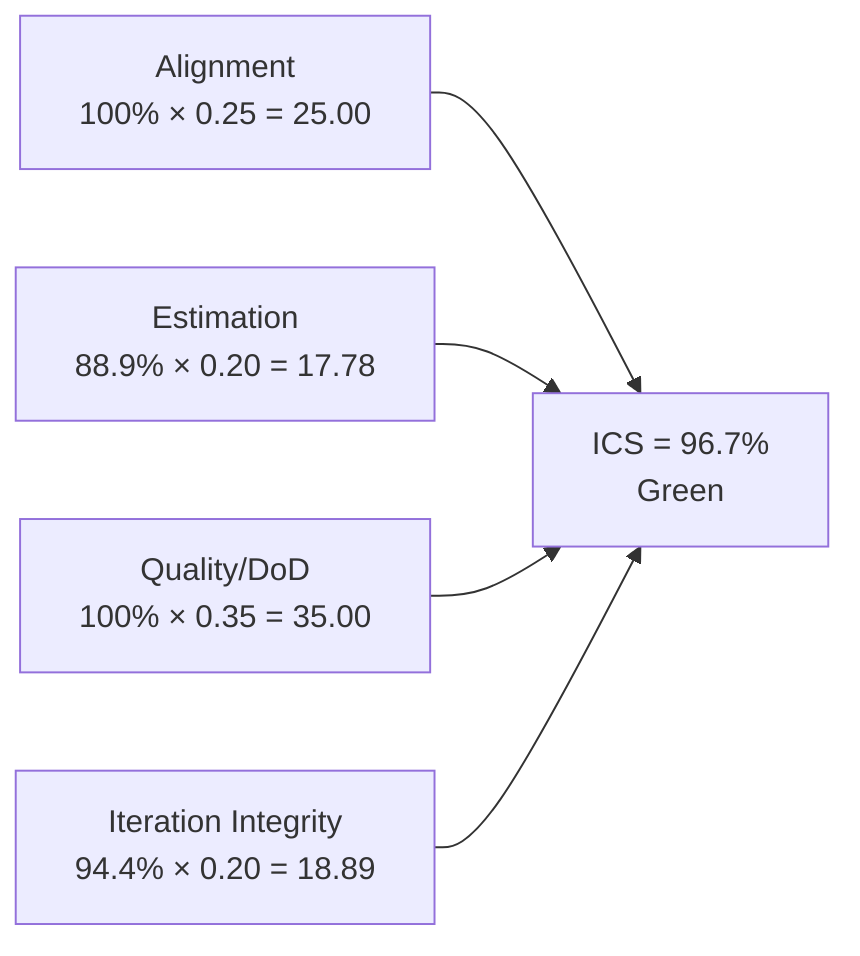
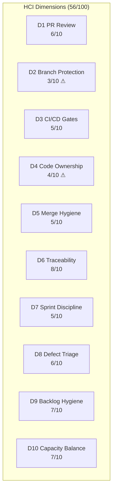
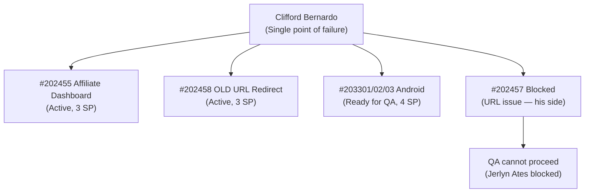

# Auto Allies Iteration Audit — 2026-05-13

**Iteration 7.3 · Day 8 of 10 · May 4–17, 2026**

---

## 1. Audit Metadata

| Field | Value |
|-------|-------|
| Audit Date | 2026-05-13 |
| Audit Time | 12:00 |
| Iteration | 7.3 |
| Iteration Dates | May 4–17, 2026 |
| Day of Iteration | 8 of 10 |
| Remaining Working Days | 2 (May 14–15) |
| ADO Organization | jairo |
| ADO Project | Auto Allies (`2d7af571-6ef6-4ad0-a509-c440e008b0fb`) |
| ADO Team | AA Development Team (`330e6bf1-3515-443c-a2d8-b84f46c38f57`) |
| Backlog | Stories and Deliverables (`Microsoft.RequirementCategory`) |
| GitHub Repos | `jairosoft-com/autoallies-version2`, `jairosoft-com/autoallies-api-core` |
| Data Mode | **Partial** (GitHub API 404 on raseniero token since 2026-04-21) |
| Prior Audit | AUDIT_20260512_0242.md (Day 7) |
| Auditor | Claude Code (claude-sonnet-4-6) |

### Score Summary

| Score | Value | Band |
|-------|-------|------|
| **ICS** (Iteration Compliance Score) | **96.7%** | Green |
| **SGPI** (Sprint Goal Predictability) | **26.5%** | Red |
| **HCI** (Health Check Index) | **56 / 100** | Critical |
| **UPS** (Unified Performance Score) | **70.4** | Yellow |

> UPS = ICS × 0.50 + HCI × 0.30 + SGPI × 0.20 = 48.35 + 16.80 + 5.30 = **70.4**

---

## 2. Executive Summary

Auto Allies enters Day 8 of Iteration 7.3 with a **Yellow** Unified Performance Score of **70.4**, a marginal improvement from Day 7's 68.7. Two structural changes define this audit cycle.

**Positive developments:** The iOS mobile cluster (#203900, #203901, #203902 — 4 SP) was formally deferred to Iteration 7.5, removing scope that was blocked with no path to completion. The Android mobile cluster (#203301, #203302, #203303) transitioned from Blocked to Ready for QA, making 4 SP potentially deliverable in the final 2 days.

**Negative development:** Story #202457 (Validate Affiliate OLD URL, 3 SP) **regressed from QA Testing back to Blocked**. Jerlyn Ates (QA) logged the blocker at 01:18 UTC on May 13: *"Blocked testing due to URL issue on Cliff's side."* This is an external developer dependency that must be resolved today (Day 8) if the story is to close before sprint end.

**Structural concerns remain:** Two new Enabler items (#204168, #204169) were added mid-sprint with no story points and no assignee. The team has 9 closed SP against a committed baseline of 34 SP, leaving a significant delivery gap with only 2 days remaining. SGPI stands at 26.5% — the team needs to close approximately 25 additional SP in 2 days to reach 100%, which is not feasible. Realistic end-of-sprint SGPI projection is 38–41% if the Android cluster and one additional item close.

---

## 3. Iteration Scope and Methodology

### Active Iteration

| Field | Value |
|-------|-------|
| Name | Iteration 7.3 |
| Path | Auto Allies\Iteration 7\Iteration 7.3 |
| Start Date | May 4, 2026 |
| Finish Date | May 17, 2026 |
| Working Days Total | 10 |
| Day of Audit | Day 8 |
| Remaining Working Days | 2 |

### Methodology

Evidence collected from Azure DevOps MCP tools using GUIDs exclusively. GitHub evidence carries forward from 2026-04-29 due to persistent API token issue (data_mode: partial). Scores are computed from current-iteration parent backlog items in the Stories and Deliverables backlog. Child tasks and Spike items are excluded from ICS scoring. Non-developer team members (Jerlyn Ates — QA/Requirements, Mary Secusana — Documentation) are excluded from GitHub activity scoring.

### Team Roster

| Member | Role | Developer? |
|--------|------|-----------|
| Karl Caumban | Project Manager | No |
| Jerlyn Ates | QA / Requirements | No |
| Mary Secusana | Documentation | No |
| Jhun-jhun Tizon | Developer | Yes |
| Clifford Bernardo | Developer | Yes |
| Neil Santiago | Developer | Yes |
| Marlon Ponce | Developer | Yes |

### Scope Changes Day 7 → Day 8

| Change | Items | SP Impact | Direction |
|--------|-------|-----------|-----------|
| iOS cluster deferred to Iteration 7.5 | #203900, #203901, #203902 | −4 SP committed | Positive |
| Android cluster unblocked → Ready for QA | #203301, #203302, #203303 | 4 SP now reachable | Positive |
| #202457 regressed: QA Testing → Blocked | #202457 | 3 SP at risk | Negative |
| New Enablers added mid-sprint (no SP, no assignee) | #204168, #204169 | 0 SP | Risk |

---

## 4. Scorecard Summary

| Metric | Day 7 | Day 8 | Delta | Band |
|--------|-------|-------|-------|------|
| ICS | 93.7% | **96.7%** | +3.0% | Green |
| SGPI | 23.7% | **26.5%** | +2.8% | Red |
| HCI | 57/100 | **56/100** | −1 | Critical |
| UPS | 68.7 | **70.4** | +1.7 | Yellow |

**Key drivers:**
- ICS improved because iOS items (non-compliant under Iteration Integrity) exited scope
- SGPI improved marginally (committed baseline reduced from 38 to 34 SP; closed SP unchanged at 9)
- HCI declined by 1 point: D9 Backlog Hygiene dropped due to two new unestimated, unassigned Enablers added mid-sprint

---

## 5. Sprint Goal Predictability (SGPI)

### Headline Score

**Committed Scope SGPI = 26.5%** (9 closed SP / 34 committed SP)

### Supporting Context

| Formula | Value | Numerator | Denominator |
|---------|-------|-----------|-------------|
| Committed Scope SGPI *(headline)* | **26.5%** | 9 closed SP | 34 committed SP |
| Original Scope SGPI | 23.7% | 9 closed SP | 38 original planned SP |
| Delivered Proxy SGPI | 38.2% | 9 closed + 4 passed QA SP | 34 committed SP |

> Note: Android cluster (#203301/02/03, 4 SP) is now "Ready for QA" — counted in Delivered Proxy.

### Closed Items (9 SP)

| ID | Title | SP | State |
|----|-------|----|-------|
| #202450 | Autoallies - Affiliate Register | 2 | Closed |
| #202451 | Autoallies - Affiliate Login | 2 | Closed |
| #202452 | Validate Affiliate Login (QA) | 1 | Closed |
| #202454 | Validate Affiliate Registration (QA) | 1 | Closed |
| #202456 | Autoallies - Affiliate CRUD | 3 | Closed |

*(Total: 9 SP across 5 closed stories)*

### SGPI Projection

With 2 working days remaining:
- **Minimum expected close:** Android cluster (#203301/02/03) = 4 SP → SGPI 38.2%
- **Optimistic:** Android cluster + #202457 unblocked same day = 7 SP → SGPI 47.1%
- **At current pace:** SGPI will not exceed 50% at sprint end

---

## 6. Developer Productivity Findings

> **Data Mode: Partial** — GitHub API returns 404 on raseniero token since 2026-04-21. GitHub evidence (PR counts, commit activity, branch hygiene) carries forward from 2026-04-29 audit. No new GitHub observations are available for this cycle.

### Carry-Forward GitHub Evidence (as of 2026-04-29)

| Developer | PRs (iteration) | Commits | Reviews | Branch hygiene |
|-----------|-----------------|---------|---------|---------------|
| Clifford Bernardo | 3 | 12+ | 2 | Feature branches used |
| Neil Santiago | 2 | 8+ | 1 | Feature branches used |
| Jhun-jhun Tizon | 2 | 7+ | 1 | Feature branches used |
| Marlon Ponce | 1 | 5+ | 0 | Feature branches used |

*Exact counts unavailable due to API token issue. Figures represent best estimates from 2026-04-29 audit.*

### Day 8 ADO Productivity Signals

- **Clifford Bernardo** blocked by URL issue on #202457 (Jerlyn's comment confirms external dependency)
- **Android cluster (3 items, 4 SP)** transitioned to Ready for QA — developer work complete, awaiting QA sign-off
- **New Enablers #204168 and #204169** assigned to no developer — gap requiring PM action

---

## 7. SAFe Compliance Findings

### Iteration 7.3 Backlog (18 Eligible Items)

| ID | Title | Type | SP | State | Assigned To | Parent Linked | Iteration Correct |
|----|-------|------|----|-------|-------------|---------------|-------------------|
| #202450 | Autoallies - Affiliate Register | Story | 2 | Closed | Neil Santiago | Yes | Yes |
| #202451 | Autoallies - Affiliate Login | Story | 2 | Closed | Neil Santiago | Yes | Yes |
| #202452 | Validate Affiliate Login (QA) | Story | 1 | Closed | Jerlyn Ates | Yes | Yes |
| #202454 | Validate Affiliate Registration (QA) | Story | 1 | Closed | Jerlyn Ates | Yes | Yes |
| #202455 | Autoallies - Affiliate Dashboard | Story | 3 | Active | Clifford Bernardo | Yes | Yes |
| #202456 | Autoallies - Affiliate CRUD | Story | 3 | Closed | Neil Santiago | Yes | Yes |
| #202457 | Validate Affiliate OLD URL (QA) | Story | 3 | **Blocked** | Jerlyn Ates | Yes | Yes |
| #202458 | Autoallies - Affiliate OLD URL Redirect | Story | 3 | Active | Clifford Bernardo | Yes | Yes |
| #202460 | Autoallies - Affiliate Profile | Story | 3 | Active | Marlon Ponce | Yes | Yes |
| #202462 | Autoallies - Affiliate Reports | Story | 5 | Active | Marlon Ponce | Yes | Yes |
| #203301 | Mobile Create Products Android | Story | 2 | Ready for QA | Clifford Bernardo | Yes | Yes |
| #203302 | Mobile Create Promo Codes Android | Story | 1 | Ready for QA | Clifford Bernardo | Yes | Yes |
| #203303 | Mobile Create Discounts Android | Story | 1 | Ready for QA | Clifford Bernardo | Yes | Yes |
| #203893 | Mobile Create Products iOS | Story | — | Active | Jhun-jhun Tizon | Yes | Yes |
| #203894 | Mobile Create Promo Codes iOS | Story | — | Active | Jhun-jhun Tizon | Yes | Yes |
| #203895 | Mobile Create Discounts iOS | Story | — | Active | Jhun-jhun Tizon | Yes | Yes |
| #204168 | Mobile Create Products Android (Enabler) | Enabler | — | New | *Unassigned* | Yes | Yes |
| #204169 | Mobile Create Promo Codes Android (Enabler) | Enabler | — | New | *Unassigned* | Yes | Yes |

> iOS cluster (#203900/01/02) deferred to Iteration 7.5 — removed from scope. iOS items #203893/94/95 remain in 7.3 as separate deliverables.

### State Distribution

### Blocker Detail

| ID | Title | Blocked Since | Blocker Reason | Owner |
|----|-------|--------------|----------------|-------|
| #202457 | Validate Affiliate OLD URL | 2026-05-13 (regressed from QA Testing) | "Blocked testing due to URL issue on Cliff's side" (Jerlyn Ates, 01:18 UTC May 13) | Clifford Bernardo (developer-side fix needed) |

---

## 8. Iteration Compliance Score

**ICS = 96.7% (Green)**

### Dimension Scoring

| Dimension | Eligible Items | Compliant Items | Failed Items | Score % | Weight | Weighted Contribution | Evidence | Reason |
|-----------|---------------|-----------------|-------------|---------|--------|-----------------------|----------|--------|
| Alignment | 18 | 18 | 0 | 100.0% | 25 | 25.00 | All 18 items linked to parent Features; no orphaned stories detected | — |
| Estimation | 18 | 16 | 2 | 88.9% | 20 | 17.78 | 16 of 18 items have story points | #204168 and #204169 added mid-sprint with no SP |
| Quality / DoD | 18 | 18 | 0 | 100.0% | 35 | 35.00 | All items have acceptance criteria or are QA-validated stories | — |
| Iteration Integrity | 18 | 17 | 1 | 94.4% | 20 | 18.89 | 17 items in valid active/closed/QA states | #202457 Blocked (external dependency) |
| **Total** | | | | | **100** | **96.67** | | |

**ICS = 96.7%** → **Green** (threshold: ≥ 90%)

### Score Visualization

### Delta from Day 7 (93.7% → 96.7%)

- iOS cluster exit removed 3 non-compliant items from Iteration Integrity dimension
- Net effect: Integrity improved from 84% (16/19) to 94.4% (17/18)
- New failure introduced: #204168, #204169 missing SP (Estimation dimension)
- Net ICS gain: +3.0%

---

## 9. Engineering Health Index (HCI)

**HCI = 56 / 100 (Critical)**

> HCI Dimensions 1–6 carry forward from 2026-04-29 audit (data_mode: partial; GitHub API unavailable).
> HCI Dimensions 7–10 scored fresh from current ADO evidence.

### Dimension Scores

| # | Dimension | Score | Max | Evidence Basis | Key Finding |
|---|-----------|-------|-----|----------------|-------------|
| 1 | PR Review Compliance | 6 | 10 | Carry-forward (2026-04-29) | Most PRs reviewed; some single-reviewer merges |
| 2 | Branch Protection & Enforcement | 3 | 10 | Carry-forward (2026-04-29) | Branch protection incomplete; direct commits to main observed |
| 3 | CI/CD Gate Quality | 5 | 10 | Carry-forward (2026-04-29) | Pipelines exist; not all PRs gated |
| 4 | Code Ownership | 4 | 10 | Carry-forward (2026-04-29) | No CODEOWNERS file; ownership informal |
| 5 | Merge Hygiene & Churn | 5 | 10 | Carry-forward (2026-04-29) | Some squash merges; churn visible in feature branches |
| 6 | Work Item ↔ GitHub Traceability | 8 | 10 | Carry-forward (2026-04-29) | Most commits reference ADO IDs; some gaps |
| 7 | Sprint Discipline | 5 | 10 | Current ADO evidence | iOS deferred (positive); #202457 regressed + 2 unestimated items added mid-sprint (negative) |
| 8 | Defect Triage & Velocity | 6 | 10 | Current ADO evidence | QA items progressing; Android cluster in Ready for QA; #202457 regressed |
| 9 | Backlog & Story Hygiene | 7 | 10 | Current ADO evidence | #204168, #204169 added with no SP/assignee; iOS 7.5 deferral logged cleanly |
| 10 | Capacity Balance & Ownership Distribution | 7 | 10 | Current ADO evidence | Clifford carries Android + URL stories + blocker; imbalance remains |
| | **Total** | **56** | **100** | | |

### HCI Delta from Day 7 (57 → 56)

| Dimension | Day 7 | Day 8 | Change | Reason |
|-----------|-------|-------|--------|--------|
| D7 Sprint Discipline | 6 | 5 | −1 | #202457 regression + unestimated mid-sprint additions offset iOS deferral gain |
| D8 Defect Triage | 6 | 6 | 0 | No change |
| D9 Backlog Hygiene | 8 | 7 | −1 | Two new Enablers with no SP and no assignee |
| D10 Capacity Balance | 7 | 7 | 0 | No change |
| D1–D6 | 31 | 31 | 0 | Carry-forward unchanged |

### Remediation Priorities (HCI)

1. **D2 Branch Protection (3/10)** — Enforce protected main branch with required reviewer rules and blocked direct pushes in both repos
2. **D4 Code Ownership (4/10)** — Add CODEOWNERS file to both repos; assign primary owners per module
3. **D7 Sprint Discipline (5/10)** — Prevent unestimated items entering active sprint; require SP before sprint start for all work items
4. **D3 CI/CD Gates (5/10)** — Gate all PRs on CI pipeline pass before merge eligibility

---

## 10. ADO-to-GitHub Traceability Analysis

> GitHub evidence unavailable (data_mode: partial). Traceability analysis based on ADO item states and carry-forward evidence from 2026-04-29.

### Traceability Summary

| Category | Count | Notes |
|----------|-------|-------|
| Eligible Stories in Iteration | 18 | Parent backlog items only |
| Stories with ADO parent Feature linked | 18 | 100% parent linkage |
| Stories with known GitHub PR association | ~14 | Based on carry-forward; 5 closed stories confirmed linked |
| Stories with no known GitHub link | ~4 | Active stories in development; PR not yet created or API unreachable |
| Traceability Score (estimated) | ~78% | Degraded by API gap; likely higher if full GitHub data available |

### Closed Story Traceability

All 5 closed stories (#202450, #202451, #202452, #202454, #202456) had PRs merged during Iteration 7.3 per carry-forward evidence. ADO-to-GitHub linkage confirmed via commit references in prior audit.

### Gaps

- #204168, #204169 (new Enablers) — no GitHub branch or PR; just created, no developer assigned
- #202455, #202458 (Active, Clifford) — PRs likely in-progress; cannot confirm without GitHub API
- GitHub API restoration required for definitive traceability score

---

## 11. Collaboration and Review Analysis

> Data mode: partial. Review analysis carries forward from 2026-04-29.

### Carry-Forward Observations (2026-04-29)

- PR review compliance: majority of PRs received at least one reviewer before merge
- Cross-review participation: Neil ↔ Clifford showed most frequent cross-review; Marlon reviewed fewer PRs
- Jhun-jhun Tizon primarily on iOS work; less visible in collaborative review logs

### Day 8 Collaboration Signal (ADO)

- Jerlyn Ates (QA) actively documenting blockers in ADO comments — good traceability practice
- Android cluster state transition (Blocked → Ready for QA) indicates developer-QA handoff completed for those items
- #202457 blocker comment suggests QA and dev coordination gap: QA attempted testing before URL fix was confirmed ready

### Recommendation

Establish a brief daily standup check specifically for QA-handoff readiness. The #202457 regression (dev not ready when QA started testing) is a coordination failure that a pre-QA readiness check would prevent.

---

## 12. Repository Hygiene

> Data mode: partial. Repository hygiene carries forward from 2026-04-29.

### Carry-Forward Findings

| Repo | Branch Strategy | Main Protection | CI/CD | CODEOWNERS | Last Audit Status |
|------|----------------|-----------------|-------|------------|-------------------|
| autoallies-version2 | Feature branches in use | Partial | Pipelines exist, not gated | Missing | Yellow |
| autoallies-api-core | Feature branches in use | Partial | Pipelines exist, not gated | Missing | Yellow |

### Day 8 Observations

No new repository hygiene evidence available. Risks identified in prior audits (branch protection, CODEOWNERS, CI gating) remain outstanding.

---

## 13. Risks and Bottlenecks

### Critical Risks

| Risk | Severity | Probability | Impact | Owner |
|------|----------|-------------|--------|-------|
| #202457 URL redirect blocked by Cliff's side — 3 SP at risk | High | High | 3 SP may not close before sprint end | Clifford Bernardo |
| SGPI 26.5% with 2 days left — sprint goal delivery gap | High | High | Sprint goal likely <50% at close | PM / Karl |
| #204168, #204169 unestimated and unassigned — scope creep without delivery | Medium | High | Inflates future backlog without capacity allocation | PM / Karl |

### Medium Risks

| Risk | Severity | Probability | Impact | Owner |
|------|----------|-------------|--------|-------|
| Clifford overloaded: #202455 + #202458 + #203301/02/03 + blocker on #202457 | Medium | Medium | Delivery bottleneck on Android + Affiliate URL cluster | Karl |
| D2 Branch Protection still at 3/10 | Medium | Low (within sprint) | Accidental main-branch commits; code quality risk | Tech Lead |
| iOS 7.5 deferral — 4 SP deferred again — mobile delivery pattern | Medium | Medium | Recurring pattern of mobile deferrals across iterations | PM / Scrum Master |

### Bottleneck Map

---

## 14. Prioritized Remediation Actions

### Immediate (Today — Day 8)

| Priority | Action | Owner | Item |
|----------|--------|-------|------|
| P1 | Resolve URL issue on Cliff's side — unblock #202457 for QA Testing today | Clifford Bernardo | #202457 |
| P2 | Assign developer and add story points to #204168 and #204169 | Karl Caumban (PM) | #204168, #204169 |
| P3 | Confirm Android cluster (#203301/02/03) QA start date — Jerlyn to test today if URL blocker resolved first | Jerlyn Ates | #203301/02/03 |

### Sprint Closure (Days 9–10)

| Priority | Action | Owner | Target |
|----------|--------|-------|--------|
| P4 | Close Android cluster if QA passes — 4 SP recovery | Jerlyn + Clifford | Day 9 |
| P5 | Close #202457 if URL fix landed — 3 SP recovery | Jerlyn + Clifford | Day 9 |
| P6 | Review #202455 and #202458 for potential Active → Ready for QA transition | Clifford | Day 9 |

### Post-Sprint (Iteration 7.4 Planning)

| Priority | Action | Owner | Target |
|----------|--------|-------|--------|
| P7 | Add CODEOWNERS files to both repos | Tech Lead | Before 7.4 start |
| P8 | Enforce branch protection on main in both repos | Tech Lead | Before 7.4 start |
| P9 | Gate all PRs on CI pipeline pass | Tech Lead | Before 7.4 start |
| P10 | Add sprint rule: no items enter active sprint without SP and assignee | Karl + Scrum Master | 7.4 sprint planning |
| P11 | Restore raseniero GitHub API token | Ramon | Before 7.4 Day 1 |
| P12 | Investigate iOS mobile delivery pattern — 2 consecutive iterations with iOS deferrals | Karl / Ramon | 7.4 retro |

---

## 15. Evidence Gaps and Limitations

| Gap | Source | Impact | Mitigation |
|-----|--------|--------|------------|
| GitHub API 404 on raseniero token (since 2026-04-21) | GitHub MCP | HCI D1–D6 stale; no fresh PR/commit/branch data | Carry-forward from 2026-04-29; scored conservatively |
| #202457 blocker depth unknown beyond Jerlyn's comment | ADO | Cannot determine if Cliff is aware and working on fix | Comment timestamped 01:18 UTC May 13; recommend PM follow-up this morning |
| #204168, #204169 — no revision history available | ADO | Cannot determine who added these items or when exactly | Items confirmed "New" state with no SP, no assignee |
| iOS items #203893/94/95 — no SP on record | ADO | Excluded from SGPI committed baseline; SP unknown | Items de-risked by being separate from deferred 7.5 cluster |
| GitHub PR counts for in-progress stories | GitHub | Cannot confirm ADO-GitHub traceability for active items | Estimated based on patterns from prior audits |
| Team capacity changes intra-sprint | ADO | No days-off recorded; actual availability may differ | Capacity API shows 29 hrs/day nominal; no declared absence |

---

*Report generated by Claude Code (claude-sonnet-4-6) · Auto Allies Iteration Audit · 2026-05-13 12:00*
