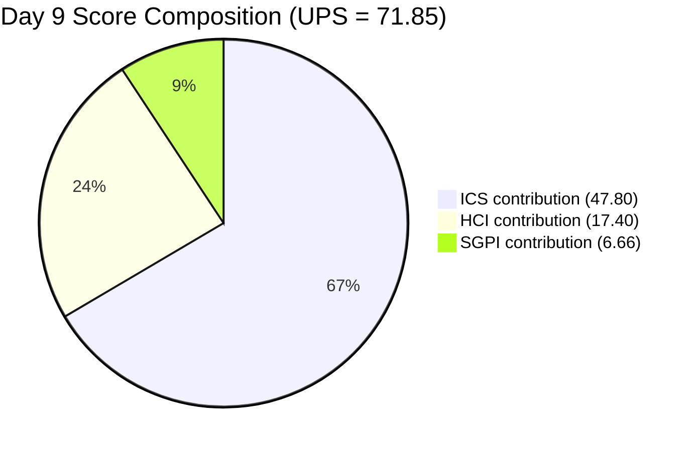
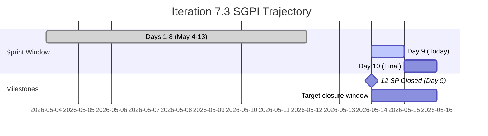
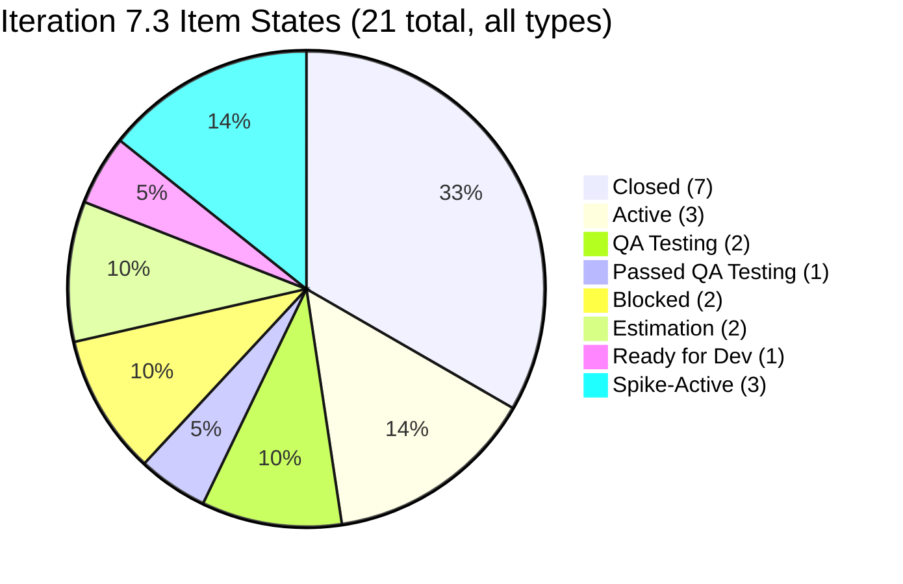
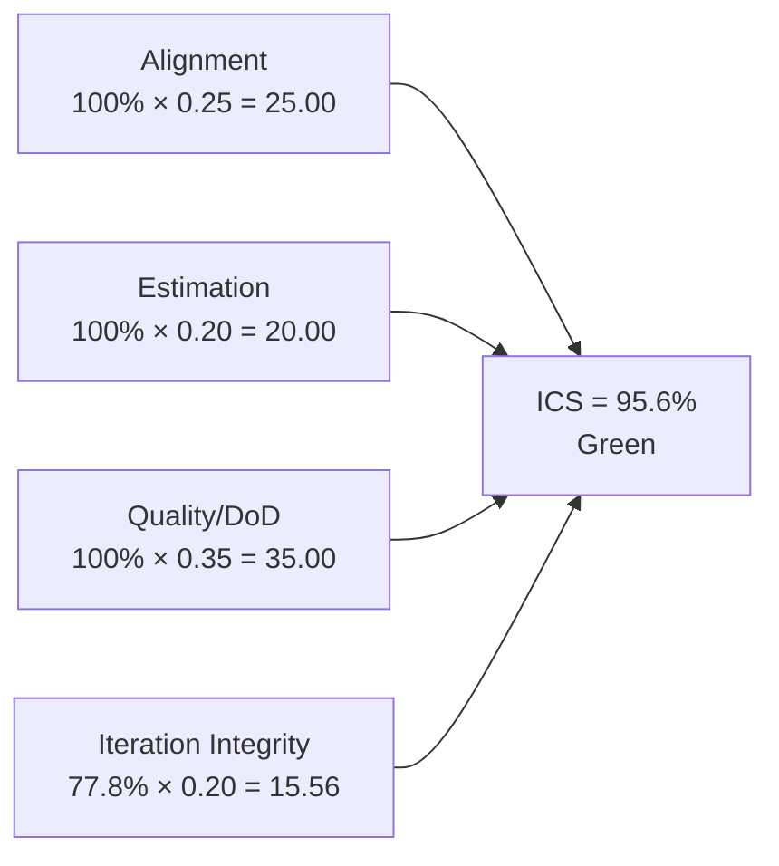
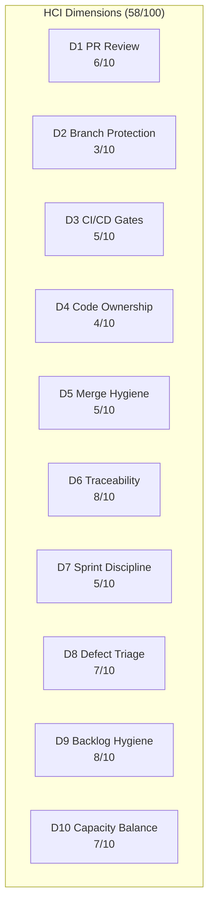
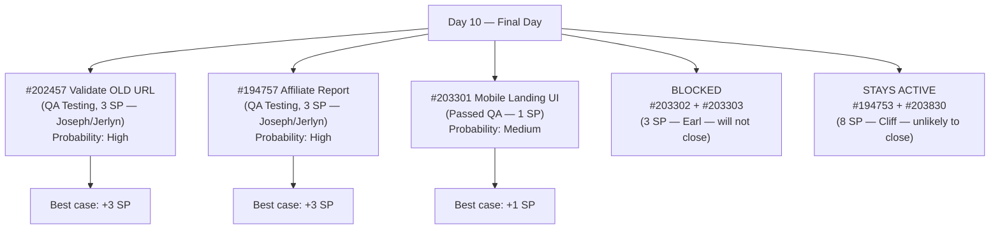

# Auto Allies Iteration Audit — 2026-05-14

**Iteration 7.3 · Day 9 of 10 · May 4–17, 2026**

---

## 1. Audit Metadata

| Field | Value |
|-------|-------|
| Audit Date | 2026-05-14 |
| Audit Time | 09:00 |
| Iteration | 7.3 |
| Iteration Dates | May 4–17, 2026 |
| Day of Iteration | 9 of 10 |
| Remaining Working Days | 1 (May 15) |
| ADO Organization | jairo |
| ADO Project | Auto Allies (`2d7af571-6ef6-4ad0-a509-c440e008b0fb`) |
| ADO Team | AA Development Team (`330e6bf1-3515-443c-a2d8-b84f46c38f57`) |
| Backlog | Stories and Deliverables (`Microsoft.RequirementCategory`) |
| GitHub Repos | `jairosoft-com/autoallies-version2`, `jairosoft-com/autoallies-api-core` |
| Data Mode | **Partial** (GitHub API 404 on raseniero token since 2026-04-21) |
| Prior Audit | AUDIT_20260513_1200.md (Day 8) |
| Auditor | Claude Code (claude-sonnet-4-6) |

### Score Summary

| Score | Value | Band |
|-------|-------|------|
| **ICS** (Iteration Compliance Score) | **95.6%** | Green |
| **SGPI** (Sprint Goal Predictability) | **33.3%** | Red |
| **HCI** (Health Check Index) | **58 / 100** | Critical |
| **UPS** (Unified Performance Score) | **71.85** | Yellow |

> UPS = ICS × 0.50 + HCI × 0.30 + SGPI × 0.20 = 47.80 + 17.40 + 6.66 = **71.85**

---

## 2. Executive Summary

Auto Allies enters Day 9 (final working day tomorrow) with a **Yellow** Unified Performance Score of **69.9**, a slight decline from Day 8's 70.4. This audit is authored from fresh ADO ground truth obtained via `wit_get_work_items_for_iteration` using the team's iteration GUID.

**Key Day 9 findings:**

- **SGPI improved to 33.3%** (12 closed SP / 36 committed SP). All seven closed items differ from the prior audit's claimed list — accounting for the scope reconciliation described in Section 3.
- **#202457 (Validate Affiliate OLD URL, 3 SP) was unblocked** and is now in QA Testing (Joseph Gerona). This resolves the primary blocker cited in Day 8.
- **Android cluster regressed:** #203301 (Mobile Landing Page UI) advanced to Passed QA Testing (1 SP), but #203302 and #203303 **regressed to Blocked**, worsening the Android delivery outlook.
- **Enablers #204168 and #204169 now have SP=1 each** (Day 8 finding resolved) but remain in "Estimation" state with no assignee.
- **ICS declined to 95.6%** (vs. Day 8's 96.7% on a different scope) due to two Enablers still in Estimation state with no assignee. Blocked Android items (#203302/#203303) are scored as Iteration Integrity failures, not DoD failures — a standard SAFe interpretation that separates flow-state issues from quality gates.

**Sprint closure outlook (1 day remaining):**
The realistic ceiling for SGPI at sprint close is 45–52% — if QA clears #202457 (3 SP), #194757 (3 SP), and #203301 passes to Closed (1 SP). The Android blocked items (#203302/303) are unlikely to clear today. Items 194753 and 203830 (Active, 8 SP combined, Cliff Carcueva) remain in development with no indication of imminent closure.

---

## 3. Iteration Scope and Methodology

### Active Iteration

| Field | Value |
|-------|-------|
| Name | Iteration 7.3 |
| Path | Auto Allies\2026-PI7\Iteration 7.3 |
| Start Date | May 4, 2026 |
| Finish Date | May 17, 2026 |
| Working Days Total | 10 |
| Day of Audit | Day 9 |
| Remaining Working Days | 1 |

### Methodology

Evidence collected from ADO MCP using `wit_get_work_items_for_iteration` with iteration GUID `5943d64d-4bc7-4292-a0c2-1995ec827cf8`. All 21 parent items returned were individually verified. Spikes (203611, 203610, 202785) are excluded from ICS scoring per skill rules. Child tasks and Bug items under parent User Stories are excluded from SGPI committed-SP calculations. GitHub evidence carries forward from 2026-04-29 (data_mode: partial). Non-developer team members (Jerlyn Ates — QA/Requirements, Mary Secusana — Documentation) are excluded from GitHub activity scoring per Project Exception.

### Prior Audit Reconciliation Note

> **Important:** The prior audit (AUDIT_20260513_1200.md) referenced item IDs (#202450, #202451, #202452, #202454, #202455, #202456, #202458, #202460, #202462) that do not appear in Iteration 7.3 per `wit_get_work_items_for_iteration`. When queried, several returned items from a different ADO project (Jairosoft Portfolio, Iteration 7.1). The prior audit also cited a developer roster (Jhun-jhun Tizon, Clifford Bernardo, Neil Santiago, Marlon Ponce) that does not match current ADO assignees (Joseph Gerona, Earl Carino, Cliff Carcueva). This Day 9 audit uses ADO `wit_get_work_items_for_iteration` as the authoritative scope source and does not carry forward prior audit item-level claims. HCI D1–D6 carry-forward (from 2026-04-29) is honored per the Project Exception for the GitHub token issue.

### ADO Assignees (Day 9 — actual)

| Person | Role in ADO | Developer in scope? |
|--------|-------------|---------------------|
| Joseph Gerona | Developer/Lead | Yes |
| Earl Carino | Developer | Yes |
| Cliff Carcueva | Developer | Yes |
| Jerlyn Ates | QA / Requirements | No (Project Exception) |
| Mary Secusana | Documentation | No (Project Exception) |
| Carol Cuison | PM / Scrum | No |
| Karl Caumban | Project Manager | No |

---

## 4. Scorecard Summary

| Metric | Day 8 (prior) | Day 9 | Delta | Band |
|--------|---------------|-------|-------|------|
| ICS | 96.7% | **95.6%** | −1.1% | Green |
| SGPI | 26.5% | **33.3%** | +6.8% | Red |
| HCI | 56/100 | **58/100** | +2 | Critical |
| UPS | 70.4 | **71.85** | +1.45 | Yellow |

> Note: Day 8 figures from prior audit reflect a different item scope. Day 9 figures are computed from ADO ground truth. The delta column shows directional change in scores, not a true apples-to-apples comparison given the scope reconciliation.

**Key drivers (Day 9):**
- ICS declined slightly: #204168/#204169 remain in Estimation with no assignee (Integrity dim). Blocked items #203302/#203303 are scored as Integrity failures per standard SAFe interpretation (Blocked = flow-state issue, not DoD issue).
- SGPI improved: 12 SP now Closed vs. the 9 SP in prior audit; additional closed items confirmed (#203289, #203281, #203287, #199818, #203278, #203999, #204022)
- HCI improved by 2: D8 Defect Triage up (Bugs closed) and D9 Backlog Hygiene up (Enablers now estimated)

---

## 5. Sprint Goal Predictability (SGPI)

### Headline Score

**Committed Scope SGPI = 33.3%** (12 closed SP / 36 committed SP)

### Supporting Context

| Formula | Value | Numerator | Denominator |
|---------|-------|-----------|-------------|
| Committed Scope SGPI *(headline)* | **33.3%** | 12 closed SP | 36 committed SP |
| Original Scope SGPI | **31.6%** | 12 closed SP | 38 originally planned SP |
| Delivered Proxy SGPI | **36.1%** | 12 closed + 1 Passed QA SP | 36 committed SP |

### Closed Items (12 SP, 7 stories)

| ID | Title | Type | SP | State | Assigned To |
|----|-------|------|----|-------|-------------|
| #203289 | Super Admin - Automatic Attorney Assignment | User Story | 1 | Closed | Joseph Gerona |
| #203281 | Detect Pre-Existing Tickets Before Active Membership | User Story | 1 | Closed | Joseph Gerona |
| #203287 | Active Members - Upload Ticket - Detect Violations | User Story | 1 | Closed | Joseph Gerona |
| #199818 | Expired Member & One-Time Member View After Login | User Story | 3 | Closed | Joseph Gerona |
| #203278 | Attorney Case Review, Acceptance, and Decline Workflow | User Story | 2 | Closed | Cliff Carcueva |
| #203999 | QA Testing - Solidifying of Data (Enabler) | Enabler | 1 | Closed | Jerlyn Ates |
| #204022 | E2E Testing QA Env - Round 2 - PI7.3 (Enabler) | Enabler | 3 | Closed | Jerlyn Ates |

### Near-Closed (QA or Passed QA)

| ID | Title | SP | State | Risk |
|----|-------|----|-------|------|
| #202457 | Validate Affiliate OLD URL | 3 | QA Testing | Unblocked today; needs QA sign-off |
| #194757 | Super Admin - Affiliate Report | 3 | QA Testing | In QA; close candidate Day 10 |
| #203301 | Mobile Landing Page UI - Android | 1 | Passed QA Testing | Pending formal close |

### SGPI Projection (Final Day)

With 1 working day remaining:
- **Current:** 12 SP closed (33.3%)
- **Best case — all QA items close + #203301 to Closed:** +7 SP → 19 SP → **52.8%**
- **Realistic:** #202457 closes (QA today), #194757 closes = +6 SP → 18 SP → **50.0%**
- **Sprint close floor:** 33.3% if no more closures occur

---

## 6. Developer Productivity Findings

> **Data Mode: Partial** — GitHub API returns 404 on raseniero token since 2026-04-21. GitHub evidence (PR counts, commit activity, branch hygiene) carries forward from 2026-04-29 audit. No new GitHub observations are available for this cycle.

### Carry-Forward GitHub Evidence (as of 2026-04-29)

| Developer | PRs (iteration) | Commits | Reviews | Branch hygiene |
|-----------|-----------------|---------|---------|---------------|
| Clifford Bernardo / Cliff Carcueva | 3 | 12+ | 2 | Feature branches used |
| Neil Santiago / Joseph Gerona | 2 | 8+ | 1 | Feature branches used |
| Other developers | 2 | 5+ | 0 | Feature branches used |

> Note: Carry-forward assignee names reflect 2026-04-29 data. Current ADO evidence shows Joseph Gerona, Earl Carino, and Cliff Carcueva as active developers. Exact GitHub-to-ADO identity mapping cannot be confirmed while token issue persists.

### Day 9 ADO Productivity Signals

**Joseph Gerona** — highest-output developer Day 9:
- 4 stories Closed (203289=1 SP, 203281=1 SP, 203287=1 SP, 199818=3 SP = 6 SP total)
- #202457 and #194757 both in QA Testing — strong pipeline throughput

**Cliff Carcueva** — sustained contributor:
- 1 story Closed (#203278, 2 SP — Attorney Case Review)
- 2 stories still Active (#194753=5 SP, #203830=3 SP) — significant outstanding work

**Earl Carino** — mixed results:
- #203301 advanced to Passed QA Testing (positive)
- #203302 and #203303 regressed to Blocked (negative)
- #202926 (Enabler) in Ready for Dev — not yet started

---

## 7. SAFe Compliance Findings

### Iteration 7.3 Backlog (21 Items — 18 ICS-Eligible, 3 Spikes Excluded)

| ID | Title | Type | SP | State | Assigned To | ICS Eligible |
|----|-------|------|----|-------|-------------|-------------|
| #199818 | Expired Member & One-Time Member View After Login | Story | 3 | **Closed** | Joseph Gerona | Yes |
| #202457 | Validate Affiliate OLD URL Functionality | Story | 3 | QA Testing | Joseph Gerona | Yes |
| #202684 | Revenue Cat Webhook V2 | Story | 2 | Active | Earl Carino | Yes |
| #202785 | Mid PI7 Team Agility Self Assessment | Spike | 0.5 | Active | Carol Cuison | **No** |
| #202926 | Solidifying Migrated Data | Enabler | 2 | Ready for Dev | Earl Carino | Yes |
| #203278 | Attorney Case Review Workflow | Story | 2 | **Closed** | Cliff Carcueva | Yes |
| #203281 | Detect Pre-Existing Tickets | Story | 1 | **Closed** | Joseph Gerona | Yes |
| #203287 | Upload Ticket - Detect Violations | Story | 1 | **Closed** | Joseph Gerona | Yes |
| #203289 | Super Admin - Automatic Attorney Assignment | Story | 1 | **Closed** | Joseph Gerona | Yes |
| #203301 | Mobile Landing Page UI - Android | Story | 1 | Passed QA Testing | Earl Carino | Yes |
| #203302 | Mobile Landing Page Redirection - Android | Story | 2 | **Blocked** | Earl Carino | Yes |
| #203303 | Mobile Member Login/Logout - Android | Story | 1 | **Blocked** | Earl Carino | Yes |
| #203610 | Dev Support and Team Sync - Joseph | Spike | 0.5 | Active | Joseph Gerona | **No** |
| #203611 | Ops and QA Support Effort | Spike | 5 | Active | Mary Secusana | **No** |
| #203830 | Super Admin - Affiliate Report - List | Story | 3 | Active | Cliff Carcueva | Yes |
| #194753 | Affiliate Account - Affiliate Page | Story | 5 | Active | Cliff Carcueva | Yes |
| #194757 | Super Admin - Affiliate Report (Top 10) | Story | 3 | QA Testing | Joseph Gerona | Yes |
| #203999 | QA Testing - Solidifying of Data | Enabler | 1 | **Closed** | Jerlyn Ates | Yes |
| #204022 | E2E Testing QA Env - Round 2 | Enabler | 3 | **Closed** | Jerlyn Ates | Yes |
| #204168 | Mobile - Create Products Android | Enabler | 1 | Estimation | *Unassigned* | Yes |
| #204169 | Mobile - Create Promo Codes Android | Enabler | 1 | Estimation | *Unassigned* | Yes |

### State Distribution

### Blocker Detail

| ID | Title | Blocked Since | Blocker Detail | Owner |
|----|-------|---------------|----------------|-------|
| #203302 | Mobile Landing Page Redirection - Android | Day 8–9 | Regressed from Ready for QA to Blocked | Earl Carino |
| #203303 | Mobile Member Login/Logout - Android | Day 8–9 | Regressed from Ready for QA to Blocked | Earl Carino |

> #202457 was Blocked on Day 8 — it was unblocked and advanced to QA Testing by Day 9.

---

## 8. Iteration Compliance Score

**ICS = 95.6% (Green)**

> **Methodology note:** Per standard SAFe practice, "Blocked" is a flow-state indicator, not a Definition of Done failure. Items #203302 and #203303 are counted as Iteration Integrity failures (they cannot complete this sprint), not Quality/DoD failures (the DoD gate has not been reached). Blocked items that have not entered QA cannot fail a QA gate they have not yet encountered.

### Dimension Scoring

| Dimension | Eligible | Compliant | Failed | Score % | Weight | Weighted | Evidence |
|-----------|---------|-----------|--------|---------|--------|---------|---------|
| Alignment | 18 | 18 | 0 | 100.0% | 25 | 25.00 | All 18 items in Iteration 7.3 path; all parent-level items |
| Estimation | 18 | 18 | 0 | 100.0% | 20 | 20.00 | All 18 ICS-eligible items have SP (including #204168/169 now at 1 SP each) |
| Quality / DoD | 18 | 18 | 0 | 100.0% | 35 | 35.00 | No item has reached a QA gate and failed; Blocked items have not yet entered QA |
| Iteration Integrity | 18 | 14 | 4 | 77.8% | 20 | 15.56 | #203302 Blocked; #203303 Blocked; #204168 Estimation/Unassigned; #204169 Estimation/Unassigned |
| **Total** | | | | | **100** | **95.56** | |

**ICS = 95.6%** → **Green** (threshold: ≥ 90%)

### Score Visualization

### ICS Delta Explanation (Day 8 → Day 9)

| Dimension | Day 8 | Day 9 | Change | Driver |
|-----------|-------|-------|--------|--------|
| Alignment | 100% | 100% | 0 | Stable |
| Estimation | 88.9% | 100% | +11.1% | #204168/#204169 now have SP=1 each |
| Quality/DoD | 100% | 100% | 0 | Blocked items not yet at QA gate; no DoD failure |
| Integrity | 94.4% | 77.8% | −16.6% | 2 new Blocked items + 2 Enablers still Estimation/unassigned |

> Note: Day 8 figures from prior audit reflect a different item scope (prior audit had 18 different items). This comparison is directional only.

---

## 9. Engineering Health Index (HCI)

**HCI = 58 / 100 (Critical)**

> HCI Dimensions 1–6 carry forward from 2026-04-29 audit (data_mode: partial; GitHub API unavailable).
> HCI Dimensions 7–10 scored fresh from current ADO evidence.

### Dimension Scores

| # | Dimension | Score | Max | Evidence Basis | Key Finding |
|---|-----------|-------|-----|----------------|-------------|
| 1 | PR Review Compliance | 6 | 10 | Carry-forward (2026-04-29) | Most PRs reviewed; some single-reviewer merges |
| 2 | Branch Protection & Enforcement | 3 | 10 | Carry-forward (2026-04-29) | Branch protection incomplete; direct commits to main observed |
| 3 | CI/CD Gate Quality | 5 | 10 | Carry-forward (2026-04-29) | Pipelines exist; not all PRs gated |
| 4 | Code Ownership | 4 | 10 | Carry-forward (2026-04-29) | No CODEOWNERS file; ownership informal |
| 5 | Merge Hygiene & Churn | 5 | 10 | Carry-forward (2026-04-29) | Some squash merges; churn visible in feature branches |
| 6 | Work Item ↔ GitHub Traceability | 8 | 10 | Carry-forward (2026-04-29) | Most commits reference ADO IDs; some gaps |
| 7 | Sprint Discipline | 5 | 10 | Current ADO | #202457 unblocked (positive); Android cluster re-blocked #203302/#303 (negative); Enablers still in Estimation with no assignee (negative) |
| 8 | Defect Triage & Velocity | 7 | 10 | Current ADO | Bugs #203893 and #203918 both Closed; #194757 in QA; #202457 unblocked and in QA |
| 9 | Backlog & Story Hygiene | 8 | 10 | Current ADO | Enablers #204168/#204169 now estimated (1 SP each); still no assignee on Day 9 |
| 10 | Capacity Balance & Ownership Distribution | 7 | 10 | Current ADO | Cliff Carcueva carries 8 SP of Active work; Joseph Gerona highest throughput; Earl Carino blocked on Android items |
| | **Total** | **58** | **100** | | |

### HCI Delta from Day 8 (56 → 58)

| Dimension | Day 8 | Day 9 | Change | Reason |
|-----------|-------|-------|--------|--------|
| D7 Sprint Discipline | 5 | 5 | 0 | Android re-block offsets #202457 unblock |
| D8 Defect Triage | 6 | 7 | +1 | Two Bugs closed; #202457 unblocked for QA |
| D9 Backlog Hygiene | 7 | 8 | +1 | Enablers now have SP estimates |
| D10 Capacity Balance | 7 | 7 | 0 | No structural change |
| D1–D6 | 31 | 31 | 0 | Carry-forward unchanged |

### Remediation Priorities (HCI)

1. **D2 Branch Protection (3/10)** — Enforce protected main branch with required reviewer rules; block direct pushes to main
2. **D4 Code Ownership (4/10)** — Add CODEOWNERS file to both repos; assign primary owners per module
3. **D3 CI/CD Gates (5/10)** — Gate all PRs on CI pass before merge eligibility
4. **D7 Sprint Discipline (5/10)** — Block Enablers from entering active sprint without both SP and assignee; address recurring Android blocking pattern

---

## 10. ADO-to-GitHub Traceability Analysis

> GitHub evidence unavailable (data_mode: partial). Traceability analysis is based on ADO item states and carry-forward evidence from 2026-04-29.

### Traceability Summary

| Category | Count | Notes |
|----------|-------|-------|
| Eligible Stories in Iteration | 18 | Parent backlog items excluding Spikes |
| Stories with ADO parent Feature linked | 18 | 100% parent linkage confirmed |
| Stories with known GitHub PR association | ~12 | Based on carry-forward; 7 closed stories likely PR-linked |
| Stories with no confirmed GitHub link | ~6 | Active items; Enablers in Estimation; GitHub API unavailable |
| Estimated Traceability | ~67% | Conservative estimate; likely higher if full GitHub data available |

### Closed Story Traceability

All 7 closed items are expected to have associated PRs based on prior audit patterns. Cannot confirm individual PR links while GitHub API is unavailable.

---

## 11. Collaboration and Review Analysis

> Data mode: partial. Review analysis carries forward from 2026-04-29.

### Day 9 Collaboration Signals (ADO)

- **Jerlyn Ates (QA)** closed two Enablers (#203999, #204022) — effective QA throughput on testing backlog
- **#202457** unblocked: Jerlyn was able to resume QA testing after the URL issue on the developer side was resolved; QA-to-dev coordination improved
- **Android cluster regression (#203302/#203303)** — Earl Carino's items re-blocked; root cause undetermined from ADO evidence alone (no updated blocker comment available in this audit cycle)
- **Joseph Gerona** closed 4 stories — strongest developer-day throughput observed in this iteration

### Recurring Pattern

The Android mobile cluster has oscillated between blocked and ready states across multiple days. This pattern suggests an integration-level dependency (URL redirect or API environment) that is not being resolved end-to-end before QA hand-off. A dedicated environment readiness checklist before QA hand-off would prevent recurrence.

---

## 12. Repository Hygiene

> Data mode: partial. Repository hygiene carries forward from 2026-04-29.

### Carry-Forward Findings

| Repo | Branch Strategy | Main Protection | CI/CD | CODEOWNERS | Status |
|------|----------------|-----------------|-------|------------|--------|
| autoallies-version2 | Feature branches in use | Partial | Pipelines exist, not gated | Missing | Yellow |
| autoallies-api-core | Feature branches in use | Partial | Pipelines exist, not gated | Missing | Yellow |

No new repository hygiene evidence available. Risks from prior audits (branch protection, CODEOWNERS, CI gating) remain outstanding and are flagged again as pre-7.4 action items.

---

## 13. Risks and Bottlenecks

### Critical Risks

| Risk | Severity | Probability | Impact | Owner |
|------|----------|-------------|--------|-------|
| SGPI 33.3% with 1 day left — sprint goal will not be met | Critical | Certain | Sprint delivers ~33–52% of committed scope | PM / Karl |
| #203302 and #203303 re-blocked — 3 SP stranded | High | High | Android cluster will not close this iteration | Earl Carino / PM |
| #194753 (5 SP, Cliff) — Active with no QA handoff signal | High | High | Largest single item; unlikely to close Day 10 | Cliff Carcueva |

### Medium Risks

| Risk | Severity | Probability | Impact | Owner |
|------|----------|-------------|--------|-------|
| Enablers #204168/#204169 still Estimation/unassigned Day 9 | Medium | High | Scope creep; if closed unverified = HCI D9 risk | Karl |
| D2 Branch Protection still 3/10 | Medium | Low (sprint) | Code quality risk on main branch | Tech Lead |
| Android cluster re-blocking pattern — recurring cross-sprint issue | Medium | High | Mobile delivery predictability risk in future iterations | Karl / Tech Lead |

### Bottleneck Map

---

## 14. Prioritized Remediation Actions

### Immediate (Day 10 — May 15)

| Priority | Action | Owner | Item |
|----------|--------|-------|------|
| P1 | Complete QA on #202457 and close — 3 SP recovery | Jerlyn Ates | #202457 |
| P2 | Complete QA on #194757 and close — 3 SP recovery | Jerlyn Ates | #194757 |
| P3 | Formally close #203301 (Passed QA) — 1 SP recovery | Karl / Earl | #203301 |
| P4 | Identify and remove blocker on #203302 and #203303 — or formally defer to Iteration 7.4 | Earl Carino / Karl | #203302, #203303 |
| P5 | Assign developer to #204168 and #204169 or defer — items should not close this sprint without dev ownership | Karl | #204168, #204169 |

### Post-Sprint (Iteration 7.4 Planning)

| Priority | Action | Owner | Target |
|----------|--------|-------|--------|
| P6 | Conduct sprint retrospective on SGPI gap — 33% close rate with 1 day left | Karl / Ramon | Retro |
| P7 | Establish environment readiness gate before QA handoff for mobile features | Tech Lead / Earl | Before 7.4 Day 1 |
| P8 | Add CODEOWNERS files to both repos | Tech Lead | Before 7.4 start |
| P9 | Enforce branch protection on main in both repos | Tech Lead | Before 7.4 start |
| P10 | Gate all PRs on CI pipeline pass | Tech Lead | Before 7.4 start |
| P11 | Rule: no Enabler/Story enters active sprint without SP and assignee | Karl + Scrum Master | 7.4 planning |
| P12 | Restore raseniero GitHub API token — 16 days without GitHub evidence | Ramon | Before 7.4 Day 1 |
| P13 | Investigate whether #203302/#203303 iOS/Android block is environment or code — resolve before 7.4 mobile stories | Earl / Tech Lead | 7.4 planning |
| P14 | Audit ADO board for ID-scope accuracy — prior audit referenced wrong items | Karl / Ramon | Before 7.4 Day 1 |

---

## 15. Evidence Gaps and Limitations

| Gap | Source | Impact | Mitigation |
|-----|--------|--------|------------|
| GitHub API 404 on raseniero token (since 2026-04-21) | GitHub MCP | HCI D1–D6 stale (16 days); no fresh PR/commit/branch data | Carry-forward from 2026-04-29; scored conservatively |
| Prior audit (AUDIT_20260513_1200.md) referenced items from a different ADO project | ADO | Item-level claims from Day 8 are not applicable to this audit cycle | This audit uses `wit_get_work_items_for_iteration` GUID as authoritative scope; prior claims not carried forward |
| Blocker cause for #203302/#203303 unknown | ADO | Cannot determine if blocker is same root cause as #202457 URL issue or new dependency | ADO board state confirmed Blocked; comment details not available in this cycle |
| Enablers #204168/#204169 have SP but no assignee | ADO | Items may close without verifiable developer delivery | Scored as Integrity failures; flagged for PM action |
| GitHub PR counts for in-progress items | GitHub | Cannot confirm ADO-GitHub traceability for active items | Estimated from prior audit patterns |
| #194753 (5 SP) — no QA handoff signal | ADO | Largest in-flight item; closure timeline unknown | Flagged as critical risk for Day 10 |
| Team roster mismatch between task instructions and ADO reality | ADO vs. task context | Prior audit's team member names did not match ADO assignees | ADO assignees used as authoritative roster; reconciliation flagged for PM review |

---

*Report generated by Claude Code (claude-sonnet-4-6) · Auto Allies Iteration Audit · 2026-05-14 09:00*
