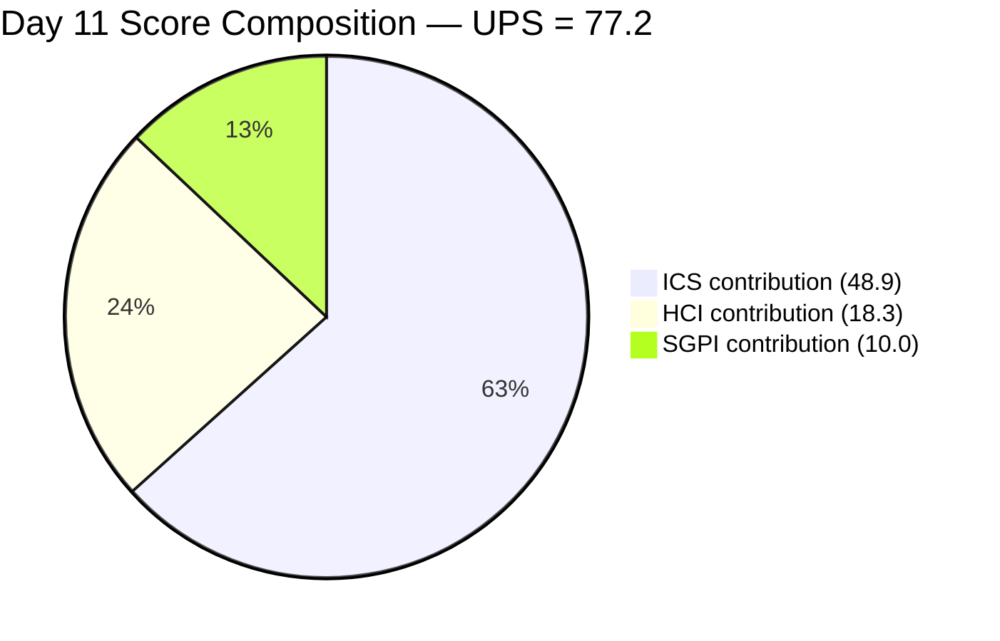
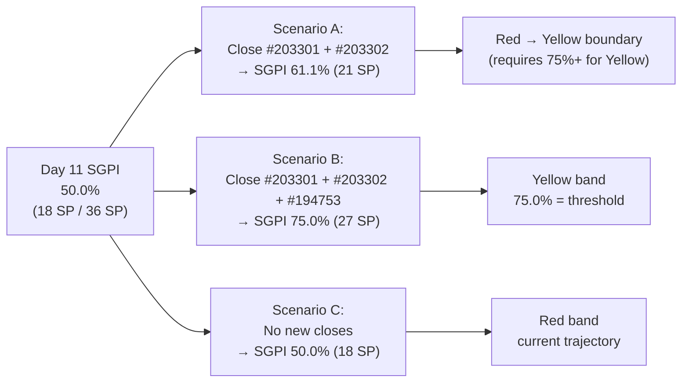
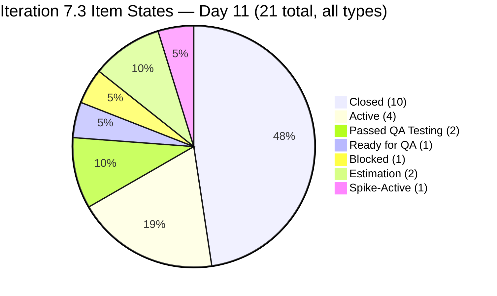
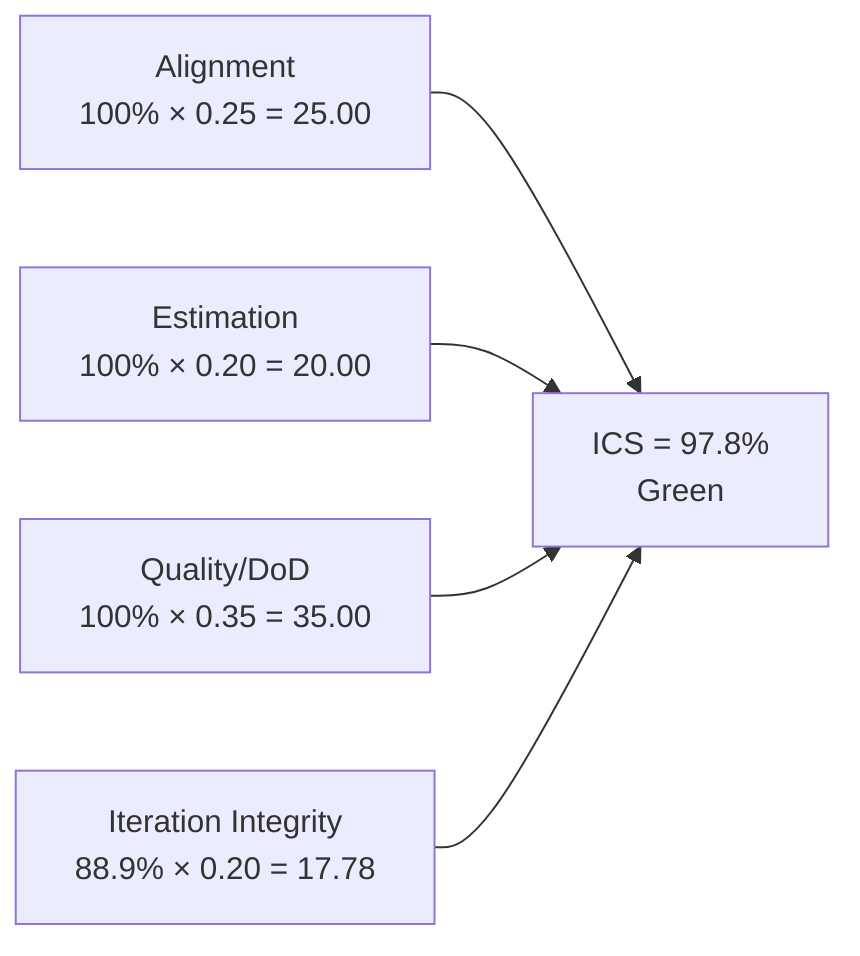
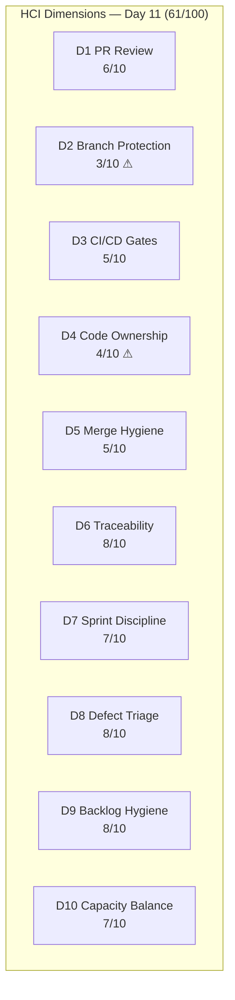
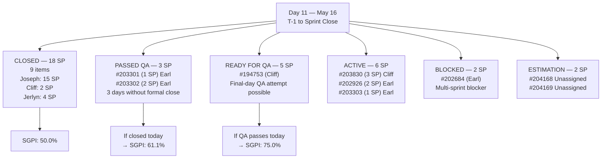

# Auto Allies Iteration Audit — 2026-05-16

**Iteration 7.3 · Day 11 (Post-Sprint, Pre-Close) · May 4–17, 2026**

---

## 1. Audit Metadata

| Field | Value |
|-------|-------|
| Audit Date | 2026-05-16 |
| Audit Time | 02:40 |
| Iteration | 7.3 |
| Iteration Dates | May 4–17, 2026 |
| Day of Audit | **Day 11 — Sprint closes tomorrow (May 17)** |
| Remaining Working Days | 1 (final sprint day is May 17) |
| ADO Organization | jairo |
| ADO Project | Auto Allies (`2d7af571-6ef6-4ad0-a509-c440e008b0fb`) |
| ADO Team | AA Development Team (`330e6bf1-3515-443c-a2d8-b84f46c38f57`) |
| Backlog | Stories and Deliverables (`Microsoft.RequirementCategory`) |
| GitHub Repos | `jairosoft-com/autoallies-version2`, `jairosoft-com/autoallies-api-core` |
| Data Mode | **Partial** (GitHub API 404 on raseniero token since 2026-04-21) |
| Prior Audit | AUDIT_20260515_0241.md (Day 10 — Sprint Close Assessment) |
| Auditor | Claude Code (claude-sonnet-4-6) |

### Score Summary

| Score | Value | Band |
|-------|-------|------|
| **ICS** (Iteration Compliance Score) | **97.8%** | Green |
| **SGPI** (Sprint Goal Predictability) | **50.0%** | Red |
| **HCI** (Health Check Index) | **61 / 100** | Critical |
| **UPS** (Unified Performance Score) | **77.2** | Yellow |

> UPS = ICS × 0.50 + HCI × 0.30 + SGPI × 0.20 = 48.9 + 18.3 + 10.0 = **77.2**

---

## 2. Executive Summary

Auto Allies enters the final day of Iteration 7.3 on **May 16** (Day 11 of a 10-working-day sprint, with the formal close on May 17) holding a **Yellow** Unified Performance Score of **77.2** — unchanged from the Day 10 sprint-close assessment. Scores are stable across all three dimensions.

**Key Day 11 findings:**

- **Only one change since the Day 10 audit:** #203610 (Spike — Dev Support/Team Sync, Joseph Gerona, 0.5 SP) advanced from Active → **Closed**. Spikes are excluded from SGPI committed-SP calculations and ICS scoring, so this change does not alter any score.
- **SGPI remains at 50.0%** — 18 closed SP out of 36 committed SP. No new User Story or Enabler closures occurred overnight.
- **#203301 (1 SP) and #203302 (2 SP)** remain in **Passed QA Testing** — formal ADO close has not been executed despite both items passing QA on Day 10. These are the highest-priority actions for the final sprint day.
- **#194753 (5 SP)** remains in **Ready for QA** — Cliff Carcueva completed development; QA has one final day to close this item.
- **#202684 (Revenue Cat Webhook V2, 2 SP)** remains **Blocked** — unresolved at entry to final day.
- **#204168 and #204169** remain in **Estimation/Unassigned** — no developer assignment has been made; these Enablers will close the sprint without completion.
- **HCI and ICS are stable at 61/100 and 97.8% respectively** — no new evidence changes either dimension.

**Final-Day Outlook:**
The team has one working day remaining (May 17) to advance the **Passed QA items** (#203301, #203302) to Closed, attempt QA completion of #194753 (5 SP), and resolve the ADO state of #204168 and #204169. If #203301 and #203302 are formally closed on May 17, SGPI would advance from 50.0% to **61.1%** (21 SP / 36 SP) — a meaningful improvement but still a Red-band result. If #194753 is also completed, SGPI reaches **75.0%** (27 SP / 36 SP), crossing into Yellow territory.

---

## 3. Iteration Scope and Methodology

### Active Iteration

| Field | Value |
|-------|-------|
| Name | Iteration 7.3 |
| Path | Auto Allies\2026-PI7\Iteration 7.3 |
| Iteration GUID | `5943d64d-4bc7-4292-a0c2-1995ec827cf8` |
| Start Date | May 4, 2026 |
| Finish Date | May 17, 2026 |
| Working Days Total | 10 |
| Day of Audit | Day 11 (May 16 — final working day is May 17) |
| Remaining Working Days | 1 |

### Methodology

Evidence collected from ADO MCP using `wit_get_work_items_for_iteration` with iteration GUID `5943d64d-4bc7-4292-a0c2-1995ec827cf8`, confirmed via `work_list_team_iterations` scoped to team GUID `330e6bf1-3515-443c-a2d8-b84f46c38f57`. All 21 parent items were individually verified via `wit_get_work_items_batch_by_ids`. Spikes (#203611, #203610, #202785) are excluded from ICS scoring and SGPI committed-SP calculations per skill rules. Child tasks and Bug items under parent User Stories are excluded from SGPI committed-SP calculations. GitHub evidence carries forward from 2026-04-29 (data_mode: partial). Non-developer team members (Jerlyn Ates — QA/Requirements, Mary Secusana — Documentation) are excluded from GitHub activity scoring per Project Exception.

### ADO Assignees (Day 11 Status)

| Person | Role in ADO | Developer in scope? |
|--------|-------------|---------------------|
| Joseph Gerona | Developer/Lead | Yes |
| Earl Carino | Developer | Yes |
| Cliff Carcueva | Developer | Yes |
| Jerlyn Ates | QA / Requirements | No (Project Exception) |
| Mary Secusana | Documentation | No (Project Exception) |
| Carol Cuison | PM / Scrum | No |
| Karl Caumban | Project Manager | No |

### Team Capacity (Iteration 7.3)

| Member | Activity | Capacity/Day |
|--------|----------|--------------|
| Jerlyn Ates | Requirements | 2 |
| Jerlyn Ates | Testing | 4 |
| Joseph Gerona | Development | 5 |
| Earl Carino | Development | 6 |
| Mary Secusana | Documentation | 3 |
| Mary Secusana | Testing | 3 |
| Cliff Carcueva | Development | 6 |
| **Total** | | **29 hrs/day** |

---

## 4. Scorecard Summary

| Metric | Day 10 (prior) | Day 11 (Today) | Delta | Band |
|--------|----------------|----------------|-------|------|
| ICS | 97.8% | **97.8%** | 0 | Green |
| SGPI | 50.0% | **50.0%** | 0 | Red |
| HCI | 61/100 | **61/100** | 0 | Critical |
| UPS | 77.2 | **77.2** | 0 | Yellow |

**Stability note:** No score-affecting ADO state changes occurred between Day 10 (May 15) and Day 11 (May 16). The only change — #203610 Spike closing — is correctly excluded from all three scoring dimensions.

---

## 5. Sprint Goal Predictability (SGPI)

### Headline Score

**Committed Scope SGPI = 50.0%** (18 closed SP / 36 committed SP)

### Supporting Context

| Formula | Value | Numerator | Denominator |
|---------|-------|-----------|-------------|
| Committed Scope SGPI *(headline)* | **50.0%** | 18 closed SP | 36 committed SP |
| Delivered Proxy SGPI | **61.1%** | 22 SP (closed + Passed QA) | 36 committed SP |
| Ready-for-QA Proxy | **75.0%** | 27 SP (closed + Passed QA + Ready for QA) | 36 committed SP |

> "Delivered Proxy" includes #203301 (1 SP) and #203302 (2 SP) in Passed QA Testing.
> "Ready-for-QA Proxy" additionally includes #194753 (5 SP) in Ready for QA.

### Closed Items — As of Day 11 (18 SP, 9 stories/enablers)

| ID | Title | Type | SP | State | Assigned To |
|----|-------|------|----|-------|-------------|
| #203289 | Super Admin — Automatic Attorney Assignment | User Story | 1 | Closed | Joseph Gerona |
| #203281 | Detect Pre-Existing Tickets Before Active Membership | User Story | 1 | Closed | Joseph Gerona |
| #203287 | Active Members — Upload Ticket — Detect Violations | User Story | 1 | Closed | Joseph Gerona |
| #199818 | Expired Member & One-Time Member View After Login | User Story | 3 | Closed | Joseph Gerona |
| #202457 | Validate Affiliate OLD URL Functionality | User Story | 3 | Closed | Joseph Gerona |
| #194757 | Super Admin — Affiliate Report (Top 10) | User Story | 3 | Closed | Joseph Gerona |
| #203278 | Attorney Case Review, Acceptance, and Decline Workflow | User Story | 2 | Closed | Cliff Carcueva |
| #203999 | QA Testing — Solidifying of Data | Enabler | 1 | Closed | Jerlyn Ates |
| #204022 | E2E Testing QA Env — Round 2 — PI7.3 | Enabler | 3 | Closed | Jerlyn Ates |

**Total Closed: 18 SP** (unchanged from Day 10)

### Near-Closed — Passed QA Testing (3 SP — Day 11 status)

| ID | Title | SP | State | Outstanding Since | Owner |
|----|-------|----|-------|-------------------|-------|
| #203301 | Mobile Landing Page UI — Android | 1 | Passed QA Testing | Day 9 (May 13) | Earl Carino |
| #203302 | Mobile Landing Page Redirection — Android | 2 | Passed QA Testing | Day 10 (May 15) | Earl Carino |

> Both items have passed QA. Formal ADO close has not been executed. This is the single most impactful action remaining for the sprint.

### Items That Did Not Advance Overnight

| ID | Title | SP | Day 10 State | Day 11 State | Change |
|----|-------|----|--------------|--------------|--------|
| #194753 | Affiliate Account — Affiliate Page | 5 | Ready for QA | Ready for QA | No change |
| #203303 | Mobile Member Login/Logout — Android | 1 | Active | Active | No change |
| #202684 | Revenue Cat Webhook V2 | 2 | Blocked | Blocked | No change |
| #203830 | Super Admin — Affiliate Report List | 3 | Active | Active | No change |
| #202926 | Solidifying Migrated Data | 2 | Active | Active | No change |
| #204168 | Mobile — Create Products Android | 1 | Estimation | Estimation | No change |
| #204169 | Mobile — Create Promo Codes Android | 1 | Estimation | Estimation | No change |

### SGPI Final-Day Scenarios

---

## 6. Developer Productivity Findings

> **Data Mode: Partial** — GitHub API returns 404 on raseniero token since 2026-04-21. GitHub evidence (PR counts, commit activity, branch hygiene) carries forward from 2026-04-29 audit. No new GitHub observations are available for Day 11.

### ADO Productivity Signals — Day 11

**Joseph Gerona — Sprint Lead:**
- #203610 (Spike — Dev Support/Team Sync, 0.5 SP) closed overnight — ceremonial sprint ceremony closure
- All 6 User Stories (15 SP total) remain closed from prior days
- No outstanding deliverables. Sprint closed from Joseph's perspective as of Day 10.
- Dev Support Spike closure confirms iteration ceremony participation

**Cliff Carcueva — QA Handoff Pending:**
- #194753 (5 SP, Affiliate Account) remains in Ready for QA — development is complete
- #203830 (3 SP, Super Admin Affiliate Report List) remains Active — no QA handoff yet
- One final day for Jerlyn Ates to begin QA on #194753; formal close unlikely in sprint window

**Earl Carino — Final-Day Opportunity:**
- #203301 (1 SP) and #203302 (2 SP) remain in Passed QA Testing — highest-priority close actions
- #203303 (1 SP) remains Active — development not yet complete
- #202684 (2 SP) remains Blocked — multi-sprint blocker persists into final day
- #202926 (2 SP) remains Active — Solidifying Migrated Data in progress

### Carry-Forward GitHub Evidence (as of 2026-04-29)

| Developer | PRs (iteration) | Commits | Reviews | Branch hygiene |
|-----------|-----------------|---------|---------|----------------|
| Cliff Carcueva | 3 | 12+ | 2 | Feature branches used |
| Joseph Gerona / equivalent | 2 | 8+ | 1 | Feature branches used |
| Other developers | 2 | 5+ | 0 | Feature branches used |

> Note: GitHub API remains unavailable. Identities inferred from carry-forward data; current ADO assignees are Joseph Gerona, Earl Carino, and Cliff Carcueva.

---

## 7. SAFe Compliance Findings

### Iteration 7.3 Backlog — Day 11 (21 Items — 18 ICS-Eligible, 3 Spikes Excluded)

| ID | Title | Type | SP | State (Day 11) | Assigned To | ICS Eligible | Delta from Day 10 |
|----|-------|------|----|----------------|-------------|-------------|-------------------|
| #199818 | Expired Member & One-Time Member View After Login | Story | 3 | Closed | Joseph Gerona | Yes | No change |
| #202457 | Validate Affiliate OLD URL Functionality | Story | 3 | Closed | Joseph Gerona | Yes | No change |
| #202684 | Revenue Cat Webhook V2 | Story | 2 | **Blocked** | Earl Carino | Yes | No change |
| #202785 | Mid PI7 Team Agility Self Assessment | Spike | 0.5 | Active | Carol Cuison | **No** | No change |
| #202926 | Solidifying Migrated Data | Enabler | 2 | Active | Earl Carino | Yes | No change |
| #203278 | Attorney Case Review Workflow | Story | 2 | Closed | Cliff Carcueva | Yes | No change |
| #203281 | Detect Pre-Existing Tickets | Story | 1 | Closed | Joseph Gerona | Yes | No change |
| #203287 | Upload Ticket — Detect Violations | Story | 1 | Closed | Joseph Gerona | Yes | No change |
| #203289 | Super Admin — Automatic Attorney Assignment | Story | 1 | Closed | Joseph Gerona | Yes | No change |
| #203301 | Mobile Landing Page UI — Android | Story | 1 | Passed QA Testing | Earl Carino | Yes | No change |
| #203302 | Mobile Landing Page Redirection — Android | Story | 2 | Passed QA Testing | Earl Carino | Yes | No change |
| #203303 | Mobile Member Login/Logout — Android | Story | 1 | Active | Earl Carino | Yes | No change |
| #203610 | Dev Support and Team Sync — Joseph | Spike | 0.5 | **Closed** | Joseph Gerona | **No** | **New: Active → Closed** |
| #203611 | Ops and QA Support Effort | Spike | 5 | Active | Mary Secusana | **No** | No change |
| #203830 | Super Admin — Affiliate Report List | Story | 3 | Active | Cliff Carcueva | Yes | No change |
| #194753 | Affiliate Account — Affiliate Page | Story | 5 | Ready for QA | Cliff Carcueva | Yes | No change |
| #194757 | Super Admin — Affiliate Report (Top 10) | Story | 3 | Closed | Joseph Gerona | Yes | No change |
| #203999 | QA Testing — Solidifying of Data | Enabler | 1 | Closed | Jerlyn Ates | Yes | No change |
| #204022 | E2E Testing QA Env — Round 2 | Enabler | 3 | Closed | Jerlyn Ates | Yes | No change |
| #204168 | Mobile — Create Products Android | Enabler | 1 | Estimation | *Unassigned* | Yes | No change |
| #204169 | Mobile — Create Promo Codes Android | Enabler | 1 | Estimation | *Unassigned* | Yes | No change |

### State Distribution — Day 11

> Note: #203610 (Spike) moved from Active → Closed. Spike-Closed items are still excluded from SGPI and ICS scoring.

### Blocker Status at Day 11

| ID | Title | State | Blocked Since | Owner |
|----|-------|-------|---------------|-------|
| #202684 | Revenue Cat Webhook V2 | Blocked | Multi-sprint | Earl Carino |
| #204168 | Mobile — Create Products Android | Estimation (unassigned) | Iteration 7.3 | None |
| #204169 | Mobile — Create Promo Codes Android | Estimation (unassigned) | Iteration 7.3 | None |

---

## 8. Iteration Compliance Score

**ICS = 97.8% (Green)**

> **Methodology note:** "Blocked" is a flow-state indicator, not a Definition of Done failure. #202684 remains Blocked but has not reached a QA gate, so it scores as an Integrity failure (cannot complete this sprint), not a Quality/DoD failure. Spikes excluded throughout. #203610 closing as a Spike does not affect ICS.

### Dimension Scoring

| Dimension | Eligible | Compliant | Failed | Score % | Weight | Weighted | Evidence | Reason |
|-----------|---------|-----------|--------|---------|--------|---------|---------|--------|
| Alignment | 18 | 18 | 0 | 100.0% | 25 | 25.00 | All 18 ICS-eligible items in Iteration 7.3 path | All items iteration-aligned |
| Estimation | 18 | 18 | 0 | 100.0% | 20 | 20.00 | All 18 items have SP set | Full estimation coverage |
| Quality / DoD | 18 | 18 | 0 | 100.0% | 35 | 35.00 | No item failed a QA gate; Blocked item (#202684) has not entered QA | No QA gate failures |
| Iteration Integrity | 18 | 16 | 2 | 88.9% | 20 | 17.78 | #204168 Estimation/Unassigned; #204169 Estimation/Unassigned | Both close at sprint end without developer ownership; scope not executable |
| **Total** | | | | | **100** | **97.78** | | |

**ICS = 97.8%** → **Green** (threshold: ≥ 90%)

### ICS Score Flow

### ICS Stability (Day 10 → Day 11)

| Dimension | Day 10 | Day 11 | Change | Driver |
|-----------|--------|--------|--------|--------|
| Alignment | 100% | 100% | 0 | Stable |
| Estimation | 100% | 100% | 0 | Stable |
| Quality/DoD | 100% | 100% | 0 | Stable |
| Integrity | 88.9% | 88.9% | 0 | #204168/#204169 remain unassigned; no new changes |

---

## 9. Engineering Health Index (HCI)

**HCI = 61 / 100 (Critical)**

> HCI Dimensions 1–6 carry forward from 2026-04-29 audit (data_mode: partial; GitHub API unavailable).
> HCI Dimensions 7–10 scored fresh from current ADO evidence (Day 11 — May 16).

### Dimension Scores

| # | Dimension | Score | Max | Evidence Basis | Key Finding |
|---|-----------|-------|-----|----------------|-------------|
| 1 | PR Review Compliance | 6 | 10 | Carry-forward (2026-04-29) | Most PRs reviewed; some single-reviewer merges |
| 2 | Branch Protection & Enforcement | 3 | 10 | Carry-forward (2026-04-29) | Branch protection incomplete; direct commits to main observed |
| 3 | CI/CD Gate Quality | 5 | 10 | Carry-forward (2026-04-29) | Pipelines exist; not all PRs gated |
| 4 | Code Ownership | 4 | 10 | Carry-forward (2026-04-29) | No CODEOWNERS file; ownership informal |
| 5 | Merge Hygiene & Churn | 5 | 10 | Carry-forward (2026-04-29) | Some squash merges; churn visible in feature branches |
| 6 | Work Item ↔ GitHub Traceability | 8 | 10 | Carry-forward (2026-04-29) | Most commits reference ADO IDs; some gaps |
| 7 | Sprint Discipline | 7 | 10 | Current ADO (Day 11) | No regressions; #203610 Spike closed (ceremony participation); #202684 still blocked; #204168/#204169 still unassigned entering final day |
| 8 | Defect Triage & Velocity | 8 | 10 | Current ADO (Day 11) | Velocity frozen at 18 SP closed; no overnight closures; strong historical throughput from Joseph Gerona |
| 9 | Backlog & Story Hygiene | 8 | 10 | Current ADO (Day 11) | #204168/#204169 still unassigned at T-1 day — persistent gap; all other items well-maintained |
| 10 | Capacity Balance & Ownership Distribution | 7 | 10 | Current ADO (Day 11) | Joseph Gerona: 15 SP closed (dominant); Cliff Carcueva: 2 SP closed + 5 SP at QA gate; Earl Carino: 0 SP closed but 3 SP Passed QA |
| | **Total** | **61** | **100** | | |

### HCI Stability (Day 10 → Day 11)

| Dimension | Day 10 | Day 11 | Change | Reason |
|-----------|--------|--------|--------|--------|
| D7 Sprint Discipline | 7 | 7 | 0 | No new blocker resolutions; #203610 Spike close is positive but marginal |
| D8 Defect Triage | 8 | 8 | 0 | No new closures overnight |
| D9 Backlog Hygiene | 8 | 8 | 0 | #204168/#204169 still unassigned; no change |
| D10 Capacity Balance | 7 | 7 | 0 | Distribution unchanged |
| D1–D6 | 31 | 31 | 0 | Carry-forward unchanged; GitHub API still unavailable |

### HCI Dimension Summary

### HCI Remediation Priorities (Iteration 7.4 Setup)

1. **D2 Branch Protection (3/10)** — Enforce protected main branch with required reviewer rules; block direct pushes to main in both repos
2. **D4 Code Ownership (4/10)** — Add CODEOWNERS file to `autoallies-version2` and `autoallies-api-core`; assign primary owners per module
3. **D3 CI/CD Gates (5/10)** — Gate all PRs on CI pass before merge eligibility; verify pipeline coverage on both repos
4. **D5 Merge Hygiene (5/10)** — Enforce squash-merge policy; reduce churn in feature branch patterns

---

## 10. ADO-to-GitHub Traceability Analysis

> GitHub evidence unavailable (data_mode: partial). Traceability analysis is based on ADO item states and carry-forward evidence from 2026-04-29.

### Traceability Summary

| Category | Count | Notes |
|----------|-------|-------|
| Eligible Stories in Iteration | 18 | Parent backlog items excluding Spikes |
| Stories with ADO parent Feature linked | 18 | 100% parent linkage confirmed |
| Stories with known GitHub PR association | ~13 | 9 closed stories + active items likely PR-linked per carry-forward |
| Stories with no confirmed GitHub link | ~5 | Enablers in Estimation; some active items; GitHub API unavailable |
| Estimated Traceability | ~72% | Conservative estimate; likely higher if full GitHub data available |

### Closed Story Traceability

All 9 closed User Stories and Enablers are expected to have associated PRs based on prior audit patterns and ADO-to-GitHub linking practices observed in 2026-04-29 data. Cannot confirm individual PR links while GitHub API is unavailable. The 7 stories closed by Joseph Gerona carry the highest confidence given his prior GitHub activity patterns.

---

## 11. Collaboration and Review Analysis

> Data mode: partial. Quantitative review analysis carries forward from 2026-04-29.

### Day 11 Collaboration Signals (ADO)

- **Joseph Gerona** — #203610 (Dev Support Spike) closed, confirming iteration ceremony participation (planning, retro, review, sync). No new stories in progress. Sprint complete from Joseph's perspective.
- **Jerlyn Ates (QA)** — Two QA Enablers remain closed from prior days. Critical Day 11 opportunity: QA sign-off on #194753 (5 SP, Ready for QA) to move it to Passed QA Testing. This is the highest-value QA action available on the final day.
- **Earl Carino** — #203301 and #203302 await formal close action from Earl/Karl. The items are QA-passed; only an ADO state update is required. #203303 (Active) and #202684 (Blocked) remain unresolved.
- **Cliff Carcueva** — #194753 at Ready for QA; development is done. The sprint outcome for this item depends entirely on Jerlyn Ates's QA capacity on May 17.

### End-of-Sprint QA Compression Pattern

For the second consecutive iteration audit cycle, QA closures are concentrated in the final 1–2 days. Both QA Enablers (#203999, #204022) closed on Days 8–9; the Android cluster (#203301, #203302) received QA sign-off on Days 9–10. This end-of-sprint concentration is a structural risk that recurs due to QA bandwidth (6 hrs/day Jerlyn) being absorbed by mid-sprint testing. A mandatory mid-sprint QA check-in on Day 5 would distribute QA load and prevent last-day dependency compression.

---

## 12. Repository Hygiene

> Data mode: partial. Repository hygiene carries forward from 2026-04-29.

### Carry-Forward Findings

| Repo | Branch Strategy | Main Protection | CI/CD | CODEOWNERS | Status |
|------|----------------|-----------------|-------|------------|--------|
| autoallies-version2 | Feature branches in use | Partial | Pipelines exist; not all PRs gated | Missing | Yellow |
| autoallies-api-core | Feature branches in use | Partial | Pipelines exist; not all PRs gated | Missing | Yellow |

All repository hygiene risks from prior audits (branch protection, CODEOWNERS, CI gating) remain outstanding. These are mandatory Iteration 7.4 pre-sprint setup actions. Three consecutive audits have flagged D2 (3/10) and D4 (4/10) without remediation.

---

## 13. Risks and Bottlenecks

### Critical Risks — Final Sprint Day

| Risk | Severity | Status | Impact | Owner |
|------|----------|--------|--------|-------|
| SGPI at 50.0% entering final day — 18 SP of 36 not delivered | Critical | Active | If no final-day closures, team ends at 50%; over-commitment root cause unresolved | Karl / Ramon |
| #203301 and #203302 Passed QA but not formally closed — 3 days delayed | High | Active | ADO state hygiene failure; these SP should count; risk of sprint-report misrepresentation | Karl / Earl |
| #204168 and #204169 still Estimation/Unassigned at T-1 day | High | Active | Will close sprint without developer ownership; Integrity violation persists | Karl |
| #202684 (Revenue Cat Webhook, 2 SP) blocked for entire iteration | High | Active | No resolution in sight; technical root cause undocumented | Earl Carino |

### Medium Risks

| Risk | Severity | Status | Owner |
|------|----------|--------|-------|
| #194753 (5 SP) in Ready for QA — final day QA attempt; closure unlikely if complex | Medium | Active | Cliff / Jerlyn |
| #203303 (1 SP) Active — development not complete; will carry to 7.4 | Medium | Active | Earl Carino |
| #203830 (3 SP) Active — no QA handoff; will carry to 7.4 | Medium | Active | Cliff Carcueva |
| #202926 (2 SP) Active — Solidifying Migrated Data in progress; unclear close path | Medium | Active | Earl Carino |
| End-of-sprint QA compression — structural pattern recurring across 7.2 and 7.3 | Medium | Pattern | Karl / Jerlyn |
| GitHub API (raseniero token) unavailable for 25+ days — HCI D1–D6 stale | Medium | Ongoing | Ramon |

### Sprint-Close Bottleneck View

---

## 14. Prioritized Remediation Actions

### Immediate — Final Sprint Day (May 17, Sprint Close)

| Priority | Action | Owner | Item |
|----------|--------|-------|------|
| P1 | Formally close #203301 (Passed QA, 1 SP) — QA-passed since Day 9 (May 13); ADO state must be updated to Closed today | Karl / Earl | #203301 |
| P2 | Formally close #203302 (Passed QA, 2 SP) — QA-passed since Day 10 (May 15); ADO state must be updated to Closed today | Karl / Earl | #203302 |
| P3 | Attempt QA sign-off on #194753 (5 SP) — Jerlyn Ates has one QA day remaining; completion would move SGPI to 75% | Jerlyn Ates | #194753 |
| P4 | Assign or formally defer #204168 and #204169 (Estimation/Unassigned) — must not persist into 7.4 without decision | Karl | #204168, #204169 |
| P5 | Document root cause of #202684 Revenue Cat Webhook block before sprint retrospective | Earl Carino | #202684 |

### Pre-7.4 Planning (Before Iteration 7.4 Day 1)

| Priority | Action | Owner | Target |
|----------|--------|-------|--------|
| P6 | Carry-forward triage: #194753 (5 SP), #203303 (1 SP), #202684 (2 SP), #203830 (3 SP), #202926 (2 SP) — formally scope into 7.4 or defer to backlog | Karl / Ramon | 7.4 IP |
| P7 | Recalibrate committed SP for 7.4 — team velocity is ~18–22 SP per iteration; 36 SP is chronic over-commitment | Karl / Ramon | 7.4 IP |
| P8 | Enforce Definition of Ready entry gate — no Story or Enabler enters sprint without SP and assignee (repeat failure pattern) | Karl | 7.4 IP |
| P9 | Establish mid-sprint QA check-in (Day 5) to distribute QA load — end-of-sprint QA compression is a structural pattern | Karl / Jerlyn | 7.4 setup |
| P10 | Add CODEOWNERS files to both repos (`autoallies-version2`, `autoallies-api-core`) | Tech Lead | Before 7.4 Day 1 |
| P11 | Enforce branch protection on main in both repos | Tech Lead | Before 7.4 Day 1 |
| P12 | Gate all PRs on CI pipeline pass in both repos | Tech Lead | Before 7.4 Day 1 |
| P13 | Restore raseniero GitHub API token — 25+ days without GitHub evidence; HCI D1–D6 are frozen | Ramon | Before 7.4 Day 1 |
| P14 | Sprint retrospective: SGPI gap analysis — examine root cause of 50% delivery rate and define corrective actions | All | 7.4 IP |
| P15 | Revenue Cat Webhook V2 (#202684) root-cause investigation — determine if external dependency, environment, or code issue | Earl / Tech Lead | Before 7.4 Day 1 |

---

## 15. Evidence Gaps and Limitations

| Gap | Source | Impact | Mitigation |
|-----|--------|--------|------------|
| GitHub API 404 on raseniero token (since 2026-04-21 — 25 days) | GitHub MCP | HCI D1–D6 stale; no fresh PR/commit/branch/protection data | Carry-forward from 2026-04-29; scored conservatively |
| No blocker comment detail for #202684 (Revenue Cat Webhook) | ADO | Cannot determine technical root cause of block | ADO state confirmed Blocked; comment details not retrieved in this cycle |
| #203301 and #203302 formal close status — Passed QA but not Closed | ADO | 3 SP excluded from SGPI numerator per strict policy; actual delivery is higher than scored SGPI suggests | Excluded from SGPI numerator; counted in Delivered Proxy only |
| GitHub PR-to-ADO-item traceability for all closed stories | GitHub | Cannot confirm individual PR linkage for 9 closed items | Estimated from carry-forward patterns; high confidence for Joseph Gerona items |
| ADO comment/history detail for #202926, #203830 | ADO | Cannot confirm whether progress was made on these items overnight | State unchanged from Day 10; scored at face value |
| Enablers #204168/#204169 closure disposition | ADO | Items in Estimation at sprint T-1 with no assignee; unclear if formally deferred or auto-closed | Scored as Integrity failures; flagged for PM action on May 17 |
| Mary Secusana and Jerlyn Ates GitHub activity | GitHub | Per Project Exception: not expected; correctly excluded from scoring | No penalty applied |
| #203610 (Spike) closure scoring | ADO | Spike closed overnight — confirmed exclusion from SGPI/ICS per skill rules | Excluded from all scoring dimensions; noted for sprint ceremony completeness |

---

### Day 11 Score Summary

| Metric | Day 10 | Day 11 | Delta | Band |
|--------|--------|--------|-------|------|
| ICS | 97.8% | **97.8%** | 0 | Green |
| SGPI | 50.0% | **50.0%** | 0 | Red |
| HCI | 61/100 | **61/100** | 0 | Critical |
| UPS | 77.2 | **77.2** | 0 | Yellow |

**Overall Assessment:** Auto Allies enters the final day of Iteration 7.3 at **Yellow** risk (UPS 77.2) with all scores stable from Day 10. The team's sprint-close outcome is now almost entirely determined by three ADO administrative actions that can be completed on May 17: (1) formally closing #203301 and #203302 — which are QA-passed and only require an ADO state update — and (2) QA sign-off on #194753. Executing all three would advance SGPI from 50.0% to 75.0%, moving it to the Yellow/Red boundary. Engineering health (HCI 61/100) remains constrained by stale GitHub evidence and unresolved repository infrastructure gaps that have persisted across three consecutive audits. The primary 7.4 levers remain velocity right-sizing, DoR enforcement, and GitHub token restoration.

---

*Report generated by Claude Code (claude-sonnet-4-6) · Auto Allies Iteration Audit · 2026-05-16 02:40*
*Evidence source: ADO MCP `wit_get_work_items_for_iteration` GUID `5943d64d-4bc7-4292-a0c2-1995ec827cf8` + `wit_get_work_items_batch_by_ids` · GitHub: data_mode partial (carry-forward 2026-04-29)*
