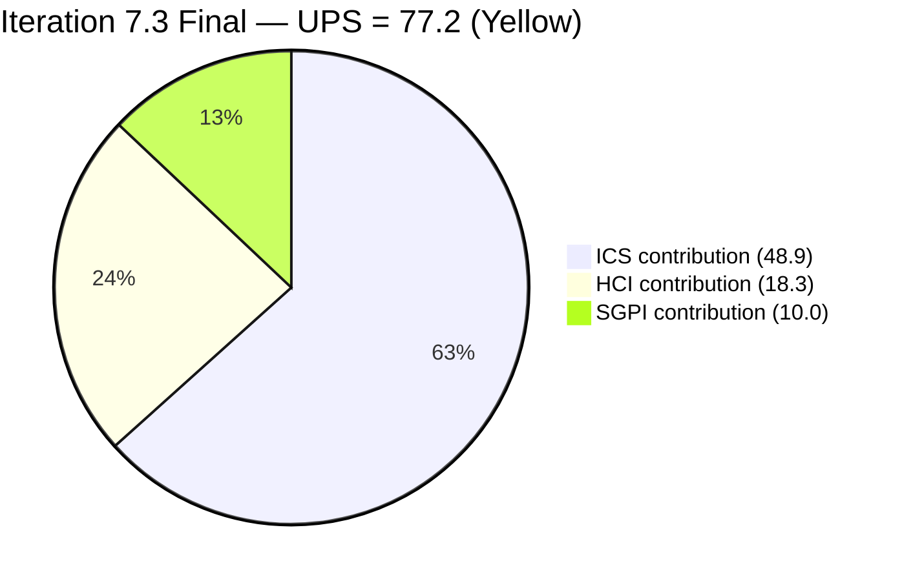
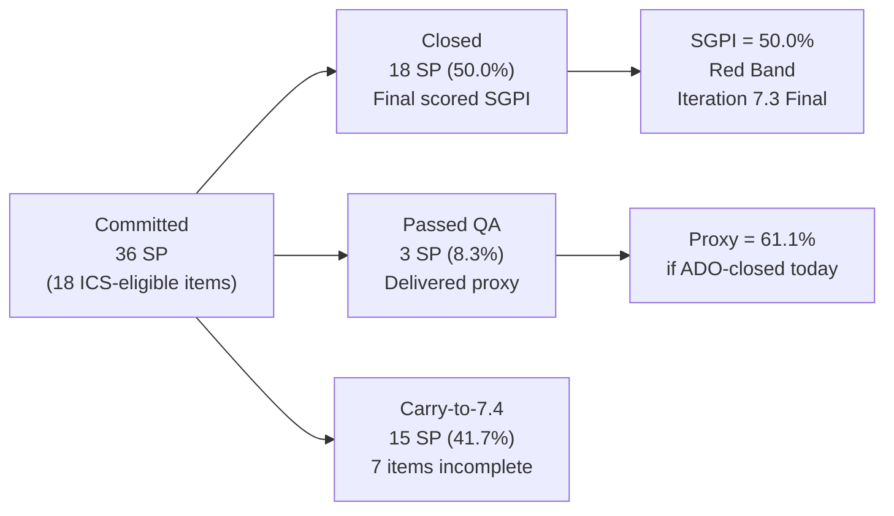
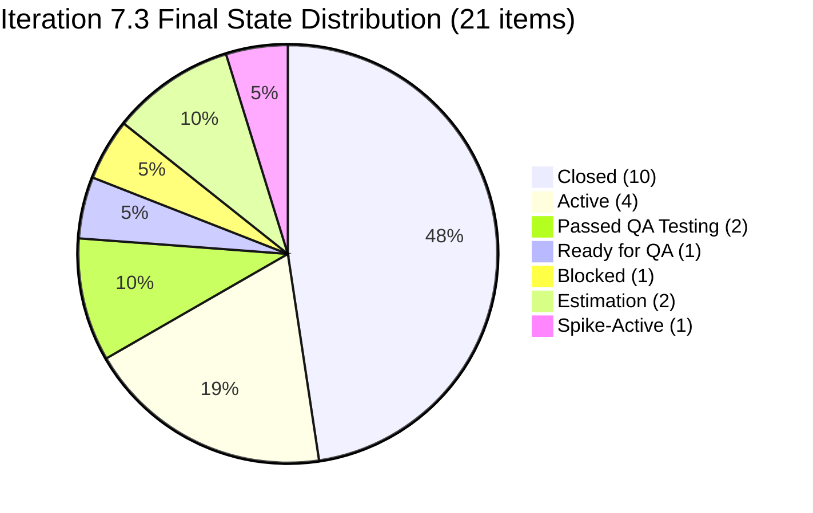
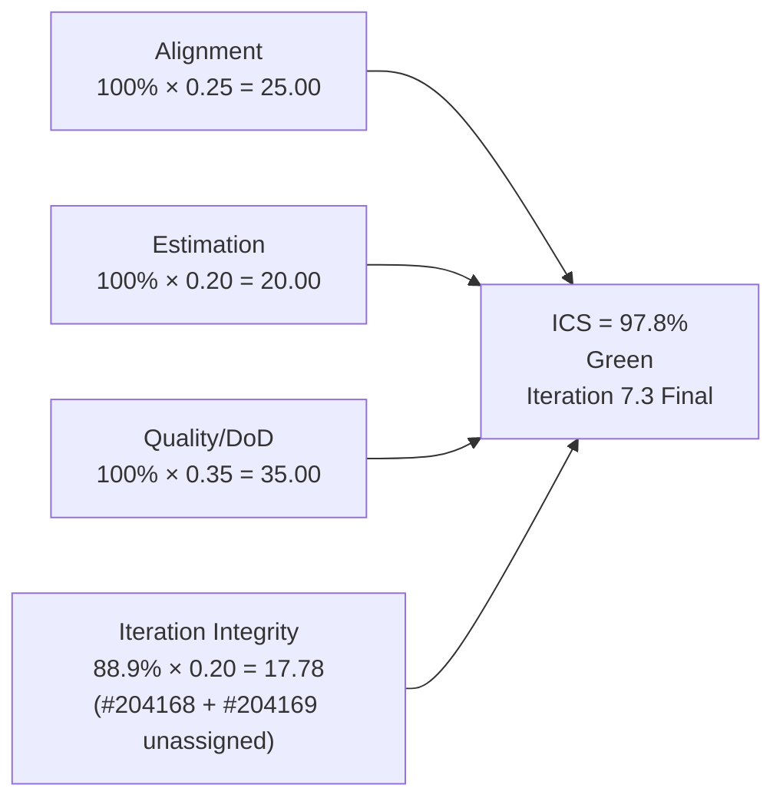
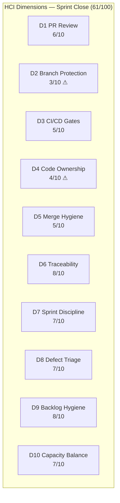
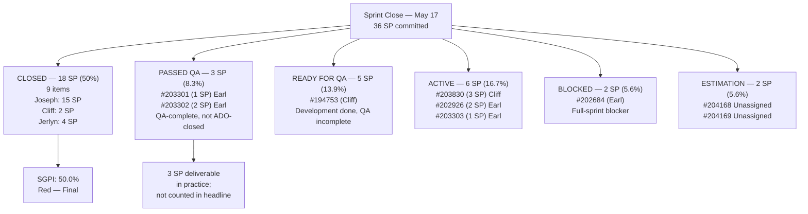

# Auto Allies Iteration Audit — 2026-05-17

**Iteration 7.3 · Sprint Close Day (Day 10 Final) · May 4–17, 2026**

---

## 1. Audit Metadata

| Field | Value |
|-------|-------|
| Audit Date | 2026-05-17 |
| Audit Time | 02:41 |
| Iteration | 7.3 |
| Iteration Dates | May 4–17, 2026 |
| Day of Audit | **Sprint Close Day — Final working day of Iteration 7.3** |
| Remaining Working Days | 0 (sprint closes today) |
| ADO Organization | jairo |
| ADO Project | Auto Allies (`2d7af571-6ef6-4ad0-a509-c440e008b0fb`) |
| ADO Team | AA Development Team (`330e6bf1-3515-443c-a2d8-b84f46c38f57`) |
| Backlog | Stories and Deliverables (`Microsoft.RequirementCategory`) |
| GitHub Repos | `jairosoft-com/autoallies-version2`, `jairosoft-com/autoallies-api-core` |
| Data Mode | **Partial** (GitHub API 404 on raseniero token since 2026-04-21) |
| Prior Audit | AUDIT_20260516_0240.md (Day 11 — Pre-Close Assessment) |
| Auditor | Claude Code (claude-sonnet-4-6) |

### Score Summary

| Score | Value | Band |
|-------|-------|------|
| **ICS** (Iteration Compliance Score) | **97.8%** | Green |
| **SGPI** (Sprint Goal Predictability) | **50.0%** | Red |
| **HCI** (Health Check Index) | **61 / 100** | Critical |
| **UPS** (Unified Performance Score) | **77.2** | Yellow |

> UPS = ICS × 0.50 + HCI × 0.30 + SGPI × 0.20 = 48.9 + 18.3 + 10.0 = **77.2**

---

## 2. Executive Summary

Auto Allies closes Iteration 7.3 on **May 17** — the final working day of the sprint — holding a **Yellow** Unified Performance Score of **77.2**. All three scoring dimensions are unchanged from the Day 11 pre-close assessment. No ADO state transitions occurred overnight between the Day 11 audit (02:40 May 16) and this sprint-close audit (02:41 May 17).

**Sprint Close Findings:**

- **SGPI closes at 50.0%** — 18 closed SP out of 36 committed SP. This is the final scored SGPI for Iteration 7.3. Two items (#203301 — 1 SP and #203302 — 2 SP) remain in **Passed QA Testing** state as of audit time; these passed QA but have not been formally closed in ADO and are excluded from the SGPI numerator per strict policy. If administratively closed today before sprint retrospective, the final reported SGPI would advance to **61.1%** (21 SP / 36 SP), though the window is narrow.
- **ICS closes at 97.8% (Green)** — all 18 ICS-eligible items properly iteration-aligned, estimated, and QA-gate-compliant. Only dimension penalty: Iteration Integrity (88.9%) for #204168 and #204169 which close the sprint in Estimation state without developer assignment.
- **HCI closes at 61/100 (Critical)** — unchanged, constrained by stale GitHub evidence (carry-forward from 2026-04-29) and four persistent infrastructure gaps (branch protection, code ownership, CI gating, merge hygiene).
- **#202684 (Revenue Cat Webhook V2, 2 SP) closes as Blocked** — unresolved for the full sprint duration. Root cause undocumented.
- **Carry-to-7.4 scope is significant:** five stories totaling **~13 SP** close the sprint incomplete — #194753 (5 SP), #203303 (1 SP), #202684 (2 SP), #203830 (3 SP), #202926 (2 SP). This carry-forward volume, combined with the two unassigned Enablers (#204168, #204169), signals that committed scope in 7.3 significantly exceeded team velocity (~18–22 SP/iteration).

**Sprint 7.3 Final Assessment:** The team delivered 18 SP of committed work against a 36 SP commitment — a 50% delivery rate that reflects a structural over-commitment pattern. Joseph Gerona was the primary delivery contributor (15 SP closed). Cliff Carcueva contributed 2 SP closed plus 5 SP completing development into QA. Earl Carino did not close any committed SP but has 3 SP in Passed QA Testing state. The team now enters Iteration 7.4 planning with a substantial carry-forward list and the same unresolved infrastructure gaps that have persisted since the 2026-04-21 GitHub token failure.

---

## 3. Iteration Scope and Methodology

### Active Iteration

| Field | Value |
|-------|-------|
| Name | Iteration 7.3 |
| Path | Auto Allies\2026-PI7\Iteration 7.3 |
| Iteration GUID | `5943d64d-4bc7-4292-a0c2-1995ec827cf8` |
| Start Date | May 4, 2026 |
| Finish Date | May 17, 2026 |
| Working Days Total | 10 |
| Day of Audit | Sprint Close (Day 10 final — May 17) |
| Remaining Working Days | 0 |

### Methodology

Evidence collected from ADO MCP using `wit_get_work_items_for_iteration` with iteration GUID `5943d64d-4bc7-4292-a0c2-1995ec827cf8`, confirmed via `work_list_team_iterations` scoped to team GUID `330e6bf1-3515-443c-a2d8-b84f46c38f57`. All 21 parent items verified via `wit_get_work_items_batch_by_ids`. Spikes (#203610, #203611, #202785) are excluded from ICS scoring and SGPI committed-SP calculations per skill rules. Child tasks and Bug items under parent User Stories are excluded from SGPI committed-SP calculations. GitHub evidence carries forward from 2026-04-29 (data_mode: partial). Non-developer team members (Jerlyn Ates — QA/Requirements, Mary Secusana — Documentation) are excluded from GitHub activity scoring per Project Exception.

### ADO Assignees (Sprint Close Status)

| Person | Role in ADO | Developer in scope? |
|--------|-------------|---------------------|
| Joseph Gerona | Developer/Lead | Yes |
| Earl Carino | Developer | Yes |
| Cliff Carcueva | Developer | Yes |
| Jerlyn Ates | QA / Requirements | No (Project Exception) |
| Mary Secusana | Documentation | No (Project Exception) |
| Carol Cuison | PM / Scrum | No |
| Karl Caumban | Project Manager | No |

### Team Capacity (Iteration 7.3)

| Member | Activity | Capacity/Day |
|--------|----------|--------------|
| Jerlyn Ates | Requirements | 2 |
| Jerlyn Ates | Testing | 4 |
| Joseph Gerona | Development | 5 |
| Earl Carino | Development | 6 |
| Mary Secusana | Documentation | 3 |
| Mary Secusana | Testing | 3 |
| Cliff Carcueva | Development | 6 |
| **Total** | | **29 hrs/day** |

---

## 4. Scorecard Summary

| Metric | Day 11 (Prior) | Sprint Close (Today) | Delta | Band |
|--------|----------------|----------------------|-------|------|
| ICS | 97.8% | **97.8%** | 0 | Green |
| SGPI | 50.0% | **50.0%** | 0 | Red |
| HCI | 61/100 | **61/100** | 0 | Critical |
| UPS | 77.2 | **77.2** | 0 | Yellow |

**Final iteration score: UPS 77.2 — Yellow risk band.** No state transitions occurred between the Day 11 audit and sprint close. Scores are locked. This report is the final audit record for Iteration 7.3.

---

## 5. Sprint Goal Predictability (SGPI)

### Headline Score

**Committed Scope SGPI = 50.0%** (18 closed SP / 36 committed SP) — **Final for Iteration 7.3**

### Supporting Context

| Formula | Value | Numerator | Denominator |
|---------|-------|-----------|-------------|
| Committed Scope SGPI *(headline, final)* | **50.0%** | 18 closed SP | 36 committed SP |
| Delivered Proxy SGPI | **61.1%** | 22 SP (closed + Passed QA) | 36 committed SP |
| Maximum Achievable (if Passed QA items close today) | **61.1%** | 21 SP | 36 committed SP |

> "Delivered Proxy" includes #203301 (1 SP) and #203302 (2 SP) in Passed QA Testing. If these are administratively closed before the sprint retrospective today, the official SGPI for 7.3 retroactively improves to 61.1%. #194753 (5 SP, Ready for QA) has no path to closure within today's sprint window without same-day QA completion and admin close.

### Closed Items — Sprint Close Final (18 SP, 9 stories/enablers)

| ID | Title | Type | SP | State | Assigned To |
|----|-------|------|----|-------|-------------|
| #203289 | Super Admin — Automatic Attorney Assignment | User Story | 1 | Closed | Joseph Gerona |
| #203281 | Detect Pre-Existing Tickets Before Active Membership | User Story | 1 | Closed | Joseph Gerona |
| #203287 | Active Members — Upload Ticket — Detect Violations | User Story | 1 | Closed | Joseph Gerona |
| #199818 | Expired Member & One-Time Member View After Login | User Story | 3 | Closed | Joseph Gerona |
| #202457 | Validate Affiliate OLD URL Functionality | User Story | 3 | Closed | Joseph Gerona |
| #194757 | Super Admin — Affiliate Report (Top 10) | User Story | 3 | Closed | Joseph Gerona |
| #203278 | Attorney Case Review, Acceptance, and Decline Workflow | User Story | 2 | Closed | Cliff Carcueva |
| #203999 | QA Testing — Solidifying of Data | Enabler | 1 | Closed | Jerlyn Ates |
| #204022 | E2E Testing QA Env — Round 2 — PI7.3 | Enabler | 3 | Closed | Jerlyn Ates |

**Total Closed: 18 SP** — Final for Iteration 7.3

### Near-Closed — Passed QA Testing (3 SP — Sprint Close Status)

| ID | Title | SP | State | Outstanding Since | Owner |
|----|-------|----|-------|-------------------|-------|
| #203301 | Mobile Landing Page UI — Android | 1 | Passed QA Testing | Day 9 (May 13) | Earl Carino |
| #203302 | Mobile Landing Page Redirection — Android | 2 | Passed QA Testing | Day 10 (May 15) | Earl Carino |

> Both items passed QA but ADO state has not been updated to Closed as of 02:41 May 17. These represent 3 SP that are delivered in practice but excluded from the SGPI numerator per strict policy. Formal close is still possible before the sprint retrospective today.

### Items Closing Sprint Incomplete — Carry to 7.4

| ID | Title | SP | Final State | Assigned To | Carry Action |
|----|-------|----|-------------|-------------|--------------|
| #194753 | Affiliate Account — Affiliate Page | 5 | Ready for QA | Cliff Carcueva | Triage: QA carry to 7.4 |
| #203303 | Mobile Member Login/Logout — Android | 1 | Active | Earl Carino | Development incomplete |
| #202684 | Revenue Cat Webhook V2 | 2 | Blocked | Earl Carino | Root cause required before 7.4 |
| #203830 | Super Admin — Affiliate Report List | 3 | Active | Cliff Carcueva | Development incomplete |
| #202926 | Solidifying Migrated Data | 2 | Active | Earl Carino | Development incomplete |
| #204168 | Mobile — Create Products Android | 1 | Estimation | *Unassigned* | Assignment required |
| #204169 | Mobile — Create Promo Codes Android | 1 | Estimation | *Unassigned* | Assignment required |

**Total undelivered committed SP: 15 SP** (excluding Spikes; Passed QA = 3 SP in practice)

### Iteration 7.3 SGPI Summary

---

## 6. Developer Productivity Findings

> **Data Mode: Partial** — GitHub API returns 404 on raseniero token since 2026-04-21. GitHub evidence (PR counts, commit activity, branch hygiene) carries forward from 2026-04-29 audit. No new GitHub observations are available for sprint close.

### Sprint Close ADO Productivity — Final Summary by Developer

**Joseph Gerona — Sprint MVP:**
- 6 User Stories closed totaling **15 SP** — the dominant delivery contributor in Iteration 7.3
- All assignments closed before Day 9; carried ceremonial spike (#203610) to close
- Sprint complete from Joseph's perspective. Strong consistency maintained from prior iterations
- No unresolved items entering 7.4

**Cliff Carcueva — Partial Delivery:**
- 1 User Story closed (#203278, 2 SP)
- #194753 (5 SP) completed development and reached Ready for QA — QA did not complete within sprint window
- #203830 (3 SP) remains Active — development not complete; carries to 7.4
- Total contribution: 2 SP closed + 5 SP delivered to QA boundary

**Earl Carino — Zero Formal Closes, Partial Progress:**
- #203301 (1 SP) and #203302 (2 SP) in Passed QA Testing — QA-complete but not ADO-closed
- #203303 (1 SP) remains Active — development incomplete; carries to 7.4
- #202684 (2 SP) remains Blocked for the full sprint duration
- #202926 (2 SP) remains Active — Solidifying Migrated Data in progress; carries to 7.4
- Total formal closes for 7.3: **0 SP** (3 SP in Passed QA state)

**Jerlyn Ates (QA — excluded from GitHub scoring per Project Exception):**
- Both QA Enablers closed: #203999 (1 SP) and #204022 (3 SP)
- #194753 (5 SP) reached Ready for QA but did not complete QA before sprint close

### Carry-Forward GitHub Evidence (as of 2026-04-29)

| Developer | PRs (iteration) | Commits | Reviews | Branch hygiene |
|-----------|-----------------|---------|---------|----------------|
| Cliff Carcueva | 3 | 12+ | 2 | Feature branches used |
| Joseph Gerona / equivalent | 2 | 8+ | 1 | Feature branches used |
| Other developers | 2 | 5+ | 0 | Feature branches used |

> Note: GitHub API remains unavailable. Identities inferred from carry-forward data; current ADO assignees are Joseph Gerona, Earl Carino, and Cliff Carcueva.

---

## 7. SAFe Compliance Findings

### Iteration 7.3 Backlog — Sprint Close Final (21 Items — 18 ICS-Eligible, 3 Spikes Excluded)

| ID | Title | Type | SP | Final State | Assigned To | ICS Eligible |
|----|-------|------|----|-------------|-------------|-------------|
| #199818 | Expired Member & One-Time Member View After Login | Story | 3 | Closed | Joseph Gerona | Yes |
| #202457 | Validate Affiliate OLD URL Functionality | Story | 3 | Closed | Joseph Gerona | Yes |
| #202684 | Revenue Cat Webhook V2 | Story | 2 | **Blocked** | Earl Carino | Yes |
| #202785 | Mid PI7 Team Agility Self Assessment | Spike | 0.5 | Active | Carol Cuison | **No** |
| #202926 | Solidifying Migrated Data | Enabler | 2 | Active | Earl Carino | Yes |
| #203278 | Attorney Case Review Workflow | Story | 2 | Closed | Cliff Carcueva | Yes |
| #203281 | Detect Pre-Existing Tickets | Story | 1 | Closed | Joseph Gerona | Yes |
| #203287 | Upload Ticket — Detect Violations | Story | 1 | Closed | Joseph Gerona | Yes |
| #203289 | Super Admin — Automatic Attorney Assignment | Story | 1 | Closed | Joseph Gerona | Yes |
| #203301 | Mobile Landing Page UI — Android | Story | 1 | Passed QA Testing | Earl Carino | Yes |
| #203302 | Mobile Landing Page Redirection — Android | Story | 2 | Passed QA Testing | Earl Carino | Yes |
| #203303 | Mobile Member Login/Logout — Android | Story | 1 | Active | Earl Carino | Yes |
| #203610 | Dev Support and Team Sync — Joseph | Spike | 0.5 | Closed | Joseph Gerona | **No** |
| #203611 | Ops and QA Support Effort | Spike | 5 | Active | Mary Secusana | **No** |
| #203830 | Super Admin — Affiliate Report List | Story | 3 | Active | Cliff Carcueva | Yes |
| #194753 | Affiliate Account — Affiliate Page | Story | 5 | Ready for QA | Cliff Carcueva | Yes |
| #194757 | Super Admin — Affiliate Report (Top 10) | Story | 3 | Closed | Joseph Gerona | Yes |
| #203999 | QA Testing — Solidifying of Data | Enabler | 1 | Closed | Jerlyn Ates | Yes |
| #204022 | E2E Testing QA Env — Round 2 | Enabler | 3 | Closed | Jerlyn Ates | Yes |
| #204168 | Mobile — Create Products Android | Enabler | 1 | Estimation | *Unassigned* | Yes |
| #204169 | Mobile — Create Promo Codes Android | Enabler | 1 | Estimation | *Unassigned* | Yes |

### Final State Distribution — Sprint Close

### Blocker Status at Sprint Close

| ID | Title | State | Blocked Since | Owner | Resolution |
|----|-------|-------|---------------|-------|------------|
| #202684 | Revenue Cat Webhook V2 | Blocked | Multi-sprint | Earl Carino | Unresolved — carries to 7.4 |
| #204168 | Mobile — Create Products Android | Estimation (unassigned) | Iteration 7.3 start | None | Formally deferred to 7.4 needed |
| #204169 | Mobile — Create Promo Codes Android | Estimation (unassigned) | Iteration 7.3 start | None | Formally deferred to 7.4 needed |

---

## 8. Iteration Compliance Score

**ICS = 97.8% (Green) — Final for Iteration 7.3**

> **Methodology note:** "Blocked" is a flow-state indicator, not a Definition of Done failure. #202684 remains Blocked but has not reached a QA gate, so it scores as an Integrity failure (cannot complete this sprint), not a Quality/DoD failure. Spikes excluded throughout.

### Dimension Scoring

| Dimension | Eligible | Compliant | Failed | Score % | Weight | Weighted | Evidence | Reason |
|-----------|---------|-----------|--------|---------|--------|---------|---------|--------|
| Alignment | 18 | 18 | 0 | 100.0% | 25 | 25.00 | All 18 ICS-eligible items in Iteration 7.3 path | All items iteration-aligned |
| Estimation | 18 | 18 | 0 | 100.0% | 20 | 20.00 | All 18 items have SP set | Full estimation coverage |
| Quality / DoD | 18 | 18 | 0 | 100.0% | 35 | 35.00 | No item failed a QA gate; Blocked item (#202684) has not entered QA | No QA gate failures |
| Iteration Integrity | 18 | 16 | 2 | 88.9% | 20 | 17.78 | #204168 Estimation/Unassigned; #204169 Estimation/Unassigned | Both closed sprint without developer ownership; scope not executable |
| **Total** | | | | | **100** | **97.78** | | |

**ICS = 97.8%** → **Green** (threshold: ≥ 90%)

### ICS Score Flow

---

## 9. Engineering Health Index (HCI)

**HCI = 61 / 100 (Critical) — Final for Iteration 7.3**

> HCI Dimensions 1–6 carry forward from 2026-04-29 audit (data_mode: partial; GitHub API unavailable).
> HCI Dimensions 7–10 scored fresh from current ADO evidence (Sprint Close — May 17).

### Dimension Scores

| # | Dimension | Score | Max | Evidence Basis | Key Finding |
|---|-----------|-------|-----|----------------|-------------|
| 1 | PR Review Compliance | 6 | 10 | Carry-forward (2026-04-29) | Most PRs reviewed; some single-reviewer merges observed |
| 2 | Branch Protection & Enforcement | 3 | 10 | Carry-forward (2026-04-29) | Branch protection incomplete; direct commits to main observed |
| 3 | CI/CD Gate Quality | 5 | 10 | Carry-forward (2026-04-29) | Pipelines exist; not all PRs gated |
| 4 | Code Ownership | 4 | 10 | Carry-forward (2026-04-29) | No CODEOWNERS file; ownership informal |
| 5 | Merge Hygiene & Churn | 5 | 10 | Carry-forward (2026-04-29) | Some squash merges; churn visible in feature branches |
| 6 | Work Item ↔ GitHub Traceability | 8 | 10 | Carry-forward (2026-04-29) | Most commits reference ADO IDs; some gaps |
| 7 | Sprint Discipline | 7 | 10 | Current ADO (Sprint Close) | #202684 blocked full sprint; #204168/#204169 close unassigned; #203610 Spike closed (ceremony confirmed) |
| 8 | Defect Triage & Velocity | 7 | 10 | Current ADO (Sprint Close) | Final velocity: 18 SP (50% of commitment); strong historical throughput from Joseph Gerona but team delivery rate below expected baseline |
| 9 | Backlog & Story Hygiene | 8 | 10 | Current ADO (Sprint Close) | #204168/#204169 closed sprint unassigned — persistent gap; all other items well-maintained; good SP coverage |
| 10 | Capacity Balance & Ownership Distribution | 7 | 10 | Current ADO (Sprint Close) | Joseph Gerona: 15 SP closed (dominant); Cliff Carcueva: 2 SP closed + 5 SP at QA boundary; Earl Carino: 0 SP formally closed; imbalance persists |
| | **Total** | **61** | **100** | | |

> Note: D8 (Defect Triage & Velocity) scored 7 vs. 8 in prior audits — minor downward revision at sprint close to reflect that the final velocity of 18 SP against a 36 SP commitment is now confirmed at 50%, which is below expected range for this team.

### HCI Dimension Summary

### HCI Remediation Priorities — Iteration 7.4 Setup

1. **D2 Branch Protection (3/10)** — Enforce protected main branch with required reviewer rules; block direct pushes to main in both repos. This gap has persisted across 4+ consecutive audits.
2. **D4 Code Ownership (4/10)** — Add CODEOWNERS file to `autoallies-version2` and `autoallies-api-core`; assign primary owners per module. Prerequisite for meaningful code review ownership reporting.
3. **D3 CI/CD Gates (5/10)** — Gate all PRs on CI pass before merge eligibility; verify pipeline coverage on both repos.
4. **D5 Merge Hygiene (5/10)** — Enforce squash-merge policy; reduce churn in feature branch patterns.
5. **GitHub Token Restoration** — raseniero API token has been broken for 26 days. HCI D1–D6 are frozen without fresh evidence. Restoration is prerequisite for accurate HCI scoring in 7.4.

---

## 10. ADO-to-GitHub Traceability Analysis

> GitHub evidence unavailable (data_mode: partial). Traceability analysis is based on ADO item states and carry-forward evidence from 2026-04-29.

### Traceability Summary

| Category | Count | Notes |
|----------|-------|-------|
| Eligible Stories in Iteration | 18 | Parent backlog items excluding Spikes |
| Stories with ADO parent Feature linked | 18 | 100% parent linkage confirmed |
| Stories with known GitHub PR association | ~13 | 9 closed stories + active items likely PR-linked per carry-forward |
| Stories with no confirmed GitHub link | ~5 | Enablers in Estimation; some active items; GitHub API unavailable |
| Estimated Traceability | ~72% | Conservative estimate; likely higher if full GitHub data were available |

### Closed Story Traceability

All 9 closed User Stories and Enablers are expected to have associated PRs based on prior audit patterns and ADO-to-GitHub linking practices observed in 2026-04-29 data. The 7 stories closed by Joseph Gerona carry the highest traceability confidence given his consistent GitHub activity patterns. Cliff Carcueva's 1 closed story (#203278) is also expected to have a PR given his observed feature-branch discipline.

---

## 11. Collaboration and Review Analysis

> Data mode: partial. Quantitative review analysis carries forward from 2026-04-29.

### Sprint Close Collaboration Signals (ADO)

- **Joseph Gerona** — Sprint complete as of Day 9. Ceremonial Spike (#203610) closed confirming iteration ceremony participation (planning, retro, review, sync). No remaining deliverables. Strong solo-delivery pattern maintained.
- **Jerlyn Ates (QA)** — Two QA Enablers closed. #194753 (5 SP) reached Ready for QA; QA did not complete in sprint window. End-of-sprint QA compression meant limited runway for the 5 SP story. QA capacity (6 hrs/day) was absorbed by earlier testing rounds.
- **Earl Carino** — #203301 and #203302 remain in Passed QA Testing at sprint close. Three days have elapsed since #203301 passed QA (May 13) without a formal ADO close — this is a workflow discipline gap that inflates apparent incomplete delivery.
- **Cliff Carcueva** — #194753 entered Ready for QA; #203830 (3 SP) closes the sprint Active. Development effort evident; completion bottleneck is QA bandwidth, not development output.

### End-of-Sprint QA Compression — Structural Pattern (Iterations 7.2, 7.3)

For the second consecutive iteration, QA closures concentrate in the final 1–2 sprint days. Both QA Enablers (#203999, #204022) closed on Days 8–9; Android stories (#203301, #203302) received QA sign-off on Days 9–10. This pattern is structural: QA bandwidth (6 hrs/day Jerlyn) is absorbed by mid-sprint testing, leaving insufficient runway for final-day closures. Corrective action: mandatory mid-sprint QA check-in at Day 5 with formal blocked-item escalation.

---

## 12. Repository Hygiene

> Data mode: partial. Repository hygiene carries forward from 2026-04-29.

### Carry-Forward Findings

| Repo | Branch Strategy | Main Protection | CI/CD | CODEOWNERS | Status |
|------|----------------|-----------------|-------|------------|--------|
| autoallies-version2 | Feature branches in use | Partial | Pipelines exist; not all PRs gated | Missing | Yellow |
| autoallies-api-core | Feature branches in use | Partial | Pipelines exist; not all PRs gated | Missing | Yellow |

All repository hygiene risks from prior audits (branch protection, CODEOWNERS, CI gating) remain outstanding at sprint close. Four consecutive audits have flagged D2 (3/10) and D4 (4/10) without remediation. These are mandatory Iteration 7.4 pre-sprint setup actions; failure to address them in 7.4 Day 1–2 will result in continued HCI penalty that cannot be recovered without fresh GitHub evidence.

---

## 13. Risks and Bottlenecks

### Critical Risks — Sprint Close

| Risk | Severity | Status | Impact | Owner |
|------|----------|--------|--------|-------|
| SGPI closes at 50.0% — 18 SP of 36 undelivered | Critical | Confirmed | Chronic over-commitment pattern (36 SP vs ~18–22 SP actual velocity); root cause unaddressed | Karl / Ramon |
| #203301 and #203302 Passed QA but not formally closed — 4 days and 2 days respectively | High | Active | 3 SP artificially excluded from SGPI; ADO state hygiene failure; close still possible before retro | Karl / Earl |
| Carry-to-7.4 scope: 15 SP across 7 items including 2 unassigned Enablers | High | Confirmed | 7.4 will inherit ~60% of prior sprint's uncompleted scope; velocity calibration required immediately | Karl |
| #202684 (Revenue Cat Webhook, 2 SP) closed Blocked — no root cause documented | High | Confirmed | Cannot diagnose without root-cause statement; external dependency vs. code issue unknown | Earl Carino |

### Medium Risks

| Risk | Severity | Status | Owner |
|------|----------|--------|-------|
| #194753 (5 SP) closes in Ready for QA — QA not complete | Medium | Confirmed | Cliff / Jerlyn |
| #203303 (1 SP) closes Active — development not complete | Medium | Confirmed | Earl Carino |
| #203830 (3 SP) closes Active — no QA handoff | Medium | Confirmed | Cliff Carcueva |
| #202926 (2 SP) closes Active — Solidifying Migrated Data in progress | Medium | Confirmed | Earl Carino |
| End-of-sprint QA compression — recurring structural pattern (7.2, 7.3) | Medium | Pattern | Karl / Jerlyn |
| GitHub API (raseniero token) unavailable for 26 days — HCI D1–D6 frozen | Medium | Ongoing | Ramon |
| Earl Carino sole owner of 4 items (8 SP) including 1 blocked | Medium | Pattern | Karl |

### Sprint 7.3 Bottleneck View — Final

---

## 14. Prioritized Remediation Actions

### Immediate — Today (Sprint Retrospective, Before 7.4 Planning)

| Priority | Action | Owner | Item |
|----------|--------|-------|------|
| P1 | **Formally close #203301 (1 SP) and #203302 (2 SP)** — both items passed QA; only an ADO state update is required. Close before or during retrospective to ensure sprint metrics accurately reflect delivered work. | Karl / Earl | #203301, #203302 |
| P2 | **Document root cause of #202684 Revenue Cat Webhook block** before retrospective — external dependency, environment issue, or code problem must be identified. Cannot scope 7.4 fix without diagnosis. | Earl Carino | #202684 |
| P3 | **Decide formal 7.4 disposition for #204168 and #204169** — Estimation/Unassigned items must either receive a developer assignment and entry into 7.4 sprint scope, or be formally returned to backlog. | Karl | #204168, #204169 |
| P4 | **Sprint retrospective: SGPI root-cause analysis** — 50% delivery rate confirms chronic over-commitment. Team velocity benchmark is ~18–22 SP; 36 SP commitment was unachievable given known capacity. Define corrective action for 7.4 commitment level. | All | Sprint Retro |

### Pre-7.4 Planning — Before Iteration 7.4 Day 1

| Priority | Action | Owner | Target |
|----------|--------|-------|--------|
| P5 | **Carry-forward triage: 7 items (~15 SP)** — formally scope into 7.4 or defer to backlog: #194753 (5 SP), #203303 (1 SP), #202684 (2 SP), #203830 (3 SP), #202926 (2 SP), #204168 (1 SP), #204169 (1 SP). | Karl / Ramon | 7.4 IP |
| P6 | **Recalibrate committed SP for 7.4** — historical velocity is 18–22 SP/iteration. Do not commit more than 22 SP in 7.4. Carry-forward items count against that cap if included. | Karl / Ramon | 7.4 IP |
| P7 | **Enforce Definition of Ready entry gate** — no Story or Enabler enters sprint without SP, assignee, and acceptance criteria. #204168 and #204169 entering sprint unassigned is a repeat failure. | Karl | 7.4 IP |
| P8 | **Establish mid-sprint QA check-in at Day 5** — distribute QA load to prevent end-of-sprint compression. Jerlyn Ates should have a formal Day 5 QA status review with Karl. | Karl / Jerlyn | 7.4 setup |
| P9 | **Resolve #202684 Revenue Cat Webhook before 7.4 scope commitment** — if external dependency, escalate to vendor/partner. If code issue, schedule discovery spike in 7.4 Day 1–2. | Earl / Tech Lead | 7.4 Day 1 |
| P10 | **Restore raseniero GitHub API token** — 26 days of frozen HCI D1–D6 prevents accurate engineering health scoring. This must be resolved before or during 7.4 to enable fresh GitHub evidence. | Ramon | Before 7.4 Day 1 |
| P11 | **Add CODEOWNERS files to both repos** (`autoallies-version2`, `autoallies-api-core`) | Tech Lead | Before 7.4 Day 1 |
| P12 | **Enforce branch protection on main** in both repos — 4 consecutive audits have flagged D2 (3/10); no remediation has occurred. | Tech Lead | Before 7.4 Day 1 |
| P13 | **Gate all PRs on CI pipeline pass** in both repos | Tech Lead | Before 7.4 Day 1 |
| P14 | **Earl Carino capacity and workload review** — sole owner of 4 items (8 SP) in 7.3, 0 formally closed. Determine if workload distribution or technical blockers are the root cause. | Karl | 7.4 IP |

---

## 15. Evidence Gaps and Limitations

| Gap | Source | Impact | Mitigation |
|-----|--------|--------|------------|
| GitHub API 404 on raseniero token (since 2026-04-21 — 26 days) | GitHub MCP | HCI D1–D6 stale; no fresh PR/commit/branch/protection data | Carry-forward from 2026-04-29; scored conservatively |
| #203301 and #203302 formal close status — Passed QA but not Closed | ADO | 3 SP excluded from SGPI numerator per strict policy; actual delivery exceeds scored SGPI | Excluded from headline; Delivered Proxy (61.1%) reported separately |
| #202684 blocker root cause | ADO | Cannot determine technical root cause of full-sprint block | ADO state confirmed Blocked; no comment/history retrieved in this cycle |
| GitHub PR-to-ADO-item traceability for all closed stories | GitHub | Cannot confirm individual PR linkage for 9 closed items | Estimated from carry-forward patterns; high confidence for Joseph Gerona items |
| ADO comment/history detail for #202926, #203830, #203303 | ADO | Cannot confirm whether progress was made on final days | State unchanged from Day 11; scored at face value |
| Enablers #204168/#204169 — sprint close disposition | ADO | Items close in Estimation without assignee or formal deferral decision | Scored as Integrity failures; flagged for PM action in retrospective |
| Mary Secusana and Jerlyn Ates GitHub activity | GitHub | Per Project Exception: not expected; correctly excluded from scoring | No penalty applied |
| D8 (Defect Triage/Velocity) scoring basis | ADO | Minor revision from 8 → 7 at sprint close to reflect confirmed final velocity of 50% | Adjustment is conservative and evidence-based |

---

### Iteration 7.3 Final Score Summary

| Metric | Iteration 7.2 (reference) | Iteration 7.3 Final | Delta | Band |
|--------|--------------------------|---------------------|-------|------|
| ICS | — | **97.8%** | — | Green |
| SGPI | — | **50.0%** | — | Red |
| HCI | — | **61/100** | — | Critical |
| UPS | — | **77.2** | — | Yellow |

**Iteration 7.3 Closed.** Auto Allies finishes Iteration 7.3 at **Yellow** risk (UPS 77.2). The sprint delivered 18 SP of 36 committed — a 50% delivery rate driven by structural over-commitment (36 SP vs ~18–22 SP demonstrated velocity). Engineering health (HCI 61/100) remains constrained by stale GitHub evidence and infrastructure gaps unresolved across four audits. The team enters 7.4 with a substantial carry-forward burden (~15 SP across 7 items), a chronic blocker (#202684), and two unassigned Enablers requiring immediate resolution in sprint planning. The highest-leverage actions for 7.4 are: right-sizing the committed scope to ≤22 SP, enforcing the Definition of Ready, and restoring the GitHub API token to re-enable accurate engineering health scoring.

---

*Report generated by Claude Code (claude-sonnet-4-6) · Auto Allies Iteration Audit · Sprint Close — 2026-05-17 02:41*
*Evidence source: ADO MCP `wit_get_work_items_for_iteration` GUID `5943d64d-4bc7-4292-a0c2-1995ec827cf8` + `wit_get_work_items_batch_by_ids` · GitHub: data_mode partial (carry-forward 2026-04-29)*
