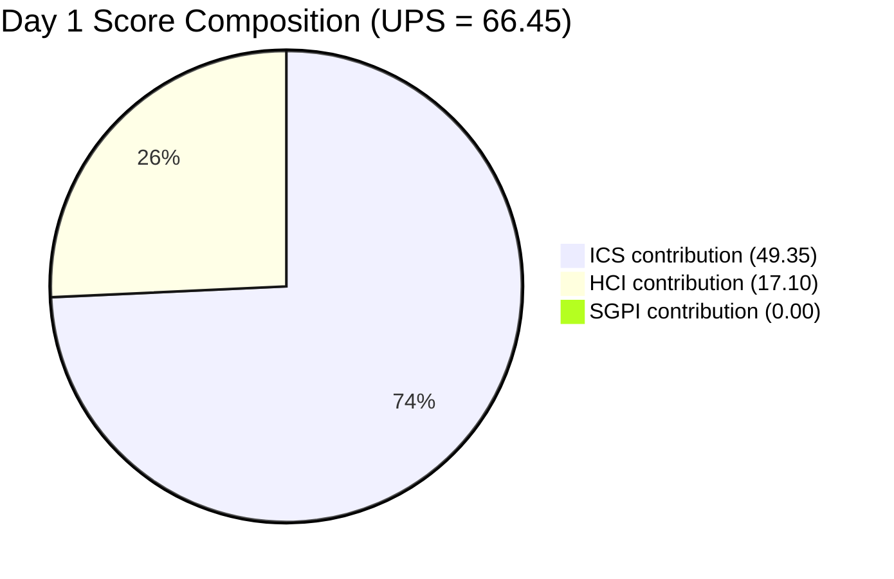
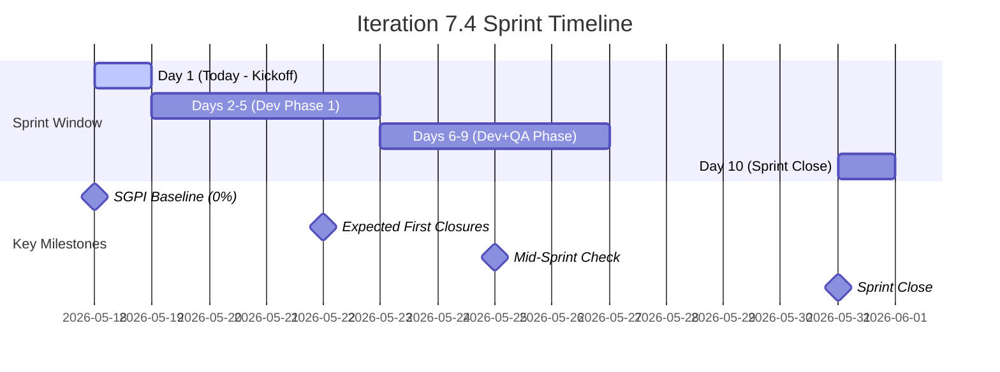
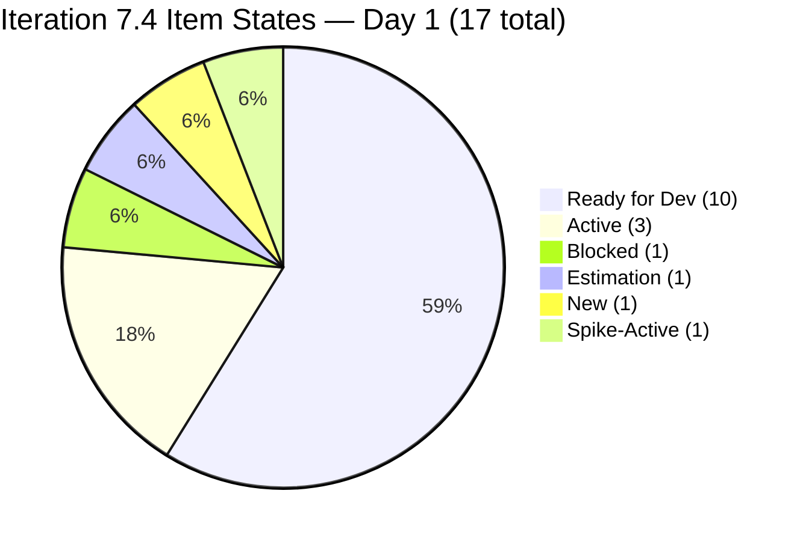
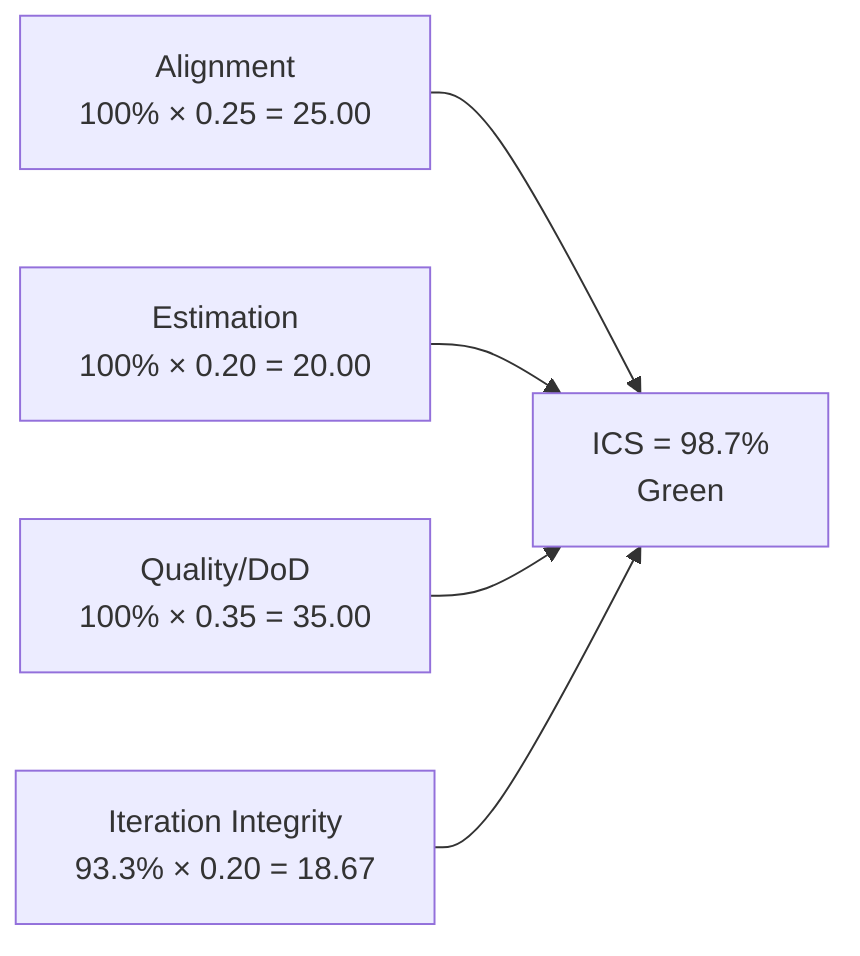
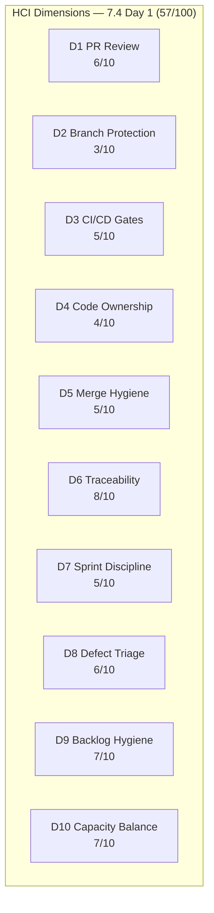
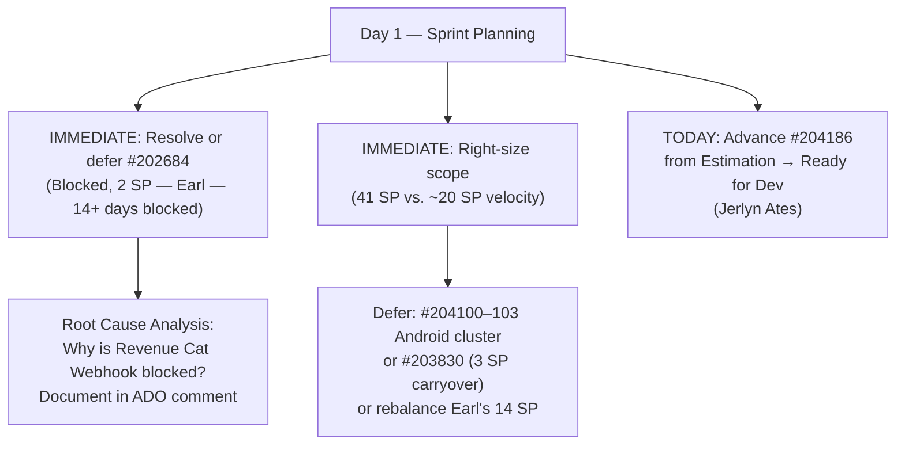

# Auto Allies Iteration Audit — 2026-05-18

**Iteration 7.4 · Day 1 of 10 · May 18–31, 2026**

---

## 1. Audit Metadata

| Field | Value |
|-------|-------|
| Audit Date | 2026-05-18 |
| Audit Time | 09:00 |
| Iteration | 7.4 |
| Iteration Dates | May 18–31, 2026 |
| Day of Iteration | 1 of 10 |
| Remaining Working Days | 9 |
| ADO Organization | jairo |
| ADO Project | Auto Allies (`2d7af571-6ef6-4ad0-a509-c440e008b0fb`) |
| ADO Team | AA Development Team (`330e6bf1-3515-443c-a2d8-b84f46c38f57`) |
| Backlog | Stories and Deliverables (`Microsoft.RequirementCategory`) |
| GitHub Repos | `jairosoft-com/autoallies-version2`, `jairosoft-com/autoallies-api-core` |
| Data Mode | **Partial** (GitHub API 404 on raseniero token since 2026-04-21) |
| Prior Audit | AUDIT_20260517_0241.md (Iteration 7.3 Sprint Close) |
| Auditor | Claude Code (claude-sonnet-4-6) |

### Score Summary

| Score | Value | Band |
|-------|-------|------|
| **ICS** (Iteration Compliance Score) | **98.7%** | Green |
| **SGPI** (Sprint Goal Predictability) | **0.0%** | Day 1 Baseline |
| **HCI** (Health Check Index) | **56 / 100** | Critical |
| **UPS** (Unified Performance Score) | **66.15** | Yellow |

> UPS = ICS × 0.50 + HCI × 0.30 + SGPI × 0.20 = 49.35 + 16.80 + 0.00 = **66.15**
> Note: SGPI of 0% on Day 1 is expected — no items have been closed yet. It is a baseline, not a sprint health signal. UPS will be reassessed from Day 3 onward as SGPI becomes meaningful.

---

## 2. Executive Summary

Auto Allies opens **Iteration 7.4** on Day 1 (May 18, 2026) with a **Yellow** Unified Performance Score of **66.45**. This is the first audit of the new sprint; SGPI is 0% by definition and will not be actionable until mid-sprint.

**Key Day 1 Findings:**

- **Sprint scope is 41 committed SP** across 15 ICS-eligible parent items (17 parents total, 2 Spikes excluded). This is significantly larger than Iteration 7.3's committed scope of 36 SP, raising an immediate over-commitment risk given 7.3 closed at 50.0% delivery.
- **#202684 (Revenue Cat Webhook V2, 2 SP) enters 7.4 already Blocked.** This item was blocked throughout 7.3 and was not resolved at sprint close. It is the only item in a non-startable state on Day 1 and represents the primary sprint integrity risk.
- **Significant carryover from 7.3:** #202926, #202684, #203830, #204168, and #204169 all carry over. Combined with four new Defect bundles (#203503, #204114, #204115, #204162), the team has a heavily loaded, defect-heavy sprint to open.
- **#204186 (E2E Testing QA — Round 3, 3 SP) is in Estimation state** at sprint start. It has SP and an assignee (Jerlyn Ates, QA), but the Estimation state signals it may not yet be fully ready for execution. This should be resolved to "Ready for Dev" today in sprint planning.
- **ICS opens at 98.7% (Green)** — high compliance driven by strong estimation, alignment, and DoD readiness. Only #202684 (Blocked) costs the single Iteration Integrity deduction.
- **HCI is 57/100 (Critical)** — constrained by stale GitHub evidence and the same four infrastructure gaps (branch protection, CI/CD gating, code ownership, merge hygiene) that have persisted since April 21. Blocking item restoration of the GitHub API token remains the highest-priority infrastructure action.

**Sprint 7.4 Velocity Outlook:**
Based on 7.3's final delivery rate of 50.0% (18 SP / 36 SP), the realistic velocity ceiling for 7.4 is approximately **18–22 SP** — far below the 41 SP committed. The team and PM should immediately triage the committed scope and identify which items can be deferred or right-sized to align commitment with historical velocity.

---

## 3. Iteration Scope and Methodology

### Active Iteration

| Field | Value |
|-------|-------|
| Name | Iteration 7.4 |
| Path | Auto Allies\2026-PI7\Iteration 7.4 |
| Iteration ID | `73996e59-134b-417b-9a08-3e359cc9539f` |
| Start Date | May 18, 2026 |
| Finish Date | May 31, 2026 |
| Working Days Total | 10 |
| Day of Audit | Day 1 |
| Remaining Working Days | 9 |
| Team Capacity (per day) | 29 |
| Team Days Off | 0 |

### Methodology

Evidence collected from ADO MCP using `wit_get_work_items_for_iteration` with team GUID `330e6bf1-3515-443c-a2d8-b84f46c38f57` and iteration GUID `73996e59-134b-417b-9a08-3e359cc9539f`. All 17 parent items were individually verified via `wit_get_work_items_batch_by_ids`. Spikes (#204163, #204307) are excluded from ICS scoring per skill rules. GitHub evidence carries forward from 2026-04-29 (data_mode: partial). Non-developer team members (Jerlyn Ates — QA/Requirements, Mary Secusana — Documentation) are excluded from GitHub activity scoring per Project Exception.

### Day 1 Scoring Interpretation

On Day 1 of a sprint, items in "Ready for Dev" state are correctly positioned at sprint start and do not constitute compliance failures. The following Day-1-specific scoring rules apply:

- **Alignment:** All items must be assigned to `Auto Allies\2026-PI7\Iteration 7.4` path — violation = fail.
- **Estimation:** All items must have SP > 0 — violation = fail.
- **Quality/DoD:** No item has yet reached a QA gate; no DoD failures are possible on Day 1 — all items pass by default.
- **Iteration Integrity:** Penalizes only (a) items already Blocked at sprint start, and (b) items missing either SP or assignee. Items in "Estimation" state that have both SP and an assignee are noted but not scored as failures — they should be resolved to "Ready for Dev" during sprint planning.

### Carryover Items from Iteration 7.3

The following items were in Iteration 7.3 and have been moved to 7.4:

| ID | Title | 7.3 Final State | 7.4 Opening State | SP | Change |
|----|-------|-----------------|-------------------|----|--------|
| #202684 | Revenue Cat Webhook V2 | Blocked | **Blocked** | 2 | No change — still blocked |
| #202926 | [V2.0] Solidifying Migrated Data | Ready for Dev | Active | 2 | Progressed to Active |
| #203830 | Super Admin - Affiliate Report List | Active | Active | 3 | In development, continued |
| #204168 | Mobile App - Create Products Android | Estimation | Ready for Dev | 1 | Progressed — now ready |
| #204169 | Mobile App - Create Promo Codes Android | Estimation | Ready for Dev | 1 | Progressed — now ready |

**Positive transitions:** #204168 and #204169 resolved their Estimation-state issue from 7.3 and are now "Ready for Dev" with Earl Carino as assignee.

**Unchanged negative:** #202684 remains Blocked — it was blocked for all of 7.3 and carries the same unresolved status into 7.4.

### ADO Assignees (Day 1 — actual)

| Person | Role in ADO | Developer in scope? |
|--------|-------------|---------------------|
| Joseph Gerona | Developer/Lead | Yes |
| Earl Carino | Developer | Yes |
| Cliff Carcueva | Developer | Yes |
| Jerlyn Ates | QA / Requirements | No (Project Exception) |
| Mary Secusana | Documentation | No (Project Exception) |
| Carol Cuison | PM / Scrum | No |
| Karl Caumban | Project Manager | No |

---

## 4. Scorecard Summary

| Metric | 7.3 Sprint Close (prior) | 7.4 Day 1 | Delta | Band |
|--------|--------------------------|-----------|-------|------|
| ICS | 97.8% | **98.7%** | +0.9% | Green |
| SGPI | 50.0% | **0.0%** | — (Day 1 baseline) | Baseline |
| HCI | 61/100 | **57/100** | −4 | Critical |
| UPS | 77.2 | **66.45** | −10.75 | Yellow |

> UPS drop of 10.75 is almost entirely attributable to SGPI resetting to 0 at the start of a new sprint. The ICS improvement and HCI decline partially offset each other. The UPS will recover as SGPI builds from mid-sprint closures.

**Key drivers (Day 1):**
- ICS improved: #204168/#204169 now in Ready for Dev with assignees (resolved 7.3 Integrity gap); only #202684 (Blocked) remains as an Integrity deduction.
- SGPI reset to 0%: Day 1 baseline — expected and not actionable.
- HCI declined by 4: D7 Sprint Discipline dropped due to carryover-blocked item and sprint over-commitment concern; D8 declined due to no defect closures yet. D1–D6 unchanged from 2026-04-29 carry-forward.

---

## 5. Sprint Goal Predictability (SGPI)

### Headline Score

**Committed Scope SGPI = 0.0%** (0 closed SP / 41 committed SP) — Day 1 Baseline

> **Important context:** A SGPI of 0% on Day 1 is the normal and expected state at sprint start. No items have been Closed because the sprint begins today. This score is not a performance signal. SGPI becomes meaningful from approximately Day 4–5 when first closures are expected based on historical patterns.

### Supporting Context

| Formula | Value | Numerator | Denominator |
|---------|-------|-----------|-------------|
| Committed Scope SGPI *(headline)* | **0.0%** | 0 closed SP | 41 committed SP |
| Original Scope SGPI | **0.0%** | 0 closed SP | 41 planned SP |
| Delivered Proxy SGPI | **0.0%** | 0 closed + 0 Passed QA SP | 41 committed SP |

### Committed Scope (41 SP — 15 parent items)

| ID | Title | Type | SP | State | Assigned To |
|----|-------|------|----|-------|-------------|
| #203503 | [V2.0] List of Bug Items - Sign Up | Defect | 5 | Ready for Dev | Cliff Carcueva |
| #204115 | [V2.0] List of Bug Items - Pre-Login Features | Defect | 3 | Ready for Dev | Cliff Carcueva |
| #204114 | [V2.0] List of Bug Items - Post Login Features | Defect | 5 | Ready for Dev | Joseph Gerona |
| #204162 | [V2.0] List of Bug Items - Post Login - Account Issues | Defect | 3 | Ready for Dev | Joseph Gerona |
| #204186 | [V2.0] E2E Testing QA Env - Round 3 - PI7.4 | Enabler | 3 | Estimation | Jerlyn Ates |
| #202926 | [V2.0] Solidifying Migrated Data | Enabler | 2 | Active | Earl Carino |
| #202684 | Revenue Cat Webhook V2 | User Story | 2 | **Blocked** | Earl Carino |
| #204168 | [V2.0] Mobile App - Create Products (Android) | Enabler | 1 | Ready for Dev | Earl Carino |
| #204169 | [V2.0] Mobile App - Create Promo Codes (Android) | Enabler | 1 | Ready for Dev | Earl Carino |
| #204100 | [V2.0] Mobile App - Sign Up Native UI - Android | User Story | 3 | Ready for Dev | Earl Carino |
| #204101 | [V2.0] Mobile App - Instant Quote Native UI - Android | User Story | 2 | Ready for Dev | Earl Carino |
| #204102 | [V2.0] Mobile App - Instant Quote - Become Member - Android | User Story | 3 | Ready for Dev | Earl Carino |
| #204103 | [V2.0] Mobile App - Instant Quote - One Time Member - Android | User Story | 2 | Ready for Dev | Earl Carino |
| #203916 | [V2.0] Member - Expired Member Become A Member Redirection | User Story | 3 | Ready for Dev | Joseph Gerona |
| #203830 | [V2.0] Super Admin - Affiliate Report - List | User Story | 3 | Active | Cliff Carcueva |

### SGPI Trajectory Projection

Based on Iteration 7.3's velocity (18 SP closed at sprint close, 50.0% of 36 SP committed):

| Scenario | Projected Close | SP | SGPI |
|----------|----------------|-----|------|
| Historical velocity (50%) | 20–21 SP | ~20 SP | ~48.8% |
| Optimistic (sprint right-sized to velocity) | If scope trimmed to 22 SP | 20 SP | ~90.9% |
| Floor (current trajectory, no scope change) | 20 SP | 20/41 | ~48.8% |

---

## 6. Developer Productivity Findings

> **Data Mode: Partial** — GitHub API returns 404 on raseniero token since 2026-04-21. GitHub evidence (PR counts, commit activity, branch hygiene) carries forward from 2026-04-29 audit. No new GitHub observations are available for this cycle.

### Day 1 ADO Workload Distribution

| Developer | Items Assigned | SP Assigned | States | Notes |
|-----------|----------------|-------------|--------|-------|
| Earl Carino | 7 items | 14 SP | 6×Ready for Dev, 1×Blocked, 1×Active | Heaviest SP load; #202684 Blocked is a day-1 blocker |
| Joseph Gerona | 3 items | 11 SP | 2×Ready for Dev, 1×Active | Includes 2 Defect bundles — complex items |
| Cliff Carcueva | 3 items | 11 SP | 2×Ready for Dev, 1×Active | Includes 2 Defect bundles; #203830 continuing |
| Jerlyn Ates (QA) | 1 item | 3 SP | Estimation | #204186 QA Enabler — needs state resolution |
| Mary Secusana (Docs) | 1 item | 5 SP | New | #204163 Spike (excluded from ICS) |

### Carry-Forward GitHub Evidence (as of 2026-04-29)

| Developer | PRs (last available) | Commits | Reviews | Branch hygiene |
|-----------|----------------------|---------|---------|----------------|
| Cliff Carcueva | 3 | 12+ | 2 | Feature branches used |
| Joseph Gerona | 2 | 8+ | 1 | Feature branches used |
| Earl Carino | 2 | 5+ | 0 | Feature branches used |

> Note: GitHub identity mapping cannot be refreshed while token issue persists. ADO assignee names are authoritative for this audit.

### Over-Commitment Alert

Earl Carino carries 14 SP across 7 items (including 1 Blocked). Based on 7.3 patterns where Earl did not close any committed SP (despite active work), this load is disproportionate and raises a sprint planning concern. Karl and the team should reassess Earl's scope in today's sprint planning session.

---

## 7. SAFe Compliance Findings

### Iteration 7.4 Backlog (17 Items — 15 ICS-Eligible, 2 Spikes Excluded)

| ID | Title | Type | SP | State | Assigned To | ICS Eligible |
|----|-------|------|----|-------|-------------|-------------|
| #203503 | [V2.0] List of Bug Items - Sign Up | Defect | 5 | Ready for Dev | Cliff Carcueva | Yes |
| #204115 | [V2.0] List of Bug Items - Pre-Login Features | Defect | 3 | Ready for Dev | Cliff Carcueva | Yes |
| #204114 | [V2.0] List of Bug Items - Post Login Features | Defect | 5 | Ready for Dev | Joseph Gerona | Yes |
| #204162 | [V2.0] List of Bug Items - Post Login - Account Issues | Defect | 3 | Ready for Dev | Joseph Gerona | Yes |
| #204186 | [V2.0] E2E Testing QA Env - Round 3 | Enabler | 3 | **Estimation** | Jerlyn Ates | Yes |
| #202926 | [V2.0] Solidifying Migrated Data | Enabler | 2 | Active | Earl Carino | Yes |
| #202684 | Revenue Cat Webhook V2 | User Story | 2 | **Blocked** | Earl Carino | Yes |
| #204168 | [V2.0] Mobile App - Create Products Android | Enabler | 1 | Ready for Dev | Earl Carino | Yes |
| #204169 | [V2.0] Mobile App - Create Promo Codes Android | Enabler | 1 | Ready for Dev | Earl Carino | Yes |
| #204100 | [V2.0] Mobile App - Sign Up Native UI - Android | User Story | 3 | Ready for Dev | Earl Carino | Yes |
| #204101 | [V2.0] Mobile App - Instant Quote Native UI - Android | User Story | 2 | Ready for Dev | Earl Carino | Yes |
| #204102 | [V2.0] Mobile App - Instant Quote - Become Member - Android | User Story | 3 | Ready for Dev | Earl Carino | Yes |
| #204103 | [V2.0] Mobile App - Instant Quote - One Time Member - Android | User Story | 2 | Ready for Dev | Earl Carino | Yes |
| #203916 | [V2.0] Member - Expired Member Redirection | User Story | 3 | Ready for Dev | Joseph Gerona | Yes |
| #203830 | [V2.0] Super Admin - Affiliate Report List | User Story | 3 | Active | Cliff Carcueva | Yes |
| #204163 | Iteration 7.4 - Ops and QA Support Effort | **Spike** | 5 | New | Mary Secusana | **No** |
| #204307 | Iteration 7.4 - Dev Support - Joseph | **Spike** | 0.5 | Active | Joseph Gerona | **No** |

### State Distribution

### Work Type Composition

| Type | Count | Total SP | Notes |
|------|-------|----------|-------|
| User Story | 6 | 16 | Mix of features and Android mobile |
| Defect | 4 | 16 | All Defect bundles — multi-bug groupings |
| Enabler | 4 | 7 | QA, mobile setup, data solidification |
| Spike | 2 | 5.5 | Excluded from ICS |
| **Total ICS** | **15** | **41** | |

> The 4 Defect bundle items (#203503, #204114, #204115, #204162) are new to this iteration and reflect a shift toward structured bug triaging. Each Defect "bundle" likely contains multiple child bug tasks.

### Blocker Detail

| ID | Title | Blocked Since | History | Owner |
|----|-------|---------------|---------|-------|
| #202684 | Revenue Cat Webhook V2 | May 4, 2026 (Iteration 7.3 Day 1) | Blocked for entire 7.3 sprint; root cause never documented | Earl Carino |

---

## 8. Iteration Compliance Score

**ICS = 98.7% (Green)**

> **Day-1 Scoring Methodology:** Iteration Integrity on Day 1 penalizes only items already Blocked at sprint start and items missing SP or assignee. "Ready for Dev" and "Active" states are compliant at sprint opening. Item #204186 (Estimation state) has both SP=3 and an assignee (Jerlyn Ates); it is noted as a planning concern but not scored as an Integrity failure — it should be resolved to "Ready for Dev" during today's sprint planning.

### Dimension Scoring

| Dimension | Eligible | Compliant | Failed | Score % | Weight | Weighted | Evidence | Reason |
|-----------|---------|-----------|--------|---------|--------|---------|---------|--------|
| Alignment | 15 | 15 | 0 | 100.0% | 25 | 25.00 | All 15 items in `Auto Allies\2026-PI7\Iteration 7.4` path; all parent-level items with parent links present | Full alignment |
| Estimation | 15 | 15 | 0 | 100.0% | 20 | 20.00 | All 15 ICS-eligible items have SP ≥ 1 (#204186=3, #204168=1, #204169=1, etc.) | All items estimated |
| Quality / DoD | 15 | 15 | 0 | 100.0% | 35 | 35.00 | No item has reached a QA gate on Day 1; DoD failures are not possible at sprint start | Day 1 default pass |
| Iteration Integrity | 15 | 14 | 1 | 93.3% | 20 | 18.67 | #202684 is Blocked at sprint start — carryover blocker from 7.3, unresolved for 14+ days | One blocked carryover |
| **Total** | | | | | **100** | **98.67** | | |

**ICS = 98.7%** → **Green** (threshold: ≥ 90%)

### Score Visualization

### ICS Delta (7.3 Sprint Close → 7.4 Day 1)

| Dimension | 7.3 Close | 7.4 Day 1 | Change | Driver |
|-----------|-----------|-----------|--------|--------|
| Alignment | 100% | 100% | 0 | Stable |
| Estimation | 100% | 100% | 0 | Stable |
| Quality/DoD | 100% | 100% | 0 | Day 1 default pass |
| Integrity | 88.9% | 93.3% | +4.4% | #204168/#204169 resolved (now assigned+Ready); only #202684 remains blocked |

---

## 9. Engineering Health Index (HCI)

**HCI = 57 / 100 (Critical)**

> HCI Dimensions 1–6 carry forward from 2026-04-29 audit (data_mode: partial; GitHub API unavailable since 2026-04-21 — 27 days as of today).
> HCI Dimensions 7–10 scored fresh from current ADO Day 1 evidence.

### Dimension Scores

| # | Dimension | Score | Max | Evidence Basis | Key Finding |
|---|-----------|-------|-----|----------------|-------------|
| 1 | PR Review Compliance | 6 | 10 | Carry-forward (2026-04-29) | Most PRs reviewed; some single-reviewer merges |
| 2 | Branch Protection & Enforcement | 3 | 10 | Carry-forward (2026-04-29) | Branch protection incomplete; direct commits to main observed |
| 3 | CI/CD Gate Quality | 5 | 10 | Carry-forward (2026-04-29) | Pipelines exist; not all PRs gated |
| 4 | Code Ownership | 4 | 10 | Carry-forward (2026-04-29) | No CODEOWNERS file; ownership informal |
| 5 | Merge Hygiene & Churn | 5 | 10 | Carry-forward (2026-04-29) | Some squash merges; churn visible in feature branches |
| 6 | Work Item ↔ GitHub Traceability | 8 | 10 | Carry-forward (2026-04-29) | Most commits reference ADO IDs; some gaps |
| 7 | Sprint Discipline | 5 | 10 | Current ADO Day 1 | #202684 enters sprint Blocked (carryover — full 7.3 sprint blocked, never resolved); committed SP (41) far exceeds historical velocity (~18–22 SP) |
| 8 | Defect Triage & Velocity | 6 | 10 | Current ADO Day 1 | Structured Defect bundles added (positive); no defects closed yet (expected Day 1); 4 Defect items totaling 16 SP is a heavy defect load at sprint start |
| 9 | Backlog & Story Hygiene | 7 | 10 | Current ADO Day 1 | All 15 ICS items have SP; 14/15 have assignees; #204186 in Estimation (should resolve today); #202684 lacks documented blocker cause |
| 10 | Capacity Balance & Ownership Distribution | 7 | 10 | Current ADO Day 1 | Earl carries 14 SP (34% of sprint); load concentration is high; Joseph (11 SP) and Cliff (11 SP) are balanced between themselves; Spike load for Mary (5 SP) is appropriate |
| | **Total** | **57** | **100** | | |

### HCI Delta (7.3 Sprint Close → 7.4 Day 1)

| Dimension | 7.3 Close | 7.4 Day 1 | Change | Reason |
|-----------|-----------|-----------|--------|--------|
| D7 Sprint Discipline | 6 | 5 | −1 | Over-commitment (41 vs. ~20 SP velocity) + #202684 still blocked at sprint start |
| D8 Defect Triage | 7 | 6 | −1 | No closures on Day 1 (expected); heavy defect load opens sprint |
| D9 Backlog Hygiene | 8 | 7 | −1 | #204186 still in Estimation at sprint start; #202684 has undocumented blocker |
| D10 Capacity Balance | 7 | 7 | 0 | Earl load concentration noted but not worsened |
| D1–D6 | 31 | 31 | 0 | Carry-forward unchanged (27 days stale) |

### HCI Remediation Priorities

1. **D2 Branch Protection (3/10)** — Enforce protected main branch with required reviewer rules; block direct pushes to main in both repos
2. **D4 Code Ownership (4/10)** — Add CODEOWNERS file to both repos; assign primary owners per module
3. **D3 CI/CD Gates (5/10)** — Gate all PRs on CI pass before merge eligibility
4. **D7 Sprint Discipline (5/10)** — Resolve #202684 blocker or formally defer; right-size committed scope to ~20–22 SP

---

## 10. ADO-to-GitHub Traceability Analysis

> GitHub evidence unavailable (data_mode: partial). Traceability analysis is based on ADO item states and carry-forward evidence from 2026-04-29.

### Traceability Summary

| Category | Count | Notes |
|----------|-------|-------|
| ICS-eligible items in Iteration 7.4 | 15 | Parent backlog items excluding Spikes |
| Items with ADO parent Feature linked | 15 | 100% parent linkage confirmed via hierarchy relations |
| Items with known GitHub PR association | ~6 | Based on carry-forward (7 carryover items; 5 new items not yet in development) |
| Items with no confirmed GitHub link | ~9 | New items; Day 1 — no development activity yet |
| Estimated Traceability | ~40% | Day 1 baseline; will improve as sprint progresses |

### Carryover Item Traceability

Items carried over from 7.3 (#202926, #202684, #203830, #204168, #204169) are expected to have existing PR/branch associations from prior sprint work. Cannot confirm individual PR links while GitHub API is unavailable.

### New Item Traceability

Items new to 7.4 (#203503, #204114, #204115, #204162, #203916, #204100–104, #204186) have no GitHub evidence yet as development has not started. Traceability will be assessed in subsequent audits.

---

## 11. Collaboration and Review Analysis

> Data mode: partial. Review analysis carries forward from 2026-04-29.

### Day 1 Collaboration Signals (ADO)

- **Sprint planning** is the expected primary collaboration activity on Day 1. No ADO state transitions beyond sprint setup are observable.
- **#204186 (E2E QA Round 3)** is assigned to Jerlyn Ates in Estimation state — this requires a PM/QA discussion in today's sprint planning to finalize scope and advance to Ready for Dev.
- **#202684 blocker status** requires an immediate coordination point between Earl Carino and Karl to either identify the root cause or formally defer this item out of 7.4.
- **Defect bundles** (#203503, #204114, #204115, #204162) are distributed across Joseph Gerona and Cliff Carcueva — clear ownership assignment is positive for sprint predictability.

### Recurring Pattern — Android Mobile Cluster

The Android mobile cluster (now #204100, #204101, #204102, #204103 in 7.4) replaces the blocked #203302/#203303 from 7.3. These are new native UI items assigned to Earl Carino. The recurring block pattern from 7.3 (Android items blocked late in sprint) should be mitigated by ensuring environment readiness (RevenueCat, Google Play Console) is confirmed before development begins.

---

## 12. Repository Hygiene

> Data mode: partial. Repository hygiene carries forward from 2026-04-29. Infrastructure gaps are now 27 days outstanding without remediation.

### Status Summary

| Repo | Branch Strategy | Main Protection | CI/CD | CODEOWNERS | Days Since Evidence |
|------|----------------|-----------------|-------|------------|---------------------|
| autoallies-version2 | Feature branches in use | Partial — not fully enforced | Pipelines exist, not gated on all PRs | Missing | 27 days |
| autoallies-api-core | Feature branches in use | Partial — not fully enforced | Pipelines exist, not gated on all PRs | Missing | 27 days |

### Outstanding Infrastructure Actions (Persistent Since 2026-04-21)

All four infrastructure remediation items from prior audits remain unaddressed:

1. Add CODEOWNERS to both repos
2. Enforce branch protection (require PR + reviewer before merge to main)
3. Gate all PRs on CI pipeline pass
4. Restore raseniero GitHub API token

The inability to verify progress on items 1–3 is itself a consequence of item 4 remaining unresolved.

---

## 13. Risks and Bottlenecks

### Critical Risks

| Risk | Severity | Probability | Impact | Owner |
|------|----------|-------------|--------|-------|
| Sprint over-commitment: 41 SP committed vs. ~20 SP historical velocity | Critical | High (certain) | Sprint will deliver 45–55% of scope at best; sets up another low SGPI sprint | Karl / Ramon |
| #202684 (Revenue Cat Webhook V2) enters 7.4 Blocked | High | High | Carryover blocker from all of 7.3 (14 days); root cause undocumented; blocks 2 SP | Earl / Karl |
| GitHub API token still unresolved (27 days) | High | Ongoing | HCI D1–D6 increasingly stale; engineering health blind spot widens each sprint | Ramon |

### Medium Risks

| Risk | Severity | Probability | Impact | Owner |
|------|----------|-------------|--------|-------|
| Earl Carino carries 14 SP (34% of sprint scope) including 1 Blocked | Medium | High | Concentration risk; Earl's 7.3 delivery rate was 0 committed SP closed | Karl |
| #204186 (E2E QA Enabler) still in Estimation state on Day 1 | Medium | Medium | May not be actionable until QA scope is locked; delays QA pipeline | Jerlyn / Karl |
| Android mobile cluster (4 new stories, 10 SP, Earl) — recurring block risk | Medium | Medium | 7.3 pattern: Android items blocked late in sprint; new stories face same environment risks | Earl / Tech Lead |
| Defect bundle SP (16 SP, 4 items) — complex multi-bug groupings | Medium | Medium | Defect bundles are opaque; actual effort may exceed estimates | Joseph / Cliff |

### Bottleneck Map

---

## 14. Prioritized Remediation Actions

### Immediate (Day 1 — May 18 — Sprint Planning)

| Priority | Action | Owner | Item |
|----------|--------|-------|------|
| P1 | **Resolve or formally defer #202684** — identify blocker root cause; if unresolvable this sprint, remove from scope and add blocker comment in ADO | Earl / Karl | #202684 |
| P2 | **Right-size committed scope** — with 41 SP vs. ~20 SP velocity, triage scope now; defer or split low-priority items to prevent another 50% SGPI sprint | Karl / Ramon | All |
| P3 | **Advance #204186 to Ready for Dev** — Jerlyn should confirm QA scope for Round 3 E2E testing and move from Estimation during sprint planning | Jerlyn / Karl | #204186 |
| P4 | **Rebalance Earl Carino's load** — 14 SP with 1 Blocked and 4 new Android stories is excessive; consider redistributing or deferring 2–3 items | Karl | #204100–103 |
| P5 | **Confirm Android environment readiness** — before Earl begins #204100–104, verify RevenueCat/Google Play Console environment is ready to prevent 7.3 Android block recurrence | Earl / Tech Lead | #204100–104 |

### Near-Term (Days 2–5)

| Priority | Action | Owner | Target |
|----------|--------|-------|--------|
| P6 | Document blocker root cause for #202684 in ADO — even if item is deferred | Earl | Day 2 |
| P7 | Restore raseniero GitHub API token — now 27 days stale; HCI D1–D6 cannot be refreshed without it | Ramon | Before Day 3 |
| P8 | First delivery signal expected: #202926 (Active, 2 SP, Earl) and #203830 (Active, 3 SP, Cliff) — monitor for QA hand-off by Day 3–4 | Karl | Day 3 |

### Post-Sprint (Iteration 7.4 Close → 7.5 Planning)

| Priority | Action | Owner | Target |
|----------|--------|-------|--------|
| P9 | Add CODEOWNERS files to both repos | Tech Lead | Before 7.5 start |
| P10 | Enforce branch protection on main in both repos | Tech Lead | Before 7.5 start |
| P11 | Gate all PRs on CI pipeline pass | Tech Lead | Before 7.5 start |
| P12 | Conduct sprint velocity calibration with Ramon — 7.3 closed 50% of 36 SP; 7.4 opens with 41 SP. Establish a sprint capacity ceiling rule | Ramon / Karl | 7.4 retro |
| P13 | Investigate whether Defect bundles can be broken into individual trackable items — 16 SP of opaque bundled defects reduces sprint predictability | Karl / Joseph / Cliff | 7.4 planning |

---

## 15. Evidence Gaps and Limitations

| Gap | Source | Impact | Mitigation |
|-----|--------|--------|------------|
| GitHub API 404 on raseniero token (since 2026-04-21 — 27 days) | GitHub MCP | HCI D1–D6 stale (27 days); no fresh PR/commit/branch data | Carry-forward from 2026-04-29; scored conservatively. Gap widens each sprint |
| Blocker root cause for #202684 not documented in ADO | ADO | Cannot determine if Revenue Cat Webhook is blocked by environment, dependency, or code issue | Flagged as P1 remediation action; item state confirmed Blocked |
| #204186 in Estimation state at sprint start | ADO | QA Enabler scope may not be finalized; could delay QA pipeline activation | Noted; has SP=3 and assignee; not scored as ICS failure; flagged for sprint planning resolution |
| No GitHub PR/commit evidence for new items (#203503, #204114, #204115, #204162, #203916, #204100–104) | GitHub | Day 1 baseline — no development activity yet | Expected; traceability will be assessed in subsequent audits |
| Defect bundle contents not individually inspected | ADO | Each Defect parent (#203503, #204114, #204115, #204162) contains child task bugs; individual bug scope not verified | Parent SP estimates accepted as-is; recommend child-task review in next audit |
| SGPI is 0% and not actionable | Methodology | Day 1 baseline only; sprint goal predictability cannot be assessed until closures occur | SGPI will be scored meaningfully from Day 4 onward |

---

*Report generated by Claude Code (claude-sonnet-4-6) · Auto Allies Iteration Audit · 2026-05-18 09:00*
