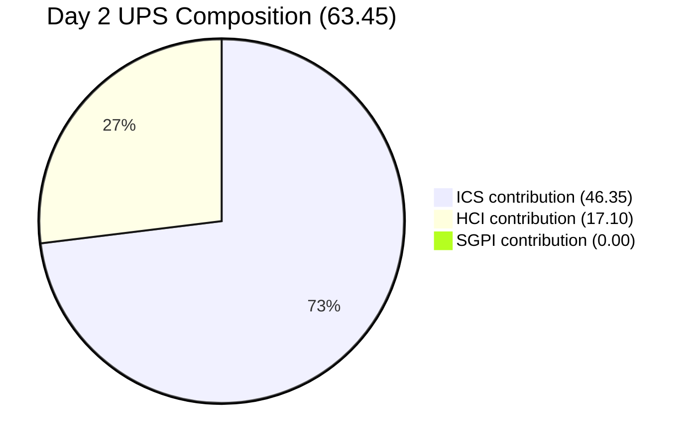
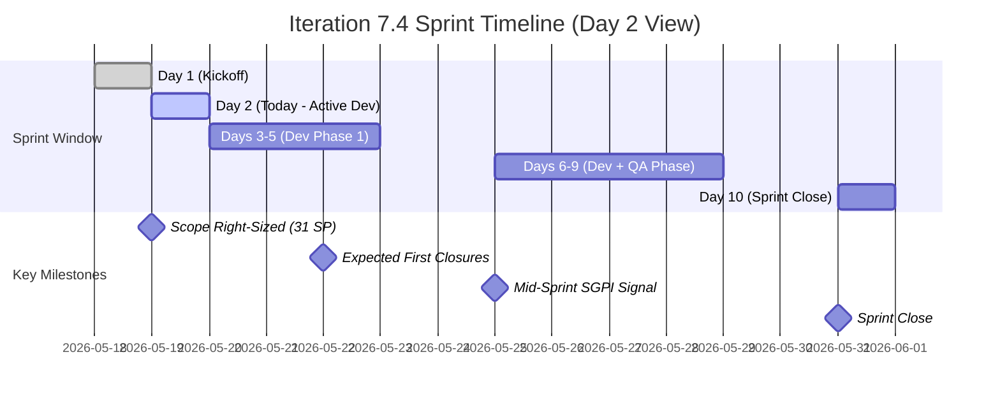
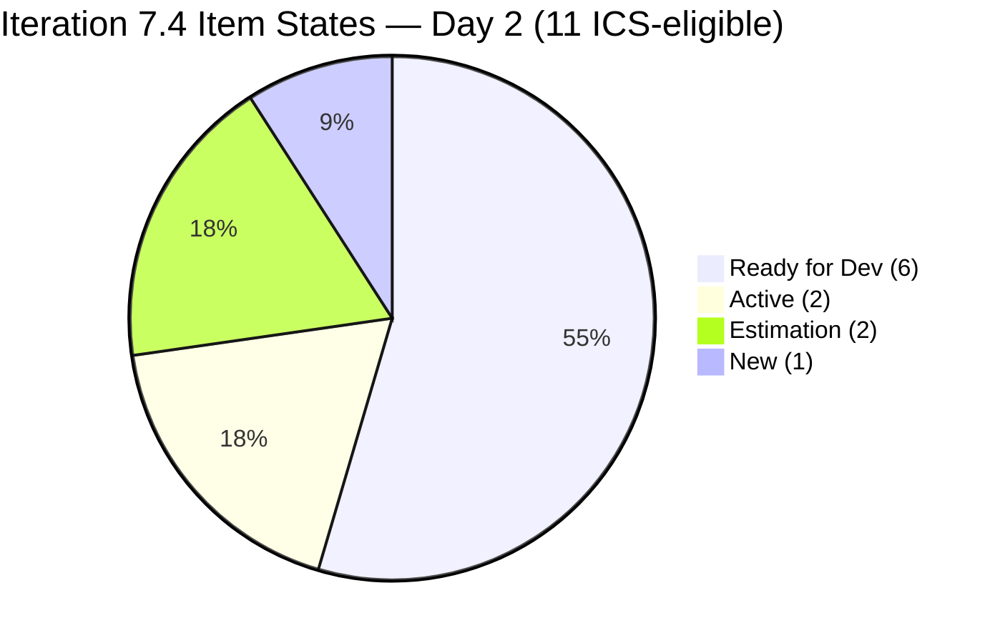
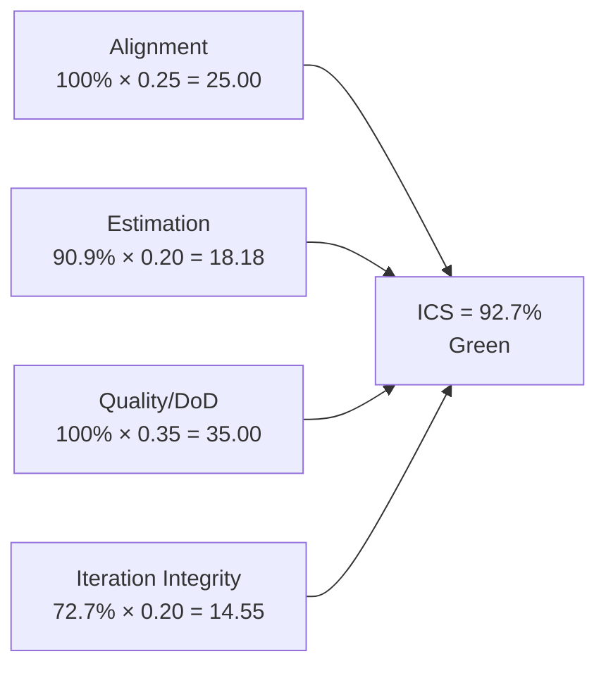
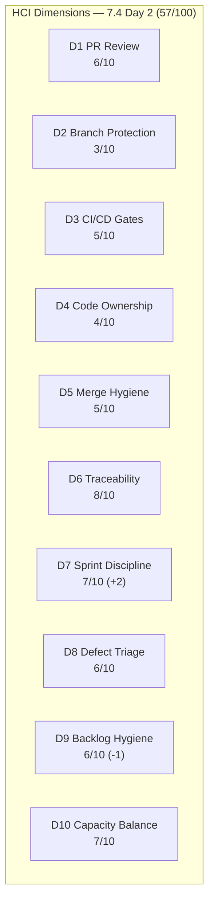
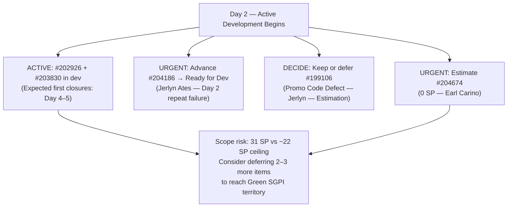

# Auto Allies Iteration Audit — 2026-05-19

**Iteration 7.4 · Day 2 of 10 · May 18–31, 2026**

---

## 1. Audit Metadata

| Field | Value |
|-------|-------|
| Audit Date | 2026-05-19 |
| Audit Time | 02:41 |
| Iteration | 7.4 |
| Iteration Dates | May 18–31, 2026 |
| Day of Iteration | 2 of 10 |
| Remaining Working Days | 8 |
| ADO Organization | jairo |
| ADO Project | Auto Allies (`2d7af571-6ef6-4ad0-a509-c440e008b0fb`) |
| ADO Team | AA Development Team (`330e6bf1-3515-443c-a2d8-b84f46c38f57`) |
| Backlog | Stories and Deliverables (`Microsoft.RequirementCategory`) |
| GitHub Repos | `jairosoft-com/autoallies-version2`, `jairosoft-com/autoallies-api-core` |
| Data Mode | **Partial** (GitHub API 401 Bad credentials on raseniero token since 2026-04-21) |
| Prior Audit | AUDIT_20260518_0900.md (Iteration 7.4, Day 1) |
| Auditor | Claude Code (claude-sonnet-4-6) |

### Score Summary

| Score | Value | Band |
|-------|-------|------|
| **ICS** (Iteration Compliance Score) | **92.7%** | Green |
| **SGPI** (Sprint Goal Predictability) | **0.0%** | Day 2 Baseline |
| **HCI** (Health Check Index) | **57 / 100** | Critical |
| **UPS** (Unified Performance Score) | **63.45** | Yellow |

> UPS = ICS × 0.50 + HCI × 0.30 + SGPI × 0.20 = 46.35 + 17.10 + 0.00 = **63.45**
> Note: SGPI of 0% on Day 2 is not yet actionable — first closures are not typically expected before Day 4–5. UPS will be reassessed from Day 3 onward.

---

## 2. Executive Summary

Auto Allies enters **Day 2 of Iteration 7.4** with a **Yellow** Unified Performance Score of **63.45**. The headline story is a significant positive sprint scope right-sizing action completed since Day 1: the team formally deferred the long-standing blocked item (#202684 Revenue Cat Webhook V2) and the entire Android mobile cluster (#204100–103, #204168, #204169) to PI8 Iteration 8.1, reducing committed scope from **41 SP to 31 SP** — much closer to the team's historical velocity ceiling of ~20–22 SP.

**Key Day 2 Findings:**

- **Sprint scope right-sizing: 41 SP → 31 SP.** The team resolved the single largest Day 1 risk by deferring 12 SP (Earl Carino's overloaded Android cluster and the persistent Revenue Cat blocker) to PI8. This action improves sprint integrity and gives the team a realistic delivery target.
- **#202684 (Revenue Cat Webhook V2, Blocked) formally deferred to PI8\Iteration 8.1.** This item was blocked for the entirety of Iteration 7.3 and had no path to closure in 7.4. Its deferral is the correct SAFe response.
- **Three new/replacement items added to 7.4:** #199106 (Defect, 1 SP, Jerlyn Ates, Estimation), #201378 (User Story — Update Public Landing Pages, 3 SP, Earl Carino, Ready for Dev), and #204674 (Enabler — Update Migration Script, **0 SP**, Earl Carino, New). #204674 is missing story point estimation, which is an ICS compliance failure on Day 2.
- **Two items remain in Estimation state on Day 2:** #204186 (E2E QA Round 3, 3 SP, Jerlyn Ates — flagged on Day 1 for same issue) and #199106 (Promo Code Defect, 1 SP, Jerlyn Ates — added today). Sprint planning should have resolved #204186 by now. Both items are scored as Integrity failures per Day 2 methodology.
- **ICS drops from 98.7% to 92.7% (Green)** — still in the Green band but down 6 points driven by the three non-compliant new/remaining items. The sprint planning window has closed; Estimation state is no longer grace-period compliant.
- **HCI holds at 57/100 (Critical)** — D7 (Sprint Discipline) improves by 2 points from the scope right-sizing action; D9 (Backlog Hygiene) declines by 1 from unresolved Estimation items. D1–D6 remain stale carry-forward.
- **GitHub API remains inaccessible** (401 Bad credentials, 29 days since 2026-04-21). HCI D1–D6 carry forward from 2026-04-29 for the third consecutive audit.

---

## 3. Iteration Scope and Methodology

### Active Iteration

| Field | Value |
|-------|-------|
| Name | Iteration 7.4 |
| Path | Auto Allies\2026-PI7\Iteration 7.4 |
| Iteration ID | `73996e59-134b-417b-9a08-3e359cc9539f` |
| Start Date | May 18, 2026 |
| Finish Date | May 31, 2026 |
| Working Days Total | 10 |
| Day of Audit | Day 2 |
| Remaining Working Days | 8 |
| Team Capacity (per day) | 29 |
| Team Days Off | 0 |

### Methodology

Evidence collected from ADO MCP using `wit_get_work_items_for_iteration` with team GUID `330e6bf1-3515-443c-a2d8-b84f46c38f57` and iteration GUID `73996e59-134b-417b-9a08-3e359cc9539f`. All 13 parent items were individually verified via `wit_get_work_items_batch_by_ids`. Items removed since Day 1 (#202684, #204100–103, #204168, #204169) were individually confirmed via `wit_get_work_item` to have been reassigned to `PI8\Iteration 8.1`. Spikes (#204163, #204307) are excluded from ICS scoring per skill rules. GitHub evidence carries forward from 2026-04-29 (data_mode: partial). Non-developer team members (Jerlyn Ates — QA/Requirements, Mary Secusana — Documentation) are excluded from GitHub activity scoring per Project Exception.

### Day 2 Scoring Methodology (Key Shift from Day 1)

On Day 1, items in "Estimation" state were given grace (not penalized for Integrity) if they had SP > 0 and an assignee, on the basis that sprint planning was still in progress. **On Day 2, the sprint planning window is presumed closed.** The following Day 2 scoring rules apply:

- **Alignment:** All items must be assigned to `Auto Allies\2026-PI7\Iteration 7.4` path — violation = fail.
- **Estimation:** All items must have SP > 0 — violation = fail. (#204674 has 0 SP — fails.)
- **Quality/DoD:** No item has yet reached a QA gate on Day 2 — all items pass by default.
- **Iteration Integrity:** Items still in "Estimation" or "New" state after sprint planning are scored as failures. Grace period from Day 1 no longer applies. (#204186 and #199106 in Estimation = fail; #204674 in New with 0 SP = fail.)

### Sprint Scope Delta: Day 1 → Day 2

| Change | Items | SP Impact | Action |
|--------|-------|-----------|--------|
| **Removed from 7.4** | #202684 (Revenue Cat Webhook) | −2 SP | Moved to PI8\Iteration 8.1 (still Blocked) |
| **Removed from 7.4** | #204100–103 (Android mobile cluster) | −10 SP | Moved to PI8\Iteration 8.1 |
| **Removed from 7.4** | #204168, #204169 (Android mobile setup) | −2 SP | Moved to PI8\Iteration 8.1 |
| **Added to 7.4** | #199106 (Promo Code Defect) | +1 SP | Added in Estimation state by Jerlyn Ates |
| **Added to 7.4** | #201378 (Update Public Landing Pages) | +3 SP | Added in Ready for Dev (Earl Carino) |
| **Added to 7.4** | #204674 (Update Migration Script) | +0 SP | Added in New state, **missing estimation** — created today by Jerlyn Ates |
| **Net change** | | **−12 SP net (41→29 from deferrals, +4 from adds = 31 committed)** | Scope right-sized |

> **Committed scope is now 31 SP** across 11 ICS-eligible parent items (13 total, 2 Spikes excluded).

### Current ADO Assignees (Day 2)

| Person | Role in ADO | Developer in scope? | Items | SP |
|--------|-------------|---------------------|-------|----|
| Joseph Gerona | Developer/Lead | Yes | 2 | 8 |
| Earl Carino | Developer | Yes | 4 | 8 |
| Cliff Carcueva | Developer | Yes | 3 | 11 |
| Jerlyn Ates | QA / Requirements | No (Project Exception) | 2 | 4 |
| Mary Secusana | Documentation | No (Project Exception) | 1 | 5 (Spike) |

---

## 4. Scorecard Summary

| Metric | 7.4 Day 1 (prior) | 7.4 Day 2 | Delta | Band |
|--------|-------------------|-----------|-------|------|
| ICS | 98.7% | **92.7%** | −6.0% | Green |
| SGPI | 0.0% | **0.0%** | 0 (Day 2 baseline) | Baseline |
| HCI | 57/100 | **57/100** | 0 | Critical |
| UPS | 66.15 | **63.45** | −2.70 | Yellow |

**Key score drivers (Day 2):**
- **ICS declined by 6.0%:** Three non-compliant items (#204674 no SP, #204186/#199106 still Estimation post-planning). Day 1 grace no longer applies.
- **SGPI unchanged at 0%:** Day 2 baseline — expected. First closures anticipated Day 4–5.
- **HCI flat at 57:** D7 Sprint Discipline gains 2 points from scope right-sizing; D9 Backlog Hygiene loses 1 from unresolved Estimation items. Net: 0.
- **UPS net −2.70:** ICS decline drives the small drop; SGPI and HCI were neutral.

---

## 5. Sprint Goal Predictability (SGPI)

### Headline Score

**Committed Scope SGPI = 0.0%** (0 closed SP / 31 committed SP) — Day 2 Baseline

> **Important context:** A SGPI of 0% on Day 2 is the normal and expected state at sprint start. No items have been Closed because development is in its first full day. This score is not a performance signal. SGPI becomes meaningful from approximately Day 4–5 when first closures are expected based on historical patterns.

### Supporting Context

| Formula | Value | Numerator | Denominator |
|---------|-------|-----------|-------------|
| Committed Scope SGPI *(headline)* | **0.0%** | 0 closed SP | 31 committed SP |
| Original Scope SGPI | **0.0%** | 0 closed SP | 31 planned SP |
| Delivered Proxy SGPI | **0.0%** | 0 closed + 0 Passed QA SP | 31 committed SP |

### Revised Committed Scope (31 SP — 11 ICS-eligible parent items)

| ID | Title | Type | SP | State | Assigned To |
|----|-------|------|----|-------|-------------|
| #203503 | [V2.0] List of Bug Items - Sign Up | Defect | 5 | Ready for Dev | Cliff Carcueva |
| #204115 | [V2.0] List of Bug Items - Pre-Login Features | Defect | 3 | Ready for Dev | Cliff Carcueva |
| #204114 | [V2.0] List of Bug Items - Post Login Features | Defect | 5 | Ready for Dev | Joseph Gerona |
| #204162 | [V2.0] List of Bug Items - Post Login - Account Issues | Defect | 3 | Ready for Dev | Earl Carino |
| #204186 | [V2.0] E2E Testing QA Env - Round 3 - PI7.4 | Enabler | 3 | **Estimation** | Jerlyn Ates |
| #202926 | [V2.0] Solidifying Migrated Data | Enabler | 2 | Active | Earl Carino |
| #203916 | [V2.0] Member - Expired Member Become A Member Redirection | User Story | 3 | Ready for Dev | Joseph Gerona |
| #203830 | [V.20] Super Admin - Affiliate Report - Affiliate List and Info | User Story | 3 | Active | Cliff Carcueva |
| #199106 | [V2.0] Apply Promo Code Discounts to Sub Total | Defect | 1 | **Estimation** | Jerlyn Ates |
| #201378 | [V2.0] Update Public Landing Pages | User Story | 3 | Ready for Dev | Earl Carino |
| #204674 | [V2.0] Update Migration Script for Affiliate Accounts | Enabler | **0** | **New** | Earl Carino |

### SGPI Trajectory Projection (Revised for 31 SP)

Based on Iteration 7.3's velocity (18 SP closed at sprint close, 50.0% of 36 SP committed) and 7.4 right-sized to 31 SP:

| Scenario | Projected Close | SP | SGPI |
|----------|----------------|-----|------|
| Historical velocity (50%) | ~15–16 SP | 15 SP | ~48.4% |
| Optimistic (improved velocity post right-sizing) | ~20 SP | 20 SP | ~64.5% |
| Green threshold (full right-sizing to velocity) | If scope trimmed to 20 SP | 18 SP | ~90% |

> The 31 SP scope is still above the estimated velocity ceiling (~22 SP). A further trim of ~9 SP during the sprint (or deferral of lower-priority items) would make a Green SGPI achievable.

---

## 6. Developer Productivity Findings

> **Data Mode: Partial** — GitHub API returns 401 Bad credentials on raseniero token since 2026-04-21 (29 days). GitHub evidence (PR counts, commit activity, branch hygiene) carries forward from 2026-04-29 audit. No new GitHub observations are available for this cycle.

### Day 2 ADO Workload Distribution (Post-Right-Sizing)

| Developer | Items Assigned | SP Assigned | States | Notes |
|-----------|----------------|-------------|--------|-------|
| Cliff Carcueva | 3 items | 11 SP | 2×Ready for Dev, 1×Active | Highest dev SP load; all items well-positioned |
| Joseph Gerona | 2 items | 8 SP | 1×Ready for Dev, 1×Active (#203830 is actually Cliff's) | 2 user-facing items; manageable |
| Earl Carino | 4 items | 8 SP | 1×Ready for Dev, 1×Active, 1×Estimation, 1×New-0SP | Rebalanced from Day 1's 14 SP; #204674 needs estimation |
| Jerlyn Ates (QA) | 2 items | 4 SP | 2×Estimation | Both QA items still in Estimation — needs immediate action |
| Mary Secusana (Docs) | 1 Spike | 5 SP | New | Ops/QA support spike — expected |

> **Notable improvement:** Earl Carino's load dropped from 14 SP (Day 1) to 8 SP (Day 2) after the Android cluster deferral. The workload is now much more balanced across developers. Cliff carries the highest developer SP at 11 SP.

### Carry-Forward GitHub Evidence (as of 2026-04-29)

| Developer | PRs (last available) | Commits | Reviews | Branch hygiene |
|-----------|----------------------|---------|---------|----------------|
| Cliff Carcueva | 3 | 12+ | 2 | Feature branches used |
| Joseph Gerona | 2 | 8+ | 1 | Feature branches used |
| Earl Carino | 2 | 5+ | 0 | Feature branches used |

> Note: GitHub identity mapping cannot be refreshed while token issue persists.

---

## 7. SAFe Compliance Findings

### Iteration 7.4 Backlog (13 Items — 11 ICS-Eligible, 2 Spikes Excluded)

| ID | Title | Type | SP | State | Assigned To | ICS Eligible | Compliance |
|----|-------|------|----|-------|-------------|-------------|------------|
| #203503 | [V2.0] List of Bug Items - Sign Up | Defect | 5 | Ready for Dev | Cliff Carcueva | Yes | Compliant |
| #204115 | [V2.0] List of Bug Items - Pre-Login Features | Defect | 3 | Ready for Dev | Cliff Carcueva | Yes | Compliant |
| #204114 | [V2.0] List of Bug Items - Post Login Features | Defect | 5 | Ready for Dev | Joseph Gerona | Yes | Compliant |
| #204162 | [V2.0] List of Bug Items - Post Login Account Issues | Defect | 3 | Ready for Dev | Earl Carino | Yes | Compliant |
| #204186 | [V2.0] E2E Testing QA - Round 3 - PI7.4 | Enabler | 3 | **Estimation** | Jerlyn Ates | Yes | **Integrity Fail** |
| #202926 | [V2.0] Solidifying Migrated Data | Enabler | 2 | Active | Earl Carino | Yes | Compliant |
| #203916 | [V2.0] Member - Expired Member Redirection | User Story | 3 | Ready for Dev | Joseph Gerona | Yes | Compliant |
| #203830 | [V.20] Super Admin - Affiliate Report List | User Story | 3 | Active | Cliff Carcueva | Yes | Compliant |
| #199106 | [V2.0] Apply Promo Code Discounts | Defect | 1 | **Estimation** | Jerlyn Ates | Yes | **Integrity Fail** |
| #201378 | [V2.0] Update Public Landing Pages | User Story | 3 | Ready for Dev | Earl Carino | Yes | Compliant |
| #204674 | [V2.0] Update Migration Script for Affiliate Accounts | Enabler | **0** | **New** | Earl Carino | Yes | **Estimation + Integrity Fail** |
| #204163 | Iteration 7.4 - Operations and QA Support Effort | **Spike** | 5 | New | Mary Secusana | **No** | Excluded |
| #204307 | Iteration 7.4 Dev Support - Joseph | **Spike** | 0.5 | Active | Joseph Gerona | **No** | Excluded |

### State Distribution (Day 2)

### Work Type Composition

| Type | Count | Total SP | Notes |
|------|-------|----------|-------|
| User Story | 3 | 9 | Landing pages, member redirection, affiliate report |
| Defect | 4 | 16 | Multi-bug bundles; Promo Code Defect still in Estimation |
| Enabler | 4 | 8 | Migration script (0 SP), Solidifying Data, QA E2E, + new |
| Spike | 2 | 5.5 | Excluded from ICS |
| **Total ICS** | **11** | **31** | **#204674 counted at 0 SP for Estimation dimension** |

### Non-Compliance Details

| ID | Issue | Day 1 Status | Day 2 Status | Severity |
|----|-------|--------------|--------------|----------|
| #204186 | Still in Estimation — Day 1 flagged for sprint planning resolution | Estimation (Day 1 grace) | **Estimation (Day 2 failure)** | High |
| #199106 | Added today in Estimation state — not sprint-ready | N/A (new) | **Estimation (Day 2 failure)** | Medium |
| #204674 | Added today with 0 SP — no estimation at all | N/A (new) | **New + 0 SP (Day 2 failure)** | High |

---

## 8. Iteration Compliance Score

**ICS = 92.7% (Green)**

> **Day-2 Scoring Methodology Shift:** The sprint planning grace period that allowed "Estimation"-state items to pass Integrity on Day 1 no longer applies. Items must be in a Ready-for-Dev-or-better state with SP > 0 to be considered sprint-ready on Day 2. Three items fail this standard: #204186 (Estimation, second consecutive audit failure), #199106 (Estimation, newly added), and #204674 (New, 0 SP, newly added — also fails Estimation dimension).

### Dimension Scoring

| Dimension | Eligible | Compliant | Failed | Score % | Weight | Weighted | Evidence | Failures |
|-----------|---------|-----------|--------|---------|--------|---------|---------|---------|
| Alignment | 11 | 11 | 0 | 100.0% | 25 | 25.00 | All 11 items in `Auto Allies\2026-PI7\Iteration 7.4` path | None |
| Estimation | 11 | 10 | 1 | 90.9% | 20 | 18.18 | #204674 has 0 SP (null) — created 2026-05-19, no estimation provided | #204674 |
| Quality / DoD | 11 | 11 | 0 | 100.0% | 35 | 35.00 | No item has reached a QA gate on Day 2; DoD failures not possible yet | None |
| Iteration Integrity | 11 | 8 | 3 | 72.7% | 20 | 14.55 | #204186 still Estimation post-planning; #199106 added in Estimation; #204674 in New state | #204186, #199106, #204674 |
| **Total** | | | | | **100** | **92.73** | | |

**ICS = 92.7%** → **Green** (threshold: ≥ 90%)

### Score Visualization

### ICS Delta (7.4 Day 1 → Day 2)

| Dimension | 7.4 Day 1 | 7.4 Day 2 | Change | Driver |
|-----------|-----------|-----------|--------|--------|
| Alignment | 100% | 100% | 0 | Stable — all items correctly assigned |
| Estimation | 100% | 90.9% | −9.1% | #204674 added with 0 SP |
| Quality/DoD | 100% | 100% | 0 | Day 2 default pass |
| Integrity | 93.3% | 72.7% | −20.6% | #204186 grace period expired; #199106/#204674 added in non-ready states |

---

## 9. Engineering Health Index (HCI)

**HCI = 57 / 100 (Critical)**

> HCI Dimensions 1–6 carry forward from 2026-04-29 audit (data_mode: partial; GitHub API unavailable since 2026-04-21 — 29 days as of today).
> HCI Dimensions 7–10 scored fresh from current ADO Day 2 evidence.

### Dimension Scores

| # | Dimension | Score | Max | Evidence Basis | Key Finding |
|---|-----------|-------|-----|----------------|-------------|
| 1 | PR Review Compliance | 6 | 10 | Carry-forward (2026-04-29) | Most PRs reviewed; some single-reviewer merges |
| 2 | Branch Protection & Enforcement | 3 | 10 | Carry-forward (2026-04-29) | Branch protection incomplete; direct commits to main observed |
| 3 | CI/CD Gate Quality | 5 | 10 | Carry-forward (2026-04-29) | Pipelines exist; not all PRs gated |
| 4 | Code Ownership | 4 | 10 | Carry-forward (2026-04-29) | No CODEOWNERS file; ownership informal |
| 5 | Merge Hygiene & Churn | 5 | 10 | Carry-forward (2026-04-29) | Some squash merges; churn visible in feature branches |
| 6 | Work Item ↔ GitHub Traceability | 8 | 10 | Carry-forward (2026-04-29) | Most commits reference ADO IDs; some gaps |
| 7 | Sprint Discipline | 7 | 10 | Current ADO Day 2 | Positive: scope right-sized from 41→31 SP; #202684 formally deferred; Android cluster deferred. Concern: 31 SP still above ~22 SP velocity ceiling; #204674 added without estimation |
| 8 | Defect Triage & Velocity | 6 | 10 | Current ADO Day 2 | Structured Defect bundles (positive); no closures yet (expected Day 2); #199106 Promo Code Defect added in Estimation — not yet ready for triage |
| 9 | Backlog & Story Hygiene | 6 | 10 | Current ADO Day 2 | #204674 missing SP (significant hygiene failure); #204186 still Estimation on Day 2 (unresolved from Day 1); #199106 added in Estimation; three items in non-ready states at Day 2 is a regression |
| 10 | Capacity Balance & Ownership Distribution | 7 | 10 | Current ADO Day 2 | Earl rebalanced from 14→8 SP (positive); Cliff carries 11 SP (highest dev load); workload more evenly distributed than Day 1; Jerlyn's 4 SP in Estimation is concerning |
| | **Total** | **57** | **100** | | |

### HCI Delta (7.4 Day 1 → Day 2)

| Dimension | 7.4 Day 1 | 7.4 Day 2 | Change | Reason |
|-----------|-----------|-----------|--------|--------|
| D7 Sprint Discipline | 5 | **7** | **+2** | Scope right-sized; persistent blocker formally deferred to PI8 |
| D8 Defect Triage | 6 | 6 | 0 | No change; defect structure intact but #199106 adds unready defect |
| D9 Backlog Hygiene | 7 | **6** | **−1** | Three non-ready items at Day 2; #204674 has 0 SP — regression from Day 1 |
| D10 Capacity Balance | 7 | 7 | 0 | Earl rebalanced; Cliff now highest; overall better but Jerlyn's 2 unready items noted |
| D1–D6 | 31 | 31 | 0 | Carry-forward unchanged (29 days stale) |

### HCI Remediation Priorities

1. **D2 Branch Protection (3/10)** — Enforce protected main branch with required reviewer rules; block direct pushes to main in both repos
2. **D4 Code Ownership (4/10)** — Add CODEOWNERS file to both repos; assign primary owners per module
3. **D3 CI/CD Gates (5/10)** — Gate all PRs on CI pass before merge eligibility
4. **D9 Backlog Hygiene (6/10)** — Resolve #204674 estimation immediately; advance #204186 and #199106 to Ready for Dev or defer

---

## 10. ADO-to-GitHub Traceability Analysis

> GitHub evidence unavailable (data_mode: partial). Traceability analysis is based on ADO item states and carry-forward evidence from 2026-04-29.

### Traceability Summary

| Category | Count | Notes |
|----------|-------|-------|
| ICS-eligible items in Iteration 7.4 | 11 | Parent backlog items excluding Spikes |
| Items with ADO parent Feature linked | 11 | 100% parent linkage confirmed via hierarchy relations |
| Items with known GitHub PR association | ~4 | Based on carry-forward (2 Active carryover items; newly added items have no dev activity) |
| Items with no confirmed GitHub link | ~7 | New/replacement items; Day 2 — minimal development activity yet |
| Estimated Traceability | ~36% | Day 2 baseline; will improve as sprint progresses |

### Scope Change Traceability Impact

The removal of 6 items (#202684, #204100–103, #204168, #204169) from 7.4 to PI8.1 may have existing PR/branch associations in GitHub that are now linked to deferred items. This is a traceability gap that cannot be verified while the GitHub API is inaccessible.

### Carryover Item Traceability

Items carried over from 7.3 (#202926, #203830) are expected to have existing PR/branch associations. Cannot confirm individual PR links while GitHub API is unavailable.

---

## 11. Collaboration and Review Analysis

> Data mode: partial. Review analysis carries forward from 2026-04-29.

### Day 2 Collaboration Signals (ADO)

- **Sprint scope right-sizing** was the major collaboration event of Day 2 — the decision to defer #202684 and the Android cluster (#204100–103, #204168, #204169) to PI8 required coordination between Karl (PM), Earl (assigned developer), and Ramon (PO). This is a positive team governance signal.
- **#204674 created today (2026-05-19, 09:22) by Jerlyn Ates** — a new Enabler added mid-planning without story point estimation. This should have been estimated before being placed in the sprint. Jerlyn (QA/Requirements) creating a developer-assigned item (#204674 assigned to Earl) without SP indicates a process gap in backlog grooming.
- **#199106 added in Estimation state** — also created/assigned during Day 2 sprint activities. Two QA-managed items (both Jerlyn-assigned) remain in Estimation, suggesting Jerlyn's sprint planning items were not finalized before the sprint started.
- **#203830 (Cliff Carcueva, Active)** and **#202926 (Earl Carino, Active)** are the two items currently in development — both carryover from 7.3. These represent the earliest candidates for first closures.

### Recurring Pattern — Estimation-State Items at Sprint Start

This is the second consecutive audit where Jerlyn-managed items are in "Estimation" state at or after sprint start (#204186 flagged Day 1, still unresolved Day 2; #199106 added Day 2 also in Estimation). A sprint readiness gate requiring QA/Requirements items to reach "Ready for Dev" before sprint commitment would prevent this pattern.

---

## 12. Repository Hygiene

> Data mode: partial. Repository hygiene carries forward from 2026-04-29. Infrastructure gaps are now 29 days outstanding without remediation.

### Status Summary

| Repo | Branch Strategy | Main Protection | CI/CD | CODEOWNERS | Days Since Evidence |
|------|----------------|-----------------|-------|------------|---------------------|
| autoallies-version2 | Feature branches in use | Partial — not fully enforced | Pipelines exist, not gated on all PRs | Missing | 29 days |
| autoallies-api-core | Feature branches in use | Partial — not fully enforced | Pipelines exist, not gated on all PRs | Missing | 29 days |

### Outstanding Infrastructure Actions (Persistent Since 2026-04-21)

All four infrastructure remediation items from prior audits remain unaddressed:

1. Add CODEOWNERS to both repos
2. Enforce branch protection (require PR + reviewer before merge to main)
3. Gate all PRs on CI pipeline pass
4. Restore raseniero GitHub API token (confirmed still failing: 401 Bad credentials as of 2026-05-19 02:41)

The GitHub token failure has now been confirmed as 401 (Bad credentials) rather than the earlier 404 — the access scope issue may have progressed to a revoked or expired token state.

---

## 13. Risks and Bottlenecks

### Critical Risks

| Risk | Severity | Probability | Impact | Owner |
|------|----------|-------------|--------|-------|
| GitHub API token still failing (29 days, now 401) | High | Ongoing | HCI D1–D6 increasingly stale; engineering health blind spot at 29 days; possible token revocation | Ramon |
| Sprint scope (31 SP) still above historical velocity ceiling (~22 SP) | High | High | Even after right-sizing, delivery at 7.3 rate (~50%) = ~15–16 SP; SGPI likely to close Yellow at best | Karl / Ramon |

### Medium Risks

| Risk | Severity | Probability | Impact | Owner |
|------|----------|-------------|--------|-------|
| #204674 (Update Migration Script, 0 SP, Earl) — missing estimation | Medium | High | ICS Estimation dimension failure; cannot track in velocity without SP; Earl cannot be assigned to this without a scope contract | Jerlyn / Earl |
| #204186 (E2E QA Round 3) still in Estimation on Day 2 | Medium | High | Second consecutive audit failure; QA pipeline activation depends on this being ready; delays overall sprint quality gate | Jerlyn / Karl |
| #199106 (Promo Code Defect) added in Estimation state | Medium | Medium | New defect added without sprint-readiness; unclear if it belongs in this sprint or should wait for refinement | Jerlyn / Karl |
| Defect bundle opacity — 16 SP across 4 bundle items | Medium | Medium | Actual bug count and effort inside each defect bundle not individually tracked at parent level | Joseph / Cliff |

### Resolved Risks (from Day 1 → Day 2)

| Risk (Day 1) | Resolution |
|--------------|-----------|
| #202684 (Revenue Cat Webhook V2) Blocked entering sprint | **Resolved:** Formally deferred to PI8\Iteration 8.1 |
| Earl Carino overloaded at 14 SP (34% of sprint) | **Resolved:** Earl rebalanced to 8 SP after Android cluster deferral |
| Android mobile cluster environment risk (4 stories, 10 SP, Earl) | **Resolved:** Deferred to PI8\Iteration 8.1 with correct context |
| Sprint over-commitment at 41 SP vs. ~22 SP velocity | **Partially resolved:** Scope reduced to 31 SP; gap to velocity ceiling narrowed but not eliminated |

### Bottleneck Map

---

## 14. Prioritized Remediation Actions

### Immediate (Day 2 — May 19 — Today)

| Priority | Action | Owner | Item |
|----------|--------|-------|------|
| P1 | **Estimate #204674** — Add story points to "Update Migration Script for Affiliate Accounts" before any development begins. Without SP, this item cannot be tracked in velocity or SGPI | Earl / Jerlyn | #204674 |
| P2 | **Advance #204186 to Ready for Dev** — Jerlyn must finalize E2E QA Round 3 scope and move to Ready for Dev. This is the second consecutive audit citing this gap. If scope cannot be locked today, the item should be moved to the backlog | Jerlyn / Karl | #204186 |
| P3 | **Triage #199106** — Determine if the Promo Code Defect belongs in this sprint or should be refined and added to a future sprint. If kept: advance to Ready for Dev. If deferred: remove from 7.4 | Jerlyn / Karl | #199106 |

### Near-Term (Days 3–5)

| Priority | Action | Owner | Target |
|----------|--------|-------|--------|
| P4 | **Restore raseniero GitHub API token** — 29 days stale; confirmed 401 (Bad credentials) as of today. HCI D1–D6 cannot be refreshed. This is now the single highest-leverage infrastructure action | Ramon | Before Day 4 |
| P5 | **Monitor first closures** — #202926 (Active, Earl, 2 SP) and #203830 (Active, Cliff, 3 SP) are the candidates. Aim for QA hand-off by Day 4 to generate first SGPI signal | Karl | Day 3–4 |
| P6 | **Consider deferring 2–3 more items** to bring committed scope to ~20–22 SP and maximize SGPI outcome. Candidates: #199106 (1 SP, not ready), or lower-priority Ready-for-Dev items | Karl / Ramon | Day 3 |

### Post-Sprint (Iteration 7.4 Close → 7.5 Planning)

| Priority | Action | Owner | Target |
|----------|--------|-------|--------|
| P7 | Add CODEOWNERS files to both repos | Tech Lead | Before 7.5 start |
| P8 | Enforce branch protection on main in both repos | Tech Lead | Before 7.5 start |
| P9 | Gate all PRs on CI pipeline pass | Tech Lead | Before 7.5 start |
| P10 | Establish sprint readiness gate — all QA/Requirements items must reach "Ready for Dev" before sprint commitment. Prevents recurring Estimation-state-at-sprint-start pattern | Karl / Jerlyn | 7.4 retro |
| P11 | Set a sprint capacity ceiling rule — historical velocity ~22 SP; committed scope should not exceed velocity × 1.2 (i.e., ~26 SP max) | Ramon / Karl | 7.4 retro |
| P12 | Review Defect bundle structure — break multi-bug parents into individually trackable child items for better sprint predictability | Karl / Joseph / Cliff | 7.5 planning |

---

## 15. Evidence Gaps and Limitations

| Gap | Source | Impact | Mitigation |
|-----|--------|--------|------------|
| GitHub API 401 Bad credentials on raseniero token (since 2026-04-21 — 29 days) | GitHub CLI (gh api) | HCI D1–D6 stale (29 days); no fresh PR/commit/branch/review data; engineering health blind spot widens each sprint. Confirmed fresh: 401 response on 2026-05-19 02:41 | Carry-forward from 2026-04-29; scored conservatively. Gap widens each sprint |
| #204674 missing story points | ADO | Cannot determine actual committed SP until estimated; ICS Estimation dimension failure; velocity tracking compromised for this item | Flagged as P1 immediate action; item scored as 0 SP |
| #204186 blocker/scope unknown | ADO | Cannot determine why QA E2E Round 3 has not advanced from Estimation after being flagged Day 1. Is it scope uncertainty, resource constraint, or process gap? | Noted; scored as Integrity failure; flagged for P2 immediate action |
| GitHub PR/commit evidence for deferred items (#202684, #204100–103, #204168, #204169) | GitHub | Items deferred to PI8 may have existing open PRs or branches that need to be managed/closed | Cannot verify while token issue persists; flagged for Ramon's attention when token is restored |
| No SGPI signal yet | Methodology | Day 2 — no items Closed; SGPI baseline only. Sprint goal predictability cannot be assessed | SGPI will be scored meaningfully from Day 4–5 onward |
| Defect bundle child item states | ADO | Parent Defect items (#203503, #204114, #204115, #204162, #199106) contain child bug tasks; individual bug states not verified in this audit | Parent SP estimates accepted as-is; child-task states should be reviewed when development begins on each bundle |

---

*Report generated by Claude Code (claude-sonnet-4-6) · Auto Allies Iteration Audit · 2026-05-19 02:41*
