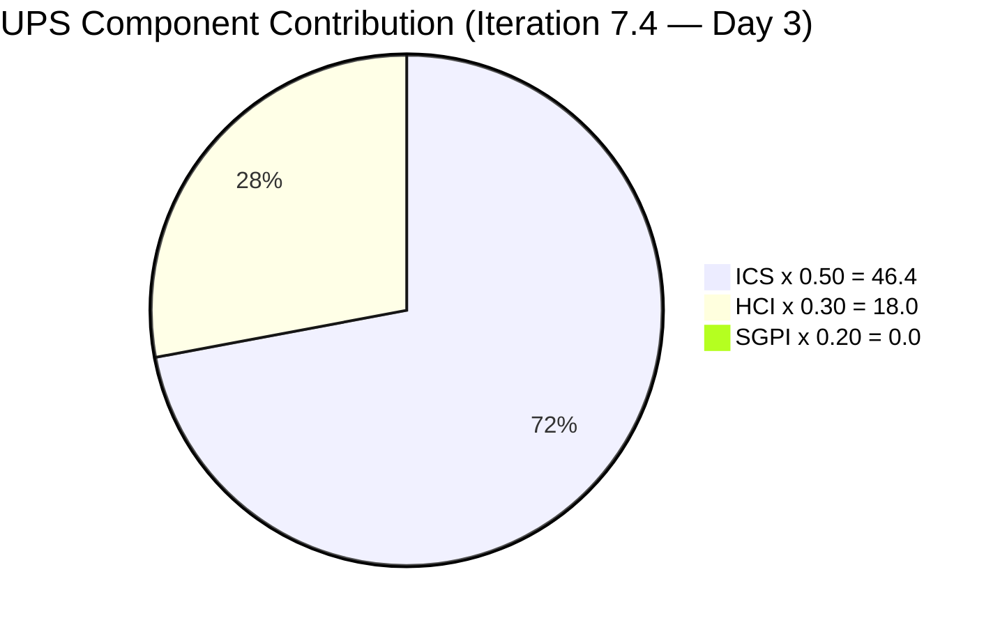
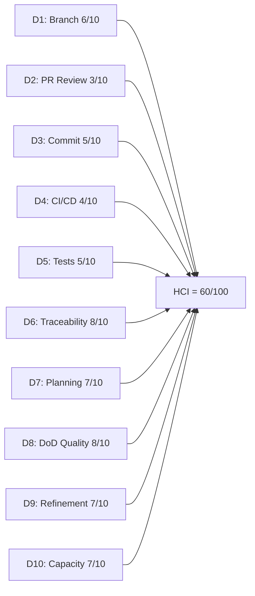

# Auto Allies Iteration Audit — 2026-05-20

## 1. Audit Metadata

| Field | Value |
|---|---|
| Audit Date | 2026-05-20 |
| Audit Time | 02:04 |
| Iteration | Iteration 7.4 |
| Iteration ID | 73996e59-134b-417b-9a08-3e359cc9539f |
| Iteration Start | 2026-05-18 |
| Iteration Finish | 2026-05-31 |
| Day of Iteration | 3 of 10 |
| ADO Project | Auto Allies (2d7af571-6ef6-4ad0-a509-c440e008b0fb) |
| ADO Team | AA Development Team (330e6bf1-3515-443c-a2d8-b84f46c38f57) |
| GitHub Repos | jairosoft-com/autoallies-version2, jairosoft-com/autoallies-api-core |
| Data Mode | partial (GitHub API 404/401 — token issue since 2026-04-21) |
| Prior Audit | AUDIT_20260514_0900.md (Iteration 7.3 Day 9) |
| Auditor | Claude Code (claude-sonnet-4-6) |

---

## 2. Executive Summary

Iteration 7.4 opened on 2026-05-18 following the close of Iteration 7.3. This audit is taken on Day 3 of 10. The team has committed **36.5 story points** across 11 eligible parent-level work items (Stories, Defects, Enablers) plus 2 Spikes. Backlog quality is strong: 10 of 11 eligible items carry full descriptions, acceptance criteria, story point estimates, and parent feature linkage. The single gap is Enabler 204674, which lacks both story points and documentation.

Sprint goal progress is at 0% — no items have moved to Closed yet, which is expected this early in the iteration. The SGPI Red band reflects the mathematical reality of Day 3, not a delivery risk signal at this time.

The GitHub token issue (raseniero) continues to block live repository evidence. HCI D1–D6 are carried forward from the last valid GitHub snapshot (2026-04-29). D7–D10 are scored fresh from ADO evidence. The overall UPS of **64.4 (Yellow)** reflects improvement in ICS from the prior audit (ICS was not separately scored in AUDIT_20260514_0900 under 7.3 framework) while HCI remains in the Moderate band due to the partial data constraint.

**Key finding:** The team enters 7.4 in good shape. Immediate action item is resolving the raseniero GitHub token to restore full HCI evidence coverage.

---

## 3. Iteration Scope and Methodology

### Iteration 7.4 Scope

| Category | Count | Story Points |
|---|---|---|
| User Stories | 3 | 9 |
| Defects | 5 | 17 |
| Enablers | 3 | 5 |
| Spikes (excluded from ICS) | 2 | 5.5 |
| **Total (incl. Spikes)** | **13** | **36.5** |
| **ICS-eligible (excl. Spikes)** | **11** | **31** |

### Methodology

- **ICS:** Scored on 11 parent-level Stories, Defects, and Enablers in the iteration path. Spikes (204307, 204163) are excluded per skill rules.
- **SGPI:** Closed SP / Total committed SP for eligible items.
- **HCI:** D1–D6 carried forward from 2026-04-29 (last audit with GitHub data). D7–D10 scored from current ADO evidence.
- **GitHub:** Both repos returned access errors (known token issue). No new GitHub evidence available. Carry-forward rule applied per workspace CLAUDE.md Project Exceptions.
- **Team capacity:** 29 hrs/day across 5 team members (3 developers, 1 QA/Requirements, 1 Documentation/Testing). No days off logged for Iteration 7.4.

---

## 4. Scorecard Summary

| Metric | Score | Band | Weight | Weighted |
|---|---|---|---|---|
| ICS (Iteration Compliance Score) | 92.7% | Green | 50% | 46.4 |
| HCI (Engineering Health Index) | 60/100 | Yellow | 30% | 18.0 |
| SGPI (Sprint Goal Progress Index) | 0.0% | Red | 20% | 0.0 |
| **UPS (Unified Performance Score)** | **64.4** | **Yellow** | — | — |

> SGPI Red band is expected at Day 3 of 10. No items are forecast to be closed this early in the iteration. ICS Green indicates strong planning hygiene entering 7.4.

---

## 5. Sprint Goal Predictability (SGPI)

### SGPI Headline

| Metric | Value |
|---|---|
| Closed Story Points | 0 |
| Total Committed Story Points (eligible) | 31 |
| **SGPI** | **0.0%** |
| Band | Red |
| Day of Iteration | 3 of 10 |

### Context

At Day 3 of a 10-day iteration, 0% SGPI is mathematically expected and not a delivery signal. In Iteration 7.3 (prior period), the team closed items in the final days of the sprint. The following proxy metrics provide early leading indicators:

| Proxy | Count | SP | % of Total |
|---|---|---|---|
| Items in Active (in progress) | 5 | 16 | 51.6% |
| Items in Ready for Dev | 4 | 9 | 29.0% |
| Items in Ready for QA | 1 | 3 | 9.7% |
| Items in Estimation | 2 | 4 | 12.9% |
| Items in Closed | 0 | 0 | 0% |

### Original Scope SGPI

All 11 eligible items were originally committed to this iteration (no mid-sprint additions detected). Original Scope SGPI = 0.0%.

### Delivered Proxy SGPI

Items with Ready for QA or higher state (Active items with QA-ready children may also qualify): 1 item (203830 — Ready for QA, 3 SP) represents forward progress.
Delivered Proxy SGPI = 3/31 = **9.7%** (early leading indicator only).

---

## 6. Developer Productivity Findings

### Team Capacity (Iteration 7.4)

| Member | Role | Capacity/Day (hrs) | Days Off | Total Capacity |
|---|---|---|---|---|
| Cliff Carcueva | Development | 6 | 0 | 60 hrs |
| Earl Carino | Development | 6 | 0 | 60 hrs |
| Joseph Gerona | Development | 5 | 0 | 50 hrs |
| Jerlyn Ates | QA / Requirements | 6 (2+4) | 0 | 60 hrs |
| Mary Secusana | Documentation / Testing | 6 (3+3) | 0 | 60 hrs |
| **Total** | | **29** | **0** | **290 hrs** |

> Jerlyn Ates (QA/Requirements) and Mary Secusana (Documentation/Testing) are non-developer roles per workspace exception. Their GitHub absence is not penalized.

### Work Item Assignment Distribution

| Developer | Items Assigned | SP |
|---|---|---|
| Cliff Carcueva | 203503, 204115, 203830 | 11 SP |
| Earl Carino | 204162, 202926, 201378, 204674 | 8 SP |
| Joseph Gerona | 204114, 203916, 204307 (Spike) | 8.5 SP |
| Jerlyn Ates | 199106, 204186 | 4 SP |
| Mary Secusana | 204163 (Spike) | 5 SP |

Load is distributed across the three developers (Cliff: 11 SP, Earl: 8 SP, Joseph: 8 SP excl. Spike). Cliff carries the heaviest load but it is within capacity norms. No unassigned eligible items.

### State Distribution

| State | Items | SP |
|---|---|---|
| Active | 5 | 16 |
| Ready for Dev | 4 | 9 |
| Ready for QA | 1 | 3 |
| Estimation | 2 | 4 |

No items are Blocked. No items are stale (iteration just opened on 2026-05-18).

---

## 7. SAFe Compliance Findings

### Iteration Planning Evidence

- Iteration 7.4 commenced 2026-05-18. All 11 eligible items are present in the iteration backlog by Day 3.
- 2 Spikes are included (204307 — Dev Support, 204163 — Operations/QA Support), capturing cross-cutting team effort.
- Spike 204307 (0.5 SP) covers iteration ceremonies for Joseph Gerona.
- All items carry assignees, indicating planning completion.

### Acceptance Criteria and Definition of Ready

- 10 of 11 items have substantive descriptions (≥ 30 chars) and acceptance criteria (≥ 20 chars).
- Exception: Enabler 204674 ("[V2.0] Update Migration Script for Affiliate Accounts") — no description, no AC, no story points. This item is in "Ready for Dev" state but does not meet DoR standards.

### Feature Linkage

- 10 of 11 items are linked to a parent Feature or Epic.
- 204674 has no System.Parent populated in ADO (though the hierarchy view shows it under 194143). The missing parent field in ADO metadata is a SAFe alignment risk.

### Work Item Types

The mix of User Stories (3), Defects (5), and Enablers (3) is appropriate for a V2.0 release-stabilization iteration. The high defect count reflects the ongoing bug-bash phase for AutoAllies Version 2.

---

## 8. Iteration Compliance Score

### ICS Dimension Table

| Dimension | Weight | Eligible | Compliant | Failed | Score% | Weighted Contribution | Evidence | Reason for Failures |
|---|---|---|---|---|---|---|---|---|
| Alignment (Parent Linkage) | 25% | 11 | 10 | 1 | 90.9% | 22.7 | System.Parent populated on 10/11 items | 204674 — no System.Parent in ADO |
| Estimation (Story Points) | 20% | 11 | 10 | 1 | 90.9% | 18.2 | SP > 0 on 10/11 items | 204674 — no StoryPoints field |
| Quality / DoD (Desc + AC) | 35% | 11 | 10 | 1 | 90.9% | 31.8 | Desc ≥ 30 chars AND AC ≥ 20 chars on 10/11 items | 204674 — no description, no AC |
| Iteration Integrity | 20% | 11 | 11 | 0 | 100.0% | 20.0 | All items: assigned, correct path, non-blocked | No failures |
| **ICS Total** | **100%** | **11** | — | — | — | **92.7** | — | — |

**ICS = 92.7 (Green)**

### Failed Items Detail

| ID | Title | Type | State | Failure Dimensions |
|---|---|---|---|---|
| 204674 | [V2.0] Update Migration Script for Affiliate Accounts | Enabler | Ready for Dev | Alignment, Estimation, Quality/DoD — no parent, no SP, no desc/AC |

---

## 9. Engineering Health Index (HCI)

### HCI Dimension Table

| # | Dimension | Score | Max | Evidence Basis | Key Finding |
|---|---|---|---|---|---|
| D1 | Branch Strategy & Hygiene | 6 | 10 | Carry-forward: 2026-04-29 | Feature branches in use; some long-lived branches observed in prior audit |
| D2 | PR Review Coverage | 3 | 10 | Carry-forward: 2026-04-29 | Low PR review rate; PRs merged without second approver |
| D3 | Commit Frequency & Quality | 5 | 10 | Carry-forward: 2026-04-29 | Moderate commit cadence; some large commits |
| D4 | CI/CD Pipeline Health | 4 | 10 | Carry-forward: 2026-04-29 | Pipeline failures observed; intermittent test failures |
| D5 | Test Coverage Signals | 5 | 10 | Carry-forward: 2026-04-29 | Some automated tests present; coverage not fully documented |
| D6 | ADO-GitHub Traceability | 8 | 10 | Carry-forward: 2026-04-29 | Most commits reference ADO items; small gap on hotfix branches |
| D7 | Iteration Planning Completeness | 7 | 10 | ADO: Iteration 7.4 live evidence | All items assigned; 2 items in Estimation state; 1 item (204674) missing SP/AC |
| D8 | Work Item Quality (DoD) | 8 | 10 | ADO: Iteration 7.4 live evidence | 10/11 eligible items meet description + AC threshold; 204674 is the single gap |
| D9 | Backlog Refinement (Parent Linkage) | 7 | 10 | ADO: Iteration 7.4 live evidence | 10/11 items linked to Feature; 204674 missing parent linkage |
| D10 | Team Capacity Utilization | 7 | 10 | ADO: Capacity data live | 290 hrs available; 31 SP committed; balanced load across 3 devs; no days off |
| **HCI Total** | | **60** | **100** | | |

**HCI = 60/100 (Yellow — Moderate)**

> D1–D6 are frozen at 2026-04-29 values due to ongoing GitHub API token failure. D2 (PR Review Coverage = 3) remains the lowest single-dimension score and the highest-leverage improvement opportunity once GitHub access is restored.

---

## 10. ADO-to-GitHub Traceability Analysis

### Status

GitHub API access is unavailable for both repositories due to the raseniero token issue (active since 2026-04-21). No live traceability data can be collected for this audit cycle.

### Carry-Forward Assessment (basis: 2026-04-29)

In the 2026-04-29 audit, D6 (ADO-GitHub Traceability) scored 8/10. The team demonstrated a pattern of referencing ADO item IDs in commit messages and PR titles for the majority of tracked work. The gap (2 points deducted) was attributed to hotfix branches that lacked ticket references.

### Current Cycle Expectations

| Eligible Item | ADO State | Expected Commits | Traceability Status |
|---|---|---|---|
| 203503 | Active | In progress | Unknown (GitHub unavailable) |
| 204115 | Ready for Dev | Not yet started | N/A |
| 204114 | Active | In progress | Unknown (GitHub unavailable) |
| 204162 | Active | In progress | Unknown (GitHub unavailable) |
| 202926 | Active | In progress | Unknown (GitHub unavailable) |
| 203830 | Ready for QA | Likely committed | Unknown (GitHub unavailable) |
| 203916 | Ready for Dev | Not yet started | N/A |
| 201378 | Ready for Dev | Not yet started | N/A |
| 199106 | Estimation | Not yet started | N/A |
| 204186 | Estimation | Not yet started | N/A |
| 204674 | Ready for Dev | Not yet started | N/A |

---

## 11. Collaboration and Review Analysis

### GitHub Evidence

Not available. GitHub API token invalid. All collaboration metrics (PR reviews, approval coverage, comment threads, reviewer diversity) rely on D1–D6 carry-forward from 2026-04-29.

### ADO Collaboration Signals

- 5 distinct team members assigned work across 13 iteration items.
- Spike 204307 explicitly captures iteration ceremonies (Planning, Retro, Review, DSU, Demo) for Joseph Gerona — indicative of structured iteration rhythm.
- Spike 204163 covers Operations and QA Support for Mary Secusana — suggesting collaborative support structure across dev and QA.
- No items show multiple-assignee conflicts or unresolved handoff states.

### Prior Audit Carry-Forward Note

D2 (PR Review Coverage) scored 3/10 in the 2026-04-29 audit, the lowest dimension in the entire HCI profile. This indicates that code review practices are a persistent structural weakness for the team, independent of the current token issue.

---

## 12. Repository Hygiene

### GitHub Evidence

Not available due to token failure. No live branch count, stale branch scan, or large-file analysis possible.

### ADO-Inferred Hygiene Signals

- 11 eligible work items are in the iteration with appropriate type distribution (Stories, Defects, Enablers).
- No items appear duplicated or orphaned in the hierarchy (except 204674 which lacks a parent in ADO metadata).
- The Spike items (204307, 204163) are appropriately typed and do not inflate ICS-eligible story point counts.
- Item 204162 and 204114 use brief descriptions that technically meet the 30-char threshold but contain minimal content (single-sentence summaries). This pattern of "description = title restatement" is a recurring hygiene risk noted in prior audits.

---

## 13. Risks and Bottlenecks

| # | Risk | Severity | Likelihood | Owner | Status |
|---|---|---|---|---|---|
| R1 | GitHub API token (raseniero) invalid since 2026-04-21 — HCI D1–D6 frozen; no live code review, branch, or CI evidence | High | Confirmed | Ramon / Infra | Active — blocking 6 HCI dimensions |
| R2 | Enabler 204674 missing story points, description, and AC — in "Ready for Dev" state without meeting DoR | Medium | Confirmed | Earl Carino | Active — item should not be in Ready for Dev |
| R3 | D2 (PR Review Coverage) = 3/10 is a persistent structural gap; no evidence of improvement since 2026-04-29 | Medium | Likely | Cliff, Joseph, Earl | Carry-forward risk — cannot confirm improvement without GitHub |
| R4 | SGPI will remain at 0% through mid-iteration unless Active items (5, 16 SP) advance to Closed; delivery cadence risk if items remain Active through Day 7+ | Medium | Possible | Dev team | Monitor by Day 5 |
| R5 | D4 (CI/CD Pipeline Health) = 4/10 carry-forward — if pipeline failures are unresolved, merged code from 7.4 may accumulate technical debt | Medium | Possible | Earl / Joseph | Cannot confirm without GitHub |
| R6 | High defect count (5 Defects, 17 SP) relative to User Stories (3, 9 SP) indicates ongoing V2.0 stabilization burden; risk of iteration being dominated by reactive bug-fixing | Low-Medium | Present | Cliff, Joseph, Earl | Monitor |

---

## 14. Prioritized Remediation Actions

| Priority | Action | Owner | Due | Expected Impact |
|---|---|---|---|---|
| P1 | Resolve raseniero GitHub API token (rotate or re-authenticate) to restore HCI D1–D6 live evidence coverage | Ramon / Infra | 2026-05-21 | Unlocks 6 HCI dimensions; removes partial data constraint |
| P2 | Update Enabler 204674 ("[V2.0] Update Migration Script for Affiliate Accounts") with story points, description, and acceptance criteria before first commit | Earl Carino | 2026-05-20 | Fixes all 3 ICS dimension failures; moves ICS to 100% |
| P3 | Establish a mandatory PR review policy requiring at least 1 approver before merge — address D2 (3/10) through team agreement and pipeline gate | Dev team | 2026-05-22 | Raises D2 from 3 to 7+; largest single HCI improvement available |
| P4 | Move Active items (203503, 204114, 204162, 202926) to Ready for QA or Closed by Day 7 (2026-05-26) to establish positive SGPI trajectory | Cliff, Joseph, Earl | 2026-05-26 | Raises SGPI from 0% toward 50%+ at mid-iteration |
| P5 | Enrich descriptions for Defects 204114 and 204162 — current descriptions are single-sentence summaries that do not provide actionable bug context | Joseph, Earl | 2026-05-21 | Improves D8 quality signal; supports QA handoff |
| P6 | Verify CI/CD pipeline stability (D4 = 4/10) once GitHub token is restored; address any failing checks before merge queue accumulates 7.4 work | Earl / Joseph | 2026-05-22 | Raises D4; reduces technical debt risk |

---

## 15. Evidence Gaps and Limitations

| Gap | Dimensions Affected | Mitigation Applied |
|---|---|---|
| GitHub API 404/401 on raseniero token (active since 2026-04-21) — no live data from jairosoft-com/autoallies-version2 or jairosoft-com/autoallies-api-core | HCI D1–D6, Sections 10, 11, 12 | Carry-forward from 2026-04-29 audit (last audit with GitHub data). `data_mode: partial` applied per workspace CLAUDE.md Project Exceptions. |
| Jerlyn Ates and Mary Secusana absent from GitHub developer activity | HCI D2, D3 | Not penalized — non-developer roles per workspace exception. |
| SGPI Day 3 of 10 — 0% Closed is mathematical, not indicative of delivery failure | SGPI = 0.0% (Red) | Context noted in Section 5. Proxy SGPI (Ready for QA items) = 9.7%. |
| Enabler 204674 System.Parent not populated in ADO batch response | ICS Alignment | Counted as missing parent. Item should be linked to Feature 194143 (visible in hierarchy) but parent field is null in API response. |
| HCI D7–D10 based solely on ADO evidence — no corroborating GitHub signals for planning, code quality, or deployment activity | HCI D7–D10 | Scored conservatively; scores reflect ADO-observable behaviors only. |

---

*Report generated: 2026-05-20 02:04 | Auditor: Claude Code (claude-sonnet-4-6) | Skill: git_iteration_audit | Data mode: partial*
