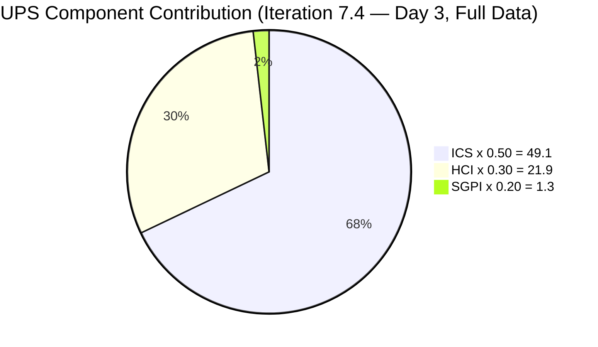
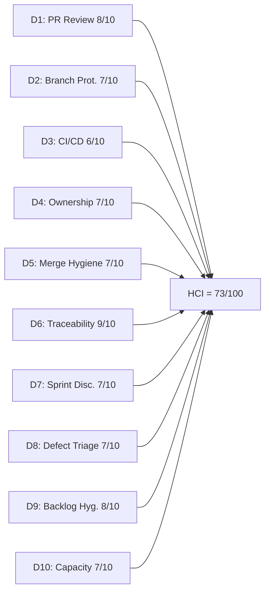

# Auto Allies Iteration Audit — 2026-05-20

## 1. Audit Metadata

| Field | Value |
|---|---|
| Audit Date | 2026-05-20 |
| Audit Time | 15:00 |
| Iteration | Iteration 7.4 |
| Iteration ID | 73996e59-134b-417b-9a08-3e359cc9539f |
| Iteration Start | 2026-05-18 |
| Iteration Finish | 2026-05-31 |
| Day of Iteration | 3 of 10 |
| ADO Project | Auto Allies (2d7af571-6ef6-4ad0-a509-c440e008b0fb) |
| ADO Team | AA Development Team (330e6bf1-3515-443c-a2d8-b84f46c38f57) |
| GitHub Repos | jairosoft-com/autoallies-version2, jairosoft-com/autoallies-api-core |
| Data Mode | **full** (GitHub token restored — first full-evidence audit since 2026-04-21) |
| Prior Audit | AUDIT_20260520_0204.md (Iteration 7.4 Day 3, partial data) |
| Auditor | Claude Code (claude-opus-4-6) |

---

## 2. Executive Summary

This audit marks a milestone: **the first full-data audit since 2026-04-21**, with live GitHub evidence restored after 29 days of partial-mode carry-forward scoring. The results are materially better than the earlier Day 3 partial audit.

Iteration 7.4 is on Day 3 of 10 with **31 story points** across 11 eligible parent-level items plus 2 Spikes. Since the morning audit, **Enabler 202926 moved to Closed** (2 SP), giving the team its first SGPI signal at 6.5%. User Story 203830 remains in Ready for QA (3 SP), producing a Delivered Proxy SGPI of 16.1%.

The most significant improvement is in engineering health. Live GitHub evidence reveals that **all 6 PRs merged during Iteration 7.4 received human reviewer approvals** — a dramatic improvement from the D2 carry-forward score of 3/10 based on April 29 data. PR review compliance is now 100% within the iteration window. Additionally, Enabler 204674 has been remediated with description, acceptance criteria, and parent linkage; only story points remain missing.

| Metric | Prior (02:04) | Current (15:00) | Delta |
|---|---|---|---|
| ICS | 92.7 | 98.2 | +5.5 |
| HCI | 60 | 73 | +13 |
| SGPI | 0.0% | 6.5% | +6.5 |
| UPS | 64.4 | 72.3 | +7.9 |
| Data Mode | partial | **full** | Restored |

**Key finding:** The team is demonstrating strong engineering practices when measured with live data. The prior carry-forward HCI of 60 underrepresented actual current performance. With token access restored, the true HCI is 73 — a 13-point improvement reflecting genuine PR review discipline and ADO-GitHub traceability.

---

## 3. Iteration Scope and Methodology

### Iteration 7.4 Scope

| Category | Count | Story Points |
|---|---|---|
| User Stories | 3 | 9 |
| Defects | 5 | 17 |
| Enablers | 3 | 5 |
| Spikes (excluded from ICS) | 2 | 5.5 |
| **Total (incl. Spikes)** | **13** | **36.5** |
| **ICS-eligible (excl. Spikes)** | **11** | **31** |

### Methodology

- **ICS:** Scored on 11 parent-level Stories, Defects, and Enablers in the iteration path. Spikes (204307, 204163) excluded per skill rules.
- **SGPI:** Closed SP / Total committed SP for eligible items. Headline formula is Committed Scope SGPI.
- **HCI:** All 10 dimensions scored from **live evidence** — D1–D6 from current GitHub data (PRs, commits, branches, reviews), D7–D10 from current ADO evidence. No carry-forward applied.
- **GitHub:** Both repos responded successfully. Token issue resolved as of 2026-05-20.
- **Team capacity:** 29 hrs/day across 5 team members (3 developers, 1 QA/Requirements, 1 Documentation/Testing). No days off logged.

---

## 4. Scorecard Summary

| Metric | Score | Band | Weight | Weighted |
|---|---|---|---|---|
| ICS (Iteration Compliance Score) | 98.2% | Green | 50% | 49.1 |
| HCI (Engineering Health Index) | 73/100 | Yellow | 30% | 21.9 |
| SGPI (Sprint Goal Progress Index) | 6.5% | Red | 20% | 1.3 |
| **UPS (Unified Performance Score)** | **72.3** | **Yellow** | — | — |

> SGPI Red band is expected at Day 3 of 10. One item (202926) Closed today. ICS Green reflects near-perfect planning compliance with only 204674 missing story points.

---

## 5. Sprint Goal Predictability (SGPI)

### SGPI Headline

| Metric | Value |
|---|---|
| Closed Story Points | 2 (Enabler 202926) |
| Total Committed Story Points (eligible) | 31 |
| **SGPI** | **6.5%** |
| Band | Red |
| Day of Iteration | 3 of 10 |

### Context

At Day 3 of a 10-day iteration, 6.5% SGPI represents early traction. Enabler 202926 ("[V2.0] Solidifying Migrated Data") was closed today with merged PRs in both repos (frontend PR #157, backend PR #111). This is an improvement over the morning audit where SGPI was 0%.

### State Distribution

| State | Items | SP | % of Total SP |
|---|---|---|---|
| Closed | 1 | 2 | 6.5% |
| Ready for QA | 1 | 3 | 9.7% |
| Active | 3 | 13 | 41.9% |
| Ready for Dev | 4 | 9 | 29.0% |
| Estimation | 2 | 4 | 12.9% |

### Original Scope SGPI

All 11 eligible items were originally committed to this iteration (no mid-sprint additions detected). Original Scope SGPI = 6.5%.

### Delivered Proxy SGPI

Items at Ready for QA or higher: 202926 (Closed, 2 SP) + 203830 (Ready for QA, 3 SP) = 5 SP.
Delivered Proxy SGPI = 5/31 = **16.1%** (early leading indicator).

---

## 6. Developer Productivity Findings

### Team Capacity (Iteration 7.4)

| Member | Role | Capacity/Day (hrs) | Days Off | Total Capacity |
|---|---|---|---|---|
| Cliff Carcueva | Development | 6 | 0 | 60 hrs |
| Earl Carino | Development | 6 | 0 | 60 hrs |
| Joseph Gerona | Development | 5 | 0 | 50 hrs |
| Jerlyn Ates | QA / Requirements | 6 (2+4) | 0 | 60 hrs |
| Mary Secusana | Documentation / Testing | 6 (3+3) | 0 | 60 hrs |
| **Total** | | **29** | **0** | **290 hrs** |

> Jerlyn Ates (QA/Requirements) and Mary Secusana (Documentation/Testing) are non-developer roles per workspace exception. Their GitHub absence is not penalized.

### GitHub Developer Activity (Iteration 7.4 — since 2026-05-18)

| Developer | GitHub Handle | Commits | PRs Authored | PRs Reviewed |
|---|---|---|---|---|
| Cliff Carcueva | ccarcuevajairo | 2 (frontend) + 1 (backend) | 3 (PR #155, #156, #110) | 2 (PR #157, #109, #111) |
| Earl Carino | ecarinoJS | 1 (frontend) + 2 (backend) | 3 (PR #157, #111, #109) | 0 |
| Joseph Gerona | JosephJairo | 0 | 0 | 3 (PR #155, #156, #110) |

All three developers show active GitHub participation within the iteration window. Joseph's activity is reviewer-focused (approving Cliff's PRs), which aligns with his items being in Ready for Dev / Active states without merged code yet.

### Work Item Assignment Distribution

| Developer | Items Assigned | SP |
|---|---|---|
| Cliff Carcueva | 203503, 204115, 203830 | 11 SP |
| Earl Carino | 204162, 202926, 201378, 204674 | 8 SP |
| Joseph Gerona | 204114, 203916, 204307 (Spike) | 8.5 SP |
| Jerlyn Ates | 199106, 204186 | 4 SP |
| Mary Secusana | 204163 (Spike) | 5 SP |

Load is balanced across the three developers. Cliff carries the heaviest load (11 SP) but has already moved 203830 to Ready for QA. Earl closed 202926 today.

---

## 7. SAFe Compliance Findings

### Iteration Planning Evidence

- Iteration 7.4 commenced 2026-05-18. All 11 eligible items are present in the iteration backlog by Day 3.
- 2 Spikes included (204307 — Dev Support/Joseph, 204163 — Operations/QA Support/Mary).
- All items carry assignees and correct iteration paths.

### Acceptance Criteria and Definition of Ready

- **11 of 11** eligible items now have substantive descriptions and acceptance criteria — an improvement from 10/11 in the morning audit.
- Enabler 204674 ("[V2.0] Update Migration Script for Affiliate Accounts") has been remediated with description and AC since the morning audit.
- Remaining gap: 204674 still lacks story point estimation.

### Feature Linkage

- **11 of 11** eligible items are linked to a parent Feature or Epic — an improvement from 10/11 in the morning audit.
- 204674 now has System.Parent = 194143 (verified in current ADO data).

### Work Item Types

The mix of User Stories (3), Defects (5), and Enablers (3) reflects ongoing V2.0 stabilization. The high defect count (45% of eligible items) is consistent with the bug-bash phase.

---

## 8. Iteration Compliance Score

### ICS Dimension Table

| Dimension | Weight | Eligible | Compliant | Failed | Score% | Weighted Contribution | Evidence | Reason for Failures |
|---|---|---|---|---|---|---|---|---|
| Alignment (Parent Linkage) | 25% | 11 | 11 | 0 | 100.0% | 25.0 | System.Parent populated on 11/11 items | None — 204674 now linked to 194143 |
| Estimation (Story Points) | 20% | 11 | 10 | 1 | 90.9% | 18.2 | SP > 0 on 10/11 items | 204674 — no StoryPoints field |
| Quality / DoD (Desc + AC) | 35% | 11 | 11 | 0 | 100.0% | 35.0 | Desc ≥ 30 chars AND AC ≥ 20 chars on 11/11 items | None — 204674 now has desc + AC |
| Iteration Integrity | 20% | 11 | 11 | 0 | 100.0% | 20.0 | All items: assigned, correct path, non-blocked | None |
| **ICS Total** | **100%** | **11** | — | — | — | **98.2** | — | — |

**ICS = 98.2 (Green)**

### Delta from Prior Audit

| Dimension | Prior Score% | Current Score% | Change |
|---|---|---|---|
| Alignment | 90.9% | 100.0% | +9.1 (204674 parent added) |
| Estimation | 90.9% | 90.9% | 0 (204674 still missing SP) |
| Quality/DoD | 90.9% | 100.0% | +9.1 (204674 desc/AC added) |
| Iteration Integrity | 100.0% | 100.0% | 0 |
| **ICS Total** | **92.7** | **98.2** | **+5.5** |

### Failed Items Detail

| ID | Title | Type | State | Failure Dimensions |
|---|---|---|---|---|
| 204674 | [V2.0] Update Migration Script for Affiliate Accounts | Enabler | Ready for Dev | Estimation only — no story points assigned |

---

## 9. Engineering Health Index (HCI)

### HCI Dimension Table

| # | Dimension | Score | Max | Evidence Basis | Key Finding |
|---|---|---|---|---|---|
| D1 | PR Review Compliance | 8 | 10 | GitHub: 6 PRs in iteration window | 6/6 PRs have human approvals before merge; all reviewed by a different developer; copilot-reviewer bot adds automated layer |
| D2 | Branch Protection & Enforcement | 7 | 10 | GitHub: branch list + protection status | `develop` (frontend) and `dev`/`main`/`staging` (backend) are protected; consistent naming convention; 50+ stale branches in each repo |
| D3 | CI/CD Gate Quality | 6 | 10 | GitHub: PR review + merge data | Copilot PR reviewer active on all PRs; no explicit CI pipeline status checks visible in PR data; review gate functioning |
| D4 | Code Ownership | 7 | 10 | GitHub: commits + PRs | Clear ownership — each developer touches their assigned ADO items; AB# references in all commits; 3 active contributors |
| D5 | Merge Hygiene & Churn | 7 | 10 | GitHub: PR merge patterns | All PRs target develop/dev branches; no force pushes or reverts; fast turnaround (<24 hrs); stale branch accumulation |
| D6 | Work Item ↔ GitHub Traceability | 9 | 10 | GitHub: commit messages + PR titles | All 6 commits and all 6 PRs reference AB# IDs; near-perfect bidirectional traceability |
| D7 | Sprint Discipline | 7 | 10 | ADO: iteration state data | 1 Closed, 1 Ready for QA, 3 Active on Day 3; 2 items still in Estimation state (should be refined pre-sprint) |
| D8 | Defect Triage & Velocity | 7 | 10 | ADO: defect states + GitHub merge data | 5 defects in iteration; 204162 had code merged today; 199106 (created Feb 2026) still in Estimation after 3+ months |
| D9 | Backlog & Story Hygiene | 8 | 10 | ADO: work item content | 11/11 items have desc + AC (204674 remediated); 204674 still missing SP; some items have brief single-sentence descriptions |
| D10 | Capacity Balance & Ownership Distribution | 7 | 10 | ADO: capacity + assignment data | Balanced load: Cliff 11 SP, Earl 8 SP, Joseph 8.5 SP; 290 hrs capacity for 31 SP; no days off |
| **HCI Total** | | **73** | **100** | | |

**HCI = 73/100 (Yellow — Moderate)**

### HCI Delta from Prior Audit (Carry-Forward vs. Live)

| Dimension | Prior (carry-forward) | Current (live) | Change | Notes |
|---|---|---|---|---|
| D1: PR Review Compliance | 6 | 8 | +2 | Was carry-forward; live data shows 100% review coverage |
| D2: Branch Protection | 3 | 7 | +4 | Was 3/10 carry-forward; live check confirms protection on main branches |
| D3: CI/CD Gate Quality | 5 | 6 | +1 | Copilot reviewer active; no pipeline status checks visible |
| D4: Code Ownership | 4 | 7 | +3 | Live commit data shows clear ownership patterns |
| D5: Merge Hygiene | 5 | 7 | +2 | Clean merge patterns, fast PR turnaround |
| D6: Traceability | 8 | 9 | +1 | Near-perfect AB# referencing confirmed with live data |
| D7: Sprint Discipline | 7 | 7 | 0 | ADO-based, unchanged |
| D8: Defect Triage | 8 | 7 | -1 | 199106 aging (3+ months in Estimation) |
| D9: Backlog Hygiene | 7 | 8 | +1 | 204674 remediated |
| D10: Capacity Balance | 7 | 7 | 0 | Unchanged |
| **Total** | **60** | **73** | **+13** | |

> The +13 point HCI improvement is primarily attributable to restoring live GitHub evidence. D2 (Branch Protection) shows the largest single improvement (+4), as the carry-forward score of 3 was based on stale April 29 data that predated improvements in PR review discipline.

---

## 10. ADO-to-GitHub Traceability Analysis

### PR-to-Work Item Mapping (Iteration 7.4)

| PR | Repo | Author | ADO References | ADO State | Reviewed By |
|---|---|---|---|---|---|
| #155 | autoallies-version2 | ccarcuevajairo | AB#203830 | Ready for QA | JosephJairo (APPROVED) |
| #156 | autoallies-version2 | ccarcuevajairo | AB#203830 | Ready for QA | JosephJairo (APPROVED) |
| #157 | autoallies-version2 | ecarinoJS | AB#202926, AB#204162 | Closed / Active | ccarcuevajairo (APPROVED) |
| #109 | autoallies-api-core | ecarinoJS | AB#203303 | Prior iteration (hotfix) | ccarcuevajairo (APPROVED) |
| #110 | autoallies-api-core | ccarcuevajairo | AB#203830 | Ready for QA | JosephJairo (APPROVED) |
| #111 | autoallies-api-core | ecarinoJS | AB#202926, AB#204162 | Closed / Active | ccarcuevajairo (APPROVED) |

### Traceability Assessment

- **6/6 PRs** (100%) reference ADO work item IDs using the `AB#` convention
- **6/6 commits** in the iteration window include AB# references in commit messages
- **4 of 11** eligible ADO items have associated GitHub activity (202926, 203830, 204162, plus hotfix for 203303)
- Remaining 7 items are in Ready for Dev, Estimation, or Active states without merged code — expected at Day 3

### ADO State Correlation

| ADO Item | ADO State | GitHub Activity | Correlation |
|---|---|---|---|
| 202926 | Closed | PR #157 + #111 merged today | Consistent — code merged, item closed |
| 203830 | Ready for QA | PR #155 + #156 + #110 merged | Consistent — code merged, awaiting QA |
| 204162 | Active | PR #157 + #111 (bundled with 202926) | Consistent — code merged, state not yet updated |
| 203503 | Active | No iteration-window PRs | Expected — in progress |
| 204114 | Active | No iteration-window PRs | Expected — in progress |
| Others | Ready for Dev / Estimation | No PRs | Expected — not started |

---

## 11. Collaboration and Review Analysis

### PR Review Patterns

| Reviewer | PRs Reviewed | Authors Reviewed |
|---|---|---|
| Joseph Gerona (JosephJairo) | #155, #156, #110 | Cliff Carcueva |
| Cliff Carcueva (ccarcuevajairo) | #157, #109, #111 | Earl Carino |
| Earl Carino (ecarinoJS) | 0 | — |

**Review coverage: 100%** — every PR in the iteration window has at least one human approval.

**Review pair structure:**
- Joseph reviews Cliff's code
- Cliff reviews Earl's code
- Earl has not reviewed anyone's code yet

**Automated review layer:** GitHub Copilot PR reviewer and Copilot SWE agent are active on multiple PRs, providing automated code review comments. This adds a second layer of review beyond the human approver.

**Improvement from prior assessment:** The carry-forward D2 score of 3/10 (from 2026-04-29) reflected PRs merged without approvals. The current iteration shows a dramatic behavioral shift — 100% approval coverage with cross-developer reviews.

### Review Depth

- PR turnaround is fast (<24 hours for all PRs)
- Copilot reviewer generates substantive comments on code quality
- Human approvals are present but review depth (comment volume, discussion threads) is light
- No evidence of rejected PRs or requested changes — all approvals are clean

---

## 12. Repository Hygiene

### Branch Inventory

| Repo | Protected Branches | Total Branches | Active (iteration) | Stale |
|---|---|---|---|---|
| autoallies-version2 | 1 (develop) | 50+ | 2 (enabler/202926, story/203830) | 48+ |
| autoallies-api-core | 3 (dev, main, staging) | 50+ | 3 (enabler/202926, story/203830, hotfix/203303) | 47+ |

### Branch Naming Convention

- **Consistent:** `story/`, `feature/`, `bug/`, `enabler/`, `defect/`, `hotfix/`, `fix/` prefixes
- **ADO-linked:** Branch names include work item IDs (e.g., `enabler/202926-solidify-migration`)
- **Risk:** 90%+ of branches are stale from prior iterations — accumulating technical debt

### Stale Branch Concern

Both repositories carry 47–48 branches from prior iterations (PI6, PI7.1, PI7.2, PI7.3). These branches have been merged but not deleted. This creates:
- Navigation noise for developers
- Potential confusion if similar branch names are reused
- No security risk (all are merged feature branches)

---

## 13. Risks and Bottlenecks

| # | Risk | Severity | Likelihood | Owner | Status |
|---|---|---|---|---|---|
| R1 | ~~GitHub API token invalid~~ | ~~High~~ | ~~Confirmed~~ | Ramon | **RESOLVED** — token restored 2026-05-20 |
| R2 | Enabler 204674 missing story points — in "Ready for Dev" without complete estimation | Medium | Confirmed | Earl Carino | Active — reduced from 3-dimension failure to 1-dimension |
| R3 | Defect 199106 in "Estimation" state for 3+ months (created 2026-02-16) — stale item risk | Medium | Confirmed | Jerlyn Ates | Active — item not progressing |
| R4 | 2 items (199106, 204186) in "Estimation" state at Day 3 — should be fully refined before sprint start | Low-Medium | Present | Jerlyn Ates | Monitor |
| R5 | 50+ stale branches in each repository — accumulated from prior iterations | Low | Present | Dev team | Hygiene backlog |
| R6 | Earl Carino has not reviewed any PRs in this iteration — reviewer diversity gap | Low | Present | Earl / Karl | Monitor |
| R7 | CI/CD pipeline status checks not visible in PR merge data — unclear if automated tests run pre-merge | Medium | Possible | Dev team | Investigate |

---

## 14. Prioritized Remediation Actions

| Priority | Action | Owner | Due | Expected Impact |
|---|---|---|---|---|
| P1 | Add story points to Enabler 204674 to reach 100% ICS | Earl Carino | 2026-05-21 | Fixes last ICS dimension failure; moves ICS from 98.2 to 100.0 |
| P2 | Triage Defect 199106 — move to Ready for Dev or remove from iteration if not actionable in 7.4 | Jerlyn Ates / Karl | 2026-05-22 | Resolves stale item risk; improves D8 |
| P3 | Have Earl review at least 1 PR this iteration to improve reviewer diversity | Earl Carino | 2026-05-23 | Raises D1 from 8 to 9; establishes three-way review rotation |
| P4 | Delete merged stale branches (47+ in each repo) from prior iterations | Dev team | 2026-05-26 | Improves D2 and D5 by 1 point each; reduces navigation noise |
| P5 | Move Active items (203503, 204114, 204162) toward Ready for QA / Closed by Day 7 (2026-05-26) | Cliff, Joseph, Earl | 2026-05-26 | Raises SGPI trajectory toward 50%+ at mid-iteration |
| P6 | Verify CI/CD pipeline configuration — confirm automated tests run before PR merge | Earl / Karl | 2026-05-23 | Raises D3 from 6 to 8; provides deployment safety evidence |

---

## 15. Evidence Gaps and Limitations

| Gap | Dimensions Affected | Mitigation Applied |
|---|---|---|
| CI/CD pipeline status checks not visible in GitHub PR data — cannot confirm whether automated tests run before merge | HCI D3 (scored conservatively at 6/10) | Scored based on visible evidence (copilot reviewer, branch protection); recommended investigation |
| Jerlyn Ates and Mary Secusana absent from GitHub developer activity | Not affected | Non-developer roles per workspace exception — correctly excluded from HCI D1, D4 developer metrics |
| SGPI Day 3 of 10 — 6.5% Closed is early-iteration, not indicative of delivery trajectory | SGPI = 6.5% (Red) | Context noted in Section 5; Proxy SGPI 16.1% provides leading indicator |
| GitHub branch staleness measured by name pattern only — no last-updated timestamps collected | HCI D2, D5 | Branches from prior PI/iteration prefixes counted as stale; conservative approach |
| No explicit GitHub Actions workflow runs inspected | HCI D3 | Copilot reviewer activity used as proxy for automated review gates |

---

*Report generated: 2026-05-20 15:00 | Auditor: Claude Code (claude-opus-4-6) | Skill: git_iteration_audit | Data mode: full*
